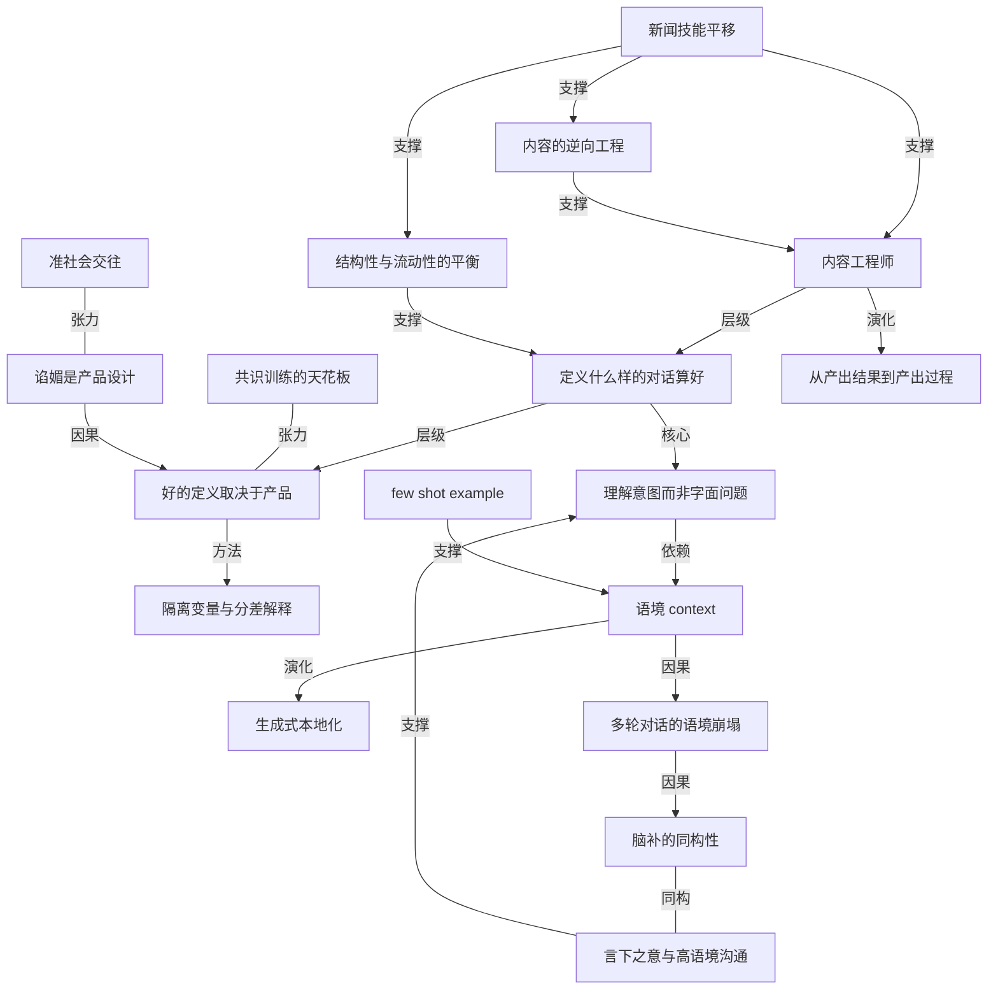

# 谁在替大模型写回答：那些从新闻业转行的人

- 原文标题：藏在大模型背后的新闻人：GPT们的回复是这样写出来的
- 作者：硅谷101
- 内参日期：2026-07-29
- 来源类型：公众号
- 原文：https://mp.weixin.qq.com/s/0TRRJif0gHlkQMzY9dfepQ
- 标签：ai 经济价值, ai 实战

> 硅谷 101 采访了一批为模型撰写训练样本的前媒体人。所谓「被 AI 击中的瞬间」，背后往往是具体的人在写。

## 导读

内容工程师。

## 核心观点

- 软件工程师让大模型「有了开口说话的能力」，而内容工程师（Content Engineer）负责定义另一件事：**什么样的对话才算是「好」**。当模型能力逐渐拉平，内容与品味成为产品竞争力的关键。
- 这个岗位的从业者，大量来自正在坍塌的新闻业和影视业。过去两年光是洛杉矶就蒸发了四万多个影视岗位（接近三分之一），美国新闻业岗位数从 2008 年至今直接腰斩。每当你被大模型的回答击中内心，写出那句话的，很可能是之前的记者、编辑和纪录片导演。
- 全篇的核心命题：**灵感、语感、品味这些「只可意会不可言传」的东西，其实是可以拆解、量化、训练和评估的技术能力**——而最会拆的人，是那些原本就在生产内容、又懂得对内容做逆向工程的人。
- 两位对谈者：前媒体人、播客《行星酒馆》主播东尼；NBCUniversal AI 战略总监 Bianca Consunji。两人都毕业于哥伦比亚大学新闻学院。

## 内容工程师：设计的不是模型，是人类的观感

- 东尼的定义最锋利：「我们设计的东西，究竟是在设计这个 AI 模型，还是在设计 AI 产品，还是在设计它的行文风格？都不是。**我们设计的是人类的观感**。」
- Meta 的招聘启事把职责写得很直白：定义什么叫「好内容」；拥有出色的品味、创作力和写作能力；能够写出让用户感到愉快、惊喜、眼前一亮的回复。要求的是内容经验、编辑经验，最好还有影视制片经验。
- 具体要写的东西之一是 system prompts 这类提示词，它「非常需要创意写作」——既要写得好，又要让模型听得懂，还要应付模型「有的时候又会傲娇」的脾气。
- Bianca 提供了另一个视角：**代码是一种技术语言，但普通语言同样具有技术性**。它有语法、句法，这些都可以被量化。大家都知道《纽约客》《纽约时报》和《每日邮报》风格不同，却说不清差别在哪；从新闻转进 AI 的人干的就是「把『是什么让《纽约客》成为《纽约客》』这件事情说清楚」，把语气、风格、声音翻译成更技术化的东西。
- 她的路径是两段式的：**先学会怎么制作内容，再去学怎么对内容进行逆向工程**。

## 「好」没有绝对答案：先定义产品，再拆属性打分

- 「好」取决于你手上的产品是什么。同一个底层模型，做一个帮你干活的智能体，和做一个假装当你男朋友的聊天机器人，是完全不同的两件事。航空公司的客服机器人还要再想清楚：这段互动的目标是帮用户解决问题，还是像真的客服那样尽快把人打发走。
- 工作方法是工程化的：不断训练、不断看输出，**把属性一项一项拆开打分，不断隔离变量**，搞清楚什么东西没那么有用。
- 最关键的一条纪律：「有的回答它可能是好的，但是只有 7 分而不是 10 分，那我们就要去解释那 3 分的差距在什么地方。」——品味的可训练性，全在这个「解释差距」的动作里。

## 理解意图，而不只是理解字面问题

- Bianca 说自己的专长是「理解意图，而不只是去理解字面的问题」，而这些「其实都是最基础的新闻能力」。
- 教学案例：用户问「Taylor Swift 会不会在麦迪逊广场花园结婚？」
- 坏回答一：「是，她会在那里结婚，以下是她的伴娘名单。」——你根本不知道这是不是真的，没有人知道。
  - 坏回答二：充满机器人腔调、机械拼接信息的回答。
  - 好回答：「我们不知道她是否真的要结婚，但现在有很多猜测认为她的婚礼可能会在麦迪逊广场花园这个地方举行」，再加入来源与归属，并承认信息具有不确定性。
- 归纳起来就是三件事：**事实性、语气，以及真正理解用户想找什么信息**。这些恰恰是「让一个新闻报道变得更好的因素」，所以要被加进训练过程。
- 反例提醒：只回答「不会」，字面上确实回答了问题，但用户体验并不满意——他要的是背景和语境。

## 语境是 AI 最大的短板，也是媒体人最大的资产

- **言下之意**：Bianca 是菲律宾人，她指出对非西方文化尤其必要——「很多真正重要的信息我们并不会去直接把它说出来」，真人对话要看表情、理解停顿，才知道没说出口的是什么。
- 由此推出一条使用建议：**多用语音输入**。语音时你不会先在脑子里反复编辑，而是直接想你要表达的东西，AI 更能捕捉细微差别。这与采访同理：口头采访远好过邮件采访，因为邮件采访「无论是被我们自己还是被对方都是过度编辑的」，对象有太多时间修饰答案，也没有人可以实时追问。
- 她最喜欢 AI 的一点，是它让人意识到**思考的速度和行动的速度不是一回事**。因此与其喂给 AI 更多材料，不如先把脑子里所有的想法、背景、你为什么会产生这个想法全都告诉模型——模型已经具备很多训练，缺的只是你把意图充分表达出来，把它的能力调用出来。
- **跨文化的生成式再创作**：AI 出现之前，内容出海只能做 translation，「Meryl Streep just won an Oscar」翻译成「梅丽尔·斯特里普赢了奥斯卡奖」就完了。生成式 AI 打开的新可能是根据各地语境再创作——谁是中国的梅丽尔·斯特里普？可能对标「斯琴高娃」；什么是中国的奥斯卡？可能是「金鸡奖或百花奖」。
- 难点在于 AI 不知道不同语境下的对应人物是谁，调教极难，还容易惹到饭圈或引发文化冲突。最适合做这件事的是娱乐记者——他们「有自己的一套非常好的娱乐界的垂直的小模型」。
  - 同类证据：国内视频生成模型出来的脸都是当下流行的帅哥美女脸，说明选人和训练数据本身有偏差；找一个懂电影、知道「电影脸」长什么样的人来做，模型质量会非常快地提升。
- **多轮对话的语境崩塌**：今年 ICLR 最佳论文研究 multi-turn conversation，把一个非常复杂的指令拆碎后一点一点喂给 AI，结果质量大幅下降。原因是 context 不够时，AI 会基于自身训练不断脑补，答案越来越臃肿；中间一旦出错，错误就像滚雪球一样越来越大。
- **人和 AI 的脑补是同构的**：东尼 2018 年关于微博的研究（香港旺角女童便溺事件引发的评论区讨论）发现，评论区里的人同样没有语境，不知道对方是谁，于是开始脑补——「你一定是这样的人」「你一定没有孩子」「你才会说出这样的话」，和善的聊天迅速变成互相辱骂。结论：**在 context 破碎的情况下，人的脑补和 AI 的脑补相差没有那么多**，人文社科的发现和 AI 行业的发现其实距离很近。

## 新闻技能如何平移到 AI 交互设计

- 东尼强调不是「迁徙」，而是「完全平移」。新闻写作与个人创意写作的根本区别在于：**脑子里一定要有一个听众**——怎么和观众拉扯，什么能说什么不能说，说了会有什么反应，怎么做到又客观又不得罪人、又保持自己又还原事实。这种平衡非常复杂，且需要训练。
- 采访过程中的实时交互（他现在说了这个，我接下来说什么，怎么把他引导到下一个问题）到了 AI 聊天的交互设计里，「其实是一种直觉性的东西」。
- **提问能力**是新闻工作最重要的一块，也完全平移到日常 AI 工作里。
- 关于 follow up question：记者的核心功夫是不完全按提纲走，受访者岔到有意思的点时，哪怕冒着偏题的风险也要追问。对应到产品上，现在的 GPT 每个问题最后基本都跟一个 follow up question——先用小模型生成两三句重新阐释问题，再分点作答，最后生成追问。
- 由此推出：**结构性与流动性之间的平衡**，是新闻访问必须做的事，也是 AI 交互设计必须做的事。而「什么时候要问、问哪一点、问的质量怎么样」需要一整套评估体系，「当然是由最会问问题的人来去建立」。
- 新闻写作对 AI 的另一层价值：很多人对 AI 提不出好问题，是因为不理解当下语境需要什么 context；而新闻写作天然要求先建立 context（前因后果），再抛出核心问题和核心论点——这套习惯在 AI 训练和交互中「实在是太有效了，屡试不爽」。

## AI Trainer 与零工经济：愤怒指错了对象

- 今年 5 月刷屏的一篇文章《我在好莱坞工作，而所有曾经做电视的人现在都在偷偷训练 AI》，作者 Ruth 是好莱坞编剧和制片人。在稿费被一拖再拖的日子里，她在求职论坛看到专门招编剧和记者的新活：**AI Trainer**——一遍遍给 AI 写出的东西打分、改写、示范，教它什么才算好剧本。
- Ruth 的自嘲：一个剑桥文学系高才生，如今要在工作群里听二十几岁的年轻人差遣，24 小时随叫随到，去抢按小时计价的零工。
- 结构性反差：一边是 5000 亿美金砸向 AI 基建、估值一路飙升；另一边是昔日辉煌的美国影视与公共媒体惶惶不可终日。
- 主持人 Faith 的自陈提供了情感锚点：她两年前从哥大新闻学院毕业，那所「普利策奖诞生的地方」在她念书那年也不再骄傲；一位教授的比喻是——今天从新闻学院毕业还想挤进这行的人，「就像是朝着一栋已经起火的大楼拼了命地往里跑」。她当时也收到过 AI Trainer、数据标注的私信，若不是焦虑到什么都做不了，她大概率会接。
- 由此逼出的质问：AI 是不是正在把创作者变成数据采集员？我们赖以为生的灵感，是否正在被拆成一个个可被标记的数据？而亲手标记它们的人，是否恰恰是我们自己？
- 东尼的三点拆解（他能体会愤怒，但对整个叙事持怀疑）：
1. **大家批判的是 AI，真正该批判的是零工经济**。媒体人和艺术从业者去打零工在 AI 之前就已经发生——现在是给东西打分，之前是开 Uber、做 DoorDash；文艺界难以为继是旧问题，且非常严重。
  1. 「教会了 AI 之后跑路」是零工经济的项目制使然；但「一个编剧打完分之后 AI 就跟编剧一样厉害」并不成立，「它从这个意义上来说没有这么聪明」。
  1. 这套叙事把创作者和 AI 对立起来，选择被压缩成「反 AI」或「把灵魂卖给 AI」。**其实有第三条路：AI 可以作为创作者的伙伴**——问题应该换成「有了 AI 之后我可以创作什么？」
- 第三条路的具体想象：编剧没有摄影机能不能搞电影？电影人没有特效预算能不能自己搞特效？从画画到摄影、从摄影到 Photoshop 再到 Blender，媒介本来就是一代一代解锁的。「现在是大家真的是饿得太惨了，以至于说大家希望是找到一个敌人，**却忘了它也可以变成一支画笔**。」

## 一个 voice agent 的调教实录：把 AI 变成画笔

- 背景：去年东尼健康出问题、请假回国治疗，有一段时间甚至不知道自己还剩多少时间。养病期间他想给自己做一个 voice agent，既能陪自己聊天，又能当播客嘉宾。
- 三次失败与一次打开的完整路径：
1. 直接用 GPT、Gemini 的语音模式——不行。它们整个 flow 和感觉是「语音助手」，不是播客播主。
  1. 只写 system prompt——不行。加了好多好多限制（「你是一个播客的播主，你需要又有趣又吸引人，不能什么什么什么」），「聊到第三句它就忘了之前的规训」。
  1. 做智能体——更糟。他先和 AI 进行三天三夜的哲学对谈（对话的本质、如何分析需求与目的），建了一个分析「我为什么要说这句话、我的目的是什么」的智能体，再叠一个情感智能体，结果「说得乱七八糟」，还不如什么 prompt 都不加的原始 agent——限制加太多，把整个 AI 搞崩了。
  1. 最终解法：把所有过往播客记录按问题和内容分开归类，**不直接全部喂给 AI**，而是每次聊天时让 AI 侦测有什么相关内容或问题，随机抽几条作参考。这种 few shot example 的方式一上，「它一下子就打开了」——AI 知道了什么是好问题、好内容、好的正确语气。
- 结果：Google 的招聘者找上门，很惊讶一个完全没有代码基础的前媒体人，用做播客的经验调教出的 Gemini Voice Agent，在多轮对话中比原生模型更生动、更灵活、更有深度。东尼的结论：「做播客也好、写文章也好，**有这种感觉和品味本身是可以帮你找到工作的**。」

## 谄媚不是行文问题，是产品设计问题

- 提问：一个越来越懂你的伙伴，会不会越来越顺着你、讨好你？网上有人说这个 AI 是奸臣、那个 AI 是忠臣；当人们更多用 AI 而不是专业记者或真实的人来获取信息和做价值讨论，会不会更活在信息茧房里，少了激烈的分歧与争吵？
- 东尼：「it is what it is。」谄媚看起来是行文问题，其实是**产品问题、产品设计**——「AI 要是天天对着你跟你呛的话，你用不用？你可能用，但是其他人用不用？」所以**设计文风、设计 AI 的态度，就是在设计 AI 产品本身**。
- 更深一层：「人就是很贪心」，既要它帮你、又要它提供情绪价值、又不能老提供情绪价值。人类作为集体想要的东西太多了，产品必须迁就，也要为自己的发展和 ROI 尽可能留住用户，于是形成「一个非常脆弱的平衡」。
- 反向要求：能不能反过来问人类——能不能更 critical thinking 一点？谄媚的东西不要信。「其实就是我们把很多面对这个世界的责任外包给了 AI。这事最终落脚点其实是在我们自己。」
- 关于事实核查的补充判断：AI 在 fact check 上效率高得多；有研究显示 AI 的事实核查反而让更多人改变了原有观点，因为你可以追问「这个事情真的是这样子吗？反方怎么说？」而只看单一信息流反而看不到这些。东尼的亲身案例：家人转发明显的假新闻，他让 ChatGPT 快速核查、自己再 fact check 一遍核查结果，发过去后家人竟然接受了，他「还是挺震撼的」。

## 共识的天花板：伟大的艺术不来自共识

- Bianca 的核心判断：**AI 是基于共识去训练的**。一件事之所以被认为正确，往往因为很多人认为它正确，标注训练就是这样一个过程。
- 推论：如果训练中优化的是「人类作为一个整体最低的共同标准」，也就是多数人的共识，「那我觉得它不会产生伟大的艺术」——因为**人之所以为人的最佳本质，恰恰不会完全来自共识**。
- 她的亲身体验：和丈夫一起写剧本时试过用 AI，虽然平时非常积极地使用 AI，但仍不喜欢 AI 写出来的东西，它「没有抓住我真正想要去看到的东西」。她希望看到真正由人创作的艺术，因为那些创作者「是真的有话想说的」。
- 反例锚点：《瞬息全宇宙》的剧本不可能自然地从 AI 里产生——AI 很可能判定这个想法完全不合逻辑、说不通，也不符合标准的学院派三幕剧结构。最奇怪最独特的艺术，本身就是离经叛道、与共识不一样的。
- 现实态度：人会自己决定制作流程里哪些部分愿意外包给 AI，哪些更想自己做；现在是炒作阶段，随着时间推移会逐渐看清哪些地方适合 AI、哪些还不适合。

## 准社会交往，以及从产出结果到产出过程

- Faith 的体会：AI 背后并不是一段冰冷的代码，「它其实也是一种创作者的创作，它背后其实是本可能成为我同行或朋友的人」。这与读书同理——读一位 500 年前的作家，他已经死了、也不认识你，你却获得共鸣、被理解、「我不孤独」的感觉。AI 只是将人类集体的语言经验重新组织，它不是一个个体出于主体性对你的关心，而是「所有曾经跟我有过共鸣的人对我的一个跨时空的理解」。
- 东尼接上传播学经典概念 **Para-social interaction（准社会交往）**：远处有一个实体——书里的人物、电视上的形象，也可能是一个 AI；你和它隔得很远，但**你是有 agency（主动权）的**，你可以决定这段关系是什么，可以在关系里创作、在互动中产生意义。「这件事情就是人之为人，我们活着就是为了这件事我觉得。」
- 职业转变带来的最大改变：从关注结果转向关注过程。原来关注写出来的东西好不好、片子好不好看；现在关注**我是怎么样从点 A 到点 B，从一个零散的想法去到一个好的东西**。
- 他用自己最擅长的写标题举例：原来编辑部里大家都来找他写标题，现在他要想的是「什么东西是一个好标题？好标题具备哪些要素？」——因为**过程才是共性**。「原来我产出的是成果，现在我产出价值的是过程本身。」

## 概念网络

### 关键概念

#### 内容工程师（Content Engineer）

**context**：全文的主题岗位，在各家 AI 公司「裂变扩张」。原文的定位是：软件工程师让 AI 拥有开口说话的能力，内容工程师则负责定义「什么样的对话才算是好」，日常产出包括 system prompts 这类需要创意写作的提示词，以及评估标准与训练策略。

**费曼一下**：模型能不能说话，是工程师的事；模型说得好不好听、对不对味，是内容工程师的事。这个岗位把编辑部的审稿本能，搬进了模型训练的流程里。

#### 设计人类的观感

**context**：东尼对岗位本质的回答——不是在设计模型、不是在设计产品、也不是在设计行文风格，「我们设计的是人类的观感」。

**费曼一下**：真正的交付物不在模型里，而在用户读完那句话之后心里发生的事。你调的不是参数，是别人的感受。

#### 内容的逆向工程

**context**：Bianca 的方法论两段式——先学会怎么制作内容，再去学怎么对内容进行逆向工程；具体表现为把「是什么让《纽约客》成为《纽约客》」说清楚，把语气、风格、声音翻译成技术化的东西。

**费曼一下**：会做菜的人不一定写得出菜谱。逆向工程就是逼自己把「凭感觉」倒推成可复述、可传授的配方。

#### 普通语言的技术性

**context**：Bianca 用来对抗「文科不是技术」偏见的核心论断——代码是一种技术语言，但普通语言同样具有技术性，它有语法、句法，这些都可以被量化；好的剧本、好的文章都可以拆开分析、判断高下。

**费曼一下**：写作不是玄学，只是它的规则从来没人正式写下来。一旦写下来，它和代码一样可被检验。

#### 「好」的产品相关性

**context**：Bianca 回答「好的定义是什么」时给出的前提——「好」取决于你手上的产品是什么。干活的智能体、假装男朋友的聊天机器人、航空公司客服机器人，三者的「好」完全不同，连开场白和互动目标都要单独设计。

**费曼一下**：没有放之四海的好回答，只有对某个产品目标而言的好回答。先说清楚你要什么，才谈得上评价。

#### 隔离变量与分差解释

**context**：内容工程的核心工作方法——把属性一项一项拆开打分、不断隔离变量，并且必须解释「7 分而不是 10 分，那 3 分的差距在什么地方」。

**费曼一下**：把「我觉得不太行」升级成「差在这三条」，品味才第一次变得可以传给别人，也才变得可以训练。

#### 理解意图，而非理解字面问题

**context**：Bianca 自陈的专长，也是她认为最基础的新闻能力。典型案例是 Taylor Swift 的婚礼问题：只答「不会」在字面上没错，但用户要的是背景与语境。

**费曼一下**：用户问的是问题，想要的是答案背后那件事。只回应字面，等于听懂了单词、没听懂人。

#### 事实性、语气与来源归属

**context**：好回答的三要素在原文中的具体写法——承认「我们不知道她是否真的要结婚」，说明「现在有很多猜测认为」，再加入来源与归属，承认信息的不确定性。这些正是「让一个新闻报道变得更好的因素」。

**费曼一下**：新闻业几百年攒下的诚实规矩——不知道就说不知道、说了就给出处——直接搬过来，就成了模型对齐的训练目标。

#### 言下之意与高语境沟通

**context**：Bianca 以菲律宾文化为例——很多真正重要的信息不会被直接说出来，要看表情、理解停顿，才知道没说出口的是什么；对非西方文化尤其必要。

**费曼一下**：有些文化里，重点从来不写在句子里，而写在句子之间。让 AI 只读字面，就等于让它永远听半句话。

#### 语音输入作为意图通道

**context**：由高语境问题引出的实践建议——用语音时你不会先在脑子里反复编辑，而是直接想你要表达的东西，AI 更能捕捉细微差别；原理同口头采访优于邮件采访（后者被双方过度编辑，且无法实时追问）。

**费曼一下**：打字是修饰过的你，说话是原始的你。模型缺的往往不是能力，而是那个没被修饰掉的完整意图。

#### 思考速度与行动速度的分离

**context**：Bianca 说自己最喜欢 AI 的一点——它让人意识到想到一件事所需的时间和真正执行它所需的时间完全不同；因此与其喂给 AI 更多材料，不如先把想法、背景和「你为什么会产生这个想法」全都告诉模型。

**费曼一下**：AI 把执行成本压到接近零之后，瓶颈就整体挪到了「你到底想干什么」这一端。表达意图，成了新的稀缺技能。

#### 生成式本地化

**context**：东尼描述的国际化新机会——AI 之前出海只能做 translation；生成式 AI 之后可以按各地语境再创作，把「梅丽尔·斯特里普」对应成「斯琴高娃」，把「奥斯卡奖」对应成「金鸡奖或百花奖」。难点是模型不知道跨语境的对应关系，且容易触碰饭圈与文化冲突。

**费曼一下**：翻译只换词，本地化换的是参照系。谁在本地文化里泡得久，谁就握着这张对照表。

#### 垂直领域的人肉小模型

**context**：东尼解释为什么娱乐记者最适合做娱乐内容的跨文化对应——「他们天天就是看着这些新闻，有自己的一套非常好的娱乐界的垂直的小模型」；同理，懂电影的人知道「电影脸」长什么样，能快速改善视频生成模型的多样性。

**费曼一下**：某个行业里泡了十年的判断力，本身就是一个训练好的模型，只是它装在人脑里。请他来调教，比堆数据快得多。

#### 多轮对话的语境崩塌

**context**：今年 ICLR 最佳论文的发现——把复杂指令拆碎后逐步喂给 AI，质量大幅下降。原因是 context 不足时 AI 会基于自身训练不断脑补，答案越来越臃肿，中途一旦出错就像滚雪球一样越滚越大。

**费曼一下**：信息给得越零碎，模型越要靠猜来补空。它猜的第一步错了，后面全部建立在那个错上。

#### 脑补的同构性

**context**：东尼用 2018 年的微博研究（旺角女童便溺事件的评论区）说明——人在语境破碎时同样开始脑补对方是谁，「你一定没有孩子」「你才会说出这样的话」，和善的讨论迅速滑向互相辱骂。结论是人的脑补和 AI 的脑补相差没有那么多。

**费曼一下**：缺语境的时候，人和模型犯同一种错：用自己的存货填补空白，然后把填出来的东西当成事实。

#### 结构性与流动性的平衡

**context**：东尼从新闻访问平移过来的核心功夫——记者既要按提纲推进，又要在受访者岔到有趣处时冒着偏题的风险追问；对应到 AI 产品，就是 GPT 每轮结尾生成 follow up question 的设计，以及背后「什么时候问、问哪一点、质量如何」的评估体系。

**费曼一下**：完全照提纲走会错过金句，完全跟着感觉走会散架。好对话就是在这两者之间不停微调，产品也一样。

#### Few shot example 优于堆砌限制

**context**：东尼调教 voice agent 的最终解法——不把全部播客记录喂给模型，也不靠层层叠加的 system prompt 限制（限制太多反而把 AI 搞崩、聊到第三句就忘），而是每次随机抽几条相关的问题与内容作为参考，模型「一下子就打开了」。

**费曼一下**：与其反复告诉它不许怎样，不如直接给它看几个「就长这样」。示范比规训有效，对人也是。

#### 共识训练的天花板

**context**：Bianca 的核心判断——AI 基于共识训练，标注训练优化的是「人类作为一个整体最低的共同标准」；因此很难产生伟大的艺术，因为人之所以为人的最佳本质恰恰不来自共识。锚点案例是《瞬息全宇宙》的剧本不可能自然地从 AI 中产生。

**费曼一下**：把所有人的平均意见炼成一个模型，它天然厌恶离经叛道；而真正伟大的作品，几乎都是从「这说不通」里长出来的。

#### 谄媚是产品设计问题

**context**：东尼对 AI 讨好用户的判断——它看起来是行文问题，其实是产品问题；因为「AI 要是天天对着你跟你呛的话」多数人不会用，产品为了发展与 ROI 必须留住用户，于是形成一个非常脆弱的平衡。设计文风与态度，就是在设计产品本身。

**费曼一下**：模型不是天生爱奉承，是有人为了留住你而这样设计它。想要它更耿直，先想清楚你是否真的会继续用。

#### 责任外包

**context**：东尼在讨论信息茧房与谄媚时的落点——「其实就是我们把很多面对这个世界的责任外包给了 AI。这事最终落脚点其实是在我们自己」，并反问人类能不能更 critical thinking 一点。

**费曼一下**：把判断权交出去很省力，但代价是别人的产品目标替你决定了你相信什么。省下来的那点力气，最后要用信念去还。

#### 准社会交往（Para-social interaction）

**context**：东尼引用的传播学经典概念——书里的人物、电视上的形象，也可能是一个 AI，你和它隔得很远，但你拥有 agency（主动权），可以决定这段关系是什么、在互动中产生意义。呼应 Faith 关于读 500 年前作家仍能获得共鸣的类比。

**费曼一下**：单向的关系也能是真实的关系，因为意义是在你这一端生成的。和 AI 相处如此，和一本书相处也如此。

#### 从产出结果到产出价值的过程

**context**：东尼总结职业转变带来的最大改变——原来关注写出来的东西好不好、片子好不好看，现在关注「我是怎么样从点 A 到点 B」；以写标题为例，问题从「写一个好标题」变成「什么是好标题、它具备哪些要素」。

**费曼一下**：交付一篇稿子，价值随稿子结束；交付一套「怎么写出好稿子」的方法，价值会被无限次复用。AI 时代值钱的是后者。

### 概念网络

这张网络的起点是一次身份平移：新闻技能（C18）同时喂养了两条支线——一条是内容的逆向工程（C3），把「凭感觉」倒推成可复述的配方，从而生出内容工程师这个岗位（C1）；另一条是结构性与流动性的平衡（C12），把采访台上的临场功夫直接搬进 AI 的交互设计。两条支线在同一个问题上汇合：什么样的对话才算好（C2）。

沿着 C2 向下，全文给出的是一条工程化路径。「好」不是绝对值而是产品的函数（C4），干活的智能体和假装男友的聊天机器人各有各的好；确定产品之后，方法是把属性拆开、隔离变量、逐项打分（C5），并强制解释「7 分而不是 10 分那 3 分差在哪」。这条链条把品味从审美判断变成了可训练的工程量。

C2 的另一条支线通向意图。好回答的关键不是答对字面（C6），而是答中提问者真正想要的东西，而意图只能通过语境（C7）被还原。语境这个节点是整张图的枢纽：往上，它解释了高语境文化里的言下之意（C8）为什么必须被看见，并反过来支撑理解意图这一能力；往外，它演化出生成式本地化（C9）——翻译只换词，本地化换的是参照系；往下，它的缺失导致多轮对话的语境崩塌（C10），指令拆得越碎，模型越要靠脑补填空，错误像滚雪球一样放大（C11）。而 C11 与 C8 之间是一条无向的同构关系：微博评论区里陌生人互相脑补身份，与模型缺 context 时自行补全，本质是同一种失败。few shot example（C13）之所以能一举打开模型，正是因为它绕开了限制堆砌，直接把语境以样本的形式注入。

图的右侧是三组张力。共识训练的天花板（C14）与「好由产品定义」（C4）互相拉扯：产品可以定义什么叫好，却无法把多数人的共识拉到伟大艺术的高度。谄媚（C15）则是 C4 的直接因果产物——留住用户的产品目标必然要求模型讨好，所以文风即产品。而准社会交往（C16）与谄媚构成又一组张力：人在这段远距离关系里本来是有主动权的，一旦把判断责任外包出去，主动权就换成了被设计好的顺从。最后，整张图收束于 C17：当所有这些判断都必须被拆解、被写下来、被交给模型，从业者的价值也就从产出成果本身，转移到了产出「如何从零散想法走到好东西」的过程。

## 费曼 x3

品味长期被当作一种玄学。我们说得出《纽约客》和《每日邮报》不一样，却说不清差在哪里；说得出一段对话让人如沐春风，却说不出它凭什么。硅谷现在做的事，是雇一批人把这种说不清的东西拆开——不是拆成形容词，而是拆成语法、句法、语气、事实性这些可以打分的属性。一个回答只有 7 分而不是 10 分，那 3 分的差距在哪里，必须解释得出来。能解释，品味就第一次变得可以传授，也可以训练。

有意思的是，最适合干这活的不是工程师，而是刚被自己的行业驱赶出来的记者、编辑和纪录片导演。代码是一种技术语言，但普通语言同样具有技术性——只是它的规则从来没被正式写下来。写下来这件事，恰恰是新闻业训练了几百年的手艺：不知道就说不知道，说了就给出处，把前因后果铺好再抛核心论点。这些规矩搬进训练流程，就成了对齐的目标。所以他们真正设计的既不是模型也不是产品，而是人类的观感。

更值得记住的是语境这个枢纽。模型答不好，多半不是能力不够，而是不知道你没说出口的是什么。今年那篇拿了 ICLR 最佳论文的研究发现，把复杂指令拆碎了一点点喂进去，质量反而大幅下降——语境不足时模型开始脑补，答案越来越臃肿，中间错一步就像滚雪球一样越滚越大。这和微博评论区里陌生人互相脑补「你一定没有孩子」是同一种失败。人和 AI 在语境破碎时的表现，相差没有那么多。

至于那场关于「AI 偷走我的工作」的愤怒，把两件事叠在了一起。艺术和文艺界难以为继，在 AI 之前就发生了，只是零工从开 Uber 换成了给模型打分；而真正的第三条路是把问题换成「有了 AI 之后我可以创作什么」。一个没有代码基础的前媒体人，用做播客的直觉调教出的语音智能体，在多轮对话里比原生模型更生动——凭的不是技术，是他知道什么算好问题。人是饿得太惨，才急着找一个敌人，却忘了它也可以变成一支画笔。

而最锋利的一句留给了最后：原来产出的是成果，现在产出价值的是过程本身。当所有判断都必须被拆解、被写下来、被交给模型，值钱的就不再是你写出的那篇稿子，而是你从一个零散想法走到好东西的那条路。
