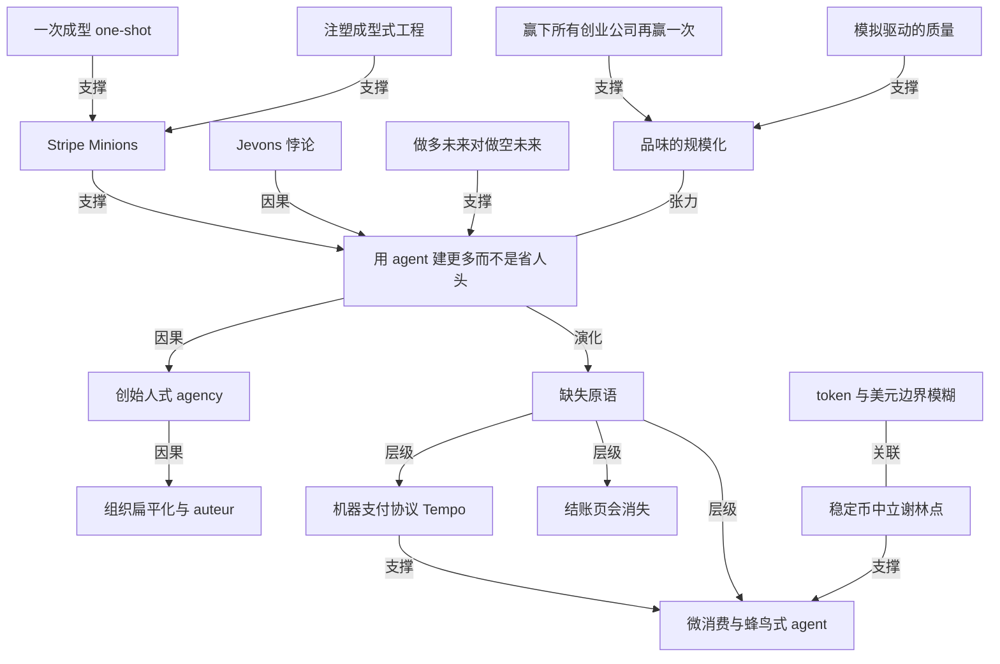

# Stripe 的 AI 策略：用 agent 做更多事，而不是省下人头

- 原文标题：Stripe’s AI Strategy: Build More, Not Less | The a16z Show
- 作者：The a16z Show
- 内参日期：2026-08-18
- 来源类型：blog
- 原文：https://app.podwise.ai/dashboard/episodes/8693708
- 标签：agents, 企业 AI

> 内部 agent 工具 Minions 已经贡献了公司 30% 的 pull request，Stripe 把这部分生产力增量投向产品速度和业务扩张，而不是裁员。

## 导读

Stripe 的 agent 落地实战案例

## 核心观点

a16z 的 David George 对话 Stripe 产品与业务总裁 Will Gaybrick。这场对话的中心问题只有一个：当一个工程师能干两年前两个团队的活，公司应该拿这份多出来的产能做什么？

Gaybrick 的答案是一句可以直接抄走的判断——**优化成本结构是做空自己的未来潜力，建得更快、建得更多才是做多**（"Optimizing your cost structure is going short on your future potential; building faster and building more is going long"）。Stripe 的内部编码 agent「Minions」上周生成了 7000 个 pull request，占全公司 PR 的 30%，但公司没有据此裁员，而是把这份产能倒进了积压多年的用户需求清单和相邻产品线。

支撑这个选择的是三层递进：

- **机制层**：Minions 是「一次成型」（one-shot）的——不迭代、不进规划模式，直接说要什么，agent 建完、跑完 CI/CD 和测试，人只做 code review。Gaybrick 把这套工程方式类比成**注塑成型**：公司负责造模具和模板（每个 repo 里的 agents 文件、markdown 规范），agent 负责生产。
- **经济层**：Jevons 悖论——一项资产变得更高产，你要的不是更少而是更多。所以卖手效率提升 20%，结论是「我们需要更多卖手」；工程师变强了，结论是招更多早期工程师。
- **组织层**：更扁平、更小的团队，让每个工程师像 auteur 一样拥有「创始人式 agency」。Stripe 对外一直是创始人的平台，现在要在内部也变成一个孵化器。
对外的另一半是这份产能造出的世界：软件创造在爆炸而不是被商品化，agentic commerce 卡在「缺失原语」阶段，结账页终将消失，稳定币是全球资金流动的中立结算层。

## Stripe 今天是什么：从支付处理器到多产品金融基础设施

- 内部说法是「反转了价值主张」：从一家带附加功能的支付公司，变成一切都围绕金融基础设施的多产品平台。框架只有两个词——**减少摩擦、增加 agency**（reducing frictions and increasing agency）。
- 产品线从支付扩展到 billing、订阅与开票、Connect（平台与市场）、Radar（反欺诈）、税务，大约 25 到 30 个挂牌品牌产品，下面还有成百上千个 feature。平均一家 AI 公司用 11 个 Stripe 产品；11 Labs 用了 14 个。
- 一个真实的新问题：免费试用滥用。AI 之前这不算事，因为多数 Stripe 用户是软件公司，浪费的算力可忽略；现在「软件本身成了成本结构」。Cursor 是第一个撞上这个问题的用户，Stripe 团队和他们一起「钻进地堡」，一个周末就搭起管道——用自有基础模型扫全网络、用 embedding、再叠一层推理层，能指着信号说「我们认为这是试用滥用者，因为……」。11 Labs 现在每天用 Stripe 信号拦住 2000 个滥用者。当时的实测是每六个免费试用用户里就有一个是滥用的，有的甚至在做模型蒸馏。
- 另一个是出海摩擦：Stripe Managed Payments 让 Ahrefs 这类公司在本土市场自己做 seller of record，在哈萨克斯坦、亚太长尾这些没有实体的市场由 Stripe 站出来做 **merchant of record**，代算代缴税，合规覆盖 100 多个地区。

## 赢下所有创业公司，然后再赢一次

- Collison 在 Sessions 上概括的策略：win all the startups and then win them again。表面理由是创业公司野心大、会长成明天最大的公司、是市场方向的「矿井里的金丝雀」。
- 更微妙的理由是**标准**：创业公司是所有客户里要求最高的。同一份 reporting 功能，超大企业用户的 CSAT 反馈是「你们的数据太棒了，比我们从别家拿到的都好」——因为他们习惯了在位者设定的低标准；创业公司的反馈是「your reporting is garbage，你必须修，这快把我逼疯了」。
- 这种持续的、苛刻的反馈回路把公司拉上高端市场，并强迫它对全球最大的企业保持和对车库里两个人一样的标准。今天接近一半的 Fortune 500 在用 Stripe。
- 企业侧的销售周期、售后激活动作都不同，创业公司签完就上线；但底层是同一件事——**贴近用户，听需求，在他们在乎的指标上证明自己更好**。

## 速度从哪来：Minions、一次成型与注塑成型

- 速度一直排在优先级顶部（仅次于对用户的执着关注）。Stripe 一直在学前人：目标设定接近 Google 的 OKR，销售组织接近微软，DRI 文化和产品评审接近 Apple，日常经营机制大量取自福特与波音前 CEO Alan Mulally。
- 但到了今天，「没人可抄了」——当一个工程师能干两年前两个团队的活，唯一的答案是让 Stripe 比以往任何时候都更成为**内部的创始人平台**。收购来的创始人一直在 Stripe 干得很好：Metronome 的 Scott Woody 现在带 Metronome 和 billing，Privy 与 Bridge 的人分别在带 crypto、OpenUSD 与 crypto 工程，Lemon Squeezy 的 JR Farr 在带 Stripe Treasury。
- Minions 的关键设计是**一次成型**：给一个 prompt，它就去建、走 CI/CD 和全部测试，然后交给人 review。不迭代、不进 planning mode，只说「这是我要的，去做」。Gaybrick 称之为 one-shot，或者「加了光环的 Ralph loop」。
- 数字变化很陡：一月二月发博客时是每周 1200 个 PR，上周是 7000 个，占当周全部 PR 的约 30%。「Minions 产出的 PR 数量与占比」被当成公司最重要的内部指标之一。
- 注塑成型的比喻：战后消费品和玩具的爆发，靠的是四十年代把塑料熔得足够均匀的注塑螺杆。「我们现在的代码生产就是这样——我们造模具和模板」。前提是你得写好每个 repo 里的 agents 文件和 markdown 规范，把「怎么对接金融机构」这类模式沉淀成图样，剩下的交给 agent，人的时间集中到后端的 code review——而现在 agent 做 code review 已经比过去人做得更好。
- 真正卡住速度的反而是「后台的事」：合并的代码量远超去年，压力传导到每个系统——怎么进销售系统、怎么上定价页、来不及培训销售怎么把产品推向市场。所以现在优化的是从用户需求、产品构想到产品交到用户手上的**整条关键路径**。

## 为什么是「建更多」而不是「省更多」

- 市场上流行的叙事是：有了 agent 就该更高效、用更少的人做更多的事；确实有公司据此裁员、砍 OpEx。Stripe 的判断相反——「最好的成本结构优化方式是增长」。
- 内部知识 AI 工具 CHI 是标本：两个人花大约六个月建起来，现在周活 83%、日活约 60%，销售效率提升 20%。得出的结论不是「我们需要更少的销售」，而是「销售的回本周期变好了，我们应该有多得多的销售」。
- Jevons 悖论在技术圈已近老生常谈，但在 Stripe 是真实决策依据：一项资产变得更高产，你想要的不是更少而是更多。对应到工程师——「因为工程师太高产所以世界上会有更少的工程师」这个推论，Gaybrick 明确不信，看到的证据也相反：新 SaaS 平台客户 cohort 在 2026 年比 2025 年大了 103%；「世界上会有更多软件工程师；做我们已经在做的事需要的人会更少」。
- 落地形态是「相邻扩张」：spend management 与 treasury 相邻，本来排在两年后的路线图上，现在一个工程师自己捡起来在做（Gaybrick 说第一个 commit 是他写的，之后就交出去了）。
- 另一条证据链是**时间线的压缩**：Stripe Tax 的美国全州自动申报花了很久才做成（各司法辖区受理方式各异），而下一个用户诉求「全球申报」只用了三分之一时间，复杂度还高得多。Stripe Treasury 同样如此——Stripe 不是银行也不想做银行，但要做用户的银行门户，支持在几十种货币、多个国家持有资金。
- 结论句是那句资本配置式的对仗：**优化成本结构是做空自己的未来潜力，建得更快、建得更多是做多**。George 的类比是把现金返还股东 vs 把现金再投入。
- Gaybrick 也保留了一个务实的对冲：当下给资源加一点「back pressure」是好事，因为压力会逼出对新工具更高效的使用；但几年后的预算流程大概会回到「我们用现有资源已经做了很多，继续扩资源能做更多」的老样子。

## 组织形态：更扁平、更小，工程师作为 auteur

- 工程师在 Stripe 一直是核心产品负责人，也一直是工程师、PM、设计师的混合体；现在只是把这件事推得更远——建工具和平台，让工程师自己做前端开发和前端设计。
- 对「组织怎么变」的最短回答是：**更扁平**，团队更小。过去那些编排工作的管理层级在当时很有价值，但现在不需要了。
- 案例：做 Stripe Projects 的那位资深工程师 Alexander，原来是一个 PM 加一个资深工程师几周做出来的（另有几位工程师加入），大部分 PR 来自他一个人；现在他一块屏幕上编排 16 个 agent，速度又快了一大截。
- 团队规模没有标准答案。扁平组织里两股力量互相抵消：想要更宽的团队（管理层级更少），又觉得可以更少的人（每个人更被赋能）。现实形态是「一个八人直线管理团队，做的是三倍的事」——管理者与 IC 的比例没变，但团队同时在推三件事而不是一件。
- 对早期工程师的定位是**内部孵化器**：进来，找一个能帮到用户的高 agency 项目，公司负责让路、铺好 paved path。目标是「让每个 Stripe 人都能当 auteur、当创始人，不被中心化流程的泥沼拖住」。

## Agentic commerce：还在「缺失原语」阶段

- 判断先摆在这：agentic commerce 还没有迎来自己的「Opus 4.5 寒武纪爆发时刻」，没有反复出现的规范用例。原因之一是**缺失原语**（missing primitives）。
- Tempo 是补原语的动作之一——机器支付协议，让服务能声明「要付什么、怎么付」。你请求一张图或一段内容，拿回一个 402 响应，上面写着「这是你买我的方式」。前提判断是：机器会想从机器那里买东西。
- agent 的结账该长什么样仍是开放问题。浏览器自动化在变好，也许 agent 就该去爬结账表单并填掉——但 George 直接点破那是**拟物版**（skeuomorphic），一定会有原生版本。
- 一个不那么投机的近期结论：**结账页会消失**。有了 Stripe Link 和 Shop Pay，穿过结账页已经很容易，但为什么还要去一个专门的页面？在商品展示页上说一句「买它」就该够了。Link 已有约 4 亿用户，Stripe 最近还发布了 Link Agent Wallet 和 link CLI，让 agent 在人在环的授权下扫取并使用凭据。
- Gaybrick 最兴奋的 agentic commerce 场景其实是 **B2B**。Stripe Projects 窄义上是脚手架工具，真正的意义是「用 agent 开通 B2B 服务」——agent 可以自己去开一个 Vercel 托管，你不用去它官网点任何东西；也可以去开 BrowserBase。Stripe 内部有过一个 demo：agent 拉起一个 BrowserBase 会话，打开 ESPN 做点研究，把 NCAA 赛程预测表填完。
- George 由此改了投资框架：**假定未来的购物者是 agent，问「这是 agent 会挑的那一个吗」**。
- 消费侧还没跑通，卡点在支付形态。Gaybrick 想给侄女写首生日歌，用 Suno 之类的工具是可行的，但他不想为此开一个每月 9.99 或 10.99 美元的账户——他要的是**微消费**（micro-consumption）。
- 所以需要一批微消费 API，支持「非匿名但短暂」的一次性消费。理想指令形如：「agent，去做这件事。自己发现服务。你的预算是 15 美元。开始。」
- 微交易过去为什么不成立？因为卖单篇文章总是被夹在订阅模式和免费模式之间。现在变了：当你交给 agent 的任务越来越复杂，你希望它们像**蜂鸟**（hummingbirds）一样在互联网上飞——这里抓点数据，那里用点临时存储，那边做点计算。人不该为每一处都去建账户，只需要确认这些服务安全、正规。微交易因此成为 agentic 经济存在的必要条件。
- 而它现在「切实可行了」，因为稳定币。

## 稳定币：全球资金流动的中立结算层

- Gaybrick 自认基础设施控，第一句判断是：**稳定币就是比现存方案更好的资金流动平台**。
- 有些国家的国有支付系统确实很好：印度的 UPI 上 5 美元以下的小额支付占比约 86%，而美国卡组织侧只有个位数百分比；巴西的 PIX 也在飞速增长。
- 但全球经济需要一个**谢林点**（shelling point）——大家都能同意的那个东西。crypto rails 解决的正是全球互通的政治问题：这套平台哪里都能用。「如果我们今晚睡觉、明早醒来手里拿的都是稳定币，全球金融系统会更快、更便宜、摩擦更少。」
- 他也承认这可能属于「本该如此、也许永远不会如此」的那类问题，所以 Stripe 决定把稳定币做成 **Stripe Treasury 的原生资产**——像持有美元、欧元、英镑一样持有稳定币余额。
- 覆盖面的对比是最硬的数字：法币口径下 Stripe 用户覆盖约 60 个国家，稳定币口径下约 150 个。这意味着把更多人拉进线上经济——「你在泰国用两个工程师建起一家强大的 AI 公司，和在美国、在巴西一样可行」。
- 已有的落地案例：Felix（起家于美墨汇款走廊，现在也有其他走廊）完全建在稳定币上，几年内在全球最大的汇款走廊上做到 5% 到 10% 的份额。对比 Wise、更早的 Western Union 要花多久，这个速度很惊人。
- Tempo 的定位是**支付专用链**。链本来不缺，但支付场景有独特要求：隐私必须是一等公民（公链默认公开，容易被反推出业务）；吞吐不能被牺牲（链的用量偏向交易，行情剧烈时性能大幅退化）；手续费不能尖峰（浮动 gas 让成本不可预期）。目标就是把钱移得尽可能高效、稳定、便宜。目前是 Stripe 内默认但不唯一的链，已在和 DoorDash 这类公司合作。

## token 经济：token 与美元的边界正在模糊

- Gaybrick 说他一直喜欢 token 这个词，因为它「听起来就像钱的近似物」——而现在它越来越就是钱。
- 证据来自攻击面：对 Cursor、Replit 这类通用 token 消费平台的攻击极其精密，形态很像有人试图从 Stripe 用户那里偷钱。既然如此，Stripe 对资金「安全、合规地流动、存储、发送」的责任，就该同等地覆盖到 token 上。
- 更远的一层：很多长时程 agentic 任务会替代服务。以前你说「帮我把账结了」是付美元给人，以后是付 token 给被 agent 增强过的更少的人。所以目标是**让 token 与美元之间的兑换，像美元与欧元之间一样无缝安全**。
- 客户侧的 token 管理有两副面孔：一是**成本侧**（用 token 造东西，属于 OpEx 管理，和 spend management、Stripe Treasury 连在一起）；二是**产品效能侧**（我这个 token 驱动的产品好不好、该在不同模型之间怎么切换）。Stripe 想在两侧都提供帮助。
- 关于「软件会被严重商品化」的假说，Gaybrick 认为它有可能成立、也很难估计一个模型递归生成模型的未来；**但眼下看到的是完全相反的图景**——软件创造在爆炸，客户变现比以往更快。2026 年的 cohort 比 2025 年大 50% 且增长更快，2025 年那批又比 2024 年大 70%。
- 而且软件不止于「造」：抽象层怎么贯穿整个业务是一种专业知识，人一走系统就开始劣化。所以机会是横跨客户的整条营收栈——管现金、管收入、更快结账本、更快增长、更快全球化。

## AI 做了大部分活以后，「品味」怎么规模化

- 先自嘲一句：taste 这个词现在被用得太多，愤世嫉俗的看法是「大家都在给自己未来的价值找理由」——「我的手指不再有用了，但这个说不清的品味有用」，以及「模型永远不会有品味」，而后半句多半不成立。
- 但产品质量确实是 Stripe 文化和身份的核心，原因有二：一是用户视角，创业不易，工具「好得出人意料」（surprisingly great）会让这段路好走很多；二是**更好玩**——你和团队看着自己做出来的东西说「哇这太棒了」，和「这玩意儿是攒起来的、勉强能跑」，长夜和周末的感受完全不同。
- 规模化品味只有两件事。第一件是**自上而下**：像讲战略一样，把质量反复讲、一遍遍讲。
- 第二件是**用自己的产品，并且让用产品变容易**。这里引出全篇最实操的方法——**模拟**。航空业不能只是「希望飞机能飞」，得在起飞前证明；NVIDIA 真正进入逃逸速度，是从等 fab 出片才能试，变成能直接模拟芯片性能。
- Stripe 因此在「模拟产品的使用」上大量投入：指向一个真实账户说「给我一个长得像它的环境」，但抹掉全部 PII、随机化增长率（这样也不知道对方实际多大），保留业务的日常问题、起伏和季节性，让它**感觉是活的**——争议单在进来、退款在发生。这些当然不是真的争议和退款，但体验是真的。
- 执行上「有使用产品的强制责任」，并要求 EM 牵头，因为他们掌握资源、也是能拍板说「这个手感不对，必须修，下个 sprint 就做质量提升」的人。
- 一句收尾式的自我要求（George 引述）：**我们怎么保证在 Stripe 内部建出下一个 Stripe？**

## 概念网络

### 关键概念

#### Stripe Minions

**context**：Stripe 的内部编码 agent 系统，一月二月发博客时每周产出约 1200 个 PR，上周达到 7000 个，占当周全公司 PR 的约 30%。「有多少 PR、多大比例的 PR 由 minions 创建」被列为公司最重要的内部指标之一。

**费曼一下**：把它想成一队不知疲倦的实习工程师，你不跟他们讨论方案，只丢一句「我要这个」，他们就去写代码、跑测试、走完发布检查，最后把成品放到你桌上等你签字。Stripe 用「它们干了多大比例的活」来给自己的工程转型打分。

#### 一次成型（one-shot）

**context**：Minions 的核心设计——「你不会迭代，不会进规划模式。你就说，这是我要的，去做。」Gaybrick 称之为 one-shot，或「加了光环的 Ralph loop」，人的时间集中在后端的 code review。

**费曼一下**：跟 agent 协作有两种姿势。一种是来回商量：先出计划、你改、它再改；另一种是把要求一次说清楚，让它一口气做到底，你只验收。前者像结对编程，后者像下订单。Stripe 押注后者，代价是你必须把「要什么」说得足够准。

#### 注塑成型式工程

**context**：Gaybrick 对现代 agentic engineering 的比喻——战后消费品爆发靠的是四十年代把塑料熔得足够均匀的注塑螺杆；「我们现在的代码生产就是这样，我们造模具和模板」。前提是每个 repo 里有 agents 文件与 markdown 规范，把「如何对接金融机构」这类模式固化下来。

**费曼一下**：想量产塑料玩具，难的不是倒塑料，是先做出那副金属模具。同理，让 agent 大规模写代码，真正的工程活是把公司里那些反复出现的做法写成模板和规范。模具做得好，产量就上得去；模具糊涂，agent 只会更快地产出垃圾。

#### Jevons 悖论

**context**：文中被用作「不裁员反而扩张」的经济学依据——「一项资产变得更高产，你想要的不是更少而是更多」。CHI 让销售效率提升 20%，结论是「我们应该有多得多的销售」；工程师变强，结论是招更多早期工程师。

**费曼一下**：蒸汽机变省煤之后，人类烧的煤反而更多了——因为省下的成本让更多用途变得划算。同一个道理套在 AI 上：单位产出便宜了，你会做更多以前不划算的事，总投入反而上升。所以「效率提升等于要更少的人」这个直觉，在需求还没被满足完的领域是错的。

#### 做多未来 vs 做空未来

**context**：全文最锋利的一句判断——「优化你的成本结构是在做空你自己的未来潜力；建得更快、建得更多是在做多你的未来潜力」。George 的类比是把现金返还股东 vs 把现金再投入。

**费曼一下**：省下的成本是有限的，能建出来的东西是无限的。用 AI 砍人，你锁定的是一笔一次性的、有天花板的收益；用 AI 建更多，你买的是一张不确定但没有上限的彩票。这句话之所以有力，是因为它把「要不要裁员」从一个道德问题翻译成了一个资本配置问题。

#### 创始人式 agency（founder-like agency）

**context**：「如果你想发得更多、建得更快，你必须在公司内部创造一种创始人式的 agency。」Stripe 对外一直是创始人的平台，现在要在内部也成为「创始人的平台」——被收购的创始人（Metronome、Privy、Bridge、Lemon Squeezy）都在带核心业务线。

**费曼一下**：创始人和员工的差别不在能力，在授权半径：能自己决定做什么、直接对结果负责、不必层层请示。当一个人配上 agent 就能顶一个小团队，公司要么给他这个半径，要么他就去外面自己开公司。

#### 组织扁平化与 auteur 工程师

**context**：对「组织怎么变」的最短回答是「更扁平」，团队更小；过去编排工作的管理层级不再必要。现实形态是「一个八人直线管理团队，做的是三倍的事」；那位做 Stripe Projects 的工程师现在一块屏幕上编排 16 个 agent。

**费曼一下**：管理层级的存在意义是协调人与人之间的信息传递。当一个人身边协调的对象从同事变成 agent，协调成本被压进了他自己的屏幕里，中间那几层就没活干了。「auteur」（作者型导演）是这里的关键词：一个人对作品有完整的署名权和完整的责任。

#### 赢下所有创业公司，再赢一次

**context**：Collison 概括的 Stripe 策略。表层理由是创业公司会长成明天最大的公司、是市场方向的金丝雀；更深的理由是标准——大企业说「你们的 reporting 很棒」，创业公司说「your reporting is garbage」。

**费曼一下**：你的产品质量上限，由最挑剔的那个客户决定，不是由最大的那个客户决定。大客户往往被行业里的烂标准养刁了口味的反面——他们的参照系太低，夸你不值钱。真正逼你变好的，是那些还没被驯化的、敢直接骂你的用户。

#### Merchant of Record

**context**：Stripe Managed Payments 的核心机制——用户在本土市场自己做 seller of record，在没有实体的长尾市场（哈萨克斯坦、亚太各国）由 Stripe 站出来做法律与财务上的商户，代算代缴税，让客户合规覆盖 100 多个地区。

**费曼一下**：跨国卖东西真正难的不是收钱，是每个国家都要你注册实体、算税、报税。Merchant of record 就是找一个已经在当地合法存在的机构，让它在账面上当那个卖家，你只管做产品。这是「减少摩擦」这个框架最具体的一种形态。

#### 缺失原语（missing primitives）

**context**：Gaybrick 对 agentic commerce 当下阶段的诊断——还没有出现「Opus 4.5 寒武纪爆发时刻」，也没有反复出现的规范用例，原因之一就是底层原语还没造好。

**费曼一下**：新技术卡住时，通常缺的不是想象力，是几块最基础的积木。就像互联网早期缺的不是网站创意，是 HTTP 和 SSL。判断一个领域「还没爆发」到底是时机未到还是方向错了，一个实用的检验是问：底层原语齐了吗？

#### 机器支付协议（Tempo 与 402）

**context**：Stripe 造的机器支付协议，让服务能声明「要付什么、怎么付」——请求一张图或一段内容，拿回一个 402 响应，上面写明「这是你买我的方式」。前提判断是：机器会想从机器那里买东西。

**费曼一下**：HTTP 里 402 是个从一开始就留着、几乎没人用的状态码，意思是「需要付款」。当买家从人变成程序，这个空位终于有了用武之地——程序不会看价格页，它需要一个机器能读懂的报价单。

#### 结账页会消失

**context**：Gaybrick 认为这是 agentic commerce 中「非投机但也许没那么野心勃勃」的一种形态。有了 Stripe Link（约 4 亿用户）和 Shop Pay，穿过结账页已经很容易——但为什么还要去一个专门的页面？在商品展示页上说「买它」就该够了。George 补充：拟物版是让 agent 去爬表单，一定会有原生版本。

**费曼一下**：结账页是把线下收银台搬到网上的产物，它的存在是历史包袱不是功能必需。当买家是 agent，让它去填一张为人眼设计的表单，就像让机器人拿着鼠标点屏幕——能跑，但显然不是终态。

#### 微消费与短暂性交易

**context**：Gaybrick 想用 Suno 给侄女写首生日歌，但不愿为此开一个每月 9.99 或 10.99 美元的账户；他要的是一次性的、「非匿名但短暂」的消费。理想指令是「agent，去做这件事，自己发现服务，预算 15 美元，开始」。

**费曼一下**：订阅制假设你会反复用同一个服务，所以先收月费再谈使用。但 agent 的使用模式相反——它可能一辈子只用某个服务三秒钟。为这三秒钟建账户、绑卡、记密码，摩擦是价值的一百倍。微消费就是把「注册-订阅-使用」压缩成「用完即付」。

#### 蜂鸟式 agent

**context**：微交易为何这次能成立的核心意象——当你给 agent 越来越复杂的任务，你希望它们像蜂鸟一样在互联网上飞，「这里抓点数据、那里用点临时存储、那边做点计算」；人只需确认这些服务安全正规，不必到处建账户。

**费曼一下**：这是对 agent 使用互联网方式的一个精准画像：不是像人那样在少数几个网站上长期定居，而是高频、短暂、广泛地掠过大量服务。这种形态决定了它需要的基础设施——身份要轻、结算要小、延迟要低。

#### 稳定币作为中立谢林点

**context**：印度 UPI 上 5 美元以下小额支付占约 86%（美国卡组织侧仅个位数），巴西 PIX 也在飞涨，但这些都是国有系统；全球经济需要一个「大家都能同意」的谢林点，crypto rails 解决的正是全球互通的政治问题。法币口径下 Stripe 覆盖约 60 国，稳定币口径下约 150 国。

**费曼一下**：谢林点是博弈论里的概念——一群无法沟通的人，会不约而同选中那个「最显眼」的选项。全球支付缺的不是好方案，是一个谁都不吃亏、谁都能接受的默认选项。稳定币的卖点在这里不是技术，是政治中立性：它不属于任何一国的清算体系。

#### token 与美元的边界模糊

**context**：「我一直喜欢 token 这个词，因为它听起来就像钱的近似物；而现在它越来越就是钱。」证据是针对 Cursor、Replit 这类通用 token 消费平台的攻击，形态很像有人从 Stripe 用户那里偷钱。目标是让 token 与美元之间的兑换像美元与欧元之间一样无缝安全。

**费曼一下**：判断一个东西是不是钱，最实用的标准之一是「有没有人专门来偷它」。当 token 被大规模盗用、洗白、套利，它在事实上已经进入货币的范畴，那么围绕货币建立的那套安全与合规基础设施就必须跟上。

#### 品味的规模化：自上而下 + 模拟

**context**：Gaybrick 给出的两件事——一是自上而下反复讲质量（像讲战略一样讲），二是用自己的产品。第二件的实现方式是模拟：像航空业不能只「希望飞机能飞」、NVIDIA 从等 fab 出片转向模拟芯片性能一样，Stripe 大量投入「模拟产品的使用」，用抹掉 PII、随机化增长率的仿真账户复现争议单、退款和季节性，让 EM 能真切感到「这个手感不对」。

**费曼一下**：所有公司都说要用自己的产品，但真实用户的处境很难自然复现——你没有他们的客诉、退款和淡旺季。模拟就是把这些处境人为造出来，让做决定的人**住进用户的日常里**。这比「同理心」这个词可执行得多，也是全文最能被别的公司直接抄走的机制。

### 概念网络

这场对话表面上有两条独立线索——内部怎么用 agent 造软件、外部怎么给 agent 造支付——但两条线索由同一个判断连起来：**软件创造正在爆炸而不是被商品化**。前半段是这个判断在公司内部的执行结果，后半段是它在市场上的必然后果。

**内部这条线的骨架是「产能倒向哪里」。** 起点是 Minions，而 Minions 之所以能规模化，依赖两个前提概念：一次成型定义了人机分工的形状（人说清要什么、agent 一口气做完、人只做 review），注塑成型式工程定义了这套分工的前置投入（agents 文件、markdown 规范、对接模式的模板化）。没有模板，一次成型只会更快地产出垃圾——这是两者之间的支撑关系，不是并列关系。

**产能出现之后，选择权才是真正的分岔口。** Jevons 悖论和「做多 vs 做空」是同一个选择的两种论证：前者是经验规律（更高产的资产你要得更多），后者是价值判断（省成本有天花板，建东西没有）。二者共同支撑了那个反直觉的决定——效率提升 20% 的结论是「要更多销售」而不是「要更少销售」。

**这个决定又倒逼组织形态。** 要让多出来的产能真的变成产品，就不能让它卡在审批链上，于是有了创始人式 agency；agency 要落地就必须削掉编排层，于是有了扁平化与 auteur 工程师。注意这里的因果方向是单向的：不是先想扁平化再找理由，而是先决定「建更多」，扁平化才成为不得不做的事。

**质量机制与这条主线之间存在真实张力。** 速度和品味天然互斥——发得越快越容易 janky。Stripe 的解法不是在速度上让步，而是给质量单独建两套支撑：一套来自外部压力（创业公司的苛刻反馈是免费的质检员），一套来自内部机制（模拟让 EM 住进用户的日常里）。所以在图上，品味与核心主张之间画的是张力线而不是支撑线——它是被主动对冲掉的代价，不是主张的自然结果。

**外部这条线的骨架是「原语还没齐」。** 缺失原语是一个总诊断，下面挂着三个并列的缺口：机器与机器之间怎么报价与付款（Tempo 与 402）、人机交互的历史包袱怎么拆（结账页消失）、以及使用模式变了之后计费怎么改（微消费）。三者中最关键的是第三个，因为它决定了 agent 能不能真的像蜂鸟那样在互联网上飞——而它能不能成立，取决于稳定币把单笔成本压到足够低、覆盖足够广。这就是稳定币在这张网络里的位置：它不是一个独立的加密叙事，而是微消费这个应用形态的物理前提。

**token 与美元边界模糊则是这条线的收束。** 当 agent 花的是 token、结的是稳定币、买的是别的机器提供的服务，「钱」的定义本身就在漂移。Stripe 把自己在法币世界积累的那套东西（安全、合规、反欺诈、跨币种流动）平移到 token 上，逻辑上就是承认这种漂移已经发生。

**最后值得单独指出的是「赢下所有创业公司再赢一次」的双重身份。** 它在图上只连向品味，但在文章里它同时是商业模式（今天的小客户是明天的大客户）和质量机制（最挑剔的客户设定产品上限）。这种一策两用，恰好是全文方法论的缩影——好的机制从来不是为单一目标设计的。

## 费曼 x3

有一个问题正在每家公司的会议室里被回答，而大多数答案都错了：当工具让每个人产出翻三倍，你该要更少的人，还是更多的事？

流行的答案是前者。裁员、砍 OpEx、把组织当成一张待优化的电子表格。这个答案的诱人之处在于它可以被精确计算——省下的每一分钱都能写进下季度的报表。但精确不等于正确。省成本这件事有一个致命的结构性缺陷：它有天花板。你最多能省掉全部成本，然后就到头了。而建东西没有上限。用一句更锋利的话说，优化你的成本结构是在做空你自己的未来潜力，建得更快、建得更多是在做多。

这不是乐观主义，是一个关于稀缺性的判断。如果你的用户需求清单已经清空、你的相邻市场已经做完，那么效率提升确实只能转化成省钱。但真实情况通常是反过来的——积压了多年的用户诉求躺在那里没人做，相邻的产品线排在两年后的路线图上。稀缺的从来不是需求，是产能。当产能突然变得便宜，你要做的是把它倒进那张清单，而不是把它兑换成一次性的成本节约。经济学早有名字：一项资产变得更高产，你想要的不是更少，而是更多。

这个判断一旦成立，接下来的一切都是它的推论。产能不能卡在审批链上，所以组织必须变扁——过去那些编排工作的管理层级曾经很有价值，但当一个工程师在一块屏幕上编排十六个 agent，中间那几层就没活干了。所以要在公司内部创造一种创始人式的 agency，让工程师像作者型导演那样对作品拥有完整的署名权和完整的责任。八个人的团队还是八个人，但它同时在推三件事而不是一件。

真正难的部分在质量。速度和品味天然互斥，发得越快越容易攒出勉强能跑的东西。这里给出的解法值得任何公司直接抄走：不在速度上让步，而是给质量单独建机制。一是自上而下反复讲，像讲战略那样讲质量；二是模拟。航空业不能只是希望飞机能飞，得在起飞前证明；把这个纪律搬进软件公司，就是用抹掉隐私、随机化增长率的仿真账户，把用户的争议单、退款和季节性真实地复现出来，让掌握资源的人住进用户的日常里，然后自己感到"这个手感不对"。

所有公司都说要用自己的产品。区别在于，有人把它当口号，有人把它当工程问题来解。
