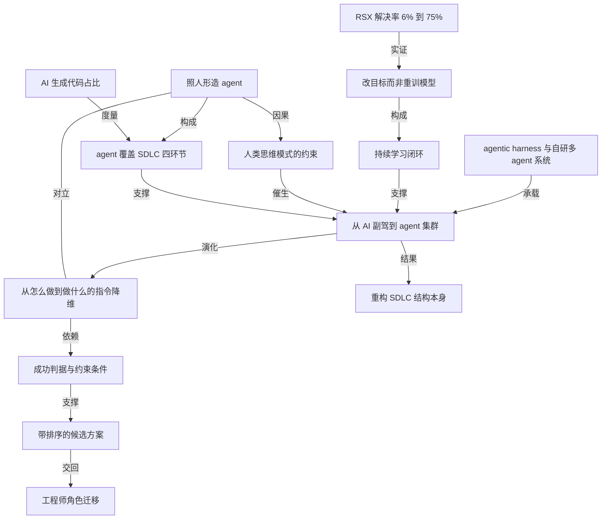

# AMD：从 AI 副驾走到 agent 集群，下一步要重构的是研发流程本身

- 原文标题：From AI Copilots to Agent Swarms
- 作者：spectrum.ieee.org
- 内参日期：2026-08-19
- 来源类型：blog
- 原文：https://spectrum.ieee.org/amd-agent-swarms
- 标签：企业 AI, agents

> 一年时间 AI 带来的整体研发效率提升已经从原定的 25% 目标做到 30%。AMD 的判断是，此前都在教 AI 模仿人类的工作方式，这反而把它框在了人的思维模式里，真正的变革来自能自己发现解法的 agent 集群。

## 导读

agent 集群

## 核心观点

- AMD 一年前的目标是「用 AI 把软件研发生产率提升 25%，用两到三年」；一年后目标被提前超额完成，整体生产率提升达到 30%。真正的转变不在数字，而在于 AMD 已经不再只问「怎么在现有流程里用 AI」，而开始重新设计流程结构本身（rethinking not only how we use AI within the SDLC, but the structure of the SDLC itself）。
- 作者的判断是：软件工程里最大的一场 AI 革命还没到来。迄今为止我们主要在「教 AI 我们是怎么干活的」，让它模仿既有工作流——这在很多方面把 AI 束缚在人类的思维模式里（constrains AI to human patterns of thinking）。
- 下一次跃迁来自协作式的 AI agent 集群（collaborative swarms of AI agents），它们能独立发现解法。人类给出的是「要解决什么」，而不是「该怎么解决」。
- 一句话概括这个转向：agent 不再是给 SDLC 的每一步做增强，而是要改写 SDLC 本身（The agents won't be enhancing each step of the SDLC—they will be rewriting the SDLC themselves）。
- 让这件事成立的关键不是模型变强，而是一个把错误和人工干预反馈回去的持续学习闭环——长期看，这个自我强化的闭环、而不只是底层模型，会成为 AI 进步的主要驱动力。

## 今天的 agent：已经铺满了 SDLC 的每一步

- 起点是 2024 年。AMD 那时开始为代码生成、测试自动化、缺陷分析、代码评审构建 AI 系统，目标定在「2027 年做到 25% 的生产代码由 AI 生成」，并逐步把 SDLC 中更大的部分自动化。
- 生产率本身很难量化，AMD 从一开始就只咬住一个可客观测量的指标：源代码中由 AI 生成的比例。
- 关键在于计数口径严格：只统计通过全部评审与测试、最终进入产品的代码。
  - 作者承认 AI 生成代码不是生产率提升的唯一贡献者，但它是少数能被客观、一致地测量的指标之一。
- 这个指标的实际走势：今年年初越过 20%，目前正朝着整个代码库 50% 推进；在某些软件组件里，超过 80% 的代码已经由 AI 生成。
- Agentic AI 让 AI 进入生命周期的每一个环节，四个环节各有明确职责：
- 代码分析与问题分诊：agent 被训练去分析问题报告、识别并归并相似请求、指出哪些代码片段可能需要改动。
  - 调试与代码生成：agent 分析一条缺陷请求，并实现所需的代码变更。
  - 测试：agent 生成单元测试，单测通过后再判定需要哪些集成测试与产品级测试。
  - 审批与发布：agent 准备好架构摘要、代码变更评审和完整测试结果，交给工程师审阅批准；一旦批准，就把变更并入下一个版本。
- 值得注意的是，人类在这条流水线上的位置已经悄悄从「写」挪到了「批」——最后一道关口是 engineers' review and approval。

## 明天的 agent：照人形造出来的分身，天花板在人身上

- 今天工程师是「照自己的样子」创造 agent（create AI agents in their own image）：把自己对系统的理解、自己会怎么修一个问题、自己会怎么实现一个变更，教给 AI。
- 这已经是重大的技术进步：工程师可以创造出自己的多个「AI 版本」，让它们并行工作，把个人专长扩展到远超个体生产率极限的规模。
- 但限制也正在这里：这些 agent 仍然被人类的思考方式和人类定义的方法所约束。分身再多，也只是同一种思路的复制。
- 下一次重大转变发生在协作式 agent 集群能够独立识别并开发解法的时候，人类的引导落在「解决什么」上，而不是被人类关于「该怎么做」的假设所限制。
- 工程师不再给出解题的详细指令，而是定义三件事：问题是什么、期望的结果是什么、质量、性能与系统层面的约束是什么。
  - 剩下的最优路径由 agent 自己决定。
- agent 集群的工作方式是并行探索加自动筛选：
- 并行生成、评估、打磨多套解决方案思路。
  - 自动验证正确性、测量性能、测试各种取舍、按既定成功判据对比不同实现。
  - 最终产出一组带优先级排序的候选方案（ranked solution options），附上验证结果和性能指标，交工程师审阅批准。
- 这套东西改变的是流程的形状，不是流程的效率——所以作者说 agent 不是在增强 SDLC 的每一步，而是在改写 SDLC。

## 瓶颈在训练方式：从「一人调一 agent」到「agent 互相学」

- 今天的改进是一对一的手工作坊模式：一个工程师面对一个 agent，看输出、改 prompt、再重复。
- 要突破这个模式，agent 必须持续地互相学习、复用成功策略、跨项目和跨团队地协同改进。
- AMD 的做法是两条腿走路：一边大量使用 Codex、Claude Code 这类 agentic harness 上的多 agent 工作流，一边自研内部的多 agent 系统来支撑下一代 AI 驱动的软件工程。

## RSX 案例：从 6% 到 75%，靠的是改目标而不是重训模型

- 案例对象是 Radeon Software eXperience（RSX），一个让用户配置和监控显卡驱动行为的用户界面组件。
- 2025 年 10 月，AMD 开始用 AI agent 自动调试并修复上报的 RSX 问题。开箱即用的 AI 工具效果有限，只解决了 6% 的问题。
- 转折点是建了一个学习闭环——起初在很大程度上是人工的过程——用来搞清楚 agent 在哪里做得不够、以及怎么改进它。
- 最关键的一句方法论：他们没有去重训底层模型（Rather than retraining the underlying models），而是打磨交给 agent 的目标，让 agent 迭代地探索多种路径、按既定成功判据评估结果、收敛到更好的解法。
- 同时，模型本身和 agent 运行时的进步也进一步提升了效果。两者叠加，RSX 问题的自动解决率从 6% 提升到超过 75%（2026 年 6 月）。
- 从中提炼出的一般性原则：要让 agent 和 agent 集群真正高产，需要一个把错误和人工干预喂回未来 agent 工作流的持续学习闭环，并且要围绕清晰、可测量的目标来设计这个闭环。每一轮循环都沉淀新的洞察，让整个 AI 工程工作流变得更聪明。
- 结论性判断：长期来看，这个自我强化的闭环，而不只是底层模型，会成为 AI 进步的关键驱动力。

## 人类工程师的角色演化

- AMD 的定位很明确：AI 是提升生产率、改善质量、让员工聚焦更高价值工作的手段；目标是用 AI 赋能员工，不是裁员（Our goal is to empower our workforce, not to reduce headcount）。
- 配套动作是在全公司范围内大力投入 AI 教育与培训，目标是让每一位员工都能自信、负责任、有效地使用 AI。
- 角色迁移的方向：工程师会花更少的时间手工实现方案，更多时间用在定义规格、验证结果，以及做那些真正驱动创新的战略决策上。

## 概念网络

### 关键概念

#### agent 集群（agent swarms）

**context**：文章的核心概念，也是标题里的落点。作者把它定义为「collaborative swarms of AI agents capable of discovering solutions independently」——能够独立发现解法的协作式 AI agent 群体。它与今天的单 agent 有本质差别：不是一个 agent 干一件事，而是一群 agent 并行生成、评估、打磨多套方案，最后交出带排序的候选清单。

**费曼一下**：单个 agent 像你派出去的一个助理，你告诉他怎么做，他照做。agent 集群更像你同时派出一支探险队，只告诉他们目的地和不能违反的规则，让他们各走各的路线，回来后把几条路线的耗时、风险、代价摆在你面前让你选。区别不在人多，在于「路线由谁想」。

#### 软件开发生命周期的重构（rewriting the SDLC）

**context**：文章的结构性判断。AMD 过去一年做的是「在 SDLC 内部用 AI」，接下来要做的是重新设计 SDLC 的结构本身。作者用一句话点题：agent 不是在增强 SDLC 的每一步，而是要改写 SDLC 本身。

**费曼一下**：给流水线的每个工位配一个机器人，产能会涨，但流水线还是那条流水线。真正的变化是有一天你发现，既然机器人能自己商量着把活干完，那这条流水线原本为什么要分成这几个工位，就成了一个可以重新回答的问题。

#### AI 生成代码占比（客观生产率指标）

**context**：AMD 唯一从头咬住的可测量指标。口径极严：只统计通过全部评审与测试、最终进入产品的代码。实际数据是年初越过 20%，正朝整个代码库 50% 推进，个别组件超过 80%。作者也承认生产率难以测量，这只是少数能客观一致测量的指标之一。

**费曼一下**：想知道 AI 到底帮了多少忙，最难的是找一把不会骗自己的尺子。「写了多少行」会骗人，因为写出来的可能是垃圾。AMD 的选择是只数「活着走到发布」的那部分——通过了评审、通过了测试、真的装进了产品。这把尺子不完美，但它的刻度不会随心情变。

#### 照人形造 agent（agents in their own image）

**context**：作者对当下阶段的诊断。工程师把自己对系统的理解、自己的修复思路、自己的实现方式教给 agent，等于创造出自己的多个「AI 版本」并行工作。好处是专长被规模化复制，代价是这些 agent 仍被人类的思考方式和人类定义的方法所约束。

**费曼一下**：你培养了十个和你想法一模一样的徒弟，产能翻十倍，但没有一个人会想出你想不到的解法。速度上去了，思路的上限还是你自己。

#### 人类思维模式的约束（human patterns of thinking）

**context**：贯穿全文的那道天花板。作者指出，迄今为止我们主要在教 AI 我们是怎么干活的、让它模仿既有工作流，这在很多方面把 AI 限制在人类的思维模式中——所以下一次革命不是让 AI 模仿得更像，而是解除模仿这个前提。

**费曼一下**：教一个新工具「按我的老办法干」，最好的结果就是它干得和你一样好。想要它干得比你好，就必须允许它用你没想过的办法——而这意味着你得放弃对过程的控制，只保留对结果的判断。

#### 从「怎么做」到「做什么」的指令降维

**context**：agent 集群时代人机分工的新界面。人类引导的是「解决什么」（what to solve），而不再被人类关于「该怎么做」的假设约束；工程师定义问题、期望结果，以及质量、性能、系统约束，由 agent 自行决定通往解法的最优路径。

**费曼一下**：从「照着这张图纸施工」变成「在这块地上盖一栋能住三十人、造价不超过这个数、抗八级地震的房子」。你没少说话，只是说的话从步骤换成了标准。标准写得越清楚，你越敢放手。

#### 成功判据与约束条件（success criteria and constraints）

**context**：指令降维之后，工程师手里唯一的方向盘。agent 集群自动验证正确性、测量性能、测试取舍，都是「against defined success criteria」；RSX 案例里的改进也是让 agent 按既定成功判据评估结果并收敛。判据没定义清楚，放手就等于失控。

**费曼一下**：不告诉别人怎么做的前提，是你能说清楚什么叫做好了。判据是你交出过程控制权时唯一还握在手里的东西——它写得含糊，交出去的就不是自主权而是赌注。

#### 带排序的候选方案（ranked solution options）

**context**：agent 集群的交付形态。它不是交出一个答案，而是并行探索后交出一组按优先级排序的方案，附带验证结果和性能指标，供工程师审阅批准。这与今天四环节流水线末端的 engineers' review and approval 是同一个逻辑的延伸。

**费曼一下**：好的下属不是替你做决定，也不是把一堆原始材料丢给你，而是把三个可行方案连同各自的代价摆在桌上，并告诉你他推荐哪个、为什么。agent 集群的产出形态就是这个。

#### 持续学习闭环（continuous learning loop）

**context**：文章方法论上的最高判断。要让 agent 和 agent 集群真正高产，需要把错误和人工干预反馈回未来 agent 工作流的闭环，并围绕清晰可测量的目标来设计它。作者的结论是：长期看，这个自我强化的闭环，而不只是底层模型，会成为 AI 进步的关键驱动力。

**费曼一下**：一个人能力增长的快慢，往往不取决于他的天赋，而取决于他每次犯错之后有没有人告诉他错在哪、这条反馈有没有被记住。给 agent 造系统也一样——真正的资产不是那个模型，是你搭起来的那条「错了会被纠正、纠正会被沉淀」的回路。

#### 改目标而非重训模型（refining objectives, not retraining）

**context**：RSX 案例最可迁移的一条手艺。面对 6% 的糟糕起点，AMD 的选择不是回去重训底层模型，而是打磨交给 agent 的目标，让它迭代探索多种路径、按判据评估、收敛到更好的解法；叠加模型与 agent 运行时的进步，解决率升到超过 75%。

**费曼一下**：效果不好时，人的第一反应是换一个更聪明的脑子。但更多时候，是你交代任务的方式有问题。把「帮我修这个 bug」换成「修好它，且必须通过这几项检查、不许改动这几个模块」，同一个模型的表现就完全不同了。

#### agentic harness（多 agent 运行外壳）

**context**：AMD 正在使用的现实基础设施。文章点名 Codex 和 Claude Code 这类 agentic harness，AMD 在其上大量运行多 agent 工作流，同时自研内部多 agent 系统来支撑下一代 AI 驱动的软件工程。

**费曼一下**：模型是发动机，harness 是整辆车——变速箱、方向盘、仪表盘、油门刹车。光有发动机跑不了路；agent 能力的实际上限，往往由车而不是由发动机决定。

#### 工程师角色迁移（定义规格、验证结果、战略决策）

**context**：文章收尾给出的人类位置。随着 agent 持续改进，工程师会花更少时间手工实现方案，更多时间用于定义规格、验证结果、做驱动创新的战略决策。AMD 明确把 AI 定位为赋能员工的手段而非裁员工具，并在全公司投入 AI 教育与培训。

**费曼一下**：工作的重心从「把事做出来」挪到「说清楚要什么」和「判断做出来的对不对」。这两件事听着比写代码轻松，实际上更难——因为它们没有编译器帮你报错。

### 概念网络

- 这张网络的骨架是一条时间轴：左边是「今天」，右边是「明天」，中间卡着一道由人类自己造成的天花板。
- **今天这一侧**由三个概念咬合而成。AI 生成代码占比是唯一被咬住的客观标尺，它度量的是 agent 覆盖 SDLC 四环节（分诊、调试、测试、审批发布）之后的实际渗透程度——20% 到 50% 到局部 80% 这条曲线，是「agent 已经能干活」的证据。而这些 agent 的来源是照人形造 agent：工程师把自己的方法论复制成多个分身。三者共同支撑起文章的前半段主张。
- **天花板在中间**。照人形造 agent 与人类思维模式的约束之间是直接的因果关系：分身继承的是同一套思路，所以数量的扩张换不来思路的突破。这个约束反过来成为向 agent 集群跃迁的动因——不是因为今天的 agent 不好用，恰恰是因为它已经好用到让人看清了它的上限在哪。
- **明天这一侧的转轴是指令降维**。它与照人形造 agent 构成一组明确的对立：一个是把「怎么做」教给 AI，一个是只给「做什么」。这组对立是全文最锋利的地方，也是「重构 SDLC 结构本身」这个结果得以成立的前提——流程之所以能被改写，是因为流程的定义权被交出去了。
- **降维之后，判据接管方向盘**。成功判据与约束条件是指令降维的依赖项，没有它，放手就是失控；有了它，agent 集群的并行探索才有收敛的靶心，才能产出带排序的候选方案，再交回给工程师做最终审阅——这条链的末端连着工程师角色迁移：人的工作从实现变成定义规格与验证结果。
- **底下有一条独立的驱动回路**。持续学习闭环不属于时间轴上的任何一段，它是让整条时间轴能往前走的引擎，直接支撑 agent 集群这个核心主张。改目标而非重训模型是这个闭环的具体构成方式，而 RSX 从 6% 到 75% 是它的实证——注意实证指向的是方法而不是主张：涨的那 69 个百分点里，写着「重训模型不是唯一的路，甚至不是第一条路」。
- **agentic harness 是承载层**。Codex、Claude Code 以及自研的内部多 agent 系统不参与论证，它们是让上述一切能在真实工程环境里跑起来的地基——文章特意提到 AMD 已经在用，是为了说明明天并不遥远。
- 整张网络最值得留意的张力，是「客观指标」与「独立发现解法」之间的隐性冲突。AI 生成代码占比之所以可靠，正因为它锚定在人类定义的评审与测试上；而 agent 集群的价值恰恰在于走人类想不到的路。当解法越来越不像人写的，度量它的那把尺子还灵不灵，文章没有回答——成功判据能不能一直写得清楚，是这套体系向前推进时最先绷紧的那根弦。

## 费曼 x3

一个团队用 AI 把生产率提高 30%，比原计划提前完成，这本身不算新闻。真正值得停下来看一眼的，是他们在超额完成之后说的那句话：我们开始重新考虑的不只是怎么在流程里用 AI，还有流程结构本身。

前一句是效率问题，后一句是形状问题。绝大多数组织卡在前一句，因为效率问题有现成的解法——给每个工位配一个更快的工具。AMD 现在给出的四环节流水线就是这个解法的完成态：问题分诊、调试与生成、测试、审批发布，每一步都有 agent 在跑，进入产品的代码里 AI 生成的比例正朝 50% 走，个别组件已经超过 80%。这是一份漂亮的成绩单。

但这份成绩单里藏着它自己的天花板。今天的 agent 是工程师照着自己的样子造出来的——把自己对系统的理解、自己会怎么修一个问题，教给它。这确实让一个人能变成很多个人并行工作，可这些分身继承的是同一套思路。你培养了十个和你想法一模一样的徒弟，产能翻十倍，却没有一个会想出你想不到的解法。速度的上限被打开了，思路的上限还是你自己。

所以下一步不是让 AI 模仿得更像，而是取消模仿这个前提。人类给出「要解决什么」，不再给出「该怎么解决」：定义问题、定义期望结果、定义质量与性能的约束，剩下的路让一群 agent 自己去并行地试，回来交一份带排序的候选方案，附上验证结果和性能数据。到这一步，agent 就不是在给流程的每一步做增强，而是在改写流程本身。

这个交接有个前提，很容易被跳过：你敢不告诉别人怎么做，是因为你能说清楚什么叫做好了。判据是你交出过程控制权时唯一还握在手里的东西，写得含糊，交出去的就不是自主权而是赌注。

而让这一切真正跑起来的，也不是更强的模型。RSX 那个例子里，开箱即用的工具只能修好 6% 的问题，最后升到超过 75%，靠的不是回去重训模型，而是不断打磨交给 agent 的目标、把每次失败和人工干预喂回下一轮。这条自我强化的回路，长期看比模型本身更像是进步的来源。效果不好时，人的第一反应总是换一个更聪明的脑子；更多时候，问题出在交代任务的方式上。
