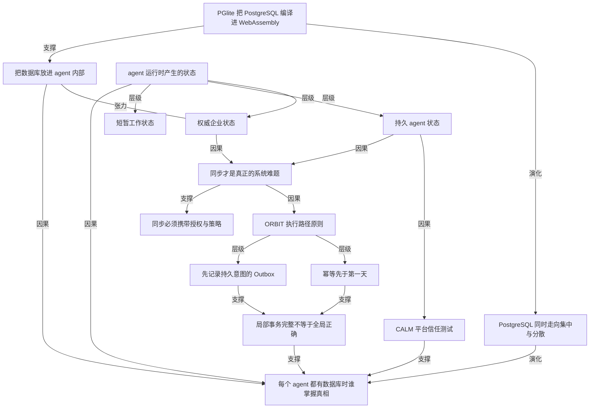

# 每个 agent 都可能需要 PostgreSQL，但不该由它掌握真相

- 原文标题：Vibhor Kumar: Every AI Agent May Need PostgreSQL. Not Every Agent Should Own the Truth.
- 作者：postgr.es
- 内参日期：2026-08-22
- 来源类型：blog
- 原文：https://postgr.es/p/9sG
- 标签：agents

> 借 Databricks 收购 Electric 说事：PGlite 周下载一年从 100 万涨到 1300 万，Postgres 正从「网络那头的服务器」变成嵌进 agent 沙箱的本地件，而真相源该留在中心。

## 导读

agent + postgreSQL

## 核心观点

- 值得注意的不是 Databricks 收购 Electric 这笔交易，而是 PostgreSQL 正在浮现的**新架构角色**：它不再只是应用连过去的服务器，还可以运行在应用内部，甚至运行在 agent 内部。
- 由此逼出全文的中心问题：**「If every agent has a database, which database owns the truth?」**——如果每个 agent 都有一个数据库，哪个数据库掌握真相。
- 作者的回答是一把分类刀：把 agent 状态切成三层（短暂工作状态、持久 agent 状态、权威企业状态），并反复强调「Local autonomy and enterprise authority are not the same thing」。
- 技术上把 PostgreSQL 塞进 WebAssembly 很迷人，但真正难的系统问题是**同步**——而且同步必须搬运的不只是行，还有授权与策略上下文。
- 作者给出两套判断工具：评估平台是否越长越可信的 **C.A.L.M. Platform Test**，以及约束 agent 执行路径的 **ORBIT** 五原则。
- 收束的判断：持久的架构问题不是能创建多少个 PostgreSQL 数据库，而是能否守住三条边界——agent 可以使用的状态、可以改变的状态、企业愿意信任的真相。

## 收购只是表象：PostgreSQL 的新架构角色

- Electric 做了两件事：PGlite（PostgreSQL 的 WebAssembly 构建，可跑在浏览器、应用、serverless 环境或 AI agent sandbox 里），以及把这些分散环境与中心 PostgreSQL 系统连起来的同步技术。
- 采用速度惊人：PGlite 在约 12 个月里从每周 100 万下载涨到 1300 万。
- 技术源头是 Neon 联合创始人 Stas Kelvich 的 PostgreSQL-to-WASM 基础工作，Electric 把它变成可嵌入数据库，用于开发工具、测试框架、浏览器 sandbox 和 AI 应用。
- 作者明确切开新闻与本质：「That is impressive execution. But the more important story is not the acquisition.」——重要的是那个正在出现的架构角色。
- 历史上 PostgreSQL 基本被部署为 server：应用跨网络连接它、执行事务、把它当作持久的 system of record。PGlite 打开了另一种可能——数据库跑进应用里，甚至跑进 agent 里。
- 直接收益：数据库贴近 agent 的执行循环，本地上下文相关的操作省掉一次网络往返。
- 直接代价：引出一个更难的问题——真相的归属。

## 为什么 agent 制造了不一样的状态问题

- 传统应用的执行路径基本已知：查询是事先设计的，数据访问模式可被测试，基础设施相对稳定。
- agent 不是这样。它在**运行时**才决定需要哪些信息、调用哪些工具、保留哪些中间结果；它会检索文档、生成 embedding、制定计划、调用外部系统、修正假设，还会与其他 agent 协作。
- 所有这些活动都在产生状态，而这些状态的命运并不相同：有的是临时的，有的必须活过这次 agent 会话，有的需要共享给别的 agent，有的最终会成为企业系统记录的一部分。
- 两个极端都不成立：
- 把每一次中间操作都发往远程数据库，引入延迟和不必要的耦合；
  - 把一切留在 agent sandbox 里，则造出一座座「isolated islands of state」——难以治理、难以对账、难以审计的状态孤岛。
- PGlite 给 agent 一个贴近执行位置的本地 PostgreSQL，Electric 的同步技术负责把分散的本地状态接回中心 PostgreSQL。Databricks 把这套组合描述为把 PostgreSQL 从 lakehouse 延伸到 edge：PGlite 在 sandbox 里运行，中心的 Lakebase PostgreSQL 提供共享状态与控制。
- 作者随即加了一道护栏：这套模式很有说服力，但**不该被理解成每一类数据都属于 agent 本地数据库**。本地自治与企业权威，从来不是一回事。

## 同一个 PostgreSQL 标准，不同的职责

- 先澄清 PGlite 是什么：它不是一个模仿 PostgreSQL 语法的 JavaScript 数据库，而是编译成 WebAssembly、打包给 JavaScript 环境的 PostgreSQL 本身。它可以在内存中运行，也可以本地持久化，并支持包括 pgvector 在内的扩展——这让 agent 能在本地环境里同时处理关系数据、元数据、全文检索与向量召回。
- 一个关键限制：PGlite 目前跑在 PostgreSQL 的 single-user mode，一个进程、一个连接。多连接支持仍在计划中，因为 WebAssembly 不提供 PostgreSQL 用于并发后端的 `fork` 模型。这本身就是把它当作 **agent 本地执行存储**、而非共享 system of record 的又一个理由。
- 这是一种重要的 PostgreSQL 杠杆：熟悉的 SQL、schema、数据类型、事务和部分扩展生态，可以被用在过去运行一台常规数据库服务器并不现实的地方。
- 但两端都用 PostgreSQL，不代表两个数据库可以互换——本地实例与中心实例承担的**职责不同**。作者由此把 agent 状态分成三类：
- **1. 短暂工作状态（Ephemeral working state）**
- 包括中间计划、临时工具结果、检索到的文档片段、一次性 embedding、测试数据和短命上下文。
  - 让它贴近 agent 可以降低延迟，让 sandbox 拥有更大的独立性。
  - 其中很大一部分「根本不需要变成企业数据」。
- **2. 持久 agent 状态（Durable agent state）**
- 包括 checkpoint、已批准的记忆、完成的工作产物，以及另一个 agent 接手任务所需的信息。
  - 它必须活过一次执行会话，但**不自动等于**权威的业务记录。
  - 这一类需要显式规则：同步、保留、归属、复用。
- **3. 权威企业状态（Authoritative enterprise state）**
- 客户记录、金融交易、权限、身份、策略、受监管信息和最终业务结果，属于受治理的 system of record。
  - agent 可以消费它，也可以提议变更它，但它的本地数据库不应「silently become an alternative source of truth」。
- 分类背后的硬判断：PostgreSQL 能在一个本地 sandbox 内保证事务完整性，却不会自动保证成千上万个独立运行的 agent 之间的正确性。
- 分类还划定了后文的审视范围：从不离开 sandbox 的短暂状态基本在讨论之外，持久状态与权威状态才是真问题的起点。

## 同步才是真正的系统难题

- 在 WebAssembly 里运行 PostgreSQL 技术上引人入胜；同步一支分布式 PostgreSQL 舰队，才是更深的架构挑战。
- 作者把难点摊成六个拷问：
- 两个 agent 更新同一个实体时会发生什么？
  - 授权已在中心被撤销，agent 却仍在继续工作怎么办？
  - 网络中断后，本地生成的事务能否被安全重放？
  - 哪些操作可以容忍最终一致，哪些必须在执行前获得中心批准？
  - schema 与策略变更如何传播到活跃的 sandbox？
  - 如何证明是哪一版数据、策略、模型和 prompt 影响了 agent 的决定？
- 这些问题决定了这套模式能否从「优雅的开发者体验」走到「可信的企业架构」。
- 由此得出一条容易被忽略的推论：**同步必须搬运的不只是行**。agent 需要合适的数据，也需要治理这份数据可以如何被使用的授权与策略上下文。数据脱离它的控制而流动，同步就会复制信息、同时削弱它的意义。
- 现实进度也被诚实标出：当前有文档的 PGlite 同步插件被描述为 alpha，其限制包括本地写的出站同步与冲突解决；Electric 的同步引擎能力更多，但文档提醒我们——架构愿景走在部分实现细节前面。
- 作者的态度不是唱衰：「That does not diminish the direction. It clarifies where the difficult engineering begins.」

## C.A.L.M. 平台测试：越长大是更可信，还是只累积运维恐惧

- 作者用 C.A.L.M. Platform Test 评估一个 PostgreSQL 架构在增长中会变得更容易信任，还是只是不断累积「operational fear」。四个维度是 Changeability、Assurance、Leverage、Measurability。
- 适用边界很清楚：对纯粹不离开 sandbox 的短暂工作状态，CALM 无话可说——一块 scratch buffer 不需要平台信任测试。它在 agent 本地状态跨入**持久或共享**领域的那一刻才变得相关：那些必须活过会话、要同步回中心、或会影响另一个 agent 下一步决定的 checkpoint、记忆与工作产物。
- **Changeability（可变更性）**
- 一套 agent 架构可能创造出成千上万乃至上百万个短命 PostgreSQL 数据库；必须搞清楚 schema、扩展、数据契约、同步规则和安全策略如何在这片分布式版图上演进。
  - 一句锋利的对照：「A database may be ephemeral. Schema incompatibility is remarkably durable.」
  - 可变更性还意味着避免这样一种设计——本地应用与某一个同步服务或中心平台绑死。PostgreSQL 兼容性应当保住架构选择权，而不是只把依赖换个地方摆。
- **Assurance（保障）**
- 起点是一个简单问题：每一类状态，由哪个 PostgreSQL 实例权威？
  - 接着是更难的问题：冲突如何处理？授权变更多快能到达一个活跃的 sandbox？agent 完成工作后敏感数据怎么办？哪些动作需要中心校验？如何防止被攻陷的本地状态污染 system of record？
  - 一句可迁移的原则：给 agent 的自治越多，越要精确地定义它的边界。
- **Leverage（杠杆）**
- 这可能是这套架构最大的强项：PostgreSQL 能在开发、测试、本地执行与中心生产之间提供共同语义；团队可以复用 SQL 知识、数据模型、迁移、事务概念和成熟工具；pgvector 这类扩展让本地 AI 召回不必引入另一种完全不同的数据库模型。
  - 环境之间少一层翻译，就少一类集成错误。但作者提醒：leverage 不等于 uniformity——同一套 PostgreSQL 底座可以承担不同的运维职责。
- **Measurability（可度量性）**
- 「Distributed autonomy without observability becomes distributed ambiguity.」
  - 企业需要度量的清单很长：同步延迟、陈旧上下文、失败的复制、冲突写入、策略传播、资源占用，以及每一个本地数据库的生命周期。
  - 还需要 lineage——把 agent 在本地观察到什么，与它最终在中心改动了什么连起来。
  - 要能回答的不只是「What did the agent do?」，还有「What did it know, under which policy, when it decided to do it?」
- CALM 的作用是把讨论从「PostgreSQL 能不能跑在 agent 里」推进到「当 agent、数据库和同步路径的数量增长时，这个平台还能不能保持可信」。

## 当 agent 开始行动：ORBIT 才登场

- 平台就绪只是问题的一半。一旦 agent 开始改动持久数据或调用外部系统，执行路径本身也必须可靠。留在本地、用完即丢的工作状态不需要这套纪律；写进持久位置或触发 sandbox 之外动作的那一刻，就需要。
- ORBIT 五条原则：
- **Outbox First**：在同步变更或调用外部系统之前，先以事务方式记录持久意图。
  - **Rate State Is Shared State**：一支 agent 舰队无法在互相隔离的 sandbox 里各自执行全局资源或 API 限额。
  - **Background Is the Unit of Execution**：同步与外部调用应作为可恢复的后台工作运行，而不是塞在长事务里。
  - **Idempotency Before Day One**：重试、重连和被重放的事件，不得重复执行底层业务动作。
  - **Trace Everything**：本地上下文、数据库变更、同步事件、工具调用与中心结果必须构成一条可追溯的执行路径。
- 一个把抽象讲透的场景：某个 agent 在本地提交了事务、调用了外部服务，然后在状态同步回中心之前失去连接。任务恢复时，它并不知道那次外部动作是否已经完成。重做一次，可能让客户被扣两次款、同一笔订单被再次提交，或者同一项基础设施变更被执行第二次。
- 分工由此一句话说清：「PostgreSQL can protect the local transaction. ORBIT is about protecting the end-to-end outcome.」

## PostgreSQL 社区接下来该审视什么

- PGlite 证明 PostgreSQL 能进入过去数据库服务器难以占据的环境；它的采用量说明市场对一个小巧、可嵌入、对扩展友好的 PostgreSQL 运行时有真实需求。
- 作者认为接下来的问题比 PGlite 或任何一笔收购都大：
- 在受限且短命的运行时里，应当保留 PostgreSQL 的哪些能力？
  - 逻辑复制能否演进得更自然地支持这类拓扑？
  - 扩展、schema 变更和安全策略应该如何分发？
  - 大规模嵌入式数据库舰队需要什么样的生命周期与可观测性标准？
  - 本地 PostgreSQL 能否在不同中心平台与同步供应商之间保持可移植？
  - 社区该把界线划在哪里——「有用的兼容」与「与服务器版 PostgreSQL 行为实质不同」之间？
- 这些问题成立，是因为 PostgreSQL 正同时朝两个方向移动：一端更分布、更弹性、与大数据与 AI 平台更紧密整合；另一端小到能跑进一个浏览器标签页、一个应用进程或一个 agent sandbox。
- 一个方向为了持久性、治理和共享真相而集中；另一个方向为了局部性、自治和速度而分散。作者判断：未来可能两者都需要。
- 因此这笔收购的意义超出交易本身——它是一个证据：PostgreSQL 正被同时视为 agentic 应用背后的数据库，以及 agent 内部的数据库。
- 全文最后落在边界上：持久的架构问题不是我们能创建多少个 PostgreSQL 数据库，而是能否守住一条清晰的界线——agent 可以使用的状态、可以改变的状态，以及企业愿意信任的真相。

## 概念网络

### 关键概念

#### PGlite

**context**：文中作为整篇讨论的技术起点出现——Electric 开发的「a WebAssembly build of PostgreSQL that can run inside a browser, application, serverless environment, or AI agent sandbox」。作者反复强调它不是模仿 PostgreSQL 语法的 JavaScript 数据库，而是编译成 WebAssembly、打包给 JavaScript 环境的 PostgreSQL 本身，支持 SQL、schema、事务和 pgvector 等扩展；12 个月内周下载量从 100 万涨到 1300 万。

**费曼一下**：过去要用 PostgreSQL，你得在某处架一台数据库服务器，程序通过网络连过去。PGlite 相当于把这台服务器压缩成一个可以塞进浏览器标签页或程序进程里的小零件，随代码一起跑。它不是「像 PostgreSQL 的东西」，它就是 PostgreSQL，只是换了个运行壳子——所以你原来会写的 SQL、建的表、开的事务，全都还能用。

#### 把数据库放进 agent 内部

**context**：作者认定的「new architectural role」——PostgreSQL 从「部署为 server、应用跨网络连接」变成「can run inside the application—or even inside the agent itself」。好处是把数据库拉近 agent 的执行循环，本地上下文相关的操作省掉一次网络往返。

**费曼一下**：以前数据库像公司总部的档案室，每个员工要查资料都得跑一趟。现在等于给每个员工桌上放一个小档案柜，随手就能翻。效率显然更高，但也立刻带来一个新麻烦：桌上柜子里的那份和总部档案室的那份，如果对不上，该信哪一份。

#### 真相归属问题

**context**：全文的中心追问，被作者单独加粗成一行——「If every agent has a database, which database owns the truth?」它把讨论从「技术可行性」拉到「架构权威」层面，也是后面三类状态分类、CALM 与 ORBIT 全部展开的起点。

**费曼一下**：数据的「真相归属」不是指数据存在哪里，而是指当多份数据打架时，以谁为准。把数据库复制到成千上万个 agent 里很容易，难的是事先说清楚：每一类信息，最终由哪一份说了算。没有这个约定，分布式系统就不是自治，而是各说各话。

#### 短暂工作状态

**context**：作者三分法的第一类（Ephemeral working state）：中间计划、临时工具结果、检索到的文档片段、一次性 embedding、测试数据、短命上下文。把它留在 agent 附近能降低延迟、提高 sandbox 的独立性，而且「Much of it does not need to become enterprise data at all」。它也是唯一被 CALM 与 ORBIT 明确豁免的一类。

**费曼一下**：这是草稿纸上的东西——演算过程、临时记的一串数字、翻过就扔的资料片段。它当然要放在手边最快取的地方，但没有人需要给草稿纸建档案制度。分清哪些是草稿纸，能让后面所有治理成本只花在真正需要的地方。

#### 持久 agent 状态

**context**：三分法的第二类（Durable agent state）：checkpoint、已批准的记忆、完成的工作产物，以及另一个 agent 接手任务所需的信息。它「must survive beyond one execution session, but it is not automatically an authoritative business record」，因此需要显式的同步、保留、归属与复用规则。

**费曼一下**：这是工作交接本——不是草稿，也还不是正式档案。它得活过今天这次任务，因为明天你或者同事要接着干。麻烦在于它处在灰色地带：既然要长期留着、还要给别人看，就必须有人回答它归谁、留多久、别人能不能拿去当依据。灰色地带没有规则，才是最容易出事的地方。

#### 权威企业状态

**context**：三分法的第三类（Authoritative enterprise state）：客户记录、金融交易、权限、身份、策略、受监管信息和最终业务结果，属于受治理的 system of record。作者的底线是 agent「may consume or propose changes to this state, but its local database should not silently become an alternative source of truth」。

**费曼一下**：这是盖了公章的正式档案。agent 可以查它、可以打报告申请改它，但绝不能因为自己手边那个小柜子写得更快更方便，就悄悄让小柜子变成事实上的公章。关键词是 silently——最危险的不是改错，而是没人意识到真相源已经被替换了。

#### 本地自治不等于企业权威

**context**：作者在介绍完 PGlite 加 Electric sync 的组合后立刻抛出的护栏句：「Local autonomy and enterprise authority are not the same thing.」它用来阻止一个很自然的滑坡——因为技术上能把数据放进 agent 本地库，就认为所有数据都该放进去。

**费曼一下**：给分部一定的自主权，和承认分部的账本就是集团的账本，是两码事。能力和权限被混为一谈，是架构里最常见的偷换。这句话的价值在于它把「做得到」和「该由谁负责」分开——技术能力扩张时，权威边界必须被单独重新论证一次。

#### 局部事务完整性不等于全局正确性

**context**：作者给三分法的收束理由：「PostgreSQL can guarantee transactional integrity inside one local sandbox without automatically guaranteeing correctness across thousands of independently operating agents.」它把 ACID 这种传统保证的作用域说清楚了。

**费曼一下**：数据库的事务保证像每个房间里的一把好锁——每个房间自己不会乱。但一栋楼里一千个房间各上各的锁，并不能保证整栋楼的账目对得上。传统数据库解决的是房间内的问题，agent 舰队制造的是房间之间的问题，两者不能互相顶替。

#### 同步必须携带控制

**context**：作者关于同步的核心推论——「synchronization must carry more than rows」。agent 需要合适的数据，也需要治理这份数据可以如何被使用的授权与策略上下文；否则「If data moves without its controls, synchronization can reproduce information while weakening its meaning」。

**费曼一下**：把一份文件复印给别人，如果不同时说明它的密级和使用范围，你复制的是文字，丢掉的是规矩。数据同步也一样：行搬过去了，「谁有权看、能用来做什么、什么时候失效」如果没跟着搬，同步就是在制造大量看似正确、实际上失去约束的副本。

#### C.A.L.M. 平台测试

**context**：作者用来判断一个 PostgreSQL 架构在增长中会变得更可信、还是只累积「operational fear」的四维框架：Changeability、Assurance、Leverage、Measurability。它对纯粹的短暂工作状态明确无话可说，只在本地状态跨入持久或共享领域时才生效。

**费曼一下**：这是一张「长大以后会不会更难管」的体检表。很多架构在小规模时很漂亮，规模一上来就变成没人敢碰的东西。CALM 的四个维度分别问：能不能改、敢不敢信、复用得到多少、看不看得见。四个都答得上来，规模增长才是加分而不是负债。

#### 数据库可短命，schema 不兼容很持久

**context**：Changeability 维度下最锋利的一句对照——「A database may be ephemeral. Schema incompatibility is remarkably durable.」背景是 agent 架构可能创造成千上万乃至上百万个短命 PostgreSQL 数据库，而 schema、扩展、数据契约、同步规则与安全策略如何在这片版图上演进，才是长期成本所在。

**费曼一下**：容器可以随时销毁重建，但它们说的「语言」不兼容这件事不会随容器一起消失。一次性的东西给人一种「反正它活不久，不必认真设计」的错觉；真正会长期跟着你的，是这些短命实体之间约定的格式。短命的是实例，长命的是契约。

#### 分布式自治没有可观测性就是分布式含混

**context**：Measurability 维度的开篇断言——「Distributed autonomy without observability becomes distributed ambiguity.」由此引出要度量的清单（同步延迟、陈旧上下文、失败复制、冲突写入、策略传播、资源占用、本地数据库生命周期）与 lineage 要求：不仅能答「agent 做了什么」，还要能答「它在什么策略下、什么时候、知道什么才这么决定」。

**费曼一下**：让一群人各自做决定，如果没人记录他们看到了什么、依据什么规则，事后你不会得到一份自治的成绩单，只会得到一团解释不清的糊涂账。可观测性不是自治的附加项，而是自治能被信任的前提——没有它，自由和失控在数据上长得一模一样。

#### ORBIT 原则

**context**：平台就绪之外的另一半问题。一旦 agent 开始改动持久数据或调用外部系统，执行路径也必须可靠，ORBIT 由五条组成：Outbox First、Rate State Is Shared State、Background Is the Unit of Execution、Idempotency Before Day One、Trace Everything。作者用一句分工收尾：「PostgreSQL can protect the local transaction. ORBIT is about protecting the end-to-end outcome.」

**费曼一下**：数据库负责「我这一步没做错」，ORBIT 负责「整件事从头到尾没出错」。这两件事差得很远：本地一笔账记得完美无缺，不妨碍外部那次扣款被重复执行。当行为跨出了数据库的边界，就需要另一套专门为跨边界设计的纪律。

#### Outbox First

**context**：ORBIT 的第一条——「Record durable intent transactionally before synchronizing changes or invoking an external system.」它针对的正是作者举的那个场景：本地事务提交、调用外部服务、同步回中心之前失联，恢复时无从判断外部动作是否已完成。

**费曼一下**：在动手之前，先把「我打算做什么」和本地这笔账一起写进同一个不可撕的本子里。这样即使中途断电，醒来后你还能看见自己当时的意图，从而决定要不要继续。区别在于：先做后记，断点处就是黑洞；先记后做，断点处至少留下一条可以接续的线索。

#### 幂等先于第一天

**context**：ORBIT 的第四条——「Idempotency Before Day One: Retries, reconnections, and replayed events must not repeat the underlying business action.」作者的后果说明相当具体：重复执行可能让客户被扣两次款、同一笔订单被再次提交、同一项基础设施变更被执行第二次。

**费曼一下**：幂等就是「同一个动作做多少遍，结果都和做一遍一样」。分布式系统里重试是常态而不是异常，所以这件事不能等出事之后再补——它得在系统的第一天就设计进去，因为事后给一个不幂等的业务动作加幂等，通常意味着重做整条链路。

### 概念网络

这张网络的枢纽是「真相归属」这个问题，它由两条独立的线索共同逼出来。

**第一条线索是技术能力的推进。** PGlite 把 PostgreSQL 编译进 WebAssembly，直接支撑了「把数据库放进 agent 内部」这个新架构角色；同一股力量也让 PostgreSQL 呈现出双向演化——一端更集中、更整合进大数据与 AI 平台，另一端小到能进浏览器标签页与 agent sandbox。能力扩张本身不产生问题，但它把「数据库可以在哪」这件事的答案从一个变成了无数个，真相归属才成为必须回答的问题。

**第二条线索是 agent 的行为特性。** agent 在运行时才决定要什么、调什么、留什么，因此持续产生状态；这些状态按寿命与权威性分成三层，是全文最具迁移价值的结构。三层之间不是并列关系而是治理强度的阶梯：短暂工作状态被明确豁免于后续所有纪律，持久 agent 状态是同步与 CALM 真正开始咬合的地方，权威企业状态则与「把数据库放进 agent 内部」构成一对持久张力——技术上它可以在本地，治理上它不该在本地。

**同步是两条线索的交汇点，也是难度的真正所在。** 持久状态和权威状态都要求跨越 sandbox 边界，于是同步从一个工程细节升级为架构主题；作者对它提出的核心要求是「携带控制」——不只搬运行，还要搬运授权与策略，否则信息被复制而意义被稀释。同步问题同时向两侧扩散：向平台一侧扩散成 CALM 的四个信任维度，向执行一侧扩散成 ORBIT 的五条纪律。

**ORBIT 与「局部完整不等于全局正确」形成闭环。** 这个判断是全文最重的一块砖：它解释了为什么数据库自带的事务保证不足以撑起 agent 舰队。Outbox First 与幂等正是针对这个缺口的两个具体补丁——前者让断点处留下可接续的意图，后者让重放不产生第二次业务后果，两者共同把「局部可靠」补成「端到端可靠」。

**CALM 与 ORBIT 是互补而非重叠的两把尺。** CALM 量的是平台随规模增长是否仍值得信任（能不能改、敢不敢信、复用多少、看不看得见），ORBIT 量的是单次执行路径是否可靠。前者面向估值架构的长期形态，后者面向一次具体行动的正确性。两者共同服务于同一个终点：让「哪个数据库掌握真相」这个问题在成千上万个 agent 的规模上仍有确定答案。

## 费曼 x3

每个 agent 都有一个数据库，听上去像是自治的胜利。真正的麻烦是紧随其后的那一句追问：哪个数据库掌握真相。

把 PostgreSQL 编译进 WebAssembly、塞进浏览器标签页或 agent 的 sandbox，技术上足够漂亮，也确实省掉了一次网络往返。但它顺手改变的东西比性能大得多：数据库从「应用连过去的那个系统」变成「运行在 agent 里的一部分」。agent 与传统应用最大的不同，是它在运行时才决定需要什么信息、调用什么工具、保留哪些中间结果，而这一切都在源源不断地产生状态。有的用完就该扔，有的必须活过这次会话，有的迟早要变成企业的正式记录。全推到远端，是延迟和不必要的耦合；全留在本地，是一座座难以治理、对账和审计的状态孤岛。

真正值得抄走的，是那把把状态切成三层的刀：短暂工作状态、持久 agent 状态、权威企业状态。分类本身并不新鲜，用在这里却极其锋利——因为本地自治和企业权威从来不是一回事。同一套 PostgreSQL 语义可以铺满两端，两端的职责却不能互换。一个 sandbox 内部的事务完整性，并不自动等于成千上万个独立运行的 agent 之间的正确性。

于是难题从数据库转移到了同步，而同步要搬运的不只是行。agent 需要数据，也需要治理这份数据如何被使用的授权和策略；数据脱离控制流动，信息被复制了，意义却被稀释了。更麻烦的是行动本身：本地事务提交完、外部服务调用完，同步之前断线，恢复时没人知道那次调用到底有没有发生。重来一次，可能就是客户被扣两次款。数据库能守住本地事务，守不住端到端的结果。

所以最后留下的问题，不是我们能创建多少个 PostgreSQL 数据库，而是能不能画清三条线：agent 可以使用的状态，可以改变的状态，以及企业愿意信任的真相。
