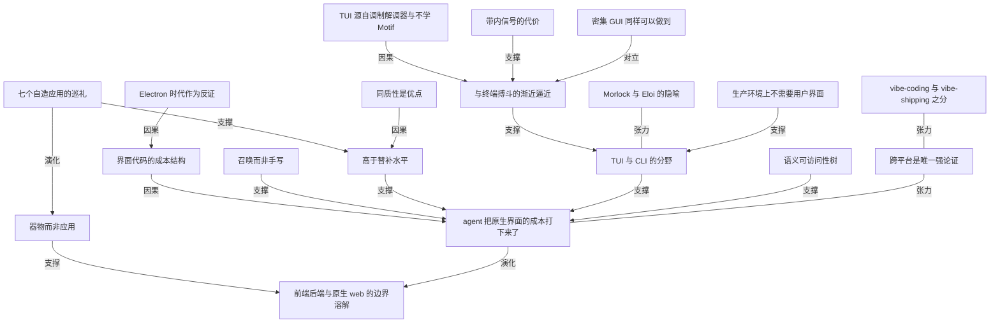

# 别再做 TUI 了：coding agent 已经把原生界面的成本打下来了

- 原文标题：Stop Making TUIs
- 作者：Quarrelsome
- 内参日期：2026-08-23
- 来源类型：blog
- 原文：https://sockpuppet.org/blog/2026/08/20/stop-making-tuis/
- 标签：agentic engineering, 工程

> Ptacek 的论点是，个人小工具做成终端界面，等于还在为一个已经不存在的成本壁垒买单——agent 现在能直接产出原生 GUI。可以拿自己手上那几个 TUI 对照一下。

## 导读

GUI vs TUI

## 核心观点

- 我们这一行和终端界面的关系很别扭，是时候重新评估它了。作者的主张只有一句：**我不是来埋葬 TUI 的，而是来劝你别再造新的 TUI**（I come not to bury TUIs, but rather to entreat you to stop building new ones）。
- 关键前提是成本结构变了：写好界面代码"繁琐、重复、精确，且被平台概念知识把关"（tedious, repetitive, exacting, and gated by platform conceptual knowledge），要花多年才能练成——所以过去没人愿意为一个自用小工具付这笔钱，只能退回终端。agent 把这笔钱降到接近零之后，退回终端的理由就消失了。
- 作者把话说得很硬：**建一个 CLI 几乎总是好主意，建一个 TUI 几乎从来都不是**（Building a CLI is almost always a good idea. Building a TUI almost never is）。CLI 和 TUI 必须分开看待——两者都是 1970 年代电传打字机和哑终端约束的产物，但 CLI 有不可替代的用途，TUI 的"过时、敌意、受限"是内在属性。
- 更大的结论在最后：在把软件开发切成前端/后端、又把前端切成 web/原生几十年之后，**agent 已经溶解了这些边界**。你可以默认为任何东西建一个原生界面，而且那个界面会相当不错。
- 全文的说服力不靠论证，靠证据：七个作者近几个月"召唤"出来的 macOS 原生应用，一行界面代码都没手写。

## 七个自造应用：一场原生界面的巡礼

- **markdown 阅读器**：作者称之为"在别人写出一个认真的 markdown 阅读器之前，世界上最好的 markdown 阅读器"。他坦承"这段界面代码我几乎没有插手。我为什么要插手？"——像大多数用户界面一样，它不开辟任何新地，不是一个有挑战的问题，只是很难做好。所以他不手写，他召唤（I summoned it）。

- **数学计算器前端**：作者花一年做完 Math Academy 从基础到机器学习（可以简称为"我自学了微积分"），顺手用 SwiftUI 造了一个 SageMath 的计算器式前端。它替他做三件事：自动把 Sage 输出渲染成 LaTeX（越往多元微积分深处走越顺手）、把向量矩阵表达式上的方法用点选方式暴露出来、提供一套速记"小语言"让常用操作（比如"取这个表达式的梯度"）几个字就能打完。他甚至不打算打包分发：**"想要的话，把这一节截图丢给 Claude，它会给你造一个能用的。"**

- **音乐播放器**：内嵌一个 LLM agent，带有读取音乐库、最近播放列表和待播队列的 tool call。"我要去地下室工坊做个相框，给我一个不用跳歌的歌单来配这个心情"——结果心情是"大量 Kurt Vile 和 Tom Petty"，无可挑剔。它由一个 SQLite 数据库做后端，schema 合理，这本身也成了意外好用的特性。作者的自我怀疑很值得记：它复刻了 `Music.app` 九成的界面（`Music.app` 是他"个人计算领域的宿敌"），这是个人计算意义上的屠龙，**但他一行代码都没写——"我到底是在开发软件，还是只是在配置我的电脑？"**

- **自驾驶 wiki**：喂给它源材料、向它提问，它替你把 wiki 写出来。与直接内嵌 Responses API 客户端的播放器不同，这个应用在底层驱动 agent；因为作者假定"agent 有个文件系统可以翻会工作得更好"，他还召唤了一个 macOS 虚拟文件系统扩展，把背后 SQLite 数据库的只读视图挂载进应用沙箱。**这大概是不必要的、也让安装更麻烦，但"这类刮羊毛式的岔路正是前 LLM 时代软件开发的乐趣，我很高兴今天还能体验到它"。**
- **半自动饮食记录器**：又一个套在 GPT5 前面的简单 agent，接受极短的餐食描述并翻译成摄入估算。

- **菜单栏温度计**：用家里几个廉价 TP-Link 温度传感器追踪各房间温度。作者的坦白是这段的重点——换在过去，做完这种东西他能给你讲一堆协议和 HTTP API 细节，"但这次弄清楚这些的活我一件没干"，他只知道有两条登录路径，一条走云端一条直连传感器。

- **菜单栏 Apple TV 遥控器**：作者称之为 macOS 原生桌面软件开发的圣杯，"几年前我愿意为它付一大笔钱"。直接和 Apple TV 通信很麻烦，但别人早就搞定并写了 Python 库；他不"使用"那些库，因为这是一个原生 Swift 应用，**"但这不重要：用 Python 写过的东西，跟用 Swift、C# 甚至 Brainfuck 写过没有区别——对前沿模型来说都一样。"**
- **对视觉设计的自我防御**：作者预料到炫耀一堆生成的 SwiftUI 界面会招来毫不留情的设计批评，"放马过来"。但他作为 App Store 的老主顾主张：这些设计都比替补水平高一档；**五年前，如果团队里有一个 macOS 界面工程师能交出这个质量，他会高兴坏了**。
- **定性**：他其实不太把这些当"应用"（没有分发意图），它们是"我让电脑替我做事、按我想要的方式做事"的器物。作为 Unix 老手，他一直能用命令行的语言做这件事；**现在，用图形界面做同样的事变得一样容易了。**

## TUI 不是机器亲和性的产物，而是历史约束的遗留

- **先分开 CLI 和 TUI**：命令行界面和终端用户界面都是 1970 年代的产物，是围着电传打字机和哑终端的约束收缩包装出来的。相对图形界面，两者都倾向于过时、有敌意、受限——**但这些倾向是 TUI 内在的，不是 CLI 内在的**。
- **对"命令行圣经"的清算**：1999 年 Neal Stephenson 写的那篇命令行随笔"把人机交互这个领域往回推了大约 20 年"。文中把手持 CLI 的 Unix 极客描绘成扛起整个计算工业的 Morlock，用 Word 这类 GUI 的是 Eloi。因为这是高纯度的粉丝服务，它成了这一行的圣典之一，**尽管 25 年后其中站得住脚的内容极少**。
- **TUI 存在的真实原因只有两个**：调制解调器，以及 Unix 极客不想学 Motif。作者不怪他们——他 1990 年代中期做过一点点 Motif 的活，直接把他挡在界面开发之外 29 年。
- **curses 也不神秘**：今天你不会选原始 curses 写 TUI，但你可以让 ChatGPT 给你一个"写出 pico 所需的最低限度"的简短说明（"别浪费时间解释概念"），拿到代码编译就能跑，往哪走也一目了然。**里面本来就没多少东西**。
- **原生界面的同质性是优点**：agent 能可靠地造出一个合理的 macOS 原生界面，靠的是按 Apple 说的方式用 SwiftUI 框架。这正是原生应用和 web 界面的一个区别——**长得一样是好事，原生应用本来就该长得像别的原生应用**。
- **TUI 的结构性劣势**：即使有 Ratatui、Textual、Bubbletea 这样的好框架，你也是在和终端搏斗，只为渐近逼近每个原生框架开箱即做得很好的东西。作者点名的清单：滚动与滚动目标、拖放、文本选择（用带内信号画窗口边框时选择就变得棘手）、多个浮动窗口——**这还没说到图片处理**。
- **一小时的成果不等于可用**：你花一小时能在 TUI 框架里做出一批标准控件的像样版本（日期选择器、密码输入框、进度条、文本编辑器），但大多数都不如系统自带的同类好，而且**不额外做更多工作就组合不到一起去**。这些在原生界面里全是开箱即用。

## 逐条拆解为 TUI 辩护的四个论证

- **论证一：TUI 经济、快速、信息密度高**，极客喜欢它不只是复古审美，而是几个按键就能秒杀复杂任务。作者承认这些陈述**都是真的**——但要让这个论证成立，得在开头加上"只有"两个字，而加上就是撒谎。图形界面通常不经济、不密集、不键盘友好，**但那通常是因为它们不是为极客设计的**（哪怕在 Linux 上，图形界面也常常是为神话中的"普通桌面用户"而做）。没有任何东西阻止你设计一个密集而经济的 GUI——**这已经被做出来过了**（彭博终端）。反过来，这些 TUI 的好处恰恰是多做图形工作的有力论据：实验成本已经变得又便宜又容易，作者想看到一个把 Magit 或 Lazygit 一切优点都捕捉进来的原生界面（而且不必自己动手造）。
- **论证二：TUI 能在 SSH 上用，生产环境上的界面只能是 TUI**。问题在于**你很可能根本不需要生产环境上的用户界面**——你需要的是生产环境上的一个 CLI，由你 MacBook 上的界面来驱动它。任何用 bpftrace 干过事的人，在第三次用井号拼出条形图的时候就该在骨子里明白这一点。先例是现成的：Emacs TRAMP 高效地把 SSH 连接藏起来，为远程文件呈现一个原生（想要的话是图形的）编辑器体验，**甚至连 LSP 和 Magit 都能用**。
- **论证三：TUI 更可访问**。这个论证很可能是假的。作者在这里很谨慎——他自己不是可访问性功能的用户，只能转述做 a11y 工作的人的经验：**屏幕阅读器会把 TUI"外框装饰"逐行的更新全部念出来**，听起来很糟。现代原生界面框架从一开始就是奔着把可访问性做好去设计的，SwiftUI 维护两棵 UI 树，一棵视觉的、一棵语义可访问性树。有 TUI 框架在令人敬佩地尝试做对这件事；**作者的立场不是 TUI 不可能可访问，只是可访问性不构成偏好 TUI 而非 GUI 的理由**。
- **论证四（作者承认是强论证）：TUI 跨平台**。他相信 agent 也能在 Windows 和 Linux 上给他造出合理的原生界面，但他没有 Windows 和 Linux 桌面可以实际用那些界面——**"vibe-coding 和 vibe-shipping 之间仍然存在一个重要区别"**。很快会有人发布一个自己压根没看过没用过的应用，但那个人不会是他。反过来说：如果他做 TUI，Linux 用户能得到和他一样的体验，这不是小事；**但他本来就不是在给别人造应用，他是给自己造**——为了一批他根本不想发布的程序去照顾 Linux 用户，TUI 的代价太大了。
- **时间点判断**：几年前这些论证都会很荒唐，不是因为 TUI 好，而是因为**原生界面在那时不是一个合理的要求**。证据是我们和 Electron 应用一起过了大半个十年，那是因为原生界面难做好。**但现在不难了，我们该多做一点。**

## 动手门槛已经很低：作者的实际工序

- 作者声明只能替 macOS 开发说话，并假定 Linux 的 GTK 4 和 Windows 的 WinUI 3 难度相当。
- **收集 skill**：他去搜罗现成 skill，最后拿了一个 macOS 设计 skill、一个基础排版 skill（他认为今天在开源平台上随便找一个都比他用的好）、Paul Hudson 的 SwiftUI skill，还拿了 Airbnb 的 Swift 语言 skill——**因为他还没长大到不在乎自己生成的代码是否地道**。
- **让 agent 能看见并驱动应用**：这是"发起任务、去做午饭、回来时应用已经好到能愉快调试"的前提。
- **最大的生活质量提升是再也不用打开 Xcode**：朋友 Josh 在尝试自己编译那个 markdown 阅读器之后，做了一套纯 Makefile 驱动的构建流程，他就让 Claude 把它复制到每个新项目里。
- **整个工序就这些**：复制一个模板应用目录，在里面打开 Claude 或 Codex，告诉它要造什么。作者不认为自己的模板特别好，**并公开呼吁比他更胜任的人去做一个真正好的 SwiftUI 原型应用**。
- 他用类似流程也造 TUI 应用（并建议让 agent 去测试 TUI，效果很好），**"但我不确定我还会不会想再造一个 TUI"**。

## 真正的变化：分工边界被溶解

- **这不是审美偏好之争**：作者承认自己从来不真的喜欢 TUI——1990 年代他是 Mutt 用户（在此之前是 Elm、再之前是 Pine），直到能停下来改用图形邮件客户端的那一刻。所以整篇可以被读成一次刻薄的个人偏好告白，"这种事，跟我的人设很搭"。
- **但有趣的不是你喜不喜欢终端界面**。作者说他不是来扫你的兴，他只是注意到一件他认为还没有破圈的事：**在把软件开发分成前端和后端、又把前端分成 web 和原生几十年之后，agent 溶解了这些边界中的大部分**。你可以合理地默认为各种东西建原生用户界面，而且那些界面会相当不错。
- **对自我认同的重新校准**：如果你像作者一样，几十年来一直把自己想成"一个不生产界面代码的系统程序员"，或者更糟——**"你在这一行的位置就是生产那种用 ASCII 字符画窗口的界面代码"，那么是时候重新校准了**。
- **收尾的号召**：不在乎界面是一回事，为了 1970 年代的怪异审美而厌恶好界面也是一回事，作者不打算羞辱任何癖好（他自己也有过跑 Enlightenment 的年代）。但如果你是那种同时偷偷同情 Eloi、欣赏过 NetNewsWire、Transmit、Little Snitch、Audio Hijack 这类界面的 Unix Morlock，**那么你还没把你那 500 个一次性 CLI 中的任何一个变成原生应用，就是在亏待自己。去造一个原生界面吧，它很可能会改变你思考的方式。**

## 概念网络

### 关键概念

#### TUI 与 CLI 的分野

**context**：全文最关键的一次概念切分。作者强调两者虽同为 1970 年代电传打字机与哑终端约束的产物，但"过时、敌意、受限"这些倾向"是 TUI 内在的，不是 CLI 内在的"，并由此得出全文的操作性结论——"建一个 CLI 几乎总是好主意，建一个 TUI 几乎从来都不是"。

**费曼一下**：命令行是一种"发指令、拿结果"的接口，它的价值在于可组合、可脚本化、可被别的程序驱动，这些优点跟屏幕长什么样无关。终端界面则是在一块只能放字符的画布上模拟窗口、滚动条和按钮——它继承了终端的全部限制，却没有继承命令行的可组合优点。把两者一起骂或一起捧，都会得出错误结论。

#### 召唤（summon）而非手写

**context**：作者描述自己生成 macOS 应用的方式时反复用"summoned it""willed into being"这类动词，并明确说界面代码"我几乎没有插手。我为什么要插手？"

**费曼一下**：过去写界面是"逐行盖房子"，现在更像"说出你要什么，房子就出现了"。这个动词的选择不是修辞：它标记了作者与代码关系的变化——他对生成物的所有权来自需求和判断，而不是来自敲下的每一行。这也是他会问出"我到底是在开发软件，还是只是在配置我的电脑"的原因。

#### 界面代码的成本结构

**context**：作者对界面工作的判断是"繁琐、重复、精确，且被平台概念知识把关"，"要花很多年才能做好这类活"，所以他"永远不会手写这个程序"。

**费曼一下**：一件事贵不贵，不只看它难不难，还看它要不要长期投入才能做对。界面代码不难在算法，难在细节量大、容错低，而且必须先吃透一个平台的整套约定。这是典型的"高门槛低创造性"工作——也正是这类工作最容易被 agent 吃掉，因为它有大量既定正确答案可循。

#### 高于替补水平（replacement-level）

**context**：作者预判会有人批评这些生成界面的视觉设计，他的辩护是这些设计"都比替补水平高一档"，并给出时间坐标——"五年前，如果我团队里有一个 macOS 界面工程师能交出这个质量，我会高兴坏了"。

**费曼一下**：这是从棒球借来的判据："替补水平"指从板凳上随便找个人来干能达到的水平。它把"这界面漂亮吗"这个无解的审美问题，换成了"它比现实中我能雇到的人做得更好还是更差"这个可比较的问题。判断新工具时用这个基准，比用理想水平当基准诚实得多。

#### 同质性是优点（sameyness is a good thing）

**context**：作者用它解释为什么 agent 能可靠地生成合理的原生界面——靠"按 Apple 告诉你的方式使用 SwiftUI 框架"，并指出这是原生应用与 web 界面的一个区别，"原生应用本来就该长得像别的原生应用"。

**费曼一下**：在 web 上，"跟别人一样"是设计失败；在原生平台上，"跟别人一样"是设计成功，因为用户的肌肉记忆是跨应用共享的。这一条对 agent 生成尤其关键：当"正确答案"高度收敛且被官方文档写死，模型就能稳定命中；当"正确答案"取决于品牌个性，它就命中不了。

#### 与终端搏斗的渐近逼近

**context**：作者对 TUI 框架的核心批评——即使有 Ratatui、Textual、Bubbletea 这类好框架，"你也是在和终端搏斗，只为渐近逼近每个原生框架开箱就做得很好的东西"，并列出滚动目标、拖放、文本选择、多浮动窗口、图片处理这一串。

**费曼一下**："渐近逼近"是数学里"永远接近但到不了"的说法。用在这里的意思是：TUI 的每一分投入都花在追赶原生界面的默认值上，而不是花在你真正想做的东西上。判断一个技术栈值不值得，可以问这个问题——我的努力是在拉高上限，还是在填补它自带的坑？

#### 带内信号（in-band signaling）的代价

**context**：作者举文本选择为例说明 TUI 的结构性别扭——"当你在用带内信号来画窗口边框的时候，文本选择就变得棘手了"。

**费曼一下**：带内信号指控制指令和数据挤在同一条通道里传输。终端就是这样：画边框的字符和你想复制的正文，在同一片字符网格上无法区分。所以你选中一段文字时，边框也会被一起选走。原生界面把"画什么"和"内容是什么"分成两层，就不会有这个问题。

#### Morlock 与 Eloi 的隐喻

**context**：作者用它清算 1999 年那篇命令行随笔——文中把手持 CLI 的 Unix 极客描绘成扛起整个计算工业的 Morlock，把用 Word 的人描绘成 Eloi；作者称之为"高纯度粉丝服务"，说它"把人机交互这个领域往回推了大约 20 年"，且 25 年后"站得住脚的内容极少"。

**费曼一下**：这两个名字来自《时间机器》：Morlock 是地下的劳作者，Eloi 是地上的享乐者。这个隐喻好用又危险——它把工具选择包装成身份和道德等级，于是"我用终端"变成了"我更认真"。作者指出的正是这一点：当一种技术偏好被写成圣典，它就不再需要论证了。

#### 生产环境上不需要用户界面

**context**：作者回应"TUI 能在 SSH 上用"这一论证时的反转——"你需要的是生产环境上的一个 CLI，由你 MacBook 上的用户界面来驱动它"，并以 Emacs TRAMP 为先例，它把 SSH 连接高效地藏起来，为远程文件呈现原生编辑体验。

**费曼一下**：这是一次职责的重新划分：远端只负责"能被调用"，本地负责"好用"。一旦接受这个划分，"远端环境很简陋"就不再是把界面做简陋的理由。作者提到有人第三次用井号拼出条形图时就该明白——你不是需要在服务器上画图，你是需要服务器把数据吐出来给本地画。

#### 语义可访问性树

**context**：作者反驳"TUI 更可访问"时给出的技术事实——现代原生框架从一开始就奔着做好可访问性设计，"SwiftUI 维护两棵 UI 树，一棵视觉的、一棵语义可访问性树"；而屏幕阅读器会把 TUI 外框装饰的逐行更新全都念出来。

**费曼一下**：屏幕阅读器需要知道"这是一个按钮，标签是保存"，而不是"这里有一片像素/字符"。原生框架额外维护一棵只讲语义的树，专供辅助技术读取。字符界面没有这一层——所有东西都是字符，所以阅读器只能把画面当文本念，包括那些纯装饰的边框。这解释了为什么"看起来是纯文本"不等于"对读屏友好"。

#### vibe-coding 与 vibe-shipping 之分

**context**：作者承认跨平台是 TUI 唯一的强论证时的自我约束——他相信 agent 能在 Windows 和 Linux 上生成合理界面，但他没有那些桌面去实际用；"我想我们都能同意，vibe-coding 和 vibe-shipping 之间仍然存在一个重要区别"，"很快会有人发布一个自己压根没看过没用过的应用，但那不会是我"。

**费曼一下**：让模型替你写出来，和把它交到别人手里，是两件责任等级完全不同的事。前者的失败只损害你自己，后者的失败损害用户。这条界线画在"我是否亲自用过它"上——一个很朴素但很硬的验收标准，也是这篇文章里少数没有被 agent 降低成本的东西。

#### 器物而非应用

**context**：作者对这七个程序的定性——他"其实不太把它们当作应用"（没有分发意图），它们是"我让电脑替我做事、按我想要的方式做事"的产物；作为 Unix 老手他一直能用命令行的语言做这件事，"现在，用图形界面做同样的事变得一样容易了"。

**费曼一下**：软件有两种：一种是产品，要考虑陌生用户、边界情况、安装分发；一种是器物，只服务一个人一种用法，可以理直气壮地简陋、可以硬编码你的偏好。极客一直在用脚本这么做，只是过去这条路的尽头只能是命令行。当图形界面也进入器物的成本区间，个人计算的可塑范围就扩大了一块。

#### 边界溶解

**context**：全文的最终结论——在把软件开发切成前端和后端、又把前端切成 web 和原生几十年之后，"agent 已经溶解了这些边界中的大部分"；由此而来的是身份重新校准，尤其对那些"把自己想成不生产界面代码的系统程序员"的人。

**费曼一下**：专业分工往往不是因为两件事本质不同，而是因为跨过去的学习成本太高，久而久之成本差异固化成身份。当跨越成本塌掉，分工的理由就消失了，但身份认同会滞后。作者提醒的正是这个滞后——你可能还在用一套已经失效的成本假设，来决定自己"是干什么的"。

#### Electron 时代作为反证

**context**：作者用它给"原生界面从前不是合理要求"这一判断提供证据——"作为证据，请注意我们已经和 Electron 应用一起过了大半个十年。那是因为原生界面难做好。但现在不难了，我们该多做一点。"

**费曼一下**：一整个行业绕远路的现象，通常是成本约束的化石，而不是审美选择。用网页技术打包桌面应用之所以流行，是因为原生开发的人才和时间太贵。把它当作反证来读的意思是：只要那个约束真的松了，这个绕路的选择也应该跟着被重新审视——但行业惯性不会自动做这件事。

### 概念网络

- **主干是一条成本链**：界面代码的成本结构（繁琐、重复、精确、被平台知识把关）曾经是一切的前提；agent 把这条成本压塌，"召唤而非手写"成为可行的工作方式，于是核心主张成立——原生界面的成本已经被打下来了。Electron 时代作为反证从另一头夹住这条链：一整个行业绕道网页技术做桌面应用，恰恰证明了原来那笔成本有多重。
- **证据层与主张层的关系**：七个自造应用是全文唯一的实证，它同时支撑两件事——向上支撑"高于替补水平"这个可比较的质量判据，向前演化出"器物而非应用"这个定性。"同质性是优点"是质量判据能成立的机制解释：因为原生平台的正确答案高度收敛，模型才能稳定命中；这也解释了为什么同样的方法在需要品牌个性的 web 界面上不那么灵。
- **反方阵营的内部结构**：TUI 与 CLI 的分野是全文的论证枢纽——它把"终端"这个笼统对象拆成必须保留的和应该停止新建的两半。支撑这一刀的是三条独立证据：与终端搏斗的渐近逼近（努力全花在追赶默认值上）、带内信号的代价（画边框和内容挤在同一层，所以文本选择必然别扭）、以及生产环境上不需要用户界面（远端只需可被调用，好用交给本地）。语义可访问性树则从另一侧支撑核心主张：它把"可访问性"这个常被算作 TUI 优势的项目，反过来记到了原生框架名下。
- **张力，而不是驳倒**：作者对三个 TUI 论证的处理方式并不相同。密度论被正面对立——密集 GUI 同样可以做到，所以"信息密度"不构成 TUI 独占的理由。Morlock 与 Eloi 的隐喻与那把分界刀之间是张力：它不提供论据，只是把工具选择升格成身份和道德等级，从而让论证不再必要。跨平台论证是作者唯一承认的强论证，与核心主张构成真张力而非对立；而 vibe-coding 与 vibe-shipping 之分反过来又削弱了它——正因为作者不打算把没亲手用过的东西发出去，跨平台带来的好处对他而言并不兑现。
- **终点是身份而非技术**：核心主张与"器物而非应用"共同指向边界溶解。前者说的是成本，后者说的是意图，两者叠加得出的不是"该用哪个框架"，而是"你以为自己是干什么的"这个问题需要重新校准——分工的理由消失了，身份认同却会滞后。

## 费曼 x3

技术选择常常被当成品味问题争论，但绝大多数所谓的品味，其实是成本结构结晶出来的化石。为什么几十年来无数好用的小工具都长成了终端里的样子？不是因为字符画的窗口更贴近机器的本质，而是因为写好一个图形界面这件事，繁琐、重复、精确，还被平台的整套概念知识把在门口——它要花掉一个人好几年，而没人愿意为一个只有自己用的小玩意付这个价。于是所有人退回终端，然后把这个退让追认成审美，甚至追认成美德。

一旦有人把那笔成本抹掉，化石就露馅了。真正有说服力的不是论证，是一个人几个月里攒出的七个自用原生应用：一个 markdown 阅读器、一个会把矩阵渲染成公式的数学计算器、一个内嵌 agent 的音乐播放器、一个会自己写词条的 wiki、一个菜单栏温度计。他一行界面代码都没写。他甚至不打算分发其中任何一个——"想要的话，把这一节截图丢给 Claude，它会给你造一个能用的"。

值得停下来的是他的自我怀疑：这个播放器复刻了系统自带播放器九成的界面，那是他多年的宿敌，但他一行代码没写——"我到底是在开发软件，还是只是在配置我的电脑？"这个问题比它的答案更重要。因为软件本来就有两种：一种是产品，要面对陌生用户；一种是器物，只服务一个人，可以理直气壮地简陋。极客一直用脚本造器物，只是过去这条路只能通向命令行。现在它也通向图形界面了。

所以那些为终端界面辩护的说法需要重新过一遍秤。信息密度不是终端独占的，密集的图形界面早就被做出来过，只是大多数图形界面本来就不是为极客设计的。远程也站不住：你需要的不是生产环境上的界面，而是生产环境上的一个命令行，由你笔记本上的界面去驱动它。可访问性甚至是反过来的——屏幕阅读器会把终端外框装饰的每一行更新都念出来，而现代原生框架从一开始就维护着两棵树，一棵给眼睛，一棵给语义。唯一站得住的是跨平台，而它也被另一条更硬的界线削掉一半：让模型替你写出来，和把它交到别人手里，责任等级完全不同。

真正被改写的其实不是框架选择，而是身份。把软件切成前端和后端、又把前端切成 web 和原生，这些分工从来不是因为两件事本质不同，而是因为跨过去太贵；贵久了，成本差异就固化成了"我是干什么的"。现在跨越成本塌了，认同却还没跟上。如果你几十年来一直把自己想成一个不产出界面代码的系统程序员，或者更糟——你在这行的位置就是用字符画窗口，那么是时候重新校准了。去造一个原生界面，它很可能会改变你思考的方式。
