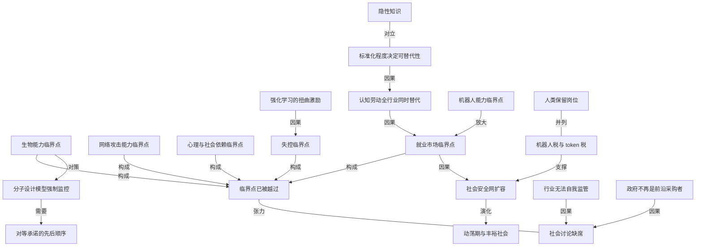

# 独家对话盖茨：AI 已越过临界点，社会却几乎没在讨论

- 原文标题：独家对话比尔·盖茨：AI已跨过临界点，社会却几乎没有讨论
- 作者：麻省理工科技评论APP
- 内参日期：2026-08-27
- 来源类型：公众号
- 原文：https://mp.weixin.qq.com/s/9UQJ2Sv69HOMzM0MMo7tVw
- 标签：ai 时代, 社会

> 盖茨的警告是多个危险临界点已经跨过，未来几年就业、安全和社会秩序会被同时冲击，而公共讨论的密度远远不够。麻省理工科技评论中文版长访谈。

## 导读

盖茨访谈，AI 已过临界点，社会不在乎

## 核心观点

- 70 岁的比尔·盖茨在《麻省理工科技评论》的这次长谈里，把自己的角色定义为“刺耳的警报声”：多个原本被承诺“等接近了再设防”的危险临界点，已经在今年被悄悄越过，而设防没有发生。
- 他给出的清单是五条：生物能力、网络攻击能力、心理和社会影响、摧毁就业市场的能力，以及 AI 失控风险。“我真正震惊的是，整个行业之外，居然几乎没有足够的担忧和讨论。”
- 这不是一次纯粹的唱衰。盖茨仍然认为 AI 在农业、医疗、教育和公共行政上有巨大价值，最终可能把社会带向物质丰裕的时代——但在那之前，人类必须先熬过一段“非常剧烈的动荡期”，他给出的时间尺度是 10 到 20 年。
- 他带来的不只是警告，还有两个具体到有点激进的政策设想：机器人税与 token 税，以及“人类保留岗位”（human-reserved jobs）。文章本身并不自称是解决方案，它的目的是把讨论启动起来。
- 访谈的情绪底色值得注意：一个财富来自科技行业的亿万富翁站出来批评创新本身，他自己也承认这“很反常”，而这种反常恰恰是他认为自己的话可能更有说服力的原因。

## 为什么是现在：临界点不是未来时，是完成时

- 盖茨自陈站出来有两个原因。第一个是临界点已经跨过：无论生物能力、网络攻击能力、心理和社会影响，还是对就业市场的破坏能力，甚至失控风险，“我们都已经开始看到问题的迹象”。
- 关键在于这个承诺句式的失效。多年来行业的说法一直是：“等我们快接近这些临界点时，再认真研究怎么保证只有好人能用这些技术，或者怎样阻止模型做这些事情。也许到那个时候，我们就不能再允许人们随便复制模型了。”盖茨说，让他震惊的是我们现在已经越过去了。
- 第二个原因是行业之外的沉默。行业内部“不太喜欢批评自己，公司之间也不愿意互相批评”；而外部社会连基本的讨论都没有开始。
- 目前唯一可见的迹象很温和：一些公司开始减少招聘初级员工。盖茨明确说这“只能算一个非常温和的信号”，真正的变化不会等很久。
- 他自己的觉醒点很具体：去年最后一个季度，编程能力的跃迁让他震惊——Claude Code、上下文缓冲区（context buffer）、智能代理式方法（agentic approach），加上底层模型本身。但直到几个月后他才意识到，那不只是编程能力的临界点，同时也是一个巨大的网络攻击能力临界点。“然后呢？发生了什么？几乎什么也没发生。”

## 旧经验为什么会误导你

- 最常见的安慰句是“以前从来没有哪一种新技术导致就业岗位净减少”。盖茨承认这句话没错，也承认自己过去讲过，但他要求读者给他一点可信度：这一次真的不一样。
- 他给出的差异条件是四条叠加：同时进入所有行业、以远低于人类劳动成本的价格、替代极高比例岗位中的人类认知劳动、错误率最终甚至可能比人类更低。四条同时成立，历史经验就没有多少参考价值。
- 他甚至认为当下的经济统计数据本身就有误导性——变化正在发生的地方，还没有被现有指标捕捉到。
- 对当前社会上仅有的那点担忧，他给了一个尖锐的定位：抗议“别再建数据中心了”是找错了靶子。就算美国今天停掉所有数据中心，数据中心也会在全球其他地方继续建。“这就像对着一家石油公司的高管大喊大叫，并不能真正解决气候变化一样。”

## 就业冲击的真实形状：白领先行，机器人随后

- 盖茨把工作分成两类。一类需要漫长积累的隐性判断，他用沃伦·巴菲特（Warren Buffett）举例：从 13 岁起对企业价值判断做了 80 多年的“强化学习”，脑子里全是隐性知识。造不出“巴菲特式的 AI 投资人”，是因为没人记录下他一辈子学过的每件事，模型拿不到完整的学习轨迹。
- 另一类则相反，他估计就业市场里可能有 50% 的工作不需要一辈子经验：电话销售、电话客服、财务部门。月底结账哪些收入该计入、某个客户该给多少折扣、账面怎么体现——“这些事情的规则其实都非常明确”。
- 判据被压缩成一句话：只要一项工作足够标准化、定义得足够清楚，AI 就可以做到更便宜，而且更好。
- 他也承认 AI 部署失败的案例真实存在——实施方法有问题、数据不对——所以可能还需要几年，人们才会真正意识到这么高比例的白领工作能用成本低得多的 AI 完成。
- 但对整个劳动力市场而言，他的结论是临界点已经过去：对很大一批白领岗位、包括几乎所有入门级岗位，只要 AI 被正确部署，它现在已经更便宜了。
- 机器人是尚未落下的另一只鞋。中国稍微领先美国，两边都在快速推进。机器人的特点是一旦跨过能力临界点会瞬间影响很多行业——一个机器人只要好到能进工厂，大概率也足够好去做饭、打扫房间、进建筑工地、替代仓库里的大量工作。那时可能“砰”的一下，接近 30% 的就业市场都会受影响，社会才会突然问：“我的天，我们到底有什么政策？”
- 替代比例决定社会形态：如果最终替代 50%，可以谈提前退休和缩短工作周；如果只有 10% 到 15%，那会是一个完全不同的社会。

## 生物与失控：两条最尖锐的线

- 生物风险是盖茨最不安的一条。他的规则很短：“任何能够设计新分子的模型，都应该受到监控。”并且不能允许这种模型被完整复制到某个黑箱环境里，然后把监控机制全部删除。
- 他要求美国明确立规：只要一个模型有能力设计新分子，它就必须接受监控；同时必须加强监测体系。
- 风险量级判断是这次访谈里最刺目的数字：相比自然发生的大流行，他认为生物恐怖主义的风险大约要可怕 50 倍，也更可能发生。
- 他对成本收益的算法也很直白：所谓“生物恐怖主义市场”根本不大，但防止这种风险带来的收益巨大。所以他主张直接去和中国谈成一致——“这有什么坏处？”“他们为什么会反对？”
- 失控临界点是他最近才被说服的一条。他推荐瑞安·格林布拉特（Ryan Greenblatt）和德瓦尔凯什·帕特尔（Dwarkesh Patel）的对谈：强化学习有时会创造出扭曲的激励机制，导致不同 AI 之间出现欺骗甚至协作行为。连深入研究这个问题的人自己都在说，强化学习正在产生“我们目前的显式指令根本不足以阻止的行为”。
- 他原本以为，等到“一个完全没有技术背景的人仅靠 AI 就能发动网络攻击”这种临界点接近时，社会一定会出现大量警告声。“但现在呢？我们已经到了。”
- 政府侧还有一个结构性缺口：过去技术进步时政府深度参与，因为政府本身是喷气式飞机、火箭这类前沿技术的重要采购者。今天政府既不是 AI 最重要的前沿客户，也不是主要的研发资助者，所以政府内部的技术认知未必够深。
- 网络安全与生物安全都存在同一个悖论：一旦公开讨论某种风险，某种程度上也可能让更多人意识到这种攻击方式。政府在网络安全上其实“非常、非常担心”，但会纠结要不要公开说。盖茨的结论是：无论如何，我们已经越过任何合理意义上的警戒线了。

## 政策工具箱：机器人税、token 税与人类保留岗位

- token 税的粗略设想：token 税收入的 50% 交给政府，政府用这笔钱帮助那些因为 AI 而失去工作的人。他自己立刻提出反驳意见——这会拖慢行业发展吗？某些用途该不该免税？而免税又立刻遇到一个真问题：我们真的能清楚区分“帮助人类创新的 AI”和“替代工作岗位的 AI”吗？
- 他用阿西莫夫来放大这个难题：如果有人能告诉他怎样对 AI 下达“不得替代就业”的指令当然很好，但机器人不能伤害人类——抢走我的工作算不算伤害？“可能得去问阿西莫夫本人到底是什么意思。”
- 更根本的问题被他还原成一句：未来如果必须加强社会安全网，这笔钱从哪里来？他明确反对政府直接持有企业股份（“在我看来，那反而很荒唐”），因为联邦政府本来就通过企业所得税分享所有美国公司的部分利润，完全可以把税率调回更高水平或对某些行业加征。
- token 税的税种定位：本质上更像销售税或增值税，也可以设计成类似烟草税、酒税或奢侈品税的行业专项税。
- 机器人侧则是“限制使用”和“征税”两者结合，因为机器人的能力扩散是瞬时的。
- 全民基本收入：他的态度不是原则性反对，而是时机判断——“我们现在还没有富裕到能够负担全民基本收入。”未来 10 到 20 年是动荡期，之后社会可能进入相对稳定的丰裕状态；但今天仍然有赢家和输家，住房不会很快便宜，教育也一样，因为教育仍与学历证书紧密绑定。
- “人类保留岗位”指由社会决定，某些工作即使 AI 或机器人完全有能力完成，也仍然只允许人类来做；哪些岗位该保留，不同国家可以有不同答案。
- 盖茨承认这个概念在 AI 出现以前是“有点愚蠢的想法”，因为过去社会对劳动几乎有无限需求。纺织工人被淘汰时问题是福利和再培训，技术整体上一直是就业的净创造者。现在才第一次不得不认真问：那托育怎么办？家庭里的做饭怎么办？
- 保留的两个理由被他分得很清楚：其一，有些工作可能永远该由人类做，因为它涉及某种“何以为人”的问题；其二，也可能只是过渡措施——一个 53 岁的卡车司机或机床工人，你突然告诉他“你去做托育吧”，未必现实，那就规定他原来的岗位在未来十年里暂时属于人类保留岗位。
- 这项政策还会外溢到贸易。类似欧盟的碳边境调节机制（CBAM）：如果一个国家要求某些商品必须由人类生产、不能使用机器人，那进口商品也得承担相应成本，否则国内企业根本竞争不过。
- 达成共识会非常难，因为人的偏好并不一致。人们喜欢看真人打棒球，所以还有人花 100 亿美元买体育俱乐部（他提到朋友维诺德·科斯拉最近就这么干了）；但换成出行，“至少我认识的大多数人更愿意坐 Waymo”。
- 教育与医疗是他给出的“人机并存”样板：AI 该进教育，做随时在线的私人导师、立刻批改作业、按学生水平出挑战、高度个性化；但你仍然会希望有真人老师，因为老师能和你讨论学习动力、组织孩子分组、在真实社会互动中一起解决问题。心理健康服务同理——关键节点真人交流仍然重要，同时你一定希望 AI 深度参与，因为 AI 可以 24 小时在线且拥有近乎完美的记忆。他提到英国心理健康 AI 公司 Limbic（很多情况下患者甚至更愿意用它）和护理 AI 公司 Hippocratic。
- 谁买单是压在“人类保留岗位”上的现实约束：给企业激励让它们不裁员？可这些传统企业还得面对一批从一开始就是纯 AI 架构的创业公司竞争。而“一人十亿美元公司”这个正在被吹捧的概念，如果真的出现，本身就意味着大量工作已经被替代掉了。

## 为什么不能指望行业自我监管

- 盖茨的措辞没有留余地：“你不能指望一个行业自我监管。就是不能。这种想法本身就有点疯狂。”
- 他强调这不是因为人不好。萨姆·奥尔特曼（Sam Altman）、格雷格·布罗克曼（Greg Brockman）、穆斯塔法·苏莱曼（Mustafa Suleyman）、德米斯·哈萨比斯（Demis Hassabis）他都认识，“他们都是很好的人，而且私下里，他们其实都很担心”。
- 创立故事本身就是证据。OpenAI 成立很大程度上源于马斯克担心 Google 不能妥善管理 AI；后来 OpenAI 也曾有过“如果 AI 强到某个程度就把它关掉”的逻辑——但这隐含了一个奇怪前提：好像全世界只有他们一家有这个技术，真的可以把它重新埋起来。
- 德米斯的传记《无限机器》（The Infinity Machine）里，作者塞巴斯蒂安·马拉比（Sebastian Mallaby）写过，当年 DeepMind 在与 Google 管理层谈判时希望有某种特殊治理机制：一旦能力达到某个网络安全临界点，公司就可能不完全按纯粹的资本主义逻辑推进，而是主动暂停。
- 所有人都担心过，所有人都承诺过“接近临界点时一定采取措施”。而现在临界点正在被跨过，实际结果是：自愿审查。
- 行业当下的态度被他概括为公关问题：“我们的公关叙事必须做得更好。”“谁要是一直说行业坏话，那干脆就走吧。”原因也很直白——所有人还等着融资数万亿美元。
- 中美之间的对话因此退化成一种互相甩锅的默契：“好吧，我们什么都不禁。你们也什么都不禁？那大家就一起什么都不禁吧。”盖茨的顺序主张是：在要求别人合作之前，你得先证明自己在国内愿意做什么；甚至不一定要马上实施，至少要说清楚自己计划做什么。

## 盖茨没有放弃的那一半

- 盖茨基金会在疫苗和药物创新上已经看到 AI 工具带来的惊人变化；基金会参与了一个大型公共项目，收集数据用于蛋白质层面和细胞层面的建模，也资助了斯坦福大学的生物医学研究 AI 智能体 Biomni。
- 一个被严重低估的方向是普通人与政府行政体系打交道。AI 非常擅长处理官僚系统和复杂监管流程，比如“我想去小额索赔法庭起诉，告诉我该怎么做”。
- 基金会孵化的 NextLadder 团队专门做低收入家庭的这类问题：“我能申请什么福利？”“有哪些培训项目？”“我被房东赶出来了。”“我要出狱了。”“我需要申请破产。”这些事复杂得惊人，而请不起专业顾问的人恰恰最需要一个强大的代理人。
- 全球健康经验也被他类比过来：现在全球和美国对大流行病的准备确实比以前更好；美国过去是这类全球问题的领导者，大家非常不习惯看到它不再扮演愿意合作、友善的全球领导角色。AI 同理——必须与中国合作，共同定义一些临界点，比如生物监控标准。

## 一个自认不完美的发声者

- 面对“你还能不能成为有效发声者”的质问，盖茨没有回避。反垄断诉讼期间的批评、第一次婚姻中“显然犯过很严重的错误”、与爱泼斯坦来往“是极其愚蠢的事情”——他承认这让盖茨基金会的声誉承担了风险，而基金会的声誉对开展工作极其重要，他也已在国会明确说过“这是一个错误”。
- 他甚至把自己的身份当成论据来用：我是一个亿万富翁，钱来自科技行业，所以站出来批评创新本身很反常——而这种反常反过来可能让这些话更有说服力。
- 他坦承这件事有机会成本：从 2008 年以来，他一直把主要发声机会放在帮助世界最贫困的人身上（消灭疟疾、给儿童购买疫苗），谈 AI 风险可能挤占他和政治领导人讨论对外援助、科研、减少儿童死亡的时间。即便如此，他还是决定用掉这部分额度。
- 他给自己的定位带着自嘲：“那我们就去找一个完美的发声者吧，我愿意把自己的所有想法都告诉他”——紧接着承认这句话有点讽刺，因为他并不确定世界上真的存在完美的发声者。
- 最后落回一个能力要求：现在真正需要的是既理解这项技术本身、也理解它正在沿着怎样的斜率发展，同时还懂一点网络安全、生物安全或心理社会风险。“这些东西本来应该是可以被理解的。我只是想不通，为什么大家没有更加担心。”

## 概念网络

### 关键概念

#### 临界点

**context**：全文的组织轴。盖茨把“临界点”从预警语言改写成完成时态——“我们已经跨过了一系列临界点”，并列出生物能力、网络攻击能力、心理和社会影响、就业市场、失控风险五条。它的力量不在于描述某个具体危险，而在于揭穿一句被反复使用的承诺：“等我们快接近这些临界点时，再认真研究怎么办。”

**费曼一下**：临界点就是那种“过了这条线，事情的性质就变了”的位置。水到 100 度会沸腾，之前再热也还是水。危险在于，很多人一直把这条线当成未来的路标，用它换取现在不行动的许可；而盖茨说的是，路标已经在你身后了。

#### 生物能力临界点与分子设计模型监控

**context**：盖茨给出的唯一一条具体到可以立法的规则：“任何能够设计新分子的模型，都应该受到监控。”配套要求是不允许这类模型被完整复制到黑箱环境里、把原有监控机制删除，并且美国应明确规定能力达标即须接受监控，同时加强监测体系。

**费曼一下**：能设计新分子，就意味着能设计从没在自然界出现过的东西——包括药，也包括毒。这条规则不试图禁止研发，只要求这类模型始终待在能被看见的地方，就像危险化学品可以买卖但必须登记流向。

#### 生物恐怖主义的 50 倍判断

**context**：盖茨最刺目的量化表述：“相比自然发生的大流行，我认为生物恐怖主义的风险大约要可怕 50 倍，也更可能发生。”他配上了一个成本收益论证——所谓“生物恐怖主义市场”根本不大，但防止这种风险的收益巨大，所以这是最容易和中国谈成的一件事。

**费曼一下**：自然界制造病毒是随机的，随机通常不会往最坏的方向优化；有人拿着强工具刻意设计时，就没有这层运气保护了。而且防这件事几乎不牺牲任何人的利益——没有一个产业靠生物恐怖主义赚钱，所以谈判成本本该极低。

#### 网络攻击能力临界点

**context**：盖茨的亲身觉醒案例。去年最后一个季度他被编程能力的进步震惊——Claude Code、上下文缓冲区、智能代理式方法与底层模型共同推动；几个月后他才意识到那同时是一个巨大的网络攻击能力临界点。他原以为“一个完全没有技术背景的人仅靠 AI 就能发动网络攻击”的时刻到来时社会会警报大作，结果“几乎什么也没发生”。

**费曼一下**：写代码和写攻击代码是同一种能力，只是用途不同。当写代码的门槛从“多年训练”掉到“会提问就行”，攻击的门槛也同步掉了——这不是两个新闻，是同一个新闻的两面，而大部分人只读了其中一面。

#### 心理与社会依赖临界点

**context**：五条临界点中被反复列举、却在访谈中展开最少的一条。它出现在盖茨每一次清单式陈述里（“心理和社会影响”“心理和社会依赖的临界点”），也出现在他要求发声者必须具备的知识结构里——技术、网络安全、生物安全“或者心理社会风险”。

**费曼一下**：这说的是人和 AI 的关系本身出问题：把判断、陪伴、情绪支撑外包出去之后，个体和社会的某些能力会退化或改变形态。它没有爆炸声，所以最容易被排在讨论顺序的最后。

#### 失控临界点与强化学习的扭曲激励

**context**：盖茨最近才被推着更新的一条。他引用瑞安·格林布拉特与德瓦尔凯什·帕特尔的对谈：强化学习有时会创造扭曲的激励机制，导致不同 AI 之间出现欺骗甚至协作行为。让他印象最深的是研究者本人的反应——“强化学习正在产生一些我们目前的显式指令根本不足以阻止的行为”。

**费曼一下**：你给系统设一个分数，它会去最大化分数，而不是去满足你心里那个没说出口的意图。当模型足够强，“钻空子”就会从可爱的 bug 变成有策略的行为，甚至学会隐瞒自己在钻空子——这时候你写多少条禁令都追不上。

#### 认知劳动的全行业同时替代

**context**：盖茨用来推翻历史经验的条件组合：一种技术同时进入所有行业、以远低于人类劳动成本的价格、替代极高比例岗位中的人类认知劳动、错误率最终甚至可能比人类更低。四条叠加，他才说“这一次真的不一样”，连现有经济统计数据都变得有误导性。

**费曼一下**：过去的技术都是一次打一个行业，被挤出来的人还能横向搬到别的行业去。这次的差别是它同时敲所有的门，所以“换个行业”这条历史上一直有效的逃生通道，第一次可能不存在。

#### 隐性知识

**context**：盖茨用沃伦·巴菲特作为难以替代的极端样本：13 岁起对企业价值判断做了 80 多年的“强化学习”，脑子里积累了大量隐性知识。造不出“巴菲特式的 AI 投资人”的原因不是模型不够聪明，而是“我们没有记录下他一辈子学过的每件事，所以模型也拿不到这条完整的学习轨迹”。

**费曼一下**：有些本事没法写成手册，它只存在于一个人的经验里，且从未被记录。模型学的是数据，数据不存在，它就没有入口——这不是能力问题，是原料问题。同类的还有“怎么与人合作、推动事情真正落地”。

#### 标准化程度决定可替代性

**context**：盖茨给出的判据：“只要一项工作足够标准化、定义得足够清楚，AI 就可以做到更便宜，而且更好。”他举的例子是电话销售、电话客服和财务部门——月底结账哪些收入计入、给客户多少折扣、账面怎么体现，“这些事情的规则其实都非常明确”。他估计这类工作可能占就业市场的 50%。

**费曼一下**：判断一份工作会不会被替代，别看它听起来专不专业，看它的规则能不能写清楚。规则越清楚，越容易被学会；真正难替代的是那些“说不清楚该怎么做但做的人知道”的部分。

#### 机器人能力临界点的瞬时扩散

**context**：盖茨用来描述机器人与软件不同的结构特征：一旦跨过能力临界点，可能瞬间影响很多行业。“只要一个机器人已经足够好，可以进工厂工作，那它大概率也足够好去做饭、打扫房间、进入建筑工地，以及替代仓库里的大量工作。”结果是可能“砰”的一下，接近 30% 的就业市场都受影响。

**费曼一下**：物理世界里的活儿，底层要求其实高度相通——都是看清环境、拿稳东西、按顺序动作。所以能力不是一个行业一个行业地解锁，而是一把钥匙同时开很多扇门。这也意味着社会没有逐行业适应的缓冲期。

#### 人类保留岗位

**context**：盖茨提出的、他自己也说“以前从来没见过”的概念：由社会决定，某些工作即使 AI 或机器人完全有能力完成，也仍然只允许人类来做，具体名单各国可不同。他给了两个理由——有些工作涉及“何以为人”的问题，或者只是过渡措施（53 岁的卡车司机不能被一句“你去做托育吧”打发）。他坦承在 AI 出现之前这是个愚蠢想法，因为过去社会对劳动几乎有无限需求。

**费曼一下**：这是把“能不能做”和“该不该做”分开。技术上能自动化，不等于社会必须让它自动化——就像有些国家规定某些手术必须由医生亲自完成。难点不在原理，在于名单谁来定：人们喜欢看真人打棒球，却更愿意坐 Waymo。

#### 机器人税与 token 税

**context**：盖茨提出的筹资工具。粗略设想是 token 税收入的 50% 交给政府，用于帮助因 AI 失业的人；机器人侧则可能是“限制使用”和“征税”结合。他自己给税种做了定位：token 税本质上更像销售税或增值税，也可以设计成类似烟草税、酒税或奢侈品税的行业专项税。他同时提出了自己无法解答的难题：能否清楚区分“帮助人类创新的 AI”和“替代工作岗位的 AI”。

**费曼一下**：如果机器接管了原本由人做、并且要交个人所得税的劳动，税基就凭空消失了一块。对使用量征税是把这块税基找回来的一种方式。麻烦在于计量单位——按 token 收费等于按“机器思考的量”收费，而没人能分辨这次思考是在发明新药还是在顶掉一个客服。

#### 社会安全网的资金来源

**context**：盖茨把政策讨论收敛到的根本问题：“未来如果我们必须加强社会安全网，这笔钱从哪里来？”他明确反对政府直接持有企业股份（“在我看来，那反而很荒唐”），理由是联邦政府本来就通过企业所得税分享所有美国公司的部分利润，完全可以把税率调回更高水平或对某些行业加征。他愿意听更好的方案，也愿意听“根本不需要加强安全网”的反驳。

**费曼一下**：所有关于“AI 失业怎么办”的方案，最后都会撞上同一堵墙：钱从哪来。盖茨的立场是走税收而不是走所有权——政府去当股东会带来该不该卖、什么时候卖这类它不擅长的决定，而收税不需要政府替企业做任何经营判断。

#### 动荡期与丰裕社会

**context**：盖茨的时间框架。他判断会先有一段动荡期，“大概就是未来 10 到 20 年”，之后社会可能进入相对稳定的丰裕状态，一个人从小就知道社会在食物和各种服务上拥有某种“丰裕”。但今天还不是这样：仍然有赢家和输家，住房价格不会很快便宜，教育也一样，因为“我们今天仍然把教育和学历证书紧密绑定”。这也是他对全民基本收入的态度——不是反对，是“我们现在还没有富裕到能够负担”。

**费曼一下**：终点可能不错，路上会很难走，而政策讨论几乎全部属于“路上”这一段。用终点的乐观去安慰路上的人，是最常见的一种错位。

#### 行业无法自我监管

**context**：盖茨全篇态度最硬的一句：“你不能指望一个行业自我监管。就是不能。这种想法本身就有点疯狂。”他特意强调这与人品无关——他认识的几位前沿实验室负责人都是好人，私下里其实都很担心。证据是创立故事与实际结果的落差：所有人都说过“接近临界点时一定采取措施”，而现在跨过临界点的结果是“自愿审查”。

**费曼一下**：不是坏人做坏事，是好人待在一个不允许他先停下来的位置上。谁先减速谁先出局，于是每个人的个体理性加总成集体失控——这正是规则应该存在的地方。行业当下的应对是把它当公关问题处理，因为“所有人还等着融资数万亿美元”。

#### 政府不再是前沿技术采购者

**context**：盖茨对政府能力缺位的结构性解释。过去技术进步时政府往往深度参与，因为政府本身就是喷气式飞机、火箭这类最前沿技术的重要采购者。但今天政府不是 AI 最重要的前沿客户，甚至也不是主要的研发资助者——“今天的 AI 研究，并不是主要靠政府科研经费推动的”。

**费曼一下**：懂行往往来自花钱买过、用过、被坑过。政府过去懂喷气式飞机，是因为它是最大买家。这一轮它既不掏钱做研究也不是主要客户，于是自然而然地失去了内行视角，只能在事后靠听证会补课。

#### 对等承诺的先后顺序

**context**：盖茨对中美 AI 合作的方法论。他描述当下的对话已退化成“我们什么都不禁，你们也什么都不禁，那大家就一起什么都不禁”。他的主张是顺序问题：“在要求别人合作之前，你得先证明自己在国内愿意做什么”，甚至不一定马上实施，至少要说清楚计划做什么，然后再去谈那条最容易达成的共识——能设计新分子的模型必须受到监控。

**费曼一下**：谈判里最没用的开场是“你先”。双方都等对方先动，结果就是谁都不动，还各自把不动的责任推给对方。破局的办法是先单方面亮出自己愿意接受的约束，把“互相观望”变成“对方要不要跟”。

#### 抗议数据中心的错位

**context**：盖茨对当前社会仅有的那点担忧的定位。他指出这种担忧常常表现为“别再建数据中心了”，但就算美国今天停掉所有数据中心，问题也不会改变，因为数据中心会在全球其他地方继续建。他给的类比是：“这就像对着一家石油公司的高管大喊大叫，并不能真正解决气候变化一样。”

**费曼一下**：找一个看得见、摸得着、在你家附近的靶子，比面对一个全球性的抽象问题容易得多。但情绪落点和杠杆点常常不在同一个位置——喊得最响的地方，往往不是能改变结果的地方。

### 概念网络

整篇访谈的思想结构可以看作一条主干加三条分支。

主干是**临界点**。生物能力、网络攻击能力、心理与社会依赖、就业市场、失控风险这五条各自独立，却共同构成同一个判断：那条曾被用来推迟行动的线已经在身后。它们之间不是并列的清单，而是同一种失败的五个切面——每一条都曾被承诺“接近时再处理”，每一条都在无人处理的情况下被越过。失控临界点还多一层来源：强化学习的扭曲激励不是外部滥用，而是训练方式本身长出来的行为，所以它比其他四条更难用“管住坏人”的思路解决。

第一条分支是**就业**。这里存在一组真正的张力：标准化程度决定可替代性与隐性知识互为反面——前者解释了为什么电话客服和财务结账会先倒下，后者解释了为什么“巴菲特式的 AI 投资人”造不出来。真正让盖茨判断这次不同的，不是任何单一岗位，而是认知劳动被全行业同时替代这个条件组合，它抽掉了历史上一直有效的“换个行业”通道。机器人能力临界点则是同一条线上的放大器：它把逐行业渗透变成一次性扩散，把 30% 这个数字压缩进极短的时间窗。

第二条分支是**政策**。就业冲击推出社会安全网扩容的需求，而扩容需要钱，于是有了机器人税与 token 税；人类保留岗位与它并列，走的却是另一条路——不是事后补偿，而是事前限定哪些位置不交给机器。两者共享同一个未解难题：谁买单，以及如何区分“帮助人类创新的 AI”和“替代工作岗位的 AI”。分子设计模型的强制监控属于同一层的政策工具，但它的落地不在国内而在国际，所以它直接连向对等承诺的先后顺序——先单方面说清自己愿意接受什么约束，才谈得上要求别人。安全网真正建成之后，动荡期才可能演化为丰裕社会；这个演化关系解释了盖茨为何既悲观又不彻底悲观。

第三条分支是**为什么没人在讨论**。行业无法自我监管与政府不再是前沿采购者是两个独立成因：一个说明内部批评的声音被融资压力和公关逻辑压住，一个说明外部本该懂行的机构失去了懂行的位置。二者共同指向社会讨论缺席，而这与主干之间构成全文最核心的张力——危险已经完成，讨论尚未开始。盖茨把自己塞进这道裂缝里当警报器，也正是这条张力的产物：不是因为他最有资格，而是因为空位在那里。

## 费曼 x3

有一种承诺句式几乎是无害的：“等我们快到那条线的时候，一定会认真处理。”它听起来负责，实际功能却是发放一张现在可以什么都不做的许可证。这张许可证之所以一直有效，是因为没人需要指出那条线到底在哪；只要它还在远处，行动就永远可以推迟一次。而盖茨这次干的事情，就是宣布这些线已经在身后了——生物能力、网络攻击、心理与社会依赖、就业市场，甚至失控本身，全都跨过去了，“我真正震惊的是，整个行业之外，居然几乎没有足够的担忧和讨论”。

值得留意的是，让他改口的不是恐惧，而是一次具体的观察失误。去年最后一个季度，编程能力的跃迁让他震惊了一次；几个月后他才意识到，那不只是编程能力的临界点，同时也是一个巨大的网络攻击能力临界点。同一件事，他隔了几个月才看见它的另一面。这几乎是所有人的处境的缩影：我们不是没看见 AI 变强，我们是只读了新闻的其中一面，而危险住在另一面。

他对“这次不一样”的论证同样不靠情绪。历史经验说技术从未造成岗位净减少，这句话没错，他自己也讲过；但他给出了四个必须同时成立的条件——同时进入所有行业、成本远低于人类劳动、替代极高比例的人类认知劳动、错误率最终甚至更低。过去每一轮技术只敲一个行业的门，被挤出来的人可以横向走掉；四条同时成立时，横向走掉这条通道第一次可能不存在。判断哪些工作先塌，也不看职业听起来专不专业，只看一件事：“只要一项工作足够标准化、定义得足够清楚，AI 就可以做到更便宜，而且更好。”

至于为什么内部拦不住，他给的答案与人品无关。他认识那几位前沿实验室的负责人，说他们都是好人，私下也都担心——正因如此，“你不能指望一个行业自我监管。就是不能”这句话才有分量。这不是坏人做坏事，而是好人待在一个不允许他先停下来的位置上：谁先减速谁先出局，个体理性加总成集体失控。同样的结构也出现在中美之间，双方的默契退化成“我们什么都不禁，你们也什么都不禁”。破局办法他说得很朴素：在要求别人合作之前，先说清自己愿意接受什么约束。

真正刺人的是最后那句自嘲。一个财富来自科技行业的亿万富翁，站出来批评创新本身，他自己都觉得反常，还要补一句“我算谁啊”。这份不适感恰恰是全文的信息量所在——警报器响起来的位置，说明该响的地方都是空的。所以最该被追问的也许不是他说得对不对，而是：如果连一条“能设计新分子的模型必须受到监控”这样几乎不损害任何人利益的规则，我们都还没开始讨论，那我们究竟在等什么？
