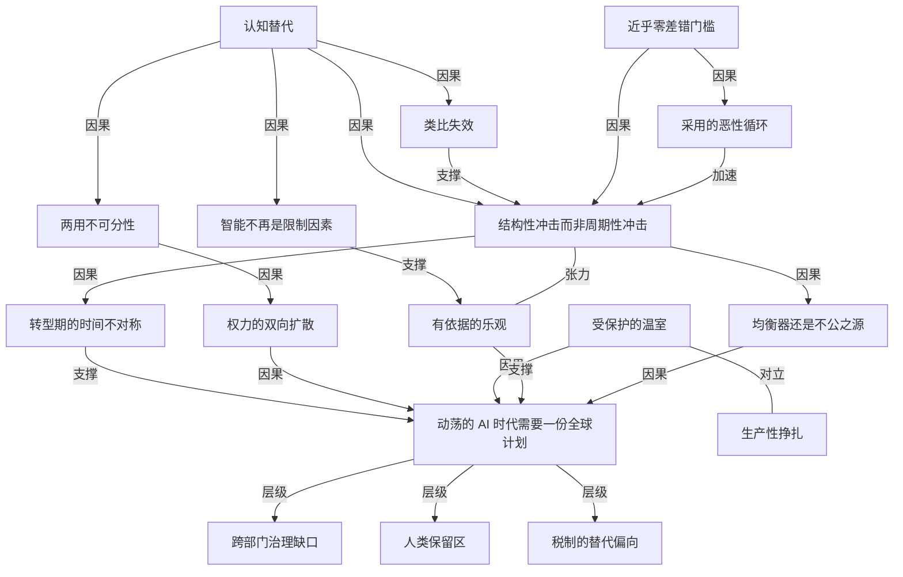

# 盖茨：动荡的 AI 时代已经开始，现在的选择才是关键

- 原文标题：The turbulent AI era is here
- 作者：gatesnotes.com
- 内参日期：2026-08-29
- 来源类型：blog
- 原文：https://www.gatesnotes.com/a-turbulent-ai-era-and-critical-choices-to-make
- 标签：ai 时代, 社会

> 他把 AI 放进自己两段职业生涯的框架里看——微软那段是用软件赋能，基金会这段是补公平。落点是这句：AI 要么成为史上最大的均衡器，要么成为最坏的不公来源，而眼下的准备远远不够。

## 导读

盖茨的 AI 长文。这次是英文原版。

## 核心观点

- 通向 AI 时代的这场过渡，将是人类历史上最动荡的时期之一（one of the most turbulent times in human history）。而此刻世界并没有为它做好准备：看不到领导者、专家和社区在充分应对挑战的证据，也没有任何一份让人平稳进入 AI 时代的计划。
- 从公平的角度看，AI 要么成为有史以来最伟大的均衡器，要么成为最严重的不公之源（the greatest equalizer ever invented, or the worst source of injustice）。盖茨认为，回答"如何让它成为前者"并据此行动，应当是世界的头号优先事项。
- 这一次和历次技术变革真的不同：AI 第一次可以替代甚至超越人类认知（replace and even exceed human cognition）。因此它不是冲击某一个部门，而是同时冲击法律、客服、医疗、软件、制造，且时间尺度是十年而不是几代人。
- 全文的结构是"三大风险 + 巨大收益 + 三条起步方案"：风险是工作永久消失、AI 放大作恶能力、AI 侵蚀孩子的发展与人际关系；收益需要被主动最大化而不是自动发生；方案是建立新的治理架构、划出人类保留区、重新平衡对劳动与资本的征税。
- 贯穿全文的关键词是 can（可以）而不是 will（将会）：AI 可以改善每一个收入层级的人的生活，但它不会自动这么做（it won't do that automatically）。

## 为什么这一次真的不同

- 盖茨先交代自己的视角来源：一生只有两份工作，一份是在微软通过软件赋能他人，一份是从 2008 年起全职回馈财富、让世界更健康更公平。两段经历共同塑造了他看 AI 的方式。
- 他也主动交代潜在偏见：虽然投资组合已相当分散，但仍与科技业有财务关联，并以基金会主席身份与微软等 AI 公司合作。他声明投资收益将全部进入盖茨基金会用于解决全球不公，同时承认"读者需要自己判断这是否遮蔽了我的视野"。
- **为什么许多评论者低估了 AI 的影响**：
- 理由一，模型仍然会犯错。不久前它们连简单的数独都解不了，也数不清 strawberry 里有几个 R，很难想象这样的东西能替代人类认知。但可靠性问题正在被快速修复——研究者正在造出能自我检查、自我改进的模型，很快它们在许多任务上会显著优于人类。
  - 理由二，用过去创新的效应来类比会误导人。PC 出现后花了二十年才显著改变工作方式：软件要开发、价格要下降、人要学会使用并把工具嵌入业务流程。AI 不一样，它跑在我们已经拥有的设备上，用自然语言交互——不是我们去适应它，而是它来适应我们（We don't have to adapt to it because it can adapt to us）。它能看和人类员工同一份培训视频，从已有数据里学习。
- **时间的不对称是最残酷的部分**：盖茨说他一生都希望创新能更快，但对 AI 感情复杂——他希望收益快点来、问题晚点来，可两者是同时到达的。而最需要时间准备的人，恰恰是拥有时间最少的人：被机器人取代的会计岗位员工，被时薪 10 美元机器人取代的时薪 20 美元工人。
- **农业到办公室的类比不成立**：那场转移历经数代人，并且创造了需要人类认知的新岗位；而这一次，技术本身可以替代认知。AI 能看、能听、能说、能推理，最终也能像人一样流畅地做体力活。
- 如果有人拿出可信的、能在全球范围内减缓 AI 发展的计划，盖茨说他很可能会支持。但他不认为这会发生——地缘政治与经济激励推得太猛，只会全速前进。

## 风险一：许多工作将永久消失

- **它不是周期性衰退**：1933 年大萧条期间美国失业率约 25%，此后十年大部分时间维持在两位数，最终随着需求、投资和增长的回归而恢复。AI 的冲击也许达不到那个水平，但它不会随着一轮经济周期而消失。
- 风险最高的是入门级和中级岗位，而新创造的岗位大多需要多年才能习得的技能。
- **白领已经被轻度冲击**：生成式 AI 被广泛采用之后，在特别容易被替代的岗位上，年轻从业者的就业显著下降，而他们年长的同事没有（斯坦福数字经济实验室的研究）。
- 冲击的扩散路径：最先受影响的可能是销售与客服（线上与电话）、软件工程、律师助理；但随后会延伸到今天仍需受训人员完成的任务——评估贷款申请、做数据分析，甚至给病人做分诊。
- 也有反向的力量：像软件工程这样成本下降会催生新需求的领域，净岗位损失会小于其他领域，前提是某些任务（比如设计）仍由人来做更好。
- **蓝领同样跑不掉**：机器人的进展不如 AI 快，但成本终将大幅下降。盖茨提醒，很多美国人没意识到灵巧机器人推进得多快，因为大量前沿工作在其他国家、主要是中国进行；也有人被最近病毒式传播的"机器人跳舞跳得很烂"的视频误导。他判断，"聪明的"机器人会在本十年结束前，在建筑、酒店等行业的某些体力任务上开始与人竞争。
- **恶性循环的机制**：一家公司先采用机器人与 AI，用省下的成本降价，竞争对手就承受巨大压力跟进；在位企业不做，创业公司也会做。市场力量让采用越来越快，除非我们干预，否则好工作会更少，收益会归于一小群人。
- 盖茨特别担心年轻人：他们将进入一个入门级岗位更少的劳动力市场。他们也最懂这个挑战——他们是 AI 最活跃的使用者，同时看见了能力和改进速度，"难怪他们中这么多人对 AI 感觉负面"。
- **真正的分水岭是"近乎零差错"**：当 AI 能提供近乎无差错的工作时，它就可以在无人核验的情况下自主运行，而企业有充分的经济动机放手让它这么做。
- 这会带来对工作、收入与经济保障的根本性重新思考：一个围绕就业建立起来的经济体，在更少人工作、或很多人工作更少小时的情况下如何运转？在资本主义社会里，就业不只是大多数人获取生活必需品的方式，也是尊严和社会连接的关键来源。
- 社区层面的涟漪效应是实证性的：研究显示在美国部分地区，工厂关闭会推高阿片类药物过量致死人数。盖茨要读者想象白领与蓝领在全国范围内同时承受类似压力的情形。
- 结论是行动的时间点：AI 是对经济组织方式的结构性挑战，等到人们已经失业或半失业再动手就太晚了。

## 风险二：AI 会放大作恶的能力

- 早在 AI 进入主流之前，网上就有关于制造炸弹、生物武器乃至计算机病毒的信息。AI 让获取这些信息、并且真正去执行都变得容易得多——即使技能非常有限的犯罪者，也能在个人、企业、政府各个尺度上锁定目标。
- 普通人日常最能直接感受到的伤害是：AI 驱动的欺诈、虚假信息、深度伪造和监控。
- **网络攻击的攻防失衡**：盖茨认识的最聪明的网络安全专家们对未来几年感到恐惧，因为攻击者获得强大新能力的速度，快过防守方修补所有弱点的速度。
- 根源是能力的两用不可分：同一个能找出软件漏洞、好让公司修复的模型，也能帮犯罪者利用这个漏洞。发动一次攻击所需的资源正在显著下降，而我们还没能把这些能力与良性用途分开。
- 暴露在风险中的基础设施清单：医院、金融机构、供水系统、电网、政府福利管理系统。这些机构一旦被攻击，真正承受损失的是病人、客户和福利领取者。
- 生物恐怖主义同理：AI 会带来救命的药物与疫苗突破，同时也让设计一种致命新疾病变得更容易。正面能力与危险能力同样难以分离，而这是一个全球性问题。
- **风险的另一半是权力集中**：上述风险讲的是 AI 赋能了现在权力相对很小的坏人；同一批工具也会让权力在已经拥有权力的地方进一步集中。自主武器让政府在无人参与决策的情况下也能使用致命武力；监控和操纵公众舆论会变得更容易、更便宜，也更有效。
- 最终，用 AI 伤害他人的能力可能不再限于人或机构：AI 系统本身已经偶尔会以设计者未曾预期的方式行动，技术改进的速度和方式都超出所有人预期，随着模型越来越强大，它们可能开始违背我们的利益行动，而我们可能失去控制。

## 风险三：AI 可能阻碍孩子的发展、替代人际关系

- 盖茨用自己的成长做引子：在西雅图长大时，他没多少朋友，只有几个和他相似的男孩；是靠努力和母亲的大量帮助，他才发展出与不同类型的人相处的社交能力，70 岁的今天仍在用那时学到的东西。
- 他怀疑，如果当年身边有一个 AI 伴侣，他不会付出同样的努力。AI 伴侣用你早已习惯的方式和你说话，不会把你推出舒适区，永远在线，永远不对你发脾气——这让它们有潜力变得高度成瘾，并夺走我们从与他人连接中学到的功课。
- **实证证据虽小但有信号**：斯坦福和卡内基梅隆的研究者对 1100 多名 AI 伴侣使用者做的一项研究发现，社交网络越小的人越可能转向聊天机器人寻求陪伴；而使用越重、情感上越私人化，他们的感受就越糟。
- **温室的比喻**：海特在《焦虑的一代》中关于社交媒体的一个观察，用在 AI 上更贴切——像经受风吹的小树，那些常规性地暴露在小风险中的孩子，长大后能不惊慌地应对大得多的风险；反过来，在受保护的温室里长大的孩子，有时在成年之前就已被焦虑压垮。盖茨的判断是：一个被设计成永远不让你不高兴的 AI 伴侣，就是一个巨大的、受保护的温室。
- 互联网尤其社交媒体对青少年发展的危害我们才刚开始理解：强迫性使用、睡眠紊乱、网络霸凌、接触有害内容。AI 可能通过让这些东西更有说服力、更难逃脱来放大它们，而我们不该再等一代人才开始认真对待。
- 各国已在动作：澳大利亚、英国、挪威在推进未成年人网络保护；中国走得最远——其规则广泛限制 AI 伴侣类应用，禁止培养情感依赖的设计，并禁止面向未成年人的虚拟亲属和虚拟恋人。
- **教育上的悖论**：同一个能让人前所未有地学到更多的工具，也可能让很多人学得更少。一项初步调查显示，更重度的 AI 使用与更弱的批判性思维相关，且这种效应在年轻人身上更强。
- 而这是人类最不该失去批判性思维的时刻：在一个深度伪造和可以针对你个人定制的虚假信息的时代，分辨真假成为一项必要的生存技能。
- 盖茨也承认界线不清楚：在某些情况下 AI 可能帮人理解如何改善现实中的人际关系；对孤独的老人和行动受限的人来说，它可能是与外界唯一的接触，聊胜于无。他的立场是：无论我们最终把线划在哪里，那都应当是我们自己有意做出的决定（it should be our decision, made intentionally）。

## 收益：好的一面可能非常非常好

- 常有人说我们高估短期变化、低估长期变化。盖茨说 AI 上发生的是另一回事：一部分人只看见好处、对负面关注不够；另一部分人犯相反的错误，只盯着危险——那些危险是真实的——却因此错过了潜在收益。
- 他要的是两者兼具：对必须最小化的 AI 危害深切关注，同时对最大化的正面效果抱有有依据的乐观（grounded optimism）。
- **为什么最大化收益和最小化危害同等重要**：如果人们看到 AI 让生活更容易，就会建立起管理转型中更艰难部分所必需的公众信任；如果 AI 在大多数人生活中做的第一件事是夺走工作，本就怀疑它的人会彻底拒绝它。这也是政府、行业（包括医疗行业）与 AI 公司现在就该协作的另一个理由。
- **科研加速**：AI 能综合每一个科学领域的知识，从而加速最棘手技术挑战上的创新——为所有人提供可靠的清洁能源、应对气候变化、种出足够的粮食、根除疾病。研究者可以用它检索海量文献、识别人可能错过的模式、判断哪些实验最有希望。当智能不再是今天这样的限制因素时，小公司也能和研究预算大得多的组织竞争，研发和创新会被极大放大。
- **医疗**：许多美国小医院没有能在危及生命的急症中快速诊断的驻院专科医生。AI 可以确保心脏病发作被及时发现，让一个家庭免于一场医疗急症带来的沉重开支。`Viz.ai` 是一个例子——它分析影像以检出中风等急症，并帮助医疗团队协调病人的救治，目前被近 2000 家美国医院使用。AI 还会帮助基层医生做更好的诊断、在病人不在诊室时保持联系，帮病人看懂化验结果和复杂的服药安排。
- **农业**：盖茨说他告诉别人"低收入国家里 AI 见效最快的领域是农业"时，很多人会感到意外。在多数低收入国家，农民得不到可靠的天气预报，也得不到关于种什么种子、如何保护作物与牲畜免于疾病、如何改良土壤的建议。在人口增长和气候变化的挑战下，这些农民比以往任何时候都更需要帮助。借助 AI，低收入农民很快就能得到比今天最富裕的农民所能得到的更好的建议，并大幅提高产出。
- **政府服务**：盖茨见过一些美国家庭在申请医保、助学金或食品援助时被流程压垮——面对一大摞复杂的官僚表格，很多人想干脆放弃。AI 可以极大地简化这些流程，让他们更快拿到帮助，也让政府运转更高效；而改善公民体验应当从最需要社会安全网服务的人开始。
- **心理健康**：尽管他担心 AI 对心理健康的影响，他认为 AI 在这里也能帮上大忙。多数社区的咨询师、精神科医生和成瘾专家都太少。在恰当的隐私保障下，AI 工具可以帮人识别预警信号，然后在需要时提供有循证依据的应对策略，并与人类专业者配合提供更及时的治疗。
- **教育**：AI 可以把教师解放出来，让他们有更多时间做一对一或小组辅导，也让他们更清楚地看到全班在哪里卡住。对学生而言，关键是保住研究者所说的"生产性挣扎"（productive struggle）——那种真正建立理解的认知劳动。做法是分阶段的：学生初次接触一个新概念时，AI 给出实质性的讲解，并同时提供问题和答案；到了检验理解的阶段，它把答案收起来，帮学生自己抵达答案。
- **总体图景**：这些进展合在一起，能让日常生活更容易、更负担得起，更少地被一个人的收入或人脉所限制。个人和小企业能获得今天需要昂贵专业服务或庞大团队才有的能力；残障人士能更独立地生活；有好想法的劳动者和创业者能完成远超今天的事。
- 而盖茨认为最重要的一点是：AI 可以把如今被文书、官僚流程、寻找可靠信息、以及那些请不起别人代劳的杂事所消耗的时间和注意力还给人们。这些收益看似不起眼，但乘以数百万人的生活就是深刻的——更多人在需要时得到好的建议，也有更大的自由去专注于自己想过的生活。
- **但这一切的动词是"可以"**：AI 可以改善每一个收入层级的人的生活，但不会自动发生。和任何新技术一样，我们必须有意识地确保它惠及所有人而不只是富裕的少数，这需要政府和慈善事业发挥强有力的作用，让不那么富裕的公民和低收入国家成为完整的受益者。
- **基金会的位置**：盖茨基金会将在剩下的 19 年里花掉它剩余的 2000 亿美元（原定 20 年期限）。AI 会从两端帮它实现目标——加速 HIV、结核、疟疾和营养不良的疫苗与药物发现，以及帮助医疗劳动力和病人学会使用这些工具。目标之一是把每年死亡的儿童数量再减半，就像 2000 到 2024 年间做到的那样。基金会下月的年度守门人报告会详述，其中一个重点是确保 AI 模型在所有它支持工作的国家所使用的语言中可用，而不只是富裕和中等收入国家常用的那些语言；OpenAI、Anthropic、谷歌和微软等领先 AI 公司都在这些倡议上与基金会合作。

## 世界需要一份计划

- 一些 AI 公司为自身技术引发的挑战提出解决方案是好事，但我们不该指望它们领导这场行动：部分议题超出它们的专业领域，而且在民主社会里，决定这些事情本就不是它们的角色。
- 解决方案应当通过一个公共的民主过程来形成，参与者包括民选官员、政策制定者、教育者、卫生工作者、地方官员和社区领袖。数以百万计的人生活将被打乱，我们需要一张更强大、更灵活的社会安全网帮他们度过转型。
- 地方社区已经在就数据中心所需的能源和水提出关切。如果没有解决方案，一些群体会转而要求彻底停止 AI 的开发与部署。
- 解决方案还应由我们对 AI 提出的深层问题的回答来塑造，其中包括：在机器能比我们想得更快更好的时代，我们如何保住自己的人性。盖茨认为，以思考"人之为人"为业的宗教领袖在这里能起关键作用；他对教宗良十四世关于 AI 的通谕《在人工智能时代守护人的位格》很感兴趣，认为它为接下来的工作奠定了坚实基础。

## 方案一：建立管理转型的新体系

- 最高优先级是一项艰巨任务：创建应对 AI 的国内与国际框架。
- 理由是现有制度的设计前提失效了：我们当下的所有制度，都不是为一项传播如此之快、触及生活如此多方面的技术设计的，所以必须造新的。
- **规模感的锚点**：9·11 之后，美国政府经历了二战以来最大的一次改组，而目的只是改进国家安全这一项职能。AI 需要的远不止于此——它会同时影响国家安全、就业、教育、税收、能源、选举、空气与水、公共卫生、金融体系、执法、交通、公共土地和 IT 系统。
- **跨部门的盲区问题**：这些领域的重叠方式是现有官僚体系无力管理的。劳工部门可能理解劳动力冲击但不懂安全风险；商业监管者可能理解市场集中但不懂 AI 对儿童与青少年的影响。任其自然，各机构只会看见系统的一个局部，而 AI 的后果会波及整个系统。
- 国家层面的解法是设立能跨政府部门设定优先级的机构，目标是确保每一项风险都有人负责——否则一次 AI 驱动的攻击可能仅仅因为"没人认为阻止它是自己的工作"而得手。
- **国际层面必须并行建设**：即使一个国家把自己家里收拾干净了，仍然暴露在跨境风险之下。这个国际组织将不同于我们创造过的任何机构，但它可以借鉴既有系统的模式——核武器的核查机制、国际航空的监管、保护臭氧层的协定；一个新的全球 AI 组织需要这三者的要素，还要更多。
- **对可行性的坦诚**：怀疑世界的制度是否有能力设计和实施这套新架构是公道的。政府行动缓慢——如果它行动的话，而国家内部与国家之间的极化让做成事比以往更难。美中之间的某种合作将是必需的。
- **但我们没有慢慢来的余裕**：起点是先建立一个"在混乱把政府逼入危机模式之前就着手建设正确制度"的过程。国家领导人应当定期召集经济学家、技术专家、劳动问题专家、企业领袖以及劳动者本人，识别现有制度在哪里失灵、需要哪些新的授权；各国需要相互学习。
- 而那些容纳领先 AI 开发者、控制供应链关键环节的国家，应当现在就开始会谈以确立共同规范——趁竞争压力还没有让合作变得更难。整套框架的建设需要数年，这正是必须现在开始的理由。

## 方案二：为人类保留一部分工作

- 这一节从一段私人经历开始：盖茨的父亲 2020 年死于阿尔茨海默症。在病程后期，他被付费照护者日夜照料，那些人在他已经难以表达自己时依然懂他——他不总能说出自己饿了，但他们总是知道。
- 盖茨说，那份照护里有某种不可替代的人性（irreplaceably human），没有机器人能够、也不应该去做那件事。
- 由此他提出一个概念：随着 AI 和机器人变强，我们将把某些事情专门留给人做，他把这个领域称为"人类保留区"（Human Reserved）。他喜欢这个说法，是因为它让人想到自然保护区——那些地方我们本可以修楼修路，但我们选择不去，因为损失会太大。
- **划定的理由之一是经济的**：允许机器接管某个角色，会让大量难以转行的人失去工作。他的例子很具体——你不能对一个干了一辈子建筑的 55 岁的人说，你去养老院工作吧，还指望他从中获得成就感。
- **理由之二不是经济的**：想象一个机器人告诉你，你得了不治之症。技术上没有任何理由它做不到，然而它不应该做。
- **这个领域会随时间演化**：可以现在就划出一些岗位，用数年甚至数十年逐步引入 AI，并承诺保留一部分工作。有些领域会是混合形态，比如教育和心理健康照护——由人主导，用技术扩展他能做到的事。
- **界线也因地而异**：一些国家可能坚持由人来照顾老人；而像日本这样劳动力萎缩、没有足够年轻人照顾老人的国家，可能会欢迎照护机器人。
- 盖茨坦承这个想法带出一堆他没有答案的问题：谁来决定我们为人类保留什么？该用什么标准？如何防止公司作弊偷偷用机器人？当一个国家允许机器人生产某样东西而另一个国家不允许时，国际贸易会怎样？这些都需要作为转型计划的一部分在公共领域被讨论清楚。

## 方案三：重新平衡对劳动与资本的征税

- **财政的剪刀差**：劳动者被推向不同岗位时需要再培训和社会安全网的支持，但他们工作变少意味着缴纳的所得税变少，于是政府收入下降的时点，恰好是对这些服务需求最大的时点。而这笔钱必须从某个地方来，且正值预算普遍紧张之时。
- **盖茨的主张是对 AI token 和机器人征税**。他给出的理由是当前税制的方向性偏差：今天你作为雇主雇一个人，要为他的收入缴纳工资税；但你买一台机器人，通常可以立刻作为经营支出全额抵扣。税制在推着你用机器替代人。
- 这样一笔税的作用是双重的：稍微减缓逃离人类劳动的势头，同时为再培训和更强的安全网筹钱。它需要被精准设计，以免拖慢那些纯粹有益的 AI 用途，比如让医疗和教育变得更便宜。
- **对批评的回应**：批评者指出这在经济学意义上不是最优效率的。盖茨的反驳是，他们没有把工作对个人和社会的更广泛价值计算在内；而有了我们即将拥有的加速创新，我们完全负担得起一点点低效，作为让人们保住工作的代价。
- 他提到自己多年前就提过机器人税，当时多数反应是"这想法很奇怪"，而他至今仍是坚定的支持者——它不是应对 AI 威胁的全部解法，但它是明智应对的一部分。
- 无论钱怎么筹，关键是必须到达最需要的人手里：因 AI 和机器人失业的劳动者、工时或工资下降的人、以及损失集中发生的社区。这项工作必须现在就开始做，好让系统在需求变得急迫时已经就绪。

## 盖茨本人要做的事，以及留给读者的问题

- 他的行动清单：用自己的声音和时间把"AI 与公平"推上公共议程的更高位置；每次去华盛顿都向立法者提这个议题，与世界各国领导人会面时也提；在与 AI 模型开发者的对话中把它放在最中心；倡导他所描述的国家与国际框架；由盖茨基金会推动有益用途，包括在非洲；由他创办的突破能源公司用 AI 帮助企业开发廉价清洁能源、解决气候问题；并且定期就 AI 写作。
- **他给领导者的话**：你们有机会现在就行动——在失业率急剧上升、社区开始受伤、公众信任被侵蚀之前。你们可以确保政府整体性地处理这个问题，而不是把它切碎分给多个官僚山头；可以确保 AI 惠及所有人；也可以与其他国家的政府合作应对这个国家性与全球性的挑战。
- **他还要扩大参与讨论的圈子**：让劳动者、即将进入职场的大学生、社区领袖、宗教领袖与信仰组织、家长、教育者，以及那些声音常常不被听见、却最懂这场转型将如何影响人们生活的人参与进来。
- 全文以四个问题收束：我们如何确保 AI 的收益能到达那些还没有财富、影响力和门路的人？我们如何加强社会安全网，让被替代的劳动者和社区仍能过得好？公共制度应当如何调整？以及，我们如何在这一切之中保住我们的人性？
- 他的总结句是：这项前所未有的技术，要求一个前所未有的全球回应（This unprecedented technology demands an unprecedented global response）。如果我们做对了，人类的回报会是惊人的，世界也会变得更公平。
- 结尾的自陈值得注意：他几乎无时不在想 AI——不是因为他有全部答案，而是因为它提出的问题事关重大，不能留给一小群技术专家去回答。学术界、商界、政府和公民社会的领导者都在其中有一份角色。

## 概念网络

### 关键概念

#### 认知替代

**context**：全文的技术前提。盖茨说 AI 第一次可以"替代甚至超越人类认知"（replace and even exceed human cognition），这与历史上所有替代体力或替代特定工序的技术在性质上不同。因为被替代的是认知本身，所以冲击不会停留在一个部门，而会同时进入法律、客服、医疗、软件和制造。

**费曼一下**：过去的机器抢的是"手"的活儿，人可以往"脑"的方向撤退，于是农业工人变成了办公室职员。这一次机器直接开始抢"脑"的活儿，而且很快连"手"也要抢（灵巧机器人），撤退的方向就不清楚了。这不是某个行业的坏消息，而是"换个行业就行"这个逃生策略本身失效了。

#### 均衡器还是不公之源

**context**：盖茨用来框定全文价值问题的二分句式——AI 要么是有史以来最伟大的均衡器，要么是最严重的不公之源（the greatest equalizer ever invented, or the worst source of injustice）。他强调这不是预测，而是取决于世界接下来做的选择。

**费曼一下**：同一项技术，可以让低收入国家的农民得到比今天最富的农民还好的农业建议，也可以让一小群人拿走全部收益、其余的人失去工作和尊严。差别不在技术里，在制度和政策里。所以"AI 是好是坏"是个错误的问题，正确的问题是"我们打算把它做成哪一种"。

#### 转型期的时间不对称

**context**：盖茨说他一生都希望创新更快，唯独对 AI 感情复杂——他希望收益快点来、问题晚点来，但两者同时到达。而"最需要时间的人，恰恰拥有最少的时间"：被机器人取代的会计岗位员工、被时薪 10 美元机器人取代的时薪 20 美元工人。

**费曼一下**：转型总要付代价，问题是代价由谁在什么时间付。有储蓄、有学历、有人脉的人可以慢慢调整；靠一份工资过日子的人第二天就要交房租。技术进步的速度是均匀的，人的适应能力却极不均匀——这个错配就是"动荡"这个词的具体含义。

#### 类比失效

**context**：盖茨列举的"人们低估 AI"的第二个原因。PC 花了二十年才显著改变工作方式，因为软件要开发、价格要下降、人要学会用；而 AI 跑在我们已有的设备上、用自然语言交互，"不是我们去适应它，而是它来适应我们"，它甚至能看和人类员工同一份培训视频。

**费曼一下**：以前每一项新技术都自带一个"缓冲期"，那个缓冲期不是善意，而是摩擦——买设备、装软件、培训员工都要时间，而这些时间正好被社会拿来适应。AI 把摩擦几乎抹平了，于是缓冲期也一起消失了。用 PC 的历史推测 AI 的节奏，等于用一个已经不存在的减速带来估算刹车距离。

#### 结构性冲击而非周期性冲击

**context**：盖茨用 1933 年美国约 25% 的失业率作对照——那场失业在此后十年大部分时间维持两位数，但最终随着需求、投资和增长回归而恢复。他的判断是 AI 的冲击也许达不到那个量级，但它"不会随着一轮经济周期而消失"。

**费曼一下**：周期性失业像退潮，等经济回暖，岗位会回来；结构性失业像海岸线本身变了，水位再涨，那块地也不在了。判断一次失业属于哪一种，看的不是数字大小，而是岗位消失的原因——需求暂时萎缩，还是这件事从此不再需要人做。

#### 近乎零差错门槛

**context**：盖茨点名的真正分水岭——"当 AI 提供近乎无差错的工作时"，它就可以在没有人核查的情况下自主运行，而企业有充分的经济动机放手。这也是他反驳"模型还会犯错所以不足为虑"这一论调的落点：可靠性问题正被自我检查、自我改进的模型快速修复。

**费曼一下**：今天很多岗位表面上是"AI 干活、人核对"，看起来人还在。但"人核对"这道工序的存在理由只有一个：AI 还不够准。一旦准确率越过某个线，这道工序在经济上就没有存在理由了，而它恰恰是当下大量岗位的最后立足点。所以真正该盯的不是 AI 能不能做，而是它什么时候好到不需要人看着。

#### 采用的恶性循环

**context**：盖茨描述的市场机制——一家公司采用 AI 与机器人后用省下的成本降价，竞争对手就被迫跟进；在位企业不做，创业公司也会做。结果是采用速度越来越快，"除非我们干预"，好工作会更少，收益归于一小群人。

**费曼一下**：这解释了为什么"企业应该更有良心一点"不是一个可行的解法。在价格竞争里，先替代人的公司获得成本优势，不替代的公司会被挤出市场——于是最有良心的公司最先死掉。要改变结果，只能改变规则，不能指望改变个别玩家的选择。

#### 两用不可分性

**context**：盖茨解释 AI 安全风险时反复出现的结构——同一个能找出软件漏洞好让公司修补的模型，也能帮犯罪者利用它；AI 会带来救命的药物与疫苗，也让设计一种致命新疾病更容易。他明确说"我们还没能把这些能力与良性用途分开"。

**费曼一下**：核技术至少可以从材料上卡脖子——浓缩铀很难搞到。而 AI 里"找漏洞的能力"和"补漏洞的能力"根本是同一种能力，不是同一个东西的两种用法，而就是同一个东西。这意味着传统的"限制危险能力、保留有益能力"的监管思路在这里天然失灵，必须换别的抓手。

#### 权力的双向扩散

**context**：盖茨在风险二里做的一个关键区分——前半部分的风险讲的是 AI 赋能了现在权力很小的坏人（技能有限的犯罪者也能大规模作案）；而同一批工具"也会让权力在已经拥有权力的地方进一步集中"，例如自主武器让政府可以在无人参与决策时使用致命武力，操纵公众舆论变得更便宜有效。

**费曼一下**：人们讨论 AI 风险时常常只站一头：要么担心坏人拿到强工具，要么担心大机构变得更强。盖茨的观察是两件事同时发生，而且方向相反——底层的破坏力上升，顶层的控制力也上升，被挤压的是中间的普通人和现有的制衡机制。

#### 受保护的温室

**context**：盖茨借海特《焦虑的一代》里的比喻做出的判断——常规性暴露在小风险中的孩子长大后能从容应对大风险，而在受保护的温室里长大的孩子有时在成年前就被焦虑压垮。他的结论是："一个被设计成永远不让你不高兴的 AI 伴侣，就是一个巨大的、受保护的温室。"

**费曼一下**：AI 伴侣的所有优点——永远在线、永远耐心、永远顺着你说、从不生气——正好是它的危险所在。人的社交能力是被摩擦磨出来的：被拒绝、被误解、要迁就别人。一个把所有摩擦都拿掉的关系很舒服，但它不再具备训练功能，就像在无菌室里长大的免疫系统。

#### 生产性挣扎

**context**：盖茨在讲 AI 对教育的正面作用时引用的研究者术语（productive struggle）——"那种真正建立理解的认知劳动"。他给出的实现方式是分阶段的：初次接触新概念时 AI 给出实质讲解并同时给出问题和答案；到检验理解时，它把答案收起来，帮学生自己抵达答案。

**费曼一下**：学习中真正让人变强的，是自己卡住又自己走出来的那一段。AI 最容易做的事恰恰是把这一段抹掉——你一问它就给答案，过程很顺，但什么也没长进去。所以好的教育型 AI 的核心设计不是"能答什么"，而是"什么时候故意不答"。

#### 智能不再是限制因素

**context**：盖茨解释 AI 为何能放大科研时的核心表述——AI 能综合每一个科学领域的知识、检索海量文献、识别人会错过的模式、判断哪些实验最有希望；"当智能不再是今天这样的限制因素时"，小公司也能与研究预算大得多的组织竞争。

**费曼一下**：过去搞科研，钱能买设备也能买人才，所以预算大的机构天然领先。如果聪明的头脑变成了便宜且随处可得的东西，竞争的瓶颈就从"谁请得起最好的人"移到别的地方——问对问题、有独特数据、能快速做实验。这也是 AI 可能成为均衡器的最具体机制之一。

#### 有依据的乐观

**context**：盖茨对两种常见姿态的双向纠正——一些人只看见 AI 的好处、对负面关注不够；另一些人只盯着危险（那些危险是真实的）而错过潜在收益。他要的是两者兼具：对危害的深切关注，加上对正面效果的"有依据的乐观"（grounded optimism）。

**费曼一下**：这不是"各打五十大板"的中间派，而是一个行动上的要求：最大化收益和最小化危害同等重要，因为如果人们没先体验到 AI 让生活变好，就不会有足够的公众信任去支撑后面更痛的调整。如果 AI 在多数人生活中做的第一件事是夺走工作，它就再也没有机会兑现好处了。

#### 跨部门治理缺口

**context**：盖茨论证"必须造新制度"时的核心诊断。AI 会同时影响国家安全、就业、教育、税收、能源、选举、公共卫生、金融、执法、交通等领域，而这些领域重叠的方式是现有官僚体系无力管理的——劳工部门懂劳动力冲击但不懂安全风险，商业监管者懂市场集中但不懂 AI 对青少年的影响。

**费曼一下**：现代政府是按问题类型切分的，每个部门看见系统的一个切片。AI 的后果却是横着穿过所有切片的。结果就是盖茨那句最锋利的话：一次 AI 驱动的攻击可能得手，仅仅因为没有人认为阻止它是自己的工作。这类缺口不是靠某个部门更努力能补上的，只能靠一个能跨部门设定优先级的新层级。

#### 人类保留区

**context**：盖茨从父亲临终照护的经历里提炼出的概念（Human Reserved）——那份照护里有某种"不可替代的人性"，没有机器人能够也不应该去做。他把它类比为自然保护区：那些地方我们本可以修楼修路，但选择不修，因为损失太大。划定理由可以是经济的（保护难以转行的人），也可以不是（机器人不该来告诉你得了不治之症）。

**费曼一下**：这个想法的要害在于把"能不能"和"该不该"拆开。技术讨论里默认的逻辑是：只要机器能做且更便宜，它就会去做。人类保留区是主动引入一个否决权——我们承认它做得到，但我们决定不让它做。难点也全在这里：谁来划线、按什么标准划、怎么防止有人偷偷越线。

#### 税制的替代偏向

**context**：盖茨主张对 AI token 和机器人征税的理由。今天雇一个人要缴工资税，买一台机器人通常可以立刻作为经营支出全额抵扣——"税制在推着你用机器替代人"。他承认这在经济学意义上不是最优效率，但认为批评者没有把工作对个人和社会的更广泛价值算进去。

**费曼一下**：很多人以为机器替代人纯粹是技术和成本的自然结果，其实税收规则也在其中悄悄按了一根手指在秤上。同一笔支出，花在人身上要额外交税，花在机器上还能抵税。所以"对机器人征税"与其说是新增一道干预，不如说是把已经存在的偏向调回中性——盖茨多年前提出时被认为是怪主意，他至今仍是坚定支持者。

### 概念网络

- **网络的起点是一个能力事实**：认知替代。这是全文唯一的技术前提，其余一切都从它派生。它同时向四个方向展开：向下推翻了历史类比（类比失效），向前预告了岗位冲击的性质（结构性冲击而非周期性冲击），向侧面带出安全风险的结构（两用不可分性），向上打开了收益的空间（智能不再是限制因素）。理解这张网的关键，是看清同一个能力事实如何既是最大的风险源也是最大的收益源——这正是盖茨拒绝单边叙事的原因。
- **风险侧的三条链条各有各的传导机制**。第一条是经济链：认知替代与近乎零差错门槛共同决定了岗位会被真正取消而不是被暂时压缩，采用的恶性循环则让这个过程加速——它是竞争压力而非企业意愿在推动，所以劝说无效。这条链的终点是转型期的时间不对称：冲击来得快，而承受冲击的人恰恰缺少缓冲。第二条是安全链：两用不可分性意味着无法用"限制危险能力"的老办法监管，而它的下游是权力的双向扩散——底层作恶门槛下降与顶层控制力上升同时发生。第三条是人的发展链：受保护的温室与生产性挣扎构成一对直接的对立，前者描述 AI 伴侣如何抽走人际摩擦，后者描述好的教育型 AI 必须刻意保留认知摩擦；两者共用一个判据，即"被抹掉的那部分不适是不是恰恰在起作用"。
- **收益侧只有一条链，但它承担着关键的政治功能**。智能不再是限制因素支撑起有依据的乐观，而有依据的乐观与结构性冲击之间是张力关系而非矛盾关系——盖茨的立场是两者必须同时成立。这条链之所以重要，是因为它决定了公众信任：如果 AI 在多数人生活里做的第一件事是夺走工作，社会就不会给出推进后续艰难改革所需的授权。收益因此不是风险的对冲项，而是治理的前置条件。
- **所有链条汇入同一个枢纽**：均衡器还是不公之源。这个二分不是网络中的又一个节点，而是整张网的判决书——它把前面所有的因果传导重新表述为一个选择问题。而正因为它是选择而非预测，网络在这里由描述转向行动。
- **枢纽向下分出三条并列的方案支路**，各自对应一类被前面链条暴露出来的缺口：跨部门治理缺口回应的是制度按问题类型切分、而 AI 后果横穿所有切分这一错配；人类保留区回应的是"能做"与"该做"之间缺少否决权；税制的替代偏向回应的是替代不只是技术选择、也被现行规则悄悄补贴。三者层级并列而不互相替代——制度是容器，保留区是边界，税制是价格信号。它们共同的时间属性是同一个：都需要数年建成，因此都必须现在开始。

## 费曼 x3

判断一场技术变革有多大，人们习惯看它能做什么。更准确的看法是看它取消了什么——不是取消了哪些岗位，而是取消了哪条退路。

历次自动化浪潮里，人类始终有一条稳定的撤退路线：机器接手手上的活儿，人往脑子的方向退。农业到办公室的迁移之所以能在几代人的时间里平稳完成，靠的正是这条退路仍然通畅，而且新岗位恰恰需要人类认知。这一次，被顶替的就是认知本身，而且能看、能听、能说、能推理的系统最终也会像人一样流畅地做体力活。退路不是变窄了，是不在了。

真正的分水岭不在于 AI 今天能不能干某件事，而在于它什么时候好到不需要人看着。眼下大量岗位的实质是"AI 干活、人核对"，看起来人还稳稳在场；但这道核对工序的存在理由只有一个，就是 AI 还不够准。一旦近乎无差错的工作成为常态，它就能在无人核验的情况下自主运行，而企业有充分的经济动机放手。更棘手的是，这件事不取决于企业有没有良心：一家公司先替代、先降价，同行就被迫跟进，在位者不做创业公司也会做——在价格竞争里，最克制的玩家最先出局。要改变结果只能改规则，指望个别玩家自律是无效的。

于是"缺乏准备"这个判断有了具体含义。它不是说没人在谈论 AI，而是说冲击的速度与承受冲击的人的适应速度之间存在系统性错配，而最需要时间的人恰好拥有最少的时间——被机器人取代的会计员工，被时薪 10 美元机器人取代的时薪 20 美元工人。他们没有第二次机会去等一个周期回暖，因为这不是退潮，是海岸线本身变了。

但把这一切读成悲观是误读。同一份能力也让低收入国家的农民得到比今天最富裕的农民更好的农业建议，让小医院及时抓住一次心脏病发作，让智能不再是科研的限制因素。关键在于，最大化好处和最小化坏处并非可以二选一的两件事：如果 AI 在多数人生活中做的第一件事是夺走工作，本就怀疑它的人会彻底拒绝它，社会也就不会给出推进后续艰难改革所需的授权。收益不是风险的对冲，而是治理的前置条件。

所以真正的问题从来不是 AI 是好是坏。它要么成为有史以来最伟大的均衡器，要么成为最严重的不公之源，而这个分叉不在技术里，在制度和政策里——它是一道选择题，不是一道预测题。留给我们的，是那句最朴素也最难执行的判断：这项前所未有的技术，要求一个前所未有的全球回应。

## 阅读原文

We need a plan to ensure that the good outweighs the bad.

What you need to know

The transition to the AI era will be one of the most turbulent times in human history. Right now, we are not preparing adequately for that transition. If the world takes the right steps, AI will be a force for good and leave everyone better off.

During my entire life I’ve only had two jobs. In the first one, I played a role in developing software to empower people through my work at Microsoft.

In my second one, which I started full time in 2008, I am giving back the wealth I made at Microsoft with the goal of making the world a healthier, better educated, and more equitable place. This is the job I will have for the rest of my life.

Both of these experiences inform my perspective on artificial intelligence. When I first learned about computers at age 13 I was fascinated by the idea of making them more intelligent and able to perform things that, at the time, only humans could do. Although the term “AI” was used from around the time I was born, the technology has only made significant progress in the last decade. It is now incredibly capable and it is continuing to improve at a mind-blowing rate. AI for the first time can replace and even exceed human cognition.

In terms of equity, AI will either be the greatest equalizer ever invented, or the worst source of injustice. The challenge is monumental. Even under the best circumstances, the transition to this new AI era will be one of the most turbulent times in human history. How will we use this technology to make the world a fairer place and keep it from widening the divide between rich and poor? How will we protect the people who are most vulnerable to the harms caused by artificial intelligence, including those who lose their livelihoods and the sense that they are in control of their future?

I believe that answering these questions and acting on the answers should be the world’s top priority. If the world takes the right steps AI will be a force for good and leave everyone better off.

Unfortunately, right now we are not preparing for it. I don’t see evidence that leaders, experts, and communities are confronting the challenges adequately. There is no plan to ease the entry into the AI era.

Part of the reason for this is that many commentators underestimate the extent of the impact AI will have. I think there are a few reasons why.

One is the fact that AI models still make mistakes. It is hard to envision any of them replacing human cognition when, not long ago, they couldn’t solve a simple Sudoku puzzle or figure out how many R’s are in the word _strawberry_.

But the reliability problem is being fixed quickly, as researchers create models that can check their own work and improve themselves. Soon they will be substantially better than humans at many tasks.

Another reason people underestimate AI is that analogies to the effects of past innovations are misleading. We have no experience with a technology that can be adopted quickly or that can think and move like a human. When the PC came along, it took twenty years to significantly change how we worked because the software had to be developed, the price had to come down, and people had to learn how to use the tools and incorporate them into their business processes. AI, on the other hand, runs on the devices we already have, and it uses natural language. We don’t have to adapt to it because it can adapt to us. It can watch the same training video that is used to train human workers and learn from existing data.

I want to acknowledge a potential bias. I have benefited enormously from the technology industry. Although I have diversified my portfolio quite a bit, I still have financial ties to it. I am working with Microsoft and other AI companies in my role as chairman of the Gates Foundation to try and ensure AI is deployed in ways that will truly benefit people around the world.

However, my views on AI are not motivated by the potential to make money for myself. Any profits generated by my investments, including those related to technology, will go to the Gates Foundation to tackle global inequity. Of course, readers will have to decide for themselves whether this clouds my view.

### This time really is different.

For as long as I can remember, I’ve wished innovation could happen faster. With AI, my feelings are more complicated.

I wish the world could get the benefits rapidly and delay the problems it will cause as long as possible, but the benefits and problems are arriving at the same time. I believe we need time to prepare for the period of social, political, and economic upheaval we are about to enter. The people who need the most time are the ones who have the least—the accounting worker who’s replaced by a bot or the $20-an-hour worker who loses their job to a $10-an-hour robot.

Many observers say that this technology transition will be like previous ones. They give the example of how jobs in the United States shifted from agriculture to office work. However, that proceeded over several generations and created new jobs where human cognition was required. In this case, the technology can substitute for human cognition.

Because it can see, listen, speak, and reason and will eventually do physical work just as smoothly as any human, it will not just affect one sector. AI will take on work in law, customer service, medicine, software, and manufacturing. It will hit these industries rapidly, over the course of a decade rather than a few generations. There will be some new jobs, but without the right policies there will be far fewer than exist today.

If someone had a credible plan for slowing down AI advances globally, I would likely support it. However, I don’t think that’s going to happen. The geopolitical and economic incentives are pushing too hard to go full speed ahead.

To make sure we maximize the positive effects of this unprecedented technology and minimize the bad so we are better off overall, we need to understand both the benefits and the risks. I’ll start with the risks.

### The transition to AI comes with three big risks.

I plan to write about each of these in more detail in the future, so I’ll touch briefly on them for now.

**Many jobs will disappear forever.**

In 1933, during the Great Depression, unemployment in the United States was [roughly 25 percent](https://www.dol.gov/general/aboutdol/history/chapter5). It remained in double digits for much of the following decade. It ultimately recovered as demand, investment, and growth returned.

AI may not reach this level, but its impact will not go away with an economic cycle. The jobs at most risk are entry- and mid-level, and the new jobs being created will mostly require skills that take many years to learn.

White-collar jobs are already being hit modestly. After the widespread adoption of generative AI, employment [fell significantly](https://digitaleconomy.stanford.edu/app/uploads/2025/11/CanariesintheCoalMine/_Nov25.pdf) among young workers in jobs that are especially vulnerable to replacement, but not among their older colleagues.

I think this trend will continue, but it will not be confined to a handful of industries or occupations. Jobs in sales and customer support (online and over the phone), software engineering, and paralegal work may be among the first affected, but the disruption will reach much further as AI takes on tasks that today still require trained workers: things like assessing loan applications, doing data analysis, and even triaging patients. A few areas like software engineering will generate new demand as the costs go down, so the net job loss in those areas will be less than in others as long as some tasks, such as design, are better done by humans.

Blue-collar jobs will be affected as well. Although robots are not as far along as AI, eventually their cost will be dramatically lower too. Many Americans I talk to don’t realize how fast dexterous robots are advancing because much of the advanced work is being done in other countries, primarily China. Or they may be confused by those videos of robots dancing badly that have been going viral lately. I think “smart” robots will begin to compete with people on some physical tasks—in the construction and hospitality industries, for example—by the end of the decade.

Robots and AI combined can create a vicious cycle. After one company adopts them and uses the savings to lower its prices, its competitors will feel immense pressure to do the same. If existing companies don’t adopt them, then start-ups will. Many people will shift to other jobs, but the turmoil of losing work, getting retrained, and finding other work will be significant. Market forces will make adoption go faster and faster and, unless we intervene, there will be fewer good jobs available and the benefits will accrue to a small group.

I’m especially worried about young people, who will enter a workforce with fewer entry-level openings. They understand the challenge because they are the most active users of AI and see both the capabilities and the rate of improvement. It’s no wonder that so many of them feel negatively about AI.

The biggest shift for workers will happen when AI provides nearly error-free work. At that point, it will be able to function on its own without a human checking in on it, and companies will have every economic incentive to let it.

This will lead to a fundamental change in how we think about work, income, and economic security. How will an economy that’s been built around employment operate if fewer people are working, or if many people are working fewer hours?

In a capitalist society, employment is the way most people get the money they need to pay for the basics of life as well as being a key source of dignity and social connection.

When a community has high unemployment, the ripple effects can be pervasive. Research suggests that in some parts of the United States, factory closures contribute to a rise in deaths from opioid overdoses. Now imagine similar pressures on both white-collar and blue-collar workers nationwide.

We have to think now about how to reduce job losses so that everyone can share in the prosperity that AI creates. Waiting until people are already displaced or underemployed will be too late. AI is a structural challenge to the way our economy is organized, and it requires thinking and action now.

**AI will empower people (and perhaps AIs) to do more harm.**

Long before AI entered the mainstream, there was information online about how to create weapons like bombs, bioweapons, even computer viruses. AI will make it much easier to not only get this information but act on it. Even criminals with very limited skills will be able to target victims at every scale: individuals, companies, and governments.

AI-enabled fraud, disinformation, deepfakes, and surveillance are the harms that many people will feel most keenly in their everyday lives.

AI capabilities are starting to be used for cyberattacks. The smartest cybersecurity experts I know are scared about the next few years, because the attackers are getting powerful new capabilities faster than the defenders can fix all the weaknesses. After all, the same AI model that can find a flaw in software so a company can fix it can also help a criminal exploit it. The resources needed to make an attack are going down significantly and we haven’t been able to separate those abilities from benign usage.

Think about the infrastructure that will be vulnerable: hospitals, financial institutions, water systems, power grids, systems for managing government benefits. When these institutions are attacked, it’s the patients, customers, and benefits recipients who stand to lose.

The same goes for bioterrorism. Although AI will lead to lifesaving advances in drugs and vaccines, it will also make it easier to design a deadly new disease. Again, the positive capabilities are hard to separate from the dangerous ones. This is a global problem.

The risks I’ve just mentioned are all about how AI will empower bad actors who have relatively little power now. The same tools will also concentrate power in places where it already exists. Autonomous weapons, for example, will make governments even more capable of using deadly force without a human being part of the decision. Monitoring and manipulating public opinion will be easier and cheaper, and more effective too.

Eventually, the power to use AI to harm people will not be limited to people or institutions. AI systems themselves already occasionally act in ways their designers didn’t intend. The technology is improving faster than anyone expected and in surprising ways, and as the models become more powerful, they could begin to act against our interests and we could lose control. I’ll have more to say about this in the future.

**AI could stunt our kids’ development and replace human relationships.**

When I was growing up in Seattle, I didn’t have that many friends aside from a few other boys who were like me. It took hard work and a lot of help from my mom to develop my social skills so I could relate to different kinds of people. I still draw on those lessons today at the age of 70.

I doubt I would have put in the same work if I had had an AI companion back then. They talk to you in ways you’re already comfortable with. They don’t push you outside your comfort zone. They are always available and never get mad at you. This gives them the potential to become highly addictive and to rob us of the lessons we learn from connecting with other people.

The body of evidence on this subject is still small and a bit mixed, but there are signs that we should be very concerned. For example, in one [study](https://arxiv.org/abs/2506.12605) of more than 1,100 people who use AI companions, researchers at Stanford and Carnegie Mellon found that those with smaller social networks were the most likely to turn to a chatbot for companionship. And the heavier and more emotionally personal that use became, the worse they felt.

Young people could be affected for their entire lives. In his book _The Anxious Generation_, Jonathan Haidt makes an observation about the effect of social media that is even more true for AI: “Like young trees exposed to wind, children who are routinely exposed to small risks grow up to become adults who can handle much larger risks without panicking. Conversely, children who are raised in a protected greenhouse sometimes become incapacitated by anxiety before they reach maturity.”

An AI companion designed to never upset you is a big, protected greenhouse.

We are only beginning to understand the dangers that the internet—especially social media—can pose to young people’s development. We’re seeing compulsive use, disrupted sleep, cyberbullying, and exposure to harmful content. AI could magnify many of these risks by making them more persuasive and difficult to escape, and we should not wait another generation to start taking them seriously. Countries including Australia, the United Kingdom, and Norway are adopting protections for children online. China has gone the furthest. Its rules restrict AI companion apps broadly, bar designs that foster emotional dependence, and ban virtual relatives and romantic partners for minors.

I’m also worried about AI’s impact on education. Ironically, the same tool that will allow people to learn more than ever could also lead to many people learning less. One [preliminary survey](https://www.mdpi.com/2075-4698/15/1/6) suggested that heavier AI use was associated with less critical thinking. The effect was stronger for younger people.

This would be the worst possible time for humans to lose their critical thinking skills. In an era of deepfakes and misinformation that can be tailored to you individually, the ability to tell what is true from what is not becomes an essential life skill.

It’s unclear where to draw the line on these psychosocial problems. In some cases, AI may help people understand how to do better in their human relationships. It may be the only contact with the outside world for isolated elderly people and people with limited mobility, and it will be better than nothing. Wherever we end up drawing the line, it should be our decision, made intentionally.

### The good things we do with AI could be very, very good.

It’s often said that we overestimate how much will change in the short term and underestimate how much will change in the long term.

With AI, I see something different going on. Some people see only the upside of AI and do not focus enough on the negatives. Others make the opposite mistake, which is to focus exclusively on the dangers—which are real—at the cost of missing the potential benefits.

We need both: deep concern about the AI harms we need to minimize, and grounded optimism about the positives if we maximize them for everyone.

Maximizing the benefits is just as important as minimizing the harms. If people see how AI makes their lives easier, it will help build the public trust that is necessary for managing the harder parts of the transition. If the first thing AI does in most people’s lives is take away their job, those who are already skeptical about it will outright reject it. This will make it harder to ever deliver on the benefits and it is another reason why governments, industries including the medical industry, and AI companies should be working together now.

With its ability to synthesize knowledge from every scientific field, AI can accelerate innovation in the world’s toughest technical challenges: providing reliable clean energy for everyone, combating climate change, growing enough food, eradicating diseases, and more. Researchers working on cancer treatments or nuclear energy can use AI to search through massive amounts of scientific literature. It can help them identify patterns that a human might miss and decide which experiments offer the most promise. When intelligence is no longer the limiting factor that it is today, smaller companies will be able to compete with organizations that have far larger research budgets. R&D and innovation will be supercharged.

Healthcare is one area where AI can help solve real-world problems. Many small American hospitals lack on-site specialists who can quickly diagnose a patient during a life-threatening emergency. In those places, AI could make sure a heart attack is caught in time and a family avoids the crushing expense of a medical emergency. [Viz.ai](http://viz.ai/) is one example. It analyzes scans to detect strokes and other emergencies and helps medical teams coordinate their patients’ care. It is being used in nearly 2,000 U.S. hospitals.

AI will also help primary-care doctors make better diagnoses and keep in touch with their patients when they’re not in the clinic. It will help patients understand test results and complicated schedules for taking their medicine.

I surprise a lot of people when I tell them that a second area—agriculture—is where I see the fastest impact of AI in low-income countries. In most low-income countries, farmers don’t get reliable weather forecasts or advice on what seeds to plant, how to protect their crops and livestock from disease, or how to improve their soil. With population growth in these countries and the challenges of climate change, these farmers need more help than ever. Using AI, low-income farmers will soon be able to get better advice about all these things than even the richest farmers get today and increase their output substantially.

Government services are a third area where AI can make people’s lives easier. In the United States, I’ve met families who, understandably, were overwhelmed by the process of applying for health insurance, student aid, or food assistance. Faced with a huge stack of complicated bureaucratic forms, many felt like giving up. AI can streamline things dramatically so they get the help they need faster and the government can operate more efficiently. Governments can make the citizen’s experience far better, starting with those who need its safety net services the most.

Despite my concerns about its impact on our mental health, I think AI can also help a lot there. Most communities have too few counselors, psychiatrists, and addiction specialists. With the right privacy safeguards in place, AI tools could help people recognize warning signs. Then, if needed, they can offer evidence-based coping strategies and team up with a human to provide more responsive treatment.

AI can be a boon for education as well, despite the concerns I mentioned earlier. It can free teachers up to spend more time working with students one on one or in small groups and give them a clearer view of where the whole class is struggling. For students, an AI tool that preserves what researchers call “productive struggle”—the cognitive work that builds understanding—can strengthen learning. When a student first encounters a new idea, the AI gives substantive explanations and offers both questions and answers. Later, when it’s checking their comprehension, it holds the answer back and helps them arrive at it on their own.

Taken together, the advances in all these areas could make everyday life easier, more affordable, and less constrained by a person’s income or connections.

AI could give individuals and small businesses access to capabilities that today require expensive professional help or large staffs, while making products and services better and cheaper. It could help people with disabilities live more independently and enable workers and entrepreneurs with good ideas to accomplish far more than they can today.

Most importantly, it could give people back some of the time and attention now consumed by paperwork, bureaucracy, searching for reliable information, and tasks they cannot afford to pay someone else to handle. These benefits may seem modest, but multiplied across millions of lives, they would be profound: more people getting good advice when they need it and having greater freedom to focus on the lives they want to build.

In all these areas, the operative word is “can”—AI _can_ improve life for people at every income level. But it won’t do that automatically. As with any new technology, we have to be deliberate about ensuring that it benefits everyone and not just a wealthy few. This will require governments and philanthropy to play a strong role so that less wealthy citizens and low-income countries are full beneficiaries.

The Gates Foundation has 19 years left of the 20 years in which it will spend its remaining $200 billion. AI will help it achieve its ambitious goals by both accelerating the discovery of vaccines and medicines for HIV, TB, malaria, and malnutrition and helping the healthcare workforce and patients know how to use those tools. The foundation’s goals include cutting the number of children who die every year in half again, as was done from 2000 to 2024. All of our work, not just health but also agriculture and education, will take full advantage of AI.

I will write much more about these efforts next month in the foundation’s annual Goalkeepers report—including our focus on making sure that AI models are available in the languages spoken by people in all the countries where we support work, and not just the ones that are common in rich and middle-income countries. Many of the leading AI companies, including OpenAI, Anthropic, Google, and Microsoft, are partnering with the foundation on all of these initiatives, which is making a big difference.

### The world needs a plan.

It is great that some AI companies are proposing solutions to challenges raised by their own technology, but we should not expect them to lead the charge. Some of the issues are outside their area of expertise, and in a democratic society it’s not their role to decide these things.

Instead, solutions should be developed through a public democratic process that includes elected officials, policymakers, educators, health workers, local officials, and community leaders. Millions of people will have their lives disrupted, and we’ll need a stronger, more flexible social safety net to help them manage the transition. Local communities are already raising concerns about the energy and water needed for data centers. Without solutions, some groups will push for stopping AI development and deployment altogether.

The solutions should be shaped by our answers to the profound questions raised by AI, including how we preserve our humanity in a time when machines can out-think us. As people who spend their lives thinking about what it means to be human, religious leaders can play a key role in this. I was fascinated by Pope Leo XIV’s encyclical on AI, [“On Safeguarding the Human Person in the Time of Artificial Intelligence.”](https://www.vatican.va/content/leo-xiv/en/encyclicals/documents/20260515-magnifica-humanitas.html) It lays a strong foundation for the work that needs to be done.

In the coming months, I will share more ideas for making sure that AI’s benefits outweigh the harm it causes. Here are three to start, beginning with what I think is the most important one.

### Build a new system for managing the transition.

The highest priority is a monumental task: creating a domestic and international framework for dealing with AI.

None of our current institutions were designed to handle a technology that spreads so fast and touches so many parts of our lives. So we’ll need to make new ones.

It’s hard to overstate what an enormous undertaking this will be. After the attacks of 9/11, the U.S. government went through its biggest reorganization since World War II for the purpose of improving just one function, national security.

AI will require much, much more. It will affect national security as well as employment, education, taxation, energy, elections, air and water, public health, the financial system, law enforcement, transportation, public lands, and IT systems.

These sectors overlap in ways our existing bureaucracy is not designed to manage. A labor department may understand workforce disruption but not security risk. A business regulator may understand market concentration but not AI’s effects on children and teenagers. Left to themselves, institutions will see only one part of the system, while the consequences of AI will ripple across the entire system.

At the national level, countries will need bodies that can set priorities across government agencies. The goal will be to make sure that every risk is accounted for. Otherwise, an AI-enabled attack might succeed because no one thought it was their job to stop it.

But even a country that gets its own house in order will still be exposed to risks that cross borders. This is why an international organization will need to be built in parallel.

It will be unlike any other institution we have ever created, though it can follow the model of some existing systems. There’s an inspections regime for nuclear weapons, regulations for international aviation, and agreements that protect the ozone layer. A new global organization for AI will need elements of all three and more.

It is fair to wonder whether the world’s institutions are up to the task of designing and implementing this new architecture. Government moves slowly when it moves at all, and polarization within and between countries makes it harder than ever to get things done. Some cooperation between the U.S. and China will be required.

We do not have the luxury of moving slowly. The place to start is with a process for building the right institutions before the disruption forces governments into crisis mode. National leaders should convene economists, technologists, labor experts, business leaders, and workers themselves regularly to identify where existing institutions are failing and what new authorities may be needed. Countries will need to learn from each other.

And the countries that host the leading AI developers and control critical parts of the supply chain should begin meeting now to set up shared norms, before competitive pressure makes it harder for them to cooperate.

Building the framework I’m talking about will take years, which is why we need to start now.

### Set aside some jobs for humans.

My dad died of Alzheimer’s in 2020. In the later stages of his illness, he was cared for day and night by paid caregivers who understood him even when he struggled to express himself. He couldn’t always tell them when he was hungry, but they always knew.

My family and I will always be grateful to that amazing group of professionals. Something in the care they gave my dad was irreplaceably human. No robot could or should have done it.

I think about that team when the question of which jobs will disappear and which will remain comes up. I believe that as AI and robots improve, we’ll set aside certain things for only people to do. I’ve started calling this domain Human Reserved, and it’s an example of the kinds of ideas we’ll need to consider.

I like the phrase Human Reserved because it makes me think of nature reserves—places where we could put buildings and roads, but we choose not to because the loss would be too great.

We might set something aside as Human Reserved for economic reasons. For example, we may do it because allowing machines to take over a certain role will displace a large number of people who can’t easily change jobs. You can’t tell a 55-year-old who has worked in construction their whole career that they need to go work at an elder care facility and expect them to find it fulfilling.

Sometimes the decision to make something Human Reserved will be driven by other factors. In health, for example, imagine a robot giving you the awful news that you have an incurable disease. There’s no technical reason why it couldn’t. Yet it shouldn’t.

The Human Reserved domain will evolve over time—for example, we should consider setting aside some jobs now and phasing in AI slowly over years or decades with a commitment to preserve some jobs. Some areas, like education and mental health care, will be a mix, with a human in charge who’s using the technology to extend what they can do.

The lines will also vary from place to place. Some countries might insist on having humans take care of the elderly. But a country like Japan, which has a shrinking workforce and not enough young people to care for the old, may welcome a caregiving robot.

The idea of Human Reserved raises a host of questions I don’t have answers to. _Who gets to decide what we reserve for humans? What criteria should we use? How do you keep companies from cheating and using robots anyway? What happens to international trade when one country lets robots make something and another country doesn’t? _These will need to be worked out in public as part of the transition plan.

### Rebalance how we tax labor and capital.

As workers are pushed into different jobs, they will need retraining and other support from the social safety net. But they will be working less, which means they will be paying less in income taxes, and government revenues will drop just when the demand for those services is greatest. The funds will have to come from somewhere at a time when budgets are stretched.

I believe we should tax AI [tokens](https://blogs.nvidia.com/blog/ai-tokens-explained/) and robots. Right now, if you’re an employer and you hire someone, you pay payroll taxes on their earnings. But if you buy a robot, you can usually write it off right away as a business expense. The tax system nudges you toward replacing people with machines.

A tax would slow the rush away from human labor a little and raise money for retraining and a stronger safety net. It would need to be targeted so it does not slow down the purely beneficial uses of AI, like making medicine and education cheaper.

Critics of this idea point out that it’s not optimally efficient in an economic sense, but they’re not considering the broader value of work for individuals and society. And with all the accelerated innovation we will have, we’ll be able to afford a little inefficiency as the price for keeping people employed.

I proposed a robot tax years ago and most of the reaction was that it was a strange idea. I’m still a big proponent of it. Although it is not the whole solution to the threat of AI, it is part of a wise response.

However we raise money for more assistance, it needs to reach the people who need it most, including workers who lose their jobs to AI and robots, people whose hours or wages decline, and communities where the losses are concentrated. We need to start doing that work now so that the systems are ready when the need becomes acute.

### What I’m doing.

I will use my voice and time to get AI and equity higher on the public agenda. I will raise the issue with lawmakers every time I visit Washington, D.C., and when I meet with leaders around the world. It will be front and center in my conversations with the people who are developing AI models. I will advocate for the national and international framework I described earlier. The Gates Foundation will help drive beneficial usage, including in Africa. Breakthrough Energy, a company I founded, will use AI to help companies develop cheap clean energy and help solve the climate problem. I will also be writing about AI on a regular basis.

My message to leaders is:

_You have a chance to act now_, _before unemployment rises sharply, communities are hurting, and public trust has eroded. You can make sure that your government handles the problem holistically, rather than divvying it up into multiple bureaucratic fiefdoms. You can make sure AI benefits everyone. And you can work with other governments to meet this national and global challenge._

Finally, I will try to widen the circle of people shaping this debate. It should include workers, college students who are about to enter the workforce, community leaders, religious leaders and faith-based organizations, parents, educators, and others whose voices often aren’t heard but who have insight into how the transition will affect people’s lives.

How do we ensure that the benefits of AI reach people who do not already have wealth, influence, and access?

How do we strengthen the social safety net and help workers and communities thrive even when they’re displaced?

How should public institutions adapt?

And how do we preserve our humanity through all of this?

This unprecedented technology demands an unprecedented global response.

This unprecedented technology demands an unprecedented global response. If we get it right, the payoff for humanity will be phenomenal and the world will be a more equitable place.

I rarely stop thinking about AI—not because I have all the answers, but because the questions it raises are too consequential to leave to a small group of technologists. Leaders across academia, business, government, and civil society all have a role to play in shaping what comes next.
