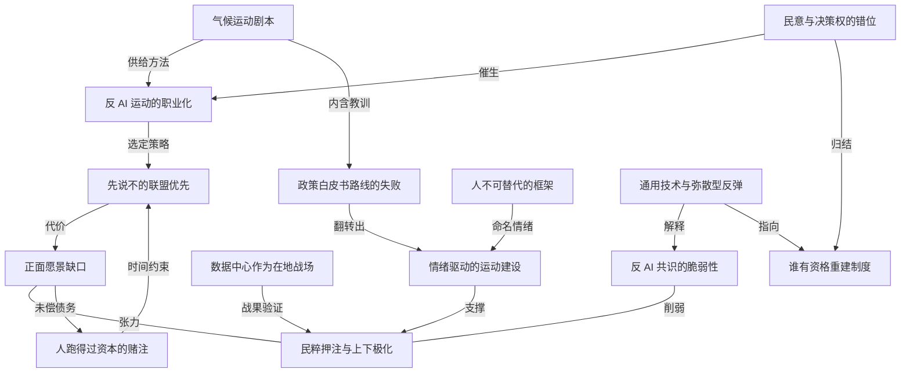

# 反 AI 运动开始职业化，照抄气候运动的剧本

- 原文标题：The AI Backlash Gets Professional
- 作者：The Atlantic
- 内参日期：2026-08-30
- 来源类型：blog
- 原文：https://www.theatlantic.com/technology/2026/08/irreplaceable-climate-activists-ai-backlash/688404/
- 标签：社会, ai 时代

> 约四分之三的美国人反对在自家附近建数据中心，近七成认为技术推进太快，两党候选人都在拿科技业开刀。一个新组织正把气候运动那套动员打法搬到 AI 议题上，对象是科技公司和政府。

## 导读

反 AI 运动

## 核心观点

- 美国社会对 AI 的不满早已是压倒性民意，缺的一直是组织化的载体。一个叫 Irreplaceable 的新组织今天正式成立，名字直译就是「人不可被机器替代」，它要把气候运动的整套剧本原样搬到 AI 上。
- 组织的班底全部来自气候运动，他们复盘出的最大教训是：气候倡导最初之所以举步维艰，是因为**把自己当成了政策专家**（policy wonks），以为拿融冰和海平面上升的证据去说服「愿意听」的国会议员就足以立法。运动真正建立在人们**感受**到什么，而不是人们**认为**什么。
- 因此 Irreplaceable 的打法是「先说不、后立纲」：今年建联盟，明年出统一政策，2029 年底前推动落地。它押的是民粹而非具体政策——问题不在某个聊天机器人或某座数据中心，而在建造它们的公司。用执行主任的话说，这场运动的极化轴不是左右，而是「down-up」（上下）。
- 作者的两处核心存疑：一是这个运动到今天仍说不出「我们要什么」，缺一个 AI 版的绿色新政（Green New Deal）；二是时间——它在赌「人能跑得过资本」，而科技公司为中期选举已经砸下数千万美元，几年之后 OpenAI、Anthropic 和一批中国公司可能早已造出并失控于更强的模型。
- 收尾的判断更锋利：如果 AI 真是硅谷自己爱说的通用技术，那么任何单点治理都不够——反 AI 情绪的宽泛甚至含混，反而是合理的。而 OpenAI 与 Anthropic 的高层自己都说过，真正的 AI 革命可能需要新的民主与经济制度；那么，已经拆掉这么多东西的这些公司，也许不该同时是负责重建的人。

## 错位：压倒性民意撞上不受约束的产业

- 民意数据一边倒：约四分之三的美国人反对在自家周边建数据中心；约四分之三认为 AI 会伤害自己的工作保障；近 70% 认为这项技术推进得太快。「民调还可以一直列下去。」
- 政治层面已经出现传导：进步派和共和党候选人同样靠痛击科技业赢初选；多个州和城市叫停了数据中心开发计划。
- 但在作者居住的旧金山，OpenAI 和 Anthropic 的员工正以光速开发这项被恐惧的技术，薪酬包远超 100 万美元。硅谷的增长基本不受监管掣肘，特朗普政府甚至动用权力为 AI 产业提速。
- 作者把这条裂缝定性为**这个时代的定义性特征**：一边是只能被动承受技术落地的大多数人，一边是对技术有直接影响力的极小人群。正是在这条裂缝上，一个同时连着湾区与华盛顿的小团体开始发声，要求 AI 竞赛减速，要求这项技术由尽可能广泛的人群、而不是高管和工程师来监督。

## Irreplaceable 是谁：气候老兵的转场

- 组织今天正式成立，名字取自「people are irreplaceable by machines」。作者形容它的愿景「大胆、也许天真」，本质上是**对今日美国式资本主义的抗议**，策略是先抵抗，后拟定连贯方案。
- 作者带着直接的怀疑去见创始人：他见过 AI 公司有多刀枪不入——为训练模型攫取近乎无限量的媒体内容、为数据中心建起未获许可的电厂、放出能造成大规模安全事故的自主 agent，而这一切**几乎没有任何后果**。他想问的是：你们凭什么觉得自己能做成？
- 核心人物：Phil Aroneanu（执行主任，气候组织 `350.org` 联合创始人）、Jeremy Ornstein（竞选策略师，前 Sunrise Movement 组织者）、William Lawrence（Sunrise 联合创始人）。
- 议程覆盖三类问题：缓解自动化对经济的冲击；防范政府与企业用 AI 监控美国人；建立行业监督与护栏，以防灾难性事故——比如 AI 驱动的黑客攻击造成大面积停电，或机器人设计的流行病。

## 方法论翻转：从「说服脑子」到「引导情绪」

- Aroneanu 的复盘：气候倡导者早期像政策书呆子，相信向「听得进去」的议员做基于证据的论证，就能推动全国性气候立法。事实证明不行。
- 他今天的结论是：运动不必然建立在人们**认为**什么之上，而建立在人们**感受**什么之上。气候运动真正起作用的形态是化石燃料撤资运动、反输油管抗议、以及 Greta Thunberg 领导的学生罢课。
- Ornstein 给出同一逻辑在 AI 上的版本：「人们懂的。人们有一种直觉——如果我们创造出比人更强大的机器，那可能会走向危险和可怕的地方。」
- Aroneanu 说人们已经「感受到挤压」（feeling the squeeze），「我们应该把那种焦虑和愤怒指向正确的方向」。
- 作者对这套民粹路径给出了旁证：过去 15 年美国政治中最大、也许是唯一持久的那些成功——茶党、AOC、MAGA、选举否认主义——全都由「经济不公平、政治被操纵」的愤怒所驱动。同时他也提醒了反面：绿色新政虽然通过，却是被稀释之后才通过，随后又被第二任特朗普政府掏空。

## 职业化的证据：从喊口号不齐到有乐队的游行

- 这批组织者有硬战绩：Sunrise、`350.org` 等推动了全国性立法、发动了大规模气候示威、加速了私营部门的可再生能源开发。
- AI 战场上也已经动了手：今年 7 月，数百人参加了可能是旧金山历史上规模最大的反 AI 示威，从 OpenAI 总部一路游行到 Anthropic，最后到 Google。
- 「职业化」的对照最能说明问题：几个月前「Stop the AI Race」的一场抗议组织得相当混乱，参与者有时连口号都喊不齐；第二次由 Ornstein 担任顾问，现场有了口号单、行进乐队，还开来一辆冰沙车（寓意把 AI「冻住」）。
- 气候系组织已经在为在地数据中心之战供给弹药：包括 NAACP 的环境正义部门、Sierra Club 和 Earthjustice，手段是提起诉讼、起草示范立法、组织抗议。
- 两者的重叠既是具体的（数据中心污染空气，其庞大电力需求要烧化石燃料），也是主题性的（都是针对企业利益、要改变或规制「未来的技术」的运动）。
- 在地战果已经出现：数十座数据中心在本地反对声中被取消；所有大型 AI 公司都承诺额外付费，以免推高当地电价。在密歇根，Abdul El-Sayed 与 Sunrise 联合创始人 William Lawrence 都以猛攻数据中心的进步派身份赢下了民主党初选。

## 反面证据：这股焦虑还远不是「大潮」

- 越来越多美国人担忧 AI，**不等于**他们的担忧理由相似，甚至不等于这些理由彼此兼容。
- 具体的矛盾：人们可能声称痛恨数据中心，但同样享受 AI 产品在家里和工作中带来的便利；他们害怕机器人变得太强太快，却也认为美国必须在 AI 发展上领先中国。
- 作者在一场反 AI 抗议现场亲眼看到：名义上站在同一边的人，会为 AI 的耗水量、以及某些工作是否交给聊天机器人更好而彼此争论。
- 全球化难题：一个足够强大的 AI 运动必须是全球性的，就像当年的气候组织一样；但这项技术在美国之外的民调好得多。**反 AI 情绪在相当程度上是一个美国现象**——这对形成全球规范或条约是坏消息。

## 最大的空缺：只会说不，说不出要什么

- 被追问时，Irreplaceable 的所有人、以及其他转向 AI 的气候活动家，都拿不出一份具体的 AI 议程。Lawrence 的原话是：「我们围绕『说不』达成了一致。现在，还有一场重要的对话尚未发生——好吧，那我们到底想要什么？」
- 作者判定这是当下的重大弱点：气候运动的关键转折点，正是给出了一个**正面愿景**——绿色新政同时承诺去碳化**和**重振美国经济。能把每一场数据中心之战、每一次初选战役都接到一个全国性愿景上，反 AI 浪潮才会有形状。
- 作者也给了公道：想用广泛联盟的输入去写政策路线图并没有错，气候倡导者花了几十年才拿出并团结在绿色新政上。
- 时间表：今年建联盟，明年出统一政策，2029 年底前落地议程。用硅谷「战速」以外的任何标准衡量，这都算快。
- 但风险在两头：这几年足够科技公司完成反扑（他们为中期选举前已投入数千万美元），而且到那时，OpenAI、Anthropic 和任意数量的中国公司可能已经造出并失控于更强大的模型。

## 押注民粹：联盟先行，政策后置

- 一句话概括这场赌局：**Irreplaceable 在赌人能跑得过资本。**
- 在缺乏具体政策的情况下，它本质上是押注民粹——问题不是某个聊天机器人或某座数据中心，而是**建造它们的公司**。联盟在前，政策在后。
- Aroneanu 谈政治可持续性的条件：「你必须立刻让人们看到好处。它几乎必须立刻落进他们的钱包，才会有政治显著性。然后你必须持续捍卫它。」
- 民调机构 Athena Insights 负责人 Caroline Behringer（曾参与奥巴马的气候行动计划）给出情绪的最大公约数：人们对 AI 各具体面向的看法可能不同，但根本上，人们不喜欢「这项技术正在进入他们的生活，而他们对它几乎没有控制权」。
- 因此这场运动要制造的极化，用 Aroneanu 的说法不是左右，而是「down-up」（自下对自上）。

## 极化风险：明知会被党派化，仍选择从左侧建权力

- 现实约束：气候根系把这个组织连到进步派事业上，它主要会去组织中左翼。
- 作者直接问 Aroneanu，这会不会适得其反——把议题党派化，重蹈气候行动被党争与政策倒退拖垮的覆辙。
- 他的回答很实用主义：「这个议题很可能会被极化。」他认为政党「极其擅长制造负面党派认同」，而产业也很可能去「分裂基本盘」。气候运动在某个时点必须做出决定：接受党派化，从左侧建立权力。
- Irreplaceable 希望保守派的对应组织会出现，也相信自己的民粹信息能跨越文化战争的分界线，但 Aroneanu 并不认为这属于他明确的职责范围。

## 为什么「含混的反弹」反而说得通

- 如果 AI 真是硅谷爱说的通用技术——即这项技术会触及乃至颠覆经济的几乎每一个方面——那么宽泛甚至有时含混的反弹，恰恰是合理的。
- 作者用三组对照说明单点治理为何不够：为 AI 网络攻击设立技术监督机构，保护不了大规模裁员中每个美国人的生计；财富再分配阻止不了 AI 公司窥探你与聊天机器人之间最私密的互动；如果 AI 公司变得比国会更强大，投票也就没那么管用了。
- 最后的呼应：OpenAI 和 Anthropic 的重要人物都曾表示，一场真正的 AI 革命可能需要新的民主与经济制度。「也许他们是对的。也许这些已经拆掉了那么多东西的公司，不该同时是负责重建的那一个。」

## 概念网络

### 关键概念

#### 民意与决策权的错位

**context**：三分之二到四分之三的美国人反对本地数据中心、担忧工作保障、认为技术推进太快，而旧金山的 OpenAI 与 Anthropic 员工正以光速开发同一项技术并拿着超过百万美元的薪酬包。作者把「必须承受技术的大多数」与「对技术有直接影响力的极小人群」之间的分野称为「这个时代的定义性特征」。

**费曼一下**：投票权和方向盘不在同一双手上。绝大多数人只能坐在车里承受加速度，而踩油门的是车里的几千个人。所有后续的政治动员，都是想把方向盘从那几千人手里挪出来。

#### 反 AI 运动的职业化

**context**：几个月前的「Stop the AI Race」抗议组织混乱，参与者「有时连口号都喊不齐」；第二次由前 Sunrise 组织者 Ornstein 担任顾问后，现场出现了口号单、行进乐队和一辆冰沙车。7 月的游行是旧金山历史上可能规模最大的反 AI 示威。

**费曼一下**：自发的愤怒和有编制的运动是两种东西。前者是一群人站在街上喊，后者有人负责写口号、订乐队、设计路线。这篇文章真正的新闻点不是「有人反对 AI」，而是「反对 AI 开始有专职人员了」。

#### 气候运动剧本

**context**：Irreplaceable 的班底几乎全部来自气候运动（`350.org`、Sunrise），组织策略、盟友网络（Sierra Club、Earthjustice、NAACP 环境正义部门）和战术形态（诉讼、示范立法、街头抗议、初选战）都是从气候战场平移过来的。

**费曼一下**：一套打过仗的作战手册被换到新战场上重用。好处是不用从零学怎么打，坏处是上一场仗的所有毛病也会一起被继承过来。

#### 政策白皮书路线的失败

**context**：Aroneanu 判断气候倡导者早期之所以举步维艰，是因为他们「像政策书呆子（policy wonks）一样行事」，以为向「听得进去」的国会议员做出关于融冰和海平面上升的证据论证，就足以推动全国性立法。

**费曼一下**：把改变世界当成一场辩论赛，以为证据够硬就能赢。现实是，决策者不缺证据，缺的是不通过法案的代价。写得再漂亮的报告本身不产生代价。

#### 情绪驱动的运动建设

**context**：Aroneanu 的翻转结论是，运动建立在人们**感受**什么、而非**认为**什么之上——撤资运动、反输油管抗议、Greta Thunberg 的学生罢课才是真正起作用的形态。Ornstein 的对应表述是「人们有一种直觉：如果我们创造出比人更强大的机器，那可能会走向危险和可怕的地方」。

**费曼一下**：说服和动员是两件事。说服针对脑子，动员针对身体——要让人愿意走上街、投一票、退一笔钱。人不会为一份论证走上街，但会为一种被挤压的感觉走上街。

#### 先说不的联盟优先

**context**：Lawrence 的原话是「我们围绕『说不』达成了一致。现在，还有一场重要的对话尚未发生——好吧，那我们到底想要什么？」组织的明确计划是今年建联盟、明年出统一政策、2029 年底前落地。

**费曼一下**：先把所有讨厌这件事的人聚到一起，回头再吵到底要什么。这样起步最快，因为反对比赞成更容易达成一致；但欠下的账迟早要还——联盟越大，等到谈「要什么」的那天就越难谈拢。

#### 正面愿景缺口

**context**：作者认为这是运动当下的重大弱点：气候运动的关键转折点正是绿色新政，一个同时承诺去碳化**和**重振美国经济的正面愿景；能把每场数据中心之战和每次初选战役都接到一个全国性愿景上，反 AI 浪潮才会「有形状」。

**费曼一下**：只会说「别这样」的运动没有形状，因为反对本身指不出终点。给出一个大家想去的地方，散落各处的每一场小仗才会变成同一场战争的一部分。

#### 民粹押注与「上下」极化

**context**：在缺乏具体政策的情况下，Irreplaceable 本质上押注民粹——问题不是某个聊天机器人或某座数据中心，而是建造它们的公司；Aroneanu 说这场运动要制造的极化不是左右，而是「down-up」。作者给的旁证是过去 15 年最持久的政治成功（茶党、AOC、MAGA、选举否认主义）都由经济不公与政治被操纵的愤怒驱动。

**费曼一下**：不去争「左派该怎么想、右派该怎么想」，而是把线画在上和下之间——把矛头对准建造者本身。这条线更好动员，代价是把具体问题换成了对某一类公司的整体敌意。

#### 「人不可替代」的框架

**context**：组织名 Irreplaceable 取自「people are irreplaceable by machines」，作者形容其愿景「大胆、也许天真」，本质上是对今日美国式资本主义的抗议。

**费曼一下**：一个组织的名字就是它的一句话纲领。「人不可被机器替代」把所有分散的焦虑——失业、监控、失控——压缩成一句每个人都听得懂、也都能对号入座的宣称。

#### 数据中心作为在地战场

**context**：数十座数据中心在本地反对声中被取消，所有大型 AI 公司承诺额外付费以免推高当地电价；密歇根的 Abdul El-Sayed 与 William Lawrence 靠猛攻数据中心赢下民主党初选。气候组织与 AI 议题的重叠既是具体的（污染空气、烧化石燃料供电），也是主题性的。

**费曼一下**：抽象的 AI 焦虑很难动员，但「我家旁边要建一座耗电耗水的大厂房」是每个人都能站队的具体东西。这是把全国性议题降落到地面的接口，也是这场运动目前唯一能拿出战果的地方。

#### 反 AI 共识的脆弱性

**context**：担忧 AI 的人越来越多，不等于担忧的理由相似或彼此兼容：人们痛恨数据中心却享受 AI 产品的便利，害怕机器人太强太快却也认为美国必须领先中国；抗议现场，名义上的同一边会为耗水量和某些工作是否该被自动化而争论。技术在美国之外民调好得多，反弹「在相当程度上是一个美国现象」。

**费曼一下**：民调里的高比例像一块拼起来的板子——从远处看是一整块，一使劲就沿着缝裂开。而且这块板子基本只在美国境内，靠它去谈全球条约，地基是虚的。

#### 人跑得过资本的赌注

**context**：「Irreplaceable 在赌人能跑得过资本。」组织的三年时间表用硅谷「战速」以外的任何标准衡量都算快，但科技公司为中期选举已投入数千万美元，且到那时 OpenAI、Anthropic 和一批中国公司可能已经造出并失控于更强大的模型。

**费曼一下**：这是一场赛跑，不是一场辩论。组织建设按年计，模型迭代按月计。哪怕运动每一步都走对，也可能在拿出方案的那天发现，要管的东西已经变成了另一副样子。

#### 通用技术与弥散型反弹

**context**：作者认为，如果 AI 真如硅谷所说是通用技术、会触及并颠覆经济的几乎每个方面，那么宽泛甚至含混的反弹反而说得通——网络攻击监督机构护不住大裁员中的生计，财富再分配挡不住对私密对话的窥探，如果 AI 公司比国会更强大，投票也就没那么管用。

**费曼一下**：对手如果是一样渗进所有地方的东西，那么只在一个地方设卡就没意义。运动之所以看起来什么都反，可能不是因为它没想清楚，而是因为对手确实哪儿都在。

#### 谁有资格重建制度

**context**：OpenAI 与 Anthropic 的重要人物都曾表示，真正的 AI 革命可能需要新的民主与经济制度。作者的收尾是：「也许他们是对的。也许这些已经拆掉了那么多东西的公司，不该同时是负责重建的那一个。」

**费曼一下**：拆房子的人说这地方需要重新盖，这句话本身可能没错。问题是，为什么图纸也要由他来画。

### 概念网络

这张网络的起点是**民意与决策权的错位**（C1）：压倒性的公众不满与不受约束的产业增长同时存在，这条裂缝既是运动的燃料，也是文章最后那个制度性追问的源头。裂缝催生了组织化的载体，而载体的形态——**反 AI 运动的职业化**（C2）——之所以能一步到位，是因为**气候运动剧本**（C3）现成可用：口号单、行进乐队、诉讼、示范立法、初选战，全是平移过来的成品。

剧本的价值不只在战术，更在它内含的一条教训。**政策白皮书路线的失败**（C4）是气候倡导者用几十年买来的：以为证据够硬、议员够友善就能立法。这条教训翻转成**情绪驱动的运动建设**（C5）——运动建立在人们感受什么，而非认为什么。**「人不可替代」的框架**（C9）正是这套方法的产物：它不论证，它命名情绪，把失业、监控、失控压缩成一句人人对号入座的宣称。

方法论继续外化为路线选择。职业化的组织选定了**先说不的联盟优先**（C6）：反对比赞成更容易达成一致，联盟因此建得最快。但这条捷径立刻产生**正面愿景缺口**（C7），而它与**民粹押注与「上下」极化**（C8）之间是全篇最吃紧的一处张力——民粹能把分散的愤怒聚成力量，却也让「我们到底要什么」更难回答。C5 支撑 C8，**数据中心作为在地战场**（C10）用可数的战果验证 C8（数十座项目被取消、电价承诺、两场初选胜利），而**反 AI 共识的脆弱性**（C11）从内部削弱 C8：同一批「反对者」为耗水量和自动化互相争论，且这股情绪基本只在美国境内成立。

时间维度上，**人跑得过资本的赌注**（C12）对 C6 构成硬约束：三年时间表按任何非硅谷标准都算快，却仍要与数千万美元的政治投入和按月迭代的模型能力赛跑；反过来，C7 这笔未偿债务正是 C12 最可能输掉的地方——等到该拿出纲领的那天，要管的对象可能已经换了形态。

最后两个节点把全文抬升到制度层面。**通用技术与弥散型反弹**（C13）为 C11 提供了辩护：如果 AI 触及经济的每一面，那么运动看起来什么都反，未必是没想清楚，而是对手确实哪儿都在；单点治理——网络攻击监督机构、财富再分配、投票——各自都有护不住的地方。C13 由此指向**谁有资格重建制度**（C14），而 C14 同时是 C1 的终点：既然连产业内部的重要人物都承认需要新的民主与经济制度，那么拆掉最多东西的这批公司，是否也该握着重建的图纸——这是全文留下的问题，而不是答案。

## 费曼 x3

一场社会运动最难的时刻，往往不是没人愤怒，而是愤怒过剩却没有形状。今天的美国对 AI 的不满已经接近全民共识：约四分之三的人反对家门口建数据中心，同样比例的人担心饭碗，近七成觉得这项技术推进得太快。可就在民意最集中的城市里，开发这项技术的人正拿着超过百万美元的年包，加速前进，几乎不受任何约束。承受技术的人和推动技术的人之间那道裂缝，才是这个时代真正的定义性特征。

从气候战场转场过来的这群组织者，带来了一条用几十年买单换来的教训：他们最初之所以举步维艰，是因为把自己当成了政策书呆子，以为向愿意倾听的议员摆出融冰与海平面的证据，就足以让法案通过。事实证明，运动不建立在人们认为什么之上，而建立在人们感受什么之上。真正起作用的是撤资、是拦在输油管前面、是学生的罢课。放到 AI 上，这句话变成了一种更朴素的直觉：如果我们造出比人更强大的机器，那可能会走向危险和可怕的地方。人们感受到了挤压，剩下的问题只是把那份焦虑和愤怒指向正确的方向。

于是有了一条清晰但危险的路线：联盟在前，政策在后。这条路走得最快，因为反对比赞成更容易达成一致——你可以同时收编讨厌电价上涨的人、害怕失业的人、担心监控的人。但快是有代价的。被问到具体要什么时，没有人答得上来。「我们围绕说不达成了一致。现在，还有一场重要的对话尚未发生——好吧，那我们到底想要什么？」气候运动的真正转折点，恰恰是绿色新政这样一个正面愿景：它同时许诺去碳化和重振经济，因此每一场地方战役都能接进同一个故事。没有这个故事，一堆胜利也只是一堆胜利。

更棘手的是，这份共识的横截面比它的总量脆弱得多。人们厌恶数据中心，也享受 AI 带来的便利；害怕机器太强太快，也认定美国不能输给中国。抗议现场，名义上的同一边会为耗水量和某些岗位该不该被自动化吵起来。而这股反弹在很大程度上只是一个美国现象——技术在别处的民调好得多，这对任何全球性规范都是坏消息。

说到底，这是一场赌注：人能不能跑得过资本。组织建设按年计，模型迭代按月计；三年建成的纲领，可能面对的是一个已经换了形态的对象。但也正因为如此，那种看起来什么都反、边界含混的愤怒未必是不成熟。如果 AI 真是通用技术，会渗进经济的每一个角落，那么只在一处设卡就注定不够：为网络攻击设立监督机构护不住大裁员中的生计，财富再分配挡不住对私密对话的窥探，而当公司比国会更有权力时，投票也就没那么管用。产业内部的人自己也承认，真正的革命可能需要新的民主与经济制度。这句话大概是对的。真正值得追问的只是下一句：为什么图纸还要由拆房子的人来画。
