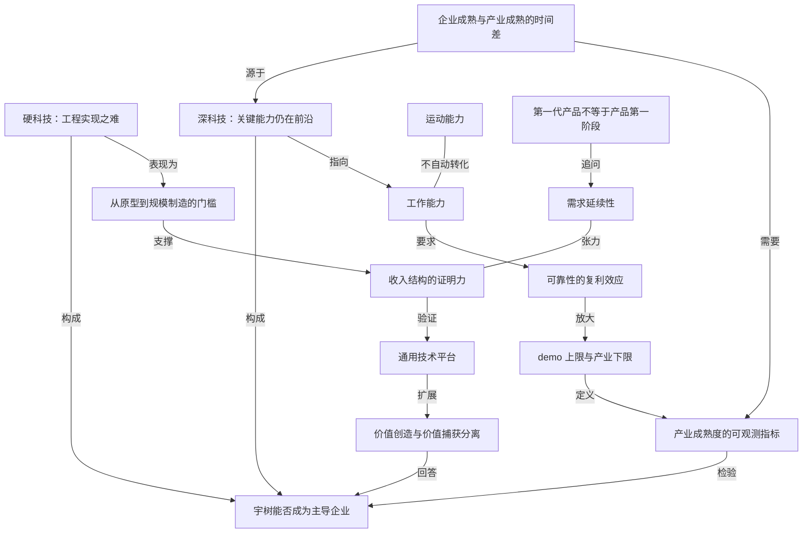

# 判断宇树的天花板，要看深科技的积累速度而不是发布会

- 原文标题：宇树会成为下一个苹果或特斯拉吗？真正的答案藏于深科技
- 作者：赵军
- 内参日期：2026-09-01
- 来源类型：公众号
- 原文：https://mp.weixin.qq.com/s?src=11&timestamp=1788186271&ver=6938&new=1
- 标签：具身智能, 工程

> 文章拒绝「下一个苹果或特斯拉」这类类比式判断，主张回到深科技本身：核心零部件、控制算法和量产工程的积累速度，才决定宇树能走多远。

## 导读

人形机器人，宇树

## 核心观点

- 上海交大安泰经管学院教授赵军写这篇文章，不是为了回答「宇树现在究竟应该值多少钱」，而是换一个更值得讨论的问题：宇树今天已经形成的市场，与人们期待的那个未来大市场，究竟是什么关系。
- 全文的判断骨架是一组区分：**「硬」不等于「深」**。硬科技的难，是复杂技术能不能被工程化地组织成一个稳定可造的系统；深科技的难，是决定未来产业边界的一些关键能力**本身还在探索前沿，没有确定答案**。人形机器人同时具备这两种属性。
- 由此推出三个连锁结论：会后空翻不等于会工作（运动能力不自动转化为工作能力）；第一代产品不等于产品第一阶段（关键要看支撑未来大市场的主要使用价值是否已经成立）；企业上市不等于产业成熟（资本能加速投入，却不能保证灵巧操作、任务泛化、长期自主运行按资本市场期待的速度成熟）。
- 最终落点不是看多或看空，而是换一套观测量：与其看发布会里的动作演示，不如看任务成功率、连续运行时间、故障率、人工介入频率、单位任务成本、客户复购和扩大部署——以及在产业价值链形成的过程中，宇树究竟掌握哪些不可替代的关键能力。

## 争论的错位：不是估值高低，而是「今天的市场」与「未来的市场」是不是同一个

- 上市当天开盘价暴涨 629%，市值一度冲到 4449 亿元，市场开始讨论它会不会成为机器人时代的苹果或者特斯拉；随后股价连续回落，如今市值 2000 多亿，收入结构、应用场景、研发投入和商业化前景又都成了质疑焦点。
- 但作者明确把「宇树现在究竟应该值多少钱」排在次要位置。真正的问题在结构上：
- 宇树的收入和利润都是真的。2025 年营业收入 17.08 亿元，扣非归母净利润约 6 亿元，人形机器人全年出货超 5500 台。
  - 但收入构成指向的是另一个市场。2025 年前三季度，科研教育占 73.60%，商业消费占 17.39%，行业应用占 9.01%；而能够明确统计为智能制造、智能巡检、物流配送等场景的收入**仅为 1570 万元**。
- 如果人形机器人更大的产业空间来自制造、物流、服务乃至家庭劳动，那么今天这份已经成立的收入，与那个目标市场之间是延续关系还是断裂关系，就成了全篇要回答的问题。
- 一种很有吸引力的解释是把今天的人形机器人看成早年的 iphone 或者电动汽车：第一代产品都不完美，后来性能提高、成本下降、生态成熟，最终形成巨大市场。作者不否认这个故事可能发生，但指出它忽略了一个重要区别——**不同产业所谓的「早期」，其问题本质未必相同**。

## 宇树科技已经有点「硬」

- 把人形机器人做到今天这个程度，本身就有相当高的技术门槛。奔跑、跳跃、格斗和越来越复杂的全身动作，背后不是某一种算法或者某一个零部件的突破，而是**整机集成共同工作的结果**。
- 对于机器人这样的复杂物理系统，作者强调有两种能力必须分开看：
- 一个实验室样机能够完成漂亮动作；
  - 同一种产品能够**稳定生产**。
- 现代复杂产品本来就依赖供应链协作，并不要求每一个零部件、每一道工序都由企业自己完成。真正困难的是能不能把关键技术、外部零部件、制造体系和整机系统组织起来，最后形成**性能稳定、成本可控**的产品。
- 宇树已经证明的，是一家企业能够把高度复杂的人形机器人从实验室原型推向标准化产品，跨过相当高的工程化和产品化门槛。
- 但作者随即划定这个结论的边界：这**并不意味着它的每一项核心技术都足够领先**，更不意味着其人形机器人已经解决所有关键技术问题。只是在上述意义上，可以说宇树已经有点「硬」了。

## 「硬」与「深」，其实是不同的问题

- 硬科技与深科技有大量重叠，却强调不同的技术难题。
- **硬科技的「硬」**：更多体现在复杂技术的工程实现。高端装备、先进传感器、工业机器人都有这种特征——难度往往不只来自某一项原理突破，而来自大量技术、零部件和工程环节最终能不能组成一个真正可用的系统。
- **深科技的「深」**：强调另一种不确定性——决定未来产业空间的关键技术能力，本身是否仍处于探索前沿。作者给了三个平行案例：
- 商业核聚变已经能建造大型实验装置，但距离持续、经济的商业发电仍有一系列问题；
  - 量子计算已经有真实设备和商业服务，但大规模容错计算仍未实现；
  - 一些脑机接口已经可以完成特定功能，但距离更广泛应用还有明显技术障碍。
  - 共同点：面对的不只是把已有能力「做得更好」，很多**决定产业边界的问题还没有确定答案**。
- 人形机器人恰好同时具有这两种特征：
- 硬的一面：关节、电机、传感器、整机结构、运动控制、供应链和规模制造。
  - 深的一面：要真正成为进入工厂、仓库、商业服务乃至家庭的通用劳动工具，仅仅把机器人的身体做出来远远不够——还需要理解陌生环境、处理开放任务、完成灵巧操作、在失败以后自主纠错，并在长时间运行中保持足够高的可靠性。
- 一句话概括这一节的分工：宇树已经解决了不少「难造」的问题，但行业仍然存在很多「**还不知道最终怎样解决**」的问题。前者是「硬」，后者才是这篇文章要讨论的「深」。

## 会后空翻，为什么还不等于会工作

- 宇树最令人印象深刻的进步集中在运动能力上。奔跑、跳跃、格斗、舞蹈以及越来越复杂的全身动作，不只是为了展示，背后反映的是运动控制、强化学习和整机性能的快速提高。
- 王兴兴也多次强调运动能力的重要性：机器人真正干活必须拥有足够丰富和稳定的动作能力。但他**同时承认**，目前机器人真正进入工厂和家庭的重要障碍仍然是效率和泛化能力不足。
- 作者的关键拆解是：**「工作」并不是一连串预先确定动作的简单叠加**。
- 让机器人在陌生仓库里找到指定物品并送到另一个工位，看起来远没有后空翻精彩，却要求它理解指令、识别环境、判断物体位置、选择抓取方式、避开突然出现的人和障碍，并在某一步失败以后决定下一步怎么办。
  - 拧灯泡、拉拉链、整理衣物这些对人类极其普通的工作，也需要感知、理解、决策、操作和反馈不断形成闭环。
  - 结论：运动能力是工作能力的重要基础，**却不会自动转化为工作能力**。
- 更大的差别来自可靠性。技术演示只需要证明「能够做到」，生产系统关心的却是「**能不能一直做到**」。
- 一项任务成功率 95%，在实验室里可能已经相当出色；但每天重复 1000 次，就意味着平均出现 50 次异常。
  - 一旦每次异常都需要人工处理，机器人的经济性就会迅速下降。
  - 工业客户购买的不是偶尔能够创造奇迹的机器人，而是一套**绝大多数时候都不会制造麻烦的生产系统**。
- 于是有了全文最凝练的那句判断：接下来真正要跨越的，可能不是从「不会运动」到「会运动」，而是从「会运动」到「会工作」——**demo 展示的是运动能力的上限，产业购买的却是工作能力的下限**。

## 第一代产品，不等于产品第一阶段

- 几乎每一种后来取得巨大成功的新技术，都能找到一个并不完美的第一代产品：早期智能手机功能有限，早期电动汽车价格昂贵、续航不足。所以当新技术遭遇质疑时，人们很容易搬出「苹果和特斯拉也曾经历过这样的阶段」。
- 作者对这种类比的批评很精确：问题不在于历史经验没有价值，而在于它**容易把所有「不成熟」都理解成同一种不成熟**。
- 早期 iphone 远没有今天的智能手机完善，但它最主要的使用价值已经出现：移动通信、互联网和应用可以在一个终端上完成。早期特斯拉也有成本、续航、充电设施和制造能力等大量问题，但它首先已经是一辆可以完成交通功能的汽车。它们后来最重要的任务，是让**已经成立的价值**变得更好、更便宜、更方便，从而覆盖更多用户。
- 今天的人形机器人作为科研平台、教学设备、展示产品或者具有特定运动能力的机器人，已经具有明确使用价值。但市场对它更大的期待，是进入工厂、仓库、商业服务乃至家庭，持续承担人的劳动。
- 因此真正值得比较的不是「第一代产品是不是都不完美」，而是**第一代产品出现的时候，支撑未来大市场的主要使用价值是否已经成立**。
- 第一批智能手机用户与后来数十亿智能手机用户之间，核心需求具有明显延续性；
  - 早期电动车车主与今天更广泛的汽车消费者，仍然是在购买交通工具；
  - 而高校实验室为了研究算法购买人形机器人，与制造企业因为生产效率提高而一次部署数百台机器人，**并不是同一种需求**。

## 收入和利润都是真的，但它们证明了什么

- 对于成熟产业，一家公司收入和利润持续增长，通常意味着已有市场正在扩大。但人形机器人可能是另一种情况：决定更大产业空间的能力仍在发展，企业已经有产品进入不同市场。因此真正值得关注的是这些商业化收入**究竟验证了什么**。
- 目前宇树的收入绝大部分来自科研教育（占比 73.6%）。科研教育本身也是一个市场，但远没有工厂、仓库、商业服务乃至家庭的市场那么大。
- 客户从试用几台扩大到数十台、数百台，意义也完全不同：
- 拿出真正过硬的技术、证明产品具有某种价值，客户才会**尝试购买**；
  - 产品在真实工作环境中的价值证明了经济性和可复制性，客户才会**复购和扩大部署**。
- 一个关键案例（正反两面同时成立）：2026 年 7 月，加州大学圣地亚哥分校研究团队利用基于宇树 G1 改造的人形机器人，完成活体猪腹腔镜胆囊切除实验。
- 真正完成手术判断和精细操作的仍然是外科医生；研究团队还对 G1 做了大量改造，包括安装专业腹腔镜器械、开发遥操作系统、重建运动学模型和控制算法。
  - 反面：说明宇树的通用机器人本身**无法胜任**像胆囊切除手术这样复杂的工作场景。
  - 正面：研究者没有从头设计一台完整的医疗机器人，通用人形机器人成为他们开发新能力的一种**基础平台**。
- 由此引出「平台」这条判断线：一台机器人被高校买去，如果只是用于课堂展示，它对未来市场的证明力当然有限；但如果机器人本体具有一定的**开放性、可编程性和可扩展性**，可以成为别人继续创新的基础，意义就完全不同。
- 对于有可能发展成通用技术平台的产品，应用未必都要由机器人企业自己开发——科研机构、软件公司、系统集成商和行业企业，也可能成为新的**场景发现者**。
  - 所以宇树未来能走多远，既取决于它的技术能力，也取决于它的**技术选择**；如果走通用技术平台路线，那么**客户拿产品做出了什么**，更能说明它未来可能走到哪里。

## 企业上市并不等于产业成熟

- 上市之后一个很容易出现的判断是：企业既然能上市，说明技术、产品和商业模式已经相当成熟。作者承认这个判断有一部分是对的——上市意味着企业已经建立起相对完整的组织、产品、客户和财务体系，也意味着它开始接受公开资本市场的定价。
- 但这**并不意味着决定整个产业未来的技术和应用问题已经同步解决**。资本可以帮助企业增加研发投入、扩大团队、建设产能，也可以让更多技术路线同时推进，却无法保证灵巧操作、任务泛化、长期自主运行等能力按照资本市场期待的速度成熟。
- 对于「深」科技企业而言，**企业成熟与产业成熟本来就可能存在明显的时间差**。
- 这不是说这类企业不该上市——高风险、长周期的技术创新本来就需要资本支持。真正需要注意的是：公开市场不能只看到收入、利润、订单和出货量，还需要知道这些数字背后的技术和真实使用究竟走到了哪一步。
- 作者据此给出一组比演示效果更有说明力的产业成熟度指标：
- 任务成功率、连续运行时间、故障率、人工介入频率；
  - 单位任务成本、客户复购和扩大部署。
- 一句总结：企业可以先上市，但产业成熟最终仍要由**技术能力、客户使用和经济性**来证明。

## 结语：主导企业，还是非常优秀的本体制造商

- 今天评价宇树最容易走向两个极端，作者认为两种判断都太简单：
- 因为它已经盈利、上市，就把今天的人形机器人直接类比为早期苹果和特斯拉；
  - 因为它距离通用劳动工具仍有明显距离，就把现有产品和市场价值一并否定。
- 已经被证明的：人形机器人可以从实验室样机变成复杂而可制造的商品。尚待回答的：它能否进一步成为**稳定、可靠并具有经济性的劳动工具**。
- 还有一条被忽视的成长路径：当机器人本体足够稳定、开放而且成本足够低时，越来越多研究者、开发者和行业企业可能在其基础上创造新的用途。
- 但作者立刻指出这里的风险——这会扩大人形机器人的产业空间，**却未必意味着这些价值最终都会留在机器人制造企业本身**。
  - 如果未来真正决定机器人工作能力的是具身智能模型、灵巧操作、行业软件或者系统集成，新的技术力量完全可能成为产业中更重要的**价值创造者和价值获得者**。
- 所以最终的判断标准不是它能制造和销售多少机器人，也不是围绕其产品出现了多少新应用，而是：在人形机器人产业不断形成的过程中，它究竟掌握哪些**不可替代的关键能力**，又能在多大程度上参与新价值的创造和分配。
- 全文以一个悬置的问题收尾：现在判断宇树是不是「下一个苹果或者特斯拉」还太早，但这正是最值得关注的问题——**宇树最终会成为人形机器人时代的主导企业，还只是一个非常优秀的机器人本体制造商？**

## 概念网络

### 关键概念

#### 硬科技

**context**：文中把「硬」界定为**复杂技术的工程实现**——高端装备、先进传感器、工业机器人的难度「往往不只来自某一项原理突破，而来自大量技术、零部件和工程环节最终能不能组成一个真正可用的系统」。宇树在关节、电机、传感器、整机结构、运动控制、供应链和规模制造上表现出的正是这种属性，作者据此说它「已经有点『硬』了」。

**费曼一下**：硬科技考的是「组装与落地」这门功夫。原理不一定新，但要把上千个零件、几十道工序、一堆算法拼成一台每天都能开机干活、成本还降得下来的机器，本身就是极高的门槛。它像盖一栋结构复杂的大楼——建筑力学不是未解之谜，可真要盖起来不塌不裂不超预算，是另一回事。

#### 深科技

**context**：与硬科技大量重叠但强调另一种不确定性——「决定未来产业空间的一些关键技术能力，本身是否仍处于探索前沿」。文中并列了商业核聚变、量子计算、脑机接口三个案例：都已有真实装置或商业服务，但持续经济发电、大规模容错计算、更广泛应用「仍未实现」。共同特征是「很多决定产业边界的问题也还没有确定答案」。

**费曼一下**：深科技的难不在做得更好，而在**还不知道最终怎样解决**。硬科技是「知道怎么做，做起来很难」；深科技是「连能不能做成、要多久做成都还没答案」。把这两类难度混为一谈，就会用错误的时间表去预期一个产业。

#### 从实验室原型到规模制造的工程化门槛

**context**：文中把「一个实验室样机能够完成漂亮动作」与「同一种产品能够稳定生产」明确定义为**两种不同的能力**。宇树已经跨过从技术原型到标准化产品、再到一定规模制造的这段距离，关键在于「把关键技术、外部零部件、制造体系和整机系统组织起来，最后形成性能稳定、成本可控的产品」。

**费曼一下**：能做出一台惊艳的样机，和能一年造出五千台、每台都一样好用，中间隔着一整套组织能力。前者可以靠天才和运气，后者只能靠体系。评估一家硬件公司时，把这两件事分开看，能避免大部分误判。

#### 运动能力与工作能力的区分

**context**：全文最核心的一组对照。奔跑、跳跃、格斗、后空翻反映的是运动控制、强化学习和整机性能的提高，但「『工作』并不是一连串预先确定动作的简单叠加」——在陌生仓库取送物品需要理解指令、识别环境、判断位置、选择抓取方式、避障，并「在某一步失败以后决定下一步怎么办」。结论是「运动能力是工作能力的重要基础，却不会自动转化为工作能力」。

**费曼一下**：会做体操动作和会干活是两码事。体操是把预设动作做漂亮，干活是在没排练过的环境里不断做判断、出错了还得自己找补。看到机器人后空翻就推断它能进工厂，等于看到一个人会翻跟头就断定他能当电工。

#### demo 上限与产业下限

**context**：文中用来概括演示与采购之间的落差：「技术演示只需要证明『能够做到』，生产系统关心的却是『能不能一直做到』」，最终凝练为「demo 展示的是运动能力的上限，产业购买的却是工作能力的下限」。

**费曼一下**：发布会展示的是这台机器**最好的一次**，客户买单的是它**最差的那些次**。两者是同一台机器的两端，但商业价值几乎完全由后者决定。凡是靠峰值表现说服人的技术，都值得追问它的下限在哪里。

#### 可靠性的复利效应

**context**：文中用一组算术把可靠性问题量化：任务成功率 95% 在实验室「可能已经相当出色」，但「每天重复 1000 次，就意味着平均出现 50 次异常」；一旦每次异常都要人工处理，「机器人的经济性就会迅速下降」。工业客户要的是「一套绝大多数时候都不会制造麻烦的生产系统」。

**费曼一下**：成功率不是线性的好坏刻度，而是会被重复次数放大的杠杆。95% 听上去接近满分，可放到规模化生产里，剩下那 5% 会天天派人去收拾。自动化的经济性往往不是被「能不能做到」卡住，而是被「失败时谁来兜底」卡住。

#### 第一代产品与产品第一阶段的区分

**context**：针对「苹果和特斯拉也曾经历过这样的阶段」这类类比提出的辨析。作者指出问题在于它「容易把所有『不成熟』都理解成同一种不成熟」，真正值得比较的是「第一代产品出现的时候，支撑未来大市场的主要使用价值是否已经成立」。早期 iphone 的移动通信与应用价值已经出现，早期特斯拉「首先已经是一辆可以完成交通功能的汽车」。

**费曼一下**：都叫「第一代」，含义可以天差地别。一种是价值已经成立、剩下的是变便宜变好用；另一种是核心价值还没跑通、剩下的是未知数。用第一种的历史去给第二种做类比，得到的乐观是借来的。

#### 需求延续性

**context**：判断今天的市场能否长进未来市场的具体标尺。第一批智能手机用户与后来数十亿用户「核心需求具有明显延续性」，早期电动车车主与今天的消费者「仍然是在购买交通工具」；而「高校实验室为了研究算法购买人形机器人，与制造企业因为生产效率提高而一次部署数百台机器人，并不是同一种需求」。

**费曼一下**：看一家公司的增长故事能不能成立，要看今天买它的人和将来要买它的人，是不是出于同一个理由掏钱。理由相同，今天的销量就是未来的先行指标；理由不同，今天的销量再好看也只是另一个小市场的销量。

#### 收入结构的证明力

**context**：文中把收入拆开看它「究竟验证了什么」：宇树 2025 年前三季度科研教育占 73.60%，商业消费 17.39%，行业应用 9.01%，能明确统计为智能制造、智能巡检、物流配送等场景的收入仅 1570 万元。作者由此区分两级验证——「尝试购买」证明技术过硬，「复购和扩大部署」才证明经济性和可复制性。

**费曼一下**：同样一笔收入，来自谁、为什么买，信息含量完全不同。成熟产业里收入增长意味着市场扩大；在能力还没跑通的产业里，收入更像一份来源清单——得看清楚钱是从哪个市场来的，才知道它预示了什么。

#### 通用技术平台与基础平台价值

**context**：由加州大学圣地亚哥分校用改造版宇树 G1 完成活体猪腹腔镜胆囊切除实验引出。研究者「没有从头设计一台完整的医疗机器人」，而是把通用人形机器人当作开发新能力的基础平台。作者据此指出：如果本体具有「开放性、可编程性和可扩展性」，科研机构、软件公司、系统集成商和行业企业都可能成为新的**场景发现者**。

**费曼一下**：一台机器可以只是产品，也可以是别人创新的地基。做地基的好处是不必自己想出所有用法——全世界的聪明人都在替你扩展场景；判断这条路走没走通，看的不是你卖了多少台，而是**客户拿你的东西做出了什么**。

#### 企业成熟与产业成熟的时间差

**context**：针对「上市即成熟」的直觉给出的修正。上市说明企业「已经建立起相对完整的组织、产品、客户和财务体系」，但资本「无法保证灵巧操作、任务泛化、长期自主运行等能力按照资本市场期待的速度成熟」。对深科技企业，两种成熟之间「本来就可能存在明显的时间差」。

**费曼一下**：公司的成熟度和行业的成熟度是两块表，可以走得完全不同步。钱能买来产能、团队和更多技术路线，买不来某个科学问题的答案。所以一家深科技公司完全可能财务上很像成熟企业，而它所在的产业还在半空中。

#### 产业成熟度的可观测指标

**context**：作者给公开市场提出的替代观测量——「无论是任务成功率、连续运行时间、故障率、人工介入频率，还是单位任务成本、客户复购和扩大部署，都比单纯的演示效果更能说明产业成熟度」。

**费曼一下**：想知道一项技术走到哪一步，别看它最风光的时刻，去找那些枯燥的运行数据：多久坏一次、多久要人来管一次、干一件事花多少钱、老客户还买不买。这些指标不上热搜，但它们才是产业真正的体温计。

#### 价值创造与价值捕获的分离

**context**：结语部分的关键区分。机器人本体足够稳定、开放、便宜之后，更多研究者和企业会在其上创造新用途，「这当然会扩大人形机器人的产业空间，却未必意味着这些价值最终都会留在机器人制造企业本身」。如果决定工作能力的是具身智能模型、灵巧操作、行业软件或系统集成，「新的技术力量完全可能成为产业中更重要的价值创造者和价值获得者」。

**费曼一下**：把蛋糕做大和分到蛋糕是两件事。一个产业繁荣起来，钱不一定流向最早把它做出来的那家公司，而是流向那个环节最难被替代的人。所以问「宇树能不能成为下一个苹果」，本质上是在问：在这条价值链里，本体制造是不是那个卡住所有人的位置。

### 概念网络

这张网络的骨架是一次**难度的分类**：文章先把「难」拆成两种，再让后面所有判断都从这个分叉长出来。

**第一层：两种难度的分叉。** 硬科技与深科技共同构成了「宇树能否成为主导企业」这个总问题的两条腿，但它们的性质相反。硬科技指向已经被跨越的部分——它具体表现为「从原型到规模制造的门槛」，宇树跨过了，于是有了真实的收入、利润和出货量，这条线最终**支撑**了收入结构那一端的讨论。深科技指向尚未跨越的部分——它直接**指向**工作能力，因为让机器人理解陌生环境、处理开放任务、完成灵巧操作、失败后自主纠错，正是那些「还不知道最终怎样解决」的问题。全文的张力就在这里：一条腿已经站稳，另一条腿还悬着。

**第二层：能力鸿沟如何被观测。** 运动能力与工作能力之间是一条**不自动转化**的无向关系，这是全篇最重要的一处「不等于」。工作能力进一步**要求**可靠性，而可靠性又被重复次数**放大**成 demo 上限与产业下限的落差——95% 的成功率在演示里是成绩，在每天一千次的产线上是五十次麻烦。这条链条并不停在批评上：它反过来**定义**了应该看什么指标，任务成功率、连续运行时间、故障率、人工介入频率、单位任务成本，都是这条链条的自然产物。

**第三层：类比的解毒剂。** 「第一代产品不等于产品第一阶段」**追问**的是需求延续性——第一代 iphone 用户和后来数十亿用户为同一个理由掏钱，而高校实验室买机器人研究算法和工厂一次部署数百台，理由完全不同。需求延续性与收入结构的证明力之间是一层**张力**：收入是真的，但它证明的是科研教育市场，而不是那个被期待的大市场。这一层的作用是拆掉「历史类比」这个最容易让人放松警惕的支点。

**第四层：从证明力到价值归属。** 收入结构的问题并没有停在质疑上，而是**验证**出另一条路径——通用技术平台。加州大学圣地亚哥分校的胆囊切除实验同时说明两件事：通用机器人独自干不了这活，但它可以当基础平台。平台一旦成立就会**扩展**出更大的产业空间，也随之带来价值创造与价值捕获的分离风险。与此同时，深科技属性还**源生出**企业成熟与产业成熟的时间差，而消解这种时间差的误判，恰恰**需要**那组可观测指标。

最后两条边收束回起点：可观测指标**检验**宇树走到了哪一步，价值归属**回答**它最终能站在哪个位置。这也是文章标题里那层意思——判断天花板要看深科技的积累速度，而不是发布会上那些已经属于「硬」的部分。

## 费曼 x3

一家公司盈利了、上市了、一年出货五千多台，这些通常被当作「这个行业成了」的证据。但有一类技术，公司的成熟度和产业的成熟度可以严重不同步，而人形机器人正好站在这个错位上。宇树上市当天开盘暴涨 629%，市值一度冲到 4449 亿元，随后回落到 2000 多亿——市场在这两个数字之间摇摆，其实是在为一个还没想清楚的问题定价。

想清楚这个问题，先要把「难」分成两种。一种难是工程实现的难：把上千个零部件、几十道工序、一堆控制算法组织成一台性能稳定、成本可控、还能批量造出来的机器。这种难是「知道怎么做，但做起来极其困难」，姑且叫它硬。另一种难是决定产业边界的关键能力本身还在探索前沿——商业核聚变已经能建大型装置却发不出经济的电，量子计算有了真实设备却还做不到大规模容错，脑机接口能完成特定功能却离广泛应用尚远。这种难是「连最终怎么解决都还没有答案」，叫它深。宇树已经证明自己有点硬，但人形机器人这个产业同时还很深。

这个分叉一旦拉开，很多流行的判断就站不住了。最典型的是那个后空翻。奔跑、跳跃、格斗背后确实是运动控制和整机性能的真实进步，可「工作」并不是一连串预先确定动作的简单叠加。让机器人去陌生仓库取一件东西送到另一个工位，看起来远没有后空翻精彩，却要求它理解指令、识别环境、判断位置、选择抓取方式、避开突然出现的人，并在某一步失败以后决定下一步怎么办。运动能力是工作能力的基础，却不会自动变成工作能力。更要命的是可靠性：95% 的成功率在实验室相当漂亮，但每天重复一千次就是五十次异常，每次异常都要人来收拾，经济性瞬间归零。工业客户买的从来不是偶尔创造奇迹的机器人，而是一套绝大多数时候都不制造麻烦的生产系统。发布会展示的是上限，产业购买的是下限。

第二个站不住的是历史类比。人们爱说苹果和特斯拉的第一代产品也很粗糙——这话没错，但它把所有「不成熟」都当成了同一种不成熟。第一代 iphone 再简陋，移动通信加互联网加应用这个核心价值已经成立；早期特斯拉再多毛病，它首先是一辆能完成交通功能的汽车。它们后来做的事，是让已经成立的价值更好更便宜。而今天买人形机器人的主力是科研教育，占了收入的七成以上，明确用于智能制造、巡检、物流场景的收入只有 1570 万元。高校实验室为研究算法买一台，和制造企业因为效率提升一次部署数百台，根本不是同一种需求。今天的销量能不能预示明天的市场，取决于买家掏钱的理由是不是同一个。

那该看什么？看那些不上热搜的枯燥数字：任务成功率、连续运行时间、故障率、人工介入频率、单位任务成本、客户复不复购、要不要扩大部署。还要看客户拿这台机器做出了什么——加州大学圣地亚哥分校用改造过的 G1 做活体猪胆囊切除实验，一方面说明通用机器人独自干不了这活，另一方面说明它可以成为别人开发新能力的地基。而地基这件事有个残酷的后半句：产业空间被做大了，价值未必留在造本体的那家公司。如果真正决定工作能力的是具身智能模型、灵巧操作、行业软件和系统集成，最重要的价值获得者可能压根不是机器人厂商。所以「宇树会不会成为下一个苹果」这个问法本身就偏了，真正的问题是——在这条正在形成的价值链里，它掌握的是不是那个别人绕不过去的环节。
