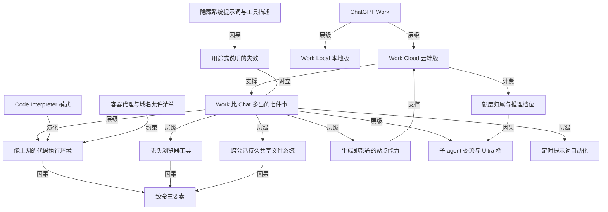

# 拆解 chatgpt work：一个名字下面其实是云端和本地两个产品

- 原文标题：Understanding ChatGPT Work
- 作者：Simon Willison
- 内参日期：2026-09-01
- 来源类型：blog
- 原文：https://simonwillison.net/2026/Aug/30/understanding-chatgpt-work/
- 标签：OpenAI, agents, 企业 AI

> 云端版跑在 chatgpt.com 上，带联网代码执行、无头 chrome、跨会话文件存储、cloudflare 部署和子 agent 任务分派；本地版更像换了皮的 codex。作者的判断是它「极其令人困惑，也极其强大」。

## 导读

拆解 chatgpt work

## 核心观点

- OpenAI 在 7 月 9 日发布 ChatGPT Work，此后一直在密集迭代。作者的总体判断是：这是一个「极其令人困惑但又非常强大」的产品（extraordinarily confusing and very powerful）。
- 困惑的第一层来自命名：**同一个「ChatGPT Work」名字下面其实是两个产品**——跑在云端的 Work Cloud，和跑在你自己电脑上的 Work Local。
- 困惑的第二层来自官方的解释方式：OpenAI 用「它适合做什么」来说明 Work，而不是「它实际上多了哪些能力」。作者认为正确的问题不是「什么时候该用 Chat、什么时候该用 Work」，而是 **Work 到底有哪些 Chat 没有的功能**。
- 经过大量实验，作者把差异收敛成一份能力清单：可选 Luna 与 Terra 模型、**能上网的代码执行环境**、一个完整的无头 Chrome 浏览器、跨会话持久共享的文件系统、发布 ChatGPT Sites 的能力、运行子 agent 会话的能力、定时提示词自动化。
- 能力越全，安全问题越尖锐：Work 把作者提出的「致命三要素」（lethal trifecta）——接触私有数据、暴露于不可信内容、存在把信息传出去的通道——**在一个产品里同时凑齐了**。
- 结尾的批评落在文档上：如果官方文档直接给出 Work 使用的系统提示词和工具描述，这篇拆解文章根本不需要存在。

## 一个名字下面其实是两个产品

- **Work Cloud（作者的命名）**：跑在云端，通过 `chatgpt.com` 或 ChatGPT 手机 app 访问。作者认为这是「更有意思的那个版本」，全文其余部分只谈它。
- **Work Local（作者的命名）**：安装 ChatGPT 桌面 app（也就是原来叫 Codex 的那个应用）后获得，能直接访问你电脑上的文件、直接在你的机器上运行程序。
- 作者对 Work Local 的判断很直白：它「更像是把常规 Codex 重新换了层皮，好让非软件开发者不那么望而生畏」（re-skinned to be less intimidating to non-software-developers）。
- ※ 这个区分是全文的第一个认知支点：两个版本的执行位置不同，因此信任模型和风险敞口也完全不同，但产品名字没有体现这一点。

## 门槛与官方说明：付费墙之外，是一句没用的定位


- **付费墙**：两种形态的 ChatGPT Work 目前都只对 20 美元/月及以上的订阅者开放；免费用户和 8 美元/月的 Go 用户没有访问权。
- **界面形态**：访问 Work 的入口是一个 tab 选择器，它把 Work 呈现为 Chat 的「另一种选择」，而不是某个藏在菜单里的功能。
- **官方的回答**：OpenAI 的官方文档说，想要答案、解释、头脑风暴或短草稿时用 Chat；想让 ChatGPT 完成一件有明确产出的任务时用 Work——比如一份简报、一套演示文稿、一次分析、一个周期性更新、一条工作流，或一个你可以审阅和使用的文件。
- **作者的反驳**：这个回答「几乎完全没用」，因为上面列举的每一类任务，他用普通的 ChatGPT Chat 已经做了好几年。
- **换一个问题**：与其问「什么时候用哪个」，不如问「Work 有哪些 Chat 没有的功能」。这一问把讨论从营销话术拉回到机制。

## Work 相对 Chat 多出来的七件事

- 可以用 Luna 和 Terra 替代 Sol。
- 一个**带互联网访问权限**的代码执行环境。
- 一个无头（headless）Chrome 浏览器。
- 一个在会话之间持久保留、并且共享的文件系统。
- 发布 ChatGPT Sites 的能力。
- 用 Sol、Luna、Terra 运行子 agent 会话的能力。
- 定时提示词自动化（scheduled prompt automations）。
- ※ 这份清单是全文的骨架：后面每一节都是对其中一项的展开。

## 模型选择与额度归属

- **Work 里的模型档位**：可以选 GPT-5.6 的 Sol、Luna 或 Terra，每个都有 Light、Medium、High、Extra High、Max、Ultra 六档推理强度；也可以选 GPT-5.5 的 Light、Medium、High、Extra High 四档。
- 作者判断，这些看起来就是通过 OpenAI API 提供的同一批模型。
- **Chat 里的模型档位不一样**：5.6 Instant、Medium、High、Extra High 和 Pro，而且不说明这些究竟是 Sol、Luna 还是 Terra（作者猜是 Sol）。**5.6 Pro 似乎是 Chat 独有的，Work 里没有对应项**。
- **Ultra 是什么**：根据作者用 Codex 的经验，Ultra 是一种「更积极地把任务委派给子 agent」的特殊模式。
- **额度线索**：作者相信 ChatGPT Work 的会话记在你的 Codex 额度上，而 ChatGPT Chat 的会话有自己独立的额度。这可能正是两边模型可选范围不同的原因。

## 能上网的代码执行环境：这是最大的跃迁

- 作者是 Code Interpreter 模式的长期拥趸——这个模式正是 OpenAI 在 2023 年开创的。对他来说，这是 Work Cloud 最令人兴奋的功能，没有之一。
- **关键变化**：代码执行环境现在可以和互联网的其余部分对话了。
- **Chat 做不到**：在 Chat 里让它安装额外的软件包，或者去访问网站和 API，都会被容器代理（container proxy）挡掉。
- **一个耐人寻味的插曲**：今年 1 月 Chat 曾经获得过安装软件包的能力，但现在似乎又不管用了。作者顺带抱怨了一句：真希望他们有更好的更新日志（I wish they had better changelogs!）。
- **横向对比 Claude**：Claude 的同类容器从去年 9 月上线起就允许受限的互联网访问，可以从 PYPI 和 NPM 装包、从 GitHub 克隆仓库，但也仅此而已——**域名允许清单非常短**。
- **Work 放开得多**：它可以被配置成只允许特定的域名清单，但**默认状态似乎是对所有域名开放**。
- **这带来的实际能力**：你可以让它克隆 GitHub 仓库、安装依赖，然后用这些代码去和互联网的其余部分交互。作者由此认为 Work 是一个「极其有用的工具」。

## 一个完整的无头 Chrome 浏览器

- Work 可以启动一个完整的 Chrome 实例：加载网站、填写表单、截图。
- 它甚至能对这些页面的 DOM 执行 JavaScript。作者的提示词是：在浏览器里加载 `simonwillison.net`，用 JavaScript 把标题都抽出来。
- Work 随即启动浏览器实例，运行了一段基于 Playwright 的求值代码，把页面里 h1 到 h6 的层级、文本和 id 抽成一个数组。
- 作者的类比很有分量：这感觉很像他自己写的 `shot-scraper` 的 JavaScript 功能，**只不过现在他能在手机上用它了**。

## 跨会话持久、并且共享的文件系统

- **Chat 的形态**：每个聊天会话拿到一个全新的文件系统，其他会话无法访问。
- **Work 的形态**：每个会话有自己的临时目录，名字形如 `/workspace/scratch/e00a0a017944`，但这些目录**跨会话持久保留**，因此你能访问之前对话留下的文件。作者说他现在的 `/workspace/scratch` 里已经有 171 个目录。
- **更进一步的共享**：据作者观察，`/workspace` 这个卷被挂载到所有**当前正在运行**的 Work 会话上——一个会话里的文件修改，另一个会话可以立刻看到。
- **共享的边界**：它们似乎不共享同一个进程空间，一个会话里跑起来的 [localhost](http://localhost/) 服务，另一个会话访问不到。

## ChatGPT Sites：从生成网页到直接部署网站

- Work 能构建**并且部署**完整的网站，底层用的是 Cloudflare Workers。
- 站点可以包含 HTML 和 JavaScript，也能运行服务端功能，包括基于 Cloudflare D1 和 R2 的有状态功能。
- **作者的示例**：他给出的提示词是「找出伦敦所有有 pelican in her piety 的地方，把它变成一个 JSON 文件，然后据此构建一个 ChatGPT sites 站点」，产物是一个可访问的站点。
- 作者顺带解释了这个题材：pelican in her piety 是一种引人入胜的中世纪基督教图像学母题——一旦你知道它，就会到处都看见它。
- **可见性默认值**：这些站点默认只对创建者私有，但你可以把它设为公开；在团队方案下还能分享给特定的个人。


## 子 agent 与定时提示词自动化

- **子 agent**：作者说这一条没什么可多讲的——ChatGPT Chat 不能跑子 agent，ChatGPT Work 可以。这是非常典型的 power-user 功能：当你在推进一个能从多个并行 agent 协作中获益的复杂项目时，Work 能做到。
- **定时自动化**：这是一个「某个时间点从常规 ChatGPT 迁移到 ChatGPT Work」的功能。你可以这样提示它：每天早上 8 点搜索一次，看 Waymo 有没有公布 Half Moon Bay 的启动日期。
- 这样的提示词会按给定频率调度运行。它们可以判断「没什么值得说的事情发生」，也可以判断需要就某个新信息通知你。

## 安全悬而未决：致命三要素凑齐了

- 作者把「这一切到底安不安全」列为自己当下的一个开放问题。
- **致命三要素模型**（lethal trifecta）警告的是：任何把「接触私有数据」「暴露于不可信内容」「存在把窃取到的信息传回攻击者的通道」三者结合起来的 agent 系统，都天然带有风险。
- **判断很干脆**：ChatGPT Work 把这三样全占了。
- 作者希望听到 OpenAI 更多地说明，他们如何保护 Work 会话不受提示词注入攻击；他预期答案和 Codex 一样，是同一套自动审查（auto-review）机制。

## 混乱的根源：讲用途不讲机制，且藏起系统提示词

- 作者的收尾判断：把这一切弄明白，花掉的功夫远远超出应有的程度。
- **问题一**：OpenAI 用「它是干什么用的」来解释 Work，而不是「它实际上做了什么」。
- **问题二**：OpenAI 仍然坚持隐藏自己的系统提示词和工具描述。
- **反事实**：如果 ChatGPT Work 的文档里包含了 agent 使用的确切系统提示词和工具描述，作者根本不需要写这篇文章。

## 概念网络

### 关键概念

#### Work Cloud 与 Work Local

**context**：作者为拆解命名混乱而自造的一对区分——「Let's call it Work Cloud」与「Let's call that one Work Local」。前者跑在云端、经网页或手机 app 访问；后者随桌面 app（原 Codex）安装，能访问本地文件、在本机运行程序。官方并未用两个名字，全文其余部分只谈 Work Cloud。

**费曼一下**：同一个商标贴在两台机器上。一台在别人的机房里，你把任务丢过去；另一台就在你桌上，直接翻你的硬盘。它们能干的事、能闯的祸完全不是一回事，但你在产品界面上看到的是同一个词。给它们各起一个名字，是理解这个产品的第一步。

#### 用途式说明与机制式说明

**context**：官方文档回答「何时用 Chat、何时用 Work」时给的是用途列表（brief、deck、analysis、recurring update、workflow、file）。作者认为这「几乎完全没用」，因为这些任务他用 Chat 做了多年；他把问题换成「Work 有哪些 Chat 没有的功能」，才得到可操作的答案。结尾把这一点上升为产品的两大问题之一：OpenAI 在讲 what it's for，而不是 what it actually does。

**费曼一下**：说明书有两种写法。一种写「这把刀适合切菜、片肉、削水果」，另一种写「刃长 20 厘米、单面开刃、可拆刀柄」。前者听起来贴心，但换成任何一把刀都成立；后者才让你判断得出它和你手里那把有什么不同。判断能力的差异，只能靠机制描述。

#### Code Interpreter 模式

**context**：作者自称是这个模式的长期拥趸，并指出它正是 OpenAI 在 2023 年开创的。文中把「代码执行环境能上网了」称为 Work Cloud 对他而言最激动人心的功能，其分量的参照系就是原始的 Code Interpreter。

**费曼一下**：让模型不要直接算答案，而是写一段程序、把程序跑起来、拿运行结果回答你。这样一来，算术、数据处理、文件转换这些事就从「靠语言模型猜」变成「靠计算机算」。它原本是一个断网的算盘，本节的转折在于这把算盘长出了对外的接口。

#### 容器代理封锁

**context**：解释 Chat 为何做不到联网执行代码时给出的机制——在 Chat 里要求安装额外软件包、或访问网站与 API，「会被容器代理挡掉」（blocked by the container proxy）。作者还记了一笔：今年 1 月 Chat 曾短暂获得装包能力，如今又不灵了。

**费曼一下**：沙盒外面站着一个门卫，程序想往外拨号，一律拦下。这不是模型不会，而是环境不让。理解这道门卫的位置，比记住「Chat 不能上网」这个结论有用得多——因为门卫的规则随时可以改，而且改了也不一定写进更新日志。

#### 域名允许清单

**context**：对比 Claude 与 Work 的容器网络策略时的核心变量。Claude 的容器自去年 9 月起允许受限访问，能从 PYPI、NPM 装包、从 GitHub 克隆，但「允许清单非常短」；Work 可以被配置成特定域名清单，**但默认似乎对所有域名开放**。

**费曼一下**：同样是「允许联网」，放行范围可以差出几个数量级。一份短名单意味着沙盒只能去几个固定的补给站；默认全开意味着它能去任何地方。功能描述上都写着「支持网络访问」，实际的能力边界和风险边界却完全不同。

#### 无头浏览器工具

**context**：Work 的另一个「杀手级功能」——启动完整 Chrome 实例，加载网站、填表、截图，并能对页面 DOM 执行 JavaScript。作者用一句提示词让它抽取某个站点的全部标题，Work 跑了一段基于 Playwright 的求值代码。他类比自己的 `shot-scraper`，并强调「现在能在手机上用了」。

**费曼一下**：给 agent 配一个没有屏幕的真浏览器。没有屏幕不代表功能缩水——它照样加载页面、执行页面里的脚本、按按钮、填表格，只是把最终结果交给程序而不是人眼。这让「读网页」从抓取文本升级成了操作界面。

#### 跨会话持久共享文件系统

**context**：Work 与 Chat 最结构性的差异之一。Chat 每个会话拿到全新文件系统且互不可见；Work 的每个会话有形如 `/workspace/scratch/e00a0a017944` 的目录，跨会话持久保留（作者已积累 171 个），且 `/workspace` 卷挂载到所有正在运行的会话，一个会话的文件改动另一个立刻可见——但进程空间不共享，[localhost](http://localhost/) 服务互不可达。

**费曼一下**：从「每次对话都换一间空房间」变成「所有对话共用一间仓库」。你昨天留下的东西今天还在，另一个会话现在放进去的东西你现在就能取。共享的是货架，不是工人——所以文件互通，但一个会话里起的服务，另一个会话仍然连不上。

#### 生成即部署

**context**：ChatGPT Sites 的关键动词是 build **and deploy**——底层用 Cloudflare Workers，站点可含 HTML 与 JavaScript，还能跑服务端功能，包括基于 D1 和 R2 的有状态功能。作者一句提示词就得到一个可访问的公开站点，默认私有、可改公开、团队方案下可定向分享。

**费曼一下**：过去模型给你一段网页代码，你还得自己找地方托管、配置域名、把它挂上去。现在这几步被吞进同一句提示词里：说出想要什么，回来时它已经在网上跑着了。中间那段「从代码到线上」的距离被抹掉了，这才是这个功能真正改变的东西。

#### 子 agent 委派

**context**：Chat 不能跑子 agent，Work 可以，作者称之为典型的 power-user 功能，适用于「能从多个并行 agent 协作中获益的复杂项目」。它与模型档位相互呼应：Ultra 被理解为「更积极地把任务委派给子 agent」的特殊模式。

**费曼一下**：一个 agent 自己拆活儿、自己找几个分身同时干，最后汇总。对简单问题这是浪费，对复杂项目这是唯一能在合理时间内做完的方式。所谓 Ultra 档，本质不是「更聪明」，而是「更愿意叫人手」。

#### 推理档位

**context**：Work 提供 GPT-5.6 的 Sol、Luna、Terra，每个带 Light 到 Ultra 六档；GPT-5.5 带四档。Chat 侧则是另一套命名（Instant、Medium、High、Extra High、Pro），且不说明底层是哪个模型，其中 5.6 Pro 为 Chat 独有。

**费曼一下**：同一个模型可以调节「思考多久」。档位越高，它花的时间、算力和钱越多，答案也（通常）越可靠。麻烦在于两个界面用了两套档位名字，还不说明底下是不是同一个模型——用户被迫靠猜来做选择。

#### 额度归属

**context**：作者的推断——Work 会话记在 Codex 额度上，Chat 会话有自己独立的额度，并认为这「可能解释了两边模型可选范围的差异」。

**费曼一下**：同一个订阅下面挂着两个不同的钱包。你在哪个界面里干活，扣的就是哪个钱包。这不是计费细节，而是解释「为什么这边有 Pro、那边没有」的线索：能力的分配跟着账本走。

#### 定时提示词自动化

**context**：一个「某个时间点从常规 ChatGPT 迁移到 Work」的功能。示例是让它每天早上 8 点搜索一次 Waymo 是否公布了 Half Moon Bay 的启动日期；这类定时提示词可以判断没有值得报告的事，也可以决定通知你。

**费曼一下**：把一次提问变成一个长期站岗的哨兵。它按时去看一眼，多数时候什么都不说，有事才叫你。价值不在「能定时」，而在「有权判断沉默」——否则你收到的只是每天一封没有信息量的邮件。

#### 致命三要素

**context**：作者自己提出的风险模型（lethal trifecta），警告任何同时结合「接触私有数据」「暴露于不可信内容」「存在把窃取信息传回攻击者的通道」的 agent 系统。文中的判断是：ChatGPT Work 把这三样全占了。

**费曼一下**：单独看，每一项都平平无奇：能读你的文件、能上网看东西、能把结果发出去。危险在于三者同时具备——网上一段藏着指令的文字，就可能骗它读走你的私密数据再顺手送出去。判断一个 agent 危不危险，看的不是它有多聪明，而是这三样凑齐了几样。

#### 自动审查机制

**context**：作者对「Work 如何防御提示词注入」的开放提问，以及他的预期答案——大概和 Codex 用的是同一套 auto-review 机制。这是全文唯一提到的防线，且作者是在缺乏官方说明的情况下推测的。

**费曼一下**：在 agent 真正动手之前，让另一道流程先审一遍它打算做什么。它是当前应对提示词注入的主流做法之一。但注意文中的姿态：作者只能推测这道防线存在，而不能引用任何说明——防线本身也处在信息缺口里。

#### 隐藏系统提示词与工具描述

**context**：作者归结的两大问题之一——OpenAI 仍然坚持隐藏系统提示词和工具描述。反事实非常直接：如果文档里给出这两样，这篇拆解文章根本不必写。

**费曼一下**：系统提示词和工具描述，就是这个 agent 的说明书原件——它被告知自己是谁、手上有哪些工具、每个工具能干什么。把原件藏起来，外部就只能靠反复试探来还原它。作者花掉的那些功夫，本质上是在替厂商写一份本该随产品附上的文档。

### 概念网络



全文的思想网络有一个总起点和两条走向。总起点是**「ChatGPT Work」这个名字承载了两个东西**：Work Cloud 与 Work Local 是同一层级下的并列分支，二者的差别不是功能多寡，而是执行位置——一个在云端机房，一个在你自己的硬盘上。作者用「Let's call it」这种私自命名的手法把它们劈开，本身就说明官方的名称体系已经无法承载这个区分。全文随后只沿着 Work Cloud 这一支往下走，Work Local 被显式挂起。

第一条走向是**能力的展开**。「Work 比 Chat 多出的七件事」是全文真正的枢纽节点：它既是作者用实验换来的答案，也是他对官方定位的反制——「用途式说明的失效」与这份能力清单构成一对张力关系，前者说「Work 用来做有明确产出的任务」，后者说「Work 多了持久文件系统、无头浏览器、子 agent 和定时任务」。同一个问题的两种回答，一种无法据以判断，一种可以，作者选择后者。这份清单向下分叉出六个具体能力节点，每一个都是「Chat 缺失、Work 具备」的差集条目。

在这些能力里，**能上网的代码执行环境是承重最大的那一个**，它同时被三条线牵着：Code Interpreter 模式是它的演化前身，从 2023 年那个断网算盘长出对外接口；容器代理与域名允许清单是它的约束条件，Chat 被这道门卫挡在网内，Claude 的容器只放行一份很短的名单，而 Work 的默认状态是全开——因此同样叫「支持联网」，实际边界差出几个量级。这条线解释了为什么作者把它排在所有新功能之上：模型档位的更新是量变，沙盒破网是质变。

第二条走向是**风险的收敛**。能上网的代码执行环境、无头浏览器、跨会话共享文件系统三者各自都是生产力增益，但它们汇入同一个节点——致命三要素。共享文件系统提供了私有数据的接触面，浏览器和联网沙盒提供了不可信内容的入口，而任意一条对外通道都足以完成外传。三条能力线在此合流，正是作者说「ChatGPT Work 把这三样全占了」的结构含义：风险不是某个功能带来的，而是能力组合的涌现属性。与之相对，全文唯一的防线节点（作者推测的自动审查机制）连推测都建立在与 Codex 的类比之上，没有任何官方说明支撑。

最后一层是**元问题的闭环**。「隐藏系统提示词与工具描述」并不是一个功能节点，却因果性地生成了「用途式说明的失效」——正因为机制描述被藏起来，对外可说的就只剩用途。而计费侧的「额度归属与推理档位」是一条隐性因果线：Work 记在 Codex 额度上、Chat 有独立额度，这解释了两边模型可选范围的差异，也与子 agent 委派相通——Ultra 之所以是「更积极地委派」，落到账上就是更能花额度。整张网络因此不是一份功能罗列，而是一个判断：**当一个产品的能力靠反向试探才能画出边界，它的风险边界同样处在黑箱里**。

## 费曼 x3

产品命名的混乱，往往不是营销失手，而是能力边界没想清楚的外化。一个叫 ChatGPT Work 的东西，在网页和手机上是一套云端 agent，在桌面应用里是另一套能碰你本地文件的程序——同一个名字，两种信任模型，两种风险敞口。用户被要求自己去分辨，而分辨所需的依据从来没有被写出来。要谈论它，第一步竟然是自己给它起两个名字。

真正的转折藏在一句技术细节里：代码执行环境能上网了。三年前那个 Code Interpreter 之所以让人放心，恰恰因为它是一个断网的沙盒——它能算，但既拿不到也送不出任何东西。当这个沙盒可以克隆仓库、安装依赖、调用 API、启动一个完整浏览器去填表和截图，它就不再是计算器，而是一个有手有脚的执行体。别家的同类容器只放行一份很短的域名清单，而这里的默认状态是全开——同样写着「支持网络访问」，边界能差出几个量级。这一步的分量，比任何新的模型档位都重。

于是那三样东西在同一个产品里凑齐了：能接触私有数据、会读到不可信内容、有把信息送出去的通道。缺任何一样，风险都还算可控；三者同时在场，提示词注入就从理论问题变成待发生的事。这不是对某一家公司的指控，而是所有 agent 系统绕不开的结构性约束——危险不来自某个功能，而来自能力的组合。

最朴素也最难堪的问题留在最后：为什么弄懂它要花掉这么大的力气。官方解释的是「它适合做什么」——写简报、做分析、出周期性更新——可这些事人们用普通对话已经做了好几年。真正区分两者的是机制：多出来的是持久文件系统、无头浏览器、子 agent、定时任务。用途可以用来营销，只有机制能用来判断。把系统提示词和工具描述藏起来，外部就只能靠反复试探还原一份本该随产品附上的说明书——这篇拆解之所以必须存在，本身就是那个缺口的证据。

## 阅读原文

### Understanding ChatGPT Work

OpenAI [announced ChatGPT Work](https://openai.com/index/chatgpt-for-your-most-ambitious-work/) on July 9th, and have been furiously iterating on it ever since. It is an extraordinarily confusing and very powerful product. Here’s what I’ve figured out about it so far.

#### ChatGPT Work is actually two products #

The more interesting version of ChatGPT Work is the one that runs in the cloud. This can be accessed via [chatgpt.com](https://www.chatgpt.com/) or through the ChatGPT mobile apps. Let’s call it **Work Cloud**.

If you install the ChatGPT desktop app—the app that used to be called Codex—you gain access to a thing called ChatGPT Work that can access files and run programs directly on your computer. Let’s call that one **Work Local**. This one feels more like regular Codex re-skinned to be less intimidating to non-software-developers.

For the rest of this article I’m going to talk exclusively about Work Cloud.

#### Work is for paid subscribers only #

Right now, ChatGPT Work (in both flavors) is available only to $20/month and up subscribers. Free users and $8/month Go users do not have access.

#### Work has features that aren’t available in Chat #

The interface for accessing Work is a tab selector, which presents it as an alternative to Chat:


The obvious question is _when should I use Chat, and when should I use Work?_

OpenAI’s [official answer](https://learn.chatgpt.com/docs/get-started-with-work) to that question is:

> Use Chat when you want an answer, explanation, brainstorm, or short draft. Use ChatGPT Work when you want ChatGPT to complete a task with a clear outcome, such as a brief, deck, analysis, recurring update, workflow, or file you can review and use.

I find that almost entirely useless, because I’ve been using regular ChatGPT Chat for all of those task categories for years!

The better question then is _what features does Work have that are missing from Chat?_

After extensive experimentation I think I’ve mostly figured that out:

- Options to use Luna and Terra in place of Sol
- A code execution environment with Internet access
- A headless Chrome browser
- A persistent filesystem shared between sessions
- The ability to publish ChatGPT Sites
- The ability to run sub-agent sessions with Sol, Luna, and Terra
- Scheduled prompt automations

#### Model selection #

In Work, you get the option to pick GPT-5.6 Sol, Luna, or Terra, each with Light, Medium, High, Extra High, Max, or Ultra reasoning levels. You can also pick GPT-5.5 at Light, Medium, High, or Extra High.

These look to be the same models that are available through the OpenAI API.

Chat offers a different selection: 5.6 Instant, Medium, High, Extra High, and Pro. It doesn’t explain if those are Luna or Terra or Sol (I’m assuming Sol?). 5.6 Pro appears to be exclusive to Chat, with no equivalent in Work.

My current understanding from using Codex is that Ultra is a special mode that more eagerly delegates to sub-agents.

I believe ChatGPT Work sessions are billed against your Codex allowance, while ChatGPT Chat Sessions get their own, separate allowance. This may help explain the model availability differences.

#### Code execution with Internet access! #

As a long-time fan of the [Code Interpreter pattern](https://simonwillison.net/tags/code-interpreter/)—pioneered by OpenAI in 2023—this is by far the most exciting feature of ChatGPT Work (Cloud) for me.

The code execution environment can now talk to the rest of the internet!

ChatGPT Chat can’t do this—if you ask it to install additional software packages or interact with websites or APIs that access will be blocked by the container proxy.

(Weirdly, back in January it [grew the ability to install packages](https://simonwillison.net/2026/Jan/26/chatgpt-containers/), but that doesn’t seem to work any more. I wish they had better changelogs!)

Claude’s equivalent container has allowed restricted internet access since it launched [last September](https://simonwillison.net/2025/Sep/9/claude-code-interpreter/). Claude can install packages from PYPI and NPM and clone repositories from GitHub. But that is about it: the allowlist of domains is very short.

ChatGPT Work allows a whole lot more than that. It can be configured with a specific list of allowed domains, but the default appears to be open to all.

This makes Work an incredibly useful tool. You can have it clone GitHub repositories, install their dependencies, then use them to interact with the rest of the web!

#### A full, headless Chrome browser #

Another killer feature of ChatGPT Work is the browser tool. ChatGPT Work can launch a full Chrome instance, load websites, fill out forms, and take screenshots.

It can even run JavaScript against the DOM of those pages. I prompted:

> Load [simonwillison.net](http://simonwillison.net/) in your browser and extract the headings using JavaScript

ChatGPT Work fire up a browser instance and ran the code:

```javascript
await tab.playwright.evaluate(() => {
return Array.from(document.querySelectorAll("h1,h2,h3,h4,h5,h6"), heading => ({
level: heading.tagName.toLowerCase(),
text: heading.innerText.trim().replace(/\s+/g, " "),
id: heading.id || null
}));
});
```

This feels a lot like my [shot-scraper javascript](https://shot-scraper.datasette.io/en/stable/javascript.html) tool, only now I can access it on my phone!

#### A persistent, shared filesystem #

ChatGPT Chat gets a fresh filesystem for each chat session. These cannot be accessed from any other session.

In ChatGPT Work each session gets its own scratch folder—named something like `/workspace/scratch/e00a0a017944`—but each of those are persisted across sessions, so you can access files from previous chats. I have 171 folders in `/workspace/scratch` right now!

As far as I can tell that `/workspace` volume is mounted to all Work sessions that are currently running—file edits from one can be instantly seen by the others. They don’t seem to share the same process space though, and [localhost](http://localhost/) servers running in one can’t be accessed from another.

#### ChatGPT Sites #

ChatGPT Work has the ability to build _and deploy_ entire websites, using Cloudflare Workers. These can have HTML and JavaScript and can run server-side features too, including stateful features on top of Cloudflare D1 and R2.

Here’s a simple site I built with this feature:

[london-pelicans-in-her-piety.simonw.chatgpt.site](https://london-pelicans-in-her-piety.simonw.chatgpt.site/)

![Screenshot of a website homepage on a cream background. Top navigation bar: a circular logo reading "P/P" on the left, the links "THE CENSUS", "COLLECTIONS" and "METHOD" in the center, and "JSON ↓" on the right. The left half is a hero section with small red capitals reading "AN ICONOGRAPHIC CENSUS · GREATER LONDON" above a large serif heading "Pelicans in her piety", with "piety" set in red italics. Below it: "Across London, an impossible bird bleeds for her young—in limewood, marble, mosaic, metal and glass. This is an evidence-backed census of where to find her." Two buttons follow: a solid black "EXPLORE ALL 28" and an outlined "DOWNLOAD THE DATA". The right half is a photograph of an ornate dark carved wooden reredos in a church, with gilded urns and a crest on top, Corinthian columns, a gilded pelican with outspread wings at its center above inscribed panels, an altar with a brass cross and red flowers, embroidered banners on either side, and a black-and-white checkerboard floor with red carpet. Vertical text along the photo's right edge reads "ST MARY ABCHURCH" and a caption at its bottom reads "Grinling Gibbons's reredos, St Mary Abchurch. Photograph: Diliff, CC BY-SA 3.0, via SPAB ↗". A statistics strip along the bottom shows "28 FIXED SITES", "4 COLLECTIONS", "3 OPEN LEADS" and "2 KNOWN LOSSES".](https://neican-res.candobear.com/article-images/2f08f0ca42c8a6f16866253440b5e45aa72cf68d648891c9b08e190e9bb28448.webp)

My prompt was:

> Figure out all of the places in London with a pelican in her piety, then turn that into a JSON file and build a ChatGPT sites site about them

(A pelican in her piety is a fascinating piece of [medieval Christian imagery](https://devonchurchland.co.uk/blog/pelican-in-her-piety/#What-is-a-Pelican-In-Her-Piety)—once you know about them you’ll find them all over the place.)

These sites default to being private to the user that created them, but you can make them public and (on team plans) share them with other specific individuals.

#### Sub-agents with Sol, Luna, and Terra #

There’s not much to say about this one. ChatGPT Chat can’t run sub-agents. ChatGPT Work can. This is very much a power-user feature: if you are running a complex project that can benefit from multiple parallel agents working together, Work can do that.

#### Scheduled prompt automations #

Another feature that seems to have migrated from regular ChatGPT to ChatGPT Work at some point. You can prompt ChatGPT Work like this:

> run a search to see if Waymo have announced a launch date for Half Moon Bay every day at 8am

This will schedule a prompt to run on that frequency. These prompts can decide that nothing interesting has happened, or they can decide to notify you of some new information.

#### Is this safe? #

An open question for me right now is how _safe_ all of this stuff is.

My [lethal trifecta model](https://simonwillison.net/2025/Jun/16/the-lethal-trifecta/) warns about the risks inherent in any agent system that combines access to private data with exposure to untrusted content and a way to communicate stolen information back to an attacker.

ChatGPT Work combines all three!

I’d love to hear more from OpenAI about how they protect ChatGPT Work sessions against prompt injection attacks. I expect their answer is the same [auto-review mechanism](https://learn.chatgpt.com/docs/sandboxing/auto-review) as Codex.

#### OpenAI could make this a lot less confusing #

Figuring this all out took way more work than it should have.

I think there are two key problems here:

- OpenAI explain Work in terms of what it’s for, not what it actually does
- OpenAI still insist on hiding their system prompts and tools descriptions
If the ChatGPT Work documentation included the exact system prompt and tool descriptions used by the agent I wouldn’t have needed to write this post.
