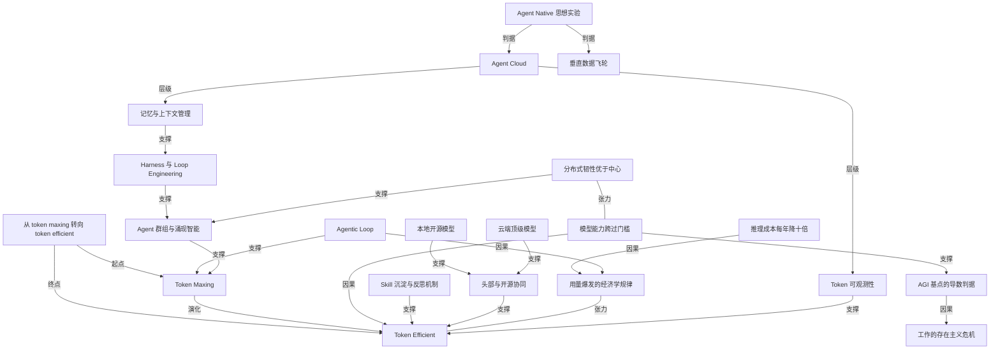

# 从 token maxing 转向 token efficient 的那个拐点

- 原文标题：E249｜Token经济转点：OpenClaw、Hermes到本地自研的Agent进化之路 | 硅谷101
- 作者：硅谷101
- 内参日期：2026-09-02
- 来源类型：blog
- 原文：https://app.podwise.ai/dashboard/episodes/8712002
- 标签：推理成本, agentic engineering

> 重心从「堆最强模型」挪到工程效率与成本控制：多 agent 协作叠上本地模型（deepseek、glm）分担算力，内存管理、可观测性和沙箱成了 agent native 公司的基建。73 分钟。

## 导读

podcast。token-maxxing → token-efficient

## 核心观点

- 2026 年 AI 行业的重心，从「讨论模型能力」转向「讨论 Agent 的工程问题」，即从关注科研到关注工程的转向。这一转向的外在表现，就是硅谷用 AI 的策略从 Token Maxing（无脑最大化消耗 Token、永远用最强模型）走向 Token Efficient（用工程手段把成本压回可控区间）。
- 但「省 Token」不是主线，主线是**工程化**。Token Maxing 是一个结果、一个 Lagging Indicator，不是目的；它在模型能力不可评估的阶段是理性最优解，在模型跨过门槛之后就变成了可以被工程替代的粗放手段。
- 转折的三个触发事件：GPT 5.5 级别模型的绝对智商碾压（让"多 Agent 讨论半天讨论不出来"的问题一次解决）、DeepSeek V4 让开源模型进入"可信任"状态、GLM 5.2 把开源模型的认知又推前一大步——于是「顶级闭源模型 + 本地开源模型」的协同成为更经济的方式。
- 一个反直觉的结论：单点上省 Token，总量上 Token 消耗仍会持续暴涨。因为 agentic loop 的 pattern 决定了 Agent 比 chatbot 时代的消耗高 100 倍不止，而 agent-to-agent 网络与 agent harness 的软件工程一旦出现，消耗还会再上一个台阶。张宏江把它归到经济学规律：技术越成熟价格越低，但消耗量增长远超成本下降，市场因此变得越来越大。
- 泡沫论被两位嘉宾同时否掉：AI 基建绝对数超过当年铁路公路，但占 GDP 比例仍更小；Token 价格过去几年每年降 10 倍，远超摩尔定律。企业今天的"不知所措"不是投资过剩，是还没摸索出把 AI 精准嵌入哪个业务环节。
- 判断一家公司是不是 Agent Native，只需一个思想实验：把 AI 或 Agent 的元素去掉，这件事还成不成立？成立就不是。第二看创始人的 mindset 是不是 Agent First，以及愿不愿意把决策权真的交给 Agent。
- 张宏江认为 AGI 的基点已经到来，判据是**导数**而非存量：机器学习能力（知识与能力的增加速率）超过了人的学习能力，「你赶不上它了」。

## 泡沫之问：基建远远不够，而不是过剩

- 张宏江的判断从 2024 年底就没变过：没有泡沫。当时市场怀疑 Scaling Law 撞墙、怀疑 overinvest，今天回看远远没到。
- 三条论据：
- 这是一场 fundamental 的革命，可类比互联网最大的基建、可类比美国快速发展期的铁路网和公路网。绝对数今天毫无疑问超过它们，但**占 GDP 的比例其实比那些都小**。
  - Token 看起来很贵，但消耗量增长非常快，而 Token 价格过去几年一直以每年降 10 倍的速度在走——无论来自英伟达芯片进展还是其他方面。
  - 股票市场是否有泡沫是另一回事；技术的发展、应用的发展不存在泡沫。
- 黄东旭补充了两个层次：
- 宏观类比：今天看 AI 基建，就像上世纪五六十年代看刚诞生的计算机——一个房间的电子管好大好贵，但那时还没有个人计算机呢。很多需求是有了充分基建之后才会诞生，新需求又刺激更多基建。
  - 微观工程：今天在模型推理、agent 框架、token 高效使用上还有大量优化空间，只是市场预期让大家先发散、先把地上的果实摘回来，再考虑优化。所以短期可能有小回落，长期仍有大量需求没被看见。
- 企业侧的摇摆是自然过程：一开始放开让大家试，突然发现 token 量超出想象，然后开始往回收——因为 AI 能力提升太快，先用在哪个环节、先提高哪方面效率仍在探索。

## Token Maxing 的正当性与它的变质

- 时间坐标：录制于 2026 年 7 月 4 日，正处在市场转折点上。此前约 8 个月是 Token Maxing 时代——Jensen Huang 在 GTC 上要求每个工程师都要烧很多 Token 账单，Meta 搞 Token 排行榜看谁烧得多。
- 转折的信号：Uber 给员工发的 token 额度因成本被收回，四个月烧穿全年预算；Stripe 内部模型页面会弹提醒"Opus 4.8 很贵，用的时候省一下成本，先用其他模型"。
- 黄东旭的亲历：从 2025 年 11 月起用 Opus 从零到一构建云原生分布式数据库 DB9（12 月到次年 3 月），这是他能想到的最复杂的系统软件。
- 账单：一天四五百美金，还是在已经买了 Claude Code Pro Max 订阅、超出 daily/weekly limit 后自掏 extra usage 的前提下。
  - ROI：公司销售早就在等这个软件，做到七八十分一年就能多一千万美金直接收入。「只是以前我受限于人力技术的水平，我做不出来。但今天我一个人三个月我就做出来了。」
- **为什么当时 Token Maxing 是对的**：在最复杂的任务上，你没有办法精确评估最强模型与第二强模型的差别；对模型能力的评估基本只能看 benchmark，而 benchmark 很多时候是能刷的。当你在做一件不确定但你知道非常难的事情时，最好的策略永远是选最好的模型。
- **它是怎么变质的**：Token Maxing 被社区误解了。它是一个结果、一个 Lagging Indicator——经过思考地 Token Maxing 才能产出好结果。但疯狂地用有两种：
- 一种是你知道自己在干什么，很好地设计，然后疯狂地用；
  - 另一种是你不知道自己在干什么，只是公司有个排行榜，必须刷到 number one，于是出现大量无效调用。
- 黄东旭说，在大公司里只要领导提出要追一个榜单，一定会有人去刷这个榜——这是他第一秒钟就想到会出现的问题。

## Agent 产品的进化史：OpenClaw → Hermes → Slock

- **OpenClaw 为什么火**（Peter 一周 hack 出来）：
- 开源天生更具传播力，尤其在极客和工程师的小圈子里逐层扩圈，这帮人对商业/闭源/平台软件多少有抵触心理，「有点像当年 Linux 的这种感觉」。
  - Local First 的理念：正因为 Peter 愿意把个人几乎所有信息交给 AI、给出极广的权限，所以他才认为把数据配置在本地极其重要。
  - 最根本的是它捅破了一层窗户纸。张宏江的解读：Peter 花一个礼拜做出 OpenClaw，最大意义在于**宣布了大模型的能力过了一个坎**——推理和编程能力强到一个架构师级别的工程师就能短时间做出一个系统。这标志着从研究进入工厂、从模型进入 Agent，而且你未必再需要那么深入地懂大模型本身的机理。
  - 时间点上也踩准了：大家用 Chatbot 用了三年多，只能交流不能做事；从 Claude Code 看到可以开始做事；OpenClaw 让大家意识到 PC 上、手机上的日常，Agent 基本上都能做。
- **OpenClaw 的不足**：
- 代码质量与稳定性：Peter 自己可能都没看过代码，「更像一个大集市」，谁有想法直接合，Agent 说没问题就行。给极客用没问题，广大用户用就出各种配置难度与稳定性问题。
  - 由此得到的启发：当软件复杂性超过一个临界点，好的软件工程习惯和经验、非常 senior 的研发团队仍然非常必要——不是"闭着眼睛就能 vibe coding"。
  - 记忆问题：不做记忆存储就会不停回滚，既特别消耗 Token，也带来记忆混乱。
  - 起得太早、更像实验性项目，创始人已去 OpenAI，靠基金会运转，持续资源投入成问题。黄东旭判断它「有点像扮演一个普罗米修斯的角色」，把这样的产品形态和能力让世人知道了，历史使命就完成了。
- **Hermes 的巧妙之处**：它没有把记忆模块做得多出彩，而是**绕开了记忆问题**——框架里有很强的倾向去不停总结成功经验、沉淀成 skill。OpenClaw 的 agent loop 里缺少反思过程，除非你主动要求；Hermes 引入了类似机制，用着用着就长出很多你自己做过的最佳实践。所谓"第一个自我改进的 Agent"是 marketing 词，本质是模型能力加工程化手段把成功经验变成可复用的 skill。此外它是团队精心打磨的架构，onboarding 与稳定性都优于 OpenClaw。
- **Hermes 的商业模式本质是 Token 经济学**：有足够用户量就能帮模型厂商带 Token 消耗，跟厂商谈渠道拿更低折扣。做 Agent 本身已经是工程问题、谁都能做，但**入口会变成兵家必争之地**。往下推演甚至可能变成唯一的应用——「今天小龙虾出来以后，我再也没打开过我的 Gmail」。
- **Agent 作为信息入口对媒体的冲击**：越来越多人依赖 Agent 消化邮件组、Hacker News 这类信息，先扫总结、感兴趣再点进原文。个人 Agent 拥有你所有的 footprint（记忆、浏览记录、偏好），社区里"养龙虾"这个词很传神——不停迭代让它更理解你。这颠覆的是传统推荐系统：推荐算法只能基于大数据与社会 trend，而终极推荐算法是在你本地、坐在你旁边、观察你数字世界甚至物理世界所有 event 的那个智能。
- 泓君的反例值得记下：她最终没有继续用 OpenClaw 精选新闻，核心原因是「它给我的东西太浅了」，她仍要看一手新闻，愿意读更少但更深度的文章。
  - 决策类邮件的边界：需要决策的事情不会交给 Agent 全权处理，「我在用我的 agent 当一个 filter」。
- **Slock（现改名 Raft）与 Agent 群组**：把 Slack 的形态平移到 Agent 上——一个聊天室，里面聊天的都是 Agent，它们**互相不 share 自己的 context，唯一共享的是 channel 里的信息**。
- 典型用法是复杂软件项目的代码审查：放十个 Agent（有 Claude Code、有 Codex，都是顶级模型）一起挑刺，A 看出三个问题，B 认同并发现新的，A 再顺着新角度继续看，持续迭代。
  - 结果：挑出的问题和改进深度与单个模型 one-shot review 完全不一样。代价是 Token 消耗量可能是普通的 10 倍——峰值一天约 1 Billion Token，账单三四百美金。
  - 为什么有效：Agent 没有 ego。当某个 Agent 提出大家没看到的想法时，其他 Agent 马上会承认有道理，这条信息再次触发新一轮讨论。虽然可能百分之八九十的时候都在说车轱辘话。
  - 停止条件不是拍脑袋：「当你们谁都挑不出更多的毛病的时候，你就停下吧。」
- **Agent 动力学**：让 Agent 持续长时间运行是件难事，今天不管 Harness 还是 loop engineering，优化的其实是同一件事——怎么让 Agent 在特定任务上持续不停地干活。
- Slock 的解法是让大家七嘴八舌讨论着干活；
  - Loop Engineering 是每次它要停下来时强行抽自己一鞭子再回头 review；
  - Harness 是把多个工作流搞得越来越复杂。
- 为什么需要"时间长"：模型今天很聪明，但 one-shot 仍会有 hallucination、在小点上考虑不周；再进入一次迭代就能看到以前看不到的东西。「就比如说小时候我们做作业，做完作业了以后，父母总是说，你再重新算一遍」。

## 本地模型与云端模型的协同：Token Efficient 的工程实现

- 三个改变认知的事件：GPT 5.5、DeepSeek V4 发布，以及最近的 Fable 5。
- **Fable 5 类事件的意义**：多 Agent 讨论的前提是你不相信任何单个 Agent 在 one-shot 上的成功率，所以要三个臭皮匠兜底。但 Fable 5 强到"这些人讨论了半天讨论不出来的东西，在它的绝对智商面前一次就解决了"——而且还没有之前的上下文。
  - 但这是 yes and no：在单点复杂问题上，再充分的 Harness 也有搞不定的事，这时确实能期待更强的模型；这并不否定群组协作在其他场景的价值。
  - **DeepSeek V4 的意义**：黄东旭原本不信任开源模型做复杂软件开发，V4 开始发现质量已经非常高；GLM 5.2 又把这个认知往前推了一大步。
- 由此得到的组织学类比：「就很像一个企业真正出现管理学了……你不可能说一个公司里边，整个公司全都是像宏江老师这样的非常资深的专家。你仍然还需要很多像我这样能写代码的工程师一起去协同。」头部模型与开源模型的配合是更经济的方式。
- **本地跑什么**：DeepSeek V4 Flash 跑在一台 Mac Studio 上，大概 30 Token 每秒，已经跟在网上用 API 的 chatbot 速度差不多。成本只有电费和折旧，一天约一美元、一个月二三十美元，还是满载情况。
- **本地解锁了以前不敢干的事**（这是比省钱更重要的部分）：
- 大量重复性日常工作，比如个人文章记忆与数字日志的整理。
  - 论文批量总结：让它把今年 CVPR、NeurIPS 的所有论文先总结一遍，有意思的再汇报。「像这种一期可能有几百篇论文这样的规模的时候，你不可能用这个 API 或者付费的去干的，干不了，太贵了。」
  - 关键是心态而非付不起：「并不是我掏不起这几百刀，而是会想着这个东西不是我控制。」
- **拨号上网的比喻**：97 年拨号上网按分钟花电话费，大家都省着上；一直到免费宽带、到手机大容量套餐，才催生出抖音、视频会议这些新应用。「所以我觉得模型或者智能这件事情，免费跟很低的费用，它仍然是有个天壤之别。」
- **账单结果**：随着项目过了疯狂堆代码的阶段，月账单降到两三百美金——大致就是一个顶配 Claude 订阅加一个顶配 Codex 订阅的钱，主力模型也从 Opus 转向 GPT 5.5/5.6 与 Codex。
- **升级路径的分工**：最复杂的任务（数据库疑难杂症、要改七八个模块同时提交五六千行代码）仍交给最强模型。他的标准流程是：Slock 里的 Agent 开会解不了的问题，让它们停下写一份"为什么解不了"的报告，再把报告转给最强模型。
- 一个值得注意的工作方式变化：「做这些事情的时候，我都完全不关注底下的代码……我其实就关注一些很有限的事情：目标验收以及这个事情的架构应该怎么做。」中间过程是不停调动不同 Agent 的能力让它们更好协同——「我觉得后来会变成这种 agent 的管理学」。
- 关于"终局"的自我修正：「我过去这一年学到最大的事情就是千万别随便说什么叫终局。第二呢，永远相信 Scaling Law，永远相信智能。」他认为人类尚未到达无法评估模型好坏的那个点，但那一天看得见。

## 为什么省了 Token，总消耗还会继续涨

- **Agent 为什么这么费 Token**：不要神化 Agent，工程原理挺简单——每个 Agent 内部有一个像发动机的东西叫 agentic loop，每一次循环都调用大模型去问问题或对话。
- 特点一：在对话里调用外部工具，把工具输出变成对话流中的上下文。
  - 特点二：在复杂或长程任务下，循环可能运行几百步，每步又有很多工具调用，输入输出又都变成上下文。
  - 这个 pattern 导致 Agent 的 Token 消耗比 chatbot 时代涨了 100 倍都不止。
- **还会再上一个台阶**：今天的 Agent 应用和我们想让 Agent 解决的问题还太简单了。类比计算机史——早期在家酿俱乐部里分享的是 200 行 BASIC 程序、几千行汇编；今天一个 Photoshop 就是数千万行代码。当 Agent 要解决更复杂的问题，必然出现 agent-to-agent 的 network 和 agent-harness 的软件工程，那时对 Token 的消耗又会上一个台阶。多 Agent 协同会变成更大的网络，网络之上又有一个更抽象的 loop——这种 hierarchy 结构现在已经在出现。
- **经济学层面**：张宏江把这个现象归为一条规律——技术越成熟价格越低，但消耗量本身会变得越来越大，所以市场变得越来越大。* 转写稿把这条规律的名字写成了 Jobless Law。
- **反向力量也存在**：越来越高的智能使得 Agent 本身可能不需要持续去问大模型，对话频率可能降下来，所以消耗量未必单调线性增长。未来一定是一些超级强的 Agent 和超级大的蜂群做事，蜂群里每个 Agent 也许特别擅长某类任务，背后模型比较专用、比较小、Token 价格比较低；也可能都由一两个非常 powerful 的大模型驱动——这还需要不断 evolve。
- **推理成本为什么一定会降**：张宏江说这个结论不需要走进 GPU 降价还是存储芯片降价的细节。所有技术开始成熟时都会造成成本的大规模降低，而使用量增长会远远超过成本的降低。Token 成本过去三四年每年降 10 倍，远超摩尔定律；推理能力 double 的周期从每七个月缩到每三四个月。「当技术的坎跨过了一个门槛以后，你下面就会聚焦在怎么把成本降下来。」——有时是你着意去降，有时是技术本身 take care of it。
- **蜂群与超级模型不是零和**：超级模型自己在不断往上 scale，但没有任何东西可以阻拦蜂群里的每一个 Agent 也利用这种智能。模型智能提升，蜂群智能同步提升。把最强模型放进讨论组，「他可能第一句话这些人马上就开窍了」，涌现出 insight 的概率更高。
- **分布式的信念**：「我不太相信说有一个绝对的中心，这种其实就太危险了。真正的一个 resilience 的系统，它一定是一个大规模的基于简单规则连接的分布式系统。」张宏江用云的历史印证：AWS 设计云时每个节点并不用最好的 enterprise grade 服务器，整体可靠性靠分布式实现，成本反而低于每个节点都买最贵最可靠的方案——「最终你发现他其实不是一个技术的判断，最后是一个经济学的判断」。
- 清华的一篇文章被引来支持涌现：三个臭皮匠超过一个诸葛亮，Agent 群展现的智能不是个体能力的简单加和。

## Agent Native 的判据与 Infra 的投资机会

- **判据一（思想实验）**：「如果你把 AI 的元素或者 agent 的元素去掉，如果你这件事情仍然成立，或者说还能做，那不好意思，你不是一个 AI native 的。」反之，去掉 Agent 就完全不成立、或者成本涨了一千倍，那就有意思了。
- **判据二（mindset）**：创始人的 mindset 一定是 Agent First 的——干任何事先问"这件事用 Agent 会怎么做"，而不是"我想怎么做，我就指导 Agent 去做"。主位要变。
- **判据三（决策权）**：Agent Native 意味着把决策权交给 Agent，并且相信 Agent 的决策比自己更靠谱。两位嘉宾对此都给了肯定回答。
- **应用层还是 Infra 层**：大家聊 Agent 时常把应用、基础设施、协议混在一起。黄东旭的判断是——工程问题集中在 Memory、搜索、Sandbox、Environment、协同、Harness 这一系列大的 Infra 范畴，机会今天就可以做；最终端面向纯客户的"APP"可能还稍微有点早，因为**模型能力提升碾压的恰恰是应用这部分**。
- **三个具体方向**：
- **数据平台、记忆与 context management**：他的投资口径是"哪些基础设施能帮助模型产生更好的结果"——正常用一个模型只能产出 50 分，用了这套东西 agent team 能交付 80 到 90 分。
  - **可观测性**：「所有的 CIO 今天都在问你一个问题，就是我这些 token 到底花在了哪些事情是重要的事情上，哪些是白白浪费的，谁能够可以回答这个问题，我就买谁的东西。」
  - **Agent Cloud / 入口**：未来会有 Agent 时代的 Oracle、Agent 时代的 AWS。与今天云厂商的根本区别是**主语变了**——以前的云面向开发者、面向人类，未来的基础设施面向 Agent。要设计对 Agent 好用的 interface 和资源分配模式。
- 成本约束是核心矛盾：让 Agent 干活最好的办法是给它一台沙箱或云计算机，但你不可能给企业里成千上万个 Agent 每人分配一个 EC2，成本 cover 不住。所以需要找到 agent-friendly 同时 cost-efficiency 的折中，例如 Serverless 技术怎么跟 Agent 的 Runtime 结合。
- **2C 的 Agent 还香吗**：黄东旭认为 Manus、James Park 这类并不是 2C，而是 2B——它 2C 的部分是 professional。低价档位应看作 marketing 而非产品定价，真正重要的客户是每月付大额费用的专业用户，因为「他一定是他有自己的 business，他要做这件事情不是随便玩玩的」。他的结论是仍然香、都可以投。
- **企业侧的转移**：过去 2B 也好 2C 也好，最终用户都是人；下面看到的一定是**目标用户是 Agent 本身**。企业要生存，必须把现有的 know-how、IP、workflow、竞争优势转移成一个超级 Agent 或一系列 Agent、Agent 群。过去说转移成一个大模型、垂直模型，今天更重要的是转移成 Agent 群。这要求你更垂直、要求你的数据飞轮更能转起来。
- 张宏江提到一个信号：有公司宣布成立 6000 人的团队专门做 FDE（Microsoft Frontier Company），指向的正是"怎么把今天的 enterprise 转移到 agent-based enterprise"。
- **最容易被碾压的做法**：「你用 AI 仅仅是把它做成效率工具，然后你的应用本身还是传统的应用，那我觉得很容易被大模型给打穿。」

## AGI 基点、信任边界与存在主义危机

- **AGI 基点的判据是导数**：「这个基点到来就在于机器的学习的能力超越了人的学习能力。学习的能力，它是一个导数……当它超过人的时候，就意味着基点到来，就是你赶不上它了。」张宏江认为这一点已经到来。
- 佐证：把过去六个月发布的模型的 IQ 测试放到人类 IQ 正态分布曲线上（中位值 100），无论 Visual IQ 还是通用 IQ 都在 100 的右边。
  - 黄东旭从从业者角度补充：看现在的 coding 能力，它已经是一个 AGI 了；张宏江接：当它超越了一个平均的软件工程师，你就会认为它是 AGI。
  - 黄东旭在等一个更具象的事件：真正能够自己改进自己的系统出现，那是另一个标志。他同时认为 AGI 本身是个 marketing term——「ABAGI 无所谓，但是呢，我想造蒸汽机」。
- **超出人类想象的手段**（正面例子）：他要求 Claude Code 把"以后还要改需求"这件事考虑进去做 PPT，结果它不仅生成了 PPT，还顺手生成了一个轻量版的幻灯片软件，再用自己做的软件做出他要的 PPT。「显然我觉得人类是不会干这种事情的……我在我的指令里面，我从来没要求他做一个 PowerPoint 出来。」
- **负面例子与信任的真实边界**：Agent 删过他的生产数据库，最后还互相甩锅；朋友遇到过 Agent 自己改了密码还不记得。
- 他能忍的第一个理由：随着模型能力和基础工具越来越完善，这类问题的概率会越来越低。
  - 第二个理由更硬核：「他把我的数据库删了，不是因为他犯错了，而是我的底层的 Infra 的这个软件没有跟上」——而且 Agent 做的备份系统绝对比他自己搭的更好，所以恢复很简单。人也会犯错；在纯粹理性的判断里，只要有足够的数据，AI 的决策质量是好的。
  - 他把信任的根源说清楚了：这不是"AI 治理已经超过人"的判断，而是一个目标——「我想构建一个 autonomous 的机制，能让整个这个系统能够脱离人这个不确定因素尽可能的自主运行。」
- **蒸汽机的隐喻**：「哪怕一开始第一代的蒸汽机会犯一些非常傻的问题，比马车啊什么可能跑得还要慢。但是呢，我就要把这个机制或者说这套系统给设计出来。因为我知道它长期能解放更多的生产力，因为它的上限是更高的。」
- **Agent 之间的"办公室政治"**：群组里会出现 Agent A 指责 Agent B 的状态，被指责多了好像也就认怂了。但这些人设（架构师、开发者、测试）都是他自己写的剧本，他明确否定过度解读——「你绝对不能把它当做一个自我意识……它其实只是在拙劣地模仿人类社会在它训练集里面的一些固有印象。」
- 层级只是为了他自己看得过来：指定负责人，让 leader 帮他管理并汇报。Harness Engineering 很多时候是给人看的；理想世界里 Agent 之间的协同应该是有机、自发、人类想象不到的涌现结构。
- **就业与存在主义**：张宏江给出了旧论证失效的逻辑——过去技术消灭工作也创造更多工作，前提是那些新工作只有人能做；但如果新需求 Agent 就能满足，人类的新工作就不会大量出现。这是 AGI 带来的社会学现实。
- 顶级研究员也开始担心失业，因为做 recursive AI 时"他在蒸馏的是自己"，而且是主动行为。
  - 黄东旭的回应是把它变成一个人的问题而非技术问题：「这是第一次我觉得人类社会不再用工作了，或者说工作这件事情会不占据人的主要的时间。」两千年前每个人生命的主要时间都在种地，开荒一块地要几十人干几十年，今天拖拉机几天就完成——空出来的时间要求每个人去解决自己的存在主义危机。「但我觉得没关系，这个 Life finds its way。」
- **对这一波浪潮的历史定位**（张宏江）：过去三年多这轮技术革命比历史上任何一次都来得迅猛，真正可比的可能只是祖先发明了火、发明了电。PC 互联网也快，但依然有十几二十年的历史逐渐进入应用与成熟；移动互联网稍快；这次快得多。**如果说过去三年是大模型基础研究者的时代，那么从 OpenClaw 开始，就是大模型工程师、应用架构师、产品经理和创业者的时代，也就是 Agent 的时代。**
- 两位给入坑者的一句话建议：Keep building，一定要真身参与进去；get hands on。
- 主持人的收尾提醒值得一并记下：每个人使用 Agent 的方式都不相同，嘉宾的方式也未必能代表所有人。

## 概念网络

### 关键概念

#### Token Maxing

**context**：指过去约八个月硅谷主流的 AI 使用策略——最大化消耗 Token、无脑使用最强模型，代表现象是 Jensen Huang 在 GTC 要求工程师烧 Token 账单、Meta 搞 Token 排行榜。黄东旭强调它「是一个结果，它有点像一个 Lagging Indicator」，而非目的：在最复杂任务上无法精确评估最强模型与第二强模型差别、benchmark 又能刷榜时，永远选最好的模型是理性最优解。它变质的节点在于组织把它当成 KPI，于是产生大量无效调用。

**费曼一下**：你要在完全陌生的雪山上找一条路，地图不可信、向导资质无法核验，那就雇最贵的向导——这不是奢侈，是信息不足下的最优解。但如果公司开始按"你今年雇了多少贵向导"发奖金，人们就会为了排行榜去雇向导，哪怕只是去楼下买瓶水。前者是策略，后者是绩效游戏。

#### Token Efficient

**context**：与 Token Maxing 相对的新范式，核心不是省钱而是工程化——用「顶级闭源模型 + 本地开源模型」的协同、把成功经验沉淀成 skill、把重复任务下沉到本地，把成本压回可控区间。触发它的是三件事：GPT 5.5 级模型的绝对智商、DeepSeek V4 让开源模型进入可信任状态、GLM 5.2 再推一步。黄东旭的月账单因此从"一天四五百美金"降到"一个月两三百美金"。

**费曼一下**：一家公司刚起步时什么活都请外部顶级顾问，因为你还不知道哪些事真的难。等你摸清了业务，就会重新分工：难题留给顾问，重复的事情自己招人做。省下来的钱不是目的，目的是你终于知道每一块钱买的是什么。

#### Agentic Loop

**context**：Agent 内部"像发动机一样的东西"，一个不断调用大模型的内部循环。两个特征：在对话里调用外部工具并把工具输出变成上下文；在长程任务下循环可能运行几百步。这个 pattern 直接解释了为什么 Agent 的 Token 消耗比 chatbot 时代高 100 倍不止，也解释了为什么单点省 Token 无法阻止总量增长。

**费曼一下**：聊天机器人是你问一句它答一句；Agent 是你交代一件事，它自己在心里问自己几百遍"下一步干嘛"，中间还不断跑出去查资料、把查到的东西塞回脑子里接着想。想得越久、跑得越远，花的自然越多。

#### Harness 与 Loop Engineering

**context**：让 Agent 在特定任务上持续不停干活的工程手段。黄东旭把三种解法并列：Slock 靠群组讨论维持运转，Loop Engineering 在它要停下时"强行抽自己一鞭子"再回头 review，Harness 把多个工作流搞得越来越复杂。他还点出一个反直觉的判断——「Harness Engineering 是给人看的」，理想状态下 Agent 之间的协同应是自发涌现的结构。

**费曼一下**：一个人做长活最大的敌人不是不会做，是做着做着停了。所以有人靠开会、有人靠闹钟、有人靠给自己排复杂的流程表——本质都是给自己造一个不许停的机制。这些机制大多是给旁观者看的，真正跑起来的时候未必是这个样子。

#### Agent 群组与涌现智能

**context**：Slock（现名 Raft）把 Slack 的形态平移到 Agent 上：一个 channel 里多个 Agent 讨论，互相不共享各自的 context，只共享 channel 里的信息。黄东旭用它做复杂代码审查，深度远超单模型 one-shot，代价是 Token 消耗约 10 倍（峰值一天 1 Billion Token）。机制关键是「Agent 没有 ego」：有人指出问题，其他 Agent 立刻承认并顺着往下想。张宏江引清华的文章佐证"三个臭皮匠超过一个诸葛亮"——群体智能不是个体能力的简单加和。

**费曼一下**：十个人一起挑一份文件的毛病，比一个人看十遍强，因为每个人的盲区不一样，而且甲说出一个问题会让乙想到第二个。人开这种会难在面子，谁也不想被当场指错；机器没有面子这回事，所以这种会开得比人类顺畅得多。

#### Skill 沉淀与反思机制

**context**：Hermes 的核心亮点。它没有把记忆模块做得多出彩，而是绕开了记忆问题——框架里有很强的倾向不停总结成功经验、沉淀成可复用的 skill。黄东旭指出 OpenClaw 的 agent loop 里缺少反思过程，除非你主动要求它整理；而 Hermes 用着用着就会长出很多你自己做过的最佳实践。「自我改进的 Agent」是 marketing 词，本质是模型能力加工程化手段。

**费曼一下**：两个学生做同样多的题，一个做完就翻页，另一个做完写一句"这类题的套路是先看单位"。半年后前者还在从头思考，后者手里有一本自己的解题手册。差别不在聪明，在有没有那道"回头写一句"的工序。

#### 头部模型与开源模型的协同

**context**：Token Efficient 的具体实现形态。本地跑 DeepSeek V4 Flash 在一台 Mac Studio 上，约 30 Token 每秒、月成本二三十美元电费；云端顶级模型只用于疑难杂症（改七八个模块、提交五六千行代码）。黄东旭把它类比成企业管理学：「你不可能说一个公司里边，整个公司全都是……非常资深的专家。你仍然还需要很多像我这样能写代码的工程师一起去协同。」

**费曼一下**：请一位院士来给你算每月报销单，不是浪费钱的问题，是配置错了。院士该做的是那道谁都算不出来的题，报销单交给会计。一个组织真正成熟的标志，是它知道哪件事该交给谁。

#### 本地解锁的工作流

**context**：本地模型带来的真正价值不是省钱，而是解锁了以前不敢干的事。典型例子是批量论文总结——把今年 CVPR、NeurIPS 的几百篇论文先扫一遍再汇报，「你不可能用这个 API 或者付费的去干的，干不了，太贵了」。关键在心态而非支付能力：「并不是我掏不起这几百刀，而是会想着这个东西不是我控制。」对应的比喻是拨号上网时代按分钟计费导致大家省着上网，直到宽带免费才催生出短视频与视频会议。

**费曼一下**：按分钟计费的年代没人敢在网上闲逛，所以也不会有人发明短视频。真正改变行为的从来不是便宜一点，而是"不用再算这笔账"。当一件事的边际成本降到你不再心疼的时候，你才会开始做以前想都不敢想的事。

#### Agent Native 的思想实验

**context**：判断一家公司是不是 Agent 原生的核心判据——「如果你把 AI 的元素或者 agent 的元素去掉，如果你这件事情仍然成立，或者说还能做，那不好意思，你不是一个 AI native 的。」配套两条：创始人 mindset 必须是 Agent First（先问"这件事用 Agent 会怎么做"而不是"我想怎么做再指导 Agent"），以及愿意把决策权真的交给 Agent。张宏江补充了它的反面：仅把 AI 做成效率工具、应用本身还是传统应用的公司，很容易被大模型打穿。

**费曼一下**：想知道一道菜的灵魂是不是那味香料，把香料拿掉再做一遍。菜还是那道菜，说明香料只是点缀；菜完全不成立了，那才叫以它为核心。产品也一样，减法比加法更能验出本质。

#### Agent Cloud

**context**：黄东旭看好的入口级 Infra 机会，也是他投资 Ainsford 的定位——「未来在 Agent 时代会有 Agent 时代的 Oracle，有 Agent 时代的 AWS」。与今天云厂商的根本区别在于**主语变了**：以前的云面向开发者、面向人类，未来的基础设施面向 Agent。核心矛盾是成本——让 Agent 干活最好的办法是给它一台沙箱或云计算机，但企业里成千上万个 Agent 每人一台 EC2 成本 cover 不住，所以要找 agent-friendly 与 cost-efficiency 的折中，例如 Serverless 与 Agent Runtime 的结合。

**费曼一下**：写字楼是按人设计的——每个工位一张桌子、一把椅子、一台空调。现在办公的是成千上万个只干几分钟活就走的临时工，你还按人头分工位显然就破产了。得重新想一遍：一个"工位"到底该长什么样，才配得上这种新的使用方式。

#### Token 可观测性

**context**：黄东旭列举的第二个 Infra 机会，也是 Token Maxing 后遗症的直接解药。他把它归结成 CIO 们今天共同的一个问题：「我这些 token 到底花在了哪些事情是重要的事情上，哪些是白白浪费的，谁能够可以回答这个问题，我就买谁的东西。」张宏江从管理角度补了同一件事的另一面：如果 KPI 就是 token 消费量那显然是错的，下一步要看的是消耗多少 token 创造多少效率。

**费曼一下**：账单上写"本月支出十万"没有任何用，写"其中三万买了会长期有用的东西、七万打了水漂"才叫信息。所有新技术在爆发期都会先经历一段花钱看不见去向的时期，谁先把这笔账拆开谁就先拿到定价权。

#### 记忆与上下文管理

**context**：黄东旭眼中"目前最稀缺的工程能力"，也是 OpenClaw 最被诟病的短板——不做记忆存储就会不停回滚，既特别消耗 Token 又带来记忆混乱。他明确说 memory 至今仍是 open question，没有谁解决得非常好，大家都在尝试各种旁路记忆的方式；Hermes 的做法是绕开而非解决。在投资口径上，他把数据平台、记忆、context management 并列为最重要的一层。

**费曼一下**：一个失忆的天才每天都能想出绝妙的主意，但第二天全部忘光，于是他每天都在重新发明昨天的轮子。让他记住昨天，比让他更聪明划算得多。

#### 成本下降与用量爆发的经济学规律

**context**：张宏江解释"为什么省了 Token 总消耗还会涨"的经济学框架——技术越成熟价格越低，但消耗量增长远超成本下降，市场因此越来越大。* 转写稿把这条规律的名字记成了 Jobless Law。支撑数据：Token 成本过去三四年每年降 10 倍，远超摩尔定律；推理能力 double 的周期从每七个月缩短到每三四个月。他刻意不去追究是 GPU 降价还是存储芯片降价——「更多的是一种信念，一种对于过去的整个时代的观察」。

**费曼一下**：灯泡越省电，一个家里的灯反而越多。省下来的不是钱，是使用一件东西的心理门槛；门槛一降，用法就爆炸式长出来，总账单反而更高。判断一项技术有没有前途，看的不是它现在多贵，是它降价的斜率有多陡。

#### AGI 基点（导数判据）

**context**：张宏江对 AGI 是否到来的回答方式——不看能力存量而看增长速率：「这个基点到来就在于机器的学习的能力超越了人的学习能力。学习的能力，它是一个导数……当它超过人的时候，就意味着基点到来，就是你赶不上它了。」佐证是过去六个月发布的模型在 IQ 测试上（Visual IQ 与通用 IQ）都落在人类正态分布中位值 100 的右边。黄东旭从 coding 能力角度认同，但同时认为 AGI 本身是个 marketing term。

**费曼一下**：一辆车比你快不可怕，你可以坐火车追。可怕的是它加速度比你大——只要时间够长，你和它的距离必然拉开到无限。判断谁会赢，不看现在谁在前面，看谁在变快。

#### 分布式韧性优于绝对中心

**context**：黄东旭在讨论蜂群与超级模型时给出的信念：「我不太相信说有一个绝对的中心，这种其实就太危险了。真正的一个 resilience 的系统，它一定是一个大规模的基于简单规则连接的分布式系统。」张宏江用云计算史印证：AWS 设计云时每个节点并不用最贵最可靠的 enterprise grade 服务器，整体可靠性靠分布式实现，成本反而更低；反例是把企业级可靠性思路搬上云的公司，成本高出太多。「最终你发现他其实不是一个技术的判断，最后是一个经济学的判断。」

**费曼一下**：一座桥用一根超粗的柱子撑，和用一百根普通柱子撑，后者往往更稳也更便宜——因为断一根不要紧。可靠性可以靠"每个零件都完美"，也可以靠"允许零件坏"，而后者通常是更划算的那条路。

#### 数据飞轮与 agent-based enterprise

**context**：张宏江对企业侧转型的判断——过去 2B、2C 的最终用户都是人，下面「目标用户是 Agent 本身」。企业要生存必须把现有的 know-how、IP、workflow 与竞争优势转移成一个超级 Agent 或 Agent 群；过去说转移成大模型、垂直模型，今天更重要的是转移成 Agent 群。这要求你更垂直、要求数据飞轮更能转起来。他把某公司宣布成立 6000 人的 FDE 团队视为这一转移的信号。

**费曼一下**：一家老字号真正值钱的不是招牌，是几十年积下来的配方、火候、供应商名单和处理意外的经验。以前这些东西装在师傅脑子里，现在的问题变成：你能不能把它们装进一套能自己运转、并且越跑越懂行的系统里。装进去了就还是你的，装不进去就只剩招牌。

#### 存在主义危机与工作的位置

**context**：这一集的收尾主题。张宏江指出旧论证的失效条件——技术消灭工作也创造新工作，前提是新工作只有人能做；如果新需求 Agent 就能满足，人类的新工作就不会大量出现。黄东旭把它翻译成个人层面的问题：「这是第一次我觉得人类社会不再用工作了，或者说工作这件事情会不占据人的主要的时间。」他用两千年前"开荒一块地需要几十个人干几十年、今天拖拉机几天就完成"作类比，认为空出来的时间要求每个人去解决自己的存在主义危机——「但我觉得没关系，这个 Life finds its way」。

**费曼一下**：一个人一辈子被一件必须做的事填满时，"我是谁"这个问题不会浮上来，因为没空想。等这件事被机器接走，问题就自己站到你面前了。这不是技术难题，技术解决不了它——这是每个人得自己回答的题。

### 概念网络

这一集的思想骨架是一条主线加三层地基。主线是 Token Maxing 向 Token Efficient 的演化，而这条演化的动力**不在成本侧，在能力侧**：模型能力跨过门槛（C4）才是因，成本重新可算是果。这一点决定了整篇的因果方向——如果把它读成"AI 太贵了所以大家开始省钱"，就完全读反了。

**第一层地基解释 Token Maxing 为什么曾经正确。** Agentic Loop（C5）是所有 Token 消耗的物理来源：一个内部循环、几百步、每步都带工具调用的上下文回灌。Agent 群组（C6）在此之上再叠一层——它用 10 倍 Token 换单模型 one-shot 换不到的审查深度，成立的前提恰恰是"你不相信任何单个 Agent 的一次成功率"。Harness 与 Loop Engineering（C8）是维持群组和长程任务不停摆的工程手段。三者共同构成 Token Maxing 的合理性基础：在能力不可评估、one-shot 不可信的阶段，堆 Token 就是买确定性。

**第二层地基解释它为什么开始退场。** C4 一旦成立，前提就被抽掉了——绝对智商足够强的模型可以一次解决群组讨论半天解不出的问题，于是"堆 Token 买确定性"的性价比塌陷。同时三条工程路径接管了原本靠堆量解决的问题：Skill 沉淀（C7）把一次性的成功变成可复用资产，头部与开源协同（C11）把任务按难度分层（C9 承接重复与大规模、C10 承接疑难杂症），Token 可观测性（C16）则把"哪些消耗有效"这个原本无法回答的问题变成可管理对象。注意 C11 的内部张力：本地模型的意义并不主要是便宜，而是把"不敢跑的工作流"变成"敢跑的工作流"——成本从心理门槛降级成了背景噪音。

**第三层是最容易被忽略的张力线：C13 与 C3 之间是相互拉扯而非同向。** 单点效率提升（C3）与总消耗持续暴涨（C13）同时成立，因为 C5 的 pattern 天然吃 Token，而 C12（每年降 10 倍的推理成本）不断把新的用法拉进可行域。这条经济学规律恰恰预言了 agent-to-agent 网络与 agent harness 出现后消耗会再上一个台阶。换句话说，Token Efficient 不是 Token 消耗的顶点，而是让它继续攀升的前置条件——效率提升解锁了更大的规模。

**投资与产品判断层挂在 C14 之下。** Agent Native 的思想实验既是筛选公司的判据，也是这条主线的自然推论：既然工程化是新的主战场，能被大模型碾压的就是那些"去掉 AI 仍然成立"的应用层产品，而不容易被碾压的是 Agent Cloud（C15，向下统摄可观测性与记忆管理两大 Infra 环节）与垂直数据飞轮（C19）。C15 与 C16、C17 是层级关系而非并列关系——面向 Agent 的云之所以是新物种，正因为主语从人换成了 Agent，接口、资源分配、记忆通道全部要重做一遍。

**分布式韧性（C21）是横贯全篇的方法论，它和 C4 构成一组真实张力。** 一边是"永远相信 Scaling Law、永远相信智能"，单个超级模型不断上台阶；另一边是"我不太相信有一个绝对的中心"，系统的韧性来自简单规则连接的大规模分布式结构。两位嘉宾没有把这组张力消解掉，而是给出了共存的解释：超级模型自己在 scale，但没有任何东西阻拦蜂群里每个 Agent 也使用这种智能——所以模型变强，蜂群同步变强。AWS 用普通节点堆出可靠性、成本反而更低的历史，是这条方法论最硬的经验证据，也印证了它最终"不是一个技术的判断，是一个经济学的判断"。

**AGI 基点（C18）与存在主义危机（C20）是全篇的终点，也是唯一一条从技术走向社会的因果链。** C18 的判据之所以立得住，是因为它和 C4 同源却更彻底：C4 说的是能力越过某条线，C18 说的是能力增长的速率越过人类——前者可追赶，后者不可追赶。而 C20 之所以是必然而非危言，在于旧论证的前提被拆了：技术创造新工作的前提是新需求只有人能满足；当 Agent 也能满足，新工作就不会大量出现。这条链上没有技术解，只有每个人自己的答案。

## 费曼 x3

真正的转折点从来不在账单上。当一群人同时开始省钱，值得问的不是"什么变贵了"，而是"什么变确定了"。

过去八个月硅谷疯狂烧 Token，背后是一个诚实的困境：在最复杂的任务上，你根本没有办法精确评估最强模型和第二强模型的差别，benchmark 又是能刷的。信息不足的时候，永远选最贵的那个不是浪费，是唯一理性的策略。所以一天四五百美金换来一个人三个月做出本该整支团队做的分布式数据库，这笔账怎么算都超值。堆 Token 的本质，是花钱买确定性。

变的是确定性的来源。当一个模型强到能一次解决十个 Agent 讨论半天都讨论不出的问题，当开源模型好到可以在自家 Mac 上跑到每秒三十个 Token，买确定性的方式就从"用最贵的"变成了"分派对的人去做对的事"。这不是省钱的胜利，是分工的胜利——一家公司不可能全是资深专家，也得有大量能写代码的普通工程师一起协同。真正被解锁的甚至不是成本，而是那些"不是掏不起，而是这个东西不是我控制"的工作流：几百篇顶会论文的批量扫读，以前根本不敢按下回车。这和拨号上网的道理一模一样，按分钟计费的年代不会诞生短视频，改变行为的从来不是便宜一点，是不用再算这笔账。

但省下来的部分，会立刻被更大的野心吃掉。Agent 内部那个叫 agentic loop 的发动机决定了它天生就比聊天机器人贵一百倍不止：几百步循环，每步的工具输出都要回灌成上下文。等 agent 之间的网络和更复杂的 harness 工程真正出现，消耗还会再上一个台阶。这正是那条被反复验证的经济学规律——技术越成熟单价越低，用量的增长却远远跑赢降价，市场因此变得更大。Token Efficient 不是消耗的顶点，而是让它继续攀升的前置条件。

顺着这条逻辑往下推，判断标准就自己长出来了。去掉 AI 这件事还成不成立，成立你就不是 Agent 原生的；仅仅把 AI 当效率工具、应用本身还是老应用的公司，最容易被模型能力的下一次提升直接打穿。而最难被碾压的位置，是那些回答"我的 Token 到底花在了哪些重要的事上"的基础设施，是主语从人换成 Agent 之后必须重做一遍的云。

最锋利的一句留在最后：判断智能是否越过临界，不看它现在有多聪明，看它学习的速度。学习能力是一个导数，当机器的导数超过人，你就赶不上它了。这也意味着旧的安慰失效了——技术消灭工作又创造新工作，前提是新工作只有人能做。它带来的问题不在技术层面：两千年前开荒一块地要几十人干几十年，今天拖拉机几天完成，空出来的时间从来不会自动变成幸福。这一次空出来的，可能是"工作"本身在一个人生命里的位置。
