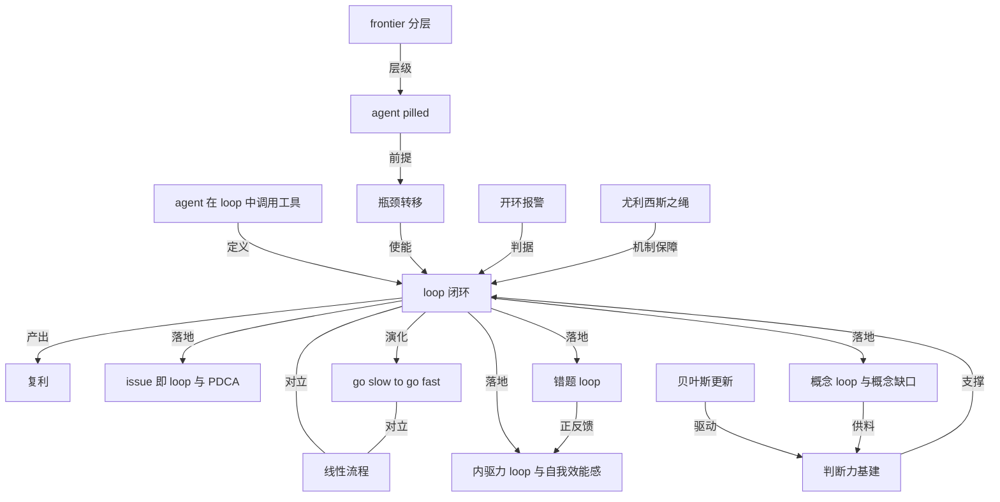

# howie 直播：agent loop

- 原文标题：w2635 agent 范式的判断力基建：从信息到判断力
- 内参日期：2026-09-02
- 来源类型：blog
- 标签：agents, agentic engineering

> agent week 第二场的完整文稿，承接上一场的 agent 原生开发，落到 loop 这一个概念上：2025 年一整年的 agent 尝试都在摸着石头过河，coding agent 到年底才立住，所以 2026 年该战略性押的不是 ai 而是 agent。

## 导读

我的ai 直播文稿

## 核心观点

- 这是 agent week 第二场直播（2026-08-31），承接上一场「agent 原生开发」，把半年 agent 实践总结成一个词：**loop**。
- 核心主张：loop（PDCA 闭环）不是新概念，PDCA 已经存在几十年，人人烂熟于心；真正变了的是**瓶颈**。过去脑子闭不了环，所以复利只是鸡汤；2026 年 agent 把闭环里最重最贵的那些环节卸载掉了，于是 loop 第一次真的能跑起来。
- 第二个主张：agent 时代执行环节已经不值钱，瓶颈转移到 idea、创造力、plan、design、taste。但「品味很重要」不能只是口号——判断力需要一套 agent 驱动的基建（AI 内参 + 阅读挑战）来落地。
- 反面立论：agent 绝不是让你更快更多地做同样的事（一天读 500 篇让 AI 各 summarize 一下），而是让你把 loop 走完。全 AI 驱动的东西是 slop，判断、idea、创造力目前不可替代。

## AI pilled，还是 agent pilled

- 借《黑客帝国》红药丸／蓝药丸的比喻：AI pilled 不是「知不知道 AI」，而是 AI 有没有入心、入脑、入魂，是否把它当作近乎信仰、战略层面去重视和投资的东西。
- 2026 年应该更进一步 **agent pilled**：2025 年号称 agent 元年，但除了 Deep Research 和早期 coding agent，其余尝试都在摸着石头过河；直到 2025 年末、2026 年初 coding agent 才立住（而 coding agent 也可以被非程序员当作 general agent 用），agent 范式才真正树立。
- 分水岭在变：
- 2025 年的分水岭是有没有御三家 20 美金会员、有没有超过 60 美金的投入。
  - 2026 年的新分水岭是 token 消耗量，而且必须是**前沿模型**的 token——每天一个亿 token，累计 100 亿、300 亿、1000 亿，用落地实践和做中学来衡量 agent pilled 的程度。
- **frontier**（前沿）成了一个通用的分类维度：大语言模型只分前沿模型和非前沿模型；有 frontier AI lab；2026 年最火的岗位之一是 frontier deployment engineer（前沿部署工程师），把最前沿的模型、agent 实践和 AI 系统部署进企业；由此产生 frontier enterprise。
- 类比：过去 IBM 咨询在华为驻场多年，把一整套国际化管理制度 deploy 进一家企业；现在这些咨询公司纷纷与 OpenAI、Anthropic 成立合资公司做同样的事。
  - 同一分类法可以下沉到个人和家庭：frontier individual（探讨 agent 原生开发的人 vs 只会用豆包拍照搜题的人）、frontier family（用整套 agent 驱动学习系统的家庭 vs 只拍照解题的家庭）。
- 投入会持续增大的原因是回报率：花 200 美金买来的 token，若你有 idea 并能用 Claude Code 做工具，大概值 1 万美金——按 API 计价已经消耗到三万四千美金，实际只付了每月三四百美金订阅费。这是当下的红利。

## 一个词：loop —— 复利的前提是闭环

- 复利公式人尽皆知：1.01 的 365 次方等于 37.78，0.99 的 365 次方等于 0.03。但过去它「简直就是个鸡汤」——因为复利要求走完 365 个周期，而**大部分人根本走不完一个 loop**。
- 走不完是结构性原因：把一个问题转化成思考、判断、洞见、行动，中间要消耗无数极其昂贵的 token，而人脑注意力资源有限，24×7 就这么点有效算力。
- 看到一篇两万字的英文文章，大脑直接死机，处理不了，闭不了环。
  - 小孩做错一道数学题，「然后就没有然后了」——没能力分析错因、定位知识漏洞、做针对性练习，闭不了环。
- 结论式定义：**loop 是复利的过程，复利是 loop 的结果**。
- 2026 年最大的震撼是瓶颈的位置变了：过去知识工作的瓶颈是脑子、是前额叶加工信息的能力；现在代码可以近乎无限生成，build 这个环节完全不值钱了（讲者称自己「从来不看这里面的代码」）。

## 每一个 issue 背后，都是一个 loop

- 一个 issue 就是一个 loop：有 idea、有 bug、想加功能或改善功能 → 写 issue → 跟 agent 讨论形成方案（技术方案、UI 设计方案、产品方案）→ agent 直接干活。以前程序员贵、慢，所以流程复杂；现在流程被压扁。
- 规模证据：一个月 300 个 issue，即 300 个 idea 在一个月内完成闭环，推动产品的一系列迭代和优化。
- 具体案例「尤利西斯之绳」：中午产生的一个 idea——把阅读挑战产品理念背后的尤利西斯之绳做成 APP 功能——写下 why／what／how，与 agent 几次对话形成方案，直接 build，再给反馈，当天就从脑子里的想法变成可展示的功能。
- 与上一场直播的呼应：用所有 agent 其实只在做一件事——plan → design（每个环节都与 agent 讨论）→ build（已不是瓶颈，也不太重要）→ 维护中的修 bug 和新想法，形成 PDCA 循环。
- 全程有 agent 参与之后：「过去不可能的事情全部可能了，过去被阻塞的事情全部都实现了，过去很贵的事情现在几乎不要钱了，过去很花时间的事情现在迅速就实现了。」
- PDCA 的适用面被主张为全域：任何类型的工作、把自己擅长热爱的东西做成可交付可售卖的产品、小孩做题学习、生活中的创业／投资／购物决策。

## 错题 loop：解题大师的内核

- 一个 agentic 的数学／编程／理科学习系统，核心不是里面那五六七八个 skill，而是它建立了**一个错题 loop**——这在传统教培方案里不可能实现。
- 切入点是「一道错题、一个知识漏洞」，随后进入完整闭环：
- 补充 context：为什么不会做、哪里卡住了，自然语言随便表述即可。
  - 用 agent 带来的「近乎无限供应的常春藤级别、MIT 级别的智能」分析一道小学数学题的错因。
  - 小孩消化后进入解题设计，围绕这道错题出针对性小卷。
  - 通过练习批改、错因再分析，设计第二轮、第三轮、第四轮针对性练习，直到知识点掌握牢固。

## loop 的对立面：线性流程与「开环报警」

- 线性流程的典型形态：漫长的立项、讨论、准备，多部门多职能协调，每个环节都是卡点；学习同样是层层过滤、层层筛选，留存率极低，「一鼓作气，再而衰，三而竭」。
- 无论学英语、学数学还是学编程，效果差的根因都是没有闭环，导致层层遗漏。
- 马斯克的「开环报警」：从第一性原理看做事，任何事情一定要形成闭环；如果流程后端没有反馈、行动产生的结果不能反哺并改变行动，就应该报警、应该谨慎。这套方法过去人人认同却难以执行，现在 agent 让它可执行。
- 复杂系统的论证：工作、学习、生活都是复杂系统，不可能像上帝一样自上而下画一张百年蓝图把风险全部规划掉；只能通过 loop 走一步看一步，每一步都用反馈来优化和调整。

## agent 的本质：在 loop 里调用工具

- agent 的定义：大语言模型 runs tools in a loop to achieve a goal——在一个 agent loop 中循环调用工具，通过推理、工具和上下文的调用 step by step 采取 action，直到达成目标为止。loop 因此是 agent 最本质的特征。
- 讲者自述每天都在走 loop：用 agent 开发产品、给小树设计的解题大师、AI 内参的编辑 agent，每个 agent 的每一趟运行也都是走完一个完整 loop。
- 当天现场记下的两个 idea，都是标准 loop 的起点：
- 学员反馈内参能否提供原文 → 版权是约束，但自家文章、50–100 年前的公版文章、部分英文内容是可以的 → 变成一个 issue 和一个 feature。
  - 觉得德国风格的设计好看、有自己的一套视觉语言 → 学习其本质特征 → 增强自己做背景图的 skill。
- 每个环节都可切入：洗碗时冒出的 idea 从 plan 切入；线上运维出的 bug 从维护端切入。当天早上学员在微信反馈 365 挑战的 bug（此前改版导致部分用户阅读时长失效），流程是截图 → 写 issue → 与 agent 讨论方案 A／B／C（因为你懂业务，所以你知道哪个更好）→ 执行 → 复核 → 回填记录到 issue → 关闭。
- 为什么现在能快速闭环：每个环节都是四两拨千斤，「那个千斤并不需要你自己扛，agent 会帮你扛」。人只需要给出 high level 的方案，把截图和意思描述清楚，不必下沉到技术和操作层面。
- 孩子侧的正反馈 loop：每一道错题都是一次强化。知识漏洞被精准识别捕获并专门训练（传统模式下这些漏洞可能一辈子都是漏洞，「学了十几二十年，知识的基础和解题能力的基础漏得跟筛子一样」），补上之后产生正反馈与信任感，再带来愉悦，愉悦又带动更积极地做题和思考。

## 发财也是一个 loop：从信息到思考到判断到行动

- 投资本质上也是 PDCA loop，任何环节都可以立刻切入、立刻闭环：
- 从行动切入：听说有个东西叫比特币，不知道是什么，那就先买一个，loop 就启动了。
  - 看到癌症疫苗研发出来，先各买一股莫德纳和默克，然后开始收集文章、建一个「疫苗」清单（癌症疫苗、mRNA、莫德纳），读的过程中 loop 进一步闭合。
  - 看到某只存储股一夜涨 30%，先买一股，买了之后它会带动你走完整个 loop。
- 从信息侧切入的老问题：一手、高价值的英文原始信息「认知负荷一下子就把人压死了」，没有 agent 之前不可能去读最高质量、最一手、最前沿的东西。
- 每个环节过去都特别有难度：
- 信息：上百个英文信息源，很多人连信息源都不掌握，没看过《大西洋月刊》、Stratechery、The Information、The Economist；每天要从上百个源里筛几百条信息，成本高。现在设计一个 agent 来做。
  - 思考：思考前要先做「搬砖」——啃完那些上万字、认知负荷极重的文章。现在 agent 帮你啃完，你站在它肩膀上做更重要、更不可或缺的理解与消化。
  - 画图：以前不是学不会画 diagram，而是费脑子而脑子有限；现在设计一个 skill，画图「跟玩儿一样，比呼吸还简单」。
- 判断需要**贝叶斯更新**：2025 年 12 月 31 日的年度展望判断是「2026 年 AI 应用真正爆发，人们会在御三家会员之外订阅多个 20 美金以上的 AI 应用（AI 加持的 Figma、Notion、Linear）」——这个判断被自评为错的或不准确，因为没有看到桌面 agent 的爆发（龙虾、Codex、Claude Code）。人做判断不可能像神仙一样全知，关键是不断根据新证据更新旧判断。
- 新证据的例子：黄仁勋提到 Vera Rubin 新系统的内存与 AI 存储架构，当天存储相关股票暴涨——「有人可能因为一篇文章挣到了过去一辈子才能挣到的钱」，当然也可能判断失误。
  - 桌面 agent 爆火后去理解、去用，形成判断；Opus 4.5 发布后 Claude Code 实际上已变成普通知识工作者也能用的 general agent，又形成一个判断。
- 因此 AI 内参被定位为**通用基础设施**：它已经驾驭视频、推特、书籍、PDF、Markdown、newsletter、播客——任何媒介、任何长度、任何语言，通过一个个 loop 组成的 agentic 编辑过程形成 agentic 信息流系统，支撑信息获取、消化理解、形成判断、形成行动的全部环节，并可迁移到孩子学习等场景。

## 为什么 2026 年要重新战略性地重视 loop

- 关键不在于 loop 是新概念（PDCA 存在几十年），而在于 agent 把过去最难的部分全部卸载掉，于是每个人在每个领域只要让 agent 全程参与、能驾驭好 agent，都能真正实现闭环。
- 瓶颈转移：脑力劳动的旧瓶颈不存在了，新瓶颈是你的 idea、创造力、plan、design、taste。「过去所有人都知道 loop 这个想法，但因为你有瓶颈，所以你没有办法闭环。现在瓶颈被消灭了。」
- 要教给孩子的不是所有做题技巧和知识，而是**走完 loop 的能力**：任何知识出现遗漏、任何一道错题，都能通过 loop 和反馈自我认识、自我更新、自我调整——这是人生最重要的一种能力。
- 成年人同理：写作时吸收每篇文章的反馈迭代措辞，优化写作 skill；工作中根据结果反馈优化解决问题的 skill、使用工具的 skill、思考的 skill——「你就像一个 agent 一样，形成了一个不断优化的 loop」。
- 大决策的练习场是日常小判断：买房、买股票、择业、选专业、选人生伴侣这些塑造人生的大决策，练习其实发生在日常的预测和判断里。所以要经常做预测、打赌——路过一家餐馆就跟孩子打赌「这个餐馆活不过六个月」，用打赌的方式让判断闭环。

## 把学习也放进 loop：七天精读与尤利西斯之绳

- 上周五讲 agent 原生开发，周六就把 Anthropic 官方材料做成一整个主题策展并上线：「每天一番茄，七天精读 agent 原生开发」。
- 内容分四个模块，每模块三到四节课，覆盖 plan mode、`CLAUDE.md`、skill、subagent、session、feedback loop、部署等；讲者判断最重要的是前面的 idea、方案讨论到执行这一段，部署那部分没那么重要。
- 关键的反常识观察：好东西静静放在那里，**大家看都不看**。人人每天刷小红书、抖音，但不会每天花半小时、持续七天系统学完 agent 原生开发。
- 所以要**尤利西斯之绳：不靠自觉，靠机制**。「不要觉得『我是怎样的尤利西斯，我的意志力跟我的肌肉一样强健』」——面对算法诱惑意志力不可靠，要靠契约、节奏、自动化的数据同步、社区和团队来设计机制。
- 对比传统学法：在官方网页上读十四课，笔记要复制粘贴到 Logseq 或别的 APP，一个人读英文，阅读和笔记全是分裂的。在这套基建里，阅读、笔记、划线都能被 agent 直接打通（有专门的 API 和 skill），还能看到别人的划线和笔记。
- 实际效果：目前 24 位熊友参加，讲者自评「因为有这样一套机制，我自己就把自己捆起来了」，预期五天内每天半小时学完。

## 阅读挑战的产品矩阵

- 长期挑战（习惯养成的「长期的账」）：一年内每天至少看书一分钟、平均每天约一个番茄；门槛只有 180 小时，比微信读书的三百多小时低了一半。AI 内参 365 挑战同理——365 天每天一个番茄投入在 AI 和 agent 上。
- 精读计划（短期活动，随时可参加）：《内驱式学习》共读、agent 原生开发精读；后续可做费曼学习法、解题元技能等精读计划——「因为我做了这样一个基建」，可以在社区范围内言出法随地做最理想的学习基建。
- 七天阅读挑战赛（短期反馈）：同时累加微信读书和 AI 内参两个系统的时长与天数（打通两个 API），因此难度最低。精读计划实际上是中长期挑战的子集。
- 数据与机制细节：单本书阅读时长是洗碗时想到的 idea——微信读书 API 原生不给这个数据，但当天算了出来。抽奖机制要求同时参加两个计划，因此只有七十多人，其中已有两三人中过奖；六月起送出文石 Poke6、Note X6 等，年底送一台 iMac。
- 目标定位：在中国当下培养阅读习惯近乎不可能，用 agent 助力加产品与机制设计，看看能有多少人真的养成习惯。365 AI 挑战目前已有 80 人「给自己绑上了尤利西斯之绳」。

## 精读计划的思想对话与 go slow to go fast

- 同一本书在微信读书里读和在纸书上读体验差别很大，因为基础设施带来了**思想对话**：最喜欢看大家的划线——哪些和我一样、哪些我画了别人没画、哪些别人画了我没画；同一段划线大家的想法和触动是什么；自己也把想法费曼一下写出去。
- 三百多位熊友每天同时读同一本书，虽不面对面，交流讨论的效果却完全不同；还能看到作者本人的评论、划线和讨论；自己的笔记全部可以被 agent 访问、与 agent 对话。
- 读书难闭环的老问题：有人读一千本、两千本、三千本，每天花很多小时，效果却出不来——因为没走完读书的闭环。书里的方法论作为信息需要被加工、理解、对话、写下笔记，最终体现为认知的变化、判断的变化、观念的变化、行为的变化、方法论的升级，以及家庭教育实践中的具体变化（更重视孩子的阅读，理解孩子为什么有或没有内驱力）。
- **go slow to go fast**：用更慢的方式，收获更好的效果。没有这种思维的人把 agent 理解成「更快地做更多」——开发就要做十个二十个三十个软件，读书就读网文十本二十本，做题就题海战术永远没头。建立 loop 之后，可以用更自然、更符合人性的方式做事，效果反而更好。

## 内驱力本身也是一个 loop

- 内驱力也可以理解为现在人人都说的 **agency**（能动性、主动性）。
- 培养 agency 靠的不是外在道理灌输——「道理的灌输就像给筛子里面倒水一样，一层一层往下漏，最终什么都不会留下」；必须靠他自己，或借助家长、家庭、朋友的帮助，实现一个内驱力的 loop。
- 内驱力 loop 的机制链条：
- 从**最近发展区**出发（既不能远超能力，也不能太简单——任何人都能做到的事不值得骄傲）。
  - 通过自己的努力和外部机制约束，做到了一些事情。
  - 得到及时的、正面的反馈与多巴胺奖赏，而不是惩罚、规训、打骂嘲讽。
  - 产生「I can do it」的自我效能感——这正是 candobear、小能熊这个名字的意思。
  - 效能感驱动下一步行动，形成循环。
- 这套机制在学英语、阅读、做题上是同一个东西。

## 概念 loop：成年人的错题本

- 使用内参本身就是一个个 loop：读一篇文章 → 从信息侧着手 → 提炼概念 → 形成思考 → 产生行动。
- 「行动清单」的每篇文章都指向一个行动：看到 ELI5（explain like I'm five）这个 skill，行动是花五分钟在 Claude 里装一下；看到 git worktree 使用指南，行动是梳理这个概念、提升在 Codex 和 Claude Code 中的实践技能。信息不是看一眼就过去的东西，而是指向行动。
- 核心类比：**学生要发现自己的错题，成年人要发现自己概念的缺口**。概念 loop 是成人版的错题 loop。
- 概念 loop 的操作流程：
- 在具体问题中发现概念缺口（如 git worktree）。
  - 新建一条笔记，用 5W2H 模板做初始化，把缺口从脑子里拿出来变成一个实实在在的 Markdown 文档——「一旦它变成 Markdown 文档，它就存在了」，可以被 agent 持续迭代、被你和 agent 共同使用。
  - 让 Claude 或 GPT 做一个概念综述（例：让它综述英伟达刚发的财报），立刻把一条信息转化成知识体系里一块实实在在的砖块。
  - 第一轮笔记写完就放着不管；第二次遇到时重读并复制粘贴过来编辑，第三遍、第四遍再编辑，第五到第八遍继续重读重编。不追求一次性背下来，够用就行。
  - 最重要的是输出和应用——小能熊一以贯之的理念是**做中学**。
- 学习不分先后：接口、数据库、前端后端、不同技术栈和编程语言，以及 harness、skill、plugins 这些 agent 相关概念，只要在任何时间节点知道了它，让它走进 loop，学习每天都会发生新变化——「你每天都会成长 0.01 或者更多」，成千上万次概念 loop 之后，人和人的差距会非常大。
- 反面推论：对没有笔记习惯、不注重信息获取、不注重 AI 和 agent 的人，agent 范式下的**欠债会非常大**。
- 现实例子：今年 AI 把全世界存储产能吃紧，手机电脑的内存和 SSD 都很贵。什么叫 DRAM、NAND flash、HBM，以及它们与 AI 系统、KV cache 的关系——「一些特别重要的判断、思考、决策，实际上都来自于一些基础概念的学习」，没有这些概念，大判断根本无从判起。

## 判断力的基建：每天的阅读 SOP 与内参策展

- 每天的阅读 SOP：编辑工作（每晚直播后 + 每天早起第一件事）之后，自己再浏览、筛选、收集，把要读的文章加入相应清单。
- 快速判断要不要读只花约一分钟：一看主题，二看 agent 总结的最核心观点（那几句话的全文关键）；真正细读时还有多维度、概念图谱和 500 字费曼。
  - 当天的例子：「AI 造软件」加入清单；GitHub 四个月 commit 数翻倍到 30 亿这条没加；「AI 时代最大的生产力杠杆不是某个工具而是团队文化」；陶哲轩在国际数学家大会的演讲加入数学清单；Codex 官方文档（很多人不看官方文档，但这是最有价值的信息）；1958 年的一篇经典文章拿出来重读共读。
  - 每天花几分钟筛一轮，后续会优化侧边栏让清单更易触达，从而进行主题阅读。
- 编辑者的 loop 与读者的 loop 是同构的：编辑过程中不断把改进点扔进 inbox，攒一攒就用来优化 agent workflow、优化某个 skill 的操作细节、优化 Notion database 的页面结构与设计、优化内参功能。读者侧则是选一篇文章 → 划线笔记 → 提取概念 → 走概念 loop 落到 Logseq → 形成行动；后续判断、行动、概念都会在内参系统里作为**第一公民**呈现。
- 内参自身就是 loop 的产物：2 月 22 日开始用龙虾，用了两天觉得必须拿它做个项目，2 月 24 日左右上线并回溯了前几天的内容；三月到八月靠每天的 loop 不断优化，如今系统的复杂度和创造的价值都是当初没想到的——「这就是 loop 的威力」。
- 策展（curation）是内参「在别处看不到」的部分：三千多篇文章，半壁江山是 AI，但无所不包（数学、科学、计算机、文化评论、思想、哲学、艺术、书籍、视频）。已有专题包括奥德赛（从影评、书评到诗歌原著、诺兰、IMAX）、harness engineering（报纸排版模板）、Stratechery（499 美金／年）、The Information（399 美金／年）、SemiAnalysis、agent skills、《内驱式学习》。
- 规模的复利：目前 3000 篇，每天新增 30 篇，年底约 1 万篇，此后每年再增 1 万篇。底层逻辑是海量优质 token 供给——AI 公司每月补贴的算力，让一个人做成过去几十上百人都做不到的事，为社区构建一个自己用、孩子也能用的全家庭信息基建。
- 两个 APP 的分工：内参是判断力的基建、理解力的基建、信息流的基建；阅读挑战聚焦把阅读变成一种好机制。二者互补。
- 讲者自陈的投入：从 7 月 1 日统计以来在内参上读了 69 个小时，一天没断——但也承认「可能大部分人看都不看」，所以问题是如何让人体会到这种价值：它不只是信息基建，更是破解理解瓶颈的基建，是判断力、品味和行动的基建。

## agent 不是让你更快更多，而是让你把 loop 走完

- 内参并非全 agent 编辑：重要且麻烦的事情由 agent 做，但每晚上百个信息源、几百条信息的判断和选择是人工的——agent 的 skill 判第一轮，人判第二轮，早上再精选一轮；最终只有几十篇，另有一万七千多条存量供策划挖掘。
- 判断力不可替代的论证：「如果它全部都是 AI 驱动的，那只能说它是一个 slop」；AI 在判断、idea、创造力方面目前不能替代人。5 月 16 日微信读书开放 API，同一个 API 每个人的 idea 不同——关注点、注意力、品味、人生目标都不同。若产品是全 agent 驱动的，那它就应该免费，根本不值得订阅。
- 最终立场：agent 绝不是让你更快、更省劲地做更多——不是过去读五篇、现在一天读 500 篇每篇让 AI summarize 一下。而是让 agent 驱动一个能提升你的 loop，「而不是说你像貔貅一样，让 agent 不断地往你嘴里灌输更多的东西」。
- 落地方式：以更好的结果、更强的能力、创造全新价值为目标，围绕 loop 把工作流固化下来，然后在 loop 中不断优化，每个环节都用 agent 赋能。

## 概念网络

### 关键概念

#### loop（agent loop）

**context**：全文的中心词。讲者把半年 agent 原生开发的方法论「进一步总结」为一个词——loop，并称它是 agent 范式带给他「思想层面的滋润反哺」。文中的 loop 同时指三件事：agent 运行时的循环、PDCA 式的做事闭环，以及个人认知与行动的反馈回路。

**费曼一下**：loop 就是「做一件事 → 看到结果 → 用结果改进下一次」这个圈能真的转起来。过去这个圈常常断在中间，你只能一次性地往前走；现在圈能转，每转一圈你就比上一圈强一点。

#### 复利与闭环的关系

**context**：「1.01 的 365 次方等于 37.78，0.99 的 365 次方等于 0.03」被讲者判为「简直就是个鸡汤」，因为复利要求走完 365 个周期，而大部分人一个 loop 都走不完。由此得出「loop 其实就是复利的过程，而复利其实就是 loop 的结果」。

**费曼一下**：复利不是一个数学公式的胜利，而是「圈数」的胜利。公式再漂亮，你一年只转了三圈，指数就不会发生。先解决转圈的能力，复利是自然结果。

#### 瓶颈转移

**context**：文中反复出现的因果枢纽——「agent 范式最大的一个变化：它改变了 80 亿人做知识工作这件事情的瓶颈」。旧瓶颈是脑子、是前额叶加工处理信息的能力；代码可以无限生成，build 完全不值钱；新瓶颈是 idea、创造力、plan、design、taste。

**费曼一下**：以前卡住你的是「做不完」，现在卡住你的是「想不出」。工具变强以后，稀缺的东西换了一个位置，你的努力方向也得跟着换。

#### AI pilled 与 agent pilled

**context**：借《黑客帝国》红药丸／蓝药丸的比喻提出的判据。AI pilled 不是知不知道 AI，而是 AI 有没有「入心、入脑、入魂」，是否被当作近乎信仰、战略层面重视和投资的东西；2026 年的进一步要求是 agent pilled。

**费曼一下**：知道 AI 和被 AI 改造过，是两件事。前者是听说过一个词，后者是你的日程表、花钱方式和做事方法都被它改写了。

#### frontier（前沿分层）

**context**：讲者从英文 AI 圈借来的分类维度：模型分前沿与非前沿，机构有 frontier AI lab，岗位有 frontier deployment engineer（2026 年最火岗位之一），企业有 frontier enterprise，并被下沉到 frontier individual 和 frontier family。

**费曼一下**：同样在「用 AI」，用的是不是最前沿的那一层，决定了你得到的是玩具还是杠杆。这个词提供了一把尺子，量的是你离前线有多远。

#### issue 即 loop（PDCA）

**context**：「你的每一个 issue，它背后其实就是一个 loop」——idea／bug／新功能 → 写 issue → 与 agent 讨论形成方案 → agent build → 反馈 → 回填记录关闭。一个月 300 个 issue 即 300 次闭环。

**费曼一下**：把脑子里飘着的想法写成一条 issue，就等于给它装了一个把手。有了把手，它才能被讨论、被执行、被验收、被关掉，而不是永远停在「我有个想法」。

#### 线性流程

**context**：loop 的对立面。表现为漫长的立项、讨论、准备与多部门协调，每个环节都是卡点；学习上则是层层过滤、层层筛选，留存率极低，对应「一鼓作气，再而衰，三而竭」。

**费曼一下**：线性流程是一条只能往前走的传送带，掉下去的东西不会被捡回来。loop 是一个圈，掉下去的东西下一轮还有机会被捡回来。

#### 开环报警

**context**：出自马斯克传记的做事原则，被用来给 loop 提供第一性原理的背书：如果流程后端没有反馈，行动产生的结果不能反过来改变行动，就应该报警、应该谨慎。

**费曼一下**：给自己装一个警报器——凡是「做完就没下文」的事，都该响一声。没有回声的事情，多半白做了。

#### 错题 loop

**context**：agentic 学习系统的内核。「它的核心实际上是建立了一个 loop，一个错题的 loop」——从一道错题这个知识漏洞切入，补 context、分析错因、消化、出针对性小卷，再批改、再分析、再出第二三四轮练习。

**费曼一下**：错题不是失败的记录，而是入口。以前进了这个门就没路了，现在门后面有一整条路：为什么错、错在哪、再练一遍、练到会为止。

#### 正反馈与自我效能感

**context**：错题 loop 在孩子身上的产物——知识漏洞被精准识别并专门训练之后产生信任感与愉悦，愉悦又带动更积极地做题和思考；文中把「I can do it」的效能感点名为 candobear、小能熊名字的来源。

**费曼一下**：人会重复让自己感觉良好的事。孩子爱不爱学习，往往不取决于道理讲得多好，而取决于他上一次学的时候有没有尝到「我能行」的甜头。

#### 内驱力 loop 与最近发展区

**context**：内驱力被等同于 agency（能动性、主动性），并被拆成一个闭环：从最近发展区出发 → 努力加外部机制约束 → 做到 → 获得及时正面反馈与多巴胺奖赏 → 自我效能感 → 下一步行动。文中强调道理灌输「就像给筛子里面倒水」。

**费曼一下**：内驱力不是讲出来的，是一次次「跳一跳够得着」的成功攒出来的。太难会挫败，太简单不值得骄傲，只有刚好够得着才会上瘾。

#### 概念缺口与概念 loop

**context**：文中给成年人的核心方法——「就像学生应该发现自己的错题一样，成年人应该发现自己概念的缺口」。流程是发现缺口 → 建笔记用 5W2H 初始化 → 让模型做概念综述 → 多轮重读重编（不追求一次背会，够用就行）→ 输出与应用（做中学）。

**费曼一下**：你不懂的每一个词，都是一道成年人的错题。把它写成一份文档，它就从「我大概知道」变成一块可以反复加固的砖。

#### 贝叶斯更新

**context**：判断环节的方法论。讲者复盘 2025 年 12 月 31 日的展望（AI 应用爆发、订阅多个 AI 加持的应用）判定为错——漏掉了桌面 agent 的爆发，进而强调「最重要的是你要不断根据新的证据做贝叶斯更新」。

**费曼一下**：判断错了不丢人，判断错了还不改才丢人。每来一条新证据，就把自己原来的看法往证据的方向挪一点，而不是等着证明自己当初是对的。

#### 判断力基建（agentic 信息流系统）

**context**：全文的产品级结论。内参被定位为通用基础设施——驾驭视频、推特、书籍、PDF、Markdown、newsletter、播客等任何媒介、任何长度、任何语言，通过一个个 loop 组成的 agentic 编辑过程，支撑从信息获取、消化理解到形成判断、形成行动的全部环节。

**费曼一下**：品味和判断力不是天赋，是被喂出来的。你每天吃什么信息、怎么消化它，决定了你几年后能做出什么判断——所以喂养系统本身值得当作基础设施来建。

#### 尤利西斯之绳

**context**：机制设计原则，也是被当场做成 APP 功能的那个 idea。面对小红书、抖音的算法诱惑，「不要觉得『我是怎样的尤利西斯，我的意志力跟我的肌肉一样强健』」，要靠契约、节奏、自动化数据同步、社区和团队来实现约束。

**费曼一下**：与其相信自己能忍住，不如提前把自己绑起来。好机制的标志，是它在你意志力最弱的那天照样起作用。

#### go slow to go fast

**context**：对「agent 就是让你更快更多」的直接反驳。读一千本书没效果是因为没走完读书的闭环；建立 loop 之后可以用更自然、更符合人性的方式做事，效果反而更好。终局立场是「agent 绝对不是让你去更快、更省劲地做更多的东西」，而是让 agent 驱动一个能提升你的 loop。

**费曼一下**：快不是把同样的事做得更多，而是少走回头路。慢下来把一件事走通、走透，下一件事你就不用从零开始。

### 概念网络

这张网络的中心是 loop，但真正让它在 2026 年成立的是**瓶颈转移**这条前提边。讲者反复强调 loop 本身不新——PDCA 存在几十年、复利公式人尽皆知——所以整个论证的重量不在「闭环好」，而在「闭环第一次变得可行」。C6（agent 在 loop 中循环调用工具直到达成目标）为 loop 提供了定义层面的锚：agent 的本质特征恰好就是 loop，于是人的做事方式与工具的运行方式在同一个词上对齐了。

**loop 与复利之间是过程与结果的关系**，不是并列的两个概念。文中把这层关系说死了：loop 是复利的过程，复利是 loop 的结果。这条边解释了为什么过去的复利叙事是鸡汤——不是公式错了，而是分母（能走完的圈数）太小。C3 削掉的正是这个分母的约束：旧瓶颈是前额叶加工信息的能力，新瓶颈换成 idea、plan、design 和 taste。

**C1 与 C4 是全文唯一一组硬对立**。线性流程（层层立项、层层过滤、一鼓作气再而衰三而竭）与 loop 争夺的是同一件事的组织方式，而 C5 开环报警提供了区分二者的操作性判据：结果能不能反过来改变行动。C16（go slow to go fast）同样落在这条对立线上——它反对的「更快更多」正是线性思维在 agent 时代的变形（一天读 500 篇让 AI 各总结一遍），因此它既是 loop 的演化结果，也是对线性模式的再一次否定。

**C7／C8／C9／C10 是同一个模式在四个领域的实例化**，这也是全文最有说服力的结构：一个 idea 变成 issue（产品）、一道错题变成练习序列（孩子的理科学习）、一个概念缺口变成可迭代的 Markdown 笔记（成年人的终身学习）、一次「我能行」变成下一次行动（内驱力）。它们不是四个独立方法，而是同一个圈换了四种入口。C8 与 C10 之间还有一条内部边：错题 loop 的产物正是正反馈与自我效能感，学习机制因此接上了动机机制。

**C11 和 C12 分别补上 loop 的两个前置条件——行为侧和信息侧**。loop 要转起来，人得真的坐下来（尤利西斯之绳：不靠自觉靠机制，因为好东西静静放着「大家看都不看」），信息得真的能被消化（判断力基建：把过去啃不动的一手材料变成可读之物）。C13 贝叶斯更新是 C12 的运行方式而非附属品——判断力基建的输出不是结论而是可修正的判断，讲者用自己 2025 年末那个被证伪的展望来示范这一点。C9 与 C12 之间的供料边说明这两侧是互相喂养的：读到的东西催生概念缺口，补完的概念又反过来支撑更大的判断（不懂 DRAM、NAND flash、HBM 与 KV cache 的关系，就无从判断存储这一轮）。

**C14 与 C15 是这张网的入口条件而非结论**。agent pilled 决定你会不会把资源真的投进来，frontier 分层则给出投在哪一层的判据——同样是用 AI，用不用前沿模型、算不算 frontier individual，直接决定 C3 那条「瓶颈已被卸载」的前提在你身上成不成立。这也解释了全文的收束逻辑：agent 不能替代判断、idea 和创造力，全 AI 驱动的产物只是 slop；agent 能做的，是把圈上那些又重又贵的段落替你扛掉，让你有机会把每一个圈都走完。

## 费曼 x3

复利公式人人会背，能兑现的人极少。1.01 的 365 次方等于 37.78，这句话之所以长期停留在鸡汤层面，不是因为数学有问题，而是因为没人真的能走完 365 个周期。要把一个问题变成思考、变成判断、变成行动，中间要烧掉大量极其昂贵的注意力，而人脑 24×7 就这么点算力。看到一篇两万字的英文文章，大脑直接死机；孩子做错一道题，「然后就没有然后了」。圈断在中间，指数自然不会发生。

所以真正值得盯住的不是这个圈本身，而是圈上那些让人半途而废的环节被谁扛走了。2026 年最大的变化是瓶颈换了位置：过去卡住知识工作的是前额叶加工信息的能力，如今代码可以近乎无限生成，build 完全不值钱，卡住你的换成了 idea、plan、design 和 taste。这层意思恰好和 agent 的定义严丝合缝——大语言模型 runs tools in a loop to achieve a goal，agent 最本质的特征本来就是循环。工具的运行方式和人的做事方式，第一次在同一个词上对齐。

一旦这个圈能转，它就在各处以同样的形状出现。一个 idea 写成 issue，与 agent 讨论出方案、直接 build、再拿反馈回填，一个月三百次；一道错题被拆成错因分析、针对性小卷、二轮三轮四轮练习；一个成年人发现自己的概念缺口——什么叫 HBM、什么叫 KV cache——建一条笔记、做一次综述、在第五遍第八遍遇到时继续重编。这些不是四种方法，是同一个圈的四个入口。它的反面同样清晰：层层立项、层层过滤的线性流程，一鼓作气再而衰三而竭，结果永远回不到起点。马斯克那条「开环报警」给了最锋利的判据——如果你的行动产生的结果不能反过来改变行动，就该响一声警报。

值得警惕的是把 agent 理解成加速器。「agent 绝对不是让你去更快、更省劲地做更多的东西」，过去读五篇现在读五百篇、每篇让 AI 总结一遍，那是把自己变成貔貅，不是变强。真正的用法是让它替你扛掉圈上最重的那一段，好让你把每一个圈走完——所以判断、idea 和创造力反而成了不可替代的部分，全部由 AI 驱动的东西只是 slop。

也正因如此，圈转不起来的两个现实障碍值得单独对待：人坐不下来，信息啃不下去。前者靠机制而非自觉——不要相信自己的意志力像肌肉一样强健，该给自己绑一条尤利西斯之绳；后者靠基建，把过去用不起来的一手材料变成可消化之物。品味和判断力从来不是口号，它们是被喂出来的：每天喂什么、怎么消化、判断错了肯不肯按新证据往回挪一步。孩子该学的其实也不是所有解题技巧，而是这一件事——在任何一个漏洞出现的时候，有能力自己把那个圈走完。

## 阅读原文

周: w2636

日期: 2026/08/31

🎙️ howie 的 AI 主题直播: 【howie 的 AI 主题讲座】w2636 agent 范式的判断力基建：从信息到判断力 ([Untitled](https://app.notion.com/p/3cd679b108ff81c29b10cdafc5577ffb))

howie 的 AI 主题讲座 · 2026 年 8 月 31 日直播（agent week 第二场）· 直播文稿

明天就是新学期开学了，按理说全国各地都是 9 月 1 号开学。所以咱们这一次 agent week，也算是开学第一周的开学第一课。

我们这几场直播，在我理解就是挑选一些特别有价值、特别有趣、自己实践特别多、思考也特别多的主题，大家一起用主题直播的方式交流一下。我觉得这种形式还是挺好的。因为 agent 这个范式的学习、实践、落地，是非常前沿的一个领域，翻译过来其实就是：你身边没有人在乎，也没有人做过，也没有人想过。如果你对这个话题感兴趣，大部分人很难找到这种沟通交流的机会。所以我们在 agent week 里，把过去半年——从龙虾（OpenClaw）火了之后这半年——相关的方方面面拿出来做一些实践总结，我觉得还是挺好的。每次两个小时，不长不短，一个电影的长度，大家听完之后也可以自己做一下总结，因为这些主题大家应该都有所实践、有所思考。

上周刚直播完之后，我一直在琢磨：我们用 agent 写代码、写程序、写产品、做软件，半年了，到底该如何总结这一件事情？真正总结起来，这就是我今天要跟大家进一步探讨的话题。我会觉得它可以归结到一个概念、一个词上面。而这样一个 idea，如果我们真正能够领会它背后的 why，以及它为什么在 2026 年跟以前完全不一样、能够带来这么大的价值，我觉得会影响到、会改变我们工作、学习、生活的方方面面。这其实就是 2026 年 agent 范式解锁的一种完全不同的东西——以前是不可能的。所以我觉得这个主题特别重要，今天来好好探讨一下。

有同学问 Windows 端可不可以用 agent loop。其实 agent 都是靠 loop 来运行的，所以今天我们说的这个 agent，你用 Codex、用龙虾、用 Claude Code，哪个都有 Windows 版。可能每个人实践的情况不一样，对这个领域的一手经验是有差异的。但大家只要关注到这个东西，真正把注意力放到这件最重要的事情上来，我觉得都能相对于过去的自己取得显著的进步。

今天是 agent week 系列直播的第二场。周三会是 Savage 来跟大家讲学习型家庭、家庭教育方面的主题。我今天想承接上周五那场 agent 原生开发的直播，做一个总结，做一个延伸，因为我觉得它背后的这些思想能够应用到方方面面。我大概弄了一些大纲，内容还挺多的，大概分成两块：一块是承接上一场直播，讲 agent 背后的 loop——这是我认为最重要、一定要战略性重视的一个思想；另一块是我们 2026 年、小能熊十一周年的社区主题，叫「agent 基建，正当其时」。可能你身边所有人都不在乎 agent 这个东西，但我们旗帜鲜明地认为，你今年应该 all in 在 agent 这一件事情上。

### AI pilled，还是 agent pilled？

说实在的，这里面有一个矛盾：一方面人人都知道 AI，知道 ChatGPT，都用过豆包、用过 DeepSeek，好像我们进入了一个 AI 时代、AI 社会，人人都在学 AI、用 AI、谈 AI、聊 AI。但我想提出一个词，叫 AI pilled。这个词我觉得很有趣，它引用了 1999 年《黑客帝国》里 red pill 跟 blue pill 这两个比喻——你到底是吃下红色药丸去面对现实，还是吃下蓝色药丸继续把抖音、小红书刷起来。现在有人把红药丸蓝药丸的比喻借用到 AI 这个领域里面来。

AI pilled 是什么意思呢？我觉得它不是说你知不知道 AI，而是说你有没有让 AI 这个东西入心、入脑、入魂，有没有真正地理解 AI，有没有对 AI 形成一种近乎于信仰、把它作为战略层面去重视和投资的东西。当我们说一个人 AI pilled，或者一个公司 AI pilled，基本可以说它是 all in AI、战略性地重视 AI。

我个人会觉得，我们在 2026 年不但应该 AI pilled，甚至应该 agent pilled。我们一直在谈 2025 年是 agent 元年，但实际上 2025 年除了 Deep Research 这样的 agent，以及诞生了 Claude Code 这种 coding agent 的早期阶段，其他各种各样的 agent 尝试，几乎都属于摸着石头过河的状态。经过了整整一年的摸着石头过河，到了 2025 年底，coding agent 才立住——当然，coding agent 其实也可以被非程序员当作 general agent 来使用。所以 agent 这样一个范式，在 2025 年末、2026 年初才真正树立起来。

我们可以这么说：虽然人人都知道 AI，人人嘴上都说 AI 很重要、我想学 AI，但这个「人人」实际上是要分门别类的。2025 年我们的划分方式，其实就是你在 AI 上面有没有御三家 20 美金的会员、有没有超过 60 美金的投入，我们觉得这是一个分水岭。但今年，我建立了一些新的分水岭。怎么说呢，我可能是把它做到产品层面了，我们整个的理念就是：每天一个亿 token 的消耗，而且这个 token 不是随便什么 token，而是前沿模型的 token。你什么时候消耗了 100 亿、300 亿、1000 亿 token，这些东西都反映了我们有多么 AI pilled、有多么 agent pilled——用落地实践、做中学来衡量。

我又想到英文 AI 圈子里一个特别重要的词，叫 frontier。我觉得这个词现在用来评估自己对 AI 的重视程度也很好用。frontier 是什么？前沿、前线。所以我们可以用它来给所有东西分类。大语言模型只有两种，一种叫前沿模型，一种叫非前沿模型。前沿模型是由前沿的 AI lab、frontier AI lab 做出来的，全球有几家前沿的 AI lab。2026 年最火的一种职业和岗位叫 frontier deployment engineer，就是前沿部署工程师，其实就是把最前沿的模型、最前沿的 agent 实践、AI 系统部署到企业里面去。你想整个企业过去搞了这么多年，才搞了 ERP、各种各样的电子系统，而现在毫无疑问，这些东西在 AI 时代、agent 的时代都要重做一遍。所以肯定得有专业的人来干，就像过去的 IBM——IBM 咨询在华为驻场干了好多年，把一整套国际化的公司管理和制度 deploy 到了一个企业里面去，很多咨询公司都干这样的事情。但现在这些咨询公司都跟 OpenAI、跟 Anthropic 成立了合资公司，把最前沿的 agent、AI 模型和实践部署到企业一线，这里面就产生了所谓的 frontier enterprise。前沿模型、前沿 AI lab、前沿部署工程师、前沿企业，这几个词都是我在英文媒体里经常能看到的。

所以我今天忽然想到：同样是用 AI、用 agent，其实也是可以这样去划分的。大家现在在直播间里探讨 AI 原生开发，探讨整个 agent 相关的一系列主题，那你肯定跟那些只知道豆包、只会用一下豆包的人是完全不一样的。虽然你们都知道 AI 这个词，但实际上你可能更属于那种前沿的 AI 应用个体，frontier individual。frontier family 也是一样：有的家庭只会用 AI 来拍照搜题、来解题，有的家庭会把整套 agent 驱动的学习系统、解题系统用起来，那肯定是不一样的。

所以我个人会觉得，随着大家对 agent 价值的认识加深、实践加深、能力加深，大家在 AI 上面的个人投入和家庭投入肯定会越来越多。为什么会越来越多？为什么会有越来越多人花 100 美金、200 美金甚至更多的钱去买 AI 公司的 token 套餐？就是因为他能从中得到一千美金、两千美金甚至更高的价值。

如果你有 idea，像我上周一样，你有 idea，然后你能够用 Claude Code 开发各种各样的工具，你每花 200 美金，从 OpenAI 那边、从 Anthropic 那边换来的 token，大概值 1 万美金左右。你看我这个消费，如果按 token 直接用 API 来算的话，都达到三万四千美金了，但实际上我只不过是每个月三四百美金左右的订阅费而已。所以我会觉得这其实就是一个最近的红利。

### 一个词：loop

刚才我们谈到的其实就是：在现在这样一个节点，我们怎么样去理解 agent 这件事情跟我们的关系。

上一场直播我们回顾了我做半年 agent 原生开发的整个方法论。这个方法论你现在回头来看，它变得如此之简单、如此之简洁，是可以快速习得、并且在每一天的实战当中不断加深理解、不断提升自己驾驭 agent 能力的。所以进一步总结的话，完全可以用一个词——loop。

agent 范式在 2026 年，大家已经亲身体验了半年以上。现在让我来总结这个 agent 范式给我带来的思想层面的滋润反哺，或者说 idea 层面的震撼，我觉得可以用 agent loop、agentic loop，或者你就叫 loop 来总结。

loop 这个东西其实一直都存在，而且大家一直都知道它很重要。为什么呢？loop 其实就是你熟悉的复利。1.01 的 365 次方等于 37.78，0.99 的 365 次方等于 0.03，这个所有上过网的人都知道，这就是复利的威力和价值。但是 loop 跟复利有什么关系呢？你想复利的时候，它是多少个周期？365 个周期，1.01 乘以 365 次，那才是 37.78。而我们过去的那个复利公式简直就是个鸡汤，为什么呢？因为大家没有办法走完这个 loop，真的就没有办法走完。

而这是有一个结构性原因、根本性原因的。你过去做任何一件事情，你要想实现闭环——你研究一个问题，把这个问题转化成你的思考、转化成你的判断、转化成你的洞见、转化成你的行动——这中间要消耗无数极其昂贵的 token。而我们脑子的注意力资源是有限的，你的脑子 24 乘 7，就这么点有效算力。

你看到一篇文章，你怎么走完闭环？两万字的英文文章，我大脑直接就死机了，处理不了，所以你就没有办法走完这个闭环。你小孩做一道数学题，这道题不会，然后就没有然后了。他没有办法去分析自己错误的原因，没有办法针对这道错题背后的知识漏洞或者方法不足来做针对性的练习，所以他没有办法闭环。所以你会发现，我们要想实现复利，前提一定得有这样一个闭环，得能够快速走完这个 loop。loop 其实就是复利的过程，而复利其实就是 loop 的结果。

所以 2026 年给我最大的震撼，其实就是现在的 agent 范式最大的一个变化：它改变了 80 亿人做知识工作这件事情的瓶颈。我们过去的瓶颈是我们的脑子，是我们的前额叶，是我们前额叶加工处理信息的能力。而现在你会发现，代码本身你可以无限地去生成——你看我从来不看这里面的代码。代码本身已经完全不值钱了，你可以近乎无限地去生成各种各样的代码，build 这个环节完全不值钱了。

#### 每一个 issue 背后，都是一个 loop

对比之下你会发现，你的每一个 issue，它背后其实就是一个 loop。你有一个 idea，或者你这个软件有一个 bug，或者你现在想加一个新功能，或者你想改善一个功能，你写一个 issue，围绕这个东西跟 agent 讨论，形成一个方案——包括技术方案、UI 设计方案、产品的各种重要方案。然后下一个环节就是 agent 直接来帮你干活。这件事情以前程序员很贵、干得很慢，所以有一个很复杂的流程。

而现在你有了这个 loop 之后，你看我整个 300 个 issue，这 300 个 issue 其实也就是一个月的时间。一个月的时间有 300 个 issue、300 个 idea 在我这里面完成了闭环，帮助我们的产品形成一系列的迭代和优化。

举个很具体的例子：我中午有一个 idea，我们来看一下尤利西斯之绳这个功能。你中午有一个 idea，想把阅读挑战产品理念背后的「尤利西斯之绳」做到 APP 里面去，变成产品的一个功能。你只要把这个 idea 写下来，梳理清楚它的 why、它的 what、它的 how，跟 agent 讨论，讨论完之后让它来做，基本上就是几次对话、几次讨论，它就形成方案。形成方案之后它直接 build，build 完之后你再给它一些反馈，然后整个功能就从你的一个 idea 变成了一个功能，基本上就能够展示了——你把脑子里面的一个想法变成了一个产品。

我们上周五讲的那个主题，核心其实就是：你用所有的 agent，只在做一件事——你 plan，你有一个想法，你制定一个计划，你再去 design 这个方案，design 的过程每个环节也都是跟 agent 一起讨论的。你一旦把 plan 和 design 做完之后，build 这个环节现在已经不是瓶颈了，后面的环节就很容易了，也不太重要了。在维护的时候，你可能会有一些修 bug，或者一些新的想法。于是就形成了 PDCA 这样一个循环。

而这样一个循环现在全程有 agent 的参与。所以所有那些过去有难度的、处理起来费脑子的事情，全部都改变了，都没有了。过去不可能的事情全部可能了，过去被阻塞的事情全部都实现了，过去很贵的事情现在几乎不要钱了，过去很花时间的事情现在迅速就实现了。

所以你会发现，PDCA 这件事情你可以用在所有领域：不论你是什么类型的工作，还是做产品——把你自己擅长的、热爱的东西做成一个可交付、可售卖的产品；还是小孩做题学习；还是你自己生活当中的一些判断决策——创业的决策、投资的决策、甚至购物的决策，任何的决策。我觉得这个 idea 特别的重要。

#### 解题大师的核心，是一个错题 loop

我们再来想一想解题这件事。当我们 build 一个 agentic 的数学学习系统、编程学习系统、理科学习系统，这个系统的核心是什么？你不要看这里面我有五六七八个 skill，有很多环节、很多步骤，它的核心实际上是建立了一个 loop，一个错题的 loop。而这个 loop 在以前，或者在现在各种教培学校的方案里面，那是不可能实现的。

现在你会发现：小孩做错了一道题、有一个东西不会做，这个时候我们就发现了一个切入点——一道错题，一个知识的漏洞。一旦你发现了这个切入点，你就进入了一整套的 loop。我们先补充相关的 context：你为什么不会做，哪里卡住了？自然语言随便表述。通过 agent 带来的这种智能资源的富足普及、近乎无限供应的常春藤级别、MIT 级别的智能，来给你的小孩分析一道小学数学题不会做的原因；分析得主旨到位，小孩消化完之后，开始解题的设计。所以整个从错题，到错题原因的收集、分析、拆解、消化练习，再到针对这道错题做的小卷，整个工程它是一个 loop。每一个知识点，只要他没有掌握、掌握不牢，我们就会通过练习的批改、通过练习当中错题原因的分析补充，再结合这些原因去设计第二轮针对性的练习，然后一直到第三轮、第四轮。所以你会发现，这其实是一个 loop。

#### 跟 loop 对立的，是线性流程

一旦你有了这样一个 loop 之后，你会发现它跟以前那种线性的流程就完全不一样了。以前大家做事情，要经历漫长的立项、讨论、准备，然后多部门多职能的协调，每一个环节全部都是卡点。工作中是这个样子的，小孩的学习也都是这个样子的，永远都是一种层层的过滤、层层的筛选。所以大部分人学的东西，就在这个层层过滤、层层筛选的过程当中不断遗漏，留存率特别低，最后学习的效果是非常差的。不论是学英语、学语言，还是学数学、学编程，因为没有建立整个闭环，这种层层的遗漏就会导致效果特别差。

上周五直播完之后，我一直在琢磨这个事儿。我会觉得 loop 这个东西，真的可能就是 agent 范式给我们带来的最大的一个改变。

如果看过马斯克传记，大家会记得里面有一小节在讲马斯克的「开环报警」。开环报警这件事情其实就是说，马斯克一直强调做任何事情，一定要去构建一个闭环。这是用第一性原理的角度来思考 getting things done、来思考做事情的逻辑。在马斯克看来，如果你要从第一性原理的角度把事情做好，那最重要的一件事情就是：任何事情一定要形成闭环。如果这个环是没有闭上的，假如说你的流程到后面没有反馈，你目前采取的行动产生了一个结果，而这个结果不能反馈回来改变你的行动，那就应该报警，那就应该谨慎，因为这个事情有问题，这种方式做事情不好。马斯克他们这套方法，在以前的时候，大家其实都还是很难闭环的。

但现在我就觉得，这就是 agent 带来的最大的一个改变。

### agent 的本质，就是在 loop 里调用工具

我们来总结一下，你可以理解为什么叫 agent，agent 的定义是什么。agent 的本质就是大语言模型 runs tools in a loop to achieve a goal——大语言模型在一个 agent loop 当中循环地调用工具，通过推理、工具和上下文的调用来采取 action，step by step，最终达到一个目标；在实现这个目标之前，它就在这个 loop 当中不断运行。这其实就是 agent。所以你会发现，loop 这个东西实际上也就是 agent 最本质的一个特点。

包括我自己在实践 agent 的整个过程当中，我会发现：不论是你用 agent 来开发一个产品，还是我给小树设计的解题大师这样一个 agent，还是我给我们 AI 内参做的那个内参编辑 agent，其实我每天都在走完一个 loop，每个 agent 的每一趟运行也都是走完一个完整的 loop。

在每一个 loop 的过程当中，我每次发现有一点需要改善的地方，就会立刻把它记下来。比如我今天刚刚记了两个点。一个点是有学员给我反馈说，有些内参的文章是不是可以提供原文。我当时的回复是，原文实际上有版权的问题，所以我们不能提供原文。但我想到，其实有些文章是可以的——比如我们小能熊自己的文章，或者一些 100 年前、50 年前的文章，本来就是开源的文章，包括一些英文的东西，这些是可以提供的。所以这样的话，我就有了一个 issue、有了一个 idea，而这个 idea 要变成软件上的一个 feature、一个功能，它其实就是一个很典型的 loop。

另外一个是我今天又想到一件事情：我发现德国风格的设计还挺好看的，它有自己的一套视觉语言，那我是不是可以模仿一下、改造一下，看看能不能增强我自己那个做背景图的 skill，给它增加一些其他的风格。最起码你可以学习这种风格的一些本质、一些特征，然后拿过来做创造性的运用。

所以你在生活当中会不断发现一些点，而这些点你立刻就能够用来走一个 loop。当你用这种 loop 的视角来改造你在 2026 年的工作、学习、生活的时候，你会发现整个世界应该是不一样了。如果我们真正对这个东西有实践、有一手的感受，我希望大家能够有我这种类似的感受：你会发现你看世界的角度是完全不同的。在 PDCA 的任何一个环节，实际上每一个环节都可以切入。

比如刚才提到的，今天早上有一个学员跟我反馈，说 365 挑战里面有一个 bug。他在微信上给我反馈完之后，我立刻处理——这就相当于软件的运维环节出现了一个 bug。你看我怎么讨论的：我们来看一下原始的记录，是不是 365 改版导致用户的数据失效了。学员给我反馈了，我直接截图，自己写了一个 issue。今天这个 issue 跟我之前改版时候的那个 issue 是相关的，是那次改版导致了部分用户的阅读时长失效了，用户不开心。

那我们就来研究一下这个 issue，研究完之后双方形成一致。你会发现这其实就是一个 idea 的过程：你有一个 idea、有一个 issue，然后跟 agent 讨论，讨论完之后——因为你是了解自己业务的，所以讨论完方案 A、方案 B、方案 C，你自己知道哪个是更好的——然后你就开始执行，执行完之后你再去复核，复核完就 OK 了。之后你把整个记录回填到这个 issue 里面去，你会发现这个 issue 就完成了，我们一个问题就解决了。

所以你会发现，当我们用 loop 的视角来看的时候，其实任何一个环节都可以切入。你洗碗的时候有一个 idea，那就是从 plan 这个环节切入；你运维当中产生的问题也能切入。然后它能够快速走完这个闭环。之所以我们现在能够快速闭环、快速迭代、快速优化，就是因为现在每一个环节你都属于四两拨千斤——因为那个千斤并不需要你自己扛，agent 会帮你扛。

你只要把截图扔给 agent，把你的意思描述清楚。你在设计方案的时候，出的是非常 high level 的方案——你在设计 UI 的时候也好，设计技术方案的时候也好，你都是 high level 的，不需要去做技术层面、操作层面的那些事儿。

#### 孩子的正反馈 loop

结合刚才讲的，当你用这种完全 agent 驱动的系统来改造小孩学习的过程的时候，你会发现 PDCA 的每一道错题都是一个强化的 loop，能给小孩带来正反馈。

这个正反馈给小孩带来的结果是什么呢？一个是他的知识漏洞被精准地识别并且捕获了。另一个是，这个知识漏洞放在传统的教育模式之下，可能永远就是漏洞——学了十几二十年，知识的基础和解题能力的基础漏得跟筛子一样，就是因为以前他没有办法闭环。而现在你会发现，小孩的这个能力补上了，这个漏洞也补上了，也专门训练了，所以就产生了一种正反馈，产生了那种信任感——这是多么美好的一件事情。然后他又会产生一种愉悦，这种愉悦又会带动他更开心地去做题、更积极地去思考。

因为你要知道，所有的问题都不是问题。只要出现一个问题，AI 就会以一种父爱如山的耐心，给你设计一个解题的游戏。你把这整个 loop 一旦建立起来，就是这样。

### 发财也是一个 loop：从信息到思考到判断到行动

我们再讲一个其他领域。大家对发财比较感兴趣，你就说发财这件事情，或者投资这件事情，它本质上也是一个 loop。它可能从行动上切入，也有可能从一条信息上切入。从信息到思考到判断到行动，它是一个 loop，是一个 PDCA 的 loop。而这个 loop，任何一个环节你都可以立刻闭环。

比如说，我听说有一个东西叫比特币，这玩意儿是个什么东西？不知道，那就先买一个，你就启动了。

前一阵有一天晚上我忽然看到，癌症疫苗竟然研发出来了。我说这个癌症疫苗是个什么东西？莫德纳、默克，管他呢，我们把莫德纳跟默克先各买一股。你买了一股之后，其实你就启动了这样一个 loop。那你就会去收集文章，建一个叫「疫苗」的清单，这里面就会提到癌症疫苗、mRNA、莫德纳，以及相关的一些事情。你在读这些文章的时候，这个 loop 就会进一步闭合。

你也可以从信息这一块的加工处理开始切入。我们以前遇到的问题是什么呢？你读一篇文章，中文的还好，但有些关于癌症疫苗的文章，那些原始的、一手的、高价值的信息，这玩意儿咋读？认知负荷一下子就把人压死了。所以在没有 agent 之前，你是不可能去读那些最高质量、最一手、最前沿、最新的东西的。

但是现在，我们通过内参这一整套 agentic 信息流系统，把你在跑这个 loop 的时候所有那些重的部分全部给你化解掉了。然后你只需要做一件事情。比如我今天做的这些图，以前你要画这样一个 diagram，不是说我们学不会画这个图，而是它费脑子，而我们的脑子又特别有限。现在你只要给自己设计这样一个 skill，再去画这样的图的时候，它就跟玩儿一样，轻松愉悦，比呼吸还简单，你就得到了一个图。

所以我刚才说的意思就是：在 2026 年，你不要再用 2025 年的范式来看待目前这件事情了。

#### 每一个环节，过去都特别有难度

还是回到生活当中的一些判断，比如投资、理财这一类事情，它涉及到信息、思考、判断、行动。这里面的每一个环节在过去都特别有难度。

获取信息的时候，上百个英文信息源，很多人连信息源都不掌握。可能很多人没有看过《大西洋月刊》，没有看过 Stratechery、The Information、The Economist 这些东西。你获取信息要花钱、要花时间，每天要从上百个信息源里筛选几百条信息，怎么筛选？有了 agent 之后，你设计一个 agent 让它来干这件事情。

思考的时候也是这个样子。你要想进行思考，就得先做前面那些搬砖的工作，你得去啃那些文章。但不是每个人都能花几天的时间去啃一篇上万字、认知负荷很重的文章。现在 agent 可以帮你啃完，然后你可以站在 agent 的肩膀之上，去做一些你更重要、更不可或缺的理解和消化，让思考更加有效。

#### 判断需要根据新证据做贝叶斯更新

做判断的时候也是一样。我不知道大家在年初的时候是怎么判断 2026 年 AI 的发展的。我记得在 2025 年跨年对谈的时候，我总结过自己的年度总结，还做了一些 2026 年的 AI 展望，这里面有一些判断。我记得我在 2025 年 12 月 31 号的一个判断是：到 2026 年，AI 应用应该真正爆发，体现在我们每个人除了御三家的 AI 会员之外，可能还会订阅好多个 20 美金以上的 AI 应用，比如 AI 加持的 Figma、AI 加持的 Notion，或者是 Linear 这样的应用。

毫无疑问，当时那个判断其实是错的，或者说是不准确的。我没有看到桌面 agent 的这种爆发——像龙虾，像 Codex，像 Claude Code。这就是一个判断。所以我们人做判断、做预测的时候，肯定不可能像神仙一样什么都知道，但最重要的是你要不断根据新的证据做贝叶斯更新，根据新的证据来更新你过去的一些判断和预测。

比如你弄完之后过了一两周，黄仁勋开会的时候提到了他做的 Vera Rubin 这样一套新系统，里面提到了整个内存、AI 存储这一块的架构，当天存储相关的股票就暴涨。你会发现，你根据一条新闻、一篇文章做一个判断，可能会让你的投资回报是你以前无法想象的，有人可能因为一篇文章挣到了过去一辈子才能挣到的钱。当然，你也有可能判断失误。

再比如后面你看到龙虾这样一个桌面 agent 的爆火，那你就去理解龙虾到底是个什么东西，然后你去用一下，你就会形成自己的一个判断；再加上后面 Codex 桌面版也出来了。然后 Opus 4.5 发布之后，整个 Claude Code 作为一个 agent，实际上已经变成了一个 general agent——除了 coding 场景之外，普通知识工作者也可以用的 agent。你会发现，又形成了一个判断。

行动也是一样：你可以因为看到一条信息，走完整个闭环，采取一个行动；你也可以直接上来就行动。我看到某只存储股一夜之间涨了 30%，我没见过这种股票，那你就先买一股，买了之后你就会发现，它会带动你走完整个闭环、整个 loop。

所以在整个过程当中，这就是为什么我这么重视 AI 内参这样一个 APP，即使很多人认识不到。我会觉得它实际上是一个通用的基础设施。它目前驾驭了视频、推特、书籍、PDF、Markdown、newsletter、播客——一切的媒介，任何的媒介、任何的长度、任何的语言，通过我设计的一个 agentic 的编辑过程、通过一个一个的 loop，形成了这样一个 agentic 的信息流系统。这个系统能够支撑你在信息获取、信息的消化理解、形成判断、形成行动这一块的全部环节。所以我认为它实际上真的是一个 agent 时代的基建。然后我会把它应用在其他更多的场景，包括孩子的学习之类的，都可以迁移过来。

### 为什么 2026 年要重新战略性地重视 loop

整体来讲，我会觉得刚才提到的 loop 思维——虽然我用一节课的长度、四十五分钟一直在讲这一个词，虽然它以前就存在，PDCA 作为一个理论已经存在几十年了，大家烂熟于心——但我认为它的关键在于：现在的 agent 范式把你过去最难的那些部分全部卸载掉了。然后每个人在每个领域里面，只要你让 agent 全程参与、只要你能驾驭好 agent，都是可以实现这样一个 loop 的。

这是我今天在路上的时候记的一些想法。我在路上有什么想法，可能就在手机上按一个按钮，直接跳到 inbox，然后用清单工具录一下。

为什么在 2026 年要重新战略性地重视 loop？就是因为 agent 带来了整个瓶颈的转移，我们所有脑力劳动的瓶颈转移了，你过去的瓶颈不存在了。那新的瓶颈是什么呢？新的瓶颈实际上是你的 idea，是你的创造力，是你的 plan，是你的 design，是你的 taste。过去所有人都知道 loop 这个想法，但因为你有瓶颈，所以你没有办法闭环。现在瓶颈被消灭了。

这也就是为什么我们现在要重新认识跟 loop 对立的那种线性模式——一鼓作气，再而衰，三而竭。因为那是线性的，它没有办法形成闭环。

而我们都知道，我们现在的生活、工作、学习，各种东西都是一个复杂系统。这种复杂系统你不可能像上帝一样自上而下地去优化，画一张蓝图、做一个规划到 100 年之后，用一张大图把你这一辈子都规划进去，从小孩出生的时候就把每个环节都规划好，变得无比稳定，一辈子都不会有任何风险——这是不可能的。你只能通过 loop 不断地走一步看一步，在每一步的过程当中，你都能够通过反馈来优化和调整。

#### 我们要教给孩子的，是走完 loop 的能力

我觉得这个东西其实也是：很多时候我们不是要去教给孩子所有的做题技巧、所有的知识，而是希望我们的孩子在任何一个知识出现遗漏的时候，不论是文科的知识还是理科的知识，在他有任何一道错题的时候，他能够通过这样一个 loop、通过这样一个反馈来自我认识、自我更新、自我调整。这个东西才是人生最重要的一种能力。

我们成年人也同样如此。我们在工作的时候，或者在做决策、做判断的时候，你有没有从自己的那些行为和结果当中让它闭环、给予你反馈，你再做进一步的调整？

如果你有这样一个 loop，你会发现：你学习写作的时候，每写出一篇文章，你吸收它的反馈进行迭代和调整，这个过程当中会优化你的写作 skill、优化你的措辞。你就像一个 agent 一样，形成了一个不断优化的 loop。

小孩在做题的时候也是一样，只要他建立一个 loop 之后，他在每一次做题当中都会变得更强。而一旦小孩在文科的学习当中也建立了这样一个 loop，他看一个视频、看一个纪录片、读一篇文章、读一本书、费曼一个概念、查阅一个知识，他都会形成这样一个 loop。成年人也是这个样子：一旦他在工作当中做事情得到了一个结果，然后根据这个结果进行反馈，在这个反馈的 loop 过程当中，他优化了自己解决问题的 skill，优化了自己使用工具的 skill，优化了自己思考的 skill。你会发现，他就像 agent 一样进一步优化了。

一个人在投资理财——不论是买房还是买股票——还是选择自己的工作、选择自己的人生伴侣、选择自己的职业、选择一个专业，你会发现，所有这些改变人生、塑造人生的大决策，它的练习其实是日常生活当中那些小的判断。所以如果你想训练自己的判断力，你可能在生活当中就要经常去做一些预测和判断，去打赌。我还挺喜欢跟别人打赌的：遇到什么事儿的时候，比如我们一家人路过一个餐馆，我就会跟我娃打赌，我说我打赌这个餐馆活不过六个月。为什么？因为你会观察各种各样的公司、企业运营的一些状态，你会有自己的一些判断，然后你就可以通过打赌的方式，让这样一个判断闭环。

所以整体来讲，孩子的学习是这个样子，马斯克也是这样，信息也是这样。这些是我想到之后记录下来的东西。我个人会觉得，这件事情虽然很简单，但是很值得我们好好去思考。

### 七天精读 agent 原生开发：把学习也放进 loop

我上场直播讲的是 agent 原生开发。我自己总结的方法论非常简单，其实就是不断走完一个闭环。而走完这个闭环的过程当中，你要借助一些工具，帮你在 plan 和 design 这些环节举重若轻，让你的每一个 loop 在里面都有承载。所以我遇到任何一件事情，都可以迅速通过搜索找到当时的依据，然后跳转到相应的那个对话过程当中。

把 agent 原生开发这一套方法论落地，我这边其实是非常简单的。但我们都知道 Anthropic 是最前沿的公司，所以我做了一个清单，这个清单就是 agent 原生开发。上周五直播完，我周六就把它整个做成了一整个主题的策展，周六的时候我就把它上线了，就是「每天一番茄，七天精读 agent 原生开发」。周六上线之后我当天就开始用了一下。

它分成几个模块，第一个模块到第四个模块，每个模块大概三到四节课。比如这里面提到的 design 阶段，包括怎么样用 plan mode，包括 `CLAUDE.md`，包括 skill，包括 subagent、session，包括 feedback loop，包括部署。我觉得后面这一块可能不是很重要，最重要的其实是前面你的 idea、你的讨论方案，一直到执行这一块，这些是最重要的。所以虽然我有自己的方法论，但我觉得我们一定要学习，而且要学习最好的材料。

所以我当时赶紧用了一下。你看这里面就是讲 skill 那一节，你可以在里面画线、记笔记，而且你画线和笔记之后，还可以看到别人的画线和笔记。这个东西按理说，你就让它安安静静地放到内参里面去，周六上线 agent 原生开发一整个专题，你就放在那里。

但实际上呢？大家看都不看，大家不会看的。大家可能每天都会去看小红书、每天都会看抖音，但不会每天都花半个小时、一个番茄的时间，持续七天，把 agent 原生开发这件事情系统性地学习一遍。

#### 尤利西斯之绳：不靠自觉，靠机制

这就是为什么我说尤利西斯之绳。即使你是怎样的尤利西斯，面对每天小红书、抖音各种各样算法的诱惑的时候，你都需要一个机制。所以你在设计机制的时候，不要觉得「我是怎样的尤利西斯，我的意志力跟我的肌肉一样强健，所以我能够抵抗一切抖音短视频的诱惑」，这是不可能的。很多时候你要去设计一些东西：通过一些契约、通过一些节奏、通过一些自动化的数据同步、通过一些社区和团队的方式来实现。

所以我上周六上线了 agent 原生开发这样一个专题。它其实非常简单，就是七天，每天大概读两篇，半个小时左右的时间。七天形成这样一个习惯的话，我觉得就能把 Claude 官方的 agent 开发这一套方法论大概看完了，然后你也能够看到我的笔记和熊友的一些笔记。我觉得这种方式其实就跟我们目前一起共读《内驱式学习》是一样的，都属于精读计划。

### 阅读挑战的产品矩阵

在我做的这个阅读挑战 APP 里面，我设计了整个产品矩阵。这个图是我今天刚上线的，我觉得挺好的，它展示了我们整个的底层逻辑。

首先我们有长期的挑战，我们希望在一年的范围之内，能够做到每天至少看书一分钟，平均每天大概看一个番茄左右的时间。这个门槛特别低，比微信读书的门槛要低了一半——因为微信读书是要看三百多个小时，我们这边只要看 180 个小时。另外 AI 内参的挑战也是一样：我们能不能在 365 天的时间里，每天用一个番茄左右的时间投入在 AI 和 agent 这件事情上面。这是一个长期的账。

而精读计划实际上是一个短期的活动。这些活动你随时都可以参加，任何一天都可以参加《内驱式学习》的精读，也可以参加 agent 原生开发的精读。精读后面我们可以根据需要来考虑，比如我们做一个费曼学习法的精读计划、做一个解题元技能的精读计划，都可以——因为我做了这样一个基建。你看我们现在有 agent 了，我可以随意做以前不可能做到的这些基建。我们现在在小能熊社区的范围之内，可以言出法随地去做最理想的学习基建，然后就可以一起来做这样的活动。

在这个基础之上，有熊友说还是希望能够有短期的反馈，那我们就做一个短期反馈的活动，就是七天阅读挑战赛。

所以你会发现整个逻辑是非常简单的，其实就是尤利西斯之绳——不靠自觉，不靠意志，不靠自律。对我来讲还是挺有用的。平心而论，像 agent 原生开发这个 Claude 官方的内容，如果它用原来的形态放在 Claude 官方的学习网页上面，让我去学它的十四课，会是什么样子？

好，我们看第一课，读呀读，读完之后你记笔记，你得在 Logseq 里记，你得在另外一个 APP 里记，你得复制粘贴；然后你打开第二课，读啊读；再打开第三课，读啊读。你一个人在读，你在读英文的东西，你的阅读、你的笔记，各种东西全都是分裂的。但是在我们现在这样一个基建里面，你的阅读、你的笔记、你所有的画线，其实都是 agent 可以直接打通的，因为我们有专门的 API 和 skill。所以它就变成了——我个人会觉得——你理解消化那些过去消化不了的高质量信息的一个基础设施，它是一个基建。然后我们还针对行为这个层面做了尤利西斯之绳这样一个基建。

所以我现在回想起来，你看我今天才读了大概几分钟，但我前面两天读了这么多，所以整体来讲我就能够保持。因为有这样一套机制，我自己就把自己捆起来了，不出意外，我会在今后的五天之内每天半个小时，把这个东西学完。目前有 24 个熊友参加了这个计划。我觉得按需，根据自己的需要来参加就行。

精读计划也是这样的逻辑。我今天还做了一个更新，你会看到今天我看了 16 分钟。针对单本书统计时长这件事情，实际上是我上周洗碗的时候想到的，因为微信读书 API 原生不给这个数据，但我今天把它算出来了。上周五直播的时候，我给大家很详细地展示过。所以你会发现，agent 给大家带来的这种影响真的是非常大的。

大家在微信读书上面，其实现在已经读了挺多了。所以我觉得大家可以抽一两分钟的时间，好、中、差，到底是好还是中还是差，给一个反馈和评价。因为这样的话，对作者来讲他也形成了一个 loop，得到了一个有效的反馈。

另外就是 365 AI 挑战和微信读书阅读挑战，整体来讲也是这样一个逻辑。我们今天是最后一天，今天晚上零点之前就会截止，然后我们就会抽一个文石 Poke6 Plus 这样的电子书——我个人特别喜欢，这个现在是给小树用的。我们之前从六月份开始，六月份送了两个，一个是文石 Poke6，一个是 Note X6；七月份送了一个，八月份再送一个；九月份到年底的时候，我们会送一台 iMac。因为我们要求同时参加两个计划才有抽奖的资格，所以人特别少，到目前只有七十多个人，而这七十多个人里面已经有两三个中过奖了。所以大概六七十个人，我觉得中奖几率还是挺高的。

整体来讲，我们希望把阅读这一件近乎不可能的事情——在中国当下培养阅读习惯近乎是不可能的——通过 agent 的助力，通过我们自己的一些产品设计和机制设计，看看到底有多少人能够培养出一个阅读的习惯。我个人还是有信心帮助大家培养这样一种习惯的。

有同学问阅读挑战读什么书。整个阅读挑战的实践是很简单的，你看这个图，它只有两个来源：要么你在微信读书里读，要么在 AI 内参里读。在微信读书里读书的时长和天数、在 AI 内参里读书的时长和天数，都会进入统计。只要你在微信读书里面读《内驱式学习》，每天一小时、每天半小时，就会进入这个时长；你再读 AI 内参里面的文章，也都会进入这个时长。所以精读计划实际上是中长期挑战的一个子集。

而短期的七天阅读挑战，它会同时加上你微信读书和 AI 内参的阅读时长和天数——它接通了两个 API、两个系统，两个系统全部加起来，所以七天阅读挑战的难度是最低的。中长期的挑战门槛也很低，它是习惯养成。

#### 精读计划带来的思想对话

精读计划实际上是一种氛围。我目前的感叹是，以前都体会不到这样的感受。就说我自己读《内驱式学习》这本书，毫无疑问我读过五六七八遍了，我自己也编辑过好多轮。但我以前在纸书上的体验，跟我现在在微信读书里阅读的体验，差别还是挺大的。因为有了微信读书作为一个基础设施，我们可以实现一种思想对话。

所以我最喜欢的其实就是在那里面看到大家划线的部分。我会想：我画线的部分跟大家划线的部分，哪些是一样的，哪些是我画了大家没画的，哪些是大家画了我没画的。同样一段划线的内容，大家的想法是什么、触动是什么？我自己也会把我的想法和触动费曼一下写出去。

所以你会发现，我在通过精读计划读这本书的时候，感觉是跟我们三百多个熊友一起，每天同时在读同一本书。读的过程当中，虽然我们没有面对面，但我觉得那种交流和讨论的效果是非常不一样的。这也是为什么我会觉得后续可能会用这种方式来做更多这样的活动。

你想我们每天半小时的时间来读这个东西，你看这里面的划线、这里面的笔记，大家点个赞、讨论一下、回复一下，他就会收到一个点赞。你会发现这里面整个过程非常有意思。你还能在里面看到作者的评论、画线和讨论。然后你自己所有的这些想法和笔记，其实都是可以用 agent 来访问、跟 agent 来对话的。所以我会发现这种阅读体验非常新奇。

#### go slow to go fast

它也解决了我们过去读书很难闭环的问题。你可能读了一本两本，一直读下去，有人读一千本，有人读两千本，有人读三千本。但为什么很多人读了很多很多的书，甚至每天花很多个小时读书，效果却没有显示出来呢？我会觉得，还是因为你也要走完整个读书过程的闭环。书里面的方法论、里面的内容作为一种信息，你要去加工它、理解它，你需要去跟它对话，然后写下自己的笔记，最终体现在你认知的变化、你的判断、你观念的变化、你行为的变化、你方法论的升级，体现在你家庭教育实践当中的很多变化——体现在你会更加重视孩子的阅读，你会理解孩子学得好、学得不好，他为什么有内驱力、为什么没有内驱力，这件事情到底怎么回事。

你会发现，所有这些东西，可能我们用的是更慢的方式，但收获的效果是更好的。所以我会觉得这其实也是跟 agent、跟前面说的 loop 有关的。当你能够建立这个 loop，当你的阅读、你的思考、你的判断、你的行动能够形成一个 loop，并且跟 agent 充分融合、充分借助 agent 的力量，你可能就会发现，你可以 go slow to go fast，你通过慢的方式来实现快。

而没有这种思维的人，可能会觉得我理解的就是让我们更快地做更多的事情。所以他开发软件的时候，就要开发十个、二十个、三十个，更多更难；读书的时候就是读网文，读十本、二十本、三十本；做题就是题海战术，永远都没有个头。这种方式其实就是他没有 loop，就是不断地往前去、往前去，我觉得可能很多努力就变得非常低效。但是一旦你建立一个 loop 之后，我发现我们可以以一种更加自然、更加符合人性的方式来做事情，取得的效果却是更好的。所以我觉得，我们刚才说的这个阅读计划，其实也是 loop 这种思维的一种呈现。

### 内驱力，本身也是一个 loop

我们再看看 loop 在其他场景里的应用。大家都知道内驱力这件事情特别重要。内驱力你也可以理解为现在人人都说的 agency——能动性、主动性。

但 agency 这个东西到底是怎么样培养出来的呢？你要想让一个小孩内驱、自驱，靠的不是外在的道理灌输。道理的灌输就像给筛子里面倒水一样，一层一层往下漏，最终什么都不会留下。真正要想实现一个人——不论是小孩还是大人——内驱力特别澎湃，一定得靠他自己，或者通过家长、家庭、朋友的帮助，去实现这样一个内驱力的 loop。

我们就以小孩为例。小孩怎么样能够爱上学习、爱上阅读、爱上任何一件自己喜欢做的事情呢？一定是因为他在做这件事情的过程当中得到了奖赏，而不是得到了惩罚，得到了规劝规训，得到了一顿打、一顿骂、一顿嘲讽。他一定是得到了奖赏，得到了多巴胺的奖赏。而这个奖赏一定是因为他得到了一个及时的、正面的反馈，然后他产生了一种「I can do it」的效能感——这也正是 candobear、小能熊这个名字的意思。而之所以他产生这种效能感、觉得自己能做到、觉得自己很棒，一定是因为这件事情本身是他能做到的，而不是远超了他的最近发展区；同时也不能太简单，任何一个人都能做到的事情，不值得骄傲。

所以你会发现，内驱力的 loop 大概是这样的：从最近发展区出发，做任何一件事情都在最近发展区出发，然后通过自己的努力和外部一些机制的约束，他做到了一些事情，实现了一种自我效能感，得到了反馈，再产生下一步的行动。我会觉得这件事情，在小孩学英语也好、阅读也好、做题也好，其实都是一样的。

### 概念 loop：成年人的错题本

我再给大家举一个例子。你会看到我在使用内参的时候，它对我来讲其实是一个一个的 loop。我读这篇文章，相当于是从信息这个角度着手，我会提炼一些概念，形成自己的一些思考，产生一些行动，这是一个 loop。

我在阅读的时候还列了一些其他的清单。你会发现有一个叫「行动清单」，这里面的每一篇文章都指向一个行动。比如这里面提到的 ELI5（explain like I'm five）这样一个 skill，我看到之后，我的行动是什么呢？花五分钟时间在 Claude 里装一下。然后我看到 git worktree 使用指南，我的行动是什么呢？我可能会梳理一下 git worktree 这个概念，在我 Codex 和 Claude Code 的实践过程当中，我的技能就提升了。假如我看到 Math-To-Manim 这样一个 skill，或者看到其他一些东西，它可能都会指向行动。你想这其实就是一个一个的 loop——信息不是你看了一眼就过去的信息，而是它会指向行动。

另外一个我认为特别重要的 loop 是什么呢？就是我们在工作、学习、生活、投资、财务方方面面，就像学生应该发现自己的错题一样，成年人应该发现自己概念的缺口。

如果你发现了任何一个概念的缺口，比如 git worktree，它是不是一个概念的缺口？比如你在 2026 年 6 月 18 号的时候，直接新建了这样一个概念，在 Logseq 里面建立这样一条笔记。第二步是什么呢？你迅速用 5W2H 这样的模板做一个初始化，然后让 Claude 或者 GPT 给你做一个概念的综述。你自己在这里面编辑，从 Claude 给你的解释里提取几个概念，编辑成这样一条笔记，可能还在这边总结一个你的最佳实践。

所以你会发现，这样一条概念笔记，我会称之为「概念 loop」。它类似于是一个成人版的错题 loop——孩子有错题 loop，大人可能会有概念 loop。

我们在阅读、在生活当中会发现，你有一个概念的缺口。在具体的问题过程当中，你不是神，你没有掌握人类的一切知识，你甚至都没有掌握你需要掌握的知识。所以我们每一个人终身学习，就需要不断地在你真实的工作、学习和生活当中，在具体的问题过程当中，去发现你自己需要补足和加强的概念，这个东西叫概念的缺口。

一旦你发现了一个概念的缺口、提取出这个概念，下一步就应该做一个概念笔记。你要把这个概念缺口从脑子里拿出来，变成一个实实在在的东西。这个实实在在的东西其实就是一个 Markdown 文档。一旦它变成 Markdown 文档，它就存在了，它就可以被 agent 持续地迭代，被你和 agent 共同去使用。

为了降低概念笔记的门槛，我们过去在小能熊直播讲了三四年，就是跟大家讲 Logseq 这一类的东西：你创建一条笔记，使用 5W2H 的模型，你就形成了一个初始化。然后你学习的时候，打开 Claude，发出一个指令，让它解释一下这个概念，或者综述一下这件事情。比如前两天英伟达发财报，你直接跟它说，你综述一下昨天英伟达发的这个财报，你就立刻把一个信息转化成了你知识体系当中一个实实在在的砖块。

然后你后面第一轮的这个笔记我一般都是不管了，第一轮笔记我走完前面三步，就放在那边。我第二次遇到它的时候，我就会第二遍读这个内容，并且复制粘贴过来去编辑这条笔记；第三遍遇到的时候我再编辑，第四遍遇到我再编辑。我不准备一次性就把这个概念搞到会背诵，没有必要，重要的是够用就行。所以你可能会在第五、六、七、八遍每一次遇到这个概念的时候，重读和重新编辑这条笔记。而最重要的实际上是你要去输出、你要去应用。所以一直以来我们小能熊的理念叫做中学，你在做中学当中不断去应用。

像我们说的这样一些很基础的概念——接口、数据库之类的知识，前端的知识、后端的知识，不同的技术栈、不同的编程语言；跟 agent 相关的，什么叫 harness，什么叫 skill，什么叫 plugins——这些东西大家学习不分先后。只要你在任何一个时间节点知道了这样一个概念，只要你让它走到这个 loop 里面来，你就会发现你的学习每天都会发生新的变化。因为你每天都会走完很多很多个 loop，所以你每天都会成长 0.01 或者更多，大概就这个意思。你每天走这样一个 loop，然后一年以后、两年以后、三年以后，经过了成千上万次的概念 loop，人跟人之间的差距我觉得会非常大。

这就是为什么我说，现在的 agent 范式，对于那些没有笔记习惯、不注重自己信息获取、不注重 AI 和 agent 的人来讲，我觉得欠债会非常大。所以整个这个概念的提取、笔记、学习、理解、输出，就是这样一个又一个的 loop。

再举个例子。今年因为 AI，全世界所有做存储相关的产能都不够用，所以大家手机和电脑里的内存、SSD 价格都特别贵。你会发现这里面这种概念的缺口无处不在：什么叫 DRAM？什么叫 NAND flash？什么叫 HBM？这些基础的概念，包括 HBM 跟 DRAM、跟 NAND flash，以及它们跟整个 AI 系统、跟 KV cache 有什么样的关系。所有这些东西，我们一些特别重要的判断、思考、决策，实际上都来自于一些基础概念的学习。如果你没有这些东西的话，很多时候一些大的判断，你也没有办法去判断。

### 判断力的基建：我每天的阅读 SOP

我们每天的 AI 内参会有几十篇文章。实际上我自己每天都会从里面筛选出一些来，放在我自己的阅读 inbox 里面，然后有时间我从里面抽一遍来看就行了。

举个例子。当我们去思考这一轮的 AI 以及 AI 芯片相关的大趋势的时候，思考这一轮的 AI 基建跟 agent 范式，这是一个很大的话题。你可能会看到一些文章，英文的或者中文的。过去你可能没有办法把这些文章从头到尾仔细读完、仔细思考。但是现在你有了 agent 驱动的这样一个系统、有了 AI 内参这样一个系统，你的画线、你的笔记、你的思考，还有熊友的画线和笔记的思考——我会觉得，这一篇文章其实就可以形成一个从阅读到思考到判断到行动的 loop。我们每天都生活在这样的 loop 当中，你可以说是 loop 无处不在。所以我觉得，要去充分发挥这个东西的威力，认识到它的价值。

我们今天这个主题是 agent 时代的判断与基建。我可能就两个 idea。第一个特别重要的其实就是对 loop 这个东西的应用。另外一个就是，在 agent 时代，毫无疑问，所有那些执行的环节已经变得没有价值了，但最有价值的部分，我们的瓶颈就转移到我们的理解、转移到我们的判断、转移到我们的 idea、转移到我们的创造力。而这些东西不能只是一个口号，不能是飘在空中的东西。

你说品味，或者说判断力——品味和判断力其实是一回事儿。你说 agent 时代品味很重要，那请问品味怎么培养？你说 agent 时代 idea 特别重要、人的理解特别重要，那这些东西你怎么样让它落地呢？所以我个人会认为，我们一定是需要这样一套 agent 驱动的系统，来作为我们基础设施的建设。

所以我目前的 bet 其实就是：像我们的 AI 内参，你表面上看它就是文章，你甚至都不想读。但你想，如果有人告诉你，你会因为读一篇文章发财，你会读吗？或许就会有人愿意读了。或者说，你读一篇文章解决了生活当中很大的问题，读一篇文章提升了你的判断。

以前大家不愿意读那些文章，主要是因为那些文章本身就是垃圾，它没有办法滋补你、帮助到你。但现在经过 2026 年半年的实践，我们会发现，一旦你能够把最优质的信息资源通过 agent 全面地驱动、帮助你走完这样一个 loop，那些你过去用不起来的信息的价值就能够挖掘出来了。所以我觉得这个东西肯定是一个特别大的话题，不是说一次性就能把这件事情完全展现出来的。

我最近也一直在讨论：我们的 AI 内参怎么样让大家体会到我们所体会到的那种感动？你看我在这上面读了 69 个小时了，从 7 月 1 号开始统计以来，我每天一天都没有断，69 个小时了。但可能大部分人看都不看。你怎么样让大家看到这个东西——它作为一种信息基建之外，更是一种破解理解这个瓶颈的基建，是你判断力的基建，是你品味的基建，也是你行动的基建。所以我会觉得，某种意义上来讲，还是要去走完这条判断力的 loop 之路。哪个环节都可以入手，从行动、从判断、从思考、从信息进行全程增强。

对比之下，大家本身是特别忙的，而 agent 和 AI 相关的信息特别庞杂。即使是我自己，如果没有这样一套系统、这样一套基建，你说让我在海量的信息当中去满足自己的需求，我觉得也是非常困难的。这就是为什么我做这样一个东西——首先是给自己用的。

所以我今天给大家展示一下我现在每天阅读的 SOP。我不说我编辑的过程——编辑的过程肯定是每天晚上直播完之后我还要继续去做内参的编辑工作，每天早上起床第一件事情也是做内参的编辑工作，编辑完之后大概就会上线。上线完之后，我自己每天都要做一整套的事情：我会自己去浏览、筛选、收集，自己选择我要读的这些文章，把它加到相应的清单里面去。

比如我今天更新的内容里，我发现「AI 造软件」这个话题，我觉得还挺有意思的，那我就把它加到我自己的一个清单里面去。

再比如这一篇讲，四个月之内 GitHub 的 commit 数量翻了一倍，到了 30 亿。一个月要提交 30 亿个 commit，你觉得还挺有意思的，那你也可以把它加到你的某个清单里面去。这个我就没加。

再比如这篇文章的观点是：AI 时代最大的生产力杠杆不是某个工具，而是一个团队的文化。假如你觉得这篇文章有意思，你就会快速地做判断。我判断的时候，一方面是通过文章的主题，另一方面我会通过 agent 总结的最核心的观点——就是那几句话的全文关键——大概也就是一分钟，我就可以快速判断要不要读，要读的话就把它加进来。当然，后面真正详细读的时候，它还有各种不同的维度，还有整个的概念图谱，还有 500 字版本的费曼。

再比如这是陶哲轩在国际数学家大会上的公开演讲，这也是一个非常高质量的信息。但假如让你真的去读这个东西，其实是近乎不可能的。但是我们现在有了帮助，任何一个人其实都可以把这种最有价值的资料信息给啃下来。所以这篇文章我要加到哪里去？加到数学清单里面去。

再比如这是 Codex 的官方文档，很多人不会去看官方文档。这是 OpenAI 的官方文档，其实这都是最有价值的信息，但你啃不下来。你现在有了 AI 内参，你就能啃得下来了。那我们就把它加到某个清单里面去，或者加到行动 inbox 里面去。

基本上我每天要做《内驱式学习》，内驱式学习里面每一个章节我都做了整个的处理，可以画线、可以笔记、可以共读，所以它其实是对这本书的一种增强。

包括你看这是 1958 年的一篇经典文章，是我很多年前读过的，我觉得特别好，所以我就把它放进来。然后你就可以重读 1958 年的经典文章，这种高质量的文章还可以大家一起共读，大家可以去看原文。

基本上每天我会花几分钟、五分钟的时间，把整个文章筛选一轮，加到相应的清单里面去。当然，我们很快就会对侧边栏做一些优化，把这些清单用更方便的方式来触达，然后你就可以进行主题阅读了。

比如你可以读 agent skills 的专题，你可以读 Claude 官方文档里 agent skills 的规范，这种高质量的信息。你以前可能读过 100 篇的 slop、读过 100 篇的垃圾内容，都没有真正看过这种最高质量的单篇文章。所以我们觉得，这其实是一种非常基建的工作。

所以你会发现，我每天除了作为编辑有我自己的一个 loop 之外，我经常会在这个循环当中发现一些改进的点，然后把这些改进的点扔到我的 inbox 里面去。它就会优化我的 agent，我下次有机会攒一攒、酝酿一下，就会优化我的 agent workflow，会优化我某个 skill 的操作细节，会优化 Notion 里面 database 的一些页面结构和整个数据库设计，会优化内参的一些功能。

内参这个东西从它的起点开始，我觉得挺有意思的。你看，我是 2 月 22 号开始用龙虾的。用了两天之后，我觉得我得拿它来做个项目，这个东西这么好玩、这么厉害，所以我就做了一个项目，大概 2 月 24 号左右就上线了，然后拿那几天的内容去做了一些回溯。整个来讲，我哪天开始玩龙虾，我就哪天开始做 AI 内参。

然后到现在，三月、四月、五月、六月、七月、八月，这个过程当中它是通过每一天的 loop 来不断优化的。而现在这个系统的复杂度以及它所能够创造的价值，都是我以前在玩龙虾的那个时刻没有想到的。这就是 loop 的威力。

你作为一个读者，其实每天也都在进行这样一个 loop。你针对每天内参的几十篇文章会有这样一个 loop：你选出单独的一篇文章，对它进行划线笔记，从这个划线笔记里面提取出一个概念，这个概念又走一个概念 loop，落到你的 Logseq 里面，然后你会形成自己的一个行动。这个判断和行动，后面我们也会把它在 AI 内参这个系统里面作为第一公民来存在——你所有的判断、所有的行动、所有的概念，我们都会作为第一公民去呈现。这肯定是我的愿景，是我一定要去做的事儿。

所以我们还有一个机制，就是 AI 内参 365 学习挑战。靠你自己的意志力，你就算是怎样的奥德修斯，你都不可能养成「每天花一个番茄的时间读地球上最高质量的文章」这样一个习惯——每个人都会花一个番茄的时间去读网文或者看短视频，但要让他花一个番茄的时间去读那些已经送到嘴边的最高质量文章，大家很难形成这样的习惯，因为它是有认知负荷的，这个习惯也没有养成。但是没有关系，你可以给自己绑上一个尤利西斯之绳，参加一个 365 AI 挑战。你会看到从参加开始每天的投入，我今天是 18 分钟。你能看到自己每一天的投入。现在已经有 80 个人、80 个聪明的熊友给自己绑上了尤利西斯之绳，然后大家就会毫无困难地、轻松地实现整整一年每天一番茄的高质量信息流投入。我这是为了大家的阅读殚精竭虑、抓耳挠腮，就想设计一些「骗」大家阅读的工具。

这就是我每天挖掘内参价值的 SOP。

### 内参的策展：那些你在别处看不到的专题

内参其实有很多新的功能，还没有来得及上线，给大家展示一下。

你看我们这里面有一个奥德赛专题，之前我给大家发过。我们内参有三千多篇文章，三千多篇最高质量的文章。它虽然叫 AI 内参，有半壁江山是 AI 的，但它其实是无所不包的：数学、科学、计算机，然后文化评论、思想、哲学、艺术，然后书籍、视频，无所不包。所以即使是《奥德赛》这样一部电影，我们都可以从文化评论、电影评论到书籍评论，再到诗歌原著，再到诺兰，再到 IMAX。这是我做的一个策展，一个 curation。所以我会觉得，这是一个你在别的地方哪里都看不到的专题。

我们再来看另外一个，就是我们之前做的 harness engineering 这样一个专题。我这里面还有一个模板，你会发现它变成了报纸的排版。harness engineering 一个主题策展，这么多篇文章，从不同的角度，都是在内参里面跟 harness engineering 这个主题相关的。

我最近还做了 Stratechery 的专题——Stratechery 是 499 美金一年，都是一些非常优质的内容。还有财报的专栏，还有 The Information，这个是 399 美金一年，我订阅了。还有 SemiAnalysis。

还有 agent skills 这个专题，还有《内驱式学习》的专题。我们看这个 agent skills，一个清单搞懂 agent skills：除了 Claude Code 的 agent skills 专门的六节课，还包括 agent skills 官方文档，还包括其他跟 agent skills 相关的内容。这里面不但是高质量的信息，而且经过了内参的 workflow，已经喂到你嘴边了。你直接就可以用多维度、用最高效的方式建立你自己的理解、建立你自己的判断、建立你自己的行动。包括学习，有可能是上中下分了好几次，你会发现它其实都是对原文的一个补充——用三级笔记的方式，包括提取它的核心概念和它的概念网络，还有费曼和三级笔记。

内参的这些 curation，目前来讲其实已经有了这么多了。目前我们只有 3000 篇文章。到年底的时候，每天增加 30 篇，还有 200 天，30 乘以 200 就是 6000 篇，所以到年底大概可能有 1 万篇文章；再过一年又会再增加 1 万篇，每年增加 1 万篇文章。所以我们的目的实际上是通过海量优质 token 的供给——因为在 agent 时代，OpenAI 和 Anthropic 每家公司每个月给你补贴 1 万美金的 token，我可以用这些算力来做过去几十个人甚至上百个人都做不到的事情。我们可以把这个东西给大家，在小能熊社区的范围之内，构建出一个不但你自己用、后续也可以给你的孩子用的，覆盖一整个家庭的信息基建。

这个基建会搞定你一切的信息获取需求。你对任何东西有兴趣、有任何一个话题，比如数学。目前我在搜索这一块还没有玩出花来，实际上我们整个技术栈是可以去做向量搜索、关键词搜索、全文搜索的，可以让大家指哪打哪。所以不管你对内驱力感兴趣，还是对生物感兴趣，还是对大脑感兴趣，还是对 agent、plugins 感兴趣，都可以搜到——只是 agent 这块精确匹配的还比较少。

所以目前这 3000 篇文章，包括视频、包括播客、包括推文、包括代码库、包括 PDF、包括书籍，以及所有这些标签，我会觉得它的价值对我来讲是远远超出的，我都觉得它不能用一个价格来衡量。这取决于每个人从这样一套基础设施当中能够得到多少价值，它肯定是因人而异的。有的人如果在一些比较重要的事情上面、一些比较重要的判断上面，可能会得到很高的回报；但如果你把它当成是一个像短视频一样随便刷一刷、消遣娱乐的东西，那就一毛不值。

这就是我们整个内参的一些功能。内参 APP 跟阅读挑战 APP 这两个 APP，你可以理解为：内参是一个判断力的基建、理解力的基建，是一个信息流的基建；而阅读挑战这一块我觉得还是比较聚焦的，我们一点一点来，先把阅读这一件事情变成一种特别好的机制。所以这两个是相互补充的，我觉得大家都可以考虑来试一下。内参里面有很多 AI 的内容，也有很多投资类的内容。所以这个 agent 的信息流系统，它确实是作为大家个人的 agent 基建。

### agent 不是让你更快更多，而是让你把 loop 走完

有同学说，内参不是 agent 编辑的吗？我之前可能跟大家讲过内参的 SOP。

你会发现，我整个这些流程里面，重要的事情、麻烦的事情，其实都是 agent 编辑的。但是每天晚上上百个信息源里面的那些信息，是我人工去判断和选择的。我让 agent 的 skill 判断第一轮，然后我来判断第二轮，然后每天早上我还要再精选一轮。所以内参里面的文章其实只有几十篇，但每天新的信息源有上百个，有几百条的信息，然后我自己的库里面还有一万七千多条存量，我还要去做一些相关的策划，把一些相关的存量挖出来。

所以整体来讲，我个人会觉得，如果它全部都是 AI 驱动的，那只能说它是一个 slop。AI 在判断方面、在整个 idea 方面、在创造力方面，目前还是不能替代的。所以我觉得我们做任何产品——包括像做阅读挑战这个东西——比如 5 月 16 号微信读书开放 API，每个人会有不同的 idea。我当天晚上想到的是，我要围绕它来做我这样一个产品；但别人拿到微信读书的这个 API，会做不同的东西。大家的理解是不一样的，大家的关注点和注意力是不一样的，大家的品味是不一样的，大家的人生目标是不一样的。所以 AI 内参这个东西，如果它是一个全 agent 驱动的产品，那它就应该免费，就根本不值得大家花钱来订阅。

这也是我想说的整个逻辑：agent 绝对不是让你去更快、更省劲地做更多的东西。不是说你过去读五篇文章，现在有了 agent，你一天就可以读 500 篇文章，然后每篇文章让 AI 给你 summarize 一下、做一个总结——那肯定是不对的。

而是说，你一定要让 agent 驱动你这样一个 loop，这个 loop 是能够帮助你提升的，而不是说你像貔貅一样，让 agent 不断地往你嘴里灌输更多的东西。所以如果我们使用 agent 的目标是为了更好的结果、为了更好更强、为了创造全新的价值，那我们一定要围绕这个 loop，把我们的工作流固化下来，然后在 loop 当中不断优化，每个环节都用 agent 去赋能。

### 答疑与下周预告

下周三是 Savage 来直播，刚好我在下一场的时候还可以跟她一起。我后面还有两场具体讲什么，大家关注一下我的公众号，也会发预告。人一旦累了之后，你都不知道自己在说什么，经常生成 token 的时候生成错了。

我看看直播间里大家有没有什么别的问题，刚才一直在讲，都没顾上看直播间。

跟大家讲一句轻松有趣的。最近《抓特务》那个资源上线了，大家可以去看一下。这个作品本身其实是挺不错的，完成度非常高，而且它的电视剧版评分有九点多分，叫《谍影追踪》还是什么。我们都知道这是有历史背景的，但我们也都知道，像《温故一九四二》这一类的历史作品经常都会被骂得很惨。我觉得讲整个过去几十年的历史、放在过去几十年背景当中的这样一个作品是挺好的，大家可以看一下。它引起的争论跟作品本身是没有关系的——争论是一回事儿，作品是另外一回事儿。

另外就是《奥德赛》这个电影，我个人去电影院看过三遍，还是挺推荐大家的。看完电影还可以一家人一起看一看原著，《奥德赛》的原著，我觉得还是挺好的。

好像没有什么特别的问题，咱们就这样，也不用一直非要等到十点。毕竟今天是周一，大家刚上班还挺辛苦的。咱们今天的直播就到这儿，下周三是 Savage 直播，大家在直播间里再见。我们这次的 agent week，希望把主要的主题都做一下总结，所以大家一定要听，多多关注。好，谢谢。
