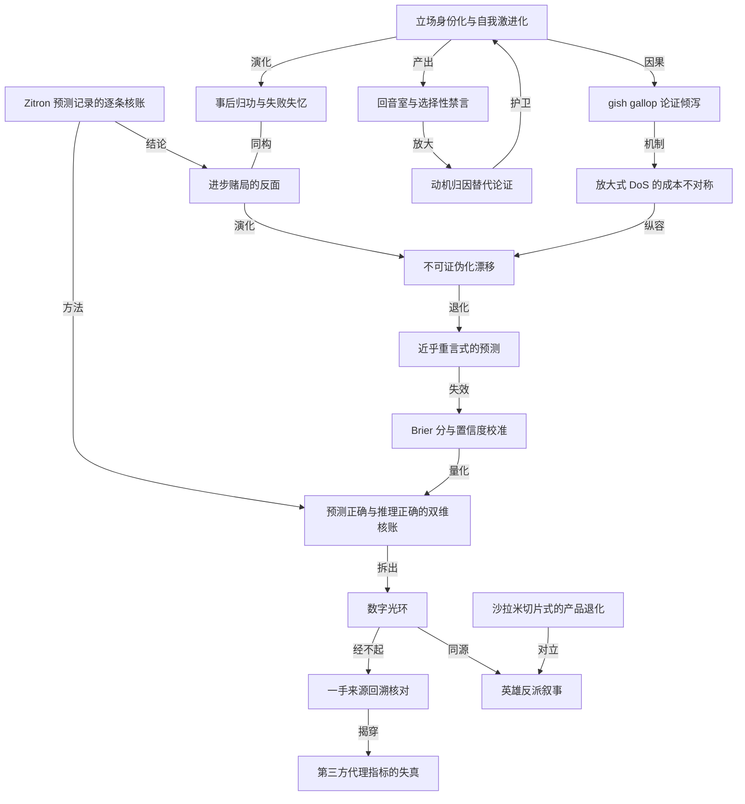

# danluu 逐条核账：最著名的 AI 唱空者说对了多少

- 原文标题：How accurate have Ed Zitron's AI skeptic predictions been?
- 作者：danluu.com
- 内参日期：2026-09-03
- 来源类型：blog
- 原文：https://danluu.com/zitron/
- 标签：理性思维, 商业

> 作者先交代自己既非多头也非空头的立场，然后把 Ed Zitron 的公开预测一条条拿出来对照实际结果。方法论比结论更值得学——他 2022 年也用同样的方式核过库兹韦尔那批未来学家。

## 导读

对 ai 唱空派的观点分析

## 核心观点

- 这是一次对 Ed Zitron（作者称之为「我见过的被引用最多的 AI 唱空者」）公开预测的逐条核账：从 2024 年 2 月到 2025 年 11 月的二十多条已裁决预测，结果几乎清一色是 Wrong。
- 但全文真正的靶心不是预测记录，而是推理质量。作者反复强调一个双维框架：一个人可以预测全错而理由完全合理，也可以预测全对而理由全错（后者可能有说不清的直觉，也可能只是运气好）。这两种情况都需要做困难的判断——而这次不必做，因为 Zitron「预测错，推理也错」。
- Zitron 的方法签名是「数字光环」：文章里数字抛来抛去，却连不成一个连贯论证，很多时候数字甚至不支持他自己的结论。作者的怀疑是，他依赖的正是读者「看到数字就眼睛发直，不去想数字意味着什么」。
- 唱空是「进步赌局的反面」：把无限进步换成零进步，每次被证伪就换一条相似预测、把日期往后挪一点。这个游戏可以玩几十年——Paul Ehrlich 玩了五十年。
- 更结构性的解释来自 Michał Zalewski：能长出追随者的立场必须清晰、强硬、不留余地；「市场两个方向都有可能」上不了播客。正反馈会让人自我激进化，到某个点观点不再是可被改变的观点，而成了身份和个人品牌。
- 作者对自己下手同样重：他坦白这篇文章几乎确定有多处错误，坦白写作动机是「睡了四小时、脑子干不了正经活」，并且拒绝接受「我的工作很扎实」这种自我评价——他连自己都不认为自己算扎实。

## 作者的起点：为什么这不是站队

- 动机很朴素：好奇「被引用最多的 AI 唱空者」的预测究竟兑现了多少，于是去看它们各自的落点。
- 立场自陈：他从没有过特别强的亲 AI 或反 AI 进步的立场。2022 年他做过一次对未来学家预测的全面复盘（包括 Kurzweil 这类受尊敬的人物），结论是他们在预测结果和推理上普遍都错；2015 年他又写过人们低估了 AI 替代人力的能力，并多次公开重申这一点。
- 他把自己的立场形容为「极其无聊」：**如果某件事正在发生，那些说它永远不可能发生的人，多半是错的**。
- 利益披露是刻意前置的一步，因为唱空阵营对反驳者的标准回击是「说 AI 不是骗局的人都是有利益的骗子」：
- 只通过宽基指数基金持有标准份额；有一些种子期投资，但因为时点和哪些公司做大了的缘故，这部分组合在 AI 上反而低配。
  - 不在 AI 实验室工作，也不在给 AI 实验室供货的公司工作。
  - 多年前他面试过某家 AI 实验室，电话筛选就挂了；他自嘲那种表现大概正是 Jeff Atwood 那篇「为什么程序员不会编程」所设想的——差到让人以为世上有很多假程序员。
  - 结论一句话：AI 做得好他不特别受益（除了持宽基指数的人都受益的那部分），但他在乎准确性。

## 解剖一个预测：「Meta、Google、微软是垂死的公司」

- 靶子是 Zitron 2024 年 11 月的一场演讲。他点名 Meta「是个垂死的产品，也算是一家垂死的公司」，又说「这些公司都不再真的知道该怎么增长了……在一个垂死生态里重新点燃增长的绝望中，科技业会把 AI 这坨东西塞进一切」，随后点名 Google 和微软。
- 用一手财报对表（口径统一为日历年，而非财年）：
- Meta：2023 年收入 1350 亿美元、增 16%，经营利润 470 亿美元、增 62%；2024 年 1650 亿、增 22%，利润 690 亿、增 48%；2025 年 2010 亿、增 22%，利润 830 亿、增 20%；2026 年上半年 1170 亿、增 30%，利润 420 亿、增 10%。
  - Alphabet：2023 年 3070 亿、增 9%，利润 840 亿、增 13%；2024 年 3500 亿、增 14%，利润 1120 亿、增 33%；2025 年 4030 亿、增 15%，利润 1290 亿、增 15%；2026 年上半年 2300 亿、增 23%，利润 800 亿、增 30%。
  - 微软：2023 年 2280 亿、增 12%，利润 1010 亿、增 21%；2024 年 2620 亿、增 15%，利润 1180 亿、增 17%；2025 年 3050 亿、增 17%，利润 1430 亿、增 21%；2026 年上半年 1730 亿、增 18%，利润 790 亿、增 19%。
- 作者的让步与判断：你可以硬说 Meta 正在死、只是还没死透，但那不合 Zitron 原话的精神；真正的问题是推理错了——以这种速度增长的公司，AI 不像是「不知道怎么增长了」才抓的救命稻草。
- 推理链的两处断裂（作者说这个模式很有代表性：他总是抓一些无力造成他所说的巨变的小问题）：
- Meta 侧：他没用 Meta 自己披露的 MAU，也没用收入或利润，而是用了 Similarweb 这类第三方追踪数据里的 Facebook MAU 下滑。作者的经验是这类第三方数字相当不准，除了粗略量级比较之外基本没用；而 Meta 自报数据里并没有这种持续下滑。
  - Google 侧：他把责任压在 Prabhakar Raghavan 一个人身上，称其「真的很坏」、是「投靠了管理咨询教派的计算机科学家阶级叛徒」，但从未可信地证明此人对搜索造成了严重损害；出面回应他那些咆哮的 Google 搜索工程师也不认同「Raghavan 是唯一甚至主要原因」这个假设。
  - 即使退一步承认搜索被搞坏了，也推不出 Google 收入增长有麻烦——YouTube 和 Google Cloud 都能撑增长。
- 反向让步是全文最见功力的一段：作者自己写过 Google 搜索质量有严重问题，也承认 Google 在长期抬高收入相对用户体验的优先级；2013 年他在 Google 时，这正是不少以用户为中心的工程师的心病。
- 他当年问过一位搜索工程师：既然有研究表明广告越像自然结果、用户越分不清，Google 为什么还要把广告底色改得更像搜索结果？对方的回答是，一次改到几乎一样是不可能的，因为太明显。
  - 真实路径是：每次 A/B 测试把广告往搜索结果的样子挪一点，每次都多赚不少钱，于是改动分成很多年、很多次，每一次都小到反对者难以立案。
  - 后来正如那位工程师所料地发生了。但它跟 Raghavan 是否掌管搜索无关；而且这种事让 Google 更赚钱——恰恰不是「增长见顶、绝望到要把 AI 塞进一切」的证据。
- 反派叙事的问题：Zitron 的标准招式是把局面变成英雄—反派故事（搜索这条线上英雄是 Ben Gomes、反派是 Raghavan）。作者形容这像是「他对公司如何运作的心智模型来自关于公司的电影」——电影会把事情简化成英雄反派、剥掉全部微妙之处，而真正参与过的人回头看关于此事的书，会发现主要因果根本没被识别出来，最关键的一些人甚至没被点名。

## Zitron 是怎么被引用的：数字当权威道具

- 引用方式很单一：人们援引他，是为了说「这个看过数字的人这么讲，所以我的说法有数字撑腰」。
- 只要你懂一点这个话题，就会发现那些主张说不通。但作者认为这不是重点——重点是「有人看过数字」这件事本身可以被当武器挥舞。
- 另一半吸引力是愤怒，而愤怒是很好的互动引擎。引用者当然不会说自己在引用愤怒，而是说：这人看过数字，而且他跟你一样对 AI 生气，数字还站在他那边。
- 作者读过的每一篇里，数字被抛来抛去，却接不成一个连贯论证，很多时候甚至不支持他自己的论点——比如从 Facebook 的 MAU 下滑推出 Meta 财务出问题、再推出 Meta 到处乱塞 AI。
- 双维评分框架在这里正式登场：同一份预测记录，可能来自合理但没兑现的理由；也可能预测全对而理由全错。这类判断本来很难做，而这次幸运地不必做，因为两个维度上他都错。

## 细节派的交叉验证

- Juho Snellman 的判断：他的文风的确花哨，但攻击性与脏话更像是给已经相信的人打气，而不是为了改变谁的想法；他找到了「反科技投机」这个生态位，并把它榨到极致。
- 关键的操作建议是「顺着链接追到一手来源」：他文中链接确实很多，但追到一手来源就会发现，原文说的和他暗示的很不一样，就书面文章而言「基本上一切都是编造或曲解的」。
  - 更重的一句：他的经济分析「绝对是垃圾」。Snellman 起初以为只是无能，但错误的偏向性高度一致，说明是有意的欺骗；难处在于每篇都是「一万词的 gish gallop」，认真反驳其中一处刻意错误，还会被抱怨回复太长。
- Timothy B. Lee 核对了 Zitron 用来推算 Anthropic 收入的表格，发现：不算 2 月 1 日到 10 日，把 3 月 1 日到 10 日算了两次，把 8 月 21 日到 10 月 21 日当成一个月，又不算 10 月 21 日到 11 月 1 日；另有评论者指出表里还出现了「2 月 30 日」。
- Zitron 据此算出 Anthropic 2025 年收入 36 亿美元，并暗示其中有猫腻；而把这些错误修正之后，数字本来就对得上。

## 预测清单：2024 年 2 月至 2025 年 11 月

- 能力与技术路线类（几乎清一色 Wrong）：
- 2024 年 2 月：「我认为我们正在触及生成式 AI 能做什么、输出能有多准的上限。」
  - 2024 年 3 月：「我们是否已经到达 AI 峰值？」——以幻觉为由断定进步止步于当时水平。作者注：这条在当时就站不住，把 AI 放进循环里跑到代码编译通过、测试通过，就能明显缓解幻觉的影响，而这类做法当时远未被广泛采用（那还是 codex、claude 这类会执行代码并检查测试的编码 agent 出现之前）。
  - 2024 年 4 月：「正如我此前警告的，人工智能公司正在耗尽数据。」作者注：这条当时也不成立——他不是 ML 出身，但别人一解释什么是 RL 环境，几分钟内他就想到了一堆生成合成数据的办法；任何人想几分钟都能想出很多在没有新数据的前提下改进模型的路径。
  - 2024 年 7 月：「生成式 AI 正在见顶，如果不是已经见顶的话。除了用一些新输入更快地做更多同样的事，它做不了更多。」同月又称模型既没有变得更节能，也没有以增加功能的方式变得更强。
  - 2024 年 8 月：「生成式 AI 是一项已经见顶的死路技术。」
  - 2024 年 9 月：「o1 表明 OpenAI 既绝望又没了主意」，并重申模型因缺数据而无法改进。
  - 2025 年 1 月：「我认为我们处在 AI 峰值」；以及「DeepSeek 已经把大模型商品化了」。
  - 2025 年 2 月：Orion 从 GPT-5 降级为 GPT-4.5，说明 OpenAI 造下一代模型撞了墙、只能压低预期——但 GPT-5 相对 GPT-4.5 是实质进步。
  - 2025 年 4 月：「到这个地步已经相当明显，生成式 AI 不会比今天做得更多。」
  - 2025 年 8 月：「这些模型显然已经撞上训练收益递减的墙。」
  - 2025 年 11 月：「高质量训练数据在耗尽、扩展律在撞墙，在这个训练范式里这些模型不会更好了。我们今天看到的差不多就是它们永远的样子。」
- 公司与财务类：
- 2024 年 6 月：OpenAI 增长停滞并将持续停滞，进而导致某种崩溃。作者判 Wrong 并补了一句——OpenAI 也许真会崩，但如果崩了，也不会是因为 2024 年的什么增长停滞。
  - 2024 年 10 月：OpenAI 关于 2024 年 37 亿、2025 年 116 亿、2029 年 1000 亿美元收入的预测「荒谬到我惊讶于说出口居然不算某种金融犯罪」——2025 年的目标已被超出。
  - 2024 年 10 月：「OpenAI 的收入增长已经在放缓，进入新年会急剧放缓。」
  - 2025 年 2 月：Anthropic 2027 年做到 345 亿美元收入「在很多层面上都很可笑，首要一条是 OpenAI 在 2024 年收入约为 Anthropic 两倍，同年 API 调用却勉强只做了十亿美元」——它 2026 年的 ARR 已远超该数字，使 2027 年的估计谈不上可笑。
  - 2025 年 2 月：Sundar Pichai 想让 Gemini 在 2025 年底前有 5 亿用户，「这个数字不现实到 Google 该开除某个人，而那个人就是 Sundar Pichai」——Gemini 到了 7.5 亿用户。
  - 2025 年 3 月：CoreWeave「我写这份通讯这些年里，很少见过这么烂的公司」，并断言除非融资否则活不过六个月，40 亿美元也许能买一年——公司仍在，股价是 IPO 价的两倍多，而且它 IPO 只募了 15 亿美元。
  - 2025 年 5 月：Cohere「我不知道你读完这个故事怎么可能不觉得它会死，他们的预测离现实太远」——技术上因为没有截止日期而不可证伪，但隐含的主张是错的。
  - 2025 年 7 月与 8 月：两度断言 Cursor 会死、会以贱卖价出手，连 100 亿美元都不值——Cursor 以 600 亿美元退出。
  - 2025 年 10 月：被问「你猜 AI 泡沫破裂的时间线是什么」，他答「不晚于 2026 年第二季度」。
- 两条形态特殊的条目：
- 2025 年 2 月：「我会一直写这些东西，直到我被证明错了。」作者判 Wrong——他被反复证明错了，却继续写。
  - 2025 年 4 月：他再一次喊泡沫，说「我们马上就会知道我对不对」。作者判 Wrong 的理由是，他暗示的重大事件即将发生并将证明他正确，而这样的事件并没有发生。
- 时间锚的消失：2024 年 8 月他重申「泡沫还有三个季度证明自己」之后说，「我现在意识到把事情挂到时间上并不特别有用（尽管我坚持我的预测），因此我认为更有用的是说明泡沫破裂的条件到底是什么」。此后带日期的表述明显变少，开放式、不可证伪的表述明显变多。
- 不只是前瞻错：他还持续做出「过去没有进步」这类当时就明显不实的回溯性陈述——2024 年 12 月「生成式 AI 的产品已经被困在琥珀里一年多了」，2026 年 1 月「模型跟一年前基本一样，效力相同」。把这些串起来，等于说 2026 年 1 月的能力等同于 2023 年 12 月（再串上更晚的表述，甚至等于说 2026 年 8 月的能力等同于 2023 年 12 月）。
- 计分口径的自律：作者只给已裁决的预测打分。像「通往 AGI 的进展永远不会发生」这种既模糊又无法可靠地判为正确的说法，以及「某公司迟早要加订阅」这种开放到永远可以往后推的说法，都不入清单。

## 与未来学家的横向对照

- 风格上，Zitron 比作者复盘过的任何一位未来学家都更依赖愤怒。
- 推理质量上，他大约是未来学家里的平均水平：错得几乎全面，却并不比 Buckminster Fuller 更不讲理——后者提出可以用无线电传送人，因为原子有频率、无线电波也有频率，所以把我们的频率接收下来发出去就行。
- 风格上最接近 Kurzweil：用数字营造一种可信度的光环，但只要你懂一点他谈的话题、或者真去看那些数字，推理就散架了。Kurzweil 也不断给出没兑现的极快进步预测，比如 2001 年预测 2011 年寿命将无上限。
- 关键判断：不断以错误理由预测进步会停止，只是把进步赌局押在了反面——不是无限进步，而是零进步。每次被证伪，就再来一条相似预测，把日期往后挪一点。
- Zalewski 的激励解释：
- 建立追随者最稳的办法是提出清晰、强硬、不留余地的立场；「市场两个方向都有可能」「两党都有道理」「AI 有些实质也有些炒作」这类话上不了播客和电视。
  - 这里存在正反馈：越挑衅越有关注和点赞，于是人会某种程度上自我激进化；到某个点它不再是一个可以被改变的观点，而成了身份、个人品牌。
  - 而更微妙的看法「最好没人理你，最坏两边都对你不屑」。
- 作者补的一点乐观：不靠极端立场、也基本不做标题党的博客同样能活。他的服务端统计显示上个月 51 万独立访客，而他只是偶尔想写才写；Simon Willison 用近乎标题党反面的风格，写出了他猜测是过去三四年程序员群体里读者最多的博客。

## 错误立场能维持多久：Ehrlich 的五十年

- 未来学家的通用退路：「我说的事有四分之一发生了，只是比我预计的慢了两到二十倍」；如果不那么执着于准确，还能把它取整成「我说会发生的事发生了」——反正没人真去看细节，这条路对他们一直很好用。
- Paul Ehrlich 是更极端的样本，Ronald Bailey 称他是「压不住的末日论者……据我所知，他关于迫近灾难的预测从没对过」：
- 1970 年首个地球日：「十年内海洋里所有重要动物都会灭绝，大片海岸线将因死鱼的恶臭而不得不撤离。」
  - 1971 年演讲：「到 2000 年，英国将只是一小群贫困的岛屿，住着大约七千万饥饿的人。」他还说如果自己是赌徒，愿意平赔赌英国在 2000 年不复存在。事后回应是：「预测未来会出错，错多少是另一回事。我要是打了那个赌会输。不过你仔细看看英国，我能说什么呢？他们也是一堆问题，跟大家一样。」
  - 《人口炸弹》里称印度不可能在 1980 年前多养活两亿人；1967 年他主张对「无望」的印度切断紧急粮援。随后印度靠绿色革命把粮食产量拉了上去，人口翻倍而人均热量摄入显著上升。
  - Dan Gardner 在《Future Babble》里的判断：Ehrlich 对自己的错误既不够坦率，在邀功时又不诚实或回避——很少承认在物资短缺、饥荒死亡人数（某本出版物里高达十亿）和具体国家灾难上的错判，却乐于把艾滋病和全球变暖算成自己「预测」到的；Gardner 认为这是典型的认知失调，而这种不承认明显错误的姿态让他当下的思考同样可疑。
- 最惊人的是续航：1968 年《人口炸弹》之后，1990 年又出《人口爆炸》，本世纪、本十年仍在重复同一套主张；2015 年谈及 1968 年那本错书时他说「我今天的语言只会更末日」。他今年去世，作者说看起来这是他不再这么讲的唯一原因。
- 作者原以为这类人的晚年说法会是「我有些地方错了，但正因为我的工作促成了行动，危机才被避免」，结果是「你等着，危机正在发生，我马上就要被证明是对的」——这正是 Zitron 的模式。他的调侃：也许我们会得到再五十年的 Zitron 预测 AI 进步终结。

## gish gallop 与放大式 DoS

- gish gallop 指的是用便宜（生产成本极低）的胡话把人淹没，多到没人愿意花时间去逐条反驳。
- 成本不对称有实测：仅仅详细讨论那场演讲中的一小段，作者就花了一千多词解释 Zitron 对公司如何运作的理解错在哪；而读者仍然可以说「但你没处理 X」——这是真的。
- 他第一次看那场演讲时 90 秒就关掉了标签页，因为胡话密度高到不值得往下看。他说自己能就前 90 秒写五千词；手头有全部事实的情况下，反驳 90 秒要花 30 到 60 分钟，需要查证则要两三倍时间。
  - 这与放大型 DoS 攻击性质相同：制造新胡话极便宜，反驳则要花力气。判断力好的人看到这种东西通常直接把人划掉、不再关注；而另一些人会看到有人反驳了一批点，然后说「但你没反驳 X」，反驳者应付几轮后终归放弃。
- 朋友的第一手观感（作者提到自己在写这篇时对方主动说的）：听那场播客时心率一直在往上走——他抛出一个假陈述，讲理的主持人追问「那 X 怎么说」，然后话头就跳到下一个假陈述；讲到大模型过去一年没什么长进，主持人说人们在用、确实好了很多，Zitron 否认并反问「是吗？」，主持人只能说「是的……」，对方于是退出了那场收听。
- 一个顺带的观察：作者把这段口述引语丢给 ChatGPT 让它找出是哪场访谈，模型定位到了对应访谈以及每句话的时间戳——而且找到不止一场，因为这是 Zitron 相当常见的问答模式。
- 关于愤怒本身，作者有个反直觉的判断：在视频里他并不真的显得愤怒。他确实说自己很生气、确实骂人，但语调、表情、肢体、动作方式都不像。作者的解释是，愤怒的定位在文字里更管用，因为脏话、说自己生气、表达轻蔑、羞辱他人已经是文字里最好的愤怒线索；一旦有了音频和视频，这些就成了弱线索，强线索跟不上，人就显得只是在演愤怒。

## 置信度：记录真正难看的地方

- Zitron 的措辞置信度极高：OpenAI 的收入预测「荒谬到我惊讶于说出口居然不算某种金融犯罪」；Gemini 的用户目标「不现实到 Google 该开除某个人，而那个人就是 Sundar Pichai」——后一条实际被超额 50% 完成，而他的主张是根本不可能达到。
- 作者的自我对照：他自己做过不少预测，也错过不少；真正在做预测时他会给自己标注置信度，以便回看校准得如何。他从没有在接近 Zitron 那种置信度的预测上错过。以那样的措辞置信度，哪怕错一条都说明极度过度自信；而 Zitron 在修辞上几乎是最高置信度的预测上反复出错。
- 内部矛盾的一个样本（Dennis Snell 指出）：如果认真对待「Google 不知道怎么增长、所以到处塞 AI」这句话，那么 Google 想让 Gemini 的用户数到多少就能到多少——正是靠做 Zitron 说他们会做的那件事。你不能同时认真对待这两句话。作者说这类彼此接不上的陈述在他的演讲和写作里随处可见，唯一把它们串起来的东西是「AI 公司、用 AI 的人和公司都是邪恶的、坏的」。
- 他第一次停下那场演讲的位置也很能说明问题：「一个痴迷于同比收入增长的市场。这个演进是自然的。它很可怕。你可以怪 Marc Andreessen。他是个可怕的人。你可以怪很多可怕的男人。眼下有太多男的值得生气了。」作者说最后一句正好概括了他的位置——现实里如果 Andreessen 从没存在过，Meta、Google 和微软几乎肯定还是会追求增长。
- 作者对 reddit 版「打脸清单」的反向审视，是全文方法论最硬的一段：
- 其中一条「OpenAI 会在 12 到 24 个月内崩溃」被当作打脸证据，但 Zitron 的原话是 OpenAI 要么崩溃、要么再融一大笔钱，而它确实融到了钱。作者不同意他「这只是把崩溃推后」的暗示，但那条预测本身并未被证伪，所以本文不计入。
  - 不计入的更深理由是：这类预测近乎重言式。「一家活着的公司会覆盖成本；覆盖不了就去融资；融不到就关门或被收购」——一条说「OpenAI 要么覆盖成本要么覆盖不了」的预测什么也没说，可以以 99.9% 以上的置信度作出。
  - 用 Brier 分这类打分法看，近乎重言的高置信正确预测几乎不贡献任何分数，只有在它们出错时才有影响。而 Zitron 在他给出最高置信度（按措辞，作者估计其中不少相当于「六个 9」以上）的预测上反复出错，所以在任何这类打分机制下，他的记录都非常差。
  - 汇总指标甚至还低估了问题：假设他做出无限多条 99.99% 的近重言正确预测，把其余预测的分数彻底冲淡，你对他那些非重言预测（AI 进步已终结、AI 公司必然崩溃并拖垮大科技公司）依然应该有零信心——而人们谈论的恰恰是后者。
- 作者也说清了自己的兴趣边界：即便 Zitron 将来在某家公司崩掉这件事上说对了，相对于能力如何发展这件事，那对他并不有趣；而在能力这条线上，他至今全错。

## 辩护者的四种招式，以及作者的自我约束

- 作者自称受虐狂，去读了大量关于 Zitron 的讨论（他相信自己读完了 HN 和 lobsters 上每一场主要讨论），归纳出几种反复出现的辩护：
- 招式一：「你反驳了一些点，但你没覆盖 X。」
  - 招式二：「人们攻击他只是因为他的风格，从来不回应他的论点，这就说明了一切。」但按时间戳看，同一讨论串里往往早已有人在讨论 Zitron 的具体错误，辩护者对此视而不见。作者说这本身就是很 Zitron 式的动作，而喜欢这种风格的人会用同一种动作，这很合理——毕竟谁会觉得 Zitron 有说服力？觉得这种推理有效的人。
  - 招式三：直接否认他说过被反驳的话。当有人指出他在 2024、2025 年反复公开表示大模型因根本性原因无法再提升时，辩护者会说他从没这么讲过；对更早的预测和事实错误也是同一套。
  - 招式四：「那那些说错话的 AI 吹捧者呢？」作者写过三万四千词论证一批最受尊敬的未来学家不仅预测错、方法和推理也错；但一堆吹捧未来的人错了，并不让 Zitron 或 Ehrlich 少错一分——他们的错误与那些未来学家是否存在无关。
- 关于未来的立场：即便真出现大崩盘、OpenAI 和 Anthropic 归零，甚至再叠加某个事件让模型进步停在各实验室内部现有水平，社会层面仍会有相当程度的改变。哪家公司成功只改变谁变富，不改变当前和下一代模型能力所带来的变化是否发生。
- Zitron 的自辩（作者搜索时发现 reddit 上关于他的第二热门结果就是他自己的评论）：有些男人不喜欢他，是因为情绪诚实和内省对他们很难；他没走「你该走的那条路」——大媒体写手、分析师、金融；他的工作「很扎实」，这让工作不扎实的人难受。作者的回应有两层：
- 他自己的工作常被正面引用为严谨扎实，但他不知道有谁说过因为「太扎实」而讨厌它，而且他会很意外世上有人偷偷因为扎实而讨厌一件事——这不像是人们讨厌东西的理由。
  - 更重要的是，他本人并不认为自己的工作算扎实。跟 Gary Bernhardt 这种他认为真正扎实的人比，自称扎实会让他觉得自己像个招摇撞骗的人；他做一定量的核查，时间未必比别人多，但方法与时间的组合大概比平均有效；他强迫自己在「高于平均但远够不上扎实」的程度上发表，因为可以永远查下去、永远发不出来。他的收尾一句是：然而看起来，我的事实核查流程还是比 Zitron 扎实得多。
  - 附带一条社群观察：在他的 subreddit 上贴任何显示 AI 变好的东西（比如基准测试链接）就会被封，于是形成了高度小圈子化的回音室。
- 作者对本文的自我约束，是这篇最值得学的写作伦理：
- 他几乎确定这篇文章有多处错误。读一长串错误推理之后很难不变得草率——就像在编译器有 bug 的系统上写代码，久了会条件反射地想「这大概是编译器的 bug」，而偶尔那真的是你自己的 bug；这里的问题更严重，因为编译器基本还是能用的，而这类文本是被胡话持续淹没、偶尔才冒出一个准确的好观点。
  - 要把这件事做好，要么找一个耐受力异常高的人，要么组一支独立评分的团队——但既然表层阅读就足以看出这些人基本全错，谁会愿意花那种力气。
  - 他请 ChatGPT（Pro 网页版）和 Claude（网页版 Fable 5）对本文做事实核查，两者都找到了一些小错误并在发表前修掉。一年前这类核查几乎没用，现在算勉强能用，而且——与 Zitron 的判断相反——他预期它们会继续变好。这次 ChatGPT 比 Claude 更彻底、找到的错误更多且覆盖了 Claude 找到的全部，但也过于热心：把玩笑话判为错误，还要求把一些大体为真的说法改成更字面的表达，并配上 AI 味的文本。
  - 写这篇的动机同样被坦白：睡了四小时、脑子干不了正经活，恰好看到有人贴了 reddit 上打脸 Zitron 预测记录的截图。他担心那份清单的选样有偏（AI 已成文化战争议题，选出有偏样本毫不奇怪），所以自己去读了一些 Zitron。他的结论是那位 redditor 并没有特别挑烂的预测，只是挑了些听起来更荒唐的；而真正更大的问题始终在推理，不在清单。

## 概念网络

### 关键概念

#### 预测正确 × 推理正确的双维核账

**context**：全文的方法论骨架。作者反复说明，同一份预测记录可能来自「合理但没兑现的理由」，也可能来自「理由全错却蒙对」——后者的人也许有说不清的直觉，也许只是运气好。评价一个预测者本来需要在这两维上分别下判断，这是很难的判断；而 Zitron 的特殊之处是「预测错，推理也错」，于是这个难题被绕开了。

**费曼一下**：看别人预测准不准，其实要看两件事：结果对不对，以及他凭什么这么说。只看结果，蒙对的人会被当成先知，说得有道理但时运不济的人会被当成笨蛋。把两件事分开看，你才知道这个人下一次值不值得听。

#### 数字光环

**context**：作者对 Zitron 方法的核心刻画——文中数字很多，但数字与论证不接榫，很多时候甚至不支持他自己的结论（比如从 Facebook 的 MAU 下滑推出 Meta 财务出问题、再推出 Meta 到处乱塞 AI）。作者怀疑他依赖的正是读者「看到数字就眼睛发直，不去想数字意味着什么」；引用者的用法也印证了这点——重点不是能从数字里理解什么，而是「有人看过数字」这件事本身可被当作武器。

**费曼一下**：数字给人一种「已经算过了」的踏实感，所以把数字堆在文章里，就等于借来一层权威外衣。但堆数字和用数字论证是两回事：真正的检验是抽掉数字之后，那条推理链还站不站得住。

#### 一手来源回溯核对

**context**：Juho Snellman 给出的具体操作建议——Zitron 的文章里链接确实很多，但顺着链接追到一手来源，就会发现原文说的和他暗示的很不一样。同一原则在 Timothy B. Lee 核对 Anthropic 收入表格时兑现：逐格看下去才发现漏算、重算、并月和「2 月 30 日」。

**费曼一下**：有链接不等于有证据。判断一段说法可不可信，最省事的办法就是随手挑一两条最打动你的，一路点到源头去看原话——大多数曲解都活在「没人会去点」的假设里。

#### 第三方代理指标的失真

**context**：Zitron 用 Similarweb 这类第三方追踪数据里的 Facebook MAU 下滑来支撑「Meta 是垂死公司」，而不用 Meta 自己披露的 MAU、收入或利润。作者的经验是这类第三方数字相当不准，除了粗略量级比较之外基本没用，而一手数据里并不存在那种持续下滑。

**费曼一下**：外部估算的流量、装机、活跃数是「远处望过去的影子」，用来判断量级还行，用来判断涨跌就会误导。手边明明有公司自己公布的数字，却挑一个更松的代理指标来用，通常说明这个人要的不是真相，是想要的那个方向。

#### 英雄—反派叙事

**context**：作者点名的 Zitron 标准招式——把 Google 搜索的问题变成 Ben Gomes（英雄）对 Prabhakar Raghavan（反派）的故事。作者形容这像是「对公司如何运作的心智模型来自关于公司的电影」，并补充说，凡是被写成书或拍成片的商业事件都会被简化成英雄反派、剥掉全部微妙之处，真正的主要因果往往没被识别，最关键的一些人甚至没被点名。

**费曼一下**：把复杂的组织变化归到一个坏人头上，读起来爽，也好记，但它几乎一定是错的。大公司的走向是无数人、无数次小决策和一整套激励共同推出来的结果。听到「都是那个人干的」，先打个折。

#### 沙拉米切片式的产品退化

**context**：作者用 2013 年在 Google 的亲历给出了真实机制——广告底色不可能一次改到与自然结果几乎一样，因为太明显；真实路径是每次 A/B 测试把广告往搜索结果的样子挪一点，每次都多赚钱，改动分成很多年很多次，每一次都小到反对者难以立案。这件事后来确实发生了，但与谁掌管搜索无关，而且它让 Google 更赚钱——恰恰不支持「绝望」的叙事。

**费曼一下**：让一个产品慢慢变差，很少靠一次大改，而是靠一连串各自都能被数据证明「有收益」的小改。每一步都不足以引发反对，合起来却完成了当初谁也不会批准的那件事。看长期趋势，别只看单次改动。

#### 进步赌局的反面

**context**：作者对 Zitron 与 Kurzweil 关系的判断——不断以错误理由预测进步会停止，只是把进步赌局押在了反面：不是无限进步，而是零进步。玩法完全对称：每次被证伪，就再来一条相似预测，把日期往后挪一点。

**费曼一下**：狂热的乐观和斩钉截铁的唱衰，其实是同一种赌博的正反两面：都用一句无条件的话替代对具体机制的判断。区别只在于赌哪一边，以及输了之后是把日期往前挪还是往后挪。

#### 不可证伪化漂移

**context**：2024 年 8 月重申「泡沫还有三个季度证明自己」之后，Zitron 说「把事情挂到时间上并不特别有用（尽管我坚持我的预测）」，此后带日期的表述明显变少、开放式表述变多。作者也据此把 Cohere「必死」这类没有截止日期的说法标为技术上不可证伪。文章的计分口径同样排除了「AGI 永远不会到来」这类既模糊又无法可靠判为正确的说法。

**费曼一下**：一个人预测老是落空之后，往往不是改结论，而是悄悄拆掉截止日期——从「今年之内」变成「迟早」。没有日期的预言永远不会输，但也就永远不值钱。看一个预测者，先看他还敢不敢给时间。

#### 近乎重言式的预测

**context**：作者拒绝把「OpenAI 会在 12 到 24 个月内崩溃」计入打分的理由。Zitron 的原话是要么崩溃、要么再融一大笔钱，而它确实融到了钱，这条并未被证伪。更深的理由是：一家活着的公司会覆盖成本，覆盖不了就融资，融不到就关门或被收购——「要么覆盖成本要么覆盖不了」这种预测什么也没说，可以用 99.9% 以上的置信度作出。

**费曼一下**：有些预言听着挺大，其实穷举了所有可能：「要么涨要么跌」「要么撑住要么撑不住」。它永远会应验，但没告诉你任何事。判断一条预测有没有含量，先问它排除了什么——什么都没排除，就等于什么都没说。

#### Brier 分与置信度校准

**context**：作者衡量预测记录的工具。他自己做预测时会附上置信度以便回看校准，而且从没在接近 Zitron 那种置信度的预测上错过。Zitron 的措辞置信度极高（「不算某种金融犯罪我很惊讶」「那个人就是 Sundar Pichai」，作者估计不少相当于「六个 9」），却反复出错；在 Brier 这类打分下，近重言的高置信正确预测几乎不贡献分数，只有出错时才有影响，因此他的记录非常差。

**费曼一下**：说「我七成把握」和说「这事绝不可能，谁说会发生谁该被开除」，输了要付的代价完全不同。给自己的判断标个把握度，事后回头对一遍，你就知道自己是稳还是虚。在近乎断言的地方错一次，已经足够说明问题。

#### gish gallop（论证倾泻）

**context**：Snellman 用来形容 Zitron 每篇文章的词，作者用它命名了全篇的核心结构问题——用便宜到近乎零成本的胡话把人淹没，多到没人愿意花时间逐条反驳；认真反驳其中一处刻意错误，还会被抱怨回复太长。

**费曼一下**：一个人一分钟能抛出十个站不住的说法，你要认真拆掉其中一个就得花半小时。于是场面上他永远显得「有很多论据」，而反驳者永远只回应了一小部分。这不是他更有道理，是他说得更快。

#### 放大式 DoS：生产与反驳的成本不对称

**context**：作者对 gish gallop 的机制解释，也是他的实测——详解那场演讲的一小段就花了一千多词，而读者仍可以说「你没处理 X」；他第一次看 90 秒就关了标签页，并说自己能就那 90 秒写五千词，反驳这 90 秒需要 30 到 60 分钟，查证则要两三倍。判断力好的人因此直接把人划掉不再关注。

**费曼一下**：这跟网络上的放大攻击是同一种数学：攻击方发一个小包，防守方要付出几十倍算力去处理。信息场上也一样——制造噪音的成本远低于清理噪音的成本，所以噪音永远在数量上赢。别把「没人逐条反驳」当成没人能反驳。

#### 动机归因替代论证

**context**：作者刻意前置利益披露的原因——唱空阵营对反驳者的标准回击是「所有说 AI 不是骗局的人都是有利益的骗子」。他因此逐条交代持仓、投资、雇佣关系，甚至自嘲当年面试 AI 实验室挂在电话筛选，然后收束到一句：我不特别受益，但我在乎准确性。

**费曼一下**：「你这么说是因为你有利益」是一种不用碰论点就能打赢的话术。利益当然值得警惕，但它只是提示你去查证据，不能替代查证据。反过来，把动机说清楚也不能替对方省掉论证——两边都得回到事实上来。

#### 立场身份化与自我激进化

**context**：Michał Zalewski 对这类现象的激励解释，作者引为全文的结构性答案——清晰、强硬、不留余地的立场才长得出追随者；中庸表述上不了播客，还会两边都得罪。挑衅带来关注和点赞，形成正反馈，人会某种程度上自我激进化，到某个点观点不再是可被改变的观点，而成了身份和个人品牌。

**费曼一下**：一开始只是一个看法，被夸多了就成了人设，人设一旦立住，改口的代价就变成了否定自己。这也是为什么公开表态越强硬的人越难纠错——他要撤的不是一句话，是一个身份。

#### 事后归功、失败失忆

**context**：Dan Gardner 对 Paul Ehrlich 的判断，也是作者拿来给 Zitron 定位的历史坐标——Ehrlich 很少承认在物资短缺、饥荒死亡人数和具体国家灾难上的错判，却乐于把艾滋病和全球变暖算成自己「预测」到的。同样的姿态还包括未来学家把「四分之一的事发生了，只是慢了两到二十倍」取整成「我说会发生的事发生了」。

**费曼一下**：只记得自己蒙对的那几条、忘掉说错的那一堆，是最容易发生也最难自查的偏差。破解办法只有一个：预测当时就写下来，事后一条条对。不肯回头对账的人，他的准确率永远只存在于他的记忆里。

### 概念网络

这张网络的入口是「逐条核账」这个动作本身。作者没有把它做成一份对错清单，而是把它拆成**双维核账**：预测的落点是一维，支撑预测的推理是另一维。这个拆分决定了全文其余部分的走向——因为一旦承认「理由合理但没兑现」和「理由荒唐却蒙对」都可能发生，评价一个预测者就必须同时看两维，而这次两维同时失守，才使结论不需要任何精细的裁量。

第一维的失守由一串彼此咬合的机制构成。**数字光环**是表层症状：数字被大量抛出，却与论证不接榫。它经不起**一手来源回溯核对**这一道最朴素的检验——顺着链接追到源头，就会发现原文说的与暗示的不是一回事，而这道检验同时**揭穿**了**第三方代理指标的失真**：放着一手财报不用、去取 Similarweb 的 MAU，本身就是选择性取数的证据。与数字光环同源的是**英雄反派叙事**：两者都是把「看起来像解释的东西」放在真解释的位置上。它的对照物是作者亲历的**沙拉米切片式产品退化**——真实机制是多年的小步 A/B 测试，每一步都因为多赚钱而通过，这个机制与「某个反派毁掉了搜索」直接对立，而且它指向的结论恰好相反：这类改动让公司更赚钱，不是绝望的证据。

第二维的失守则沿另一条链条演进。核账在结果上指向**进步赌局的反面**：以错误理由持续预测停滞，其实是与狂热乐观对称的同一种赌博。这种立场被证伪之后不会被放弃，而会**演化**成**不可证伪化漂移**——撤掉时间锚，把「三个季度之内」换成条件式的开放表述。漂移到极致就**退化**成**近乎重言式的预测**：「要么覆盖成本要么去融资」这类穷举了所有可能的话。而重言预测恰恰是**Brier 分与置信度校准**这套工具最能识别的东西——它们几乎不贡献分数，真正决定记录好坏的是那些以最高置信度给出却出错的判断。校准这一环又反过来**量化**了双维核账：把「他常常说错」变成「他在自称几乎不可能出错的地方反复出错」，这才是记录难看的确切位置。

网络的第三块解释的是「为什么这套东西能持续存在」，它的枢纽是**立场身份化与自我激进化**。挑衅带来关注、关注带来更强的挑衅，这个正反馈是**gish gallop** 的成因：把观点变成身份之后，产出的目标不再是说服，而是持续供给认同，于是低成本内容被大量生产。gish gallop 的运行机制是**放大式 DoS 的成本不对称**——制造比反驳便宜一到两个数量级；而这种不对称反过来**纵容**了不可证伪化漂移，因为没有人有余力去追究每一条被悄悄撤掉时间锚的旧预测。身份化还**产出**了**回音室与选择性禁言**（贴基准测试就被封），回音室又**放大**了**动机归因替代论证**这种最省力的防御姿态——「说 AI 不是骗局的人都是有利益的骗子」既不用碰论点，又能**护卫**身份不受事实冲击。最后，身份化在时间维度上**演化**为**事后归功与失败失忆**，Ehrlich 五十年的样本说明这套姿态可以稳定运转半个世纪；而它与进步赌局的反面**同构**——两者都是用一句无条件的话替代对具体机制的判断，因此都能在被现实一次次否定之后原样重启。

## 费曼 x3

判断一个人值不值得听，最省力也最容易出错的办法，是看他说对过几次。真正有用的办法要费劲得多：把「结果对不对」和「凭什么这么说」分开看。这两件事拆开之后，世界上就多出两种人——理由扎实但没蒙对的人，和理由荒唐却撞上的人。前者下次仍然值得听，后者下次一文不值。绝大多数关于预测者的争论之所以吵不出结果，是因为吵的人只带了一把尺子。

顺着这把双尺看下去，最著名的 AI 唱空者的问题就不在于他错得多，而在于他的数字与他的结论根本接不上。数字很多，链接也很多，但顺着链接追到一手来源，会发现源头说的和文章暗示的不是一回事；放着公司自己披露的收入利润不用，偏去取第三方追踪工具估算的活跃用户下滑——这不是取数偏好，这是选择性取数。更深一层的问题是叙事形状：把一家公司的搜索质量下滑归到某个「阶级叛徒」头上，那种心智模型不来自公司，来自关于公司的电影。真实机制其实更平淡也更可怕：每一次 A/B 测试把广告调得离自然结果近一点，每次都多赚钱，改动分成很多年很多次，每一次都小到反对者立不了案。没有反派，只有一串各自合规的小决定。

值得单独拿出来的，是唱空与吹捧其实是同一种赌博的正反两面。不断以错误理由预测进步会停止，就是把无限进步换成零进步，玩法完全对称：被证伪就再来一条相似的，把日期往后挪一点。而当挪日期也开始尴尬，下一步就是撤掉日期——「我意识到把事情挂到时间上并不特别有用」。一条没有截止日期的预言永远不会输，也永远不值钱。再往下退一格是穷举式的说法：一家公司要么覆盖成本、要么去融资、融不到就关门。这种预测必定应验，却什么也没说。所以真正的检验从来不是「说对了吗」，而是「排除了什么」。

还有一个更让人不安的层面：置信度。说「我七成把握」和说「这个数字不现实到 Google 该开除某个人，而那个人就是 Sundar Pichai」，输掉时要付的代价完全不同——何况实际结果超额了五成。以那样的措辞下注，错一次就足以说明极度过度自信，而这类错误是反复发生的。给自己的判断标上把握度、事后一条条回头对账，是把预测从表演变回工作的唯一办法；不肯对账的人，他的准确率只存在于他自己的记忆里。

最后是这套东西为什么能长期存在。清晰、强硬、不留余地的立场才长得出追随者，中庸的看法最好没人理你、最坏两边都对你不屑；挑衅带来关注，关注带来更强的挑衅，观点于是慢慢变成身份和个人品牌——到那一步，改口要撤的不是一句话，而是一个人设。配套的还有成本不对称：一分钟能抛出十个站不住的说法，认真拆掉其中一个要半小时，于是「没人逐条反驳」被当成了「没人能反驳」。这条路可以走很久——上一个玩了五十年的人，直到去世那年还在说自己的语言应该更末日一些。

所以这篇核账里最锋利的部分，其实是作者对自己下的手：他坦白写作动机不过是睡了四小时干不了正经活，坦白这篇几乎确定有错，因为读一长串错误推理之后很难不变得草率——就像在有 bug 的编译器上写久了代码，会条件反射地怪编译器，而偶尔那真的是你自己的 bug。他还拒绝接受「我的工作很扎实」这种自我评价，理由是跟他心目中真正扎实的人比，这么说会让他觉得自己像个骗子。这是全篇最值得带走的东西：所有对别人推理的检验，都得先有一份对自己同样刻薄的清单。

## 阅读原文

I was curious how well the predictions of the most widely cited AI skeptic I've seen (Ed Zitron) have done, so I looked at how his predictions panned out. To disclose my own biases, I've never had a particularly strong pro or anti AI progress position. For example, [in 2022, I did a comprehensive look at predictions Futurists made, including well-respected folks like Kurzweil](https://danluu.com/futurist-predictions/) and found them to be generally wrong on both the prediction results as well as the reasoning. On the flip side, [in 2015, I wrote about how people were underestimating AI's ability to displace humans in jobs](https://danluu.com/customer-service/) and have repeatedly been on the record as saying that many people are underestimating AI's ability to displace humans from jobs. My position on AI has been extremely boring and is basically, "if something is currently happening, the people who are saying that it's impossible that it will ever happen are probably wrong".

One comment I've seen from a lot of AI skeptics when someone responds to an AI skeptic is that all of the people who are saying that AI isn't fake are self-interested liars. Personally (to my obvious detriment), I have no particular financial interest in AI companies. I own whatever the standard share of them is via boring index funds. I have some seed stage investments, but just due to the timing and what's gotten big, that part of my portfolio is underweight on AI. I don't work at an AI lab or a company that supplies AI labs. I've mentioned being hilariously bad at interviews before, and I did interview at an AI lab a number of years ago and failed the phone screen in a performance that was the kind of performance that must've inspired Jeff Atwood's famous [Why Can’t Programmers... Program?](https://blog.codinghorror.com/why-cant-programmers-program/) where he concludes that there must be a lot of fake programmers out there because nobody could fail a coding interview that badly if they knew how to program. I don't benefit in any particular way if AI does well, except insofar as anyone who holds broad index funds benefits, but I do care about accuracy.

### 2024: Meta, Google, and Microsoft are dying

Because there are quite a few prediction results, let's look at one in detail before the complete list to get an idea of the kind of reasoning Zitron uses. We'll arbitrarily look at [this November 2024 talk where Zitron says, among other things, the major tech companies (like Meta and Google) are dying and they're thrashing around on AI because they don't know how to grow](https://www.youtube.com/watch?v=7Slib2bbMs4).

Zitron specifically named Meta as a company that's dying ("it's a dying product, and it's kind of a dying company"). Meta's revenue and profit (GAAP operating income) have been

PeriodRevenueProfit

Amount%Amount%

2023$135B16%$47B62%

2024$165B22%$69B48%

2025$201B22%$83B20%

First half 2026$117B30%$42B10%

When he talked about companies not knowing how to grow ("none of these companies anymore really know how to grow ... in the desperation to try to reignite growth in a dying ecosystem the tech industry is going to shove this [AI] shit into everything"), he named Google and then Microsoft. Alphabet (Google's parent company) has had the following revenue and profit numbers:

PeriodRevenueProfit

Amount%Amount%

2023$307B9%$84B13%

2024$350B14%$112B33%

2025$403B15%$129B15%

First half 2026$230B23%$80B30%

And Microsoft's numbers have been (note that, for consistency, all numbers are calendar year numbers and not fiscal year numbers):

PeriodRevenueProfit

Amount%Amount%

2023$228B12%$101B21%

2024$262B15%$118B17%

2025$305B17%$143B21%

First half 2026$173B18%$79B19%

Although this wouldn't be in the spirit of Zitron's statement, one could argue that Meta is actually dying, it just hasn't died yet. However, the reasoning in Zitron's argument is incorrect here—the Meta, Google, and Microsoft ecosystems are not dying. Given how fast these companies are growing (in terms of revenue and profit), it doesn't seem that AI is, as Zitron implied, some kind of desperation move they're reaching for because "they don't know how to grow" and are all out of ideas. I don't think it's worth spending this much text on each prediction, but the pattern Zitron used here is illustrative.

To make the case that these things are dying, he pulls on minor issues that are not positioned to cause the very large changes he suggests are about to occur. For Meta, he cited some kind of alleged MAU drop for Facebook. Rather than use Meta's own MAU figures or any kind of revenue or profit numbers, he seems to have used numbers from Similarweb. My experience with 3rd party tracking numbers like this is that they're quite inaccurate and generally useless for anything other than a rough order of magnitude comparison, making the Zitron's cited decline meaningless (Meta's reported numbers show no such sustained decline).

For Google, he cites Prabhakar Raghavan, who he calls truly evil and "a computer scientist class traitor that sided with the management consultancy sect", as having done some kind of grievous damage to Google search. In his rants about Raghavan, he never credibly establishes that Raghavan is doing severe harm to Google search, and the [Google search engineers who've commented on his rant don't seem to agree with the Raghavan as sole or even major reason for search issues hypothesis](https://news.ycombinator.com/item?id=40133976).[(1)](#footnote-H)

But even if we posit that Zitron is right and the villain Prabhakar Raghavan defeated the hero Ben Gomes, causing some kind of issue for Google search, this still doesn't make the case that Google revenue growth is in trouble at large because they have a number of other major products (such as YouTube and Google Cloud) that could drive growth even if search wasn't growing.

Every significant part of the chain of reasoning here is not only incorrect, it's not plausible if you know anything about Google or big companies in general. I'll be the first person to say that [Google search quality has some serious problems](https://danluu.com/seo-spam/) and that Google has been increasing the relative priority of revenue over the user experience over time. This was a source of consternation for a number of user-focused engineers at Google when I was there in 2013.

For one of the issues Zitron cites, ads being confusing to users, in 2013, I asked a search engineer about Google changing the background color of ads to look more like search results because there was a previous study that showed that more an ad looked like a search result, the more users got confused over whether a result was an ad or a real search result, and I'd heard that Google deliberately made the ads not look like search results to avoid user confusion. The search engineer said that because some people didn't want users to get confused, it was impossible to make ads nearly identical to search results in a single change because it would be too obvious what's going on.

The way this was going to happen was that every time you A/B test tweaking ads to look a bit closer to search results, you make a lot more money, so the change would happen over multiple years in multiple parts, each small enough that the people who want to fight back against this kind of thing would have a hard time making a case. That happened just as this engineer predicted, but it was going to happen whether or not Raghavan ended up overseeing search. And, of course, that kind of thing happening doesn't cause Google to run out of room to grow and become desperate to reignite growth in a dying ecosystem. Whether or not you think Google should do it, it's something that makes Google more money.

### How do people cite Zitron?

From what I can tell of how people cite Zitron, they cite him as an authority so they can say that this guy who looked at the numbers has made this claim, so their claim is backed up by the numbers. It turns out that if you look at the claims Zitron makes and know anything about the topic, the claims don't make sense, but I don't think that's the point. The point is one can say that someone looked at the numbers. The other point seems to be that this guy is angry[(2)](#footnote-V), which is a good way to drive engagement.

But when people bring him up, they're of course not generally citing his anger; they're saying here's this guy who's looked at the numbers and, if you're angry about AI, he's right there with you being angry about AI, and he's got numbers on his side.[(3)](#footnote-S) Like I said above, I don't want to go into this level of detail on each claim; this is just an illustrative example about how the claims below look. For any of his posts that I read, while there are numbers thrown around, the numbers don't actually connect to a coherent argument. In many cases, as we saw above, the numbers don't even really support his argument (such as an MAU decline in Facebook causing Meta financial problems which would then cause Meta to spuriously insert AI in places it doesn't belong). I suspect he's relying on people's eyes glazing over when they see numbers and just not thinking about what the numbers mean.

With the predictions below, someone could have the exact same prediction record and have completely reasonable reasons that just didn't pan out. Or someone could be correct in every case and also be wrong because all of their reasons are wrong. Someone like the latter person might have some kind of intuition that they're unable to articulate, or perhaps they're someone who just got lucky. Fortunately for us, we don't have to make this difficult judgement call because Zitron is wrong on the predictions and also wrong on the reasoning.

### People with attention to detail on Zitron

Since [I've been living under a rock for years and am just catching on the AI discourse](https://danluu.com/ai-coding/), I hadn't actually read or watched anything by Zitron or any of the big AI commentators, but on looking up what people who have good judgement say, they also seem to find that [Zitron's use of numbers is just sleight of hand, such as this comment by Juho Snellman](https://news.ycombinator.com/item?id=45402639):

> His writing is certainly flamboyant, but the aggression and expletives seem more targeted at hyping up people who already believe the things he writes, not for making people change their minds. He found a niche in anti-tech grift, and is now exploiting the niche for all he can. But you might want to actually fact-check a few of the things he says that convince you, because at least for his written articles basically everything is made up or misrepresented. There's plenty of links to sources, sure, but if you follow them down to the primary source what they're saying is very different from what Zitron is implying Here's an example where commenters seem to assume that Zitron's analysis is good for some reason, to which Juho Snellman replies: The key problem is that his economic analysis is absolute trash. I used to think he was just totally incompetent at it, but given the bias in the errors, it is pretty clearly intentional deception. But it's often pretty hard to address that, because every article he writes is a 10k word gish gallop. I've tried debunking key points a few times in HN comments for just one of the intentional mistakes he makes, and people complain about the reply being too long.

For example, [when Timothy B. Lee looked at a spreadsheet that Zitron used to create a projection of Anthropic's revenue](https://x.com/binarybits/status/2034377838883700953), he found

> He doesn't count February 1-10, counts March 1-10 twice, counts August 21-October 21 as one month instead of two, and doesn't count October 21-November 1. [another commenter notes that his spreadsheet also contains February 30] ... Ed claims he tried to compute Anthropic's revenue for 2025 and came up with $3.6 billion, suggesting some funny business [but the numbers work out once you fix the errors]

### Some Zitron predictions

- Feb 2024: "I believe we're reaching the upper limits about what generative AI can do and how accurate its outputs can be." Wrong(4)
- March 2024: "Have We Reached Peak AI?"; another prediction that hallucinations mean that AI progress is limited to then-current levels Wrong
- April 2024: "As I previously warned, artificial intelligence companies are running out of data ..."; another prediction that models can't improve because there's no more data Wrong(5)
- June 2024: OpenAI growth is stalling (with the implication it will continue to stall), which will lead to some kind of collapse of OpenAI Wrong (it could be the case that OpenAI will collapse but, if so, it won't be due to any kind of growth stall from 2024)
- July 2024: "Generative AI, as I said back in March, is peaking, if it hasn't already peaked. It cannot do much more than it is currently doing, other than doing more of it faster with some new inputs" Wrong
- July 2024: "Generative AI models aren’t getting more energy-efficient, nor are they getting more “powerful” in a way that would increase their functionality" Wrong(6)
- August 2024: "generative AI is a dead-end technology that has peaked” Wrong
- August 2024: re-iteration that the AI bubble has 3 quarters to prove itself (from March 2024) or there will be a collapse Wrong(7)
- September 2024: "o1 shows that OpenAI is both desperate and out of ideas", with a re-iteration of the idea that models can't improve due to lack of data Wrong
- Oct 2024: OpenAI's forecast of $3.7B revenue in 2024 and $11.6B in 2025 and $100B in 2029 are absurd, "a statement so egregious that I am surprised it's not some kind of financial crime to say it out loud" Wrong (2025 goal exceeded, 2029 TBD but not an egregious financial crime level of implausible)
- Oct 2024: "[OpenAI revenue] growth is already slowing, and will slow dramatically as we enter the new year" Wrong
- Dec 2024: "I also warned you in March that generative AI had already peaked.” Wrong (also, bizarrely, implying no progress since March 2024)
- Jan 2025: "I believe we’re at peak AI" Wrong
- Jan 2025: "DeepSeek has commoditized the [LLM]" Wrong
- February 2025: Anthropic making $34.5B in revenue 2027 is "is laughable on many levels, chief of which is that OpenAI, which made around twice as much revenue as Anthropic did in 2024, barely made a billion dollars from API calls in the same year." Wrong (whether or not they make that in 2027, their 2026 ARR greatly exceeding that makes the 2027 estimate non-laughable)
- February 2025: "Sundar Pichai wants Gemini to be 'used by 500 million people before the end of 2025, 'a number so unrealistic that someone at Google should have been fired, and that someone is Sundar Pichai." Wrong (Gemini hit 750 M users)
- February 2025: "Sam Altman deputizing Orion from GPT-5 to GPT-4.5 suggests that OpenAI has hit a wall with making its next model, requiring him to lower expectations"; Wrong (GPT-5 was a substantial improvement over GPT-4.5)
- February 2025: "I will keep writing this stuff until I’m proven wrong." Wrong (Zitron continues to write despite repeatedly being proven wrong)
- March 2025: "In my years writing this newsletter I have come across few companies as rotten as CoreWeave ..." Zitron goes on to say that the company will not be able to survive for six months except with fundraising, though $4B raised might by them a year Wrong (CoreWeave still exists and it's currently at more than double its IPO price as of this writing; CoreWeave only raised $1.5B at IPO)
- April 2025: Zitron calls the bubble again and says "We're about to find out if I'm right." Wrong (in that Zitron implied momentous events were about to happen which would prove him right and no such events happened)
- April 2025: "It also, at this point, is pretty obvious that generative AI isn't going to do much more than it does today." Wrong
- May 2025: "I do not know how you come away from this story and not think Cohere is going to die. Their projections are so far off from reality." Technically unfalsifiable because there's no end date, but implied claim is wrong
- July 2025: "I am not trying to be dramatic, but it's pretty easy to come to the conclusion that Cursor is going to die" Wrong (Cursor gets a $60B exit)
- August 2025: "These models have clearly hit a wall where training is hitting diminishing returns" Wrong
- August 2025: Zitron says Cursor is dying and expects that it will sell for a firesale price; a price as high as $10B is not plausbie: "Is Cursor worth $10 billion? Nope! No matter how good its product may or may not be, it is not good enough to be sold at a price that doesn’t require Cursor to incinerate hundreds of millions of dollars with no end in sight." Wrong
- October 2025: In response to the question, “If you had to guess, what is the timeline we are looking at for the AI bubble to pop?”, Zitron answers, "No later than Q2, 2026" Wrong
- Nov 2025: "the fact we're running out of high quality training data and we're hitting the walls of scaling laws, in the training paradigm, these models aren't getting better. What we're seeing today is pretty much what they're always gonna be like" Wrong
After this point, most further predictions that I saw were either non-falsifiable or resolve in the future. Note that I didn't attempt to catalogue statements that are nonsensical or were simply factually incorrect statements at the time, such as his December 2024 claim that “Generative AI's products have effectively been trapped in amber for over a year.” January 2026 claim that "[models are] basically the same as they were a year ago. They have the same efficacy". Zitron has not only made forward-looking statements that AI capabilities will not improve, he's also consistently made backwards-looking statements that capabilities have not improved which, while obviously false at the time, seem to play well to his base (along with his other false statements). If you connect all his statements together, it's implied that AI had the same capabilities in January 2026 as they did in December 2023 (and if you connect later statements, it's actually implied that capabilities in August 2026 are the same as in December 2023, though to be fair to Zitron he frequently contradicts himself and has also admitted to limited improvement at times).

### Comparing to respected Futurists

If we compare to [how futurists did in our analysis of futurists](https://danluu.com/futurist-predictions/), on style, Zitron relies much more heavily on anger than any of the futurists we looked at. On the quality of reasoning, he was probably about average compared to the futurists. Despite being wrong on roughly everything, he's not more unreasonable than someone like Buckminster Fuller, who suggested we'll be able to send people by radio because atoms have frequencies and radio waves have frequencies so it will be possible to pick up all of our frequencies and send them by radio.

In terms of the style of reasoning, of the futurists reviewed, he's probably closest to Kurzweil, in that he uses numbers to give a kind of aura of credibility, but if you know something about the topic he's discussing or look at the numbers, the reasoning falls apart. Zitron's reasoning isn't worse than Kurzweil's, who (for example) continually made new predictions of extremely fast progress that didn't pan out (such as, in 2001, predicting unbounded lifespans by 2011). Continually predicting that AI progress will stop for reasons that are incorrect is just taking the flip side of the bet on progress. Instead of having infinite progress, we're going to have no progress. Every time that prediction is proven wrong, you can just make another similar prediction and then move the date forward a bit. Michał Zalewski (lcamtuf) has some thoughts on why this happens:

> The surest way to build [a] popular following is to articulate positions that are crisp, strong, and leave no room for doubt. You can't get too many podcast or TV appearances out of "well, the market could go either way", "both political parties make good points", "there's some merit but also some hype to AI". Or, to tap into the example in the post, "Harry Potter is an OK book". In fact, there's a positive feedback loop. If you take a provocative, edgy stance, you get more attention and likes, so you sort of... self-radicalize? At some point, it's no longer an opinion that can be changed. It's an identity, a personal brand. It's ... why Ed Zitron has a blockbuster blog about how it's all just one big scam. If you take a more nuanced view, you will at best get no reaction, or at worst, you'll invite scorn from both sides.(8)

### How long can you maintain an incorrect position for?

I'm curious what people do after being on the wrong side of a set of failed predictions about progress like this. For the futurists, even the ones who were nearly completely wrong ([which was every single one reviewed here](https://danluu.com/futurist-predictions/)), they can still make some kind of case like "a quarter of the things I said would happen happened, it just took two to twenty times longer than I expected" and if they're not so stuck on accuracy, they can round this up to "the things I said would happen happened", which is often what they've done. That seems to have served them well as nobody really cares to look at the details anyway.

But what happens to someone like Paul Ehrlich, who predicted imminent catastrophe when this clearly was not happening as he was writing and then did not happen? Just looking at Ehrlich's Wikipedia page, we have

> A common criticism is that Ehrlich's predictions routinely failed to come true; for instance, Ronald Bailey of Reason magazine has termed him an "irrepressible doomster ... who, as far as I can tell, has never been right in any of his forecasts of imminent catastrophe."[41] On the first Earth Day in 1970, he warned that "[i]n ten years all important animal life in the sea will be extinct. Large areas of coastline will have to be evacuated because of the stench of dead fish."[41][42] In a 1971 speech, he predicted that: "By the year 2000 the United Kingdom will be simply a small group of impoverished islands, inhabited by some 70 million hungry people." "If I were a gambler," Professor Ehrlich concluded before boarding an airplane, "I would take even money that England will not exist in the year 2000."[41][42] When this scenario did not occur, he responded that "When you predict the future, you get things wrong. How wrong is another question. I would have lost if I had had taken the bet. However, if you look closely at England, what can I tell you? They're having all kinds of problems, just like everybody else."[41] Ehrlich wrote in The Population Bomb that, "India couldn't possibly feed two hundred million more people by 1980."[27] In 1967, Ehrlich called to cut off emergency food aid to India as "hopeless".[43] This position was later criticized, as India's food production subsequently skyrocketed through the Green Revolution in India, and its per capita caloric intake rose significantly in the following decades, even as its population doubled.[44] A large increase in global food production since the 1960s and a slowing of population growth have, within the current context of continued depletion of non-renewable resources, averted the scale of food shortage, famine and catastrophe foretold by the Ehrlichs. Canadian journalist Dan Gardner, in his 2010 book Future Babble,[45] argues that Ehrlich has been insufficiently forthright in acknowledging errors he made, while being intellectually dishonest or evasive in taking credit for things he claims he got "right". For example, he rarely acknowledges the mistakes he made in predicting material shortages, massive death tolls from starvation (as many as one billion in the publication Age of Affluence) or regarding the disastrous effects on specific countries. Meanwhile, he is happy to claim credit for "predicting" the increase of AIDS or global warming.[13] In the case of disease, Ehrlich had predicted the increase of a disease based on overcrowding, or the weakened immune systems of starving people, so it is "a stretch to see this as forecasting the emergence of AIDS in the 1980s." Similarly, global warming was one of the scenarios that Ehrlich described, so claiming credit for it, while disavowing responsibility for failed scenarios is a double standard. Gardner believes that Ehrlich is displaying classical signs of cognitive dissonance, and that his failure to acknowledge obvious errors of his own judgement render his current thinking suspect.[13] Barry Commoner has criticized Ehrlich's 1970 statement that "When you reach a point where you realize further efforts will be futile, you may as well look after yourself and your friends and enjoy what little time you have left. That point for me is 1972."[46] Gardner has criticized Ehrlich for endorsing the strategies proposed by William and Paul Paddock in their book Famine 1975!. They had proposed a system of "triage" that would end food aid to "hopeless" countries such as India and Egypt. In Population Bomb, Ehrlich suggests that "there is no rational choice except to adopt some form of the Paddocks' strategy as far as food distribution is concerned." Had this strategy been implemented for countries such as India and Egypt, which were reliant on food aid at that time, they would almost certainly have suffered famines.[13] Instead, both Egypt and India have greatly increased their food production and now feed much larger populations without reliance on food aid

Amazingly, following the series of incorrect predictions Ehrlich made in and after writing The Population Bomb in 1968, he followed this up with The Population Explosion in 1990 and has continued saying that we have global overpopulation that is causing or will cause a dire crisis unless we cut worldwide population. He has said the same thing this century and even this decade. It appears the only reason he's not saying that today is that he died earlier this year.

If I didn't look it up, I would've guessed that his recent position would be something like "well, I got some things wrong, but it was only due to these actions that were inspired by my work that crisis was averted", not "just you wait, the crisis is happening now and I'm about to be proven right"; in 2015, referring to his incorrect 1968 book, he said "[m]y language would be even more apocalyptic today". That's the pattern we've seen from Zitron, but I wouldn't have guessed that the one person I looked up would've kept that up for 50 more years. Maybe we'll get 50 more years of Zitron predicting the end of AI progress.

### Some reactions to Zitron

In one of the quotes from Juho Snellman, above, Snellman says that he writes a large amount of [gish gallop](https://en.wikipedia.org/wiki/Gish/_gallop), which is a term for when someone floods you with so much cheap (as in cheap to produce) nonsense that no one would want to take the time to bother to refute it. In discussing one small part of Zitron's talk in detail, we spent more than 1000 words explaining why Zitron has an incorrect understanding of how corporations work and how Zitron got the reasoning wrong. Someone can read that and then say, "but you didn't address X" in the talk, which is true. When I first watched the talk, I actually closed the tab after 90 seconds because there was so much nonsense that it didn't seem worth the time to go any further. I could write 5k words on the first 90 seconds of the video. Because Zitron is just saying a bunch of nonsense, he can do that very cheaply and it would take 30-60 minutes to refute 90 seconds of his nonsense if I had all the facts at hand. With time to look up the exact right information, it probably would take double or triple the amount of time. When someone who has good judgement sees something like this, they tend to immediately write the person off. Just for example, I mentioned to a friend of mine that I'm writing this post and they said

> I was listening to this podcast with the guy and I couldn't get through it. My heart rate was going up because he would just say this false thing and then the interviewer, who was reasonable, would ask about it, "what about X?", and then we would just jump to another falsehood ... ... before I ducked out, he talks about how LLMs haven't gotten a lot better over the past year, and the interviewer says people use them and they've definitely gotten a lot better in the past year, and Zitron denies it and says 'have they?', and the interviewer is just like, "yes..." At that point, I'm just like, why am I listening to this conversation?

We mostly discussed predictions and not incorrect statements about the past or present, but everything I've read or watched by Zitron is also full of things like this. Many people will look at something like this and decide the guy is a crank and stop paying attention. But many other people will look at something like this, see someone refute a set of things, and then say, "but you didn't refute X" and, in general, the person doing the refuting may respond to a couple of these, but they eventually give up because the gish gallop method has the same properties as an amplification DoS attack. It's very cheap to generate new nonsense, but it takes some effort to refute it.

BTW, I was curious what this interview was, so I put the above quote into ChatGPT and asked it to find the interview. It was able to identify an interview with the relevant exchange (it actually identified multiple, as this appears to be a common question and response pattern by Zitron) and the timestamp of each relevant statement in the interview ([the start of the general argument is here](https://www.youtube.com/watch?v=Lf5oqGOCRCM&t=5601s) and a ["have they" response is here](https://www.youtube.com/watch?v=Lf5oqGOCRCM&t=5888s). Prior to the "have they?" comment, the interviewer tries to establish a baseline that agents have improved in capability. Zitron denies that this has happened, and then when the interviewer notes that people who use these things for their jobs Zitron denies this with the "have they?" comment (he actually makes multiple contradictory statements in the sequence).

Another thing to note here is Zitron's extremely high level of stated confidence. Some that we noted were OpenAI's forecast that is "a statement so egregious that I am surprised it's not some kind of financial crime to say it out loud" (which they've achieved so far) and his claim that Google's forecast for Gemini users is "a number so unrealistic that someone at Google should have been fired, and that someone is Sundar Pichai" (they managed to exceed the forecast by 50% when Zitron's claim was that it would be completely absurd for them to reach the number at all).

I've made quite a few predictions, and quite a few of those predictions are wrong. When I'm really making a prediction, I attach a confidence level to the prediction just for my own sake, so I can look back at these things and see how well calibrated the predictions are. I have never been wrong about a prediction that has anywhere near the confidence Zitron gives to some of his predictions. Given the stated level of confidence, even a single incorrect prediction would be a sign of an extremely high degree of overconfidence. One should effectively never be wrong about a prediction delivered with that level of confidence but Zitron is routinely wrong about predictions he makes with what is rhetorically pretty much the highest possible degree of confidence.

BTW, a funny thing about Gemini hitting 500M users being "so unrealistic that someone at Google should have been fired, and that someone is Sundar Pichai" is that Zitron has also (incorrectly) said that Google doesn't know how to grow, and that as a result they're shoving AI everywhere. Dennis Snell pointed out that, if Zitron takes his own statement seriously, Google can make Gemini's user numbers go to any number it wants by doing the exact thing Zitron said they would do, sticking AI everywhere.

You can't actually take Zitron's statement about Google's lack of growth leading to AI desperation seriously and also take it seriously when he says that Sundar is committing some kind of gross malpractice by naming a number like 500M users. This is another thing that is immediately obvious on watching one of his talks or reading his writing. There are a bunch of disconnected statements that don't fit together, except insofar as they're statements about how AI companies and people and companies that are using AI are evil and bad.

BTW, the point at which I stopped the talk for the first time was

> a market obsessed with year-over-year revenue growth. And this progression was natural. It was horrible. You can blame Marc Andreessen. He's a horrible man. You can blame many horrible men. There are so many guys to be mad at the moment.

That last sentence really sums up Zitron's position. "There are so many guys to be mad at the moment". In this talk, he throws in this jab at Andreesen and blames Andreesen for Meta, Google, and Microsoft pursuing growth. In reality, if Marc Andreesen had never existed, Meta, Google, and Microsoft would almost certainly still be trying to grow so we of course cannot actually blame Andreesen for these companies trying to grow. There's just this thing that he says is bad, and in his usual style, he pulls some person and says they're the evil villain that's to blame for this, and then moves on to the next non sequitur.

### How can people take this seriously?

Because I'm a masochist, I actually went and read a bunch of Zitron discussions (I believe I read every major discussion on HN and lobsters, and a bunch of other ones as well) to see what people who take Zitron seriously are saying. One common defense was the one above, sure, you refuted some points, but you didn't cover X. A more common defense is to say, just in general, people attack Zitron because of Y (usually his style), but they never address his points, "which tells me everything I need to know" (or something along those same lines). Based on the timestamps of the messages, just scoping to the stories that were being discussed, there were generally already comments discussing Zitron's actual errors, but Zitron's defenders would ignore this and just claim that people were unable to point to mistakes Zitron had made. This is a very Zitronian move and it makes sense that people who like his style would also use this move. After all, who would find Zitron convincing? Someone who thinks this kind of thing is valid reasoning.

The next most common "move" was to simply deny that Zitron said something that was refuted. When people would mention that Zitron was repeatedly on the record in 2024 and 2025 as having said LLMs couldn't improve further for fundamental reasons, Zitron's defenders would say that he never said that, and likewise for previous predictions or factually incorrect statements.

Another class of defense I saw were comments like "but what about all the AI hypists who are wrong?". Like I said before, [I wrote a 34k word post about how a bunch of the most respected futurists have been wrong, not just because they made incorrect predictions, but their methods and reasoning were wrong](https://danluu.com/futurist-predictions/). But a bunch of people who hype the future being wrong doesn't make people like Ed Zitron or Paul Ehrlich any less wrong. Zitron and Ehrlich are still exactly as wrong as they would be if those futurists never existed.

### Future predictions

Although Zitron's past predictions have generally been wrong, maybe he'll be right about something in the future. Perhaps some of these companies will have valuations decline for some reason. But, even if there's some kind of massive AI crash and OpenAI and Anthropic go to zero, in terms of the societal impact, if on top of that, some other event occurs that prevents further progress in models beyond whatever AI labs have internally right now, that's still going to result in a fair amount of change. Which companies are successful will change who gets rich, but particular companies failing won't stop changes that fall out of current or next generation model capabilities from happening; it just moves around who benefits the most.

Personally, it doesn't matter to me if folks at one company vs. another get rich. If one company does something better (in some abstract sense) than another, that's of some interest to me, but I have some skepticism about any particular company's claims that they'll do more of "the right thing" than another company (I could be convinced on this one, but I don't find the public claims that I know of very convincing).

If Zitron ends up being right about some company or other collapsing, that's pretty uninteresting to me compared to how capabilities have developed and will develop, where he's been wrong to date. It also happens that he's been wrong about the financial predictions he's made to date, but that doesn't really interest me, though I included a number of financial predictions for completeness.

_Thanks to Yossi Kreinin, Juho Snellman, Dennis Snell, and Nick Bergson-Shilcock for comments/corrections/discussion._

### Appendix: Ed Zitron on why people don't like Ed Zitron

While looking for discussions about Zitron's work, the #2 hit on reddit was this comment by Zitron:

> ... some men don't like me because emotional honesty and introspection are difficult for them. Feelings are something that men are told to repress or compress. I refuse, and I find it disgusting when anyone tells me to do so ... ... Let's start with emotions, because it's the most obvious one. People really do not like that I am how I am, and think that I am "getting mad as a bit," or even go as far as to describe me as psychotic, out-of-control, and so on and so forth. This is a common reaction, I find, from anyone who themselves is emotionally repressed, especially in their own work. It is hard to be emotional and have well-done opinions ... ... I also have not taken the route you are "meant to take" to get here. You are "meant" to be an establishment writer from a big outlet, or an analyst, or in finance, or any number of other different "true paths" where you are "worthy" of whatever it is you're meant to get. I did not "earn my stripes" in the traditional sense, and those that have believe I did not earn my way here ... ... My work is also thorough, which is frustrating for people that do not do thorough work. I have thought through every point I have, and I take great pains to know subjects well. Notice how many people still claim "it's just like Uber" or "it's just like the dot com boom." It's much easier to just assume shit without ever checking if it's true! Having some asshole who comes along with thoroughly and with passion is frustrating. It reflects badly on your work ... ... I do a good photo shoot, I do a good interview, and I capitalize on events, and I do so without being craven, because I usually show up with a few thousand words of thoughts or an episode about a thing. I believe there are some that would like this level of attention or prestige, but they do not want to do the work to get it, and that chafes ... ... I love big, I love hard, I am who I am, I have never been made to feel welcome by any "in" group. I work my ass off, I write more than anybody else, I show up. With whatever space I create I will fight back against "in groups" or cliques. I hate them, and they hate me right back. And I fundamentally know why I believe what I believe. That upsets people who do not.

I have no idea if he means any of that or not, but I think he's very well calibrated to what his audience likes, so this at least tells you what his audience finds appealing about him.

One thing to note about the bit about cliques and in groups, if you just search his name on reddit commenters note that if you post anything indicating that AI has improved on his subreddit (such as link to benchmarks), you get banned for it, resulting in a highly clique-y echo chamber.

I found Zitron's comments on how people don't like his work because they dislike thorough work to be interesting for a couple reasons.

One is that my own work is frequently positive cited as being rigorous and thorough. There are plenty of people who dislike my work as well, but not only do I not know of anyone who's said they dislike it because it's thorough, I would be surprised if there was anyone who secretly dislikes it because it's thorough. In general, just doesn't seem like a reason that people dislike things.

The second thing is that, I wouldn't personally consider my work to be thorough. [The same thing I mentioned here about not feeling that my work is good](https://danluu.com/bug-blind/) also applies to not feeling my work is thorough. I do some amount of checking of my work. I don't know that I'd say that it's more than most in terms of time spent, but in terms of effectiveness, I suspect the combination of methods and time spent works better than average. But I always have a dissatisfaction with my work when I published it because I could keep checking more thoroughly forever and never publish anything, so I force myself to publish at a level that I suspect is above average on thoroughness, but well short of thorough. If I compare my work to the work of someone I consider thorough, like Gary Bernhardt, I don't know how I could call my work thorough. I would feel like a charlatan if I were to rate my work as thorough when there are people like Gary Bernhardt out there. This goes double for everything I've published since starting to write publicly again this July since I'm experimenting with pushing things out the door with much less checking and editing than usual. And yet, it would seem that my fact checking process is a lot more thorough than Zitron's.

### Appendix: why write this?

No good reason, really. I got four hours of sleep and my brain wasn't good for much of anything and I saw someone posted a screenshot of a reddit post dunking on Ed Zitron's prediction record. When I [wrote this review of futurist prediction accuracy](https://danluu.com/futurist-predictions/), I tried to make sure that I didn't bias what I was reviewing in any way. It's not obvious from the post if the redditor who reviewed Zitron's predictions was pulling predictions in an unbiased fashion or if they were biased in some way (since AI has become a culture war issue, it wouldn't be surprising if someone pulled biased predictions), so I decided to read some Zitron in my spare time while poking at agents to get them to do an unrelated task I wanted them to do.

If I really thought about it, I probably could've found something better to do with the time, but here we are; I sometimes have tasks on my todo list for when I'm too tired to do real work, but I didn't have one. I don't think they cherry picked particularly bad predictions, although they did pick some that are among the more absurd sounding. However, if you go and look into the details of ones that aren't such ironclad "dunks" (like saying that Gemini hitting 500M by EOY users is so absurd Sundar should be fired for the idea, when Gemini actually hit 750M by EOY), these are just as wrong as claims that Cursor has no realistic buyer with the implication they won't even sell for $10B when "everybody" (who cares about AI exits) knows they sold for $60B.

The redditor picked the high-profile failed predictions, but Zitron's prediction corpus has many more failures and, as noted above, the bigger issue is his reasoning.

Another issue I have with the set of reddit predictions is that I think it's actually pulling the Zitronian move of taking numbers and statements out of context to make a stronger case than is available. For example, one of the "refutations" is a statement by Zitron that OpenAI will collapse in 12-24 months. OpenAI didn't collapse, so this would appear on the surface to be a great way to show that Zitron was wrong, but if you read Zitron's post, Zitron's actual claim was that OpenAI will either collapse or raise a lot more money and they raised a lot more money. I disagree with Zitron's implications that this is inevitable just leading to a later collapse but his stated prediction was not falsified.

This prediction wasn't in the set of predictions scored in this post. Some would argue that this should be scored in the post. The reason this wasn't scored is because the prediction seems meaningless except insofar as it contributes to Zitron's broader point (that OpenAI is doomed and must collapse).

If we think about predictions one could make, a tautological prediction (if you write out all the edge cases I'll elide for space reasons) that has to be true is OpenAI has enough money to operate or it doesn't, and if it doesn't, it must raise the money somehow. I could make a million such tautological predictions, but if one were scoring my prediction record, it wouldn't make sense to include these because they're meaningless. In general, a company that's alive will cover its costs. If it does not, it will try to raise money. If it fails to do that, it will shut down or get acquired. A prediction that a company will either cover its costs or it will not cover its costs says nothing.

OpenAI's own projections were that it would not yet be profitable and its costs would exceed its revenue. That seemed nearly certain, so if you assume that this nearly certain thing is true, then you have the nearly tautological prediction that OpenAI will either collapse or it will raise money to cover its costs. It would have been reasonable to make a prediction like this at very high confidence (99.9% or above). If you use any kind of prediction scoring methodology, such as [Brier score](https://en.wikipedia.org/wiki/Brier/_score), these predictions contribute essentially nothing except when they're wrong as long as Zitron has a significant number of high-confidence incorrect predictions.

And, as we noted above, Zitron is repeatedly incorrect on predictions he gives the highest possible confidence (given his wording, I would rate a number of these at 6 9s or above), so on any kind of scoring mechanism like Brier score, Zitron's record is very poor. And a summary metric like this really understates how meaningless predictions like this are. Hypothetically, let's say Zitron made an unbounded number of correct 99.99% certainty near tautological predictions, which would make the score from the bounded number of other predictions he made meaningless on something like Brier score. This would still give you zero confidence for any of his non-near tautological predictions, and those are the predictions people generally talk about (AI progress is done, AI companies must collapse and this will bring down major tech companies as well, etc.).

### Appendix: errors in this post

I think it's almost certain that this post has multiple errors. In general, I find it very difficult to read a long stream of incorrect reasoning and then not get sloppy when looking for errors in it. [I had this exact same problem when reviewing futurist predictions](https://danluu.com/futurist-predictions/). It reminds me of when you're programming for some system where the compiler is very buggy and you hit compiler bugs all day every day (not uncommon when working with embedded systems, at least pre-LLM; now you can fix the bugs relatively easily). I find it hard not to get sloppy and think "hmm, this might be a compiler bug" even though, every once in a while, it will actually be your bug and not a compiler bug. The problem is much worse when looking at predictions from these kinds of predictions since the compiler still generally basically works and is often right, whereas when reading text like discussed here, you're just constantly drowning in nonsense that is occasionally punctuated by a good and accurate point.

I think, to do this well, you'd either need to find someone with very unusually high endurance for trudging through this stuff (I mean, much more than me, and I seem to have a somewhat above average endurance for this kind of thing) or have a team of people who independently rate and score things, but who would want to spend that kind of effort when any surface-level reading immediately reveals many things that indicate that these folks are pretty much totally wrong?

I did ask ChatGPT (web interface, Pro) and Claude (web interface, Fable 5) to fact check this post. They both found some minor errors that were fixed before publication.

One year ago, I found fact checks like this nearly useless, but they're halfway decent now and, contra Zitron, I would expect them to continue to get better. For people who are curious about the two, ChatGPT was much more thorough than Claude in this case and found more errors as well as finding every error that Claude found. However, it was overzealous and cited a number of non-errors, such as suggesting that tongue-in-cheek comments were incorrect, and that a number of statements that were generally true should be re-phrased in some more literal way (complete with AI-styled text).

- But, even if it were the case that the accusations against Raghavan are true (I'm not sure how they could be, as how could one be a class traitor to computer scientists in the first place, but let's posit that, whatever it means, it's true), Zitron's contention is that "this shithead [points to an image of Raghavan] took over Google search in 2020" and then prioritized certain metrics over search quality. I'm not sure why one would name a particular person for this as this is something that was a long-standing fight with many people involved on all sides but, if we posit that this is all true, then we posit that the "management consultancy sect" will move metrics that will cause engagement and/or revenue to increase at the cost of search quality. This would have the opposite of the effect Zitron needs here to make his case that Google growth is done and they're so desperate for growth they have to put AI everywhere in some kind of crazed last-ditch attempt to save Google. Perhaps one could make the argument that this will eventually cause Google search to decline, but Zitron's argument was that, in 2024, they were desperate, not that users will eventually leave Google search, which will later cause a decline. Anyone who's read a lot of Zitron will recognize a standard "move" of his, turning the situation into some kind of hero-villain narrative (for search, the alleged hero is Ben Gomes and the villain is Prabhakar Raghavan); it's as if his mental model of how companies works comes from movies about companies. If you ever watch a movie that's allegedly about some events and then read about it, you'll find that things get oversimplified into a hero-villain narrative and that almost all of the nuance is stripped out of the situation. And then if you're ever personally involved in something or talk to people who are personally involved and compare what happened to the books that get written about it, the same thing happens again; in general, the major causal factors are not identified in books about what happened in tech and many of the most instrumental people involved in some of the key decisions aren't even named because journalists talking to people about what happened aren't really able to piece together a plausibly correct story about what happened to someone who understands the underlying mechanics and has good information. Anyway, without knowing anything about the situation, if someone tells you a hero-villain narrative of the kind Zitron likes to spin, you can already be a bit skeptical. [find in text]
- BTW, I don't think his anger really comes across in the video. I mean, he explicitly says he's angry and he swears and insults people, just like in his writing, but he doesn't really read as angry to me. It reminds me of this test on emotion recognition I took with a bunch of folks recently. I found the test fairly difficult and spent maybe 5 minutes on the first question because the person had a huge fake smile on their face and also looked a bit uncomfortable and anxious. I couldn't tell if you were supposed to say that the person is happy or uncomfortable/anxious. Is it supposed to be a very easy test or is it supposed to be a test that has a bit of subtlety? Based on what the test looked like, after thinking about it for a while, I chose "happy". Luckily, the test actually tells you if you got the question right or not, so I realized the test was about the fake exaggerated expression being made and not the person's actual expression and most the rest of the questions were easy (one was difficult because they were faking one particular emotion with what is a textbook display, as in, the kind of thing one sees in a textbook, but in a very specific way that was less complete and more unrealistic than the other textbook displays). Anyway, to me, Zitron seems like someone who's playacting anger and not someone who's actually angry. The tone of voice, facial expression, body language, style of movement, etc., just don't seem angry to me. I think this anger positioning works better in his writing than in his speeches because the cues he uses (swearing, saying he's angry, showing a lot of contempt, insulting people, etc.) are about as good as it gets for anger cues in writing. When you have audio and video, these are fairly weak cues; if the stronger cues don't really indicate anger, the person just doesn't seem angry. [find in text]
- If you want to see an example of what it looks like when someone tries to discuss the numbers, here's a thread where Juho Snellman pushes back on someone who insists that people have done the math. As I've been catching up AI discussions, I've seen many discussions like this where one side has someone who's actually looked at the numbers and the other side waves around some kind of vague insistence that numbers have been looked at. This never really goes anywhere because, for one of the sides, the point isn't that you can understand something from the numbers, it's that they have a piece of evidence they can wield because someone has looked at the numbers. [find in text]
- Zitron's argument at the time was that hallucinations were as good as they were going to get, which meant that AI performance is capped at 2024 levels. Both the overall prediction and the mechanism were wrong. This one seemed wrong at the time, in that I noted here in 2024 that you can make AI code halfway decently by just putting it in a loop and having it run until the code compiles and tests pass; I wasn't a heavy AI user at the time, but anyone who was using AI could see that there were ways that you could mitigate the hallucination rate which weren't being widely applied (this was before coding agents like codex and claude executed code and would check that tests pass, etc.) [find in text]
- This is another one that also seemed untrue at the time. I'm not an ML person, but the moment someone told me what an RL environment was, within minutes, I thought of a bunch of ways one could generate synthetic data for improved training. I'm sure none of these were novel and they're things that AI labs are doing; my point is just that anyone who thinks about it for a few minutes can come up with a lot of ways that models could be improved even if there were no new data to find on the internet (not to mention that more effort could be used to get data that isn't just reddit comments or whatever the easiest to scrape content on the internet is). [find in text]
- Note that this only scores predictions that have resolved. In that particular post Zitron also states that progress towards AGI will never happen, which is still both fuzzy and difficult to adjudicate and also one that you can never really reliably resolve as positive. Similarly, a prediction in a previous post that some company would have to add subscriptions isn't listed because it's open ended and not really resolvable as a negative (it was implied to have to happen soon, so is arguably wrong, but if one wanted to weasel out of it one could say that it will happen in the future). [find in text]
- Here, Zitron also said, "I’ve realized now that it isn’t super useful to attach things to time (though I stand by my prediction) and thus I think it’s more useful to suggest what the terms of the bubble popping actually are". After this point, Zitron makes relatively fewer dated statements after this point and makes many more open-ended unfalsifiable statements. Perhaps a reaction to being wrong so frequently with his previous predictions? [find in text]
- In a small piece of optimism, I'll say that this blog seems to have done ok despite not leaning into extremist positions and generally trying to avoid clickbait. This often means that, when I look at some data, I'll see something that looks like it would make for a really interesting viral hit piece, but then on looking more closely, it's actually a boring negative result, like when I ran this quick and dirty programming language eval, which originally appeared to show a very interesting result, which went away once I fixed the obvious eval bugs. Oh well. I'd like it if people published more boring negative results, so I published the boring negative result. I wouldn't be surprised if this blog is within an order of magnitude of traffic as Zitron's substack (server-side stats show 510k uniques in the past month, but who knows how many of those are bots) despite Zitron writing much more frequently than me and pulling out every clickbait trick in the book, while I just occasionally post something when I feel like writing something up. Although my goal obviously isn't to get traffic, if we adjust for the level of time or effort, I don't think this blog does terribly compared to Zitron. Ceteris paribus, I think Zalewski is right on the incentives, and I've seen a lot of people become caricatures of themselves as they lean into what drives the most engagement, but I think doing the opposite can work ok. For example, with a style that could be described as the opposite of clickbait, Simon Willison has written what I suspect is the most widely read blog among programmers for the past 3-4 years (in the same way that, at various times in the past, Joel Spolsky or Jeff Atwood or Steve Yegge seemed to be the most widely read programmer among programmers). Among programmers and other serious users of AI, I would guess that Willison has a larger audience than Zitron. However, it's true that Zitron has a kind of audience that Willison can never really get with his style. In the body of this post, we looked at common defenses of Zitron on forums where people use AI. That was pulled from forums where people use AI. If we look at the world at large, the comments look fairly different. For example, on the video that my friend mentioned, where Zitron repeatedly denies reality and the interviewer pushes back, the top comments at the moment are all in support of Zitron and they also just deny reality and claim that the places where the interviewer pushes back with a piece of reality are the interviewer being biased or just not knowing what he's talking about. Among the top comments, there seems to be little to no engagement with the facts of the matter; it's all mood affiliation. The comments remind me of what supporters say about politicians who use the gish gallop strategy and just say a bunch of outrageous nonsense. I could imagine Zitron running for office one day on the strength of his reality-denying popularity or becoming a demagogue who's a right-hand-man of someone in office, so Zalewski is right in that Zitron's appeal is not one someone is going to get by accurately describing what's happening in AI. But, while I don't know Willison and this could be totally wrong, my impression is that, like me, he's doing something he wants to do anyway and the audience just sort of happened despite him not trying to maximize his audience. When I say it works ok, I mean that he seems to be able to support himself working as a full-time open source developer due to the sponsorships he's gotten (which I would presume are generally because he has such a large audience), which seems like a good outcome even if this doesn't create the kind of mass appeal someone like Zitron can generate. [find in text]
