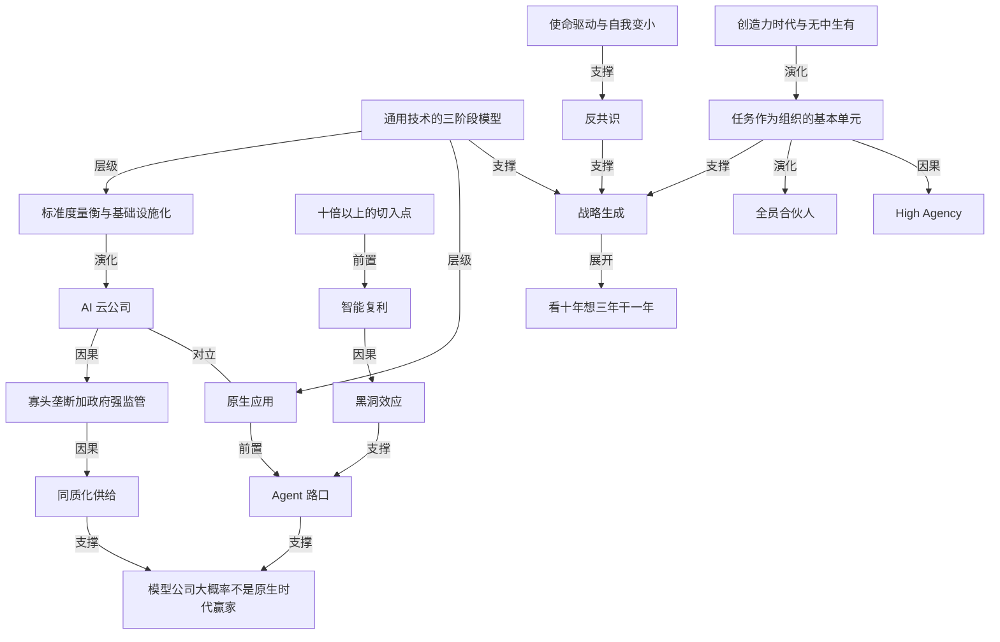

# 曾鸣谈产业史观：模型公司大概率不是原生时代的赢家

- 原文标题：153. 和曾鸣聊产业史观：残酷的真相、会消亡的公司、优秀≠卓越、“OAI、Anth大概率不是原生时代大赢家” | 张小珺Jùn｜商业访谈录
- 作者：张小珺Jùn｜商业访谈录
- 内参日期：2026-09-04
- 来源类型：blog
- 原文：https://app.podwise.ai/dashboard/episodes/8813602
- 标签：商业, 组织管理

> 四万余字的完整访谈整理，主线是技术演进的三个阶段——基础设施、应用爆发、原生应用——以及为什么前一阶段的公司很少活到下一阶段。组织判断也给得很硬：科层制退场，任务为核心的全员合伙人制接上。

## 导读

podcast 访谈。四万多字。

## 核心观点

- 曾鸣把自己定位成"研究商业世界的动力学规律"的 researcher，用商业史的三阶段模型给 AI 产业定坐标：任何巨大的通用技术的颠覆性创新，都要走完"技术成为社会基础设施 → 基于基础设施的应用大爆发 → 原生应用出现"三个阶段；而第一阶段的企业很难活到第二阶段，第二阶段的企业很难活到第三阶段。
- 由此推出全篇最尖锐的判断：OpenAI、Anthropic 这类模型公司本质上是"未来的 AI 云公司"，是公共基础设施服务商；它们很可能"往后活得不错"，但"大概率不是原生应用阶段的大赢家"。理由不是它们不努力，而是经济学的基本规律——"只要有同质化的供给，你就不可能获取高额利润"。
- 2026 年是第一阶段基本完成的标志：token 形成了广泛共识，成了 AI 时代的"一度电、一吨水"，有了标准度量衡的技术才能被规模化、标准化使用。同时它也是第二阶段的开场——Agent 让人第一次看到"能独立完成任务"的潜力。
- 但产业还没走到"浏览器"那一步。Agent 的本质是"分享能力"，正如 92 年建站的本质是"分享信息"；今天缺的是一个把 Agent 标准统一起来、把用户调用门槛降到零的路口。"下一个最大的机会就是一个类似浏览器这样的机会。"
- 组织层面的推论同样激进：公司是工业时代的配套制度创新，科层制管理的公司制度会衰亡，组织的基本单元从"岗位"变成"任务"，中层因命令链消失而消亡，全员合伙人和 high agency 成为新常态。
- 战略方法论也要换：从"战略规划"换成"战略生成"——CEO 要建的是一套让战略洞察自然涌现的体系与环境，人和 AI 一起训练"组织的小模型"。"看十年、想三年、干一年"的要害在中间那段：真正的创造力在看三年。
- 最后落到人：AI 接管一切可结构化处理的知识工作之后，人与人的差异只剩创造力，而且是"无中生有"的原创定义问题的能力。所以"AI 时代可以被定义为创造力时代"，最大的社会冲突将出现在教育系统。

## 战略的本质：卓越一定来自反共识

- 复盘阿里前 15 年，真正影响生死存亡的战略决定只有三个：创立淘宝、创立支付宝、创立阿里云。这三个决定"不但当时在整个社会是不被认可的，公司内部的争议也非常非常的激烈"——淘宝宣布成立时就有好几个高管强烈反对，理由是"原来阿里巴巴的业务都还没有成熟，然后你去打一倍的核心的主业务，风险太大了"。
- 大战略之下还有一层层二级、三级决定，越往下越是战略与战术结合紧密的地方：阿里云早期是只服务一个场景还是一开始就多场景架构、服务淘宝还是服务搜索、开源还是闭源，争论都极大；再往下数据库变了要不要自己做，计算变了、存储变了，才有了"去 IoE"——改掉 IBM、Oracle 和 EMC 存储。"计算完了以后发现存储成了一个新的瓶颈。"
- 怎么在当时判断这是个好战略？答案是"不知道啊。因为相信所以看见"。所有被证明的时代企业，最后都证明了它那个反共识是成立的。
- 关键的限定条件：反共识不等于疯狂。"最成功的企业一定是反共识的，但反共识不一定成功。"我们看到的都是幸存者偏差（survivor bias）。共识赛道里做得比所有人都强，那叫优秀；卓越一定来自反共识。
- 结论：战略"很大程度上其实是关于怎么创造未来的，它不是一个简单的一个规划"。

## 通用技术的三阶段模型

- 曾鸣把 PC、PC 互联网、移动互联网、云计算，一直到三次工业革命的历史系统地过了一遍，得到一个共同的三阶段结构：
- 第一阶段：技术被社会接受，成为社会的基础设施。
  - 第二阶段：基于这个基础设施产生海量新应用，百花齐放。
  - 第三阶段：海量应用出现后，大家发现需要更底层的方法去运行这个新世界——这才是"原生应用的阶段"。
- 为什么原生应用不能诞生在第二阶段？"因为应用的爆发给了技术下一阶段发展的方向。"技术成为基础设施后并没有停滞，但它往哪走并不清楚，只能靠海量应用试出来。
- 字节是标准样本：先做内涵段子、今日头条这些小产品，第一阶段只有文字成熟，今日头条探索出推荐算法这个"既是技术模式，又是商业模式"的东西；带宽和算力上来后出现短视频；短视频的展现形式与推荐算法这个底层技术一结合，才有了抖音这样的国民级原生应用。
- 移动互联网同理：黑莓是第一款被称为智能手机的产品，2010 年在美国还有 40% 多的份额而 iPhone 只有 20% 多，直到 iPhone 4 之后才反超；有了 App Store 才有新一代原生应用。早期日活过亿的墨迹天气一类应用"其实他们不代表未来"，只有解决核心需求的主流应用才是原生应用。
- 曾鸣特意为第二阶段辩护：第二阶段本身"非常精彩，也非常有价值"，可能有八年十年之久，而且"没有第二阶段的积累，所以你跨不到第三阶段"。

## 当下坐标：2026 年既是第一阶段的成熟，也是第二阶段的开场

- 判断第一阶段基本完成的核心证据是 token 成了共识：黄仁勋在 GTC 上说英伟达的未来是 token factory，Sam 立刻表达 OpenAI 核心就是卖 token。"当一个技术有了一个标准的度量衡以后，它就能被规模化的、标准化的使用。"就像一度电、一吨水、一个 GB 的流量。
- 成熟不等于停止："服务会越来越好，智能会越来越强大，成本会越来越低，但是它形成了一个匹配的商业模式，而且成了大家能接受的一种新概念。"
- 同一年也是第二阶段的开场：春节前后大家"养龙虾"的狂热，让人第一次看到"一个能够独立完成任务的 Agent 的无限的潜力"。"我认为 AI 进入的第二个阶段就是智能体阶段。智能体就是 AI 时代的新应用。"
- 与互联网史的类比不断被往前修正：两年前曾鸣还在讲"让我们拥抱雅虎吧"，今年年初却发现"我们怎么退回到了浏览器阶段，好像比雅虎还要早了"。
- 支撑这个类比的是抽象同构，不是表面形态：92 年大家狂热的是"建网站"，目的是分享信息；今天大家狂热的是"建 agent"，而 Agent 的本质是把懂得的能力封装起来分享出去，让别人可以调用。"AGI 这轮的创新就是让我们从信息时代进入了能力时代。"海量信息与知识都被处理完了，"大家都直接问 ChatGPT 答案了，大家不再找信息了"。
- 浏览器为什么是分水岭：它同时做了两件事——用统一标准把建站门槛降到几乎为零（供给端爆发），把浏览门槛降到零（用户端爆发）。供给一爆发，就轮到雅虎出场做"商减"：从目录到排序到分类，降低大家的认知压力。"商增的同时一定要有商减。"
- 今天的现实是："我们随便问身边任何人，大家都不会随口跟你讲出两三个他天天在用的 agent。"雅虎的雏形还完全没看到，"所以我说连浏览器现在都没出现"。曾鸣认为未来两年最令人兴奋的机会，就是有人把 Agent 标准统一起来、让用户能极简调用 Agent。至于具体的交互形态，"是想象不出来的。这就是要大家去创造"。

## 模型公司是什么：AI 云公司与基础设施的宿命

- 类比一层层给：数据是新时代的石油，模型就是炼油厂；从广泛提供接入的角度看，模型更像已经消失的美国在线 AOL——互联网基础接入服务商，"今天大模型是让所有的人都可以很轻易地接入到智能的一个路口"。
- 直白结论："说的直白一点就是 AI 云公司，就是未来的 AI 云公司。"这也解释了美国模型公司与云厂之间的博弈：云厂觉得付出太多得到太少，模型公司则想自建云服务甚至自研芯片，两个生态会碰撞并重新整合。
- 模型公司能不能变成成功的应用公司？"如果我主观地给个结论呢，概率不会太高。"理由是"没有历史上的先例"。Codex 与 Claude Code 做得好不算反例——coding 是大模型的基础与延伸，"是因为有了 coding 的这个能力以后，才让 token 变得这么有价值"。
- 对"万亿市值前所未有"的祛魅：这是典型的"这次不一样"幻觉。雅虎 95 年成立、2000 年市值 1200 亿美元，按纳指回报折算大致相当于今天的一万亿美元；AOL 1988 年开始服务，2000 年高点 2200 亿美元估值，收购华纳后到 3000 多亿；谷歌 98 年成立、2005 年到 1000 亿美元；黑莓也曾是最快到千亿美金的公司。"当一个技术有这么大的冲击力的时候，第一波成功跑出来的公司就有这么大的价值。"
- 关键的分类判断：即便沿用石油比喻，"炼油厂跟化工厂其实也是两类企业"，化工（应用）比纯炼油有价值得多；而且"汽车离开了石油肯定不赚，但是你石油公司肯定做不了汽车。你没听说过哪个汽车公司是由石油公司转化来的？"
- 对陆奇 2024 年"OpenAI 一定会比 Google 大，只是大 5 倍还是 10 倍"的回应："我相信未来一定会有一个十万亿美元的公司，但是未必是现在领跑的这两家公司。"
- 终局格局是确定的：公共基础设施行业只有一种成立的商业模式——寡头垄断加政府强监管。社会依赖它所以必然强监管；供给太重要所以不能只有一家；投入太大所以不会无序竞争。"你现在水电费能随便涨价吗？当然不能啊。我知道这个现实对很多现在创业的人很残酷。"
- 寡头竞争的特征是"有一定的差异化，但是又足够的同质化"——同质化保证可被替代，差异化让大家还有钱赚。所以模型公司是"很好的成熟生意"，但过三五年如果没进入下一阶段竞争，就会变成"大家只会不稳定的时候 complain，不会天天夸你的"那类公司。
- 做基础设施大模型的窗口已经关闭："因为已经进入到了竞争的接近，智能飞轮都已经跑起来的阶段了。你这时候进来就完全没有积累了。"中国这边则是一场淘汰赛，年底跑不到 3T 的大概率出局。

## 为什么第一阶段的赢家很难活到第二阶段

- 不是转型意愿问题，是能力需求切换问题：第一阶段的技术核心是"可不可用"，需要大量原创技术创新；第二阶段的标志是第一阶段技术发展渐渐放缓、变成大家都能调用的东西。
- 第二阶段需要的是完全不同的三件事：很强的洞察力、产品的原创力、对普通用户的同理心；再加上一整套新的应用技术创新（上下文管理、记忆机制、新交互方式），这些"到底把它定义为大模型还是不是大模型，其实不是那么清楚的"。
- 新 Lab 的一部分人会转向支持这一阶段应用所需要的新技术，"这两个的结合可能就变成了第二阶段的王者"。所以技术仍在进步，只是"未必沿着原来的轨迹在线性地增长"，会有技术范式的变化。
- 组织侧的解释同样重要：一个十万人的公司转成 AI 原生，跟一个十人公司长成一千人的 AI 原生公司，难度完全不同；加上路径依赖、组织文化和思维惯性，跨越范式转移是"组织进化的宿命"而不只是战略选择。
- 还有一条平台侧的前置条件：如果你没有做出第一个真正成功的 Agent，你就不理解 Agent 怎么运行，也就提供不了那个基础设施、成不了事实标准、当不成路口。"先有一个成功的 agent 是前置条件。"

## 智能复利、智能飞轮与黑洞效应

- XAI 和 Meta 掉队的根因指向"智能复利"：Anthropic 从去年下半年开始"用大模型训练大模型"，把 AI 这个工具用在自己的主业（模型训练）上，训练能力大幅提升——这还不是完全自我驱动的 self-learning，"只是局部的被使用了，但已经产生了很大的价值"。
- 组织优势与新的技术运营方式叠加，才产生巨大的领先优势，"而这个领先优势真的已经开始把比较弱的玩家往后甩出去了"。
- 数据飞轮没有消失，而是升级为智能飞轮：调用基础智能 → 让 Agent 具备更高智能去完成特定任务 → 真实世界反馈（前提是 Agent 能离开人独立干活）→ 数据飞轮 → 叠加上下文管理、记忆、新交互等算法创新 → 智能复利 → 向更复杂场景延伸。
- 黑洞效应是网络效应的升级版："应用场景越多，你的连接越复杂，你就更有可能去拓宽你的智商。"对照《智能商业》里的 DNA 双螺旋——数据智能与网络协同——黑洞效应相当于两者同时升级：网络协同变成黑洞内部的网络结构，衡量的是"能够快速地去吞噬多少场景"，而不是简单的连接。
- 谁能撞上"最有规模化、最能泛化的那个场景"，谁就最有可能形成黑洞效应，进入第三阶段的竞争。

## 第二阶段怎么做应用：假定智能够用，只做复杂任务

- 去年硅谷 demo day 上十几个项目几乎全是 Agent，但"那些应用其实，今年都不怎么样了"，因为做的都是特别简单的任务：素材生成、广告投放。曾鸣当时唯一看好的是做增长的那家——"因为增长很复杂"。
- 判断标准很硬：得做复杂任务，"你才有可能建立自己的智能闭环，然后你才会有可能做一堆的你自己有价值的技术积累，而不是搭脚手架"。智能不够时做应用大多是在搭脚手架，然后"等着模型自然生长把你脚手架就淹没了"。
- 今天的切入点思路完全不同："你要假定智能是完全够用的"，然后问它到底能干什么活、能不能干复杂的活。"越简单的活，越容易被复杂的活给吞掉，因为它没有多少成长的空间。"
- 门槛量化为"十倍以上的切入点"：比原来的应用场景大十倍以上才有发展空间。做 PPT、出报告"都不够大"；今天长程规划能力比以前进步很多，问题是能不能往前一大步把一个复杂任务解决掉。
- Manus 的定位被单拎出来评：市场感觉非常敏锐，抓住了 coding 出来的那个难得的机会窗，切入点当时是对的（一批 prosumer 的生产力需求），但今天的站立门槛已经提高了。
- 方向选择上，教育和健康是典型的大垂类，关键是能否找到"现在能切得进去，将来能长得大的"切入点；to B 侧今年会冒出一堆"组织大脑"、组织操作系统、CEO 的 agent 团队；to C 侧重新出现情感陪伴与解决问题类产品。
- 应用公司不需要训练传统意义上的大模型："因为你可以稳定的调用，不用担心模型公司切断你。因为有一个合理的替代品随时可以接上来。"Cursor 被明确排除在"新时代主体"之外——它是在 coding 能力不够时探测模型能力边界的产物，模型发展后"被 folded into，就被包进去了，成了模型迭代的一个养料"。
- 今年应用融资的冰点被解释成阶段现象："现在是应用领域里面创业者的反共识阶段。"模型能力溢出淹没了简单任务，而足够大的复杂场景还没被找到，处在青黄不接的时候。但真正的信号也在这里：智能"真的能干活了，可以信赖了"，开始有人认真想拿它干重要的活——"这才是应用阶段开始的真实的标志"。
- 电力史被用作最直观的对照：1892 年电灯照亮曼哈顿，直到 1910 年前后电网覆盖主要城市，才出现洗衣机和电冰箱两个家用大应用，1925 年才有空调，1930 年代才有电视机。爱迪生发明了电、成立通用电气做发电设备，却没意识到电网的重要（助理离开去成立了送电公司），而通用电气真正的成功来自最早生产出电冰箱和洗衣机——"繁荣了 60 年，然后就把各种各样的应用就一步步做出来了"。

## 路口就是平台：新平台大概率不诞生自旧平台

- 平台一定还会出现，"路口就是平台"。旧平台做的是简单的信息匹配，新平台要做的是"能力跟需求的匹配"，复杂度高了很多，所以旧平台大概率演化不过来，会诞生新公司。
- 双边市场的逻辑：海量 Agent 开发商与海量用户之间需要匹配。看一个网站好不好判断成本很低，但"你用一个 agent 是有可能出现很大的负面影响的"，所以判断能力要求更高，用户会把这种判断力让渡给一个可信的独立第三方。
- 信任是路口的真正入场券：普通人怎么知道哪个 Agent 能用？"你钱包敢交给 agent 吗？你个人的隐私敢交给 agent 吗？"需要有服务商来建立标准和信任。曾鸣预计三年左右有可能开始出现 Agent 路口，五年时第二阶段"大概大家都能看明白了"。
- Agentic OS 被明确放在第三阶段：OS 不再做匹配而是调度资源，"你只要告诉他一个意图，我就直接调用市场上所有的 agent，直接帮你给活给干完了。你都见不到那个 agent"。它必须等 Agent 足够多、足够成熟才可能落地。讨论第三阶段的价值在于知道终局方向，从而让第二阶段更有针对性。
- 至于第三阶段的形态，"肯定是一个谁都不知道的长啥样的公司。这才叫大创新"。

## 公司制度的衰亡与 AI 原生组织

- 新 Lab 之所以叫 Lab，是"因为不满意公司嘛，公司要被淘汰了嘛"。公司与工业时代一起产生，工业时代之前只有手工作坊；公司是工业时代最大的制度创新，让现代化管理得以运行、支撑规模化扩张。"如果工业时代的很多的基本经济规律被挑战了，它的组织形态肯定也会被挑战。"
- 曾鸣的措辞非常克制也非常明确："科层制管理的这种公司制度会衰亡，但是人类的分工协作会继续，组织永远会存在。"未来那个组织叫什么现在还没有名字，"大概率也不会叫 Lab"——今天用"AI 原生组织"这么复杂的三个词，恰恰因为这个词还没被定义出来。
- 最底层的变化是基本单元：岗位是现有组织的基本运行单元，招聘、汇报线、层级、报酬全都挂在岗位上；而"AI 时代组织的基本单元是任务"，大家围绕任务流转。"归机员工和碳机员工都是围绕着任务的流转在协同的。"
- "AI 嵌入工作流"只是阶段性产品，"因为那个工作流是为人设计的"。AI 原生组织从第一天就定义任务、拆解任务、分配任务。
- 求职方式随之改变：几个大 Lab 都是发布任务、你去认领，"你觉得你能干，你就接。然后你能 deliver 结果，你的东西就上线了"。
- 层级消失的机理很清楚：层级存在是因为不知道谁说了算，"层级高的人说了算嘛，它不是以判断力为标准的"；未来是"谁的能力强谁被调用"。命令线被打破后协同不再靠命令，"传统意义上的中层肯定是消亡了"。
- 激励方式回到自驱，这也是硅谷最近最流行的词 high agency 的由来：先向内找到自己的驱动力，明确要培养什么能力，找到这个能力最适合的场景并跟着场景一起成长；因为接任务、交结果高度透明，贡献自然被识别。顶尖研究员转会费高的根本原因是"贡献很透明"——现在连 VP 之类的 title 都不写了，"这个不需要大家也都知道他们的江湖地位"。
- 一人公司不是方向："一个人能干的活永远是有限的，所以你一定要有组织"。但未来每个人都会是一个"六边形战士"，在组织里与其他六边形战士合作。
- 全员合伙人是终点形态：合伙人企业（律所、大咨询公司、早期投行）在工业时代是与公司平行存在的另一种制度，特点是"少了谁都不行"。"未来整个企业会越来越像合伙人企业……要不然我就不招你。招你其实就是因为你的贡献必不可少。"人数会显著变少，组织更像一支球队——有明星，也有前锋后卫的分工。
- 存量公司怎么办？"转型啊，升级啊。成为新物种啊。""不换脑袋就换人啊。"难点在于这件事本身是反惯性的：大部分人会顺着惯性做"AI 加"，"但是原生的公司长起来的时候，你就会很绝望"。
- "老登"这个词被给了一个结构性解释：尊老爱幼的前提是老的经验有价值、老的规范在延续；而今天"能够转化成知识的经验都不再有价值，因为它都被大模型吸收了"，年轻人用好 AI 杠杆"瞬间就能成为任何一个领域的专家"。
- 新组织的文化核心是创造：开放、透明、共享，再加上"共创"——大家都明白自己在共同创造一个新东西。过去的组织让人不快乐，是因为"大部分的知识工作是简单、枯燥、重复、繁琐，没有成长性的"，公司为了管理又偏控制。曾鸣的乐观在于："我觉得可能开心就成了必需品。"

## 战略生成：看十年、想三年、干一年

- 曾鸣把组织放在战略之前讲，理由是"你想要的那种未来的战略的生成方式跟原有的组织是不匹配的。它只有用新的组织形态才能生成新的战略。这两个是阴阳合和的"。新组织的原生挑战是决策频率越来越高、质量要求越来越高。
- 走得最远的那批创业者的共同动作是自己重写公司内部的运行体系——李志飞式的"把自己关在家里三天，我基本上就把那个框架写出来了"。因为那就是未来组织的神经网络，而"原来的鸦屁就是一个固化的道路"，固化的路一定有僵化和局限，不可能实时反应。
- 战略在 AI 时代不是变得不重要，而是无比重要："你做错一个重要决定你就出局了。这个淘汰赛是可能以几个月就来计划的。""越不确定的时候，越需要战略思考能力。如果都很确定，那大家拼的就是执行能力。"
- 工业时代的方法论之所以失效：过去世界成熟、增速稳定（每年 5%–8%），看十年很清楚，干一年就是线性外推；战略如此不重要以至于可以外包给麦肯锡和 BCG，"双方都很 happy"。今天线性外推推不出 Anthropic 的收入同比增长。
- 大部分人只记住了"看十年、干一年"，恰恰漏掉了要害。"真正的创造力在看三年。"看三年要求你看两三步：第一个里程碑是什么、第二个是什么、第三个可能是什么，今年做的第一件重要的事是为了满足哪个里程碑。由此产生短期、中期、长期之间的动态张力。"没有这个看三年的这个张力，其实战略就没有发生的那个环境了"——差别相当于在三维空间里找最优解与在二维平面上找最优解。
- 节奏可以按行业调整：也可以看五年想两年干半年，甚至看三年想一年干一个季度，"但是一定要有中期的一个思考，就一定要看到至少三步"。
- 一个具体的诊断案例：某应用公司增长很快，曾鸣只问了一句"你继续涨两年以后又怎么样呢？最后产业终局会怎样呢？有没有个天花板呢？那个天花板多快会来呢？"对方回去一算发现天花板不远，赶紧去做新的事。线性外推"不但是一个线性外推，而且还是拿当下外推 12 个月，是很容易让人产生一个增长的幻觉"。
- 背后是又一条经济学规律："大家刚开始竞争的时候是按你的创造的客户价值来定价的，但是当竞争对手一多了，就是按你的边际成本定价的。"
- 从战略规划到战略生成：这个词是曾鸣特意造的，对应这个时代大家熟悉的"视频生成""文生图"。"组织设计……真正要做的是一套体系，一个环境可以让战略洞察涌现出来，然后成为一个战略不断生成的系统，最后战略就是一个自然而然的决定，在合适的时间有合适的人做了一个合适的决定。"
- 生成系统的构造：组织是一个任务流导向的神经网络，人和 AI 都接进去，"实际上是人跟 AI 一起在训练一个组织的小模型"，核心是有没有原来没想到的洞察能涌现出来。
- 环境的另一半是文化，这就是 context not control 重新火起来的原因："给够了 context，他就有那么牛，能做出正确的决策。"对齐目标、对齐认知，甚至全员共享一个完整的上下文，然后事情自然涌现。而且人和 AI 都要共享——因为"人没有办法像 AI 那样有处理海量信息的能力，但是人有瞬间的创造力和看见不存在的连接的能力"。
- OKR 也在这个框架里被重估：理念是对的，只是落地对组织要求太高，很多公司放弃或让它变形成 KPI；而 AI 时代的组织大脑能追踪自然语言表达、无所不在，反而可能第一次让 OKR 真正落地。
- 不同阶段的战略打法不同：战略收敛期追求组织效率与执行效率，从方向性战略走到可闭环的运营模式，核心是规模化；战略摸索期则要一号位带着大家做不同的创新，用机制把试错成本降下来并逐步达成共识——"在战略摸索期，核心是创新的效率要足够高，而不是执行的效率"。这个阶段最难的是"你自我能不能让位给现实"。

## 优秀与卓越：Ego 变小与使命驱动

- "卓越是事后认定的。"卓越的路径是不断克服负反馈，在所有人都不认可时最终以巨大成功证明自己是先知；优秀则是"一个持续有正反馈的成长过程"。两条路径完全不同，而大部分人是优秀，因为优秀"跟人的心态是比较匹配的"。
- 与卓越同样成比例的是那些疯狂而失败的人。"狂想的人可以很多，也很容易，但是你不但是想对了还能落实的那个是极为稀缺的能力。"
- 借柯林斯《基业长青》与《从优秀到卓越》的观察：真正卓越的人有个极大的共同特质——把成功归于别人，认为自己是运气好。曾鸣的解释是"因为事情大于人"，"是时代成就了你，你只不过是碰巧在合适的地方跟合适的人在一起做了合适的事情"。反过来，只为证明自己的人（书里的第四级领导者）"在某一个时间点，世界都会打你的脸"。
- "利他同理心和自我逐渐变小大概是走向卓越必不可少的因素。"Ego 大的人急着证明自己，所以需要短期反馈，也就不会真正去感知和理解真实世界，"你对信息的处理一开始就会容易受你先入为主的判断的影响"。
- 公司被分成四个层级：机会驱动、战略驱动、远见驱动、使命驱动。但使命必须是"发自内心的，你真心 believe 的，不是你编出来写在墙上激励别人的"。
- 曾鸣识别使命的问题是："十年以后你会对怎样的自己满意？"回答"我对这个事情特别感兴趣，希望这个事情能成"是事情大于人；回答"我就是好奇"也比证明自己有意思；回答"我要做一个一百亿美金的公司"就是外部驱动，"每一轮的估值就容易对它有冲击"。他听过最好的回答是马云创业前的"让天下没有难做的生意"，以及马斯克的去火星。
- 区分信号与噪音的两条心法：一是尽量感知全面，真实体会外界的变化；二是思考更深入。"很多人是不太过脑的……你一直在追趋势，别人已经领跑两步了，你没看见，你只看见他冒出水面的第三步。"另一种失误是接触面太窄，做出局部最优的判断。
- 技术人创业者要过的那道坎不是技术：很多技术人员没法接受"我的技术这么牛，我创造了这么大的价值，为什么我公司可能不值钱"。答案还是那条经济学规律——同质化供给就不可能有高额利润。"作为 founder，作为 CEO，他必须去理解经济学的基本规律，商业世界的运行规律。"
- 下一代创始人大概率不需要研究背景：模型这一代必须要，下一代应用驱动就不需要。今天创始团队联合创始人变多（一个大模型背景 + 一个应用与商业背景），本身就是 AI 原生组织的特征。
- 产品经理不但重要，而且"会变得无比重要"：做什么产品、服务什么客户、创造什么价值、用什么技术，有限的时间投在哪件最重要的事上，都是产品经理要判断的。第一阶段团队以研究员和技术专家为核心，是因为需要早期的大技术突破；技术成为基础设施后，产品运营、用户连接与同理心变得非常重要。

## 巨头的处境：没有人是安全的

- "我从来觉得在巨浪面前没有人是安全的。谁觉得安全，谁就是最不安全的。"All in AI 是必要条件，够不够要看技术演化路径有多颠覆、新公司获取资源的能力有多大。
- 跨时代成功的先例"不是多不多的问题，是有没有的问题"，答案是"基本没有"：IBM 做到过一次，微软算一次（错过移动互联网但保住搜索火苗、积累了云计算、加上 PC 操作系统的垄断），但微软对模型的投入不够，"它模型这块其实已经出局了"，且已经买不起 OpenAI。
- 谷歌"相当于微软的上一段"，作为 AI 云厂商活下来没问题（有 TPU、有大模型），但能否做出入口级的消费者大应用"这个还真的不那么确定"。
- 字节有很大机会成为 AI 云公司（多模态、视频生成已是世界一流），但大的 to C 应用不确定。豆包被明确否掉："豆包肯定不是，要不然肯定不计成本往里砸了。它不砸了就是因为豆包不够那么未来。"更关键的定性是：豆包是第一代 AI 产品即聊天机器人，"豆包没有行动力，智能体的核心是独立完成任务"。
- 上一代路口能不能变成下一代路口？挑战非常大——"因为你如果不是 agent 的事实标准的话，你其实是很难成为路口的。你调的都是上一代的服务"，而上一代服务正是要被颠覆的对象。类比是 QQ 与微信：真正承接移动互联网时代的是微信而不是 QQ。
- 社交关系和人货关系都会被重构，腾讯和阿里同样有挑战。"现有产品加 AI 加 agent"在曾鸣看来"都是过渡产品"。
- 一个关键的量级判断：移动互联网相对 PC 互联网是"1.5 的创新"——延续性让几家头部公司都成功过渡，颠覆性最终成就了抖音和拼多多这两个更原生的公司；而 AI 曾鸣倾向于认为是彻底的颠覆性技术。"它是个生产力的革命。互联网本质上是个生产关系的革命。"连续性没那么强，原有物种适应新物种就会非常困难。
- XAI 的问题被归到组织："我在硅谷只要是碰到有一群工程师的场合，XAI 的那个人，永远是最疲惫的那个人。"过度消耗之下没有创新——"人太累的时候是没有创新的，你一定是在一个相对开放放松的状态，你才会有新的东西出来。"更深的问题是那套偏硬件的自上而下方法论在 AI 时代失灵：自己给不出答案，又不给下面的人足够空间去给出答案。
- Meta 的问题是出头早、消耗也早，公司大到内部资源调度非常困难，研究员也不觉得决策者懂模型。对照之下，OpenAI 与 Anthropic 本质上都是新时代的创业公司，组织文化更匹配：一家是强研究驱动加好 CEO 的搭配，另一家是"整个的组织能力非常强"加上对 mission 和 vision 把握得准，显示出"非常聚焦的、vision-driven 的一个公司的爆发力"。
- 中国的收敛为什么总是慢：美国公司有两三年先发期可以酝酿 DNA，中国这一轮仍是在美国原型上的快速跟进，大家同时起步、看到的图像差不多、都去硅谷挖人，必然演成百团大战和同质化竞争。但认知更深刻、早了半年一年的那几家，这一轮仍然跑在前面。
- 上周市场的恐慌正来自同质化竞争的预期："因为这个预期破了，那就才会有大家对于这些公司可能就没有能力持续去投这个高的 CAPEX。"曾鸣的判断是大模型本身空间还很大、基建投入大概率继续，某个时间点可能出现基建超过真实需求的拐点——"但那件事情从产业发展来说未必是坏事，因为应用公司就可以用很低的成本去用现有的基础设施"。
- 但应用公司不能"苟一苟等一等"："因为你不在这场里头，你积累不了相应的经验。等真的大浪来了，你接不住啊。"

## 机器人、创造力时代与教育冲突

- 机器人还在非常早期，行业自己的类比是"2020 年左右的阶段，还没到 ChatGPT 的阶段的大模型公司"，核心制约是数据不像大模型起步时那么充足。
- 从通用大脑切入还是从具体场景切入，"逻辑上两条路都成立的"：泛化路线的挑战是泛化空间有多大，场景路线的挑战是现在能找到的场景都不够大、能力能否快速扩张到足够大的场景。"就像爬一座山，你可以从南坡爬，可以从北坡爬。"
- 汽车史是个好类比：1900 到 1920 年美国真有几千家做车的公司，直到 1913 年福特建成全世界第一条电驱动流水线，才用极高效率造出大众消费得起的汽车。但后面还有插曲：福特靠规模化标准化只卖黑色车做到全美第一后，需求开始多元化，才有通用汽车七八种车型竞争的下一阶段。"说明每个战略都要在当时那个时期有效才有效。"今天相当于"大家都能手搓一个机器人公司，但是哪个机器人公司能完成规模化量产，谁都不知道"，行业还在等 T 型车时刻。
- 更好的类比其实是电器整体：token 类比的是电，"基于电可以有 N 种电器"，所以会出现 N 种适用不同大场景的机器人——家用（陪伴型、家务型）、工业与各类户外场景。机器人之所以被看好，是因为它是"AI 跟物理世界交互的一个基本的界面"，"什么东西都可以被电再重新干一遍"。
- 社会消化这场技术革命需要"一代人，20 年起步，因为他们才是原住民"。Agent 路口五年内可能出现，而抖音、拼多多量级的原生应用"可能是八年、十年以后的事情"——"你别忘了 OpenAI 已经 11 年了，只是这两年我们感受到的加速度"。
- 借德鲁克把工业时代以来分成三段（生产力革命 → 管理革命 → 知识革命，软件把知识与最优实践沉淀成标准执行方法），曾鸣给出自己的第四段命名：从人的角度看，"AI 时代可以被定义为创造力时代"。
- 逻辑很干脆：所有可以被结构化处理的知识工作都会被 AI 接管，人一方面被逼着开发新潜能，一方面"终于被解放出来"。剩下的差异是创造力，而且必须重新定义创造力——"可能创造力不是简单的会写首歌或者会画幅画，它可能是更多的原创的定义复杂问题的能力"，也就是"无中生有的能力"。"有的东西机器都知道啊。"
- 这种创造从机器角度看可能很无聊——情感陪伴、人与人之间以前没被开发的需求——"也许不贡献给物理世界的巨大进步，但是它可能对人类的成长和幸福感有很多的帮助"。就像电和流水线出现后才有产业工人、技术工人和白领这些 19 世纪的人根本想象不到的概念。
- 最大的社会冲突将出现在教育系统："它本质是知识的灌输嘛。智商的开发都是第二位的。"高中生已经知道用现在的方法毕业后找不到工作，"但是我们肯定不敢让他们去走他们的路。所以他们就卡在这了"；年轻家长知道要用新方法教育，只是不知道用什么方法。商学院则"已经不行了，都在衰落"。
- 心态是全篇的落点：原来我们倾向于降低不确定性，"但是我觉得在这个阶段其实是要拥抱不确定性，不确定性就是最大的机会，所以心态先得改了，就不能恐惧"。面对巨大的不确定性与复杂性觉得"特别好玩，特别有机会去创造一些新东西"，才是年轻一代创业者的心态。
- 曾鸣自己的使命只有一句："做一个快乐的研究员。"而他对 AI 工具的警惕同样具体：AI 效率太高，很容易把自己弄得极为疲惫，"因为你根本跟不上它的处理速度"，所以要有一些隔绝，找到作为生物的人的合理节奏，再跟 AI 找新的平衡。

## 概念网络

### 关键概念

#### 反共识

**context**：判断战略是"优秀"还是"卓越"的分水岭。原文的表述极硬："卓越一定来自反共识"；共识赛道里做得比所有人都强，"那就是优秀嘛"。阿里的淘宝、支付宝、阿里云三个决定当时都"在整个社会是不被认可的，公司内部的争议也非常非常的激烈"。同时曾鸣给了严格的限定：反共识不等于疯狂，"最成功的企业一定是反共识的，但反共识不一定成功"，我们看到的都是幸存者偏差。今天应用创业者所处的低谷，也被他归为"应用领域里面创业者的反共识阶段"。

**费曼一下**：如果所有人都同意你要做的事，你最好的结局就是把这件事做得比别人好一点——因为大家都能做，所以谁也赚不到超额回报。真正改变格局的机会，必然长在"大多数人此刻认为不对"的地方。但这句话不能倒过来用：不被认同只是必要条件，不是充分条件；疯狂的想法同样不被认同，而且大多数确实是错的。区别在于你有没有基于自身能力真的看见那幅图景。

#### 通用技术的三阶段模型

**context**：全篇的分析框架。曾鸣把 PC、PC 互联网、移动互联网、云计算与三次工业革命都研究了一遍，提炼出"巨大的通用技术的颠覆性创新"共有的三个阶段：技术被社会接受并成为基础设施；基于基础设施的应用大爆发（百花齐放）；海量应用出现后需要更底层的运行方法，进入"原生应用的阶段"。他据此判断 2026 年是第一阶段成熟与第二阶段开场的交汇点，也据此推出"第一阶段的企业很难活到第二阶段，第二阶段的企业很难活到第三阶段"。

**费曼一下**：新技术不是一上来就长出它最厉害的形态。先要有人把它做成像水电一样随手可用的东西，然后无数人拿它乱试，试出方向后才会长出真正定义这个时代的应用。跳级是不可能的——没有第二阶段的乱试，第三阶段无从谈起。这个框架的价值在于，它把"我们现在处在哪"这个问题从情绪判断变成了结构判断。

#### 标准度量衡与基础设施化

**context**：曾鸣判断 AI 第一阶段成熟的关键证据。token 在 2026 年年初形成广泛共识——英伟达讲 token factory，OpenAI 讲核心就是卖 token——"当一个技术有了一个标准的度量衡以后，它就能被规模化的、标准化的使用"，就像一度电、一吨水、一个 GB 的流量。他同时强调基础设施化不等于停止进步，而是形成了匹配的商业模式和被广泛接受的新概念。

**费曼一下**：一项技术从"前沿"变成"基础设施"的那个瞬间，往往不是某个技术突破，而是全社会终于同意用同一个单位去计量和买卖它。有了单位，才有报价、有预算、有成本核算，普通人才敢在它上面盖房子。"我耗多少 token、能干多少活、花多少钱"这句话能被说出口，就意味着智能已经变成了可以按量采购的公共品。

#### 原生应用

**context**：三阶段模型的第三阶段，也是曾鸣衡量"时代性企业"的标尺。定义是"真正是要解决核心需求的主流的应用"：移动互联网的抖音是原生应用，而早期日活过亿的墨迹天气一类"其实他们不代表未来"；电力时代的原生应用是洗衣机、电冰箱、空调，而不是发电设备。他对模型公司最尖锐的判断正是用这个尺子给的——它们"大概率不是原生应用阶段的大赢家"。

**费曼一下**：一项技术刚普及时会冒出一大堆"能用上它"的产品，热闹但不改变生活。原生应用是那种诞生之后，人们再也回不去的东西——它不是把旧事情做得更快，而是让一件以前不存在的事情变成日常。判断标准很朴素：拿掉它，你的生活会不会真的塌一块。

#### AI 云公司

**context**：曾鸣给模型公司的定位。类比链条是：数据是新时代的石油，模型是炼油厂；从广泛提供接入的角度看又像美国在线 AOL 这个互联网基础接入服务商，"今天大模型是让所有的人都可以很轻易地接入到智能的一个路口"。直白结论是"说的直白一点就是 AI 云公司"。这个定位同时解释了模型公司与云厂之间的博弈（自建云、自研芯片）和它们做应用的低概率——"炼油厂跟化工厂其实也是两类企业"，"石油公司肯定做不了汽车"。

**费曼一下**：把一家公司归到哪一类，往往就决定了它的商业上限。卖智能的公司卖的是一种被所有人调用的公共资源，它的成功形态是"稳定、便宜、大家都用"，而不是"独占用户心智"。这类公司很可能活得很好、很久，但它注定不是这个时代最耀眼的那家——它是那家最耀眼公司的水电煤。

#### 寡头垄断加政府强监管

**context**：曾鸣给模型行业的终局。推理三步：社会依赖它，所以政府一定强监管；供给太重要，所以不能只有一个供应商；投入太大，所以不会无序竞争。结论是"经典的寡头竞争，政府强监控，保证社会有稳定的低成本的供给，这才叫基础设施"，并用"你现在水电费能随便涨价吗"作反问。他自己加了一句："我知道这个现实对很多现在创业的人很残酷。"

**费曼一下**：凡是整个社会离不开的东西，最终都不会由一家独享定价权，也不会有几十家乱打。会剩下三五家，被盯得很紧，赚一份稳定但不惊人的钱。这对社会是好事——供给稳定、价格可控；对这些公司的投资人则意味着，那个"永远高增长高利润"的故事迟早要被换掉。

#### 同质化供给

**context**：全篇被引用最多的一条经济学规律，也是曾鸣认为技术型创始人最难跨过的坎："只要有同质化的供给，你就不可能获取高额利润，你就是一家不怎么值钱的公司。"他用它解释模型公司的终局，也用它解释市场的恐慌——"上个礼拜大家都很恐慌，不就是怕同质化竞争吗"，预期一破，为这些公司继续投巨额基建的理由就动摇了。配套的还有另一条定价规律：竞争刚开始时按创造的客户价值定价，竞争对手一多就按边际成本定价。

**费曼一下**：技术很牛和公司值钱是两件事。价格不是由你的付出决定的，是由"买家还有没有别的选择"决定的。只要隔壁能提供一个差不多的东西，你的定价权就消失了，利润会被一路压到成本线附近。很多极其优秀的技术团队接受不了这一点，但它和引力一样，跟你努不努力无关。

#### 智能复利

**context**：曾鸣新书里的基本概念，也是他解释竞争格局分化的钥匙。指的是 AI 介入模型自身的训练过程——Anthropic 从去年下半年开始"用大模型训练大模型"，把 AI 这个工具用到自己的主业上，训练能力大幅提升；这还不是完全自我驱动的 self-learning，"只是局部的被使用了，但已经产生了很大的价值"。它与组织优势叠加，产生了把弱玩家甩开的领先优势，也是 XAI 与 Meta 掉队的解释。

**费曼一下**：当一个工具好到可以用来改进自己时，进步就不再是加法而是乘法。别人每年靠人力推进一格，你靠上一版的自己推进下一版，差距会以复利方式拉开。这也是为什么"晚半年入场"在这个赛道里可能等于永远追不上——你追的不是一个静止的目标，而是一个正在加速的目标。

#### 黑洞效应

**context**：曾鸣提出的商业概念，被他称为"AI 时代的网络效应的升级版"。机制是"应用场景越多，你的连接越复杂，你就更有可能去拓宽你的智商"。对照他在《智能商业》里的 DNA 双螺旋（数据智能 + 网络协同），黑洞效应相当于两者同时升级：网络协同变成黑洞内部的网络结构，衡量的是"能够快速地去吞噬多少场景"。他认为 Anthropic 与 OpenAI 已经有点形成了黑洞效应，这也是美国云厂"有点慌了"的原因。

**费曼一下**：老的网络效应是"用的人越多越好用"，靠的是连接数量。新的是"吃下的场景越多越聪明"，靠的是从每个场景里吸走反馈再反哺自己。一旦某家开始吞噬场景，它的引力会越来越大——不是因为别人离不开它，而是因为它变聪明的速度别人追不上。

#### 十倍以上的切入点

**context**：曾鸣给第二阶段应用创业者的具体门槛。原话是"在今天，一个 agent 要站立住，至少要找个十倍以上的切入点，你才有发展的空间"，即比原来的应用场景大十倍以上。做 PPT、出报告这类"都不够大"。与之配套的判断是"越简单的活，越容易被复杂的活给吞掉"，以及做应用要"假定智能是完全够用的"，不要再搭那种会被模型自然生长淹没的脚手架。

**费曼一下**：在一个能力还在飞速上涨的平台上做产品，你必须瞄准一个当下明显做不到的目标。如果你的产品只是补上平台今天的一个小缺口，那么平台的下一个版本就是你的死期。选大一点、难一点的活，你才有时间在能力涨上来之前建立自己的东西。

#### Agent 路口

**context**：曾鸣认为未来两三年最大的机会。它对应互联网史上的浏览器与雅虎：浏览器把建站门槛和浏览门槛同时降到极低，导致供给与需求两端同时爆发；雅虎随后出现做"商减"，用目录、排序和分类降低认知压力。今天 Agent 还处在"商增"阶段——"我们随便问身边任何人，大家都不会随口跟你讲出两三个他天天在用的 agent"，而且缺的不只是发现，更是信任："你钱包敢交给 agent 吗？你个人的隐私敢交给 agent 吗？"曾鸣的判断是"连浏览器现在都没出现"。

**费曼一下**：任何一次供给大爆发之后，真正的赢家往往不是供给方，而是那个替普通人做筛选和担保的中间层。今天的问题不是没有 Agent，而是普通人不知道该用哪个、也不敢把重要的事交出去。谁能建立起那套标准和信任，谁就站在了所有人和所有 Agent 之间。

#### 任务作为组织的基本单元

**context**：AI 原生组织最底层的变化。曾鸣的对照是：岗位是现有公司的基本运行单元，招聘、汇报线、层级、报酬全挂在岗位上；"但是 AI 时代组织的基本单元是任务，是什么是要被解决的事情"，"归机员工和碳机员工都是围绕着任务的流转在协同的"。由此推出层级消失（"未来是谁的能力强谁被调用"）和中层消亡（命令线被打破），求职方式也变成认领任务、交付结果。他同时把"AI 嵌入工作流"定为阶段性产品——"因为那个工作流是为人设计的"。

**费曼一下**：公司之所以长成金字塔，是因为要先设格子再往里塞人，格子之间靠命令连起来。如果一个组织从第一天起就只关心"有哪些事要被做完"，那格子就没必要了：事情被拆开挂出来，谁能干谁接走，能力强的自然被调用得多。层级消失不是因为大家变平等了，而是因为它原本解决的问题（谁说了算）有了更好的答案。

#### 全员合伙人

**context**：曾鸣对未来组织形态的判断。他提醒了一个常被忽略的历史事实：公司之外还有一种平行存在的制度——合伙人企业（律所、大咨询公司、早期投行），特点是"几个人的分工合作都很重要，少了谁都不行"。而在 AI 时代，"要不然我就不招你。招你其实就是因为你的贡献必不可少，那你其实就是一个合伙人"。人数会显著变少，组织更像一支球队：有明星，也有前锋后卫的分工。他同时否掉了一人公司作为方向——"一个人能干的活永远是有限的"。

**费曼一下**：当一个人加上 AI 就能干过去几十人的活，那"招一批可替代的人来填岗"这件事就不成立了。剩下要招的每一个人，都得是缺了就转不动的那种。这种结构历史上一直存在，只是过去只出现在律所和投行这类靠个人专业能力吃饭的地方——现在它要变成常态。

#### High Agency

**context**：曾鸣用来回答"没有层级怎么激励员工"的概念，"这半年硅谷最流行的一个词"，中文即主观能动性。他拆成几步：先向内找到自己的驱动力；明白要培养什么能力；找到这个能力最适合的场景并跟着场景一起成长；因为接任务、交结果高度透明，贡献自然被识别。他用顶尖研究员的高转会费作证据——"是因为贡献很透明啊"，现在连 VP 之类的 title 都不写了，"这个不需要大家也都知道他们的江湖地位"。

**费曼一下**：过去公司用升职这条格子给人提供动力，因为你的贡献很难被单独看清。当工作变成一件件公开认领、公开交付的任务，谁做了什么一目了然，那套代偿机制就没用了。剩下的驱动力只能来自你自己：想成长就接更难的任务，不想成长就换个地方。

#### 战略生成

**context**：曾鸣特意造的词，对应"战略规划"。他借用了这个时代大家熟悉的"视频生成""文生图"语感。核心不是 CEO 想出一个战略，而是"要做的是一套体系，一个环境可以让战略洞察涌现出来，然后成为一个战略不断生成的系统，最后战略就是一个自然而然的决定，在合适的时间有合适的人做了一个合适的决定"。这也是他把组织放在战略之前讲的原因——"它只有用新的组织形态才能生成新的战略。这两个是阴阳合和的"。生成系统的技术底座是一个任务流导向的神经网络，人与 AI 都接进去，"实际上是人跟 AI 一起在训练一个组织的小模型"。

**费曼一下**：过去做战略像画一张图纸然后照着施工，前提是世界变化慢到图纸不会过期。今天图纸的保质期比施工周期还短，所以要改造的不是图纸，而是画图纸的那套机制：让组织每时每刻都在感知、判断、修正，好的方向自己冒出来。CEO 的活从"想出答案"变成了"建一个能不断长出答案的环境"。

#### 看十年、想三年、干一年

**context**：曾鸣旧有方法论在 AI 时代的再解释，他强调这是"一个形象化的比喻"，本质是张力和取舍。他指出大部分人只记住了"看十年干一年"——那正是工业时代的习惯，在每年 5%–8% 稳定增长、没有新玩家的世界里，看十年很清楚，干一年就是线性外推，战略不重要到可以外包给咨询公司。今天线性外推推不出 Anthropic 的增长。"真正的创造力在看三年"：看三年要求你看两三步里程碑，并回答今年做的第一件重要的事是为了满足哪个里程碑。节奏可以按行业调整（看五年想两年干半年，甚至看三年想一年干一个季度），但"一定要看到至少三步"。

**费曼一下**：只有远景和只有今年，中间是断的——远景没法告诉你明天从哪下手，今年的计划也撑不起远景。中间那段"三年"才是真正需要想象力的地方：它逼你把一个模糊的未来切成两三个可以被验证的台阶，也逼你在短期收益和长期位置之间做真实的取舍。少了它，你就是在一张平面上找最优解。

#### Context not Control

**context**：曾鸣认为在 AI 时代重新火起来的管理理念，是战略生成系统的文化一半。五年前他讲 Netflix 案例时大部分人觉得"跟我没啥关系"，"但是今天所有的人都知道，就是要给 context，给够了 context，他就有那么牛，能做出正确的决策"。做法是对齐目标与认知，甚至全员共享一个完整的上下文，然后事情自然涌现。而且人和 AI 都要共享上下文——"人没有办法像 AI 那样有处理海量信息的能力，但是人有瞬间的创造力和看见不存在的连接的能力"。

**费曼一下**：管一个人有两种办法：告诉他该做什么，或者告诉他全部背景让他自己判断。前者在事情简单、变化慢时更省事；后者在没人知道正确答案时是唯一的办法。有意思的是，这个道理今天被广泛接受，恰恰是因为大家在跟 AI 打交道时反复体验到了同一件事：上下文给够，结果就好。

#### 使命驱动与自我变小

**context**：曾鸣区分优秀与卓越的关键。他把公司分成四个层级——机会驱动、战略驱动、远见驱动、使命驱动，并强调使命必须是"发自内心的，你真心 believe 的，不是你编出来写在墙上激励别人的"。借柯林斯两本书的观察，真正卓越的人共同特质是把成功归于别人、认为自己是运气好，因为"事情大于人"。反面机制说得很清楚：Ego 大的人急着证明自己，所以需要短期反馈，就不会真正去感知理解真实世界，"你对信息的处理一开始就会容易受你先入为主的判断的影响"。他的识别问题是"十年以后你会对怎样的自己满意"。

**费曼一下**：一个人为什么做这件事，会决定他能承受多少次"没人相信你"。如果做事的目的是证明自己，那你必须不断从外界拿到正反馈才能撑下去，而通往卓越的路恰恰是一段长期只有负反馈的路。自我变小不是谦虚的修辞，而是一种认知优势：不急着自证的人，才能听见和自己相反的信息。

#### 创造力时代与无中生有

**context**：曾鸣借德鲁克的三阶段框架（生产力革命、管理革命、知识革命）给出的第四段命名。逻辑是"所有可以被结构化处理的知识，这样类型的工作都会被 AI 接管"，人被逼着也被解放着去开发新潜能，剩下的差异只有创造力。但他要求重新定义创造力："可能创造力不是简单的会写首歌或者会画幅画，它可能是更多的原创的定义复杂问题的能力"，即"无中生有的能力"——"有的东西机器都知道啊"。他由此推出教育系统将是最大的社会冲突点："它本质是知识的灌输嘛。智商的开发都是第二位的。"

**费曼一下**：机器已经吃下了所有被写下来的东西，所以"知道得多"不再是优势。剩下值钱的，是提出一个还没有人提过的问题，或者看见两件事之间还没有人连过的那根线。这也解释了为什么教育首当其冲：一整套以灌输已知为核心的系统，正好在训练那部分即将被接管的能力。

### 概念网络

整篇访谈的思想网络有一个明确的发动机：通用技术的三阶段模型。它先向下分叉出两个层级——第一阶段的产物是标准度量衡与基础设施化，第三阶段的产物是原生应用。token 被广泛接受为智能的计量单位，是判断第一阶段成熟的硬证据；而原生应用是判断"谁是时代企业"的标尺。这两个分支不是并列关系，而是一条时间线上的首尾。

从基础设施化往下推，是全篇最锋利的那条因果链：模型公司演化成 AI 云公司 → 公共基础设施行业只有寡头垄断加政府强监管一种成立的商业模式 → 寡头竞争必然带来足够的同质化供给 → 同质化供给不可能获取高额利润 → 模型公司大概率不是原生时代的赢家。这条链的每一环都不依赖对某家公司能力的评价，只依赖产业结构和经济学规律，这也是曾鸣说自己"只是研究商业世界的动力学规律"的含义。链条上唯一柔软的地方是 AI 云公司与原生应用之间的那条张力线：模型公司当然想跨过去，历史上却没有先例，炼油厂和化工厂是两类企业。

网络的另一半绕开了模型公司，指向真正可能出现赢家的位置。原生应用不会凭空出现，它需要先有一个 Agent 路口把标准统一、把信任建立起来；而谁能占住路口，取决于谁先跑通了智能复利与黑洞效应——用 AI 改进 AI 拉开能力差距，再靠吞噬场景把这个差距变成引力。十倍以上的切入点是这条路径的入口条件：只有复杂到值得投入的任务，才能产生真实世界的反馈，才能让智能复利这台机器转起来；切入点太小，飞轮根本点不着。

第三块是组织与战略，它不是附录而是前一半的实现条件。任务作为组织的基本单元是这一块的枢纽：它向外长出全员合伙人（每个人的贡献必不可少）与 high agency（没有层级后驱动力只能来自自己），同时向内支撑战略生成——因为只有神经网络式的组织才能让洞察涌现，而不是靠 CEO 拍脑袋或外包给咨询公司。战略生成再展开为"看十年、想三年、干一年"的操作节奏，其要害在中段的张力。三阶段模型在这里第二次出场：它本身就是战略生成所需要的那种"对产业规律的抽象理解"，是让洞察有地方生长的土壤。

最后，反共识与使命驱动构成整个网络的人格底座。反共识是好战略的判据，而能长期承受反共识所带来的负反馈，前提是自我足够小、动机来自使命而非自证。这条线与前面所有产业推演形成互补：产业规律告诉你哪里有机会，人格底座决定你能不能在没人相信你的那几年里待住。而创造力时代与无中生有则是整张网络的时间终点——当所有可结构化的知识工作被接管，组织之所以还要以任务为单元重组，正是为了把人腾出来去做那件机器做不了的事：原创地定义问题。

## 费曼 x3

有一种残酷是不带情绪的：它不评价你努不努力，只陈述结构。这次访谈里最锋利的那句话，其实是一条一百年前就写好的经济学规律——只要有同质化的供给，你就不可能获取高额利润，你就是一家不怎么值钱的公司。把它放在今天最耀眼的那几家公司身上，结论就变成了那个让人不适的判断：它们很可能"往后活得不错"，但大概率不是原生应用阶段的大赢家。

支撑这个判断的不是对某家公司的贬低，而是一个把 PC、互联网、电力、汽车一起放进去的三阶段结构：技术先变成社会基础设施，然后基于基础设施长出海量应用，最后才出现真正重新定义生活的原生应用。而每一次阶段切换，赢家几乎都会换人。第一阶段拼的是"能不能用"，需要原创技术；第二阶段拼的是产品原创力和对普通用户的同理心。当技术范式变了，路径依赖、组织文化和思维惯性就从资产变成负债——所以这不是战略选择题，是组织进化的宿命。爱迪生发明了电，却成立了一家做发电设备的公司；通用电气真正的繁荣，来自它后来造出了电冰箱和洗衣机。

更有意思的是坐标本身。今天大家谈 Agent 谈得很热，但真实的位置比想象中早得多：不是雅虎前夜，而是连浏览器都还没出现。92 年所有人狂热地建网站，为的是分享信息；今天所有人狂热地建 agent，为的是分享能力——结构上完全同构，缺的也是同一样东西：一个把创造门槛和使用门槛同时降到零的路口。而这一次路口的入场券不只是易用，更是信任。你钱包敢交给 agent 吗？你个人的隐私敢交给 agent 吗？在这个问题被回答之前，海量供给只会加重认知压力，商增之后必须有商减。

这套推演最终会落回到人身上，而且落得比产业判断更重。如果所有可以被结构化处理的知识工作都会被接管，那"知道得多"这件事就彻底贬值了——经验一旦能被写下来，就已经被大模型吸收了。剩下值钱的是无中生有：原创地定义一个还没有人提过的复杂问题。这也解释了为什么公司这个工业时代的制度会松动：当协作的基本单元从岗位变成任务，层级失去了存在理由，中层随命令链一起消失，组织被迫变成一支每个人都不可替代的球队。

最容易被忽略的，是这个框架对个人的一条要求：卓越是事后认定的，通往它的路是一段长期只有负反馈的路。所以那些真正走完的人有个共同特质——把成功归于别人，认为自己只是运气好。这不是谦虚的姿态，而是一种认知优势：急着自证的人需要短期反馈，也就听不见与自己相反的信息。原来我们习惯降低不确定性，而现在，不确定性就是最大的机会。区别只在于你看见它时，是恐惧还是觉得好玩。
