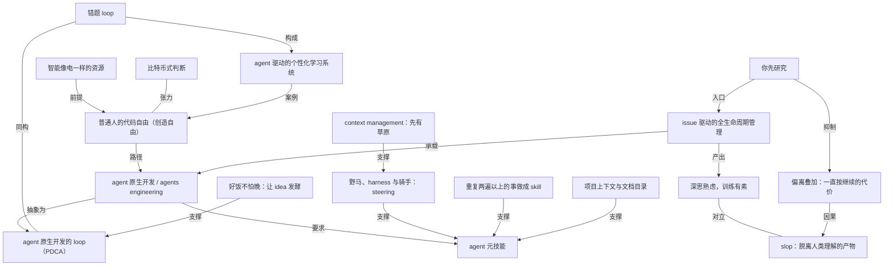

# howie 直播：通过 agent，普通人也可以实现代码自由（创造自由）

- 原文标题：【howie 的 AI 主题讲座】w2634 agent 方法论｜普通人如何实现代码自由
- 内参日期：2026-09-04
- 来源类型：blog
- 标签：ai 实战, agents

> w2634 直播完整文稿，agent week 系列第一场。主线是这半年 agent 在工作、学习、投资场景里的落地变化，以及非程序员靠什么把代码能力接进日常。

## 导读

howie 直播

## 核心观点

- 这是 agent week 系列的第一场直播，主题只有一句话：一个一行代码都不会写的普通人，现在可以通过 agent 实现「代码自由」，也就是创造自由——你想要什么样的代码就有什么样的代码，因为你几乎能用代码实现所有的想法。
- 支撑这个判断的不是理论，是半年的实践量：从 2026 年 2 月 agent 范式确立到 8 月底，个人 token 用量 300 亿（后文更新为 308 亿），全部是 Fable 5、GPT-5.6 这一级别的优质 token；上周四开始的一轮迭代，几天时间发了 99 次版本、烧掉 50 亿 token，把整个阅读挑战 APP 从头到尾重做了一遍。
- 方法论被命名为 **agent 原生开发**（agents engineering）：人负责 idea、业务理解、plan 与 design，agent 负责 build，测试双方都做。剥掉工具层之后，它跟最传统的 PDCA 是一模一样的东西。
- 反面同样明确：脱离人类理解、只靠一张嘴 vibe 出来的产物是 slop，没有人会为它付钱；如果你跟 agent 的交流一直都是「继续」，偏离会逐渐叠加，软件最终一定会崩成一大坨。
- 对 2026 年 agent 范式的整体判断用了一个比喻：它就像比特币——价值是客观的，潜力是客观的，并不取决于街头随便一个大妈是否重视它。即使身边十个有九个不在乎，你或许也应该在乎。

## 开场：为什么 agent 值得占满全部注意力

- 直播缘起：八月底既是小能熊周年庆也是开学节点，围绕学习做系列活动；因为北京连日下雨，这一场改在家里播，用「聊天分享的 vibe」谈主题。
- 年初就说过「今年一整年每次直播的内容都会围绕 agent」，现在看是一语成谶。从 2 月到 8 月整整半年，到了做阶段总结的关口，所以安排周五加下周一三五共 3 到 4 场系列直播，并邀请社区里积极落地的朋友一起分享。
- agent 范式确立的时间线：2 月 OpenClaw 火起来，重点不在于现在还有没有人用它，而在于它开启了本地 agent 的范式，把全社会学习、使用 agent 的氛围和注意力带动起来；同月 OpenAI 的 Codex 桌面 APP 发布；Claude Code 早在 2025 年 2 月就以 CLI 形式发布，进入 26 年后大量非程序员快速用了起来。
- 用极端气候做类比：全球海洋温度是有记录以来最高，北京湿到绿砖上长满青苔——巨变正在发生，但很多人没注意到。agent 带来的变化也是这样：一旦你发现了、关注了、开始收集信息、尤其是亲自实践了，就会恨不得把所有时间、精力、注意力都投进去。
- 「2026 年的 agent 范式，可能就像比特币一样」：它是一种非常高价值的技能、一个最重要的 big thing，但可能一直到 AGI 实现，社会上大部分人也是被动旁观而不是躬身入局。

## 骑手与野马：2026 年大人到底怎么工作

- 跟女儿小树「亲子扯淡」时的演示动机：可以百分之百确定，现在的孩子上大学、工作之后接触到的世界和工作方式，是在座所有人无法想象的全新方式，所以要尽可能早地为巨变做准备。
- 演示内容是 Claude Code 里整天的工作过程：一天的产出放在以前不说一周、可能是一个月的量；写出这样一个软件更是以前永远不可能做到的事。小树会写 C++ 和 Python，而演示者一行都不会写，连 Python、JavaScript、HTML 全都不会。
- 核心比喻（全篇最重要的一个）：
- 大模型是一匹**野马**，动力很澎湃。
  - **harness** 是马身上各种各样的装备工具。
  - 人的角色是装备精良的马身上的**骑手**，做的事情叫 **steering**——操纵、指引强大的马的方向。
  - 由此推出为什么要做 **context management**：因为你得有自己的草原，这样才能驰骋。
- 跟小树开玩笑的说法是「拿着小皮鞭调教，让 agent 像牛马一样干活」，但立刻补一句：这其实很有技术含量，不是拿小皮鞭抽一下这么简单。

## 给孩子开发的解题游戏：一个错题 loop

- 解题大师是一个由七八个 skill 组成的 agent，在 Codex 和 Claude Code 里都有；年初演示过的 MathOS 系统小树仍在用，最近从原来的 agent 升级到 Codex 和 Claude 的 agent 之后质量又大幅提升。
- 演示的题目：在大于 1/7 且小于 3/11 的最简真分数当中，分子不超过 30 的有多少个——「现在小学生做的题目怎么这么难，我看完就懵了」。
- 流程分工（红色环节是家长负责的）：
- 家长拍照录题 → 一个 skill 负责把题转写成精准的 LaTeX 公式。
  - agent 整理题目。
  - 学生自己整理、补充错题原因（「没有思路」「计算错误」等）。
  - agent 结合上下文做主因分析、辅助原因分析、核心原因分析。
  - 孩子消化：看懂 Opus 5 的分析之后，用自己的话写下错在哪里，回顾自己的思路与解题思路。
  - agent 用专门的 skill 设计从基础到进阶到挑战的分层题目；做错了继续收集、继续核对、继续总结。
- **错题 loop** 是最重要的环节：任何一道错题捕获之后走完一个循环——agent 设计练习、孩子做、家长检查、agent 分析、孩子消化。「第一次错就是一道错题，第二次错就是两道错题。」
- 这个 loop 解决的是传统教育的低效环节：一个教室几十个小孩，状态、基础、困难都不一样；有了系统之后「我们永远不用怕错」，任何一道错题以及背后所有原因和知识漏洞都会被捕获，还能进一步生成非常有针对性的小卷——做几十分钟就能对知识点做系统补充。
- 设计上的一条硬要求：孩子一定要主动参与，自己分析自己的错题、自己去看 agent 的原因分析，这是当前流程优化的重点。

## 从 AI 系统到 agent 驱动系统：半年之变

- 年初演示过的一系列系统：MathOS、LanguageOS、StemOS，以及 AI 内参的整个信息流系统。当时它们还只能叫「AI 系统」——用 Notion 作为 database，业务流程在 Notion 里跑，主要靠 Notion 里的 AI 推动流程。
- 半年后，这些系统已经全面升级为独立的、agent 驱动的系统：解题大师由七八个 skill 驱动；内参编辑 agent 由十几个 skill 构成，驱动一个极其复杂的流程——一个人晚上弄一会儿、早上弄一会儿，两个环节的处理就能赶得上十几个专业编辑做的事，甚至是他们做不到的事。
- 变化外溢到其他领域：有一些朋友利用 agent 增强信息的获取、处理和判断，在股市投资上取得了以前无法想象的回报，「抵得上以前吭哧吭哧干多少年」。结论是对这种超能力级别的东西要足够专注，才能把价值挖掘出来。
- 「躬身入局」计划目前仍是内部小范围测试：满足学习时长要求的大会员可以拿到 MathOS 模板，但 agent 不给——那是公司躬身入局小组内部的东西。

## 以战止战，以题止题：教育场景的经济账

- 前提立场：孩子的数学、编程、各种理科能力是教育系统和社会的现实需求，不能逃避解题做题的能力要求。
- 真正的问题在效率：不想让孩子在低效的应试过程中耗掉时间，搞得没时间读书、没时间发展兴趣、没时间玩、没时间睡觉、没时间运动。「应试教培最大的问题就在于效率太低。」
- 解法：用最优质的 agent、最优质的流程、最优质的内容，十倍速提升孩子在标准化应试方面的能力——「以战止战，以题止题」。通过解题大师和围绕错题构建的因材施教系统，让孩子不用经历题海战术、不用走教培模式，却取得更好的效果。
- 成本对照：现在一个线上课一次报名就要一万多块，走教培路线 10 万块钱根本打不住；而一套好的 agent 驱动方案，成本可能只是原来的十分之一，效果却是原方案取不到的。
- 个人在 agent 上的月支出：自己两个会员 450 美金，savage 两个会员 40 美金，加上其他工具，一个月 500 美金打不住。推论很直接——既然有人愿意每月在 agent 上花三四千块、「还恨不得每天给 agent 磕头」，就说明这东西一定创造了吓死人的价值；身边人没用起来，可能只不过说明他们没有看到。

## agent 原生开发：不会写代码的人重做了一个 APP

- 定义：**agent 原生开发**指你不会写代码、完全靠 agent 来实现，用软件把自己热爱的、感兴趣的、专业的、擅长的、有多年积累的东西，打造成优质的、甚至能收费而且能收费很贵的高质量产品。
- 与自己此前「APP 开发 1.0」版本的区别：那时刚刚开始用 agent 做软件开发，methodology、工具、流程、经验都还没到现在这个层面，token 用量也只有几十亿、不到一百亿。所以那时的号召只能是「你得去用」。
- 这轮迭代的实际战果：上周四开始 99 次迭代，单日 token 用量 7 亿、8 亿、5 亿，一周三四十亿到 50 亿；七天挑战、365 挑战、AI 挑战、熊头悬浮、每一张 card、每一个排行榜全部优化了一遍，还做了分享卡（「1545 个夜晚」「加入小能熊 418 天」「105 天前开始使用阅读挑战」）。
- 从五月开始 GitHub 提交记录几乎每天都是绿的；而今年前几个月 agent 的使用还更多集中在通用知识工作场景。
- 传统软件开发流程与普通人无关：产品经理做 idea 设想与可行性分析、写需求文档，CTO 做技术选型，UI 做设计，程序员做前后端和数据库，最后是测试验收和运营——产品的 context 和技能分散在很多工种、很多角色、很多人的脑子和电脑里。
- 现在这一整个过程一个人就能完成，而且这个 APP 实际整合了好几个系统：AI 内参系统、微信登录、微信支付、小鹅通、账号密码与邮箱登录的账户体系、微信支付 API key。

## 用 Linear 承载全生命周期：issue 驱动的开发

- 工具选择：用 Linear 做整个生命周期的管理，被称为「agent 时代的项目管理工具」。「我 50 亿 token、一周的全部工作，就是靠一系列 issue 搞定的。」
- 一个 issue 的写法：看板里每个 issue 都是手写的需求——新增功能、改进已有功能、修复 bug——写清 what、why、how 和注意事项；issue 后半部分的很多内容是 agent 回填的。
- 关键口令是「**你先研究**」：把方案和 plan 提出来，让 agent 先研究，然后两人讨论，人确定方案，之后再执行。第一轮先制定计划，agent 会问不确定的地方，一轮轮确认完再拆解成一系列子任务，然后一个 issue 接着一个 issue 往前推进。
- 场景一（从一个 issue 启动）：219 号 issue 是八天前建的，what 层面是给 APP 的活动瘦身——哪些废弃、哪些上线、哪些继续运行、哪些迭代，细节和文案全部组织好，原因和大概方案讲清楚，再交给 agent。「这十几个 issue 就是我一天的工作量。」
- 场景二（内置浏览器里精准改 UI）：现在的 APP 基本都是网页，每个 coding agent 都带内置浏览器，可以精准选中一个元素、多个元素、跨页面多个元素再提需求。固定话术是：只改 web 端做优化，我挨个反馈你修改，只部署 web 端，我自己验收，你在内置浏览器里调试，准备好了吗。
- 一条反直觉的工作习惯：不喜欢用软件内置的 plan mode，因为每次用 plan mode 会换模型、上下文会切一下。宁可开一个 session 用一整天——一个 Fable 5 的 100 万 context 都没用完，一天在同一对话里改几十个点、提几十个 commit。
- **偏离叠加**这一条讲得最重：上下文不完整、需求模糊时，agent 会偏离得越来越严重；如果你不跟他讨论方案、讨论需求，只是一直按「接受」「继续」，偏离会逐渐叠加，「这个软件一定会崩，最终做成一大坨」。所以你的角色肯定不是一直「继续」，一定要在 plan 和 design 环节尽可能多地掌控。

## 把流程管理的负荷转移给工具

- 每一个需求都建一个 issue（描述过程可能是用 Typeless 开始记录的）；讨论完 agent 把最终方案回填到 issue，执行情况也写回 issue，相关 issue 与任务拆解也在里面——整个 agent 原生开发过程被这个工具全流程把控起来。
- 与过去的对照：1.0 版本时开发管理是在 Logseq 本地笔记里做的，Mac 端、web 端、iOS 端、做什么版本、怎么做、每一个问题都记在里面——那是**任务管理**的方式；换成**项目管理**工具之后，脑子里所有流程管理的负荷全部转移到工具上，「那些不需要你脑子承载的重量」交出去了。
- 项目管理工具还带来人与人的协同：你和你的 agent、你朋友和你朋友的 agent，能共享同一个地方工作、共同处理同一个项目。
- 回答直播间提问（非工程类的事情能不能用 Linear）：背后那一整套方法论就是 agent 时代的项目管理、agent 原生的项目管理。推荐 Linear 是因为这家做了七八年的公司在这个需求上把工具做得非常好用；从 7 月 19 号用到现在一个多月，起了、解决了三四百个 issue。
- 实际的 label 分布：内参编辑 agent 24 个 issue，解题大师 agent 10 个，agent skills 10 个，内参 99 个，阅读挑战 54 个；整个阅读挑战 APP 一个 project 就搞定，迭代 skill、迭代 APP、迭代 agent 都是同一套做法。
- 状态设计（可自定义）：backlog、todo、in progress、in review、done、deployed、canceled、maybe someday。
- 为什么必须有这样一个收纳处：任何一个 idea，没有工具承载的话，要么忘了，要么你现在就去让 agent 执行——agent 五分钟就能执行完，但「你想到一个事就让 agent 立刻执行，其实很难做到深思熟虑」。

## 好饭不怕晚：让需求酝酿发酵

- 早期用 agent 的模式是「从有想法到产品上线就是一个晚上」：微信读书 5 月 16 号晚上七点开放 API，半夜 12 点还没到整个 APP 就上线了。这被当作自己的错误主动承认——之前做得太快了。
- 修正后的模式：agent 执行非常快，但不可能一夜之间做出真正改变很多用户生活、创造很大价值的产品，它需要持续积累。所以「好饭不怕晚」，要让 idea 发酵、把问题收集起来琢磨，确保自己在这个领域有比较深的理解和洞见。
- V2 的实际节奏就是证据：中间有一个月没有动它，然后从「优化阅读挑战的活动矩阵」这一个 issue 出发拆解成一系列 issue，把每个页面逐个优化。

## design 环节：让 agent 用网页交付设计

- 代码由 agent 写，设计也可以直接让 agent 做：Claude Code（推测 Codex 也一样）可以直接用网页的形式交付设计。
- 流程：把需求和想法写成 issue → agent 研究并出方案 → 要求他把方案做成 Artifacts 或一个 HTML 网页呈现 → 你在上面直接提 comments 反馈 → 让 agent 结合反馈精准修改 → 方案审阅通过后一把变成代码。
- 早期还可以让他一版方案探索好几个方向，选定一个方向再迭代好几个版本。APP 里「一生阅读」的呈现就是这样通过对话实现的。
- 一个人想不出来的东西 agent 能想出来：周学习时长的环形呈现、普通阅读闭环与 AI 学习闭环两个环、环里的动效设计，以及周阅读卡的 normal 环、mini 环、standard 环、大环在不同页面中的用法、浅色与暗色版本——「其实不是我想出来的，人也想不出来」。
- 对当前 agent 水平的八字评价：**深思熟虑，训练有素**。方案的全面程度、探索的不同方向、多轮交互后的品质都非常高。所以分工是：人负责驾驶操纵、提供方向和 idea，方案由人和 agent 一起讨论，越往后人负责得越少——人主要在 plan 和 design 这两块。

## 从 AI 编程到 agents engineering

- 名称演变：23、24、25 年这件事叫 AI 编程，或者跟 AI 结对编程——那时程序员自己得懂代码，用 Cursor 一类工具提高效率；到 2026 年，它被称为 **agents engineering**，用 agent 的方式做软件工程，也叫 agent 原生开发。
- 最大的变化，以及一条明确的边界：过去的专业流程你不能完全不管。「你不能说：我啥也不懂，软件运行的原理我什么都不懂，我就靠一张嘴。」脱离人类理解去用 agent 做产品，你可以快速得到一个东西，但那确实就是一种 **slop**——不可能有人为它付钱，也体现不出你的审美、品味、判断力和价值。
- 人保留的环节是什么：产品里周阅读环的设计，背后同步微信读书 API、同步内参 API，怎么了解 API、怎么测试 API、怎么搭建后端、怎么让复杂后端顺畅运行，以及审美和品味到底从哪来。
- 一个具体的业务洞察案例：微信读书 API 不提供单本书每天的阅读数据（只提供每本书一周的数据），所以内驱式学习的进度计划里只能显示「有效阅读日」而不是分钟数。洗碗时忽然想到解法——微信读书不提供，可以用自己后端的逻辑把数据精确算出来，存到自己的数据库里，新的进度统计下周一上线。
- 结论：人对业务的理解、组织需求的能力、对产品的设计特别重要；代码这个过去要花很多钱雇程序员的环节现在基本可以完全省掉；测试环节自己也要做。过去是很多角色层层流转、层层审批、层层开会、层层扯皮，现在是一个人几天发 99 次版本、全程对结果负责，而做的是自己最擅长的部分——idea，以及对 agent 的操纵。
- 体验层面的补充：agent 处理一个需求大概十几分钟，多的话几十分钟甚至一小时，这段时间特别需要让脑子放松，所以做做家务、洗洗碗，或者读内参文章、读微信读书。

## agent 原生开发的 loop：其实就是 PDCA

- 一个不会代码的普通人做 agent 原生开发，要从道法术器不同层面梳理。它绝对不是「在网上搜集了一个 skill」或「纠结用 Claude 还是 Codex、用哪个模型」——那些是术和器层面解决不了的。
- 在法（系统方法论）甚至道的层面，它其实非常简单：过去的流程变成了一个 loop，而这个 loop 跟最传统的项目管理、流程管理——**PDCA**——是一模一样的。这个 loop 与给小树设计的错题 loop 是同一个形状。
- 四个环节的人机配比：
- **plan**：提出 idea、打磨 idea、发酵 idea——走路的时候想，洗碗的时候想，洗澡的时候想，睡觉的时候想；琢磨透了写成一个 issue，交给 agent。人参与最多。
  - **design**：技术栈选择、功能的具体实现方案、UI 的几种不同方向，agent 全程参与，但还是人在把控。人参与最多。
  - **build**：基本全是 agent 去做。
  - **test**：Claude 自己会做测试，人也会人工做。
- 一条纪律贯穿全程：每一个环节都是 agent 全程驱动，同时你也全程把控；「绝对不能说你是一个什么都不懂、只会按继续的人」。
- 半年实践的验证结论：一个不会代码的普通人，完全可以在 agent 时代变成一个创造者，变成一个开发出特别高质量产品的人。

## 道法术器：普通人的代码自由需要什么

- 「道」的层面是一个范式转换：过去只有人才能实现的智能，现在变成了一种你花钱就可以买到的、近乎无限量供应的东西——**它就像电一样，变成一种资源**。
- 所需条件被压缩成三项：你有 idea、你对这件事有业务层面的理解、你懂得驾驭 agent（**agent 元技能**），再配合你专业领域的洞察和理解。
- **代码自由**的定义：你想要什么样的代码就有什么样的代码，代码对你来讲没有任何问题，因为你几乎能用代码实现所有的想法。这种能力由很多更小的砖块组成。
- 砖块一｜**一切重复两遍以上的事，都做成 skill**：
- 判据很直接——任何一件事如果你要做两遍三遍以上、想做得更快更好更不费脑子，就应该把它建成一个 skill。
  - 造 skill 的方法出奇简单：把「我为什么要创建这个 skill、场景是什么、应该包括哪些内容、几个具体案例」写成一二三四五六七八共几百字的笔记，甩给 agent，它就能直接创建成一个 skill。Linear 的 create issue skill 是 8 月 17 号这么建出来的。
  - 改进 skill 也一样：提一个 issue，说清 what、希望它怎么做、有什么特点、为什么这么做、具体方案怎么做，甩给它就完成了。
- 砖块二｜**agent 社交礼仪**（一个真实的踩坑案例）：
- 打通内参需要阿禅那边负责，需求由 Claude Code 写好后直接在 Linear 里指派给他。技术层面的沟通由 agent 来做有明显好处——上下文写得非常清楚，即使产生误解，因为在同一个上下文、同一个对话里也能快速处理完。
  - 但阿禅的反馈是：「感觉你看到一大波 AI 生成的内容 @ 我，说实话看着有点不舒服。」
  - 由此确立的礼仪：不应该把 AI 生成的一堆内容怼到一个大活人脸上；不能用 AI 生成一个工作方案甩给同事，不能用 AI 生成一大段话直接回复别人；凡是跟人打交道的东西，一定要自己亲自写。
  - 落回 skill 的修改：让 agent 更新 issue 信息时不要模仿人，不要 @ 人，不要模仿我说话；agent 回填就标明是 agent 回填，只提供相关上下文和信息。一句话总结——**人不要模仿 agent，agent 也不要模仿人**。
- 砖块三｜**项目上下文**：每个项目有自己的 `AGENTS.md`，它本质是一个目录，指向一系列相关文档——技术栈、前端方案、微信读书 API 测试环境、小鹅通网关、数据模型、CSS 治理、OpenAPI 规范各一个文档。用 agent 做项目开发，所有上下文都在一个项目里管理。
- 砖块四｜**基础设施逐个补齐**：Linear 做项目管理、GitHub 做版本控制、API 工具、微信开放平台账号、认证登录系统……这些在 agent 之前「对我来讲都过于复杂，完全没办法做到」，但对做知识工作、用电脑工作的人来说学起来特别快。

## 微信读书 API：一个宝藏案例

- 发现路径：微信读书 5 月 16 号开放 skills，就必须把 API 开放出来——虽然它没有明确说开放了 API。装下官方 skill 一看文档，里面有 API gateway、有网关、有整套鉴权方式、有各种接口，「这不就是 API 的各种接口吗」。当天晚上就做出了阅读挑战 APP。
- 进一步的动作：让 Claude Code 做了一套微信读书 API 的 lab，可以自己把玩、测试 API，甚至自己设计新接口。
- 实测到的接口细节：发请求拿回数据后发现周一到周四每一天是一个 review 字段；返回 book ID 可以精准定位一本书；返回 title；book info 接口返回一本书的所有相关信息。
- 关键结论：它故意不提供单本书每天的阅读时长，但当你对 API 有一定了解、亲自上手测试之后，就可以想出解决方案精准算出来——「你自己实现了一个微信官方都不给你的功能」。这些属于「器」的层面。
- 附带的方法示范（怎么让 agent 补齐你完全不懂的工具）：起一个 issue 叫「新增一个功能，叫微信读书 API 的测试环境」，写清 why 和 what，how 里的具体方案不知道也没关系，只要把所有上下文给足——官方链接在哪、装的 skill 文档在什么路径、API key 在什么地方、鉴权方式是什么。方案出来后拿到 Bruno 配置文件不会用，就直接说「我不知道」，agent 会开本地服务器、把代码更新回填，事情就成了。
- 「这种事你会发现，一辈子只做一遍」：搭建 API 测试环境、做一个自己把玩的 lab，做一遍就固化下来了，后续要加「多把 API key 切换」这样的功能，写下 issue 就手到病除。
- 代码审核这一层也不难：红色是删除、绿色是增加；用 GitHub Desktop 管理不同的 worktree、不同的 branch，每次提交都能看到 TypeScript、JS 的代码变化，从而对内部了解得更多。

## 学习的加速度

- agent 跟抖音、小红书这类工具不同：不是下载了不用学就会刷，它需要你学习一些基本的工具、技能和知识。但只要用它来工作和做事，「它的加速度非常令人震惊」。
- GitHub profile 是一条可见的曲线：25 年只有 5 次提交，24 年、23 年稀稀拉拉（那时只用它做写书文档的版本控制）；到 26 年从 5 月 3、4 号开始一天都没断过。
- 只要用大白话跟 agent 交互就可以，你需要的是理解「什么叫 API」「Bruno 是个什么东西」这一层的概念，具体配置不会也没关系。
- 记笔记的价值反而更大了：微信读书 API 的笔记从 6 月 23 号开始，涉及一系列字段；官方 weread skill 的笔记从 5 月 16 号安装当天创建，每一次迭代、优化、学习、版本升级都有记录，`book.md` 和 read data 两个接口的测试部分全部记在笔记里。
- 需要建立的知识面清单：什么是 API、Bruno 这类工具、Linear 的 issue 与 project 与方法论、技术栈里的 Postgres 与 Supabase 这类数据库工具——都只需要一点点知识，知道它是什么、大概怎么用、有什么用。
- 再加上 agent 那一套概念：玩转 skills、自己写 skills、把一系列 skills 打包成 agent plugin、自己写 `AGENTS.md` 做项目管理文档，把自己的经验跟 agent 结合在一起；以及对互联网技术的概念层理解（微信登录、GitHub、版本控制、编程是什么）。
- 应用面被明确外推：开发你想用的任何软件、工具、系统——解决孩子学习的问题，把你的专业变成一个产品，做一个一人公司，擅长投资理财就做一个投资理财的 agent、做一个 SaaS 服务。

## agent 基建，正当其时

- 一个来自多年终身学习社群的冷判断：**人是最不愿意学习的**。除非能立刻发财、立刻见好处，否则你跟绝大部分人说 agent 技术是革命性的、能让你实现毕生梦想，大部分人其实不会去学。
- 但这不改变结论。2026 年小能熊 11 周年的主题就定为：**agent 基建，正当其时**——你电脑上整理收集的工具、你在用的工具、你的知识、你的 skills，以及你整合出来的这套 agent 原生开发方法论，值得把全部时间和精力用上去。
- 采纳度数据（小能熊内部排行榜）：本人 308 亿 token 用量；有数据的 40 个人里，用到 50 亿 token 的大概只有 20 个人。社会层面「可能真的没有人真正重视」。
- 收束回开篇的比喻：它就像比特币一样，并不是所有人都用了你才应该去用；它的价值是客观的，释放的潜力是客观的，就看谁能获得 agent 带来的价值。
- 解锁的门槛也说得很直白：让 agent 助力你成为一个实现创造自由的人——有创造的想法、有创造的基础、有 agent 帮助，「其实已经没有任何阻碍了」，但要解锁这种现实，还是需要海量的 token 投入。

## 明天上架：Claude 官方的 AI 原生开发手册专题

- Claude Code 官方 Academy 出了一个 AI 原生软件开发的 playbook，共 14 课：introduction、plan 阶段、设计方案阶段、代码构建阶段、测试阶段、部署阶段、维护阶段、结束阶段；全英文，消化起来不轻松。
- 所以第二天 AI 内参会上架一个全新专题，把整个 Claude Code Academy 做成一个专题——「它的方法论跟我今天讲的东西是完全一样的，只不过它的内容可能更复杂一点、更专业一点、更细一点；我的版本是极简的」。
- 顺带交代了内参这套 agent 信息流的价值主张：像 AI 芯片架构这样的长文（英伟达、Vera Rubin、HBM，HBM 与 DRAM、NAND Flash 的关系，美光、闪迪）是财富密码，但没有 agent 驱动就处理不了这些海量信息；有了 agent 全程驱动，理解门槛和信息输入门槛被解决，你要做的是基于跟 agent 的合作形成自己的理解、判断和思考。
- 本人的日常流程：每天花几分钟浏览当天二三十篇文章，有价值的收藏到相应清单，当天挑其中的文章读，边划线边记笔记；读者还能看到所有人的划线，「跟我们在微信读书里共读一本书是一样的体验」。

## 答疑与下周预告

- 下周安排：Savage 做一场关于内驱式学习与家庭教育的直播；本人结合理科、数学、编程场景讲家长如何躬身入局；agent lab 邀请学员秀乐分享，与阿成一起主持。
- AI 内参的定位说明：它是把「我自己获取信息、处理信息、驱动一整套系统的东西」做成了给大家用的产品；从 OpenClaw 发布第三天起做的第一个测试项目就是它，运行到现在大约 3000 篇内容；里面有高质量、没有时效性的内容，有代码库和 GitHub project，每一个 podcast 自己听要两三个小时还记不住，走这套流程效率和省时非常可观，最终会变成一个 changelog。
- 点赞互评功能下周或许可以上线（阿禅认为用户太少不该做，需要说服）。
- 大会员福利：MathOS、写作 OS、投资类 OS 等模板可以直接分享，包括 MathOS 和 LanguageOS 模板；有了系统框架和流程可以直接用 Notion AI，也可以自己设计 agent 来操纵这些系统。
- 对解题游戏的正名：它「实际上是一个我认为非常严肃的项目」——给孩子一个 agent 范式之下因材施教的系统，所有错题、知识薄弱处、掌握不牢处、模糊处都进这个系统，不怕犯错，犯了错都能在 loop 里完全解决。对照教培：一次一万多块，不管什么样的小孩上课都是做题讲题、变得非常消极，用人来做教培的方案本质上天然不如用顶级模型、最好流程、最好 agent 的方案。
- LanguageOS 的进度：年初做过简单的内部测试版本，时间安排会晚一点，等它做成正式产品时会像 AI 内参一样成熟；一个人精力有限，所以选择集中地挨个解决，但前面积累多了，后面 LanguageOS 和 MathOS 的进度会越来越快。
- 收尾：直播两小时雷打不动；周日是周年庆但要陪小树，下一场直播定在下周一。

## 概念网络

### 关键概念

#### 普通人的代码自由（创造自由）

**context**：全场的落点概念。原文定义为「你想要什么样的代码就有什么样的代码，代码对你来讲没有任何问题，因为你几乎能用代码实现所有的想法」，并进一步等同于创造自由——「有创造的想法、有创造的基础，有 agent 帮助你，其实已经没有任何阻碍了」。它是一种由很多更小的砖块组成的复合能力，不是单一技巧。

**费曼一下**：过去「会不会编程」是一道闸门，闸门后面是所有你想做但做不出来的东西。代码自由不是说你突然会写代码了，而是这道闸门对你不再存在：想法到产品之间那段路，不再由「你会不会写」决定，而由「你想不想得清楚」决定。

#### agent 原生开发 / agents engineering

**context**：本场提出的方法论名称。指「你不会写代码，完全靠 agent 来实现，用软件打造自己的产品」，把自己热爱的、专业的、有多年积累的东西做成能收费而且能收费很贵的高质量产品。原文特意做了历史对照：23 到 25 年这件事叫 AI 编程或跟 AI 结对编程（程序员用 Cursor 提效），2026 年才变成用 agent 的方式做软件工程。

**费曼一下**：结对编程是两个都会写代码的人坐一起；agent 原生开发是一个不会写代码的人当项目负责人，把整个工程团队换成 agent。名字的变化不是包装，而是分工位置变了——人从「写得快一点」挪到了「决定写什么」。

#### 野马、harness 与骑手：steering

**context**：全篇最重要的比喻，用来解释 2026 年人的角色。大模型是一匹动力澎湃的野马，harness 是马身上各种各样的装备工具，人是装备精良的马身上的骑手，做的事情叫 steering——操纵、指引强大的马的方向。被作者称为「一直以来觉得对 2026 年解释得最清楚的一个比喻」。

**费曼一下**：模型不缺力气，缺方向。你的价值不在于自己跑得多快，而在于你坐在上面、知道要去哪、并且能让这股力气朝那个方向使。骑手不用比马跑得快。

#### context management：先有草原才能驰骋

**context**：从骑手比喻直接推出的实践要求——「我们为什么要做 context management，为什么要管理自己的上下文？因为你得有自己的草原，这样你才能驰骋」。在具体操作上体现为：一个 session 用一整天不换、把截图/本地代码引用/素材尽可能多地喂进同一个对话、用产品控制表把想法与方案集中到一个地方。

**费曼一下**：agent 的表现好坏，一半取决于它面前摊着多少你的东西。上下文管理不是整理癖，是给那匹马圈一块能跑的地——地方越大越平整，它跑得越远。

#### agent 元技能

**context**：原文把「懂得驾驭 agent」单列为一种可迁移的元技能，与「有 idea」「有业务层面的理解」并列为普通人实现代码自由的三个条件之一，再配合专业领域的洞察和理解。它由玩转 skills、自己写 skills、打包 plugin、写 `AGENTS.md` 等一系列具体能力构成。

**费曼一下**：不是「会用某个 AI 产品」，而是「会指挥任意一个 agent 完成一件你自己不会做的事」。工具会换，这层能力不会作废，所以值得单独练。

#### 错题 loop

**context**：给孩子设计的学习系统的核心机制。任何一道错题捕获之后走完一个循环：agent 设计练习 → 孩子做 → 家长检查 → agent 分析 → 孩子消化。原文的判据是「第一次错就是一道错题，第二次错就是两道错题」，并强调孩子必须主动参与、自己分析自己的错题。

**费曼一下**：传统做法是错题被订正一次就翻篇；loop 的做法是错题被留在系统里循环，直到它真的不再出现。区别不在于做了多少题，而在于错误有没有出口。

#### 以战止战，以题止题

**context**：面对应试现实的策略立场。前提是承认解题做题的能力要求不能逃避，问题在于「应试教培最大的问题就在于效率太低」；解法是用最优质的 agent、流程和内容十倍速提升标准化应试能力，从而让孩子不用经历题海战术、不用走教培模式却取得更好效果。成本对照是教培十万起步 vs 十分之一的成本。

**费曼一下**：不跟规则对抗，而是把规则要求的事做得极其高效，从而把时间赎回来。孩子拿回的不是「不用做题」，是做完题之后还剩下的读书、运动、睡觉和玩的时间。

#### 从 AI 系统到 agent 驱动系统

**context**：半年之变的概括。年初的 MathOS、LanguageOS、StemOS、AI 内参信息流还只是「AI 系统」——用 Notion 作为 database、流程在 Notion 里跑、主要靠 Notion 里的 AI 推动；半年后全面升级为独立的、由多个 skill 构成的 agent 驱动系统，例如内参编辑 agent 由十几个 skill 驱动一个极其复杂的流程。

**费曼一下**：前者是在一个软件里叫 AI 帮你处理某一步；后者是让 agent 端到端跑完整条流水线，软件退化成它的数据库。中间隔着的不是模型能力，是你有没有把流程拆成 skill。

#### issue 驱动的全生命周期管理

**context**：用 Linear 承载 agent 原生开发的做法。「我 50 亿 token、一周的全部工作，就是靠一系列 issue 搞定的」——每个 issue 是手写需求（what/why/how 与注意事项），讨论后的最终方案和执行情况都由 agent 回填到同一个 issue，任务拆解也在里面。与之对照的是 1.0 时期在 Logseq 里做的任务管理。

**费曼一下**：issue 是人和 agent 之间唯一的交接口。需求、方案、执行记录都压在同一张卡片上，谁来接手都不用重新问一遍前因后果——这就是把流程管理的负荷从脑子转移到工具上。

#### 「你先研究」

**context**：反复出现的口令，被称为「特别好使」。完整形态是：我把方案和 plan 提出来，你先研究，然后咱俩讨论，我确定方案，之后再执行。它同时是场景一（从 issue 启动）和场景二（内置浏览器改 UI）的共同开场动作。

**费曼一下**：在让 agent 动手之前先让它读懂全局。这一句话把「立刻执行」换成了「先对齐」，而绝大多数返工都发生在没对齐的那一步。

#### 深思熟虑，训练有素

**context**：对当前 agent 解决人的需求水平的八字评价。依据是方案的全面程度、探索的不同方向、多轮交互后提供的品质；具体例证是周阅读环的双闭环设计与动效、周阅读卡的 normal/mini/standard/大环在不同页面和明暗版本的用法——「其实不是我想出来的，人也想不出来」。

**费曼一下**：这不是夸 agent 聪明，而是说它有那种做事很稳的人的特征：想得全、给得多、改得动。你给一个模糊的 idea，它还回来一个考虑周全的方案。

#### slop：脱离人类理解的产物

**context**：agent 原生开发的反面边界。「你不能说：我啥也不懂，软件运行的原理我什么都不懂，我就靠一张嘴。」脱离人类理解去用 agent 做产品，可以快速得到一个东西，但那是 slop——不可能有人为它付钱，也体现不出你的审美、品味、判断力和价值。「那种 vibe 出来的东西肯定是不行的。」

**费曼一下**：能跑起来和值得付钱是两回事。你不理解的东西，你就没法为它的品质负责；而没人为品质负责的产品，用户第一眼就能看出来。

#### 偏离叠加：一直按「继续」的代价

**context**：对失控路径的机制性描述。上下文不完整、需求模糊时 agent 会偏离得越来越严重；如果不跟他讨论方案、讨论需求，只是一直按「接受」「继续」，偏离会逐渐叠加，「这个软件一定会崩，最终做成一大坨」。因此结论是必须在 plan 和 design 环节尽可能多地掌控。

**费曼一下**：每一步的小偏差单看都能接受，但它们会相乘而不是相消。「继续」是最省力的操作，也是最贵的操作——代价在几十步之后一次性结算。

#### agent 原生开发的 loop（即 PDCA）

**context**：全场方法论的最终形态。过去那条多角色流转的传统流程被折叠成一个 loop，而这个 loop「跟我们最传统的项目管理、流程管理——PDCA——是一模一样的」。四环节的人机配比是：plan 与 design 人参与最多，build 基本全是 agent，test 双方都做。它与错题 loop 是同一个形状。

**费曼一下**：新工具没有带来新方法论，它只是让一个旧方法论第一次对个人可行。以前 PDCA 需要一个团队才跑得动，现在一个人加一群 agent 就能跑完整圈。

#### 好饭不怕晚：让 idea 发酵

**context**：对早期用法的自我修正。早期「从有想法到产品上线就是一个晚上」——微信读书 5 月 16 号晚七点开放 API，不到半夜十二点 APP 就上线了，这被当作错误主动承认。修正后的做法是让 idea 发酵：走路、洗碗、洗澡、睡觉的时候想，把问题收集起来琢磨，V2 中间空了一个月没动就是证据。

**费曼一下**：agent 把执行时间压到了几乎为零，于是产品的质量差距全部转移到了「你想了多久」上。既然做只要一晚上，那就把省下来的时间用在想清楚上——这才是快带来的真正红利。

#### 一切重复两遍以上的事，都做成 skill

**context**：把能力沉淀成基础设施的判据。「任何一件事情，如果你要做它两遍三遍以上，想做得更快、更好、更不费脑子，你就应该把它建成一个 skill。」造 skill 的成本极低：把为什么做、场景是什么、应该包括什么、几个具体案例写成几百字的笔记甩给 agent 即可（Linear 的 create issue skill 就是这么在 8 月 17 号建出来的）；改进 skill 同样只是提一个 issue。

**费曼一下**：skill 是你把自己的做事方式写下来交给 agent 执行。写一次，以后每一次它都按你的方式做——这是个人经验唯一能被复利化的形式。

#### agent 社交礼仪：人不模仿 agent，agent 也不模仿人

**context**：由真实冲突催生的一条规范。协作者阿禅的反馈是「感觉你看到一大波 AI 生成的内容 @ 我，说实话看着有点不舒服」。由此确立：不应该把 AI 生成的一堆内容怼到大活人脸上，不能用 AI 生成方案甩给同事、生成一大段话直接回复别人；凡是跟人打交道的东西一定要自己亲自写。落到 skill 的修改是：agent 回填就标明是 agent 回填，不 @ 人、不模仿人说话。

**费曼一下**：agent 可以替你干活，但不能替你出面。把身份标清楚——机器说的话标成机器说的，人说的话由人自己写——协作里的不适感就消失了。

#### 项目的上下文：AGENTS.md 与文档目录

**context**：agent 原生开发的项目级基础设施。每个项目有自己的 `AGENTS.md`，它本质是一个目录，指向一系列相关文档：技术栈、前端方案、微信读书 API 测试环境、小鹅通网关、数据模型、CSS 治理、OpenAPI 规范各一个文档。「用 agent 做项目开发，基本上所有的上下文在一个项目里管理。」

**费曼一下**：新来的同事第一天要读的东西，现在写给 agent 读。它不需要你解释所有细节，只需要一个可靠的索引，告诉它「这个项目的答案都在哪儿」。

#### 智能像电一样的资源

**context**：「道」层面的范式判断。「过去只有人才能实现的智能，现在变成了一种你花钱就可以买到的、近乎无限量供应的东西——它就像电一样，变成一种资源。」这一判断是全部方法论的前提，也解释了为什么阻力从「做不做得出来」变成了「想不想得清楚」。

**费曼一下**：稀缺的东西一旦变成可购买的公用资源，围绕它的一切分工都会重排。就像有了电之后，问题不再是「怎么获得动力」，而是「你要用这股动力做什么」。

#### 比特币式判断：价值的客观性与采纳率无关

**context**：贯穿开场和收尾的论证结构。「2026 年的 agent 范式，可能就像比特币一样」——它的影响和价值不取决于街头随便一个大妈是否重视，可能一直到 AGI 实现，大部分人也是被动旁观。收尾的数据支撑是：小能熊内部有数据的 40 人里，用到 50 亿 token 的大概只有 20 个人。配套的冷判断是「人是最不愿意学习的」。

**费曼一下**：「大家都没在用」不是一个反对理由，它只是一条关于别人的事实。判断一件事值不值得投入，要看它对你能产生什么，而不是看有多少人已经在做。

### 概念网络

整张网络的重心是一条从「前提」到「路径」再到「纪律」的链条。

**顶层前提：为什么现在可以谈这件事。** 智能像电一样变成可购买的近乎无限量资源，这是全部论证的地基——阻力从「做不做得出来」转移到了「想不想得清楚」，普通人的代码自由才第一次成为可讨论的目标。与它并列的比特币式判断则处理另一个方向的阻力：不是技术上做不到，而是社会上没人在做。两者构成张力关系——一个说条件已经成熟，一个承认成熟的条件并不会自动带来采纳，而正是这种张力让「你或许也应该在乎」成为一个需要个人主动做出的判断，而非趋势推着走的结论。

**中层路径：代码自由靠什么兑现。** 代码自由不是一种技能，而是一个由砖块组成的能力包，agent 原生开发是它的实现路径。这条路径向下要求 agent 元技能，而元技能又由三组砖块共同支撑：骑手比喻确立了人的角色定位（steering 而非亲自动手），上下文管理为这个角色提供了可操作的落点（先有草原才能驰骋），skill 化与项目文档目录则把一次性经验固化成可复用的基础设施。这四者的关系是层级而非并列——比喻定位方向，上下文管理、skill 与文档是让方向可执行的具体装备。

**承载层：流程装在哪里。** issue 驱动的全生命周期管理是 agent 原生开发的物理容器，「你先研究」是进入这个容器的固定入口。这条支线跑通后的产出是「深思熟虑，训练有素」——它不是对模型的赞美，而是一个可验证的结果：给足上下文、经过多轮讨论，agent 交回的方案质量确实高到人想不出来。

**纪律层：两条对立关系撑起全篇的边界。** slop 与「深思熟虑」构成正面对立——同一个 agent，在有人类理解参与时产出高质量方案，在只靠一张嘴时产出没人愿意付钱的东西。而通向 slop 的具体机制是偏离叠加：需求模糊加上一路按「继续」，误差不会互相抵消而会相乘。「你先研究」正是对这条机制的抑制手段，这解释了为什么口令层面的一句话能被反复强调——它不是习惯，是防线。

**抽象层与同构证据。** agent 原生开发向上抽象为 PDCA 式的 loop，而给孩子设计的错题 loop 与它是同构关系：两者都拒绝一次性穷尽（不着急做完所有错题，也不着急让 idea 一小时内变成产品），都靠循环而非单次投入解决问题。这个同构不是修辞，它是全篇最有说服力的论证——同一个形状同时跑通了软件开发和家庭教育两个完全不同的领域，说明它属于方法论而非领域技巧。「好饭不怕晚」则是这个 loop 在时间维度上的补充条件：执行成本降到接近零之后，质量差距全部转移到了酝酿时长上。

**闭合：从学习系统回到主张。** 错题 loop 构成 agent 驱动的个性化学习系统，而这个系统本身又是「普通人的代码自由」最有力的案例——一个不会写代码的家长，用 agent 造出了一套过去无法想象的因材施教方案。网络在这里闭合：主张产生方法，方法产生系统，系统反过来验证主张。

## 费曼 x3

身边十个人有九个不在乎 agent，这不构成任何反对意见。比特币的价值从来不取决于街头随便一个大妈是否重视它——一件事的潜力是客观的，跟采纳率是两码事。所以真正该问的不是「大家用不用」，而是「我能不能用它做出以前做不出来的东西」。

一行代码都不会写的人，几天时间发 99 次版本、烧掉 50 亿 token 把一个 APP 从头重做——这件事本身不算稀奇，稀奇的是它靠的不是技巧。大模型已经是一匹动力澎湃的野马，harness 是它身上的装备，人的角色是骑手，做的事情叫 steering。骑手不用比马跑得快，但得知道去哪儿。也正因如此才要管理自己的上下文：你得有自己的草原，这样才能驰骋。

反面同样清楚。脱离人类理解去用 agent，你可以很快得到一个东西，但那是 slop，不可能有人为它付钱，它也体现不出你的审美、品味、判断力和价值。危险的地方在于失控的方式非常温和：需求模糊、上下文不完整，agent 就一点点偏离，而如果你的交流永远是「接受」「继续」，偏离会逐渐叠加，最终一定崩成一大坨。每一步的小偏差单看都能接受，但它们相乘而不是相消。所以人在后面参与得越少，恰恰要求人在最前面参与得越深——plan 和 design 这两个环节，是掌控唯一能发生的地方。

方法论于是回到了最朴素的地方：plan、design、build、test，就是 PDCA。它跟给孩子设计的那个错题 loop 是同一个形状——不着急把世上所有的错题全部做完，也不着急让脑子里冒出的任何一个 idea 在一小时之内变成产品。走路的时候想，洗碗的时候想，洗澡的时候想，睡觉的时候想，想透了写成一个 issue，再交给 agent。好饭不怕晚。执行时间被压到接近零之后，产品之间的差距全部转移到了「你酝酿了多久」上，这才是快带来的真正红利。

剩下的就是把能力拆成砖块：一切要做两遍三遍以上的事都做成 skill，项目的上下文收进 `AGENTS.md` 和一系列文档，Linear、GitHub、API 工具一件件补齐。这些东西在 agent 之前对一个非程序员过于复杂，现在学起来特别快。而底下那个前提是：过去只有人才能实现的智能，如今变成了花钱就能买到、近乎无限量供应的东西——它就像电一样，变成了一种资源。当创造的阻碍只剩下「你有没有想清楚要创造什么」，代码自由其实就是创造自由。它已经是现实，只不过解锁它需要的是海量 token 的实际投入，而不是一个更好的看法。

## 阅读原文

周: w2634

日期: 2026/08/28

三级笔记: [Untitled](https://app.notion.com/p/3cb679b108ff81549337ec13275004af)

🎙️ howie 的 AI 主题直播: 【howie 的 AI 主题讲座】w2634 agent 方法论｜普通人如何实现代码自由？ ([Untitled](https://app.notion.com/p/3c8679b108ff81359cf9f3e6de8d5161))

howie 的 AI 主题讲座 · 2026 年 8 月 28 日直播（agent week 第一场）· 直播文稿

欢迎大家，好久不见，我们八点正式开始。

一眨眼八月都快结束了。非常巧的是，每年八月的结束也是我们小能熊周年庆的日子，又恰逢开学，我觉得这个时间节点挺好的：在开学的节点，围绕学习这件事情，结合当下最重要的主题，搞一些系列活动，大家一起热闹一下、庆祝一下。

今天北京还一直在下雨，我不想在公司直播到晚上十点再走回家，所以就在家里播了。在家里播也更有趣味一点，用一种聊天分享的 vibe 跟大家谈一些主题。我的想法是这周五和下周搞多次系列直播，归于一个主题之下——agent。年初的时候我就说过，很有可能我今年一整年每次直播的内容都会围绕 agent，可能一语成谶，agent 真的就是这么重要。从今年 2 月份到现在 8 月份，整整半年的时间。这半年之后，我们回头来看 agent 的发展落地——在我们的工作、生活、学习、投资理财当中，agent 能给大家带来怎样天翻地覆的变化——我觉得这是一个特别好的主题。所以一方面是我自己的分享，另一方面我也希望邀请一些朋友，邀请小能熊社区里积极落地的朋友一起来做分享。我个人会觉得，多一些碰撞、多展示一些真实具体的案例，可能会激发大家对这件事情本身的重视。

今年真是多灾多难。我感觉整个暑假就是全球的极端天气：极端厄尔尼诺、各种各样的气象灾害，造成伤亡的频繁程度，这种天灾以前几十年都没有见过。现在全球气候变暖，海洋温度是有数据记录以来最高的，导致冰川融化、气候异常，北京现在变成了江南，从来没有这么湿过，从早到晚地下雨，甚至绿色的砖上都长满了青苔，让你以为自己是在苏州之类的地方，真的非常夸张。

当然，我会觉得 agent 在各方面给大家带来的变化，可能就跟现在这种气候环境的巨变挺类似的：很多人没注意到。但是你一旦发现了、关注了、开始收集这方面的信息了，尤其是一旦亲自去实践了，你会发现，我们恨不得把所有的时间、精力、注意力都投入到 agent 这一件重要的事情上来。

### 年的 agent 范式：像比特币一样的东西

我不知道大家怎么理解目前的 agent 范式。我跟很多人讨论过，大家会说：现实生活中大家并不在乎，公司里也没有人用这个东西，只是一小部分人想得太理想主义了，事实上这个技能在社会中大家都感受不到，没有人在乎。但我觉得可以打一个比方：2026 年的 agent 范式，可能就像比特币一样。它的影响有多大、它的重要性程度和价值，并不取决于街头随便一个大妈都能把它重视起来、实践起来。它实际上是一种非常高价值的技能，一个最重要的 big thing。但可能一直到 AGI 实现，社会上的大部分人也是被动旁观的，而不是躬身入局、亲自参与的。所以我觉得这个比方挺好的：2026 年的 agent 范式，即使身边的人不在乎，或许你也应该在乎。

好，欢迎直播间的朋友们，好久不见。今天是我们 agent week 的第一场直播。为什么想做 agent week 这个系列呢？我会觉得，2026 年从 2 月份 OpenClaw 火起来之后——并不是说现在大家还在用它，而是它开启了一种本地 agent 的范式，把全社会学习 agent、使用 agent 的氛围带动起来了，把注意力激发起来了，大家重新因为 AI 而兴奋。OpenAI 的 Codex 桌面 APP 也是在今年 2 月份发布的；Claude Code 则是 2025 年 2 月就发布了，最开始是 CLI 命令行的版本，到 26 年之后，陆续有更多非程序员快速地用了起来。所以我会觉得，从今年 2 月份开始，agent 的范式整个确立了，如火如荼发展到现在，整整有了半年时间，到了一个阶段总结的关口。我不知道大家的 token 用量是多少，我大概统计了一下我自己的总量：用了 300 亿 token，都是 Fable 5 和 GPT-5.6 这个级别的优质 token。当我们有这么多实践，这个时候再回头做一个系列总结，就特别值得了。所以我希望从这周五开始，下周一三五轮着做 3 到 4 次主题直播——关于 agent，可聊的东西太多了。

### 拿着小皮鞭的骑手：给小树演示 2026 年大人怎么工作

今天的内容还挺多，开头先说得轻松一点。前两天跟小树聊天——或者我称之为扯淡。我说的扯淡，实际上是扯一扯生活的咸和淡，并不是 egg 那个蛋。用一种轻松无厘头的方式，把一些重要的 idea 和主题融入其中，所以我把它称之为"亲子扯淡"。

我会给小树看我在电脑上是怎么工作的。其实我就是在跟她展示，或者说炫耀一下：2026 年的时候，大人到底是怎么工作的。小树会写 C++ 的程序、会写 Python 的程序，但我是一行都不会写，我连 Python 都不会写，JavaScript、HTML 全都不会。但我给小树看的意思是：可以百分之百确定，我们现在的孩子上大学、工作之后，他们所接触到的世界、他们工作的方式，都是我们在座所有人无法想象的，会是一种全新的方式。所以我希望尽可能早地为这些巨变做准备。我给她看的，就是我 Claude Code 里整个的工作过程：我一整天做的工作，放在以前不说一周，可能是一个月的量；像写出一个这样的软件，更是我以前永远不可能做到的事情。但我用一周的时间发了 99 个更新，把整个阅读挑战 APP 的所有功能全部做了一遍。

然后我给小树展示：这个过程当中，大人不干活，都是 agent 在干活。我跟她开玩笑说，我就是拿着小皮鞭调教，让我的 agent 像牛马一样干活，我的整个作用就是拿着小皮鞭调教。当然，这其实也是很有技术含量的，不是拿小皮鞭抽一下这么简单。我们现在的大模型，实际上是一匹野马，动力很澎湃；harness 就是它身上各种各样的装备工具。2026 年我们用 agent 来工作、投资理财、学习、做一切事情的时候，我们的角色实际上是装备精良的马身上的骑手。我们在做的事情就是 steering——我们在操纵，在指引强大的马的方向。这是我一直以来觉得对 2026 年解释得最清楚的一个比喻：agent 就像这样一匹马。所以我们为什么要做 context management，为什么要管理自己的上下文？因为你得有自己的草原，这样你才能驰骋。

### 给孩子开发的解题游戏：一个错题 loop

另外我还跟小树开了个玩笑，我说这是"父爱如山"的环节：我给你开发个游戏好不好？她说不要。我说其实你已经玩上了我给你开发的游戏。我给她开发了什么游戏呢？一个数学游戏、解题游戏。在我的 Codex 和 Claude Code 里，都有一个 agent 叫解题大师。这个解题大师是我设计的七八个各种各样的 skill 组成的。年初的时候我给大家演示过我的 MathOS 系统，现在小树还在用。最近从原来的 agent 升级到 Codex 和 Claude 的 agent 之后，整个质量又做了大幅的进一步提升。

我给大家展示一下大概的情况。找一道小树最近做的题：在大于 1/7 且小于 3/11 的最简真分数当中，分子不超过 30 的有多少个。我觉得现在小学生做的题目怎么这么难，我看完就懵了。但用了 agent 之后，我直接一拍照，把题往里面一扔，就会调用一系列 skill：一个 skill 负责把它转写成精准的 LaTeX 公式。整个流程里，红色的是我负责的环节：我录完题目之后，agent 来整理题目；小树作为学生来整理、补充她错题的原因；然后又到 agent 接手的环节——当孩子说"这道题我没有思路"，或者"这道题是我计算错误"的时候，把这些相关信息收集完，agent 结合上下文做主因分析、辅助原因分析、核心原因分析。

分析完之后，我会让小树把原因消化一遍：你自己做错了一道题，或者不会做，Opus 5 给你分析的这些东西，你有没有看懂？看懂之后，写下你自己相关的补充——你错在哪里，用自己的话来说，然后回顾你自己的思路和解题的思路。

基于前面这两步——孩子参与的、家长参与的、agent 参与的错题收集、原因分析、孩子的消化处理和原因总结——我再让 agent 用专门的一个 skill，设计从基础到进阶到挑战的不同难度的题目。如果做错了就继续收集，继续让孩子针对 AI 的解释和答案来核对，核对完再总结。整个流程，就是我给她开发的整个游戏。

在这个 agent 驱动的学习系统里，父母作为一个角色，只做最简单的环节。孩子有任何一个不牢固的知识点、任何一道错题——不管是粗心也好、知识的漏洞也好、概念模糊也好、缺乏解题技巧也好——我们会不断让孩子提供反馈和相关上下文，agent 基于这些上下文做细致的分析。而且孩子一定要主动参与，这是我现在设计的整个流程的优化：孩子要自己分析自己的错题，自己去看 agent 的原因分析。

最重要的一个环节，是我设计的一个错题 loop。任何一道错题捕获之后，我会让它走完一个循环：agent 设计练习，转给孩子做，做完我来检查，检查完让 agent 针对孩子的错题做分析，孩子再消化——这样就形成一个 loop。第一次错就是一道错题，第二次错就是两道错题。有了这样一个 loop 之后，我会觉得我们过去教育当中那些低效的环节就被解决了。什么叫低效的环节？一个教室里几十个小孩，每个小孩的状态不一样、基础不一样、遇到的问题和困难不一样。但有了这套系统之后，我们永远不用怕错：任何一道错题，以及错题背后所有的原因和知识漏洞，全部会被这个系统捕获起来。而且一旦捕获这些错题，还可以基于它们做进一步的事情——你会看到我有难度的划分，所有错题收集完之后，后续可以出一份非常有针对性的小卷。这份小卷可能只要做几十分钟，但会对孩子的这些知识点做一个系统的补充。这个东西我准备下周再跟大家详细讲，这次只是刚好提到了 agent 的应用。我会觉得这种 agent 驱动的个性化学习系统，是以前无法想象的。

### 从 AI 系统到 agent 驱动系统：半年之变

年初的时候，我给大家演示过我的一系列 AI 系统：MathOS、LanguageOS，包括 StemOS，包括我的 AI 内参的整个信息流系统。年初的时候，你可以说它们还是"AI 系统"：利用 Notion 作为 database，整个业务流程在 Notion 里跑，当时用得比较多的还是 Notion 里的 AI 来直接推动流程。但经过这半年，你会发现所有这些系统已经全面地从 AI 系统，升级为独立的、agent 驱动的系统。像解题大师这个 agent，有这么多 skill 驱动一个系统；我还有内参编辑这样一个系统，十几个 skill 构成一整个 agent，驱动一个极其复杂的流程——让我一个人每天晚上弄一会儿、早上弄一会儿，两个环节的处理能赶得上十几个专业编辑做的事情，甚至是他们做不到的事情。

所以年初的时候，我们把这些主题全部立起来、抛出来了；现在回头看，过了半年，变化非常大。包括 agent 在其他领域——我不知道今年有多少人因为 agent 发财了，但我们可以说的是，有一些朋友利用 agent 增强了信息的获取、处理和判断，在股市投资上取得的回报是以前无法想象的，抵得上以前吭哧吭哧干多少年。所以我会觉得，对这种超能力级别的东西要足够专注，才能把整个价值挖掘出来。

这套系统的细节，毕竟是下周直播的事，这里先解释一下：MathOS 这些系统是年初一系列直播里讲过的，到现在差不多该在下周做一个更新直播了。年初的时候起了一个叫"躬身入局"的计划，目前还是内部小范围测试。大会员如果需要我们的 MathOS，只要满足学习时长的要求，直接给我发微信，我就会把 MathOS 的模板给大家。但 agent 是不给的，那是我自己的，是我们公司躬身入局小组内部的东西。

回到这一次。要讲的东西太多了，这也是为什么一定要做一个系列。下周可能谈一谈用 agent 驱动全新家庭教育的方法论；另外我们 agent lab 要做专题分享；下周 Savage 要做一场直播；后面可能还想讲讲 agent 驱动的其他方面——很多人对挣钱比较感兴趣，我觉得只要有应用了，都要讲一讲。

刚才讲的是给孩子开发的数学游戏、解题游戏。整体的逻辑是这样的：孩子的数学能力、编程能力、各种理科能力，是教育系统和这个社会的现实需求，我们不能逃避解题做题这种能力要求。但我们的做法是什么呢？我不想让孩子在低效的应试过程中耗费自己的时间，搞得没有时间读书、没有时间发展兴趣爱好、没有时间玩、没有时间睡觉、没有时间运动。我的逻辑是：应试教培最大的问题就在于效率太低。如果我们能用最优质的 agent、最优质的流程、最优质的内容，就能十倍速提升孩子在标准化应试方面的能力。所以我称之为：以战止战，以题止题。通过解题大师这个 agent，通过围绕错题构建出来的因材施教的 agent 驱动学习系统，我们可以让孩子不用经历题海战术，不用走教培那种模式，但取得更好的效果。

说实在的，现在教培收费的价格真的非常夸张，一个线上课一次报名就要一万多块。基本上现在的小孩如果走教培路线，10 万块钱是根本打不住的。但我相信，如果用一套好的、agent 驱动的方案，付出的成本可能只是原来的十分之一，却可能取得原来那种方案无法取得的效果。

这就是 2026 年整个 agent 的范式。虽然你身边的人可能十个有九个不在乎、十个有九个没有在 agent 上面花钱。我不知道大家平时在 agent 上每个月花多少钱，我们家我大概算了一下：我个人的两个会员是 450 美金，另外 savage 两个会员是 40 美金，再加上其他各种各样的工具，一个月 500 美金是打不住的。既然有人愿意一个月在 agent 上花三四千块钱，还恨不得每天给 agent 磕头，就说明这个东西一定创造了吓死人的价值。如果你身边的人没有用起来，可能只不过说明他们没有看到。真正躬身入局拥抱 agent 范式的人，已经用 agent 改造了他们的工作、家庭教育和自己的学习。大家比较在乎的投资理财，也确实有这方面的实践可以分享，我下次专门讲一讲。

### agent 原生开发：不会写代码的人重做了一个 APP

这一次我要给大家讲的，是我上周用几天时间做的一件事情。我觉得这件事对普通人来讲非常有价值。为什么呢？像我这种一行代码都不会写的人，现在通过"agent 原生开发"——我称之为 agent 原生开发，意思就是你不会写代码，完全靠 agent 来实现，用软件打造自己的产品——把自己热爱的、感兴趣的、专业的、擅长的、有多年积累的东西，打造成优质的、甚至能收费而且能收费很贵的高质量产品。我觉得现在已经完全实现了。

我大概总结了一下，这背后的方法论非常简洁、非常有效，道法术器各个层面都有。这也是跟我之前讲的区别所在：我之前讲 APP 开发 1.0 版本的时候，其实是刚刚用 agent 做软件开发，可以说那时候的 methodology、背后的工具、流程、经验，都还没有到现在这个层面——那时候我根本没有用到现在的三百多亿 token，可能只用了几十亿、不到一百亿。而且毕竟现在日新月异。所以那个时候我不断向大家发出的号召是：你得去用，你真的去用了之后，就会发现完全不一样了。

现在大家会看到，我上周用几天时间，给整个 APP 的每一个功能都做了全面优化：七天挑战、365 挑战、AI 挑战，各种小细节，包括熊头的悬浮、每一张 card、每一个排行榜。后面我会给大家展示，一个一行代码都不会写的人，是怎么做出一个我个人认为质量非常令人满意、真正能解决现实问题、能创造价值的软件的。你还可以点分享，分享出你自己的分享卡：1545 个夜晚、加入小能熊 418 天、105 天前开始使用阅读挑战。大家有时间可以探索一下，这个功能挺好的，还可以看到每个人的阅读情况——我们看看某人在读啥：一周读了五天，读了 4 小时 55 分，在读《内驱式学习》、柏拉图的《会饮篇》、泰阿泰德。

今年前几个月，我的 agent 使用更多还是在通用知识工作的场景，毕竟自己不是程序员。但从五月开始，你会发现我的提交记录几乎每一天都是绿的，每天都提交了很多代码。这次的迭代从上周四开始，99 次迭代。看上周的 token：一天 7 亿、8 亿、5 亿，大概三四十亿 token，把整个东西全部做了一遍。所以这整个过程，可以总结为一个"agent 原生开发的 loop"。

#### 从传统流程到一个人的闭环

我们直播间大部分人都不是程序员，我也不是，但我们大概都知道一个软件开发的整个流程：前期产品经理要做产品 idea 的设想、做产品可行性的分析、构建整个产品的 idea，然后写需求文档；接着有专门的开发团队，有 CTO 之类的技术负责人做技术选型，有 UI 做 UI 的设计，有程序员做前端后端的开发、数据库的开发；最后还有测试验收的流程、运营的流程。

传统软件开发的流程跟普通人是没有关系的。它是大公司大厂团队很多人分工协作、复杂流程层层交接的事情，产品的 context 和技能分散在很多工种、很多角色、很多人的脑子和电脑里。但现在你会发现，这一整个过程一个人就可以完成。而且这个人如果善用这一系列工具、善用 agent 原生开发的流程，竟然可以用短短几天时间，把一个 APP 从头到尾重做一遍，并且有很大的提升。大家看起来很简单，但它实际上整合了好几个系统：整合了 AI 内参的系统，整合了微信登录、支付，整合了小鹅通，还有账号密码、邮箱登录的账户体系，微信支付 API key——很多个系统整合在一起。

#### 用 Linear 管理开发流程

我给大家看我整个使用的过程，就是阅读挑战 V2 这个版本。我会用一个项目管理工具——agent 时代的项目管理工具，叫 Linear——来做整个流程的管理。一个功能的开发，后面会拆成一系列子 issue。比如我这里有一个 219 号 issue，是八天以前建的：上周我想把阅读挑战 APP 做到 2.0 的时候，就开了这个 issue，用它大概组织了我的需求——what、why、how，还有一些注意事项。这里面后半部分的很多内容，其实都是 agent 回填的。

基本上，现在你做整个软件开发的时候，不用去代码环节做工作，你实际上是基于你对这件事情业务层面的了解来工作。比如这是我设计的产品控制表，是我自己维护、自己整理的一系列相关信息。我把上下文放到一个地方：我自己的想法、我为什么要做这件事、这件事是什么、我想的大概方案、一些成熟的不成熟的想法、一些注意点。然后把这个整个甩给我的 agent，跟他说：你看一下这个 issue。还是那句话——"你先研究"。我觉得这句话特别好使：相当于我把方案提出来了，我把我的整个 plan 提出来了，你先研究，然后咱俩讨论，我确定方案，之后再执行。

第一轮是先制定计划。当我们把整个 context 组织好交给 agent 之后，他会制定详细的计划，会问你一些不确定的地方。一轮一轮的问题确认完，你可以让他拆解成一系列子任务。拆解完，你就一个 issue 接着一个 issue 地往前推进就可以了。

这基本上就是我跟小树展示的：大把的工作，其实就是拿着小皮鞭调教，让 agent 去干活。过程中涉及一些测试、一些反馈、不断的小调整，然后再让他执行下一个 issue。基本上一个 Fable 5 从头到尾干一天，做的工作是以前无法想象的。你看我的 Fable 额度还有 24 小时到期，现在才用了三分之二，明天还得赶紧把剩下的余额用完。

#### 从 AI 编程到 agents engineering

刚才展示的是一个案例，我还梳理了好多个案例。但我想说的是，现在来看这件事情，我把它称之为 agent 原生开发。这个东西在 23 年、24 年、25 年的时候叫什么？叫 AI 编程，或者叫跟 AI 结对编程。那时候好多人做软件，实际上是程序员自己得懂代码，通过 Cursor 这一类工具提高自己的效率，整体属于跟 AI 结对子一起编程。但到了 2026 年，我们已经把这个东西称之为 agents engineering：用 agent 的方式做软件工程，做你自己过去无法想象的产品。或者你可以把它称之为 agent 原生开发。

最大的变化是什么呢？你把自己的毕生绝学、专业的东西做成一个产品，解决一个非常有价值、别人愿意为此付很多钱的问题——过去的专业流程你不能完全不管。你不能说：我啥也不懂，软件运行的原理我什么都不懂，我就靠一张嘴。脱离人类理解去用 agent 做产品，你可以快速得到一个东西，但这个东西它确实就是一种 slop，不可能有人为它付钱，它也体现不出你的审美、你的品味、你的判断力和价值。那种 vibe 出来的东西肯定是不行的。

但如果用一种 engineering 工程化的方式做严肃的软件开发，你会发现整个价值在于：之前需要程序员写代码的构建环节，现在全程都是 agent 来做；而我们人负责的环节——待会儿结合我上周的实例大家会看到——是产品里周阅读环的设计，是背后同步微信读书的 API、同步内参的 API：你怎么了解 API、怎么测试 API、怎么搭建后端、怎么让软件复杂的后端顺畅运行，包括这里面审美和品味的东西到底是怎么来的。很多时候这些东西在 AI 之前让人做都不一定做得出来，但现在我们为什么可以很轻松地做出一些过去人做都做不出来的东西？我觉得这是特别好的一个话题，今天就想结合实例好好聊一聊。

举个例子。如果有人了解微信读书 API，会知道它不提供单本书每天的阅读数据。所以你会发现，在内驱式学习的进度计划里，每天只显示"有效阅读日"，而我们别的地方能显示每天读了多少分钟。为什么它只显示阅读日、不显示分钟？就是因为微信读书 API 不提供每本书每天读了多少的数据，只提供每本书一周的数据。但我昨天洗碗的时候忽然想到，这个问题可以解决：微信读书不提供，我可以通过我后端的逻辑、我自己的代码，把这些数据精确地算出来，存储到我自己的数据库当中去。不出意外的话，新的进度统计下周一上线，大家就会看到自己在内参上每天读了多少分钟，用它来判断内参读了多少天，会非常精准。

所以你会发现，人对业务的理解、组织需求的能力、对产品的设计，是特别重要的；代码这个过去要花很多钱雇程序员的环节，现在基本上真的可以完全省掉；软件的测试环节，我们自己也要做。过去的流程是在很多人员、很多角色当中层层流转、层层审批、层层开会、层层扯皮。但现在我一个人在几天时间里发了 99 次版本，花了 50 亿 token，把整个软件从头到尾重做了一轮。这个过程中，每一个环节我都全程对结果负责，但我做的工作是我自己最擅长的部分：我主要负责我的 idea，以及对整个 agent 的操纵。agent 在你产品的每一个环节，把那些最累的活、最脏的活、最辛苦的活全给你解决了。

整体来讲，现在一个像我这样不会写代码的人，用 agent 做一个非常有意义、品质非常高的小软件，整个过程是非常愉悦的。agent 处理一个需求大概要十几分钟，多的话几十分钟甚至一小时，这个过程中我发现特别需要让脑子放松。所以我就会做做家务、洗洗碗，或者读一读内参的文章、读一读微信读书。这种全新的工作方式，真的都是今年因为 agent 产生的变化。

今晚我分享的是我自己版本的开发流程。先预告一下：Claude Code 官方的 Academy 出了一个 AI 原生软件开发的 playbook、一本手册。它作为一个完整课程全是英文内容，大家消化起来不太轻松——笔记怎么做、阅读怎么理解、做完笔记之后怎么理解应用、融会贯通实践起来。所以明天我的 AI 内参会上架一个全新专题，把整个 Claude Code Academy 的东西做成一整个专题。我今天已经安排好了，直播完就开始处理，大家明天注意接收。

#### 深思熟虑，训练有素：方案是讨论出来的

我的版本是这样的：用 Linear 做整个生命周期的管理。你可以理解为，我 50 亿 token、一周的全部工作，就是靠一系列 issue 搞定的。看板里每一个 issue 都是我手写的一个需求：不管是新增功能、改进已有功能，还是修复之前的 bug，我都会把相关的上下文、相关的需求在里面写清楚。

需求提出来之后，有些方案是不成熟的，只是一个方向，但我会通过跟我的 Codex agent 或者 Claude Code agent 讨论，做整个方案的设计。方案弄完之后，就是 agent 来执行。我只是提了一个想法——这个想法特别大，要把软件从 1.0 做到 2.0——所以会涉及一系列拆分。拆分完还有相互的关系：前面没做完，后面就不能做；每个环节做完之后，还有 review 之类的环节；有些环节可能还要让别人负责。整个过程就是通过 issue 来实现整个软件开发，一个 issue 接着一个 issue 地做，逐个击破。后面 Claude 本身会做验收，我们自己人也会做验收。

在做设计方案的环节，大家会看到很多方案——比如把每周的学习时长用环的形式呈现，包括两个闭环：一个是普通阅读的闭环，一个是 AI 学习的闭环，还有闭环里整个动效的设计——其实不是我想出来的，人也想不出来。但现在的 agent，只要你能在前面的环节把你的 idea 抛出来、把 issue 抛出来，后面所有这些东西，agent 真正能够做到人所做不到的。

我会用八个字形容目前 agent 解决人的需求的水平：深思熟虑，训练有素。我给他提的 issue，他给出来的方案的全面程度、探索的不同方向，跟他多轮交互之后他所提供的品质，是非常高的。所以在前面的环节，人负责驾驶操纵、提供方向、提供 idea；方案是人跟 agent 一起讨论；后面代码执行的时候，越往后人负责的越少。回顾整个环节，人更多是在负责 plan 和 design 这两块。

#### design 环节：让 agent 用网页交付设计

design 环节，代码是 agent 来写的，但你会发现，你可以直接让 agent 在这里面做设计。Claude Code 也好——我们觉得 Codex 应该也一样——可以直接用网页的形式交付你的一个设计。假如你想做一个分享卡，你可以把需求、想法写成一个 issue，agent 研究这个 issue，研究完出了方案之后，你跟他说：OK，我想让你直接把它做成一个方案，用 Artifacts 或者一个 HTML 网页的形式给我呈现出来。他就会把整个方案交付给你。交付给你的时候，你还可以在上面给他提供反馈——你看这些都是我之前提供的反馈。

你把这些反馈精准地提完之后，跟 agent 说：你看一下我在这个方案里提的 comments，结合我的反馈精准地做修改。修改完，方案审阅 OK 了、没有问题了，就直接一把变成代码。甚至早期他出一版方案可以探索好几个方向，你选一个方向，让他沿着这个方向再迭代好几个版本。大家目前看到的"一生阅读"的呈现，其实就是我这样跟 agent 通过对话的方式实现的。

#### 场景一：从一个 issue 启动

当我们做 agent 原生开发的时候，一个典型场景就是从一个 issue 启动。我们跳到 219 这个 issue。这个 issue 前面都是我写的。what 层面，就是我要把 APP 里之前的活动瘦身。我梳理了 APP 里的这些活动：哪些要废弃，哪些要上线，哪些要继续运行，哪些要迭代。所有这些细节我全部组织好，文案都组织好，也讲清楚了我的原因——为什么要做这样一个改进，我大概的方案是什么。然后把这个交给 agent。

从具体过程来看，agent 在这个 session 里就一轮又一轮地执行。整个过程中，那些苦活、脏活、累活你都不需要弄，也不需要真的会写代码。但只要你能掌握这种操纵的技术，这十几个 issue 就是我一天的工作量，一天就把这里面的功能全部实现了。放在传统方式下是无法想象的。

#### 场景二：内置浏览器里精准改 UI

另一个场景是什么呢？现在的 APP 基本上都是一个网页。我这一招，就是跟大家分享怎么疯狂地、快速地改 UI。现在每个 coding agent 都带了一个内置浏览器，你可以精准选中一个元素——可以选中一个元素、选中很多个元素、跨页面选择很多个元素——然后精准地提出一系列需求。

我们这个 APP 有 web 版本，也有安卓、iOS、Mac 版本，但我只改 web。这里面有一个固定的模式，你直接跟 agent 说：我们现在只改 web 端做优化，我挨个给你反馈，我反馈你修改，我们只部署 web 端，我自己会做验收，你在内置浏览器里进行调试。准备好了吗？agent 说准备好了，你就开始。你会精准地找出一个点来引用，把你的整个需求提出来。

还是那句话："你先研究"。我现在不喜欢用软件内置的 plan mode。因为每次使用 plan mode，它其实会换模型，整个上下文会切一下。而我在这里开一个 session，可能一整天只用这一个 session——一个 Fable 5 的 100 万 context 上下文都没有用完。我可能开一个 Fable 5，直接在一个对话里针对 web 端，一整天改几十个点、提几十个 commit。我在这边提一个需求：这个地方要改，怎么改，我大概把我的话说出来，然后在这个对话里提供尽可能多的 context——该放截图放截图，该引用本地代码就引用本地代码，该提供素材就提供各种素材，总之让他直接研究。他会给你提供几种不同的方案，你选择方案之后，他就直接执行。然后再提下一个需求。

每提一个需求，这个 plan 实际上一定是你跟他一起讨论的，因为只有你跟他一起讨论，人才能保持某种程度的掌控。尤其是当大家提供的上下文不完整、需求模糊的时候，agent 就会偏离得越来越严重；而如果你再不跟他讨论方案、讨论需求，它的偏离会逐渐叠加——相当于你就一直在那边按"接受""继续"。如果你跟 agent 的交流一直都是"继续"的话，这个软件一定会崩，最终做成一大坨。所以我们讲 agent 原生开发的时候，你的角色肯定不是一直"继续"，你一定要在 plan 和 design 这些环节尽可能多地掌控。

#### 把流程管理的负荷转移给工具

回顾起来还有一个很典型的点。我描述一个需求的过程中，可能是用 Typeless 开始记录的，但每一个需求我都要建一个 issue，因为我需要把整个需求写清楚。我跟 agent 讨论完之后，agent 会把最终讨论完的方案回填到这个 issue 里去；他最终执行的情况，也要再写回这个 issue；相关 issue 和任务的拆解也在里面。相当于我把整个 agent 原生开发的过程，用这个工具全流程地把控起来。有人说你是不是收了 Linear 的钱？毫无疑问肯定不是，我是真的特别喜欢这个工具，我觉得它真的是革命性的。

以前我做阅读挑战 APP 开发的时候，整个过程是在我自己的 Logseq 里做管理的：每一个功能我都在本地笔记里记，Mac 端、web 端、iOS 端，做什么版本、怎么做，每一个问题全部都在里面，早期的 1.0 版本就是这么做的。那是一种任务管理的方式。但现在换成项目管理工具的方式，整个过程变得非常轻松：你把脑子里所要做的所有流程管理的负荷，全部转移到这个工具上来了——那些不需要你脑子承载的重量，你的任务管理、上下文的管理、事情的推进，全部在这里面推进。而且它能实现人与人之间的协同：你和你的 agent、你的朋友和你朋友的 agent，大家都能共享同一个地方工作，共同处理同一个项目，共同推进同一件事情。

刚才我看到陈怀龙在直播间里提的问题：非工程类的事情也可以用 Linear 吗？我觉得它背后的一整套方法论，就是 agent 时代的项目管理、agent 原生的项目管理，这毫无疑问是一个非常重要的主题。我之所以推荐 Linear，是因为 Linear 作为一家已经做了七八年的公司，在这个需求上做的工具非常好用。国内我不知道有没有这样的工具，我觉得以后肯定会有类似的。我从 7 月 19 号用到现在一个多月，起了、解决了三四百个 issue。

整个阅读挑战 APP，做一个 project 就搞定了。像我的内参编辑 agent 有十几个 skills，每个 skill 经常有各种迭代和优化，也会有一些想法，也用一个 project 搞定；整个解题大师也一样——你想迭代一个 skill 也好、迭代一个 APP 也好、迭代一个 agent 也好，都是这样。你看我的 labels：内参编辑 agent 有一个专门的 label，24 个 issue；解题大师 agent 有 10 个 issue；agent skills 用来维护 skills，有 10 个 issue；内参有 99 个 issue；阅读挑战有 54 个 issue——就是这样的一些分类。

所以毫无疑问，并不是只有软件开发可以用这样的项目管理工具。只要你是在电脑上工作的，想跟 agent 协作做事，我觉得你就应该尝试 Linear 这样的工具。你所有的 issue 分成 backlog、todo、in progress、in review、done、deployed、canceled、maybe someday——这些可以自己设计，我自己就设计成了这些模块。任何一个 idea，你有了一个想法，手机上或者电脑上随时就可以把它记成一个 issue。如果没有这样一个工具，这个想法要么忘了，要么你现在就去让 agent 执行——agent 可以执行得很快，五分钟就执行完。但你想到一个事就让 agent 立刻执行，其实很难做到深思熟虑，很难提供一个非常高品质的产品、做一个很大的变化。

#### 好饭不怕晚：让需求酝酿发酵

这是我在早期使用 agent 时认识到的。早期用 agent，从有想法到产品上线就是一个晚上，以前就是这样，就这么快。但你会发现，当我们想做那些让自己很感动、很满意、很喜欢的产品的时候，我们需要深思熟虑，需要让 idea 发酵，需要把问题收集起来、去琢磨它，需要确保我们在这个领域有比较深的理解和洞见——这样配合 agent 的能力，我们才能开发出一个真正牛逼的产品。这也是我经常跟 agent 讨论的：我跟他承认我的错误，就是之前做得太快了。微信读书 5 月 16 号晚上七点开放 API，半夜 12 点还没到，我整个 APP 就上线了——从想法到产品上线太快了。

我现在改变了工作模式。agent 的执行非常快，但我们都知道，不可能一夜之间做出一个真正改变很多用户生活、创造很大价值的产品，它肯定需要持续的积累。所以说，好饭不怕晚，我们可以酝酿。这次 V2 版本的改进，大家会看到中间有一个月的时间我没有动它，就是因为我觉得之前一口气做得太多太快。我现在在 Linear 里把这些问题用一个全新的、更系统化的方法论来做：整个 V2 的启动，来自一个"优化阅读挑战的活动矩阵"的想法，从这一个 issue 拆解成一系列 issue，再把过程中相关的每个页面逐个优化，基本上就做到了。整个过程就是刚才说的 agent 原生开发：你提需求，你设定方案，agent 执行。

#### agent 原生开发的 loop：其实就是 PDCA

总结一下。一个不会代码的普通人用 agent 做原生开发，需要从道法术器不同的维度、不同的层面来梳理。它绝对不是说你在网上搜集了一个 skill，或者纠结用 Claude 还是用 Codex、用哪个模型——这些不是"术"和"器"层面能解决的。而在"法"的层面、系统方法论的层面，甚至在 agent 原生开发背后"道"的层面，它实际上是非常简单、非常简洁的。

我把它称之为 agent 原生开发的 loop，就好像我给小树设计的那个错题 loop 一样。我们不用着急把世上所有的错题全部做完，也不用着急让脑子里出现的任何一个 idea 在一小时之内变成产品，而是一旦你掌握了 agent 原生开发的 methodology——还是回到刚才那张图：过去的流程，变成了这样一个 loop。而这个 loop 作为一个方法论，跟我们最传统的项目管理、流程管理——PDCA——是一模一样的。做所有的事情，想要训练有素的话，第一步是 plan：你提出一个 idea，打磨这个 idea，发酵这个 idea——走路的时候想，洗碗的时候想，洗澡的时候想，睡觉的时候想。琢磨得特别多了、做了很多研究之后，把它写成一个 issue：我有个想法，我要做一个什么样的 APP。然后交给 Claude。这里面每一个环节都是 agent 全程驱动，而你同时也全程把控这个环节。绝对不能说你是一个什么都不懂、只会按"继续"的人，那样的话你肯定就会做出来一大坨。

在 plan 的环节，你跟 agent 合作，把你的需求打磨得更加清晰；在整个方案设计的环节——不论是技术栈的选择、一个功能背后的具体实现方案，还是一个 UI 设计的几种不同方向——agent 全程参与，但还是你在把控；到了 build 写代码的环节，基本上就全是 agent 去做了；测试环节，Claude 自己会做测试，但我也会人工来做。所以现在总结的话，前面两个环节是我自己参与最多的。

你看我这里面好多方案，都是跟 agent 认真讨论出来的：周阅读卡的 normal 环、mini 环、standard 环、大环，它们在不同页面当中的用法，浅色版本、暗色版本怎么用。很多时候你只是提供了一个 idea，但这个模型的智能，结合你所提供的所有上下文和你的 idea，会把你模糊的 idea 变成一个深思熟虑的、全面的、高质量的方案。所以经过我们这半年的实践，基本上可以验证：一个不会代码的普通人，完全可以在 agent 时代变成一个创造者，变成一个开发出特别高质量产品的人。你看我这些红黄蓝的软件，全部都是 agent 原生开发的产物。

### 道法术器：普通人的代码自由需要什么

agent 原生开发背后的"道"到底是什么，我觉得大家是可以去思考的。但可以说有一个大的趋势：过去只有人才能实现的智能，现在变成了一种你花钱就可以买到的、近乎无限量供应的东西——它就像电一样，变成一种资源。这种范式转换在 2026 年毫无疑问是如此明显。过去你想做软件开发、做这样一个工具，我不知道，我觉得阻力是非常大的，可能花很多钱、花很多时间精力都做不出来。但现在，基本上只要你有 idea、你对这件事有业务层面的理解，并且你懂得驾驭 agent——你有 agent 元技能，再配合上你专业领域的洞察和理解——经过半年的实践、三百多亿 token 烧过去之后，基本上可以确认：普通的人、不会代码的人，也是可以做到的。

这个过程中，毫无疑问我们需要掌握一些 agent 元技能。agent 原生开发是一整套的能力：把你自己的任何 idea 都变成软件交付的产品，让全世界所有人用到，并且让他们为此付钱。也就是说，普通人的代码自由——你想要什么样的代码就有什么样的代码，代码对你来讲没有任何问题，因为你几乎能用代码实现所有的想法。这种能力毫无疑问是由很多更小的砖块组成的。

#### 一切重复两遍以上的事，都做成 skill

比如我们前面讲了很多次的 agent skills、agent plugins，包括你整个项目的文档 `AGENTS.md`——你有一个项目级的 `AGENTS.md`，把所有这些东西全写进去。像 Linear 这个工具，我还专门做了一个 create issue 的 skill：任何一件事情，如果你要做它两遍三遍以上，想做得更快、更好、更不费脑子，你就应该把它建成一个 skill。这个 Linear 的 skill 是 8 月 17 号创建的。创建的时候其实很简单：我把我的问题、我的需求写成一个需求文档——我为什么要创建这个 skill，这个 skill 的场景是什么，它应该包括哪些内容，我的几个具体案例——基本上用一个笔记，一二三四五六七八，写了几百字。写完甩给我的 agent，它就能直接创建成一个 skill。之后我在 Claude Code 和 Codex 里使用的时候，只要甩给它一个 issue，它就会按我设定的方式，跟我讨论完之后把最终版本的方案写回 issue，每次执行再把执行情况回填——这都是这个 skill 设定的操作方式，它会根据我的方式、像我一样地使用这个工具。

当我要改进这个 skill 的时候，其实还是提一个 issue，跟他说清楚前因后果：what 是什么，我希望它怎么做、有什么样的特点、为什么要这么做、具体方案怎么做。只要把这个 issue 甩给它，它就完成了。

#### 一个 agent 礼仪的案例

给大家看一个很典型的、体现 Linear 强大的例子。我做内参、做阅读挑战 APP 的时候要打通内参，打通内参需要阿禅那边负责，所以我给他提供了一个 issue。这个需求实际上是 Claude Code 这个 agent 写的，我直接在 Linear 里指派给他，他就根据这个情况去做了——但其中有一部分是我写的。

好玩的一点是：以前人跟人交接、打通两个软件这种事，中间有很多上下文的沟通，经常产生各种误解，很耽误也很费事。但如果让 agent 来做这种技术层面的沟通，它会把所有的上下文写得非常清楚。这个过程中我们虽然也产生了误解，但因为在同一个上下文、同一个对话里，可以快速把误解处理完。然后阿禅提到了一句话，他说：感觉你看到一大波 AI 生成的内容 @ 我，说实话看着有点不舒服。这是人的反馈，也是特别常见的一个场景。

我觉得有一个最基本的礼仪：我们不应该把 AI 生成的一堆内容怼到一个大活人的脸上。这是 agent 时代的一个社交礼仪：你不能用 AI 生成一个工作方案甩给你的同事，你不能用 AI 生成一大段话直接回复别人。我个人的原则也是这样：凡是跟人打交道的东西，一定要你自己亲自写。但之前由于工作的失误，AI 生成的内容直接在 Linear 里 @ 了他，这就让人感觉不舒服。

所以我跟他说：这其实是 Fable 回填的，我需要更新一下我的 skill——让它更新 issue 信息的时候不要模仿人。它只是 agent，agent 做交接就是 agent 做交接，不要 @ 人，不要模仿我说话。有了这个需求之后，我直接建了一个 issue，把前因后果说清楚：别人嫌 Linear 上 agent 写的信息在模仿人，这是对人的一种冒犯。所以 agent 回填就标明是 agent 回填：agent 干了什么活，只提供相关的上下文、相关的信息；而人说的话，就是人说的话。人不要模仿 agent，agent 也不要模仿人。

这就是一个 agent skill 优化的案例。我们用 agent 做原生开发的时候，肯定会涉及很多工具，但只要你是用 agent 驱动的方式在做，这些工具的用法就可以不断优化：我们引入了 Linear 做 agent 原生开发全生命周期的项目管理和流程推进，就可以设计相关的 skill 来使用它，而且这个 skill 在实践过程中可以不断迭代、不断优化。所以要掌握当前 agent 的能力，我们需要设计很多 skill、很多类型的 plugins。

#### 项目的上下文：AGENTS.md 和一系列文档

每一个项目会有这个项目的 `AGENTS.md`。看一下我 weread 这个项目背后的代码：从发布那天起就有这个 `AGENTS.md`——当然我这个写得太长了还没优化，是早期的产物——但整体来讲它是一个目录，指向一系列相关文档：我们的技术栈是一个文档，前端方案是一个文档，微信读书 API 的测试环境是一个文档，小鹅通的网关是一个文档，数据模型是一个文档，CSS 治理是一个文档，OpenAPI 规范是一个文档。用 agent 做项目开发，基本上所有的上下文在一个项目里管理，用相关的软件工具来推进。

过程中你还会用到一系列相关的工具：项目管理的工具、GitHub 这样的工具、API 相关的工具，以及打通其他平台的工具——假如你要打通小鹅通生态、微信登录、微信支付等一系列生态系统，这些都需要相关的工具。这是一个积累的过程：你可能没有这些基础设施，但你补齐一个 Linear 做项目管理，补齐 GitHub 做版本控制，补齐一个 API 工具，补齐你的微信开放平台账号，补齐一个 castle 认证登录系统……这些东西在 agent 之前，对我来讲都过于复杂，完全没办法做到。但我想说的是，我到现在也不会代码，这些工具，只要是做知识工作、用电脑工作的人，学起来特别快。

#### 微信读书 API：一个宝藏案例

举个例子，微信读书的 API。微信读书 5 月 16 号开放 skills 的时候，其实就必须把 API 开放出来——虽然它没有明确说开放了 API。我不知道大家有没有安装过微信读书官方的 skills。如果你装过，就会发现它里面有一个宝藏。我设计了一个 weread agent，你去看官方 skill 的文档：这里面不都是 API 吗？这不就是 API 的各种接口吗？你有了它的 API token，有了它整个的 API 文档，你就有了一个 idea：原来可以用它来干什么事儿。

所以 5 月 16 号发布当天晚上，我把这个 skill 装下来之后，看了一下它的文档是怎么写的。一看就发现，这里面有一个 API 的 gateway、有个网关，有它整个的鉴权方式，也提供了各种接口。有了这个东西，我当天晚上不就做了阅读挑战这个 APP 了嘛。现在我觉得我对这个 API 的了解还不够详细，所以前两天我让 Claude Code 直接给我做了一套微信读书 API 的 lab，我就可以自己把玩和测试微信读书的一系列 API，甚至可以自己设计一些新的接口。

举个例子：你发一个请求，拿回数据，就会发现原来微信读书统计我周一、周二、周三、周四读书，每一天就是一个 review 字段；它返回了 book ID——我竟然能通过 book ID 精准定位一本书；返回了 title；再比如 book info 这个接口，返回的是一本书相关的所有信息。它有这么多的接口。我研究完之后，之前就知道它不提供单本书每天阅读时长的数据——微信读书是故意不提供的。但当你对这个 API 有一定了解、亲自上手测试之后，毫无疑问你就可以想出解决方案，精准算出每本书每天的数据——你自己实现了一个微信官方都不给你的功能。我相信基于这些 API 接口，还有更多更厉害、更有价值的功能可以做。因为假如我们要帮助一个家庭的小孩养成阅读习惯、把阅读这件事做到位，微信读书 API 官方给的那些东西也是不够的，但你自己研究得多了、了解得多了，就可以做出你想要的任何功能。这些东西都属于"器"这个层面。

#### 代码审核与 GitHub Desktop

另外，你的每一次修改其实是可以做代码审核的。这些代码也不是很难：红色的是删除的，绿色的是增加的。如果你想在更细的颗粒度上把控，我个人特别喜欢用 GitHub Desktop 这个桌面 APP，它可以管理你不同的 worktree、不同的 branch，每一次提交你都能看到代码的变化——TypeScript、JS 这些代码的变化——这样你会对内部的这些东西了解得更多。

这些东西都是一个一个的工具。像 API 工具的配置文件怎么写，你问我，我一点都不知道。但你要知道，现在的 Claude Code，你只要起一个 issue："新增一个功能，叫微信读书 API 的测试环境"，写清楚 why、what、how——how 里面具体的方案我都不知道怎么弄，但我只要把 why 和 what（我想要什么、我为什么要它）写清楚，把相关的所有上下文都给它：微信读书官方的链接在这儿，我装的 skill 文档在什么路径，我的 API key 在什么地方，鉴权方式是什么。Claude Code 研究完，就会把方案研究好。

方案好了之后，我跟它说：你给了我一个 Bruno 配置文件，我不知道该怎么用，我电脑上只有一个 GUI 的版本。实际上你看我多笨——这个配置文件只要在 Bruno 里导入就可以了，但我不知道，我真的不知道，我就直接跟它说我不知道。然后它就全部给你搞定：给你开一个本地服务器，把整个代码更新回填，这个事儿就成了。

这种事你会发现，一辈子只做一遍：搭建微信读书 API 测试环境、做一个自己把玩测试的 lab，这个事我只做一遍，这个方案不论做到什么程度，都在这里固化下来了。而且还可以增加功能：假如我让它增加一个"多把 API key 切换"的功能——因为我有好几把 API key 要测试——只要把这个 issue 写下来，这个问题就一定能解决，手到病除。

而这个东西又是被别的需求带出来的：我想实现微信读书单本书阅读时长的按天统计。这是我洗碗的时候忽然想到的方案。我跟它讲清楚我之前的理解、我现在想到的方案、大概需要怎么帮我实现，酝酿完之后，它把这个需求一步步拆解。拆解完，我说我要测试——我自己测试，测试到周日结束，再全量上线给所有用户。

以前你可能拍脑袋、想到就立刻去做，做出来的东西充满了 bug，你也不理解。但现在，当你用 agent 的能力变强了、经验变多了、工具流程方法都改进了，你会深思熟虑，你会让一个需求去酝酿、去发酵，想得更透，最终做出来的方案会更加漂亮——它可能会作为一个 APP 非常稳健地、长期地运行下去。2.0 是这个样子，3.0、4.0 会有多好，很多时候你都想象不到。

#### 学习的加速度

所以 agent 给人带来的变化，它确实不像那些简单的工具，不像抖音、小红书，下载了之后不需要学习你就会刷。它需要你学习一些基本的工具、基本的技能、基本的知识。但你会发现，如果你用 agent 来工作和做事，它的加速度非常令人震惊。你看我的 GitHub profile：25 年就 5 次提交，24 年、23 年稀稀拉拉——那时候我只是用它做写书的文档的版本控制。但到 26 年，从 5 月 3 号 4 号开始到现在，一天都没有断过。整个的加速度是非常明显的。

以前像玩各种 API 接口这类事情，我每次做内参的数据同步，这些东西都是以前无法想象的。但现在你只要用大白话跟 agent 交互就可以——你只要理解什么叫 API，理解 Bruno 这个测试 API 的工具是个什么东西。具体怎么配置？我也不会。不会也没有关系，AI 全部搞定。微信读书给了个 API，以前你不会写代码的话，根本就不会去了解它；但现在你用 agent 的方式，一看：这不就是微信开放的这些数据嘛。

我不知道大家记不记笔记，我觉得这年头记笔记的价值反而更大了。你会发现，我做了一个微信读书 API 的笔记，从 6 月 23 号开始，里面涉及一系列字段。再看微信读书官方的 weread skill：5 月 16 号我创建了这个笔记，过程中每一次迭代、优化、学习都会做一个记录——5 月 16 号安装、版本升级，基于这个东西做了什么事，都有记录。像 `book.md` 和 read data 这两个它给的 API 接口，我测试的部分全部都在这个笔记里做了记录。

所以你在学习任何东西的时候，只要能用 agent 来驱动整个流程，它的增速、它后续指数放大的效应是非常明显的。毫无疑问，你要掌握的就是像现在这样一种能力：开发你想用的任何软件、任何工具，做任何一个系统——解决你孩子学习的问题，把你的专业变成一个产品，做一个一人公司；你擅长投资理财，就做一个投资理财的 agent、做一个 SaaS 服务。这些确实需要学习：你可能需要建一个"什么是 API"的笔记；你用了 Bruno 这样的工具，可能要建一个笔记；假如你用 Linear，它的 issue 是什么、project 是什么、Linear 的方法论是什么、它本身是个什么样的工具；假如你的技术栈用 Postgres，你用一个数据库工具，你用一个 Supabase，毫无疑问你需要学习一点点知识，需要知道这个工具是什么、大概怎么用、有什么用。

基本上你需要了解起来的东西就是这些了。剩下的还是 agent 里面那一套概念：你能玩转 skills，能自己写 skills，能自己把一系列 skills 打包成一个 agent plugin，能自己写 `AGENTS.md` 做项目管理的文档，能把你自己的经验跟 agent 整个结合在一起。然后如果你对互联网和这些技术有一些概念层面的理解——你知道什么是微信登录，知道什么叫 GitHub，什么叫版本控制，什么叫编程，whatever——总之我会觉得，现在任何一个普通人，距离 agent 全面驱动的新流程——工作、学习、解决一切问题——实际上是非常近的。

### agent 基建，正当其时

但同时我又知道，我们做这么多年终身学习社群，得出的一个最大的总结是：人是最不愿意学习的。除非这个事儿真的能立刻发财、立刻见好处，否则你跟绝大部分人说 agent 技术是革命性的、能让你实现自己毕生的梦想，大部分人其实是不会去学的。但我整体会觉得，现在真的去用 agent，把 agent 的基本方法和相关知识跟自己的工作慢慢结合在一起，它所迎来的变化真的是无法想象的。这就是为什么，虽然可能全社会几乎很少有人真正投入 agent，但我觉得 2026 年我们 11 周年的主题，就应该围绕 agent。主题很简单：agent 基建，正当其时。你电脑上整理收集的这些 agent 能用到的工具、你自己在用的这些工具、你的这些知识、你的这些 skills，以及你整合出来的这一套 agent 原生开发的方法论——毫无疑问，是值得我们把全部的时间和精力用在这件事情上面的。

整体来讲，虽然看起来非常简单，但大家真的要做到这一步——让 agent 助力你成为一个实现创造自由的人：你有创造的想法、有创造的基础，有 agent 帮助你，其实已经没有任何阻碍了——这个理念已经是现实了。但大家要解锁这种现实，还是需要海量的 token 投入。我每次看到排行榜：我目前是 308 亿 token 的用量；目前有数据的是 40 个人，用到 50 亿 token 的大概只有 20 个人。这还是我们小能熊内部。所以在社会上，agent 这种新的方式，大家可能真的没有人真正重视。但你可以理解为，它其实就像比特币一样：并不是所有人都用了你才应该去用，而是它的价值是客观的，它释放的潜力是客观的，就看谁能获得 agent 能够给你带来的价值。

### 明天上架：Claude 官方的 AI 原生开发手册专题

这就是我今天给大家做的一个总结：我的 agent 原生开发的整个闭环，和我在这里面所使用的工具。这个主题特别重要，也特别新。所以我明天会上架一个专题：Claude 官方版本的 AI 原生开发手册。整个 14 课，从 introduction 开始，然后是 plan 阶段、设计方案阶段、代码构建阶段、测试阶段、部署阶段、维护阶段、结束阶段。你可以理解为这是我们 AI 内参明天会上架的一个专题。原始的东西学起来还是比较费劲的，争取明天让大家体验一下我们 AI 内参背后的 agent 工作流。

不管多么复杂的信息，经过我们这一整套的处理，都会变得非常容易理解。举个例子：你原来看到一篇讲 AI 芯片架构的很长的文章——理解 AI 是怎么回事，理解英伟达、目前的 Vera Rubin、HBM，理解 HBM 跟 DRAM、NAND Flash 的关系，理解美光、闪迪——这毫无疑问是财富密码，你的这种理解可以变成你可能一辈子都无法想象的回报。但过去，如果没有 agent 驱动，这些海量信息你是处理不了的，而且你还不是专业的。但如果用 agent 全程驱动——我的 agent 信息流系统可以把一切东西给你处理完，解决所有理解的门槛、信息输入的门槛。你要做的，是基于跟 agent 的合作、基于 agent 的成果，形成你自己的理解、自己的判断和自己的思考。刚才那种无法理解的东西，在这里就变成了一个很好理解的东西。

下周我会讲一个专题，这里迅速讲一下我的整个流程：我每天大概花几分钟浏览当天的二三十篇文章，看到有价值有用的，就收藏到相应的清单里；然后在这一天里选择其中的文章去读，读的过程中边划线边记笔记——像"AI 解释"这个东西，我就可以划线，可以写笔记。明天大家就会看到 AI 内参上架 Claude 官方版本的 AI 原生开发方法论。它的方法论跟我今天讲的东西是完全一样的，只不过它的内容可能更复杂一点、更专业一点、更细一点；我的版本是极简的——不会代码的人按照我这个方法，都能做出你自己特别满意的产品。而 Claude 官方版本的各种细节当中，肯定蕴含着很多宝藏。大家在这个过程中阅读划线，还会看到所有人的划线——我的想法、学员的想法——这其实就跟我们在微信读书里共读一本书是一样的体验。

### 答疑与下周预告

OK，我这边整体上就讲完了，大家有什么问题可以来聊一聊。我们每次两小时雷打不动的直播，现在还有十分钟。

下周的安排：Savage 肯定要做一场直播，分享她的内驱式学习、家庭教育这一块的方案。我可能会结合我的实践——我跟孩子在理科、数学、编程这些场景，怎么用 agent 的方案实现家长的躬身入局。agent lab 这一块，有学员上了课程之后分享的收获让我们非常惊喜，所以我们会邀请秀乐来做分享，我跟阿成一起主持，作为一个专题。

另外，像 AI 内参这样的工具，可能很多人没有认识到它的价值。你可以理解为，它其实就是把我自己获取信息、处理信息、驱动一整套系统的东西，做成了一个给大家用的产品。目前 AI 内参大概有 3000 篇内容——从 OpenClaw 发布的第三天开始，OpenClaw 就是我玩了之后第一个做的测试项目，就是做这个——运行到现在大概 3000 篇。我下周准备用一个专题详细讲一讲：当你用最优质的信息流，以及它背后 agent 驱动的信息处理流程，来获取信息、处理信息、形成自己的判断、驱动自己的下一步行动的时候——你用它在投资领域可能获取很大的价值，用它来学 AI 也能获取无法想象的价值。你会发现里面的内容非常丰富：你对任何一个东西感兴趣——比如 agent skills——都能找到很多最高质量的、没有时效性的、即使回头看都非常有价值的内容；还有很多代码库，各种 GitHub 的 project；里面的每一个 podcast，你自己听可能都要花两三个小时，听完可能还记不得，但用我这一套方式，它整个的处理效率和节省的时间是非常可观的。最终它会变成一个 changelog。

有同学说不能点赞互评——下周就可以了。阿禅总觉得我们用户太少，根本不应该做，但我觉得下周或许就可以说服他来做点赞互评这个功能了。

有同学说聊一聊大会员：现在买的话，能获得各种 OS 系统的那些模板吗？当然可以。我年初的时候给大家展示过，我们整个的 MathOS、写作 OS、投资这一类的好几个 OS 是可以直接分享的，包括我刚才讲的 MathOS 的模板以及 LanguageOS 的模板。我觉得这都是大会员的福利，而且相当于这是我自己在用的 AI 系统。整体来讲，我们在把自己擅长的、专业的领域，转化成 agent 驱动的方案：目前有 AI 内参，这是一个信息流系统；还有 Notion 里的这些 AI 系统。大家有了这样一个系统的框架和流程，就可以用 Notion AI 直接使用，当然也可以自己设计 agent 来操纵这些系统。这些后面下周可以单独用专题来讲，要不然每个主题都特别大。

比如今天跟大家讲的、我跟小树开玩笑说给她设计的解题游戏、数学游戏，实际上是一个我认为非常严肃的项目：我需要给孩子一个 agent 范式之下因材施教的系统。她所有的错题、所有知识薄弱的地方、掌握不牢的地方、模糊的地方，都要进这个系统——不怕犯错，只要犯错了，我们都能在这个系统里通过那样一个 loop 完全解决。当然，每一个 agent 都有一整套 workflow：我的 AI 内参背后的内参编辑 agent 涉及十几个 skills，整个工作流特别复杂；而现在解题大师这个 agent 的流程相对简单得多。但这样一个 loop、这样一个循环能创造的价值，关键在于看大家怎么用。毕竟想一想，我们现在给小孩报一个线上教培，一次竟然要一万多块钱，而且不管什么样的小孩上了这样的课程，就是做题讲题、做题讲题，都会变得非常消极。即使你花了很多钱，可能大部分小孩收获的回报和价值，都远远配不上所付出的价格和成本。这其实是因为用人来做教培的这套方案，本质上天然不如用顶级的模型、最好的流程、最好的 agent 和最好的 AI 学习系统的方案。这个我下周用一个专题好好讲一讲。

有同学问 LanguageOS：是这样的，年初做了一个简单的内部测试版本，但它整个的时间安排会稍微晚一点——等我后面把 LanguageOS 做成一个正式产品的时候，它会像 AI 内参一样变成一个非常成熟的产品。任何一个产品要做成成熟的产品，而一个人的精力是非常有限的，所以我选择集中地挨个解决。但毫无疑问，前面积累了这么多，后面 LanguageOS 和 MathOS 整个的进度会变得越来越快。

OK，现在刚好十点了，今天讲的时候都没顾上喝水。今天是第一场，因为内容特别多，揉在一次里讲不清楚，后续每次分别做专门的专题。我看到大家关注的这些主题——像 Linear 这种好用的工具，免费 250 个 issue 就可以体验；还有 LanguageOS、内参信息流系统、MathOS——后面都用专题挨个来讲，这样能更好地起到解读解释的作用。

好，我们今天就到这儿。这个周末了，再工作一周，辛苦了。周日刚好是我们的周年庆，按理说是周日 8 月 30 号，但毕竟是周日，还要陪小树，所以我们下一场直播就定在下周一。欢迎大家下周一再到直播间来交流。好，谢谢大家，拜拜。
