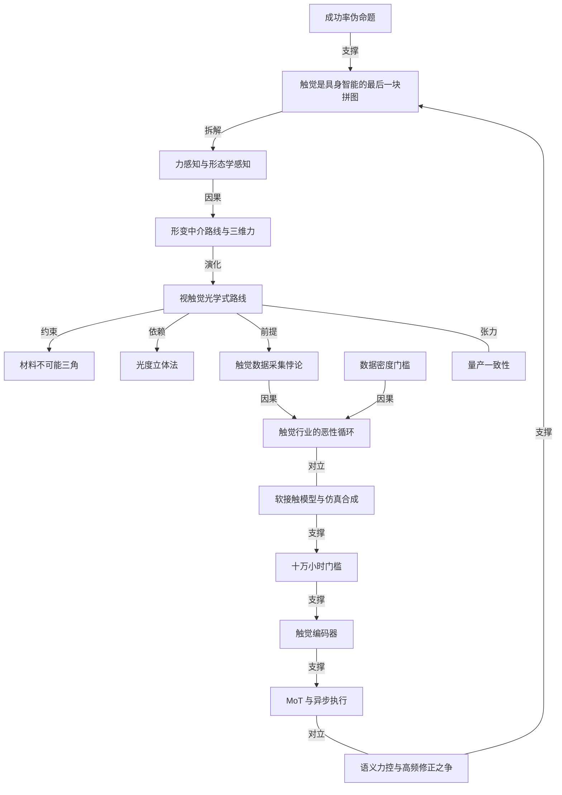

# 硅谷 101：机器人触觉的五条技术路线与数据困局

- 原文标题：机器人触觉的爆发前夜：五大技术路线、数据困局与模型之争
- 作者：youtube.com
- 内参日期：2026-09-05
- 来源类型：YouTube
- 原文：https://www.youtube.com/watch?v=BmcoQDwdkeM
- 标签：具身智能, ai 硬件

> 用真假花生的盲选实验说明触觉为什么不可替代——纯视觉也能完成任务，但只能靠极慢的试探，成功率高不等于可用性强。视频梳理了当前五条传感器路线的分歧和共同的数据瓶颈。

## 导读

机器人触觉

## 核心观点

- 触觉被称为具身智能的「最后一块拼图」，但今天绝大多数机器人还没有触觉。这期硅谷 101 走进实验室，回答三个问题：机器人为什么需要触觉、五条技术路线各自的取舍是什么、以及为什么触觉迟迟没有普及。
- 触觉的价值不在于提高任务成功率，而在于把「能完成」变成「可用」。只靠视觉的机器人也能拧螺丝、抓东西，但它必须每次微调一毫米、反复试探——「所以如果我们只是去看这个成功率的话，其实它是一个伪命题」。
- 真正卡住触觉的不是传感器本身，而是三道依次排布的障碍：数据采集（可用数据基本为 0，且存在「要采集触觉就得先屏蔽触觉」的悖论）、算法模型（直接把触觉信号灌进行为模型，成功率反而下降）、规模化量产（性能一致性做不到）。
- 2026 年的行业共识是「爆发前夜」：需求今年大幅上涨，工业柔性装配已有真实落地，下一个里程碑节点被押在今年或明年年初。触觉之所以最近两年才火，不是因为技术新，而是因为端到端模型终于让人知道该怎么用它。

## 机器人为什么需要触觉：从假花生到「成功率伪命题」

- 开场实验：一堆花生里混着三颗假的，只能看不能摸，人类主持人三颗全选错；换成机械手做同样的挑战，全对。原因就在于机械手搭载了触觉传感器。
- 假花生是石头做的：表面更冰凉、更光滑，重量更重，还是实心的，摇起来没有真花生里果粒的振动感。这些信息视觉全都拿不到，上手一摸却立刻分辨得出。
- 反向实验佐证同一件事：把正常人手的触觉感知神经用麻药短暂麻醉掉，人对拧东西、抓握、甚至系扣子这些操作就已经「失灵」了。
- 「成功率高并不等于可用性强」是全片最关键的判断。只用视觉，机器人可以动得非常非常慢、每次微调一毫米、不断试探，总归能完成任务——但这条路径把成功率变成了伪命题。
- 力在很多场景里是不可替代的信息通道：握一个东西握得多紧、两个物体有没有咬合上、拧螺丝时的力度。「我不能只靠视觉说，螺丝拧花了我才会认为这个力过大了，那太晚了。」柔性操作里每根线的软硬度、材质也都很重要。
- 触觉拆开看包含两类维度的信息：
- 对「力」本身的感知，其中又分静态力（抓握时手指持续施加的压力，告诉你捏得够不够紧、物体有多硬）和动态力（物体滑动时的高频信号，告诉你是不是要掉了、摩擦力够不够）。
  - 对「形态学」的感知，即通过触摸分辨不同材料——表面是光滑还是粗糙、摩擦时的振动频率等等。

## 五条技术路线：力—电直转 vs 形变中介

- 市面上主流方案有五种：压阻式、压电式、电容式、光学式、磁感应。前两种直接把「力」转成「电信号」，后三种先把「力」转成「形变量」再测形变——这个分野决定了能不能测三维力。
- 压阻式：材料受力形变、电阻值变化，通过测电阻反推压力，原理与电子秤相同。最传统最成熟，便宜、技术门槛低；但只能测垂直方向的力，且会随温度、湿度产生漂移。
- 压电式：石英、PZT 陶瓷这类特殊材料受力时内部正负电荷中心偏移产生电压，像打火机的放电器。特点是只对「变化的力」敏感——按下去一瞬间有电压，一直按着信号会衰减到零，松开又产生反向电压。适合检测振动、冲击这类高频动态信号，难以测量静态力。
- 电容式：平行板电容器原理，按下去两层更近、电容变大即得垂直力；滑动时板面积变化、电容变化即得平面力。灵敏度极高、响应速度快、成本相对较低；缺点是动态范围有限、容易受电磁干扰。
- 光学式（视触觉）：最上层是柔性材料，背面有照明层，最底下藏一个摄像头实时检测材料状态，通过算法反算形变量再换算成力的分布。它能同时解算接触形貌和接触力，是目前行业最热门、精度最高的方式，代价是成本高。
- 磁感应：结构与光学式类似，弹性材料中加入磁性颗粒、去掉照明层、摄像头换成磁传感器，同样能推算三维力；但容易受电磁干扰，周围磁场环境影响精度，分辨率也有限。另有磁流体、超声等不常用路径。
- 采访嘉宾的判断是：多传感器结合可能是更好的方案。人除了手指之外每一寸皮肤都有感知，机器人若要达到人类水平也需要全身布满触觉——但全身都用最好的技术，成本无法控制，同一种技术路径也难以适用全身。
- 指尖精度要求高，光学式能达到更高分辨率；手掌、手臂精度要求没那么高又面积大，视触觉的光学模块设计会非常困难，压阻式或电容式覆盖大面积更容易。
  - WAIC 展会上已能看到电容式触觉传感器批量用于工厂的产品分拣和检测，原因是成本低——采购价只有精度最高的光学式的四分之一到二分之一。
  - 同一部位未来也可能融合多种技术：电容灵敏度非常高但材料压紧后力的感知范围很有限，压阻是「必须硬碰硬」的技术，两者结合可行；前提是制造工艺、良率和量产能力跟得上。现阶段大家还在尽可能完善单一路线本身的缺陷。
- 广义触觉还包括振动、材质感知。人分辨丝绸和棉布靠触摸加滑动产生振动，机器人则要加入加速度计、麦克风一类传感器来捕捉高频振动信号——完整的触觉方案不是选一条技术路线就完事。

## 走进实验室：光学式的材料、结构、算法、成本

- 起点是 2000 年前后的一个大胆想法：触觉能不能也像视觉一样被摄像头「看见」。最具代表性的探索之一来自 MIT 教授 Edward Adelson 团队，他们在 2009 年提出 GelSight，让机器人第一次拥有了类似「视觉」的触觉能力。
- 光学式最显著的优势是分辨率高，甚至已超过人类：人的一个指尖约 1 平方厘米上分布 3000 个触觉感知点，每个点下面有四个神经元，相当于 12000 个神经元在做感知；受访企业一目科技的传感器现在可以做到 24 万个点。
- **材料**：三大要求天然对立，业内称为「不可能三角」，只能找平衡，或者找新方法把某些约束条件去掉、减弱。
- 要特别软（杨氏模量低），才能通过细致形变精确反映物体的硬度和力度。
  - 要耐磨，否则任务执行久了会出现性能漂移或破损。
  - 要尽量薄，才能缩小传感器尺寸、扩大应用场景。
  - 材料实验室里大部分原材料是液态的，靠自研配方把不同原材料混到一起，难点不只在配比，还要从底层化学基底、单体开始研究。
  - 行业出现了一种「可恢复性材料」：分子键断裂之后还能恢复，恢复性来自一些特殊官能团，做配方时要把这些官能团保留下来。摸起来极软，「像婴儿摸起来也没有任何伤害的感觉」，接近人的皮肤。
- **结构**：手指越小越灵活，传感器也得尽可能小。受访产品厚度与 SIM 卡尺寸基本一致、不到 16 毫米。
- 物理制约在于光触觉背后需要感光芯片或摄像头，而要把整个视场都看到，就像微距摄影一样总需要一定距离——这是最底层的约束。
  - 破法一是材料尽可能薄，二是从摄像头下功夫：降低对焦距离、扩大视场角。一目通过自研的超表面和芯片技术压缩视距，不再用传统透镜镜头。
  - 照明层的光路设计是另一大难点：手指不是完全平面，左右都有弧度，需要精细设置照明灯珠排布保证不同位置照明一致。为此要做大量「光追踪」仿真，看每一个光子在传播路径里怎么走，一方面覆盖最广（270 度都能覆盖），一方面精度和轨迹可预测，否则光和光之间会打架、产生串扰。
  - 一个细节故事：专业的 BSDF 测试装置（测量表面材料光学特性、把结果输入仿真提升准确度）市面上要百万级，团队里胡博士自己搭了一台，精度各方面都挺好——「你们这个有点 SpaceX 的味道了」。
- **算法**：光学式识别触觉有三种方式，也决定了照明用单色还是多色。
- 标记点法：皮肤层上印很多微小标记点，摄像头跟踪点的位移变化计算形变。算法简单、制造容易，但精度上限很低——一般顶多几十个 Marker 点，这就是分辨率的上限，中间做插值也不是真值。
  - 纹理分析法：不需要规则点阵，改用随机喷涂的细小颗粒或材料自带的不规则纹理，受力时追踪光影纹理的流动来算形变。硬件制造简单，光学鼠标就是它的简化版；但鼠标只检测二维平面变化，触觉要检测三维，因此算法复杂、计算量更大、响应延迟较高。
  - 光度立体法：不需要标记点和纹理，皮肤均匀，照明层用红、绿、蓝三色光从不同方向打光；形变时凹凸变化使不同颜色光线到达同一点的距离不同，算法分析每个像素的 RGB 值来计算形变。它是兼顾前两者优缺点的折中方案，制造不算复杂，解算靠预训练模型快速分析，算力要求比第一种大、比第二种小，精度较优。
  - 前两种主要关心亮度和对比度，单色照明就够；第三种必须用多色光。
- **成本**：结构复杂带来高成本，单指还是千元级，比别的技术路线稍贵；随着量上升有可能降到小几百。此外后续算法、算力要求也更高——视触觉流行是因为可以直接用视觉模型处理，但视觉模型一般比较大，对算力要求相对更高。
- 高成本对应高上限，实验室里有直观对比：没有触觉的灵巧手在没有视觉辅助时夹薯片，掌握不好力度很容易夹飞；带视触觉的夹爪不仅能轻轻夹起薯片，被抽离时还能感知到轻微晃动和摩擦并慢慢卸力。夹树叶更难——树叶缺少刚性，稍微多一点力就形变，夹爪依然能精准感知到树叶微小形变后因弹性释放的微小力。

## 第一道障碍：数据采集的三重困局

- 业内人士认为现阶段更该优先考虑的不是成本，而是验证路径的可行性。而机器人最稀缺的就是训练数据，到了触觉领域已经不只是「少」：「现在触觉的数据基本为 0，就可用的数据基本为 0」。高保真传感器此前是缺失的，传统方法采来的数据跟人不接近。
- 触觉强调实感，普通视频和文字这类互联网数据无法反映「力」的大小和方向，所以这个领域尤其强调真机数据。而真机数据的获取有三大难点。
- **难点一：采集悖论**。戴上很厚的手套去拿一块豆腐，要么滑下去，要么稍微一用力就破了——因为厚手套完全屏蔽了触觉，人无法判断摩擦力够不够、形变到什么程度。采集人的触觉意味着要在人手和物体之间做隔离，某种程度上就屏蔽了人自己的触觉；操作者的手变笨，示范质量下降，训练出的机器人就不可能有像人一样的灵巧能力。「要采集触觉，就得先屏蔽触觉，但是屏蔽触觉之后又难以采集触觉。」
- 一目的数采设备把传感器放在手指前面，操作起来像用筷子。受访者坦承它跟真实世界有 gap，算法能做一些弥补，但不可否认跟人是不一样的。
- **难点二：设备笨重与密度不足**。大多数数采设备尺寸大、穿戴麻烦，会影响采集员的操作行为。一方面需要更薄的传感器——下一代做到超薄 3 毫米，不必戴复杂手套，只在关键位置贴一些触觉点；另一方面需要更符合人体工学的采集设备，而人体工学设计与设计触觉传感器、灵巧手是完全不相干的事，需要多学科交叉，被视为「接下来一年非常重要的一个课题」。
- 对采集员影响较小的织物手套则牵出密度问题：最好的织物触觉手套一只手也就 500 个点，与 24 万点的传感器差距巨大。戴着它抓一颗 M2 螺钉，在数据上就是一个点，检测不到螺丝的方向或大小，「即使模型再强，也没有办法有效地让它去学习到这样的一些信息」。
  - 于弢团队与 MIT 去年合作的项目印证了这一点：用这类手套采集，大部分有效数据都是整个手掌抓取较大物体（对密度要求最低），一旦涉及精细操作，数据就失效了。
- **难点三：格式不统一**。各家公司采集格式不同，有的设备是两指的，只适合工业机器夹爪、不适用于灵巧手训练；数据的存储与对齐也不够好——同时采到的触觉、视觉、本体信息在时间轴和数据本身的对齐能力都有欠缺。
- 三者构成恶性循环：硬件不成熟 → 各自数据格式形态不同、数据量上不去 → 算法无法演进 → 训练不出好模型 → 没人愿意投资这个领域。

## 仿真合成：用算力换数据，以及数据量究竟要多少

- 既然真机采集这么难，规模化就得靠仿真合成——在虚拟环境中模拟真实场景，同时批量采集不同数据。这是英伟达重点押注的路线，为此搭建了 Isaac Lab 框架。
- 实际训练时，触觉公司利用各种公有模型，给不同模型加入真实物理特性（螺母是刚性的、比较重、表面光滑；毛线球有多软多重、表面多粗糙），同时输入触觉传感器的特征（表面弹性体的物理特征、手指内的光源分布），系统就能模拟传感器接触不同物体时的形变程度、光路变化，推算出最终采集到的数据。
- 仿真结果还要与现实表现做对比，通过数据标定修正。目前的修正在解算层面，用一个映射矩阵去修正输出，后续会移到模型输入层面。
- 今年五月的 Tabero 论文提出另一种思路：复用已有机器人数据，把这些轨迹重新放进 Isaac Lab 并加入触觉传感器模拟，最终生成完整的「视觉—触觉—语言—动作」数据。
- 最大难点是计算量：若用有限元方法精细计算弹性体变形，可能一帧就要一个小时，对需要快速实时获取数据而言不可接受。
- 学术界因此提出简化算法。英伟达 2025 年发布的 TacSL 论文介绍了一种视触觉仿真方式，核心思路是用软接触模型代替有限元计算——把物体和皮肤都当作刚体，但允许它们「互相穿透」，接触力越大穿透越多。算出的形变不是最精确，但能大致模拟且速度快得多。
- 仿真与现实之间永远有差距。Eric 给出的数字是仿真准确率大概在 90% 以上，其中 10% 的差距主要在柔性物体的模拟，这也是当前挑战所在。破法是补充后训练数据：「比如说我们已经有一个 80 分的模型了，我再加一点点后训练，很快就可以到 90 分以上。」
- TacSL 的训练策略与此一致：一是随机化物理参数，让策略适应不同的刚度、阻尼；二是在触觉图像上做大量数据增强，让策略对摄像头差异、光照变化鲁棒。由此在真机上实现零样本迁移，插拔销钉任务达到 82.7% 的成功率。
- 仿真更多是真机数据的补充，两者需要搭配训练。受访者给出的判断是至少 1 比 1，甚至仿真可能占多数。
- 数据量的答案比想象中乐观。Physical Intelligence 的 Kay 此前给出的口径是：要收集到 100 万小时（等同于一个人一生的物理经验）的数据，「我觉得可能我们才开始后面的探索」。但到了触觉领域，所需数据量只要十分之一——「当你有 10 万小时的数据往上走，你会发现它逐渐就开始有一定的泛化能力」。
- 原因不难理解：机器人行为模型包含大量操作「过程」信息（转身、伸手、移动），真正对训练有效的往往是「拿起」「放下」这些关键操作；而触觉数据在没有操作时输入基本为零，相当于这 10 万小时已经减掉了无效操作的部分。

## 第二道障碍：触觉信号怎么进模型

- 一个反直觉的结果：直接把触觉信号输入行为模型，机器人任务的成功率反而会下降。今年 6 月伯克利、英伟达、斯坦福联合发布、集结了李飞飞与 Jim Fan 等学者的 T-Rex 论文中，把触觉信号直接输入 π0.5 模型，各项任务成功率下降。「加了一个模态不等于模型表现就能够变好。」
- 受访者认为最大挑战在于大家对触觉这个模态还比较陌生，怎么融入模型训练还没有一个完整跑通闭环的好 SOTA 模型。此前有三大挑战：
- 触觉没法用规则定义：软还是硬、脆还是弹、超过多大的力会破坏物品，没法单纯设一个数值写死规则。拿纸杯时力气小能拿起来、稍夹紧点有点形变也可接受，但到了鸡蛋就绝不能让蛋壳形变。
  - 信号维度太多反而成为噪声：纵向压力、横向剪切力、摩擦力，加上表面材质感知的温度、振动、音频等，不加处理灌进大脑，模型难以分解。
  - 频率不匹配：触觉信号天然高频，视觉语言模型通常运行在低频率，直接结合会造成计算资源浪费、反应速度慢、触觉噪声干扰高层规划。
- 今年 AI 的进步让业界看到了触觉应用的范式。触觉最近两年才火「并不是因为触觉这个技术本身这两年才存在，而是在很久以来大家并不知道怎么样去用触觉」——端到端模型的实现对触觉利用是极大促进。
- 端到端把信号直接输入神经网络、让模型自己学习，不需要人为定义规则，解决了第一个挑战。
  - 编码器解决第二个挑战：用自监督学习训练 Tactile Transformer encoder，前置处理触觉信号，把不同类型的触觉模态甚至视觉结合在一起，用注意力机制抓取模态间的相互关系，输出「软的、硬的、有没有摩擦、形态上像什么」这类完整的语义理解，再进入主干网络做判断。
  - MoT 解决第三个挑战：T-Rex 论文提出的 MoT 架构借鉴 MoE 思想，构建三个专家——Latent Expert 处理视觉与语言观察、预测未来视觉表征，提供慢速的认知层「上下文理解」；Action Expert 根据视觉语言上下文生成粗略的动作序列；Tactile Expert 像机器人的反射系统，在动作执行过程中通过实时触觉反馈对力度、角度和接触状态做快速修正。
  - 真正的创新在于「异步执行」：推理时动作专家生成动作规划，触觉专家以更高频率独立运行、不断修正动作，并复用已经算好的上下文缓存，只做快速的触觉推理。这样既保留大模型的理解能力，又获得类似人类触觉反射的快速响应——对应双系统架构里 System 2 慢思考长程规划、System 1 快反应本能动作。
- 采访中也暴露出行业分歧：触觉模型该单独训练，还是与摄像头、激光雷达等一起训练？
- Eric 主张单独训练：触觉模态本身的语义理解就可以完成一定闭环，闭环之后再与其他模态融合、让大脑判断更好；每个模块可以单独训练、测试、闭环，像即插即用一样插到不同系统里，还能与其他模态更好对齐；否则眉毛胡子一把抓，模态之间的数据平衡是个挺难的问题。
  - 于弢主张必须同时进行：视觉是全局的，触觉是非常局部的，手的形态变动时同一个传感器在空间上的分布也不一样；视触融合并不是简单的表征空间问题——同一载体做同一件事可以，但迁移非常难。他举哥大李昀烛的做法为例：把触觉的力分布结合到三维点云上，力不只是一个力，而是它在空间中的一个分布，因此需要触觉与视觉的结合。
  - 于弢的思路对应 Tabero：触觉应参与高层决策，理解「轻一点」和「重一点」的语义。简单说，Tabero 主打前置的「语义力控」，T-Rex 主打执行过程的「高频修正」。行业尚处非常早期，多条路线同时探索，没有绝对优劣。

## 第三道障碍：量产一致性与试产车间

- 量产最大的难题是性能的一致性。上周在维也纳的 ICRA 2026 上，团队亲手测了很多触觉传感公司的产品是否一致，「其实大多数是做不到的」。
- 为什么一致性如此关键：手指的调整动作非常微小，做精密操作时输出的力稍有偏差就可能导致任务失败。而触觉传感器又太精密——表面弹性体厚度相差太大、弹性系数不一致、传感器间距不同，都会导致参数偏差，算法就难以计算出正确数值。
- 一目科技试产车间的流程（进车间要穿无尘服、先摸防静电球去除静电）：
- 第一步把凝胶材料放到模具内固化，作为手指的表面弹性体，不能有任何灰尘和气泡；在提供局部 100 级超洁净空间的超净工作台上制备。
  - 制备完成后先检验是否合格：拍摄筛查气泡、杂质，所有数据再经上位机判断筛选一次。
  - 其他地方制备的零部件集中到一条产线组装：从粘接工位到预总装工位，完成壳体、灯带、相机、芯片等精密组装。
  - 总装前有预检测工位做成像检测，屏幕上显示的是传感器的精密动态与力学反馈，里面有很多 AI 算法。
  - 每个批次的试产样品还要经过自动化测试，验证工艺参数的稳定性。
- 试产阶段很多步骤依然依赖手工操作，因为触觉传感器是较新的品类，现成的标准化、自动化设备暂时没有统一。
- 量产也不能脱离上下游自己进行：上下游（数采设备、灵巧手）有不同协议、不同接口、不同的手部适配，量产要跟着需求做定制化操作。一条自动化量产线稳定交付标准品，一条试产线承接定制化需求和新工艺验证——两条线协同运转，正是这个行业走向成熟的标志。

## 爆发前夜：需求、落地与时间表

- 到 2026 年这个时间点，几乎所有受访嘉宾都表示触觉已处于爆发前夜。今年整个需求大幅上涨，大家慢慢认识到触觉数据对物理 AI 训出更好的模型非常重要；灵巧手、上下游、具身整机都在拼命做、拼命出货，自然带动触觉传感更加成熟。
- 已有的工业落地：WAIC 展会上，一目科技展台展示了某大型汽车电池装配工厂把触觉传感器搭载到机械臂上的工业级应用。不同电池包形态和变化多，依赖传统自动化去做每次的预编程和大量开发无法适应产线的频繁调度与变化，基于触觉则得到了柔性装配的能力。
- 未来场景延伸到实验室的精密操作，比如用滴管做精准取液、控制到毫克级——有了触觉的精准反馈，就能精准控制施加在滴管上的力与形变。
- 市场测算：美国银行预测到 2030 年人形机器人出货量将达到 120 万台，假设都装配触觉传感器、每个机器人 10 根手指，触觉的市场需求将提升到千万级别。按一年到一年半、两年的研发测试周期倒推，也就是说明年就要开始上量；受访者判断触觉的下一个里程碑节点「就是今年或者明年年初」。
- 收尾回到那句判断：触觉是让机器人类人、甚至超越人的「最后一块拼图」，因为它不仅多了一个维度的数据，更是让机器人掌握了「人类的第一语言」——婴幼儿刚出生时第一个会的并不是看和听，而是靠触觉摸这个世界，甚至用舌头舔。Adelson 也提到，启发 GelSight 的灵感源于观察小孩时发现触摸对他们更有吸引力。
- 「而今天我们正在教机器人做同样的事情，让它摸花生、摸树叶、摸鸡蛋，每摸一次对物理世界的理解就多一点。」很多年之后回望，转折点可能就在触觉普及时——因为那一刻，机器人才开始真正地理解了世界。

## 概念网络

### 关键概念

#### 触觉：具身智能的最后一块拼图

**context**：全片的总命题。开场即引用「有人说触觉是具身智能的最后一块拼图」，结尾由 Eric 收回同一句话，并加了一层解释：触觉不仅是多了一个维度的数据，更是让机器人掌握了「人类的第一语言」——婴幼儿最先会的不是看和听，而是伸手去摸妈妈的脸、摸床单的材质。

**费曼一下**：机器人已经有了眼睛（摄像头）和耳朵（麦克风），也能听懂话、能规划动作，唯独缺少「摸」。缺了这一块，它对物理世界的理解永远隔着一层玻璃——知道东西长什么样，却不知道它有多硬、多滑、会不会碎。补上触觉，机器人才从「看世界」变成「碰世界」。

#### 成功率伪命题

**context**：回应「没有触觉的机器人不是很多任务成功率都很高吗」这个疑问。业内人士指出「成功率高并不等于可用性强」：只用视觉，机器人可以动得非常慢、每次微调一毫米、不断试探，总归能完成任务——「所以如果我们只是去看这个成功率的话，其实它是一个伪命题」。

**费曼一下**：考试及格率不等于会做题。一个人可以靠反复涂改、慢慢试探把题做对，但你不会说他掌握了。机器人也一样：把速度放慢一百倍、允许无限次试探，成功率自然好看，可这台机器在真实产线上没法用。衡量能力的指标一旦允许拿时间换，它就失去了信息量。

#### 力感知与形态学感知

**context**：把「触觉」这个笼统的感觉拆成两类维度：一类是对「力」本身的感知，其中静态力是抓握时手指持续施加的压力（捏得够紧吗、物体有多硬），动态力是物体滑动时产生的高频信号（是不是要掉了、摩擦力够不够）；另一类是「形态学」感知，即通过触摸分辨材料的光滑粗糙、摩擦振动频率。

**费曼一下**：你端一杯水时，手其实在同时干三件事——判断握得紧不紧（静态力）、察觉杯子有没有开始往下滑（动态力）、感觉杯壁是玻璃还是塑料（形态学）。工程上要分别用不同的物理原理去测这三件事，所以「做触觉」从来不是做一个传感器，而是做一组。

#### 形变中介路线与三维力

**context**：五条技术路线的分水岭。压阻式和压电式直接把「力」转化为「电信号」；电容式、光学式、磁感应则先把「力」转为「形变量」再测形变的程度——「这样做的一大好处就是，不再只局限在垂直方向，而是能够检测出三维的力」。

**费曼一下**：直接测力的传感器像一台只会读体重的秤，你压多重它知道，你往旁边推它毫无察觉。改成先看「皮肤被压成什么形状」，就等于把一个数字变成一张变形图——从图里既能读出压得多深，也能读出往哪个方向推、有没有在打滑。测量对象换了一个中间量，信息维度就上了一个台阶。

#### 视触觉（光学式触觉）

**context**：目前行业最热门、精度最高的路线，源自 2009 年 MIT 教授 Edward Adelson 团队提出的 GelSight。结构是柔性材料 + 照明层 + 底部摄像头，通过算法反算形变量再换算成力的分布，可以同时解算接触形貌和接触力；人的指尖约 3000 个感知点、12000 个神经元，而受访企业的传感器能做到 24 万个点。

**费曼一下**：把一层软胶贴在摄像头前，胶被物体压出凹坑，摄像头就把这个凹坑「拍下来」，算法再从照片反推是多大的力、什么形状压出来的。相当于用「看」来实现「摸」——这也是为什么它能直接沾上视觉模型的光，缺点同样明显：摄像头需要距离，成本和算力都下不去。

#### 材料不可能三角

**context**：光学式在材料上的核心约束——表面材料要特别软（杨氏模量低）以反映硬度和力度，要耐磨以免性能漂移或破损，还要尽量薄以缩小尺寸。「我们一直讲它是个不可能三角，但我们只能找平衡，以及说找一些新的方法，能不能把某些的变量给的约束条件去掉或者说减弱。」

**费曼一下**：软、耐磨、薄，是三个互相打架的要求：越软越不耐磨，越薄越容易破。工程上没有一次满足三者的材料，所以真正的进展往往不是「三个都做到」，而是从化学配方层面把其中一条约束松开一点——比如自愈材料让「不耐磨」这一项变得可以容忍。

#### 光度立体法

**context**：光学式三种识别算法中的折中方案。标记点法靠追踪印在皮肤上的几十个 Marker，分辨率上限被点数锁死；纹理分析法靠追踪随机纹理的光影流动（光学鼠标是它的二维简化版），硬件简单但三维解算复杂、延迟高；光度立体法不需要标记点和纹理，用红绿蓝三色光从不同方向打光，分析每个像素的 RGB 值来计算形变，靠预训练模型快速解算。

**费曼一下**：同一个凹坑，用不同颜色的光从不同角度照，凹面各处收到的红绿蓝比例就不同——于是每个像素的颜色本身就编码了它的倾斜方向。这等于把「测形状」变成了「读颜色」，既不用在皮肤上印点（限制分辨率），也不用做昂贵的三维追踪计算。

#### 触觉数据采集悖论

**context**：真机数据采集的头号难点。采集人的触觉意味着要在人手与物体之间做隔离，也就在某种程度上屏蔽了人自己的触觉；操作者手变笨，示范质量下降，训练出的机器人也不可能有像人一样的灵巧能力。片中用戴厚手套拿豆腐做了直观演示——「要采集触觉，就得先屏蔽触觉，但是屏蔽触觉之后又难以采集触觉」。

**费曼一下**：想录下一个人怎么摸东西，就得在他手上贴一层传感器；可这层传感器同时也挡住了他自己的手感，于是他摸得比平时笨——你录到的不是「人的触觉」，而是「一个戴着手套的人的触觉」。测量行为本身改变了被测对象，这是触觉数据最根本的麻烦。

#### 数据密度门槛

**context**：采集设备与传感器之间的分辨率鸿沟。对采集员影响最小的织物触觉手套一只手也就 500 个点，与 24 万点的传感器差距巨大；戴着它抓一颗 M2 螺钉，在数据上就是一个点，检测不到螺丝的方向或大小，「即使模型再强，也没有办法有效地让它去学习到这样的一些信息」。于弢团队与 MIT 的合作项目印证：有效数据大多是整个手掌抓大物体，一旦涉及精细操作数据就失效。

**费曼一下**：用一支马克笔是画不出工笔画的。采集手套的分辨率决定了你能记录什么样的动作——它只够记录「抓住了一个大东西」，记录不了「捏住了螺丝的哪一侧」。数据密度不够时，再大的模型也学不到不存在于数据里的信息。

#### 触觉行业的恶性循环

**context**：三个采集难点叠加后的结构性困境——硬件不够成熟就采不到高质量数据，数据量上不去算法就没法演进，训练不出好模型就没人愿意投资这个领域，「这会是一个不断的恶性循环」。这也解释了为什么触觉数据「基本为 0」。

**费曼一下**：这是典型的鸡生蛋问题，只不过有四个环节咬在一起。任何一环单独发力都推不动：买再多传感器也补不上没有统一格式的数据，堆再大模型也学不了不存在的数据。打破它通常只能靠外力——比如仿真绕开真机采集，或者下游需求（灵巧手、整机出货）先热起来倒逼上游。

#### 软接触模型

**context**：仿真合成的关键提速手段。若用有限元方法精细计算弹性体变形，可能一帧就要一个小时，对实时获取数据不可接受。英伟达 2025 年 TacSL 论文提出用软接触模型代替有限元：把物体和皮肤都当作刚体，但允许它们「互相穿透」，接触力越大穿透越多。算出的形变不最精确，但能大致模拟且速度快得多。

**费曼一下**：真要算清楚一块果冻被压时每一处怎么变形，得解一整套方程，慢到没法用。软接触的取巧之处是不算变形——干脆让手指「陷进」物体里，陷得越深就当作力越大。物理上当然不成立，但对训练模型来说，一个足够像的近似加上后期标定，比一个算不完的真值有用得多。

#### 十万小时门槛

**context**：触觉领域的数据量预期。Physical Intelligence 的 Kay 给出的具身模型口径是 100 万小时（等同一个人一生的物理经验）才谈得上「开始后面的探索」；而触觉所需数据量只要十分之一，「当你有 10 万小时的数据往上走，你会发现它逐渐就开始有一定的泛化能力」。原因是行为模型里包含大量转身、伸手、移动这类「过程」信息，而触觉在没有操作时输入基本为零，相当于已经减掉了无效操作的部分。

**费曼一下**：视频数据里有大量「什么也没发生」的镜头，模型得自己学会忽略它们；触觉数据天然只在接触发生时才有信号，等于自带过滤。同样一小时的记录，触觉里的有效信息浓度高得多——这不是触觉更好学，而是它的数据里废料更少。

#### 触觉编码器

**context**：解决「触觉信号维度太多反而成为噪声」的思路。用自监督学习训练一个 Tactile Transformer encoder 前置处理触觉信号，把不同类型的触觉模态甚至视觉结合在一起，用注意力机制抓取模态间的相互关系，输出「软的、硬的、有没有摩擦、形态上像什么」这类语义理解，再进入主干网络做判断。

**费曼一下**：与其把纵向压力、剪切力、摩擦、温度、振动一股脑倒进大模型让它自己理清，不如先请一个专职翻译，把这堆原始读数翻译成一句人话——「这是个滑溜溜的软东西」。大脑收到的是结论而不是原始信号，判断自然更准，也更省算力。

#### MoT 与异步执行

**context**：T-Rex 论文提出的架构，用于解决触觉与视觉语言模型的频率不匹配。它借鉴 MoE 思想设三个专家：Latent Expert 处理视觉与语言、提供慢速的上下文理解；Action Expert 生成粗略动作序列；Tactile Expert 像反射系统，在动作执行中用实时触觉反馈快速修正力度、角度和接触状态。最关键的是异步执行——触觉专家以更高频率独立运行、复用已算好的上下文缓存，只做快速的触觉推理，对应双系统架构里的 System 1 与 System 2。

**费曼一下**：你伸手接杯子时，大脑在慢慢规划路线，而手指碰到杯子发烫的那一瞬间是脊髓直接把手缩回来的——不需要等大脑想完。异步执行就是给机器人装上这条反射弧：慢的那套照常思考，快的那套在旁边以高得多的频率不停微调，两者共用同一份已经想好的上下文。

#### 语义力控与高频修正

**context**：行业分歧的两条路线。Eric 主张触觉模态单独训练——它本身的语义理解就可以完成闭环，闭环后再与其他模态融合，模块可以单独训练测试、即插即用；于弢主张必须与视觉同时训练——视觉是全局的、触觉是非常局部的，同一传感器在空间上的分布随手的形态而变，力不只是一个力而是空间中的分布（如哥大李昀烛把触觉力分布结合到三维点云）。前者对应 T-Rex 的「执行过程高频修正」，后者对应 Tabero 的「前置语义力控」。

**费曼一下**：一种做法是让触觉当司机身边的副驾，只在快撞上时猛打一把方向（高频修正）；另一种是让触觉一开始就参与决定「这一趟该开多快」（语义力控）。前者模块清晰、容易独立迭代，后者更接近人的直觉但很难迁移到别的机器人身上。行业还早，两条路都在跑，没有绝对优劣。

#### 量产一致性

**context**：规模化的最大难题。ICRA 2026 上团队亲手测试多家触觉公司的产品，「其实大多数是做不到的」。原因在于手指的调整动作非常微小，精密操作时输出的力稍有偏差就可能任务失败；而表面弹性体厚度、弹性系数、传感器间距的任何不一致都会导致参数偏差，算法就算不出正确数值。行业成熟的标志是自动化量产线（稳定交付标准品）与试产线（承接定制化与新工艺验证）两条线协同运转。

**费曼一下**：如果每根手指的「手感」都不一样，那么在一根手指上调好的算法换到另一根就失灵了——模型学的是传感器的个性，不是世界的规律。对精密操作来说，一致性比单点精度更要命：十根手指里有一根不准，整只手就不可用。

### 概念网络

全片的思想网络可以按「为什么要—怎么做—为什么还没做成」三层来读，而三层之间是层层收窄的因果链。

最上层是命题层。「触觉是具身智能的最后一块拼图」不是一句修辞，它需要一个支撑论证才能成立，这个论证就是「成功率伪命题」：如果没有触觉的机器人已经能把任务做完，拼图就不缺这一块。作者用「允许无限慢、无限试探则成功率必然好看」拆掉了这个反驳，命题才立住。立住之后，命题被拆解为可工程化的对象——力感知（静态力/动态力）与形态学感知，抽象的「摸」由此变成三类可测的物理量。

中间层是技术实现层，内部是一条清晰的演化链。既然要测的不只是垂直压力，还有剪切、滑动、材质，直接把力转成电信号的压阻式与压电式就先天不够用，于是路线分岔到「先把力转成形变量、再测形变」——这一步的收益正是三维力。形变中介路线走到极致就是视触觉：用摄像头去看形变，分辨率一举超过人的指尖。但视触觉不是免费的，它同时向三个方向施加压力：向材料要「软—耐磨—薄」的不可能三角，向算法要在标记点法与纹理分析法之间找折中（光度立体法），向制造要一致性——而一致性恰恰是它与量产之间最持久的张力，因为越精密的结构越难做到批次间参数一致。

底层是障碍层，也是全片真正的重心，三个障碍之间不是并列而是接力。视触觉带来了高保真传感器，这本该解决数据问题，却先带出了采集悖论：传感器夹在人手与物体之间，采得到数据就采不到人真正的手感。悖论加上织物手套 500 点的密度门槛，共同喂养了那个四环咬合的恶性循环——硬件不成熟、数据上不去、算法不演进、资本不进场。仿真合成是唯一有希望从外部打断这个循环的力量，所以它与恶性循环之间是对立关系：软接触模型用「允许互相穿透」的近似换来速度，把一帧一小时压到可批量生成，也让「十万小时」这个数据门槛第一次显得可达。

数据一旦可得，问题立刻转移到模型侧，而这里出现了全片最反直觉的发现：把触觉直接灌进行为模型，成功率反而下降。它证明障碍不在数据量而在接口——触觉编码器负责把高维原始读数先压成语义（软的、硬的、有没有摩擦），MoT 的异步执行负责让高频触觉与低频视觉语言各跑各的时钟。两者是前后相继的：先有语义化，才谈得上让触觉专家独立高频运行。而在「触觉该在哪一层介入」这个问题上，T-Rex 的高频修正与 Tabero 的语义力控构成了本片唯一未收敛的对立——修正派把触觉放在执行末端做反射，力控派把触觉放在决策前端理解「轻一点」的语义。这场分歧最终又回到最上层命题：只有当触觉真的进入机器人的语义与决策，而不只是充当一个安全阀，「最后一块拼图」的说法才算兑现。

## 费曼 x3

先说一个反直觉的结论：给机器人加上触觉，它的任务成功率会下降。今年 6 月伯克利、英伟达、斯坦福联手发布的 T-Rex 论文里，把触觉信号直接送进 π0.5 模型，各项任务的成绩全线走低。加一个模态不等于模型变好——这句话像一盆冷水，浇在「触觉是具身智能最后一块拼图」的热度上。

但真正值得琢磨的，是它为什么会下降。触觉信号天然是高频的，纵向压力、横向剪切、摩擦、温度、振动、音频挤在一起，而视觉语言模型跑在低频率上。把这堆原始读数不加处理地倒进大脑，模型收到的不是信息，是噪声。破法有两条：先请一个编码器把读数翻译成语义——软的、硬的、有没有摩擦、形态上像什么，再送进主干；然后让触觉专家以更高的频率独立运行、复用算好的上下文缓存，像脊髓反射一样在动作执行中随时修正力度。这就是慢思考与快反应的分工被搬进了机器人的身体里。

更值得警惕的是另一条判断：成功率高并不等于可用性强。只靠视觉的机器人也能拧螺丝、系扣子，代价是动得非常非常慢，每次微调一毫米，不断试探。片中那句「所以如果我们只是去看这个成功率的话，其实它是一个伪命题」，其实是在提醒一件更普遍的事——任何允许拿时间去换的指标，都会在真实场景里失去信息量。螺丝拧花了才知道力过大，那太晚了。

而卡住整个行业的，是一个测量学意义上的死结。要采集人的触觉，就得在人手和物体之间垫一层传感器；这层传感器同时屏蔽了人自己的手感，操作者的手变笨，示范质量下降，训练出来的机器人自然也灵巧不起来。要采集触觉，就得先屏蔽触觉。再加上最好的织物手套一只手也只有 500 个点——抓一颗 M2 螺钉在数据上就是一个点，方向和大小都读不出来——于是硬件不成熟、数据上不去、算法不演进、资本不进场，四环咬死。

仿真是目前唯一有希望从外面撬动这个循环的杠杆，而它的取巧之处很有启发性：精确计算弹性体变形一帧要一个小时，那就干脆不算——把物体和皮肤都当刚体，允许它们互相穿透，陷得越深就当作力越大。物理上当然不成立，可它足够像，配上标定和后训练就能在真机上做到八成以上的成功率。有意思的是，触觉需要的数据量比想象中少：视觉模型要 100 万小时，触觉十分之一就开始泛化，因为不接触时输入本来就是零，废料早被过滤掉了。

真正让人停下来想一想的是收尾那句话：触觉是人类的第一语言。婴儿出生后最先会的不是看和听，是伸手去摸妈妈的脸、摸床单的材质。我们今天教机器人摸花生、摸树叶、摸鸡蛋，每摸一次，它对物理世界的理解就多一点。也许很多年后回望，转折点并不在某个模型参数量翻倍的时刻，而在机器人第一次学会「轻一点」的那天。
