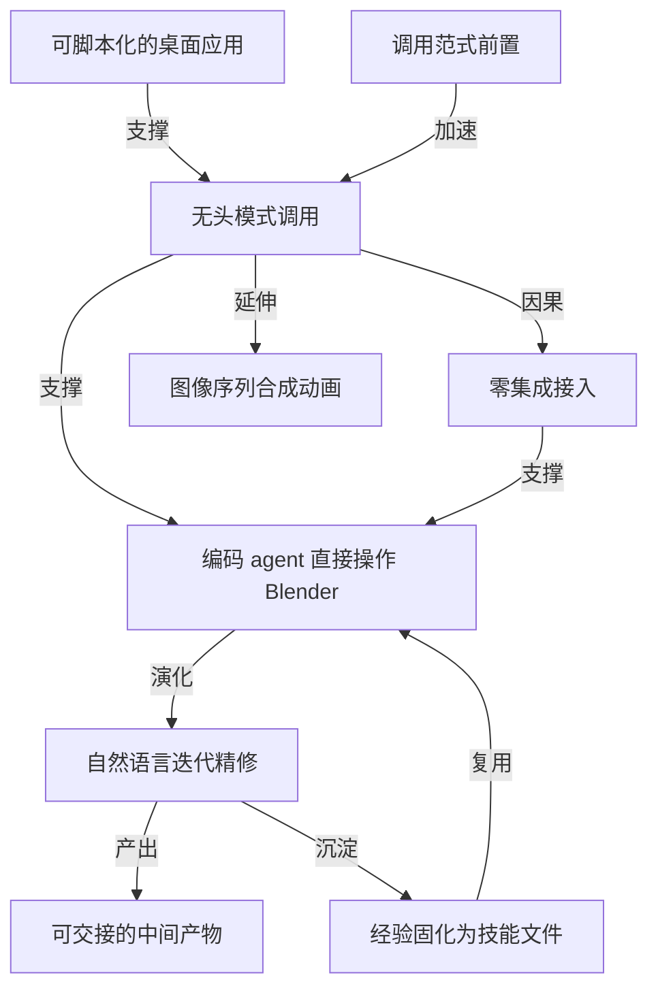

# 在 macOS 上让编码 agent 直接操作 Blender

- 原文标题：Using Blender with coding agents on macOS | Simon Willison’s TILs
- 作者：Simon Willison
- 内参日期：2026-09-07
- 来源类型：blog
- 原文：https://til.simonwillison.net/llms/blender-coding-agents-macos
- 标签：agentic engineering, ai 实战

> Simon Willison 的 TIL 详版：装好官方 Blender 后，用自然语言指挥 agent 调 Blender 的 Python API 生成场景、加背景、渲染图片乃至用 ffmpeg 串成视频。可以直接照着跑的操作记录。

## 导读

让agent 操作 blender

## 核心观点

- 当前的前沿模型已经「really good at using Blender」——不只是写几行脚本，而是能产出可以在 Blender 里继续手工编辑的 `.blend` 文件，能渲染静态图，甚至能渲染一串图像序列再用 `ffmpeg` 合成动画。
- 更关键的结论是接入方式：在 macOS 上把这件事跑起来「really easy」。不需要写插件、不需要装 MCP server、不需要为 Blender 造任何专门的 agent 接口——装好官方桌面版，然后直接告诉编码 agent 去用它就行。
- 全篇的隐含论证是：一个既有命令行入口、又内建 Python 脚本 API 的桌面软件，对编码 agent 来说本身就是现成的工具。agent 已经会写代码、会跑 shell 命令，这两项通用能力叠在一起，就等于获得了三维建模与渲染能力。
- 最后一步把一次性探索变成可复用资产：让 Codex 用它内建的「造 skill 的 skill」，把刚刚学会的调用方法写成一份 Markdown 技能文件装好，后续实验直接调用。

## 把 Blender 接进 agent：装好，然后开口

- 前置条件只有一条：从 `blender.org` 装上 Blender 桌面应用。
- 之后直接对编码 agent 提出任务即可，模型会自己摸索出怎么驱动它。作者实测这条路径在 GPT-6 Astra 上直接跑通。
- 想省掉模型探索调用方式的时间，可以在提示里把调用范式直接写死给它：`Use Blender like this: /Applications/Blender.app/Contents/MacOS/Blender --background --python scene.py`。
- 这行命令是整篇文章的技术枢纽：`--background` 让 Blender 不开图形界面、以无头进程运行；`--python` 把一个 Python 脚本喂进 Blender 内建的解释器。于是「建模」这件事被彻底还原成「写一个脚本文件、跑一条命令」——正好落在编码 agent 最擅长的动作集合里。
- 作者的具体环境：ChatGPT macOS 应用里的 GPT-6 Astra（Medium 档），Codex 模式。

## 三轮模糊指令的迭代实录

- 第一轮：初始任务下达后，2 分 39 秒出图。产物是一只白鹈鹕骑着青绿色自行车，纯色柔光背景，比例、材质、车轮辐条都已经成形。

- 第二轮：追加指令只有一句「OK add a background and a lot of flair」，3 分 51 秒后场景复杂度大幅跃升——海滩木栈道、条纹更衣棚、彩旗、气球、风车、纸屑、遮阳伞、棕榈树，鹈鹕还戴上了草帽。

- 第三轮：指令更含糊，只有「OK make it a whole lot better」，5 分 59 秒后交出了最终的 `.blend` 场景文件和生成它的 Python 脚本。
- 三轮的共同特征：人类给的是审美方向而非技术规格，模糊的自然语言指令直接对应到几分钟量级的完整重做。整个项目连同 Codex 的完整会话记录都被作者公开在 GitHub 仓库里。
- 值得留意产物形态：agent 交付的不是一张封闭的图片，而是 `.blend` 场景文件加可读的 Python 脚本。人可以在 Blender 图形界面里接着改，也可以直接读脚本理解模型做了什么——协作链条没有在渲染那一刻断掉。

## 把一次探索固化成技能

- 实验结束后，作者补了一句提示：「Create a quick skill that describes how to use the currently installed /Application/Blender based on what you learned」。
- Codex 内建了创建 skill 的 skill，因此这一步「pretty easy」：它把刚刚积累的调用经验写成一份 Markdown 技能文件并直接安装。
- 复用的效果是，后续再做 Blender 实验时，提示可以简化成「Use your Blender Local skill to build this scene」再附一张参考图——探索成本只付一次。
- 这一步补上了前两节缺的那块：单次会话里学到的东西默认随会话消失，写成技能文件才变成资产。

## 能力边界与延伸

- 静态渲染之外，作者明确点出模型还能做动画：渲染出一串图像序列，再用 `ffmpeg` 把它们合成为影片。这条路径同样没有引入新的集成，只是多接了一个命令行工具。
- 整篇文章没有出现任何专用的 Blender 插件、桥接层或协议适配——所有能力都来自既有的命令行入口与脚本接口。
- 文章限定在 macOS 环境给出路径；其他平台的具体调用形式未展开。*

## 概念网络

### 关键概念

#### 无头模式调用

**context**：全文的技术枢纽是那条被明确写给模型的命令：`--background --python scene.py`。`--background` 让 Blender 不启动图形界面、以纯进程方式运行，`--python` 把脚本送进它内建的解释器。这让一款典型的 GUI 创作软件变成了可以被批量、无人值守调用的命令行工具。

**费曼一下**：平时你用鼠标在 Blender 界面里点点拖拖建模型。无头模式就是把界面整个关掉，改成「写一张操作清单，让软件自己照着做完」。人不需要在场，agent 也不需要会用鼠标。

#### 可脚本化的桌面应用

**context**：文章从头到尾没有为 Blender 造任何专门的 agent 接口，理由就是它本来就同时具备命令行入口和 Python 脚本 API。这两样东西合起来，构成了一个不需要额外适配的天然接入面。

**费曼一下**：判断一个软件好不好被 agent 使唤，看两点：能不能用一条命令启动它，能不能用代码告诉它做什么。两条都满足，agent 现成的本事就够用了；缺一条，才需要专门造桥。

#### 零集成接入

**费曼一下**：不装插件、不写桥接层、不配协议，装完官方应用直接对 agent 开口就能跑。

**context**：作者两次强调「really easy」，正是指整个流程绕开了通常意义上的工具集成工作。agent 拥有的通用能力——写代码、跑 shell 命令、读报错再改——本身就等价于一次工具接入，前提是目标软件愿意被命令行驱动。

#### 调用范式前置

**context**：任务提示里可以只说做什么，也可以「be a bit more explicit」，直接把标准调用命令写给模型，作者说这是为了「save the model some time figuring out how to use it」。

**费曼一下**：不告诉模型怎么开门，它也能自己试出来，只是要多花几分钟。你先把钥匙递过去，省下的探索时间就直接变成了做正事的时间。这是一种很廉价的提效手段：把你已经知道的确定性信息塞进提示，别让模型再推一遍。

#### 自然语言迭代精修

**context**：三轮指令分别是初始任务、「add a background and a lot of flair」和「make it a whole lot better」，对应 2 分 39 秒、3 分 51 秒、5 分 59 秒三次完整重做。指令越往后越模糊，但结果一次比一次复杂。

**费曼一下**：你不用懂建模参数，只需要像对一个手艺人那样说「再热闹一点」「再好一点」，几分钟后拿到新版本，看着不对就再说一句。人负责审美判断和方向，机器负责全部技术实现。

#### 可交接的中间产物

**context**：agent 交出的不只是渲染图，还有 `.blend` 场景文件和生成它的 Python 脚本，二者都公开在项目仓库里，人可以在 Blender 里继续手工编辑。

**费曼一下**：好的交付物不是一张成品照片，而是能接着改的源文件。前者只能看，后者能让下一个人——不管是人还是 agent——从这里继续往下做。

#### 图像序列合成动画

**context**：文章开篇就点明模型不止能出静态图，还能做影片：渲染一串图像序列，再交给 `ffmpeg` 合成。

**费曼一下**：动画本质上就是一沓按顺序排好的图片。让软件一张张渲染出来，再用一个通用的命令行工具把它们串成视频——依然没有引入任何新的集成，只是多用了一个现成工具。

#### 经验固化为技能文件

**context**：作者用 Codex 内建的创建 skill 的 skill，把这次实验中「学到的怎么用本机 Blender」写成一份 Markdown 技能文件并安装，此后的提示可以简化为「Use your Blender Local skill」。

**费曼一下**：一次摸索出来的门道，如果只留在这次对话里，下次还得从头摸一遍。把它写成一份 agent 每次都能读到的说明书，探索成本就只付一次，之后都是纯收益。

### 概念网络

整张网络的地基是「可脚本化的桌面应用」这一属性。Blender 同时提供命令行入口和内建 Python 解释器，这个事实直接催生了「无头模式调用」这条具体路径，也就是那条被写进提示的 `--background --python` 命令。这是一条纯粹的支撑关系：没有前者，后者不成立。

从无头调用往上，分出两条并行的线。一条是**能力线**：既然建模已被还原成「写脚本、跑命令」，那么渲染单张图和渲染一串序列再用 `ffmpeg` 合成动画之间，就只是数量差别而非性质差别——「图像序列合成动画」是无头调用的自然延伸，不需要任何新机制。另一条是**方法论线**：无头调用意味着 agent 用它已有的通用能力就能驱动一款专业软件，于是「零集成接入」成立。这是全文最有迁移价值的因果推论：不是 Blender 特别适合 agent，而是任何具备命令行加脚本接口的软件都可能如此。

「调用范式前置」在这张图里是一个加速器而非必需品，它与无头调用之间是效率关系不是因果关系。模型自己也能摸索出正确的调用方式，把命令直接写进提示只是把这几分钟省下来。它提示了一种通用的成本转移：凡是人已经确知的操作细节，都不必让模型再推导一遍。

网络的另一半是交互形态的演化。当接入这件事变得零成本，人机协作的重心就从「怎么让它跑起来」转移到「怎么把它调到我想要的样子」，于是出现「自然语言迭代精修」——人只给审美方向，机器承担全部技术实现，模糊指令与完整重做之间形成短周期闭环。这条线又产出两样东西：一是「可交接的中间产物」，场景文件与脚本让协作链条在渲染之后仍然延续；二是「经验固化为技能文件」，它把这次迭代中沉淀的调用知识写成可复用的说明书。

最后一条边把网络收成闭环：技能文件反过来复用回「编码 agent 直接操作 Blender」这个起点，让下一次实验不必重走探索路径。这正是本文与一次普通的模型能力展示的分野——前面几步证明了「能做到」，最后这一步才让「能做到」变成可以重复调用的能力。

## 费曼 x3

我们习惯性地以为，要让 AI 用上某个专业软件，得先为它造一座桥：写插件、开协议、包一层适配。这篇不到千字的实验记录给出的答案冷淡得多——什么都不用造，装好软件，然后开口说话。

原因藏在一条命令里。Blender 除了那套让人点点拖拖的图形界面，还留着一个无头入口：不启动界面，直接吞下一个 Python 脚本执行完退出。这个入口一旦存在，三维建模这件事就被还原成了「写一个脚本、跑一条命令」——而这恰好是编码 agent 与生俱来的两项本事。所以真正的结论不是「模型学会了建模」，而是「模型不需要学建模，它只需要会写代码，而软件恰好听得懂代码」。判断一个工具能不能被 agent 使唤，从此有了一把很朴素的尺子：能不能用一条命令启动它，能不能用代码告诉它做什么。两条都满足，接入工作就已经完成了，只是你还没意识到。

有意思的是接入变便宜之后，人做什么。三轮指令是这样的：先描述目标，然后是「加个背景，来点排场」，最后干脆只剩「再弄好一点」。指令一次比一次含糊，成果一次比一次复杂，每一轮的代价不过几分钟。人退到只提供审美判断的位置上，技术实现整段交出去。这种协作之所以能成立，是因为交付物不是一张封闭的图片，而是能在软件里继续手工编辑的场景文件和一份读得懂的脚本——链条没有在渲染那一刻断掉。

但整件事最值钱的动作在最后。实验做完，顺手让 agent 把「刚刚学会怎么用本机这套 Blender」写成一份技能说明书装好，此后只要说一句「用你的 Blender 技能」。这一步的意义远大于那只骑车的鹈鹕：一次会话里摸出来的门道，默认是随会话蒸发的；写下来，它才从一次性的运气变成可以反复支取的资产。

于是这篇短文其实提出了一个值得对着自己的工作台问一遍的问题：你桌面上那些每天都在用的软件，有多少其实早就准备好了一个命令行入口，只是从来没有人替 agent 递过那把钥匙？而你上一次让 agent 摸索出来的那个门道，是留在了聊天记录里，还是被写了下来？

## 阅读原文

Modern frontier models have got _really good_ at using Blender. I've been having a lot of fun trying this out recently - models can produce `.blend` files you can edit in Blender itself, and can also render images and even movies (by rendering a sequence of images and combining them with `ffmpeg`).

Setting this up, at least on macOS, is _really easy_. Install the Blender desktop app from [blender.org](https://www.blender.org/) and then tell the coding agent:

That worked for me with GPT-6 Astra. You can also be a bit more explicit, to save the model some time figuring out how to use it:

> Use Blender like this: /Applications/[Blender.app/Contents/MacOS/Blender](http://blender.app/Contents/MacOS/Blender) --background --python [scene.py](http://scene.py/)

I used GPT-6 Astra (Medium) in the ChatGPT macOS application, Codex mode:

2m39s later:

[A whimsical 3D illustration of a white pelican riding a turquoise bicycle with cream mudguards and silver spokes. Its wings stretch forward to grip the handlebars, and its long yellow legs bend down to the pedals. A coral scarf streams behind its neck. The pelican has a large glossy eye and a long pale yellow bill with a rounded throat pouch. Soft lighting and a muted sage-green background give the scene a pastel, toy-like appearance.](https://raw.githubusercontent.com/simonw/gpt-6-astra-blender-pelican-bicycle/refs/heads/main/outputs/pelican-bicycle.png)

> OK add a background and a lot of flair

3m51s later:

![A whimsical pastel 3D illustration of a white pelican riding a turquoise bicycle along a pink boardwalk. It wears a cream boater hat with a pink band and a coral scarf fluttering behind it, with wings reaching for the handlebars and long yellow legs on the pedals. Three balloons trail behind, and a colorful pinwheel is mounted near the front wheel. Striped beach huts, pink-and-white parasols, and angular palm trees line the beach beneath a teal sky. Pastel triangular bunting hangs overhead, while confetti and curling streamers fill the festive scene.](https://neican-res.candobear.com/article-images/9a02afa0106b0a3cdbf28e7a1d1e350b865a22417b3ae95b18589ec159839f50.png)

[A whimsical pastel 3D illustration of a white pelican riding a turquoise bicycle along a pink boardwalk. It wears a cream boater hat with a pink band and a coral scarf fluttering behind it, with wings reaching for the handlebars and long yellow legs on the pedals. Three balloons trail behind, and a colorful pinwheel is mounted near the front wheel. Striped beach huts, pink-and-white parasols, and angular palm trees line the beach beneath a teal sky. Pastel triangular bunting hangs overhead, while confetti and curling streamers fill the festive scene.](https://raw.githubusercontent.com/simonw/gpt-6-astra-blender-pelican-bicycle/refs/heads/main/outputs/pelican-bicycle-festival.png)

> OK make it a whole lot better

5m59s later:

[pelican-coastal-parade.blend](https://github.com/simonw/gpt-6-astra-blender-pelican-bicycle/blob/main/outputs/pelican-coastal-parade.blend), [pelican_final.py](https://github.com/simonw/gpt-6-astra-blender-pelican-bicycle/blob/main/work/pelican/_final.py)

The project lives [in this repo](https://github.com/simonw/gpt-6-astra-blender-pelican-bicycle), and [here's the exported transcript from Codex](https://github.com/simonw/gpt-6-astra-blender-pelican-bicycle/blob/main/codex-transcript.md).

Codex makes it pretty easy to create skills (using its built-in skill creating skill), so I finished up by prompting:

> Create a quick skill that describes how to use the currently installed /Application/Blender based on what you learned

It produced and installed [this Markdown skill](https://github.com/simonw/gpt-6-astra-blender-pelican-bicycle/blob/main/outputs/blender-local/SKILL.md), which I have since used for further Blender experiments with prompts like this:

> Use your Blender Local skill to build this scene (attached image)
