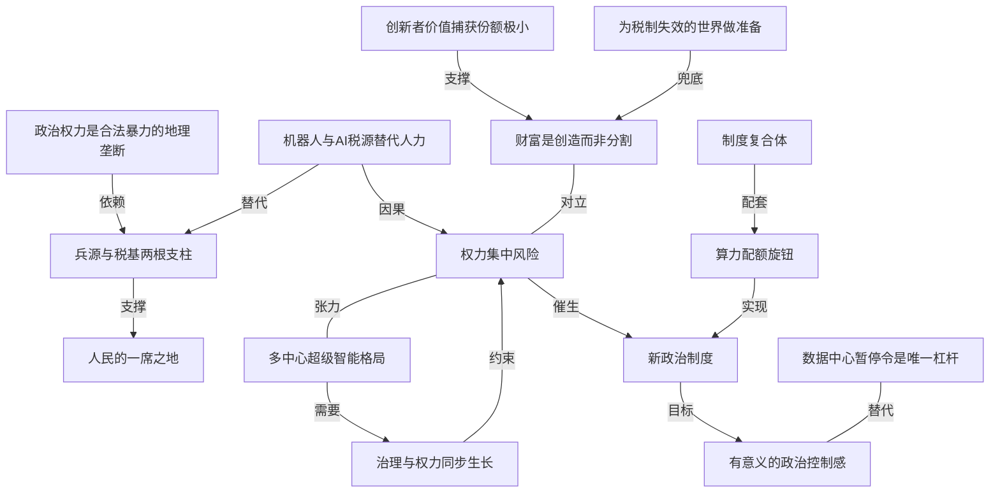

# OpenAI 想和你聊《联邦党人文集》

- 原文标题：OpenAI Wants to Talk About <em>The Federalist Papers</em>
- 作者：The Atlantic
- 内参日期：2026-09-06
- 来源类型：blog
- 原文：https://www.theatlantic.com/technology/2026/09/openai-constitution-dean-ball/688524/
- 标签：OpenAI, 社会

> 上月 OpenAI 发起了一项相当宏大的使命：在一个全能技术的时代捍卫个人政治自由。大西洋月刊这篇拆的是这套修辞的来路和它要解决的真实问题。

## 导读

来自《大西洋月刊》

## 核心观点

- 这是《大西洋月刊》记者 Matteo Wong 对 OpenAI「Strategic Futures」团队负责人 Dean Ball 的一次访谈。Ball 上月发布的 OpenAI 博文提出了一个宏大使命：在全能机器的时代捍卫个人政治自由，博文开篇引的是麦迪逊在《联邦党人文集》里的话。
- Ball 的核心论证有一个冷峻的物质主义内核：政治权力本质上是「地理边界内对合法暴力与武力的垄断能力」（the geographically bounded ability to wield the monopoly on legitimate force and violence），而行使这种能力迄今为止必须依赖大量人类的合作——你需要军队，需要军队里的人，需要人把军队喂饱补给，还需要人通过纳税为这一切买单。正因为「所有东西在某种意义上都由人民提供」，人民才在桌边有一席之地（a seat at the table）。
- 一旦机器人像通用数字智能一样快速成熟，投射暴力就不再需要人；而 AI 若能产生足够收入，政府也不再需要靠向人征税来维持自己。两条腿同时被抽走，公民的议价基础就消失了。Ball 由此给出全文最尖锐的一句判断：美国人很聪明，他们感觉到自己在桌边的位子正在变小，「他们害怕是对的」（They're right to be scared）。
- 但 Ball 并不主张避免一切权力集中，而主张平衡权力集中。他认为一家极其成功、被有效治理的超级智能公司不是问题，一个多中心（polycentric）的、多家竞争公司各造超级智能并受政府监督的世界，其风险反而低于一个运作良好的政府所有的超级智能实验室。真正的隐忧是垄断。
- 他给出的制度处方不是新法律，而是新的政治制度：一个能让社会公开讨论「加速速率」的机构复合体，具体设想是由联邦机构规定 AI 实验室可用于自动化 AI 研究的算力比例，像美联储调利率那样按月转动旋钮。
- 全篇最有张力的地方在于访谈后半段：当 Wong 把话题推向财富分配、零工经济和硅谷历史时，Ball 从制度设计者切换成产业辩护者，两人几乎正面冲突。这个转折本身，比访谈里任何一条政策设想都更能说明「一家最有影响力的公司出来批评 AI 带来的权力集中」这件事的悖论性。

## 悖论的开场：AI 巨头自比开国之父

- 上月末，OpenAI 启动了一项相当宏大的使命——不折不扣地捍卫全能机器时代的个人政治自由。「Strategic Futures」团队某种意义上把自己塑造成美国开国之父任务的继承人：「我们的工作服务于自由表达和个人自由的理想，这些理想铭刻在美国宪法那份朴素的羊皮纸上。」
- 记者点出的悖论直白而尖锐：大多数美国人对 AI 产业表达不信任，对数据中心感到愤怒，为工作安全感到恐惧——这种能动性的丧失（loss of agency）已经被普遍而深切地感受到；与此同时，AI 繁荣已经在极少数科技公司手里生成了巨额财富，OpenAI 自己就是其中之一。「至少可以说，世界最强大产业里最有影响力的公司之一出来谴责 AI 带来的权力集中，是自相矛盾的。」
- Ball 本人的履历使这个悖论更复杂：他研究 AI 政策，在业内小有名气；去年进入白宫任 AI 顾问，参与撰写特朗普政府的 AI 行动计划（AI Action Plan）；后来看似体面地离开政府，又在今年早些时候政府与 Anthropic 的争执中公开抨击它；七月加入 OpenAI。
- 他给自己定的坐标是「事情已经在发生」：「我的看法是，我们现在世界上基本已经有了变革性 AI。你正生活在一个正在被改造的世界里。它正在发生。」

## 民主的物质基础：一席之地是怎么来的，又是怎么消失的

- Ball 的推理起点不是价值，而是物理条件。政治权力的本质是垄断合法暴力的能力，而这种能力在人类历史上从未能脱离人的合作而存在。
- 需要军队，需要军队里的人。
  - 需要有人把这些军队喂饱、供给。
  - 需要有人通过税收为这一切付钱。
- 结论是一个相当唯物的民主解释：人民之所以在决策桌边有一席之地，不是因为谁授予了他们权利，而是因为「在某种意义上，一切都是由他们提供的」。选票背后站着的其实是不可替代性。
- 两项技术变化正在同时拆掉这两根支柱。
- 机器人技术很可能会像通用数字智能那样快速推进——Ball 承认这也许比他预计的更慢，但方向是确定的；到那时，投射暴力不再需要人。
  - 同时也可以设想，AI 产生的收入足以让政府不再依赖对人征税。
- 于是极端场景就出现了：如果有机器人打仗、有全知软件运行官僚体系，政府就没有必要再听公民说话。这不是科幻设定，而是把「统治者为什么需要被统治者」这个古老问题里的变量换掉之后的直接推论。
- 值得注意的是 Ball 对公众情绪的判断：他不认为大众的恐惧是非理性的技术恐慌，而认为那是对自身议价能力下降的准确感知。这一点让他和产业里常见的「公众不懂技术」叙事拉开了距离。

## 私营还是公营：不是消除集中，而是平衡集中

- 面对「生成式 AI 是私营部门开发的技术，可能带来罕见甚至前所未有的产业权力集中」这一质疑，Ball 的回答是重新定义目标：「你要避免的不是一切权力集中，而是让它平衡。」
- 他的条件式立场：如果这个时代催生出在世界上拥有巨大权力的公司，他认为这是好事——只要这些组织被治理，换句话说，只要监管它们的政府同步生长（grows in lockstep）。权力可以变大，前提是约束权力的东西以同样速度变大。
- 他明确反对一个流行直觉：人们倾向于假设 AI 掌握在私人手里本身就是权力集中风险。Ball 的反直觉判断是——一个运作极好的、政府拥有的超级智能实验室，其权力集中风险要大于一个多中心的世界，那里有许多由不同的、相互竞争的公司造出的超级智能，并受政府监督。
- 他把风险的名字收窄到一个词上：「垄断才是隐忧。」（Monopolies are the concern.）
- 记者的追问点在市场制衡的失效：如今前沿实验室大致只剩两家——他的雇主和 Anthropic，市场似乎没有为它们提供多少制衡。
- Ball 的回应有两层。一是市场眼下竞争激烈；二是中国正在交付高能力的开源模型，这有可能把 OpenAI 和 Anthropic 提供的产品商品化（commodify）。
  - 他说自己不同意这个判断，但「你不能把它当成疯狂的结果来打发」。
  - 最引人注意的是他给出的接受姿态：OpenAI 的使命是安全地向世界交付通用人工智能，「如果这意味着我们更像一家公用事业（utility）而不是一家花哨的大科技公司，那就这样吧」。

## 制度处方：一个可以转动的加速旋钮

- Ball 认为立法数量不是答案。各州已经通过了数百部关于人工智能的法律，「那些东西并没有满足人们的诉求」。
- 他要的是新的政治制度，其功能是给社会提供一种「谈论我们社会加速速率的方式」——注意这个提法：需要被制度化的不是某项技术的合法性，而是变化的速度本身。
- 具体设想是一个算力配额旋钮：
- 一个联邦机构规定 AI 实验室可以把多大比例的算力用于内部部署模型、做自动化的 AI 研究。
  - 这个月允许你用 45% 的算力做这件事，下个月是 47%、52% 或别的数字。
  - 这可能放慢 AI 发展速率；而省下来的算力，公司可以拿去降低消费者的成本。
  - 于是同一个旋钮具备双重效果：既调节技术开发的速率，也调节技术扩散（diffusion）的速率。
- 最接近的结构类比是利率——他称之为「经济上的一种超参数（hyper-parameter），政策制定者可以调节它」。
- 关键在于，他要的不只是那个旋钮，而是围绕旋钮长出来的整套东西：美联储本身是一个机构，在它之上还存在一个庞大的装置，包括债券市场、利率交易员、分析师、媒体评论，以及国会形式的政治监督。所有这些加在一起构成「制度复合体」（institutional complex）——这才是他所说的政治制度。
- 他特意划清边界：「我不是说我们需要创造一个新的政府分支之类的东西。」

## 旋钮和自由有什么关系：一根杠杆的政治学

- 记者的怀疑很直接：这套关于开发与扩散节奏的机制，我不太跟得上它如何回到你对人类自由的关切。
- Ball 的回答是：它只是一个例子，一种能让人们获得对技术的有意义政治控制感的制度。
- 但他随即给出限度：他不认为最优结果是「我们对技术变革的每一个方面都投票」。
- 他对数据中心暂停令的态度是全篇最精细的一处判断：他并不喜欢这类禁令，但他理解——「美国公众在拉一根杠杆，他们认为那是他们拥有的唯一一根杠杆。」
- 这句话把公众的反 AI 行动重新解释成制度缺位的症状：不是人们非要阻止数据中心，而是除此之外没有别的着力点。
  - 顺着这个逻辑，Ball 的制度主张其实是在造更多杠杆，好让人们不必只会拉那一根。
- 对于行业自身能扮演的角色，Ball 的自评是有保留的乐观：考虑到一切，AI 产业其实一直是相当不错的管家（stewards）；他不会说每家前沿 AI 公司在任何时候都做到了 100 分。
- 他留下的伏笔是：「未来我们可能会走到一些节点，那时必须发生代价更高的事情。AI 产业可能不得不做一些不符合自身利益的事。」

## 财富之争：创造还是分割

- 当话题转向经济自由与财富分配，Ball 的第一反应收得很紧：「在这方面我们唯一知道怎么做的事，是投资技术创新，通过让新事物成为可能来把经济做大。」
- 记者随即摊牌：很多人看硅谷过去出的产品和技术，会认为它们促成的是财富与影响力向极少数公司的巨大集中。
- Ball 直接拒绝这个刻画：「我不会认可你对硅谷的这个说法。」他的反证是普通人今日可及的富足——人们现在能获得海量信息，能让食物出现在自家门口，这在有史以来绝大多数人类看来会像魔法。
- 记者以零工经济和亚马逊的经济学反驳：这些对很多人并不好，包括那些劳动着让「魔法」发生的人——「这不是魔法。」
- Ball 的回应转向一则亲身见闻：他最近在弗吉尼亚乡下加油，一个穿着亚马逊背心的女人走进来，在场所有人都祝贺她找到这份新工作，她很自豪，「我不认为我们该因此看轻别人」。
- 紧接着是全篇火药味最重的一段指控——他说记者这类人会「两头说话」：一边讲零工经济如何去人性化，一边一旦有人试图往里引入自主性（比如用无人机送货取代骑车穿城送餐的人），又会说「天哪，你在夺走零工经济里的工作」。
- 他的财富观由此定型：
- 「我和所有人一样，对我们当下的世界并不满意。但财富的存在是好事。」
  - 创新者捕获的价值在他们为社会创造的价值中占比小得惊人。他打赌，如果十年后 OpenAI 是一家极其成功的划时代公司，他们捕获的也只是 AGI 在这个世界创造的价值的个位数比例。
  - 「财富不是我们分割的某种资源，它是我们创造的东西。那才是魔法。」
- 记者的最后一击是把这句话翻过来：但财富同时也是被分割的东西——生成式 AI 完全可以被看成一种特别会让财富集中的技术。那么，财富分配是不是你的团队在思考的问题？
- Ball 的收尾是一种有条件的推迟：「我不认为我们应该发明一个寻找问题的解决方案。」如果今天的税制管用，就不该发明什么精巧的财富再分配机制——「但我们也必须为那不成立的世界做准备。」
- 访谈到此结束，没有和解。一个把民主基础理解为物质议价能力的人，在被追问那份议价能力如何被重新分配时，选择了等待条件成熟。

## 概念网络

### 关键概念

#### 一席之地（a seat at the table）

**context**：Ball 用来解释普通人为何在政治中拥有发言权的核心意象——「人们有一席之地，因为在某种意义上，一切都是由他们提供的」。它是全文论证的支点：席位不是被授予的权利，而是由不可替代性换来的位置。文章结尾处，Ball 判断美国人「感觉到自己在桌边的位子可能正在变小」，并说他们害怕是对的。

**费曼一下**：你能坐在谈判桌边，不是因为对方有礼貌，而是因为你手上有对方拿不到的东西。历史上普通人手上的筹码是身体和钱包——打仗要人，行政要人，国库要人交税。哪天这些都能由机器提供，你的椅子就会被悄悄搬走，哪怕没人宣布过要搬。

#### 政治权力作为合法暴力的地理垄断

**context**：Ball 给政治权力下的定义——「地理边界内行使对合法武力与暴力之垄断的能力」。这是他全部推论的第一块砖：先把权力还原成一种需要人力才能执行的能力，才能论证 AI 与机器人如何改变权力的分布。

**费曼一下**：国家之所以是国家，不在于它有旗帜和口号，而在于在一块地盘上只有它可以合法动武。而动武这件事，一直是个劳动密集型行业——所以掌权者必须跟很多人打交道。把「劳动密集」三个字去掉，剩下的东西还是不是国家，就成了一个真问题。

#### 权力的两根支柱：兵源与税基

**context**：Ball 论证民主物质基础时并列的两条依赖链——军队及其补给需要人，为这一切买单需要人纳税。文章设想的极端场景正是这两条同时断裂：机器人打仗，AI 生成足够收入使政府不必征税。

**费曼一下**：统治者的耐心是买来的。历史上他要听你说话，是因为他需要你去打仗、去交税。这两件事一旦都能外包给机器，倾听就从必需品变成了美德——而美德是可选的。

#### 权力集中的平衡而非消除

**context**：Ball 对「AI 会不会带来权力集中」这一问题的重新框定——「你要避免的不是一切权力集中，而是让它平衡」；巨型公司拥有巨大权力可以是好事，只要治理它们的政府同步生长。

**费曼一下**：目标不是让所有人都小，而是别让某一方单独变大。就像杠铃两头都加重不会翻，只有一头加重才会。问题从来不是「有没有巨头」，而是「巨头的对面站着谁」。

#### 同步生长（grows in lockstep）

**context**：Ball 为「大公司权力是好事」附加的唯一条件——监管它们的政府必须以同样的步调壮大。这个条件把一句听起来像产业辩护的话，变成了一句对监管能力提出要求的话。

**费曼一下**：如果孩子长得比家里的门框快，你要么换门框，要么以后就别指望管得住。治理能力和被治理对象是一对赛跑选手，落下的一方不会被同情，只会被绕过。

#### 多中心的超级智能格局（polycentric）

**context**：Ball 的反直觉判断——一个由多家竞争公司各造超级智能、并受政府监督的多中心世界，权力集中风险低于一个运作极好的政府所有的超级智能实验室。他据此把风险的名字收窄为「垄断」。

**费曼一下**：几股力量彼此掣肘，比一股力量自我克制更可靠。哪怕那一股力量声称自己很正派，也没有第二个人能在它出错时按住它的手。多中心不保证善良，只保证有人反对。

#### 商品化与公用事业化（commodify / utility）

**context**：面对「前沿实验室只剩两家、市场缺乏制衡」的质疑，Ball 举出中国交付的高能力开源模型，承认它有可能把 OpenAI 和 Anthropic 的产品商品化；他表示不同意，但不能斥之为疯狂结局，并说如果结果是「我们更像一家公用事业而不是花哨的大科技公司，那就这样吧」。

**费曼一下**：当一样东西人人都能做，它的价格就掉到成本附近，卖它的公司也就从明星变成自来水厂。自来水厂利润薄、地位低，但社会离不了。Ball 的姿态是：如果 AI 最后长成自来水厂，那也算完成使命。

#### 加速速率作为政治议题

**context**：Ball 认为各州已通过数百部 AI 法律却「没有满足人们的诉求」，真正缺的是「一种谈论我们社会加速速率的方式」。这把治理对象从技术本身移到了技术变化的速度上。

**费曼一下**：人们真正害怕的往往不是新东西，而是新东西来得太快、快到来不及重新安排生活。所以该被投票的不一定是「要不要」，而是「多快」。一个社会如果连讨论速度的地方都没有，就只能靠急刹车表达意见。

#### 算力配额旋钮

**context**：Ball 设想的具体制度工具——由联邦机构规定 AI 实验室可用于内部部署、做自动化 AI 研究的算力比例，这个月 45%，下个月 47% 或 52%；省下的算力可用于降低消费者成本，因此这个旋钮同时调节开发速率与扩散速率。

**费曼一下**：与其争论要不要放行一项技术，不如给它装一个可以每月微调的油门。踩轻一点，研发慢下来，省下的马力还能顺手把价格压低。这个设计的聪明之处在于：它把「减速」和「让更多人用上」变成了同一个动作。

#### 制度复合体（institutional complex）

**context**：Ball 用美联储作类比时强调，真正起作用的不只是那个可调的利率数字，而是围绕它长出来的整套生态：美联储本身、债券市场、利率交易员、分析师、媒体评论、国会的政治监督。他明确表示这不等于新设一个政府分支。

**费曼一下**：一个旋钮不会自己变得可信，可信的是围着旋钮吵架的那一大群人。有人预测、有人下注、有人质疑、有人问责，旋钮才不至于被谁悄悄拧到底。制度的分量在配套里，不在按钮上。

#### 唯一的杠杆

**context**：Ball 说自己不喜欢数据中心暂停令，但理解「美国公众在拉一根杠杆，他们认为那是他们拥有的唯一一根杠杆」。这句话把反 AI 的地方性行动解读为制度供给不足的症状。

**费曼一下**：当一个人只有一把锤子，你不能怪他把所有东西都当钉子。公众之所以死磕数据中心选址，往往不是因为那是最优抗议方式，而是因为那是唯一一个他们能碰到的开关。想让人放下锤子，得先给他别的工具。

#### 财富是创造出来的，不是分割的

**context**：Ball 在与记者关于零工经济和硅谷历史的争执后给出的立场——「财富不是我们分割的某种资源，它是我们创造的东西。那才是魔法」；他还判断创新者只捕获自己创造价值中小得惊人的一部分，赌 OpenAI 若成为划时代公司也只会捕获 AGI 所创造价值的个位数比例。

**费曼一下**：一派人盯着蛋糕怎么切，另一派人盯着蛋糕怎么做大。Ball 站在后一派，并加了一条辩护：做蛋糕的人自己只吃到很小一角，剩下的都溢出给了社会。记者的反问同样成立——蛋糕再大，切法也决定了有人吃不吃得到。

#### 寻找问题的解决方案

**context**：Ball 拒绝立刻讨论财富再分配机制时的理由——「我不认为我们应该发明一个寻找问题的解决方案」；如果今天的税制管用就不必发明精巧的机制，但也必须为它不管用的世界做准备。

**费曼一下**：这是工程师常用的一句自律：别为还没出现的故障造零件。它的风险也很明显——有些故障一旦出现就来不及造零件了。Ball 自己留了后门，说必须为那个世界做准备，只是没说准备从哪天开始。

### 概念网络

这篇访谈的思想网络有一个非常清晰的底座：把政治权力还原成一种劳动密集的能力。「政治权力是合法暴力的地理垄断」这个定义之所以关键，是因为它立刻推出「兵源与税基两根支柱」——垄断暴力必须有人去打仗、有人去补给、有人去纳税。而「人民的一席之地」正是从这两根支柱上长出来的，它不是权利叙事的产物，而是议价能力的结果。这条链条从定义走到民主，全程没有借用任何道德前提，这是 Ball 论证最有力也最冷的地方。

「机器人与 AI 税源替代人力」是整张网的破坏性输入。它对准的不是席位本身，而是席位下面的支柱：机器人接管暴力投射，AI 收入接管财政，两根支柱同时被拆。因此它既指向支柱（替代关系），也直接产出「权力集中风险」（因果关系）。文章里那句「他们害怕是对的」，在网络上的位置正是这条因果边的下游——公众的恐惧被解释成对支柱松动的准确感知，而不是对新技术的非理性排斥。

接下来是全文最容易被误读的一段结构。「权力集中风险」并不通向「消灭大公司」，而是与「多中心超级智能格局」形成张力：多中心不能消除集中，只能让集中彼此制衡，所以两者之间是张力而非因果。真正约束风险的是「治理与权力同步生长」，而多中心格局需要它才能成立——一堆互不相让的超级智能，若没有一个同步壮大的监管者，就只是把一个垄断者换成几个寡头。这三个节点构成 Ball 全部政策立场的三角：风险是垄断，方案是多中心，前提是治理跟得上。

制度层面是一条自上而下的实现链。风险催生「新政治制度」，而制度不是抽象呼吁——它被「算力配额旋钮」这样一个可操作的工具实现，旋钮又必须由「制度复合体」配套才有可信度。Ball 用美联储作类比的真正用意在这里：可调的数字只是最表层的东西，债券市场、交易员、分析师、媒体和国会监督共同构成使那个数字变得可信的装置。这条链条最终的目标节点是「有意义的政治控制感」——制度设计的终点不是控制技术，而是让人重新感到自己能控制。

「数据中心暂停令是唯一杠杆」与控制感之间是替代关系，而非因果：它是控制感的劣质代用品。Ball 不喜欢这类禁令，却理解公众为何拉它——正因为通向真正控制感的那条制度路径还没建成。这个判断使得整张网的两半彼此咬合：制度供给不足，公众就只能用手边唯一的开关表达政治意愿。

最后一组节点是访谈后半段的战场，也是与前半段张力最大的地方。「创新者价值捕获份额极小」支撑「财富是创造而非分割」，构成 Ball 的产业辩护；而这个立场与「权力集中风险」直接对立——如果财富主要是被创造出来并大量溢出给社会，那么 AI 造成的财富与权力集中就不是首要问题。这条对立边正是记者与受访者始终无法弥合的裂缝：Ball 在政治权力上使用的是彻底的议价能力分析，在经济财富上却切换成了价值创造叙事，两套框架并不共用同一组假设。「为税制失效的世界做准备」是他为这条裂缝留下的兜底——承认创造叙事可能不成立，但把行动推迟到那一刻真正到来之后。

## 费曼 x3

我们习惯把民主理解成一种信念：人生而平等，因此人人有权发言。但如果换一个更冷的角度看，选票背后站着的其实是不可替代性。国家之所以要听普通人说话，是因为国家在做的每一件根本性的事都需要普通人——打仗需要士兵，补给需要工人，一切开销需要纳税人。政治权力说到底是「地理边界内行使合法暴力垄断的能力」，而这种能力自古以来是个劳动密集型行业。人民有一席之地，是因为「在某种意义上，一切都是由他们提供的」。

这个视角的可怕之处在于，它把民主变成了一件有物质前提的事——前提可以被技术改变。机器人成熟到能投射暴力，AI 赚到足够多的钱使政府不必征税，两根支柱就同时被抽走。到那时，倾听公民不再是必需品，而变成一种可选的美德。所以当大多数人对 AI 产业表达不信任、对数据中心愤怒、为工作担忧时，这未必是技术恐慌，更可能是对自己筹码正在缩水的准确感知。他们害怕是对的。

有意思的是，说这些话的人来自 OpenAI。一家世界最强产业里最有影响力的公司，出来警告 AI 带来的权力集中，怎么看都自相矛盾。但他给出的解法并不是把巨头变小——目标不是避免一切权力集中，而是让它平衡；一家极其强大的公司不是问题，只要治理它的政府「同步生长」。他甚至认为，一个运作极好的政府所有的超级智能实验室，比一群相互竞争、受政府监督的私营超级智能更危险。多中心不保证善良，只保证有人反对；真正的隐忧从来是垄断。

更值得琢磨的是他的制度设想。数百部州级 AI 法律没能满足人们的诉求，因为人们要争的往往不是「要不要」，而是「多快」。所以他想要的是一个能公开讨论社会加速速率的机构：由联邦机构规定 AI 实验室可以把多大比例算力用于自动化 AI 研究，这个月 45%，下个月 47%，省下的算力顺手用来降低消费者成本——同一个旋钮既减速研发，又加速扩散。类比是利率，那是「经济上的一种超参数」。但他强调，真正起作用的不是那个可调的数字，而是围着它长出来的整套装置：债券市场、交易员、分析师、媒体评论、国会监督。制度的分量在配套里，不在按钮上。

这也解释了他对数据中心暂停令那句罕见的同情：他不喜欢这类禁令，但理解公众「在拉一根杠杆，他们认为那是唯一的一根」。当一个人只有一把锤子，你不能怪他把所有东西都当钉子。想让人放下锤子，先得给他别的工具。

裂缝出现在谈钱的时候。谈政治权力时他用的是彻底的议价能力分析，谈经济财富时却切换成了价值创造叙事：财富不是我们分割的资源，而是我们创造的东西，创新者捕获的份额小得惊人。两套框架并不共用同一组假设——如果说政治席位会因为人被替代而消失，那么经济份额为什么不会？他留的后门是：不该发明一个寻找问题的解决方案，但必须为今天的税制不再管用的世界做准备。问题是，准备从哪一天开始，没有人说。

## 阅读原文

The AI giant is worried about what all-powerful bots could mean for our constitutional rights.

(Illustration by the Atlantic. Source: Joe Sohm / Visions of America / Getty; Smith Collection / Gado / Getty.)

Late last month, OpenAI launched a rather grand mission: nothing less than defending individual political freedom in an age of all-powerful machines. The company’s “Strategic Futures” team has styled itself, in a sense, as inheriting the task of America’s Founding Fathers: “We labor in service of the ideals of free expression and individual liberty that are enshrined in the humble parchment of the U.S. Constitution,” Dean Ball, the team’s leader, wrote in a new OpenAI blog post. (The [post](https://openai.com/index/introducing-intelligence-age/) opens with a quote from James Madison in _The Federalist Papers_.)

Ball worries that advanced AI could radically concentrate power in the hands of those who control it, displacing labor in ways that disempower humans. In an extreme scenario, governments will have no need to listen to their citizens if there are robots to wage wars and omniscient software to run the bureaucracy. Ball is interested in studying what new political institutions might be needed to avoid this fate.

Many Americans—a majority of whom express distrust toward the AI industry, outrage about data centers, and fears about their job security—already seem to be feeling this [loss of agency](https://www.theatlantic.com/technology/2026/09/ai-future-reckoning-singularity/688487/) very deeply. And the AI boom has already generated enormous amounts of wealth in just a handful of tech companies—including OpenAI itself. To say the least, it’s paradoxical for one of the most influential companies in the world’s most powerful industry to decry the AI-enabled concentration of power. So I reached out to Ball to understand more about his unease about the industry he works in, and how he wants to see the United States adapt to AI.

Ball, who studies AI policy, is something of a minor celebrity in the industry. Last year, he joined the White House as an AI adviser and helped write the Trump administration’s [AI Action Plan](https://www.theatlantic.com/technology/archive/2025/07/donald-trump-ai-action-plan/683647/), a policy road map for the technology. He eventually departed, seemingly on good terms, from the administration before publicly [lambasting it](https://www.theatlantic.com/technology/2026/03/dean-ball-anthropic-interview/686226/) during its dispute with Anthropic earlier this year. Then, in July, he joined OpenAI. “My view is that we basically have transformative AI in the world now,” Ball told me. “You’re living in a world that is being transformed. It is happening.”

_This conversation has been edited for length and clarity._

**Matteo Wong:** You write that concentration of power through AI could upend the basic human freedoms enshrined in the U.S. Constitution. Can you elaborate on how?

**Dean Ball:** Fundamentally, political power is the geographically bounded ability to wield the monopoly on legitimate force and violence. Doing so has heretofore required the cooperation of a great many human beings. You needed militaries, you needed people in those militaries, and you needed people to keep those militaries fed and supplied. And you needed people to pay for all of that through taxation. So people had a seat at the table because, in some sense, everything is being provided by them.

Now you have to assume that robotics is going to advance soon in the same way that general digital intelligence has. Maybe it will take longer than I think. But at that point, the ability to project violence no longer requires people. And it is also conceivable that AI might generate sufficient revenue that the government would not need to rely on taxing people.

If you look at the politics of AI, I think Americans are smart and have a sense that their seat at the table might be getting smaller. They’re right to be scared.

**Wong:** You’re talking about concentration of power in the government, but generative AI is a technology developed in the private sector. There is potential for a rare and even unprecedented concentration of power in industry. What risks does that pose?

**Ball:** You’re not trying to avoid all concentration of power, but to balance it. If this era gives rise to corporations that have a tremendous amount of power in the world, I think that’s good—so long as those organizations are governed. In other words, so long as the government that oversees them grows in lockstep.

People tend to assume that AI residing in private hands is inherently a concentration-of-power risk. But I think that an extremely well-run, government-owned superintelligence lab is a bigger concentration-of-power risk than a polycentric world where there are many superintelligences made by different, competing companies overseen by a government. Monopolies are the concern.

**Wong:** As far as private concentration of power goes, there are arguably now two frontier labs, your employer and Anthropic. The market doesn’t seem to be providing many checks on them.

**Ball:** I think it’s a fiercely competitive market right now. And China, of course, is delivering highly capable open-source models. It’s possible this is going to commodify the products that OpenAI and Anthropic offer. I don’t agree with that, but you can’t dismiss it as a crazy outcome. OpenAI’s mission is to deliver artificial general intelligence safely to the world. If that means we’re more like a utility than we are like a big, fancy tech company, so be it.

**Wong:** This brings us to the core of your essay. If today’s political institutions and market dynamics are not up to the task of protecting human freedom during an AI era, what must change?

**Ball:** There are AI regulations that I think are sensible to pass. States have passed hundreds of laws about artificial intelligence, and those things are not satisfying the demands of people. What we will need is new political institutions that give us a way of talking about the rate of acceleration in our society.

I’m imagining a federal body could dictate the ratio that an AI lab is allowed to spend on internal deployment of models to do automated AI research. You could say that, this month, you’re going to be allowed to use 45 percent of your compute for that, and next month, it’ll be 47 percent or 52 percent or some other number. That might slow the rate of AI development, but then a company could use that extra compute to lower costs for consumers. Then this dial for AI development would also become a mechanism with the dual effect of slowing or increasing the rate of technological diffusion.

The closest structural analogy that we have is probably interest rates, which is a kind of hyper-parameter on the economy that policy makers can tune. The Federal Reserve is an institution in and of itself, and on top of that, there is an enormous apparatus that exists, including a bond market, interest-rate traders, analysts, media commentary, political oversight in the form of Congress. All of that taken together, in my view, would constitute the institutional complex. That’s a type of political institution. I’m not saying we need to create a new branch of government or something.

**Wong:** That makes sense regarding the pace of development and diffusion. I’m not totally following how such a measure ties back to your concerns about human freedoms.

**Ball:** It’s one example of an institution that would give people a sense of meaningful political control over the technology. However, I do not think that the optimal outcome is one in which we take a vote on every single aspect of technological change. I’m not really a fan of data-center moratoria, but I understand that the American public is pulling a lever, and they think it is the one lever they have.

**Wong:** What role can OpenAI, Anthropic, and the rest of the industry play in trying to imagine these institutions and bring them into existence?

**Ball:** I think the AI industry has actually been pretty good stewards, all things considered. No surprise that I’m saying this, because I’m from the AI industry, but there’s a reason that I am working in it. I would not say that every frontier AI company always has performed at 100 percent, by no means. But in the future, we may approach points where more costly things have to occur. The AI industry might have to do things that are not in its interest.

**Wong:** Does your research agenda extend to economic freedoms, that is, how AI could affect the economy and distribution of wealth?

**Ball:** The main thing we know how to do on that front is to invest in technological innovation and try to grow the economy by making new things possible.

**Wong:** I think a lot of people would look at past products and technologies that have come out of Silicon Valley and think that what those enabled was a tremendous concentration of wealth and influence in a small number of companies—

**Ball:** I’m not going to grant you that characterization of Silicon Valley. Has everything been perfect? Absolutely not. But my goodness, people have access to tremendous riches of information now; you can cause food to appear at your doorstep, which would have seemed like magic to the vast majority of humans who have ever lived.

**Wong:** I could also point to the gig economy and the economics of Amazon and argue that those have not been good for a lot of people, including those who labor to make all that “magic” happen. It’s not magic.

**Ball:** No one’s saying it’s magic. I’m saying it’s hard work. I was getting gas in rural Virginia recently, and when a woman came in wearing an Amazon vest, everyone congratulated her on the big new job. She was proud, and I don’t think we should belittle people for that.

And by the way, people like you, Matteo—not to demonize you—will speak out of both sides of your mouth on this. On the one hand, you’ll talk about how the gig economy is dehumanizing and blah blah blah. But then the second anyone tries to introduce any autonomy into that and have, say, drone deliveries instead of people biking all around cities delivering meals, you’ll say, _My God, you’re taking away the work from this gig economy_.

I’m less than thrilled by our current world, like everyone. But the existence of wealth is good. Innovators capture a shockingly small amount of the value that they create in society. If OpenAI is a fantastically successful company 10 years from now, a generational company, my bet is that we will capture a single-digit fraction of the value that AGI creates in this world. Wealth is not some resource that we divide up; it’s something we create. That’s the magic.

**Wong:** But wealth is also something that’s divided up. One could alternatively look at generative AI and think of it as a particularly wealth-concentrating technology. To ask again, is wealth distribution something your team is thinking about?

**Ball:** I don’t think we should invent a solution in search of a problem. So we shouldn’t invent some elaborate mechanism of wealth redistribution if today’s tax system works out. But we also have to prepare for a world in which that isn’t true.
