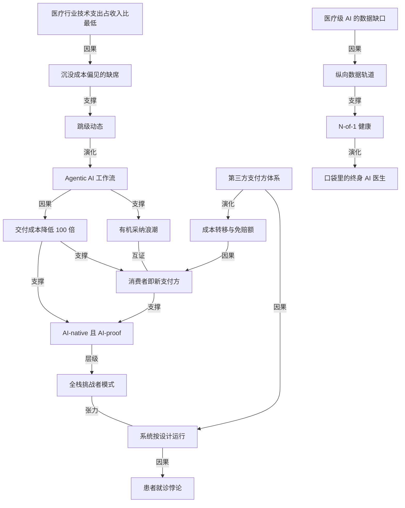

# a16z 合伙人谈医疗 AI：历史欠账反而成了跳级的机会

- 原文标题：Your AI Doctor Is Coming | Julie Yoo | The a16z Show
- 作者：The a16z Show
- 内参日期：2026-09-07
- 来源类型：blog
- 原文：https://app.podwise.ai/dashboard/episodes/8843680
- 标签：医学, 企业 AI

> Julie Yoo 的判断是，医疗长期缺乏技术投入这件事现在成了优势——不用背旧软件的包袱，可以直接从纸质流程跳到 agent 原生的工作流。近二十年行业经验支撑的一场结构性推演。

## 导读

AI 医疗

## 核心观点

- a16z 医疗投资团队负责人 Julie Yoo 的中心主张只有一句：医疗是最能从 AI 中获益的行业，而它获益最多的原因恰恰是它过去二十年在技术上投入最少。
- 别的行业花了几十亿美元铺 workflow SaaS 的"中间件层"，还把整整一代员工训练在那套范式上；AI 来了，他们要先"rip and replace"再重训。医疗没铺过这层，"我们不必操心把二十年、几百亿美元的中间件软件拆掉，可以直接跳到 agentic 形态的技术"——历史欠账在这里反转成了跳级（leapfrog）优势。
- 但跳级只是供给侧的可能性。真正让这一刻发生的是多因合流：消费者忍耐到临界点、在位者被成本和人力挤压到"the math doesn't math anymore"、政府和支付方压成本，再叠加 LLM 让"稀缺的医学专业能力"第一次可被规模化复制。
- 三个判断构成这场对话的骨架：医疗的低效不是失败而是设计的结果（激励结构决定了今天的体验）；医疗第一次出现了不靠补贴、不靠疫情倒逼的自发采纳浪潮；未来十年会走向 N-of-1 健康，每个人口袋里有一个陪伴终身的 AI 医生。

## 前史：医疗从纸质走到数字，走了两次被外力推着的路

- Julie Yoo 入行约 18 年，出身工程师，前七年在电商、金融科技、制造业写代码，在联邦政府开始谈"如何数字化医疗"的时候转行进来。她的自我评价是"我太早了"——早了十五到二十年。
- 二十年前行业的真实状态是纸：医生办公室的柜子里还是纸质文件夹，什么都没数字化。她转述行业里最常见的一句抱怨——"I'm being papered to death. I'm being faxed machine to death."
- 第一次外力：联邦政府的 EHR 补贴计划。政府直接说"我们付给医生几万美元来实施电子健康档案"，五到七年内，"literally 100% of doctors in the US were heads down"实施这套 system of record。这是医疗进入现代的方式——不是自然采纳，是被钱推进去的。
- 她的第一段行业经历在基因组学。人类基因组计划之后数据爆炸，"我们理解了人类的基础代码"，围绕计算生物学炸出一整个产业，探索基因组学如何关联到最终的疾病。
- 第二次外力：COVID。疫情迫使所有人承认必须有一种数字方式与医疗系统打交道，并撕开了很多此前被当作前提的假设：
- 执业资质是州一级发放的，医生通常没有跨州执业许可——医疗在供给侧一直用一些"奇怪的方式"刻意约束供给。远程医疗带来全国规模的临床需求，各州和联邦机构不得不从第一性原理重想如何放松这些约束。
  - 支付口径也被迫改：此前很多情况下，除非你已经和医生有过线下面诊，远程医疗是不予支付的。
- 这两次都不是自然发生的。她后来在博客里把它总结成：医疗史上历次技术采纳都很"unnatural"——你得付钱让医生用技术，你得来一场大流行才能让人用远程医疗。

## 患者就诊悖论：她创业的原点

- 2010 年前后她创办 Kyruus，做了九年联合创始人兼 CPO，去年卖掉公司。她自嘲这是"a 15-year overnight success"。
- 创业命题来自一个供需错配。作为消费者，我们都感受得到约不上号的痛：美国大多数主要城市里，初级保健医生的平均等候时间至今仍是数周甚至数月。
- 但当她和大医院、大医生集团的高管交谈，得到的答案完全相反：病人在门口排队，医生的时间利用率却"way under 100%"。这就是她所说的**患者就诊悖论**——门口有需求，系统却没能把需求高效路由到可用的产能上。
- Kyruus 的解法是建立跨医疗系统的**单一预约库存系统**（single system of appointment inventory），把病人路由到对的医生、对的时段，让产能被真正用起来。
- 当时的行业环境她形容为"health tech 的石器时代"：pre-Stripe，pre-API 层，没有现成的地基去搭公司。风投也几乎不进这个领域，"当时大概只有五个人投我们这个赛道，我从这五个人手里全都融过"。
- 那句被划线的表达是她对那段工作的定义：她把自己做的事比作"拿一根凿子和一颗钉子，去凿医疗基础设施这堵混凝土墙"（taking a chisel and a nail against a concrete wall）。耗时、耗钱，而且招人极难——这是个不性感的行业，"如果你可以去 Google，为什么要来搭 1970 年代的系统"。

## 为什么是现在：医疗文艺复兴的多因合流

- **消费者到了临界点**。Uber 改变了出行、Airbnb 改变了旅行、Instacart 改变了我们对食物的想法，我们对任何服务业的标准和底线都被抬高了，而医疗原地不动。这个落差大到消费者开始说：我要用脚和钱包投票，哪里能拿到更好的服务我就去哪里。
- **在位者被围攻**（under extreme siege）。大型医院系统、大型保险公司、承担了大部分保费的雇主，同时面对：人力成本上升、人力供给收紧、COVID 之后大量医疗人才流失（"太痛苦太难熬，我不干了，拿着医学训练去做别的"）。
- **政府和支付方压成本**。她的判断是行业存在"unsustainable amounts of bloat"——不可持续的臃肿，而臃肿的根源是第三方支付方结构：你的绝大部分医疗费用不是你自己付的，所以你不会为花出去的每一块钱感到疼，于是比自由市场动态下更容易长出冗余。
- **成本转移把疼痛还给了消费者**。系统过去应对成本臃肿的办法之一是"cost shifting"：给消费者一点 skin in the game，设免赔额，一千美元以内保险不启动，你自己付。恰恰是这一下让消费者意识到："天啊，我要为这么糟的服务付这么多钱？"
- **AI 是压垮骆驼的最后一根稻草**。医疗是高度依赖稀缺训练的行业——成为一个专科服务提供者至少要念七年书再加训练，所以此前技术几乎无法复制接近那种水平的专业能力。直到 LLM 带来"abundant intelligence"（充裕的智能）。
- 合流的结果是空白被新供给填上：现在有一批公司，你每月自费十美元就能拿到"incredible"的服务，跟传统医疗系统里同样金额能买到的东西相比"好上一千倍"。

## 跳级论：历史欠账反转成结构性优势

- 医疗行业按技术支出占收入比衡量，"the lowest of the lowest"——历来是所有行业里最低的。这是这场对话的关键事实，也是跳级论的全部前提。
- 别的行业过去二十年铺的是什么：workflow SaaS 的轨道、基础设施之上的一整层中间件，投入以数百亿美元计，还训练了一整代工人。AI 来了，他们的第一反应是"我的天，我们得把整个上一代技术范式拆掉换成 agentic AI，还得把整代员工重训一遍"。
- 医疗铺的是什么：只有 EHR 这一层类似 ERP 的东西，再往下就是人力——"we were just throwing bodies at every problem"，什么问题都靠往上堆人解决。
- 结论就是那句被划线的话："我们不必操心把二十年、几百亿美元的中间件软件拆掉，可以直接走到 agentic 形态的技术。"——**沉没成本偏见的缺席本身就是资产**。这对所有向医疗行业卖软件的公司都是一次结构性红利。
- ※ 这里值得注意的推论：跳级优势是一次性的、且属于供给侧。它解释了"为什么医疗能快"，但不解释"为什么医疗会动"——后者由第三节的需求侧压力提供。

## 第一次有机采纳浪潮：AI scribe 与消费级 LLM

- **企业侧**：这是 health tech 历史上第一次真正**有机的**采纳浪潮。医生用 AI scribe（自动病历记录）不是因为有人付钱让他们用，而是"because they freaking work"——它们真的好用，真的把工作的性质往好的方向改变了。
- 采纳路径也变了：更像 PLG，一线医生和一线工作者本人拥有采纳的能动性（agency），而不是自上而下装系统。
- **消费者侧**：所有人都在拿健康问题去问 LLM，而且它们"pretty damn good"，比刚出来时幻觉更少、建议更可执行。
- 她给出的是一个赤裸的权衡账：即便 LLM 给的医学建议没有被监管、执照和完整验证背书，替代方案是"等四个月约到真医生，或者去急诊付两千美元，或者我现在就打开手机"。这个 delta 大到人们必然选择摩擦最低的那个入口。
- 更重要的溢出效应是教育：一整代人被教会了"there's a better way"——原来可以有更好的路径。LLM 还开始向前整合进真实市场，你可以先问 AI 再去预约真医生。
- **AI-native 诊所已经出现**。a16z 投资的 Council Health 是一家 AI 原生的医生执业机构：7×24 异步聊天，"想象你在和 chatbot 聊天，但聊天框里坐着一位真的持照 MD"，能诊断、能转诊、能开处方。它同时拿到两边的好处——AI 原生的交付形态，加上真医生才具备的临床效用。这类能力几年前根本不可能存在。
- 主持人补充了一个反向的例证：Anthropic 与 AWS 办过一场 Rare Disease Real Kid Hackathon，五万美元奖金，在家长同意下把一个孩子的基因组与临床数据开放给社区去生成洞见。罕见病的专科医生极难找，儿童罕见病的投入在商业上根本算不过账——这正是 AI 能实际救命的清晰样本。

## 创业机会：三块她愿意押注的地方

- **第一块，消费者角度**。七年前你拿一个消费者健康的项目去见投资人会被请出房间，因为没有可行的商业模式，也不清楚消费者是否有意愿和能动性掌控自己的健康。
- 现在增长最快的一批 health tech 公司是 cash pay：直接自费购买服务，价格低到有破坏性。
  - 她认为最大的变量不是"能不能自费"，而是价格：过去自费也付得起的人不多，价格是禁止性的；现在因为 AI 的魔法，**交付一项医学上可信的服务，成本结构比过去低了约 100 倍**。
  - 于是产品设计的顺序被彻底翻转：历史上你要为保险公司和医生设计，消费者是事后想起来的附加项；现在消费者被推到了最上面。他们把这个趋势写成了一篇文章，标题就是"消费者是新的支付方"。
- **第二块，AI-native 且 AI-proof**。这是她上周刚写的论点：最好的公司同时具备两种属性。
- AI-native 指内部高度 AI 驱动，成本结构具有破坏性、毛利高，因而能持续投入创新。
  - AI-proof 指它承担了那些无法被完全数字化的部分：如何给去不了医院的人交付线下服务、如何抽血并真正做出诊断、如何完成那些在法律上必须由受监管实体执行的事。
  - 形态上是**全栈挑战者**，与第一波科技浪潮的 challenger businesses 同构：从外面看像零售商或服务提供商，从里面看是彻底的 AI 原生，触达面是传统方式达不到的。
  - 硬件和机器人被她归在这一类：机器人能力与高急性度（high acuity）医疗场景之间存在产品市场契合。
- **第三块，支付轨道**。这是那句被划线的判断的落点："人们看着医疗说它怎么这么糟——它其实完全是按设计运行的。如果你研究现有支付体系里激励是怎么对齐的，得到的结果恰好就是我们今天经历的一切。"
- 于是最有野心的一批公司在问：如果我们炸掉现有的支付模式，从零重建一个呢？这几乎等于在一家公司里造一个微缩的医疗系统。她点名 Devoted Health 一类公司正在做这件事。
  - 之所以现在可行，是因为进入这个行业造公司的成本已经下降——基础设施终于都在了，AI 让单位产出大幅提高，而且需求侧（消费者客户）和传统生态两边的胃口都是前所未有的。

## 终局：数据缺口与 N-of-1 健康

- 她对"十年后"的预测是"roll your own healthcare"：会出现大量 **N-of-1 解决方案**——只针对你这一个人做超个性化，同时仍能享受所有人共同贡献回来的更广泛智能。
- 但她给出了一个反直觉的前提性障碍：**我们今天甚至还没有训练一个真正医学级 AI 所需的数据集**。原因是我们高度依赖 EHR 数据，而 EHR 数据非常零散——一个人一生中真正去看传统医生的次数，"最多一年一次"。
- 后果是结构性的：**每个人作为病人的那条完整叙事弧线，在今天几乎所有数据集里都是缺席的**。这是她认为必须先补上的关键数据赤字。
- 因此她的推演顺序是：先有公司去跑这些 N-of-1 实验 → 实验生成新的纵向数据轨道（data rails）→ 这些数据轨道驱动下一代模型。数据不是等来的，是被新形态的服务顺带生产出来的。
- 最终图景：所有人都会有一个"AI doctor in our pocket for life"——一个陪伴终身的口袋 AI 医生。主持人补了一句更精确的定义：一个比世界上任何人都更了解你的个性化专科医生。
- 与之对照的是今天的形态：她明确指出"medical AI today is highly transactional"——今天的医疗 AI 高度事务性、一次性。她拆出的三段价值链是：第一段是降低获取智能的门槛（已经被通用工具解决得差不多了）；第二段是"然后呢"——你需要验证、需要临床级检测、需要处方或线下操作；第三段是纵向陪伴——"how do we stay with you for life until it's resolved"。健康科技创业者真正的机会在第二段和第三段，那最后一公里。

## 概念网络

### 关键概念

#### 跳级动态（leapfrog dynamic）

**context**：Julie Yoo 用来解释"为什么医疗最受益于 AI"的核心机制。医疗按技术支出占收入比是所有行业中最低的，反而不必经历"rip and replace"，"可以直接走到 agentic 形态的技术"。

**费曼一下**：别人家早就装了一整套复杂的电话总机，现在要换成手机，得先把总机拆了、把员工重新培训一遍。你家太穷从没装过总机，于是直接买手机就行。落后一步反而省掉了拆迁成本——前提是新技术真的比旧路径强很多，否则落后只是落后。

#### 沉没成本偏见的缺席

**context**：跳级论的真正机制。别的行业在中间件层投入"tens of billions of dollars"并训练了整代工人，因而对旧范式有强烈路径依赖；医疗"只有 EHR 这一层加人力"，所以"we have less of a sunk cost bias as an industry"。

**费曼一下**：已经花掉的钱不该影响未来的决策，但人和组织做不到——投得越多越舍不得换。没投过的人反而决策更自由。所以在技术换代的关口，资产负债表上那堆旧系统是资产还是包袱，答案会翻转。

#### 有机采纳浪潮（organic adoption wave）

**context**：与医疗史上历次"unnatural"采纳的对照。EHR 靠政府付钱给医生，远程医疗靠一场大流行强推；而医生用 AI scribe 是"because they freaking work"——这是第一次自发的采纳浪潮，采纳路径接近 PLG，一线医生本人拥有能动性。

**费曼一下**：判断一项技术是不是真的成了，看有没有人在没有补贴、没有强制、没有考核的情况下自己掏时间用它。被推着用的和抢着用的，是两种完全不同的信号，后者才可持续。

#### 第三方支付方体系（third-party payer system）

**context**：她诊断医疗"esoteric"和臃肿的结构性根源——"你的绝大部分医疗费用不是你自己付的，所以你不会为花出去的每一块钱感到疼"，因而比自由市场动态下更容易长出 bloat。

**费曼一下**：花别人的钱办自己的事，最不心疼。医疗里付钱的是保险公司或雇主，用服务的是你，定价的是医院——三方各自的账算得都对，合起来就是账单越来越离谱。

#### 系统按设计运行（designing exactly as planned）

**context**：她对"医疗为什么这么糟"的回答，也是全文最锋利的一句判断："If you study how incentives are aligned based on the payment system, it results in exactly what we experience today."

**费曼一下**：把糟糕的结果叫作"失败"，等于假设系统本来想做好只是没做到。但如果激励结构指向的正是这个结果，那它就是在正常工作。想改结果，就得改激励，而不是修补执行。

#### 成本转移与免赔额（cost shifting）

**context**：系统应对成本臃肿的动作——给消费者"a little bit of skin in the game"，设一千美元免赔额。意外后果是消费者第一次直接感受到价格与质量的落差，从而催生了大量填补空白的低价高质服务。

**费曼一下**：让人自己掏一部分钱，本意是控成本，实际效果是把价格信号第一次接回了消费者的神经末梢。他一旦感到疼，就会开始比价——这才是市场真正启动的时刻。

#### 消费者即新支付方（consumers are the new payer）

**context**：a16z 的一篇论点文章标题，也是她说的第一块机会。历史上产品要为保险公司和医生设计、消费者是事后想起来的附加项；现在增长最快的一批 health tech 公司是 cash pay，消费者被推到设计序列的最上面。

**费曼一下**：谁付钱，产品就为谁设计。医疗产品长期难用，不是设计师不行，是它的真正客户从来不是病人。付款人一换，好用程度就会自动变成竞争维度。

#### 患者就诊悖论（patient access paradox）

**context**：她创办 Kyruus 的原点。消费者要等数周甚至数月才能约到初级保健医生，医院高管却说医生时间利用率"way under 100%"——需求在门口，产能却闲置。Kyruus 的解法是建立跨系统的单一预约库存并做路由。

**费曼一下**：不是餐厅没座位，是没人知道哪张桌子空着。短缺有两种：真的不够，和分配不动。这两种病看起来一模一样，药方完全相反。

#### 交付成本降低 100 倍

**context**：她认为消费者健康赛道打开的最大单一变量。"the cost structure to deliver an actual medically credible service is like 100 times lower than it used to be"——因此"每月十美元"的自费服务可以比传统系统里同价位的东西好上一千倍。

**费曼一下**：价格不是在原地打折，而是成本曲线整体塌了一个数量级。当交付成本降到某个临界点以下，原本"没有商业模式"的想法会突然全部变成生意——不是需求变了，是门槛掉了。

#### AI-native 且 AI-proof

**context**：她认为当下最好的公司同时具备的两种属性。AI-native 指内部高度 AI 驱动、成本结构具破坏性、毛利高因而能持续投入创新；AI-proof 指它承担了无法被数字化的部分——线下服务、抽血与临床级诊断、法律上必须由受监管实体执行的事。

**费曼一下**：只做能被 AI 做的事，你会被下一个模型抄掉；只做 AI 做不了的事，你的成本结构赢不了。真正的护城河是把两者叠在一起：用 AI 拿到成本优势，用不可数字化的那一半挡住模仿者。

#### 全栈挑战者模式

**context**：AI-native and AI-proof 的组织形态，与第一波科技浪潮的 challenger businesses 同构——"从外面看，它们可能只像一家零售商或服务提供商，但从里面看显然是高度 AI 原生的"，触达面是传统方式达不到的。硬件与机器人被归入此类。

**费曼一下**：外壳是老行业的样子，内脏是新技术的样子。用户看到的是熟悉的服务，看不到的是成本结构已经完全不同——这种公司很难被对比，因为竞争对手连它在跟什么打都看不清。

#### Agentic AI 工作流

**context**：跳级的目的地。别的行业需要把中间件层"rip and replace"再重训整代工人才能到达，医疗因为没铺过那层，可以直接抵达。

**费曼一下**：从"人操作软件"变成"软件替人把事办完"。前一代软件是工具，你得学会用；这一代是执行者，你只需要说清楚要什么。中间那层为了让人操作而存在的界面和流程，就没有必要了。

#### 医疗级 AI 的数据缺口

**context**：她对 N-of-1 未来的前提性障碍。今天高度依赖的 EHR 数据"非常零散"——人一生看传统医生"最多一年一次"，因此"每个人作为病人的那条完整叙事弧线，在今天几乎所有数据集里都是缺席的"。

**费曼一下**：想学会看病，光看每年一次的体检报告不够，你需要看到一个人这一整年是怎么过来的。今天的医疗数据是一串孤立的快照，中间的连续过程从没被记录过——缺的不是数据量，是数据的连续性。

#### 纵向数据轨道（longitudinal data rails）

**context**：她给数据缺口开的解法与推演顺序：公司先去跑 N-of-1 实验 → 实验生成新的数据轨道 → 数据轨道驱动下一代模型。

**费曼一下**：数据不是等来的，也不是买来的，是某种新服务在运行过程中顺手生产出来的副产品。所以想训出更好的模型，往往得先去做一件当下模型还做不好的服务——先有轨道，才有车。

#### N-of-1 健康

**context**：她对十年后的核心预测。"roll your own healthcare"，方案只针对你一个人超个性化，同时仍能享受所有人共同贡献回来的更广泛智能；对照的是今天"highly transactional"的一次性医疗 AI。

**费曼一下**：临床试验里 N 是样本量，N-of-1 意思是样本就是你自己。医学过去靠"大多数人这样有效"来给你开药；当数据足够连续，它可以直接回答"对你这一个人有效吗"。

#### 口袋里的终身 AI 医生

**context**：全文的终局意象——"all of us will genuinely have an AI doctor in our pocket for life"。主持人补足了定义：一个比世界上任何人都更了解你的个性化专科医生。对应的服务承诺是"how do we stay with you for life until it's resolved"。

**费曼一下**：今天你和医疗系统的关系是一次性的：出问题、去看、结束。终身 AI 医生把它变成一段持续的关系——它记得你所有的过去，问题解决之前一直跟着你。真正变化的不是诊断能力，是关系的连续性。

### 概念网络

- **供给侧链条（为什么能快）**：医疗历来技术投入最低（C1）导致沉没成本偏见的缺席（C2），这不是缺陷而是资产，直接支撑起跳级动态（C3），使行业跳过中间件层演化到 agentic AI 工作流（C4）。这条链解释了速度上限，但它本身不产生动力。
- **需求侧链条（为什么会动）**：第三方支付方体系（C6）让病人感受不到每一块钱的疼，由此长出臃肿，而这种臃肿"完全是按设计运行的"（C7）——激励结构决定了今天的一切体验，包括门口有需求而产能闲置的患者就诊悖论（C8）。系统为控成本做的成本转移与免赔额（C9），意外地把价格信号接回消费者，催生了消费者即新支付方（C10）的格局。
- **两条链在成本结构处交汇**：agentic AI 工作流（C4）把交付一项医学可信服务的成本压低约 100 倍（C11），这既让自费模式在价格上成立（支撑 C10），也让 AI-native 且 AI-proof（C12）的高毛利内核成为可能。C10 与 C11 是同一件事的需求侧与供给侧表述，共同托起 C12。
- **张力所在**：全栈挑战者模式（C13）与"系统按设计运行"（C7）之间是对抗关系。C13 不是在既有激励结构里做优化，而是"炸掉现有支付模式从零重建"——它的存在本身就是对 C7 的反驳，代价是要在一家公司里造一个微缩的医疗系统。
- **有机采纳浪潮（C5）与消费者即新支付方（C10）互为印证**：一个是企业侧医生自发用 AI scribe，一个是消费者侧自掏腰包买服务，两边都跳过了传统的采购与支付中介，指向同一个结论——采纳的能动性正在从机构转移到个人。
- **未来链条的反直觉之处**：N-of-1 健康（C16）不是从今天的数据里长出来的。医疗级 AI 的数据缺口（C14）是前置障碍——EHR 数据零散，人的完整叙事弧线缺席；解法是先跑 N-of-1 实验去生成纵向数据轨道（C15），再由数据轨道支撑真正的 N-of-1 健康，最终演化为口袋里的终身 AI 医生（C17）。因果方向是"先做服务、再得数据、再得模型"，而不是"先有数据再做服务"。
- **网络的整体形状**：一条供给侧的能力链、一条需求侧的压力链，在成本结构处合流成三块创业机会，再向前延伸出一条以数据连续性为瓶颈的未来链。全文的核心主张——历史欠账反而成了跳级的机会——只居于供给侧链条的起点；它是必要条件，不是充分条件。

## 费曼 x3

落后二十年，通常意味着要用二十年追。但在某些技术换代的关口，它意味着你可以不追——因为前面的人正忙着拆自己盖的房子。

美国医疗是所有行业里技术支出占收入比最低的，"the lowest of the lowest"。这本来是一句羞辱，现在成了一句判断。别的行业过去二十年铺了一整层 workflow SaaS 的中间件，投入以数百亿美元计，还把整整一代员工训练在那套操作范式上。AI 来了，他们的第一个动作不是采用，是拆除：rip and replace，然后重训。医疗从没铺过那层，它只有 EHR 这一层像 ERP 的东西，再往下就是人——什么问题都靠往上堆人解决。于是"我们不必操心把二十年、几百亿美元的中间件软件拆掉，可以直接走到 agentic 形态的技术"。真正的资产不是新技术，是**没有沉没成本偏见**这件事本身。已经花掉的钱不该影响未来决策，但组织做不到；没花过钱的组织，反而拥有了决策自由。

不过跳级只解释了"能有多快"，不解释"为什么会动"。动力来自另一条完全不同的链，而它的起点是一句几乎冷酷的诊断：人们看着医疗说它怎么这么糟，"它其实完全是按设计运行的——如果你研究现有支付体系里激励是怎么对齐的，得到的结果恰好就是我们今天经历的一切"。这句话的分量在于，它取消了"失败"这个说法。把烂结果叫失败，等于假设系统本来想做好只是没做到；而如果激励指向的正是这个结果，它就是在正常工作。第三方支付方体系让你感受不到花出去的每一块钱的疼，臃肿就是这个结构的正常产物，不是它的 bug。

真正松动它的，居然是系统自己为省钱做的一个小动作：设免赔额，给消费者"一点 skin in the game"。本意是控成本，实际效果是把价格信号第一次接回了消费者的神经末梢。人一旦感到疼就会比价，然后发现每月十美元的自费服务，比传统系统里同样价钱能买到的东西好上一千倍——因为 AI 把交付一项医学可信服务的成本压低了约一百倍。价格不是在原地打折，是成本曲线整体塌了一个数量级。七年前拿消费者健康去见投资人会被请出房间，理由是"没有商业模式"；变的不是需求，是门槛。

也因此，判断这轮是不是真的成了，不该看融资额，该看有没有人在没有补贴、没有强制、没有考核的情况下自己掏时间用它。医疗史上历次技术采纳都很 unnatural——你得付钱让医生装 EHR，你得来一场大流行才能让人用远程医疗。而现在医生用 AI scribe，是"because they freaking work"。被推着用和抢着用，是两种完全不同的信号。

最后一层反直觉留在终局。所有人口袋里有一个陪伴终身的 AI 医生，听上去只是算力问题，其实卡在数据的连续性上：今天的模型高度依赖 EHR 数据，而人一生看传统医生"最多一年一次"，于是"每个人作为病人的那条完整叙事弧线，在几乎所有数据集里都是缺席的"。缺的不是数据量，是中间那段没人记录的过程。解法的方向和直觉相反——不是等数据齐了再做服务，而是先去跑那些 N-of-1 的实验，让服务在运行中顺手生产出新的数据轨道，再由这些轨道驱动下一代模型。先有轨道，才有车。

那么值得留给自己的问题也许是：在你所在的行业里，那笔看起来最丢人的历史欠账，究竟是负债，还是一张还没被兑现的通行证？
