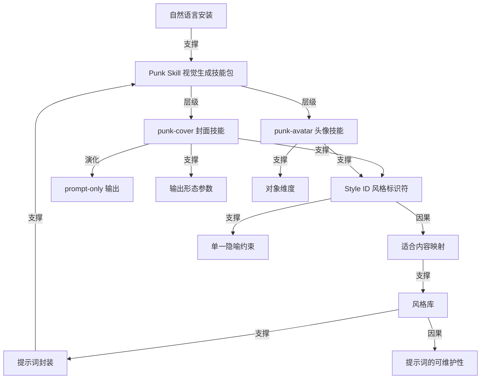

# 封面图和头像生成 skill

- 原文标题：Punk Skill
- 作者：https://github.com/adrianpunk/
- 内参日期：2026-09-07
- 来源类型：blog
- 原文：https://github.com/adrianpunk/Punk-Skill
- 标签：agent skills, 工具技巧

> 开源 skill 集合，装完直接 `Use $punk-cover` 就能把文章、笔记、推文转成小红书/公众号/X 的封面图，另一个 punk-avatar 管人物、宠物、物品头像。内置十几种风格 ID（黑白极简概念、复古手撕拼贴、咨询报告视觉等），支持只出提示词不出图。和内参的封面生产流程可以对照着看。

## 导读

github repo 欣赏。把画图 prompt 打包封装为skills。资源集合性质。

## 核心观点

- Punk Skill 是「一组给 AI Agent 使用的视觉生成 Skills」。它做的事情听起来很小——生成封面图和头像图——但它给出的形态值得单独看一眼：**把散落的画图提示词打包成可安装、可调用、可枚举的能力单元**。
- 提示词在这里不再是每次现写、写完即弃的一段文本，而是被固化成两个有名字的技能（`punk-cover` 和 `punk-avatar`），有安装动作、有调用语法、有参数、有一份可以逐条挑选的风格目录。
- 这份仓库真正的资产密度在**风格库**：`punk-cover` 三十个风格、`punk-avatar` 七个风格，每一个都配齐了「中文名 + Style ID + 适合内容」三列。中文名给人认，Style ID 给机器调，「适合内容」实际上是一个选择函数——它替你回答「我这篇东西该用哪种视觉」。
- 安装与调用都被压缩到自然语言层：安装是把一句话发给支持 Skills 的 Agent，调用是 `Use $punk-cover ...` 这样一行。整个交付物没有 SDK、没有配置文件、没有 API key。
- 一个容易被略过但很关键的能力：**只出提示词、不出图**（prompt-only）。它把「提示词」和「成图」解耦，让用户可以把提示词带去任何别的生成工具。

## 形态：提示词被封装成 Skill

- 定位一句话说清：安装后「可以用它把文章生成封面图，或把人物、宠物、物品照片生成头像图」。
- 安装动作被自然语言化——把一段固定说明连同仓库地址发给支持 Skills 的 AI Agent，由 Agent 自己完成安装。这里没有包管理器，Agent 本身就是运行时。
- 调用语法统一为两行形态：`Use $punk-cover ...` 与 `Use $punk-avatar ...`。风格名、平台、比例、内容都以自然语言跟在后面。
- 仓库只交付两个 skill，职责切得干净：`punk-cover` 管封面图，`punk-avatar` 管头像图。前者面向「内容 → 视觉」，后者面向「照片/描述 → 形象」。

## punk-cover：一个封面目录，而不是一个滤镜

- 输入端接受的东西很宽：「文章、笔记、推文、主题草稿」都可以直接粘进去，输出一张封面。目标平台明确点名了小红书、微信公众号、X / Twitter。
- 四种调用形态构成一个小而完整的参数接口：
- 只给文章内容，风格交给 skill 判断。
  - 指定平台 + 指定风格，例如「WeChat public account cover in 商业杂志头版 style」。
  - 指定自定义比例，例如 `aspect ratio 16:9` 配 `黑白极简概念`。
  - 只生成提示词不生成图片（prompt-only），例如出一条 X 封面的提示词，风格 `黑白灰先锋几何`。

- 风格表是这篇材料的主体。三十个风格覆盖的跨度很大，从极度克制到极度饱满都有：
- **抽象与观点类**：`black-white-minimal-concept`（抽象观点、战略、哲学、批判性主题）、`semantic-minimal-translation`（单词、短句、口号、概念转译）、`minimal-visual-metaphor`（系统变化的极简实体隐喻）。
  - **结构与方法论类**：`consulting-report-visual`（商业策略、方法论、产品分析）、`research-journal-concept`（科研、医学、材料、生物、机制）、`anthropic-research-style`（AI、研究、知识、系统的极简编辑封面）。
  - **教程与系统搭建类**：`block-world`、`brick-world`（教程、工具、系统搭建、升级、游戏化表达；搭建、团队、计划、教育、亲子）。
  - **强冲击与传播类**：`giant-perspective-chinese-title`、`retro-torn-collage`、`color-neo-constructivist-megastructure-poster`、`black-red-silhouette`。
  - **工艺质感类**：`paper-emboss-deboss-cover`（真实纸张击凸压凹）、`layered-paper-cut-concept-poster`（真实立体纸层）、`silver-foil-blue-minimal`（银色锡纸蓝字）、`osb-industrial-blue-line-metaphor`（满版真实木板 + 工业蓝线条）。

- 风格描述里反复出现的不是形容词，而是**可执行的约束**：「单一准确隐喻、极简留白、柔和光影」「左上工业蓝标识字、右下单线隐喻和严格留白控制」「单一中景主体、超大短标题、前后景图文穿插」。这些不是审美措辞，是提示词里真正起作用的规格。

- 最能说明「风格 = 一套转译规则」的是 `godot-2d-pixel-metaphor-poster`：它的定义是「把抽象主题转成单一游戏机制、角色动作、目标或阻碍与完整像素关卡世界」——先做隐喻转译，再落到画面。

- 风格与题材是绑定的，不是自由搭配：`midcentury-surreal-editorial-cover` 明确指向「AI、Coding、数字工作、未来工具」，`business-magazine-front-page` 指向「AI、创业、投资、趋势」，`avant-retro-architecture-poster` 指向「建筑地标、城市海报、旅行封面」。选风格这个动作，实际上是在给内容归类。

## punk-avatar：多了一个「对象」维度

- 用途比封面更杂：把「人物、宠物、物品照片或文字描述」生成头像图，另外还能生成宠物纪念卡，以及「让真实人物从扁平景色中跃出的超现实纸艺作品」。
- 七个风格各自标注了适用**对象**，这是封面表里没有的一列：
- `pixel-avatar`（人、宠物、物品）——标准头像、像素 IP、符号化头像。
  - `grotesque-soul-sketch`（人、宠物）——趣味头像、情绪化手绘肖像。
  - `messy-crayon-pet-portrait`、`polaroid-keepsake`（宠物）——宠物手绘肖像、宠物纪念卡。
  - `fashion-sketch-observation`（人）——街拍和旅行观察页感肖像。
  - `minimal-paper-acrylic-block-illustration`（人、宠物、物品、场景、主题）——小主体、粗糙白纸、鲜明丙烯色块、大面积留白。
  - `surreal-pop-up-paper-landscape`（人、场景）——真人保持立体，原照片环境向后翻倒并压扁为纸面景色。
- 调用形态比封面更细，出现了**输出形态参数**：同一个 `立体人物扁平景色纸艺` 可以要「前后对比图」，也可以要「单张效果图」。
- 也支持完全没有素材的情况：`text-only 像素头像`，直接用一句英文描述生成，例如一个戴蓝帽子、方框眼镜的冷静机器人咖啡师。
- 宠物场景做了具名支持——调用时可以直接写「宠物名：可乐」「宠物名：奶茶」，名字会进图。

## 这份仓库真正在示范什么

- **提示词的单位变了**。过去提示词的单位是一段话，现在是一个 skill：它有名字、有安装入口、有调用语法、有版本可维护的宿主仓库。
- **可枚举本身就是价值**。三十七个风格如果散落在收藏夹里，等于没有；被整理成「名字 + ID + 适合内容 + 样张」的表格之后，才第一次变得可挑选。资源集合类项目的门槛不在生成，在归类。
- **样张是这类仓库的必需品，不是点缀**。风格名只能提示方向，只有样张能让人在十秒内判断「这个是不是我要的」。仓库为每个风格都配了图。
- **提示词开始有分工**。致谢里写得很清楚：提示词设计与风格方向是一个人（@adrianpunk），仓库维护是另一个人（@jinchenma94）。设计和维护被拆成两个角色，这是提示词从个人手艺走向可维护资产的信号。
- **prompt-only 是一个态度**。允许用户只取提示词、不走它的生成通道，意味着作者认为价值在提示词本身，而不在锁住生成环节。

## 概念网络

### 关键概念

#### 视觉生成 Skill

**context**：文章开头就把 Punk Skill 定义为「一组给 AI Agent 使用的视觉生成 Skills」，具体交付物是 `punk-cover` 和 `punk-avatar` 两个 skill。它不是一个网站、不是一个应用，而是安装进 Agent 之后成为 Agent 一部分的能力。

**费曼一下**：以前你要画封面，得先打开一个画图工具，再想一段提示词。skill 的做法是反过来——把「怎么画」这件事提前写好，装进你的 AI 助手里。之后你只要说「给这篇文章做张封面」，助手自己知道该用哪套规矩。技能是装在助手身上的，不是装在你脑子里的。

#### 提示词封装

**context**：整个仓库的实质是把画图提示词打包成可安装单元——从安装说明、调用语法到风格清单，全套配齐，用户拿到的不是提示词文本本身。

**费曼一下**：好的提示词往往是反复调出来的，但它通常只存在于某个人的对话记录里，用完就散了。封装就是给它做一个壳：起个名字、写好用法、放进能被安装的地方。壳一旦有了，提示词就从「一次性的话」变成了「可以反复取用的东西」。

#### Style ID

**context**：风格表里每个风格都有中英双写——中文名如「黑白极简概念」，Style ID 如 `black-white-minimal-concept`。三十个封面风格、七个头像风格，全部按这个格式登记。

**费曼一下**：中文名是给你看的，方便你一眼认出感觉；ID 是给机器认的，保证你说的和它理解的是同一个东西。就像餐厅菜单上既有菜名也有编号——你点「宫保鸡丁」，后厨看的是那个号码，不会串。

#### 适合内容映射

**context**：风格表的第三列写的是「适合内容」，例如「抽象观点、战略、哲学、批判性主题」「AI、创业、投资、趋势、商业科技封面」「建筑地标、城市海报、旅行封面」。

**费曼一下**：这一列做的其实是替你做选择题。你手里有一篇文章，你不知道它该长什么样；表格反过来告诉你「这类内容用这个风格」。它把一个开放的审美问题，变成了一次查表。

#### 风格库

**context**：`punk-cover` 三十个风格加 `punk-avatar` 七个风格，构成这个仓库的主体篇幅，也构成了 Howie 所说的「资源集合性质」。

**费曼一下**：单独一个好提示词，是一次运气；三十七个被分类、命名、配了样张的提示词，是一个库。库的价值不在于每一条多强，而在于当你带着一个具体需求走进来时，你能找到最接近的那一条。

#### prompt-only 输出

**context**：`punk-cover` 支持一种调用形态——「只生成提示词，不生成图片」，例如为一条 X 封面出一份 `黑白灰先锋几何` 风格的提示词。

**费曼一下**：这相当于厨师把菜谱给你，而不是只给你一盘菜。你可以拿这份菜谱去任何一个厨房做。它承认了一件事：真正稀缺的是配方，不是这一次的出品。

#### 自然语言安装

**context**：安装方式是把一段固定文字连同仓库地址发给「支持 Skills 的 AI Agent」，由 Agent 完成安装；调用则是 `Use $punk-cover ...` 一行。

**费曼一下**：装软件通常要下载、解压、配置。这里的安装动作变成了一句话——因为执行安装的不是你，是那个 Agent。当运行环境本身能读懂人话，安装说明和安装脚本就合成一件东西了。

#### 输出形态参数

**context**：调用时可以指定平台（小红书、微信公众号、X）、比例（`aspect ratio 16:9`、`4:5`）、风格，以及输出形态——同一个纸艺风格可以要「前后对比图」或「单张效果图」。

**费曼一下**：这些参数把一个模糊请求收窄成一个确定订单。不指定，你得到的是它猜的；指定了，你得到的是你要的。参数越少越好用，但一个都没有就没法用。

#### 对象维度

**context**：`punk-avatar` 的风格表比封面表多一列「对象」，标明这个风格适用于人、宠物、物品、场景还是主题；`polaroid-keepsake` 只写宠物，`fashion-sketch-observation` 只写人。

**费曼一下**：头像和封面的差别在于头像有个「主角」，而主角是人还是猫，画法完全不同。多出的这一列，是在提前拦住那些注定画不好的组合。

#### 单一隐喻约束

**context**：多个风格的定义里都出现了同一类措辞——「单一准确隐喻、极简留白」「单一克制隐喻」「右下单线隐喻和严格留白控制」「把抽象主题转成单一游戏机制」。

**费曼一下**：让画面只表达一件事，是封面里最难也最有效的规矩。人一眼扫过一张图的时间不到一秒，你塞进去第二个意思，第一个就废了。所以这些风格与其说在规定长相，不如说在规定克制。

#### 提示词的可维护性

**context**：致谢部分把两个角色分开写——「提示词设计与风格方向」与「仓库维护」由不同的人承担。

**费曼一下**：一件东西开始有专门的维护者，说明它已经不是作品而是资产了。设计的人负责它好不好，维护的人负责它还在不在、能不能被别人装上。两个角色分开的那一刻，提示词就进入了工程的范畴。

### 概念网络

整张网络的枢纽是「提示词封装」。它既是 Punk Skill 存在的理由，也是全篇所有细节最终回指的地方：安装方式、调用语法、风格清单、参数设计，每一项都是封装这件事在某个侧面的具体做法。

**从封装出发的第一条链，是能力的层级展开。** 封装先立起 Punk Skill 这个整体，整体再分叉为 `punk-cover` 与 `punk-avatar` 两个技能。分叉的依据不是功能大小，而是输入形态——封面的输入是一段文字内容，头像的输入是一张照片或一个人物描述。输入形态不同，参数设计就必然分家，这也是为什么头像那边多出一个「对象」维度，而封面那边多出一个 prompt-only 的出口。

**第二条链是标识与选择，也是全篇最有工程味的部分。** 两个技能共同支撑起 Style ID 这个中间层：中文名对人，ID 对机器，二者是同一个风格的两副面孔。有了稳定标识，「适合内容」这一列才有落点——它把「什么内容配什么视觉」这个审美判断，写成了一张可查的映射表。映射表累积到一定数量，就成了风格库；而风格库反过来又是「提示词封装」这个主张的最强证据：单条提示词封装了也没多大意义，三十七条被分类命名之后，封装才产生复利。这条链有一个明显的回路——封装造出库，库证明封装值得。

**第三条链讲的是约束如何构成风格。** Style ID 支撑「单一隐喻约束」，看起来是标识支撑规格，实质是：一个风格之所以能被稳定复现，靠的不是形容词，而是那几条硬性限制——一个隐喻、大面积留白、一个中景主体、标识字放在左上。风格库里那些描述之所以读起来像规格书而不像审美文案，原因就在这里。约束是可复现的，感觉不是。

**最后一条是从库到人的延伸。** 风格库因果地推出「提示词的可维护性」：一个只有三条提示词的合集不需要维护者，一个三十七条并且要长期更新样张的库需要。致谢里设计与维护分属两人，正是这条因果链落到现实的证据。

几条链合起来看，这个仓库的真正主张并不是「我有好看的封面提示词」，而是：**提示词可以有形态、有接口、有目录、有维护者**。前者是内容，后者才是这篇材料值得被当作范式看待的原因。

## 费曼 x3

一个好提示词的生命周期通常很短。它诞生于某次反复调试的对话，用完之后留在聊天记录里，下一次你想再用，只记得大概意思，于是重新调一遍，结果和上次不太一样。绝大多数人所谓的「提示词积累」，其实只是一堆没人再打开的截图。

Punk Skill 有意思的地方，不在于它的封面画得多好，而在于它换了一种存放提示词的方式：不再存成文本，而是打包成「一组给 AI Agent 使用的视觉生成 Skills」。安装是把一句话发给你的 Agent，调用是敲一行 `Use $punk-cover`。中间没有网站、没有账号、没有配置文件。提示词第一次有了外壳——有名字、有入口、有用法。

外壳带来的第一个变化是可枚举。三十个封面风格、七个头像风格，每一条都写齐了中文名、Style ID 和「适合内容」。中文名给人认，ID 给机器认，第三列最关键：它把「我这篇东西该用哪种视觉」这个开放的审美问题，改写成一次查表。抽象观点、战略、哲学配黑白极简；AI、创业、投资、趋势配商业杂志头版；建筑地标、城市海报、旅行封面另有归属。选风格这个动作，本质上是在给内容归类——你先得知道自己写的是什么，才配得上一张对的封面。

第二个变化更容易被略过：这些风格描述里几乎没有形容词。它们写的是「单一准确隐喻、极简留白、柔和光影」，是「左上工业蓝标识字、右下单线隐喻和严格留白控制」，是「把抽象主题转成单一游戏机制、角色动作、目标或阻碍与完整像素关卡世界」。这些不是在形容长相，是在规定约束。风格之所以能被复现，靠的从来不是「高级感」这类词，而是几条硬性限制——只许一个隐喻，留白到某个程度，主体只许一个。约束是可传递的，感觉不是。这大概是这份清单对写字的人最有用的一条提醒：让画面只说一件事，比让画面好看更难，也更值钱。

还有一处小设计透着诚意：可以只要提示词，不要图。菜谱给你，你爱去哪个厨房做都行。这等于承认价值在配方而不在这一次的出品——愿意把配方交出去的人，通常配方确实好。

最后看致谢：提示词设计与风格方向一个人，仓库维护另一个人。一件东西开始有专门的维护者，它就不再是作品，而是资产了。这才是这个不大的仓库真正示范的东西——提示词可以有形态、有接口、有目录、有人负责它还在不在。至于你收藏夹里那三百条从没再打开过的提示词，缺的从来不是数量。
