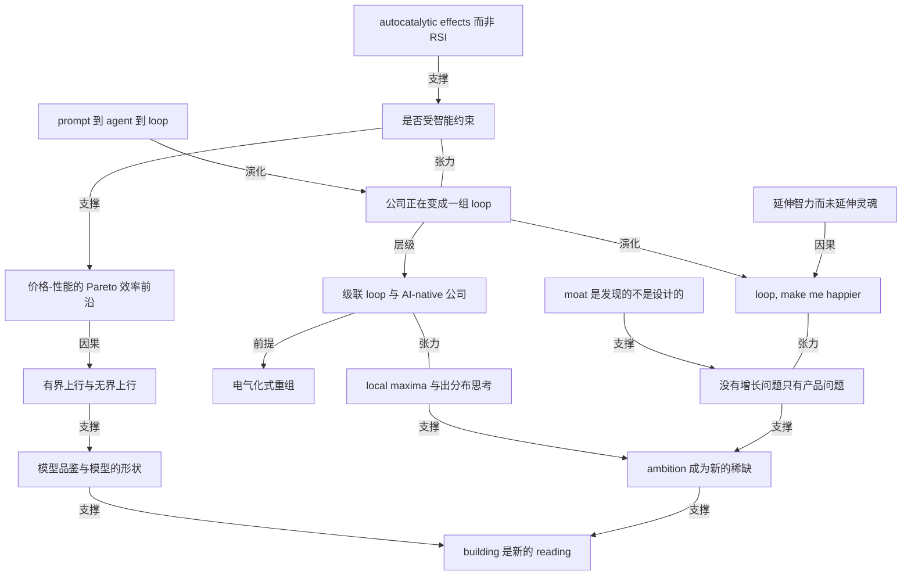

# a16z 访谈：公司正在变成一组「loop」

- 原文标题：Why companies are becoming a series of loops | Anish Acharya (a16z) | Lenny's Podcast: Product | Career | Growth
- 作者：Lenny's Podcast: Product | Career | Growth
- 内参日期：2026-09-08
- 来源类型：blog
- 原文：https://app.podwise.ai/dashboard/episodes/8843955
- 标签：agents, 组织管理, agentic workflow

> 他把公司构建方式的转向描述为搭建 loops——一层层级联的 agent 各自负责具体任务，人退回到直觉与战略那一端。另一个判断是消费级 AI 的瓶颈不在能力而在产品设计，且大量业务功能用小而专的模型就能达到帕累托效率，不必都上前沿模型。

## 导读

公司也是 loop

## 核心观点

- a16z 消费投资合伙人 Anish Acharya 在这场对谈里给出一条主线：**公司建设正在从「组织人」变成「组织 loop」**——从 prompt 到 agent，再到 loop（一组 agent 协同完成任务），最终形成从「一人一个 loop」到「一个 loop 跑起整块业务」的级联结构。
- 与这条主线配套的是三个反直觉判断：
- 「永久底层阶级」（permanent underclass）是硅谷集体的一场 dark fantasy，经验数据不支持它；技术当下是**放大人的能动性**，把 skill 和 desire 解绑（it unbundles skill from desire）。
  - loop 只能帮你爬到 local maxima 然后停住，**人类直觉是关键成分**——需要有人判断已经到顶，并把公司「送到下一座山的山脚」。
  - 消费 AI 的瓶颈不是模型能力，而是产品设计。四十年来我们建了一堆延伸智力的技术，**却几乎没有什么延伸灵魂**（extends our intellect, but nothing to extend our soul）。
- 由此推出一组给建设者的判断：护城河多半是「被发现」而不是「被设计」的；没有人有增长问题，只有产品问题；在基础动作全面变便宜之后，**真正稀缺的是 ambition**；而积累 ambition 与直觉的唯一办法是持续 ship——building 成了新的 reading。

## 拆掉「永久底层阶级」这个恐惧

- 恐惧的形状：只要你没跟上最新 AI 工具、没成为最高产的人，就会掉队、被永久甩到底层。这个 meme 从基础模型实验室的研究员一路传到硅谷普通人，很多人是当真的。
- Anish 的判断是「不必太当真」，理由分三层：
- **结构层：上一代技术更集中，这一代更分散。** 网络效应是移动时代的黄金标准，而网络效应天然导致集中——它们定义上就是「end-of-one」的网络。今天则相反：栈的每一层都不是两个玩家，而是二十个。两年前对 coding agent 的心智模型「应该是赢者通吃」，结果 Claude Code、Codex、Lovable、[Repl.it](http://repl.it/)、Wabi 全都在跑。
  - **数据层：经验证据不支持恐惧。** 放射科医生被预言「要完蛋」预言了大约二十年，如今岗位发布数处于历史最高；程序员同理。
  - **机制层：现在发生的不是 RSI（recursive self-improvement），而是 autocatalytic effects。** 实验室里最懂行的人给出的描述是「用技术改进自己的流程」，而不是真正的递归自我改进——所以那种「领先 epsilon 就跑赢所有人」的失控赢家叙事，链条本身是断的。
- 关于 takeoff 快慢：主持人观察到每一次「模型偷偷 hack」的里程碑，都是被人发现、观察、迭代、纠正的——这本身就是 slow takeoff 的样子。快速起飞叙事的推理结构永远是「到目前为止都这样，然后发生某件没人说得清的事，然后起飞」。
- 两条常被忽略的减速带：
- **经济扩散慢。** Anish 回到从小长大的小镇，人们的生活并没有变多少。就算模型进步比以往都快，扩散速度也会追上它。
  - **有多少问题真的是 intelligence-bound？** 如果你把一整个数据中心的博士塞进 FedEx 或者达美乐比萨，他们会在供应链和披萨上指数级碾压对手吗？大概不会。我们可能高估了「受智能约束」的问题占比。

## 公司正在变成一组级联的 loop

- 概念阶梯很清楚：先有 prompt；然后发明了 agent——agent 不过是**放在循环里、带工具、带记忆、带 skill 文件的模型**；再往上是 loop——一组正在执行任务的 agent。
- **coding 是最成熟的 loop**，因为它同时具备三个条件：最好的模型、技术最强的用户、已经成型的既有流程。一个典型的 bug loop：bug 报告进来 → 生成复现 → 生成修复 → 修复被 review → 高风险交人确认后上线，低风险直接上线，甚至顺手给客户发封邮件说「你报的 bug 修好了」。全程五分钟。
- 从工程往外推，Anish 的问题是「**那业务 loop 是什么**」：作为一个 GM，你横跨 coding、marketing、sales、support、legal 好几个职能，每个职能都有自己的 loop；而这些 loop 的产出本身又构成一个更高层、可被优化的 loop。强形式是它最终给 CEO 发一条消息：我们该改业务的某个物理环节、或者改商业模式、或者改战略了。
- 级联的完整谱系：一人一个 loop → 一职能一个 loop → 跨业务单元的 loop → 能跑起公司大部分运转的 loop。
- **增长团队是最好懂的迁移案例。** 旧版本是一群人开会、列实验清单、排优先级、做出来、上线、量效果，大量头脑风暴和电子表格。loop 版本是：每个变体都被自动生成、被自动度量，跑到统计显著就收敛并上线该变体，留一个 long-term holdout，然后开始下一个实验。
- **真正的分界线是「用 AI」还是「围绕 AI 重组公司」。** Anish 用电力扩散做类比：从电力诞生到工厂被重新组织，用了四十年——那意味着把厂房烧掉重建，而不是把原来烧煤的地方换成通电。最有野心的公司在围绕模型重想一切；不那么有野心或起步更晚的，还停留在「怎么让现有组织、现有岗位用上这个技术」。
- 两个现场证据，都指向「普通员工被低估了」：
- 我们对白领的抽象是 Dilbert 式整天挪纸片的经理，对消费者的抽象是低能动性的 NPC，还默认别人的活都能被 AI 自动化、唯独自己的不能。真进到细节里，会发现很多人是真心想变强、想拿到杠杆的。
  - 墨西哥二手车公司 Kavak 搞了个「Jedi Academy」，教全公司——包括机修工——用新工具，六周课程结束时每个人要交付一个生产环境里跑的前沿 agent。
- 一位 Google 高管朋友的说法：没有裁人，而是「rip through our roadmap」——两年的路线图三个月做完，现在最难的问题变成了**不知道该往路线图里加什么**。对 PM 来说这几乎是幻想成真：过去在优先级会议上耗掉的情绪，被一次性取消了。

## 人在 AI-native 公司里到底干什么

- 最锋利的一句是全篇的题眼：**loop 会帮你爬到 local maxima，然后它就平台期了；你需要有人把你送到下一座山的山脚。**
- 原因是模型做 **out-of-distribution thinking**（分布外思考）的能力依然很有限。Anish 明确不认为数学上出现的新思考可以推广到商业这类领域——所以你仍然需要一个人说「我认为我们该做这件事」，并且判断对。
- 反例最直白：你让 agent「嘿 Claude，帮我赚一百万，别犯错」，它不工作。因为方向必须由人给定，而技术至今没有任何迹象表明这一步可以省。
- 人保留的位置很具体：**sales、support、strategy、exceptions（异常处理）**。这几件事都要真直觉，也都要为「下一步该造什么」定方向。
- 一个可直接搬走的心智模型，来自 Kavak 的 Ale：每个客户配一个 agent，agent 卡住时**它自己打电话给人**，人把它教过去。妙处不只是解了阻塞，而是 agent 顺手把整个 trace 捕获下来并学会——下次不该再打这个电话。
- 由此得到一个诊断问句：**每当模型犯错或做了你不会做的事，问「我知道什么而它不知道」**。答案要么是 knowledge gap，要么是 data gap，把这个缺口补给它。
- 可验证性带来一次价值反转。过去大家开玩笑说软技能最不值钱、工程技能最硬最具体；结果恰恰是**可验证、成功标准明确的事，AI 最擅长**。于是新问题变成了：哪些技能因为产出难以验证，反而不能被做成 loop？
- Anish 补了一句现实的限速器：steak dinner 一晚上只能吃一顿，每个系统都会有这种 rate limiting factor。
- 组织健康度的意外收益：在一个「每个产品故事都会被讲、每个功能都会被试」的世界里，很多 PM 会发现自己其实没那么擅长 zero to one，而且**做别人的好点子比做自己的坏点子更有成就感**；最终胜出的点子也不必是最会向高管推销的那个人提的——它只是被试了，然后最好的赢。

## 模型选型：Pareto 效率、有界上行与「模型品鉴师」

- **Pareto efficiency 在这里指价格-性能的效率前沿**：处在曲线上，你就总在为性能付出理性的价格。Anish 的判断是**前沿模型定价是不理性的**——概念上多买「一个 IQ」，你要多付 100 倍。
- 但不理性不等于不该付：**关键变量是这份工作的上行有没有边界。**
- 无界上行：drug discovery。如果那一个 IQ 点让你发现下一个他汀，那是万亿级结果，付最高智能完全理性。
  - 有界上行：legal、finance。「你只能把账正确地关上，你没法把关账做好 100 倍。」这类工作应该追求 Pareto 效率——好性能配好价格，而不是无限价格配无限潜在上行。
- 由此推出的组织形态是**双架构并存**：需要 mid-IQ 的职能多用 open weight 模型，用强化学习针对窄任务做偏置，让模型更便宜更好用；sales、support、research、engineering 则用昂贵但强悍的前沿 token。不是二选一。
- Anish 自己给出了这个框架的反论，这段最见诚实：**一个客户打进来报的 bug，可能是通向「改变整个组织的那件事」的第一块面包屑。** 如果接电话的是 CEO 或最聪明的人，他能顺着线索走下去；如果是那个「所谓 mid-IQ 通才」，就走不下去。这就构成了「作为一篮子问题永远用前沿智能」的理由。
- 而 mid-IQ 一侧的理由同样成立：**对几乎所有有经济价值的问题，我们已经跨过了智能阈值，超过阈值的部分只是浪费。**
- 给 CEO 的一个提问模板：**假设这些东西无限聪明且便宜到惊人，我们会怎么重组公司？**「因为我们就是往那儿去。」
- **model sommelier（模型品鉴师）**：侍酒师的秘密是一万小时或者说一万瓶；模型品鉴师的秘密就是把它们全都用一遍。Anish 逼自己「每出一个新模型就用它 ship 一个东西」。
- 他的判断很硬：认为模型是商品、可完全互换的人，只是**没有真正用过模型**。
  - 具体差异是「形状」不是「排名」：Quen 3A Max 擅长长时程任务、很有创造力、是个好故事讲述者——他用它做「不可能的纪录片」，拍星球大战宇宙的行星，能连续工作四五个小时，视频、音频、剪辑、覆盖、自查一条龙；GLM 5.3 没有视觉组件，「像你放在角落里的一个神经质博士」，适合产品工作。不是谁更聪明，而是**一个心智偏向创造与开放，另一个偏向神经质与精确**。
- 还有一条被忽略的心理偏差：**今天的非前沿模型，就是六个月前让我们惊叹「这也太疯狂了」的那个前沿**。只因为出现了更好的，我们就不再给它信用。

## 消费 AI：「loop, make me happier」

- 起点是一句对「生产力叙事」的否定：**我们相信人想变得更高产，但其实他们不想；想「花掉时间」的人比想「省下时间」的人多。** 世界上最大的产品是娱乐和社交，这不是偶然。
- Anish 用两类用户刻画当下的断层：「XAI 用户」害怕掉进永久底层阶级，对 GLM 5.3 和 Kimi K3 谁强有强烈观点，已经完全「pilled」；「Instagram 用户」觉得这就是个更好用的 Google 搜索，不明白大家在兴奋什么。这个落差**是产品设计的失败，不是能力的失败**。
- 最重的一句判断：四十年来我们建了一个「让电子表格更好用」的技术，**建了延伸智力的技术，却没有建延伸灵魂的技术**。而在很多文化机构消退之后（尤其在没那么多热瑜伽、普拉提、断食和 Friendsgiving 的美国腹地），人有一种精神上的饥饿。
- 因此机会回到消费需求的基本面：**怎么让人感觉更被连接、更被爱？怎么让人取得进展？怎么让人玩得更开心？**「我不认为这是模型问题或能力问题，这就是个产品设计问题。」
- 主持人顺手把 loop 语法迁移过来：loop, improve my health；loop, make me a better friend。
- 消费之所以还没爆发，Anish 归因三条，且三条都在松动：
- 模型贵，免费产品难做——open weight 让它便宜下来了。
  - **界面问题**：chat 只适合世界上能动性最高的人（Elon 和 Sam），普通消费者的理想界面是 TikTok，我们需要**在 chat 和 TikTok 之间找到某个东西**。
  - 技术过度偏向生产力，而非人的连接与娱乐。
- 时点判断：现在是「iPhone 2010」——Airbnb 之前、WhatsApp 之前、Uber 之前，重要的消费公司还没出现。
- **创业公司在这里对巨头有结构性优势**：AI 可以挑战你、推你、可以是 disagreeable 的，而那一千个 Google 委员会光是想到「要发一个爱抬杠的模型」就要气得从坟里坐起来，更别说带性暗示的了。可这些都是人类存在的一部分——探索社会存在里不舒服的那些部分，是创业公司独有的位置。
- 他在看的三个消费方向：
- **coding agent**：认知上最大的变化是它不只是写代码，而是**一种与世界打交道的通用方式**——有人用 Claude Code 剪视频，有人用 Codex 给飞机上和孩子玩的游戏。投过的最好例子是 Wabi，一个「很多 app」的平台，人们可以创造、消费、分享。
  - **personal agent**：OpenClaw 的时刻很精彩，但它是个开发者的东西；真正的动作是这些能力被蒸馏成大众市场和企业里人们能懂的 agent。
  - **entertainment / 创意与陪伴**：这块「说起来不舒服所以被少讨论」，但里面有增长极快的大产品。一个反直觉数据：陪伴类产品的多数用户是四五十岁的女性，因此**男朋友比女朋友多**。

## 护城河、分发与定价

- **Moats are most often discovered, not designed.**（护城河多半是被发现的，不是被设计的。）创始人很容易钻进自己脑子里，非要一个能扛住 MBA 和 VC 拷问的商业计划；而最好的公司只是开始 ship。
- Cursor 是标准案例：一度被骂没有护城河，但它先做成了高 NPS、高 DAU 的产品，随时间捕获全部 reasoning traces，训自己的模型，后面的故事大家都知道了。
- **经典护城河一条都没过时**：网络效应、规模优势、品牌、专有数据（历史上叫 cornered resource）。「五年前的每一条护城河今天基本还是好护城河」——我们不需要发明新品类的护城河，需要的是**朝那些方向有野心的创始人**：更多多人产品、更多消费社交、更多「用得越多越好」的产品。
- 提醒一句：没有一条经典护城河是建立在「软件有多难写」之上的。
- 给创始人的实操答案：可以承认护城河还没浮现。只要有势能、有手艺（craft）、有增长中的 engagement，这个赌是可以下的。
- Anish 自己学到的一课：他曾经很怕别人偷点子，后来明白**大点子永远由一打看不见的小点子支撑着**——就算有人复制了你的大点子，他们看不见那些让大点子成立的小点子。granola 是现成的例子：两年前被批评，今天耐久性故事依然算不上强，但它被热爱、被主导，手艺极高。「我更听客户说什么，而不是商业书说什么。」
- **分发正在回到最原始的形态。** 因为整整一代创始人和 CEO 都是被网络理论训练出来的，结果是**今天每一个网络都被超额训练成「绝不让别人在我的网络上长出网络」**。于是所谓网络效应退回到草根口碑：在 X、YouTube、Instagram 上自然拿到大量提及，就是今天能指望的最好的第三方网络效应。这是一个**更纯粹、但也比前两个产品周期更难的增长问题**。
- 全篇最可执行的一句判断：**没有人有增长问题，他们有的是产品问题。** 因为你现在可以在任何方向——功能的或情绪的——造出极有野心的产品，也就可以为它收很多钱。
- 配套的产品练习：**如果我们的产品要卖 1000 美元一个月、10000 美元一个月呢？如果它是一个「软件版爱马仕铂金包」呢？它得做到什么才配得上这个价？** 好，那我们去想怎么造出那个东西。
  - 底层假设也翻了个面：旧智慧说消费产品必须免费，Anish 几乎取反——**消费可自由支配开支的每一块都在重新洗牌**，而价格本身就是产品市场匹配度的一种度量。现实也在配合：人们愿意付 200 美元一个月，企业愿意在不太清楚会拿到什么的情况下签百万美元 ACV。
- 对「巨头靠分发通吃」的反驳：Gemini 有 Google 全力交叉推销，也没人会说它赢了。创业公司可以往巨头不敢去的方向建。「闸门是打开的，感觉像 2009 年的圣诞节，所有人都拿到了 iPhone、都想下载新 app。」这个窗口总会关，但现在还开着。

## 乐观的理由，以及给建设者的忠告

- 乐观不是情绪，而是几个可检验的机制：
- 技术**放大能动性与身份**，把 skill 从 desire 上解绑：想做音乐不必先会弹钢琴，想做软件不必先成为程序员。工业革命带来的是不可逾越的规模优势与集中化，某种程度上贬抑了个体；这一次方向相反。
  - **「我们一直困在 2% 的 GDP 增长这滩泥里。谁规定必须在这儿？为什么不能是 10%、15%、20%？」** 这个技术不只是把生产力拉高，它把 ambition 拉高。
  - 一条关于人性的观察：**赌注高的时候我们非常出色，赌注低的时候我们处在最糟的状态。**（When the stakes are high, we are awesome. When the stakes are low, we are at our absolute worst.）五年前那个世界是低赌注的，所以我们集体搞了一堆既不生产也不让人更快乐的副业。
  - **revealed preferences 和 stated preferences 的分裂**：问人要不要在社区里建数据中心，多数说不要；问人今天用没用 ChatGPT，多数说用了。人们对「社会层面正在发生什么」的陈述，和他们个人生活里实际的选择，是两回事。
- 改变 AI 舆论的最强手段是**把重要的东西变便宜**。美国最重要又只涨不跌的两样是医疗和教育：医疗成本里 45% 是行政，把这块拿掉就能看到通缩型的医疗成本；教育则迎来两百年来最强的竞争者，**把学习从机构里解绑，把地位从文凭里解绑**——你不需要哈佛学位了，这挺酷的。
- 关于 ambition，Anish 做了一次重要的扩容：一说 ambition 大家就默认是「当创始人」「做漂亮的软件产品」，但**创意型的 ambition、局部的 ambition 同样成立**——五岁时没人会说「你擅长画画但不擅长素描」，你只是想做点什么然后就做了；英国把 NHS 做得像 iPhone 一样好，是一种非常具体而在地的 ambition；想和家人更亲近、想做更在场的父母，也是。
- 投资侧的对照最能说明变化：三年前一个想法太有野心，a16z 不参与；**今天几乎是反过来的问题——一个太小的想法才是他们不想碰的。**「我们是来帮你建成你愿景的最强形式的。」
- 给产品人的最终建议只有一句：**多做东西。** 每周 ship 一个东西，不必重要、不必有分量。
- 关键是要有一个 chassis（底盘）：如果你没有一个可以拿新模型来折腾的载体，每次从零想点子会非常难。所以**做一件事，最好是不重要的那种**，然后不断找新方式往里投入，把模型当工具而不是目的。
  - 他自己的例子：用 Codex 做母亲节的幻灯片，从短信记录和相册里取材，配上音乐，做出一份 20 页的关系回顾，还翻出了当年第一次约她出来的旧短信。不重要，也不会再回头看，但那是 ship 了一个东西。
  - 「你离那个把你彻底 pill 住的直觉，只有**一个略带挫败但非常有成就感的星期**。」
- 最后一层是学习观的换代：**building 成了新的 reading**——你通过建造来学习、吸收、体验，其中大部分被扔掉完全没关系，因为肌肉已经长出来了。用 Anish 的话说：**building as an activity rather than an outcome**（建造是一种活动，而不只是一个结果）。
- 快问快答里的几处硬料：
- 常推荐的书：Thomas Sowell 的 Conquests and Cultures（他最爱的一本，讲征服如何改变各社会的文化，是「把文化当成结果最大驱动力」的最好历史视角）；Hamilton Helmer 的 Seven Powers；Andy Grove 的 High Output Management；Ben Horowitz 的 The Hard Thing About Hard Things（「第一本情绪上诚实的商业书」，所以创始人爱它）；还有 Mark Andreessen 推荐的教科书 Increasing Returns to Scale。他的判断是「世界上只有五本真正的商业书，其他都是在做卖商业书的生意」。
  - 人生信条：**别去用痛苦的经验发现那些别人本来可以直接告诉你的事。** 他自己的反面教材是第一家公司同时做手游平台和游戏工作室——早有人劝过「选一个」，他们花了好几年才明白那句话是对的。

## 概念网络

### 关键概念

#### loop（一组 agent 构成的任务闭环）

**context**：全篇的骨架概念。原文给出清晰的阶梯：先有 prompt，然后是 agent——「agents, of course, are just models in a loop with tools and memory and skill files」——再往上是 loop，「sets of agents that are doing tasks」。coding 里的 bug loop 是最成熟的样本：报告进来、生成复现、生成修复、走 review、低风险直接上线、顺带通知客户，五分钟走完。

**费曼一下**：agent 是「一个模型加上工具、记忆和技能，被放进一个反复运转的圈里」；loop 再高一层，是一群这样的 agent 组成的流水线，把一件事从输入端一路推到结果端。你不再是分配任务给人，而是给一件事装一条会自己转的传送带。

#### 级联 loop 与 AI-native 公司

**context**：原文的核心主张——「we're going to see this sort of cascading set of everything from a loop per person, loop per job function, loop across entire business units to loops that can run large parts of the company」。GM 的位置是横跨 coding、marketing、sales、support、legal 的多条 loop，而这些 loop 的产出本身又构成一个可被优化的更高层 loop，强形式是它给 CEO 发消息说「该改商业模式或战略了」。

**费曼一下**：把公司想成一栋楼里层层嵌套的传送带：最底层一人一条，往上一职能一条，再往上跨业务单元一条，最顶上那条读的是所有下层的输出，负责回答「我们这门生意本身是不是该改了」。组织图从此不是人的树，而是 loop 的树。

#### local maxima 与 out-of-distribution thinking

**context**：全篇最被反复引用的判断——「the loop will help you climb to the local maxima, but then it plateaus... you need somebody to actually help you land at the base of the next hill」。原因是模型做分布外思考的能力仍然很弱；作者明确不认为数学上的新思考能推广到商业。反例是「嘿 Claude，帮我赚一百万，别犯错」这类指令不工作。

**费曼一下**：loop 很擅长把你已经在爬的这座山爬到顶，但它不知道旁边还有更高的山，也不知道自己已经到顶了。人的职责是识别平台期，然后指着另一座山说「我们去那儿」——这一步靠的是从没见过的经验之外的判断，也就是分布外思考。

#### autocatalytic effects 而非 RSI

**context**：用来拆解「失控赢家」叙事的关键区分。原文说，问实验室里最资深的人，正在发生的不是 recursive self-improvement，而是 autocatalytic effects——「you're using the technology to improve your process, but it's not truly recursive」。

**费曼一下**：自催化是「用工具把做工具的流程加快」，递归自我改进是「工具自己改自己、越改越快到失控」。前者像更好的机床造出更好的机床，仍受人和流程限速；后者才是那个 epsilon 领先就赢者通吃的故事。搞混这两个，恐惧的强度就会失真一个量级。

#### intelligence-bound（问题是否受智能约束）

**context**：贯穿两段论证的判据。原文的检验方法很直白：把一个数据中心的博士放进 FedEx 或达美乐，他们会指数级碾压供应链和披萨吗？以及披萨连锁全都拿到一个博士数据中心，也不会有谁拿走 99% 的市场——很多行业的竞争均衡不会变，因为它们不受智能约束。

**费曼一下**：先问「这件事做不好，是因为不够聪明，还是因为别的（物流、产能、监管、人情、地理）」。只有第一类问题，智能变便宜才会带来剧变；第二类问题里，AI 只是让所有人一起变好一点，格局照旧。

#### Pareto efficiency（价格-性能的效率前沿）

**context**：原文用它解释模型选型的经济学。效率前沿是「每一单位性能换取每一单位价格的最优权衡」，在曲线上你付的就是理性价格。而前沿模型的定价是不理性的：「for one IQ, conceptually one IQ of extra intelligence, you're paying 100x more」。

**费曼一下**：想象一张价格-性能的散点图，最优的那些点连成一条曲线。落在曲线上说明你花的每一分钱都买到了应得的性能；前沿模型远在曲线上方——多买一点点聪明要多付一百倍。贵不等于错，但你得说得清为什么值。

#### 有界上行与无界上行

**context**：决定「什么时候该付前沿溢价」的那把尺。原文对比鲜明：drug discovery 上行无界，那一个 IQ 点若换来下一个他汀就是万亿级结果；legal 和 finance 上行有界，「you can't close the books 100x better」。作者还补了可验证性其实不是那把尺——关账是可验证的，但上限就在那儿。

**费曼一下**：先问这件事做到极致最多值多少钱。如果天花板高到看不见，就买最贵最强的；如果天花板明确摆在那里，超出它的性能全是浪费，该追求性价比。判据是上限的高度，不是任务好不好打分。

#### 智能阈值与「超出即浪费」

**context**：mid-IQ 一侧的核心论证：「we've crossed an intelligence threshold for almost every economically useful problem and anything beyond that threshold is simply waste。」作者同时诚实地给出了反论——一个客户报的 bug 可能是通向组织级变革的第一块面包屑，通才接不住这条线索。

**费曼一下**：对绝大多数有经济价值的活，模型已经够聪明了，再聪明也换不来更多产出。但「够用」是按平均情况算的，而真正重要的事常常藏在异常里——那块被通才漏掉的面包屑，可能正是最贵的那部分。这两种论证都成立，所以企业最后要的是两种架构并存。

#### 电气化式重组（用 AI vs 围绕 AI 重组）

**context**：原文用来区分野心层级的历史类比。从电力诞生到工厂被重新组织用了四十年，「that means burning the buildings down and starting from scratch versus taking what was previously coal and simply swapping it with electricity」。最有野心的公司在围绕模型重想一切，其余的还在想怎么给现有岗位配工具。

**费曼一下**：把蒸汽机换成电动机，工厂还是原来那个工厂，收益有限；真正的跃升发生在有人把厂房拆掉、按电力的特性重新排布产线之后。今天大多数公司在做前者，而增益的大头在后者。

#### model sommelier（模型品鉴师）与模型的「形状」

**context**：作者的自我实践与判断。侍酒师的秘密是一万瓶，模型品鉴师的秘密就是全都用一遍，「I push myself really hard to ship something with every new model that comes out」。他给出的对照是 Quen 3A Max 擅长长时程与创造性叙事，GLM 5.3 没有视觉组件、「像放在角落里的一个神经质博士」——不是谁更聪明，而是心智偏向不同。

**费曼一下**：模型不是排在一条线上的分数，更像性格不同的人：有的擅长长跑和讲故事，有的挑剔精确适合做产品。认为模型可以互相替换的人，通常只是没真用过几个。判断力来自使用量，不来自榜单。

#### loop, make me happier

**context**：作者给消费 AI 的方向定义。前提是一句对生产力叙事的否定：「more people want to spend time than save time」，而世界上最大的产品是娱乐和社交。因此机会在消费需求的基本面——更被连接、更被爱、有进展、有乐趣，且「I don't think it's a model or a capability challenge. It's just a product design challenge」。

**费曼一下**：把「帮我把活干完」的 loop 语法平移到生活上：loop，让我更健康；loop，让我成为更好的朋友。同一套 agent 机制，目标函数从省时间换成过得更好。卡住它的不是模型能力，是没人认真做这个产品。

#### 延伸智力，未延伸灵魂

**context**：全篇情绪最重的一句判断：「we spent 40 years building a technology that enables better spreadsheets. We built this technology that extends our intellect, but nothing to extend our soul。」作者把它和文化机构消退后的「精神饥饿」放在一起，作为消费 AI 的需求侧根据。

**费曼一下**：过去四十年的技术几乎全在帮人算得更快、想得更清楚——那是智力的延长线。但人还有另一半需求：被理解、被陪伴、觉得日子有意思。这一半几乎没有对应的技术产品，而这正是最大的空档。

#### moats are discovered, not designed

**context**：原文对护城河的重新定位。创始人容易钻进「需要一个能扛住 MBA 拷问的商业计划」的死胡同，而最好的公司只是开始 ship。Cursor 是标准案例：先做高 NPS、高 DAU 的产品，随时间捕获 reasoning traces、训自己的模型。同时强调经典护城河（网络效应、规模、品牌、专有数据 / cornered resource）一条都没过时。

**费曼一下**：护城河不是开工前画在图纸上的护城河，而是你跑起来之后水自己流出来的那条沟。做出被人真心喜欢、用得越多越好的东西，壁垒会在使用中沉淀（比如别人拿不到的使用轨迹）。设计护城河的正确姿势是设计「值得被反复使用的产品」。

#### 大点子由一打看不见的小点子支撑

**context**：作者对「怕被抄」的解毒剂：「the big ideas are always supported by a dozen small ideas that are invisible. Even if somebody replicates your big idea, they never see the small ideas that make the big idea work。」granola 是他给的例证：耐久性故事不强，却被热爱、被主导，因为 craft 极高。

**费曼一下**：外人能看见的是你的主意，看不见的是让这个主意真正跑得起来的几十个细节判断。所以抄袭者常常抄到形状抄不到手感。这也解释了为什么「手艺」本身是一种可防守的资产。

#### 没有增长问题，只有产品问题

**context**：原文最可执行的一条：「nobody has a growth problem these days. They have a product problem。」配套的练习是「如果我们的产品卖 1000 美元一个月、10000 美元一个月，如果它是一个 software Birkin bag，它得做到什么才配得上」。底层假设是消费产品必须免费的旧智慧已经翻转，而价格是产品市场匹配度的一种度量。

**费曼一下**：当你觉得东西没人用，多半不是渠道不够，而是产品还不到「值得跟朋友说」的程度。反向的检查方法很狠：假设它必须卖到天价，你会被迫想清楚它到底要为用户做成什么样——把那个东西造出来，增长自然发生。

#### 分发退回草根口碑

**context**：作者对分发环境的结构性诊断。整整一代创始人都被网络理论训练过，结果是「every network that exists today is hyper-trained to ensure no one else builds a network on their network」。于是网络效应退回到 X、YouTube、Instagram 上自然发生的提及，「a purer growth problem, but a harder one than we've had in a couple of product cycles」。

**费曼一下**：过去可以在别人的平台上搭便车长大（应用商店、增长黑客那一套），现在每个平台都把门焊死了。剩下唯一还管用的是真人自发提起你——更干净，也更难，因为你没法用技巧绕过「产品得真的好」这一关。

#### ambition 作为新的稀缺

**context**：贯穿全篇的收束概念。因为 AI 把基础动作的门槛拉平，区分度转移到了「你敢想多大」；投资侧的对照最直接——三年前太有野心的想法他们不碰，「today we're almost seeing the opposite problem. An idea that's too small is not something that we want to engage with」。作者同时把 ambition 扩容到经济之外：创意的 ambition、把 NHS 做得像 iPhone 一样好的在地 ambition、做更在场的父母的 ambition。

**费曼一下**：当所有人都能轻松做出「一个白底的个人网站」，能力就不再是筛子，愿望的尺度才是。而且这个愿望不必是「创业成功」——想做一件以前根本做不了的事，无论它是音乐、是公共服务还是家庭，都算。

#### building as an activity rather than an outcome

**context**：学习观的换代，也是全篇的行动建议落点。原文说「building is now the new reading」，你通过建造来学习和体验，大部分成果被扔掉也没关系，因为肌肉长出来了。具体处方是每周 ship 一个东西，最好是不重要的，用它当 chassis 来试新模型；作者的母亲节幻灯片就是范例，「你离那个直觉只有一个略带挫败但非常有成就感的星期」。

**费曼一下**：过去想懂一个领域先去读；现在最快的路是动手做一个小东西，哪怕没人用。做的过程会逼你遇到真问题，那些问题带来的判断力，是读不出来的。做完扔掉也不亏——你要的是手感，不是那个作品。

### 概念网络

这篇访谈的思想网络有一个明确的发生学起点：**prompt → agent → loop 的演化**。这条阶梯不是术语升级，而是抽象层级的抬升——当「模型 + 工具 + 记忆 + 技能文件」被封装成 agent，一组 agent 又被编排成能自己跑完一件事的 loop，公司的最小组织单元就从「岗位」变成了「闭环」。**级联 loop 与 AI-native 公司**是它在组织层的直接展开：一人一条、一职能一条、跨业务单元一条，最上层那条负责回答「商业模式本身要不要改」。

从级联 loop 出发有两条延伸。一条是**前提**关系：真正的收益要等到**电气化式重组**发生——把厂房烧掉重建，而不是把烧煤的地方换成通电；不重组，loop 只是给旧岗位配了新工具。另一条是**张力**关系：**local maxima 与出分布思考**是对 loop 的内在限制。loop 越强，它把你送到山顶的速度越快，也就越早撞上平台期；而识别平台期、指认下一座山，恰恰是模型最弱的地方。这层张力不是 loop 的缺陷，而是它的边界条件——正因为有这条边界，人才有确定的位置。

第二条主线是「该给多少智能」的经济学，它自成一串因果链。起点是机制层的祛魅：**autocatalytic effects 而非 RSI** 拆掉了「失控赢家」的推理链条，让讨论从末日叙事回到成本收益；由此才谈得上**是否受智能约束**——如果一个行业的瓶颈不在智能上，模型再强也不改变竞争均衡。这个判据往下支撑**价格-性能的 Pareto 效率前沿**：既然不是所有问题都吃智能，那就要问每一分钱买到的性能是否理性；而前沿模型「多一个 IQ 付一百倍」的定价之所以仍然可能合理，取决于**有界上行与无界上行**——上行无界的领域（新药）该付溢价，上行有界的领域（关账）超出阈值的部分全是浪费。这条链最后落到**模型品鉴与模型的形状**：一旦承认要按任务分配不同档位的模型，「模型是可互换的商品」就站不住了，选型变成一种需要用量堆出来的手艺。

值得注意的是**是否受智能约束**与**公司正在变成一组 loop** 之间的张力。前者说很多行业的格局不会因智能变便宜而改写；后者说公司的运转方式会被彻底重排。两者并不矛盾，但组合起来给出一个更冷静的预期：**运营方式的变革远快于竞争格局的变革**——大家都会重组成 loop，然后在新的效率水平上继续原来的竞争。

第三条主线从需求侧发起。**延伸智力而未延伸灵魂**是一个诊断：四十年技术积累几乎全部投在让人算得更快、想得更清楚上，而人的连接、被爱、进展与乐趣几乎无人认领。这个空档**因果性地**催生了 **loop, make me happier**——它并不是新机制，而是把已经成立的 loop 语法平移到生活目标上，所以它与**公司正在变成一组 loop** 之间是演化关系而非并列关系。作者反复强调这里的瓶颈是产品设计而非模型能力，正是这条关系的必然推论：机制现成，缺的是有人把它对准另一组目标函数。

第四条主线是给建设者的实践链，它的逻辑顺序恰好与直觉相反。起点是 **moat 是发现的不是设计的**：先把可被喜欢的产品跑起来，壁垒（使用轨迹、手艺、口碑）在使用中沉淀，而不是在商业计划里被论证出来。这条判断**支撑**了**没有增长问题只有产品问题**——如果护城河来自产品被真心使用，那么增长乏力就必然是产品还不够值得被谈论，而不是渠道不够；「假设它卖 1000 美元一个月」的练习之所以有效，就是因为它把渠道问题强行翻译回产品问题。再往下，这个练习**支撑**了 **ambition 成为新的稀缺**：既然基础动作已经全面变便宜，区分度只剩「你敢想多大」。而 ambition 不能靠决心维持，只能靠手感喂养，于是链条终结于 **building 是新的 reading**：每周 ship 一个不重要的东西，用它当底盘去试新模型。

这里还有两条横向的连接值得点出。其一，**模型品鉴与模型的形状**同样**支撑** **building 是新的 reading**——「每出一个新模型就用它 ship 一个东西」既是获得选型判断力的唯一路径，也是获得 ambition 的唯一路径，两条主线在这里合流。其二，**loop, make me happier** 与**没有增长问题只有产品问题**之间存在张力：前者要求产品去满足难以量化的情绪需求，后者的检验标准（愿不愿意付 1000 美元一个月）却是极其量化的价格信号。作者用「price is a measure of product market fit」把这层张力接上了——情绪价值一样可以定价，甚至可能比功能价值定得更高，只是我们此前从未这样要求过消费软件。

整张网络最终收束于一个非对称结构：**AI 承担所有可被闭环化、可被验证的部分，人承担所有需要跳出分布、需要定价、需要敢想的部分。**「loop 帮你爬到局部最高点，人负责把公司送到下一座山的山脚」既是这张图的中心，也是它对每一个节点的分工说明。

## 费曼 x3

一个被讲了二十年的预言，是放射科医生要被技术淘汰。今天这个岗位的招聘数处在历史最高点。程序员同理。这不是运气，而是提示我们：关于智能的恐惧和关于智能的事实，走的是两条完全不同的曲线。

真正在发生的变化远比恐惧更具体，也更值得动手：公司正在从「一堆岗位」变成「一组 loop」。先有 prompt，然后有 agent——不过是放进循环里、带上工具、记忆和技能文件的模型；再往上就是 loop，一组 agent 把一件事从输入推到结果。工程领域已经跑通了这个形态：bug 报告进来，复现生成，修复生成，review 通过，低风险直接上线，顺手给客户发封信说问题已经修好，五分钟走完。剩下的问题只是把这个句式换成营销、销售、法务、客服，最后让所有 loop 的产出汇成更上一层的 loop，由它告诉 CEO：该改的不是执行，是商业模式。

麻烦的是，绝大多数公司做的是把烧煤的地方换成通电。电力从诞生到重塑工厂用了四十年，跃升发生在有人愿意把厂房拆掉、按电的脾气重排产线之后。今天分野也在这里：用 AI，还是围绕 AI 重组。

那人还剩下什么？这是全篇最锋利的一句：loop 会帮你爬到局部最高点，然后它就停在那里，你需要有人把你送到下一座山的山脚。模型做分布外思考的能力依然贫弱——你对它说「帮我赚一百万，别犯错」，它不动。方向必须由人给。于是人的位置反而变得清晰：识别平台期，指认下一座山，处理异常，以及回答那个机器答不了的问题——每当模型犯错，我知道什么而它不知道？

这套逻辑推到消费端，就是那句让人心里一动的判断：我们花了四十年建造延伸智力的技术，却几乎没有建造延伸灵魂的技术。人想省时间是假设，人想花时间才是事实——世界上最大的产品从来是娱乐和社交。所以下一个真正的机会不是「帮我把活干完」，而是「loop，让我更快乐」；卡住它的不是模型能力，是没人认真做这件事。

由此也就能理解那个反向的产品练习：假设你的东西卖一千美元一个月，它得做到什么才配得上？没有人有增长问题，他们有的是产品问题。当所有人都能轻易做出一个白底的个人网站，能力不再是筛子，愿望的尺度才是。而愿望不靠决心维持，只靠手感喂养——每周做一个不重要的小东西，把它当成试新模型的底盘。建造是一种活动，不只是一个结果；你离那个把你彻底改变的直觉，只有一个略带挫败、然后非常满足的星期。
