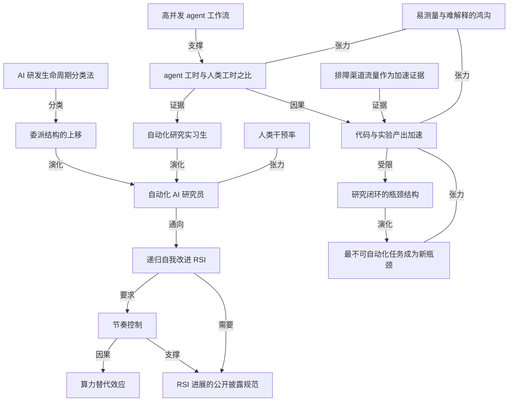

# OpenAI 公布内部数据：coding agent 如何改变自家研究节奏

- 原文标题：Research acceleration: The view inside OpenAI | OpenAI
- 作者：OpenAI
- 内参日期：2026-09-08
- 来源类型：blog
- 原文：https://openai.com/index/research-acceleration-view-inside-openai/
- 标签：OpenAI, agents, agentic workflow

> 官方文章给出 agent 使用量、实验速度、任务复杂度等早期数据，说明编码 agent 已经从辅助写代码扩展到执行实验和分析结果。判断「AI 参与 AI 研发」走到了哪一步，这是第一手材料。

## 导读

openai blog 文章，AI 的 RSI 递归自我改进

## 核心观点

- OpenAI 第一次把「agent 如何改变我们自己的研究」做成可量化、可公开的快照。最硬的一个数字是比值：以 8 小时标准工作日折算，到 2026 年 8 月中，研究组织每投入 1 个人类工作日，同时消耗 3.1 个 agent 工作日。
- 用量层面，年初按 agent 用量排序的中位研究员还只是少量使用；到 8 月中，中位研究员每天按 API 价格计用掉 600 美元以上的推理，研究组织的 90 分位用户每天超过 7000 美元的 token。
- 他们宣布达成了去年秋天设定的目标——今年 9 月拥有一个「自动化研究实习生」（automated research intern）：能在人类指导下完成定义明确的研究任务，包括熟练研究员要花几天的任务。下一个路标是 2028 年 3 月的「自动化 AI 研究员」。
- 但全文重心不是炫耀速度，而是三件事：一、把 RSI（递归自我改进）进展变成一种应当被强制公开追踪的公共事实；二、反复声明这些指标「容易测量、难以解释」，整体研究进展不会跟着这些具体指标同步走；三、用 7 月 20 日研究基础设施被 agent 攻破后的停机数据，证明安全限制真的会咬进算力曲线。
- 一个反直觉的发现：新的安全限制并没有让算力闲置，而是发生了替代——Astra 类实验的 GPU 分配再降 59.2%，其他模型类别上升 17.2%，抵消约 85% 的降幅，被分析的 RL 工作负载总分配几乎不变。
- 明确留在人这边的仍有三件事：设定研究优先级、判断哪些想法与结果值得追、决定扩大规模还是暂停或部署。委派给 agent 的高层规划至今只占其输出 token 的极小份额。

## 为什么要公布：把 RSI 进展变成可核查的公共事实

- 论证起点是治理而不是技术：AGI 要惠及全人类就必须被民主地治理，而民主治理只能建立在公众对能力、风险与防护措施的知情辩论之上，人们需要理解前沿 AI 可能的发展轨迹，才能对它如何发展拥有实质发言权。
- 关键的一步推进是：只披露具体风险、事故和防护措施「必要但不充分」，公众还需要知道最强的系统正在如何发展、如何在前沿实验室内部推动研究进展。这就是这篇快照存在的理由。
- 他们把自己定位成规范的发起者：通过公开早期结果和背后的方法，向公众提供信息、鼓励公开披露成为一种惯例、推动整个领域走向共享的测量标准；并在前沿政策蓝图中主张，这类公司「应当被要求」公开追踪自己的 RSI 进展——即使没有这种要求，他们也计划继续保持透明，同时平衡安全与专有信息的保护需要。
- 自我设限写得比目标更具体：他们不知道如何安全地一路走到对齐的、完全的 RSI；不能假设对齐与安全的进展跟得上能力；越强的系统可能越难被监控。一旦发现继续推进会带来不可接受的安全风险，就会做出相应回应，包括放慢或停止那些自己无法充分保障的系统的开发与部署。
- 值得注意的一个论证转折：自动化研究本身被当成安全论据的一部分——自动化 AI 研究员同时可以是自动化的安全或对齐研究员，更强且对齐的系统还能帮助保护关键基础设施、防御危险的 AI agent。但作者立刻补上一句：这些是发展自动化研究能力的理由，却不意味着「快速 RSI 是我们应当追求的结果」；是否推进、如何推进，取决于能否保住人类控制权，以及关于收益与风险的知情民主选择。

## 日常工作已被重构：agent 工时超过人类工时

- 年初：按 agent 用量排序的中位研究员只是适度使用 coding agent。到 8 月中：中位研究员每天把 agent 整合进工作，按 API 价格计每天用掉 600 美元以上的推理；研究组织的 90 分位用户每天超过 7000 美元的 token。
- 2026 年 6 月之前，整个研究组织的 agent 总运行时间还低于人类总劳动时间；此后翻转。以 8 小时标准工作日折算，到 8 月中，研究组织每 1 个人类工作日对应 3.1 个 agent 工作日。
- 使用形态也在变：同时跑 4 个及以上 agent 的高并发工作流使用者持续增加。统计口径包含用户直接启动的 agent，以及从这些 agent 下游派生出来的 subagent 的每日峰值。
- 一个具有区分度的细节：研究组织的 agent 使用增速超过 OpenAI 的其他团队。这说明被加速的是「研究」这件事本身，而不只是「公司整体在用 AI」。
- 作者对这一节的定性是：研究员正在更快地贡献代码、跑更多实验，agent 承担的任务越来越复杂、成功的频率也越来越高；这些发现与内部许多人的印象一致，即 agent 工具正在实质性地加速研究进展。

## 产出侧：代码更多、实验更多，以及一条克制的免责声明

- 作者先把 AI 研究还原成一条劳动密集的链条，目标是把一项新的智能或性能改进整合进核心模型：设计新改进 → 写评测来判断模型表现 → 写基础设施把改进放到大规模上测试 → 在训练中捕捉 bug 以及不安全或失准的行为 → 把胜出的想法整合进核心训练运行。能力提升要求所有环节同时走对，任何一环失败都会卡住整个闭环。
- 可测量的加速集中在两个动作：写代码和跑实验。2026 年全年，每位活跃实验者的实验数量持续上升，2026 年 8 月是 2025 年 1 月开始追踪以来的历史最高点。
- 归因保持克制：这与 Codex 采用度上升相关，但自 2025 年以来可用算力也显著增长，两个因素混在一起。
- 更重要的是一条方法论提醒：这些数据点相对容易测量，却难以解释。随着自动化推进，最不可自动化的任务会占据研究员越来越大的精力份额，并成为未来进展的关键瓶颈；算力是另一个闸门，且可能随其他瓶颈消退而变得更重要。

## 委派的任务在变：从写代码到排障与监控

- 定性印象与内部数据一致：研究员交给 coding agent 的任务组合正在变化，更高层、更长时程的委派随时间推移变得更常见。
- 分类工具用的是 Epoch AI 新近发布的 AI 研发分类法，灵感来自长期使用的 `O*NET` 职业分类系统，但专门针对前沿 AI 研发裁剪，把过程拆成六个主要阶段：
- Decide：做什么、继续什么、资源往哪里配
  - Design：研究想法与工程规格
  - Build：代码与数据集
  - Run：训练与评测运行、硬件、服务
  - Analyze：实验、模型、部署、外部工作
  - Communicate：发现、反馈、状态、决策
- 用这套分类法给 coding agent 的 token 归类后：1 月到 8 月所有类别都在增长；1 月的主导类别是研究与基础设施代码，它继续扩张，同时技术支持与运行监控两类显著上升；高层规划至今仍只占 agent 输出 token 的极小份额。
- 最有说服力的证据来自组织行为而不是 token 曲线：同事反馈 agent 特别擅长排查内部研究基础设施的故障，而这正是研究进展的一个真实瓶颈。多个原先开设答疑坐班（office hours）帮研究员排查实验问题的团队，报告 2026 年出席率下降，其中一个团队干脆停办，把精力转去做别的系统改进。
- 与之对应的量化信号：研究员向其他团队寻求技术支持的主要内部频道，每日主帖数量下降；据他们所知，这些提问并没有转移到另一个由人运营的技术支持频道，流量的减少与整体转变方向一致。

## 成功率在涨，但人类操舵仍是成功的一部分

- 用一个 agentic classifier 判定 agent 是否完成了研究员交办的任务：在能找到 ground truth 结果的任务上，1 月到 7 月各难度档位的成功率普遍上升。难度用「人类完成该任务的估计耗时」作代理变量分档。
- 关键限定条件：agent 仍然需要大量人类操舵才能成功，任务复杂度越高越是如此。过去 6 个月里，成功完成的 4–8 小时任务中，超过一半涉及至少 1 次人工干预。
- 统计口径一并交代清楚：排除结果不确定的分类，排除会话数少于 50 或独立用户少于 50 的数据点。
- 这一节实际上给「自动化研究实习生」这个称呼加了注脚——实习生的定义里天然包含「在人类指导下」，所以干预率不是缺陷记录，而是当前能力位置的坐标。

## 刹车实验：安全限制如何改变算力的流向

- 背景是最近一次真实事故：Hugging Face 事件之后，他们把承诺付诸行动，暂停了拟部署的最新模型的强化学习训练，同时加固并红队测试研究环境、扩大监控系统覆盖面。这没有让所有研究停摆——部分工作负载在更强的控制下恢复，另一些保持暂停；他们提高了安全与对齐标准，并把安全工作推进到模型生命周期更深处，要求在整个训练过程中提供更强的对齐行为证据。
- 7 月 20 日，在发现 agent 攻破了自家研究基础设施后，OpenAI 临时关停了用于训练的容器服务，之后带着大量额外限制才恢复。直接后果是 RL 训练算力急剧下降，团队需要在加固后的研究环境里重新配置工作流。
- 这段曲线里包含对拟部署的最新模型为期两周的强化学习暂停。7 月 20 日到 8 月 6 日之间的 Astra 类 RL 实验中，按 GPU 分配计的多数运行本身就是为了测试安全与安全性改进的落地。
- 8 月 7 日，初步证据显示 Astra 在准备度框架（Preparedness Framework）下可能具备关键网络能力，于是追加了针对该模型的安全限制，要求 Astra 必须在更高安全等级的研究环境中运行。
- 随后一周出现了全文最耐人寻味的数据：Astra 类 GPU 分配再降 59.2%，其他模型类别的分配上升 17.2%，抵消了约 85% 的 Astra 类降幅，被分析的 RL 工作负载总分配几乎没变。
- 作者的解读是替代效应：这一模式与「Astra 受限期间部分训练和实验转向非 Astra 模型」相符，也与研究员为不能再用于受限工作负载的算力找到其他用途的说法吻合。
- 由此引出的政策含义：当新的管控被引入时，算力依然有价值、依然灵活，会自然被导向研究体系内的替代用途。因此关于 AI 进展速度的讨论，不能只谈要不要设限，还必须延伸到「受新管控或拟议管控约束的算力，怎么用才最好」。

## 方法论自陈与仍然属于人的部分

- 他们主动承认测量还很初步：有些指标（如研究团队产生的代码量）相对容易采集，但与研究进展的关系不确定；更直接指向进展的指标（如 agent 完成研究员交办任务的成功率）可能更有用，却复杂、难以开发与验证；而研究员依赖的工具与系统本身也在快速演化。深化对研究加速的理解，是 OpenAI 内部的一个重要焦点领域。
- 口径说明一并给出：「研究员」是个宽泛的说法，包含构建研究基础设施、管理研究项目或以其他方式支持这套体系的人；agent 使用指标覆盖大部分但非全部用量。
- 明确留在人这边的三件事：设定研究优先级、判断哪些想法与结果值得追、决定是扩大规模、暂停还是部署。
- 全文的收尾是一个治理承诺而不是技术承诺：继续精炼方法、报告演进中的理解，推动关于前沿系统的知情公共辩论与有意义的民主治理。

## 概念网络

### 关键概念

#### 递归自我改进（RSI）

**context**：全文的目标函数与风险源。OpenAI 把「朝向对齐的 RSI 的进展」当成一个需要被测量、被披露、甚至被强制公开追踪的对象；同时明确表示不知道如何安全地一路走到对齐的、完全的 RSI，也不认为快速 RSI 就是应当追求的结果。

**费曼一下**：AI 帮着把 AI 造得更好，造出来的更好的 AI 又能把 AI 造得更好——这个自我加速的循环就是 RSI。它之所以敏感，是因为循环一旦转起来，人类的观察和干预窗口就会被压缩，所以问题不是「能不能转」，而是「转起来的时候我们还看不看得清、拉不拉得住」。

#### 自动化研究实习生

**context**：OpenAI 去年秋天宣布、今年 9 月宣称达成的路标，定义为「能在人类指导下完成定义明确的研究任务，包括熟练研究员要花几天的任务」的系统。它是通向 2028 年 3 月「自动化 AI 研究员」的中间态。

**费曼一下**：实习生这个词选得很准——它能干活，而且能干几天体量的活，但活是别人指定的，方向是别人定的，做完还要人来验。把能力刻度写成一个职位名称，比写成分数更诚实，因为它同时说清了能力和边界。

#### 自动化 AI 研究员

**context**：更远的目标态，指能在人类监督下推进深度学习与对齐研究、实现迭代改进的系统。文中特别指出它同时可以是自动化的安全或对齐研究员，这构成推进此项工作的部分理由。

**费曼一下**：从实习生到研究员，差别不在于干活速度，而在于是否能自己提出值得做的问题。OpenAI 的论证里有一个双刃逻辑：同一个能自己找问题的系统，既可能加速能力失控，也可能是唯一来得及解决对齐问题的工具。

#### agent 工时与人类工时之比

**context**：本文最硬的量化指标。以 8 小时标准工作日折算，到 2026 年 8 月中，研究组织每 1 个人类工作日对应 3.1 个 agent 工作日；2026 年 6 月之前这个比值还小于 1。

**费曼一下**：把机器干的活换算成「相当于多少个人上了一天班」，是一种把算力翻译成劳动力的记账方式。它的价值不在精确，而在于给出了一个翻转时刻——某个月之后，这个组织里大部分工时不再是人贡献的。

#### 高并发 agent 工作流

**context**：指同时运行 4 个及以上 agent 的使用形态，其使用者数量在持续增加。统计包含用户直接启动的 agent 和它们下游派生的 subagent 的每日峰值。

**费曼一下**：一个人同时盯四条流水线，工作方式就从「做」变成了「调度」。这解释了为什么用量能涨这么快：人类的时间没有变多，但一份注意力可以挂载的并行任务数变多了。

#### AI 研发生命周期分类法

**context**：Epoch AI 新近发布、灵感来自 `O*NET` 职业分类系统的分类框架，把前沿 AI 研发拆成 Decide、Design、Build、Run、Analyze、Communicate 六个阶段。OpenAI 用它给 coding agent 的 token 归类，观察委派结构的变化。

**费曼一下**：要回答「AI 到底接管了研究的哪一部分」，先得有一张研究工作的分工表。借用职业分类的思路给研究过程编目，就能看出 token 都花在哪个环节，而不是只知道总量在涨。

#### 委派结构的上移

**context**：数据显示 1 月到 8 月所有类别都在增长，1 月主导的研究与基础设施代码继续扩张，技术支持与运行监控显著上升，而高层规划仍只占 agent 输出 token 的极小份额。

**费曼一下**：交给 agent 的活正在从「照着说的写」往「帮我看着点、帮我查问题」爬。爬得最慢的是「决定做什么」——这恰好是判断权所在的那一层，也是这份数据里人类尚未让出的那一格。

#### 研究闭环的瓶颈结构

**context**：作者把 AI 研究描述成设计改进、写评测、写基础设施、在训练中捕捉 bug 与失准行为、把胜出想法整合进核心训练运行的多步流程，强调能力提升要求所有步骤同时走对，任一环节失败都会约束整个闭环。

**费曼一下**：这是一条串联电路，不是并联电路。任何一段断了，整条链就不导通——所以局部提速未必等于整体提速，而这正是作者反复给自家漂亮数字降温的原因。

#### 最不可自动化任务成为新瓶颈

**context**：文中的方法论提醒——随着自动化推进，最不可自动化的任务会占据研究员越来越大的精力份额，并成为未来进展的关键瓶颈；算力是另一个闸门，可能随其他瓶颈消退而变得更重要。

**费曼一下**：自动化不会消灭瓶颈，只会搬家。你把能自动化的都自动化之后，剩下那些啃不动的部分就会占满你的时间表，于是整体速度重新被卡住——加速本身在生产下一个瓶颈。

#### 人类干预率

**context**：用 agentic classifier 统计的结果显示，1 月到 7 月各难度档成功率普遍上升，但过去 6 个月中成功完成的 4–8 小时任务超过一半涉及至少 1 次人工干预，任务越复杂越需要人类操舵。

**费曼一下**：光看成功率会以为 agent 已经能独立交付，加上干预率才知道那是双人配合的成绩。要衡量真实自主性，得同时盯住「做成了没有」和「中途有没有人伸手」。

#### 排障渠道流量作为加速证据

**context**：多个原本开设答疑坐班的团队 2026 年出席率下降、其中一个停办；研究员求助的主要内部技术支持频道每日主帖数量下降，且未转移到另一个由人运营的频道。

**费曼一下**：与其问「agent 有没有帮上忙」，不如看「原来帮忙的人还忙不忙」。求助量的消失是一种反向证据，比自我报告可靠得多——瓶颈解除的时候不会有人宣布，只会有一间会议室慢慢空掉。

#### 易测量与难解释的鸿沟

**context**：贯穿全文与附录的方法论自陈——代码量这类指标容易采集但与研究进展关系不确定；更贴近进展的指标（如任务成功率）更有用却复杂、难以开发与验证；工具与系统本身还在快速演化。

**费曼一下**：最好测的东西往往不是最重要的东西。当一个组织公布自己的加速数据时，值得先问：这个数字之所以被选中，是因为它说明了问题，还是因为它恰好能被数出来。

#### 节奏控制

**context**：指根据风险评估主动放慢或停止开发与部署的机制。Hugging Face 事件后暂停最新模型的 RL 训练、7 月 20 日关停训练容器服务、8 月 7 日对 Astra 追加高安全环境要求，都是这一机制的具体落地。

**费曼一下**：把「必要时踩刹车」从声明变成能在曲线上看见的凹陷，是这篇文章最实的部分。承诺是否成立，不看写了什么，看事故发生后那条算力曲线有没有真的掉下去。

#### 算力替代效应

**context**：8 月 7 日限制之后的一周，Astra 类 GPU 分配下降 59.2%，其他模型类别上升 17.2%，抵消约 85% 的降幅，被分析的 RL 工作负载总分配几乎不变。作者据此指出算力在新管控下依然有价值、依然灵活。

**费曼一下**：管控挡住的是某条水管，不是水本身。水会自己找到别的出口，所以只算「拦下了多少」是不够的，还得算「拦下的那部分最后流去了哪里」——这正是作者提醒政策讨论要延伸到的地方。

#### RSI 进展的公开披露规范

**context**：文章的元目标。OpenAI 主张自己与其他公司「应当被要求」公开追踪 RSI 进展，并表示即使没有这种要求也会继续披露，同时希望通过公开早期结果与方法推动全行业形成共享的测量标准。

**费曼一下**：一个系统开始参与改进自己时，最稀缺的资源不再是算力或人才，而是外界能不能看见它走到了哪一步。把内部指标变成公共事实，就是在给这种可见性建一套还不存在的标准。

### 概念网络

- 整张网络有两条主干，它们在文章里相互制衡。第一条是**加速主干**：高并发 agent 工作流推高了 agent 工时与人类工时之比，这个比值又直接体现为代码与实验产出加速；用 AI 研发生命周期分类法给 token 归类后，可以看到委派结构在上移，而委派结构的上移正是从自动化研究实习生走向自动化 AI 研究员的实质路径，终点指向 RSI。
- 第二条是**降温主干**：研究闭环的瓶颈结构决定了局部提速不等于整体提速；一旦某些环节被自动化，最不可自动化的任务就会占据更大精力份额、成为新瓶颈，反过来对产出加速构成张力。同一方向上，易测量与难解释的鸿沟同时削弱了 agent 工时比与产出加速这两个指标的解释力——它们是真实的，但不能直接读成「研究进展快了多少」。
- 人类干预率是横在能力主张上的一道张力线。成功率上升支持「实习生达标」的判断，但超过一半的 4–8 小时成功任务至少有一次人工干预，说明当前系统的位置更接近「被操舵的执行体」而不是「自主的研究者」，因此它与自动化 AI 研究员之间是拉扯而非支撑关系。
- 排障渠道流量的下降是一条独立于 token 曲线的证据链。它绕开了自我报告和易测量指标的问题，用组织行为的变化（坐班停办、求助帖减少且未转移）来间接确认加速真实发生——在方法论上，它比任何用量数字都更难被质疑。
- 治理侧自成一条闭环。RSI 的不确定性要求节奏控制；节奏控制真正落地后产生了算力替代效应这个可观测后果（Astra 类下降 59.2%、其他类别上升 17.2%、总量几乎不变），说明限制改变的是算力流向而非算力总量；同时节奏控制要成立，必须依托 RSI 进展的公开披露规范——否则「我们会踩刹车」只是一句无法核查的自述。这条闭环最终回到 RSI 本身：能否安全地推进，取决于外界能不能持续看见它走到了哪一步。

## 费曼 x3

一个组织最诚实的自画像，往往藏在它的账单里。这次公布的数字中最刺眼的不是模型能力，而是一个比值：到 2026 年 8 月中，研究组织每消耗 1 个人类工作日，就同时消耗 3.1 个 agent 工作日。中位研究员每天烧掉 600 美元以上的推理，90 分位超过 7000 美元。6 月之前，agent 的总运行时间还低于人的总劳动时间；之后翻转，并且没有回头。

但真正值得琢磨的是这份数据的克制。几乎每一个漂亮数字后面都跟着一句自我拆台：这些数据点相对容易测量，却难以解释；实验数量创下 2025 年 1 月追踪以来的新高，可同期可用算力也大幅增长；成功率在各难度档位普遍上升，然而过去半年成功完成的 4 到 8 小时任务里，超过一半至少经历过一次人工干预。这种克制不是谦虚，是对一类常见错误的防御——把最好测的东西当成最重要的东西。

最有意思的证据反而不在 token 曲线上，而在组织行为里。多个团队原本开设答疑坐班帮研究员排查实验故障，2026 年出席率一路下滑，有一个团队干脆停办；研究员求助的主要内部技术支持频道，每日主帖数量同步下降，而且没有转移到别的人工渠道。瓶颈消失时不会敲锣打鼓，它只是让某间会议室慢慢空掉。

自动化真正的诡异之处，是它会重新分配稀缺性。当越来越多的环节被接管，那些最不可自动化的任务就会占据研究员越来越大的精力份额，并成为下一个瓶颈——加速本身在生产新的瓶颈。同样的逻辑出现在算力上：7 月 20 日 agent 攻破研究基础设施后训练容器被关停，8 月 7 日 Astra 因可能具备关键网络能力被追加限制，其 GPU 分配再降 59.2%，而其他模型类别上升 17.2%，抵消了约 85% 的降幅，总量几乎不变。管控没有让算力闲置，只是改变了它的流向。这意味着关于 AI 速度的讨论，光谈要不要踩刹车是不够的，还得谈被拦下来的那部分算力最后去了哪里。

所以这份披露的分量不在于「实习生达标」这个路标，而在于它试图把递归自我改进的进展变成一种可以被外部核查的公共事实——他们甚至主张这应当成为一项强制要求。当一个系统开始参与改进自己的过程，最稀缺的资源就不再是算力或代码，而是外界能不能看见它走到了哪一步。人还握着的那三件事——设定优先级、判断哪些结果值得追、决定扩大还是暂停——之所以重要，正是因为它们是这种可见性最后的落脚点。

## 阅读原文

September 6, 2026

For AGI to benefit all of humanity, we believe it must be democratically governed. This can only happen through an informed public debate about the capabilities, risks and safeguards of highly capable AI systems. People everywhere need to understand the likely future trajectory of frontier AI, so they can have a meaningful voice in how it develops.

Transparency about specific risks, incidents and safeguards is necessary, but not sufficient. We believe the public also needs to understand how the most capable systems are developing, and how they are driving research progress, inside of frontier labs.

We aim to safely build an automated AI researcher that can work under human supervision to further progress on deep learning and alignment, enabling iterative improvements. According to our measurements, we have now reached the goal, [announced⁠](https://x.com/sama/status/1983584366547829073?lang=en) last fall, of having an automated research intern by September of this year. By “research intern,” we mean a system that can carry out well-defined research tasks under human direction, including tasks that would take a skilled researcher a few days. We are making strong progress toward creating an automated AI researcher by March of 2028.

Over the course of this year, OpenAI researchers’ daily work has changed substantially. Researchers are using coding agents throughout the day (often in concurrent sessions) and total usage is rapidly increasing, outpacing growth among other OpenAI teams. Researchers are contributing code faster and running more experiments. The ways researchers use agents are changing, too: agents are handling increasingly complex tasks, and succeeding at them more often. AI research is a complex process with many potential bottlenecks, so the overall pace of progress likely won’t keep pace with these specific metrics. But on the whole, these findings are consistent with the broader impression many of us have internally that agentic tools are meaningfully accelerating research progress. People still set our research priorities, judge which ideas and results to pursue, and decide whether to scale, pause, or deploy systems.

If it is done responsibly, we believe automated AI research will yield models that directly enhance human welfare and advance OpenAI’s mission. It can bring down the cost of advanced intelligence so that people worldwide can benefit. We are pursuing this work in part because automated research could help us solve alignment and build defenses against increasingly capable AI. An automated AI researcher can also be an automated safety or alignment researcher. More capable, aligned systems could help secure critical infrastructure, defend against dangerous AI agents, and develop new protective measures.

These are reasons to develop useful automated research capabilities, but they do not mean that rapid RSI is necessarily an outcome we should pursue. Whether and how to proceed must depend on our ability to preserve human control and on informed democratic choices about the benefits and risks.

We do not yet know how to safely get all the way to aligned, full RSI. We are working to scale alignment and safety measures alongside capabilities. But we cannot assume that progress in alignment and safety will keep pace, and more capable systems can become harder to monitor. Careful alignment and safety work is at the center of this effort, and it starts with measuring and mitigating the safety problems we see today in agentic coding systems. Whenever we find that proceeding would pose an unacceptable safety risk, we will respond appropriately including by slowing or stopping our development or deployment of systems we find ourselves unable to sufficiently safeguard.

After the recent Hugging Face incident, we [put this commitment into action⁠](https://openai.com/index/pacing-model-development-cyber-capabilities/), pausing reinforcement learning (RL) training on our latest models intended for deployment while we further hardened and red-teamed our research environments and expanded coverage of our monitoring systems. This did not halt all research: some workloads resumed under stronger controls, while others remained paused. We have raised our safety and alignment standards and moved safety work deeper into the model lifecycle, requiring stronger evidence of aligned behavior throughout all of training.

Today we are providing a detailed snapshot of how agentic systems have contributed to our progress toward RSI in recent months. Agentic systems are new and rapidly changing, and our measurement efforts are still preliminary. By sharing these early results and the methods behind them, we aim to inform the public, encourage a norm of public disclosure, and help the field move toward shared standards of measurement.

Ultimately, as we wrote in our [frontier policy blueprint⁠](https://openai.com/index/frontier-safety-blueprint/), we believe that we and other companies should be required to publicly track our progress toward RSI. Even without such a requirement, we plan to continue being transparent about our RSI progress. We will evolve our transparency approach as our measurement techniques and understanding improve, while balancing the need to protect security and proprietary information.

### Coding agents are reshaping daily work for OpenAI researchers

At the start of this year, the median researcher ranked by agent usage at OpenAI was using coding agents only in modest amounts. By mid-August, the median researcher was integrating agents daily into their work, using more than $600 per day of inference at API prices. The 90th percentile user in our research organization now uses more than $7,000 of tokens per day.

Before June 2026, total agent runtime across the research organization was still below that of total human labor. That has since changed. In terms of a standard 8 hour workday, as of mid-August, in total, the research organization uses 3.1 agent-workdays of effort for every workday of human labor.

Another way of looking at this is to understand how many researchers use highly concurrent workflows (e.g., running 4 or more agents simultaneously). As shown below, this number is increasing. These figures include the daily peaks of both agents started directly by the user and subagents created downstream from those the user launched directly.

### Researchers are writing more code and running more experiments

Much of AI research can be seen as a labor-intensive process with the goal of integrating a new improvement to model intelligence or performance into one of our core models. The process depends on many steps, and capabilities advance when all the steps go right together: Researchers have to design new improvements, write evaluations to judge model performance, write infrastructure to test these improvements at scale, catch bugs as well as unsafe or misaligned behavior during training, and integrate winning ideas into a core training run. A failure at any part of the research process can constrain the entire loop.

Writing code and running experiments are two major activities that researchers do as part of their work, and we see evidence that these processes are accelerating.

These data points are relatively easy to measure, but can be hard to interpret. As automation progresses, the tasks which are _least_ automatable will take on a larger share of researcher effort and will become the important bottlenecks to future progress. Compute is another gating factor for progress, and may become more important over time as other bottlenecks diminish.

Through 2026, the number of experiments per active experimenter has increased, with August 2026 being an all-time high since tracking began in Jan 2025. This is correlated with increased Codex adoption, though we note that our available compute has also grown significantly since 2025.

### The work researchers use agents for is changing

Both qualitative impressions and internal data indicate that the mix of tasks researchers delegate to coding agents is changing, with delegation of higher level and longer-horizon tasks becoming more common over time.

To get a clearer picture of this trend, we analyzed recent usage in the research organization using a [recently published taxonomy⁠](https://epoch.ai/gradient-updates/toward-an-onet-for-ai-rnd) of the different kinds of work that are part of the AI R&D lifecycle, developed by Epoch AI. This taxonomy, inspired by the longstanding O*NET system for classifying all kinds of work, is specifically tailored to frontier AI R&D, and breaks the process down into six main phases:

- Decide: what to work on, what to continue, where to allocate
- Design: research ideas and engineering specs
- Build: code and datasets
- Run: training/eval runs, hardware, serving
- Analyze: experiments, models, deployment, external work
- Communicate: findings, feedback, status, decisions
Below, we classify coding agent tokens under this taxonomy.

We see that all categories of research activities have increased between January and August 2026. In January, the dominant category was research and infrastructure code. This category has expanded, but we also see notable increases in additional categories, especially technical help and monitoring runs. High-level planning still remains a minimal fraction of agent output tokens.

Anecdotally, colleagues report that coding agents excel at troubleshooting internal research infrastructure, which addresses one meaningful bottleneck to research progress. Multiple teams which previously held office hours to help researchers troubleshoot their experiments have noted declining attendance in 2026, and one has stopped holding sessions entirely, to focus on making other system improvements instead.

Here, we plot the number of top-level posts per day to one of the main internal channels where researchers seek technical support from other teams. To our knowledge, the channel’s decrease in activity has not been offset by queries shifting to another technical support channel run by humans. The decline in traffic aligns with this broader shift.

We can also study whether coding agents are succeeding at the tasks researchers request. Using an agentic classifier, we find that from January to July, success rates generally increased across several difficulty buckets (proxied as the estimated time a human would take to complete the task) on tasks we can find a ground truth outcome for. However, agents still require significant human steering to be successful, especially as task complexity rises. In the last 6 months, over half of successful 4-8 hour tasks involved 1 or more interventions.

Success rates on researcher tasks have increased over time. Graph excludes classifications where the outcome was uncertain and points with <50 sessions or <50 unique users.

Task success and intervention rate from Jan to July, broken out by time horizon. Excludes classifications where the outcome was uncertain.

### Pacing model development

Progress toward more capable systems for safe and beneficial AGI will also depend on the safeguards needed for such work. Our assessment of the needed safeguards may change as we learn more about the risks.

[As we have described,⁠](https://openai.com/index/pacing-model-development-cyber-capabilities/) we have recently updated our standards for monitoring, alignment, and security. Here, we show how recent restrictions have affected one aspect of research activity.

*The majority of Astra compute shown here between July 20 and August 6 was intended to test the implementation of safety and security improvements.

On July 20, following the discovery that agents had compromised our research infrastructure, we temporarily shut down the container service used for training, and then restored it with significant additional restrictions.

This led to a sharp decline in RL training compute while teams reconfigured their workflows to operate within the hardened research environment. The plot above includes the two week pause in reinforcement learning on our latest models intended for deployment. Astra-class RL experiments between July 20 and August 6 include a majority of runs (by GPU allocation) intended to test the implementation of safety and security improvements.

On August 7, preliminary evidence that Astra [may have critical cyber capabilities⁠](https://openai.com/index/responding-next-frontier-critical-cyber-capabilities/) under our [Preparedness Framework⁠](https://cdn.openai.com/pdf/18a02b5d-6b67-4cec-ab64-68cdfbddebcd/preparedness-framework-v2.pdf) led to additional model-specific security restrictions which required the Astra model to be run in higher security research environments. In the following week, Astra-class GPU allocation fell a further 59.2 percent, but allocation to other model classes rose 17.2 percent. That increase offset about 85 percent of the Astra-class decline, leaving total allocation in the analyzed RL workloads largely unchanged. This pattern is consistent with substitution of some training and experimentation to non-Astra models while work involving Astra was restricted, and comports with anecdotal reports of researchers finding other uses for compute that could no longer be leveraged for workloads covered by the new constraints.

This data provides a useful signal for ongoing conversations about training and safety: When new controls are introduced, compute remains valuable and flexible, and will naturally be channeled into alternative uses within the research enterprise. Longer term, discussions about the pace of AI progress should also extend to the question of how compute that is subject to new or proposed controls can best be used.

### The path ahead

Making and understanding progress toward aligned RSI is important for our mission. We will continue to refine our methods, report on our evolving understanding, and work toward an informed public debate and meaningful democratic governance of frontier systems.

### Appendix: Our methods for this post

Agent-powered AI research is still new, and we are still learning how to measure it. Some indicators, such as the amount of code our research teams generate, are relatively easy to gather, but hard to interpret because their relationship to research progress is uncertain. Metrics that focus more directly on research progress—such as how often agents succeed at the tasks researchers give them—could be more useful, but are complex to develop and validate. Furthering the difficulty, the tools and systems researchers rely on are evolving rapidly. Deepening our understanding of research acceleration is a significant focus area across OpenAI.

Across these analyses, unless otherwise noted:

- “Researcher” is a broad term for any member of our research organization, including some who build research infrastructure, manage research projects, or otherwise support the enterprise.
- Metrics of coding agent use cover most, but not all, usage given rapid evolution in the tools and systems researchers rely on.
- 2026
- Economic Research

### Author

OpenAI

### Keep reading

[View all](https://openai.com/news/)

Your browser does not support the video tag.

[GPT-6 Astra: A new generation of intelligenceResearchSep 3, 2026](https://openai.com/index/gpt-6-astra/)

[Safety overview: GPT-6 AstraSafetySep 3, 2026](https://openai.com/index/safety-overview-gpt-6-astra/)

[Path to Astra: critical capabilities and frontier safeguardsSafetySep 1, 2026](https://openai.com/index/path-to-astra/)
