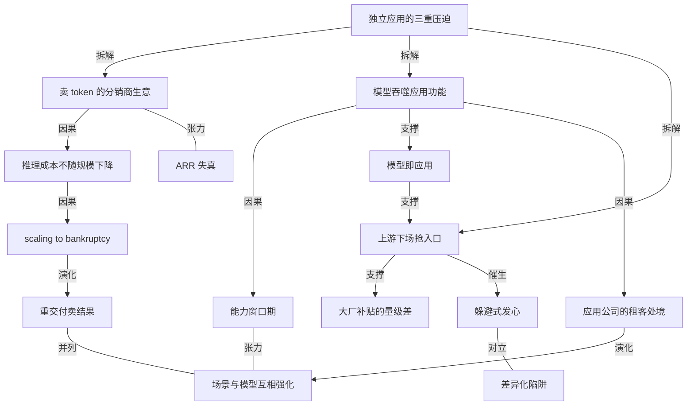

# 有用户、有收入，AI 应用却撑不起一家独立公司

- 原文标题：有用户，有收入，AI 应用却不是好生意
- 作者：晚点LatePost
- 内参日期：2026-09-08
- 来源类型：blog
- 原文：https://www.latepost.com/news/dj_detail?id=3706
- 标签：创业, 商业, SaaS

> 一位接触过上百家 AI 创业公司的业内人士开口第一句是「死透了」。文章的论点不是需求不存在，而是「找到需求—获得用户—做出收入」这条软件创业路径，已不足以让一家公司长期成立。

## 导读

晚点文章，AI 应用

## 核心观点

- 过去的软件创业路径正在失效：找到需求、获得用户、做出收入，这三件事都做到了，也**不足以让一家独立 AI 应用公司长期成立**。一位接触过上百家 AI 创业公司的业内人士对行业的第一句评价是「死透了」，接着反问「你觉得还有什么应用值得做？」
- 独立应用同时面对三个问题，构成本文的分析骨架：**产品多久会被模型吞掉，增长能不能带来利润，用户入口在谁手里**。三者分别对应能力、成本和渠道，且都攥在上游手里。
- 成本侧：应用本质上是在卖 token、做大模型的分销商，推理成本不随规模下降，增长反而把产品拉向亏损——Fireworks CEO Lin Qiao 的概括是 **scaling to bankruptcy**，越增长，离死亡越近。
- 能力侧：模型每升级一次，就让一批应用变得多余。窗口期在快速收缩，创业者失去的不是眼前的用户，而是未来的可能。
- 入口侧：卖给你模型的人也来抢你的用户。模型大厂既有能力也有动力下场做应用，加上国内大厂的免费额度与销售资源，创业公司在主入口位置上几乎没有胜算。
- 应对上有两条常见的错误路径和三条正在探索的出路。错误路径是「躲避大模型」式选方向和盯着竞品做差异化，两者都会走进没有用户的位置；探索中的出路是往下游做重交付、往上游自己训模型，以及在大厂主战场上换一个身位（如开源）直面竞争。
- 作者的克制之处在于结论并不乐观：这些路都还没有完全走通，只是在「模型即产品」「模型吞噬一切」的主流叙事下，它们**先活下来的可能性更高**。

## 成本侧：卖 token 的生意，增长越快亏得越多

- Kuse 的反常识动作是**极力压低增长**。2026 年初这款 AI 知识空间产品每天新增上万用户，但创始人吴显昆反而在踩刹车——向每个新用户赠送价值数美元的试用额度，用户越多，付给模型和云厂商的推理费越高；就算用户转成付费，成本结构仍然很差。团队反复调整定价和付费模式，才把毛利勉强调到微正。
- 亏损通常可以由资本市场兜底，但 Kuse 至今没融过资，靠创始团队投入加经营现金流维持，也不打算融。吴显昆的判断是融资解决不了核心问题：**如果增长只是把更多收入交给上游公司，规模还有什么意义？**
- ARR 这个指标正在失去意义。Kuse 2025 年 8 月发新闻稿称在无 VC 融资、无付费广告的情况下 60 天做到 900 万美元 ARR，3 个月后吴显昆又称超过 1000 万美元；但今年 8 月他开始反思：「你其实是在卖货，大家是把 GMV 当成 ARR 来说。如果是电商卖货，1000 万美金不是什么很大的数字吧。」所有 AI 应用本质上都在卖 token，「你拿几个大客户，annualized 了一下不就 1000 万了吗？」
- 卖 token 起量确实快，Stripe 对全球头部 100 家 AI 公司的收入统计给出了对照组：
- 年化收入做到 100 万美元，中位时间只要 11.5 个月；做到 500 万美元约需 24 个月。
  - 2018 年的头部 SaaS 公司走完同样两步，分别要 15 个月和 37 个月。
- 但快速的数字既有注水，也有结构性缺陷。一位投资人见过很多把 ARR 做大的荒谬算法：把难以持续的一次性收入、或某个月收到的年费乘以 12；更夸张的是取一年里最高一天或一周的收入乘以 365 或 52。
- 即便不注水，AI 应用的「年化收入」也远不如传统 SaaS 可靠。该投资人的对比是：「典型的 SaaS，你这个月付款的人，下个月 95% 还会付款，所以它确实是 recurring。现在的 AI 应用是 coding plan，续约率会远低于传统的 SaaS。」
- 毛利差距同样惊人。Bessemer 研究过 20 家高速增长的 AI 公司，很多在商业化第一年就接近或达到 1 亿美元 ARR，但**平均毛利只有约 25%**；传统云软件成熟期通常在 70% 左右。
- 底层机制的变化：传统 SaaS 时代产品被市场验证后可以放心扩大规模，因为新增用户的服务器成本很低；到了 AI 时代，**被验证和成为一门可持续的生意成了两件事**——用户可能愿意用、愿意付费，但每次使用都产生推理成本，这笔成本不会随增长下降，毛利始终压在低位。
- 财报口径也在掩盖真实亏损。据 The Information 报道，Perplexity 2024 年对外公布毛利率约 60%，但那是因为把约 3300 万美元、主要花在免费和试用用户身上的计算与网络成本计入了研发费用；若计入营业成本，毛利率是负数。Cursor 内部财务资料显示，截至 2026 年 1 月的季度毛利率为 -23%，把免费用户的推理成本也算进去约为 -31%。
- 吴显昆看到的办公类 Agent 产品在增长期毛利极端的低到 -200%，有的 -40%，好一点的 0% 到 10%。他认同 Fireworks CEO Lin Qiao 的概括——「scaling to bankruptcy」。
- OiiOii 的路径几乎完全同构：去年底内测排队用户达 10 万，上线后每天最多超 10 万人使用，但团队很快发现来薅羊毛的太多，于是也刻意压低增长。创始人闹闹说，起初投资人也看月活、日活，团队觉得没意义；到 4 月已经不再看用户活跃，转而看**付费转化、续费率和平均每个付费用户的收入**。
- 上游的定价权让赚钱进一步变难：视频模型里 Seedance 2.0 发布后一家独大、握有定价权，1 元一秒的报价量大也难有折扣，正常情况下应用公司在付费用户身上的毛利也只有 30% 左右。而在其发布后的两个月里，同行为了抢客户发起猛烈补贴，加上给免费用户的试用额度和创作者侧营销，这个行业几乎没有公司能做到正毛利。

## 能力侧：模型每升级一次，就让一批应用变得多余

- **代码搜索的窗口只有半年**。2023 年 11 月张佳圆发布 Devv Search，当时程序员已用 ChatGPT 辅助写代码但答案常有幻觉、缺出处，Devv 索引 GitHub、Stack Overflow 等技术资料提供引用和验证，上线半年收入数十万美元。他原本设想的三到五年路线图是：先花一两年做好开发者搜索，再做代码生成和调试，最后进入不需要人亲手写代码的自动化阶段。
- 这张路线图被模型的更新节奏直接作废：
- 2024 年 6 月 Anthropic 发布 Claude 3.5 Sonnet，称其在内部智能体编程测试中解决了 64% 的任务，接上工具已能写、改并执行代码；接入该模型的 Cursor 验证了这一点。
  - 2025 年 2 月 Anthropic 发布 Claude Code 研究预览版，可搜索和阅读代码、修改文件、运行测试并向 GitHub 提交代码。
  - 结果是原本预计持续一两年的搜索阶段只维持了半年，市场**直接跳过第二阶段、进入自动化开发**。张佳圆的原话是「没有想到它来得那么快。」
- Devv 转做自然语言生成应用后，张佳圆判断这个方向真正可行的窗口只有 2024 年 9 月至 11 月：Cursor、Claude Code 等编程 Agent 从一端进入，通用 Agent 从另一端扩张；要继续获客得补贴大量 token，成本太高。2025 年年中 Devv 2.0 停止扩张，进入维护状态。
- **AI 写作应用拿到过近一年的窗口，但归零得更彻底**。一位论文写作产品创始人称，2023 年生成一篇论文成本只要一两毛钱、售价约 70 元，公司当年收入约 1000 万元、最高单日十几万元、净利润率约 50%；市占率高到他住酒店开发票时，前台的实习大学生看到抬头会心一笑。
- 2024 年增长就停了，团队加了 PPT 生成、AI 内容检测等功能，收入也没有起色。
  - 到 2025 年 Kimi、DeepSeek 已能更便宜甚至免费地写长文，这个工具的收入从每天数万元一路降到数百元，最后归零。
  - 同类公司集体转向：Jasper 转做企业营销，`Copy.ai` 去连接销售流程和客户管理系统，蛙蛙写作（波形智能）被手机厂商收购，前述论文产品从 2024 年底开始承接杂志社对接、论文辅导等服务。
- **工作流产品先变的甚至不是收入，而是资本市场的预期**。2025 年 12 月一位从大厂离职的创业者在试过浏览器插件、AI 写作和自由画布后确定做 AI 工作流，拿了上百万美元种子投资；一个月后 Skill 开始在 Agent 产品中流行并逐渐成为标准配置，等这个工作流上线后再去融资，投资人已经认为「Skill 会替代 Workflow」，他拿不到下一轮了。
- 当时该产品已转向企业服务，接入电商、短剧和营销行业，最高峰时一个月有数十万美元收入、续费率 70% 至 80%——但 Agent 和 Skill 在削弱独立工作流产品的价值，天花板肉眼可见。
  - 他被推着连续换方向：开春先尝试通用型 Agent 产品，发现推动商业化阻力非常大、市场变化太快而搁置；一个月后看到 Claude Code 设计能力的升级，又转向做设计类 Agent 的开源产品。他说 2025 年底还很难想象自己会在 3 个月内换两次方向，现在即使下周再换一次也不意外。
- 覆盖名单在变长，速度也在变快：
- a16z 连续追踪消费类 AI 应用，2023 至 2025 年的历次榜单里，前 50 名中只有 14 家公司每次都在榜上。
  - Epoch AI 估算，2024 年 4 月以后前沿模型能力提升的速度从每年约 8 个指数点提高到约 15 个点，接近翻倍。
- 一个容易被忽略的观察：**模型的吞噬不是瞬间发生的**。三家公司转向时原产品都还没归零，创业者失去的不是眼前的用户，而是未来的可能；他们必须跑得更快，才有下一次机会。

## 入口侧：卖给你模型的人，也来抢你的用户

- 先发优势兑现不了。2025 年 11 月 Kuse 从画布模式升级为文件夹形态，比 Codex 更早；2026 年 1 月接入 Slack Bot，也比 Claude Tag 更早。但吴显昆认为这短短几个月的窗口积累不了足够的用户习惯、使用频率和收入，**不足以让他们逃出模型的引力**。
- 他把问题收敛为唯一关键的一问：「模型即应用」是否成立？
- 2025 年 3 月 Manus 上线爆火，创始人肖弘一句「壳有壳的价值」曾经否定这个命题，给了很多独立 AI 应用信心。
  - 但 2026 年以来 Claude Code、Codex 的快速发展，又让判断偏向另一端。
- 上游下场有其经济动因。布鲁金斯学会（Brookings）的分析是：训练和运营模型要巨额投入，模型能力逐渐趋同后，**单卖模型 API 撑不起这些投入，做应用反而成了模型公司回收利润的一种方式**。
- Anthropic 身上已经发生了多次上下游抢生意：Cursor 验证了 AI Coding 的需求后，Anthropic 推出 Claude Code，逐渐比前者更受开发者欢迎；与 Figma 加深合作的同时，其高管从 Figma 董事会辞职，推出 Claude Design，直接进入后者的核心市场。
- 模型公司的结构性信息优势：**能提前看到下一代模型的能力，还能从海量 API 调用里判断哪些场景更活跃**。一个需求一旦被创业公司验证，模型公司就可以把它做成自己的产品。OpenAI 同理——Deep Research 与 AI 搜索、研究工具竞争，ChatGPT Work、Codex 进入文档、表格、演示和内部工具，ChatGPT Sites 拓展到应用生成和部署。
- 这不是 AI 时代才有的模式：微软曾把 Internet Explorer 与 Windows 捆绑，后来又把 Teams 放进 Office，先后引发美国反垄断诉讼和欧盟调查。
- 国内大厂的进场更直接。今年腾讯、阿里、字节集体进入办公 Agent 领域，分别推出 Workbuddy、千问办公、豆包办公；据易观对 17 款 PC 原生办公 Agent 的统计，3 月到 6 月这个领域流量新增 2 倍，**但其中三分之二流向了大厂的 3 款产品**。一位年初看这个方向的投资人发现，当时几十个项目坚持到现在的只有个位数，有的创业者甚至转型做了 Workbuddy 的代理。
- 补贴量级是创业公司玩不起的：以 Workbuddy 为例，免费版每月送的积分按付费价值折算约 25 元，日活按 100 万计算，光免费用户每月就要投入 2500 万元；拉新阶段受邀新用户再获赠账面价值 100 元的积分，每新增 100 万用户最高要投入 1 亿元。
- 由此得到一个位置判断：一位创业者最终意识到这个方向「太大、太上」，只能是大厂的生态位，创业公司只能缩到解决一个更垂直的问题，做大厂入口的一个插件。他的比喻是——**未来通用办公的 Agent 就像浏览器，而他们做的插件相当于网页，只能等着被入口产品调用**。

## 两个陷阱：逃离竞争，也逃离了用户

- 第一个陷阱是**躲避式的发心**。在模型和大厂吞噬一切的势头面前，团队很容易把「它们不会做什么、做不了什么」当作选方向的起点。
- 吴显昆 2024 年启动新项目时选中画布形态，理由正是模型公司的主入口都是对话，而画布是一套完全不同的交互；团队 2024 年底先做了与后来 Lovart 相近的设计产品，随后把画布带进办公场景。
  - 同样的思路在同期产品里都有痕迹：中国的 Lovart、Flowith，海外的 Miro、Subset 都想用画布完成对话完成不了的任务，连百度也发布了「自由画布」。
  - 代价是：为了证明自己与模型不同，产品容易把交互做得更复杂，去追一些小众、看上去很特别的需求。**每加一层差异，能理解和使用产品的人就少一些**——团队以为找到了模型公司不会进入的位置，最后可能只是进入了一个没有多少用户的位置。
  - Kuse 曾花很长时间打磨在画布上读 PDF 的体验，做了一段时间后吴显昆不得不承认一个更简单的问题：可能根本没有多少人愿意在画布上读 PDF。
  - 一年后他把这次失误归因于选方向时的「发心」：当一个创业者先想「躲避」而不是释放大模型的能力，再到空白处寻找需求，路只会越走越窄。**盯着模型公司不会做什么，做不出一个好产品。**
  - 反向参照是 Cursor 和 Claude Code：让模型理解代码库和文件，直接完成任务，而不是用新的交互限制模型。Kuse 随后从画布转向文件夹式交互。
- 第二个陷阱是**盯着竞品做差异化**。张佳圆在 Devv 的几次转向中反复遭遇：Copilot Hub 没有明确用户，Devv Search 被模型进展越过；到 Devv 2.0，团队为了区别于其他自然语言应用生成产品，把定位收窄到「帮助用户做 AI 应用」，花了约半年开发，产品上线时窗口已经过去，用户和留存都没有。
- 他的教训是：盯着竞品设计功能，做出的差异可能根本不是用户的需求。产品从 0 到 1 时，如果还没有稳定用户、留存也不好，**先要回答的是谁在用、为什么用，而不是它与同类产品有多少不同**。
- 反面的可能性是直面竞争。上述工作流产品的创始人在最新的开源设计 Agent 项目上看到一种出路：当需求被验证、大厂大力投入的时候，也许不必离开这个市场——市场渗透还在早期，或许能找到一个不同的身位。
- 他的选择是在大厂的主战场上做开源产品：看到 Claude Code 在做设计类产品后，借这个热度做开源版本。一周内新项目获得将近 5 万 star，收入甚至超过了之前的工作流产品，团队 90% 以上的资源和人力都投在这件事上。

## 出路一：往下游去，不卖产品，卖结果

- 这条路的定义是**从卖工具改成对结果、交易和利润负责**，往客户业务深处走。
- OiiOii 不再跟同行打补贴战，转而进入具体细分行业，通过后训练小模型解决具体场景问题，给客户交付视频内容和工作流。
- 漫画转动画是已跑通的案例：Seedance 2.0 出 2D 效果并不好，因为它会对真实或 3D 过拟合，让 2D 看起来过于流畅，而在日漫、日番里这会看着很假。闹闹说「我们用了一套方式训练，把 2D 表现得很像日番，他们就特别满意，愿意买单。」
  - 价值差是量级级别的：交付物如果靠工具做，两分钟成本可能也就 200 块钱，但把符合需求的视频交给客户，两分钟可能卖 1 万块钱。
  - **AI 改写了重交付的成本结构**：过去的企业服务生意常常败在交付太重、人力成本太高，现在只要生产工具足够好用，需要的人极少——闹闹说，她们原本要对外证明使用价值的产品，变成了内部的高效生产系统。
  - 在垂直行业里被验证的解决方案，之后还会积淀成给更多人的 Skills，这是 OiiOii 接下来的产品方向。
- 论文写作工具团队没有再做新的消费工具，而是回到过去积累的 500 多万学生用户：承接论文发表等定制需求，也做 AI 培训，教学生用 AI 写文案、剪辑和运营内容，做「一人公司」。
- 线上陪跑收费数千元，线下课程一两万元；创始人把它称为「重交付」——**客户买的是从学会工具到做出内容、赚到钱的结果**。
  - 他的判断是：现在学生就业难，比起「释放创造力」这样虚的需求，多数人的刚需是用新的生产力赚到钱，而他们在自媒体和生产力工具上的积累正好能做这件事。
- 吴显昆走得更深，且是先撞了一次墙。Kuse 曾给企业做数字员工 Junior，但每家公司的数据、权限和流程都不同，团队要先做诊断、咨询和部署；系统做出来后客户也未必愿意向外部供应商开放敏感数据——项目有需求，却很难像标准软件那样复制。
- 他后来决定探索另一种方式：**与投资机构合作，先收购服务公司，再用 AI 改造流程，通过持股分享利润**。这种方式比 FDE 能更深入业务，双方利益也更一致；团队目前已经收购了一家公司。
- 作者对这条路保持克制：闹闹卖交付物理论上解决了眼前的利润率和现金流，但长期还是得面对 To B 最难的一环——怎么持续拓展客户；面向学生群体的 AI 培训还没有数据证明能帮学员挣到钱、可以大规模复制；吴显昆进入了经营深处，但提效和整合最终也可能失败。

## 出路二：往上游去，自己做模型

- 已经这样做的公司名单不短：Cursor、Krea、Captions、Perplexity、HeyGen、LiblibAI 都从应用进入模型层，大多沿着已验证的编程、搜索、设计、图像、视频和虚拟人场景，训练更垂直的模型。
- 杨博麟的团队最早做 Cuflow，把用户上传的课件变成可交互视频。公测时有数万人注册、海外获得 2000 多万次曝光，但**超过一半用户上传的不是学习资料**，而是企业培训材料、漫画、小说和商品详情页。2026 年 4 月团队停止更新 Cuflow，转而训练以代码为核心的实时交互视频模型。
- 这个决定另一半来自做应用时积累的不安全感：
- Cuflow 要接入不同公司的语言、语音和视频模型，上游每次更新工程师都要重新测试能力和成本，再决定哪些功能需要重做。杨博麟说应用公司某种程度上成了「模型评测博主」，谁发新模型就立刻测一遍，刚适配完一轮上游又更新了，而且不会提前通知。
  - 更难接受的是有些更新会直接抹掉几个月的工程：他们早期处理长文档要先做文字识别、切分文本，再分别把图片和文字交给模型检索；模型上下文变长后，整份材料直接输入的效果有时反而更好，旧流程不仅多余还拖慢了速度。
  - 他的结论是：AI 应用看似属于自己，最重要的能力却不在自己手里，**「我们永远只是一个租客。」**
- 他也承认这种处境不是活不下去——应用公司可以绑定客户的工作流，也可以把品牌和渠道做强——但这些工作没有用到团队的长处：他们有算法工程师和模型训练人才，如果大部分时间只是在测试和切换别人的模型，这个优势就浪费了。
- 回到模型层对他来说是「胜率更高」的选择：原来做 AI 教育的团队太多，转向基于扩散语言模型的实时交互视频后直接竞争的团队更少；更重要的是他认为自己有别人还没充分验证的信息——**代码生成的视频成本低、速度快，可以准确编辑和审计，天然支持交互和多人协作**，适合企业培训、商品展示等以传递信息为主的视频。
- 打法是场景与模型的双向强化：团队一边训练模型，一边与教育、营销、企业培训等行业客户讨论需求，转向两三个月后已拿到 21 家企业客户的合作意向。杨博麟认为他们真正的优势不是做模型本身，而是能在场景和模型间持续互相强化——**先找到真正有价值、能持续产生数据的场景，再把对场景的理解通过后训练和持续反馈沉淀进模型**。
- 代价也很清楚：团队 25 个人，要搭建从监督微调、偏好优化到强化学习的后训练管线，还要处理奖励函数、容器化和 GPU 调度，一次配置出错就会烧掉一大笔钱；后续训练估算需要数百张 GPU，公司正在进行的新一轮融资很大一部分就是为了训练资源。而且做模型也没有让商业化问题消失——21 家客户签了意向，还没多少真正付费。
- 全文的收束是一句带着现实重量的话：不管做交付还是后训练模型，创业者们都要继续做下去，因为**他们已经拿了钱，建了团队，得到了曝光**；他们也相信，只要 AI 继续发展，模型大厂做不了一切。

## 概念网络

### 关键概念

#### 独立应用的三重压迫

**context**：文章的分析骨架，原文表述为「产品多久会被模型吞掉，增长能不能带来利润，用户入口在谁手里」。三个问题分别指向能力、成本和渠道，作者用它统摄全文六个部分，并把创业者要回答的终极问题写成「当能力、成本和入口都攥在上游手里，应用公司还能留下什么？」

**费曼一下**：一家 AI 应用公司同时被三只手掐着——技术能力是租来的，随时可能被房东自己用掉；每接一个用户就要向房东交一笔推理费，客人越多交得越多；而客人从哪扇门进来，门也在房东手里。三只手不是轮流出现，是同时按着。

#### 卖 token 的分销商生意

**context**：吴显昆用来重新定义 AI 应用商业本质的说法——「所有 AI 应用本质上都在卖 token」，因而 ARR「其实是在卖货，大家是把 GMV 当成 ARR 来说」。这一定性直接推翻了把 AI 应用类比传统 SaaS 的估值逻辑。

**费曼一下**：你以为自己开的是软件公司，实际上更像个批发商：从模型公司进货（token），加个界面转手卖给用户。批发生意的特点是流水好看、利润薄，所以拿卖货的流水去对标软件公司的经常性收入，是在拿两种完全不同的生意做比较。

#### ARR 失真

**context**：文中投资人列举的注水算法（把一次性收入或单月年费乘以 12，甚至取最高一天或一周乘以 365 或 52）与结构性缺陷（AI 应用「是 coding plan，续约率会远低于传统的 SaaS」）。Bessemer 的数据给出对照：20 家高增长 AI 公司很多第一年就接近 1 亿美元 ARR，但平均毛利只有约 25%，传统云软件成熟期约 70%。

**费曼一下**：ARR 的本意是「这笔钱明年还会自动来」。当续费不稳定、毛利又极低时，同样一个数字背后的含金量完全不同——1000 万美元 ARR 可能意味着一台稳定的印钞机，也可能意味着一堆随时会停的一次性订单加上负毛利。

#### 推理成本不随规模下降

**context**：文中区分传统 SaaS 与 AI 应用的关键机制：SaaS 产品被验证后可以放心扩大规模，因为新增用户带来的服务器成本很低；AI 时代「被验证和成为一门可持续的生意成了两件事」，每次使用都产生推理成本，这笔成本不会随增长下降，毛利始终压在低位。

**费曼一下**：软件曾经的魔法是「做一份，卖一万份，成本几乎不变」。AI 把这个魔法拿走了——每多服务一个人、每多回答一句话，你都要真金白银地再付一次电费。规模不再自动带来利润率的改善。

#### scaling to bankruptcy

**context**：Fireworks CEO Lin Qiao 对初创公司处境的概括，吴显昆表示认同，原文解释为「越增长，离死亡越近」。文中的实证包括 Kuse 因免费试用额度一度爆亏、Perplexity 计入营业成本后毛利率为负、Cursor 截至 2026 年 1 月的季度毛利率 -23%（含免费用户约 -31%）、办公类 Agent 增长期毛利低到 -200%。

**费曼一下**：正常生意里增长是解药，亏损靠做大来治。在负毛利的结构下，增长变成了毒药：卖一单亏一单，卖得越猛死得越快。所以 Kuse 和 OiiOii 这些公司会主动踩刹车——不是不想长大，是长大本身在杀死自己。

#### 模型吞噬应用功能

**context**：文章第二部分的核心机制，原文写作「创业公司作出的功能创新，越来越快被并入模型」「模型每释放一种新能力，都会催生一批产品，也会在下一次升级时拿走其中一批的核心价值」。证据包括 Devv Search 被 Claude 3.5 Sonnet 与 Claude Code 越过、AI 写作被 Kimi 与 DeepSeek 免费能力清零、独立工作流被 Skill 取代，以及 a16z 榜单前 50 名中只有 14 家公司三年常在。

**费曼一下**：你辛苦做出来的功能，本质上是在补模型当下的短板。等模型下一个版本把这个短板补上，你的产品就从「必需品」变成「多余的一层」。这不是被对手打败，是脚下的地面本身长高了。

#### 能力窗口期

**context**：贯穿多个案例的时间尺度概念。张佳圆原本设想的搜索阶段应持续一两年，实际只维持了半年；他判断自然语言生成应用真正可行的窗口只有 2024 年 9 月至 11 月；AI 写作应用拿到近一年窗口；工作流产品在上线一个月后就被 Skill 改变了融资叙事。Epoch AI 估算 2024 年 4 月后前沿模型能力提升速度从每年约 8 个指数点提高到约 15 个点。

**费曼一下**：每个 AI 应用都活在一个倒计时里，倒计时长度由下一次模型升级决定。过去这个数字是几年，现在缩到几个月。窗口不是「有多少时间赚钱」，而是「有多少时间跑到下一个立足点」。

#### 模型即应用

**context**：吴显昆认为的「唯一关键的问题」。2025 年 3 月 Manus 爆火时肖弘一句「壳有壳的价值」曾否定这个命题，但 2026 年以来 Claude Code、Codex 的快速发展又让判断偏向另一端。这个命题成立与否，决定独立应用公司还有没有独立存在的位置。

**费曼一下**：问的是——最终用户会不会直接住进模型公司的产品里，中间那层应用根本不需要存在？如果答案是「会」，那么所有做壳的人都只是在为模型公司做用户教育；如果是「不会」，壳才有独立的生意。目前证据在往前一个答案倾斜。

#### 上游下场抢入口

**context**：文章第三部分的机制，布鲁金斯学会给出的经济动因是模型能力趋同后单卖 API 撑不起巨额投入，做应用成了模型公司回收利润的方式。案例包括 Anthropic 在 Cursor 验证需求后推出 Claude Code、在与 Figma 合作的同时推出 Claude Design，OpenAI 的 Deep Research、ChatGPT Work、Codex、ChatGPT Sites。作者还指出这不是 AI 时代独有——微软捆绑 Internet Explorer 与 Teams 都引发过反垄断诉讼与调查。

**费曼一下**：卖你原料的供应商，能看到你还没看到的下一代原料，也能从所有客户的订单里看出哪种成品最好卖。等他决定自己开店，你既没有信息优势，也没有成本优势。这在平台经济里是老剧本，只是这次上游换成了模型公司。

#### 大厂补贴的量级差

**context**：说明创业公司在主入口位置「几乎是一场没什么胜算的竞争」的具体量化。腾讯、阿里、字节今年集体进入办公 Agent，易观统计显示该领域 3 月到 6 月流量新增 2 倍，三分之二流向大厂 3 款产品。以 Workbuddy 为例，免费版每月赠送积分按付费价值折算约 25 元，日活 100 万即每月 2500 万元；拉新阶段每新增 100 万用户最高投入 1 亿元。

**费曼一下**：同一个赛道上，大厂的入场费是创业公司的全部融资额。当对手可以每个月白送两千五百万让用户留下来，产品做得更好这件事就不再是胜负手了。

#### 躲避式发心

**context**：吴显昆一年后对 Kuse 画布路线失误的归因——选方向时先想「躲避」而不是释放大模型的能力，再到空白处寻找需求，「路只会越走越窄」。文中的推论链是：为了证明与模型不同，产品把交互做得更复杂、去追小众需求，「每加一层差异，能理解和使用产品的人就少一些」，最后进入的是一个没有多少用户的位置。Kuse 在画布上打磨 PDF 阅读体验后承认，可能根本没有多少人愿意在画布上读 PDF。

**费曼一下**：把「大厂不会做这个」当成选题标准，等于让对手替你划定地盘。而对手不做某件事，最常见的原因恰恰是那里没什么人。躲开竞争的同时，你也躲开了用户。

#### 差异化陷阱

**context**：张佳圆从 Devv 2.0 失败中得到的教训——盯着竞品设计功能，做出的差异可能根本不是用户的需求。团队为了区别于其他自然语言应用生成产品，把定位收窄到「帮助用户做 AI 应用」，花了约半年开发，上线时窗口已过、用户和留存都没有。他的正解是：产品从 0 到 1 时先要回答谁在用、为什么用，而不是它与同类产品有多少不同。

**费曼一下**：差异化是给已经有用户的产品用的调味料，不是从零起步时的主菜。还没人吃你的饭就先研究怎么跟隔壁做得不一样，做出来的很可能是一道只有你自己在意的菜。

#### 重交付：卖结果而不是卖工具

**context**：往下游走这条路的共同特征，原文概括为「从卖工具改成对结果、交易和利润负责」。OiiOii 用后训练小模型给客户交付视频，同样两分钟的内容，工具成本约 200 元、交付售价可达 1 万元；论文团队回到 500 多万学生用户做陪跑与培训，客户买的是「从学会工具到做出内容、赚到钱的结果」；吴显昆则与投资机构合作收购服务公司、用 AI 改造流程并通过持股分享利润。关键的成本前提是 AI 让重交付不再需要大量人力，闹闹说产品「变成了内部的高效生产系统」。

**费曼一下**：以前卖锄头，现在直接种粮食卖粮食。锄头再好，也只能按锄头的价格卖；而粮食的价格由需求方的收益决定，中间的差价就是你把结果扛下来换回的报酬。AI 让种地不再需要很多人，这门原本太重的生意才重新划算。

#### 应用公司的租客处境

**context**：杨博麟对做应用的定性——「AI 应用看似属于自己，最重要的能力却不在自己手里，我们永远只是一个租客。」具体表现为应用公司沦为「模型评测博主」，每次上游更新都要重新测试能力和成本、决定哪些功能重做，且上游不会提前通知；有些更新会直接抹掉几个月的工程，比如长文档的识别切分流程在模型上下文变长后不仅多余还拖慢速度。

**费曼一下**：房子是租的，房东随时可以重新装修，你精心打的柜子可能一夜之间就不合尺寸了。你付得起房租、住得也不错，但所有关于长期的规划都不由你决定。

#### 场景与模型互相强化

**context**：杨博麟对自身真正优势的判断——不是做模型本身，而是「能在场景和模型间持续互相强化：先找到真正有价值、能持续产生数据的场景，再把对场景的理解通过后训练和持续反馈沉淀进模型」。它同时是 OiiOii 后训练小模型解决漫画转动画等具体问题的底层逻辑。代价是 25 人团队要搭建从监督微调、偏好优化到强化学习的后训练管线，后续估算需要数百张 GPU。

**费曼一下**：单独做模型比不过大厂，单独做应用又随时被吞掉；出路是让两者互为护城河——真实场景源源不断地喂给你别人拿不到的数据，这些数据训出的模型又让你在这个场景做得更好。转的圈越多，别人越难插进来。

### 概念网络

这张网络的枢纽是「独立应用的三重压迫」。它不是一个论点，而是作者把行业困境切开的三把刀：成本、能力、入口。全文其余概念都可以挂回这三条线中的一条，而三条线最终又汇合到同一个出口问题——应用公司还能留下什么。

**成本线是一条纯粹的因果链**。「卖 token 的分销商生意」是起点定性：一旦承认应用只是模型的分销商，「推理成本不随规模下降」就成了必然推论，而这个推论再往前一步就是「scaling to bankruptcy」。这条链的特别之处在于它把商业史上最可靠的一条常识——规模带来利润——反转成了自杀机制。「ARR 失真」与这条链构成张力关系而非因果关系：它不是亏损的原因，而是亏损的遮蔽物。正因为分销生意起量快，ARR 数字才好看；也正因为数字好看，行业才长时间没有直面负毛利。Perplexity 把免费用户成本计入研发费用、Cursor 内部 -23% 与 -31% 两个口径的差距，都是这层遮蔽的具体形态。

**能力线是一条时间轴**。「模型吞噬应用功能」是机制，「能力窗口期」是这个机制在时间维度上的投影——窗口不是被谁抢走的，而是被模型升级的节奏本身压缩的。Epoch AI 的能力提升速度接近翻倍，与 Devv 从一两年缩到半年、工作流从上线到失去融资叙事只隔一个月，是同一件事的宏观与微观两个刻度。这条线还向上生长出「模型即应用」：当被吞噬的功能足够多、足够快，人们自然会追问模型本身是否就是终局形态。

**入口线是一条权力结构**。「模型即应用」如果成立，「上游下场抢入口」就从可能变成必然——布鲁金斯学会给出的动因（单卖 API 撑不起投入）说明这不是恶意，而是模型公司自己的经济结构逼出来的选择。「大厂补贴的量级差」是这条线在中国市场的具体形态，它把竞争从产品维度移到了资本维度：办公 Agent 领域流量翻倍而三分之二流向大厂三款产品，说明位置本身就决定了结果。

**三条线交汇处长出两个陷阱和三条出路**。「躲避式发心」直接由入口线催生：既然正面打不过，就找大厂不去的地方；但它与「差异化陷阱」构成一组镜像的对立——前者拿对手的边界定义自己，后者拿对手的功能定义自己，两种做法都把用户排除在了决策之外，结果也一样：产品越做越窄，最后落在一个没有用户的位置。吴显昆在画布上读 PDF 的失败与张佳圆的 Devv 2.0，是这组镜像的两个实证。

**出路则是三条线的反向操作**。「重交付卖结果」是对成本线的回应：既然按 token 卖注定薄利，就把价格锚点从工具成本换成客户收益，两分钟视频从 200 元变成 1 万元的跳变正是这个换锚的结果，而 AI 让人力不再是瓶颈是它成立的前提。「应用公司的租客处境」是能力线在创业者主观感受上的沉淀，它自然演化出「场景与模型互相强化」——不再租，而是把房子的一部分买下来。值得注意的是，这条出路与「能力窗口期」之间仍有张力：自己训模型并不会让窗口消失，只是把赛跑换到了一个直接竞争者更少的赛道上。第三条出路——在大厂主战场做开源、换一个身位——则说明入口线并非只有躲避一种应对：需求被验证且渗透仍在早期时，留在市场里换个位置也可能成立。

三条出路的共同点，是都放弃了「做一个独立的、标准化的、靠软件毛利活着的应用公司」这个原始设定。作者在结尾没有给出胜负判断，只留下一句现实的注脚：这些路都还没有完全走通，只是先活下来的可能性更高。

## 费曼 x3

有一类失败是打不过对手，还有一类失败是脚下的地面在长高。这篇文章讲的是后者。它挑了六家公司，把 AI 应用创业最难堪的一面摊开：他们不是没找到需求，不是没有用户，也不是没有收入——有人 60 天做到 900 万美元年化，有人一天最多十万人在用，有人单月净利率 50%——但这些在过去足以证明一门生意成立的证据，现在什么都证明不了。

问题出在三个地方，而且是同时出问题。第一，你以为自己在卖软件，其实在卖 token。软件的魔法是做一份卖一万份，边际成本趋近于零；token 不是，每多回答一句话你都要再付一次电费。于是增长从解药变成毒药，越长越亏——所以你会看到两家增长很好的公司在主动踩刹车。第二，你做的功能，本质上是在补模型当下的短板；等模型下个版本把短板补上，你就从必需品变成了多余的一层。这个倒计时过去是几年，现在是几个月。第三，卖你原料的人，比你更早看到下一代原料，还能从所有人的订单里看出哪种成品最好卖，然后他自己开店。

真正精彩的是文章对「怎么办」的诚实。最直觉的两个反应都是陷阱。一个是躲：找大厂不会去的地方。但对手不做某件事，最常见的原因恰恰是那里没人——躲开竞争的同时你躲开了用户，有人花了很久打磨在画布上读 PDF 的体验，最后不得不承认可能没多少人想在画布上读 PDF。另一个是差异化：盯着竞品做得不一样。可差异化是给已经有用户的产品用的调味料，还没人吃你的饭就先研究怎么跟隔壁不一样，做出来的多半是只有自己在意的菜。两个陷阱是同一个错误的两种形态：让对手替你定义自己，用户被排除在了决策之外。

留下的路只有三条，共同点是都放弃了「独立的、标准化的、靠软件毛利活着的应用公司」这个设定。往下游，不卖锄头卖粮食——同样两分钟的视频，工具成本 200 元，交付结果卖 1 万元，差价就是你把结果扛下来换回的报酬，而 AI 让这门原本太重的生意重新划算。往上游，不再当租客——房子是租的，房东随时能重新装修，你精心打的柜子一夜之间就不合尺寸；那就把场景和模型拧成一股绳，让真实数据喂出别人拿不到的模型。第三条是留在原地换身位，在大厂的主战场上做开源，一周拿到五万 star。

这篇文章最值得记住的不是这三条路，而是它拒绝把任何一条说成答案。作者一一列出它们各自没解决的问题：拓客、可复制性、整合能否成功、意向客户还没真正付费。结尾那句话几乎是冷的——创业者们要继续做下去，因为已经拿了钱，建了团队，得到了曝光。它不是励志，是把一个行业的真实处境放在了「先活下来」这个刻度上。
