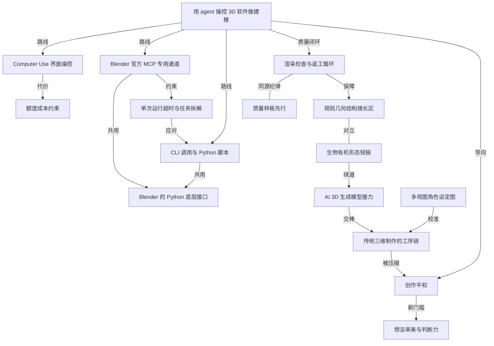

# 用 gpt-6 astra 操控 blender 做 3d：小白入门实测

- 原文标题：用GPT-6 Astra操控Blender玩3D，保姆级教程来了。
- 作者：数字生命卡兹克
- 内参日期：2026-09-09
- 来源类型：公众号
- 原文：https://mp.weixin.qq.com/s?__biz=MzIyMzA5NjEyMA%3D%3D&mid=2647686056&idx=1&sn=c1710404c08cf3201da27f4d53f94940
- 标签：ai 实战, agents, 工具技巧

> 卡兹克把官方 mcp 与 computer use 两条路都跑了一遍，给出安装、配置和三种玩法的踩坑记录。想看 computer use 在真实软件里能干到什么程度，这篇比演示视频实在。

## 导读

gpt-6 astra 操纵 blender 做 3d，小白教程

## 核心观点

- Blender 可能是 GPT-6 Astra 上线后的最大受益者：模型一上线，社区就玩疯了，Blender 的下载量跟着暴增，3D 这个形态"以如此离奇的机遇，进入到了大家的视野里"。
- 本文是一份面向完全不懂建模的小白的实操路径：装好环境后，用大白话把想做的东西描述清楚，就能做出自己的第一个 3D 模型。
- 操控路径有三条——Computer Use（学人类点界面）、Blender 官方 MCP（专用通道）、CLI 调用执行 Python 脚本——它们在效果上差别不大，差别在速度、成本和适用场景。作者的日常推荐是 GPT-6 Astra + Blender MCP + Computer Use 组合。
- 能力有清晰边界：AI 擅长建筑、车辆、机械这类"可以拆成大量规则的几何结构"，一碰到生物、人物就直接垮掉；正解是先用专门的 AI 3D 生成模型出角色，再导入 Blender 接手后续全流程。
- 收尾的判断比教程本身更重要：创作越来越平权，但"人人都可以做了，却不代表，好作品会涌现"——真正拉开差距的会是想法、审美、判断力，以及那点愿意继续折腾下去的好奇心。

## 前期准备：把 agent 接到 3D 软件上

- 账号与客户端：需要一个能用 GPT-6 Astra 的 ChatGPT 账号，以及桌面端 App（网页端不行，因为要操控本机软件）。
- 进入 Codex 模式：打开 ChatGPT 后点左上角的模式切换按钮，从 ChatGPT 切到 Codex（构建、调试和发布）。
- 新建本地项目：点左侧"项目"旁边的加号，项目类型选"本地"——在你的电脑上编辑、运行和测试文件。
- 安装 Blender：直接跟它说"帮我下载和安装好 blender"，Codex 会按你的电脑系统下载对应安装包，实测 1 分 25 秒装完 Blender 5.2.1 LTS，并完成官方签名与公证验证。
- 冷知识：装了 Steam 的话也可以直接从 Steam 里手动下载 Blender。
- Blender 本身的位置：免费、开源的 3D 创作软件，作者认为它已经替代 C4D 成了主流。18 年学 3D 时主流还是 C4D + OC 渲染器，19 20 年 Blender 异军突起，因为开源"完美地吃到了 AI 时代所有的红利"。建模、骨骼、雕刻、材质、灯光、动画、渲染基本全栈都能做。
- 界面劝退是真实的，但不重要：一打开满屏按钮和参数，中间一个经典的 Box——"完全不用慌，Codex 可以直接替我们操作"。

- 还要再装两样东西：
- Blender 官方推出的 MCP——**这里最容易踩坑**：官方已经出了自己的，不要装成社区的三方插件。同样可以让 Codex 直接帮你下载，实测 6 分 28 秒装完官方 MCP 1.0.0，插件已启用、连接测试识别到 26 个工具并成功读取场景。
  - ChatGPT 官方提供的 Computer Use 插件：点左侧"插件"，搜索并安装。

- 权限必须手动打开：点左下角头像进设置，在左侧找到"电脑操控"，把"任意应用"打开；苹果电脑用户还可以打开下面的"锁屏操作"，这样即使电脑进入锁屏状态，Codex 也能继续执行正在进行的任务。

## 三条操控路线：Computer Use、官方 MCP、CLI 脚本

- **第一种：Computer Use——学人类建模。**
- 用法极简：大白话告诉 GPT 用 Computer Use 打开 Blender，再把想做的东西描述清楚；它自己找按钮、移动鼠标、输入参数，一点一点把模型搭出来。
  - 实测任务是"搭建一座完整的北京天坛祈年殿"。提示词写得极细：以官方资料、实景照片和可靠测绘图为参考；殿身、柱梁、斗拱、门窗、彩绘构件、三重檐屋顶、蓝色琉璃瓦、鎏金宝顶、三层汉白玉台基、栏杆、望柱、台阶、石雕和地面**分别建模、保持独立对象、清晰命名**；每完成一批资产就渲染检查，不通过就返工；先精修一组柱梁、斗拱和屋檐作为**质量样板**，通过后再扩展到全场；全程手动点击，不使用代码、脚本或命令行。
  - 耗时前前后后大概 4 个小时，最终做了出来，作者评价"效果我觉得还不错"。
  - 优势是直观：完全跟一个建模师一样操作，人怎么做它就怎么做，你能清楚看到它点了什么、改了什么、卡在了哪里。
  - 最大的问题是贵——"就这一座天坛，直接花掉了我 200 美刀 Pro 会员将近一半的额度"。

- **第二种：Blender 官方 MCP——GPT 和 Blender 之间的一条专用通道。**
- MCP 可以直接读取 Blender 里的场景和物体，并通过底层 API 执行操作，速度通常快很多。
  - 案例一是一辆 2026 Indian Chief Vintage Sturgis SD Edition 摩托车：先查阅真实车辆资料、自行生成一致的多视角参考图，再按真实照片和尺寸建模；先做整车比例、车架、油箱和挡泥板曲面，再补 V 型双缸发动机、辐条轮毂、悬挂、车灯、车把和皮革座椅；主要部件保持独立并清楚命名。
  - 案例二是在现有模型上做一段 10 秒、30fps 的零件组装动画：0—2 秒以车架为基准把主要总成有序悬浮展开，2—7 秒零件按合理顺序分批错峰移动到安装位置，7—10 秒镜头缓慢环绕展示曲面与材质细节；要求动作平滑、有自然的加减速，主要部件与相机轨迹保持可编辑。
  - 踩到的坑：生成动画视频时 MCP 的单次运行超时了。这暴露了 MCP 在处理复杂任务上的约束，解法是把任务拆成更小的步骤一步步完成，或者换用第三种方式。

- **第三种：通过 CLI 调用 Blender，执行 Python 脚本。**
- 这是实际操作中最常调用的方式。
  - 它和 MCP 在底层其实非常接近——两种方法都会使用 Blender 的 Python API，GPT 写好代码后 Blender 再通过 `bpy` 创建模型、添加材质等等。
  - 区别只在进程模型：MCP 更像是连接并控制一个**正在运行的** Blender，CLI 则是**启动一个 Blender 进程**去执行脚本。
  - 其他条件相同时，两种方式最终生成的模型效果不会有特别明显的差距。
- 作者的日常推荐：GPT-6 Astra + Blender MCP + Computer Use 一起用。

## 能力边界：几何体强，生物体弱

- 前面所有成果基本都是几何体，这正是 AI 现在比较擅长干的东西；一旦涉及生物类型，效果就明显变差。
- 反例是让 AI 直接复刻一个金克斯角色，结果"只能说是毫不相干"——这是目前 GPT 直接用 Blender 建模最明显的短板。

- 边界的成因说得很实在：从天坛和摩托车能看出，GPT-6 Astra 更擅长建筑、车辆和机械设备这种"可以拆成大量规则的几何结构"。
- 人物基本是建模里最复杂的，跟几何体的建模方式完全不一样：传统做法是用 Box 大概拉个型，然后直接手动用 ZBrush 雕刻出来——"这个真的就是传统的手工艺活，特别是肌肉的走向，跟老艺术家手工雕刻真的没啥区别"。

## 生物类的正解：3D 生成模型出角色，Blender 接手全流程

- 换路子：想复刻生物类 3D 模型，这一步别用 GPT-6 Astra 去硬操作 Blender，改为借助专门的 AI 3D 生成模型。
- 同一个金克斯，改成让 GPT-6 Astra 操控 Tripo AI 生成角色 3D 模型，再把结果导入 Blender，"这一版的效果，就明显好了很多"。

- 传统影视和游戏流程的完整工序链（这是理解 AI 到底替掉了什么的前提）：
- 建模师对照原画和多角度参考图，把角色的比例、轮廓和细节一点点做出来。
  - 整理拓扑、展开 UV，再制作材质和贴图——做到这里才拥有一个可用的静态角色。
  - 想让它动起来还要做骨骼绑定、刷蒙皮权重，让身体各部位和皮肤跟着骨骼自然变形。
  - 之后才是动画制作：摆姿势、设关键帧，反复调整动作之间的过渡和节奏。
  - "真正耗时间的，往往就是这些又琐碎、又枯燥的基础工作。"
- 牛来妈妈案例按这套流程完整走了一遍。第一步，上传角色原图，让它生成一套统一的多视图设定作为建模参考——要求四面正交全身视图 A-Pose，加上 3/4 视角、脸部近景与四种表情，纯白背景、均匀照明、不添加原图没有的设计。

- 第二步，进入 Blender 做出基本轮廓和身体结构：头部、身体和配件分开建模，完成后自动渲染多角度检查，发现比例错误、破面或穿模就自动返工。实测白模拆成 15 个独立网格，经 12 个视角渲染复查并修复问题。

- 第三步，整理 UV、制作材质再上色，同样按正面侧面背面和 3/4 视角渲染复查，修局部重叠及贴图黑点。
- 第四步，人工介入：做完后觉得眼睛和头部比例还有点问题，又稍微改了一下——这是全流程里罕见的人类判断落点。
- 第五步，静态模型处理得差不多，让它接着用 Rigify 创建并调整骨骼、绑定模型和自动权重，重点修正颈部、肩膀、手肘、手腕、手指、髋部、膝盖、头发和服装的权重，用多个测试姿势检查关节变形、部件脱离和穿模。
- 第六步，处理场景、表情和动画：让它跳段舞，并跟着 BGM 喊妈妈和牛来。
- 结果"属实是有点抽象，但是还蛮好玩的"。作者补了一句实用玩法：上传自己或朋友的照片，让 AI 变成 3D 卡通小手办，再编支舞、安排几个搞怪动作。

## 创作平权，和真正开始拉开差距的东西

- 一个私人参照物：7 年前作者在朋友圈发过一个 3D 作品，参考一位海外艺术家的图，自己一点一点建模贴图渲染，每天下班回家做，做了整整一个月；那天晚上用 OC 渲染了一整个通宵，早上 8 点多发出来。"一个月的时光啊，就为了一张图。"
- 对照今天，这已经"是一个不可思议的念头了"——创作越来越平权，每个人心中有想法，都可以让 AI 去操控软件帮你做出来。
- 现状不粉饰：还很贵、还比较慢，"但是，至少能做出来"。
- 趋势判断有一个可类比的锚：一定会越来越便宜，就像去年我们想象不到 Coding 类的长程任务能做到这么便宜，"当年，做一个 PPT，甚至都需要 20 美金"。
- 最重要的一句转折："人人都可以做了，却不代表，好作品会涌现。"以后真正拉开差距的，会越来越变成你的想法、审美、判断力，还有那点愿意继续折腾下去的好奇心。

## 概念网络

### 关键概念

#### Computer Use 界面操控

**context**：三条操控路线中的第一种，被作者概括为"学人类建模"。你只需要大白话告诉 GPT 用 Computer Use 打开 Blender，把想做的东西描述清楚，"它就会自己找按钮、移动鼠标和输入参数，再一点一点把模型搭出来"。天坛祈年殿的提示词里明确要求"全程通过电脑界面手动点击操作完成建模，不使用代码、脚本或命令行生成模型"。优势是直观、可观察——你能看到它点了什么、改了什么、卡在哪里；代价是贵，一座天坛烧掉 200 美刀 Pro 会员将近一半额度。

**费曼一下**：这是让 AI 像人一样用鼠标键盘操作软件，而不是走后门直接改数据。好处是它能用的功能跟你完全一样，出了问题你肉眼就能看见；坏处是它得一帧一帧地"看屏幕"，又慢又费钱。

#### Blender 官方 MCP 专用通道

**context**：第二种路线，被形容为"GPT 和 Blender 之间的一条专用通道"——可以直接读取 Blender 里的场景和物体，并通过底层 API 执行操作，速度通常会快很多。安装上有明确的踩坑提示：官方已经出了自己的，不要装成社区的三方插件。实测装的是官方 MCP 1.0.0，连接测试识别到 26 个工具并成功读取场景。

**费曼一下**：与其让 AI 隔着屏幕点按钮，不如在软件上开一个专门的接口，让 AI 直接问"场景里现在有什么"、直接说"把这个物体挪到这里"。省掉了看屏幕和找按钮的环节，所以快得多。

#### CLI 调用与 Python 脚本

**context**：第三种路线，也是"在实际操作中，最常调用的方式"。它和 MCP 在底层非常接近——两者都会使用 Blender 的 Python API，GPT 写好代码后 Blender 通过 `bpy` 创建模型、添加材质。区别在于 MCP 更像是连接并控制一个正在运行的 Blender，CLI 则是启动一个 Blender 进程去执行脚本；其他条件相同时，两种方式最终的模型效果不会有明显差距。

**费曼一下**：AI 不去点界面，而是直接写一段程序，让软件照着程序自己把模型生成出来。跟专用通道其实是同一套底层能力，差别只在于是接管一个开着的软件，还是临时开一个来跑完就关。

#### 渲染检查与返工循环

**context**：贯穿所有案例的质量控制机制，写死在提示词里："每完成一批资产就渲染检查，不通过就返工"，并要求从正面、侧面、俯视及局部特写对照参考资料检查造型、位置、比例、材质、悬空及穿模问题。牛来妈妈案例的实测回执给出了具体数字——白模阶段拆成 15 个独立网格、经 12 个视角渲染复查，材质阶段 9 个视角复查通过、21 张贴图内嵌。

**费曼一下**：AI 建模最大的隐患是它"以为"自己做对了。解法是逼它每做完一块就把成品渲染出来自己看一眼，不合格就自己返工——把人类监工的那一步也交给它自己做。

#### 质量样板先行

**context**：天坛提示词里的一条工序纪律："先精修一组柱梁、斗拱和屋檐作为质量样板，通过后再扩展到全场。"它排在"分别建模、保持独立对象、清晰命名、统一比例与材质风格"之后，是控制大规模重复构件质量的前置动作。

**费曼一下**：不要一上来就把一整座建筑全做完再检查，而是先把其中一根柱子、一组斗拱做到满意，用它当标尺，剩下的照着这个标准复制推开。错了只错一个样板，不会错满场。

#### 单次运行超时与任务拆解

**context**：MCP 路线在生成动画视频时踩到的实测约束——"MCP 的单次运行超时了"。作者的判断是"这也刚好暴露了 MCP 在处理复杂任务的一个约束"，解法有二：把任务拆成更小的步骤一步步完成，或者改用 CLI 执行脚本。

**费曼一下**：这条专用通道适合"一次一件事"，一旦交给它一个要跑很久的大活，它会中途被掐断。要么把大活切成小块喂，要么换成能长时间自己跑的方式。

#### 规则几何结构与生物有机形态的能力分界

**context**：全文最重要的边界判断。从天坛和摩托车能看出，GPT-6 Astra"更擅长建筑、车辆和机械设备这种可以拆成大量规则的几何结构"；一旦涉及生物类型，效果就明显变差，复刻金克斯的结果"只能说是毫不相干"。成因是人物"基本就是建模里最复杂的"，传统做法要用 Box 拉型后手动 ZBrush 雕刻，"跟老艺术家手工雕刻真的没啥区别"。

**费曼一下**：能拆成方块、圆柱、重复排列的东西，AI 算得出来；靠手感一刀一刀刻出来的肌肉走向和面部结构，它算不出来。判断一个 3D 任务能不能交给它，先问这东西是"搭"出来的还是"捏"出来的。

#### AI 3D 生成模型接力

**context**：绕开上述短板的具体方案——生物类型"这一步就别用 GPT-6 Astra 去硬操作 Blender"，改为让它操控专门的 AI 3D 生成模型（案例中是 Tripo AI）生成角色 3D 模型，再把结果导入 Blender 处理后续所有流程，"这一版的效果，就明显好了很多"。

**费曼一下**：不要指望一个工具从头做到尾。让擅长"长出一个角色"的模型先把形捏出来，再交给擅长"精修和调度"的软件去做材质、骨骼和动画，各自干各自最强的那一段。

#### 传统三维制作的工序链

**context**：作者特意完整铺开的对照系——建模师对照原画和多角度参考图做比例、轮廓、细节，然后整理拓扑、展开 UV、制作材质和贴图，"做到这里，才拥有了一个可以使用的静态角色"；想动起来还要骨骼绑定、刷蒙皮权重，最后才是摆姿势、设关键帧、调过渡和节奏。关键的一句判断是"真正耗时间的，往往就是这些又琐碎、又枯燥的基础工作"。

**费曼一下**：做一个会动的 3D 角色，从来不是"雕一个像的形状"那么一件事，而是一条长长的流水线。AI 真正吃掉的不是创意，而是这条线上大量重复、枯燥、必须做完才能往下走的活。

#### 多视图角色设定图

**context**：牛来妈妈流程的第一步，也是所有后续工序的共同参照：以原图角色为唯一设计标准，生成四面正交全身视图的 A-Pose 设定图，加上 3/4 视角、脸部近景与中性、闭眼、开心、张嘴四种表情，要求"所有视图必须保持同一角色的脸型、身体比例、发型、服装、颜色和饰品完全一致"，纯白背景、均匀照明、不透视、不遮挡、不添加原图没有的设计。

**费曼一下**：先给角色拍一套标准证件照——正面、侧面、背面、俯仰、各种表情，全部按同一个标准。后面不管谁来建模、AI 建了几轮，都拿这套图当唯一答案对照，才不会越做越跑偏。

#### 创作平权与新的差距

**context**：全文的收尾判断，用 7 年前的私人经历做锚：一张 3D 作品每天下班回家做、做了整整一个月，最后通宵渲染，"一个月的时光啊，就为了一张图"，而今天这已经"是一个不可思议的念头了"。现状是"还很贵，还比较慢，但是，至少能做出来"，趋势用 Coding 长程任务和"当年做一个 PPT 甚至都需要 20 美金"作类比。最锋利的一句是："人人都可以做了，却不代表，好作品会涌现。"

**费曼一下**：门槛塌掉之后，会做的人一下子变多了，但作品好不好的差距不会因此消失，只会换个地方出现——从"你会不会用软件"变成"你想做什么、你觉得什么才叫好、你愿不愿意继续折腾"。

### 概念网络

整篇文章的思想结构可以从一个中心命题展开：**让 agent 去操控专业 3D 软件**。这个命题往下分出三条并列的实现路线——Computer Use 界面操控、Blender 官方 MCP 专用通道、CLI 调用执行 Python 脚本。三者不是三种能力，而是三种接入方式：MCP 和 CLI 共用同一个底层（Blender 的 Python 接口），差别只在"接管一个正在运行的软件"还是"启动一个进程跑完就关"；Computer Use 则完全不走底层，改走人类那条路——找按钮、移鼠标、填参数。

三条路线各自被一个约束拉住，这是全文最有实用价值的一层关系。Computer Use 被**成本**拉住：一座天坛烧掉 200 美刀会员将近一半额度，直观和可观察是拿钱换来的。MCP 被**单次运行时长**拉住：生成动画时直接超时。而超时这个约束恰好把读者推回第三条路线——CLI 因为是独立进程执行脚本，天然更适合长任务。于是三条路线不是并列备选，而是互相补位的关系，这也解释了作者为什么最终推荐把 MCP 和 Computer Use 组合起来用。

横切三条路线的，是一组与"用什么通道"无关的**工序纪律**：每完成一批资产就渲染检查、不通过就返工，以及先精修一组构件当质量样板、通过后再扩展到全场。这两条同源——都是把"验收"这件事前移并交给 AI 自己做。它们是几何体路线能跑通的真正原因：AI 建模的风险不在于生成不出来，而在于生成得不对却不自知，渲染复查循环把这个风险按住了。

再往下是一条清晰的**能力边界线**：规则几何结构（建筑、车辆、机械）与生物有机形态（人物、角色）构成对立关系。这条线不是速度或成本问题，而是方法论问题——前者能被拆成可枚举、可参数化的构件，后者靠的是雕刻式的手感。边界之外不是死路，而是绕道：让 AI 3D 生成模型先把角色形体生成出来，再交棒给 Blender 承接后续全部工序。多视图角色设定图在这里起校准作用——它给整条生物类流水线提供了唯一参照标准，让每一轮建模、上色、绑定都有得对照。

最后一层是**价值判断**。传统三维制作的工序链（建模、拓扑、UV、材质、绑定、蒙皮、动画）在这套玩法下被大幅压缩，那些"又琐碎又枯燥的基础工作"正是 AI 吃掉的部分，这直接导向创作平权：一个月做一张图变成了一次对话。但网络到这里出现最后一个转折——平权只消灭了执行门槛，并不生产好作品，于是差距的位置发生迁移，从"会不会用软件"移到"想法、审美、判断力和继续折腾的好奇心"。这个收尾与开篇的中心命题构成闭环：技术把手艺变便宜了，剩下值钱的只有判断。

## 费曼 x3

工具变简单的时候，人们通常先高兴，然后才发现问题被搬了家。一个完全不懂建模的人，现在真的可以对着聊天框说一句"帮我搭一座天坛祈年殿"，四个小时后看到三重檐、蓝琉璃瓦和三层汉白玉台基长在屏幕上。这件事在 3D 这个行当里的震撼程度，得对照一下从前才知道——同一个人七年前做一张 3D 图，每天下班回家做，做了整整一个月，最后通宵渲染，早上八点多发出来。一个月的时光，就为了一张图。

但真正值得学的不是"能做出来"，而是**它是怎么被做对的**。这套玩法里最不起眼、也最容易被跳过的一句话是：每完成一批资产就渲染检查，不通过就返工；先精修一组柱梁、斗拱和屋檐作为质量样板，通过后再扩展到全场。AI 建模的风险从来不是生成不出东西，而是它生成了一堆穿模、悬空、比例失真的东西却自以为完成了。把验收前移，逼它每做完一块就渲染出来自己看一眼——这才是让四小时的自动化不变成四小时垃圾的那道闸。这条纪律跟 3D 没什么关系，凡是把长任务交给 agent 的场景都成立。

第二件值得带走的是边界感。同一个模型，做建筑、车辆、机械设备时惊艳，做人物时"只能说是毫不相干"。原因不在算力，在方法论：前者能拆成大量规则的几何结构，后者是过去要用 Box 拉个型再手动一刀一刀雕出来的手工艺活，肌肉走向跟老艺术家雕刻没什么区别。所以判断一个任务该不该交给它，问一句就够了——这东西是"搭"出来的还是"捏"出来的。搭的交给它，捏的换条路：让专门的 3D 生成模型先把形长出来，再导进软件接手材质、骨骼和动画。不指望一个工具从头做到尾，是这一年里最省力的一条经验。

最后那句转折比整篇教程都锋利：人人都可以做了，却不代表，好作品会涌现。门槛塌掉的时候，差距不会消失，它只是换个地方重新长出来。过去拦住人的是"你会不会用这个软件"，往后拦住人的是你的想法、你的审美、你判断一个东西好不好的能力，还有那点愿意继续折腾下去的好奇心。技术把手艺变便宜了，于是剩下值钱的只有判断。这既是个好消息，也是个更难交差的要求——从前你可以用一个月的辛苦证明自己在乎，现在你只能用结果。
