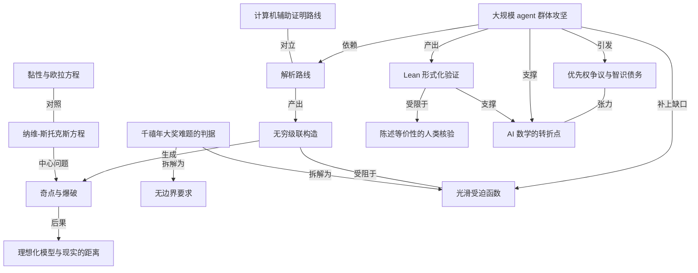

# 《量子杂志》：如何组织一万个 agent 攻破千禧年难题？

- 原文标题：AI Has Solved One of Math’s $1 Million Millennium Prize Problems
- 作者：Quanta Magazine
- 内参日期：2026-09-09
- 来源类型：blog
- 原文：https://www.quantamagazine.org/ai-has-solved-one-of-maths-1-million-millennium-prize-problems-20260908/
- 标签：agents, 数学

> quanta 把事件、方法和数学界的反应放在一起讲，是目前对「一万个自主 agent 在人的指导下工作」这个组织形态说得最清楚的一篇。

## 导读

来自《量子杂志》的解读

## 核心观点

- 2026 年 9 月 8 日上午，OpenAI 的数学家宣布：一万个自主 AI agent 在他们的指挥下、运行在一个未对公众开放的先进模型上，找到了三维纳维-斯托克斯方程的一个「奇点」，从而解决了 2000 年由克雷数学研究所提出的六个未决千禧年大奖难题之一——每一个都悬赏一百万美元。这个结果已经用 Lean 语言完成形式化验证，数学家因此有信心它确实成立。
- 如果结果经得起进一步审视，它以显著优势成为迄今由人工智能模型得到的最重要的数学证明，可能标志着数学家攻坚难题方式的一个根本转折点。
- 但真正的思想主角不是 agent。两条 AI 路线都重度依赖马德里数学科学研究所的 Diego Córdoba 和 CUNEF 大学的 Luis Martínez-Zoroa——这两位研究者发展出的攻坚策略，与绝大多数数学家正在使用的方法激进地分道扬镳。撰写克雷研究所官方问题描述的普林斯顿数学家 Charles Fefferman 说，故事的英雄是他们两人。
- AI 补上的是最后一块工程性的拼图，而不是整条思路：把「无穷级联」构造改造成既产生奇点、又保持受迫函数光滑的形态。
- 这场胜利同时带来了一地鸡毛：优先权归属混乱、时间线互相打架、当事人自嘲论文「只能被称为 AI 垃圾稿」，以及一个尚未消散的怀疑——OpenAI 的研究者或其 agent，是否接触并受益于对手用 OpenAI 模型做出的工作。

## 宣布：一万个 agent、88 小时、几百万美元

- OpenAI 用一个新的内部模型，部署不同规模的自主 agent 群去攻击欧拉方程与纳维-斯托克斯问题的各种变体。公司在新闻稿中写道：「将近 100 个 agent 协作了大约 50 小时，产生了我们的欧拉正则性反证。」
- 随后他们把规模拉到一万个左右的 agent 去攻纳维-斯托克斯。88 小时后，运行在内部模型上的 agent 拿到了纳维-斯托克斯奇点的证明；再花 17 小时，另一个 AI 模型把结果形式化。整个过程中，agent 之间互相发送了将近 500 万条消息。OpenAI 的 Sébastien Bubeck 估计，计算成本在几百万美元量级。
- 12 小时之前，纽约大学的 Tristan Buckmaster 已经宣布，他与 Anthropic 的 Levent Alpöge 借助包括 OpenAI 在内的多种 AI 模型，解决了若干密切相关的问题。
- OpenAI 承认，他们对纳维-斯托克斯的这轮工作，正是被「Alpöge 和 Buckmaster 已经解决了一个千禧年难题」的传言所激发的——而那对搭档其实还差一点：他们有的是一个未经验证的、针对稍微容易一些的纳维-斯托克斯版本的爆破证明。

## 这个问题究竟难在哪

- 微分方程表达变化量之间的关系，可以说是解释我们周遭世界的最重要的单个数学工具。它们的通例是：容易写下来，难解开。
- 纳维-斯托克斯方程用牛顿第二定律描述流体行为，从洋流到气流都适用，写下于 19 世纪中叶，此后一直是流体力学研究的核心。但有一个基本问题始终悬而未决：它的解是否永远「行为良好」？还是说，解可以随时间演化到某个无穷小的流体部分开始以无限快的速度流动——也就是所谓的奇点？
- 这个问题的现实意义不在应用。方程假定你可以对流体无限放大、考虑无穷小的量，而真实世界不是这样：流体终究由分子和原子构成，并不完美光滑。所以关于奇点形成的数学结果没有任何直接的实践后果。
- 它重要，恰恰因为「即使在理想化意义上，这样的奇点也可能存在」这件事本身出人意料。它告诉我们：牛顿第二定律看上去多么直截了当，一旦应用到流体上，其后果却深刻地违反直觉。换个说法：湍流比它看起来还要古怪。
- 纳维-斯托克斯方程考虑了流体可以有黏性（也就是摩擦）：蜂蜜黏度高、流得慢，水黏度低、流得快。一组更简单的相关方程——欧拉方程——描述零黏性、无摩擦的流体。两组方程关系紧密，研究者常常并行处理；但哪怕引入无穷小量的摩擦，都会让流体的行为方式发生深刻改变。

## 从 2013 到 2023：奇点信念的十年变迁

- Córdoba 回忆：「十年前，没人相信纳维-斯托克斯存在奇点」——尽管许多人相信欧拉方程允许奇点。
- 转折始于 2013 年。加州理工的 Thomas Hou 与如今任教于香港恒生大学的 Guo Luo 得出一个开创性结果：在一个圆柱体内，如果上下两半以相反方向旋转，欧拉方程可以「爆破」。Córdoba 说：「那是第一个真正严肃的奇点主张。」
- 此后几年一系列结果（包括 2019 年的一篇论文）让数学家开始认为：不仅欧拉方程可能有奇点，纳维-斯托克斯也许同样如此。
- 从那里走到今天，还有几个智识台阶要迈：
- 边界问题。千禧年版本问的是在向各个方向无限延伸的三维空间中会发生什么；而像 2013 年圆柱那样的早期结果，都预设了某个边界的存在。Fefferman 认为无边界的情形才在数学上有意思：有边界时，找到奇点「只是告诉你流体可以靠与边界的相互作用形成奇点——而没有边界时，是流体自己在干这些疯狂的事」。
  - 受迫问题。让流体运动的力可以是重力这样自然的东西，也可以是螺旋桨这样的人为干预，数学家用「forcing」这一技术来建模。人们有时会引入别扭、笨拙的受迫函数，好让流体做出奇怪的举动；但千禧年版本问的是：当受迫函数在数学上行为良好、也就是「光滑」时，会发生什么。

## 两条路线：计算机辅助 vs 纯解析

- Hou 与 Luo 在 2013 年的圆柱结果里，用计算机模型模拟了一个可能导致欧拉方程爆破的场景，然后通过在计算上核算所有潜在误差来证明爆破确实发生。此后多年，类似技术成为攻击欧拉与纳维-斯托克斯问题的主流方式。
- 但 Martínez-Zoroa 在他 2021 年的博士论文中，开创了完全不依赖计算机的解析技术。这让他和他的导师 Córdoba 一起，成了这个领域里的怪人。2023 年，两人证明了带有一个凌乱受迫函数的某个欧拉方程版本存在奇点。
- Córdoba 爱开的玩笑是：「我不用 AI：我有 Luis。」Martínez-Zoroa 补充说，两人都不是反对 AI，只是「直到相当晚近，我试着把它用于自己的工作时，它和我的工作流配合得并不好。我显然得适应了」。
- 他们技术的大致轮廓：构造一个无穷的「层」序列，每一层都是所研究方程的一个非奇异解；然后把这些解按 Martínez-Zoroa 所说的「无穷级联」方式组合起来，产生一个新解。
- 这个新解含有他们想要的奇点。但麻烦在于：尽管每一层单独依赖的都是光滑受迫函数，把它们组合到一起却会让受迫函数具有不良的数学性质。这正是他们的解未能满足千禧年大奖判据的原因。
- 剩下的那道坎因此被精确定义了出来：如何造出一个类似的无穷级联，让它不仅产生奇点，还同时保持受迫函数光滑。这一步，正是两个互相竞争的 AI 团队看上去都取得了成功的地方。

## 形式化验证：确定性的边界在哪

- 自这个夏天开始，AI 驱动的数学研究就进入了某种狂飙状态：主要来自 OpenAI 和 Anthropic 的大语言模型，被用来在许多数学领域取得证明。
- 这些结果常常伴随形式化证明——依靠 Lean 语言，以密不透风的确定性确立一个陈述必然为真。
- 但确定性有边界：仍然必须由人类完成的那个关键验证环节，是保证「在 Lean 中被证明为真的那个陈述」与「数学家原本想证明的东西」在逻辑上等价。机器保证推理无误，人类保证问的是对的问题。
- Buckmaster 与 Alpöge 的路径也印证了这套组合。Buckmaster 在声明中说：「过去一年的大部分时间里，进展缓慢。」但到 8 月 22 日，他们已经拿到了欧拉方程的 Lean 验证证明。他也毫不客气地记下了过程的真实质地：「我可以说，Levent 发给我的第一个 LLM 生成的证明，是我读过的最可怕的东西。」

## 争议：优先权、AI 垃圾稿与智识债务

- 整个夏天，这场竞争即便称不上友好，至少还没有公开撕破脸。这在最后 24 小时里变了。
- Buckmaster 在 9 月 7 日周一午夜前分享了声明。他和 Alpöge 原本计划继续打磨一个更优雅的写法，但在他们的进展走漏到 OpenAI 之后，他们感到必须提前时间表。Buckmaster 为此惋惜地说，他们发布的三篇论文里有一篇「只能被称为 AI 垃圾稿。我为此感到抱歉」。
- 截至发稿时，Buckmaster、Alpöge 与 OpenAI 之间互动的细节仍然扑朔迷离——对话的不同当事方给出了不同版本。
- 优先权的切分是这样的：OpenAI 把三维欧拉结果的优先权让给 Buckmaster 和 Alpöge，同时为纳维-斯托克斯结果主张优先权。而在 Buckmaster 的声明中，他似乎暗示 OpenAI 的研究者或他们的 AI agent，可能接触到并受益于他和 Alpöge 使用 OpenAI 模型所做的工作。
- 理清谁在什么时候做了什么，以及理解这些新 AI 证明的数学意义，都还需要时间——即便它们已经通过形式化验证。
- 但有一件事是清楚的：对 Córdoba 和 Martínez-Zoroa 的智识债务。Martínez-Zoroa 说：「我为 Tristan 感到非常高兴。要是能由我们自己做成会更好，但我真心为他高兴。」Buckmaster 则在声明中直言：「让我把私下对同事说过的话摆到明面上：鉴于这一整体工作，我认为 Luis Martínez-Zoroa 配得上一枚菲尔兹奖。」

## 概念网络

### 关键概念

#### 千禧年大奖难题

**context**：2000 年由克雷数学研究所提出的七个难题，每个悬赏一百万美元；纳维-斯托克斯是其中六个「remaining」未决问题之一。它的关键作用不在奖金，而在于它把一个模糊的物理直觉钉成了一份精确的判据清单——无边界的三维空间、光滑的受迫函数——从而使「解决了」与「还差一点」之间有了可裁决的分界线。

**费曼一下**：这就像一份写死了验收标准的悬赏令。别人可以在稍微放宽的条件下先做出成果，那也是真成果，但要拿走那一百万，就必须一条不落地满足清单上的每个条件。文中 Alpöge 和 Buckmaster「其实还差一点」，差的正是清单上的条款，而不是聪明程度。

#### 纳维-斯托克斯方程

**context**：19 世纪中叶写下的微分方程，用牛顿第二定律描述从洋流到气流的流体行为，此后一直是流体力学研究的核心。原文用它举例说明微分方程的通性——「容易写下来，难解开」。

**费曼一下**：一条把「力等于质量乘加速度」翻译到流动的水和空气上的规则。规则本身写在一张纸上就够了，但从这条规则推出流体一百年后会怎么流动，人类至今没能完全搞明白。

#### 奇点与爆破

**context**：文章的中心问题是纳维-斯托克斯的解是否「永远行为良好」，还是可以演化到某个无穷小的流体部分开始以无限快的速度流动。数学家把这种现象口语化地称为「blow up」，爆破。

**费曼一下**：想象一锅水，越搅越急，然后某个小到没法再小的点上，水速冲到了无穷大。现实里不会这样，因为水是由分子构成的、不能无限细分；但方程本身没有这道防线。发现方程允许这种事，意味着我们用来描述世界的那条规则，其内部逻辑比我们以为的野得多。

#### 理想化模型与现实的距离

**context**：原文明确指出，奇点结果「没有任何直接的实践后果」，因为真实流体由分子和原子构成、并不完美光滑。它的重要性在于「即使在理想化意义上这样的奇点也可能存在」这件事出人意料——湍流比它看起来还要古怪。

**费曼一下**：数学模型的价值不总在于预测明天的天气。当一个我们信任了一百多年的模型被证明会在内部产生荒谬结果时，我们学到的是自己对这个世界的理解在哪里出了缝——即使那道缝在现实中永远不会张开。

#### 黏性与欧拉方程

**context**：纳维-斯托克斯考虑了流体的黏性（摩擦），蜂蜜黏度高流得慢、水黏度低流得快；欧拉方程则描述零黏性无摩擦的流体。两者关系紧密，研究者常常并行推进，但原文强调：哪怕引入无穷小量的摩擦，都会让流体行为发生深刻改变。

**费曼一下**：把摩擦从零调到「几乎为零」，不是把难度调高一点点，而是换了一个问题。这正是为什么欧拉方程先被攻破、纳维-斯托克斯还要再等，以及为什么 OpenAI 甘愿把欧拉的优先权让出去、只争纳维-斯托克斯的那一份。

#### 边界条件

**context**：千禧年版本问的是向各方向无限延伸的三维空间，而 2013 年圆柱那样的早期结果都预设了边界。Fefferman 的判断是：有边界时奇点只说明「流体可以靠与边界的相互作用形成奇点」，而没有边界时，「是流体自己在干这些疯狂的事」。

**费曼一下**：把水放进一个杯子里搅出漩涡，你分不清是水本身的性质在作怪，还是杯壁在帮忙。要证明水自己就足够疯狂，你必须把杯子拿掉。

#### 受迫函数与光滑性

**context**：数学家用「forcing」建模驱动流体运动的力，可以是重力也可以是螺旋桨。人们有时会引入别扭笨拙的受迫函数来逼出奇怪行为，但千禧年版本要求受迫函数在数学上行为良好、也就是光滑。Córdoba 与 Martínez-Zoroa 2023 年的结果正是卡在这一条上。

**费曼一下**：这相当于比赛规定「只能用正常的手推」。你可以用一根形状怪异的搅棒把水搅出奇点，但那证明不了什么——因为怪的可能是搅棒不是水。要求光滑，就是要求你只用最普通的力，也能把水逼出奇点。

#### 无穷级联构造

**context**：Córdoba 与 Martínez-Zoroa 技术的核心轮廓——构造一个无穷的「层」序列，每层都是方程的非奇异解，再按 Martínez-Zoroa 所说的「无穷级联」组合成新解。新解含有奇点，但组合动作本身会破坏受迫函数的良好性质。

**费曼一下**：每一层单独看都规规矩矩，但把无穷多层叠在一起，就在极限处逼出了一个规矩不了的点。麻烦在于叠加这个动作有副作用：单层用的力都很温和，叠完之后合力却变得面目狰狞。最后一步的全部难度，就是让叠加不产生这个副作用。

#### 计算机辅助证明与解析路线的分野

**context**：Hou 与 Luo 用计算机模拟场景、再通过在计算上核算所有潜在误差来完成证明，此后类似技术成为主流攻击方式。Martínez-Zoroa 在 2021 年博士论文中开创了完全不依赖计算机的解析技术，这让他和导师 Córdoba 成了领域里的「怪人」。

**费曼一下**：一派人用机器穷举并把误差全部框住，另一派人靠纸笔推理。有意思的是，最终被 AI 补完的恰恰是那条不用机器的解析路线——正是因为它在结构上留下了一个定义明确的缺口，机器才知道自己该往哪里使劲。

#### Lean 形式化验证

**context**：OpenAI 的结果在 Lean 中完成形式化检查，让数学家有信心它确实正确；整个夏天的 AI 数学成果也常常伴随形式化证明，以「密不透风的确定性」确立陈述为真。

**费曼一下**：把证明的每一步都翻译成机器能逐条核对的语言，机器点头，你就不必再担心中间有隐藏的逻辑漏洞。这是应对「AI 写出的证明人类读不动」这一新麻烦的直接解药。

#### 陈述等价性的人类核验

**context**：原文点明形式化验证的确定性边界——仍必须由人类完成的关键环节，是保证在 Lean 中被证明为真的陈述，与数学家原本想证明的东西在逻辑上等价。

**费曼一下**：机器能保证答案配得上题目，但不能保证题目就是你想问的那道。这个缺口无法自动化，因为它连接的是形式系统与人类意图——而后者不在形式系统里面。

#### 大规模 agent 群体攻坚

**context**：近 100 个 agent 协作约 50 小时产出欧拉正则性反证；约一万个 agent 攻纳维-斯托克斯，88 小时得证明、再 17 小时由另一模型完成形式化，agent 之间发送了将近 500 万条消息，Bubeck 估算算力成本在几百万美元量级。

**费曼一下**：这不是「一个更聪明的模型」，而是「一个可以按需扩编的研究所」。数量、时长、消息量、美元额度都是可调旋钮，而人类研究团队的规模不是。它把数学攻坚的一部分变成了一件可以用预算换进度的事。

#### 智识债务与优先权

**context**：两条 AI 路线都重度依赖 Córdoba 与 Martínez-Zoroa 的策略；OpenAI 把三维欧拉的优先权让给 Buckmaster 和 Alpöge、为纳维-斯托克斯主张优先权；Buckmaster 则暗示对方可能接触并受益于他们用 OpenAI 模型所做的工作。文末的定论是：智识债务清清楚楚。

**费曼一下**：谁先按下发布键是一件事，思路是谁的是另一件事。当工具由竞争对手提供、当思路来自第三方、当宣布时间被传言挤压，署名这件传统上不言自明的事就变成了需要各方公开辩论的事。

#### AI 垃圾稿

**context**：Buckmaster 因进展走漏而提前时间表，为此惋惜地说他们发布的三篇论文里有一篇「只能被称为 AI 垃圾稿」；他也直言 Alpöge 发来的第一个 LLM 生成证明是他读过最可怕的东西。

**费曼一下**：正确和可读是两件事。机器能给你一个逻辑上无懈可击但人类无法消化的东西，把它整理成同行读得下去的文章仍然是人的活儿——而竞争压力恰恰会挤掉这道工序的时间。

### 概念网络

- 整篇文章的骨架是一条「问题—判据—路线—补完—争议」的链条，而不是一则单纯的 AI 成就报道。
- 最上游是物理与数学的张力：纳维-斯托克斯方程用一条朴素的力学定律描述流体，中心问题是它的解会不会爆破出奇点。零黏性的欧拉方程与它构成一组对照——两者只差一个无穷小的摩擦，行为却深刻不同，这道细缝解释了为什么欧拉先被攻破而纳维-斯托克斯要更晚。奇点的意义则向下游延伸到理想化模型与现实的距离：它没有实践后果，价值全在于揭示我们信任的模型内部有多反直觉。
- 中段是判据把模糊问题变成可裁决问题的过程。千禧年判据拆成两个具体条件——无边界、受迫函数光滑——正是这两个条件把「几乎做到」和「真正做到」分开。Fefferman 关于边界的判断说明了无边界为什么在数学上更有意思；而光滑性这一条，恰恰是解析路线卡住的地方。
- 两条攻坚路线构成本文最重要的一组对立：Hou 与 Luo 开创的计算机辅助路线是主流，Martínez-Zoroa 与 Córdoba 的纯解析路线是异类。有意思的是，最终被机器补完的是那条不用机器的路线——无穷级联构造既能生成奇点，又在受迫函数光滑性上留下了一个定义明确的缺口，AI 的贡献正落在这个缺口上，而不是覆盖整条思路。
- 下游是新的生产方式及其代价。一万个 agent、88 小时、500 万条消息、几百万美元算力，把数学攻坚的一部分变成了可以用预算换进度的事；Lean 形式化验证为这种产出提供了信任基础，但它的确定性止于陈述等价性这道人类核验，机器保证推理无误，人类保证问的是对的问题。
- 最外层是社会性后果：同一批工具同时服务于竞争双方，传言挤压了发布节奏，优先权与智识债务的切分变成了公开辩论。转折点与争议在文中是一体两面——正是因为它可能是真正的转折点，谁的思路、谁的功劳才第一次变得如此难以自动裁决。

## 费曼 x3

一万个 agent、88 小时、500 万条互相发送的消息、几百万美元算力——这些数字很容易被读成一则关于规模的新闻。但这个故事真正有意思的地方，是它把数学发现拆成了两半，而机器只拿走了其中一半。

拿走的那一半，形状极其清晰。Córdoba 和 Martínez-Zoroa 用完全不依赖计算机的解析技术，构造出一个无穷的「层」序列，每一层都是方程的非奇异解，再把它们叠成一个「无穷级联」。新解含有他们想要的奇点，可惜每层单独用的力都温和，叠完之后的合力却变得面目狰狞——受迫函数不再光滑，于是与百万奖金的判据擦肩而过。剩下的那道坎因此被精确地定义了出来：造一个类似的级联，让它既产奇点、又保持光滑。有人把靶子立在那里，机器才知道该往哪里使劲。这也解释了一个反讽：被 AI 补完的，恰恰是那条骄傲地不用 AI 的路线。「我不用 AI：我有 Luis」，这句玩笑现在读来像是这个故事的题词。

另一半机器拿不走，而且很可能永远拿不走。Lean 能以密不透风的确定性确立一个陈述为真，但仍然必须由人来保证：在 Lean 里被证明为真的那个陈述，和数学家原本想证明的东西在逻辑上等价。机器保证推理无误，人保证问的是对的问题——这道缝无法自动化，因为它一端连着形式系统，另一端连着人类意图，而后者根本不住在形式系统里。

代价也已经露头。Buckmaster 说他读过的第一个 LLM 生成的证明「是我读过的最可怕的东西」，又为提前发布的论文道歉，说其中一篇「只能被称为 AI 垃圾稿」。正确和可读是两件事，把机器的产出整理到同行读得下去，仍然是人的工序——而竞争压力最先挤掉的恰恰是这道工序的时间。更棘手的是署名：同一批模型同时服务于竞争双方，传言在系统里流动，谁受益于谁的工作变成了一场各说各话的公开辩论。

值得记住的或许不是奖金归属，而是那条被这个结果照亮的旧真理：即使在牛顿第二定律这样朴素的规则里，湍流也比它看起来还要古怪。方程允许流体在某个无穷小的点上流到无限快，现实中不会发生——真实的水由分子构成，不能无限细分——但这道裂缝暴露的是我们对世界的理解在哪里还没接上。机器帮我们更快地走到了那道裂缝跟前，至于该盯着哪里看，仍然要人来指。

## 阅读原文

AI Has Solved One of Math’s $1 Million Millennium Prize Problems

_By _ [Konstantin Kakaes](https://www.quantamagazine.org/authors/konstantin-kakaes/)

_September 8, 2026_

Mathematicians at OpenAI showed that the Navier-Stokes equations, which describe how fluids flow, can sometimes “blow up.” But the massive result is not without controversy.

The proof of a “blowup” has blown up the mathematics community. iStock

On the morning of Tuesday, September 8, mathematicians at OpenAI announced that a group of 10,000 autonomous AI agents under their direction, running on an advanced model not available to the public, had found a “singularity” in the Navier-Stokes equations in three dimensions — thus resolving [one of the six remaining](https://www.claymath.org/millennium/navier-stokes-equation/) Millennium Prize Problems posed in 2000 by the Clay Mathematics Institute, each of which carries a $1 million prize. Their result has been formally checked in the programming language Lean, giving mathematicians confidence that it is indeed correct.

If the result holds up to further scrutiny, it is, by a significant margin, the most important mathematical proof to have been arrived at by an artificial-intelligence model to date, possibly marking a fundamental turning point in how mathematicians tackle difficult problems.

This particular difficult problem deals with differential equations, which express relationships between changing quantities. They are arguably the single most important mathematical tool for explaining the world around us. As a rule, they are easy to write down and hard to solve.

The Navier-Stokes equations are differential equations that use Newton’s second law of motion to describe how fluids, from ocean currents to air flows, behave. They were first written down in the mid-19th century, and have been central to the study of fluid mechanics ever since. But one basic question about the equations has persisted: Are their solutions always well-behaved? Or can their solutions evolve over time so that some infinitesimally small part of the fluid begins to flow infinitely quickly, creating a so-called singularity?

The OpenAI announcement of this long-sought singularity came 12 hours after an announcement from [Tristan Buckmaster](https://cims.nyu.edu/~tristanb/) at New York University that he, together with Levent Alpöge at Anthropic, had [resolved several closely related problems](https://mastodon.social/@tristanbuckmaster/117233413705701198) with help from a variety of AI models, including those of OpenAI.

Both AI-enabled teams relied heavily on work by [Diego Córdoba](https://www.icmat.es/people/dcordoba/) of the Institute for Mathematical Sciences in Madrid and [Luis Martínez-Zoroa](https://www.cunef.edu/en/faculty-and-research/martinez-zoroa-luis/) of CUNEF University, researchers who had developed a strategy to attack the problem that radically departed from the methods most mathematicians were using.

“I was thrilled that the problem was solved,” said [Charles Fefferman](https://www.math.princeton.edu/people/charles-fefferman) of Princeton University, who wrote the Clay Institute’s [official description](https://www.claymath.org/wp-content/uploads/2022/06/navierstokes.pdf) of the Navier-Stokes problem. The heroes of the story, he said, are Córdoba and Martínez-Zoroa. As Buckmaster wrote in a statement announcing his results, “Let me make plain what I have said to colleagues in private: in view of this body of work, I believe Luis Martínez-Zoroa deserves a Fields Medal.”

### One Singular Sensation

The Navier-Stokes equations rely on the assumption that you can zoom in on a fluid, considering endlessly smaller amounts of it. The real world is not like this: Fluids are ultimately made of molecules and atoms. They are not perfectly smooth. This means that the mathematical results about the formation of singularities don’t have any immediate practical consequences. However, those results are important because it’s surprising that such singularities are possible even in an idealized sense. It tells us that, straightforward as Newton’s second law appears to be, its consequences when applied to fluids are profoundly counterintuitive. Put another way: Turbulence is even weirder than it appears to be.

The Navier-Stokes equations account for the fact that fluids can have viscosity, or friction. (Fluids with more viscosity, like honey, flow slowly, while those with less viscosity, like water, flow more quickly.) A simpler, related set of equations called the Euler equations describe fluids with zero viscosity, which flow without friction. The two sets of equations are closely related — researchers often work in parallel on both. But introducing even an infinitesimal amount of friction causes a fluid to behave in a profoundly different way.

OpenAI’s solution is a vortex, visualized here, where yellow represents a faster rotation speed and blue slower.

“Ten years ago, nobody believed there was a singularity for Navier-Stokes,” said Córdoba — though many believed that the Euler equations did admit a singularity. This began to change in 2013, when [Thomas Hou](https://www.cms.caltech.edu/people/hou) of the California Institute of Technology and [Guo Luo](https://msi.hsu.edu.hk/en/staff/dr-luo-guo/), now at the Hang Seng University of Hong Kong, derived a groundbreaking result showing that the Euler equations [can “blow up,”](https://www.quantamagazine.org/for-fluid-equations-a-steady-flow-of-progress-20200113/) as mathematicians like to say, in a cylinder if the top and bottom halves are set spinning in opposite directions. “That’s the first really serious claim of singularity,” Córdoba remembered. Over the next few years, [a series of results](https://www.quantamagazine.org/famous-fluid-equations-spring-a-leak-20191218/) including a [2019 paper](https://arxiv.org/abs/1904.04795) got mathematicians thinking that not only might the Euler equations have singularities, but that Navier-Stokes might as well.

There are a few intellectual steps to get from there to the present day. The first is the question of a boundary. The Millennium Prize version of the problem asks what happens in three-dimensional space that extends indefinitely in all directions. Earlier results, like the 2013 cylinder one, posit the existence of some boundary. These are useful intermediate findings, but the case without a boundary is mathematically interesting, according to Fefferman, because in models with a boundary, finding a singularity “tells you the fluid can form a singularity thanks to its interaction with the boundary — but without a boundary it’s the fluid doing the crazy stuff.”

The next major step involves modeling the forces that cause fluids to move. These could be something as natural as gravity pulling the fluid downwards, or an artificial intervention like a propeller. Mathematicians model these forces with a technique called “forcing.” They’ve sometimes tried to introduce awkward, ungainly forcing functions to get fluids to behave in odd ways. But the Millennium Prize version of the problem asks what can happen when the forcing function is mathematically well-behaved, or “smooth.”

In their 2013 cylinder result, Hou and Luo used computer models to simulate a scenario that might lead the Euler equations to blow up. They then proved that blowup does occur by computationally accounting for all potential errors. In the years since, similar techniques have become the dominant mode of attack on the Euler and Navier-Stokes problems.

But in his 2021 doctoral dissertation, Martínez-Zoroa pioneered analytic techniques that don’t rely on computers at all. This made him, along with Córdoba, his doctoral adviser, an oddball in the area. By 2023, the pair had [proved that a version](https://arxiv.org/abs/2309.08495) of the Euler equations with a messy forcing function displayed singularities.

Córdoba likes to joke: “I don’t use AI: I have Luis.” Martínez-Zoroa added that it’s not that either of them is opposed to AI, but that “up to relatively recently, when I tried to use it for my own work, it didn’t match very well with my workflow. I’ll have to adapt, clearly.”

In broad outline, the pair’s technique relies on creating an infinite sequence of “layers,” each of which is a non-singular solution to the equation they are studying. (They’ve applied similar techniques to both the Euler and Navier-Stokes equations, as well as to other related systems.) They then combine those solutions in what Martínez-Zoroa calls an “infinite cascade” to produce a new solution.

That new solution, they showed, contains the desired singularity. However, even though each individual layer relies on a smooth forcing function, combining them together can cause the forcing function to have undesirable mathematical properties. That’s why their solution fell short of satisfying the Millennium Prize criteria. The remaining hurdle was to figure out how to create a similar infinite cascade that resulted not only in a singularity, but also in a smooth forcing function.

That’s the step that both competing AI groups appear to have had success with.

### One Thrilling Combination

As Córdoba and Martínez-Zoroa were working on their techniques, AI-derived math research has been on something of a binge. Since the beginning of the summer, large language models, primarily from OpenAI and Anthropic, have been used to obtain proofs of results across many areas of math. Often these results have been accompanied by formal proofs, which rely on the programming language Lean to establish, with airtight certainty, that a statement must be true. (The crucial bit of verification that must still be done by humans is to guarantee that the statement being shown to be true in Lean is logically equivalent to what mathematicians set out to prove.)

For much of the summer, that competition has seemed, if not friendly, at least not openly acrimonious. That changed in the last 24 hours.

Buckmaster [shared a statement](https://cims.nyu.edu/~tristanb/statement.pdf) just before midnight on Monday, September 7, announcing the results of his collaboration with Alpöge. “For most of the past year progress was slow,” Buckmaster said in his statement. But by August 22, they had a Lean-verified proof for the Euler equations: “I can say the first LLM generated proof Levent sent me was the most horrendous I have ever read,” Buckmaster wrote.

The duo had planned to continue working on a more elegant write-up, but after word of their progress leaked to OpenAI, they felt they had to move up their timeline. Buckmaster lamented that one of the three papers he and Alpöge were releasing “can only be described as AI slop. I am sorry for this.”

OpenAI admits that their work on the Navier-Stokes equation was inspired by rumors that Alpöge and Buckmaster had solved a Millennium Prize problem. (They hadn’t quite, though they say they have an unverified proof of blowup for a somewhat easier version of Navier-Stokes.) Using a new internal model, OpenAI employed groups of autonomous AI agents of various sizes to attack variants of the Euler and Navier-Stokes problems. “Nearly 100 agents worked together for approximately 50 hours to produce our Euler regularity disproof,” the company wrote in a press release. They then deployed an even bigger group of agents — 10,000 or so — to attack Navier-Stokes. After 88 hours, the agents running on the internal model had a proof of a singularity in Navier-Stokes, and after an additional 17 hours, another AI model had formalized the result. In total, the agents sent almost 5 million messages to each other. Sébastien Bubeck of OpenAI estimates the computational cost at several million dollars.

As this story went to press, the details of the interaction between Buckmaster, Alpöge, and OpenAI remain murky — different parties to the conversation are presenting different versions. OpenAI cedes priority for the 3D Euler result to Buckmaster and Alpöge, while claiming it for the Navier-Stokes result. In Buckmaster’s statement, he appears to suggest that the OpenAI researchers or their AI agents may have gained access to (and benefited from) the work that he and Alpöge did using OpenAI’s models.

It will take some time to sort out the timelines of who did what when and to understand the mathematical significance of the new AI proofs, even if they have already been formally verified. But regardless, the intellectual debt to Córdoba and Martínez-Zoroa seems clear. “I’m very happy for Tristan,” Martínez-Zoroa said. “It would have been nice to do this ourselves, but I’m very happy for him.”
