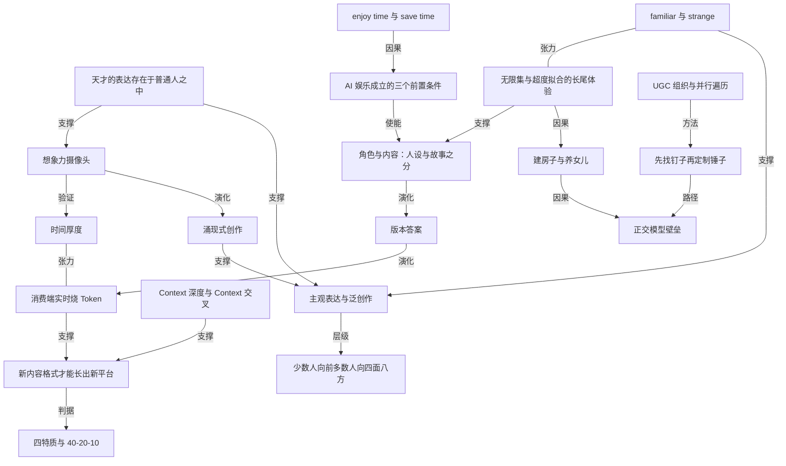

# 晚点对话梁琛奇：把 ai 娱乐做成新平台的赌注

- 原文标题：对话动念引线梁琛奇：非典型字节创业者的 “娱乐至上”
- 作者：晚点LatePost
- 内参日期：2026-09-09
- 来源类型：blog
- 原文：https://www.latepost.com/news/dj_detail?id=3717
- 标签：创业, 产品经理

> 这位字节出身的创业者用「松果时刻」让用户输入几句话就生成漫画，先拿它测公众的创作欲。他的判断是新娱乐平台必须先有新的内容生产方式。

## 导读

ai 技术有两种用途，一种是帮人提高生产力，帮人自我实现，另一种是 ai 抖音，是让大众加速下沉。

## 核心观点

- 当绝大多数人押注 AI 生产力时，梁琛奇（1996 年生，2018 年入职字节做抖音，2023 年在 Flow 主导文字互动产品「猫箱」，去年夏天创办「动念引线」，IDG、红杉、美团龙珠两轮投了数千万美元、估值约数亿美元）把全部筹码压在娱乐上。他承认包括自己在内还没有人拿出 C 端 AI 娱乐产品的版本答案，但他有一个明确的 bet。
- 这个 bet 的第一性原理只有一句话：**能诞生新平台的新内容格式，一定是消费过程也会烧 token 的形态**。如果 AI 只是让原有内容生产更便宜，它最终还是长在老平台上——「AI 可以让更多人生产短剧，但只要它还是短剧，用户就会去红果看」。只有消费时必须实时消耗算力的 AI Native 新体验，才可能长出独立的新平台。
- 与之配套的是路径判断：在形态更开放的娱乐产品上，「先应用、后模型」的胜率高于「先模型、后应用」。市面上很多团队先攻坚多模态或 3D 基础模型，赌技术突破后自然线性推导出杀手级产品——先造锤子再找钉子；动念引线选的是先用现成模型和 Agent 架构排列组合，高频测试极具体的「钉子」，验证到正反馈再针对性训模型。
- 支撑这一切的是一个信念式的判断：「天才的表达存在于普通人之中。」这既是产品判断（内容形式必须足够简单，才能让最广泛的普通人成为创作者），也是他对 AI 之后人类处境的回答：少数人向前推进文明，大部分人向四面八方做「主观表达与泛创作」。
- 他明确反对「等模型再涨一截，娱乐产品自己就会涌现」的等待姿态，并给出一个心理测试：当你对自己说「等通用模型再升级一轮就好了」时，如果你隐隐**松了一口气**，那是极其危险的信号——「一旦开始侥幸，你的胜率已经下降了」。

## nature 是娱乐：主观与客观的交叉

- 自我定位：「我的职业生涯基本没碰过娱乐以外的事。」娱乐的定义极简——「你在进行一个体验时不太 serious，你在 enjoy time，这就是娱乐。」与之对照的是工具的 save time。
- 这种 nature 不是被抖音塑造的。小学中学写诗写歌（有些是恶搞朋友的）；大学第一年学社科，法学原理、艺术史、文明史、管理学都过了一遍；大二转系学计算机，理由是「计算机更好快速验证结果以辅助自我迭代」。
- 产品经理正好是主客观的交叉点，尤其是大 C 端产品经理：
- 一方面要理解「大量人是不理性的，这世界上就是有各种各样的感性、直觉和感受在空气中飘来飘去」；
  - 另一方面要抽象出框架和第一性原理，让产品以可预测的方式服务更多人。
- 2018 年毕业时 HR 安排他去火山（正规军、资源更多），他坚持要去抖音（当时只是尝试中的项目）。判断依据不是深刻认知，而是「抖音我自己刷得下去，火山刷不下去」，背后三条：
- **产品容器**：Alex（朱骏，[Musical.ly](http://musical.ly/) 创始人，现字节 AI 产品团队 Flow 负责人）设计的全屏、上下滑，他比作「窗户、桥梁和画布」——「你真的好像是透过一个又一个充满新鲜感的窗户看到多样的世界」；
  - **人群**：抖音用户更年轻、内容更酷；
  - **动机**：抖音用户是真喜欢在这玩儿，火山靠可换钱的「火力值」激励——「物质激励不能是第一性的动机，否则会影响后面整个社区的生态」。
- 面试他的是卷卷（任利锋）。听到不靠谱的新想法（比如他大学做的四五人接力画画的「群图」）第一反应是「牛逼」，鼓励继续讲；而大部分面试官会说「别想这些有的没的，先把现有产品的渗透率做高」。卷卷当时还断言：抖音以音乐短视频为起点，但这绝不是终点，未来会覆盖全人群——那种确信程度让他惊讶。

## 为什么是去年：AI 娱乐成立的三个前置条件

- **成本**：移动互联时期的关键成本是流量，AI 时代是 token 和推理成本。工具是 save time，娱乐是 enjoy time，使用时长可能是工具的 10 倍、20 倍，token 消耗高一个数量级。2025 年初 DeepSeek-R1 之后推理成本加速下降，「过去无法打正的 ROI 开始能打正了」。
- **模态**：「语言能压缩大部分智能」，承载了工具产品的大部分价值；但娱乐追求感官体验，文字、图片、视频能服务的用户规模差出数量级。GPT-4o、Nano Banana、Seedance 等图像视频生成模型效果过了 bar，且更能遵循用户要求，「不再需要特别大量地抽卡」，这才可以 scale。
- **用户习惯**：大技术变革早期，娱乐很难承担教育用户的任务。智能手机最初靠通信刚需带动换机，后来才有短视频、手游；AI 也一样，用户先用豆包、ChatGPT 写报告做 PPT，学会了和 AI 交互，娱乐应用才能在这套习惯上长出来。
- 为什么不留在字节做猫箱：字节做娱乐内容产品基本是一套打法——找到被初步验证的内容格式，扩大供给，接入推荐与商业化，ROI 为正就疯狂投放，是 0.5 到 1 再到 100 的过程。他形容为「踩油门」：在大停车场里找那些还不完美但有潜力的车，修补一下，第一下 work 就猛踩。
- 而他的价值排序是：「我们能创造出一个影响很多人的新体验，并拿到最大收益」＞「我们创造了这个体验，但最大收益被别人拿走」＞「不做，这个世界最后根本没有发生这个新体验」。所以从 0 到 1 做出新体验最重要，而这更多发生在创业公司。

## 角色还是内容：猫箱的第一性判断

- 2023 年春在 Flow 从头做猫箱时，他画了一个坐标轴：最左是最被动的内容（短视频），最右是特别主动的内容（3A 游戏）。再问什么是 AI Native 体验——「用户在系统里做无限集的输入，不管是文字、图片还是动作，系统接收后，给你一个特别长尾、定制化的反馈」。两者交叉指向互动内容，猫箱这种文字互动形态是第一阶段的版本答案。
- 他起初并不知道 Character 那类 AI 角色产品，是 Alex 转给他看的。市场把猫箱与之视为同类，但他的判断是：**角色的核心是人设，内容的核心是故事**。所以猫箱很早就自己训故事模型。
- 内容优于角色的理由：
- 需求结构不同——用户对内容的需求是无限的，互动完一个想体验下一个；角色会在一段时间里强绑定，最后变成朋友。
  - 技术现实——「AI 要真的模拟一个真人还是差太多了」；当时那批角色产品都有明显问题：大量新用户不知道跟 AI 聊什么，且容易走向荷尔蒙。
  - 把它当内容就有解法：第一，不要只跟一个人互动而是一群人，「绝大多数好故事都不是独角戏」；第二，把这群人放进故事情境（比如你们在火山口，火山马上爆发），像沉浸式话剧或剧本杀——用户既能自由表达，又不担心无聊，因为有暗藏的故事线、目标和玩法。
  - 泛化性更好——第一天就没把猫箱定义为恋爱或乙游产品，到他离开时非爱情占比超过一半，有冒险、奇幻、历史、大女主。
- 猫箱的名字也是他改的：原名「话炉」，他不喜欢「熔炉」那种个性被融合的意味，而「猫箱」指向无数平行世界的无数可能性。
- 猫箱的经验向外迁移，供给端有两条脉络：一是延续 AI 之前的内容演化史（模态从文字、图片、视频到 3D，供给持续扩大与碎片化，从电影到电视机再到 AI 竖屏短剧，从 3A 游戏到 Roblox 的 UGC 游戏）；二是**一些以前被人的带宽和速度卡住、不能 scale 的东西现在能 scale 了**——他最早玩 ChatGPT 是玩海龟汤，由此发现大模型可以承担剧本杀主持人、游戏控场的角色，在猫箱里 AI 就是那个导演。

## 消费端的关键：超度拟合、无限分支的新内容格式

- 消费端的关键不是更便宜，而是「你必须提供一种过去不存在的新体验，找到一种新的内容格式」。新格式因为过去不存在，也就没有既有平台围绕它设计产品容器、交互和整体体验——这是新平台的空隙所在。
- 这种体验的本质是**超度拟合、无限分支的内容**：过去产品经理设计 100 个按钮就对应 100 个功能，没有定义的东西不会发生；AI 之后计算机变成无限集，所有非格式化的东西都能输入，模型给出定制化反馈。「这种无限集带来的长尾体验才会让你觉得自己真是自由的，正在体验的世界真是真实的，然后产生更强的情感联系。」
- 它也是推荐系统之后下一代人与内容的匹配方式：「我的需求是想看一个圆，推荐系统会找很多圆，从中挑出一个和你心中最接近的圆，但这还只是逼近，而 AI，第一次有机会直接给你那个圆。」
- 对「用户真有那个圆吗」的回应：推荐系统准不准数据差别很大，推得准用户就刷得爽、留存就涨——「用户未必能描述出来他想要什么，但潜意识里他知道」。
- 一个与市场主流不同的判断：**内容供给不会全部被 AI 接管**。好内容要同时有 familiar（熟悉感、让你共情）和 strange（惊喜、你没有预料的东西）。AI 适合做 familiar，因为它足够了解你；但 strange 来自多样性，多样性最后还是来自人。猫箱虽自训故事模型，原始的故事母题、人设、世界观仍由人创作，AI 的作用是让同一剧本对每个用户衍生出个性化反馈。

## 建房子与养女儿：AI 产品范式与正交模型壁垒

- 移动互联网做产品像**建房子**（Alex 也有类似的建筑比喻）：本质是 if-else 和与非门构成的有限集，每一砖一瓦、每条路径都要定义，不定义就不会发生。
- 做 AI 产品像**养一个两岁的女儿**：你不可能教她「如果你 39 岁坐公交车，突然有人脱下高跟鞋朝你头上砸过来，你该怎么办」——现实的输入是无限的。你只能教她世界观、做人的 principle，给一些 SFT 范例，设定目标让她自己去 RL。直到她 18 岁在舞台上演了一场话剧深深打动你——「你惊叹她演得这么好，但转念一想她本该如此，因为在这个框架下，这个 moment 终究会出现」。结果既出乎意料，又在情理之中。
- 另一个范式差异：AI 产品要更早考虑商业化，因为它在使用时就有算力成本。
- 这个认知来自猫箱的具体经验：上线一个月时用户 90% 的反馈都在吐槽模型——「这个角色怎么忽冷忽热」「他说话气死我了」。这些反馈极其长尾、无限分支，不可能一个个修，只能靠模型能力整体提升；而又很难要求 Seed 主线模型为某个应用改模型。于是猫箱从那个节点开始自训故事模型、后来也负责角色模型，他创业第一天就搭模型团队。
- 为娱乐内容训的模型与模型厂商主线是**正交**的，由此有三个独特壁垒：
- **数据少**：新体验过去不存在，公开市场没有现成数据，不做体验的公司没见过就学不到。
  - **极度主观**：数学、编程对错分明，容易用 RL 提升；娱乐场景输出没有绝对对错，用户开心就是对，而开心极其主观——「上海 18 岁女生和东北 49 岁大哥的感受完全不同」，必须依赖真实业务场景的用户反馈去建 Reward Model。
  - **把主观设计做进模型**：像当年短视频的全屏上下滑，很多 C 端关键设计不是纯理性推导的，而是带着主观审美。AI 时代可以把成百上千个主观判断作为隐性 feature 训进模型和 Agent，对手很难直接 copy。
- 这与当时流行的「应用公司做应用、模型公司做模型」相反——他从第一天就认为必须靠自研模型建立与主模型正交的壁垒。

## 松果时刻：想象力摄像头这台测试仪

- 去年 9 月上线的「松果时刻」是动念引线的第一个产品：给一组照片加文字描述，扩展成一个带配音、配乐和简单动画的多图有声漫画，甚至可以生成轻互动故事。
- 它的定位不是求 PMF，而是一次测试：「我想看看，如果丢给大家一个『想象力的摄像头』后，会发生什么？我想验证想象力在人群中的普适程度。」
- 为什么需要这次测试：猫箱在他创业时已被证明是大模型热潮后 AI 娱乐的第一个版本答案（同期找不到 DAU 更大、ROI 更划算的形态），但它停在大几百万 DAU 后更难泛化。核心矛盾是——**互动内容对想象力要求非常高，而大部分用户没有那么多想象力**。
- 但他的解释不是人没有想象力：人常常在童年和少年时想象力旺盛，成年后衰减，重要原因之一是「大部分人缺少足够的技能来向外界传达想象力」——不是故事高手，不会做动画，不会剪视频。所以先提供一个极低门槛的工具，把脑子里的画面（记忆、判断、幻想）简单表达出来。
- 为什么是漫画而不是写实照片或 AI 视频：
- **风格维度**：他引《三体》里的比喻——一张云的照片和一幅《清明上河图》哪个数据量更大？答案是天边的云，因为「云的边缘放大一千万倍依然有分子原子细节」，而《清明上河图》是被艺术化压缩过的。漫画把极复杂的人脸和环境压缩成几笔线条，相同模型智能下更容易先成熟，用户也不会觉得有怪异的「AI 感」。
  - **模态维度**：成本与 UGC 逻辑。天才存在于最广泛的普通人里，就要求内容形式简单；而视频今天太贵——文字互动类产品每天 200 到 300 轮交互，文字成本才刚打正。「当一个东西特别贵、生成还要等，它就必然走向服务少数人的 PGC 和 OGC。」
- 需求成不成立分两问：**能不能做**——Sora 那类产品已经卡掉大部分人，因为凭空想象太难，但「如果只是讲讲昨天发生了什么，每个人都讲得出来」；**是不是高频**——核心在于人日常的表达有「时间厚度」，一张照片只是单薄的切片，人经历的是照片前后有因果的故事（骑车弄湿了裤子、老人回忆年轻时的某个瞬间）。「让一个大街上骑共享单车的大哥构想一个架空世界的想象力故事很难，让他讲讲他昨天骑车上班的时候发生了啥很简单。」
- 上线后看到的：门槛确实足够低、人群极其泛化。主推年轻群体，却能看到准备出家的和尚讲他为什么出家，也能看到跳广场舞的奶奶记录日常、顺便畅想一岁的孙子长大后会做什么工作。
- 四类高频用例：有时间厚度的生活记录；情绪的通感表达；二次元、同人和二创；站外做号的人做固定 IP 段子或小说推文引流。第四类实质上把产品变成了创作工具，这不是他们想要的——纯工具对站内内容生态没帮助（做完就发到抖音、小红书），且目的性太强、太泛；「一个产品早期要想做成消费社区，绝不可能一开始就做一千种很泛的内容，必须先在特定的人群和品类里收浓。」

## 接下来三件事与成本账

- **第一件也是最核心的：让消费端也实时烧 Token。** 「如果 AI 只是让原来内容的生产变得更便宜，用户最终还是会去老平台上消费；只有在消费过程中必须实时消耗算力的 AI Native 新体验，才有可能长出一个独立的新平台。」
- 烧 token 有第一性原理：过去三年版本答案是类猫箱产品，烧文字 token。未来三年大概率两种——一种是烧更高的模态（图片视频，大概率按顺序解锁），一种是烧更高级的文字（coding 就是一种更高级的文字，有机会构建用户边玩、AI 边现场 coding 后续玩法的体验）。
- 成本账本质是降成本和涨收入两侧：
- 降成本：已自研生图模型，正在做语言模型；当前阶段不主做视频，而是「一帧一帧实时生图」——「就像看漫画一样，上一帧鸣人刚聚起螺旋丸，下一帧就打到了佐助头上」，让生成速度跟上用户的消费节奏。
  - 涨收入：只要有 PMF、能占住时长，商业化顺理成章——广告、会员，或带互动和类游戏属性的道具与玩法付费。「当单次推理成本降到某个临界值以下，它就回归了移动互联网的商业模型，不需要再担心 DAU 增长会把公司烧穿。」
- **第二件：在松果时刻里把人群收浓、内容拉长。** 特定圈层的冷启动难度远低于泛人群；在模型成本降到极低之前，把内容拉长、偏向优质内容更划算，能撑起社区早期的内容密度。目前一些产品形态正面向二次元人群收浓。
- **第三件：让用户每天输入的碎片信息都能生成非常好的表达。** 这里有一组约束：输入必须足够少和简单（否则门槛太高），但这个输入又必须对最终作品起决定性作用——「不能 99% 都是 AI 脑补的套话，那就失去了人的表达特质」；同时输入动作很轻，产出反馈必须足够 impressive，比现在的多图漫画更具可玩性。
- 终局形态他称为**涌现式创作**：过去的创作者追求对每一个字、每一格分镜的绝对控制；未来的 AI Native 创作者善于利用 AI 的大脑——只定义核心设定与框架，把大比例细节交给 AI 填充，自己只把控最终呈现。

## 四层壁垒与两种全新的网络效应

- 面对模型厂商可能下场（比如 OpenAI 重拾 Sora 这条线），他的第一反应是「他们的注意力不在这」，退一步讲也有四层难以跨越的壁垒：
- **交互设计**：工具追求效率、交互越简单越好，娱乐追求参与感。「即使在极其被动的短视频里，点赞和上下滑也是非常伟大的交互」——点赞映射了现实中的鼓掌，满足人想参与其中、与创作者建立连接的本能。这不是一个通用对话框或 API 能解决的。
  - **用户心智**：「你打开飞书、Claude Code、Codex 时，是工作心智，自带严肃感」；娱乐需要完全不同的心理场域。支付宝里也可以刷短视频，但大家看短视频依然只去抖音，看生活经验依然只去小红书。
  - **自研模型**：大模型厂商不可能为某一种特定娱乐偏好牺牲主模型的通用性；而他们可以把成百上千个主观审美判断（何时该展开、何时该少废话、何时用蒙太奇）作为隐性 feature 训进模型和 Agent。
  - **人才密度**：面对一片白茫茫的未知，需要既懂理性推导、又有极强主观审美的人快速碰撞、验证和证伪。
- 即便通用模型最终全都能做到且足够便宜，「领先的娱乐产品早就靠时间差建立了内容生态和壁垒了」。
- 除创作-消费的双边网络效应外，AI 时代还会产生两种全新的网络效应：
- **Context 深度**：像 ChatGPT 越用越懂你，你在一个产品里沉淀的喜好和上下文越多，迁移成本越高——「这是你与过去的自己之间的连接」。
  - **Context 交叉**：移动互联网时代的视频无法被结构化，所谓「合拍」只是把两个视频物理拼在屏幕左右；AI 时代每个视频、图片、角色背后都是结构化的 Context 和 Prompt，人和人、内容和内容可以通过语义重组实现真正的 Mix。当这种交叉极高频时，就产生一种过去不存在的人与内容交织的新型网络。
- 但他给竞争问题的最终定调是：「创业公司最重要的不是盯着竞争，而是先做出一个真正能影响人、带来新体验的产品。」

## 雏形的信号：四特质与 40-20-10

- 时间判断：新体验的雏形在 1 到 2 年内就会出现，雏形意味着有了可规模化的基础。
- **信号一：体验同时满足四个听上去矛盾的特质——新颖、长期、高频、不厌倦。** 「现在很多产品只是新颖，但容易快速厌倦，高频也可能带来厌倦。只有同时具备这 4 个特质，才是一个成立的娱乐形态。」
- 量化到指标就是留存和频次，基线至少是 **40-20-10**：次日留存 40%、7 日留存 20%、30 日留存 10%，「这才更有机会去算正 ROI 并规模化增长」。松果时刻目前某些用例的 7 日留存已经超过 20%。
- **信号二：具备覆盖全人群的泛化潜力。** 第一天可能只装了特定圈层的内容，就像早期抖音装的是年轻人的潮酷音乐和运镜，但你必须能推导出它未来能装进新闻、生活和家长里短，连父母一辈也能用起来。
- **信号三：体验能随用户规模扩大而逐步变好。** 不仅是传统的供给规模效应，还包括 AI 特有的 Context 深度与交叉——用得越久系统越懂你，用户越多不同人的 Context 交叉出的新内容越丰富。「只有具备这种飞轮，产品在增长过程中才会有持续的斜率，越往后跑壁垒越深。」
- 下一个版本答案的正面描述：在更高模态下、消费端实时消耗算力，且兼具内容与轻游戏属性的新形态。反面排除同样明确——各种漫剧、短剧肯定不是（「那是老平台的东西」）；「互动内容」这个词太大，只线性地把文字模态升维成可互动的视频或 3D 不够，「纯靠模态堆砌解决不了长期的娱乐动力」；AI 男友、AI 女友技术更成熟后一定有价值，但他们明确不做。
- 押注的是表达与社交，混了一点轻游戏。他判断潜在的游戏人群是现有核心玩家的 10 倍——就像黄峥说拼多多是「五环外的迪士尼」，五线城市的大妈玩「砍一刀」其实获得了一种从未体验过的社交游戏快乐；抖音直播间里输入 1 加入魏国、刷个礼物打仗，也是低门槛的游戏。「游戏的本质很简单：用户在一个系统里参与了某种交互，并因为这个参与获得了正向反馈。这是全人类最普适的心理需求。」

## 误判、纠偏与 UGC 组织

- **最大的一次误判：低估了 AI Coding 的进化速度，导致早期招人太激进**——两三个月里团队从 30 人膨胀到七八十人。
- 触发点是 Sora 刚出来时声量太大。他理性上 98% 确信它不是最终答案（第二天就在群里发了分析），但仍有 5% 到 10% 的担心：万一它真的在短期内引爆资源和资本的超速投入呢？「在那种焦虑下，我觉得必须赶紧把队伍拉起来，动作就变形了。」他的解释是——当全行业都觉得它是答案时，海量资本、算力和人才会涌进来，试错和迭代速度会被强行拉快。
- 代价是「阶段性的组织冗余和文化稀释」。「要做这么多方向确实需要优秀的人才，但节奏绝不应该是在一个月内翻倍。这是我交的一笔学费。」
- **组织范式的改变：从 PGC 的 App 工厂变成平行的「UGC 组织」**——UGC 在这里指像个人那样去开发产品。1 到 2 个人一组，既懂产品又懂 vibe coding，依托统一的架构中台，面向一个需求池，以两周到一个月的极快节奏做 Demo，推向市场看真实信号，不行就迅速关掉，有正反馈就加注资源。目前在开发七八个产品，累计有明确概念和 Demo 的试了十几个。
- 与字节的区别不在「多产品」而在生成方式：字节当年第一天就自上而下画满坐标轴（格式、时长、题材）去铺矩阵；他们是先用松果时刻这个「摄像头」收集信号，看到趋势再分化出产品。
- 底层逻辑是概率而非专注：「过去创业公司必须 focus 在一件事上，是因为验证一次要花半年，胜率可能只有 20%」；但在需要构建新体验的娱乐领域没人能断言哪种形态是版本答案，「如果你挑选出几十个高潜力的可能性快速遍历，找到答案的概率就会成倍提升」。他把这比作当年计算机用暴力遍历法解数学证明——技术变了，做事的范式必须跟着变。
- 触发这次组织变化的两个信号（发生在两三个月前）：一是 AI Coding 跨过了关键边界；二是松果时刻让他们看清了真实的需求趋势。目前数量还没达标——「传统 PGC 模式一年做十个产品，UGC 模式在量级上应该到 100 个」，20 人的组织、1 到 2 人一组，一个月能测 15 个。瓶颈是人：既有敏锐产品 sense、懂业务，又能自己做 vibe coding 的复合人才。
- **一个反直觉的体会：在字节做业务的 Review 压力，比出来创业大得多。** 字节里哪怕立项给了一年预算，任何一个双周或季度 Review 都可能判定不及预期、直接关停，生死紧迫感极其高频；创业后账上有钱，半年到一年的节奏自己定，外部压力反而变小。当同事说「感觉你最近状态有点轻松，甚至有点开心」时他立刻警惕——「我不相信在完全随性的环境里能诞生最好的创新。高频的压力反而会刺激大脑产生很多极具创造力的解法。」
- 那段轻松期（去年底到今年 1 月）背后是一次 wishful thinking：看到很多普通用户自发用松果时刻记录生活，他一度想——是不是不用费劲收浓人群，也不用在消费端死磕烧 Token，仅靠泛人群的生活记录就能做大规模？「这个路径太有诱惑力了」，因为它既不用高频消耗算力，又能避开垂类冷启动再泛化的苦活。
- 打醒他的不是日活（「其实我们也可以投起来，但是没想投」），而是两件事：第一，这批生活记录用户**只生产、不消费**，他们自己不刷信息流；而信息流里全是陌生人的生活琐事，别人更不想看——「这跟我有什么关系？」所以缺乏真正的消费信号。第二，一位理性务实的老同事来了之后「一顿测算和严密的推导」指出了很多问题。
- 他对自己的判断很清楚：「我其实是一个很擅长讲故事、用愿景去感染别人的人。这有利有弊：好处是能让大家有长久的信念，弊端是容易让大家过度沉浸在愿景里。所以团队里必须有极度客观的人跳出来，随时把大家从故事拉回现实。」

## 仍然模糊的问题：先造锤子还是先找钉子

- 他自认最模糊也最重要的问题是**对外部技术发展节奏的判断**：很多全新体验的解锁完全依赖底层模型能力跃迁，而这个节奏受算力供给、模型范式迭代甚至宏观周期等不可抗力影响，「踏错技术周期的风险极大」。
- 更深一层是路径选择：先搞模型再找产品，还是先试体验再去造模型？前者是**先造锤子再找钉子**——先投巨大资源攻坚多模态或 3D 基础模型，赌技术突破后自然线性推导出杀手级产品；他指出这包含双重脆弱假设：既假设技术能如期成熟，又假设成熟后构想的场景一定成立。
- 他们选后者：用现有成熟模型和 Agent 架构排列组合，先在前端高频测试极其具体的「钉子」，哪怕体验粗糙，只要验证用户对新体验有强烈正反馈，就能利用特有数据针对性训模型——**先找到好的钉子，再定制锤子**。
- 历史证据（他说自己真研究过）：字节不是先发明世界顶级推荐算法才去做产品，而是先做出搞笑囧途、内涵段子，把今日头条早期版本跑通、验证了大众对信息聚合形态的需求，才针对场景提升推荐系统。Instagram、[Musical.ly](http://musical.ly/)、Snapchat 最初也都是先做出极有灵性的体验（滤镜、阅后即焚），再完善底层工程与技术。
- 由此得到他最锋利的那句判断：「很多人寄希望于『只要大模型能力再涨一截，娱乐产品自己就会涌现出来』，我认为这本质上是一种偷懒。」并附上心理测试——当你对自己说「等通用模型再升级一轮，这个问题自然就解决了」时，去觉察内心的真实情绪，「如果你隐隐松了一口气，觉得『太好了』，那这是极其危险的。一旦开始侥幸，你的胜率已经下降了」。

## 少数人向前，多数人向四面八方

- 对「未来数年工作和生产力才是 AI 主线，内容娱乐再也回不到移动互联网时代的核心位置」这一观点，他的回答是：**占比会下降，绝对增量依然庞大。** 移动互联网本质是做连接，吃的是各行业 10% 的中介价值；AI 在直接重塑剩下 90% 的生产力本身，所以生产力大盘增速远快于娱乐。但当 AI 最终接管大部分工作，绝大多数人会获得海量闲暇时间，这是绝对意义上的巨大增量。
- 「大家也可以继续刷抖音」——他的反驳是：「人不能连续被动地刷 700 天短视频，那会产生巨大的虚无感。」
- 人需要「找意义」，而意义的来源必须满足两点：第一，你深度参与并获得了正向反馈；第二，这件事不能轻易被 AI 替代。
- 「最难被 AI 替代的，恰恰是数据极少、主观性极强、带有个人起心动念与情感加成的『主观表达与泛创作』。」他相信未来大量的人都需要在这个数字 playground 里做泛创造，**用创造锚定自我价值**。
- 为什么这些创作仍会在线上发生：线上有两个核心杠杆——网络分发和 AI 创造，「它能让现实里很多默默无闻、但极具天赋的人成为超级创作者」。
- 对个人，这能帮人找到意义、让人快乐，「快乐本身就是个体的终极意义」。对人类群体则有两个更底层的价值：
- 推动文明发展的天才是从人口基数里按概率涌现的，「人口基数越健康，天才绝对数量越多。而人类只有觉得生活有意义、开心，整个种群才能维持在一个良性规模上」。
  - SpaceX 上市时马斯克说它的使命是「把科幻小说里的『科幻』拿掉」——那反过来，「必须先有人写出那本科幻小说，被马斯克看到，而且深刻启发了他」。文学、艺术与虚构创作在无数人脑海里种下了走向星际文明的种子，激发更多有创造力的人去构建作品，这些作品又去启迪下一批推动文明前进的人。
- 结论式的世界图景：「未来，是少数人向前，继续推进文明前进；大部分人向四面八方，『主观表达与泛创作』会成为一种主流的娱乐方式。」被问到自己是哪一种时，他的回答是：「对我而言这是一件事，在我们公司的愿景语境里，四面八方都是前方。」
- 公司名「动念引线」即由此而来：每个人每天脑海中都有无数「动念」——回忆、情绪、感受或幻想，过去转瞬即逝、消散无形；而现在 AI 能引燃这些动念，把它们转化成可见的作品，「绽放成独特的烟花」。

## 概念网络

### 关键概念

#### enjoy time 与 save time

**context**：区分娱乐产品与工具产品的第一性定义。「你在进行一个体验时不太 serious，你在 enjoy time，这就是娱乐。」这个区分不只是分类，它直接推出成本结构——娱乐的使用时长可能是工具的 10 倍、20 倍，token 消耗高一个数量级，因此娱乐的 ROI 拐点比工具晚得多，也就有了「去年才是时机」的判断。

**费曼一下**：工具是帮你省时间的，娱乐是帮你花时间的。省时间的产品，用得越少越好；花时间的产品，用得越久越好。这一正一反，决定了后者要烧掉前者十几倍的算力，所以它必须等算力便宜到某个点才做得起来。

#### 消费端实时烧 Token

**context**：全文最核心的判据。「能诞生新平台的新内容格式，一定是消费过程也会烧 token 的形态」；「如果 AI 只是让原来内容的生产变得更便宜，用户最终还是会去老平台上消费」。反例是短剧——AI 让更多人生产短剧，但消费仍在红果。烧 token 也有演化顺序：过去三年是文字 token（类猫箱），未来三年大概率是更高的模态（图片视频）或更高级的文字（如现场 coding）。

**费曼一下**：判断一个 AI 内容产品能不能变成新平台，不看它生产端多省钱，而看用户「看」的那一刻机器是不是也在实时算。如果只是生产变便宜、消费还是老样子，那这些内容最后都会流回抖音、红果这些老池子；只有消费本身也要现场消耗算力，才需要一个专门为它造的新容器。

#### 版本答案

**context**：贯穿全文的行业判断单位。猫箱被认为是大模型热潮后 AI 娱乐的「第一个版本答案」（同期找不到 DAU 更大、ROI 更划算的形态），但停在大几百万 DAU 后难以继续泛化；下一个版本答案被描述为「在更高模态下、消费端实时消耗算力，且兼具内容与轻游戏属性的新形态」，且明确排除漫剧短剧、单纯模态升维、AI 男友女友。

**费曼一下**：在技术条件不断变化的赛道里，没有永久的最优解，只有「当前这一代技术条件下最好的那个产品形态」。承认自己手上的只是某一版的答案，而不是终局，才会持续去找下一版。

#### 角色与内容：人设与故事之分

**context**：猫箱区别于同类产品的根本判断。「角色的核心是人设，内容的核心是故事。」内容路线的三个优势：需求无限（互动完一个想体验下一个，而角色会强绑定成朋友）、避开了模拟真人的技术鸿沟与荷尔蒙化倾向、泛化性更强（猫箱非爱情用例占比超过一半）。解法也随之出现：不是一对一而是一群人，且把这群人放进故事情境。

**费曼一下**：同样是和 AI 聊天，你可以把它当成一个人，也可以把它当成一个故事。当成人，你会想跟它谈恋爱、做朋友，很快就撞上「它不像真人」的墙；当成故事，你是走进了一场剧本杀，AI 是导演不是恋人，能玩的花样就宽得多。

#### 天才的表达存在于普通人之中

**context**：梁琛奇「一切生活和创业的基础信念」，被他多次情绪饱满地重复。它是产品约束的来源：因为天才广泛分布在最普通的群体里，所以内容形式必须足够简单、门槛足够低；它也是终局图景的来源：AI 加网络分发能让「现实里很多默默无闻、但极具天赋的人成为超级创作者」。

**费曼一下**：不是只有少数人有才华，而是多数人没有把才华说出口的工具。写诗需要识字，拍电影需要剧组——门槛把大量有表达欲的人挡在外面。如果工具的门槛降到人人都能用，被压抑的表达就会释放出来。

#### 想象力摄像头

**context**：松果时刻的自我定位与测试目的。互动内容对想象力要求非常高，而大部分用户没那么多想象力——但原因不是没有想象力，而是「缺少足够的技能来向外界传达想象力」。所以先做一台极低门槛的设备，把脑中的画面（记忆、判断、幻想）拍下来，再观察不同背景、不同 taste 的人拿它表达什么。

**费曼一下**：照相机的意义在于，你不用会画画也能留下眼睛看到的东西。想象力摄像头就是同一件事的下一步：你不用会写故事、会剪视频，也能把脑子里的那一幕留下来。

#### 时间厚度

**context**：解释生活记录为何可能高频的关键。「一张照片只是个单薄的切片；但人经历的是这张照片前后的有前后因果的故事。」举例：骑车弄湿了裤子、老人回忆年轻时的某个瞬间。这也是「能不能做」与「是不是高频」两问中后一问的答案来源。

**费曼一下**：照片只截取了一个瞬间，但人心里装的是那个瞬间的来龙去脉。让人凭空编一个架空世界很难，让他讲讲今天上班路上发生了什么，人人都讲得出——生活本身自带故事的前因后果。

#### 无限集与超度拟合的长尾体验

**context**：AI Native 体验的技术本质，与移动互联网的有限集对照。「过去产品经理设计 100 个按钮，就对应 100 个功能，没有定义的东西就不会发生」；AI 之后所有非格式化输入都能进来，模型给出定制化反馈。他用「圆」作比：推荐系统只能从现有内容里挑出最接近你心中那个圆的，AI「第一次有机会直接给你那个圆」。

**费曼一下**：老软件像一台按键固定的自动售货机，你只能买它摆出来的那几样；AI 产品像一个厨房，你说什么它现做什么。前者靠猜你要哪个，后者直接给你要的那个。

#### 建房子与养女儿

**context**：移动互联网产品与 AI 产品的范式对照。前者是 if-else 与与非门构成的有限集，「每一砖一瓦、每条路径你都要定义」；后者只能教世界观和 principle、给 SFT 范例、设目标让她自己 RL，结果「既出乎意料，又在情理之中」。附带推论：AI 产品要更早考虑商业化，因为使用时就在烧算力。

**费曼一下**：造房子，你画好每一堵墙它就长成那样；养孩子，你只能教她价值观和方法，具体某天她会说出什么话你管不了。AI 产品属于后者——你定框架，不定结果，好结果出现时你会惊讶，但回头想又觉得理所当然。

#### 正交模型壁垒

**context**：自研模型必要性的论证。为娱乐内容训的模型与模型厂商主线正交，三个壁垒是：数据少（新体验过去不存在，公开市场没有现成数据）、极度主观（没有绝对对错，「上海 18 岁女生和东北 49 岁大哥的感受完全不同」，必须靠真实业务反馈建 Reward Model）、把主观设计做进模型（成百上千个审美判断作为隐性 feature，对手很难 copy）。这与当时流行的「应用公司做应用、模型公司做模型」相反。

**费曼一下**：通用大模型擅长那些有标准答案的事。娱乐没有标准答案——好不好玩全看用户开不开心，而且不同人开心的点完全不同。这类判断学不到公开数据里，只能从自己产品的真实用户反馈里长出来，所以它跟大厂主线是两条互不重叠的路。

#### familiar 与 strange

**context**：他不认为内容供给会全部被 AI 接管的理由。好内容要同时有 familiar（熟悉感，让你共情）和 strange（惊喜，你没有预料的东西）。「AI 适合做 familiar，因为它足够了解你。但 strange 来自多样性，多样性最后还是来自人。」猫箱的实践正是如此：故事母题、人设、世界观由人创作，AI 让同一剧本对每个用户衍生个性化反馈。

**费曼一下**：好故事一半是「这说的就是我」，一半是「我没想到会这样」。AI 越了解你，越擅长前一半；但后一半靠意外，靠世界上有各种各样不一样的人，这个源头不在模型里。

#### Context 深度与 Context 交叉

**context**：AI 时代两种全新的网络效应。深度是纵向的——「就像 ChatGPT 越用越懂你」，沉淀的上下文越多迁移成本越高，「这是你与过去的自己之间的连接」；交叉是横向的——移动互联网的视频无法结构化，「合拍」只是把两个视频物理拼在左右，而 AI 时代每个内容背后都是结构化的 Context 和 Prompt，人与人、内容与内容能通过语义重组实现真正的 Mix。

**费曼一下**：第一种黏性是「它太懂我了，换个产品要重新教一遍」。第二种是「我的东西能跟别人的东西真正融在一起，生出第三个东西」——不是拼在一起，而是化在一起。后者越高频，这张网就越难被复制。

#### 四特质与 40-20-10

**context**：判断新体验雏形是否出现的信号体系。体验层面要同时满足四个听上去矛盾的特质——新颖、长期、高频、不厌倦（「现在很多产品只是新颖，但容易快速厌倦，高频也可能带来厌倦」）；量化到指标就是次日留存 40%、7 日留存 20%、30 日留存 10%。松果时刻某些用例的 7 日留存已超过 20%。另外两个信号是覆盖全人群的泛化潜力，以及体验随规模扩大而变好的飞轮。

**费曼一下**：新鲜好玩不难，难的是天天玩还不腻。这四个词互相打架——越刺激越容易腻，越高频越容易腻，能同时满足才算真站住。把它翻译成数字，就是明天还有四成人回来、一周后还有两成、一个月后还有一成。

#### 先应用后模型：先找钉子再定制锤子

**context**：路径选择上的核心分歧。多数团队「先投入巨大资源攻坚多模态或 3D 基础模型，赌未来某个时间点技术突破后，自然能线性推导出一款杀手级产品」——先造锤子再找钉子，包含技术如期成熟与场景一定成立的双重脆弱假设。动念引线选相反路径：用现有模型和 Agent 架构排列组合，高频测试极具体的钉子，验证到正反馈再针对性训模型。历史证据是字节先跑通今日头条早期版本再提升推荐系统，Instagram、[Musical.ly](http://musical.ly/)、Snapchat 也都是先有灵性的体验再补底层技术。

**费曼一下**：一种做法是先造一把绝世好锤，相信有了它总能找到该敲的钉子；另一种是先满地找钉子，找到真值得敲的那颗，再为它专门打一把锤。前者要同时赌两件事都对，后者只赌一件。

#### UGC 组织与并行遍历

**context**：组织范式的改变。「我们不是做 PGC 的 App 工厂，而是建立了一个平行的 UGC 组织，UGC 是指像个人那样去开发产品。」1 到 2 人一组，既懂产品又懂 vibe coding，依托统一架构中台，两周到一个月出 Demo 推向市场看真实信号，不行就关掉，有正反馈就加注。逻辑是概率而非专注：「过去创业公司必须 focus 在一件事上，是因为验证一次要花半年，胜率可能只有 20%」；现在几十个可能性快速遍历，找到答案的概率成倍提升。他把这比作计算机用暴力遍历法解数学证明。

**费曼一下**：以前试错一次要半年，所以只能押一个方向；现在 AI 写代码快到一两个人两周就能做出一个能上线的东西，那就同时试几十个方向，谁跑出来跟谁走。专注不是美德，是过去成本高时的无奈。

#### 涌现式创作

**context**：他对未来创作者形态的判断。「过去的创作者追求对每一个字、每一格分镜绝对控制；而未来的 AI Native 创作者，善于利用 AI 的大脑——他们只定义核心设定与框架，把大比例的细节交给 AI 填充，自己只把控最终呈现。」这与第三件事的产品约束呼应：用户输入要足够少和简单，但又必须对最终作品起决定性作用，「不能 99% 都是 AI 脑补的套话」。

**费曼一下**：过去当导演意味着每一个镜头都要你说了算；以后当导演更像定一个世界观和一条主线，剩下的让 AI 去填，你只负责验收和调整。人的贡献从「全都亲手做」变成「决定它是什么」。

#### 主观表达与泛创作

**context**：他对 AI 接管工作之后人类处境的回答。人需要「找意义」，意义的来源必须满足两点：深度参与并获得正向反馈，且这件事不能轻易被 AI 替代。「最难被 AI 替代的，恰恰是数据极少、主观性极强、带有个人起心动念与情感加成的主观表达与泛创作。」对个人是用创造锚定自我价值；对群体，健康的人口基数才能按概率涌现出天才，而虚构创作又会在他人脑中种下种子（马斯克与科幻小说的例子）。

**费曼一下**：当机器把活都干完了，人靠什么证明自己没白活？答案不是消费，而是创造——而且是那种带着你个人情绪和癖好、没有标准答案的创造。恰恰因为它主观、数据少，机器最难替代它。

#### 少数人向前，多数人向四面八方

**context**：全文的收尾图景。「未来，是少数人向前，继续推进文明前进；大部分人向四面八方，主观表达与泛创作会成为一种主流的娱乐方式。」但他拒绝把这看成两类人的分层——被问自己属于哪一种时，他答：「对我而言这是一件事，在我们公司的愿景语境里，四面八方都是前方。」这也解释了公司名「动念引线」：AI 引燃每个人转瞬即逝的动念，让它「绽放成独特的烟花」。

**费曼一下**：不是所有人都得去推动技术前沿，那是少数人的活；多数人往各个方向去表达自己，看起来散，但正是这些散开的表达里长出了下一代人的灵感。所以「四面八方」不是退而求其次，它跟「向前」是同一件事的两面。

### 概念网络

- 整篇访谈的网络有一个不动的原点：**天才的表达存在于普通人之中**。它不是结论而是公理，向上生出全部产品判断，向下生出全部文明判断。因为天才广泛分布在普通人里，内容形式就必须简单（否则天才被门槛挡住），于是有了**想象力摄像头**这台低门槛设备；也因为它，AI 之后人的归宿被写成**主观表达与泛创作**而非被动消费，最终收束到**少数人向前，多数人向四面八方**。
- 与这条信念线并行的是一条冷静的经济学线。**enjoy time 与 save time** 的区分本身就是成本判断：娱乐的使用时长是工具的十几倍，token 消耗高一个数量级，于是必须等到成本、模态、用户习惯这**三个前置条件**同时到位，AI 娱乐才谈得上时机。这条线在文中不断把信念线拉回地面——最典型的一次是他的 wishful thinking 被同事「一顿测算和严密的推导」打断。
- 网络的真正枢纽是**消费端实时烧 Token**。它一头连着技术本质，一头连着商业结构。往上看，它是**新内容格式才能长出新平台**的充分条件：不烧 token 的形态意味着 AI 只改造了生产，消费仍在老容器里发生，价值必然回流红果、抖音。往下看，它给出了**版本答案**的演进方向——从文字 token 到更高模态或更高级的文字，是一条可以推导的路线，而不是等待涌现。
- **无限集与超度拟合的长尾体验**是这一切的技术底座，也是三条推论的共同父节点。它推出**角色与内容**之分（无限集让「故事」比「人设」更值得押注，因为需求无限、泛化更强）；推出**建房子与养女儿**（有限集可以逐条定义，无限集只能定框架和目标）；再由后者推出**正交模型壁垒**（无限分支的用户反馈无法一条条修，只能靠自训模型整体提升，而这类模型与主线模型天然正交）。
- **familiar 与 strange** 在这张网里承担的是制动器角色，与无限集构成张力。无限集的逻辑推到极致会得出「内容供给终将被 AI 接管」，而他明确拒绝这个推论：AI 越懂你就越擅长 familiar，但 strange 来自多样性，多样性来自人。这条张力线也正是**主观表达与泛创作**能成立的前提——如果 AI 能包办 strange，人的创造就失去了不可替代性。
- **时间厚度**与消费端烧 token 之间是一组未被调和的张力，而这正是全文最有价值的自我证伪。时间厚度解释了生活记录为何低门槛且可能高频，松果时刻据此验证了泛化性（和尚、跳广场舞的奶奶都进来了）；但这批用户「只生产、不消费」，缺乏真正的消费信号。于是低门槛表达这条路走到头，必须折回消费端烧 token 那条路——**想象力摄像头**的价值从「产品」被重新定义为「测试仪」。
- 组织层与方法论层由三个节点串起：**UGC 组织与并行遍历**是手段，**先找钉子再定制锤子**是路径，**正交模型壁垒**是终点。逻辑链条是：因为没人知道版本答案是什么，所以要并行遍历几十个可能性；因为遍历要靠现成模型快速搭，所以路径必然是先应用后模型；而一旦某个钉子被验证，特有数据就能反哺出正交壁垒。这条链的成立条件是 AI Coding 跨过关键边界——他低估这一点的代价，正是那次组织从 30 人膨胀到七八十人的学费。
- **四特质与 40-20-10** 是整张网的验收口，把前面所有主张压成可证伪的数字。它检验的不是某个单点判断，而是「新内容格式是否真的成立」这一整套推理：新颖、长期、高频、不厌倦四者同时满足，才说明找到的不是一次性猎奇，而是能承载新平台的形态。
- 最后，**涌现式创作**是产品终局与文明终局的接合部。它上承想象力摄像头（人只提供最少的输入）与无限集（AI 填充大比例细节），下启主观表达与泛创作（人的贡献从执行转为定义）。也正是在这个接合点上，他把两个看似分层的方向合成一件事：定义框架、让细节涌现，本身既是向前，也是向四面八方。

## 费曼 x3

判断一个新技术会不会长出新平台，最常见的错误是盯着生产端。AI 让做短剧的成本降了九成，看起来足够颠覆，但用户看短剧仍然去红果——因为消费那一刻，什么都没变。真正的分水岭在另一侧：消费过程本身是否也在实时烧算力。只有当一段体验必须现场生成、无法预先渲染好塞进老容器里，才会没有一个既有平台为它设计过交互，新平台的空隙才真正出现。这是一条比「AI 让内容更便宜」严苛得多的标准，也是一条能事前使用的标准。

之所以严苛，是因为它背后是一次范式切换。移动互联网的产品是有限集，一百个按钮对应一百个功能，「没有定义的东西就不会发生」；AI 产品是无限集，所有非格式化的输入都能进来，模型给出的是长尾的、定制化的反馈。这个差别有个很好的比方：做移动互联网产品像建房子，每一砖一瓦都要你定义；做 AI 产品像养一个两岁的女儿，你只能教她世界观和准则、给一些范例、设定目标让她自己去学——直到她十八岁在台上演了一场话剧深深打动你，你惊叹之余转念一想，她本该如此。结果既出乎意料，又在情理之中。

有限集与无限集的区别，也解释了为什么在这条路上必须自己训模型。娱乐没有标准答案，用户开心就是对，而开心极其主观——上海十八岁女生和东北四十九岁大哥的感受完全不同。这类判断学不到公开数据里，也不可能指望通用模型为某一种娱乐偏好牺牲通用性。于是路径反了过来：不是先造一把绝世好锤再找钉子，而是先在前端高频测试极具体的钉子，验证到强烈正反馈，再用特有数据定制那把锤。字节不是先发明世界顶级推荐算法才做产品，而是先跑通今日头条早期版本，才针对场景去提升推荐系统。

真正值得警惕的，是等待的姿态。「只要大模型能力再涨一截，娱乐产品自己就会涌现出来」——这句话听上去像行业判断，实则是偷懒。这里有一个极准的心理测试：当你对自己说「等通用模型再升级一轮，这个问题自然就解决了」，去觉察内心的真实情绪。如果你隐隐松了一口气，觉得「太好了」，那是极其危险的。一旦开始侥幸，胜率已经下降了。

而这一整套产品判断底下压着一个更大的赌注：天才的表达存在于普通人之中。多数人不是没有想象力，而是缺少把想象力传达出去的技能——不会写故事，不会做动画，不会剪视频。所以门槛必须降到人人可用：让一个骑共享单车的大哥构想架空世界很难，让他讲讲今天上班路上发生了什么很简单。人日常的表达自带时间厚度，一张照片只是切片，人经历的是切片前后有因果的故事。当算力便宜到能把这些碎片实时点燃，被压抑的表达就会大规模释放出来。

这也回答了 AI 接管大部分工作之后，人靠什么活得有意义。不是继续被动地刷七百天短视频，那只会产生巨大的虚无感。意义要求你深度参与、拿到正反馈，还要求这件事不能被轻易替代——而最难被替代的，恰恰是数据极少、主观性极强、带着个人起心动念的表达与泛创作。少数人向前推进文明，多数人向四面八方创造；但写下那本科幻小说的人，正是让马斯克想去火星的人。所以四面八方，本就是前方。
