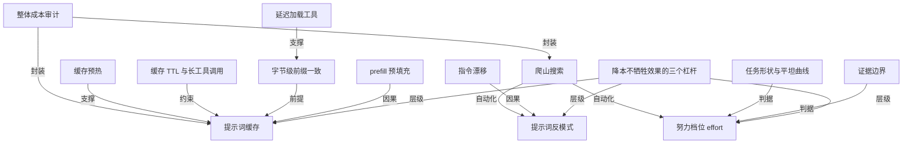

# anthropic：如何降低 claude 成本而不牺牲效果?

- 原文标题：Reducing cost and improving performance with Claude Platform
- 作者：ClaudeDevs
- 内参日期：2026-09-09
- 来源类型：twitter
- 原文：https://x.com/ClaudeDevs/status/2097369738968195513/
- 标签：Anthropic, 推理成本, context engineering

> 提高 prompt cache 命中率、清掉升级到前沿模型后残留的提示词反模式、按任务校准 effort。这三条已经写进 claude-api skill，可以直接让 claude code 拿去对自己的项目做一遍。

## 导读

anthropic 官方，如何降低 claude 成本

## 核心观点

- 成本与效果通常被当成一对取舍：想少花钱，就得接受更差的结果。Anthropic 的实践结论是，很多跑在 Claude Platform 上的应用可以在不牺牲效果的前提下砍掉成本。
- 三个可操作的杠杆：把提示词缓存命中率拉满、在升级到前沿 Claude 模型时清掉提示词里的反模式、把努力档位（effort）校准到任务本身。
- 这三条指导已经封装进 `claude-api` skill，落成三条可执行命令：`/claude-api prompt-audit`（清反模式）、`/claude-api hillclimb`（在成本与效果之间做搜索）、`/claude-api cost-optimize`（整体成本审计）。换句话说，降本从"经验活"变成了 Claude Code 里可以跑起来的确定性工序。
- 贯穿全文的判断是：多数所谓"降本必然掉点"的困境，其实是配置陈旧带来的浪费，而不是能力与价格的真实边界。

## 提示词缓存：把最贵的那一步省下来

- Claude 生成回复之前，先要把提示词处理成内部工作状态，这一步叫 _prefill_，是处理输入时最贵的部分。
- 提示词缓存保存的正是这个状态（键值缓存，即 KV cache）：当一个请求以相同前缀开头时，Claude 直接读回来，而不是重算一遍。缓存读取的计费只是完整输入价格的一个零头。
- 要让缓存真正生效，有三个硬前提：
- 提示词缓存**钉在某个具体模型**上。
  - 缓存读取要求前缀 _byte-exact_（字节级完全一致）。
  - 缓存有有限的存活时间（TTL）。
- 由此引出几条实践中最容易踩的坑：
- 谨慎在对话中途改努力档位。这些设置会被渲染进内容之前的提示词，属于被缓存的前缀的一部分；只有 Opus 5、Fable 5.1 等少数模型允许中途更新 effort 而不打破缓存。
  - 把易变值挡在前缀之外。系统提示词里一个动态时间戳或 ID，就足以在两次模型调用间改变前缀、打掉缓存。
  - 避免会自己重排的工具定义。用 messages API 时提示词按固定顺序组装、工具定义渲染在最上方，工具定义的任何变动都会打掉缓存。
  - 谨慎 fork 对话。子 agent 和分支只有在前缀逐字节相同、同一模型、同一 effort 时，才与父对话共享缓存。
- 缓存管理的修法：
- **盯住命中率**。Claude Console 和缓存诊断 API 会给出缓存未命中的原因，以及两个请求究竟在哪里分岔。
  - **延迟加载冷门工具**。把工具全部声明出来，但给少用的那些标上 `defer_loading`：它们不进入被缓存的前缀，只在 Claude 用工具搜索找到它们时才追加进对话，缓存因此得以保全。
  - **把系统提示词的更新当成消息发**。某些 Claude 模型允许在对话中途以一条消息的形式追加系统指令，而不是去改系统提示词本身，缓存得以保留。
  - **让稳定的部分待在稳定的位置**。静态上下文（工具定义与系统提示词）放前面，不断增长的对话放后面。
  - **在缓存反正要破的时刻再换模型或 effort**。像压缩（compaction）这类操作本来就会重写大半缓存，既然已经在为一次 miss 付费，那正是切换的好时机。
  - **随对话增长移动缓存断点**。Claude Platform 支持自动缓存，把断点打在最后一个可缓存块上。
  - **预热缓存**。用 `max_tokens: 0` 加一个显式缓存断点、以与真实流量相同的 effort 发一个请求：它只处理提示词并写进缓存，不生成任何内容。在会话开始时（比如用户还在打字时）跑一次，第一个真实请求就撞上热缓存。
  - **别越过 TTL**。5 分钟的 TTL 从请求开始计时；如果 agent 阻塞在超过 5 分钟的工具调用或子 agent 请求上，结果回来之前父对话的缓存已经过期——这种场景应该考虑给前缀设 1 小时 TTL。

## 指令：为旧模型打的补丁，正在拖垮新模型

- 提示词会不断累积一些用来修补模型弱点的指令，而这些指令会相对于最新 Claude 模型的能力发生漂移。为老模型准备的拐杖，到了前沿模型这里变成绊脚石，还顺带推高成本。
- 常见的提示词"反模式"：
- **验证仪式**。"double-check your work"、"verify twice before responding" 这类指令会被前沿模型照字面执行，白白烧 token。
  - **彻底性与强调助推**。"Be maximally thorough"、"CRITICAL: YOU MUST ALWAYS…" 会导致啰嗦与额外工具调用。
  - **强制流程与草稿纸脚手架**。固定步骤（如"think step by step in a scratchpad"）或推理模板，是前沿模型不需要的仪式；这层脚手架叠在原生推理之上，只会多花 token。
  - **陈旧的示例**。针对老模型失败模式调过的 few-shot 例子，会教会前沿模型在根本不需要的请求上模仿冗长推理链。
  - **自相矛盾的规则**。前沿模型更擅长遵循指令，于是"永远在政策内退款"与"未经升级绝不退款"这类冲突指令会被更字面地执行，效果反而变差。
  - **过时的配置**。为上一代 Claude 写的设置（如手动 thinking 预算）会被 Claude Platform 直接拒绝。
- 修法是 `claude-api` skill 里新增的 `/claude-api prompt-audit`：它扫描工作目录里的提示词、skill 和工具描述，既包括调用 Claude API 的应用代码，也包括 Claude Code 自身的配置（如项目记忆文件 `CLAUDE.md` 与 skills）。
- 官方做了一个干净的对照实验：在客服基准上从 Opus 4.8 迁到 Opus 5，从一份干净提示词出发，每次只种入一个反模式（一个已退役的 thinking 设置、一对互相矛盾的退款规则、一个手动草稿纸、"verify twice"、"be maximally thorough"、一套强制六步流程），得到六份"遗留提示词"。每份分别跑三种配置：Opus 4.8、只改模型 ID 的 Opus 5、以及跑过一次审计的 Opus 5。
- 结果是三点式的：只改模型 ID 反而更贵（从 2.52 分钱涨到 3.43 分钱），跑完审计后成本回落到 2.93 分钱、准确率从 89.4% 一路升到 97.0%。平均口径下，审计降本 14.6%、提升准确率 5.3%。
- 成本下降的原因是额外工具调用与重复推理被消除；准确率上升则有三个具体原因：退役的 thinking 设置让 API 直接拒掉了每一个路由请求；矛盾的退款规则让 Opus 5 扣下了四笔本该退的款去反问客户；手动草稿纸与 Opus 5 内建的思考撞车，有三张工单它把工具调用写进了推理里，从未真正执行。

## 努力档位：更高不等于更好，更低不等于更省

- 努力档位（effort）告诉 Claude "该多用力"。低档位下 Claude 更快得出结论；高档位下它会斟酌、验证、在回答前探索备选方案。
- 同一个模型上，成本与效果随 effort 的变化可以差异极大：
- Claude Fable 5 在 FrontierCode Diamond（最难的 50 个任务）上，低档位得 11.5%、每任务 5.35 美元；最高档位得 30.9%、每任务 19.00 美元。分数涨约 2.7 倍（+19 分），代价是约 3.5 倍成本。
  - Claude Fable 5.1 在 Humanity's Last Exam（不带工具）上则是一条尾部走平的陡峭曲线：低档位约 53%、每题约 0.30 美元，最高档位约 61%、约 2.23 美元；而最后一跳只多加约半分，成本却多 46%——这半分还落在基准自身的 run-to-run 噪声里，等于多花钱换不到可测量的收益。

- 校准失误可以出现在两个方向：
- **以为越高越好**。高档位会导致过度思考：Claude 花在斟酌上的时间超过任务本身的分量，成本与延迟上升，答案质量甚至可能变差。原文那句判据很硬——只有当还有证据可找时，斟酌才有用。
  - **一味压低**。设得太低，Claude 会在证据不足时就停下：它做更少的工具调用，可能拿第一条搜索结果就作答而不是看到第三条；它在难的步骤上想得更少，跳过本来会自发做的检查。"答案看起来是完成的，但它建立在不完整的信息上。"
- 校准的两条办法：
- **用低档位跑更强的模型**。一个强模型在低档位可能比一个弱模型使足了劲（高档位）更便宜。CursorBench 3.2 上，Fable 5.1 低档位达到 Fable 5 高档位的效果，成本只有三分之一。便宜来自两处：低档位下每任务做的功更少；以及 Fable 5.1 的缓存读取定价是每百万 token 0.25 美元，Fable 5 是 1.00 美元——即便按 Fable 5 的价格算，Fable 5.1 低档位也仍要便宜约 40%。
  - **理解你的任务形状**。在一组 effort 档位上扫一遍应用表现，是理解自身成本效果权衡的有效方式。在一个尚未饱和的评测上，如果成本效果曲线是平的，说明这个任务并不受思考算力约束，加大 effort 没有意义。
- 这类校准往往意味着要在多个模型与多个档位上跑评测。`/claude-api hillclimb` 把这件事自动化：它把评测切成训练集与测试集，提出配置变更，并阅读训练集里失败的样本来修正方向。
- 官方在客服基准上跑了一遍，起点是 Opus 4.8 的默认（高）档位、74.4% 的起始准确率。爬山器先试 Opus 5 低档位并做提示词审计，清掉强制工具调用仪式、草稿纸步骤与矛盾规则，训练集准确率冲到 98.9%，单张工单成本降到 2.6 分钱。它接着降到 Sonnet 5 低档位，成本进一步降到 1 分钱，但准确率跌到 88.9%；读过失败工单后，Claude 往提示词里补了路由规则和退款上限交叉引用，把 Sonnet 5 在同样成本下拉回 98.9%。
- 在搜索从未见过的 14 张留出工单上，最终配置得 90.5%，原始配置是 78.6%，成本约为原来的五分之一。

## 把降本自动化：一次整体成本审计

- 缓存、指令、努力档位是常见杠杆，官方文档里还有更多。要对调用 Claude API 的应用代码做一次整体成本审计，用 `/claude-api cost-optimize`：它先剖析钱花在哪里，再施加降本手段；如果你提供评测，它还会给出节省与效果之间的权衡。
- 剖析 token 去向有三条退路：有 Admin API key 时读组织的用量与成本报表；应用有日志时读每个 API 响应上的 usage 对象；两者都没有，就读构造请求的代码去估算。
- 随后它按可得收益排序动手：先是提示词缓存，再是精简每个请求携带的内容（含一次提示词审计），然后是约束输出，最后是把无人值守的工作改走批处理。提供评测的话，它会进一步在各 effort 档位与模型选择上计算成本与效果。
- 以 Sonnet 5 为基线，在四个公开基准上的结果：
- **LegalBench（成本降约 58%）**：跨任务缓存共享前缀、设低档位、用 Batch API 处理任务。thinking token 从 102,779 降到 8,284，通过率仍在噪声范围内。
  - **tau2-bench retail（成本降约 73%）**：通过显式放置缓存断点来实现提示词缓存，通过率持平的前提下降本 72%。
  - **OfficeQA Pro（成本降约 52%）**：加上批处理与文档缓存，成本从 136.20 美元降到 64.87 美元。
  - **SWE-bench Verified（成本降约 55%）**：默认配置本来就缓存正确，节省来自把 effort 设为 medium、并把 agent 的输出约束到几句简洁的话。每任务中位步数从 29 降到 17，提示词 token 从 7520 万降到 3370 万。

## 怎么开始：三条命令的分工

- `/claude-api prompt-audit`：刚迁移到前沿 Claude 模型、想检查存量提示词时用。它扫描工作目录里的提示词、skill 和工具描述——可以是调用 API 的应用代码，也可以是 Claude Code 自身的配置——清掉那些拖累前沿模型的常见反模式。
- `/claude-api cost-optimize`：应用在用 Claude API、你想要一次成本审计时用。它剖析 token 花销，再测试不同杠杆：会跑 `prompt-audit`，也会检查缓存、批处理、约束输出这些路径；给了评测就会顺带衡量 effort 与模型选择的权衡。
- `/claude-api hillclimb`：想在成本与效果之间做一次搜索时用。给定评测，Claude 切分训练/测试集，提出以"降本但不掉基线效果"为目标的应用改动，读失败训练样本来指导搜索，最后在留出测试集上给最终配置打分。
- 本文由 Lance Martin、Brad Abrams、Isabella He 与 Ben Lehrburger 撰写。

## 概念网络

### 关键概念

#### 提示词缓存（prompt cache）

**context**：全文第一个降本杠杆。原文的定义是：Claude 在生成回复前先把提示词处理成内部工作状态，提示词缓存保存的就是这个状态（键值缓存，KV cache）；当请求以相同前缀开头时，Claude 把它读回来而不是重算，缓存读取"billed at a fraction"于完整输入价格。

**费曼一下**：把提示词想成一道需要长时间备料的菜。每次点单都从洗菜切菜开始当然最贵；缓存的意思是把备好的料原封不动存起来，下次同样的菜直接下锅。省下来的不是做菜的钱，是备料的钱——而备料恰恰是这道菜里最贵的一步。

#### prefill（预填充）

**context**：原文明确指出 prefill 是"the expensive part of handling input"。之所以缓存值钱，正因为它跳过的是 prefill 这一步，而不是生成本身。

**费曼一下**：模型读你的提示词并不是"扫一眼"，而是把它整个消化成一份内部状态。这份消化过程要真刀真枪地算，长上下文越长越贵。理解成本结构的第一件事，就是知道钱主要花在"读"而不是"写"上。

#### 字节级前缀一致（byte-exact prefix）

**context**：缓存生效的三个硬前提之一。原文强调缓存读取必须在整个前缀上 byte-exact，还钉在具体模型上；子 agent 和分支也只有在前缀逐字节相同、同模型、同 effort 时才共享父缓存。

**费曼一下**：这不是"差不多一样"就行的匹配，而是一个字符都不能差。一个动态时间戳、一次工具定义重排、中途换一次 effort，都足以让整段前缀作废。凡是会变的东西，都要挡在前缀之外——这是缓存工程的第一纪律。

#### 缓存 TTL 与长工具调用

**context**：原文的第三个硬前提。5 分钟的 TTL 从请求开始计时，如果 agent 阻塞在超过 5 分钟的工具调用或子 agent 请求上，结果回来时父对话的缓存已经过期；这类场景建议给前缀设 1 小时 TTL。

**费曼一下**：缓存是有保质期的，而且计时从你发出请求那一刻起，不是从你用完那一刻起。agent 系统里最容易被忽略的浪费就在这里：父 agent 派活出去等结果，等着等着自己的缓存凉了，回来还得重算一遍前缀。

#### 延迟加载工具（defer_loading）

**context**：缓存管理修法之一。做法是把工具全部声明出来，但给少用的标上 `defer_loading`：它们不进入被缓存的前缀，只在 Claude 通过工具搜索找到时才追加进对话。

**费曼一下**：工具定义渲染在提示词最上方，所以工具越多、前缀越重、越容易被改动打破。延迟加载是把"武器库清单"和"随身携带"分开：全都登记在册，但只在需要时才拿出来，前缀因此保持苗条又稳定。

#### 缓存预热（pre-warm）

**context**：降延迟的技巧。用 `max_tokens: 0` 加显式缓存断点、以与真实流量相同的 effort 发一个请求，只处理提示词并写进缓存而不生成内容；在会话开始时（比如用户还在打字）跑一次，第一个真实请求就撞上热缓存。

**费曼一下**：相当于开店前先把灶台烧热。这个请求什么都不产出，唯一的作用是让下一个真实请求不必等。关键细节是 effort 必须与真实流量一致——否则热的是另一口灶。

#### 提示词反模式（prompting anti-patterns）

**context**：文章第二个杠杆的核心概念，指那些为修补旧模型弱点而写、如今反过来拖累前沿模型的指令：验证仪式、彻底性与强调助推、强制流程与草稿纸脚手架、陈旧示例、自相矛盾的规则、过时配置。

**费曼一下**：这些指令当初都是有道理的补丁——模型不够仔细，你就让它"检查两遍"。但前沿模型会更字面地执行指令，于是补丁变成了强制加班：它真的把订单查了两遍，真的做了几十次不必要的知识库搜索。补丁没有随模型一起进化，就成了负债。

#### 指令漂移

**context**：反模式之所以产生的机制。原文的说法是提示词会累积用来修补模型弱点的指令，而这些指令会相对于最新 Claude 模型的能力发生漂移。

**费曼一下**：提示词是长出来的，不是设计出来的。每次线上出问题，就往里加一句约束；模型换代了，旧约束却没人敢删。漂移不是某一次犯错，而是"当时正确"和"今天正确"之间悄悄拉开的口子——所以模型迁移的正确动作不只是换模型 ID，还得回头审一遍提示词。

#### 努力档位（effort）

**context**：第三个杠杆。原文的解释是 effort 告诉 Claude "该多用力"：低档位下更快得出结论，高档位下会斟酌、验证、探索备选方案。同一模型上，从低到最高档位可能带来 2.7 倍分数与 3.5 倍成本的组合。

**费曼一下**：这是一个可以直接拨的旋钮，控制模型愿意在一个问题上投入多少思考。它既不是"越高越准"，也不是"越低越省"——它把成本与效果的关系摊开成一条曲线，而你的任务落在曲线的哪一段，得实测才知道。

#### 证据边界

**context**：判断 effort 是否设高了的判据。原文那句是"Deliberation only helps while there's still evidence to find"——高档位导致过度思考时，成本与延迟上升，答案质量甚至会退化。

**费曼一下**：想得更久只在还有东西可查、可验证的时候才有回报。信息已经收全了还继续斟酌，多出来的不是洞见，是自我说服。反方向同样有边界：档位太低会让模型在证据不足时停下——"答案看起来是完成的，但它建立在不完整的信息上。"

#### 任务形状与平坦曲线

**context**：校准 effort 的方法论概念。在一个尚未饱和的评测上扫一遍 effort 档位，如果成本效果曲线是平的，说明这个任务并不受思考算力约束，加大 effort 没有好处。

**费曼一下**：不要问"应该用多高的档位"，要问"我的任务是什么形状"。有的任务像陡坡，多想就多得分；有的任务像平地，怎么想都一样，钱全花在无效斟酌上。曲线的形状本身就是答案，而它只能靠扫一遍测出来。

#### 爬山搜索（hillclimb）

**context**：把 effort 与模型选择的校准自动化的命令。它把评测切成训练集与测试集，提出配置变更，读失败的训练样本来修正方向；客服基准上从 Opus 4.8 高档位一路走到 Sonnet 5 低档位加改良提示词，留出集从 78.6% 升到 90.5%，成本约为原来的五分之一。

**费曼一下**：这是把"调参"变成了带反馈的搜索：每走一步都用评测打分，失败样本告诉它下一步往哪走，最后在没见过的样本上验收。关键在于它不是盲搜——读失败案例这一步，让它像人一样从错误里学，也让留出集上的分数可信。

### 概念网络

整篇文章的思想网络由一个反直觉的主张统领：**成本与效果不是零和**。这个主张不是靠态度成立的，而是靠三个各自独立、机制不同的杠杆撑起来——提示词缓存、提示词反模式清理、努力档位校准。三者与主张之间是层级关系：主张是结论，杠杆是让结论可执行的具体路径。

第一条支线围绕**提示词缓存**展开，它的价值由 **prefill** 定义：正因为把输入处理成内部状态是最贵的一步，跳过它才值钱。而缓存能否跳过这一步，由三个约束共同决定——**字节级前缀一致**是前提，**缓存 TTL** 是时间上的约束，两者共同解释了为什么所有"看起来无害"的改动（动态时间戳、工具重排、中途换 effort、fork 出去的子 agent）都会让缓存失效。**延迟加载工具**与**缓存预热**是这两个约束下的对策：前者服务于"前缀要稳定"，把易变的工具挡在缓存之外；后者服务于"缓存要热"，用一次空转请求提前把状态写好。这条支线的内在逻辑是：约束决定对策，不理解约束就会写出看似合理却打破缓存的代码。

第二条支线的因果方向很清楚：**指令漂移**产生**提示词反模式**。提示词是长出来的，每一次线上问题都留下一条补丁，而补丁不会随模型换代自动失效。反模式与主张之间构成张力——它们本是为了提升效果而写，结果同时推高了成本、降低了效果，这正是"取舍是假象"最直接的证据：审计后成本降 14.6%、准确率升 5.3%，两个方向同时改善。

第三条支线以**努力档位**为中心，但它真正的重量在两个判据上。**证据边界**从质的角度回答"想久了还有没有用"，**任务形状与平坦曲线**从量的角度回答"这个任务值不值得多想"。二者都是判据而非杠杆本身：没有它们，effort 只是一个可以乱拨的旋钮；有了它们，拨动才有方向。

最后，**爬山搜索**与**整体成本审计**是网络的收口，关系是自动化与封装。爬山搜索把 effort 与模型选择的校准变成带反馈的搜索，同时也内置了反模式清理；成本审计再往上封一层，把缓存、精简请求、约束输出、批处理按收益排序统一执行。整个网络因此形成一个从原理到判据再到工具的演化链条：先理解为什么能省，再知道省到哪里为止，最后交给命令去搜。

## 费曼 x3

多数人第一次听到"降本"，脑子里浮现的是同一张图：一条向下的曲线，你沿着它往下滑，省下的每一块钱都要用一点效果去换。这张图之所以顽固，是因为它在很多领域确实成立。但在今天的模型应用里，它多半是错的——不是因为物理定律变了，而是因为你正在为一堆早就不该存在的东西付钱。

最典型的浪费是那些当年写下来时完全正确的指令。模型不够仔细，你让它"检查两遍"；模型容易跑偏，你给它一套六步流程和一张草稿纸。这些都是补丁，是针对具体弱点的具体修复。问题在于模型换代了，补丁没有。前沿模型更擅长遵循指令，于是"verify twice"被字面执行成每次退款都重查一遍订单，"be maximally thorough"变成几十次没必要的知识库搜索。更荒诞的是那套手动草稿纸：它和模型内建的思考撞车，有三张工单模型把工具调用写进了推理里，从头到尾没有真的执行。清掉这些之后，成本降了 14.6%，准确率反而升了 5.3%——两个方向同时改善，恰恰说明之前的困境从来不是取舍，是负债。

同样的道理适用于"用力"这件事。给模型一个更高的努力档位听起来总是安全的，但斟酌只在还有证据可找的时候才有回报。当信息已经收全，多出来的思考不是洞见，是自我说服，你付的是成本和延迟的双重代价。反方向也有边界：档位压得太低，模型会在证据不足时停下，拿第一条搜索结果就作答，跳过它本来会自发做的检查——"答案看起来是完成的，但它建立在不完整的信息上"。这句话值得贴在墙上，因为它描述的是一种最难发现的失败：看起来完成了。

于是真正的问题不再是"该省多少"，而是"我的任务是什么形状"。有的任务像陡坡，多想就多得分；有的像平地，成本效果曲线怎么扫都是平的，加大努力只是把钱扔进算力。缓存那条线也是同一个思路：真正贵的不是模型说话，而是它读完你的提示词、把它消化成内部状态那一步；知道这一点，你才会明白为什么一个动态时间戳就能让整段缓存作废。

把这三件事连起来看，"降低成本"其实是"停止浪费"的另一个说法。而浪费之所以看不见，是因为它总是伪装成谨慎、周全和用力。

## 阅读原文

_Tuning prompt caching, instructions, and effort can reduce Claude's cost without sacrificing application performance._

Performance and cost are often viewed as a trade-off: to spend less, you accept worse results. In practice, we've found that many applications using Claude Platform can cut cost without giving up performance with three fixes: maximize the prompt cache hit rate, remove anti-patterns from your prompts when upgrading to frontier Claude models, and calibrate effort to the task. We've put this guidance into the [claude-api skill](https://github.com/anthropics/skills/tree/main/skills/claude-api). In this article, we show how Claude Code with the claude-api skill can often find ways to reduce cost while maintaining or improving performance.

### Prompt cache

Before Claude generates a response, it first processes your prompt into an internal working state. This step, called _prefill_, is the expensive part of handling input. Prompt caching saves that state (the key–value, or KV, cache): when a request starts with the same prefix, Claude reads it back instead of recomputing it. Cache reads are[billed at a fraction](https://platform.claude.com/docs/en/about-claude/pricing) of the full input price.

There are a few practical considerations to ensure effective use of the prompt cache. First, the prompt cache is pinned to a specific model. Second, prompt cache reads must be _byte-exact_ across the prefix. Finally, the prompt cache has a [limited time-to-live](https://platform.claude.com/docs/en/build-with-claude/prompt-caching#ttl-support) (TTL).

With these points in mind, there are a few practical tips:

- Be careful changing effort setting mid-conversation. These settings render into the prompt ahead of your content, so they are part of the cached prefix. Only with select Claude models, including Opus 5 and Fable 5.1, can you update effort mid-conversation without breaking the cache.
- Keep volatile values out of the prefix. A dynamic timestamp or ID in the system prompt can change across model calls, and break the cache.
- Avoid tool definitions that reorder themselves. When using the Claude messages API, the prompt is assembled in a fixed order with tool definitions rendered at the top. Any change to the tool definition will break the cache.
- Be careful when forking conversations. Subagents and branches only share the parent’s cache when the fork’s prefix is byte-identical, on the same model, and using the same effort.
**How to fix it**

We’ve [accumulated](https://claude.com/blog/lessons-from-building-claude-code-prompt-caching-is-everything) a few lessons for prompt cache management:

- Monitor your prompt cache hit rate carefully. Claude Console and the cache diagnostics API provide prompt cache diagnostics, including reasons for prompt cache misses (Figure 1) and exactly where two requests diverged.
- Defer rarely used tools. Declare all your tools up front but mark the rarely used ones defer_loading: they stay out of the cached prefix and are appended into the conversation only when Claude looks them up with tool search, so the cache is preserved.
- Apply system prompt updates as messages. Certain Claude models let you add a system instruction as a message mid-conversation instead of editing the system prompt, which preserves the cache.
- Lay out the request so the stable part stays stable. Add static context (tool definitions and the system prompt) first and the growing conversation behind them (Figure 2).
- Make changes to model or effort when the prompt cache will already be broken. Certain operations, like compaction, already rewrite much of the cache (the conversation). That is a good moment to switch model or effort, since you are paying for a miss anyway.
- Move the cache breakpoint as the conversation grows. With Claude Platform, you can set automatic caching to apply the cache breakpoint to the last cacheable block.
- Pre-warm the cache. To reduce latency, send a request with max_tokens: 0 and an explicit cache breakpoint, using the same effort setting as your real traffic. This processes the prompt and writes it to the cache without generating anything. If you run it at session start (for example, while a user is typing), the first real request hits a warm cache.
- Don’t exceed the prompt cache TTL. The 5-minute cache TTL counts from the start of the request. If an agent blocks on tool calls or subagent requests that run longer than 5 minutes, the parent's cache expires before the result comes back. In cases like this, consider setting a 1-hour TTL on the prefix instead.

### Instructions

Prompts can accumulate instructions that patch model weaknesses. These instructions can drift relative to the capabilities of the [latest Claude models](https://x.com/trq212/status/2080710971228918066). Here are common prompting “anti-patterns” that hobble frontier Claude models and can inadvertently increase costs:

- Verification rituals. Instructions like "double-check your work” or "verify twice before responding” are often taken literally by frontier models and can waste tokens.
- Thoroughness and emphasis boosters. "Be maximally thorough," "CRITICAL: YOU MUST ALWAYS…" can lead to verbosity and extra tool calls when working with frontier models.
- Mandatory procedures and scratchpad scaffolds. Fixed-step processes (e.g., "think step by step in a scratchpad") or reasoning templates are rituals that frontier models don't need. This scaffolding can stack on top of native reasoning and use unnecessary tokens.
- Stale examples. Few-shot examples tuned to an older model's failure modes can teach a frontier model to imitate long reasoning chains on requests that don't need them.
- Contradictory rules. Frontier models are better at instruction following. Contradictory instructions ("always refund within policy" vs. "never issue refunds without escalation") can be followed more literally by frontier models, resulting in degraded performance.
- Dated configuration. Settings written for an older Claude generation (e.g., manual thinking budgets) can be rejected by Claude Platform with newer models.
**How to fix it**

We've updated the claude-api skill with a new command that watches out for these anti-patterns. In Claude Code, run _/claude-api prompt-audit_ against your prompts, skills, or tool descriptions. The audit covers anything in your working directory, including application code that calls the Claude API and Claude Code's own configuration (e.g., [CLAUDE.md](http://claude.md/) or skills).

For example, we tested a model migration from Opus 4.8 to Opus 5 on a customer support benchmark. We started from a clean prompt and planted one anti-pattern at a time (a retired thinking setting, a pair of contradictory refund rules, a manual scratchpad, "verify twice", "be maximally thorough", and a mandatory six-step procedure), giving six legacy prompts.

We ran each on Opus 4.8, on Opus 5 with only the model ID changed, and on Opus 5 after running _/claude-api prompt-audit_ once per prompt (Figure 3 shows the average across the six).

With Opus 5, verification rituals ("_verify twice_") use unnecessary tokens by duplicating order lookup on every refund. Emphasis boosters ("_be maximally thorough_") became dozens of unneeded knowledge-base searches.

Running _/claude-api prompt-audit_ removed the anti-patterns, decreasing costs by 14.6% and increasing accuracy by 5.3% on average. Cost dropped because extra tool calls and duplicated reasoning were eliminated. Accuracy rose for three reasons. The retired thinking setting made the API reject every routing request outright. The contradictory refund rules led Opus 5 to withhold four refunds it owed while it asked the customer to confirm. And the manual scratchpad collided with Opus 5's built-in thinking: on three tickets it wrote the tool call inside its reasoning and never executed it.

### Effort

[Effort](https://platform.claude.com/docs/en/build-with-claude/effort) tells Claude “how hard to work.” At low effort Claude generally reaches conclusions faster. At high effort, Claude deliberates, verifies, and explores alternatives before answering.

Cost-versus-performance across effort levels on a single model can vary. For example, Claude Fable 5 scores 11.5% at low effort for $5.35 per task on FrontierCode Diamond (the hardest 50 tasks). At max effort, Fable 5 gets 30.9% for $19.00 per task; changing effort raises the score about 2.7x (+19 points) for about 3.5x the cost (Figure 4).

On Claude Fable 5.1, Humanity's Last Exam (without tools) shows a steep curve with a diminishing last step. It scores about 53% at low effort for about $0.30 per question and about 61% at max effort for about $2.23; the last step up to max adds about half a point for 46% more cost. The gain falls inside the benchmark's run-to-run noise, so you pay more for no measurable gain.

Effort can be miscalibrated in either direction:

- Assuming higher is always better. High effort can cause over-thinking. Claude spends more time deliberating than the task warrants, which adds cost and latency, and can degrade answer quality. Deliberation only helps while there's still evidence to find.
- Biasing to low effort. Set too low, Claude stops before it has enough evidence. It makes fewer tool calls, so it may answer from the first search result instead of the third. It thinks less on hard steps and skips the check it would normally run on its own. The answer looks finished, but it's built on partial information.
**How to fix it**

There are some useful ways to calibrate effort:

- Test stronger models at lower effort. A stronger model at low effort can be cheaper than a weaker model working hard (high effort). For example, on CursorBench 3.2, Claude Fable 5.1 at low effort matches the performance of Fable 5 at high effort at a third of the cost (Figure 5). Two things make the newer model cheaper: at low effort it does less work per task, and Fable 5.1's prompt-cache reads are priced at $0.25 per million tokens versus $1.00 for Fable 5. Even at Fable 5's prices, Fable 5.1 at low effort would cost about 40% less.
- Understand your task shape. Measuring application performance across a sweep of effort levels is a useful way to understand the cost-performance tradeoff for your particular task. On a non-saturated evaluation, a flat cost-performance curve across effort levels suggests that the task is not bound by thinking compute; increasing effort is not beneficial.
This calibration often involves running an evaluation across models and effort levels. In Claude Code, _/claude-api hillclimb_ performs this search for you: it splits your evaluation into train and test sets, proposes configuration changes, and reads failing train examples to fix what it finds.

We ran it on a customer support benchmark, starting from Opus 4.8 at its default (high) effort. The hillclimber first tried Opus 5 at low effort, applying prompt-audit to remove mandatory tool-call rituals, scratchpad steps, and contradictory rules. That cleared the Opus 4.8 baseline at 98.9% train accuracy and cut cost to 2.6 cents per ticket (Figure 6).

It then stepped down to Sonnet 5 at low effort, which was cheaper still at 1 cent per ticket, but accuracy fell to 88.9%. Reading the failing train tickets, Claude added routing rules and a refund-cap cross-reference to the prompt, bringing Sonnet 5 back to 98.9% at the same cost.

On the 14 held-out tickets the search never saw, the final configuration scored 90.5% against the original setup's 78.6%, at about one-fifth the cost.

### Automating cost reduction

Prompt caching, instructions, and effort are common levers for reducing cost. Our[documentation](https://platform.claude.com/docs/en/about-claude/models/optimizing-for-cost-and-intelligence#cut-spend-without-losing-quality) covers even more. To run a holistic cost audit of application code that uses the Claude API, we've added _/claude-api cost-optimize_: it profiles where your spend goes, applies cost reductions, and, if you provide an evaluation, shows how savings trade off with performance.

cost-optimize starts by finding where your tokens go: from your organization's[usage and cost reports](https://platform.claude.com/docs/en/manage-claude/usage-cost-api) if you have a Claude Admin API key, from the usage object on each API response if your application logs it, or, failing both, by reading your request-building code and estimating.

It then ranks the available savings, starting with prompt caching, trimming what each request carries (including a prompt-audit), bounding output, and[batching](https://platform.claude.com/docs/en/build-with-claude/batch-processing) unattended work. If you supply an evaluation, it goes further and computes cost and performance across effort levels and model choices. We ran this on four public benchmarks with Sonnet 5 as a baseline (Figure 7):

- LegalBench (~58% lower cost): cost-optimize proposed caching a shared prefix across tasks, setting low effort, and processing tasks via the Batch API. Thinking tokens fell from 102,779 to 8,284 and pass rate stayed within noise and cost dropped by ~58%.
- tau2-bench retail (~73% lower cost): By implementing prompt caching with explicit breakpoint placement, cost-optimize reduced spend by 72% while keeping pass rate flat.
- OfficeQA Pro (~52% lower cost): cost-optimize added batch processing and document caching, which brought cost down from $136.20 to $64.87.
- SWE-bench Verified (~55% lower cost): cost-optimize found that the default config already caches correctly. Savings came from setting effort to medium and constraining the agent’s output to just a few concise sentences. Median steps per task went from 29 to 17 and prompt tokens fell from 75.2M to 33.7M.

### Getting started

Start with _/claude-api prompt-audit_ when you've migrated to a frontier Claude model and want to check your existing prompts. It scans the prompts, skills, and tool descriptions in your working directory. This can be application code that calls the Claude API or Claude Code's configuration ([CLAUDE.md](http://claude.md/), skills). It removes common anti-patterns that hobble frontier models.

Reach for _/claude-api cost-optimize_ when your application uses the Claude API and you want a cost audit. It profiles token spend and then tests different levers: it applies _prompt-audit_, but also checks for ways to lower cost via prompt caching, batching unattended work, or bounding output. If you provide an evaluation, it measures the effort and model selection trade-offs.

Finally, use _/claude-api hillclimb_ for a search over cost and performance. Given an evaluation, Claude splits it into train and test sets, then proposes updates to your application that aim to reduce cost while maintaining baseline performance. Claude reads the failing train cases to guide the search, and the final configuration is scored on the held-out test set.

To learn more:

- See our documentation here
- See our cost reduction cookbook here
- See the claude-api skill here; the skill is also built into Claude Code
- See this article on the Claude Blog here
Written by Lance Martin (@RLanceMartin), Brad Abrams (@brada), Isabella He (@IsabellaKHe), and Ben Lehrburger (@benlehrburger).
