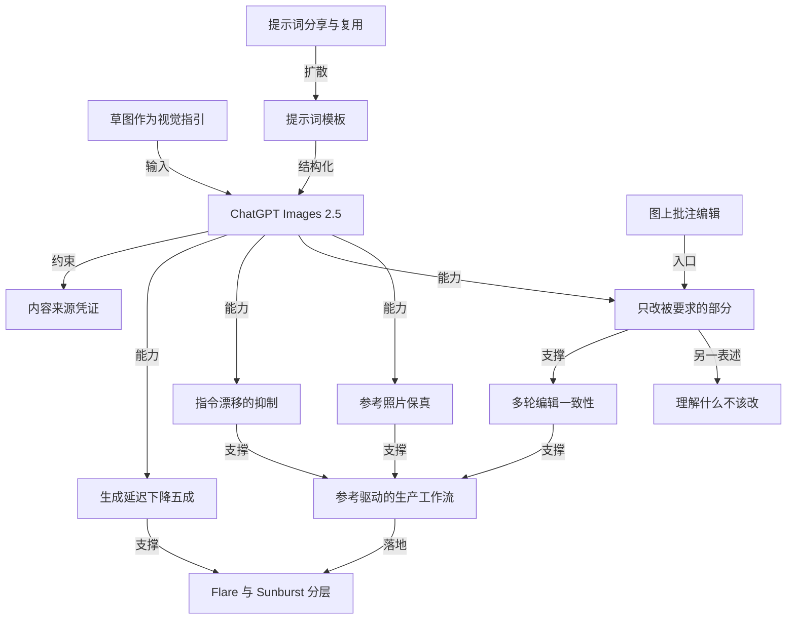

# openai 发布 chatgpt images 2.5

- 原文标题：Introducing ChatGPT Images 2.5 | OpenAI
- 作者：OpenAI
- 内参日期：2026-09-09
- 来源类型：blog
- 原文：https://openai.com/index/introducing-chatgpt-images-2-5/
- 标签：OpenAI, 多模态

> 官方发布页，主打把草图和参考照片变成更贴近原意的成图，延迟比上一代降低最多一半，多轮编辑的一致性也有改善。

## 导读

openai 发布 chatgpt images 2.5

## 核心观点

- OpenAI 于 2026 年 9 月 8 日发布 ChatGPT Images 2.5，定位是「新一代 state-of-the-art 图像模型」，四条改进齐头并进：更锐利的细节（sharper details）、更精准的编辑（more precise editing）、更快的生成（faster generation），以及围绕创作与分享的一整套新工具。
- 这次升级的重量级信号藏在使用量里：每周有超过 **30 亿张**图片在 ChatGPT Images 与 API 的 GPT-Image 系列模型上被创建出来。图像生成已经不是尝鲜功能，而是一个每周十亿量级的日常工作面。
- 模型侧的三个提升彼此咬合，指向同一个目标——让生成结果**可控**而不是碰运气：
- 光照更自然、纹理更丰富（more natural lighting and richer textures）。
  - 更好地保留参考照片里的主体（better at preserving the subjects in your reference photos）。
  - 跨多轮编辑更可靠地遵循编辑指令（follows editing instructions more reliably across multiple turns）。
- 速度是被单独拎出来说的一条：相比 Images 2.0，图像生成延迟最多降低 **50%**。原文把它的意义定义为「更快地生成图片并打磨你的概念」——快不是省时间，是让试错回路转得起来。
- 产品侧的四个新功能（Sketch、Templates、图上批注、分享 prompt）有一条共同逻辑：把「说清楚你要什么」这件难事，从纯文字提示中卸载出来，交给草图、模板、位置和他人的现成配方。
- 开发者侧首次做出**分层**：GPT-Image-2.5 Flare 走「多数场景的默认选择」，Sunburst 走「用更长生成时间换更高精度」的高端路线——同一代能力被切成速度档与精度档两条产品线。

## 发布内容与可用范围

- 模型名称：ChatGPT Images 2.5，发布日期 2026 年 9 月 8 日，归类为 Product 发布。
- 一句话定位（原文副标题）：更锐利的细节、更快的生成、更精准的编辑，以及更好的创作与分享工具。
- 用量基线：每周超过 30 亿张图片跨 ChatGPT Images 与 API 的 GPT-Image 模型被创建。
- ChatGPT 侧可用范围：**所有** ChatGPT、ChatGPT Work 和 Codex 用户，覆盖 desktop、mobile、web，且是**所有 tier**（rolling out today to all tiers），当天开始推送。
- API 侧同步上线两个新模型：GPT-Image-2.5 Flare 与 GPT-Image-2.5 Sunburst，定价见官方 API 定价页。

## 图像保真：从参考照片出发

- 原文给出的价值判断很朴素也很关键：**最有意义的图片，是那些扎根于真实的人、地点和记忆的图片**（feel grounded in the real-life people, places, and memories they're based on）。这句话定义了「保真」为什么重要——不是技术指标，是图片与真实生活的连接不被切断。
- Images 2.5 在参考照片工作流上的三处改进：
- 更擅长把熟悉的主体迁移到新的场景、视觉风格和构图中（transform familiar subjects across new settings, visual styles, and compositions）。
  - 图中主体更可辨识（more recognizable），光照与纹理更自然。
  - 独特的个人特征更可能被带过去（distinctive features are more likely to carry through）——这是「像不像本人」的核心判据。
- 开发者含义：同一份保真能力让 **reference-led workflows**（参考驱动的工作流）更可靠，多个变体可以持续锚定在原始素材上，而不是越生成越走样。

## 精准编辑：模型理解「什么不该改」

- 目标表述：让你更容易做**聚焦的编辑**（focused edits），最终图片更贴近你脑子里原本想要的东西。
- 能力表述的重心不在「改得多好」，而在「不该改的地方有没有被动」：Images 2.5 更擅长**只编辑你要求的部分，其余细节保持不变**（editing only what you've asked for, while keeping the rest of the details the same），即使主体与背景更复杂也成立。
- 开发者含义写得非常具体：可以只更新单个元素——某个产品、某段背景、某句文案——同时保留主体、构图和周围的品牌处理（preserving the subject, composition, and brand treatment around it）。这正是商业创意生产里最费人工的那一步。
- 原文用多张图片串成的视频来展示这项能力，强调的是「遵循精确编辑指令」的可复现性，而非单张出图的惊艳度。

## 多轮编辑一致性

- 场景限定在**较长的 ChatGPT 对话**中：Images 2.5 能跨多次编辑更可靠地遵循具体指令。
- 两个具体承诺：
- 早先做过的改动更可能保持一致（earlier changes are more likely to stay consistent），不会在第五轮把第二轮的成果抹掉。
  - 每一次新编辑建立在已有成果之上，**不随轮次增加而画质降级**（without degrading image quality over time）。
- 生产工作流含义：开发者可以做定向修改而**不必重建整个资产**（without rebuilding the entire asset）——这是把图像生成从「一次性出图」变成「可维护资产」的前提。

## 智能与风格：复杂指令不漂移

- 理解力提升：更擅长理解复杂的视觉指令，并把它们翻译成连贯的结果（coherent results）。
- 三个具体维度：
- 包含真实世界信息的图片，内容更准确（more accurate content）。
  - 能处理更复杂的版式，**包括透明背景**——这是设计与前端场景的硬需求。
  - 更好地体现视觉风格，让成图更贴合你的艺术意图。
- 对开发者与企业的意义被概括成一个词：复杂 creative brief 更**可靠**。关键机制是——指令越具体，模型越不会漂移（instead of drifting as instructions become more specific），会保住被要求的视觉方向、构图和单项细节。
- 原文点名三类落地场景：成系列的 on-brand 创意资产、保留既定层级的 UI 概念稿、符合定义结构的演示视觉。

## ChatGPT 侧的四个产品功能

- **Sketch（草图）**：原文的动机句是「有时候解释一个想法最清楚的方式就是把它画出来」。你可以直接在 ChatGPT 里画——房间的布局、正在构思的一件衣服的轮廓，或者只是一个搞笑涂鸦——模型把粗糙的手绘变成完整图像；再补一段风格与细节描述即可。用法是在 ChatGPT 里输入 @Sketch。原文特意强调：你不需要是专业画家。
- **Templates（模板）**：针对最常见的创意格式提供模板，比如「Poster」「Merch」，此外还提到 flyers 与 product photos 一类格式。它替代的是「从空白画布开始」——你选模板，然后填要传达的信息、设计元素、风格偏好。
- **图上批注（comments on images）**：可以把评论直接**放在图片上**，用于更聚焦的编辑。位置本身成了指令的一部分。
- **分享 prompt**：分享图片时可以选择把生成它的 prompt 一起带上，别人拿到后可以换成自己的照片和细节跑出属于自己的版本。原文举的例子是一条正在流行的 prompt——看看你在 80 年代会长什么样。

## API 侧：Flare 与 Sunburst 两个模型

- 背景：开发者每天都在用 Images API 为创意、营销、零售和媒体团队构建图像生成工作流。
- **GPT-Image-2.5 Flare**
- 把同样的质量、编辑和速度改进带到 API，是**多数应用的默认选择**（the default choice for most applications）。
  - 定量说法：比 GPT-Image-2 出图质量更高，同时延迟**低 50%**。
  - 适用场景：创作者与社交内容、产品体验、视觉搜索、快速图像原型、高吞吐量生成。
- **GPT-Image-2.5 Sunburst**
- 面向**高端视觉工作流**，靠更长的生成时间换取跨多次编辑的更强控制力（tighter control across edits）。
  - 适用场景：可直接投产的 campaign creative、精修过的产品图。
- 分层逻辑清晰：Flare 是速度与性价比档，Sunburst 是精度档；两者是同一代能力的两种取舍，而非新旧版本关系。

## 早期客户实测与安全承诺

- **Higgsfield AI**，Head of Product Axultan Alimkulov：最打动他们的是模型「**理解什么不该改**」——你可以做一次有意义的编辑，而不丢掉原图的 character、composition 和 visual identity。他强调这对影视、UGC 和广告场景中创作者与团队的真实工作方式极其重要，再叠加速度、质量与成本，Flare 显得突出。
- **Adobe**，Senior Director, Product Matt Chotin：Adobe Firefly 作为创意 AI studio 把多家领先 AI 模型和 Adobe 专业工具汇到一处，此次把 GPT-Image-2.5 引入 Firefly，带来更快的生成与**分辨率一致性**，让图片在每一轮打磨后仍然锐利、写实。
- **Manus**，Evaluation Team 的 Lucky Liao：在他们的评测中，Flare 以 GPT-Image-2 的 **2 到 4 倍速度**交付高质量图像；改进后的透明背景生成让它非常适合品牌资产、演示和网站类创意工作。
- **安全**：Images 2.5 建立在既有防护之上，对 prompt 和图片双向做检查以防止有害输出；继续使用 **C2PA 元数据**与**隐形水印**帮助识别由 OpenAI 工具生成的图片；评测与方法细节公布在 system card 中。

## 概念网络

### 关键概念

#### 参考照片保真（reference fidelity）

**context**：全文第一个能力分区的主题。原文的立论前提是「最有意义的图片扎根于真实的人、地点和记忆」，因此模型的价值不在于凭空造图，而在于把熟悉的主体迁移到新场景、新风格、新构图时，主体依然可辨识、distinctive features 依然被带过去。婴儿肖像的前后对比是这一能力的实证。

**费曼一下**：你把一张老照片给它，说「换成礼服」。及格线不是礼服画得好不好，而是照片里的那个人**还是不是那个人**。保真说的就是：脸、姿势、光线、背景都还认得出来，只有你点名的那件事变了。

#### 只改被要求的部分（precision editing）

**context**：Images 2.5 的第二个能力分区，表述是「editing only what you've asked for, while keeping the rest of the details the same」，且在主体与背景更复杂时依然成立。API 侧的对应说法是只更新单个元素而保留主体、构图与品牌处理。

**费曼一下**：修图的痛苦从来不是改不动，而是一改全乱——换个背景，人的头发边缘也跟着变了。精准编辑的意思是模型学会了克制：你说改哪儿就只动哪儿，剩下的原封不动。

#### 理解「什么不该改」

**context**：来自 Higgsfield AI 产品负责人的评价——「what impressed us most is how well it understands what not to change」。它是从用户视角对精准编辑的重新表述，落点是原图的 character、composition 和 visual identity 不被破坏。

**费曼一下**：这是把模型能力翻译成了另一种语言：评价一个图像模型，看的不只是它能画什么，还要看它**忍住不画**什么。会做加法的模型很多，知道该保留什么的很少。

#### 多轮编辑一致性（multi-turn consistency）

**context**：针对较长 ChatGPT 对话的能力承诺——跨多次编辑更可靠地遵循指令，早先的改动保持一致，每次新编辑在已有成果上叠加而不随时间降质。

**费曼一下**：跟模型来回改十轮，最怕第九轮把第二轮的成果悄悄抹了，画质也一轮比一轮糊。一致性就是让这条编辑链**不掉链子**：改到第十轮，前九轮的决定都还在。

#### 指令漂移（drift）

**context**：在「智能与风格提升」分区被点名——模型「不会随着指令变得越来越具体而漂移」（instead of drifting as instructions become more specific），从而让复杂的 creative brief 变得可依赖。

**费曼一下**：漂移是这样一种失败：你的要求越细，模型越顾此失彼——满足了第三条，第一条又丢了。不漂移意味着要求可以叠加，而不是互相挤兑。

#### 生成延迟作为创作变量

**context**：原文把「相比 Images 2.0 延迟最多降低 50%」的意义直接绑定到创作行为上——「so you can generate images and refine your concepts more quickly」；Manus 的评测则给出 2 到 4 倍速度的第三方数据。

**费曼一下**：等 30 秒和等 5 秒，不只是省了 25 秒。前者你会小心翼翼一次问对，后者你会随手多试五个方向。速度变的不是时间账，是你**敢不敢试**。

#### 草图作为视觉指引（Sketch）

**context**：ChatGPT 新功能，允许直接在对话里画，把粗糙手绘当作最终图像的 visual guide，再叠加风格与细节的文字描述；原文明确说「你不需要是专业画家」。

**费曼一下**：有些东西写一百个字也说不清——比如「沙发放在窗户左边偏后一点」。画两笔就完了。Sketch 的作用是给提示词补上一个**空间维度**的输入通道。

#### 提示词模板（templates）

**context**：面向 Poster、Merch 等最流行的创意格式提供起步模板，替代「从空白画布开始」，用户在模板里填要传达的信息、设计元素与风格。

**费曼一下**：空白页是创作最大的敌人。模板不是限制你，而是**先替你把问题问好**——它知道一张海报需要哪几样东西，你只管往里填。

#### 提示词分享与复用

**context**：分享图片时可以选择附上生成它的 prompt，别人可以带着自己的照片和细节跑出属于自己的版本；原文以一条正在流行的 80 年代风格 prompt 为例。

**费曼一下**：好图片过去只能被欣赏，现在可以被**继承**。附带的 prompt 就像菜谱——你不是拿走这盘菜，你拿走了做法，回家用自己的食材再做一遍。

#### 参考驱动的生产工作流（reference-led workflow）

**context**：面向 API 用户的概念——保真能力让参考驱动的工作流更可靠，多个变体可以持续锚定在原始素材上；配合精准编辑与多轮一致性，构成「不必重建整个资产」的生产模式。

**费曼一下**：企业要的不是一张惊艳的图，而是**一百张彼此认得出是一家人**的图。参考驱动的意思是：所有产出都绑在同一份原始素材上，改哪张都不脱队。

#### Flare 与 Sunburst 的速度—精度分层

**context**：API 侧同代两个模型的取舍设计。Flare 是多数应用的默认选择，质量高于 GPT-Image-2 且延迟低 50%，服务高吞吐场景；Sunburst 用更长生成时间换取跨编辑的更强控制，服务可投产的 campaign creative 与精修产品图。

**费曼一下**：不是一个快版一个慢版，而是**两把不同的刀**。日常量产用快的那把，最后要交付客户的那几张用慢的那把。选型问题从「用不用」变成了「这一步值不值得多等」。

#### 内容来源凭证（C2PA 与隐形水印）

**context**：安全承诺的技术载体——对 prompt 与图片双向做安全检查之外，继续用 C2PA 元数据和隐形水印帮助识别由 OpenAI 工具生成的图片。

**费曼一下**：图片越真，「这是不是 AI 做的」就越难靠肉眼回答。所以答案被写进了图片自己身上：一层是可读的出身档案，一层是看不见但机器认得的记号。

### 概念网络

这张网络的枢纽是 ChatGPT Images 2.5 本身，但真正的骨架不在「模型出了什么新版本」，而在**一条从可控性通向可生产性的链条**。

第一层是三项模型能力：参考照片保真、只改被要求的部分、抑制指令漂移。它们看似分属不同分区，指向的却是同一件事——**把不确定性从生成过程里挤出去**。保真管的是「主体不变形」，精准编辑管的是「未指定处不变」，抗漂移管的是「要求越细越不失守」。三者合起来回答了图像模型最难的那个问题：我能不能预期它会给我什么。

「理解什么不该改」是这条链上一个特殊的节点——它不是新增能力，而是客户实测对精准编辑的**重新命名**。这个重命名很有价值：它把评价坐标从「生成力」挪到了「克制力」，也解释了为什么专业团队会为一个「少动一点」的模型买单。

第二层是能力的时间维度。多轮编辑一致性建立在精准编辑之上：单次能做到只改一处，才谈得上十次之后前九次的成果都还在。而图上批注是精准编辑的**交互入口**——把「改哪儿」从文字描述变成了位置指认，让指令的歧义在源头被消掉。

第三层是这些能力汇入的**参考驱动的生产工作流**：保真提供锚点，多轮一致性提供可维护性，抗漂移提供可依赖性，三条支流汇成同一句承诺——不必重建整个资产。这是全文从「个人创作」跨向「团队生产」的转折点。

Flare 与 Sunburst 的分层，则是这个工作流在商业上的**落点**。它同时接收两股输入：延迟下降五成让 Flare 的高吞吐定位成立，生产工作流的成熟让 Sunburst 的精度溢价有人愿意付。分层不是营销切分，而是承认同一份创意流程里，不同环节对速度与精度的需求本就不同。

输入侧的三个功能自成一组小网络：草图给模型补上空间输入，模板把「怎么问」结构化，而提示词分享让好的模板在人与人之间扩散——一个人问对了，所有人都能问对。它们共同缓解的是同一个瓶颈：**人类描述视觉意图的能力，才是图像生成真正的天花板**。

最后，内容来源凭证是横在整张网络之上的约束条件。它与所有能力节点的关系是反向的：模型越保真、越自然、越像真的，凭证机制就越不可省。这条边不指向能力增长，而指向能力增长必须自带的代价。

## 费曼 x3

判断一个图像模型是不是真的进步了，最好的问题也许不是「它能画出什么」，而是「它敢不敢什么都不画」。

这听起来像个悖论，直到你真的用它干活。你有一张孩子的老照片，想把红色的旧毛衣换成礼服。模型给你返回一张漂亮的图——礼服无可挑剔，可照片里的孩子已经不太像你的孩子了。眼神变了，脸型圆了一点，连身后那面蓝色背景布的光斑都换了位置。技术上它完成了任务，情感上它毁掉了这张照片存在的全部理由。有意义的图像之所以有意义，是因为它扎根于真实的人、地点和记忆；一旦主体的辨识度被抹平，剩下的再精美也只是一张陌生人的效果图。

所以这一代模型最值得注意的能力，被一位早期客户说得比官方文案更准：最打动人的是它**理解什么不该改**。你可以做一次有分量的编辑，而不丢掉原图的性格、构图与视觉身份。这是一种非常反直觉的产品指标——我们习惯了用生成力衡量模型，而真正让专业团队愿意付钱的，是克制力。广告、影视、UGC 里的日常劳动，绝大部分不是从零创造，而是在一个已经通过审核的画面上，只动那一个必须动的元素，其余分毫不许移位。

这种克制一旦具备时间维度，性质就变了。单次编辑做到只改一处，是修图工具；改到第十轮，前九轮的决定都还在、画质也没有一轮轮糊掉，那才叫**资产**。它的直接后果是不必重建整个资产——图像从一次性的产物，变成了可以持续维护的东西。这大概是整件事里最具产业含义的一句话：能被反复修改而不崩坏的东西，才配被称为资产。

还有一层容易被当作性能参数滑过去的东西：延迟砍掉一半。省下的那几十秒并不重要，重要的是它改变了人的行为。等待很久时，你会逼自己一次把话说对，只提一个方向；几乎不等时，你会随手试五个方向再挑一个。速度真正买到的不是效率，是**试错的意愿**。

而草图、模板、在图上直接批注、把提示词随图分享出去——这四件事看似零散，其实在解同一道题。图像生成的天花板从来不在模型这边，而在人类描述视觉意图的能力上。有些东西写一百个字也说不清，画两笔就够了；有些格式你根本不知道该交代哪几件事，直到有人先替你把问题问好；而当一条好用的提示词可以随图片传给下一个人，问对问题的能力第一次开始在人群里流通。

当图片越来越难以和真实区分，答案被写回了图片自身：一层可读的出身档案，一层看不见却机器认得的水印。能力每往真实靠近一步，凭证就得往前追一步——这不是附加条款，而是这类能力必须自带的成本。

## 阅读原文

September 8, 2026

[Product](https://openai.com/news/product-releases/)

Sharper details, faster generation, more precise editing, and better tools for creating and sharing.

Loading…

Share

Every week, people create more than 3 billion images across ChatGPT Images and the GPT‑Image models in the API. Today, we’re expanding what you can create with ChatGPT Images 2.5—our new state-of-the-art image model that brings sharper details, more precise editing, and faster generation to your creative workflows.

Images 2.5 produces more natural lighting and richer textures, is better at preserving the subjects in your reference photos, and follows editing instructions more reliably across multiple turns. We’ve also reduced image generation latency by up to 50% compared with Images 2.0, so you can generate images and refine your concepts more quickly.

In ChatGPT, we’re introducing product features that give you more control over the creative process. [Sketch⁠](http://chatgpt.com/sketch) is a new feature that lets you draw directly in ChatGPT as a reference for your final image. Templates make it easier to start creating across some of the most popular image formats, like flyers and product photos. You can also now place comments directly on images for more focused editing, and you can share prompts you’ve used to let others try your ideas with their own photos and details.

Images 2.5 is available to all ChatGPT, ChatGPT Work, and Codex users across desktop, mobile, and web.

For developers, we’re introducing two new models in the API. GPT‑Image‑2.5 Flare brings the same improvements in quality, editing, and speed, and GPT‑Image‑2.5 Sunburst offers an extra level of precision for detailed creative work with longer generation times.

### Image fidelity as you create

The most meaningful images feel grounded in the real-life people, places, and memories they’re based on. Images 2.5 is better at working from reference photos to transform familiar subjects across new settings, visual styles, and compositions. Image subjects look more recognizable, lighting and textures feel more natural, and distinctive features are more likely to carry through.

For teams building with the API, this same fidelity makes reference-led workflows more reliable, so variations can stay anchored to the original source.

ChatGPT Images 2.5

Input

### Precision editing

We’ve made it easier for you to make focused edits, so you end up with final images that are more aligned with what you actually had in mind. Images 2.5 is better at editing only what you’ve asked for, while keeping the rest of the details the same—even with more complex subjects and backgrounds.

For developers using the Images API, this gives users the ability to update a single element—such as a product, background, or piece of copy—while preserving the subject, composition, and brand treatment around it.

The following videos are made up of multiple images, highlighting the model’s improved ability to follow precise editing instructions.

### Multi-turn editing consistency

During longer ChatGPT conversations, Images 2.5 follows specific editing instructions more reliably across multiple edits. Earlier changes are more likely to stay consistent, and each new edit builds on the work you’ve already done without degrading image quality over time.

That consistency also matters in production workflows, where developers need to make targeted changes without rebuilding the entire asset.

The following videos are made up of multiple images, highlighting the model’s improved ability to maintain image quality over multiple turns.

### Intelligence and style improvements

Images 2.5 is better at understanding complex visual instructions and translating them into coherent results. Images that include real-world information have more accurate content, and the model can handle more complex layouts including transparent backgrounds. It’s also better at reflecting visual styles, so your images are more aligned with your artistic vision.

For developers and businesses, this makes complex creative briefs more dependable. The model is more likely to retain the requested visual direction, composition, and individual details, instead of drifting as instructions become more specific. That matters when generating a series of on-brand creative assets, UI concepts that preserve a given hierarchy, or presentation visuals that fit a defined structure.

### Use Sketch to draw your idea to life

Sometimes the clearest way to explain an idea is by drawing it.

We’re introducing Sketch, a new feature which lets you draw right in ChatGPT and use it as a visual guide. Now you can quickly sketch the layout of a room, the contour of an outfit you’re concepting, or just a funny doodle, and ChatGPT will turn your rough art into a complete image. Add a description of the style and any other details you want to make sure it reflects your vision.

You don’t need to be a professional artist—this is just another way to get your final image closer to what you have in mind. To [try it yourself⁠](http://chatgpt.com/sketch), just type “@Sketch” in ChatGPT.

### Structure your prompts for better results

At times you may have a clear idea of what you want to make—you just need some help getting started.

We’re introducing templates for some of the most popular creative formats. Instead of starting with a blank canvas, you can choose a template like “Poster” or “Merch” and add details like information to convey, design elements, or styles to personalize your results.

### Pass your best ideas along

Often you end up with an image that’s too good not to share.

Now when you share an image, you can also choose to include the prompt that got you there. Someone else can then run with the same idea, bringing in their own images and details to make a version that feels like their own.

For example, try out [this prompt⁠](https://chatgpt.com/s/p/_659f135ed2ec8191a208f4f16a769813) that’s currently going viral to see what you would’ve looked like in the ’80s!

### Images 2.5 in the API

Developers are building image generation workflows into products used by creative, marketing, retail, and media teams every day with the Images API.

We’re releasing two new image models in the API:

**GPT‑Image‑2.5 Flare** brings the same improvements in quality, editing, and speed to the API and is the default choice for most applications, delivering higher-quality images than GPT‑Image‑2 at 50% lower latency. It’s well suited to everything from creator and social content to product experiences, visual search, rapid image prototyping, and high-volume generation.

**GPT‑Image‑2.5 Sunburst** is built for premium visual workflows that benefit from tighter control across edits. Use it for creative and editing workflows like production-ready campaign creative or polished product imagery.

Here’s what early customers have to say about the new models:

1 of 3

> “What impressed us most about GPT‑Image‑2.5 Flare is how well it understands what not to change. You can make a meaningful edit without losing the character, composition or visual identity of the original image. That’s incredibly important for the way creators and teams actually work across film, UGC and advertising. And when you combine that level of control with the speed, quality and cost, GPT‑Image‑2.5 Flare really stands out.”

Axultan Alimkulov, Head of Product at [Higgsfield AI⁠](https://www.google.com/goto?url=CAESbQHrOzAVwaC4mMzkDwB%5C_AWqYHCnQHnG8LoR5JV63vIE4AqYgpjsoWdvWQ9My-wmLRXhLm0GlpbSzXFo4%5C_g2dSbpPYr72HGabUWp7kcxlJuiP03CaQF%5C_9S2B81z6rqVbNkKJFmIXLui4IOpJXiNE)

> “Adobe Firefly, our creative AI studio, gives creators flexibility and control as they move from idea to finished content, bringing together leading AI models and Adobe's pro-grade tools in one place. We're excited to expand that choice with OpenAI's latest GPT‑Image‑2.5 models now in Firefly, bringing faster generation and resolution consistency that keep images sharp and photorealistic through every refinement.”

Matt Chotin, Senior Director, Product at Adobe

> “GPT‑Image‑2.5 is an impressive step forward. In our evaluations, Flare delivers high-quality images at two to four times the speed of GPT‑Image‑2. With improved transparent-background generation, it is an excellent fit for creative work on Manus, from brand assets to presentations and websites.”

Lucky Liao, Evaluation Team at Manus

- Higgsfield AI
- Adobe
- Manus
- Higgsfield AI
- Adobe
- Manus

### Our commitment to safety

We’re building image generation to be useful, creative, and safe. ChatGPT Images 2.5 builds on our existing safeguards, with checks on prompts and images to help prevent harmful outputs. We continue to use C2PA metadata and invisible watermarking to help identify images made with our tools. You can read more about our evaluations and approach in the [system card⁠](https://deploymentsafety.openai.com/chatgpt-images-2-5).

### Pricing and availability

Images 2.5 is rolling out today to ChatGPT, ChatGPT Work, and Codex users across all tiers on desktop, mobile, and web.

GPT‑Image‑2.5 Sunburst and GPT‑Image‑2.5 Flare are available in the API. See [pricing details here.⁠](https://openai.com/business/pricing/#api)

- 2026
- ChatGPT

### Author

OpenAI

### Keep reading

[View all](https://openai.com/news/)

[GPT-6 Astra: A new generation of intelligenceResearchSep 3, 2026](https://openai.com/index/gpt-6-astra/)

[ChatGPT can now connect to healthcare sourcesProductSep 1, 2026](https://openai.com/index/chatgpt-connects-health-records-and-healthcare-sources/)

[A milestone in expanding access to AIProductAug 31, 2026](https://openai.com/index/expanding-access-to-ai-with-chatgpt-ads/)
