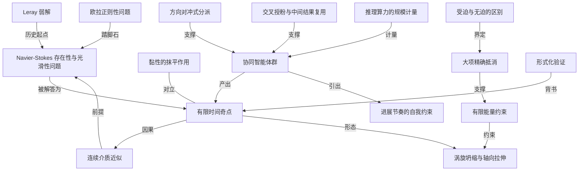

# openai 官宣：内部 ai 系统给出了 navier-stokes 的解

- 原文标题：On the Navier–Stokes Millennium Prize Problem
- 作者：OpenAI
- 内参日期：2026-09-09
- 来源类型：blog
- 原文：https://openai.com/index/navier-stokes-solution/
- 标签：数学, OpenAI, agents

> openai 称其内部系统证明了三维流体运动可以在有限时间内形成奇点，同时放出证明文稿与 lean 形式化版本。这是今天所有讨论的原点，看争议之前先看这一份。

## 导读

ai 能力的又一个重大突破

## 核心观点

- openai 宣布：一个内部 ai 系统解决了 Navier–Stokes 存在性与光滑性问题——七个千禧年大奖难题之一，悬置约 90 年。
- 结论方向是**否定**的：三维不可压缩、常密度流体的 Navier–Stokes 方程，可以在有限时间内发展出奇点（速度无界增长），即使初始运动是光滑的、即使黏性一直在起抹平作用。这对应官方问题表述中的陈述「C」（同时也给出「D」）。
- 交付物有两件：一份解析证明的 writeup，和一份 Lean 形式化证明——后者意味着结论可被机器逐步检验，而不只是靠同行阅读来背书。
- 产出方式是本文真正的信息量所在：不是一个模型一次推理，而是一套**协同智能体系统**——单个问题组曾同时跑到约 10000 个并发 agent，88 小时得解，全过程 490 万条消息、约 3000 亿 output token。
- openai 把这次发布定性为「进展的快照，而非顶点」，并明确表示不打算领取千禧年大奖奖金；文末落到「可引导、可问责、与人相连」的能力节奏问题上。

## 宣布了什么

- 解决对象：Navier–Stokes existence and smoothness problem，克雷数学研究所 2000 年设立的七个千禧年大奖难题之一。
- 证明由「一个内部 openai 系统」产生，所用模型「显著强于 GPT‑6 Astra」，且该模型训练仍在进行中，性能仍在提升。
- 同时公开证明写作稿与 Lean 形式化版本。
- openai 给出的动机是双重的：一是让科学家借 ai 推进研究，二是「让世界了解 ai 进展的速度、以及对即将到来的模型该有什么预期」——后半句是本文的隐性主题。

## 问题本身：难在「连续介质近似会不会自己崩掉」

- Navier–Stokes 方程用牛顿第二定律（F=ma）描述流体运动，关键前提是把流体当作**连续介质**，而不是逐个追踪分子。
- 它是工程主力工具：飞行器设计、天气预报、血流研究都建立在它之上。
- 开放问题的准确问法：三维不可压缩、常密度流体，从光滑的初始运动出发，方程能否发展出「奇点」——流体速度在**有限时间内**无界增长？
- 难点在于**黏性**始终在把运动抹平；奇点必须在这道阻力之下依然形成。
  - 一旦成立，意味着真实流体不可能无限快，所以这标志着方程作为模型的**失效边界**：越过它就只能回到逐粒子追踪。
- 问题谱系：方程源自 19 世纪 Claude-Louis Navier 与 George Gabriel Stokes；1934 年 Jean Leray 证明了广义意义上的解存在（弱解），但「是否始终保持光滑」成为悬而未决的中心问题；2000 年被列入千禧年大奖难题。

## 结果：一个能量始终有限的自吹爆涡旋

- 所证内容：一个初始静止且光滑的流体，在一个**光滑外力**作用下，可以在有限时间内形成奇点；整个动力学过程中流体的**能量始终有限**。
- 解的形态是一个涡旋：向内螺旋收缩，同时被越拉越长，「像意大利面」；中心区域一边收缩一边加速，且加速方式恰好让能量保持有限——这是物理定律的硬要求。
- 真正的技术挑战不是造出爆炸，而是让爆炸**由流体自身的运动产生**，而不是靠人为塞进一个无穷大的力。
- 数学上的说法：方程中描述运动的各项——加速度、压强梯度、动量输运、黏性——必须同时变得**很大**，却又以精确的方式**相互抵消**。
  - 这种精细平衡的结果是：即使流体速度无界增长，外力仍然保持光滑。这正是「C」这类陈述被判定为成立所需要的构造。

## 怎么找到的：一场有组织的并发搜索

- 起点是能力的台阶式跃升：自 8 月 28 日起训练的新内部模型，在包括数学在内的内部基准上表现「前所未有」。
- 触发点是外部信号：9 月 1 日周二，openai 听到「有两个千禧年难题被解决了」的传闻，随即启动了一次对**所有开放千禧年难题**加若干高影响问题的评估。
- 系统形态：由内部模型驱动的**协同 agent 系统**。
- agent 可用工具包括读取**互联网缓存版本**和运行代码。
  - agent 被切分为若干组，组内可互相通信；组的规模不等，产出 Navier–Stokes 结果的那一组量级约为 **10000 个并发 agent**。
  - 全程维持与前沿模型评估同等的安全防护，包括监控与隔离。
- 方向对冲的做法：对同一个问题，把不同变体分派给不同 agent 组——「A」「B」（会导向证明）与「C」「D」（会导向否证）分别投放。换句话说，他们**不预设答案方向**，而是把两个相反方向同时押上。
- 关键的踏脚石是「更简单的问题」：把黏性项去掉后的极限情形，即欧拉方程的正则性问题。
- 近 100 个 agent 协作约 50 小时，给出了**无外力（unforced）版本**的欧拉爆破否证，这一结果出乎团队意料。
  - 看到欧拉解之后，团队判断 Navier–Stokes 最有希望，于是把其他千禧年问题上的算力抽回，并把欧拉结论作为提示喂给这些 agent。
- 过程中的两个工程手法：
- 模型热更新——训练出更强版本后，直接把 agent 切到新模型。
  - **交叉授粉**——鼓励各组走不同路线，一段时间后用 Codex 把各组最有用的洞见汇总，再据此生成后续提示；这些提示取材于 agent **自己的中间结果**。最终得解的那一组正是这样被引导的。
- 时间与代价账：9 月 5 日周六得到结论，距首批 agent 启动约 88 小时；Lean 形式化与验证再花 17 小时，由 GPT‑6 Astra 完成。
- 所有尝试问题合计：490 万条消息、约 3000 亿 output token。
  - 仅 Navier–Stokes 一题：270 万条消息、约 1300 亿 output token。

## 并行工作与优先权

- 触发这次冲刺的传闻，后来被确认与 Levent Alpöge（Anthropic 员工）和 Tristan Buckmaster（纽约大学数学教授）有关。
- 9 月 6 日完成全部工作与 Lean 验证后，openai 主动联系对方，提出联合发布并承认对方优先权；接触后才发现对方解决的是**受迫欧拉问题**。
- openai 表示向对方开放了全部所用提示，以及后续查看证明；并公开承认对方在受迫欧拉问题上的优先权。
- 数据边界的自我声明：研究者与 agent 在对方公开之前没有通过任何途径看到其工作，未访问任何具体用户数据；但不能完全排除源自对方使用产品的**去标识化数据**曾帮助改进模型。openai 同时指出两边的证明差异显著，欧拉情形下所证的精确结论也不同（受迫 vs 无迫）。

## 进展与责任

- 发布目的被明确为「报告 ai 模型的实质性进展」，并声明**不打算领取**千禧年大奖。
- 这项里程碑被归功于数学家与 ai 研究者的共同工作，但被定性为「不是顶点，而是 ai 发展进程的一张时间快照」。
- openai 表示自己已进入「ai 进展的下一个阶段」，当前重心是**理解这个模型**，并用学到的东西来引导和**把握推进能力的节奏**。
- 落脚的目标是构建可引导、可问责、与人相连的 ai 系统——原文措辞是这「可能需要对进展速度做出更审慎的选择」。

## 概念网络

### 关键概念

#### Navier–Stokes 存在性与光滑性问题

**context**：本文的解决对象，克雷数学研究所 2000 年设立的七个千禧年大奖难题之一。问题问的不是方程有没有解，而是三维不可压缩流体从光滑初值出发的解**是否始终保持光滑**，悬置约 90 年。

**费曼一下**：描述水和空气流动的那套方程好不好用，取决于它算出来的东西会不会突然失控。这个问题就是在问：给它一个规规矩矩的起点，它会不会自己把自己算到「无穷大」去。

#### 连续介质近似

**context**：Navier–Stokes 方程的根本前提——把流体当作连续的介质来处理，而不是追踪每个分子。本文的中心问题被表述为「这个近似会不会自己崩掉」。

**费曼一下**：现实里水是无数个分子，但工程上没人这么算，大家假装它是一团可以无限细分的连续物质。这个假装非常好用，但它有没有失效的时刻，一直没人证明。

#### 有限时间奇点

**context**：本文所证的核心现象——流体速度在有限时间内无界增长。它是「模型失效」的数学标记：真实流体不可能无限快，所以奇点意味着必须换一套描述方式，回到逐粒子追踪。

**费曼一下**：不是「算得很大」，而是「在某一个确定的时刻之前就冲到无穷」。方程在这一刻不再说人话，你必须换工具。

#### 黏性的抹平作用

**context**：奇点必须在黏性存在的前提下形成，这是本问题的主要难度来源——黏性天然倾向于抹平运动。去掉黏性项后的极限情形就是欧拉方程。

**费曼一下**：黏性像流体内部的刹车，任何过分尖锐的运动都会被它磨平。要证明奇点存在，就得造出一个连刹车都拦不住的运动。

#### Leray 弱解

**context**：1934 年 Jean Leray 证明了广义意义上的解存在，这一结果把问题从「解存不存在」推进到「解是否光滑」，构成本问题的历史起点。

**费曼一下**：先有人证明「总归有个解」，但那个解可能长得很粗糙。剩下的问题就变成：那个解能不能一直保持光滑漂亮。

#### 涡旋自相似坍缩与轴向拉伸

**context**：本文给出的解的具体形态——向内螺旋收缩、同时被越拉越长「像意大利面」的涡旋，中心区域一边缩小一边加速。

**费曼一下**：想象一个旋涡一边把自己吸向中心，一边被上下拉成细面条。越细越快，快到某个时刻就没有上限了。

#### 有限能量约束

**context**：本证明的硬性物理要求——从静止到奇点形成的整个过程中，流体能量必须始终有限。速度可以无界，但能量不能。

**费曼一下**：速度冲到无穷不算作弊，但如果你顺手也用掉了无穷多的能量，那就是在违反物理。真正的难点是让速度爆掉的同时账面能量还是有限的。

#### 大项精确抵消

**context**：本文对技术难点的核心刻画——加速度、压强梯度、动量输运、黏性这些项必须同时变得很大，却以精确方式相互抵消，从而留下一个仍然光滑的外力。

**费曼一下**：几股巨大的力互相顶住，净结果却温和得看不出异常。表面平静，内部已经在爆炸。

#### 受迫与无迫的区别

**context**：本文的 Navier–Stokes 结果是在一个光滑外力作用下取得的；而 Anthropic 与纽约大学一方解决的是**受迫**欧拉问题，openai 的 agent 解决的是**无迫**欧拉问题。这一区别是判定两边结果不同的关键。

**费曼一下**：一种是「我在外面推它，它爆了」，另一种是「我什么都不做，它自己爆了」。听起来差不多，数学上是两个问题，难度也不同。

#### 形式化验证

**context**：本次交付的第二件产物——Lean 形式化证明。它使证明可被机器逐步检验，在证明的产出方不是人类时尤其关键。本文中形式化与验证额外耗时 17 小时。

**费曼一下**：把证明翻译成计算机能一步步核对的语言。这样别人不必先相信作者，只需要相信检查器。

#### 协同智能体群

**context**：本文的产出方式——由内部模型驱动、可读互联网缓存与运行代码、按组划分并组内通信的 agent 系统；解出 Navier–Stokes 的那一组量级约 10000 个并发 agent。

**费曼一下**：不是一个天才闷头想，而是一万个分身分成若干小队同时开工，队内可以说话，队外各走各的路。

#### 方向对冲式分派

**context**：对同一问题把「A」「B」（导向证明）与「C」「D」（导向否证）分派给不同 agent 组的做法——研究团队不预设答案方向，而是同时押注相反方向。

**费曼一下**：不知道答案是「是」还是「否」，那就派两拨人分别去证明「是」和「否」，谁先撞对算谁的。以并行的算力代替人的直觉判断。

#### 交叉授粉与中间结果复用

**context**：本文披露的关键工程手法——各组先走不同路线，随后用 Codex 汇总各组最有用的洞见，据此生成新提示，而这些提示取材于 agent 自己的中间结果。最终得解的那一组正是这样被引导的。

**费曼一下**：让几支队伍各自试探，然后把每支队伍摸到的有用东西抄成一份共享笔记发回去。系统的记忆不来自模型权重，而来自被回收再投喂的中间产物。

#### 推理算力的规模计量

**context**：本文用消息数与 output token 数为这次探索标价——全部问题合计 490 万条消息、约 3000 亿 output token；仅 Navier–Stokes 一题 270 万条消息、约 1300 亿 output token。

**费曼一下**：过去衡量一项数学工作是「几个人几年」，现在多了一个单位：几千亿个字。这是把智力探索折算成可采购资源的第一次公开报价。

#### 更简单问题作为踏脚石

**context**：团队先让 agent 尝试一批「更容易」的问题，其中欧拉正则性问题被意外解决；正是这个结果让团队判断 Navier–Stokes 最有希望，从而把资源集中过来，并把欧拉结论作为提示喂给后续 agent。

**费曼一下**：先拿一道小一号的题练手，做出来了，才知道大题够得着，也才知道该往哪个方向使劲。

#### 进展节奏的自我约束

**context**：本文结尾的立场——把结果定性为「进展的快照而非顶点」，声明不领取奖金，并表示构建可引导、可问责、与人相连的 ai 系统「可能需要对进展速度做出更审慎的选择」。

**费曼一下**：一边展示自己跑得有多快，一边说也许该考虑减速。这两句话同时出现在一篇公告里，本身就是信息。

### 概念网络

这张图的骨架是两条并行的链条，它们在「有限时间奇点」这个节点上交汇。

**第一条是数学链条**。它从「连续介质近似」出发：正因为方程建立在这个前提上，「存在性与光滑性问题」才有意义——问题问的从来不是流体本身会怎样，而是这个近似能撑多久。Leray 弱解是这条链的历史起点，它把问题从「有没有解」推到「解光不光滑」。链条的终点是「有限时间奇点」，而它反过来指向「连续介质近似」，因为奇点的意义恰恰是宣告这个近似失效——这是一段闭合的因果，问题的答案否定了问题的前提。

**奇点这个节点向下展开为一组构造性约束**，这是本文技术内容的真正重心。「涡旋坍缩与轴向拉伸」是奇点的具体形态，「有限能量约束」是压在这个形态上的物理硬要求，而「大项精确抵消」是同时满足两者的唯一出路：所有描述运动的项都变大，却互相抵消掉，于是外力还是光滑的、能量还是有限的。「受迫与无迫的区别」界定了这套构造的适用范围，也是本文与并行工作真正分野的地方——同一个欧拉问题，加不加外力是两道题。「黏性的抹平作用」与奇点构成全局张力：它不是链条上的一环，而是整条链必须一路对抗的阻力。

**第二条是生产链条**，讲这个结果是怎么被造出来的。「协同智能体群」是枢纽，三个节点从不同侧面支撑它：「方向对冲式分派」解决的是不知道答案朝哪边的问题——不判断，就同时押两边；「交叉授粉与中间结果复用」解决的是并行搜索天然缺乏记忆的问题——用 Codex 把各组的中间产物汇总回投，让系统在一次任务内积累经验；「推理算力的规模计量」则是这条链的成本面，把整件事折算成消息数与 token 数。「欧拉正则性问题」在两条链之间起转接作用：它既是数学上更弱的版本，也是生产上的踏脚石——先做出它，才有理由把算力全押到主问题上。

**「形式化验证」是两条链的接缝**。当证明的产出方不是人类、过程又是十万量级并发消息时，同行评议的常规信任机制不足以直接套用；Lean 形式化把信任从「相信谁写的」搬到了「相信检查器」。它背书的是奇点这个结论本身，而不是任何一个 agent 的推理过程。

最后，「协同智能体群」引出「进展节奏的自我约束」，这是全文最耐人寻味的一条边。同一份公告里，一边是 88 小时、一万个并发 agent、1300 亿 token 的能力展示，一边是「不是顶点而是快照」「可能需要对进展速度做出更审慎的选择」。这条边不是逻辑推导，而是文本自身的张力：能力的展示越充分，节奏问题就越无法回避。

## 费曼 x3

九十年没人啃动的问题，在八十八小时里塌了。但真正值得停下来看的，不是这个时间差，而是解题的形状变了。

过去数学突破的叙事总是一个人、一间办公室、一个反复回到同一处的直觉。这次是一万个并发 agent 分成小队，队内说话、队外各走各路，读着一份互联网的缓存副本，一边跑代码一边互相递笔记。最值得注意的一步细节是：他们不知道答案朝哪边。所以把「A」「B」这些会导向证明的版本和「C」「D」这些会导向否证的版本，同时分派给不同的组。人类数学家没有这种奢侈——你必须先猜一个方向，因为你只有一条命。当算力足够便宜，猜测就可以被并行取代，直觉从必需品降级成了可选项。

另一处更微妙：他们用 Codex 把各组最有用的洞见汇总，再据此生成新的提示，而这些提示取材于 agent 自己的中间结果。这是在给一个没有长期记忆的系统临时装上记忆——经验不进权重，而是被回收、重写、再投喂回去。真正在积累的不是模型，是这套回路。

结论本身也值得咂摸。它是否定的：流体方程可以在有限时间里自己冲到无穷。难点从来不是造出爆炸，而是让爆炸由流体自身的运动产生，而不是靠人为塞进一个无穷大的力——所有描述运动的项都必须变得极大，却又精确抵消，于是外力仍然光滑，能量仍然有限。表面温和，内部已在爆炸。这个形状，和这场发布本身有种奇怪的同构。

而当证明的产出方不是人，同行评议就不够用了。所以 Lean 形式化不是附赠品，是这类结果能被接受的前提：把信任从「相信谁写的」搬到「相信检查器」。这大概是未来所有机器产出的数学都要先过的那道门。

公告最后一句话最有意思。一边报出一万个 agent、一千三百亿 token 的战果，一边说这不是顶点而是快照，说构建可引导、可问责、与人相连的系统「可能需要对进展速度做出更审慎的选择」。能力展示得越充分，那句关于减速的话就越难当作客套。

## 阅读原文

September 8, 2026

We’re sharing a solution to the Navier–Stokes existence and smoothness problem, one of the Millennium Prize Problems. This proof, produced by an internal OpenAI system, shows that the dynamics of the Navier-Stokes equations for fluid motion can develop a singularity in finite time. We’re sharing both a writeup of the proof and a formalization in Lean.

The [Millennium Prize Problems⁠](https://www.claymath.org/millennium-problems/) represent some of the deepest questions at the frontier of mathematics. The question of whether smooth three-dimensional fluid motion can break down has remained unresolved for roughly 90 years.

A major goal of our work is to empower scientists to advance research and technology that benefits all of humanity. To solve the Navier–Stokes problem, we used an internal model that is significantly more capable than GPT‑6 Astra. We believe it is important to inform the world about the pace of AI progress and what to expect from upcoming models.

### The problem

The Navier–Stokes equations use Newton’s second law of motion (“F=ma”) to describe how fluids move. Importantly, they treat a fluid as a continuous medium rather than tracking individual molecules. These equations are used for aircraft design, weather forecasting, and the study of blood flow.

A fundamental open question for these dynamical equations has been whether the continuum approximation of the fluid can break down. Specifically, can the Navier–Stokes equations for a three-dimensional incompressible fluid with constant density develop a “singularity,” even when the motion starts smoothly? Here, a singularity means the dynamics lead to speeds in the fluid growing without bound within a finite amount of time. The development of a singularity would have to happen despite the presence of viscosity, which tends to smooth out motion. Because a real fluid cannot move infinitely fast, this would mark a breakdown in how the equations model the fluid. To continue modeling the system, one would then need to track the behaviour of each particle individually.

The equations date to the nineteenth-century work of Claude-Louis Navier and George Gabriel Stokes. In 1934, Jean Leray proved that solutions exist in a generalized sense, but whether they always remain smooth became a central unanswered question. In 2000, the Clay Mathematics Institute named the Navier–Stokes existence and smoothness problem one of seven Millennium Prize Problems.

### The result

Our system produced an analytical proof and a Lean formalization that an initially smooth fluid at rest can develop a singularity in a finite time. The fluid has a smooth force applied to it, and its energy remains finite through the entire dynamics, from rest to the formation of the singularity. This resolves the Navier–Stokes Millennium Prize problem by establishing statement “C” (and also “D”) in the [official Millennium Prize formulation⁠](https://www.claymath.org/wp-content/uploads/2022/06/navierstokes.pdf).

The solution is a vortex, a spinning swirl of fluid, that spirals inward and gets increasingly elongated, like spaghetti. This central region shrinks while it speeds up in such a way that its energy still stays finite, as required by the laws of physics. The technical challenge is for the equations to develop the breakdown through the motion of the fluid itself, rather than, for example, us putting in an infinite force by hand. More mathematically, the terms in the Navier–Stokes equations that describe the motion—acceleration, pressure gradients, momentum transfer, viscosity—must both become _big_ yet _cancel_ in a precise way. This detailed balance leaves a smooth external force even as the velocity of the fluid grows without bound.

A snapshot of local incompressible motion. Orange marks faster angular rotation; teal marks slower rotation. Circulating speed also depends on radius. The trajectories show inward spiraling and axial stretching.

### How we found the proof

Since August 28 we have been training a new internal model that has exhibited unprecedented performance in our benchmarks, including mathematics. This model’s training is ongoing and its performance continues to improve.

On Tuesday, September 1, we heard rumors that two Millennium Prize problems had been resolved. Inspired by these rumors and by the step change in performance of our internal model, we launched an effort to evaluate it on all open Millennium Prize problems and a few other high-impact problems.

We used a system of coordinating agents powered by our internal model. The agents had access to tools such as the ability to read from a cached version of the internet and the ability to run code. Agents were subdivided into groups with the ability to communicate within the group. The groups varied in size, and the group that produced the Navier–Stokes resolution involved on the order of 10,000 concurrent agents. At all times we maintained the same strict safeguards that we apply to all our frontier model evaluations, including monitoring and isolation.

For each problem, we prompted different groups of agents with different variants of the problem statement, covering all variants of the problem. For the Navier–Stokes problem, we suggested versions “A” and “B” (particular forms of the Navier–Stokes problem which would result in a proof) and versions “C” and “D” (which would result in a disproof) to separate groups of agents.

In addition to the full Millennium Prize problems, we asked our multiagent system to try a set of “easier” problems. One of these problems was a similar blowup question for the limit of the Navier–Stokes problem with the viscosity term removed. This is known as the regularity problem for the Euler equations, and our agents surprised us by resolving this question. The specific variant of the question that they resolved was the _unforced_ version, where no external force is applied to the fluid. Nearly 100 agents worked together for approximately 50 hours to produce our Euler regularity disproof.[(1)](#footnote-1)

Once we saw the Euler solution, we thought that Navier–Stokes was the most promising problem to work on. Thus, we decided to devote our resources to Navier–Stokes. To do so, we shifted agents away from the other Millennium Problems and prompted these agents with the Euler resolution. When a further trained version of our internal model became available over the course of the effort, we updated our agents to that model.

We encouraged different groups of agents to explore a diversity of approaches. After some time, we cross-pollinated the agent groups by using Codex to consolidate the most useful insights from each agent group. These follow-up prompts drew on the agents’ own intermediate results. The group that found the solution to Navier–Stokes was guided in such a way.

The agents arrived at their resolution on Saturday, September 5, about 88 hours after the first agents were launched. Lean formalization and verification took an additional 17 hours via GPT‑6 Astra.

Across all attempted problems, the agents sent 4.9 million messages and used about 300 billion output tokens. In the process of resolving the Navier–Stokes problem, the agents sent 2.7 million messages and used approximately 130 billion output tokens.

### Concurrent work

Our effort began on September 1st after hearing a rumor which we later realized was related to Levent Alpöge, an Anthropic employee, and Tristan Buckmaster, a math professor at NYU. After the completion of our full project and Lean verification (on September 6th), believing from the rumor they also had a solution of Navier–Stokes, we reached out to them to offer a concurrent release of our result and to recognize their priority in a joint announcement. At that point we found out that they had a resolution of the forced Euler problem. In these discussions we offered them visibility into all of the prompts we used and later to see the proof. We recognize the priority of their work on forced Euler and congratulate them on their remarkable mathematical achievement.

We (the researchers and the agents) did not see any of their work through any means until they released it publicly — in particular, no specific user data was accessed in order to solve this problem. While unlikely, we cannot rule out that de-identified data derived from their usage of our products helped [improve our models⁠](https://openai.com/policies/how-your-data-is-used-to-improve-model-performance/). However, our proofs differ significantly and even the precise results proved are different in the Euler case (forced vs unforced).

### Progress and responsibility

Our goal in releasing this result is to report on the substantial progress of our AI models. We do not intend to claim the Millennium Prize for this result.

This milestone represents substantial work by mathematicians and AI researchers. However, this is not a culmination, but rather a snapshot in time, of progress on AI development.

[We believe we are now in the next period of AI progress⁠](https://openai.com/index/research-acceleration-view-inside-openai/), and today’s results provide further evidence of this. We are focusing on understanding this model, and using what we learn to help us guide and pace how we pursue further advances in capability. One of our [key goals⁠](https://openai.com/index/built-to-benefit-everyone-our-plan/) is to build AI systems which are steerable, accountable, and connected to people, which may require more deliberate choices about the pace of progress, as we continue our mission to ensure AGI benefits all of humanity.

- 2026
- Generative Models

### Author

OpenAI

### Footnotes

- Read the Euler proof paper⁠(opens in a new window) · Link to Lean formalized proof⁠(opens in a new window)[find in text]
