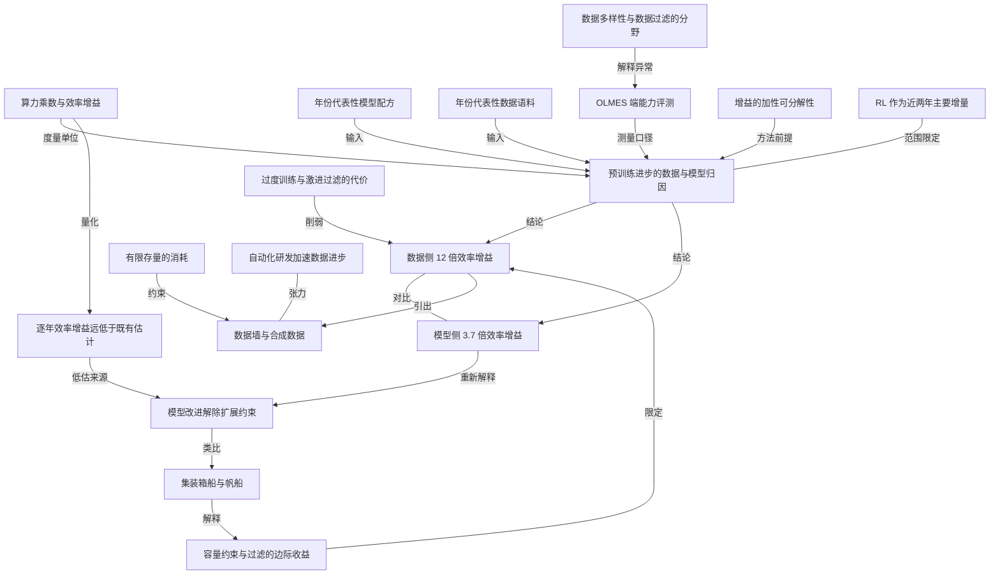

# 预训练的进步，主要来自数据而非模型

- 原文标题：Pretraining progress is mostly coming from data
- 作者：Dwarkesh Patel
- 内参日期：2026-09-09
- 来源类型：blog
- 原文：https://www.dwarkesh.com/p/pretraining-progress-is-mostly-data
- 标签：预训练

> 在同一算力预算下复现 2019 到 2025 各年的代表性配方与语料，把增益拆成数据与模型两部分，结论是数据侧贡献远大于架构。做长期判断时这类拆解比单个 benchmark 有用。

## 导读

llm 原理

## 核心观点

- 过去几年 AI 的快速进步，究竟有多少来自数据、有多少来自模型？作者把这个问题做成了一个可控实验：在小规模、只针对预训练、时间跨度 2019–2025 的条件下，拆开数据侧与模型侧各自的贡献。
- 主结果：在 1e19 FLOPs 的算力预算下，2019 到 2025 年间**数据改进带来的算力效率增益是模型改进的 3.24 倍**——数据侧 12.0x，模型侧 3.7x。
- 但作者立刻警告：不要把这个结果读成「模型研究不重要」。模型改进的主要贡献从来不是「用更少 FLOPs 达到同样效果」，而是**让更大规模的算力第一次变得可用**——解除扩展路上的种种约束。
- 一个贯穿全文的类比：模型进步像是把帆船造成集装箱船。集装箱船未必更快，但它能装几千吨货（对应几百万亿 token 的预训练数据），而且不会被风浪掀翻（对应在几十万张 GPU 上稳定训练）。
- 推论也随之而来：既然船变大变稳了，就不必再挑剔装什么货——**数据精挑细选的红利在大模型上可能显著缩水**。而真正悬而未决的问题是：货还够装吗？这就是数据墙与合成数据的问题，作者明确表示本文没有研究，但认为它是关键。

## 实验怎么做：把「年份」变成可控变量

- 研究范围被刻意收窄：**相对小的规模、只针对预训练、2019 到 2025 年**。
- 变量设计的巧妙之处在于「年份代表性配方」：这几年里，每年都有新的开源模型配方发布，把当年公开已知的算法改动固化下来（架构、优化器、初始化、学习率调度、超参等）；同时每年也有新的公开数据语料出现（更广的抓取 + 新的清洗、抽取、过滤技术）。
- 于是作者把「年份模型配方 × 年份数据语料」的组合放在不同算力规模下训练，最高到 1e19 FLOPs。
- 评测口径必须换掉：因为训练数据本身在变，就不能用「对同一个固定数据集的交叉熵损失」来横向比较不同模型。作者改用 OLMES 评测端到端能力——它聚合了 10 个相对简单的基准，以选择题问答为主。
- 代价是引入噪声：评端能力而不是预训练损失，会让曲线更抖，所以作者用多个随机种子跑，试图给出更干净的上下界。

## 主结果：数据侧压倒模型侧，且两者基本不交互

- 在 1e19 FLOPs 预算下：数据侧 12.0x，模型侧 3.7x，比值 3.24x。作为参照，2019 年的模型配方是 GPT-2、数据语料是 OpenWebText；2025 年分别是 OLMo-2 和 UltraFineWeb。
- 作者还给出一张 3.16e18 FLOPs 下的网格，展示每个「模型 × 数据」组合相对 2019 基线的端能力提升。
- **独立性是一个被单独强调的发现**：数据增益与模型增益基本互不依赖，也就是说，兑现某个模型改进并不需要某种特定的数据堆，反之亦然。
- 定量证据：用线性模型拟合，OLMES 分数 88% 的方差可以由「模型效应 + 数据效应」的加性项解释，只有约 12% 归于交互项、高阶项和评测噪声。

## 这六年，两条线各自改了什么

- 模型侧：从 GPT-2 到 OLMo-2，关键创新集中在优化器、位置编码、归一化、激活函数、初始化等处。具体清单包括优化器改进、warmup 加衰减的调度、RoPE 取代学习式绝对位置、RMSNorm 与 SwiGLU 门控 MLP、归一化重排、QK-norm、z-loss 正则和更干净的初始化。
- 数据侧的起点小得惊人：2019 年的 OpenWebText 只是「被 Reddit 上获得足够赞的帖子链接到的网页」，再做去重和过滤，总量约 90 亿 token——GPT-2 基本就训练在这上面。
- 到 2025 年，UltraFineWeb 这类开源语料不仅体量大得多（抓取整个互联网），过滤也复杂得多：例如训练一个分类器，去预测哪些数据在经验上能真正提升模型表现。

## 为什么「模型工作不重要」是错误解读

- 一个天真的读法是：2019–2024 这个预训练时代的 AI 进步，大部分只是更好的数据工程（抽取、清洗、策划），期间所有模型工作都没那么重要。
- 作者认为这大概率是评估模型改进价值的错误方式。模型改进的主要贡献不必然是算力效率——不是用更少 FLOPs 达到同样性能，而是**让大量算力在一开始就变得可用**。
- 机制在于：当参数量、上下文长度、训练时长、集群规模一路放大，各种东西都会坏掉——梯度爆炸或消失、显存与带宽耗尽、训练慢到不可行。模型研究的很大一部分工作，就是移除或推后这些扩展约束。
- 落在这一类里的重要创新包括 MoE、稀疏注意力的各种变体、稳定性创新（归一化位置、初始化等），以及 FlashAttention 这类系统与 kernel 层面的优化。
- 换句话说，本文的实验测的是「同等算力下的效率」，而模型改进的价值有相当一部分根本不落在这个坐标轴上。

## 数据红利在大模型上可能缩水

- 作者主动限定自己结果的适用范围：这里考察的数据改进，**对更大的模型可能没那么重要**。
- 原因是容量：像本实验这样的小模型，容量有限，所以你必须非常小心塞进去什么，数据质量提升的收益显著；而大模型有大量冗余容量，也许你就该尽量多塞，哪怕大部分是垃圾，随机梯度下降的魔力会把信号从噪声里分离出来。
- 激进过滤还有一个直接代价：数据变少就得跑几十个 epoch，而经验上这比「平均质量更低但规模更大的数据集」表现更差。
- 更进一步：考虑到前沿模型相对 Chinchilla 最优点被**过度训练最多 100 倍**（目的是把 RL 和部署阶段的推理算力压到最低），激进的数据策划就更加有害。
- 这就是集装箱船与帆船的类比落地的地方：既然有了容量更大、更稳的集装箱船，就不必纠结到底装什么，凡是哪怕沾点边、可能有用的都装上；而 2019 年那些又小又脆的帆船，你必须极其小心，只带最值钱的货。

## 货还够装吗：数据墙与合成数据

- 如果预训练进步的本质就是「往船上多装货」，那么问题自然变成：我们会不会没货可装了？
- 这就是数据墙问题，以及合成数据在多大程度上帮我们越过了这堵墙。作者坦承：合成数据显然已在各实验室广泛使用，但本文完全没有研究它能否在不损害模型表现的前提下有效扩充语料。
- 如果合成数据的收益有限，预训练进步的主要驱动力就会停滞——因为我们并没有在生产更多互联网，而固定的一批数据，策划来策划去也就那么多空间。
- 作者特别标注了自己的态度：目前**没有任何积极理由**认为会停滞。但正因为数据看起来如此关键，这个问题才格外值得研究。
- 一个反向的可能性来自 Ryan Greenblatt 的观察：历史上预训练语料的许多改进，看起来正是自动化研究员能够直接跑实验验证的那类进步——比如在不同数据上做消融、看模型表现。所以完全可能出现的情形是：一旦 AI 研发被自动化，自 2019 年以来推动预训练的数据进步会大幅提速。
- 最后作者把整件事放回全局：预训练进步本身是加速还是减速，其实并不是 AI 整体进步中最重要的问题——因为过去两年的很多增益来自 RL。

## 方法论：算力乘数是怎么算出来的

- 训练设定：所有模型配方在所有数据语料上从零预训练，跨多个算力预算、多个独立种子。预算为 1e17、3.16e17、1e18、3.16e18、1e19 FLOPs；算力记账采用名义约定 C = 6ND（N 为非嵌入参数量，D 为训练 token 数）。
- 在每个算力预算下改变参数量（从而改变 token 数），用语料上的留出损失确定每个「配方 × 语料」组合的算力最优点，进而得到端到端表现的算力扩展曲线，最后从曲线中提取算力乘数。
- 全部实验共享同一套 tokenizer 与上下文长度：GPT-2 BPE（tiktoken，词表 50,257）、T=2048、batch 为 262,144 token。
- 超参控制：端能力对超参高度敏感，作者把峰值学习率当作最主要的超参。先在 5 个锚点（3 个模型规模 × 2 个 D/N 比）上扫学习率，再拟合一个关于 N 与 D/N 的幂律参数形式；除 OLMo-2 外共享指数、各配方有自己的常数项，OLMo-2 则直接用配方规定的最优学习率（因为 Ai2 发布了覆盖本实验规模的小模型 ladder）。
- 算力乘数的定义：给定参考模型或语料在某算力下的一个参考表现水平，在候选的算力扩展曲线上找到**最左侧首次达到该水平的点**，参考所需算力与候选所需算力之比即为候选的算力乘数。
- 误差棒：曲线上每个点来自多次独立种子的训练，误差棒是这些种子上 OLMES 的标准差；算力乘数的误差棒来自对整条估计流程做参数化 bootstrap，取 1 个标准差区间。种子用量为扩展曲线每点至少 3 个，而 3.16e18 预算下的 7x7 组合网格每格只有 1 个。
- 作者主动提醒：模型配方那侧的真实不确定性很可能高于误差棒显示的水平，因为超参调优做得有限，而端能力或留出损失对峰值学习率、batch size 等选择相当敏感。

## 异常点与作者自陈的边界

- 图中的两个异常：NeoX 在 1e19 上表现不如 GPT-2（虽然在 1e17 到 3.16e18 区间更好），可能来自 OLMES 评测噪声——在 FineWeb-Edu 语料的留出预训练损失上，NeoX 是优于 GPT-2 的。
- 另一个异常：The Pile 明显不如 OpenWebText。作者认为这并不意外，因为 Pile 的主要改进是语料多样性而非过滤——它是一个精心策划的 22 源混合，含 PubMed 与 arXiv 论文、GitHub 代码、法律判决意见、专利和议会记录；而 OLMES 是英文网络散文的选择题，这些 token 的跨域迁移可能很小。凭借更大的体量，作者预期 Pile 在更大规模上最终会超过体量很小的 OpenWebText。
- 需要注意 NeoX 与 Pile 的算力乘数是**外推得到的**，这引入了额外误差。※ 另有一处细节：作者实现的 GPT-3 在 Pile 上遇到了训练不稳定（梯度尖峰）。
- 逐年口径：2019 到 2025 年，模型侧年化算力效率增益 1.24x（区间 1.19–1.29），数据侧 1.51x（区间 1.45–1.57），联合测量为 1.57x（区间 1.49–1.65）。注意联合值是用 2019 组合到 2025 组合的整体改进算出来的，不是两侧数字相乘。
- 这个 1.57x 远低于 Anson Ho 等人 3x 每年的均值估计（其 95% 置信区间为 1.5x 到 64x）。作者给出的原因清单：
- 很多增益可能依赖规模、或在更长上下文时才特别重要，而本实验的规模太小，无法兑现——例如 OLMo-2 的 layer norm 与 QK norm、NeoX 的并行 attention 加 MLP 块。
  - 推理效率优化不会体现为算力乘数，例如 Llama-3 的 GQA（一种 KV cache 优化）；tokenizer 改进同样未纳入研究。
  - 算力乘数对「每年选哪个配方、哪个语料作代表」相当敏感；作者选的是自认为有代表性的，但绝不宣称它们是当年最优。
  - 口径是相对 OLMES 这个基准（10 类相对简单的任务）而非某个困惑度指标；换成编程或解题类基准，数字会很不一样，而那些基准很可能奖励完全不同的数据工程方法。
- 数据侧的更大盲区：本文没有研究从新来源收集更多高质量数据、人类专家生成数据、合成数据生成方法等改进。所考察的语料**大多是同一批 Common Crawl 的策划子集**，而不是扩充可用数据的总量——这显然是在消耗一份有限的存量，这根杠杆撬不了太远。
- 后续研究方向：在更大规模上重跑实验，看数据与模型改进谁更依赖规模（因而在前沿更重要）；用端能力衡量新增高质量数据在预训练与后训练中的边际价值；系统研究合成数据的有效性——一个具体问题是，给定一小批高质量数据，用合成生成把它放大，比直接多跑几个 epoch 好多少；以及从实验室在数据经纪商、环境生产商上的支出（相对于算力与研究员支出）反推数据的隐含价值。
- 作者的收尾姿态很克制：这只是探究数据角色的一种方式，别人可能有更聪明的做法，而且本实验规模极小，他们完全认为有可能漏掉了什么，很期待看到别人怎么研究这个问题。

## 概念网络

### 关键概念

#### 算力效率增益（compute efficiency gain）

**context**：全文的核心度量单位。作者用它把「数据改进」和「模型改进」放到同一个坐标轴上比较，得出「2019 到 2025 年，数据侧 12.0x、模型侧 3.7x，数据是模型的 3.24 倍」的主结果，也用它给出逐年口径 1.24x / 1.51x / 1.57x。

**费曼一下**：同样的一件事，今天用多少算力就能做到，六年前要用多少？这个倍数就是效率增益。它把「模型更聪明了」和「数据更干净了」翻译成同一种货币——省下的 FLOPs，于是两者才可比。

#### 算力乘数（compute multiplier）

**context**：算力效率增益的具体计算方式。作者的定义是：给定参考对象在某算力下的表现水平，在候选的算力扩展曲线上找到最左侧首次达到该水平的点，参考所需算力与候选所需算力之比即为乘数；误差棒来自对整条估计流程做参数化 bootstrap。

**费曼一下**：把「达到同样成绩」当成一条横线，看两条曲线各自在多少算力处穿过这条线，两个算力一除就是倍数。关键是比较发生在同一条成绩线上，而不是同一个算力点上。

#### 年份代表性配方（model recipe / data corpus vintage）

**context**：实验设计的核心手法。每一年都有一个新的开源模型配方固化了当年公开已知的算法改动，也有一个新的公开数据语料；作者把年份变成可枚举的取值，训练「年份配方 × 年份语料」的组合矩阵。2019 年是 GPT-2 加 OpenWebText，2025 年是 OLMo-2 加 UltraFineWeb。

**费曼一下**：想知道六年里进步来自哪一半，就得让两半分别「穿越」。作者的做法是给每一年各挑一个代表：一个当年的模型做法，一个当年的数据堆，然后交叉配对。作者自己也承认，这个代表挑得对不对，结果就有多敏感。

#### OLMES 端能力评测

**context**：本文的评测口径。因为训练语料本身在变，用固定数据集上的交叉熵损失横向比较就失效了，所以作者改用 OLMES——它聚合了 10 个相对简单、以选择题问答为主的基准。代价是引入噪声，要靠多种子来收窄。

**费曼一下**：当考卷本身随年份变化时，不能再拿「在某份卷子上的困惑度」当尺子，只能考一场统一的期末考试看真本事。麻烦在于期末考试成绩比困惑度抖得多，所以要多考几次取平均。

#### 增益的加性可分解性

**context**：作者用线性回归拟合 3.16e18 FLOPs 下的 7x7 网格，得到 R 方 0.88——88% 的 OLMES 方差由「模型效应加数据效应」这两个加性项解释，只有约 12% 归于交互、高阶项和评测噪声。结论是复杂的模型—数据交互相对次要。

**费曼一下**：如果好模型必须配好数据才能出效果，两者就是纠缠的，谁的功劳都说不清。这个 0.88 说的是它们基本各干各的、直接相加，所以「拆开算功劳」这件事才在方法上站得住。

#### 扩展约束（constraints to scaling）

**context**：作者用来重新解释模型改进价值的核心框架。当参数量、上下文长度、训练时长、集群规模放大时，梯度会爆炸或消失、显存与带宽会耗尽、训练会慢到不可行；模型研究的很大一部分是移除或推后这些约束。MoE、稀疏注意力变体、稳定性创新和 FlashAttention 都属于这一类。

**费曼一下**：模型创新未必让你跑得更快，而是让你根本跑得起来。以前一放大就崩，现在不崩了——这份价值不会出现在「同等算力下更省」的账本上，所以本文的实验按定义就测不到它。

#### 集装箱船与帆船

**context**：作者贯通全文的类比。集装箱船未必更快，但能装几千吨货（对应几百万亿 token 的预训练数据），且不会被风浪掀翻（对应在几十万张 GPU 上稳定训练）；2019 年的模型是又小又脆的帆船，只能极其小心地只带最值钱的货。

**费曼一下**：这个类比把「模型进步」和「数据挑剔程度」串成了一件事：船的容量和稳定性，决定了你有没有资格不挑货。船小的时候节俭是美德，船大了以后节俭反而是浪费舱位。

#### 容量约束与数据过滤的边际收益

**context**：作者对自身结论适用范围的限定。小模型容量有限，所以必须小心塞进去什么，数据质量的提升收益显著；大模型有大量冗余容量，也许该尽量多塞，即使大部分是垃圾，随机梯度下降会把信号从噪声里分离出来。

**费曼一下**：数据清洗的价值不是绝对的，它取决于模型有多大的胃口。给小孩配餐必须精挑，给能吃的成年人则先管饱——本文测的是小孩那一头，所以「数据 12 倍」这个数字未必能直接搬到前沿模型上。

#### 过度训练与激进过滤的代价

**context**：作者反对激进数据策划的两条理由。一是过滤太狠会迫使你跑几十个 epoch，而经验上这比「平均质量更低但规模更大的数据集」更差；二是前沿模型相对 Chinchilla 最优点被过度训练最多 100 倍，目的是压低 RL 与部署阶段的推理算力——在这个前提下激进策划更有害。

**费曼一下**：把数据筛得太干净，就只剩一点点内容反复读几十遍，反而学不好。而且今天的前沿模型本来就是刻意「读得远超必需」，为的是让成品推理更便宜——这种玩法天生需要海量的量，不是极致的净。

#### 数据墙与合成数据

**context**：作者留下的最关键悬念。如果预训练进步的实质就是往船上多装货，那问题就是货够不够；合成数据显然已在各实验室广泛使用，但本文完全没有研究它能否在不损害表现的前提下扩充语料。作者明说自己没有积极理由认为会停滞。

**费曼一下**：我们没有在生产新的互联网，而一份固定的数据，反复策划的空间是有限的。所以预训练能不能继续走下去，等于在赌合成数据能不能凭空造出新的货——这一点作者留白了，只强调它值得研究。

#### 有限存量的消耗

**context**：作者对数据侧盲区的自我批评。本文考察的语料大多是同一批 Common Crawl 的策划子集，而不是扩充可用数据的总量；从新来源收集高质量数据、人类专家生成数据、合成数据生成方法都未纳入研究。

**费曼一下**：这六年的数据进步，大部分是在同一个矿里挑更好的矿石，而不是找到新矿。挑选的技艺可以进步，但矿是有底的——这决定了「数据侧 12 倍」的增长曲线不能简单外推。

#### 数据多样性与数据过滤的分野

**context**：解释 Pile 异常的关键区分。Pile 的主要改进是语料多样性而非过滤，它是精心策划的 22 源混合，含 PubMed 与 arXiv 论文、GitHub 代码、法律判决意见、专利和议会记录；而 OLMES 考的是英文网络散文选择题，这些 token 的跨域迁移可能很小。

**费曼一下**：「更好的数据」不是一个方向，而是至少两个：一是把杂质滤掉，二是把品类摊开。摊开品类对某些考试没有帮助——所以数据表现好不好，一半取决于你拿什么考它。

#### 自动化 AI 研发对数据进步的加速

**context**：Ryan Greenblatt 提出的观察。历史上预训练语料的许多改进，看起来正是自动化研究员能够直接跑实验验证的那类进步——在不同数据上做消融、看模型表现。所以本文的结果与「数据进步在 AI 研发自动化后大幅提速」是完全兼容的。

**费曼一下**：数据工程的进步很多不靠灵感，而靠大量试错：换一批数据、训一遍、看分数。这恰恰是机器最擅长接手的活。所以「进步主要来自数据」这个结论，未必意味着增长会慢下来，也可能意味着它最先被自动化接管。

#### RL 作为近两年的主要增量

**context**：作者主动给整篇文章设定的范围边界。他明确表示，预训练进步在孤立意义上是加速还是减速，并不是 AI 整体进步中最重要的问题，因为过去两年的很多增益来自 RL。

**费曼一下**：这篇文章讲的是「预训练」这一段路上的账，而 AI 的车这两年主要不是靠这一段在跑。读结论时要带着这个限定，否则很容易把一个局部的归因当成整体的趋势判断。

### 概念网络

这张网络的枢纽是一个归因问题：过去六年预训练的进步，应该记在数据账上还是模型账上。要让这个问题可回答，作者先搭了三根支柱——把年份固化成可枚举的模型配方与数据语料，把评测换成 OLMES 端能力，把比较单位统一为算力乘数。三者共同构成实验的坐标系；坐标系一旦定下，结论的适用边界也就同时被定死了。

主结论沿两条边分叉出数据侧 12.0x 与模型侧 3.7x，两者之间是一条对比关系而非因果关系。让这条对比在方法上成立的，是加性可分解性：88% 的方差由两个加性效应解释，意味着数据与模型的贡献可以被分开记账。如果这个数字很低，整篇文章的归因框架就会垮掉——所以它不是一个附带发现，而是前置条件。

接下来是全文最重要的一次转折：模型侧的 3.7x 不该被读成「模型工作只值这么多」，而应被重新解释为「本实验的坐标轴测不到模型工作的主要价值」。模型改进真正做的事是解除扩展约束，让更大的算力第一次可用；集装箱船与帆船的类比正是这条边的形象化。而逐年 1.57x 远低于外部 3x 估计这一事实，反过来又为「有大量增益依赖规模、在小尺度上兑现不了」提供了独立佐证——两条线索指向同一个盲区。

类比继续向下传导，生出对数据侧结论的两重限定。船大了以后不必挑货，对应容量约束下数据过滤的边际收益递减；而激进过滤要付出跑几十个 epoch 的代价，在前沿模型被过度训练最多 100 倍的前提下更加不划算。这两条边都指向同一个方向：削弱数据 12 倍这个数字向大规模的外推力。

网络的末端是三股互相拉扯的力量。数据侧越重要，数据墙的问题就越尖锐；而有限存量的消耗——大多数语料只是同一批 Common Crawl 的策划子集——让这堵墙显得更近。与之张力相对的是自动化研发：数据工程恰恰是靠消融试错推进的活，最可能被机器接手并加速。最后，RL 作为近两年主要增量这条边不参与论证，而是给整张网络加了一个范围限定：这里画的是预训练这一段路上的地图，不是 AI 进步的全图。

至于数据多样性与数据过滤的分野，它在网络中的位置有点特别——它不直接连主结论，而是连向评测口径，用来解释 Pile 为何反常地不如 OpenWebText。这条边提醒读者：所谓「更好的数据」至少有两个正交的方向，而哪一个被认定为更好，取决于你拿什么基准去考它。

## 费曼 x3

同样一笔算力，六年后能换来多好的模型？这个提升里，有多少要记在更聪明的架构头上，多少要记在更干净的语料头上？把 2019 到 2025 年每一年的模型配方和数据语料交叉配对、从零训一遍，答案相当刺眼：数据侧带来 12 倍的算力效率增益，模型侧只有 3.7 倍。更有意思的是，两者几乎不纠缠——88% 的成绩方差可以由「模型效应加数据效应」直接相加解释。也就是说，好架构不必配好数据才能生效，功劳确实可以分开算。

但真正值得带走的，不是这个比值，而是紧随其后的那次自我纠正。天真的读法是：模型研究这六年白干了。可模型改进的主要贡献，从来不是用更少的 FLOPs 达到同样的效果，而是让更大量的算力在一开始就变得可用。参数一放大、上下文一拉长、集群一堆起来，梯度会爆炸、显存会耗尽、训练会慢到不可行；MoE、稀疏注意力、各种归一化位置的调整、FlashAttention，做的都是移除或推后这些扩展约束。这份价值按定义就不会出现在「同等算力下更省」的账本上。测不到，不等于不存在——这是所有量化归因研究都该被追问的一句话。

于是有了那个好类比：模型进步像是把帆船造成集装箱船。集装箱船未必更快，但能装几千吨货，也不会被风浪掀翻。现在有了更宽敞更结实的船，我们就不必再纠结到底装什么，凡是哪怕沾点边、可能有用的都装上；而 2019 年那些又小又脆的帆船，你必须极其小心，只带最值钱的货。这个类比顺手把「数据 12 倍」这个结论也限定住了：小模型容量有限，所以塞什么进去要非常讲究；大模型有大量冗余容量，也许你就该尽量多塞，哪怕大部分是垃圾，随机梯度下降会把信号从噪声里分离出来。何况前沿模型相对 Chinchilla 最优点被过度训练最多 100 倍，此时把数据筛得太干净，只会逼你把同一点内容反复读几十遍——经验上这比平均质量更低但规模更大的数据集更差。

真正的悬念因此不在归因，而在存量。如果预训练进步的实质就是往船上多装货，那么货还够装吗？我们并没有在生产更多的互联网，而这些被考察的语料，大多只是同一批 Common Crawl 的不同策划子集——挑矿的技艺可以一直进步，矿本身却是有底的。合成数据能不能凭空造出新的货，这里留白了。有意思的是另一个方向的可能：历史上数据语料的许多改进，恰恰是「换一批数据训一遍看分数」这类靠消融试错推进的活，也正是自动化研究员最容易接手的活。所以「进步主要来自数据」这个结论，未必意味着增长要慢下来，也可能意味着它会最先被机器接管而提速。

## 阅读原文

How much of the[rapid progress in AI](https://epoch.ai/gradient-updates/the-least-understood-driver-of-ai-progress) that we’ve seen over the last few years[[1]](#footnote-1) has come from data versus model improvements? The answer has big implications for the economics of frontier labs and the pace of future progress.

We investigate this question at a relatively small scale, and for pretraining specifically, from 2019 to 2025. During each of those years, a new open model recipe was published which codified that year’s publicly known algorithmic tweaks (for example, improvements in architecture, optimizer, initializations, learning rate schedule, hyperparams, etc). And during each of those years, there was also a new public data corpus (produced by broader scrapes and new curation/extraction/filtering techniques).

We train combinations of these year-representative model recipes and data corpuses across different scales of training compute (up to 1e19 FLOPs)[[2]](#footnote-2).

Obviously, we can’t compare these different models by their cross-entropy loss against a fixed dataset, since we’re varying the datasets they’re trained on. So instead we evaluate these models on end capabilities as measured by the [OLMES](https://github.com/allenai/olmes) eval (which aggregates 10 different relatively easy benchmarks, mostly multiple choice QA). Unfortunately, evaluating end capability rather than pretraining loss adds some noise to our results, as you’ll see in the graphs below, though we try to get cleaner bounds by running multiple seeds.

**We find that from 2019 to 2025, 3.24x more compute efficiency gains have come from data improvements rather than model improvements (12.0x for data and 3.7x for models), at the 1e19 FLOPs compute budget**[[3]](#footnote-3).

Here is a grid which shows how much better a model we train does on the end capability we're testing it on, relative to the 2019 data + architecture baseline, at 3.16e18 FLOPs[[4]](#footnote-4).

We find that the gains from data and model improvements are mostly independent and don’t interact (i.e. realizing the gains from some model improvement doesn’t require a specific training datapile, or vice versa). 88% of the variance in the OLMES score can be explained by additive effects of the model and data improvements (using a linear model).

### Discussion

For context, let’s briefly summarize what changed on both the data and the model side from 2019 to 2025.

On the model side, we went from [GPT-2](http://cdn.openai.com/better-language-models/language/_models/_are/_unsupervised/_multitask/_learners.pdf) to [OLMo-2](https://arxiv.org/abs/2501.00656), including key innovations in optimizers, positional encodings, normalization, activation functions, initializations, and more[[5]](#footnote-5).

On the data side, we started with [OpenWebText](http://huggingface.co/datasets/Skylion007/openwebtext) in 2019, which contained just web pages linked from Reddit with enough upvotes and then deduplicated and filtered, and thus amounted to only ~9B tokens (this was mostly what GPT-2 was trained on). By 2025, open source data corpuses like [UltraFineWeb](http://huggingface.co/datasets/openbmb/Ultra-FineWeb) not only are far larger (by using scrapes of the whole Internet), but also use much more sophisticated filtering (for example, by training a classifier to predict what data will empirically improve model performance).

A naive interpretation of our result is that most of the AI progress from 2019-2024 (the era of pretraining) was just better data engineering (extraction, curation, etc.), and that all the model work during that period was much less important.

But this is probably the wrong way to think about the value of model improvements. Their main contribution was not necessarily compute efficiency - that is, achieving the same performance with fewer FLOPs. Rather, it was making larger amounts of compute usable in the first place. As the number of parameters, context lengths, run duration, and clusters scale up, all kinds of things are prone to breaking (gradients explode or vanish, memory and bandwidth run out, training becomes infeasibly slow). Much of model research has consisted of[removing or pushing back these constraints to scaling](https://www.beren.io/2026-08-23-Architecture-Research-as-Addressing-Constraints-to-Scaling/). Many of the most important innovations such as MoEs, sparse attention variants, stability innovations (norm placements, initializations, etc.) and system / kernel-level optimizations like [FlashAttention](https://arxiv.org/abs/2205.14135) fall into this category.

The data improvements we investigated here might matter less for larger models. Small models (like the ones we trained) see significant gains from data quality improvements, because they don’t have that much capacity, and so you have to be really careful about what you stuff into them. Whereas big models have so much excess capacity that maybe you just want to throw in as much stuff as you can, even if it’s mostly garbage, and the magic of stochastic gradient descent will separate out the signal from the noise. If you choose to filter aggressively, you’ll have to do dozens of epochs, which [empirically gives worse performance](https://arxiv.org/pdf/2605.19407) than just having a lower average quality but larger dataset. In fact, aggressive data curation is even more harmful once you take into account that frontier models are up to 100x overtrained relative to Chinchilla optimal, in order to minimize the inference compute used for RL and for deployment.

An analogy might be the difference between a sailboat and a container ship - the container ship doesn’t necessarily go faster, but it can lug thousands of tons of cargo (analogous to hundreds of trillions of tokens of pretraining data), and won’t be toppled by choppy waters (analogous to training stably across hundreds of thousands of GPUs).

Now that we have more capacious and sturdy container ships, we don’t have to fret about exactly what we load on board - we can just fill them up with everything that’s even remotely and plausibly useful. Whereas for the tiny flimsy sailboats of 2019, you’d have to be incredibly careful about only carrying the most valuable cargo.

But to the extent that the nature of pretraining progress is simply loading more cargo into this ship, are we running out of cargo? This is a question about the data wall and about how well synthetic data has helped us leap over it. Synthetic data is obviously being widely used at the labs, and we have not at all investigated whether it can effectively expand a data corpus without hurting model performance. If the gains are limited, then the main driver of pretraining progress will stall, because we’re not generating more internet, and you can only curate a fixed set of data by so much. To be clear, we have no active reason to think this. But given how important data seems to be in driving pretraining progress, this seems like a crucial question to investigate.

Ryan Greenblatt [noted](https://www.dwarkesh.com/p/ryan-greenblatt) that many of the historical improvements in pretraining data corpuses look like the kind of progress that automated researchers would be able to just test empirically - for example, run ablations trained on different data and see how the model performs. So it’s totally compatible with our results that the data progress which has propelled pretraining since 2019 might speed up a lot if and when we automate AI R&D.

We want to clarify that whether pretraining progress in isolation will speed up or slow down is not really the most important question for overall AI progress, because so many of the gains over the last two years have come from RL.

#### Future research

These are some directions of future research that we think would be really cool, and important questions to answer:

- You could run this experiment at larger scales to see whether the data or model improvements are more dependent on scale (and thus far more impactful at the frontier)
- What is the marginal value of novel high-quality data for both pre and post-training, as measured by end capabilities?
- We want to know broadly how effectively synthetic data works. One concrete question to investigate is this: if you’ve got a small corpus of high quality data, how much better is it to magnify it via synthetic data generation relative to just training on it for multiple epochs?
- You could figure out the implied value of data through lab spending on data brokers, environment producers, etc., relative to their spending on compute and researchers.
We wanted to investigate what role data has played in driving AI progress. There are lots of other ways one could probe this question, and some may be more clever and informative than ours. And even our experiment was done at an extremely small scale. We definitely think it’s plausible that there is something we missed - we’re eager to hear how others would research this question, and ideally to also see their results!

_Thanks especially to [Charlie O’Neill](https://x.com/oneill/_c?lang=en) for many helpful discussions._

### Appendix: Methodology

We pre-train these model recipes from scratch on these different data corpuses, at varying compute budgets, with multiple independent seeds[[6]](#footnote-6). Our compute budgets are: 1e17, 3.16e17, 1e18, 3.16e18 and 1e19 FLOPs. The compute accounting convention is to use nominal compute C = 6ND (N = number of non-embedding parameters, D = tokens of data).

At each compute budget, we vary the number of parameters (and hence number of tokens trained on), to determine the compute-optimal mix for each training recipe x corpus combination. We use held-out loss on the corpus to determine this compute-optimal point. We can then obtain compute scaling curves of downstream performance of each combination, from which we can finally extract our compute multipliers.

We enforce a shared tokenizer and context length across every run: GPT-2 BPE (tiktoken, 50,257 vocab) and T=2048, batch = 262,144 tokens.

The end capabilities of our training runs are highly dependent on hyperparameters. Obviously, there is no way to sweep over all possible sets of hyperparams (hyperparam tuning is a fine art indeed)! We try to control for this as much as possible, and we consider peak learning rate as the main hyperparameter of significance.

Some algorithm vintages do provide specifications of what peak learning rate should be tuned to (as a function of other relevant variables such as model size, data budget, batch size, etc.). These serve as good priors for what we think the optimal learning rate is.

We first sweep learning rates at 5 anchor points - 3 different model sizes and 2 different D/N ratios. We determine the optimal learning rate of these anchor points, and fit an optimal learning rate parametric form

lr(N,D/N)=lr0·(N/N0)a⋅(D/N(D/N)0)b

For all the model recipes except OLMo-2, we fit a common exponent _a_ and _b_, and a model-specific lr₀. For OLMo-2, we use the prescribed optimal learning rate according to the model recipe. The reason we do this for OLMo-2 is that Ai2 published small-model ladders as part of the recipe which specified optimal hyperparameters at the scale we are investigating. We also verify, at the compute-optimal point for 3.16e18 FLOPs, that our production learning rates are at or near optimal.

**Main technical results**

**Explaining some anomalies in our graph**

We observe generally increasing compute efficiency across time for both the model and data axes as expected. Some outliers that we observed:

- NeoX performs worse than GPT-2 at 1e19 (although it does better across the 1e17 to 3.16e18 range). This might arise from noise in the OLMES evaluation. We also note that on held-out pretraining loss on the FineWeb-Edu corpus, NeoX performs better than GPT-2.
- The Piles seems to do much worse than OpenWebText. This is not surprising since the Pile’s main improvement was data corpus diversity over filtering. It has a curated 22-source mixture including PubMed and arXiv papers, GitHub code, legal opinions, patents, and parliamentary proceedings. The amount of cross-domain transfer to OLMES (which is English web-prose MCQ) might be minimal for many of these tokens, thus resulting in lower compute efficiency. We note that by virtue of its larger size, we expect that the Pile should eventually be better than (the really small) OpenWebText at larger scales.
- It is also worth noting that the compute multipliers for NeoX and the Pile are obtained by extrapolation, which introduces further potential error.
**How compute multipliers were calculated, as well as their error bars**

- Every point on the compute scaling curves is computed from multiple independently seeded training runs. The error bars there are the standard deviation of the OLMES eval over those seeds.
- Consider some given reference level of performance at some compute level for our reference model or data corpus.
- We then calculate the compute multiplier by finding the left-most point of the compute scaling curve of our candidate model or corpus that first attains that reference level of performance. The ratio of the compute required by the reference to the compute required by our candidate is the candidate’s compute multiplier
- The error bars on the compute multipliers are obtained from a parametric bootstrap of the entire estimation pipeline, and are 1 standard deviation intervals
- We do want to highlight that we expect the actual uncertainty in the compute multipliers of the model recipes to be higher than indicated by our error bars. This is because of additional uncertainty introduced by the limited extent of hyperparameter tuning we did, and end capabilities or held-out loss is probably quite sensitive to the exact choice of peak learning rate / batch size / etc.
It is also important to note that there are many reasons why our ablations do not necessarily capture the full scope of compute efficiency gains. **Indeed, from 2019 to 2025, we observe year-over-year compute efficiency gains (CEG) of 1.24x [1.19, 1.29] on the model side and 1.51x [1.45, 1.57] on the data side. Measured jointly, we observe a 1.57x YoY CEG [1.49, 1.65]**[[7]](#footnote-7). This is indeed much lower than [Anson Ho et al.’s mean estimate of 3x YoY](https://arxiv.org/abs/2403.05812), for the following reasons:

- Many of the gains might be scale dependent or might be especially important at longer context, and we are operating at scales too small to realize many of the gains.For example, OLMo-2’s layer and QK norms, parallel attention + MLP block in NeoX
- Inference efficiency optimizations (such as LLama-3’s GQA, which is a KV cache optimization) do not show up as compute multipliers in our study. We are also not investigating tokenizer improvements.
- The compute multipliers we obtain are pretty sensitive to our choice of model recipe or data corpus for each year. We have chosen what we believe to be representative model recipes or data corpuses. But by no means do we exhaustively conclude that these are the best of each year.
- We are looking at compute multipliers with respect to the OLMES benchmark (which combines 10 different relatively easy task types) rather than compute multipliers in getting to some perplexity metric. We would also have very different looking numbers if we were looking at other benchmarks (say, coding- or problem-solving-specific ones), which would probably reward very different methods of data engineering.
We also want to note that we have not investigated other data-side improvements, such as collecting more high-quality data from new sources, human expert generated data, synthetic data generation methods, etc. Most of the corpuses we have investigated are curations (subsets) of the same Common Crawl, rather than expanding the available set of data. This is clearly consumption of a finite stock - there is only so far we can push this lever.

**Independence of gains from model recipe and data corpus**

Here is the investigation that we did to determine how independent the gains from model recipe and data corpus are. We looked at the grid of OLMES scores at 3.16e18 FLOPs. A linear regression of OLMES score = mean + model effect + data effect gives an R squared of 0.88, which means 88% of the variance in the OLMES score can be explained by additive effects of the model and data improvements, with only ~12% of the variance accounted for by interaction or higher order terms, and eval noise. This hints that complex model-data interactions (where exploiting some model improvement is contingent on some specific data engineering, or vice versa) are relatively minor.

[1 [find in text]](#footnote-anchor-1)

[Anson Ho et al.](https://arxiv.org/abs/2403.05812)estimated software efficiency improvements (in pretraining) of 3x per year (95% CI: 1.5x to 64x). As Ho mentioned in this [blog](https://epochai.substack.com/p/the-least-understood-driver-of-ai), “most software progress might actually be due to data quality improvements” and “from scaling up just a small handful of scale-dependent algorithmic changes”.

[2 [find in text]](#footnote-anchor-2)

We use the C = 6ND nominal convention for accounting for compute.

[3 [find in text]](#footnote-anchor-3)

The 2019 model recipe was GPT-2, and 2025 model recipe was OLMo-2. The 2019 data corpus was OpenWebText, and the 2025 data corpus was UltraFineWeb.

[4 [find in text]](#footnote-anchor-4)

Our implementation of GPT3 encountered some training instabilities (gradient spikes) on the Pile.

[5 [find in text]](#footnote-anchor-5)

These include: Optimizer improvements, warmup + decay schedules, RoPE replacing learning absolute positions, RMSNorm + SwiGLU gated MLPs, Norm reordering, QK-norm, Z-loss regularization and cleaner inits.

[6 [find in text]](#footnote-anchor-6)

For the compute-scaling plots we use at least 3 seeds each. For the 7x7 grid of combinations of model recipes and data corpus at the 3.16e18 budget, we only used 1 seed each.

[7 [find in text]](#footnote-anchor-7)

The 1.57x YoY multiplier is computed using the joint improvement from 2019 model and corpus to 2025 model and corpus, and not the product of the 1.24x model side improvement and 1.51x data side improvement.

#### Breaking down 6 years of pretraining progress into data vs model improvements
