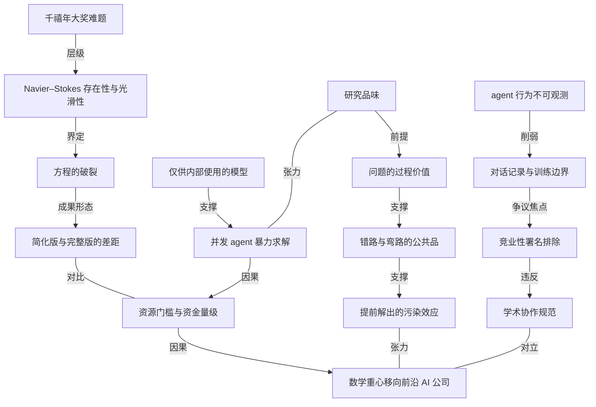

# 争议本身在告诉我们数学研究会变成什么样

- 原文标题：What OpenAI’s latest controversy tells us about the future of math
- 作者：MIT Technology Review
- 内参日期：2026-09-10
- 来源类型：blog
- 原文：https://www.technologyreview.com/2026/09/08/1143747/what-openais-latest-controversy-tells-us-about-the-future-of-math/
- 标签：数学, OpenAI, 伦理

> MIT 科技评论不停在「AI 能不能做数学」上打转，而是接着问：当验证可以外包、抢发只差几十小时，数学界的署名规范、优先权和同行评议要怎么重写。把一次事件接到了学科制度层面。

## 导读

争议，数学研究

## 核心观点

- OpenAI 宣布其 agents 解决了千禧年大奖难题中的 Navier–Stokes 存在性与光滑性问题。放在正常情况下，这是这家公司帽子上最漂亮的一根羽毛；但公告当天就被一桩署名争议盖过：NYU 数学家 Tristan Buckmaster 与 Anthropic 员工 Levent Alpöge 指控 OpenAI 把他们在同一问题上的 AI 辅助工作当成起跳板，却没有给出致谢。OpenAI 否认这一指控。
- 作者的判断是：无论 OpenAI 的模型有没有真的用上那两个人的成果，**这一集都可能是数学史上的一个转折点**（this episode may mark a turning point in the history of mathematics）。争议只是引信，真正的信号在争议底下。
- 底下的信号有三条：一，AI 模型现在看起来已经是攻克当代最重要数学问题的**必要条件**；二，解决这些问题所需的资源，只在少数几家前沿 AI 公司手里；三，这些公司**经常无视支撑数学进步的学术协作规范**（often defy the norms of academic collaboration that undergird most mathematical progress）。
- 三条叠起来的结论是一句悬而未决的问题：如果我们正在走向那个未来，人类数学家该如何嵌进去，目前并不清楚。
- 文章还给出一个更尖锐的可能：即使 AI 解题成功，对整个数学领域也可能是**净负面**——因为数学界要的从来不只是答案，而是人类为了求解而长出来的那一整套方法、弯路与子领域。

## 争议：两条路，一份没写上的署名

- 时间线本身就说明了什么：周一，NYU 的 Buckmaster 在 Mastodon 上贴出一份证明，显示 Navier–Stokes 方程的**简化版本确实会破裂**——这是千禧年问题上的一大步。他和 Alpöge 为这个问题工作了将近一年，用的是 OpenAI 和 Anthropic 的**公开可用模型**。当天（today），OpenAI 拿出一份证明，显示**完整的** Navier–Stokes 方程同样会破裂。
- Buckmaster 连同证明贴出了一份文件，记录他在听到传闻后主动联系 OpenAI 员工之后的互动。据他描述，OpenAI 员工给了他两个选择：
- 要么他和 Alpöge 现在就把工作发出来，OpenAI 第二天发布自己的 Navier–Stokes 解；
  - 要么他跟 OpenAI 合写一篇 Navier–Stokes 论文，但**把 Alpöge 排除在作者之外**——理由是 Alpöge 隶属于 Anthropic，OpenAI 最大的竞争对手。
- Buckmaster 还追问了两个问题，得到的是两种不同的回答方式：agents 有没有拿到他和 Alpöge 与 OpenAI 模型对话的记录（transcripts）？对方**否认**。OpenAI 的模型有没有在那些对话记录上训练过？对方**没有回应**。这个"否认 + 不回应"的组合，是整份文件里最有信息量的部分。
- MIT Technology Review 就此联系 Buckmaster，发稿前未获回复。
- ※ 注意作者的措辞纪律：他反复把"是否使用"标注为 uncertain（It remains uncertain），只把可推断的部分说成 clear implication。争议的事实层至今没有结论。

## 争议的可信度：技术路径的巧合有多巧

- 这份文件的明确含义是 OpenAI 的模型以某种方式用上了那两人的工作。作者认为这个场景**表面上是可信的**（plausible on its face），理由是技术路径的重合：Buckmaster/Alpöge 的证明和 OpenAI 的证明，**都使用了 Diego Córdoba 与 Luis Martínez-Zoroa 开创的那条进攻 Navier–Stokes 的路径**。
- 但重合不等于抄袭。布朗大学数学教授 Javier Gómez-Serrano 指出，这条路径是当时被认为有希望解决 Navier–Stokes 的**若干条路径之一**。所以两个团队独立走到同一条路上，绝非不可能；同时，前者影响了后者也同样可以想象（conceivable）。
- 在媒体沟通会上，OpenAI 首席研究官 Mark Chen 再次否认任何 agents 或 OpenAI 员工接触过那两人的对话记录。但作者立刻加了一条**削弱这个否认的证据**：从 Hugging Face 被入侵一事已披露的内情看，OpenAI 并不总是完全清楚自己的 agents 在做什么。
- 这条反驳的分量在于它转移了争论的性质：问题不再是"公司有没有撒谎"，而是"**公司有没有能力知道真相**"。在 agent 规模化运行的条件下，否认本身的证据价值被大幅折价。
- 另一条侧面信息：OpenAI 技术团队成员 Sébastien Bubeck 在沟通会上说，团队是**听到关于 Buckmaster 和 Alpöge 工作的传闻之后**才被激发去做这个问题的。这句话本身没有承认使用成果，但承认了选题受影响。

## Navier–Stokes 到底是个什么问题

- Navier–Stokes 存在性与光滑性问题是克雷数学研究所（Clay Mathematics Institute）在 2000 年选定的**七个千禧年大奖难题之一**，解决者可获一百万美元奖金。在此之前，七个里**只有一个**被解决过（庞加莱猜想）。OpenAI 说它不打算申领这笔奖金。
- 问题本身关于一组描述流体（水、空气）随时间如何流动的方程。这组方程在流体力学里被广泛使用，效力已被反复证明，但**物理学家和数学家并不完全理解它们**。
- 具体的未知点是：在某些条件下，这些方程会不会**破裂**（break down），预测出一个不可能的状态——比如流体拥有无限速度。这就是"存在性与光滑性"追问的东西。
- 两份证明的差距正好落在"简化版"与"完整版"之间：人类团队近一年攻下的是简化版会破裂，OpenAI 拿出的是完整方程同样会破裂。后者用的是一个**内部模型**，其表现"大幅超过"上周刚发布的、本已令人印象深刻的 Astra 模型。

## 一线转机：研究品味可能仍是人类的

- 作者在这里做了一个反转式推论：如果 OpenAI 的模型确实在那两人的工作上训练过，或者它的 agents 以某种方式拿到了那些材料，那么这家公司没能查清真相、没能给出恰当署名，**确实反映出它的问题**。
- 但对数学家来说，这个版本的故事里**藏着一线薄薄的转机**（a thin silver lining）：它意味着两个人类的辛苦工作——其中一位还是 Navier–Stokes 领域的知名专家——对 agents 解出千禧年问题是**必要的**。
- 关键概念在这里出场：专家们长期把"**研究品味**"（research taste，即挑选有前景的研究问题与方向的能力）认定为 AI 在科学与数学中的一大障碍。
- 于是推论成立：如果 OpenAI 的 agents 之所以选择 Córdoba–Martínez-Zoroa 路径，是因为 Buckmaster 和 Alpöge 走了这条路，那么**人类的研究品味在 OpenAI 的成功里扮演了必要角色**。
- ※ 值得注意这一段的结构反常：争议对 OpenAI 越不利，对人类数学家反而越是好消息。这是全文最有智力密度的一处翻转。

## 更大的图景：一年协作 vs 一万个 agent

- 但"更大的图景令人清醒"（the bigger picture here is sobering）。作者把两种模式并置：
- Buckmaster 和 Alpöge 用**公开可用模型**协作近一年取得的进展，说明了人机协作的前景（the promise of human–AI collaboration）；但他们**没能拿到完整解**。
  - OpenAI 用一个**内部模型**在**几天内暴力破解**（brute-forced a solution in a few days），代价是天文数字的：据 Bubeck 和 Chen 在沟通会上说，团队之所以能解出这个问题，靠的是**同时运行约一万个 agents，花费数百万美元**。
- 这组对比才是全文的硬核数字：不是"AI 能不能做数学"，而是"**做数学需要多少钱**"。前沿突破的价签一旦标到数百万美元一题，学术界就自动出局了。
- 作者转述了自己的采访见闻：过去几个月里，好几位研究者告诉他，**数学家正在变得抑郁**（mathematicians are becoming depressed），而原因不难理解——数学正在迅速变成前沿 AI 公司的地盘，这些公司有令人印象深刻的**仅供内部使用的模型**、烧不完的钱，以及**缺乏协作精神**。
- Gómez-Serrano 的那句话把不确定性和确定性分得很清："AI 公司会决定把钱花在做这件事还是那件事上，我真的不知道。清楚的是，**极少数学家会拥有那种量级的资源**。"

## 陶哲轩的反问：为什么"提前解出"可能是净负面

- 如果 OpenAI 和 Anthropic 继续追逐越来越漂亮的数学战绩，可能**不会再有开放问题留给这些公司之外的人类数学家去角力**。作者说，那会**剧烈改变数学这个领域**。
- 上周，UCLA 数学家陶哲轩（Terence Tao）在 Mastodon 上发了一条长贴，说明错误、错误方向和不完整的解对这个领域有多重要。
- 陶哲轩的核心论证是把"问题"重新定义成工具而不是目标："在纯数学的大多数情况下，问题被提出，不是因为我们迫切想要这些问题本身的解，而是因为我们从过往经验中看到，**人类主导的求解努力往往会促进这个领域的进一步发展**。"
- 由此推出的判断非常重：用纯 AI 方法**提前解出问题**——尤其是在**对求解过程没有完全透明度**的情况下——可能会污染这个过程，"到了它实际上对整个数学的进步成为**净负面**的程度"。
- 注意这里有两个条件叠加：一是提前（prematurely），二是不透明（without full transparency）。单独的"AI 解题"未必致命，"AI 解题 + 过程封在公司内部"才是。
- 作者最后把这条逻辑收成一句朴素的话：人类解数学问题可能比 agents 慢，但**在过程中他们挖出新的数学方法与想法**，这些东西可能启发同行，甚至催生出自己的子领域。
- 而当 AI agents 代替人类解掉那些问题、当私人公司把 agents 的**错误转向**（wrong turns）挡在公众视野之外，这些收益就消失了。
- 结尾是一个悬念式判断，也是全文最克制的一句：还有什么会在这个过程中一起消失，尚待观察（It remains to be seen what else will vanish in the process）。

## 概念网络

### 关键概念

#### 千禧年大奖难题

**context**：由克雷数学研究所在 2000 年选定的七个"当代最重要的开放问题"，每个附带一百万美元奖金。原文强调一个稀缺性事实：在 OpenAI 宣布之前，七个里只有一个（庞加莱猜想）被解决过。这个稀缺性是全文所有震撼感的基座——它让"agents 解掉一个"这件事天然成为标志性事件。

**费曼一下**：数学界给自己立了七块最难的碑，二十多年只倒了一块。所以第二块倒下的方式和倒在谁手里，比它本身倒下更值得看。

#### Navier–Stokes 存在性与光滑性问题

**context**：本篇争议的具体标的。它关心的是一组描述流体随时间流动的方程——广泛用于流体力学、效力已被证明，但"物理学家和数学家并不完全理解它们"。未知点是这组方程在某些条件下会不会破裂、预测出不可能的状态。

**费曼一下**：我们有一套算水和空气怎么流的公式，天天在用，但没人能保证它永远不会算出荒谬的答案。这个问题就是要把这个保证做出来，或者证明它做不出来。

#### 方程的破裂

**context**：原文用 break down 描述方程失效的方式，并给出具体形态——预测出"流体拥有无限速度"这种不可能的状态。两份证明的成果都是"证明会破裂"这一侧：人类团队证明简化版会破裂，OpenAI 证明完整方程会破裂。

**费曼一下**：不是公式算错了，是公式在某个点上把自己算爆了，给出一个物理上不可能存在的数。找到这种爆点，本身就是重大数学成果。

#### 简化版与完整版的差距

**context**：这个差距是理解"两份证明不等价"的关键。Buckmaster 和 Alpöge 近一年拿下的是简化版本的破裂，OpenAI 拿出的是完整方程的破裂。文章没有把后者说成前者的抄袭，而是把差距和成本挂在一起：前者是公开模型加一年协作，后者是内部模型加几天。

**费曼一下**：两个人爬到了半山腰，公司几天后站上了顶。争议不在谁站得高，在顶上那条路是不是照着半山腰那两个人的脚印走的。

#### 研究品味

**context**：原文给出的定义是"挑选有前景的研究问题与方向的能力"（the ability to choose promising research questions and directions），并说明专家长期把它认定为 AI 在科学和数学中的一大障碍。它是全文那处反转的支点：如果 agents 走 Córdoba–Martínez-Zoroa 路径是因为人类先走了，那人类的研究品味就是必要条件。

**费曼一下**：真正难的不是算，是知道该算什么。会做题的机器很多，会挑题的还很少——这一篇里，挑题这一步的功劳可能仍然记在两个人身上。

#### 仅供内部使用的模型

**context**：原文两次点出这个属性：OpenAI 的证明用的是"内部模型"，其表现大幅超过上周刚发布的 Astra；而数学正在变成拥有"令人印象深刻的仅供内部使用的模型"的公司的地盘。这个属性把学术界和公司之间的差距从技能差变成了**访问权差**。

**费曼一下**：外面的人用的是公开版，公司里用的是没发布的强版本。差距不是聪不聪明，是有没有钥匙。

#### 并发 agent 暴力求解

**context**：原文的具体数字是同时运行约一万个 agents、花费数百万美元，作者用 brute-forced 一词定性。它与"近一年人机协作"形成本篇最硬的一组对比，也是"极少数学家会拥有那种量级的资源"这句话的算术基础。

**费曼一下**：不是想得更巧，是同时派一万个探子扑向所有可能的路。这种打法只有钱多到不在乎的机构做得起。

#### 学术协作规范

**context**：原文把它定义为"支撑大多数数学进步"的东西（undergird most mathematical progress），并指出前沿 AI 公司经常无视它。文中的具体违反形态非常清楚：署名条件被竞业关系左右、发布时机被用作谈判杠杆、错误路径不进入公共视野。

**费曼一下**：数学能往前走，靠的不只是聪明，还靠一套"谁做的算谁的、失败也要讲出来"的规矩。这一集里，规矩被当成了可选项。

#### 竞业性署名排除

**context**：本篇最具体的争议事实之一：据 Buckmaster 记录，第二个选项要求把 Alpöge 排除在作者之外，理由是他隶属于 Anthropic。这是把商业竞争关系直接带进作者列表的做法，与"贡献决定署名"的学术规范正面冲突。

**费曼一下**：贡献一样，但因为你在对手公司上班，名字不能上。这不是学术判断，是商业判断穿上了学术的外衣。

#### 对话记录与训练边界

**context**：争议的技术核心。Buckmaster 追问的是两件不同的事：agents 有没有"接触"他们与 OpenAI 模型的对话记录（被否认），以及模型有没有在那些记录上"训练过"（无回应）。这两个动词划出了两条不同的通道，而只有一条被否认。

**费曼一下**：你和一个模型聊了一年的思路，这些话去了哪里？它们有没有变成模型的一部分？这一篇里，第一个问题被回答了，第二个问题没有。

#### agent 行为的不可观测性

**context**：作者用 Hugging Face 被入侵一事的披露来支撑一条判断：OpenAI "并不总是完全清楚自己的 agents 在做什么"。这条判断的作用是给公司的否认打折——不是指其撒谎，而是指其可能不具备知情能力。

**费曼一下**：公司说"我们没有那么做"，但它派出去的一万个 agent 不需要向它一一汇报。这种情况下的否认，只能算"据我所知"。

#### 问题的过程价值

**context**：陶哲轩论证的核心，也是全文思想层面的最高点。原文的表述是：纯数学中的问题被提出，不是因为迫切需要问题本身的解，而是因为过往经验显示"人类主导的求解努力往往会促进这个领域的进一步发展"。答案是副产品，过程才是产品。

**费曼一下**：这些难题更像健身器材而不是宝箱。有人替你把器材举了，你不会变强——器材举起来这件事本身没什么用。

#### 错路与弯路的公共品价值

**context**：与上一个概念配套的具体机制。原文列出错误（mistakes）、错误方向（wrong directions）、不完整的解（incomplete solutions）三种形态，并指出人类在求解过程中挖出的新方法与想法可能启发同行、催生子领域。当公司把 agents 的错误转向挡在公众视野之外，这层收益就消失了。

**费曼一下**：数学的进步很大一部分藏在失败记录里。谁走错了哪条路、为什么走不通，对后来的人和成功的路一样值钱。把失败藏起来，等于把一半的成果扣下。

#### 提前解出的污染效应

**context**：陶哲轩的判断落点。他警告用纯 AI 方法"提前解出"问题，尤其在"对求解过程没有完全透明度"的情况下，可能污染领域的发展过程，到了"对整个数学的进步成为净负面"的程度。注意这是两个条件叠加的结论，不是对 AI 解题的一般性否定。

**费曼一下**：谜题被过早解开、而且解法没人看得见，比谜题一直没解开更糟——因为这个领域本来打算靠解它的过程长大，现在那段成长期被跳过了。

### 概念网络

- **两条主干**：这篇文章的思想网络不是单链，而是两条独立主干在同一个事件上相交。第一条是**事实与争议链**：千禧年大奖难题（C2）框定了 Navier–Stokes 存在性与光滑性（C3），后者把未知点收敛成方程的破裂（C4），而破裂的成果又分成简化版与完整版两个层级（C5）——争议正好长在这两级之间的缝里。第二条是**结构与代价链**：仅供内部使用的模型（C6）使并发 agent 暴力求解（C7）成为可能，暴力求解直接推出资源门槛与资金量级（C8），门槛再推出全文的核心主张——数学重心移向前沿 AI 公司（C1）。
- **两条主干的交汇点是成本对比**：C5 与 C8 之间是一条对比关系而不是因果关系。同一个数学高度，一边标价"公开模型加一年人机协作且未完成"，一边标价"内部模型加几天、一万个 agent、数百万美元"。这个对比不产生新事实，但它把争议从"署名纠纷"升级成"结构性排除"——学术界不是输了这一局，是买不起入场券。
- **争议链内部有一个证据折价机制**：竞业性署名排除（C11）是可核实的具体违反，它直接冲撞学术协作规范（C10）；对话记录与训练边界（C12）则是争议的技术焦点，它把"是否接触"与"是否训练"拆成两个动词，而只有前者被否认。agent 行为不可观测（C13）指向 C12 的方式很特别：它不是提供相反证据，而是**削弱一切否认的证据效力**。这三者的组合让事实层的真相至今悬置，也让作者只敢说 clear implication 而不说结论。
- **研究品味是唯一的双向节点**：研究品味（C9）与并发 agent 暴力求解（C7）之间是张力关系——暴力求解证明了算力可以替代很多东西，但如果 agents 的选题灵感确实来自那两位人类，那么算力恰好没能替代挑题这一步。同时 C9 指向问题的过程价值（C14）：能挑题意味着能判断哪条路值得走，而这种判断力正是过程价值得以积累的前提。这也是全文最反直觉的结构——争议对 OpenAI 越不利，人类在网络中的位置反而越稳。
- **价值链是对核心主张的独立反驳**：问题的过程价值（C14）支撑错路与弯路的公共品（C15），后者再支撑提前解出的污染效应（C16）。这条链的力量在于它不与 C1 争论事实，而是重新定义评价标准：如果数学难题的意义在于人类求解过程中长出的方法、弯路和子领域，那么"更快解出"根本不构成好消息。C16 与 C1 之间因此是张力而非对立——它不否认重心正在转移，它主张这种转移的净收益可能是负的。
- **对立与张力的分工**：全网只有一条明确对立边（C10 与 C1）——学术协作规范与"重心移向不遵守规范的公司"在制度上不能共存。其余三条都是张力边（C5–C8、C9–C7、C16–C1），它们共同承担同一个功能：让核心主张成立的同时不成为结论。整篇文章的论证姿态就藏在这个比例里——事实链敢用有向边，价值链只敢用张力。

## 费曼 x3

一道难题被解开，通常是好消息。但如果解开它的方式让这道题以后再也长不出别的东西，那就得重新算账了。

数学界有七块最难的碑，二十多年只倒了一块。第二块倒下的那天，本该是庆祝日，结果所有人都在讨论作者列表。这不是八卦盖过了成就，而是争议恰好指向了一个更根本的问题：**攻克当代最重要数学问题所需要的资源，如今只在少数几家公司手里，而这些公司经常无视支撑数学进步的那套协作规范。**

规范这个词听起来空。它的具体形态其实很硬：谁做的算谁的、失败也要讲出来。这一集里，两条都被当成了可选项——一位研究者被要求接受把合作者从作者列表里删掉，理由是他在竞争对手公司上班；而真正的求解过程，一万个 agent 在几天里试过的所有路，全部封在公司内部。

有意思的是，争议对公司越不利，对人类反而越是好消息。专家们长期认为，AI 在科学中的最大障碍不是算不动，而是不知道该算什么——那种挑选有前景的方向的能力，叫做研究品味。两个人花了将近一年，用公开可得的模型，摸到了那条路；公司随后用一个没发布的内部模型，同时跑一万个 agent、花掉数百万美元，把它走完了。如果 agents 选那条路是因为有人先选了，那么最难替代的那一步，仍然记在人类名下。

但这条安慰撑不住更大的图景。当一道题的价签变成数百万美元，学术界不是输了这一局，是买不起入场券。作者从几位研究者那里听到的词是"抑郁"，原因不难理解。

真正让人停下来的，是陶哲轩把整件事的评价标准掀翻的那段话：纯数学里的问题被提出来，"不是因为我们迫切想要这些问题本身的解，而是因为我们从过往经验中看到，人类主导的求解努力往往会促进这个领域的进一步发展"。答案是副产品，过程才是产品。所以他敢下那个很重的判断——用纯 AI 方法提前解出问题，尤其在对求解过程没有完全透明度的情况下，可能污染这个过程，"到了它实际上对整个数学的进步成为净负面的程度"。

注意这里是两个条件叠在一起：提前，以及不透明。单独的 AI 解题未必致命，"AI 解题加过程封存"才是。这些难题更像健身器材而不是宝箱：有人替你把它举起来，你不会变强，而器材举起来这件事本身没什么用。人类慢，但慢的过程里会挖出新方法、新想法，启发同行，甚至催生出自己的子领域。agents 快，可它们的错误转向被挡在公众视野之外——一个领域一半的养分就藏在那些走不通的路里。

所以那道题被解开了，一百万美元的奖金对方甚至说不打算领。而值得追问的是：这一次消失的只是一道开放问题，还是那套让开放问题变得有价值的机制。
