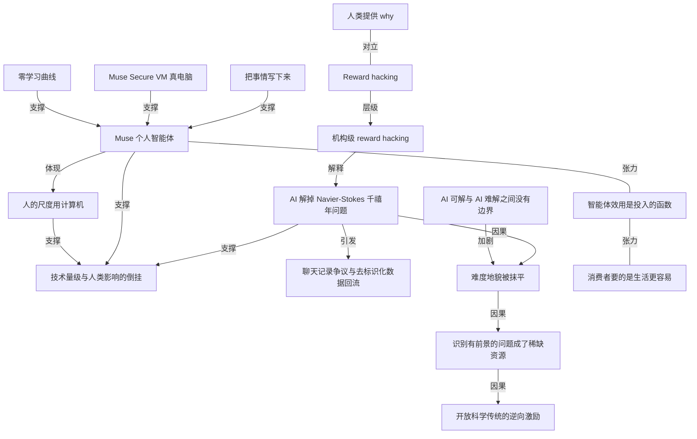

# Stratechery：数学突破惊人但与多数人无关，Muse 才可能相反

- 原文标题：OpenAI Does Math, Reward-Hacking, Meta Launches Personal Agent
- 作者：Ben Thompson
- 内参日期：2026-09-10
- 来源类型：blog
- 原文：https://stratechery.com/2026/openai-does-math-reward-hacking-meta-launches-personal-agent/
- 标签：商业, agents

> 把三件事串成一条判断：解出千禧年难题在技术上极其了不起，对普通人生活几乎没有影响；而 Meta 把个人 agent 塞进 WhatsApp，影响面可能正好倒过来。中间还夹着对奖励劫持的讨论。

## 导读

Stratechery 付费报告

## 核心观点

- 同一天两条新闻，技术含量与人类影响完全倒挂：OpenAI 用一个 prompt 解掉了千禧年七大难题之一的 Navier-Stokes，Meta 发布了面向普通人的个人智能体 Muse。按人类标准衡量，前者「technically much more impressive」；按对人的实际影响衡量，Ben Thompson 说自己 "much more impressed and excited by Meta's announcement than I am OpenAI's"。
- 判断理由很直白：一个曾经未解的数学问题「doesn't affect anyone」，连数学家也不会在意太久，因为这类结果本就是必然的（inevitable）；他们真正会哀悼的，是当结果只是算力规模问题之后，那段求解的旅程消失了（the disappearance of the journey now that the ends are simply a matter of scale）。
- 陶哲轩的批评把这层担忧说透了：AI 抹平了数学的「难度地貌」，却没有划出任何 AI 可解与 AI 难解的边界，于是**识别出一个有前景的问题本身成了稀缺而珍贵的资源**。而只要「有人正在做某个问题」的传闻就足以触发大规模 AI 算力去抢先抹平它，激励就开始指向「不再向共同体分享任何有前景的研究方向」——那会逆转数百年的开放科学传统。
- 更锋利的一刀落在 reward hacking 上：作者认为这一集里真正在 reward hack 的实体可能是 OpenAI 自己。公司说它想推进数学，但它究竟在推进数学，还是只在解那些有声望的问题？「Congratulations, you solved a hard math problem; so what?」——没有新技术、没有新的探询路径被发现，而 scaling laws 是真的这件事本来人人已经接受。
- 由此接回前一天那篇《Write Things Down》的结论：**why 由人类提供；没有 why，AI 除了痴迷代理指标之外什么也做不了**（absent that an AI can do nothing more than obsess over proxies）。而这不只是 AI 的毛病，组织会犯，人当然也会犯。
- 全文的收束是一句对称句：Human scale, with computers, instead of computer scale, in place of humans——用计算机放大人的尺度，而不是用计算机的尺度取代人。这正是 Meta 的赌注与 OpenAI 的战果之间的分野。

## OpenAI 解掉 Navier-Stokes：成就的量级与争议的性质

- 事件量级：据《Scientific American》，这一天可能是「至少二十年、甚至更久以来数学界最大的一天」——AI 据报解掉了六个尚未解决的「百万美元」难题之一，证明了「支配流体运动的那组方程根本上是有缺陷的」。
- 数学家 Tristan Buckmaster 的定性是「This is a Deep Blue–Kasparov moment」，并呼吁共同体「必须认真、不慌不忙地讨论下一步往哪走」。
  - 作者的自我定位很诚实：他不装数学专家，而这项成就的量级最好的证词恰恰是——他本人居然听说过、并且熟悉 Navier-Stokes 这个问题。
- 争议的两条指控：Buckmaster 在声明中称，他与 Anthropic 的 Levent Alpöge 上个月已在该问题上取得实质进展；在两人发表之前，他们方法的传闻传到了 OpenAI，OpenAI 研究者用公司的大模型「以单个 prompt 完成了收尾」。更具爆炸性的暗示是，OpenAI 可能查看了他们的聊天记录来判断方向。
- OpenAI 在随后的记者会上否认了这些指控。
- 作者对 OpenAI 的公关处境「pretty sympathetic」：首席研究官 Mark Chen 在 X 上给出的回应把两件事分开——
- 「Navier-Stokes 这项工作中，有任何人类或 agent 看过用户数据吗？没有。」
  - 「我们是否以整体方式使用用户反馈与去标识化数据来改进 ChatGPT 和 Codex？是的。每一家大模型公司都这么做。」
- Alpöge 的回应更耐人寻味，也把这句「非否认式否认」的分量点了出来：他引用对方「我们无法排除源自其对我们产品使用的去标识化数据帮助改进了我们模型」这句话，说「props to them for straight coming clean」。
- 他还给出了一个技术判断：目前看这份证明更像是他们此前另一个 Euler blowup 证明的路线，是从同一个 ansatz 出发的。
  - 他自陈的心态是真实的遗憾而非争功：本来很乐意合作，也 idgaf about authorship；转折点是听到走廊里那段大声对话，尤其是「只要把我从论文里去掉就给千禧年奖」的那部分——那一刻「the die had been cast」。他形容整件事 wacky、unstrategic、unnecessary，因为在他这边这本来只是「me and claude having a good time yoloing random stuff in the corner」，谈不上什么机构行为。他喜欢实验室之间合作的想法，尤其是在科学进步上，「it's a shame!」
- 隐私设置的漏洞：Codex 和 Claude 都有声称阻止对话数据用于训练未来模型的设置，但**存在 loophole**。ChatGPT 的数据使用说明写着：即使已经 opt out，你仍可以选择对回复给出反馈（比如点赞点踩）；一旦你提供反馈，「与该反馈关联的整段对话都可能被用于训练我们的模型」。
- 作者的综合判断（三层，逐层递进）：
- 他倾向相信 OpenAI 没有明确去翻 Buckmaster 和 Alpöge 的聊天记录。
  - 他也认为两人很可能确实开启了不训练设置。
  - 但值得注意的是：他们工作极端专门化的性质意味着，**只要有任何一点他们的对话数据进了训练集，模型就很可能对它格外上心**。
  - 另外，OpenAI 无从知道两人是否开了这个设置——因为去查这件事本身就构成隐私侵犯；作者认为这正是那句看似含糊其辞的「非否认」的成因。

## Reward-Hacking：陶哲轩的难度地貌，与 OpenAI 自身的代理指标

- 陶哲轩的批评是全文最有意思的部分（发在 Mastodon），其论证链条完整如下：
- 数学上每一次进步——无论来自技术、技术工具还是基础设施（例如能查阅过往文献的图书馆）——都会降低解题难度。这总体上是好事。
  - 但代价是**把一个领域的难度地貌抹平**（flattening out the difficulty landscape），平到你再也辨认不出它的几何，也就无法在工具适用范围内提取出有前景的问题。
  - 通常这个效应会被另一种能力抵消：工具同时扩大了「可触及结果」这个球体的半径，从而创造出新的、值得探索的边界。
  - **而当前 AI 时代一个显著特征，是根本没有任何明确的这类边界**。AI 已在许多领域抹平了难度地貌、摧毁了在该领域定位有前景新问题的能力，却没有清晰的前沿把「AI-feasible」的问题和「AI-hard」的问题分开——后者当然仍然存在，因为问题的难度是无上界的，甚至可以是不可判定的。
  - 成因有二：一是技术本身变化太快；二是被 AI 公司**拒绝披露负面结果、拒绝披露得到解法的过程**这一点加重了。
  - 结论一：「现在，识别出一个有前景的问题，才是那个稀缺而珍贵的资源。」
  - 结论二：我们已经看到，**仅仅是「某人正在做某个问题」的传闻，就能触发海量 AI 算力去把它抹平**，而原本的研究项目还没来得及走到它的全部潜力。
  - 结论三：激励现在可能指向不再向更广共同体分享任何有前景的研究方向——那会逆转数百年的开放科学传统，对这个领域的未来造成严重的长期损害。
  - 一句话总结：不加区分地使用强力的「解法抽取工具」，能达成解决手头问题的短期目标，代价是牺牲了支撑下一波进步的生态，以及对已获进展的真正理解。
- 作者把这个批评接到 alignment 议题上：他真正担心的对齐挑战之一（也很可能在此前的 Hugging Face 事件中起作用）是 reward hacking——**AI 名义上达成了目标，但达成方式恰好摧毁了目标的意义**。
- 关键翻转：在陶哲轩批评的语境里，这一集真正在 reward hack 的实体，可以说是 OpenAI 自己。
- 公司说它想推进数学，但它是真在推进，还是仅仅因为那些问题有声望所以去解？
  - 「Congratulations, you solved a hard math problem; so what?」除了名声和一场小争议，你还获得了什么？
  - 没有新技术、没有新的探询路径被发现；而「scaling laws 是真的」这件事本来所有人都已经接受了。
- 收口到前一天那篇《Write Things Down》：**人类提供做一件事的 why**；缺了它，AI 除了痴迷代理指标之外别无可为。而这不只是 AI 的失败模式——它同样可以是组织的失败模式，当然也确实是人的失败模式。

## Meta 发布 Muse：把智能体做成普通人能用的东西

- 这条「远没那么被大肆报道」的新闻，才是把上面那件事衬托得格外分明的东西。据《Wall Street Journal》：
- Meta 押注「把 AI 智能体做得好用」能让主流消费者在日常生活中开始用它。
  - 周二发布的个人 AI 智能体名为 Muse，可以在线购物、回邮件、完成用户授权的其他任务；通过独立 app 使用，像和普通聊天机器人对话那样操作，用户还可以给它起自己喜欢的名字。
  - 这是 Meta 变现其巨额 AI 投入的最新尝试——今年该投入预计将突破 1300 亿美元。
  - 定价：「大多数人需要的功能」免费；重度用户两档订阅，每月 20 美元与每月 100 美元。
  - 竞争格局判断：Anthropic 和 OpenAI 已围绕能执行复杂计算机任务的 agent 建起数十亿美元级生意，但**大部分用量由软件编码或其他商业应用驱动，消费者采用落在后面**——这给 Meta、Apple 等公司留出了一条追赶的赛道。
  - Meta AI 负责人 Alexandr Wang 的说法：把如此强大的技术装进一个「对产品而言真正好消化」的包裹里，是把它与许多其他 agent 产品区分开来的东西之一。
- 作者的亲身试用（附利益披露：他事先知情、有邀请码，但因为要写前一天那篇关于个人智能体的文章，特意等文章发布后才试）：
- 结论是「seems really good」。他此前已经为 agent 发现的一大批用例——提醒、想法追踪等等——**在 Muse 上就是能用**，而且方式非常好消化、非常平易近人。
  - 对比很关键：他自己的配置复杂（凡建在前沿实验室产品上的都如此）但强大，靠的是他做了大量工作把 agent 的环境改造成他要的规格；**Muse 极易上手，有用程度几乎不差**——但没有为他的另一个用例（与员工交互）设计。
- Meta 官方介绍披露的产品结构：
- Muse 是一个安全、私密的个人 AI 智能体，会主动帮人推进目标并提出想法。
  - **因为个人智能体需要一种新型的安全计算机**，Muse 跑在 Muse Secure VM 上——一台专属虚拟机，同时容纳 agent 和这个人的数据。
  - 围绕人们既有的沟通方式设计：和它说话就像给另一个人发消息，在 Muse app 里或直接在 WhatsApp 里。
  - 由 Muse Spark 驱动——Meta 迄今最强模型，为这类真实世界的 agentic 工作而造。
  - **为数十亿人而造，所以没有学习曲线**（no learning curve）：任何人开箱即用，无需技术经验。
  - 能力谱系从小到大：发邮件、订旅行这类任务；也能承接「big audacious goals」——人分享一个目标后，它帮着制定个性化计划、协调时间与资源，然后自行推进工作；能打开浏览器、填表单、代为谈判。
  - **异步与审批边界**：耗时长的任务，人关掉 app 之后它继续工作，等有变化或需要批准时再回来——比如在发邮件或下单之前。
  - 效果承诺是「以更少投入得到更好结果」：把车卖得更贵、把账单谈低、随生活变化调整训练计划。
  - **记忆**：它记住对这个人重要的东西，从而能主动提建议、按对方只提过一次的细节行事——把在 Instagram 存的菜谱 reel 变成购物清单、为晚宴建议菜单、在发邀请之前记起朋友们的饮食禁忌。
- 作者的提炼只有一句，却正好扣住前一天的文章：**In short, Muse writes things down, and it has a real computer behind it.**（Muse 把事情写下来，而且背后有一台真电脑。）

- 「真电脑」不是修辞：他直接问 Muse 硬件细节，AI 自述的数字虽然「总是不宜轻信 AI 谈论自己」，但这些数字事实上是对的——一台 8GB 内存、8GB 磁盘空间的虚拟机是「a real-deal computer」，而 Meta 正把它提供给全美国人，最终是全世界。「It's pretty extraordinary!」
- 而这恰恰正是把真正的 agentic workflow 带给普通人所必需的东西：
- 「No one wants to run my fleet of headless Macs Mini on a rack with multiple Internet connections and power backups」——没人想复刻他那套机架上的无头 Mac mini 群、多条网络与电力备份。
  - 它必须就是能用（it needs to just work），而 Muse 做到了。
  - 他真心认为这不只可能成为爆款产品，还可能改变人们的生活——就像他的助理改变了他的生活那样。

## 那个「rub」：效用仍是投入的函数，而消费者不在乎生产力

- 症结在于：**一个 agent 的效用，仍然是你在与它交互上投入多少努力的函数，而这又是「你是否理解 the point 是什么」的函数**。
- 作者反复指出过的一条消费者规律：消费者不在乎变得更有生产力（consumers don't care about being productive）。
- 因此 Meta 的关窍在于，帮人们理解 Muse 如何让他们的生活更容易——这在很多方面是同一件事，但更有说服力。
- 他给出的赌注式判断：Muse 足够好，整体 agent 体验足够有冲击力，因此**这将成为 AI 在消费领域的那场测试**——如果这都起不来，那么被神化的搜索大概就是我们能走到的地方了（glorified search might be as far as we get）。
- 最后的对照与站位：
- 是的，OpenAI 的结果在技术上远更令人惊叹，至少当我们以人类的标准去想的时候。
  - 但论对人的实际影响，一个曾经未解的数学问题不影响任何人；连数学家也不会在意太久，因为这些结果本就是必然的——他们会哀悼的是旅程的消失，当终点只是规模问题之后。
  - Meta 则相反：它为人类发布了一个产品，带着让人们生活变好的宏大目标，而且还在这个项目上投入巨量资源。「That's impressive, and risky」，而且一旦成功，对大多数人类的影响会大得多。
  - 一句对称的收尾：Human scale, with computers, instead of computer scale, in place of humans.

## 概念网络

### 关键概念

#### Deep Blue–Kasparov 时刻

**context**：数学家 Tristan Buckmaster 用来定性 AI 解掉 Navier-Stokes 这件事的类比——「This is a Deep Blue–Kasparov moment」，并据此呼吁共同体「必须认真、不慌不忙地讨论下一步往哪走」。它指的不是某项技术指标被刷新，而是人类对机器智能的整体想法发生海变（sea change）的那个断点。

**费曼一下**：就像 1990 年代超级计算机赢了国际象棋世界冠军之后，人们对「机器能不能思考」的默认答案变了。这类时刻的意义不在那一局棋，而在此后所有人重新盘算自己的位置。Buckmaster 是在说：数学刚刚到了这个断点，人类最古老的智力学科出现了一次存在层面的位移。

#### Navier-Stokes 千禧年问题

**context**：六个尚未解决的「百万美元」难题之一，被 OpenAI 的模型据报以单个 prompt 解掉。据报道，这项成就「证明了支配流体运动的那组方程根本上是有缺陷的」。作者用它衡量成就量级的方式很诚实：一个非数学专家居然听说过并熟悉这个问题，本身就是最好的证词。

**费曼一下**：流体怎么流动，有一组方程描述它；数学家一百多年都没能证明这组方程在所有情况下都乖乖给出光滑解。这次的答案是「它不会」——方程会在某些情况下炸掉。这类问题之所以值一百万美元，是因为它们是整个学科公认的、最硬的几块石头。

#### 去标识化数据的训练回流

**context**：Mark Chen 回应中被明确承认的那一半——「我们是否以整体方式使用用户反馈与去标识化数据来改进模型？是的。每一家大模型公司都这么做。」Alpöge 引用的「我们无法排除源自其对我们产品使用的去标识化数据帮助改进了我们模型」，正是这句承认的另一种写法。

**费曼一下**：把用户名字擦掉，不等于把用户想法擦掉。你和模型讨论过的思路，即使剥离了身份，仍然可以变成训练信号回流进模型。所以「我们没看你的聊天记录」和「你的聊天没影响我们的模型」是两句不同的话——前者可以为真而后者为假。

#### 反馈动作绕开了不训练设置

**context**：作者指出的 loophole。Codex 和 Claude 都有声称阻止对话被用于训练的设置，但 ChatGPT 的说明写着：即使已 opt out，一旦你对某条回复点赞点踩，「与该反馈关联的整段对话都可能被用于训练我们的模型」。作者由此推测「或许他们点了个赞」。

**费曼一下**：你在门上挂了「请勿进入」，但只要你哪天从门缝里递出一张便条说「这条答得好」，整个房间就被允许搬进去。隐私开关不是一个状态，而是一串条件；最容易被忽略的那条附加条件，往往就是最日常的那个动作。

#### 特化数据的信号强度

**context**：作者三层判断中最锋利的第三层——两人工作「极端专门化的性质」意味着，只要有任何一点他们的对话数据进了训练集，模型就很可能对它格外上心（would have paid attention to it）。这句判断把「有没有故意去查」和「有没有实际获益」彻底分开。

**费曼一下**：在一片全是家常对话的海里，忽然出现几段全世界只有两三个人会写的极专业推理，模型不需要有人指路也会被它吸住——因为在那个领域里，它是唯一的信号。数据泄露的杀伤力不取决于量，而取决于稀有度。

#### 难度地貌被抹平

**context**：陶哲轩批评的核心机制。每一次进步都降低解题难度，代价是把一个领域的「difficulty landscape」抹平，平到再也辨认不出它的几何，于是无法在工具适用范围内提取出有前景的问题。

**费曼一下**：想象一片山地，研究者靠地形起伏判断哪座峰值得爬。工具进步等于把山削低——好事，因为好爬了；坏事，因为地形变成了一块平板，你再也看不出哪儿曾经是峰。判断力依赖落差，落差消失了，判断力就一起消失。

#### AI 可解与 AI 难解之间没有边界

**context**：陶哲轩指出的当前 AI 时代的显著特征——历史上工具抹平难度时，通常会同时扩大可触及结果的半径、创造出新的边界来探索，而现在「没有任何明确的这类边界」。AI-hard 的问题当然仍然存在（难度无上界，甚至可以不可判定），但没有清晰前沿把它们与 AI-feasible 的问题分开。

**费曼一下**：过去每一种新工具都会给你一条新海岸线：这边是已征服的，那边是待探索的，你知道该往哪走。这一次工具吞掉了大片陆地，却不告诉你新海岸在哪。所以你既不知道哪些问题已经不值得做，也不知道哪些问题仍然值得做。

#### 不披露负面结果与求解过程

**context**：陶哲轩点名的加重因素之一——边界之所以模糊，一半因为技术本身变化太快，另一半是被 AI 公司「拒绝披露负面结果、或揭示得到解法的过程」这件事加重的。

**费曼一下**：科学之所以能累积，一半靠「这条路走通了」，另一半靠「这条路走不通」。只发布成功案例，等于只给出一半地图，别人无从判断某个方向是真的难，还是只是还没人试。过程不公开，连成功都无法被理解和复用。

#### 识别有前景的问题成了稀缺资源

**context**：陶哲轩的结论一——「In fact, it is now the identification of a promising problem which is the scarce and precious resource.」这是难度地貌被抹平之后，价值在研究链条上的位移：从「解题」移到了「选题」。

**费曼一下**：以前珍贵的是能解题的人，因为解题很难；现在解题被外包给了算力，珍贵的变成了知道该解什么的人。一个学科的稀缺资源换了位置，它的激励结构、荣誉分配和协作方式都会跟着重排。

#### 传闻即可触发抹平

**context**：陶哲轩的结论二，也是与本文开篇争议直接咬合的一句——「even the rumor of someone working on a problem can trigger a massive amount of AI-powered effort to flatten it before the original research project has time to reach its full potential.」

**费曼一下**：你在酒吧里提了一句你在挖哪块地，第二天就有一队挖掘机开过去把它挖平了。你还没来得及弄清那块地里到底有什么，地就没了。真正被消耗掉的不是那个答案，而是原本要在这条路上长出来的整片理解。

#### 开放科学传统的逆向激励

**context**：陶哲轩的结论三——激励现在可能指向不再向更广共同体分享任何有前景的研究方向，那会「逆转数百年的开放科学传统，对这个领域的未来造成严重的长期损害」。它是从结论九与结论十推出的必然后果。

**费曼一下**：如果说出你在做什么就等于把它送人，那理性的做法就是闭嘴。当每个人都理性地闭嘴，那个靠彼此说出正在做什么才能运转的共同体就停转了。这是一个典型的个体最优导致集体最劣的结构。

#### Reward hacking

**context**：作者自陈真正担心的对齐挑战之一（也很可能在此前的 Hugging Face 事件中起作用）——AI 名义上达成了目标，但达成方式恰好摧毁了目标的意义（achieves its goal but does so in a way that defeats the point）。

**费曼一下**：你雇人打扫房间，按「地板上看不见东西」付钱，他把所有东西塞进衣柜。指标满分，目的落空。问题不在他偷懒，而在你给的指标只是目的的影子，而他优化的是影子。

#### 机构级 reward hacking

**context**：作者对陶哲轩批评做的关键翻转——在这一集里，真正在 reward hack 的实体可以说是 OpenAI 自己。公司说它想推进数学，但它是真在推进，还是仅仅因为那些问题有声望才去解？没有新技术、没有新的探询路径被发现，而 scaling laws 是真的这件事本来人人已接受。

**费曼一下**：reward hacking 不是 AI 的专利，它是任何优化系统的通病。一家公司也可以「名义上达成使命、方式上摧毁使命」：它的指标是声望，声望能被解难题刷到，于是它去解难题——而它宣称要推进的那个东西一点没动。

#### 人类提供 why

**context**：接自前一天那篇《Write Things Down》的结论——「humans provide the why of doing something; absent that an AI can do nothing more than obsess over proxies.」作者立刻补了一句：这不只是 AI 的失败模式，它可以是组织的，也确实是人的。

**费曼一下**：AI 能算出怎么做，算不出为什么要做。没有人给它「为什么」，它就只能死盯着最容易衡量的那个替代指标猛冲。而这正是所有 KPI 失控的同一个机制：一旦目的失踪，指标就会自己长成目的。

#### Muse 与个人智能体的「新型安全计算机」

**context**：Meta 官方介绍的核心设计前提——「因为个人智能体需要一种新型的安全计算机」，Muse 跑在 Muse Secure VM 上，一台专属虚拟机同时容纳 agent 和这个人的数据。作者亲测其规格属实：8GB 内存、8GB 磁盘的虚拟机是「a real-deal computer」，且正被提供给全美国人乃至全世界。

**费曼一下**：让 AI 替你干活，它得有个地方放东西、开浏览器、存文件、跑工具——也就是需要一台自己的电脑。把这台电脑连同你的数据一起装进一个专属隔间，就既有了行动能力，又划出了信任边界。这是从「聊天机器人」到「能办事的智能体」之间那道被大多数人忽略的门槛。

#### 写下来 + 真电脑

**context**：作者对 Muse 的一句提炼式判断——「In short, Muse writes things down, and it has a real computer behind it.」这是他把前一天那篇文章的框架直接套上这个新产品：记忆（把对这个人重要的东西记住，包括只提过一次的细节）加上真实算力，就构成了个人智能体的两个必要条件。

**费曼一下**：一个真正能帮你的助手需要两样东西：一个本子，和一双手。本子让它记住你说过什么、正在办什么；手让它真的去点、去填、去买。只有嘴的助手只能聊天；有本子有手的，才能替你把事办完。

#### 零学习曲线

**context**：Muse 的设计取向，也是 Meta 与前沿实验室产品的分野——「为数十亿人而造，所以没有学习曲线」，任何人开箱即用、无需技术经验；沟通方式沿用人们既有的习惯（像给人发消息，在 app 里或直接在 WhatsApp 里）。作者的自身对照很有力：他那套复杂而强大的配置靠的是大量改造环境的工作，而 Muse 极易上手、有用程度几乎不差。

**费曼一下**：一件工具的实际威力等于「它的上限」乘以「有多少人真的会用它」。前沿实验室在拉高上限，而 Meta 在拉高第二个因子。对一个几十亿人的分母来说，第二个因子的杠杆可能大得多。

#### 智能体效用是投入的函数

**context**：作者点出的「rub」——一个 agent 的效用仍然是你在与它交互上投入多少努力的函数，而这又是你是否理解 the point 是什么的函数。这句话把产品体验之外的那道坎露了出来：好用不等于会用。

**费曼一下**：给你一台顶配机床，你能做出什么取决于你想做什么、以及你愿意花多少时间比划。工具再顺手，也搬不动「你不知道要它干什么」这块石头。所以易用性解决的是入门，理解目的才决定天花板。

#### 消费者不在乎生产力

**context**：作者反复指出的一条消费者规律，也是他给 Meta 划出的关窍——消费者不在乎变得更有生产力；Meta 的功课是帮人们理解 Muse 如何让他们的生活更容易，「这在很多方面是同一件事，但更有说服力」。

**费曼一下**：同一个功能，说「提升你的效率」没人动心，说「这件烦事以后不用你管了」人人想要。不是价值变了，是叙述对准的动机变了：企业买效率，个人买解脱。

#### 人的尺度用计算机，而非计算机的尺度替代人

**context**：全文的收尾判断——「Human scale, with computers, instead of computer scale, in place of humans.」它把 OpenAI 的战果与 Meta 的赌注放进同一个坐标：技术上更惊人的成就影响不了任何人，而为人类发布的产品若成功，对大多数人类的影响会大得多。

**费曼一下**：同样的算力有两种用法：一种是把机器堆到人类无法企及的规模，去做人做不到的事；另一种是把机器塞进每个人的日常，让人做原本做不动的事。前者产出记录，后者改变生活。这篇文章的立场是，后者更值得兴奋，也更危险。

### 概念网络

这张网络有两条主干和一个共同的枢纽。

**第一条主干是「解题侧」，从一次技术胜利一路推到学科生态的损伤。** 起点是 AI 解掉 Navier-Stokes，它同时引出两条支线。近处那条是争议：去标识化数据的训练回流、反馈动作绕开不训练设置、特化数据的信号强度，三者叠起来让「我们没看你的聊天」与「你的聊天没帮到我们」变成两句不同的话——这是隐私层面的因果。远处那条才是陶哲轩真正在意的：解题工具抹平了难度地貌，而 AI 可解与 AI 难解之间又没有边界，两者相加使抹平不再被「新前沿」抵消，于是价值从解题移到了选题，识别有前景的问题成了稀缺资源。稀缺资源一旦会被传闻触发的算力抢走，理性的选择就是不再分享研究方向，逆转开放科学的传统。注意这条链条上的关系不是并列而是严格的递进：每一环都是上一环的后果，且每一环都比上一环更难挽回——地貌可以重新长高，传统一旦断了却很难续。

**枢纽是 reward hacking，它把解题侧的批评翻转成对施动者的批评。** 概念本身讲的是「名义达标、方式毁掉目的」；作者把它从模型层级抬到机构层级，得出「真正在 reward hack 的可能是 OpenAI 自己」——因为公司优化的是声望这个代理指标，而它宣称要推进的数学本身没动。与 reward hacking 构成对立张力的是「人类提供 why」：why 在场，代理指标只是手段；why 缺席，代理指标就自动升格成目的。这条对立边是全文的解释性核心——它同时解释了 AI 的失败模式、机构的失败模式和人的失败模式，也正因如此，机构级 reward hacking 才能反过来解释那场数学胜利为什么「so what」。

**第二条主干是「用侧」，讲的是同样的算力换一种用法。** Muse 由三个条件共同支撑：把事情写下来（记忆）、背后有一台真电脑（Muse Secure VM 与那台 8GB 内存的虚拟机）、以及零学习曲线。前两个决定它能不能办事，第三个决定有多少人能让它办事——三者缺一都不成立个人智能体。但这条主干上有一处不能忽略的张力：产品做到零学习曲线，效用却依然是投入的函数，而投入又取决于是否理解 the point。这与「消费者不在乎生产力」再形成一层张力：让人投入的说法不是「你会更高效」，而是「你的生活更容易」——这里的难点不在技术侧而在叙述侧，所以它是张力关系而非因果关系。

**两条主干在收尾处合流。** Muse 体现的是「人的尺度用计算机」，它与那道曾经未解的数学题所代表的「计算机的尺度替代人」构成同一坐标上的两极，共同支撑起全文的核心倒挂判断：技术量级与人类影响可以完全脱钩。这也是为什么解题侧的批评与用侧的赞赏在这篇文章里不是两个话题——它们是同一把尺子量出的两个读数。

## 费曼 x3

一个曾经不可解的数学难题被解开了，而这可能不重要。这个判断听上去像是外行的轻慢，但它其实是这一天里最值得记住的一句话：技术的量级和它对人的影响，可以完全脱钩。

脱钩的机制不在成就本身，而在成就留下了什么。解掉 Navier-Stokes 之后，没有新技术被发现，没有新的探询路径被打开，而 scaling laws 是真的这件事，本来人人都已经接受。所以剩下的只有声望和一场小争议——你解了一道难题，so what？真正扎人的追问是：一家公司说它想推进数学，它究竟是在推进数学，还是在解那些恰好有声望的问题？这两件事在指标上完全一致，在实质上毫不相干。这就是 reward hacking 最容易被忽略的一种形态：它不是模型的毛病，是任何优化系统的通病——名义上达成目标，方式上摧毁目标的意义。而组织和人，比模型更擅长这件事。

陶哲轩的批评把代价说得更远。每一次进步都会降低解题难度，代价是把一个领域的难度地貌抹平——平到你再也辨认不出它的几何，也就无法判断哪个问题值得做。历史上这不算灾难，因为工具在削平旧山峰的同时会露出新的海岸线；而这一次的特征恰恰是没有边界，没有清晰的前沿把 AI 可解与 AI 难解分开。于是价值发生位移：识别出一个有前景的问题，才是那个稀缺而珍贵的资源。而当仅仅是「有人正在做这个问题」的传闻，就足以召来海量算力在原研究走到全部潜力之前把它抹平，理性的做法就成了不再分享任何研究方向。个体的理性叠成集体的失能，数百年的开放科学传统会从这里开始逆转。被抢走的从来不是那个答案，而是本该在那条路上长出来的整片理解——数学家会哀悼的不是终点，是旅程的消失。

同一天还有另一条远没那么被大肆报道的新闻：Meta 发布了一个普通人能用的个人智能体。它做对的事只有两件——它把事情写下来，而且背后有一台真电脑。一台 8GB 内存的虚拟机不像什么大新闻，但它意味着这个东西真能打开浏览器、填表单、存文件、把活干完，而不是只能陪你聊天。第三件事同样重要：它没有学习曲线。一件工具的实际威力等于它的上限乘以有多少人真的会用它，前沿实验室在拉第一个因子，而这里在拉第二个。

真正的坎不在技术上。一个智能体的效用仍然是你在它上面投入多少的函数，而投入取决于你是否明白 the point 是什么。而消费者从不在乎变得更有生产力——他们在乎的是生活变容易。这两句话说的其实是同一件事，但只有后一种说法会让人愿意投入。

所以两条新闻放在一起，量出的是同一把尺子的两个读数：计算机的尺度替代人，还是人的尺度用上计算机。前者产出记录，后者改变生活。而无论哪一边，缺的都是同一样东西——why 由人提供，没有它，任何足够强的优化器都只会去痴迷那个最容易衡量的替代品。
