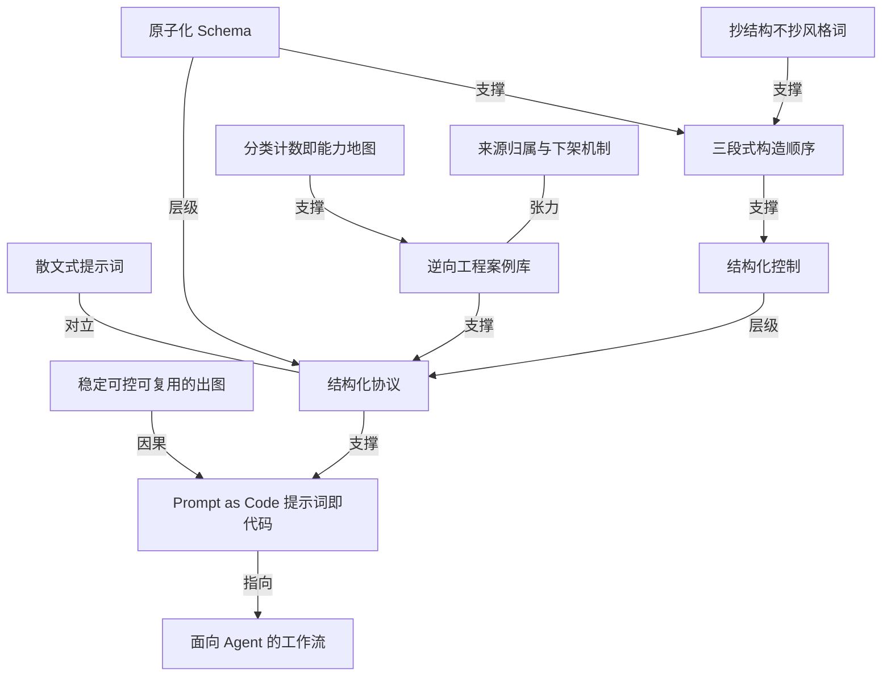

# 530 多个逆向案例堆出来的 GPT-Image2 提示词库

- 原文标题：freestylefly/awesome-gpt-image-2
- 作者：GitHub
- 内参日期：2026-09-10
- 来源类型：blog
- 原文：https://github.com/freestylefly/awesome-gpt-image-2
- 标签：多模态, 工具技巧

> 把提示词当代码写的一个开源仓库：530 多个案例逆向工程、20 多套工业级模板，还提炼成了可复用的 skills。当素材库翻比当教程读更合适。

## 导读

github repo 欣赏，awesome-gpt-images

## 核心观点

- 这个项目的自我定位是一句话：「Prompt as Code」。它不是又一个提示词收集站，而是把零散案例逆向整理成「更适合 Agent 和自动化工作流调用的 Prompt-as-Code 资产」。
- 它给出的判断是，GPT-Image2 全量开放后，AI 画图的问题已经换了：「从『能不能出图』变成了『能不能稳定、可控、可复用地出图』」。能力不再稀缺，稀缺的是可控性。
- 因此项目的核心目标只有一个——「把『散文式提示词』压缩成『结构化协议』」。作者明确说，当你要批量出图、做模板系统、接进生产流程时，这种整理方式「比单纯堆案例更有价值」。
- 支撑这个目标的是三条自述能力：原子化 Schema（把主体、光影、材质、排版等视觉要素拆成可组合组件）、工作流友好（面向 Agent、脚本和自动化系统，而不是只给人肉复制）、结构化控制（尽量提高版式、文案、信息层级的可控性）。
- 库的形态是「案例画廊 + 模板总表」双层：底层是几百个逆向工程后的真实案例，上层是 20+ 套工业级模板与防坑指南；使用纪律是「抄结构，不要只抄风格词」。
- ※ 标题所称「530 多个」在原文里没有对应数字：副标题写「370+ 个案例逆向工程」，徽章标 `Cases-374`，画廊分册到例 374，13 个分类计数之和恰好也是 374。以原文为准，当前规模是 374 个案例。

## 问题转移：从「能不能出图」到「能不能稳定可控地出图」

- 项目愿景一节把时间点定在「GPT-Image2 全量开放后」。开放意味着出图能力普及，普及之后的竞争面自动上移。
- 原文用一组对照划出这条线：过去问「能不能出图」，现在问「能不能稳定、可控、可复用地出图」。三个形容词各自对应一类工程需求——稳定对应结果方差，可控对应版式与文案的精确度，可复用对应模板化与批量。
- 由此推出的第二个判断是关于「收集」的：单纯收集提示词已经不解决问题，因为散落的案例无法被脚本消费。作者做的是「逆向整理」——先拆解已有的好案例，再把它还原成可组合的结构。
- 这个转移也解释了项目为什么强调「接进生产流程」：判断标准不再是单张图好不好看，而是这套提示词能不能在批量出图、模板系统、自动化链路里稳定复现。

## 核心动作：把散文式提示词压缩成结构化协议

- 「散文式提示词」与「结构化协议」是全文最重要的一对反义词。前者是人写给人看的自然语言描述，后者是可被解析、可被填充、可被复用的字段结构。
- 原子化 Schema 是压缩的具体手法：把主体、光影、材质、排版等视觉要素拆成独立组件，再按需组合。组件化之后，改一处不必重写整段。
- 结构化控制指向的是最难的三块——版式、文案、信息层级。这三者恰好是散文式提示词最容易失控的地方：模块数量说不准、文字写不对、层级压不住。
- 工作流友好是这套结构的目的地：面向 Agent、脚本和自动化系统，而不是「只给人肉复制」。这句话把读者身份从「手动调图的人」换成了「调用提示词的程序」。
- 首页精选的例 1 是这套主张最直观的样本：一张信息图里塞进 11 个编号模块、完整系统图例、实时关键指标栏和 24 小时运行周期条，且中英双语标签逐一对齐。这种密度不是靠描述氛围能得到的，只能靠结构约束逐项指定。

## 库的形态：374 个案例、13 类分布、两册画廊

- 快速入口给出六个门：完整案例总览、案例画廊 Part 1（例 1-165）、案例画廊 Part 2（例 166-374）、工业级提示词模板与防坑指南、MIT License、完整声明页。案例与模板是分开维护的两层。
- 分类概览把 374 个案例摊成 13 类，计数本身就是一张能力地图：
- UI与界面 68、海报与排版 71、图表与信息可视化 55 —— 三类合计 194，占去一半以上，全都是重排版、重文字、重信息层级的场景。
  - 摄影与写实 32、建筑与空间 25、插画与艺术 25、商品与电商 24 —— 中间梯队，偏视觉质感。
  - 品牌与标志 19、人物与角色 13、历史与古风题材 8、场景与叙事 7、文档与出版物 7、其他应用场景 20 —— 长尾。
- 这个分布与项目的自我定位互相印证：库的重心不在「画得美」，而在「排得准」。
- 案例增长有明确的两条来源，且都标了出处：「苍何新增实测」贡献例 330-340（月下美女直播画面、西安手绘水彩城市地图、AI 眼镜爆炸拆解图、RAG 技术详解图、朋友圈截图生成、《短歌行》诗词意境图、《赤壁怀古》长卷图、Apple 风格自然科普海报等）；「近 24 小时 X 社区新增」贡献例 341-374（AP Calculus 学习表信息图、高定时尚杂志封面、4×4 动作分解参考表、品牌口红推荐报告信息图、概念字体海报、磁场铁粉标志物理成像、奢华个人色彩档案信息图、抹茶品牌触点系统视觉板等）。
- 新增清单的题材构成值得注意：Campaign 视觉板、信息图、分析海报、品牌触点系统这类「一套多张」的商业交付物占了大头，而不是单幅艺术图。

## 首页精选与代表案例：可控性的证据

- 首页精选挑出六个案例，每一个都配了「适合看什么」的观察提示，等于把案例当教材而不是当画廊：
- 例 1 信息图可视化设计：工程白皮书气质，「适合看结构化信息图如何组织模块、层级和双语标签」。
  - 例 2 社媒界面截图：产品界面与社媒内容截图的混合场景，看「文字区域、UI 框架和内容卡片的控制方式」。
  - 例 6 插画艺术创作图：日系奇幻插画，看氛围、色彩与大场景构图的描述方式。
  - 例 17 界面交互设计图：典型的「结构分解图 + 说明排版」，适合做产品示意图与海报化技术讲解图。
  - 例 166 十二黄金圣斗士卡牌合集：多卡面、多元素统一风格，「适合参考批量生成与系列化设计」。
  - 例 310 零食品牌技术分解图：品牌叙事、分解结构与商业化呈现结合，是「信息图 + 品牌视觉」的混合参考。
- 例 17 的实际样本是一张产品爆炸分解海报：十余个零件沿轴线展开，两侧引线标注逐一对应部件名与一句说明文案，顶部标题与底部结语构成完整排版。分解结构与说明文字同时受控，这正是「结构分解图 + 说明排版」的含义。

- 例 166 的样本是四列三行共十二张卡面：金色铠甲主体、统一的边框与底纹、每张卡下方一块中文名牌加对应星座符号。系列化设计考的不是单张质量，而是十二张之间的风格与版式一致性。

- 「近 24 小时」区块又单独拎出三个代表案例，观察提示同样具体：
- 代表案例 1 例 330 月下美女直播画面：高仿直播截图场景，「重点看界面氛围、中文弹幕和人物写实感的结合」。
  - 代表案例 2 例 334 RAG 技术详解图：参考「技术概念 + 信息图排版 + 中文说明模块」的组织方式。
  - 代表案例 3 例 338《赤壁怀古》长卷图：长卷尺寸、古风叙事与整篇文字排版结合完整，可作为长文本视觉化参考。
- 例 330 的样本把完整的直播间界面复现了出来：左上主播名与本场点赞数、小时榜标签、右上连麦头像与礼物进度、左侧一整列带昵称的中文弹幕气泡、右下点赞与礼物按钮、底部输入框。界面框架、中文文字与写实人物三者同时立住，是「UI 与界面」这一大类为何占 68 例的直接说明。

- 例 334 的样本是一张纯中文技术信息图：顶部五步流程（用户提问、检索、增强、生成、输出回答）横向排开并带回流箭头，下方两个大面板分别展开检索与生成的子步骤，右侧三张卡片列优势、应用场景与挑战，底部还有一行进阶增强与一句话总结。模块数量、信息层级与中文说明文字全部按结构落位。

- 例 338 的样本是超宽长卷：右起竖排书写整篇赋文近三十列，左半是水墨山水与孤舟，题名、落款与多枚朱印各安其位。极端画幅比例下的长文本排版能成立，说明「比例」与「文字要求」确实可以作为硬约束下达。

## 模板方法：三段式构造与 Agent 调用入口

- 完整模板已移到 `docs/templates.md`，首页只保留最核心的使用方式，是一条固定的三段式顺序：
- 先明确任务类型：UI、海报、电商、信息图、角色设定、出版物。
  - 再锁定结构约束：比例、布局、模块数量、镜头语言、文字要求。
  - 最后补风格和材质：色彩、光线、笔触、氛围、材质、质感。
- 这个顺序本身就是主张：结构先于风格。多数人写提示词的习惯正好相反——先堆风格词，再指望结构自己对。
- 给 Agent 或脚本调用时，作者给出优先级清单：UI 与界面模板、信息图模板、海报模板、摄影模板。这四类与分类计数里的头部高度重合，说明模板层是按真实密度铺的，不是均匀铺的。
- 模板还有两种形态：通用模板与 JSON 模板。JSON 形态是「Prompt as Code」在文件层面的落地——业务变量填进字段，而不是改写句子。

## 使用路径：抄结构不抄风格词

- 「怎么用这个库」只有三步，但每一步都在纠正一种常见误用：
- 先在精选案例里确定你要模仿的输出类型——先定类型，不要一上手就找好看的图。
  - 再去完整画廊里找相近案例，「抄结构，不要只抄风格词」——这是全文最锋利的一句操作纪律。
  - 最后回到模板页，把你的业务变量填进通用模板或 JSON 模板——收口到可复用资产，而不是停在一次性成品。
- 「抄结构不抄风格词」之所以关键，是因为风格词可迁移性极低（换题材就失效），而结构（模块数量、层级、文字区域、比例）在同类任务里几乎可以直接复用。
- 案例总览与模板总表两个入口并列存在，也是同一逻辑：画廊解决「长什么样」，模板总表解决「怎么再来一次」。

## 来源、合规与项目边界

- 项目坦白交代了素材来源：整理与研究过程中参考并使用了 YouMind 与 OpenNana 的公开提示词库内容，声明仅用于学习、归纳与方法论研究，版权归原作者或原平台所有。
- 声明页给出四条合规边界：尽最大努力保留原始来源（作者主页、原帖链接、原仓库链接）；涉及第三方内容时遵循来源仓库声明、CC BY 4.0 等许可及平台规则；原作者可发 Issue 附条目链接要求下架，核验后快速下线；不保证第三方内容可用于商业用途，商业使用前须自行取得授权。
- 项目自述「只整理公开可访问的社区提示词与示例图片」，不主张对第三方原创内容的任何所有权；做这件事的动机是「把好看的案例拆解成可复用的结构化协议，用于学习、归纳和大模型 Agent 接入的自动化测试」。
- 其余边界信息：项目采用 MIT License，允许在保留许可声明的前提下自由使用、修改、分发与二次开发；由「词元 API」这一 AI 聚合平台赞助支持；不定期更新最新玩法；维护者另有公众号与 Star 趋势图等运营入口。

## 概念网络

### 关键概念

#### Prompt as Code（提示词即代码）

**context**：项目副标题与愿景的核心自我定位——「把零散案例逆向整理成一套更适合 Agent 和自动化工作流调用的 Prompt-as-Code 资产」。它是全文所有做法的上位命名，也是 JSON 模板、原子化 Schema、模板总表存在的理由。

**费曼一下**：把提示词当代码写，而不是当作文写。代码有字段、有结构、能被程序读，还能改一处而不动全篇；作文只能整段重写。一旦提示词变成代码，它就从「一次性的话」变成了「能长期复用的资产」。

#### 散文式提示词到结构化协议

**context**：原文明说「核心目标只有一个：把『散文式提示词』压缩成『结构化协议』」。这是全文最重要的一对反义词，也是整个库的加工方向。

**费曼一下**：散文式提示词像跟朋友描述一幅画，你说得再动情，对方画出来也未必是你想的那张。结构化协议像填一张工单：比例多少、几个模块、哪里放什么字、什么材质，逐项写死。前者靠运气，后者靠约束。

#### 原子化 Schema

**context**：项目三条自述能力之首——「把主体、光影、材质、排版等视觉要素拆成可组合组件」。它是「结构化协议」在字段层面的具体形态。

**费曼一下**：把一张图拆成一盒积木：主体一块、光影一块、材质一块、排版一块。想换风格只换材质那块，其他不动。相比每次重捏一整个泥人，积木的好处是可替换、可复用、可批量。

#### 结构化控制（版式、文案、信息层级）

**context**：三条自述能力之三，「尽量提高版式、文案、信息层级的可控性」。它指向的正是散文式提示词最容易失控的三处，也是首页精选里信息图、界面截图、长卷案例共同验证的能力。

**费曼一下**：好看容易，说准很难。同一个画面里要放几个模块、每个模块写什么字、谁大谁小谁先看——这三件事以前几乎没法指定，只能反复抽卡。结构化控制就是把这三件事从「碰运气」拉回「可下指令」。

#### 工作流友好（面向 Agent 而非人肉复制）

**context**：三条自述能力之二，「面向 Agent、脚本和自动化系统，而不是只给人肉复制」；模板页也专门给出「如果是给 Agent 或脚本调用，优先看」的清单。

**费曼一下**：同一份提示词，给人用和给程序用是两种东西。给人用只要读得懂；给程序用必须结构固定、字段可填、结果可预期。这个库的目标读者其实是脚本，人只是顺便受益。

#### 逆向工程案例库

**context**：副标题写明「370+ 个案例逆向工程」，徽章标 374，画廊分两册（例 1-165、例 166-374）。项目反复强调自己做的不是「单纯收集提示词」，而是逆向整理。

**费曼一下**：看到一张好图，不满足于存下它的提示词，而是倒推它是怎么被组织出来的——分了几块、层级怎么排、文字放在哪。收集是攒图，逆向是拆机器；拆过一遍，你才能造同类的第二台。

#### 稳定、可控、可复用

**context**：判断 AI 画图问题转移的三个词——「从『能不能出图』变成了『能不能稳定、可控、可复用地出图』」。三者分别对应结果方差、精确度与批量化。

**费曼一下**：出一张能看的图，现在谁都能做到；难的是同一条指令十次出十次都对（稳定）、想改哪里就能改到哪里（可控）、明天换个业务还能接着用（可复用）。这三条才是生产流程的入场券。

#### 抄结构不抄风格词

**context**：「怎么用这个库」三步中的第二步原话——「再去完整画廊里找相近案例，抄结构，不要只抄风格词」。它是全文最锋利的一句操作纪律。

**费曼一下**：风格词换个题材就废了，结构换个题材还能用。「赛博朋克、电影感、8K」这类词是装饰；「三栏布局、十一个编号模块、双语标签、底部指标条」这类才是骨架。抄骨架的人能复现，抄装饰的人只能碰运气。

#### 三段式构造顺序（任务类型 → 结构约束 → 风格材质）

**context**：模板入口保留的最核心使用方式：先明确任务类型（UI、海报、电商、信息图、角色设定、出版物），再锁定结构约束（比例、布局、模块数量、镜头语言、文字要求），最后补风格和材质（色彩、光线、笔触、氛围、材质、质感）。

**费曼一下**：先定这是什么活，再定框架搭成什么样，最后才刷漆。多数人恰好倒着来：先想氛围色调，结构留给运气。顺序反了，返工就成了常态。

#### 分类计数即能力地图

**context**：分类概览把 374 个案例摊成 13 类，其中 UI与界面 68、海报与排版 71、图表与信息可视化 55 三项合计 194；模板页给 Agent 的优先清单（UI、信息图、海报、摄影）与这个头部高度重合。

**费曼一下**：一个案例库各类别的案例数量，其实是在告诉你这套工具在哪些活上最靠得住。排版、界面、信息图占了一半以上，说明它的强项是「排得准」而不是「画得美」——按这张地图挑任务，比逐个试错省得多。

#### 来源归属与下架机制

**context**：致谢与声明页交代素材参考自 YouMind 与 OpenNana 的公开提示词库，承诺尽力保留作者主页、原帖与原仓库链接，遵循来源声明与 CC BY 4.0 等许可，原作者可发 Issue 附条目链接要求下架，且不保证第三方内容可商用。

**费曼一下**：把别人的东西整理成体系，靠两件事站得住：说清楚哪来的，以及给人一个能撤回的口子。前者是归属，后者是纠错通道。缺了任一条，「整理」就会变成「搬运」。

### 概念网络

整张网络只有一个源头：出图能力普及之后，问题从「能不能出」变成「能不能稳定、可控、可复用地出」（C2）。这个转移直接催生了项目的上位命名「Prompt as Code」（C1）——提示词不再是一句话，而是一份可被程序调用的资产。

C1 落地的唯一路径是把「散文式提示词」（C3）压缩成「结构化协议」（C4）。C3 与 C4 之间是明确的对立关系，而不是程度差别：一边是人写给人看的自然语言描述，一边是可解析、可填充、可复用的字段结构。全文所有具体做法都是在这条压缩线上展开的。

C4 之下挂着两个层级性子概念。原子化 Schema（C5）解决「拆成什么」——主体、光影、材质、排版各成一块可替换组件；结构化控制（C6）解决「控住什么」——版式、文案、信息层级这三处散文式提示词最容易失控的地方。两者一个管构造单元，一个管输出精度，合起来才构成完整的协议。

C4 的原材料来自 C8（逆向工程案例库）：374 个案例不是被收集的，是被倒推拆解过的，拆解结果才有资格成为协议。C11（分类计数即能力地图）反过来支撑 C8——13 类计数的分布（排版、界面、信息图三类占一半以上）暴露了这个库真实的强项在「排得准」，也解释了模板层为什么按这个头部铺而不是均匀铺。

C9（三段式构造顺序）是 C6 的操作化：任务类型 → 结构约束 → 风格材质，把「结构先于风格」写成了固定动作。C10（抄结构不抄风格词）与 C9 同向而更锋利，它解释了 C9 为何必须是这个顺序——风格词换题材即失效，结构在同类任务里可直接复用。C5 也支撑 C9：先有可组合的组件，第二步的「结构约束」才有具体的填空位。

C1 最终指向 C7（面向 Agent 的工作流）：模板的通用与 JSON 双形态、给脚本调用的优先清单，都在把读者身份从「手动调图的人」换成「调用提示词的程序」。这是整条链的出口，也是「资产」二字的落点。

网络里唯一的张力来自 C12（来源归属与下架机制）与 C8 之间。逆向整理越彻底，与原始素材的权属距离就越远，所以项目必须同时给出两样东西：尽力保留的来源链接，和一个可被原作者触发的撤回通道。归属与纠错通道是这类整理型项目的承重结构，不是免责附录。

## 费曼 x3

一项技术从稀缺走向普及时，衡量它的标准会安静地换一次。图像生成刚出现那几年，人们比的是「能不能出」；等到出图成了按钮级的能力，比的就只剩下「能不能每次都出成你要的那张」。这个提示词库最值得借走的不是它的几百条案例，而是它对问题的重新定位：AI 画图已经从「能不能出图」变成了「能不能稳定、可控、可复用地出图」。三个形容词各有所指——稳定说的是结果方差，可控说的是能不能改到你想改的那一处，可复用说的是换个业务明天还能不能接着用。

顺着这个定位往下想，会发现「收集提示词」这件事本身已经过时了。一句写得漂亮的散文式描述，只能服务它诞生的那一张图；换个题材就得从头重写。所以真正的加工方向是把散文压缩成协议——把主体、光影、材质、排版拆成可组合的组件，把比例、布局、模块数量、文字要求写成能下达的硬约束。做完这一步，提示词才从「一句话」变成「一份可以被程序读的资产」，也才谈得上给脚本和 Agent 调用，而不是只给人肉复制。

真正的分水岭在版式、文案和信息层级这三件事上。画面好看从来不是难题，难的是指定同一张图里放几个模块、哪块写什么字、谁先被看见。当一张纯中文技术图能把五步流程、嵌套详解面板和三列要点卡片各自落位，当一张超宽长卷能竖排写下整篇赋文而版面不塌，说明「结构」已经进入了可下指令的范围。这也是为什么这个库里排版、界面、信息图三类案例占了一半以上——它的强项本就是「排得准」，不是「画得美」。案例的类别分布其实是一张能力地图，读懂它比逐个试错省太多。

而全文最锋利的一句只有九个字：抄结构，不要只抄风格词。风格词是装饰，换题材即失效；结构是骨架，同类任务里几乎可以直接搬。这句话之所以成立，也解释了它给出的顺序为什么不能颠倒：先定任务类型，再锁结构约束，最后才补色彩、光线与质感。多数人恰好倒着做——先想氛围，把结构交给运气，于是把返工当成了工作方式。

顺序反过来，抽卡就变成了工程。这个转变与画图关系不大，与你怎么对待任何一件想稳定重复的事都有关：值得沉淀的从来不是那次侥幸成功的说法，而是它背后那套可以再来一次的结构。
