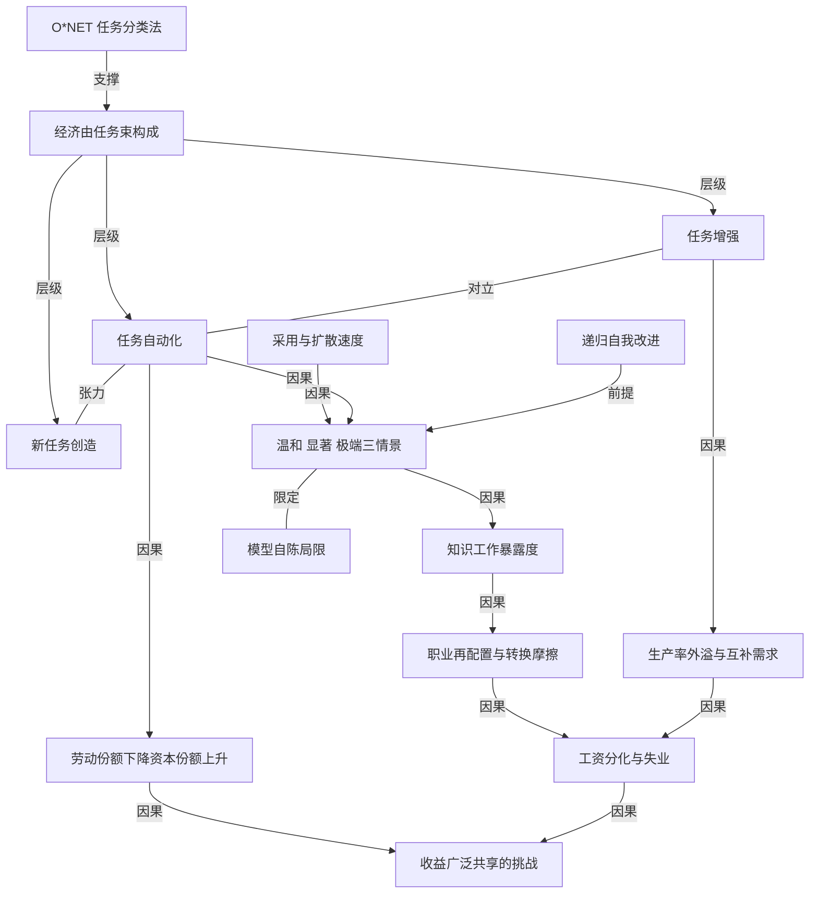

# Anthropic 做了个交互模型，让你自己预测 2030 年的经济

- 原文标题：What will our economic future look like?
- 作者：Anthropic
- 内参日期：2026-09-10
- 来源类型：blog
- 原文：https://www.anthropic.com/institute/econ-scenarios
- 标签：ai 经济价值, Anthropic, 社会

> 把整个经济表示成一束任务，AI 对每项任务可能是增强、自动化或毫无影响。你输入自己对 AI 能力和普及程度的预测，模型给出对应的 2030 年图景。从常规情景到增长翻倍的情景失业率都在历史区间内，但在增长快于历史任何时期的情景里，知识工作者的工资和就业反而受损。

## 导读

来自 anthropic。2030 年经济预测。

## 核心观点

- 开篇就承认无知：「我们还不知道 AI 将如何重塑经济」——会带来前所未有的增长？大规模失业？两者都不是，还是别的东西？我们怎么才能判断？
- Anthropic 经济学团队为此建了一个模型，推演 AI 在未来数年对美国的就业、增长和失业的影响，并把它做成一个可交互的情景探索器（scenario explorer）：读者自己填入对 AI 能力和采用程度的预期，模型就吐出这些预期所隐含的 2030 年经济。
- 与 Anthropic 的 Economic Index 的分工很清楚：Economic Index 测量 AI 当下在经济中被如何使用，这个探索器是**向前看**。它的学术底座是技术报告 Economic Scenarios for Transformative AI（Korinek et al., 2026）。
- 全文最重要的一条实质结论是一条分界线：在从「一切照常」到「AI 把增长推到正常速度约两倍」的这一大段情景区间里，失业率始终留在历史区间内，工资视行业而定持平或上升；但在增长快到超过经济史上任何时期的情景里，知识工作者的工资和就业前景出现不利影响。
- 而在那些情景里，社会整体远比今天富有，所以问题的性质变了：挑战不再是如何实现增长，而是「确保收益被广泛分享」。
- 全文最后一句立场同样重要：未来并非注定。2030 年的经济长什么样，取决于 AI 能做什么、企业和劳动者如何选择采用它，以及这项技术的财务收益如何被分享。

## 模型的底层单位：经济是由任务构成的

- 模型把经济中人们做的所有工作都表示成**任务束**（bundles of tasks）。对任何一个给定任务，AI 有四种可能：帮人做得更好或更快、把它自动化、完全不影响它、以及催生新任务。
- 任务清单不是凭空捏的，而是取自美国劳工部的 `O*NET` 分类法，逐职业列出任务。
- 全文的贯穿案例是一名护士：她查房看护病人、抽血、给来诊病人分级（triage）、记录病人体征、为病区订物资——「而这只是清单的开头」。
- 任务束是动态的，不是静态的：旧任务会离开（「现在几乎没人再手写纸质病历了」），新任务会进来（「30 年前没人做远程病人监测」）。职业随任务变化而变化。
- AI 帮这名护士起草出院医嘱、远程监测病人、规划当班的护理排程；历史上新技术也一直在为劳动者创造新任务——对护士来说，可能是**检查 AI 分级病人的效果如何**，或复核一份 AI 提出的护理方案。
- 结果是这份工作本身变了：护士能监督和完成更多事，可以把更多时间花在与病人交谈、帮他们理解诊断上，生产率提高。
- 关键的第二步是把单个任务放大到全国规模：每一项任务每天在全国发生数百万次。每个病区、每个班次的护士都在做这些事；用 AI 的护士越多，AI 支撑的任务实例占比就越高。
- 一个把量级钉住的数字：把美国过去一年中人、机器和软件共同执行的每一个任务实例加总，是**超过 30 万亿美元**的价值创造。
- 于是问题被拆成四个可填参数的子问题：AI 更多带来任务增强还是自动化？它让我们的生产率提高多少？劳动者和企业采用它的速度有多快？——这些答案直接决定 GDP、劳动力市场，以及劳动者拿回家的那份蛋糕比例。

## 三个情景：温和、显著、极端

- 未来取决于两个轴：AI 能力如何推进，以及产业和劳动者如何采用这些能力。文章从许多可能未来中挑出三个，各自代表一类不同性质的冲击。
- **温和（modest）**：在宏观数据里很难看出 AI 的影响，其经济影响大致相当于互联网。
- **显著（substantial）**：AI 的冲击比互联网、甚至比铁路更大。
- **极端（extreme）**：AI 驱动一个被彻底改造、史无前例的经济，其背后很可能是**递归自我改进**的 AI 系统，加上更快的采用速度。
- 显著情景的具体设定值得注意，因为它把「能力」和「采用」明确分开：到 2030 年，AI 有能力完成全部知识工作的一半，其中大多数是自主完成的——但它并没有被用在所有这些工作上，多数知识工作任务仍然是在没有 AI 的情况下完成的。经济以正常速度的两倍增长；知识工作者的工资不涨，其他劳动者获得收益。
- 极端情景则是「一场深刻的经济转型」：AI 在绝大多数知识工作任务上比人类更有生产率，几乎全部自主完成，并且**基本不为人类创造新的知识类任务**。这个情景很可能需要递归自我改进的 AI，并被迅速用于知识工作。
- 极端情景的量级：随着 AI 扩散，年 GDP 增长率达到 15%，经济每 4.5 年翻一番。社会比历史上任何时候都富有得多，但从事知识工作的劳动者少得多，失业率升到超过典型衰退期的水平。

## 一万人的预测：普通美国人押在「显著」

- 8 月，Anthropic 就美国人对 AI 当前与未来能力、采用程度，以及万一需要转行时找新工作的难易度，调查了**超过 1 万名美国人**。
- 典型受访者的答案所隐含的结果接近「显著变化」情景：到 2030 年 GDP 比没有 AI 时高 10%，总体失业率升到约 5%。
- 约 10% 的受访者的看法与极端情景一致。
- 页面同时展示了这五个问题上受访者答案的分布（各选项的受访者占比），把读者自己的预测放进这个分布里对照。

## 职业转换与失业：大多在历史区间内，只有一个例外

- 劳动力市场总有一定的流动性——有人失业、有人找到新工作。正常时期这个过程对个人可能痛苦，但从宏观角度看运转得相对良好，大多数求职者都能较快找到新工作。
- 在显著和极端两个情景里，知识工作者可能面临大量自动化和替代。落到个人层面，这意味着**程序员和呼叫中心客服可能不得不转去做电工、护士这类受 AI 影响较小的工作**。
- 但彻底转换职业很难，很多人要花很长时间才能落地一份新工作。一个情景要求的转换越多，处于「两份工作之间」的人就越多。
- 转换之难有几个叠加的原因：劳动者可能本来就不想换职业；换了要学新技能；即使学了，也不容易真的拿到新工作。在极端情景里，大片知识工作被更快地自动化，受影响的劳动者可能长期失业。
- 页面用一组 2026 → 2030 的存量流动图给出量级：2026 年知识工作者占 62.2%、其他劳动者占 37.8%；到 2030 年，2.5% 被替代（displaced）、1.8% 已完成跨界转换（crossed over）、59.7% 仍在原处、其他劳动者 39.6%、还有 0.7% 仍需转移。*（原文该图为交互图形，本地归档中数字标签被压平，此处按可辨读顺序转述。）*
- 三个情景的失业率轨迹差异极大，极端情景是唯一的例外——按页面图表，知识工作失业率在极端情景下升到约 17.9%、总体约 11.9%，而温和与显著情景基本落在 3%–5.4% 这一历史可见的区间内。*（同上，图表标签在归档中被压平，仅作量级参考。）*

## 工资分化：平均工资上涨，但涨在知识工作之外

- 三个情景中平均工资都上涨，但这个上涨集中在知识工作以外的职业。
- 机制是两股力量的叠加。一是转换需要时间：劳动者要换到需求上升的职业上去，速度跟不上；对人类知识工作的需求减少，就对其工资形成向下压力。
- 二是生产率的外溢：AI 提高知识工作的生产率后，那些受益于这种生产率的**体力工作**的需求会增加。原文的例子很具体——更快地产出设计和拿到许可（permitting），可以增加基础设施项目的数量，进而拉高对建筑工人的需求，把这些工资推高。
- 具体结果：显著情景下知识工作者的工资基本持平；极端情景下，到 2030 年下跌超过 10%。
- 页面按职业组给出「相对于没有 AI 的同一经济高出多少百分比」的对比，极端情景下的三个数字分别为 -11.5%、33.6%、9.7%——知识工作下跌、非知识工作大幅上涨、平均值居中。*（图表标签压平，按上下文对应关系转述。）*

## 蛋糕变大，但更大的一份可能归资本

- 今天，经济产出的每一美元里，约 60 美分归劳动者，40 美分归资本。
- 如果经济增长但 AI 自动化了更多任务，每一美元中归资本的部分可能变大。**这件事甚至可以在所有劳动者工资都大幅上涨的同时发生**：如果资本对更多事情变得有用，它的需求就更高，价格就被推高，于是增长的收益更多流向资本所有者。
- 模型的发现是：在显著和极端情景中，劳动份额明显下降，资本份额上升。平均工资上涨——非知识工作者的报酬高得多——但知识工作者的工资停滞或下降，同时失业恶化。
- 极端情景里分配的不均更彻底：多数知识工作者面对更低的工资或失业，劳动者整体在一块更大的蛋糕里拿到更小的比例，**到 2030 年劳动总收入几乎没有变化**。
- 由此得出全文的判断句：在这个情景里，主要挑战不是实现经济增长，而是确保收益被广泛分享、成本不被不平等地分摊。

## 模型的边界与仍未解决的批评

- 作者主动划边界：像任何经济模型一样，这个模型有局限。例如它**没有纳入人类研制出超强机器人的情景**。模型建立在自身研究与外部评审之上，会随证据发展继续补充。
- 探索器目前是 1.0 版，明确自陈是「对复杂现实的粗略简化」：它只隔离出少数几股关键力量，省略了许多未来可能变得重要的因素——政策反应、商业周期、潜在的总需求或金融市场扰动，以及可能的灾难性风险。
- 外部评审名单很硬：Daron Acemoglu、David Autor、David Romer、Emi Nakamura、Ben Jones、Pete Klenow、Pascual Restrepo 等经济学家读了技术报告早稿并给出详细意见。
- 有两条评审意见已经被吸收进模型，而且正是全文两条主要结论的来源：其一，AI 进步可能提高资本回报率，使更多收益流向资本所有者；其二，受 AI 影响最大的职业的工资，可能与几乎不受影响的职业分道扬镳。两条渠道现在都是情景的一部分。
- 作者同时声明：外部评审并未被要求认可其结论，剩余的错误由作者自己承担。
- 仍然开放的批评被逐条列出，这是全文最诚实的部分：
- 模型不追踪个体劳动者，因此只能对失业替代的成本给出非常粗糙的图景。
  - 有人质疑，受 AI 影响的职业是否真会收缩，而不是反而增长。
  - 有人认为最极端的情景更该被读作一个思想实验而非情景；也有人认为最温和的情景低估了数据中已经可见的东西。
  - 有人要求更清楚地说明：模型不包含数据中心建设所驱动的总需求效应。
  - 不止一位评审认为，作者可能低估了 AI 对技术进步本身的加速作用。
- 作者接受其中许多是当前模型的局限，并给出探索器的正确用法：它应被视为**思考不同技术发展路径对经济意味着什么的工具**，实际结果可能有实质性差异。
- 这个模型和 Anthropic 的整个研究组合，将用于指导它资助的研究（识别针对劳动力市场扰动的有效干预）以及它提出的政策主张，目标是让 AI 的经济收益在美国国内和全世界被广泛分享。
- 署名与分工也交代得清楚：Anton Korinek、Chad Jones、Szymon Sacher、Tess Cotter 和 Peter McCrory 开发了经济模型并合著配套技术报告；调查与 Morning Consult 合作实施；Jack Clark 全程提供方向。

## 概念网络

### 关键概念

#### 任务束（bundle of tasks）

**context**：模型的底层表示单位。「This model represents all the jobs people do in the economy as bundles of tasks.」——把每份工作看作某人所做的一束任务，护士的任务束包括查房、抽血、分级、记录体征、订物资。任务会离开（手写纸质病历）、也会进来（远程病人监测），所以任务束不是静态的，职业随任务变化而变化。

**费曼一下**：不要问「AI 会不会取代护士」，要问「护士每天做的那二十件事，AI 分别会怎么动它」。把职业拆成任务，是这套推演能算下去的前提——职业是标签，任务才是 AI 真正作用的对象。

#### O*NET 任务分类法

**context**：任务清单的数据来源。「Each of the tasks listed are based on the US Department of Labor's O*NET taxonomy, listing the tasks for each occupation.」

**费曼一下**：这是美国劳工部维护的一份「每个职业都在做哪些具体活儿」的官方清单。有了它，「经济由任务构成」就不只是一个比喻，而是一个可以逐条计数的账本。

#### 增强与自动化（augmentation vs automation）

**context**：AI 对单个任务的四种可能影响中最关键的一对张力。「Will AI lead to more task augmentation or automation?」增强是「AI helps a human do them better, or faster」，自动化是 AI 直接接手；显著情景里 AI 完成的那一半知识工作「the majority of it autonomously」。

**费曼一下**：同一项能力，落在「帮人做」和「替人做」两边，宏观后果完全相反：前者抬高人的产出和工资，后者把这项任务的收益从劳动移向资本。两者的配比，是决定 2030 年是哪个情景的最重要旋钮之一。

#### 新任务创造（new tasks created by AI）

**context**：模型明确保留的一条历史机制。「Historically, new technologies have also created new tasks for workers.」护士的新任务可能是检查 AI 的病人分级效果、复核 AI 提出的护理方案。而极端情景的定义特征之一恰恰是它**关掉了**这条机制：「it creates essentially no new knowledge tasks for people」。

**费曼一下**：过去技术革命之所以没有造成永久性失业，靠的是旧任务消失时新任务同步长出来。这个模型把「新任务还长不长」做成一个可调参数——它一旦归零，历史上那条安全阀就失效了，这就是极端情景之所以极端的技术原因。

#### 采用与扩散（adoption / diffusion）

**context**：与能力并列的第二根轴。「How quickly will it be adopted by workers and companies?」显著情景里 AI 已有能力做一半知识工作，但「it's not adopted for all of that work: most knowledge work tasks are still done without AI」；极端情景需要「adopted quickly for knowledge work」。

**费曼一下**：能力是天花板，采用是实际到达的高度。同样的模型能力，被用在 10% 还是 90% 的任务实例上，得到的是完全不同的两个经济。这也是为什么谈 AI 的经济影响时，只讨论模型评测分数是不够的。

#### 情景探索器（scenario explorer）

**context**：文章的产品形态本身。读者「plug in your expectations for how capable AI will be, and how extensively it will be used」，模型返回这些预期所隐含的 2030 年经济，并把读者的预测与其他人对照。作者给出的正确用法是「a tool for thinking about what different technological developments would imply for the economy」。

**费曼一下**：它不给你一个预测，而是给你一台把假设翻译成后果的机器。你负责相信什么，它负责告诉你「如果你相信这个，那么这些数字必须同时成立」——逼你的直觉自洽，比替你下结论有用。

#### 递归自我改进（recursively self-improving AI）

**context**：极端情景的技术前提。极端情景「likely driven by recursively self-improving AI systems and a faster rate of AI adoption」，且「This scenario would likely require recursively self-improving AI」。

**费曼一下**：AI 用来改进 AI 自己，于是能力提升不再受人类研发速度限制。它在这篇文章里的作用是一个开关：只有它打开，15% 的年增长率和 4.5 年翻一番才在模型里说得通。

#### 职业再配置与转换摩擦（job reallocation）

**context**：把宏观增长与个人痛苦连起来的环节。「There is always some churn in the job market」，但「changing occupations entirely is hard, and it takes many people a long time to land a new job. The more of this switching a scenario requires, the more people will be between jobs.」阻力有三层：不想换、需要学新技能、学了也不容易拿到新工作。

**费曼一下**：失业率不是「有多少岗位消失」的直接函数，而是「多少人必须换轨道，以及换轨道有多慢」的函数。程序员转电工在统计上是一次成功的再配置，在个人层面是数年的技能与身份重建——这就是为什么同样的增长率能对应完全不同的失业数字。

#### 知识工作暴露度（exposure of knowledge work）

**context**：三个情景中受冲击的主体都被限定为知识工作。显著情景衡量的是「half of all knowledge work」，极端情景是「the vast majority of knowledge-work tasks」；个人层面的转换方向是「coders and call service center agents may have to switch to jobs like electrician and nurse, which are less exposed to AI」。

**费曼一下**：这一轮技术冲击的方向和过去相反。机械化冲击的是体力，这一次先冲击的是坐办公室、靠文字与符号吃饭的那部分人；受影响最小的反而是要用手、要到现场的工作。

#### 生产率外溢与互补需求

**context**：解释「为什么平均工资涨、但涨在知识工作之外」的机制。「as AI increases productivity within knowledge work, the demand for manual work that benefits from that productivity will increase」——更快产出设计和许可，能增加基础设施项目数量，从而拉高建筑工人的需求与工资。

**费曼一下**：瓶颈一旦挪位，价值也随之挪位。当设计和审批变得极快，工地上真正动手的人就成了新的瓶颈，价格自然抬上去。判断一份工作的前景，不只看它自己会不会被自动化，还要看它是否处在被自动化环节的下游。

#### 劳动份额与资本份额（labor share / capital share）

**context**：全文最关键的分配指标。「Today, of each dollar the economy produces, about 60¢ goes to workers and 40¢ go to capital.」模型发现在显著与极端情景中劳动份额明显下降、资本份额上升，且这可以「even when wages for all workers rise substantially」的情况下发生——「If capital becomes more useful for more things, it will be in higher demand, which raises its price.」

**费曼一下**：一块钱的产出怎么分给「干活的人」和「出钱出设备的人」，这个比例比 GDP 总量更能说明谁在受益。AI 让资本变得对更多事情有用，资本就更值钱，分走更多——这个变化和工资涨不涨是两件独立的事，可以同时发生。

#### 劳动总收入（total labor income）

**context**：极端情景中最刺眼的一个数字性判断。「Total labor income is barely changed by 2030.」——尽管经济迅速扩张、平均工资上涨、非知识工作者报酬高得多，全体劳动者拿到的总额几乎没变。

**费曼一下**：平均数会骗人，总额不会。经济翻了倍，而所有劳动者加起来拿到的钱和之前差不多，意味着新增的财富几乎全部流向了别处。这是「增长」和「分配」彻底脱钩的那一刻。

#### 收益广泛共享（broadly shared gains）

**context**：文章把问题性质做的一次替换。极端情景下「society is far wealthier, so the challenge is making sure that the gains are broadly shared」，并明确「the main challenge is not achieving economic growth, but making sure the benefits are broadly shared and the costs aren't unequally dispersed」。这也是模型将服务的现实目的——指导 Anthropic 资助的研究与提出的政策主张。

**费曼一下**：在极端情景里，「怎么把蛋糕做大」不再是问题，「怎么分蛋糕」才是。这句话的实际含义是：越激进的技术前景，越把难题从工程和经济学推给政治与制度。

#### 模型的自陈局限与「思想实验」定位

**context**：作者主动列出的省略项与未解批评。1.0 版「isolates a few key forces and omits many others」，未纳入超强机器人、政策反应、商业周期、总需求或金融市场扰动、灾难性风险；未追踪个体劳动者；不含数据中心建设的总需求效应；可能低估 AI 对技术进步本身的加速。有评审认为最极端情景「better read as a thought experiment than a scenario」，也有评审认为最温和情景低估了数据中已可见的东西。

**费曼一下**：一个模型最有价值的部分常常是它自己列出的「没算什么」。把省略项摊在桌面上，读者才知道该在哪些方向上对结论打折——这比把模型包装成预测更诚实，也更有用。

### 概念网络

整张网络的起点是一次表示方式的选择：把经济表示成任务束（C1），并用 `O*NET` 分类法（C2）为它提供可计数的账本。这一步决定了后面所有结论的形状——因为只有拆到任务，AI 的四种作用（增强 C3、自动化 C4、无影响、创造新任务 C5）才能各自被赋值，宏观后果才能由下往上加总出来。文章讲护士的那一大段不是修辞铺垫，而是在演示这套坐标系怎么用。

第一组关系是三条通道之间的张力。增强与自动化（C3 与 C4）是同一能力的两个落点，方向相反：增强抬高人的产出，自动化把任务从人手里拿走。新任务创造（C5）与自动化构成另一层张力——它是历史上抵消自动化的安全阀，而极端情景的定义之一正是把这个阀门关掉（几乎不为人类创造新的知识类任务）。三条通道的配比，加上采用与扩散速度（C6），共同决定落在哪个情景（C7）；而极端情景之所以能出现 15% 的年增长，还需要递归自我改进（C8）这个额外前提。这解释了为什么模型有两根轴而不是一根：能力设定天花板，采用决定实际到达的高度，二者缺一不可。

第二组关系是从情景到个人的传导链。情景选定后，冲击首先落在知识工作暴露度（C10）上——这一轮技术冲击的方向与机械化相反，先打的是文字与符号类工作。暴露引发职业再配置（C9），而再配置不是瞬时的：不想换、要学新技能、学了也难拿到新工作，三层摩擦把「岗位消失」翻译成「人卡在两份工作之间」，于是有了工资与失业的分化（C13）。这条链上还并入了一股反向力量：增强带来的生产率外溢（C11）会抬高互补性体力工作的需求，设计与许可变快就拉动建筑工人的工资。C13 因此是两股力量的合成结果，这正是「平均工资上涨、但涨在知识工作之外」这个反直觉结论的来源——平均数掩盖了内部的相反运动。

第三组关系走的是分配而非就业。自动化（C4）通过让资本对更多事情变得有用，推高资本的需求与价格，导致劳动份额下降、资本份额上升（C12）。这条通道与工资通道是独立的：即使所有劳动者的工资都大幅上涨，每一美元中归资本的部分仍可能变大。C12 与 C13 在极端情景中汇合到同一个终点——劳动总收入到 2030 年几乎没变，于是问题的性质被替换（C14）：主要挑战不再是实现增长，而是确保收益被广泛分享、成本不被不平等地分摊。文章的政策与研究资助落点都挂在这里。

最后，模型自陈局限（C15）不是网络之外的免责声明，而是对 C7 这个枢纽的限定条件。省略了超强机器人、政策反应、商业周期、总需求与金融扰动、灾难性风险，不追踪个体劳动者，不含数据中心建设的总需求效应，可能低估 AI 对技术进步本身的加速——每一条都直接改写某个情景的形状。把这层限定读进网络，才能理解作者给出的正确用法：这是一台把假设翻译成后果的机器，而不是一份预测。

## 费曼 x3

预测未来最没用的方式，是问「AI 会不会取代人类的工作」。这个问题的语法就错了：职业是标签，任务才是 AI 真正作用的对象。一名护士的一天是查房、抽血、给病人分级、记录体征、为病区订物资——「而这只是清单的开头」。把这份清单摊开，问题立刻变得可以回答：AI 帮她起草出院医嘱、远程监测病人、规划当班排程，同时给她添了新活儿，比如检查 AI 分级病人的效果如何、复核一份 AI 提出的护理方案。她的工作没有消失，是变了形状，她能监督和完成更多事，也能腾出时间和病人多谈几句。任务束一直在变，「现在几乎没人再手写纸质病历了」，而「30 年前没人做远程病人监测」。

把这个视角乘上规模，就有了推演经济的资格。每一项任务每天在全国发生数百万次；把美国过去一年里人、机器和软件执行的每一个任务实例加总，是超过 30 万亿美元的价值创造。于是那些悬空的宏观争论被拆成四个可以填数的问题：AI 更多带来增强还是自动化？它让生产率提高多少？采用有多快？它还为人创造新任务吗？填完这四个数，2030 年的 GDP、失业率、工资和劳动份额就不再是立场，而是被约束的后果。这台机器的真正价值不在于替你预测，而在于逼你的直觉自洽——如果你相信这个，那么这些数字必须同时成立。

真正让人停下来的，是它划出的那条分界线。从一切照常到增长翻倍的这一大段区间里，失业率始终留在历史区间内，工资视行业持平或上涨；宏观数据里甚至看不出 AI 的痕迹，其影响「something like the internet's」。但一旦增长快过经济史上任何时期，画面就换了：知识工作者的工资和就业前景开始受损，而社会整体远比今天富有。历史上技术革命没有留下永久失业，靠的是旧任务消失时新任务同步长出来。最极端的情景之所以极端，恰恰是它关掉了这道安全阀——AI 几乎不为人类创造新的知识类任务。

比失业更值得注意的是分配的那一格。今天经济产出的每一美元里，约 60 美分归劳动者、40 美分归资本。当 AI 让资本对更多事情变得有用，资本的需求与价格被推高，更多收益流向资本所有者——而这件事可以在所有人工资都大幅上涨的同时发生。极端情景里，平均工资涨了，非知识工作者的报酬高得多，可全体劳动者拿到的总额到 2030 年几乎没变。平均数会骗人，总额不会。经济翻倍而劳动总收入原地不动，意味着新增财富几乎全部流去了别处。

于是问题的性质被替换了：主要挑战不再是实现增长，而是确保收益被广泛分享、成本不被不平等地分摊。越激进的技术前景，越把难题从工程和经济学推给政治与制度。而这份推演最诚实的部分，是它自己列出的「没算什么」——没有超强机器人，没有政策反应、商业周期、总需求与金融扰动、灾难性风险，不追踪个体劳动者，也没算进数据中心建设拉动的需求；有评审认为最极端的情景更该读作思想实验，也有评审认为最温和的情景低估了数据中已经可见的东西。一个模型把省略项摊在桌面上，读者才知道该在哪些方向对结论打折。它给的不是答案，是一台把假设翻译成后果的机器：未来并非注定，取决于 AI 能做什么、企业和劳动者如何选择采用它，以及这项技术的收益如何被分享。

## 阅读原文

We don’t know yet how AI will reshape the economy. Will it lead to unprecedented growth? Widespread unemployment? Neither, or something else? How can we tell?

Anthropic’s Economics team built a model of how AI might affect jobs, growth, and unemployment in the US in coming years. Read about possible economic futures and make your own predictions about AI capabilities to see the economy they imply.

Read blog

We study how AI is reshaping the economy because we’re committed to ensuring that this transition is beneficial for society, including workers. By providing better visibility into our possible economic future, [we can take steps](https://www-cdn.anthropic.com/files/4zrzovbb/website/9ea607a5dd67c168093829b701f3a0a6d21156d5.pdf) to make sure that everyone benefits from it.

While our [Economic Index](https://www.anthropic.com/economic-index) measures how AI is being used across the economy right now, this scenario explorer is about looking ahead. Based on our technical report, [Economic Scenarios for Transformative AI](https://www-cdn.anthropic.com/files/4zrzovbb/website/cf58f84d46a4a76bf5a5b039ac695fba6b80041c.pdf) (Korinek et al., 2026), this explorer gives you a chance to find out what the economy might look like as AI continues to get more capable.

In scenarios ranging from business as usual to an economy where AI increases growth to about twice the normal rate, unemployment stays within the historical range and wages remain flat or rise depending on the industry. But in scenarios where growth is faster than anything in economic history, there are adverse impacts on wages and job prospects for knowledge workers. In those scenarios, society is far wealthier, so the challenge is making sure that the gains are broadly shared.

As you scroll down, you’ll see an overview of how AI affects the economy. Then, you can plug in your expectations for how capable AI will be, and how extensively it will be used across the economy in the future. The model will show you what the economy in 2030 might look like if your predictions come true—and how your predictions compare to others.

- Tasks unchanged by AI
- 
- 
- New tasks created by AI

### The economy is made out of tasks

This model represents all the jobs people do in the economy as bundles of tasks. AI can help people do a given task better or faster. It can automate the task. It might not affect the task at all. And it can lead to new tasks.

You can think of any job as a bundle of tasks that someone does. She does rounds to check on a sick patient. She draws blood. She triages incoming patients, charts patients’ vitals, and orders supplies for the ward. That’s just the start of the list.

Each of the tasks listed are based on the US Department of Labor’s O*NET taxonomy, listing the tasks for each occupation.

Tasks leave the bundle (hardly anyone hand-writes paper charts anymore) and new tasks arrive (30 years ago, no one monitored patients remotely). The bundle of tasks isn’t static, and the job changes as tasks change.

AI helps a human do them better, or faster. AI helps the nurse draft discharge instructions, monitor patients remotely, and plan the shift’s care schedule.

Historically, new technologies have also created new tasks for workers. For a nurse, that might be checking how well an AI triages patients, or reviewing an AI-proposed care plan.

The result: the nurse’s job changes

As the nurse incorporates AI into her job, the nurse is able to oversee and accomplish more. She can spend more time talking with patients and helping them understand diagnoses. Productivity increases.

Every task happens millions of times every day, across the country

Nurses are doing their work on every ward and on every shift. As more nurses use AI, AI supports a higher percentage of these millions of instances of each task.

Today, if you add up every single instance of tasks performed in the US, by people and by the machines and software they work with: over $30 trillion of value created over the past year. So how will AI shape the economy of the future?

The answer depends on how AI affects all the tasks that make up the economy, the new tasks it creates, and how fast AI takes on this work. Will AI lead to more task augmentation or automation? How much more productive will it make us? How quickly will it be adopted by workers and companies? The answers to these questions have direct effects on GDP, the labor market, and the share of the pie taken home by workers.

### There are many possible futures, but we’re highlighting three scenarios

The future will depend on how AI’s capabilities advance, and how industries and workers adopt those capabilities. The three scenarios we share capture distinct kinds of impact.

In the modest scenario, it’s hard to see the effect of AI in macroeconomic data: its economic impact is something like the internet’s. In the substantial scenario, AI makes a bigger impact than the internet, or the railroad. And in the extreme scenario, AI drives a completely transformed, unprecedented economy, likely driven by [recursively self-improving AI systems](https://www.anthropic.com/institute/recursive-self-improvement) and a faster rate of AI adoption.

In the substantial scenario, AI is capable of doing half of all knowledge work by 2030, the majority of it autonomously, but it’s not adopted for all of that work: most knowledge work tasks are still done without AI. The economy grows at twice its normal rate. Wages for knowledge workers don’t rise, but other workers see gains.

A profound economic transformation

In the extreme scenario, AI is more productive than humans at the vast majority of knowledge-work tasks. It does nearly all of them autonomously, and it creates essentially no new knowledge tasks for people. This scenario would likely require recursively self-improving AI, adopted quickly for knowledge work.

As AI diffuses, annual GDP growth rates reach 15% a year, leading the economy to double in size every 4.5 years. As a society, we’re far richer than we’ve ever been, but many fewer workers have jobs in knowledge work, and unemployment has risen beyond typical recessionary levels.

In August, we surveyed more than 10,000 Americans about their views on present and future AI capabilities, adoption, and the ease of finding new work if they have to change occupations.

The typical respondent’s answers imply outcomes close to the “substantial change” scenario: GDP is 10% higher by 2030 than it would be without AI, and the overall unemployment rate has risen to around 5%. Around 10% of respondents have views in line with the extreme scenario.

How people answered the five questions (share of respondents at each answers)

#### You predicted one possible future for the economy. Here’s what that future could look like.

But growth isn’t the only economic dynamic we care about. What would these potential futures mean for how much of this growth workers receive in their paychecks, or how many people have to find new jobs?

This model isn’t a complete map of reality, but it shows us some interesting findings. The country’s GDP will grow, but a larger share of that prosperity might go to the resources and technology used to create more wealth (capital) compared to workers, even if society as a whole is much wealthier.

And in most scenarios, job reallocation and unemployment both stay within ranges history has seen before, with one exception. In the extreme scenario, if we see recursive self-improvement and rapid adoption, unemployment could spike to historic levels.

### In more transformative scenarios, more workers have to change occupations. That may mean higher unemployment.

There is always some churn in the job market—people losing jobs and finding new ones. In normal times, this process can be painful, but works relatively well from a macroeconomic perspective. Most job seekers find new jobs fairly quickly.

In our substantial and extreme scenarios, knowledge workers may see a lot of automation and displacement. At the individual level, it means coders and call service center agents may have to switch to jobs like electrician and nurse, which are less exposed to AI.

But changing occupations entirely is hard, and it takes many people a long time to land a new job. The more of this switching a scenario requires, the more people will be between jobs.

2026203062.2%Knowledgeworkers37.8%All otherworkers2.5%Displaced1.8%Crossed over59.7%Still there39.6%All otherworkers0.7%Still needto move

Switching to a new occupation is difficult for a few reasons: workers may not want to change occupations. They may need to learn new skills. And even when they do, it’s not easy to get a new job. In the extreme scenario, as large swathes of knowledge work are automated more quickly, affected workers may be unemployed for a prolonged period.

010202.9%5.4%3.9%20262030010204.5%4.6%4.6%202620300102017.9%3.9%11.9%20262030

### Across the three scenarios, average wages rise, but this increase is concentrated in occupations outside of knowledge work.

That’s because it takes time for workers to switch to occupations where demand is rising. If there’s less demand for human knowledge work, that puts downward pressure on wages. Meanwhile, as AI increases productivity within knowledge work, the demand for manual work that benefits from that productivity will increase. For example, more quickly producing designs and permitting for physical infrastructure could increase the number of construction projects, resulting in rising demand for construction workers, which pushes those wages higher. In the substantial scenario, wages for knowledge workers are essentially flat. In the extreme scenario, they fall by more than 10% by 2030.

Pay by occupation group, percent above the same economy without AI

-20020400.4%1.1%0.7%20262030-2002040-0.3%5.9%2.1%20262030-2002040-11.5%33.6%9.7%20262030

### The pie will grow, but a larger share might go to capital

Today, of each dollar the economy produces, about 60¢ goes to workers and 40¢ go to capital. If the economy grows, but AI automates more tasks, more of each dollar might go to capital. This can happen even when wages for all workers rise substantially. If capital becomes more useful for more things, it will be in higher demand, which raises its price. In that world, more of the gains from a growing economy flow to owners of capital.

We find that the labor share falls noticeably in the substantial and extreme scenarios, and the capital share rises. Average wages rise—non-knowledge workers are paid much more—but wages for knowledge workers stagnate or decline alongside worsening unemployment.

In the extreme scenario, the gains from a rapidly expanding economy are unevenly distributed. Most knowledge workers face either lower wages or unemployment, and workers overall get a smaller fraction of the larger pie. Total labor income is barely changed by 2030.

In this scenario, the main challenge is not achieving economic growth, but making sure the benefits are broadly shared and the costs aren’t unequally dispersed.

With each scenario, the total economy grows (measured in GDP). But more of the growth goes to capital, compared to the amount people receive in their wages. Some professions see their wages increase significantly, but overall, wages make up a smaller share of the country’s economic growth.

The future is not predetermined.

Ultimately, what the economy looks like in 2030 depends on many factors, like what AI can do, and how companies and workers choose to adopt it. It also depends on how the financial benefit of this technology is shared.

Like any economic model, this one has limits. For example, we did not include scenarios where humanity develops hyper-capable robots. The model draws on our research and external review, and we’ll keep adding to it as the evidence develops.

This model, alongside our full research portfolio, will inform [the research Anthropic funds](https://www.anthropic.com/economic-futures) to identify effective interventions for labor market disruptions. It’ll also inform the [policy ideas we propose](https://www-cdn.anthropic.com/files/4zrzovbb/website/9ea607a5dd67c168093829b701f3a0a6d21156d5.pdf), with the goal of ensuring that the economic benefits of AI are broadly shared across society, both in the US and around the world.

The economic scenario explorer is currently Version 1.0. Like every model, it is a stark simplification of a complex reality: it isolates a few key forces and omits many others that may become relevant and important in the coming years. For example, it leaves out policy responses, business cycles, potential aggregate demand or financial market disruptions, and possible catastrophic risks. The scenario explorer is a work in progress, and we expect it to evolve both as we invest more time and as economic research itself develops.

We are grateful to the economists who read an early draft of the technical report that lays out the framework behind the explorer, [Economic Scenarios for Transformative AI](https://www-cdn.anthropic.com/files/4zrzovbb/website/cf58f84d46a4a76bf5a5b039ac695fba6b80041c.pdf), and gave us detailed comments: Daron Acemoglu, Lukas Althoff, David Autor, Tom Cunningham, Lukas Freund, Joe Hazell, Ben Jones, Pete Klenow, Danial Lashkari, Kurt Mitman, Ben Moll, Emi Nakamura, Pascual Restrepo, David Romer, Jón Steinsson, Chris Tonetti, Ludo Visschers, and David Wiczer. Their feedback was generous and candid, and it has already improved our model. Two examples: several reviewers noted that advances in AI may raise the returns to capital, so that more of the gains flow to the owners of capital; and several noted that the wages of workers in the occupations AI affects most may diverge from those in occupations it barely affects. Both channels are now part of the scenarios. External reviewers were not asked to endorse our conclusions, and any remaining errors are ours.

Other criticisms are still open, and we plan to address many of them in future versions. Reviewers pointed out that the model does not follow individual workers, so it can only paint a very coarse picture of the costs of job displacement. Some questioned whether occupations exposed to AI will shrink at all rather than grow. Some felt the most extreme scenario is better read as a thought experiment than a scenario, while others felt the most modest one understates what is already visible in the data. Several asked us to be clearer that the model does not include the aggregate demand effects driven by the data center buildout. And more than one reviewer argued that we may be underestimating how much AI could accelerate technological progress itself. We agree that many of these are limitations of the current model. The scenario explorer should be viewed as a tool for thinking about what different technological developments would imply for the economy—actual outcomes may differ materially.

Anton Korinek, Chad Jones, Szymon Sacher, Tess Cotter, and Peter McCrory developed the economic model and co-authored the companion technical report. Santi Ruiz wrote this piece with them, with editorial support from Sarah Pollack and Adam Farina. Kelsey Nanan designed and built the interactive experience, with visual design and art direction by Nikki Makagiansar and Monika Tuchowska; Kyle Turman and Szymon Sacher built the scenario explorer and led the translation of the model into interactive form; Fayaz Ashraf and Ryan Heller contributed engineering, and Kim Withee and Maria Gonzalez supported production. Szymon Sacher and Tess Cotter designed and fielded the accompanying surveys with Morning Consult, with support from Ben Fowler. Peter McCrory, Anton Korinek, and Charles Yang coordinated the project, and Jack Clark provided direction throughout. Miriam Chaum, Jack Clark, Saffron Huang, Maxim Massenkoff, and Peter McCrory helped originate this effort. Jim Baker, Shan Carter, Johannes Hermle, Zoë Hitzig, and Eva Lyubich provided feedback.
