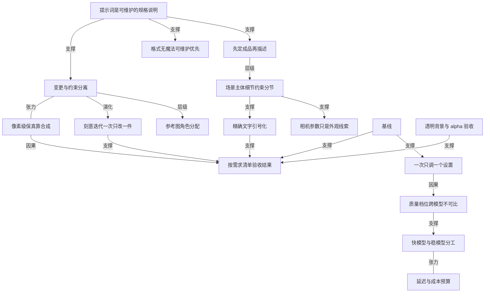

# OpenAI 官方的图像提示词指南

- 原文标题：Image prompting | OpenAI API
- 作者：OpenAI Developers
- 内参日期：2026-09-10
- 来源类型：blog
- 原文：https://developers.openai.com/api/docs/guides/image-prompting
- 标签：OpenAI, 多模态, 工具技巧

> GPT Image 的官方提示技巧文档，生成与编辑都有配图示例。配合下面那个提示词模板库一起看，正好是「官方口径」与「民间逆向」的对照。

## 导读

gpt-image 提示词指南，来自 openai 官方

## 核心观点

- 图像提示词不是咒语，而是一份可读、可维护、可评审的规格说明。整份指南的开场就是一句方法论：从你需要的那张图出发（start with the image you need），依次描述主体、构图、风格和约束；一次只改一件事，然后检查结果。
- 编辑任务的重心不在"描述新画面"，而在把「改什么」和「必须保持什么」分开写。原文的写法是 `change only X`，后面跟一份必须保留的清单：身份、几何、版式、光照、标签。约束写不出来，模型就会顺手改掉你以为不会动的地方。
- 提示词的**格式没有魔法**：短句、描述性段落、类 JSON 结构、指令式、标签式，都能表达同一个意图。选哪种的唯一标准是"哪种最容易读、最容易改"，不是哪种语法更玄。
- 模型选择被写成一条可执行的评估流程，而不是一句"哪个更好"：先用质量把候选立住，再回头压延迟。GPT Image 2.5 有两个选项——Flare 是小模型、为速度优化，画质与 GPT Image 2 相当；Sunburst 是基础模型、为质量优化，画质高于 GPT Image 2，两者都改进了精确编辑与主体保持。
- 所有跨模型的比较都必须在**你自己的负载上**测：同一个质量档位标签，不代表跨模型的同等画质或同等响应时间；一个负载上的速度提升不能推广成固定的提升幅度。
- 有一类需求靠提示词永远做不到：如果某个区域必须逐像素不变，正确做法是把已通过的编辑结果合成回原图，而不是继续在提示词里加"不要改这里"。

## 模型选择：Flare 与 Sunburst 的分工

- 新工作流：速度优先从 Flare 起步，质量要求苛刻则从 Sunburst 起步；产出一旦达标，就回头找降低延迟的机会。
- 迁移既有工作流：以**当前画质为起点**，两个模型都支持生成、编辑和透明背景。
- 已验证的 GPT Image 2 工作流且画质已达标 → 先测 Flare，看能否在保住可接受画质的同时降低延迟。
  - 复杂用例、GPT Image 2 画质不达标 → 先测 Sunburst，先把"它能给到我要的质量"这件事立住。
- 两个模型之间的切换有明确顺序：Sunburst 达标后，用同样的提示词和输入测 Flare；若 Flare 同样达标且延迟更好就切过去，若 Sunburst 的画质优势对工作流是必要的就留着。
- 结果依赖你的提示词、参考图、输出尺寸和质量设置，所以响应时间与质量都要在自己的负载上度量。

## 参数与提示词分开设置

- API 参数不写进提示词里，这是原文明确的边界：`model`、`quality`、`size`、`background` 各有取值。
- `quality`：`auto`（默认）、`low`、`medium`、`high`、`xhigh`、`max`。
  - `size`：`auto` 或自定义分辨率，常用尺寸覆盖方形、横版、竖版、2K 与 4K。
  - `background`：`auto`、`opaque`、`transparent`。
- 自定义分辨率有四条硬约束：单边不超过 3840 像素；两条边都是 16 的倍数；长短边比例不超过 3:1；总像素数在 655,360 到 8,294,400 之间。超过 3,686,400 总像素（即 `2560x1440`）的输出属于实验性。
- 调参顺序被写死：**先按上面的流程选模型，再调 ****`quality`**。首次比较时保持显式选定的质量档位、提示词、参考图和输出尺寸都不变。
- 质量档位的调法是双向的：不达标就往上试；达标后再往下试，看低档位能否在保住可接受画质的同时降低延迟。`xhigh` 和 `max` 只在"能补上一个未满足的质量要求且仍在延迟预算内"时才用——更高的档位并不保证每个提示词都出更好的结果。
- 透明资产要两头都做：提示词里明确要求，API 里显式设 `background="transparent"`，输出用 PNG 或 WebP；然后检查解码后图像的 alpha 通道，特别是头发、玻璃、阴影和物体边缘。`output_compression` 只用于 JPEG 或 WebP，不用于 PNG。

## 迁移既有工作流的六步

- 存基线：收集有代表性的生产提示词和参考图，包含困难编辑、精确文字、人脸、产品几何和透明资产；记录当前模型、请求设置和结果。
- 选第一候选：GPT Image 2 已达标就从 Flare 起步测延迟收益；复杂用例不达标就从 Sunburst 起步先立质量。首次比较保持提示词、参考图、尺寸和输出格式不变。
- 检查**完整结果**，而不只是"看起来还行"：指令遵循、身份与产品保持、文字准确性、非预期改动、透明度；重复请求以度量一致性；编辑类工作流既要测单步，也要测完整的编辑序列。
- 质量通过后再测延迟收益：从 Sunburst 起步并达标后，用同一套要求评估 Flare，只有画质仍可接受且延迟改善才切换。
- 一次只调一个设置：先比较质量档位，再改写提示词；度量典型响应与慢响应、失败、重试，以及**每张可接受图片的成本**。原文特别提醒：确认当前定价，不要假设更快的模型更便宜。
- 按工作流灰度：通过验收标准后先切一小部分流量，监控同一批指标，再逐步扩大；在旧模型仍受支持期间保留回滚能力。
- 从 GPT Image 1 或 1.5 迁移时，用参考页核对参数差异与下线日期，不要照搬旧设置。两个旧模型都已标注下线时间：`gpt-image-1.5` 计划 2026 年 12 月 1 日下线，`gpt-image-1` 计划 2026 年 10 月 23 日下线；`input_fidelity` 在迁移到 GPT Image 2 时应直接省略，因为图像输入一律按高保真处理。

## 提示词基本功：八条可迁移的写法

- **定义结果**：说清主体和用途（产品照、广告、示意图），指定构图、比例和重要的位置约束；复杂请求按"场景、主体、细节、约束"分节写，用带标签的段落。
- **选可维护的格式**：不依赖特殊语法，选最容易读和更新的那种表达。
- **描述可见细节**：材质、光照、颜色、视觉媒介都点名；要照片感就明确写"photorealistic"或"real photograph"，并描述取景与质感。相机参数只是外观线索，不是精确物理模拟的保证；宽画幅、电影感、低光、雨天、霓虹这类场景要给出尺度、氛围和色彩，别只丢几个情绪词。
- **指定人物与动作**：身体取景、相对尺度、视线、与物体的互动都要写。原文给的示例句式很具体："full body visible, feet included"、"looking down at the open book"、"hands naturally gripping the handlebars"。
- **指定精确文字**：把必须出现的文案放进引号，描述位置与字体处理；生僻词或品牌名必要时逐字母拼出；明确要求"不要多余文字"，然后检查拼写与可读性。小字号、密集信息或多字体的场景，要对比中档与高档质量。
- **把变更与约束分开**：编辑时写 `change only X`，并列出要保留的细节；写清排除项（多余文字、logo、水印）。精确的局部编辑还要点明必须不变的饱和度、对比度、箭头、机位和周边物体。
- **给参考图分配角色**：每个输入按编号点明用途——主体、风格、服装、背景；说明它们应如何组合、哪些元素要移到哪里。
- **刻意迭代**：把上一轮输出当下一轮编辑的输入，一次只提一个改动，并重复要保留的细节。"same style as before"这类引用能带上下文，但结果漂移时必须重述关键约束；先比较结果，再加更多指令。

## 生成类范例：每个范例演示一种技法

- 控制风格与光线：把照片拆成主体、取景、光线、质感来写，并显式排除重修图。示例里连"35mm 胶片感、50mm 镜头、浅景深、轻微颗粒"和"不美化、不重修"都写进去了。
- 视觉化解释一个过程：点名过程、受众和这张图要传达的信息；示意图和信息图除了外观，还要核对**标签与事实关系**是否正确。


- 精确渲染指定文案：引用要出现的文案，并告诉模型它应该出现几次；指定受众和视觉处理，不掺不相关的指令。示例中明确要求标语"恰好出现一次、清晰可读、融入版面"，且无多余文字、水印和无关 logo。
- 可复用的 logo：描述品牌与构成标记的形状，要求在不同尺寸下都保持可读；用 `n` 请求多个变体，配合透明背景、PNG 输出。示例把"简单优先于细节、扁平设计、最少描边、干净 alpha 边缘、不要棋盘格底"都写死。
- 历史与真实世界语境：给出地点与日期就能立起历史设定，但服装、场面布置和环境仍需人工核对历史准确性。
- 故事转漫画：把叙事定义成一串清晰的视觉节拍，一格一个；描述保持具体、以动作为主，模型才能译成节奏可读的分格。
- 界面预览：**把产品当成"已经存在"来描述**，聚焦布局、层级、间距和真实界面元素，避免概念稿式的措辞，结果才像一个已上线的可用界面而不是设计草图。


- 科学与教学插图：像写教学设计简报一样提示——定义受众、教学目标、视觉格式、必需标签和科学约束；要求扁平一致的图标体系、清晰箭头、可读标签和足够留白。准确性重要时显式列出必需组件，并说明什么不要出现；密集标签或课件用图用 `quality="high"`。


- 幻灯片、图表与信息图：把提示词写成**交付物规格**而不是插画请求——点名确切交付物（幻灯片、流程图、图表、整页图），定义画布与层级，直接给出真实文案或数据，再描述视觉语言；并附上实用约束：字体可读、间距讲究、不要装饰性杂物、不要通用图库照片风。横版尺寸适合演示稿，含小字、图例、坐标轴或脚注时用高质量档位。原文还特意提醒：示例里的市场数字和引注是虚构的设计输入，正式使用前要换成经核实的数据。


## 编辑类范例：把"改什么"和"保什么"写清

- 保留版式的翻译：以过程图为输入，要求只替换其中文字、其他方面一概不动；随后检查译文本身，以及有没有词被漏在原语言里。


- 迁移视觉风格：给参考图指派一个具体角色——它的色板、质感或视觉媒介；新主体单独描述。
- 保持身份、只换服装：明确列出必须固定的方面（脸、五官、肤色、体型、姿态、身份、发型、比例），只允许服装变化，并要求衣物自然贴合既有姿态与身体几何、光影与色温匹配原图。这套写法同样适用于"产品或物体必须保持可辨识"的编辑。
- 组合多张参考：按编号指定输入（场景图为 image 1、狗为 image 2），说明哪个元素要移动、移到哪里、什么必须不变。
- 透明产品抠图：提示词里要求主体独立，API 里设 `background="transparent"`，用 PNG 或 WebP 并保留返回的 alpha 通道，PNG 不加 `output_compression`。原文一句判据很硬——**画出来的棋盘格不是透明**；后续编辑要重复"保持透明背景"这个要求。
- 草图转真实照片：把提示词当规格——保留版式、比例和透视，再通过指定合理的材质、光照和环境来"加真实感"；并写上"不要新增元素或文字"，避免创造性重解。
- 移除物体：点名要移除的那一个物体，并保住周围一切；人物、姿态、光照和构图都不变，编辑才是局部的。
- 把人放进新场景：保持身份的同时，指定自然光照、可信细节、身体取景、视线和与场景的互动，并说明哪些五官和比例必须不变。示例甚至反向排除了"电影感光照、戏剧化调色、风格化构图"。

## 多轮细化与角色一致性

- 多轮细化的机制很简单：先出一张，检查，把它作为下一次的输入；每次追问都保持窄，你才能看出到底哪个改动起了作用。示例里第一轮是"把洗发水做成日落公路广告牌、文案逐字精确、只出现一次"，第二轮只有一句"改成有雪的冬夜"。
- 角色一致性靠一张**可复用的角色参考图**：先用一次生成把外观、比例、服装和调性定下来，再换环境和故事，同时重复角色的定义性细节（同一件绿色连帽外衣、同样的五官比例与色板、同样的性格），并写明"不要重新设计角色"。
- 反复编辑仍可能改掉你本想保住的细节：重述那些约束、逐次检查结果；真要逐像素一致，就走合成而非提示。
- 可运行示例仍锚定在 `gpt-image-2`：用 Python SDK 一次生成四个 logo 变体（`n=4`）并把产品抠成透明背景，注意保留返回的 PNG 字节（含 alpha 通道）；真实请求会产生 API 用量费用。

## 验收：先对需求清单，再看质量、延迟与成本

- 用之前先对需求逐条检查：必需文字是否准确可读？示意图的标签与关系是否正确？身份、产品形状、标签和参考细节是否保持完好？这次编辑是否只改了你要求的部分？需要透明时，文件里是否真有 alpha 通道而不是画上去的背景？
- 更换提示词或模型时，在有代表性的输入上比较质量、延迟和成本三项，而不是只看画面。
- 旧模型参考页的存在意义是维护既有集成：参数取值、下线日期、`input_fidelity` 的语义差异都在那里，迁移前要一项项核对，而不是照抄旧配置。

## 概念网络

### 关键概念

#### 先定成品，再描述

**context**：全文的第一句方法论——"Start with the image you need, then describe the subject, composition, style, and constraints"。指南把它放在总览的开头，后面每一类范例都是它的展开：先说清交付物是什么（产品照、广告、示意图、幻灯片、界面预览），再往下填细节。

**费曼一下**：别一上来就堆形容词。先回答"我最终要一张什么图、给谁用"，这个答案会自动决定构图、比例、风格和不能出现什么。就像装修不是先挑颜色，而是先确定这间屋子干什么用。

#### 场景、主体、细节、约束的分节结构

**context**：原文对复杂请求给的组织方式是 scene、subject、details、constraints 四段，用带标签的小节写；后面多个范例的提示词确实按 Character / Theme / Style / Constraints 这样分节。

**费曼一下**：把提示词写成有小标题的表格，而不是一段流水话。分节的好处不是模型更听话，而是**你自己下次改的时候知道改哪一行**。

#### 格式无魔法，可维护性优先

**context**：指南明确说短提示词、描述性段落、类 JSON 结构、指令式和标签式"can all express the same intent"，选择标准是哪种让需求最容易读和更新，而不是依赖特殊语法。

**费曼一下**：网上流传的"提示词秘密语法"大多是错觉。真正决定长期效果的是这份提示词能不能被人接手、被人改。

#### Flare 与 Sunburst 的速度—质量分工

**context**：Flare 是为速度优化的小模型，画质与 GPT Image 2 相当；Sunburst 是为质量优化的基础模型，画质高于 GPT Image 2；两者都改进了精确编辑与主体保持。选择流程是"先立质量、再压延迟"。

**费曼一下**：一个是快车道，一个是稳车道。正确的用法不是纠结哪个更强，而是先用稳的那个确认"这件事能做成"，再看快的那个能不能同样做成。

#### 质量档位的跨模型不可比性

**context**：原文两处强调同一个 `quality` 标签不意味着跨模型的同等画质或同等响应时间，并要求首次比较时保持显式选定的质量档位不变。

**费曼一下**：不同模型的"high"不是同一把尺子。拿标签当共同刻度去比，比出来的结论是假的。

#### 基线

**context**：迁移六步的第一步是 save a baseline——收集有代表性的生产提示词与参考图（含困难编辑、精确文字、人脸、产品几何、透明资产），并记录当前模型、请求设置和结果。

**费曼一下**：没有基线，"变好了"只是一种感觉。基线是你换模型时唯一能用来对账的东西，而且必须包含那些最难的样本，不然它只能证明简单情况没坏。

#### 一次只调一个设置

**context**：原文写作 tune one setting at a time，并规定先比较质量档位再改写提示词；同时在多轮细化里以另一种形式出现——每次追问只提一个改动。

**费曼一下**：同时改三处，效果变好你也不知道是哪一处的功劳。慢一点的单变量对比，其实是通往结论最快的路。

#### 变更与约束分离

**context**：编辑类提示词的核心写法 `change only X` 加保留清单（身份、几何、版式、光照、标签）与排除项（多余文字、logo、水印）；精确局部编辑还要点明饱和度、对比度、箭头、机位和周边物体不变。

**费曼一下**：模型不知道你心里"默认不动"的那些东西。你没写出来的约束，等于允许它改。

#### 参考图角色分配

**context**：原文要求按编号点明每个输入的用途——主体、风格、服装、背景——并解释这些输入应如何组合、哪些元素移到哪里。风格迁移、换装、合成三个范例都是这一条的实例。

**费曼一下**：多张参考图不是"都参考一下"，而是每张有明确职务：这张出色调，那张出衣服，第三张出背景。不发任命书，模型就自己乱分工。

#### 刻意迭代

**context**：iterate deliberately——把上一轮输出当作下一轮编辑的输入，一次请求一个改动，并重复要保留的细节；"same style as before"能带上下文，但结果漂移时必须重述关键约束。

**费曼一下**：图像编辑像一串接力，不是一次许愿。每棒都要把接力棒（要保留的东西）重新交清楚，否则跑几棒就丢了。

#### 相机参数只是外观线索

**context**：原文明确 treat camera specifications as cues for appearance, not a guarantee of exact physical simulation；并要求宽画幅、低光、雨天、霓虹这类场景给出尺度、氛围和色彩，而不是只依赖情绪词。

**费曼一下**："50mm、f/1.4"这类写法能唤起某种观感，但不是在跑一台虚拟相机。真正管用的是把你想看到的画面属性直接说出来。

#### 精确文字的引号化与逐字母拼写

**context**：把必需文案放进引号、描述位置与字体处理、生僻词或品牌名逐字母拼出、明确要求不要多余文字、随后检查拼写与可读性；小字号或多字体场景对比中高档质量。

**费曼一下**：模型渲染文字更像在画字形而不是在打字。把字锁在引号里、必要时一个字母一个字母交代，再回头验一遍拼写，这三步缺一不可。

#### 透明背景与 alpha 通道验收

**context**：透明资产要提示词与 API 两头都做，输出用 PNG 或 WebP，并检查解码后图像的 alpha 通道（头发、玻璃、阴影、物体边缘）；PNG 不用 `output_compression`；原文断言"A drawn checkerboard is not transparency"。

**费曼一下**：看起来像透明和真的透明是两件事。棋盘格可能只是被画上去的图案，唯一的判据是文件里真有那条 alpha 通道。

#### 像素级保真靠合成

**context**：原文对"某个区域必须逐像素不变"给出的方案是把通过的编辑结果合成回原图，而不是继续依赖提示词；同时提醒反复编辑仍会改掉你想保留的细节。

**费曼一下**：提示词是概率性的请求，不是保证书。真正不能动的部分，用剪贴的方式把它按回去，比反复叮嘱可靠。

#### 交付物规格式提示

**context**：幻灯片、图表、信息图类提示要写成 artifact spec——点名确切交付物、定义画布与层级、直接提供真实文案或数据、描述视觉语言，并附上可读字体、讲究间距、不要装饰杂物这类实用约束；科学与教学插图对应的形态是教学设计简报（受众、教学目标、必需标签、科学约束）。

**费曼一下**：要一张能用的图，就别下"画个好看的图表"这种订单，而要像交给设计师的需求单那样，把标题、数字、脚注、版面和禁忌都列清楚。

#### 按需求清单验收结果

**context**：文末的 check the result 是一组固定问题：文字是否准确可读、示意图标签与关系是否正确、身份与产品细节是否完好、编辑是否只改了要求的部分、透明需求是否落在真实 alpha 通道上；换提示词或模型时还要在代表性输入上比较质量、延迟与成本。

**费曼一下**：出图不等于完工。把"合格"写成一张可勾选的清单，你才有资格说这张图能用；否则你只是在为最顺眼的那一张辩护。

### 概念网络



这份指南的思想网络有两条主干，它们在验收环节汇合。

第一条是**写作主干**：核心主张"提示词是一份可维护的规格说明"派生出三个并列的写法原则——先定成品再描述、格式无魔法、变更与约束分离。先定成品再描述向下具体化为分节结构（场景、主体、细节、约束），而分节结构又是相机参数与精确文字两条细则的容器：正是因为把"可见细节"和"必需文案"拆成了独立小节，才有空间说清"相机参数只是外观线索"和"文案要锁在引号里"。变更与约束分离则向下派生参考图角色分配（把"保什么"细化到每个输入的职务）和刻意迭代（把"改什么"拆成一次一个）。这一支的末端有一处**张力**：变更与约束分离是提示词层面的手段，而"像素级保真靠合成"承认了它的上限——当约束严到逐像素时，提示词无论怎么写都不够，必须退出提示词层，改用图像合成。这不是对前者的否定，而是给它划出了作用域。

第二条是**评估主干**：基线是起点，它使"一次只调一个设置"成为可能——没有可对账的参照，单变量对比也读不出结论。单变量纪律进一步暴露出一个反直觉的事实：同一个质量档位标签在不同模型上不是同一把尺子，于是"质量档位跨模型不可比"成为选型流程的前提，而选型流程本身就是快模型与稳模型的分工（先用质量立住候选，再回头压延迟）。这一支同样有一处张力：速度与成本不构成一个可以自动优化的方向，原文特意提醒"不要假设更快的模型更便宜"——延迟与成本必须各自度量，而不是从模型的快慢推导。

两条主干在**按需求清单验收结果**处汇合。精确文字、透明背景与 alpha 通道、刻意迭代、像素级保真、基线，全部指向同一个终点：一次出图的成败不由观感判定，而由一份可勾选的清单判定。这也解释了整份指南的编排逻辑——从选模型到调参数、从提示词基本功到范例、再到多轮细化，每一步都在为最后那张清单积累可检查的对象。透明背景一条最能说明这种关系：它在参数层是一个设置，在提示词层是一句要求，只有在验收层才有真假之分——因为"画出来的棋盘格不是透明"。

## 费曼 x3

给图像模型下指令，最容易犯的错是把它当成一个需要被讨好的对象：堆形容词、抄语法模板、加一串"高质量、大师作品"。这份指南的立场恰好相反——提示词是一份规格说明，它的读者首先是人，其次才是模型。短句、描述性段落、类 JSON 结构、指令式、标签式都能表达同一个意图，选哪种的唯一标准是哪种最容易读、最容易改。这句话几乎把"提示词工程"里的玄学部分一次清空了。

真正的难点从生成转向编辑时才显露。生成时你在描述一个还不存在的东西，说漏了顶多是遗憾；编辑时你在动一个已经对的东西，说漏了就是损失。所以编辑提示词的骨架不是"我要什么"，而是两份清单：改什么、必须保持什么。写法就是一句 `change only X`，后面跟上身份、几何、版式、光照、标签。你没有写出来的约束，等于默许它被改掉——模型并不知道哪些东西在你心里属于"默认不动"。参考图也是同一个道理：多张输入不是"都参考一下"，而是每张有明确职务，这张出色调，那张出衣服，不发任命书就会自己乱分工。

而承认工具的边界，比相信它的上限更有用。指南里有一条特别克制的建议：如果某个区域必须逐像素不变，就把通过的编辑结果合成回原图，不要靠提示词。这是在说，提示词是概率性的请求，不是保证书；反复叮嘱"不要改这里"既不可靠也不体面，剪贴回去才是工程解法。同一种清醒也出现在评估环节——同一个质量档位标签在不同模型上不是同一把尺子，一个负载上的速度提升不能推广成固定幅度，更快的模型也不必然更便宜。所以先存一份包含最难样本的基线，再一次只调一个设置。

最后落在一张清单上：文字是否准确可读，示意图的标签与关系是否正确，这次编辑是否只改了你要求的部分，需要透明时文件里是否真有 alpha 通道——因为画出来的棋盘格不是透明。出图不等于完工。一次创作是否成功，不由第一眼的观感决定，而由这些能被逐条勾掉的问题决定。这套纪律的迁移性远超图像本身：任何一次交给不确定系统的委托，都值得先写清约束，再准备好一份自己不能糊弄的验收表。

## 阅读原文

### Overview

Start with the image you need, then describe the subject, composition, style, and constraints. For edits, identify what should change and what must stay the same. Refine one thing at a time and inspect the result.

GPT Image 2.5 includes two model choices. GPT Image 2.5 Flare is the small model, optimized for speed, with image quality comparable to GPT Image 2. GPT Image 2.5 Sunburst is the base model, optimized for quality, with higher image quality than GPT Image 2. Both models offer improvements in precise editing and subject preservation.

For API setup and request examples, see the [image generation guide](https://developers.openai.com/api/docs/guides/image-generation).

### Choose a model

For a new workflow, start with GPT Image 2.5 Flare when speed is the priority, or GPT Image 2.5 Sunburst when demanding quality requirements are the priority. Once the output meets your requirements, look for opportunities to reduce latency.

For migrating from a current image model, use your current image quality as the starting point. Both models support image generation, editing, and transparent backgrounds.

Your current workflowStart by testing

An existing, validated GPT Image 2 workflow already meets your quality requirementsGPT Image 2.5 Flare. Check whether you can retain acceptable quality while reducing latency.

A complex use case where GPT Image 2 does not meet your quality requirementsGPT Image 2.5 Sunburst. First establish that it delivers the quality you need.

If GPT Image 2.5 Sunburst meets your quality requirements, then test GPT Image 2.5 Flare with the same prompts and inputs. Switch to GPT Image 2.5 Flare if it also meets those requirements and improves latency. Keep GPT Image 2.5 Sunburst when its quality advantage is necessary for your workflow.

Measure response time and quality on your own workload. Results depend on your prompts, reference images, output dimensions, and quality settings; a speed improvement on one workload doesn’t establish a fixed improvement on another.

### Model parameters

Set API parameters separately from the prompt.

ParameterGPT Image 2.5 settings

`modelgpt-image-2.5-flare` (small model) or `gpt-image-2.5-sunburst` (base model)

`qualityauto` (default), `low`, `medium`, `high`, `xhigh`, or `max`

`sizeauto` or a custom resolution. Common sizes: `1024x1024` (square), `1536x1024` (landscape), `1024x1536` (portrait), `2048x2048` (2K square), `2048x1152` (2K landscape), `3840x2160` (4K landscape), and `2160x3840` (4K portrait).

`backgroundauto`, `opaque`, or `transparent`

For a custom resolution, use `WIDTHxHEIGHT` and follow these constraints:

- Each edge must be no more than 3,840 pixels.
- Both edges must be multiples of 16 pixels.
- The ratio of the longer edge to the shorter edge must not exceed 3:1.
- The total pixel count must be between 655,360 and 8,294,400.
Outputs with more than 3,686,400 total pixels (`2560x1440`) are experimental.

Choose the model using the workflow above before tuning `quality`. For the first comparison, keep an explicitly selected quality setting unchanged when both models support it, along with the prompt, reference images, and output dimensions. The same quality label does not imply the same image quality or response time across models.

If the output falls short, test a higher quality setting. Once it meets your requirements, test lower settings to see whether they preserve acceptable quality while reducing latency. Use `xhigh` or `max` only when they improve an unmet quality requirement within your latency budget. A higher setting doesn’t guarantee a better result for every prompt.

For transparent assets, explicitly request `background="transparent"` and use PNG or WebP. Check the decoded image’s alpha channel, including hair, glass, shadows, and object edges. Use `output_compression` only for JPEG or WebP output, not PNG.

### Migrate an existing workflow

- Save a baseline. Collect representative production prompts and reference images, including difficult edits, exact text, faces, product geometry, and transparent assets. Record the current model, request settings, and results.
- Choose the first candidate. If GPT Image 2 already meets your quality requirements, start with GPT Image 2.5 Flare and test for a latency improvement. If GPT Image 2 falls short on a complex use case, start with GPT Image 2.5 Sunburst and first establish that it meets your quality requirements. Keep the prompt, references, dimensions, and output format unchanged for the first comparison.
- Check the complete result. Compare instruction following, identity and product preservation, text accuracy, unwanted changes, and transparency. Repeat requests to measure consistency. For editing workflows, test the complete sequence of edits as well as individual steps.
- Test for a latency gain after quality passes. If you started with GPT Image 2.5 Sunburst and it meets your quality requirements, evaluate GPT Image 2.5 Flare against the same requirements. Switch only if the quality remains acceptable and latency improves; otherwise, keep GPT Image 2.5 Sunburst.
- Tune one setting at a time. Compare quality levels before rewriting the prompt. Measure typical and slow responses, failures, retries, and cost per accepted image. Confirm current pricing rather than assuming the faster model costs less.
- Roll out by workflow. Once the released model passes your acceptance criteria, move a small share of traffic, monitor the same measures, and expand gradually. Keep the previous model available for rollback while it remains supported.
When migrating from GPT Image 1 or 1.5, use the reference tabs to check parameter differences and shutdown dates. Test the candidate model’s supported request settings rather than copying older settings unchanged. For GPT Image 2, keep your existing resolution and transparency requirements in the comparison.

Repeated edits can still change details you intended to preserve. Restate those constraints and inspect each result. If a region must remain pixel-identical, composite the approved edit into the original image instead of relying on prompting alone.

### Prompting fundamentals

- Define the result. Name the subject and intended use, such as a product photograph, advertisement, or diagram. Specify the composition, aspect ratio, and important placement constraints. For complex requests, organize the prompt as scene, subject, details, and constraints, using labeled sections.
- Choose a maintainable format. Short prompts, descriptive paragraphs, JSON-like structures, instructions, and tags can all express the same intent. Choose the format that makes the requirements easiest to read and update rather than relying on special syntax.
- Describe visible details. Name materials, lighting, colors, and the visual medium. Request “photorealistic” or “real photograph” explicitly when that is the goal, and describe framing and texture. Treat camera specifications as cues for appearance, not a guarantee of exact physical simulation. For wide, cinematic, low-light, rainy, or neon scenes, specify scale, atmosphere, and color instead of relying on mood words alone.
- Specify people and actions. Describe body framing, relative scale, gaze, and interaction with objects. Instructions such as “full body visible, feet included,” “looking down at the open book,” or “hands naturally gripping the handlebars” make the intended pose and action clearer.
- Specify exact text. Put required wording in quotes and describe its position and typography. Spell unusual words or brand names letter by letter when needed. Ask for no extra text, then check spelling and legibility in the output. Compare medium or high quality for small text, dense information, or multiple fonts.
- Separate changes from constraints. For edits, say “change only X” and list the details to preserve, such as identity, geometry, layout, lighting, or labels. State exclusions such as unwanted text, logos, or watermarks. For precise local edits, also identify saturation, contrast, arrows, camera angle, and surrounding objects that must remain unchanged.
- Assign roles to references. Identify each input by number and purpose: subject, style, clothing, or background. Explain how the inputs should combine and which elements should move where.
- Iterate deliberately. Pass the previous output as the next edit input, request one change, and repeat the details to preserve. References such as “same style as before” can carry context, but restate critical constraints if the result drifts. Compare results before adding more instructions.
The examples below each demonstrate a different technique. Keep their prompts as starting points and adapt them to your own images and requirements.

### Generate images

#### Control style and lighting

Describe a photograph through its subject, framing, light, and texture. This example specifies a candid composition and explicitly excludes heavy retouching.

Generation settings: `size="1024x1536"`, `quality="medium"`.

```javascript
Create a photorealistic candid photograph of an elderly sailor standing on a small fishing boat.
He has weathered skin with visible wrinkles, pores, and sun texture, and a few faded traditional sailor tattoos on his arms.
He is calmly adjusting a net while his dog sits nearby on the deck. Shot like a 35mm film photograph, medium close-up at eye level, using a 50mm lens.
Soft coastal daylight, shallow depth of field, subtle film grain, natural color balance.
The image should feel honest and unposed, with real skin texture, worn materials, and everyday detail. No glamorization, no heavy retouching.
```

Example outputs:

GPT Image 2.5 Flare


GPT Image 2.5 Sunburst


#### Explain a process visually

Name the process, audience, and information the image should communicate. For diagrams and information graphics, verify labels and factual relationships as well as appearance.

Generation settings: `size="1024x1536"`, `quality="medium"`.

```javascript
Create a detailed Infographic of the functioning and flow of an automatic coffee machine like a Jura.
From bean basket, to grinding, to scale, water tank, boiler, etc.
I'd like to understand technically and visually the flow.
```

Example outputs:

GPT Image 2.5 Flare


GPT Image 2.5 Sunburst


#### Render exact text

Quote the required copy and tell the model how many times it should appear. Specify the audience and visual treatment without adding unrelated instructions.

Generation settings: `size="1024x1536"`, `quality="medium"`.

```javascript
Give me a cool in culture ad / fashion shot for a brand called Thread.
It's a hip young street brand. The ad shows a group of friends hanging out together with the tagline "Yours to Create."
Make it feel like a polished campaign image for a youth streetwear audience: stylish, contemporary, energetic, and tasteful.
Use clean composition, strong color direction, natural poses, and premium fashion photography cues.
Render the tagline exactly once, clearly and legibly, integrated into the ad layout.
No extra text, no watermarks, no unrelated logos.
```

Example outputs:

GPT Image 2.5 Flare


GPT Image 2.5 Sunburst


#### Design a reusable logo

Describe the brand and the shapes that should define the mark. Specify a clear composition that remains legible at different sizes. Use `n` to request multiple variations.

Generation settings: `size="1024x1536"`, `quality="medium"`, `background="transparent"`, `output_format="png"`, `n=1`.

```javascript
Create an original, non-infringing logo for a company called Field & Flour, a local bakery.
The logo should feel warm, simple, and timeless. Use clean, vector-like shapes, a strong silhouette, and balanced negative space.
Favor simplicity over detail so it reads clearly at small and large sizes. Flat design, minimal strokes, no gradients unless essential.
Fully transparent background. Deliver a single centered logo with generous padding, clean alpha edges, and no solid backdrop, scenery, checkerboard, or watermark.
```

Each row compares one variation from each model.

Example outputs:

GPT Image 2.5 Flare


GPT Image 2.5 Sunburst


GPT Image 2.5 Flare


GPT Image 2.5 Sunburst


GPT Image 2.5 Flare


GPT Image 2.5 Sunburst


GPT Image 2.5 Flare


GPT Image 2.5 Sunburst


#### Use historical and real-world context

Name the place and date to establish a historical setting. The model can infer contextual details, but inspect clothing, staging, and surroundings for historical accuracy.

Generation settings: `size="1024x1536"`, `quality="medium"`.

```javascript
Create a realistic outdoor crowd scene in Bethel, New York on August 16, 1969.
Photorealistic, period-accurate clothing, staging, and environment.
```

Example outputs:

GPT Image 2.5 Flare


GPT Image 2.5 Sunburst


#### Turn a story into a comic strip

For story-to-comic generation, define the narrative as a sequence of clear visual beats, one per panel. Keep descriptions concrete and action-focused so the model can translate the story into readable, well-paced panels.

Generation settings: `size="1024x1536"`, `quality="medium"`.

```javascript
Create a short vertical comic-style reel with 4 panels.
Panel 1: The owner leaves through the front door. The pet is framed in the window behind them, small against the glass, eyes wide, paws pressed high, the house suddenly quiet.
Panel 2: The door clicks shut. Silence breaks. The pet slowly turns toward the empty house, posture shifting, eyes sharp with possibility.
Panel 3: The house transformed. The pet sprawls across the couch like it owns the place, crumbs nearby, sunlight cutting across the room like a spotlight.
Panel 4: The door opens. The pet is seated perfectly by the entrance, alert and composed, as if nothing happened.
```

Example outputs:

GPT Image 2.5 Flare


GPT Image 2.5 Sunburst


#### Create an interface preview

Interface previews work best when you describe the product as if it already exists. Focus on layout, hierarchy, spacing, and real interface elements, and avoid concept art language so the result looks like a usable, shipped interface rather than a design sketch.

Generation settings: `size="1024x1536"`, `quality="medium"`.

```javascript
Create a realistic mobile app UI mockup for a local farmers market.
Show today’s market with a simple header, a short list of vendors with small photos and categories, a small “Today’s specials” section, and basic information for location and hours.
Design it to be practical, and easy to use. White background, subtle natural accent colors, clear typography, and minimal decoration.
It should look like a real, well-designed, beautiful app for a small local market.
Place the UI mockup in an iPhone frame.
```

Example outputs:

GPT Image 2.5 Flare


GPT Image 2.5 Sunburst


#### Create scientific and educational visuals

Scientific and educational visuals are strong fits for biology, chemistry, classroom explanations, flat scientific icon systems, diagrams, and learning assets. Prompt them like an instructional design brief: define the audience, lesson objective, visual format, required labels, and scientific constraints. For best results, ask for a clean, flat visual system with consistent icon style, clear arrows, readable labels, and enough white space for students to scan the concept quickly.

When accuracy matters, list the required components explicitly and say what should not be included. Use `quality="high"` for dense labels, diagrams, or assets that will be used in slides or course materials.

Generation settings: `size="1536x1024"`, `quality="high"`.

```javascript
Create a simple biology diagram titled "Cellular Respiration at a Glance" for high school students.
Show how glucose turns into energy inside a cell. Include glycolysis, the Krebs cycle, and the electron transport chain.
Use arrows to connect the steps, and label the main molecules: glucose, pyruvate, ATP, NADH, FADH2, CO2, O2, and H2O.
Make it look like a clean classroom handout or slide, with a white background, simple icons, clear labels, and easy-to-read text.
Avoid tiny text, extra decoration, or anything that makes the diagram hard to understand.
```

Example outputs:

GPT Image 2.5 Flare


GPT Image 2.5 Sunburst


#### Build slides, diagrams, and charts

Productivity visuals work best when the prompt is written like an artifact spec rather than an illustration request. Name the exact deliverable (slide, workflow diagram, chart, page image), define the canvas and hierarchy, provide the real text or data, and describe the visual language. These prompts should include practical constraints: readable typography, polished spacing, no decorative clutter, and no generic stock-photo treatment.

For slides, charts, and diagram-heavy assets, include the numbers and labels directly in the prompt. Use a landscape size for deck-style outputs and `quality="high"` when the image contains small text, legends, axes, or footnotes.

The sample market figures and citations below are fictional design inputs. Replace them with verified data before using the slide.

Generation settings: `size="1536x864"`, `quality="high"`.

```javascript
Create one pitch-deck slide titled **"Market Opportunity"** that feels like a real Series A fundraising slide from a YC-backed startup.
Use a clean white background, modern sans-serif typography like Inter, and a crisp, minimal layout. The slide should include:
* A TAM/SAM/SOM concentric-circle diagram in muted blues and grays
* Specific, believable market sizing numbers:
* **TAM:** $42B
* **SAM:** $8.7B
* **SOM:** $340M
* A clean bar chart below showing market growth from **2021 to 2026**, with a subtle upward trend
* Small footnotes: **"AGI Research, 2024"** and **"Internal analysis"**
* A company logo placeholder in the bottom-right corner
The design should look like it belongs in a deck that actually raised money: highly readable text, clear data hierarchy, polished spacing, and professional startup-style visual language.
Avoid clip art, stock photography, gradients, shadows, decorative elements, or anything that feels generic or overdesigned.
```

Example outputs:

GPT Image 2.5 Flare


GPT Image 2.5 Sunburst


### Edit images

Use `client.images.edit` with the referenced input images. For local edits that require a mask, see [editing with a mask](https://developers.openai.com/api/docs/guides/image-generation#edit-an-image-using-a-mask).

#### Translate while preserving layout

Use each model’s coffee-machine diagram from [Explain a process visually](https://developers.openai.com/api/docs/guides/image-prompting/#explain-a-process-visually) as the input. Ask to replace its text while keeping the design unchanged, then check the translation and any words left in the original language.

Edit settings: `size="1024x1536"`, `quality="high"`.

```javascript
Translate the text in the infographic to Spanish. Do not change any other aspect of the image.
```

Example outputs:

GPT Image 2.5 Flare


GPT Image 2.5 Sunburst


#### Transfer a visual style

Assign the reference image a specific role: its palette, texture, or visual medium. Describe the new subject separately. Use the pixel-art image below as the input.

Edit settings: `size="1024x1536"`, `quality="medium"`.

```javascript
Use the same style from the input image and generate a man riding a motorcycle on a white background.
```

Input image:


Example outputs:

GPT Image 2.5 Flare


GPT Image 2.5 Sunburst


#### Preserve identity and change clothing

Use the person photograph and three clothing references below as inputs. State which aspects of the person must remain fixed, and allow only the clothing to change. This pattern also applies to edits where a product or object must remain recognizable.

Edit settings: `size="1024x1536"`, `quality="medium"`.

```javascript
Edit the image to dress the woman using the provided clothing images. Do not change her face, facial features, skin tone, body shape, pose, or identity in any way. Preserve her exact likeness, expression, hairstyle, and proportions. Replace only the clothing, fitting the garments naturally to her existing pose and body geometry with realistic fabric behavior. Match lighting, shadows, and color temperature to the original photo so the outfit integrates photorealistically, without looking pasted on. Do not change the background, camera angle, framing, or image quality, and do not add accessories, text, logos, or watermarks.
```

Input images:


> 🖼️ 此处配图未随存档收录，请见原文。

Example outputs:

GPT Image 2.5 Flare

> 🖼️ 此处配图未随存档收录，请见原文。

GPT Image 2.5 Sunburst

> 🖼️ 此处配图未随存档收录，请见原文。

#### Combine references

Pass the scene photograph as image 1 and the dog photograph as image 2. Specify which element to move, its destination, and what must remain unchanged.

Edit settings: `size="1024x1536"`, `quality="medium"`.

```javascript
Place the dog from the second image into the setting of image 1, right next to the woman, use the same style of lighting, composition and background. Do not change anything else.
```

Input images:

> 🖼️ 此处配图未随存档收录，请见原文。

Example outputs:

GPT Image 2.5 Flare

> 🖼️ 此处配图未随存档收录，请见原文。

GPT Image 2.5 Sunburst

> 🖼️ 此处配图未随存档收录，请见原文。

#### Create a transparent product cutout

Request both an isolated subject in the prompt and `background="transparent"` in the API. Use PNG or WebP, preserve the returned alpha channel, and omit `output_compression` for PNG. A drawn checkerboard is not transparency. For subsequent edits, repeat the requirement to preserve the transparent background. Use the product photograph below as the input.

Edit settings: `size="1024x1536"`, `quality="medium"`, `background="transparent"`, `output_format="png"`.

```javascript
Extract the product from the input image and isolate it on a fully transparent background.
Output: centered product, crisp silhouette, no halos/fringing.
Preserve product geometry and label legibility exactly.
Add only light polishing. Do not add a solid backdrop, checkerboard, scenery, or shadow.
Do not restyle the product; remove the background and preserve clean alpha transparency.
```

Input image:

> 🖼️ 此处配图未随存档收录，请见原文。

Example outputs:

GPT Image 2.5 Flare

> 🖼️ 此处配图未随存档收录，请见原文。

GPT Image 2.5 Sunburst

> 🖼️ 此处配图未随存档收录，请见原文。

#### Turn a drawing into a realistic image

Sketch-to-render workflows are great for turning rough drawings into photorealistic concepts while keeping the original intent. Treat the prompt like a spec: preserve layout and perspective, then _add realism_ by specifying plausible materials, lighting, and environment. Include “do not add new elements/text” to avoid creative reinterpretations.

Edit settings: `size="1024x1536"`, `quality="medium"`.

```javascript
Turn this drawing into a photorealistic image.
Preserve the exact layout, proportions, and perspective.
Choose realistic materials and lighting consistent with the sketch intent.
Do not add new elements or text.
```

Input image:

> 🖼️ 此处配图未随存档收录，请见原文。

Example outputs:

GPT Image 2.5 Flare

> 🖼️ 此处配图未随存档收录，请见原文。

GPT Image 2.5 Sunburst

> 🖼️ 此处配图未随存档收录，请见原文。

#### Remove an object

Remove one object by naming it explicitly and preserving everything around it. Keep the person, pose, lighting, and composition unchanged so the edit stays local.

Edit settings: `size="1024x1536"`, `quality="medium"`.

```javascript
Remove the flower from man's hand. Do not change anything else.
```

Input image:

> 🖼️ 此处配图未随存档收录，请见原文。

Example outputs:

GPT Image 2.5 Flare

> 🖼️ 此处配图未随存档收录，请见原文。

GPT Image 2.5 Sunburst

> 🖼️ 此处配图未随存档收录，请见原文。

#### Insert a person into a scene

Insert a person into a new scene while preserving their identity. Specify natural lighting, believable detail, body framing, gaze, and interaction with the scene. State which facial features and proportions must remain unchanged. For `gpt-image-2`, omit `input_fidelity`; image inputs are always processed at high fidelity.

Use the [woman in the museum](https://developers.openai.com/images/platform/guides/image-prompting/woman-in-museum.webp) as the input image.

Edit settings: `size="1024x1536"`, `quality="medium"`.

```javascript
Generate a highly realistic action scene where this person is running away from a large, realistic brown bear attacking a campsite. The image should look like a real photograph someone could have taken, not an overly enhanced or cinematic movie-poster image.
She is centered in the image but looking away from the camera, wearing outdoorsy camping attire, with dirt on her face and tears in her clothing. She is clearly afraid but focused on escaping, running away from the bear as it destroys the campsite behind her.
The campsite is in Yosemite National Park, with believable natural details. The time of day is dusk, with natural lighting and realistic colors. Everything should feel grounded, authentic, and unstyled, as if captured in a real moment. Avoid cinematic lighting, dramatic color grading, or stylized composition.
```

Example outputs:

GPT Image 2.5 Flare

> 🖼️ 此处配图未随存档收录，请见原文。

GPT Image 2.5 Sunburst

> 🖼️ 此处配图未随存档收录，请见原文。

### Refine an image across turns

Start with one output, inspect it, and use it as the next input. Keep each follow-up narrow so you can see which change helped.

#### Create the starting image

Use the shampoo photograph from [Create a transparent product cutout](https://developers.openai.com/api/docs/guides/image-prompting/#create-a-transparent-product-cutout) as the input for this billboard scene. Quote the label text exactly.

Edit settings: `size="1024x1536"`, `quality="medium"`.

```javascript
Create a realistic billboard mockup of the shampoo on a highway scene during sunset.
Billboard text (EXACT, verbatim, no extra characters):
"Fresh and clean"
Typography: bold sans-serif, high contrast, centered, clean kerning.
Ensure text appears once and is perfectly legible.
No watermarks, no logos.
```

Input image:

> 🖼️ 此处配图未随存档收录，请见原文。

Example outputs:

GPT Image 2.5 Flare

> 🖼️ 此处配图未随存档收录，请见原文。

GPT Image 2.5 Sunburst

> 🖼️ 此处配图未随存档收录，请见原文。

#### Change one condition

Pass each model’s billboard output from the previous step into its next edit request. This short follow-up changes the weather while retaining the existing scene.

Edit settings: `size="1024x1536"`, `quality="medium"`.

```javascript
Make it look like a winter evening with snowfall.
```

Example outputs:

GPT Image 2.5 Flare

> 🖼️ 此处配图未随存档收录，请见原文。

GPT Image 2.5 Sunburst

> 🖼️ 此处配图未随存档收录，请见原文。

#### Keep a character consistent

For a book with multiple illustrations, create a reusable character reference to help preserve appearance across scenes, poses, and pages. Change the environment and story while repeating the character’s defining details.

##### Establish the character

Define the character’s appearance, proportions, outfit, and tone.

Generation settings: `size="1024x1536"`, `quality="medium"`.

```javascript
Create a children’s book illustration introducing a main character.
Character:
A young, storybook-style hero inspired by a little forest outlaw,
wearing a simple green hooded tunic, soft brown boots, and a small belt pouch.
The character has a kind expression, gentle eyes, and a brave but warm demeanor.
Carries a small wooden bow used only for helping, never harming.
Theme:
The character protects and rescues small forest animals like squirrels, birds, and rabbits.
Style:
Children’s book illustration, hand-painted watercolor look,
soft outlines, warm earthy colors, whimsical and friendly.
Proportions suitable for picture books (slightly oversized head, expressive face).
Constraints:
- Original character (no copyrighted characters)
- No text
- No watermarks
- Plain forest background to clearly showcase the character
```

Example outputs:

GPT Image 2.5 Flare

> 🖼️ 此处配图未随存档收录，请见原文。

GPT Image 2.5 Sunburst

> 🖼️ 此处配图未随存档收录，请见原文。

##### Continue the story

Reuse each model’s generated character image and describe a new scene. Repeat the appearance constraints so the character stays consistent.

Edit settings: `size="1024x1536"`, `quality="medium"`.

```javascript
Continue the children’s book story using the same character.
Scene:
The same young forest hero is gently helping a frightened squirrel
out of a fallen tree after a winter storm.
The character kneels beside the squirrel, offering reassurance.
Character Consistency:
- Same green hooded tunic
- Same facial features, proportions, and color palette
- Same gentle, heroic personality
Style:
Children’s book watercolor illustration,
soft lighting, snowy forest environment,
warm and comforting mood.
Constraints:
- Do not redesign the character
- No text
- No watermarks
```

Example outputs:

GPT Image 2.5 Flare

> 🖼️ 此处配图未随存档收录，请见原文。

GPT Image 2.5 Sunburst

> 🖼️ 此处配图未随存档收录，请见原文。

### More workflows

#### Change furniture in a room

Visualize furniture or décor changes in real spaces without recreating the entire scene. The goal is surgical realism: swap a single object while preserving camera angle, lighting, shadows, and surrounding context so the edit looks like a real photograph, not a redesign.

Edit settings: `size="1536x1024"`, `quality="medium"`.

```javascript
In this room photo, replace ONLY the white chairs with chairs made of wood.
Preserve camera angle, room lighting, floor shadows, and surrounding objects.
Keep all other aspects of the image unchanged.
Photorealistic contact shadows and fabric texture.
```

Input image:

> 🖼️ 此处配图未随存档收录，请见原文。

Example outputs:

GPT Image 2.5 Flare

> 🖼️ 此处配图未随存档收录，请见原文。

GPT Image 2.5 Sunburst

> 🖼️ 此处配图未随存档收录，请见原文。

#### Design a holiday card

For seasonal card concepts, describe the scene, emotional tone, materials, lighting, and exact copy. For a 3D pop-up or photographed-card treatment, specify paper layers, fibers, folds, and soft studio lighting. The example below uses a nostalgic teddy-bear scene.

Generation settings: `size="1024x1536"`, `quality="medium"`.

```javascript
Create a Christmas holiday card illustration.
Scene:
a cozy Christmas scene with an old teddy bear sitting inside a keepsake box, slightly worn fur, soft stitching repairs, placed near a window with falling snow outside. The scene suggests the child has grown up, but the memories remain.
Mood:
Warm, nostalgic, gentle, emotional.
Style:
Premium holiday card photography, soft cinematic lighting,
realistic textures, shallow depth of field,
tasteful bokeh lights, high print-quality composition.
Constraints:
- Original artwork only
- No trademarks
- No watermarks
- No logos
Include ONLY this card text (verbatim):
"Merry Christmas — some memories never fade."
```

Example outputs:

GPT Image 2.5 Flare

> 🖼️ 此处配图未随存档收录，请见原文。

GPT Image 2.5 Sunburst

> 🖼️ 此处配图未随存档收录，请见原文。

#### Design collectible merchandise

Explore merchandise and packaging concepts using product photography cues: materials, packaging, and print clarity. Keep designs original and non-infringing, and compare multiple character or packaging variants.

Generation settings: `size="1024x1536"`, `quality="medium"`.

```javascript
Create a collectible action figure of a vintage-style toy propeller airplane with rounded wings, a front-mounted spinning propeller, slightly worn paint edges, classic childhood proportions, designed as a nostalgic holiday collectible, in blister packaging.
Concept:
A nostalgic holiday collectible inspired by the simple toy airplanes
children used to play with during winter holidays.
Evokes warmth, imagination, and childhood wonder.
Style:
Premium toy photography, realistic plastic and painted metal textures,
studio lighting, shallow depth of field,
sharp label printing, high-end retail presentation.
Constraints:
- Original design only
- No trademarks
- No watermarks
- No logos
Include ONLY this packaging text (verbatim):
"Christmas Memories Edition"
```

Example outputs:

GPT Image 2.5 Flare

> 🖼️ 此处配图未随存档收录，请见原文。

GPT Image 2.5 Sunburst

> 🖼️ 此处配图未随存档收录，请见原文。

### Run a complete example

This runnable example remains pinned to `gpt-image-2`. Use it as a baseline, then choose an available model and its supported request settings for your evaluation.

The Python example below generates four logo variations and extracts a product onto a transparent background. Install the [OpenAI Python SDK](https://developers.openai.com/api/docs/libraries#install-an-official-sdk), set `OPENAI_API_KEY`, and save the [product photograph](https://developers.openai.com/images/platform/guides/image-prompting/shampoo.webp) as `input_images/shampoo.webp`. Live requests incur API usage charges.

Generate and edit transparent assets

```javascript
import base64
from pathlib import Path
from openai import OpenAI
client = OpenAI()
prompt = """
Create an original, non-infringing logo for a company called Field & Flour, a local bakery.
The logo should feel warm, simple, and timeless. Use clean, vector-like shapes, a strong silhouette, and balanced negative space.
Favor simplicity over detail so it reads clearly at small and large sizes. Flat design, minimal strokes, no gradients unless essential.
Fully transparent background. Deliver a single centered logo with generous padding, clean alpha edges, and no solid backdrop, scenery, checkerboard, or watermark.
"""
result = client.images.generate(
model="gpt-image-2",
prompt=prompt,
size="1024x1536",
quality="medium",
background="transparent",
output_format="png",
n=4, # Generate 4 versions of the logo
)
# Preserve the returned PNG bytes, including the alpha channel.
for index, item in enumerate(result.data, start=1):
Path(f"logo-generation-{index}-gpt-image-2.png").write_bytes(
base64.b64decode(item.b64_json)
)
# Extract a product from a reference image.
prompt = """
Extract the product from the input image and isolate it on a fully transparent background.
Output: centered product, crisp silhouette, no halos/fringing.
Preserve product geometry and label legibility exactly.
Add only light polishing. Do not add a solid backdrop, checkerboard, scenery, or shadow.
Do not restyle the product; remove the background and preserve clean alpha transparency.
"""
result = client.images.edit(
model="gpt-image-2",
image=[
Path("input_images/shampoo.webp"),
],
prompt=prompt,
size="1024x1536",
quality="medium",
background="transparent",
output_format="png",
)
Path("extract-product-gpt-image-2.png").write_bytes(
base64.b64decode(result.data[0].b64_json)
)
```

For additional prompts and complete workflows, see the [original notebook](https://github.com/openai/openai-cookbook/blob/d310dfa05d20fb653caa9c1c4b89ac1a4aeeeae4/examples/multimodal/image-gen-models-prompting-guide.ipynb).

### Check the result

Check the output against the requirements before using it:

- Is required text accurate and legible? Are diagram labels and relationships correct?
- Do identities, product shapes, labels, and reference details remain intact?
- Did the edit change only what you requested?
- If transparency is required, does the file contain an alpha channel rather than a painted background?
Compare quality, latency, and cost on representative inputs when changing prompts or models. See [image generation pricing](https://developers.openai.com/api/docs/pricing#image-generation) for current costs.

### Overview

GPT Image 2 supports image generation and editing, including text rendering, reference-based edits, and flexible output sizes. Use this reference to maintain existing integrations. The [prompting guide](https://developers.openai.com/api/docs/guides/image-prompting?model=gpt-image-2.5) covers shared techniques for composition, text, reference images, and preserving details during edits. Its illustrated examples use GPT Image 2.5 Flare and GPT Image 2.5 Sunburst; outputs can differ across models. For migration, use the guide’s [model selection](https://developers.openai.com/api/docs/guides/image-prompting?model=gpt-image-2.5#choose-a-model) and [evaluation workflow](https://developers.openai.com/api/docs/guides/image-prompting?model=gpt-image-2.5#migrate-an-existing-workflow).

### Model parameters

Use `client.images.generate` for generation and `client.images.edit` for edits. See the [image generation guide](https://developers.openai.com/api/docs/guides/image-generation) for API setup and request examples.

ParameterGPT Image 2

`modelgpt-image-2`

`qualitylow`, `medium`, `high`, or `auto`

`sizeauto` or a supported resolution; see [size constraints](https://developers.openai.com/api/docs/guides/image-generation#size-and-quality-options)

`input_fidelity`Omit it. Image inputs are always processed at high fidelity.

`output_formatpng`, `jpeg`, or `webp`

`background`For transparent output, explicitly set `transparent` and use PNG or WebP.

`output_compression`Use only for JPEG or WebP output, not PNG.

Transparent backgrounds are available in preview for `gpt-image-2`.

For the original prompts, inputs, and runnable workflows, see the pinned [GPT Image 2 notebook](https://github.com/openai/openai-cookbook/blob/d310dfa05d20fb653caa9c1c4b89ac1a4aeeeae4/examples/multimodal/image-gen-models-prompting-guide.ipynb).

### Overview

**Deprecated model.** `gpt-image-1.5` is scheduled to shut down on December 1, 2026. See the [deprecation notice](https://developers.openai.com/api/docs/deprecations#2026-06-02-gpt-image-model-deprecations) and validate existing workflows with `gpt-image-2` before migrating.

GPT Image 1.5 supports image generation and editing, including text rendering, photorealistic images, and reference-based edits. Use this reference to maintain existing integrations. The [prompting guide](https://developers.openai.com/api/docs/guides/image-prompting?model=gpt-image-2.5) covers shared techniques for composition, text, reference images, and preserving details during edits. Test those techniques with your model and inputs; outputs can differ across models.

### Model parameters

Use `client.images.generate` for generation and `client.images.edit` for edits. See the [image generation guide](https://developers.openai.com/api/docs/guides/image-generation) for API setup and request examples.

ParameterGPT Image 1.5

`modelgpt-image-1.5`

`qualitylow`, `medium`, `high`, or `auto`

`size1024x1024`, `1024x1536`, `1536x1024`, or `auto`

`output_formatpng`, `jpeg`, or `webp`

`output_compression`0 to 100, for JPEG or WebP output only

`background`Set `transparent` explicitly for transparent output; use PNG or WebP

`input_fidelitylow` or `high`; `high` preserves input details, while `quality` controls output generation. Omit this parameter when migrating to GPT Image 2, which always uses high input fidelity.

### Overview

**Deprecated model.** `gpt-image-1` is scheduled to shut down on October 23, 2026. See the [deprecation notice](https://developers.openai.com/api/docs/deprecations#2026-04-22-legacy-gpt-model-snapshots) and validate existing workflows with `gpt-image-2` before migrating.

GPT Image 1 supports image generation and editing with reference images and masks. Use this reference to maintain existing integrations. For shared techniques such as describing a scene, preserving details, and refining an edit, see the [prompting guide](https://developers.openai.com/api/docs/guides/image-prompting?model=gpt-image-2.5).

### Model parameters

Use `client.images.generate` for generation and `client.images.edit` for edits. See the [image generation guide](https://developers.openai.com/api/docs/guides/image-generation) for API setup and request examples.

ParameterGPT Image 1

`modelgpt-image-1`

`qualitylow`, `medium`, `high`, or `auto`

`size1024x1024`, `1024x1536`, `1536x1024`, or `auto`

`output_formatpng`, `jpeg`, or `webp`

`output_compression`0 to 100, for JPEG or WebP output only

`background`Set `transparent` explicitly for transparent output; use PNG or WebP

`input_fidelitylow` or `high`; `high` preserves input details, while `quality` controls output generation. High input fidelity uses more image input tokens. Omit this parameter when migrating to GPT Image 2, which always uses high input fidelity.
