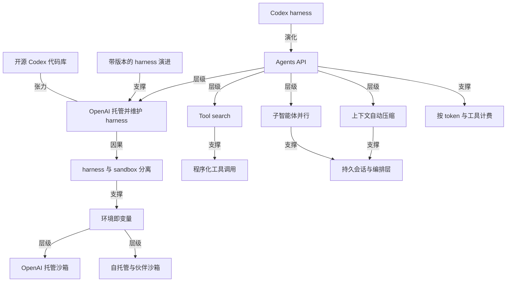

# OpenAI 把 Codex 的 harness 做成了托管 API

- 原文标题：Introducing the Agents API | OpenAI
- 作者：OpenAI
- 内参日期：2026-09-11
- 来源类型：blog
- 原文：https://openai.com/index/introducing-the-agents-api/
- 标签：OpenAI, agents, harness engineering

> Agents API 公测，直接开放驱动 Codex 的编排层与基础设施：长时会话、工具调用、云端托管，一次 API 调用起一个 agent。对自建 agent 循环的人来说，这是「自己搭 harness」与「租用别人打磨过的 harness」之间的重新取舍。

## 导读

openai 发布 Agents API

## 核心观点

- OpenAI 于 2026 年 9 月 10 日以 public beta 形态发布 **Agents API**：把驱动 Codex 的那套 harness 和基础设施原封不动地包装成一个托管 API，交给外部开发者使用。一句话概括官方定位：`Build and run cloud agents with the Codex harness, fully managed by OpenAI`。
- 这次发布的真正标的不是模型，而是 **harness**——那层管理上下文、高效调用工具、协调子智能体的调度逻辑。OpenAI 把在 Codex 和 ChatGPT for Work 上服务数百万人的过程中学到的「长时间运行的 agent 要怎样才真的能跑起来」，固化成了一个产品层。
- 架构上最关键的一刀是 **harness 与 sandbox 分离**：harness 由 OpenAI 托管并持续维护，计算环境（sandbox）由开发者自选——OpenAI 托管沙箱、自己的基础设施、或生态伙伴的沙箱。开发者因此可以只专注于让自己的 agent 独特的那部分：工具、知识和工作流。
- 商业口径上没有平台抽成：public beta 期间 Agents API 不额外收费，只按 agent 实际消耗的 token 和工具付费。
- 底座是开源的：Agents API 由开源的 Codex harness 驱动，开发者可以直接查阅公开代码库 `openai/codex` 中协调模型调用、工具与上下文的核心逻辑，而运维与维护责任留在 OpenAI 一侧。

## 问题起点：有用的 agent 到底缺什么

- OpenAI 把规模化运营 Codex 和 ChatGPT for Work 的经验凝练成两个必需品，这也是全文论证的起点：
- **一个强大的 harness**：管理上下文（manages context）、高效使用工具（uses tools efficiently）、协调子智能体（coordinates subagents）。
  - **一套可靠的基础设施**：能让 agent 连续可靠地运行数天（keeps them running reliably for days），并提供可以操作文件、运行代码、保存中间结果的环境。
- 这两件事都不是「模型能力」问题，而是工程问题——而且是每个想做 agent 的团队都得从头再造一遍的工程问题。Agents API 的全部价值主张就建立在「这一遍不该由你再造」之上。

## 产品形态：harness 托管、环境自选


- 三方分工清晰：应用（You）发送任务、接收事件与输出；Agents API（OpenAI）运行托管的 Codex harness，向沙箱发出 tool calls；沙箱（OpenAI or your provider）执行命令、处理文件并回传 tool results。自托管算力这条线由应用自己控制。
- 一次 API 调用就能创建一个生产就绪的 agent，只需指定四件事：任务、模型、工具、环境。官方示例用 `client.beta.agents.sessions.create` 创建 session：
- `agent.model` 指定模型（示例为 `gpt-6-astra`）。
  - `agent.tools` 挂载工具，示例中是一个 `type: "mcp"` 的可观测性服务，通过 http transport 连到 MCP server。
  - `agent.multi_agent` 开启多智能体并设置 `max_concurrent_subagents`。
  - `environment` 指定环境类型（示例为 `openai_hosted`）与 `capability_directories`，另有 `vault_ids` 管理凭证。
- 示例任务本身就说明了这套 API 面向什么场景：排查某服务过去 30 分钟 5xx 错误率升高，把部署分析、错误分析、依赖分析分派给子智能体，最后把发现、证据和缓解建议写进工作区输出目录。这是一个典型的、需要跑很久且要落盘中间产物的运维调查任务。

## 环境选择：从 VPC 内部署到托管沙箱

- 不同工作负载需要不同的计算、存储和部署方式，因此 Agents API 把沙箱做成可选项，并与九家生态伙伴做了一等公民级集成：Blaxel、Cloudflare、Daytona、DigitalOcean、E2B、Modal、Oracle、Runloop、Vercel。
- 伙伴集成覆盖三类差异化需求：
- 完全托管的环境，或部署在你自己 VPC 内的环境。
  - 特定的文件与密钥存储机制。
  - 不同的 CPU、GPU 和内存配置，以及与之匹配的性能、冷启动和成本画像。
- 同时 OpenAI 也推出自己的 **OpenAI hosted sandbox**，用的是支撑 Codex 和 ChatGPT 的同一套沙箱基础设施：由 OpenAI 供应和管理，给 agent 一个安全且高性能的环境来运行代码、操作文件、产出 artifacts；沙箱可以灵活配置你的文件、软件包、skills 和 plugins。
- 这一节的潜台词是：harness 是标准件，环境是变量。把变量交出去，标准件才能被所有人共用。

## 持续演进的 harness：三项已落地的能力改进

- 文章点出一个真实的开发者痛点：每当模型有新能力，往往意味着要重做一遍 harness，而这会挤占改进应用本身的时间。Agents API 的承诺是**随每次模型发布提供带版本的能力访问**（versioned access），harness 与模型同步维护和改进，让 agent 从每次升级中直接受益。
- **让 agent 跨长会话持续工作**：当 session 接近上下文上限时，Agents API 会自动压缩（automatically compacts）早前的上下文，保留 agent 继续工作所需的信息。开发者因此可以构建跨多个 context window 的工作流，而不必自己实现压缩逻辑。
- **让 agent 高效使用更多工具**：
- **Tool search**：按需加载相关的工具定义，在降低 token 用量和成本的同时保住模型的缓存。
  - **Programmatic tool calling**：让 agent 并行发起调用、串联相关操作，并在代码里过滤或合并结果——于是它能处理大量数据，却只把相关结果带回上下文。
  - 工具生态上，Agents API 支持 MCP、自定义函数，以及网页搜索这类内置工具。
- **让 agent 用子智能体并行工作**：多智能体支持可以把复杂任务拆成互相独立的部分委派给子智能体并行处理；每个子智能体维护自己的上下文以保持专注，主 agent 负责协调并汇总结果。这能加速研究、分析和编码类任务，而无需你自己搭编排层。

## 客户证言：把收益落到可量化的数字上

- 文章用七家客户的证言支撑「这不是 demo，是生产基础设施」的判断，其中有明确数字的是：
- **Ciridae**（CTO Jack Weissenberger）：评测分从 0.71 提升到 0.85；子智能体支持带来 4 倍延迟下降，而此前观测和编排子智能体相当笨重。
  - **SafetyKit**（Bhavyansh Sabharwal）：案件审查工作流迁移后，单案成本下降 60%，延迟更低、token 效率显著提升，同时保持原有表现。
  - **Hypha**（Serhii Shchoholiev）：金融服务场景靠**把 agent harness 与 sandbox 分离**，把失败的 agent 响应减少了 86%——这条直接印证了架构分离的价值。
- 另外四家说的是形态变化而非数字：
- **Long Lake**（Rasmus Wissmann）：`Agents API supplies the harness; the environment, context, and UX stay ours`——现在能以小时为单位在从住宅服务到建筑设计的各行业里立起 agent。
  - **WithCoverage**（Cole Striler）：过去要写 prompt chains 并自己管理工具调用，现在可以在代码里直接用 agent，就像 Codex 在你笔记本上工作那样。
  - **Dwelly**（Dmitry Khanukov）：测试中最突出的是对突发负载（bursty workloads）的处理——可以把工作扇出到数百个 agent、异步运行、稍后收集结果，而不必在波峰之间空转基础设施。
  - **Nash**（Aziz Alghunaim）：部署数千个长时运行 agent 管理全球物流网络里数以亿计的配送；Agents API 提供持久 session 与编排层（上下文、恢复、多步执行），Nash 提供连接物理世界的工具与执行环境，让 agent 跨越数小时乃至数天的复杂工作流去推理、行动、恢复与协作。
- 再加上 `deepsense.ai`（Maks Operlejn）关于在真实活跃仓库里完成实现、独立评审、修复与真实浏览器验证的证言，这组证言覆盖了运维、金融、保险、物流、房产、软件工程六类场景。

## 开放性与商业条款

- **开源底座**：Agents API 由开源的 Codex harness 驱动，开发者能看见协调模型调用、工具和上下文的核心逻辑。分工是 OpenAI 运营并维护这套 harness，开发者则可以检视并学习其公开代码库。
- **定价**：public beta 今日对所有开发者开放，使用 Agents API 没有额外费用，只需为 agent 消耗的 token 和工具付费。
- **迭代姿态**：beta 期间 OpenAI 会基于反馈快速迭代，直到走向 GA，并明确征询「哪里可用、哪里有摩擦、还需要什么才能把 agent 跑进生产」。

## 概念网络

### 关键概念

#### Harness（智能体运行骨架）

**context**：全文的中心词。原文把它定义为有用的 agent 所必需的第一件东西——`a powerful harness that manages context, uses tools efficiently, and coordinates subagents`。Agents API 的整个卖点就是「OpenAI hosts and maintains the harness」。

**费曼一下**：模型是发动机，harness 是整辆车的传动与操控系统。同一台发动机，装在不同的车上跑出的成绩天差地别。过去每个做 agent 的团队都在自己造车，现在 OpenAI 说：车我来造并且一直保养，你只管决定拉什么货、走哪条路。

#### Harness 与 sandbox 分离

**context**：文章的架构主张，也是 Hypha 把失败响应减少 86% 的直接归因（`By separating the agent harness from the sandbox`）。harness 由 OpenAI 托管，计算环境则在 OpenAI 托管沙箱、自有基础设施、伙伴沙箱之间自选。

**费曼一下**：把「怎么想」和「在哪干活」拆成两件事。思考的那部分交给专业团队持续打磨，干活的场地按你自己的合规、成本和性能要求来挑。场地塌了不影响思考逻辑，思考逻辑升级也不用搬家。

#### 托管式 agent 基础设施

**context**：原文强调 agent 需要能连续可靠运行数天的基础设施，且环境里能操作文件、运行代码、保存中间结果。OpenAI hosted sandbox 用的是支撑 Codex 和 ChatGPT 的同一套沙箱设施。

**费曼一下**：长时间运行的 agent 更像一名值班工程师而不是一次问答。它需要工位、硬盘和一张能连续数天不断电的桌子——这些东西比「更聪明的回答」更决定它能不能真的完成任务。

#### 上下文自动压缩（compaction）

**context**：为支持模型连续工作数小时，Agents API 在 session 接近上下文上限时自动压缩早前上下文，保留 agent 继续工作所需的信息，使开发者无需自行实现压缩逻辑即可构建跨多个 context window 的工作流。

**费曼一下**：长会议里没人能记住每句话，但好的记录员会在记忆快满时把前半场压成要点，保证后半场的讨论仍然接得上。压缩不是删除，是换一种更省地方的存法。

#### Tool search（工具检索）

**context**：Agents API 的工具效率机制之一——按需加载相关的工具定义，在降低 token 用量和成本的同时保住模型的缓存（`preserving the model's cache`）。

**费曼一下**：不要把整本工具手册摊在桌上，而是需要哪一页才翻哪一页。桌面干净了，脑子里能装的正事就多了；更妙的是，前面已经背下来的东西不会因为翻页而被打乱。

#### Programmatic tool calling（程序化工具调用）

**context**：与 tool search 配套的能力——让 agent 并行发起调用、串联相关操作，并在代码里过滤或合并结果，从而处理大量数据却只把相关结果带回上下文。

**费曼一下**：与其把一整个数据库倒进脑子里再筛，不如写一段脚本在外面筛完只带答案回来。让代码去做代码擅长的事，模型只负责判断，这是 token 经济学最直接的一次体现。

#### 子智能体并行（multi-agent / subagents）

**context**：Agents API 可以把复杂任务拆成独立片段委派给并行工作的子智能体，每个子智能体维护自己的上下文以保持专注，主 agent 协调并汇总结果。Ciridae 称其带来 4 倍延迟下降。

**费曼一下**：一个人查三条线索要串着查，三个人分头查再碰头就快得多。关键不在于人多，而在于每个人只装自己那条线索的细节，不被别人的噪声挤占注意力。

#### 带版本的 harness 演进

**context**：原文指出「利用新模型能力往往意味着重做 harness」，而 Agents API 承诺随每次模型发布提供 versioned access，harness 与模型同步维护改进，使 agent 从每次升级中直接受益。

**费曼一下**：以前模型换代像换发动机——车架得跟着改一遍。现在车架由厂家按版本迭代，你换发动机时车架自动配好。省下的不是钱，是那段本来会被浪费在重做地基上的时间。

#### 环境即变量（可插拔沙箱）

**context**：文章明确「不同工作负载需要不同的计算、存储和部署选项」，因此与九家生态伙伴做一等公民集成，覆盖托管环境或 VPC 内部署、特定的文件与密钥存储、以及不同的 CPU/GPU/内存与冷启动成本画像。

**费曼一下**：同一套操作流程，可以在自家厨房做，也可以在中央厨房做，还可以租别人的产线。把「在哪做」留成可调参数，标准流程才能被各种体量和合规要求的团队共用。

#### 开源 harness 与托管运维的分工

**context**：Agents API 由开源的 Codex harness 驱动，开发者可以检视公开代码库并从中学习，而 OpenAI 负责运营与维护。

**费曼一下**：代码公开让你能看懂它为什么这么决策，托管运维让你不必半夜起来修它。透明度和省心通常是一对矛盾，这里被拆成了两个角色分别承担。

#### 按 token 与工具计费

**context**：public beta 期间使用 Agents API 没有额外费用，开发者只为 agent 消耗的 token 和工具付费。

**费曼一下**：平台层不单独收过路费，钱仍然收在算力和工具上。这既是获客姿态，也是一种信号——OpenAI 要的是让尽可能多的 agent 长在这套 harness 上，而不是先从中间层榨一笔。

### 概念网络



- **网络的中心是 harness，不是模型**。整张图的枢纽 C1 之所以成立，源头在 C2：Codex 那套已经被数百万人验证过的 harness 被抽出来，从一个产品内部的实现细节升格为对外的 API 层。这是「演化」关系而非「新建」关系——它的可信度全部来自已经跑通的那段历史。
- **一刀切分派生出整个环境层**。C4（OpenAI 托管并维护 harness）必然导出 C3（harness 与 sandbox 分离），因为托管方要维护一套统一的调度逻辑，就不能同时锁定千差万别的执行环境。C3 支撑 C5（环境即变量），C5 再向下展开为 C6 和 C7 两类具体选择。Hypha 减少 86% 失败响应的结果，正是这条因果链在生产环境里的读数。
- **三项能力改进共同服务一个目标：让 agent 跑得久**。C8（上下文自动压缩）解决「记不住」，C9 与 C10（工具检索与程序化调用）解决「工具太多、数据太大」，C11（子智能体并行）解决「一条线程不够用」。C9 与 C10 之间是支撑关系——先按需加载工具定义，才谈得上在代码里并行编排和过滤结果。C8 和 C11 一起汇入 C14（持久会话与编排层），这正是 Nash 描述的那种跨小时乃至数天的生产形态。
- **C12 是这套体系的时间维度**。带版本的 harness 演进支撑 C4：托管之所以值得换掉自建，不是因为某一刻它更好，而是因为它承诺在下一次模型发布时仍然更好。开发者让渡控制权换来的是免于重做地基。
- **C13 与 C4 之间是一组有意保留的张力**。开源代码库让开发者看得见核心逻辑，托管运维让开发者不必自己维护——透明与省心通常互斥，这里被拆成两个角色分别承担，也让「托管」不至于变成完全的黑箱。
- **C15 是网络的商业边界**。按 token 与工具计费意味着 harness 这一层被定价为零，价值捕获仍在算力与工具侧。这个定价姿态与 C4 的托管主张互为表里：只有不在中间层收费，才可能让尽可能多的 agent 愿意长在这套 harness 上。

## 费曼 x3

过去两年，做 agent 的团队几乎都在做同一件重复劳动：写上下文管理、写工具调度、写子任务编排、写崩溃恢复。这些代码和业务毫无关系，却占掉大半工程时间，而且每次模型换代还要推倒重来一遍。今天 OpenAI 把这一层收走了——不是收走模型，是收走那层叫 harness 的骨架。

值得注意的是被拿出来当商品的那个东西。Agents API 卖的不是新能力，而是 Codex 已经跑通的那套骨架本身：管理上下文、高效用工具、协调子智能体。有用的 agent 需要的是「a powerful harness」和能连续可靠运行数天、可以操作文件与运行代码的基础设施——这两句话把行业的注意力从模型智商挪到了工程可靠性上。承认这一点其实需要一点坦率：真正卡住 agent 落地的，从来不是模型不够聪明。

架构上最漂亮的一刀是把 harness 和 sandbox 拆开。思考的逻辑由一方托管并持续打磨，干活的场地由你按合规、成本和冷启动画像自己挑，从自家 VPC 到九家生态伙伴都行。这刀的价值有一个冷冰冰的读数：某家金融服务公司靠这一拆，把失败的 agent 响应减少了 86%。原来很多所谓的「模型不稳定」，只是调度逻辑和执行环境耦合在一起时互相拖累的结果。

harness 里那几项改进也都指向同一件事——让 agent 跑得久。上下文快满时自动压缩，于是工作流可以跨越多个 context window；工具定义按需加载，既省 token 又保住模型的缓存；程序化调用让 agent 在代码里过滤合并，处理海量数据却只把相关结果带回上下文；子任务分给各自维护上下文的子智能体并行推进。这些都不是炫技，而是长时运行的 agent 必须过的几道坎。

最耐人寻味的是定价：public beta 期间 harness 这一层收费为零，你只为 token 和工具付钱。把平台层定价为零，是想让尽可能多的 agent 长在这套骨架上。于是真正的问题落到每个开发者头上——当骨架成了别人维护的公共品，你的 agent 还剩什么是独特的？答案就写在原文那句分工里：harness 归它，环境、上下文和用户体验归你。

## 阅读原文

September 10, 2026

Build and run cloud agents with the Codex harness, fully managed by OpenAI.

Loading…

Share

As we’ve scaled Codex and ChatGPT for Work to millions of people around the world, we’ve learned what it takes to make long-running agents work well in practice. Useful agents need a powerful harness that manages context, uses tools efficiently, and coordinates subagents. They also need infrastructure that keeps them running reliably for days, with environments where they can work with files, run code, and save intermediate results.

Today, we’re introducing the [Agents API⁠](https://developers.openai.com/api/docs/guides/agents-api/overview) in public beta, bringing that same harness and infrastructure that powers Codex to developers through a simple, flexible API.

OpenAI hosts and maintains the harness. You choose the agent’s compute environment: in an OpenAI-managed sandbox, on your own infrastructure, or with one of our sandbox partners. The Agents API gives you a strong foundation for building agents on top of our optimized agent harness and infrastructure, so you can focus on the tools, knowledge, and workflows that make your agent unique.

> “With the Agents API, our evaluation score went from 0.71 to 0.85. The subagent support in the API is great and drastically sped up our workflow. Previously it was pretty cumbersome to observe and orchestrate subagents in our old setup but the new APIs gave us a 4x latency reduction. We spent a long time trying to optimize for this and the subagent flows were a huge out-of-the-box lift.”

Jack Weissenberger, CTO, Ciridae


Agents API powers your agents with the same harness and infrastructure behind Codex.

### Build cloud agents with a single API call

With the Agents API, you can create a production-ready agent in a single API call by specifying the task, model, tools, and environment:

##### JSON

```javascript
import OpenAI from "openai";
const client = new OpenAI();
const session = await client.beta.agents.sessions.create({
agent: {
model: "gpt-6-astra",
tools: [
{
type: "mcp",
server_label: "observability",
transport: {
type: "http",
server_url: "https://observability.example.com/mcp",
},
},
],
multi_agent: { enabled: true, max_concurrent_subagents:
},
},
vault_ids: ["vault_YOUR_VAULT_ID"],
environment: {
type: "openai_hosted",
capability_directories: ["/workspace/capabilities/skills"],
},
input:
"Investigate service-api’s elevated 5xx rate over the last 30 minutes. " +
"Delegate deployment, error, and dependency analysis to subagents. " +
"Save findings, evidence, and recommended mitigation in /workspace/outputs.",
});
```

### What our customers are saying about Agents API

1 of 7

> “Transforming real-world businesses means deploying AI into workflows of every shape. Agents API supplies the harness; the environment, context, and UX stay ours. With our AI platform Nexus we now stand up agents in hours across industries, from residential services to architecture.”

Rasmus Wissmann, CTO, Long Lake

> “The Agents API has enabled us to think differently about how we can architect complex, multi-step workflows. We used to write prompt chains and manage our own set of tool calls, but now we can use agents directly in our code much like how Codex works on your laptop. It’s already helped us solve several problems that would’ve otherwise required us to build custom agent infrastructure.”

Cole Striler, Director of Engineering, WithCoverage

> “After migrating our case review workflow to the Agents API, we saw a 60% reduction in cost per case, lower latency, and significantly improved token efficiency while maintaining existing performance.”

Bhavyansh Sabharwal, Member of Technical Staff, SafetyKit

> “What stood out in our testing was how naturally the Agents API handled bursty workloads. We could fan out work across hundreds of agents, run them asynchronously, and collect the results later, without keeping infrastructure idle between peaks.”

Dmitry Khanukov, Co-founder & CTO, Dwelly

> “Earning customers’ trust is critical in financial services. OpenAI’s Agents API enables us to build more reliable agents, giving customers the confidence to use them in production. By separating the agent harness from the sandbox, we reduced failed agent responses by 86%.”

Serhii Shchoholiev, Lead Engineer, Hypha

> “The Agents API handled the implementation, independent review, remediation, and real-browser validation in a real, active repository. Overall, the agent’s engineering quality was very strong.”

Maks Operlejn, Senior ML Engineer, [deepsense.ai](http://deepsense.ai/)

> “At Nash, we deploy thousands of long-running AI agents that manage hundreds of millions of deliveries across global logistics networks. OpenAI’s Agents API gives us the durable session and orchestration layer we need for agents operating continuously in production managing context, recovery, and multi-step execution, while Nash provides the tools and execution environment that connect them to the physical world. This lets our agents reason, act, recover, and collaborate across complex workflows that can span hours or days. These agents are production infrastructure running mission-critical logistics operations for our partners.”

Aziz Alghunaim, Co-founder & CTO, [Nash.ai](http://nash.ai/)

### Choose your agent environment

Different workloads need different compute, storage, and deployment options. The Agents API lets you choose a sandbox that fits your application.

We’re [partnering with ecosystem providers⁠](https://developers.openai.com/api/docs/guides/agents-api/environments/self-hosted#sandbox-providers), including Blaxel, Cloudflare, Daytona, DigitalOcean, E2B, Modal, Oracle, Runloop, and Vercel, to provide first-class integrations for a range of needs:

- Fully managed environments or deployments within your VPC
- Specific file and secret storage mechanisms
- Different CPU, GPU, and memory configurations, with performance, cold-start, and cost profiles to match your company’s workflow.


The Agents API offers first-class integrations with popular ecosystem providers.

### OpenAI hosted sandboxes

For developers who want to get started quickly and scale efficiently, we’re also introducing the [OpenAI hosted sandbox⁠](https://developers.openai.com/api/docs/guides/agents-api/environments/openai-hosted). This leverages the same sandboxing infrastructure that powers Codex and ChatGPT.

OpenAI provisions and manages the sandbox, giving your agent a secure and performant environment to run code, work with files, and produce artifacts. These sandboxes can be flexibly configured with your files, packages, skills and plugins to give the agent what it needs to complete the task.

### Build with an evolving Codex harness

Taking advantage of new model capabilities often means reworking your harness, taking valuable time away from improving your application. The Agents API provides versioned access to these capabilities with each model launch. We maintain and continuously improve the harness alongside our models, helping your agents get better performance from every upgrade. For example, recent improvements to the harness include:

#### Keep agents working across long sessions

To support models working for hours, we’ve built context management that helps agents carry relevant information across longer sessions. The Agents API [automatically compacts⁠](https://developers.openai.com/api/docs/guides/compaction) earlier context as a session approaches its context limit, preserving information the agent needs to continue. Developers can build workflows that span multiple context windows without implementing their own compaction logic.

#### Help agents efficiently use more tools

The Agents API helps agents find the right tools and use them efficiently. [Tool search⁠](https://developers.openai.com/api/docs/guides/tools-tool-search) loads relevant tool definitions as needed, helping reduce token usage and cost while preserving the model’s cache. Once tools are available, [programmatic tool calling⁠](https://developers.openai.com/api/docs/guides/tools-programmatic-tool-calling) lets agents run calls in parallel, chain related operations, and filter or combine results in code so they can work through large volumes of data while bringing only the relevant results back into context. The Agents API supports MCP, custom functions, and built-in tools like web search.

##### JSON

```javascript
"agent": {
"tools": [
{
"type": "mcp",
"server_label": "openai_docs",
"transport": {
"type": "http",
"server_url": "https://developers.openai.com/mcp"
}
},
]
}
```

#### Let agents parallelize work with subagents

With [multi-agent support⁠](https://developers.openai.com/api/docs/guides/agents-api/multi-agent), the Agents API can break complex tasks into independent pieces and delegate them to subagents that work in parallel. Each subagent maintains its own context, helping it stay focused on its assignment, while the main agent coordinates their work and brings the results together. This can speed up research, analysis, and coding tasks that benefit from parallel work, without requiring you to build your own orchestration.

##### JSON

```javascript
"agent": {
"model": "gpt-6-astra",
"multi_agent": {
"enabled": true,
"max_concurrent_subagents":
,
}
}
```

### Build on an open-source foundation

The Agents API is powered by the open-source Codex harness, giving developers visibility into the core logic that coordinates model calls, tools, and context. With the Agents API, OpenAI operates and maintains that harness while developers can inspect and learn from its [public codebase⁠](https://github.com/openai/codex).

### Start building

Agents API is available in public beta today to all developers. There are no additional fees for using the Agents API – you simply pay for the tokens and tools your agents use, as outlined on our [pricing page⁠](https://developers.openai.com/api/docs/pricing).

Explore the[Agents API overview⁠](https://developers.openai.com/api/docs/guides/agents-api/overview) to learn more, or follow the[quickstart⁠](https://developers.openai.com/api/docs/guides/agents-api/quickstart) to get started and bring the harness behind Codex into your own agents.

During the public beta, we’ll iterate quickly based on your feedback as we work toward general availability. Let us know what’s working, where you’re running into friction, and what you need to build and run your agents in production.

- API
- Codex
- 2026

### Author

OpenAI

### Keep reading

[View all](https://openai.com/news/)


[Now everyone can put data to workProductSep 10, 2026](https://openai.com/index/put-data-to-work/)


[Introducing ChatGPT for Financial ServicesProductSep 10, 2026](https://openai.com/index/introducing-chatgpt-financial-services/)


[Build more natural voice experiences with GPT‑Live‑1 in the APIProductSep 10, 2026](https://openai.com/index/introducing-gpt-live-1-in-the-api/)
