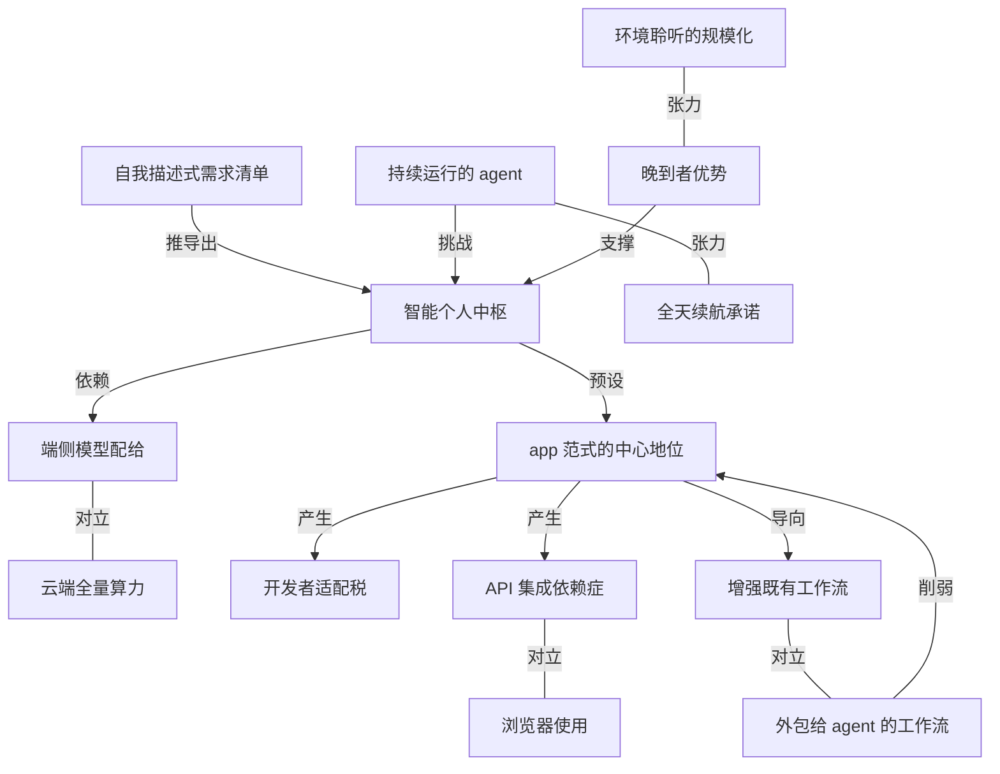

# Stratechery 解读 iPhone Duo 与苹果的 AI 盲区

- 原文标题：The iPhone Duo, The Intelligent Personal Hub, Apple Watch Audio Intelligence
- 作者：Ben Thompson
- 内参日期：2026-09-11
- 来源类型：blog
- 原文：https://stratechery.com/2026/the-iphone-duo-the-intelligent-personal-hub-apple-watch-audio-intelligence/
- 标签：商业, 产品经理, ai 硬件

> Ben Thompson 承认苹果又一次展示了软硬一体的力量，但指出它最大的 AI 盲区可能是仍然相信 app 至上——当交互重心移向智能个人中枢，以 app 为组织单位的假设本身会成为约束。

## 导读

Stratechery 付费文章

## 核心观点

- 本文是 Ben Thompson 对 2026 年 9 月 9 日苹果发布会的 Update 解读，覆盖三件事：首款折叠屏 iPhone Duo、Ternus 提出的「intelligent personal hub（智能个人中枢）」框架、以及 Apple Watch 的 Audio Intelligence。
- 对 iPhone Duo 的评价是正面的：硬件工程极为出色，但**最值得注意的不是硬件，而是苹果为这个形态把 iOS 重做了一遍**——这也是软件工程高级副总裁 Craig Federighi 出现在介绍视频里的原因。
- 对「智能个人中枢」的框架他不反对，但指出一个方法论问题：新任 CEO John Ternus 描述的「理想中枢」条件清单，恰好一条不差地描述了 iPhone；**从零设计的推演如果终点正好是自家现有产品，那就不是推演而是追认**。
- 三条反驳：iPhone 再强也从根本上弱于云端；对一切事情都用强模型，比「精打细算地回落到端侧模型」更聪明；「全天续航」的承诺会在中枢真成为一个「你不看它时也在干活的 agent」时被击穿。对照组是 Meta 的 Muse——跑在云端专属 VM 上、默认用接近 state of the art 的模型、不交互时也能连续运转。
- 最深的一层判断：**苹果传统上最大的优势（开发者生态与 app 框架），在 agent 时代可能变成拖累**。Siri AI 号称已适配超过 300,000 个 app，但「让开发者很容易接入新能力」的潜台词是开发者必须真的动手；而 browser use 意味着 agent 只要会用网页，就免费拿到了对几乎一切服务的集成。
- 范式层面的结论：苹果把 Intelligence 的价值定义为「增强你已有的工作流」（所以演示的是自动更新日历和提醒事项），但更好的工作流可能是把原本发生在 app 里的事**直接外包给 agent**；苹果与 app 范式绑得太深，「大概从没考虑过另一种可能」。Ternus 描述的是一部 iPhone，而真正的智能个人中枢也许根本不需要 app。
- 对 Apple Watch 的 Audio Intelligence 表态是罕见的不安：这不是技术上的领先与否问题，而是**苹果以自身规模把「可穿戴设备记录真实世界」这件事迅速铺向所有人**——这是他唯一希望苹果「晚一点」的领域。

## iPhone Duo：硬件之外，真正的看点是 iOS 被重做了一遍

- 产品事实（引自 Bloomberg）：
- 苹果首款折叠屏手机，名为 iPhone Duo；新任 CEO John Ternus 称它会比对手的折叠机更好，并嘲讽竞品是「two phones awkwardly stuck together（两部手机别扭地粘在一起）」。
  - 展开后 7.6 英寸屏，是 iPhone 史上最大显示屏；折叠时外屏 5.4 英寸；今年晚些时候将支持 iPad 的 Apple Pencil。
  - 定位是「打磨一个由三星等厂商开创的品类」：手感更扎实，展开时中缝折痕更轻；软件界面刻意让两块屏在使用中融为一体。
- Ben 的整体判断：iPhone Duo 非常令人印象深刻，是「Apple at its best」。他同时忍不住笑了一下——介绍视频说「iPhone Duo 的便利在于把两个产品的用途合而为一」，而当年正是 Tim Cook 拿同样的理由嘲讽过 Surface。
- 真正的看点是系统重做，Federighi 给出的细节：
- 主要控件移到侧边，为内容腾出纵向空间；这一思路贯穿全系统，每个自家 app 都为 Duo 单独优化。
  - 锁屏出现极简视图，把焦点还给壁纸。
  - 大屏带来多任务：把一个 app 推到一侧、另一侧启动第二个 app 做分屏；也能用同样的手势开同一个 app 的第二个窗口（比如两个 Safari 比价）；可交换左右、点分隔条把两个 app 配对以便下次一起唤起。
  - 竖屏下看视频可把播放器钉在顶部，下方仍有充足空间放另一个 app。
  - 新增与更新的 API 供开发者适配；示范的第三方包括：Zoom 把屏幕变成沉浸式会议室（同时看共享内容与与会者）、Slack 把整个工作区一屏铺开、某创作类 app 用新的 Core AI 框架在端侧跑模型、Netflix 在外屏滑片段、展开后进入沉浸式浏览。

## 开发者必须动手：适配税与自利型生态

- 第一个抱怨是私人的：Ben 几乎只用左手操作 iPhone，而 Dock 放在右侧对他是 no-go。他理解苹果的取舍——这样 Dock 在折叠与展开两种状态下位置一致——但**对单手用户来说，这是一台右撇子设备**。
- 第二个观察关于 Netflix：它被如此显眼地展示，而当年 Netflix 拒绝为 Vision Pro 提供应用。这在 Netflix 一侧完全理性——苹果卖出的 Duo 会远多于 Vision Pro——但它提醒人们：**如今开发者与苹果合作纯粹出于自身利益，不再出于对这家公司的任何偏爱**。
- 第三点也是最值得注意的一点：Federighi 那句「我们让开发者很容易为 iPhone Duo 适配他们的 app，配有新的和更新的 API」。潜台词是开发者必须投入工作，否则应用会很难看——推特用户 SwiftyAlex 发的对比图就是现成证据：不更新的 app 在 Duo 上被挤成中间一条，两侧全是黑边。
- 缓和的判断：开发者经历过这类过渡，用苹果自家控件构建的现代 app 适配起来相当容易；但**工作量是真实存在的**。只是 iPhone 的分量足够重，他预计大多数开发者都会去做。

## 智能个人中枢：一份从零设计却正好长成 iPhone 的清单

- Ternus 在发布会开头花时间论证 iPhone 是理想的 AI 设备，逻辑是：AI 让全新体验成为可能，而当 AI 能把你的生活与你每天使用的 app、服务、产品串起来时会更有用；于是**站在这些体验中心的那个产品变得更加关键**，他称之为 intelligent personal hub（智能个人中枢）。它的力量来自「广泛的新能力」与「对你个人语境的深刻理解」的交叉点。
- 接着是那份「如果从零设计理想中枢」的清单：
- 始终随身、深度个人化，能在最要紧的时刻带来智能。
  - 强大处理器以在端侧跑高能力模型即时作答，同时具备无处不在的网络连接以取用云端知识与更强模型。
  - 大而漂亮的显示屏呈现丰富内容。
  - 高质量摄像头与麦克风，以便「看见、听见并对周遭的景象与声音进行推理」。
  - 全天续航；上手无学习曲线；与你的其他设备、app、服务无缝协同，感觉像一个整体。
  - 结论：「你会抵达某个惊人地熟悉的东西——世界上没有比 iPhone 更适合做你的智能个人中枢的产品。」
- Ben 的方法论质疑：他不反对中枢这个框架，但**「Ternus 对中枢的描述恰好完美地描述了一台 iPhone」这件事并不令人意外，而不意外并不等于正确**。
- 三条实质反驳：
- 能力上限：iPhone 再强大，也从根本上不如跑在云上的东西。
  - 模型策略：对所有事情都用强模型，会比「精心配给、回落到端侧模型」更聪明。
  - 续航前提：如果这个中枢真的是一个「在你不注意时也能干活的 agent」，那条全天续航的承诺就会受到考验。
- 对照组是 Meta 的 Muse：它同样符合智能个人中枢的定义，但跑在云端一台能力很强的专属虚拟机上、默认使用 Meta 接近 state of the art 的模型、且**在你不与它交互时也能持续运行**。Ben 的评语很直接：这听起来相当有吸引力。

## 苹果最大的资产为何可能变成负担：API 依赖 vs 浏览器使用

- iPhone 18 Pro 的 Siri AI 段落里有两句话让他在意：Siri 能在你已经在用的 app（包括第三方）里执行操作，「已经能与超过 300,000 个 app 无缝协作」——发短信用 WhatsApp、听书用 Audible；而且「开发者也很容易接入新能力」，于是可以让 Siri 在 Outlook 里起草邮件、在 Notability 里搜作业、把餐厅推荐加进 Tripsi。
- Ben 的拆解：300,000 个 app 这个数字确实极其可观，但**「容易接入」的另一面是开发者必须真的动手**——而且这笔工是叠加在「为 Duo 改 UI」之上的第二笔。
- 关键的时代条件变了：
- 如果所有人都得挨个说服开发者做集成，这对苹果不构成问题。
  - 但 browser use 在此处分量极重：**agent 只要会用网页，就等于免费获得了对几乎一切服务的集成**；而依赖开发者插进 API 的那一方——也就是苹果——反而处于劣势。
- 同一段演示里的 Apple Intelligence 生产力功能同样值得注意：Safari 里的 Notify Me 可监控网页变化并主动通知；快捷指令支持「用一句话描述」生成个性化自动化（例如每次收到学校邮件就更新日历与提醒事项）；电话 app 在你致电商家时自动浮出相关信息（比如恰好需要的航班确认码）。

## 范式之争：增强工作流，还是把工作流外包给 agent

- 这是全文最微妙也可能最深刻的一点：**在苹果的愿景里，Intelligence 的价值由「它能多大程度增强你已有的工作流」来定义**——所以演示才落在「更新日历与提醒事项」上。
- 反面可能性：更好的工作流也许是把大量原本发生在 app 里的事**直接外包给 agent**。用一个需要你主动去查的结构化提醒事项 app，和被 agent 直接提醒，哪个更好？
- Ben 的克制结论：答案很可能因人而异；但值得指出的是，**苹果与 app 范式绑定太深，以至于他们大概从未考虑过另一种选项**。
- 于是回到 Ternus 的开场：他描述的是一部 iPhone，而他的愿景预设了 app 的中心地位；**真正的智能个人中枢，可能根本不需要 app**。

## Apple Watch 环境聆听：这次他希望苹果晚一点

- 关于「苹果 AI 晚到」的讨论：他与 John Gruber 在 Dithering 里聊过这是否算问题。结论是站在前沿并不总有好处——尤其当你要触达的是普通用户、要给他们一个能理解的产品时；而**真正能用的 Siri AI 很可能会被大量使用**。甚至可以说，最初 Siri AI 翻车的真正问题恰恰是苹果**出于害怕落后而过早宣布**。
- 但有一项发布让他不安。Bloomberg 的事实：
- Apple Watch Series 12 与 Ultra 4 加入 Audio Intelligence。
  - Siri Recap：通过环境聆听，为佩戴者一整天的对话记录高层次要点。
  - Live Recap：显示现场对话最近 15 秒的转写。
  - 手表还能监听重要声响，如婴儿啼哭、门铃、警笛。
  - 每项音频功能都由用户自行选择是否开启；苹果称不会创建或存储任何录音，原始音频对苹果与其他 app 均不可获取，处理后立即删除。
- Ben 的态度：已有可穿戴设备在做这件事甚至更多，苹果**并不一定站在最前沿**；但他对「可穿戴设备记录真实世界」这件事本身普遍感到不安，而**苹果以自身规模推出该能力，意味着它会比原本快得多地无处不在**。
- 他承认苹果在这项功能上是审慎的——包括不把原始转写提供给任何人，连手表主人自己也拿不到。但这是他希望这家公司不要抢先的领域：**也许「被你打交道的每个人监视」终究不可避免，但他希望苹果别把它这么快地变成现实**。

## 概念网络

### 关键概念

#### 智能个人中枢（intelligent personal hub）

**context**：Ternus 在发布会开场提出的框架——当 AI 能把你的生活与你每天用的 app、服务、产品串起来时，「站在这些体验中心的那个产品变得更加关键」。它的力量来自「广泛的新能力」与「对个人语境的深刻理解」的交叉点。Ben 明确表示不反对这个框架本身，争议只在于什么样的形态才配当中枢。

**费曼一下**：AI 时代最值钱的位置，不是哪个模型最强，而是「谁掌握了关于你的全部上下文，并且随时能替你动手」。谁坐上这个位置，谁就成为新的入口。苹果说这个位置天然属于手机，但这只是一种答案，不是唯一答案。

#### 自我描述式需求清单

**context**：Ternus 演示的推理形式是「如果你从零设计理想的中枢，你会怎么做」，逐条列出随身、端侧强芯片、云端连接、大屏、摄像头麦克风、全天续航、零学习成本、跨设备协同，最后得出「你会抵达某个惊人地熟悉的东西」。Ben 的评语是：清单恰好完美描述了一台 iPhone 并不意外，**而不意外不等于正确**。

**费曼一下**：先有答案再倒推需求，是最常见也最难自查的论证陷阱。判别方法很简单：如果「从零设计」的推演终点正好是你手上已有的东西，那它不是推演，是追认。听任何公司描述「理想产品」时，都值得先做这一步检验。

#### 端侧模型配给 vs 云端全量算力

**context**：苹果的中枢设想强调「强大处理器在端侧跑高能力模型即时作答」，云端只是补充。Ben 的两条反驳直指此处：iPhone 再强也从根本上弱于云端；而且「对一切都用强模型，比精心配给、回落到端侧模型更聪明」。

**费曼一下**：端侧模型省电、保护隐私、响应快，但它本质上是一种配给制——为了省资源，把大部分请求交给较弱的模型。当智能本身成为产品体验的主要变量时，配给制就从优点变成了天花板。

#### 持续运行的 agent 与全天续航的矛盾

**context**：Ben 的第三条反驳——「如果这个智能个人中枢真的是一个在你不注意时也能干活的 agent，那条全天续航的承诺就会受到考验」。对照 Meta 的 Muse：跑在云端专属虚拟机上，不与你交互时也能连续运转。

**费曼一下**：手机的所有设计假设都建立在「你看着它时它才工作」之上。而 agent 的价值恰恰来自「你不看它时它也在工作」。这两个假设互相冲突，电池只是冲突最先显形的地方。

#### 浏览器使用（browser use）＝免费的全域集成

**context**：Ben 用来论证苹果劣势的关键机制——「agent 只要能直接使用网页，就等于免费获得了对几乎一切的集成」，而这正是 Siri 那套「300,000 个 app + 开发者接入新能力」路线的对照面。

**费曼一下**：网页是一套所有服务早就自愿提供的通用接口。agent 学会用浏览器，相当于一次性拿到了全世界的接口，不需要任何一家公司点头。而靠专有接口做集成的一方，每接一家都要重新谈一次。

#### API 集成依赖症

**context**：Ben 的判断是「依赖开发者插进 API 的苹果处于劣势」。Siri 的能力边界由开发者是否采纳新 API 决定，而「开发者很容易接入新能力」的潜台词恰恰是开发者必须真的动手。

**费曼一下**：集成有两种拿法：一种是求人接线，一种是自己会用通用接口。前者的覆盖率永远受制于对方的意愿和排期，后者的覆盖率只受制于自己的能力。在「求人」曾经是唯一选项的年代，谁的号召力大谁赢；一旦出现「不用求人」的路径，号召力就贬值了。

#### 开发者适配税

**context**：为 iPhone Duo 改 UI 是一笔工，为 Siri 接入新能力是另一笔工，两笔叠加。不做的后果有现成证据——未更新的 app 在 Duo 上只占中间一条、两侧全是黑边。Ben 预计大多数开发者仍会做，因为「iPhone 的分量足够重」。

**费曼一下**：平台每推一次新形态或新能力，就等于向整个生态征一次税。税收得动，靠的是平台足够重要；一旦平台的重要性下降，同样的税就收不上来了。这也是平台方永远要盯着自己「值不值得被适配」的原因。

#### 自利型开发者生态

**context**：Netflix 曾拒绝支持 Vision Pro，却在 Duo 的介绍视频里被显眼展示。Ben 说这在 Netflix 一侧完全理性，但它提醒人们：如今开发者与苹果合作「纯粹出于自身利益，而非对这家公司有任何偏爱」。

**费曼一下**：生态忠诚是个错觉，真正起作用的是装机量算术。开发者算的是「这里有多少用户」，不是「我喜不喜欢这家公司」。所以平台的号召力等于且只等于它的规模，情感储备为零。

#### app 范式的中心地位

**context**：Ben 的收尾判断——Ternus「描述的是一部 iPhone，但他的愿景预设了 app 的中心地位」，而「真正的智能个人中枢，可能根本不需要 app」。苹果与 app 范式绑定太深，「大概从未考虑过另一种选项」。

**费曼一下**：app 是移动时代对「做一件事」的封装方式：一个图标、一块界面、一段你自己的操作。agent 的封装方式不同——你说要什么，它去做，界面可以不存在。把 app 当成永恒前提的公司，会在这次换挡时看不见另一条路。

#### 增强既有工作流 vs 外包工作流

**context**：Ben 认为这是全文最微妙也最深刻的一点——「在苹果的愿景里，Intelligence 的价值由它能多大程度增强你已有的工作流来定义」，所以演示落在自动更新日历与提醒事项；而更好的工作流可能是把原本发生在 app 里的事直接外包给 agent。

**费曼一下**：同一个能力可以有两种用法：帮你更快地填表，或者干脆不用你填表。前者让老流程提速，后者让老流程消失。真正的范式转移发生在第二种，而第一种恰恰是最容易被误当成创新的那种。

#### 晚到者优势与过早宣布的代价

**context**：Ben 与 Gruber 讨论「苹果 AI 晚到是否算问题」，结论是站在前沿并不总有好处，尤其面对普通用户；能用的 Siri AI 很可能被大量使用。他甚至认为初代 Siri AI 翻车的真正原因，是苹果「出于害怕落后而过早宣布」。

**费曼一下**：对面向大众的产品来说，先发的价值远低于「第一次用就能用」的价值。真正致命的不是晚，而是为了看起来不晚而承诺了还做不到的事——那会同时损失时间和信任。

#### 环境聆听的规模化与「不留原始音频」

**context**：Apple Watch 的 Audio Intelligence 包含 Siri Recap（整天对话的高层次记录）、Live Recap（最近 15 秒转写）与重要声响监听，逐项由用户选择开启，苹果称不创建或存储录音、原始音频不可获取且处理后立即删除。Ben 承认苹果审慎，但不安的点在于**规模**：苹果推出意味着它会比原本快得多地无处不在。

**费曼一下**：隐私问题有两个独立的维度，一个是单台设备做得干不干净，另一个是有多少台设备在做。苹果在第一个维度上很克制，但它一出手就决定了第二个维度。当「被你打交道的每个人监视」成为默认环境时，每台设备本身多干净都不再是关键变量。

### 概念网络

整张网络有一个起点和一条主轴。起点是 C2（自我描述式需求清单）：Ternus 用「从零设计理想中枢」的形式推导出 C1（智能个人中枢就是 iPhone），而 Ben 的第一刀正落在推导形式上——不是结论错，是这种推导本身只能得到自我确认的结论。C1 因此在全文中不是结论，而是一个待检验的命题，其余所有概念都是围绕它展开的检验。

主轴是 C1 → C7 这条隐含前提链。苹果版本的中枢**预设**了 C7（app 范式的中心地位），而 C7 一旦成立就必然派生两笔账：C8（开发者适配税，为折叠屏改 UI）与 C9（API 集成依赖症，为 Siri 接入能力）。两者的共同结构是「平台的能力边界由开发者的意愿决定」。C10（浏览器使用）与 C9 构成全文最关键的一组对立：agent 会用网页就免费拿到全域集成，于是靠 API 谈集成的一方从优势方变成劣势方——这是「最大的资产变成拖累」这句判断的具体机制。

第二组检验来自能力与形态。C1 依赖 C3（端侧模型配给）才成立，而 C3 与 C4（云端全量算力）在能力上限上直接对立：Ben 的论点是对一切都用强模型比精打细算地回落端侧更聪明。C5（持续运行的 agent）同时向两处施压：它与 C6（全天续航承诺）构成硬性张力——电池假设建立在「你看着它时它才工作」之上；它也直接挑战 C1，因为 Meta 的 Muse 证明中枢可以不长成一台手机。

第三组是范式层的对立。C7 导向 C11（把 Intelligence 定义为增强既有工作流，所以演示自动更新日历与提醒事项），而 C11 与 C12（把工作流直接外包给 agent）互为对立选项；C12 一旦成立就反过来削弱 C7——不需要你去查的提醒，也就不需要提醒事项 app。这条回路解释了为什么 Ben 把它称为最微妙也可能最深刻的一点：它不改变谁做得更好，它改变还需不需要做。

最后两个概念处理的是时机而非架构。C13（晚到者优势）支撑 C1：晚到不致命，能用才致命，所以真正可用的 Siri AI 仍有大量使用空间。但 C14（环境聆听的规模化）与 C13 形成张力——在这一件事上 Ben 反过来希望苹果晚一点，因为决定后果的不是单台设备做得多干净，而是苹果的规模会让这件事多快地变成所有人的默认环境。

## 费曼 x3

一家公司描述「理想产品应该长什么样」的时候，最该警惕的不是它说错了什么，而是它说的每一条都刚好是自己已经做出来的东西。苹果新任 CEO 在发布会上给出的那份清单——始终随身、深度个人化、能跑端侧模型的强芯片、随时连云的网络、大而美的屏幕、能看能听的摄像头与麦克风、全天续航、零学习成本、与其他设备无缝协同——一条条列完，结论是「你会抵达某个惊人地熟悉的东西」。框架本身站得住：AI 越是要调动你的生活，站在中心的那个产品就越关键，智能个人中枢这个说法并不夸张。可是从零设计的推演，如果终点正好是自家现有产品，它就不再是推演，而是追认。

真正的分歧在三处。手机再强也从根本上弱于云；把强模型用在一切事情上，比精打细算地回落到端侧模型更聪明；而所谓全天续航，只在「你盯着它用」的假设下才成立——如果这个中枢真的是一个在你不注意时也在干活的 agent，电量假设立刻失效。Meta 的 Muse 同样符合中枢的定义：跑在云端一台能力很强的专属虚拟机上，默认调用接近 state of the art 的模型，不与你交互时也能连续运转。它更像是那份清单被诚实推导后应有的答案。

更有意思的一层，是最大的资产可能正在变成负担。Siri 号称已能在超过 30 万个应用里办事，同时又说「开发者很容易接入新能力」——后半句的潜台词是开发者必须真的动手，而且这是叠加在为折叠屏改界面之上的又一笔工。如果所有人都得挨个说服开发者做集成，这不算问题；但浏览器使用的意义恰恰在于，agent 只要会用网页，就等于免费拿到了对几乎一切服务的集成，而依赖开发者插进 API 的那一方反而吃亏。护城河和枷锁经常是同一道墙，区别只在水位往哪边涨。

最深的一刀落在范式上。在苹果的叙事里，Intelligence 的价值由「它能多大程度增强你已有的工作流」定义，所以演示的是收到学校邮件后自动更新日历和提醒事项。但更好的工作流，可能是把原本发生在应用里的事直接外包给 agent。用一个需要你主动去查的提醒事项应用，和被 agent 直接提醒，哪个更好？答案大概因人而异，值得注意的是另一件事：苹果与 app 范式绑得太深，以至于大概从没认真考虑过另一种可能。那位 CEO 描述的是一部 iPhone，而真正的智能个人中枢，也许根本不需要 app。
