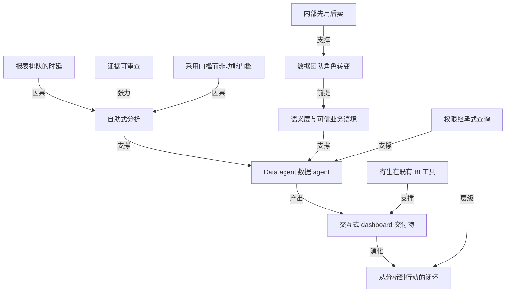

# ChatGPT Work 加了一个会做数据分析的 agent

- 原文标题：Now everyone can put data to work | OpenAI
- 作者：OpenAI
- 内参日期：2026-09-11
- 来源类型：blog
- 原文：https://openai.com/index/put-data-to-work/
- 标签：OpenAI, agents, 企业 AI

> Data agent 连接公司数据源，用自然语言完成查询、找变化、生成可分享的交互式仪表盘。企业 BI 的入口从「找会写 SQL 的人」挪到了对话框，值得关注的是它怎么处理权限与口径一致性。

## 导读

ChatGPT work 增加数据分析 agent

## 核心观点

- OpenAI 在 ChatGPT Work 里推出 Data agent（数据 agent），定位是「让更多人自己回答数据问题」：它连接公司数据、调查发生了什么变化、构建可分享的交互式 dashboard，全程在一次对话里指挥与修正，不需要写查询语句，也不需要学一个新的分析工具。
- 文章开篇点的是组织病，不是技术病：每个业务里都有数据能回答的问题——销售为什么放缓、支出在哪里上涨、最大客户里哪些问题威胁续约、应该先修哪个——但拿到答案通常意味着等一份报表，或者拜托别人跑一次分析。
- 这次产品的关键不在「自然语言问数据」这个动作本身，而在两个底座：一是接企业已经沉淀好的业务语境（业务术语、指标定义、自定义计算、数据关系），二是查询强制继承所连接账号的既有权限，直到表、行、列级别。
- 交付物不止是答案。分析可以变成带可视化的交互式 dashboard，团队可以编辑、分享、刷新；还能直接落到既有 BI 工具里；再往前一步是推荐下一步动作、指出需要谁参与，并通过 Slack 或邮件分享结论、在你批准后经由已连接工具执行动作。
- OpenAI 明确说这是内部先用后卖：Data agent 背后的能力在公司内部广泛使用，几乎全部产品团队、三分之二以上的 GTM 组织用数据 agent 自己分析公司数据；使这件事成立的是数据团队先建了共享业务定义、访问规则和敏感数据护栏。

## 问题：答案与提问者之间隔着一道队列

- 文章列举的是最日常的一类业务问题：为什么销售放缓（Why did sales slow down）、支出在哪里上涨（Where is spending rising）、最大客户里哪些问题威胁续约、应该先修什么。
- 这些问题本来都有数据可以回答，卡点在链路：拿到答案往往意味着「等一份报表，或者请别人跑一次分析」（waiting for a report or asking someone else to run the analysis）。
- MongoDB 的表述把这个时延讲得最直白：客户最重要的数据在 Atlas 里实时更新，每一笔订单、每一次会话、每一个事件即时落库；与其「等一份用昨天的数字做出来的报表」，不如让任何人用大白话提问，拿到基于此刻真实情况的答案。
- ClickHouse 的角度是覆盖面：把实时分析放到所有业务用户面前，无论他们做的是大决策还是小决策。

## 底座之一：连接可信的数据与业务语境

- **数据源**：Data agent 连接经过批准的数据源，包括 Amazon Redshift、Datadog、Google BigQuery、ClickHouse、Databricks、MongoDB、Snowflake 等；也能把 Google Drive 和 SharePoint 里的文件与文档纳入分析。
- **业务语境**：它使用组织自己的业务术语、指标定义、自定义计算和数据关系来解释数据。这些语境来自语义层与可信来源——Databricks Genie Ontology、dbt、GitHub、Snowflake Horizon 以及 BI dashboards。
- 这是文章里最容易被略过、却决定成败的一段：同一个指标在不同部门口径不同，没有语义层的「自然语言问数据」越流畅越危险。
- **平台方的说法各有侧重**：
- AWS（Naresh Chainani，工程总监）：用户可以直接连 Amazon Redshift，探索数据、发现洞察就像问一个问题那样容易。
  - Databricks（Ken Wong，产品管理高级总监）：数以千计的组织依靠 Genie 在企业数据上给出可信答案，Genie 拥有「从数据走到洞察」所需的丰富语境。
  - Snowflake（Umesh Unnikrishnan）：客户已在 Snowflake 里建好可信的企业数据与语境基座；员工可以调用这些数据和访问控制来调查业务问题，团队在任何地方工作都共享同一套受治理的业务理解。
  - G2（Godard Abel，CEO 兼联合创始人）：把经核实的用户评论、买家意向信号和市场情报带进团队做决策的工作流。
- **治理边界**：企业管理员决定哪些数据连接可用、哪些角色可以使用；查询强制执行所连接账号的既有权限，包括表、行、列级别的限制。

## 底座之二：从问题到分析，再到行动

- **追问与验证**：可以持续追问来调查结果，并查看每个结论背后的证据（review the evidence behind each finding）。
- **交付为 dashboard**：把分析变成带内置可视化的交互式 dashboard，团队可以按需编辑、分享和刷新；提供品牌规范后，输出还能贴合组织的视觉风格。
- **示例用法**：文中给的 prompt 是——做一个追踪产品采用的 dashboard，从安装、首次使用到持续活跃与留存，帮我们找到用户卡在哪里。
- **落进既有 BI 工具**：Data agent 还能在 Omni、Oracle BI、Power BI、Sigma、Tableau、ThoughtSpot 里构建并操作 dashboard，用大白话在团队已经在用的工具里指挥工作。
- Tableau（Southard Jones，EVP 兼首席产品官）：把可信的业务语义带到员工已经工作的地方，答案与团队依赖的同一套数据模型对齐；用户可以提问、查证据，并把新视图直接发布回 Tableau。
  - Power BI（Bogdan Crivat，微软 Fabric 公司副总裁）：Power BI 的可信语义层被数十万家企业使用，现在用户多了一个选项——只要描述业务问题就能生成 dashboard。
  - Sigma（Hassen Karaa，产品高级副总裁）：客户用 Sigma 做收入预测和运营规划，是因为背后的指标、工作簿与分析是受治理且共享的；接入之后，「最快能提问的地方」同时也成了「答案有语义支撑的地方」。
  - ThoughtSpot（Bhargav Addala）：业务用户拿到基于他们本来就信任的定义的受治理答案，开发者则能从一句 prompt 出发交付可用的嵌入式分析应用。
- **闭环到行动**：可以让 ChatGPT Work 推荐下一步、指出需要谁参与；它能通过 Slack 或邮件分享结论，并在你批准后经由已连接的工具执行相应动作。

## 内部先用后卖：OpenAI 自己怎么用

- Data agent 背后的能力在 OpenAI 内部被广泛使用：几乎全部产品团队、三分之二以上的 GTM 组织用 ChatGPT Work 里的数据 agent 自己分析公司数据。
- 让这件事成立的是数据团队的前置工作：创建共享的业务定义、设定访问规则、为敏感数据建立护栏。
- Alpha 项目参与方包括 NTT Data、Thermo Fisher、ServicePiston 等，用途集中在分析销售与支出、抓出报表里的错误、决定追哪些机会以及如何配置人手。
- **客户案例里最有信息量的几条**：
- NTT DATA（Yuji Shono，全球 AI 办公室负责人）：过去 dashboard 难以在组织内铺开，卡在许可成本、投入精力和技术门槛；现在大量非工程人员，尤其是销售与职能部门，能用大白话自己构建和更新 dashboard。
  - ServiceTitan（Ankur Bhatt，工程副总裁）：用它做的 dashboard 显示，AI 助手 Atlas 的使用者发起营销活动的频率大约是非使用者的三倍；这个发现正在推动他们简化上手流程、提升采用率。
  - Zipline（Ryan Oksenhorn，联合创始人）：早期测试中它浮出了一些深刻发现，换成他们最好的人去挖数据也要花几个小时。
  - micro1（Carlos Arroyo）：运营团队用大白话自己搭 dashboard，半小时内重建了绩效追踪看板，同时抓出了原版里的错误。
  - CookUnity（Dave Senior，应用 AI 负责人）：增长团队靠提问就构建并打磨出旺季转化 dashboard，结果与内部报表做了核对，缩短了季节性获客预算的规划时间。
  - Empower（Tori Langlois）：把组织数据与 AI 使用数据合并，挖出采用趋势；让他们印象最深的是它处理自由文本调研回答的能力，浮出了原本需要大量人工才能整理的用例与洞察。
  - Piston（Shivam Shah，联合创始人兼 COO）：领导层用它理解业务的每个部分——销售漏斗、Intercom 工单量、Brex 卡支出，每位负责人都能快速搭自定义视图。
  - Doeren Mayhew（Paul Griz，IT 高级经理）：两天之内，市场与财务的不同团队都在用它把原始数据变成为各办公室定制的交互式 dashboard。
  - Turing（Usama Nadeem，高级数据科学家）：业务运营团队探索运营指标并持续追问，它浮出了变化背后的驱动因素，减少了人工报表、也帮助确定上手流程与客户满意度的改进优先级。
  - Unit8（Thanos Giannakopoulos）：用于理解哪些行业、客户和 AI 用例的需求最强，以及 pipeline 的变化如何与交付产能匹配。

## 怎么开始用

- Data agent 在 ChatGPT Work 的 Plugins 目录里显示为 Data；管理员可以通过 `Workspace settings > Plugins` 让它可用或直接为团队安装。
- 管理员同时可以启用并配置相关的数据源 plugin（如 Databricks、Snowflake），并管理谁可以使用它们。
- 若尚未安装，在 Plugins 目录里选择安装，完成账号连接步骤，然后用 `@Data` 开始对话提问。
- 官方给的三个入门 prompt 也透露了产品设想的典型场景：
- 诊断指标变化——诊断上周周活跃用户为什么变化，识别可能的驱动因素、与此前周期对比，并建议下一步该查什么。
  - 设计 KPI 框架——为新产品领域设计一套 KPI 框架，含主指标、驱动因素、护栏指标、目标值和数据校验需求。
  - 生成管理层汇报——把本月指标做成可直接给管理层看的更新，含实际值、对比、驱动因素、注意事项和建议动作。

## 概念网络

### 关键概念

#### Data agent（ChatGPT Work 数据 agent）

**context**：文章的主角，定位是「让更多人自己回答那些问题」（help more people answer those questions themselves）。它连接公司数据、调查发生了什么变化、构建可分享的交互式 dashboard，并支持在一次对话里指挥与修正分析，不写查询语句、不学新工具。

**费曼一下**：不是一个更聪明的查询框，而是一个能被派活的分析同事——你把业务问题丢给它，它自己去翻数据、找线索、做图表，你再基于它给的东西继续追问。

#### 自助式分析（把提问者和答案之间的队列拆掉）

**context**：原文的问题设定是，数据能回答的问题人人都有，但拿到答案往往意味着「等一份报表，或者请别人跑一次分析」。产品要消掉的正是这段等待。

**费曼一下**：过去公司里的数据是「点餐制」——你下单、厨房排队、菜端上来时你可能已经不饿了。自助式分析是把厨房开放给所有人，前提是配料和配方都已经标准化好。

#### 语义层与可信业务语境

**context**：Data agent 使用组织自己的业务术语、指标定义、自定义计算和数据关系来解释数据，这些语境来自语义层与可信来源：Databricks Genie Ontology、dbt、GitHub、Snowflake Horizon 与 BI dashboards。Databricks 的说法是 Genie 拥有「从数据到洞察」所需的丰富语境。

**费曼一下**：数据库里存的是数字，不是意思。「活跃用户」到底怎么算、「收入」含不含退款，这些约定写在语义层里。没有它，机器翻译出来的查询语法正确、口径全错。

#### 权限继承式查询

**context**：企业管理员决定哪些数据连接可用、哪些角色能用；查询强制执行所连接账号的既有权限，包括表、行、列级别的限制。Snowflake 的说法是员工调用的是数据与访问控制本身，团队在任何地方都共享同一套受治理的业务理解。

**费曼一下**：agent 不是拿一把万能钥匙去查库，它借的是你本人的门禁卡——你原本看不到的行和列，换成对它提问也照样看不到。安全模型没有被绕开，而是被复用。

#### 交互式 dashboard 作为交付物

**context**：分析可以变成带内置可视化的交互式 dashboard，团队能编辑、分享、刷新；提供品牌规范后输出还能贴合组织视觉风格。多家客户描述的成果都是「搭出/重建了一个看板」，而不是「得到一个答案」。

**费曼一下**：一次性的回答用完即弃，看板是可以长期挂着的资产。区别在于前者只服务提问的那一刻，后者服务此后每一次刷新。

#### 证据可审查

**context**：原文明确写到可以追问以调查结果，并「查看每个结论背后的证据」。客户侧的呼应是 CookUnity 把结果与内部报表做了核对，micro1 在半小时重建看板的同时抓出了原版里的错误。

**费曼一下**：当答案变得极其便宜，稀缺的就变成了验证。能一层层翻到底层数据的证据链，是这类工具能不能被当真的分界线。

#### 从分析到行动的闭环

**context**：产品不止步于给出结论——可以让它推荐下一步、指出需要谁参与，通过 Slack 或邮件分享发现，并在你批准后经由已连接工具执行动作。

**费曼一下**：分析的价值从来不在报告本身，而在报告之后有没有人动。把「发给谁、做什么」也拉进同一个对话，是把认知产出直接接到执行上，人只保留批准这一步。

#### 寄生在既有 BI 工具之上

**context**：Data agent 能在 Omni、Oracle BI、Power BI、Sigma、Tableau、ThoughtSpot 里构建并操作 dashboard。Tableau 强调答案与团队依赖的同一套数据模型对齐、新视图可直接发布回去；Sigma 说「最快能提问的地方」现在同时也是「答案有语义支撑的地方」。

**费曼一下**：不要求企业换掉已经买了多年的分析平台，而是长在它们上面。这比另起炉灶的替代路线阻力小得多——存量投资不作废，反而成了语义资产。

#### 数据团队的角色转变

**context**：OpenAI 内部几乎全部产品团队、三分之二以上的 GTM 组织自己分析数据；使之成立的是数据团队先做了三件事——创建共享业务定义、设定访问规则、为敏感数据建立护栏。

**费曼一下**：数据团队从「答案的出口」变成「口径的作者」。从每天回答一百个问题，变成把定义写清楚一次，让一百个人自己去问。这是典型的杠杆转移。

#### 内部先用后卖（用自家工作方式打磨产品）

**context**：文章专设一节说明产品「建立在我们自己在 OpenAI 分析数据所用的工具之上」，并给出内部渗透率数字与实践文章、webinar 链接作为佐证。

**费曼一下**：先把工具用在自己身上，遇到的坑就是客户会遇到的坑。内部渗透率被当成可信度证据来讲，本身就是一种产品主张：我们敢用，你才敢用。

#### 采用门槛而非功能门槛

**context**：NTT DATA 的表述点破了 BI 长期没铺开的真实原因——许可成本、投入精力和技术门槛，让 dashboard 难以在组织内扩展；破局的标志是非工程人员（尤其销售与职能部门）能自己构建和更新看板。

**费曼一下**：企业软件失败常常不是因为做不到，而是因为没人能顺手用。把门槛从「会写查询」降到「会说人话」，改变的是使用人数，而使用人数才是价值的乘数。

### 概念网络

- **核心链条**：报表排队的时延是起点问题，自助式分析是给出的解法，Data agent 是这个解法的载体。整篇文章的论证顺序就是这条链——先讲「等报表」的痛，再讲产品，最后用内部与客户数据证明解法成立。
- **两个底座并联支撑主角**：语义层与可信业务语境负责「答得对」，权限继承式查询负责「不该看的看不到」。二者缺一，自助式分析都不成立——前者缺失会产出口径错误的流畅答案，后者缺失则让自助变成数据泄露。原文把它们放进同一节（连接可信数据与业务语境）并以治理段收尾，是有意为之的配对。
- **交付物的三方关系**：Data agent 产出交互式 dashboard，而寄生在既有 BI 工具之上是让这个产出能落地的通道——不要求企业换平台，dashboard 直接发布回 Tableau、Power BI 等；dashboard 再往前演化成从分析到行动的闭环（推荐下一步、指出参与者、经审批执行）。这三者是同一条产出链上的递进，不是并列功能。
- **一处真实张力**：证据可审查与自助式分析互为制衡。自助把答案变便宜，而便宜的答案天然带来「是否可信」的问题；客户案例里的核对内部报表、抓出原版错误，正是这道张力的现场证据。文章没有把它写成矛盾，但两条线索并存本身说明：越自助，越需要能翻到底层的证据链。
- **让底座成立的前置条件**：数据团队角色转变是语义层的前提——共享业务定义、访问规则、敏感数据护栏不会自己长出来，必须有人先做。而内部先用后卖是这条经验的来源与背书：OpenAI 先在自己身上跑通了这套前置工作，才有内部渗透率可以拿出来讲。
- **价值的乘数在采用侧**：采用门槛而非功能门槛与自助式分析构成因果关系。BI 工具的能力早就够用，卡住的是许可成本、精力与技术门槛；把门槛降到「会说人话」，使用人数才涨得起来，而使用人数是整套价值的乘数。这解释了为什么文章反复强调非工程人员、大白话、无需学新工具。
- **权限与行动的层级约束**：权限继承式查询不只约束读，也约束写——闭环里的「经你批准后执行动作」与「管理员决定哪些角色可用」是同一套治理在输入侧和输出侧的两次落点。

## 费曼 x3

企业里最贵的不是算力，是排队。想知道上周活跃用户为什么掉了，最快的路径往往是给数据同事发条消息，然后等。等的过程里，问题的紧迫感一点点消散；等报表回来，决策的窗口常常已经关上。与其等一份用昨天的数字做出来的报表，不如直接开口问——这句话说的不是速度，是提问者和答案之间那段被组织结构撑开的距离。

把自然语言翻成查询语句这件事，过去十年反复有人做，都没真正推开。原因不在语言，在语境。同一个「活跃用户」，市场部和财务部的算法不一样；同一张表，有人能看全部行，有人只能看自己区域。一个不懂这些的翻译器，答案越流畅越危险。所以这次真正值得看的不是问答本身，而是它接的东西：业务术语、指标定义、自定义计算、数据关系，全部来自企业已经沉淀好的语义层与可信来源；而查询强制执行所连接账号的既有权限，一路收窄到表、行、列。换句话说，它没有绕过治理，它长在治理上面。

这就把数据团队的活儿换了个方向。让内部几乎全部产品团队和三分之二以上的 GTM 组织能自己分析数据的，不是模型变强，是数据团队先去创建了共享的业务定义、设定了访问规则、给敏感数据加了护栏。团队不再是答案的出口，而是口径的作者。从每天回答一百个问题，变成把定义写清楚一次，让一百个人自己去问——杠杆转移通常长这样。

但别把「问一句就有答案」当终点。最有说服力的细节藏在一条客户反馈里：运营团队半小时重建了绩效追踪看板，同时抓出了原版里的错误。这句话同时说明两件事——快是真的快，原来那套东西也是真的会错。所以「查看每个结论背后的证据」不是可有可无的功能，它是这套东西能不能被当真的分界线。当答案变得便宜，稀缺的那一环就轮到验证了。

## 阅读原文

September 10, 2026

[Product](https://openai.com/news/product-releases/)

Meet the new Data agent in ChatGPT Work: turn your company’s data into answers, interactive dashboards, and action, just by asking.

[Install Data agent](https://chatgpt.com/plugins/Plugin/_fc9843a6fb34819195d6c7802398a8a7?q=data&openaicom-did=1cf21cb1-5dde-43b0-84a3-991dac0eeca9&openaicom%5C_referred=true) [Learn more](https://openai.com/business/solutions/data/)

Listen to article3:27

Share

People across every business have questions that data can answer. Why did sales slow down? Where is spending rising? Which issues threaten renewals in our largest accounts, and what should we fix first? Getting those answers often means waiting for a report or asking someone else to run the analysis.

We’re introducing a new [Data agent in ChatGPT Work⁠](https://chatgpt.com/plugins/Plugin/_fc9843a6fb34819195d6c7802398a8a7?q=data&openaicom-did=1cf21cb1-5dde-43b0-84a3-991dac0eeca9&openaicom%5C_referred=true) to help more people answer those questions themselves. It connects to your company data, investigates what changed, and builds interactive dashboards you can share. Direct and refine the analysis in one conversation, without writing queries or learning a new analytics tool.

00:00

### Connect to the company data and context your business trusts

The Data agent connects to approved data sources including Amazon Redshift, Datadog, Google BigQuery, ClickHouse, Databricks, MongoDB, Snowflake, and more. It can also bring files and documents from Google Drive and SharePoint into the analysis.

It uses your organization’s business terms, metric definitions, custom calculations, and data relationships to interpret the data. This context comes from semantic layers and trusted sources such as Databricks Genie Ontology, dbt, GitHub, Snowflake Horizon, and BI dashboards.

Platform partners

1 of 6

> “With the Data agent in ChatGPT Work, users can connect directly to Amazon Redshift, making it as easy as asking a question to explore data, surface insights, and make faster decisions across their organization.”

—Naresh Chainani, Director of Engineering, AWS

> “Connecting ClickHouse to the Data agent in ChatGPT Work puts real-time analytics in front of all business users making decisions big or small.”

—Ryadh Dahimene, Director of Product Management, ClickHouse

> “Thousands of organizations rely on Databricks Genie to deliver trusted answers on their enterprise data. Genie has the rich context for bridging the gap from data to insights. We are thrilled to partner with OpenAI to make it easy for all ChatGPT users to tap into Genie’s data intelligence.”

—Ken Wong, Senior Director, Product Management, Databricks

> “Our customers have built a trusted foundation for enterprise data and context in Snowflake. With the Data agent in ChatGPT Work, employees can tap into that data and access controls to investigate business questions—while OpenAI models simultaneously bring intelligence to experiences like Snowflake CoCo and CoWork. Teams share a common, governed understanding of their business wherever they choose to work.”

—Umesh Unnikrishnan, Head of Developer Experiences, Snowflake

> “Our customers’ most important data lives in Atlas, updating in real time as their business runs—every order, every session, every event landing as it happens. Now the Data agent in ChatGPT Work can reach that data directly, so instead of waiting on a report built from yesterday’s numbers, anyone can ask a plain-language question and get an answer grounded in what’s happening right now.”

—Pablo Stern, Chief Product Officer, AI and Emerging Products, MongoDB

> “G2’s trusted B2B software data with the Data agent in ChatGPT Work helps teams understand buyer needs, competitive dynamics, and emerging trends. It brings insights from verified customer reviews, buyer intent signals, and market intelligence directly into the workflows where teams make decisions.”

—Godard Abel, CEO and co-founder, G2

- AWS
- ClickHouse
- Databricks
- Snowflake
- MongoDB
- G2
- AWS
- ClickHouse
- Databricks
- Snowflake
- MongoDB
- G2
Enterprise administrators choose which data connections are available and which roles can use them. Queries enforce the connected account’s existing permissions, including table, row, and column restrictions.

### Turn questions into analysis and action

Ask follow-up questions to investigate the results and review the evidence behind each finding.

Turn the analysis into an interactive dashboard with built-in visualizations. Your team can edit, share, and refresh it as needed. Share your brand guidelines to tailor outputs to your organization’s look and feel.

Follow the customer journey from installation and first use to ongoing activity. Find where customers get stuck and uncover opportunities to improve adoption.

**Prompt: **Create a dashboard tracking adoption of our product—from installation and first use to ongoing activity and retention. Help us find where customers get stuck.

The Data agent can also build and interact with dashboards in Omni, Oracle BI, Power BI, Sigma, Tableau, and ThoughtSpot. Direct the work in plain language in the tools your team already uses.

BI tools

1 of 4

> “Connecting Tableau with ChatGPT Work brings trusted business semantics into a place employees already work, so the answers they get are grounded in the same data model their teams rely on. Users can easily transform insights into action by asking questions, exploring evidence, and publishing new views directly to Tableau using built-in design and analytics best practices.”

—Southard Jones, EVP & Chief Product Officer, Tableau

> “Power BI helps people make better decisions with a trusted semantic layer used by hundreds of thousands of enterprises. With the Data agent in ChatGPT Work, users have a new option to create Power BI dashboards by simply describing their business questions, making it easier for more people to understand their data and act on it.”

—Bogdan Crivat, Corporate Vice President, Microsoft Fabric

> “Our customers use Sigma for revenue forecasts and operational planning because the metrics, workbooks, and analysis behind them are governed and shared. Bringing that into ChatGPT Work means the fastest place to ask a question is now also the place where answers are grounded in semantics.”

—[Hassen Karaa⁠](https://www.linkedin.com/in/hkaraa/), SVP of Product, Sigma

> “Analytics should work where your teams work. With the Data agent in ChatGPT Work, teams can build ThoughtSpot AI analytics in minutes using natural language. Business users get governed answers based on definitions they already trust, while developers ship working embedded analytics apps from a single prompt.”

—Bhargav Addala, SVP, Product Management, ThoughtSpot

- Tableau
- Microsoft Power BI
- Sigma
- ThoughtSpot
- Tableau
- Microsoft Power BI
- Sigma
- ThoughtSpot
Ask ChatGPT Work to recommend next steps and identify who needs to be involved. It can share the findings through Slack or email and carry out the actions you approve through connected tools.

### Built from the tools we use to analyze data at OpenAI

We use the capabilities behind the Data agent broadly across OpenAI. Nearly all of our product team and over two-thirds of our GTM organization use data agents in ChatGPT Work to analyze company data themselves. Our data team made this possible by creating shared business definitions, setting access rules, and putting safeguards in place for sensitive data. Learn more by reading this [post⁠](https://www.linkedin.com/pulse/inside-openai-how-our-data-team-uses-ai-move-faster-vijaye-raji-a0vcc/) and attending our [webinar⁠](https://webinar.openai.com/chatgpt-work-series/data-analytics/).

NTT Data, Thermo Fisher, ServicePiston, and other organizations in our Alpha program are using the Data agent in ChatGPT Work to analyze sales and spending, catch reporting errors, and decide which opportunities to pursue and how to staff them.

Customer examples

1 of 11

> “At NTT DATA, licensing costs, effort, and technical expertise have made it difficult to expand the use of dashboards across our organization. With the Data agent in ChatGPT Work, many non-engineers, particularly in sales and corporate functions, have been able to build and update their own dashboards using plain language.”

—Yuji Shono, Head of Global AI Office, NTT DATA Group

> “At Thermo Fisher Scientific, we’re using the Data agent in ChatGPT Work with data from our existing environment to help our teams prepare more effectively and to identify opportunities with our supply base. We see potential for clearer analysis and better-informed decisions that can help us better serve customers.”

—Bharadwaj Ramachandran, Senior Manager AI Solutions

> “At ServiceTitan, we used the Data agent in ChatGPT Work to build a dashboard showing that users of Atlas, our AI sidekick, launched campaigns at roughly three times the rate of nonusers. That finding is helping us simplify onboarding and help more customers adopt Atlas.”

—Ankur Bhatt, VP Engineering, Agent OS and Applied AI, ServiceTitan

> “At Zipline, we’re using the Data agent in ChatGPT Work to explore our company data and build dashboards just by asking in natural language. In early testing, it surfaced profound findings that would have taken one of our best people hours of digging through the data to uncover.”

—Ryan Oksenhorn, Co-founder, Zipline

> “At Empower, we used the Data agent in ChatGPT Work to combine organizational and AI usage data, uncover adoption trends, and do our own analysis. What impressed us was how easily it made sense of free-form survey responses, surfacing top use cases and insights that would otherwise have taken significant manual effort to uncover.”

—Tori Langlois, Innovation Lab Enablement Lead, Empower

> “Our leadership team used the Data Agent in ChatGPT Work to better understand every part of our business—from analyzing the sales funnel and Intercom ticket volume to reviewing Brex card spend. Each leader could quickly build custom views and dig deeper into the trends that mattered most.”

—Shivam Shah, Co-founder and COO, Piston

> “Within two days, different teams across marketing and finance were using the Data agent in ChatGPT Work to turn raw data into interactive dashboards tailored to each office. It’s made sophisticated reporting more accessible, helping us deliver clear, shareable insights to leaders across the firm.”

—Paul Griz, Senior Manager, Information Technology, Doeren Mayhew

> “At CookUnity, our Growth team used the Data agent in ChatGPT Work to build and refine a high-season conversion dashboard just by asking. We checked the results against internal reports and cut the time needed to plan our seasonal acquisition spending.”

—Dave Senior, Head of Applied AI, CookUnity

> “At Turing, our Business Operations team used the Data agent in ChatGPT Work to explore operational metrics and ask follow-up questions. It surfaced drivers behind changes, helping us reduce manual reporting and prioritize improvements to onboarding and customer satisfaction.”

—Usama Nadeem, Senior Data Scientist, Turing

> “As an OpenAI evaluation partner, we’d already seen strong results from the Data agent in ChatGPT Work through our robust evaluations. Using it internally at micro1 gave us the chance to see that value firsthand. Our operations team built its own dashboards by asking questions in plain language, and in half an hour, rebuilt our performance tracking dashboards while catching errors in the original.”

—Carlos Arroyo, Strategic Project Lead at micro1

> “We use it to understand where demand is strongest across industries, accounts, and AI use cases, and how changes in our pipeline align with delivery capacity. Our business development and delivery leaders can edit, share, and refresh those scorecards to prioritize opportunities and match the right expertise to client needs.”

—Thanos Giannakopoulos, Tech Director AI&ML, Unit8

- NTT DATA
- Thermo Fisher Scientific
- ServiceTitan
- Zipline
- Empower
- Piston
- Doeren Mayhew
- CookUnity
- Turing
- micro1
- Unit8
- NTT DATA
- Thermo Fisher Scientific
- ServiceTitan
- Zipline
- Empower
- Piston
- Doeren Mayhew
- CookUnity
- Turing
- micro1
- Unit8

### Get started with the Data agent

You’ll find the Data agent listed as [Data⁠](https://chatgpt.com/plugins/Plugin/_fc9843a6fb34819195d6c7802398a8a7?q=data&openaicom-did=1cf21cb1-5dde-43b0-84a3-991dac0eeca9&openaicom%5C_referred=true) in the Plugins directory in ChatGPT Work. Administrators can make it available or install it for their teams through Workspace settings > Plugins. They can also enable and configure the relevant data-source plugins, such as Databricks and Snowflake, and manage who can use them.

If Data isn’t already installed, find it in the Plugins directory and select Install plugin, or go directly to the [Data listing⁠](https://chatgpt.com/plugins/Plugin/_fc9843a6fb34819195d6c7802398a8a7?q=data&openaicom-did=1cf21cb1-5dde-43b0-84a3-991dac0eeca9&openaicom%5C_referred=true). Complete any required account-connection steps, then start a conversation with @Data and ask your business question.

### Try these prompts

[Diagnose a metric change@Data Diagnose why weekly active users changed last week. Identify likely drivers, compare against prior periods, and recommend the next checks.](https://chatgpt.com/?prompt=%40Data%20Diagnose%20why%20weekly%20active%20users%20changed%20last%20week.%20Identify%20likely%20drivers%2C%20compare%20against%20prior%20periods%2C%20and%20recommend%20the%20next%20checks.&openaicom-did=1cf21cb1-5dde-43b0-84a3-991dac0eeca9&openaicom%5C_referred=true) [Design KPI framework@Data Design a KPI framework for this new product area with primary metrics, drivers, guardrails, targets, and data validation needs.](https://chatgpt.com/?prompt=%40Data%20Design%20a%20KPI%20framework%20for%20this%20new%20product%20area%20with%20primary%20metrics%2C%20drivers%2C%20guardrails%2C%20targets%2C%20and%20data%20validation%20needs.&openaicom-did=1cf21cb1-5dde-43b0-84a3-991dac0eeca9&openaicom%5C_referred=true) [Create leadership readout@Data Turn this month’s metrics into a leadership-ready update with actuals, comparisons, drivers, caveats, and recommended actions.](https://chatgpt.com/?prompt=%40Data%20Turn%20this%20month%E2%80%99s%20metrics%20into%20a%20leadership-ready%20update%20with%20actuals%2C%20comparisons%2C%20drivers%2C%20caveats%2C%20and%20recommended%20actions.&openaicom-did=1cf21cb1-5dde-43b0-84a3-991dac0eeca9&openaicom%5C_referred=true)

### Keep reading

[View all](https://openai.com/news/)

[GPT-6 Astra: The next generation in intelligence for workProductSep 9, 2026](https://openai.com/index/gpt-6-astra-next-generation-work/)

[Introducing ChatGPT Images 2.5ProductSep 8, 2026](https://openai.com/index/introducing-chatgpt-images-2-5/)

Your browser does not support the video tag.

[GPT-6 Astra: A new generation of intelligenceResearchSep 3, 2026](https://openai.com/index/gpt-6-astra/)
