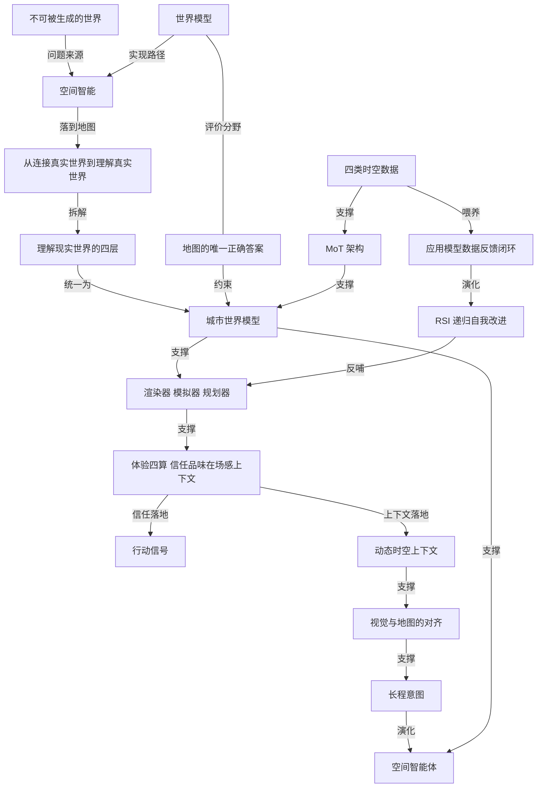

# 晚点长报道：高德要做真实世界里的下一代 AI

- 原文标题：高德，做真实世界里的下一代 AI
- 作者：晚点LatePost
- 内参日期：2026-09-11
- 来源类型：blog
- 原文：https://www.latepost.com/news/dj_detail?id=3721
- 标签：具身智能, 商业

> 十亿级用户的地图产品押注空间智能，把自有时空数据——二维路网、三维结构、时间变化、人流动线——组织成 AI 可用的现实世界表示，让 AI 从生成语言转向执行动作。中文互联网里少见的、把「AI 进入物理世界」写到产品与数据层的长报道。

## 导读

高德地图、AI

## 核心观点

- AI 花了几年时间学会流畅地谈论世界，现在它要面对一件困难得多的事：真正进入世界。让大模型制定一份周末计划并不难，几秒钟推荐十家餐厅、概括网友评价、生成一条看起来井井有条的路线；但人一旦真的走出家门，问题就变了——推荐的店今天是否营业、现在过去会不会排队、车应该停在哪里、从地铁站的哪个出口出来、地图上的入口是否正在施工。
- 这些问题很难仅靠语言回答，因为现实世界不是一份已经写完、等待模型总结的文本。道路会拥堵，商户会迁移，人流会聚散，天气和时间会改变同一个地点的状态；人的每一次选择，又会把这个世界推向不同的下一刻。
- 空间智能因此成为语言模型之后的下一个问题。李飞飞的说法是，空间智能是人类认知的基础架构，它不只关乎识别物体、理解环境、判断距离与方向，也支撑人在现实世界中的感知、推理、规划和行动。如果大语言模型是第一阶段人工智能的突破，空间智能可能是接下来更重要的难题。
- 高德的差异化判断是：不从零生成一个世界，而是理解一个已经存在、持续变化、每天都有大量真实行动发生的世界。它的问题不是「一个地方可以被生成成什么样」，而是「它此刻究竟是什么状态、接下来可能发生什么、用户应该如何行动」。
- 落到用户侧，空间智能的体感不再是更多的信息本身，而是更贴近当下处境的体验判断和行动安排——郭宁把它拆成四件要计算的事：信任、品味、在场感、上下文。
- 终局指向一个空间智能体：始终知道「你在哪里、准备做什么、接下来可能遇到什么」，用户从「发出一连串短指令」转向「交付一个长程意图」。

## 当 AI 面对一个不可被生成的世界

- 大语言模型的训练目标相对明确：根据前文预测下一个词，互联网上规模庞大的文本提供了现成的训练材料。现实世界没有这样统一、清晰的数据形式。
- 机器要跨过的门槛是层层加码的：
- 不仅要识别物体，还要理解物体之间的距离、方向和遮挡关系。
  - 不仅要看见眼前的画面，还要记住空间的结构，判断时间和行动将如何改变它。
  - 场景从一间房扩展到一条街、一座城市时，建筑、道路和地点构成三维空间，车流、人流、天气和营业状态又让这个空间时刻发生变化。机器需要理解的不只是「这里有什么」，还有「现在发生了什么」「接下来可能发生什么」。
- 世界模型由此成为实现空间智能的一条重要技术路径：让 AI 在内部形成一个关于外部世界的模型，用来表达空间、模拟变化、规划下一步行动。二者的关系是——空间智能是希望机器获得的一种能力，世界模型是实现这种能力的方法之一。
- 围绕同一目标，不同公司选择了不同的入口：
- World Labs（李飞飞创立）从三维空间的生成与重建出发。2025 年推出的 Marble 可以根据文字、图片、视频或粗略的三维结构，生成一个可供进入、探索和编辑的三维世界；2026 年 9 月 1 日发布的新一代世界模型 Atlas，把文字、图片、视频和三维信息放入同一个空间上下文，可以生成新的观察视角、重建现实场景，并模拟空间随时间发生的变化。
  - Google DeepMind 的 Genie 3 是另一种形态：根据文字描述实时生成一个能被探索和操控的环境；智能体在其中移动时，模型需要持续生成世界的下一帧，记住已经经过的场景，并根据动作模拟环境将如何变化。
  - 英伟达的 Cosmos 更直接服务于机器人和自动驾驶等物理 AI，可以生成不同天气、光照、道路状况和突发事件下的未来场景。现实中罕见、昂贵甚至危险的情况，可以先在模型生成的世界里反复发生。
- 高德走的是另一种技术范式。如果把三维生成、Robotaxi 和具身智能等业务全部计算在内，它的技术体系同样涉及世界的表达、模拟和行动规划；但它强调的空间智能，重心不是从零生成一个世界，而是理解一个已经存在、持续变化的世界。
- 这与积累有关：与人工智能实验室不同，高德是一个 10 亿级用户的 C 端产品，拥有一套关于现实世界的长期记录——道路如何连接，建筑和商户在哪里，交通怎样变化，人们选择了什么目的地、沿哪条路线移动。
- 由此还带来了不同的评价标准：对于生成式世界模型，一个没有被拍到的空间可以存在多个合理答案；但对于地图和导航，现实中的正确答案通常只有一个。

## 地图凭什么站在入口处：从连接到理解

- 过去，地图负责记录地点和道路，导航负责计算从 A 点到 B 点的路线。高德 CEO 郭宁把这两种能力概括为「连接真实世界」；进入 AI 时代，他希望做到的是「理解真实世界」。连接解决的是「世界如何抵达」，理解解决的是「世界真实是什么样、如何变化」。
- 郭宁把一家地图公司理解现实世界的能力拆成四层：
- 第一层，二维世界的连接关系。道路、地铁、步行网络、商场通道、停车场和建筑入口共同组成一张巨大的网络。一个地点不只是经纬度，而是它与周围空间的关系：连接哪条街，离哪个地铁口最近，从什么方向更容易进入，吃完饭之后还能顺路去哪里。
  - 第二层，三维空间。建筑的高度、道路的宽度、楼层关系、遮挡和景观朝向，让机器知道现实世界「长什么样」。地图由平面上的点和线，变成一个可以从不同位置进入和观察的立体空间。
  - 第三层，时间。同一家餐厅在工作日下午和周末晚上可能处于完全不同的状态；同一条道路在早晚高峰、雨天和节假日也会呈现不同的通行效率。加入时间之后，地图表达的不再是静态空间，而是一个持续变化的时空系统。
  - 第四层，现实世界中的「流」。人在移动，汽车在移动，城市的活跃区域也在不断转移。人流、车流、搜索、导航、到访和停留，让高德不仅能观察空间本身，也能看到人与空间如何发生关系。
- 四层形成一个逐步扩展的框架：二维网络呈现空间如何连接，三维数据补充世界的物理结构，时间让静态空间开始变化，人流车流和用户行动则呈现这个世界如何真实运转。郭宁的结论是，当这些被统一之后，「我们得到的不再是一张地图，而是一个能够进行预测和模拟的城市世界模型」。
- 这个类比重新定义了地图公司的能力边界：它不应只是一个保存道路和地点的数据库，还可以成为一个持续更新的模型，一个理解世界如何运转的入口。

## 技术体系：渲染器、模拟器、规划器与数据底座

- 高德空间智能技术负责人徐牧借用李飞飞对世界模型的划分——渲染器（Renderer）、模拟器（Simulator）、规划器（Planner）——解释体系内部的分工与协同：从呈现世界，到推演变化，再到指导行动。
- 渲染器负责高精度表达或生成可被观察的三维世界。近期落地的 ABot-World、ABot-Earth 系列模型正是这一能力的集中体现，支撑三维地图与飞行街景的立体化呈现。
  - 模拟器负责构建可计算、可交互的环境状态，比如模拟道路临时封闭后周边路网的拥堵如何传播，或不同疏导措施如何影响节假日期间商圈的人流分布。
  - 规划器结合环境观测、任务目标以及可用的状态预测与模拟结果，在环境与任务约束下生成行动方案。它既可以表现为面向普通人的出行路线推荐，也可以延伸至机器人的自主导航与物理操作。
- 支撑协同运转的是一套 MoT（Mixture of Transformers）架构，核心是兼顾模态内的专业化处理与模态间的信息融合，把多源数据转化为面向不同任务的综合表征。
- 在这之下是长期积累、覆盖广泛真实场景的时空数据。按徐牧的分类，数据有四种：
- 空间几何数据：描述地形、建筑与道路等物理环境的形态和结构。
  - 空间语义数据：描述道路的通行属性、地点的功能以及商户的服务信息。
  - 动态状态数据：描述人流、车流、交通状况及环境随时间的变化。
  - 行为交互数据：关联人在具体环境中的行动选择、移动过程与结果反馈。
- 四类数据共同构成了从空间结构，到环境变化，再到行动结果的多维数据基础。
- 数据之外的另一层壁垒是长期建立的数据和 AI 基础设施：当新的技术范式出现时，高德能依托成熟的数据采集与生产体系，快速获取、加工并组织适配新方法的海量高精度数据，并通过规模化训练、评估与部署能力，加速模型的研发和应用验证。
- 更关键的是应用、模型与数据之间形成的反馈闭环。高德的模型不是完成训练之后才去寻找使用场景——地图、导航、交通、本地生活和数字孪生等业务会持续产生新的需求、数据和反馈；新技术进入真实业务后，用户和客户的使用又会形成新的反馈，推动下一轮迭代。
- 以机器人导航为例：系统从复杂环境中的失败案例定位能力缺口，利用场景生成与仿真构建针对性数据，经训练、独立评估与真实环境验证，持续提升模型的泛化能力；改进后的模型又反过来增强场景生成与评估能力，为下一轮迭代创造更好的条件。
- 这种「能力提升推动改进过程升级」的机制，也为探索 RSI（Recursive Self-Improvement，递归自我改进）提供了基础，使空间生成、环境模拟与行动规划相互促进。

## 当空间智能进入真实生活：信任、品味、在场感、上下文

- 过去，地图通常从用户确定目的地之后才开始工作：先决定去哪里，再打开地图搜索路线。高德现在想向前、向后各走一步——在出发前帮助用户选择和判断，在路上根据现实变化调整行动，到达之后继续理解周围的空间。
- 在现实世界模型之上，郭宁认为还需要计算四件更接近用户体验的事：
- 信任：哪些地点、评价和推荐值得相信。
  - 品味：一个地方是否适合具体的人。
  - 在场感：让用户提前理解置身其中会有什么体验。
  - 上下文：在此时、此地和这段具体行程中，什么才是合适的选择。
- 扫街榜是这条链路的起点，先回答的不是「怎么去」而是「去哪里」，本质是解决一份榜单如何获得信任。
- 传统榜单主要依赖评分、评论和点击等线上信息；高德希望从用户在现实世界中的行动判断一家店是否真正值得前往。
  - 但一次到店本身也有不同含义：可能专程跨越半座城市去吃，也可能只是上班途中顺路经过；可能只去过一次，也可能住在附近、长期复购。
  - 2026 年，扫街榜把这些差异纳入算法：用「专程前往比例」区分专程到访和顺路经过，用「回头客比例」和「本地人比例」衡量复购及本地用户的长期选择。当真实到访和长期选择能够相互印证，推荐才更可信。
  - 边界也被点明：真实到店不天然等于真实口碑，商户的位置、交通便利程度和经营时间都会影响到访行为。扫街榜所做的是在单纯的流量之外增加更多现实信号，再把行动与评价结合起来。
- 在信任之上，扫街榜进一步理解品味。一家店是否值得去，并不是对所有人相同的答案。扫街榜 2026 引入专业评分：针对咖啡馆等专业性较强的榜单，行家的用脚投票获得更高的评分权重——同样是咖啡店，受到更多咖啡行家认可的，理应比大众连锁品牌获得更高评分。
- 飞行街景承担出发前的空间预览，对应「在场感」。第一代可以沿系统设定的路径从空中俯瞰街区、识别店铺门头，部分场景还能进入店内；2.0 把固定观看变成自由探索，用户可以调整位置、方向、高度和观察角度。它的意义不只是让地图更逼真：对陌生街区、景区或入口复杂的建筑，二维地图只能告诉你目的地在哪里，三维空间则让人提前想象「到了那里会是什么感觉」。
- 避雷指南主要解决「上下文」：综合营业时间、行程节奏、预计到达时间、天气、费用、顺路程度和停车等信息，对一次计划进行动态核验。一家店可能值得去、也可能符合品味，但如果抵达时已经停止营业，或路上耗时远超预期，这次推荐仍然没有完成任务。
- 真正进入行程之后，导航 Live 接手。高德导航产品负责人孙冲把导航的变化概括为四次演进：
- 第一次，从纸质地图到数字算法，学会静态寻路。
  - 第二次，从静态路网到实时人流，学会避开拥堵。
  - 第三次，从二维平面升级到三维孪生，学会看清世界。
  - 第四次，从指引一段路到接管一整天，学会陪伴生活。
- 变化首先体现在用户提出的问题上。「帮我找一家顺路的、人均 200 元以内的淮扬菜，到的时候还在营业」——一句话同时包含地点、价格、路线和时间条件。传统导航需要用户先搜索餐厅、逐家查看信息、再返回地图比较路线；导航 Live 试图持续保留这些条件，直接完成选择和规划。
- 它依赖一个不断更新的「动态时空上下文」：用户此刻在哪里，正沿着哪条路线移动，周围的道路和地点是什么状态，此前交代过什么任务，以及摄像头和语音正在输入什么信息。四件事在这里汇集到同一个产品中。
- 导航 Live 与普通视觉问答的主要差别在于对齐：通用视觉模型可以认出画面中有一栋大楼或一个路口，却未必知道它们在真实地图中对应哪个地点。导航 Live 需要把摄像头里的建筑、道路和入口，与用户的位置、方向、高德的路网和地点信息对应起来。经过这种对应，画面中的「那栋楼」才会成为地图上一个具体的商场，「旁边的小门」才会带有是否可以通行的属性——用户举起手机看到的现实空间，由此变成可以被搜索和导航的对象。

## 空间智能体：从短指令到长程意图

- 扫街榜、飞行街景、避雷指南和导航 Live 是高德空间智能目前的产品答案，把一次线下行动连接起来：信任帮助判断哪里值得去，品味让推荐更接近具体的人，在场感让人提前理解一个空间，上下文则决定此时应该怎样行动。但这显然不是终点。
- 如果能力继续发展，未来可能不再需要用户在榜单、街景、路线和导览之间来回切换。系统会持续理解同一个人的意图，以及他所在的时间、位置和环境，再根据现实变化调用不同能力。用户接触到的将不再是几个彼此独立的功能，而是一个始终知道「你在哪里、准备做什么、接下来可能遇到什么」的空间智能体。
- 郭宁更愿意把高德的变化理解为一次「能力范式的变化」，而不只是地图和导航的技术升级：
- 过去主要优化一个地点或一条路线；空间智能要解决的，是在具体的人、时间、位置、天气和偏好之下，判断什么选择更加合适。
  - 这意味着地点的价值不再是一个固定分数。系统不仅要知道「什么地方好」，还要判断「它现在是否适合这个人」。
  - 一次旅行或周末出行也不是十个彼此独立的地点。住在哪里、几点出门、走哪条路、在哪里停留、什么时候吃饭、离开之后去哪里，都会相互影响；前一个选择会改变后一个选择所处的时间、位置和状态。因此这些地点和行动最终需要作为一个连续序列来考虑，AI 给出的不只是一份目的地榜单或一条最快路线，而是一组能根据现实变化不断调整的行动建议。
- 孙冲把这种变化概括为：用户从「发出一连串短指令」，转向「交付一个长程意图」。当用户说「接下来两小时的行程你帮我盯好」，AI 需要记住此前提出的要求，理解当前的位置和状态，并在合适的时间处理沿途发生的变化——不必再把任务拆成搜索地点、查看营业时间、比较路线和寻找停车场等多个步骤。
- 产品角色也随之改变：它不再只是一个等待用户操作的工具，而更接近一个在现实世界中主动、持续工作的智能体。
- 这也打开了地图 App 之外的想象空间——成为真实世界里的下一代 AI。地点推荐、空间理解和行动规划，可以出现在汽车、智能手表、智能眼镜和机器人等不同终端上。设备形态可能变化，但背后的问题相同：让数字世界中的意图，能够在真实的物理世界中被执行。
- 风险与克制同时被提出：系统介入现实行动越深，对准确性和可信度的要求也越高。高德不仅需要让系统拥有更多能力，也要让它知道什么时候可以作出判断，什么时候应该保持克制。真实世界数据、地图体系和高频应用入口提供了独特起点，但这些优势能否被组织成稳定、可信、连贯的用户体验，仍然要通过一次次真实行动来检验。

## 概念网络

### 关键概念

#### 空间智能

**context**：全文的中心概念，由李飞飞的定义引入——空间智能是人类认知的基础架构，不仅关乎识别物体、理解环境和判断距离、方向等空间关系，也支撑人在现实世界中进行感知、推理、规划和行动。文章把它放在大语言模型之后，称为「接下来需要解决的更重要的问题、难题」。

**费曼一下**：语言智能是「会说」，空间智能是「会在场」。你闭眼也能摸黑走到自家卫生间，因为脑子里有一份关于房间的结构模型；机器要做同样的事，就得同时具备位置感、结构感和变化感，而不只是把世界描述得漂亮。

#### 世界模型

**context**：文中把世界模型定义为实现空间智能的一条重要技术路径——让 AI 在内部形成一个关于外部世界的模型，用来表达空间、模拟变化并规划下一步行动。原文明确区分二者：「空间智能是希望机器获得的一种能力，世界模型则是实现这种能力的方法之一。」

**费曼一下**：能力和方法不是一回事。想让机器「懂现实」是目标，在它脑子里装一个可推演的现实沙盘是手段。手段可以有很多种：有人从零生成沙盘，有人把真实世界搬进沙盘。

#### 不可被生成的世界

**context**：文章用来解释空间智能为何比语言建模难。大语言模型有明确目标（根据前文预测下一个词）和现成材料（互联网文本），而现实世界没有统一、清晰的数据形式；道路会拥堵、商户会迁移、人流会聚散，「人的每一次选择，又会把这个世界推向不同的下一刻」。

**费曼一下**：文本是一份写完了的稿子，模型只要学会接着往下写。现实是一场正在进行、并且因为你的参与而改变的球赛，没有剧本可背，只能边看边判断。

#### 地图的唯一正确答案

**context**：文中提出的评价标准分野——对于生成式世界模型，一个没有被拍到的空间可以存在多个合理答案；但对于地图和导航，现实中的正确答案通常只有一个。这条约束决定了高德与生成派公司在技术目标上的根本差异。

**费曼一下**：画一间没人见过的房间，怎么画都不算错；告诉别人这家店几点关门，答错就是答错。约束越硬，可容错的想象空间越小，对数据真实性的要求越高。

#### 从连接真实世界到理解真实世界

**context**：郭宁对高德能力升级的概括。过去地图负责记录地点和道路、导航负责算 A 到 B 的路线，这是「连接真实世界」；AI 时代要做到的是「理解真实世界」。他的区分是：连接解决「世界如何抵达」，理解解决「世界真实是什么样、如何变化」。

**费曼一下**：连接是给你一条路；理解是知道这条路此刻什么样、待会儿会变成什么样、对你合不合适。前者是查询，后者是判断。

#### 理解现实世界的四层

**context**：郭宁把地图公司理解现实世界的能力拆成二维连接关系、三维空间、时间、现实世界中的「流」四层。文中强调这是一个逐步扩展的框架：二维网络呈现空间如何连接，三维数据补充物理结构，时间让静态空间开始变化，人流车流和用户行动呈现世界如何真实运转。

**费曼一下**：先画出路网这张网，再给它加上高度和体积，再给它装上时钟，最后让人和车在里面跑起来。每加一层，地图离「现实」就近一步。

#### 城市世界模型

**context**：郭宁的原话——「当二维网络、三维空间、时间变化、人流、车流、导航行为被统一之后，我们得到的不再是一张地图，而是一个能够进行预测和模拟的城市世界模型」。文章据此重新定义地图公司的能力边界：不只是保存道路和地点的数据库，而是一个持续更新的模型、一个理解世界如何运转的入口。

**费曼一下**：把一张静态地图升级成一台城市模拟器。你不只是查它「有什么」，还能问它「如果封了这条路会怎样」。

#### 渲染器、模拟器、规划器

**context**：徐牧借用李飞飞对世界模型的三分法解释高德体系内部分工：渲染器负责高精度表达或生成可被观察的三维世界（ABot-World、ABot-Earth 系列支撑三维地图与飞行街景）；模拟器构建可计算、可交互的环境状态（如道路封闭后拥堵如何传播）；规划器结合环境观测与任务目标生成行动方案（从出行路线推荐延伸到机器人自主导航与物理操作）。

**费曼一下**：三件事按顺序排：先把世界画出来，再让它动起来，最后在动起来的世界里替你拿主意。缺任何一环，另外两环都不落地。

#### MoT 架构

**context**：Mixture of Transformers，文中描述为支撑高德空间智能体系协同运转的架构，核心是兼顾模态内的专业化处理与模态间的信息融合，将多源数据转化为面向不同任务的综合表征。

**费曼一下**：像一个专家团队：每个专家先在自己擅长的材料上把活干精（几何、语义、时序各有分工），再坐到一起把结论拼成一个共同判断。既不搞一刀切，也不各说各话。

#### 四类时空数据

**context**：徐牧对高德数据底座的分类——空间几何数据（地形、建筑、道路的形态与结构）、空间语义数据（道路通行属性、地点功能、商户服务信息）、动态状态数据（人流、车流、交通状况随时间的变化）、行为交互数据（人在具体环境中的行动选择、移动过程与结果反馈）。四者构成从空间结构到环境变化再到行动结果的多维基础。

**费曼一下**：地方长什么样、地方是干什么的、此刻发生了什么、人最后怎么选的。前三类描述世界，第四类是唯一能回答「这个判断对不对」的证据。

#### 应用—模型—数据反馈闭环

**context**：文中称为高德「更为关键」的壁垒。模型不是训练完再去找场景，地图、导航、交通、本地生活和数字孪生等业务持续产生新的需求、数据和反馈；新技术进入真实业务后，用户和客户的使用又形成新反馈，推动下一轮迭代。机器人导航案例给出完整回路：失败案例定位能力缺口，场景生成与仿真构建针对性数据，经训练、独立评估与真实环境验证提升泛化能力，改进后的模型又增强场景生成与评估能力。

**费曼一下**：模型跑在真业务里，就有源源不断的错题本；用错题造练习题，练完的模型又能出更好的练习题。闭环一旦转起来，数据优势会自己滚雪球。

#### RSI 递归自我改进

**context**：Recursive Self-Improvement。文章把它放在反馈闭环之后，称这种「能力提升推动改进过程升级」的机制为探索 RSI 提供了基础，使空间生成、环境模拟与行动规划相互促进，持续拓展空间智能的能力边界。

**费曼一下**：普通的进步是把产品做得更好，递归的进步是把「做得更好的方法」本身做得更好。第二种一旦成立，改进速度本身也在加速。

#### 体验四算：信任、品味、在场感、上下文

**context**：郭宁提出的、在现实世界模型之上需要计算的四件更接近用户体验的事。信任回答哪些地点、评价和推荐值得相信；品味回答一个地方是否适合具体的人；在场感让用户提前理解置身其中会有什么体验；上下文判断在此时、此地和这段具体行程中什么才是合适的选择。文中分别对应扫街榜、专业评分、飞行街景和避雷指南。

**费曼一下**：一次出门，其实要连着答四个问题：这信息靠谱吗、这地方合我吗、去了是什么感觉、现在去合适吗。传统地图只答了第四个问题的一半（怎么走），剩下的都甩给了用户自己。

#### 行动信号

**context**：扫街榜区别于传统榜单的核心方法。传统榜单主要依赖评分、评论和点击等线上信息，高德则从用户在现实世界中的行动判断一家店是否值得前往。2026 年扫街榜把到店行为的差异纳入算法：用「专程前往比例」区分专程到访和顺路经过，用「回头客比例」和「本地人比例」衡量复购及本地用户的长期选择。文中也标出边界——真实到店不天然等于真实口碑，位置、交通便利程度和经营时间都会影响到访行为。

**费曼一下**：说好话很便宜，专程跑一趟很贵。让人愿意花时间和路程去做的事，比他在评论区打的分更难造假。

#### 动态时空上下文

**context**：导航 Live 依赖的持续更新状态——用户此刻在哪里，正沿着哪条路线移动，周围的道路和地点是什么状态，此前交代过什么任务，以及摄像头和语音正在输入什么信息。它让一句「帮我找一家顺路的、人均 200 元以内的淮扬菜，到的时候还在营业」中的多个条件被持续保留，直接完成选择和规划。

**费曼一下**：相当于给助手一份一直在刷新的便签：你在哪、要去哪、刚才说过什么、眼前看到什么。有了这份便签，它才不用每次都从头问一遍。

#### 视觉与地图的对齐

**context**：文中点明的导航 Live 与普通视觉问答的主要差别。通用视觉模型可以认出画面中有一栋大楼或一个路口，却未必知道它们在真实地图中对应哪个地点；导航 Live 需要把摄像头里的建筑、道路和入口，与用户的位置、方向、路网和地点信息对应起来。经过对应，画面中的「那栋楼」成为地图上一个具体的商场，「旁边的小门」带上是否可以通行的属性。

**费曼一下**：认出「这是一栋楼」只是看见，知道「这是某某商场的西门、现在能走」才是认识。把像素挂到地图的实体上，画面才变成可以搜索和导航的东西。

#### 长程意图

**context**：孙冲对交互变化的概括——用户从「发出一连串短指令」转向「交付一个长程意图」。典型形态是「接下来两小时的行程你帮我盯好」：AI 需要记住此前提出的要求，理解用户当前的位置和状态，并在合适的时间处理沿途发生的变化，用户不必再把任务拆成搜索地点、查看营业时间、比较路线和寻找停车场等多个步骤。

**费曼一下**：以前你得当项目经理，把事情拆成一堆小任务逐个下达；现在你只交代目标和约束，剩下的拆解、盯梢和临时调整由对方负责。

#### 空间智能体

**context**：文章给出的终局形态——用户接触到的不再是榜单、街景、路线和导览几个彼此独立的功能，而是一个始终知道「你在哪里、准备做什么、接下来可能遇到什么」的空间智能体。产品角色随之从等待用户操作的工具，变成在现实世界中主动、持续工作的智能体，并可以出现在汽车、智能手表、智能眼镜和机器人等不同终端上。

**费曼一下**：从一个你打开才工作的 App，变成一个一直在旁边替你盯着现实的搭档。它的载体可能是手机、车机、眼镜甚至机器人，但要解决的问题是同一个：让数字世界里的意图在物理世界被执行。

#### 能力范式的变化

**context**：郭宁本人更愿意用的框架，而不是把高德的变化理解为地图和导航的技术升级。过去主要优化一个地点或一条路线；空间智能要解决的是在具体的人、时间、位置、天气和偏好之下判断什么选择更合适。由此地点的价值不再是一个固定分数，系统不仅要知道「什么地方好」，还要判断「它现在是否适合这个人」；一次出行也不是十个独立地点，而是相互影响的连续序列。

**费曼一下**：评分是给地方打的，推荐是给人打的。同一家店对不同的人、在不同的时刻，分数不该一样——这一步跨出去，优化对象就从「对象」变成了「人与对象在此刻的匹配」。

### 概念网络

全文的思想网络有一条清晰的主干：从「世界为什么难」出发，经由「一家地图公司凭什么答」，最终落到「用户会得到什么」。

**起点是一个否定性的前提。**「不可被生成的世界」是整篇文章的问题来源，它规定了空间智能不能沿用语言模型的路子——没有统一的数据形式，没有写完的文本，连正确答案的数量都不一样。世界模型与空间智能之间是方法与能力的层级关系，而「地图的唯一正确答案」与生成式路线构成一处明确张力：前者容不得多解，后者以多解为常态。这处张力不是修辞，它直接决定了高德把重心放在「理解一个已经存在的世界」而不是「生成一个新世界」。

**中段是一条纵向的建构链。**「从连接到理解」是意图声明，「理解现实世界的四层」是它的拆解，「城市世界模型」是四层被统一之后的产物——注意方向：四层不是并列的功能清单，而是逐级叠加的构造过程，二维给出连接、三维给出体积、时间给出变化、流给出人与空间的关系，缺任何一级，上一级的判断都会失真。城市世界模型往下分出渲染器、模拟器、规划器的能力三分，往上则直接支撑终局的空间智能体。

**底座与主干之间是供给关系，而不是并列关系。**四类时空数据供给 MoT 架构，MoT 架构支撑城市世界模型的多模态统一；同一批数据同时喂养应用—模型—数据反馈闭环，闭环进一步演化出 RSI，而 RSI 的产物又回头增强场景生成与评估能力——这是全网络中唯一一条回路，也是文章判断高德壁垒的关键所在：静态的数据量是存量优势，能自我加速的闭环才是增量优势。

**上层是体验的展开。**能力三分支撑「体验四算」，四算再分别落到具体机制：信任落到行动信号（专程前往、回头客、本地人三个比例），上下文落到动态时空上下文。动态时空上下文往上支撑视觉与地图的对齐——没有位置、方向和路网这层底，摄像头画面就只是画面而不是地点；对齐之后，用户才可能交付长程意图，而不必逐条下指令。长程意图与城市世界模型在空间智能体处汇合：前者提供交互形态的变化，后者提供支撑判断的世界表示，两条线缺一不可。

**还有一条隐含的张力贯穿始终。**「地图的唯一正确答案」既是高德的护城河，也是它的紧箍咒：系统介入现实行动越深，出错的代价越大。文章结尾提出的「什么时候可以作出判断，什么时候应该保持克制」，正是这条约束在能力扩张方向上的反作用力——网络中每多一条向下游延伸的边，这条反向的拉力就强一分。

## 费曼 x3

有一个反直觉的事实：让 AI 谈论世界的难度，和让它进入世界的难度，差着一个数量级。前者只需要把已经写完的文本接着写下去，后者要面对一个还在发生、并且因为你的参与而改变的现场。推荐十家餐厅、生成一条井井有条的路线，几秒钟就能办到；但「推荐的店今天是否营业」「从地铁站的哪个出口出来」「地图上的入口是否正在施工」，这些问题的答案不在任何一份可以被爬取的语料里。

真正的分水岭在于答案的数量。生成一个没人拍到过的房间，怎么生成都不算错，合理即可；告诉一个人此刻该往哪走，正确答案通常只有一个。这条约束看似是限制，实际是筛选器——它把「想象力」这种在生成式任务里最值钱的能力，一路贬值成负债，同时把长期、笨重、无法速成的现实记录抬成了硬通货。谁手里握着道路如何连接、商户在哪里、人们实际沿哪条路线移动的连续记录，谁才有资格回答这类只有唯一解的问题。

更值得琢磨的是「理解」这个词被怎样重新定义。连接解决的是世界如何抵达，理解解决的是世界真实是什么样、如何变化——二维的连接关系给出结构，三维给出体积，时间让静态空间开始变化，人流车流和真实到访则呈现这个世界如何运转。四层叠加之后，得到的不再是一张地图，而是一个能够进行预测和模拟的城市世界模型。这是一次视角的翻转：地图从一份被查询的档案，变成一台可以被追问「如果……会怎样」的模拟器。

而对普通人来说，这一切最终收敛成一句朴素的话：空间智能带来的不再是更多的信息本身，而是更贴近当下处境的体验判断和行动安排。信息过剩的时代，多给十条建议毫无价值，判断「此刻这条建议是否仍然成立」才有价值。一家店值得去、也符合你的口味，但你抵达时它已经打烊，这次推荐就没有完成任务。于是评价的对象悄悄从「地方」换成了「人与地方在此刻的匹配」——地点的价值不再是一个固定分数。

顺着这条线往前看，交互形态的变化几乎是必然的：从发出一连串短指令，到交付一个长程意图。「接下来两小时的行程你帮我盯好」，这句话背后是把拆解、盯梢和临时调整的责任整个让渡出去。这也是所有想进入物理世界的 AI 共同面对的考题——能力越往下游延伸，越要知道什么时候可以作出判断，什么时候应该保持克制。起点上的优势是真的，但它能否被组织成稳定、可信、连贯的体验，只能由一次次真实行动来检验。
