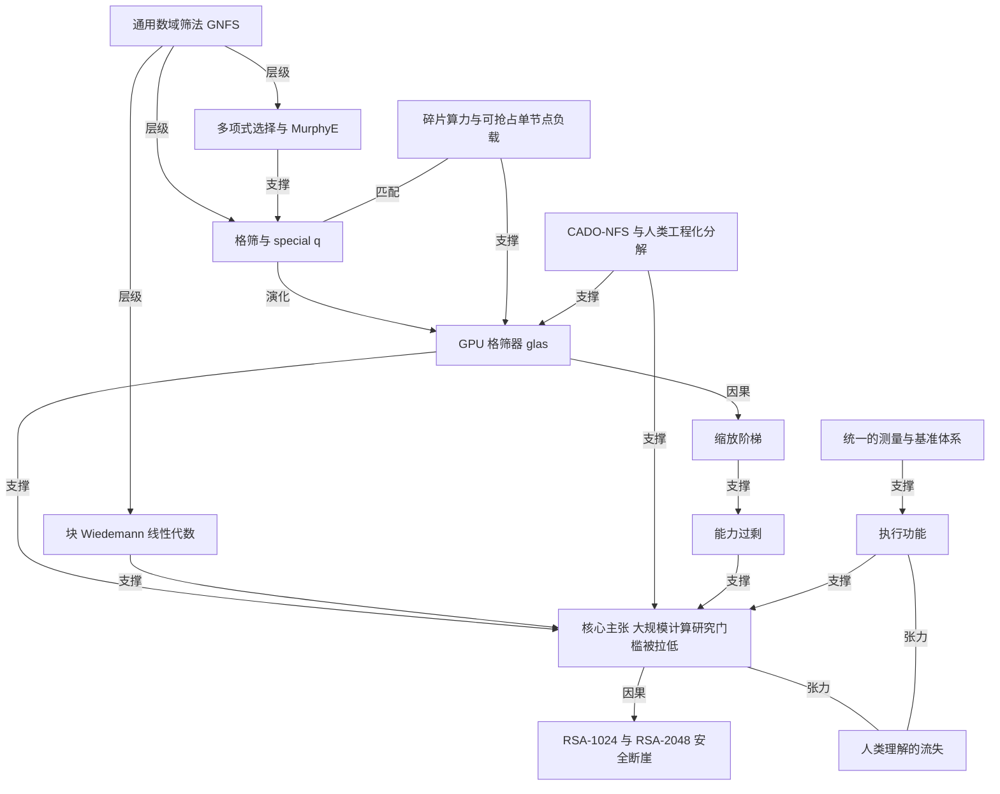

# Devin 与人类研究员一起分解了 RSA-260

- 原文标题：Factoring RSA-260
- 作者：Cognition
- 内参日期：2026-09-11
- 来源类型：blog
- 原文：https://cognition.com/blog/factoring-rsa-260
- 标签：agents, 算法, ai 实战

> Cognition 让多个 Devin 智能体造出目前性能最高的 GPU 格筛，把大数分解的成本压到此前的十分之一，并刷新了 RSA 挑战的公开纪录（上一个是 2020 年的 RSA-250）。这是 agent 在高强度工程任务上产出可验证成果的少数硬样本。

## 导读

agent 破解 RSA-260

## 核心观点

- Cognition 的一位研究员用一群 Devin 分解了 RSA-260，创下公开 RSA 分解挑战的新纪录。上一个纪录 RSA-250 停留在 2020 年 2 月，这次一举推进了 10 个十进制位。
- 真正的技术产物不是那两个 130 位素因子，而是「世界上性能最高的 GPU 格筛器」：它让分解同等规模的数字，成本比此前公开的最先进水平低一个数量级。
- 作者对自己角色的描述是全文最锋利的部分：他负责**设定优先级、建立基准、识别工作何时跑偏**；测量、集群运维、端到端优化由 Devin 自主完成。这替代掉的，本来是「一支高度专业化的领域专家团队几个月的工作」。
- 作者自评对底层数学「远不是专家」，理解这些组件的方式像一个中等水平的汽车爱好者理解汽车零件：知道它在系统中的大致角色、对性能的影响、改动的一些权衡，但不懂背后的物理学，也不会从原材料造出这个零件。
- 结论被作者写成一句邀请：密码分析、更广泛的计算数学、乃至大多数大规模科学计算研究的入行门槛，已经远低于从前——凡是「编程就能解决」的研究问题，都值得立刻试一试自主软件工程 agent。

## 两个必须分开看的结论

- **结论一（安全侧）**：超大规模云厂商或前沿 AI 实验室现在很可能能以每个数字 3000 万美元量级的成本分解 RSA-1024，稍加优化还能显著更低。而 RSA-2048 仍比 RSA-1024 难约十亿倍，本工作对它「没有实质影响」。
- **结论二（能力侧）**：Devin 足以独立解决一个位于计算数论与 GPU 性能工程交叉点上的困难问题。这才是作者认为更值得注意的那一条。
- 作者特意强调：**RSA-1024 不安全并不是新闻**。早在 2000 年代中期就有人推测 NSA 有能力经济地做 RSA-1024（TWIRL 装置、Bernstein 矩阵机器都是那一路的设计）。本次工作带来的真正变化是三点：
- 潜在更低的成本（以金钱和墙钟时间计）；
  - 潜在更多有能力做这件事的主体——你只需要足够多的 GPU，而不必去造专用硬件；
  - **非密码学家现在可以相对轻松地参与加速分解**。
- 参照系：当前最先进的 RSA 公钥是 2048 位（约 617 位十进制），1024 位（约 309 位十进制）早在 2013 年就已被弃用。RSA-260 是 260 位十进制数。

## 没有算法突破，只有「老派性能工程」

- 分解走的是通用数域筛法（GNFS），对约 100 位以上的多数数字它是已知最高效的算法，此前的破纪录分解也都用它。
- 实现是「大幅修改过的 CADO-NFS」。作者明确表示：「我基本没有报告任何算法上的进展」——把格筛和稀疏线性方程组求解搬上 GPU，靠的只是「老派的性能工程」，去吃下 GPU 那套「荒谬的内存系统」。
- 为回应传言，作者专门澄清两点：他没有靠手算猜验 130 位素数，Cognition 也还没造出几千量子比特的量子计算机。

## 成本账：40 万美元，4900 个 GPU-天

- 总计约 4900 GPU-天，即 13.5 GPU-年，按当前市场价约 40 万美元。三个阶段的时间分布：
- 多项式选择 643 GPU-天——作者标注这个数字「异常地高，基本上是因为操作者无能」；
  - 格筛 3813 GPU-天；
  - 线性方程组求解 467 GPU-天，其中约 7% 因崩溃或被更重要的任务抢占而没有推进。
- 外推到 RSA-1024（309 位十进制）：按标准 GNFS 缩放，只是 RSA-260 的 78 倍计算量，市场 GPU 价格下约 3000 万美元，且可以用墙钟时间去换。作者确信当前实现仍明显次优，「如果适度的进一步工作能把 RSA-1024 的成本再降低一倍，我不会感到意外」。
- 附录给出的完整成本阶梯更直观：RSA-250 是 RSA-260 的 0.385 倍，RSA-1024 是 77.9 倍（约 1050 GPU-年、3230 万美元），而 RSA-2048 是 912 亿倍（约 1.23 万亿 GPU-年）。这就是 1024 与 2048 之间那道断崖。
- 整件事是在优化任务调度器的过程中顺带完成的副业项目，只用了集群的个位数百分比算力。

## 为什么是格筛：碎片算力找到了完美负载

- 起点其实是一个基础设施问题。用于 LLM 训练和推理的集群由 NVL72 机架组成，每个机架名义上含 18 台计算机，靠高速 NVLink 互联。LLM 负载要吃这条快互联，只能在单机架内成组使用。
- 调度器于是要解一个约束优化问题来打包负载：有些机架会剩下一两个空闲节点，有些任务为故障转移申请了备用节点，有些任务需要偶数台机器却落在只有 17 台的机架上。这些低效加起来，是整体算力的个位数百分比。
- 作者先改造调度器，让单节点任务以最低优先级填进其他负载的缝隙；但缺少一个**稳定的、可随时被抢占的单节点负载源**。
- 格筛正好完美匹配这个生态位：它在数十亿个小工作单元上是「极易并行」的，单节点就能推进，随时中断也安全；同时它又是 GNFS 中最耗算力的一步，筛完就等于分解完成了一大半。
- 但此前所有公开的 GNFS 分解纪录都只用 CPU 做格筛。由于在 GPU 上高效实现格筛的困难，长期以来 GPU 格筛在整体成本上是否更划算，一直不明朗。
- 于是「我唯一缺的，就是一个性能足够高、能吃下分解 RSA-260 所需参数的 GPU 格筛器。那我做了什么？问 Devin。」

## 从一条 prompt 到一夜之间的 glas

- 时间戳精确到秒：8 月 13 日太平洋时间 0:11:58，作者让 Devin 去做 `las`（CADO-NFS 的 CPU 格筛器）的直接替代品。
- 原始 prompt 的要点值得逐条看：
- 交代背景与难点——CPU 格筛的优化用了大量条件分支和复杂访存模式，而「GPU kernel 专家与数域理论专家的交集非常小」；
  - 给出为什么可能成立的物理依据——GPU 更高的总内存带宽意味着更高的性能天花板；
  - 然后是那句点睛的话：「**而那个交集现在包含了你。**」
  - 给权限与纪律——授权使用 Modal 密钥开一台 GPU 机器做性能测试，本地构建工具链，GPU 只用于测性能、测完就关机；
  - 给验收标准——必须是 CADO-NFS 筛法步骤的直接替代品，**迭代到超过 CPU 格筛器的性能为止**。
- 两小时后作者补了一句：`glas`（GPU 版 `las`，当然）应当能处理 RSA-250 所用的参数。然后他去睡觉了。醒来发现，又经过 7 小时迭代，Devin 成功了。

## GNFS 各阶段被改造成了什么样

- **多项式选择**：它固定算法所在的数域，选择直接决定格筛步骤的常数因子加速，因此通常值得花整体筛法算力的约 5% 去找一个「好」多项式。这里技术创新很少——把 CADO 的 stage-1 多项式选择适配到 GPU（得到 `gps1`），并借用了 msieve 中优化良好的 stage-1 kernel 部件。
- **格筛**：目标是产出大量（本例 83 亿条）GF(2) 上的稀疏线性关系，向量分量表示光滑数素因子分解中素数指数的奇偶性。它在称为「special q」的工作项上极易并行，但每个工作项都要在一个大数组的伪随机位置上做大量读写——**处理这一点正是优化筛法的首要技术挑战**。
- **线性方程组求解**：把关系打包成 GF(2) 上的大矩阵，求一个线性相关。这个规模下求解通常是分布式的、需要大量通信带宽，而 Infiniband 与 NVLink 恰好管够。块 Wiedemann 算法能一定程度放松通信约束，CADO-NFS 里的具体实现也可优化并搬上 GPU。解可以加工成模 N 的平方同余，从而给出分解。
- Devin 实质性修改了几乎每一个部件：GPU 版 stage-1 多项式选择（含 msieve 组件）、基于 `las` 的 GPU 格筛器、能承受工作单元体量的优化版 CADO head、并行化优化的 dup/purge 与融合的 merge/replay、全新的 GPU 块 Wiedemann 实现、GPU 加速的 `sqrt`。
- 整条流水线里唯一没被碰过的程序只有四个：`cado-nfs.py` 本身、`polyselect_ropt`（stage-2 多项式选择）、`makefb` 和 `dup1`。连 `fake_rels` 都得优化，才能在所需规模的合成输入上跑出合理性能。

## 优化工作流：平均 3 个、最多 18 个并行 Devin

- 项目持续 3 周，平均同时运行 3 个 Devin 会话，峰值 18 个。会话大致分两类：
- 迭代优化单个组件——设计并运行实验、解读结果、选定改进目标、实现、再循环；
  - 管理集群上的端到端分解运行——跑通整条流水线与配套脚本，暴露出最重要的低效（错误、利用率、性能）供进一步优化。
- Devin 实际承担了相当大一部分工作：为筛法和线性代数选参调参（但用的是作者帮忙搭起来的基准测量设备）、生成与优化多项式选择、跑迭代优化循环、搭建并优化处理脚本、在集群上编排大规模计算。
- 作者每隔几小时才介入一次这个优化循环，中间穿插着和另一些 Devin 会话处理日常工作。
- Devin Cloud 对这种工作流特别合适：会话持久且独立于本机、并行化直截了当、沙箱防止不同工作流互相干扰、会话可以自主运行数周。作者说他们本就知道 Devin 擅长与机器学习相关的 GPU 编程、实验和集群管理，但格筛与 GNFS 差异相当大，Devin 在此的泛化能力「相当令人印象深刻」。

## 爬升缩放阶梯

- 前五天他们在爬一条「缩放阶梯」。到这一段结束时，分解一个 190 位的数所花的时间，等于项目开始时分解 157 位数所花的时间——**三个多小时**。
- 阶梯上的实际目标依次是：C155、C157、C173、C175、C190、C201（奇完全数路障）、C311、又一个 C190（只为吓一吓某个随机生成了半素数的 Devin），随后是 C344 与 RSA-260 本身。
- 作者坦承了一次刻意的冒险：分解掉 C311（难度约等于 216 位数的 GNFS）之后，更稳妥的做法是先做一个 230 位等效难度的数，把剩下的两个数量级跨过去；但他估算 RSA-260 一个月内可做完，于是已经开始了多项式选择——**尽管他知道线性代数部分仍明显没优化好**。
- RSA-260 最终从 2026-08-18 12:14:19 UTC 跑到 2026-09-03 01:48:57 UTC，墙钟 1,344,878 秒。

## Devin 还需要人类做什么：答案是「仍然很多」

- 作者给出了一组精确到词的自省数据：据 Devin 回顾统计，他在用于分解的 233 个会话中的 192 个里，发出了 82,702 个单词（502,887 个字符）、3,328 条消息，共消耗 14,450 ACU。其中 Devin 自己派生了 101 个子会话，有 36 个完全没有得到他的任何干预。
- Devin 需要人类提供的是**执行功能**——把它正在做的事讲一遍并做合理性核查：
- 设定目标层级、把 Devin 的范围框住；
  - 识别 Devin 在做无意义的事并重定向（「你不需要做那个测量」）；
  - 识别 Devin 工作流中反复出现的低效（「这个准备工作可以摊销掉」）；
  - 指出没尝试过的方向（「确保 GPU 永远不要阻塞在 CPU 上」「这里能不能用 NVLink SHARP」）；
  - 组织实验框架与结果（「按这个方式做测量，之前的结果在这里找，别每次都编出一套没法比较的新做法」）；
  - 抓住 Devin 过早放弃某个方向的时刻。
- 回头看，作者认为自己虽然贡献了少数几个具体技术洞见，但**最大的贡献很可能是手把手促成了一套统一的测量结果、基准与性能估计器**——「它们显然不会自己组装起来」。这套东西让 Devin 更容易跑和理解测量，也让他自己看清进展到了哪里、哪里还需要改进。

## CADO-NFS：人类工程化的问题分解是前提

- 作者特意强调：**没有 CADO-NFS，这件事不可能发生**。它是一个先进、健壮的 GNFS 开源实现，既用于此前多次纪录，也服务于分解爱好者社群。
- 它提供的东西恰好构成 agent 能开工的条件：全部相关技术、流水线各阶段及其接口、一份参考 CPU 实现。有了这些，作者才能让 Devin 集群大致独立地优化各个程序，并把输出与原始实现对比。
- 由此他给出一个可迁移的判断：「和许多其他情形一样，我相信**人类工程化的问题分解，是让 agent 能取得进展的关键前提**。」
- 一个意味深长的观察：代码库离上游 CADO-NFS 越远，agent 就越困惑。这可以归因于复杂度累积，但作者也在想——CADO-NFS 出现在预训练数据里，是不是也有关系？

## 工程现场的两个细节

- **筛法阶段**：8 月 22 日开始，8 月 30 日达标，墙钟 189.5 小时（7.9 天），共 632,249 个工作单元，每个约 10 分钟。过程中筛法器升级了两次，性能比开始时提升 14–17%（GB200 的单工作单元中位耗时从 585 秒降到 486 秒）。最终拿到 138.5 亿条原始关系——略低于目标，因为磁盘写满导致四个文件被截断——过滤后得到 83.0 亿条唯一关系（40.1% 重复）。
- **平方根阶段**：这一步通常算力开销微不足道，但在 RSA-260 中端到端花了 12 小时，因为有理数乘积达到 1.76e11 比特，把 `sqrt` 的 `mpz_t` limb 计数器给溢出了，程序中止。Devin 重写了三次 `sqrt`（先用 GMP 的 `mpn` 函数，再加 CPU 上的并行 Karatsuba），最终产出因子的那一版用了 GPU 加速的 NTT 乘法，88 分钟跑完。
- 线性代数与筛法不同，它要求所有 worker 全程在线，因此被反复致命抢占，团队只能写一个相当复杂的放置脚本，不断把最合适的形状塞进当时可用的算力里。正确性检查也是两路并行：一边跑 `krylov`，一边端到端分解 C344 做验证，同时用 CADO 的 `bwccheck` 检查每一对 V 检查点。
- 顺带一提，附录里还藏着另一个纪录：2^1277 − 1（C385）的分解，作者标注为「SNFS 的新纪录」。

## 作者的反思：织布机、能力过剩与理解的流失

- 「发生的这一切对我来说很陌生。结果上署着我的名字，但我不清楚该如何在自己、Devin、硬件和整个世界之间分配功劳。」
- 他给出的类比是缝纫机或织布机：我以某种方式推着它走，没有我这事显然不会发生，但我也不是在用手投梭。「很难说清我的角色究竟是什么，尽管我确信它不是什么都没做。」
- 但他同时承认有新东西正在发生：**从第一条 prompt 到找出 RSA-260 的因子，只过了约三周。这个速率昭示着一种能力过剩，我们才刚刚开始探索它的边界。**由此他的行动建议很直接——如果一个问题能通过「就是编程」来解决，那就值得立刻去试。
- 最后是全文最克制也最诚实的一段：他分享了对**人类理解流失**的担忧。做完这个项目，他对数域筛法和 GPU 编程的所学，少于他自己独立完成时的预期，尽管多于完全不用 Devin 的情况。他认为重要的是想清楚：当技术让我们有能力、甚至有动机放弃深入理解时，如何在全局上分配资源来维持人类的理解。
- 但他没有停在担忧上：这些工具也可能让我们**选择**在哪里深入理解最有价值，探索得比任何个体此前所能抵达的更远，并扩大能做出有意义贡献的人群。「我把这项工作看作两个方向上的例子。」

## 概念网络

### 关键概念

#### 通用数域筛法（GNFS）

**context**：全文的算法底座。原文称 GNFS 是「对约 100 位以上的（大多数）数字已知最高效的算法」，此前的破纪录 RSA 分解也用它。它由依次运行的几个阶段构成：多项式选择、格筛、线性方程组求解，最后把解加工成模 N 的平方同余，得到分解。作者明确表示自己「基本没有报告任何算法上的进展」——GNFS 本身没变，变的是它跑在什么硬件上。

**费曼一下**：要把一个 260 位的大数拆成两个素数相乘，硬试是没有指望的。GNFS 的思路是绕道：先挑一个合适的多项式把问题搬进另一个数系，再海量搜集满足特定整除性质的数对，最后用线性代数在这堆关系里找出一个组合，使得某个数恰好是完全平方数——平方同余一成立，最大公约数一算，因子就掉出来了。整个过程像先撒一张巨网捞线索，再用代数把线索拼成答案。

#### 格筛与 special q

**context**：GNFS 中最耗算力的一步，本次占了 3813 GPU-天（全部 4900 GPU-天的绝大部分）。它要产出大量（本例 83 亿条）GF(2) 上的稀疏线性关系，在称为「special q」的工作项上极易并行。但每个工作项都需要在一个大数组的伪随机位置做大量读写——原文说「处理这一点正是优化筛法的首要技术挑战」。

**费曼一下**：把格筛想成在一张巨大的数字表格上划勾：你要找出所有「能被一堆小素数整除干净」的候选，做法是对每个素数，跳着步长去数组里打标记。麻烦在于这些落点几乎是随机散布的，缓存根本帮不上忙——CPU 擅长的分支预测和访存局部性全部失效。而这也正是它上 GPU 之所以难、又之所以值得的原因：GPU 的总内存带宽高得多，只要能把随机访存组织好，天花板就更高。「special q」则是把这张大表切成数十亿个互不相干的小块，每块都能独立算完，所以随便哪台机器捡起来算一会儿都算数。

#### GPU 格筛器 glas

**context**：本次工作的核心技术产物，原文称之为「世界上性能最高的 GPU 格筛器」，让分解成本比此前公开的最先进水平低 10 倍。它的出身是一条 prompt：让 Devin 做 CADO-NFS 的 CPU 格筛器 `las` 的直接替代品，「迭代到超过 CPU 格筛器的性能为止」。名字 `glas` 即 GPU 版 `las`。关键背景是：此前所有公开 GNFS 分解纪录的格筛都只用 CPU，GPU 格筛在整体成本上是否更划算长期不明朗。

**费曼一下**：在此之前，这件事卡在一个人才结构问题上——会写 GPU kernel 的人和懂数域理论的人，交集太小，所以没人去做。作者那条 prompt 里最关键的一句就是点破这一点：「而那个交集现在包含了你。」agent 恰好是那个同时读过两边资料的存在。一夜之间做出来的不是一个新算法，而是把一个已知算法搬到正确硬件上的那份苦工。

#### 碎片算力与可抢占单节点负载

**context**：整个项目的真实起点是基础设施而非密码学。LLM 集群由 NVL72 机架（每架 18 台机器、NVLink 互联）构成，训练推理负载必须成组占用单机架，调度器打包时必然留下零星空闲节点，加起来是整体算力的个位数百分比。作者先让调度器把单节点任务以最低优先级填进缝隙，但缺少「稳定的、可随时被抢占的单节点负载源」——格筛正好完美匹配：极易并行、单节点可推进、瞬时抢占也安全。原文说这次分解「以零边际成本跑在无法用于其他用途的零散算力上」。

**费曼一下**：大集群像一栋只能整层出租的写字楼，租户走后总会剩下几间零散空房，加起来不少但拼不成一层。问题不是没有空房，而是没有「愿意住一晚、随时被赶走也不抱怨」的租客。格筛就是这种理想租客：工作切得极碎、每块十分钟算完、被打断就扔掉重算也不心疼。这个概念的迁移价值在于：先问「我手里闲置的是什么形状的资源」，再去找形状匹配的问题，比反过来更容易成事。

#### 块 Wiedemann 线性代数

**context**：GNFS 的收尾阶段，把 83 亿条关系打包成 GF(2) 上的巨型矩阵（本次是 6.56 亿 × 6.56 亿、984 亿个非零元、每行密度 150），求一个线性相关。这个规模下求解是分布式的、需要大量通信带宽，而块 Wiedemann 算法能一定程度放松通信约束。它与筛法有一个关键性质差异：**线性代数要求所有 worker 全程在线**，因此被反复致命抢占，团队不得不写复杂的放置脚本去适配当时可用的算力形状。

**费曼一下**：前一步撒网捞回来的是几十亿条「谁和谁的奇偶性配得上」的线索，现在要在这张巨大的稀疏表里找出一组能互相抵消的行。块 Wiedemann 的巧妙之处是不去直接解这个天文数字大小的方程组，而是反复做矩阵乘向量，从结果序列里反推出答案的结构。它和格筛构成一对反例式的对照：格筛怕慢不怕断，线性代数怕断不怕慢——同一条流水线上，两段对基础设施的要求几乎相反。

#### 多项式选择与 MurphyE

**context**：GNFS 的第一阶段，固定算法所在的数域。原文指出多项式的选择只控制格筛步骤的一个常数因子加速，但正因为格筛太贵，「通常值得花整体筛法算力的约 5% 去找一个好多项式」。本次实际花了 643 GPU-天，作者自嘲这个数字异常地高，「基本上是因为操作者无能」。MurphyE 是评价多项式优劣的打分函数；他们试筛了 22 个不同多项式，最终选中的比第五名的产出率高 13–16%。

**费曼一下**：这是一个典型的「磨刀不误砍柴工」权衡，而且权衡的量级是可以算出来的：既然砍柴要花 95% 的力气，那花 5% 磨刀就是理性的；花 13% 去磨刀就是浪费。作者自己就踩了这个坑——多项式选择花了 2.5 天而不是计划的 1 天，他事后判断其实只搜 12 小时、搜得比计划更少反而更值。这个概念值得记住的不是密码学细节，而是那个可计算的比例。

#### CADO-NFS 与人类工程化的问题分解

**context**：作者用整整一段强调「没有 CADO-NFS，这件事不可能发生」。它提供的是全部相关技术、流水线各阶段及其接口、一份参考 CPU 实现——有了这三样，Devin 集群才能大致独立地优化各个程序，并把输出与原始实现逐一对比。由此他给出全文最具迁移性的判断：「人类工程化的问题分解，是让 agent 能取得进展的关键前提。」他还观察到，代码库离上游 CADO-NFS 越远，agent 就越困惑。

**费曼一下**：agent 之所以能被一群群地放出去干活，不是因为它无所不能，而是因为有人事先把问题切成了边界清晰、接口固定、结果可对照的小块。接口固定意味着可以并行优化而不互相打架；参考实现意味着每次改动都有一把尺子去量对不对。换句话说，这个项目真正的脚手架不是 Devin，是几十年积累的开源代码库。而那个「离上游越远越困惑」的观察还留了个开放问题：agent 的能力究竟来自结构的清晰，还是来自它在预训练里见过这份代码？

#### 执行功能（executive function）

**context**：作者用这个词概括人类在项目中不可替代的部分。他给出的清单很具体：设定目标层级并把 Devin 框住范围、识别无意义工作并重定向、识别反复出现的工作流低效、指出没尝试过的方向、组织实验框架与结果、抓住 Devin 过早放弃某个方向的时刻。数据上，他在 192 个会话里发出了 82,702 个单词、3,328 条消息；问「Devin 还需要人类做什么」，答案是「仍然很多」。

**费曼一下**：把 agent 想成一个技术能力极强但缺乏方向感的合作者：它能把任何一条路走到底，却不太判断这条路值不值得走、这个测量做了有没有用、刚才那个失败是不是该再试一次。人类补上的正是这层「关于工作的工作」——排优先级、喊停、追问、防止重复劳动。这解释了一个反直觉的现象：agent 越强，人的时间越不该花在动手上，而该花在判断上。

#### 统一的测量与基准体系

**context**：作者回顾自己最大的贡献时，答案不是技术洞见，而是「手把手促成了一套统一的测量结果、基准与性能估计器」，并补了一句关键的判断：「它们显然不会自己组装起来。」这套东西的双向作用是：让 Devin 更容易跑和理解测量，也让他自己看清进展在哪、哪里还需要改进。相应的纠偏指令也很具体——「按这个方式做测量，之前的结果在这里找，别每次都编出一套没法比较的新做法」。

**费曼一下**：多个 agent 并行优化时，最大的风险不是某个方向做错，而是每个方向各自定义了「快」的含义，于是所有结果都无法横向比较，优化变成原地打转。基准体系就是那把所有人共用的尺子。它之所以「不会自己组装起来」，是因为它对每一个具体任务都不是必需的——只有从整个项目的视角看，它才是决定性的。这恰好是人类在 agent 工作流里最该占据的位置。

#### 缩放阶梯（scaling ladder）

**context**：项目前五天的推进方式。他们依次分解 C155、C157、C173、C175、C190、C201、C311，每一级都验证流水线并暴露瓶颈。成果的表述方式很精准：到这一段结束时，分解 190 位数所花的时间等于开始时分解 157 位数所花的时间——三个多小时。作者也承认在阶梯上跳了一级：C311 之后本该先做 230 位等效难度的数，但他估算 RSA-260 一个月内能做完，就直接开始了多项式选择，尽管知道线性代数仍明显没优化好。

**费曼一下**：面对一个大目标，不要一上来就冲。先找一串难度递增、能快速跑完、结果可验证的小目标，每跑一级就把整条流水线的弱点暴露一次。它的妙处在于给了一个纯粹的进步度量：不是「我们感觉变快了」，而是「同样三小时，从前只能做 157 位，现在能做 190 位」。而作者跳级的那次，也正说明阶梯是工具不是教条——当你对成本模型有足够把握时，可以下注。

#### 能力过剩（capability overhang）

**context**：作者对整件事速率的命名。「从第一条 prompt 到找出 RSA-260 的因子，只过了约三周。这个速率昭示着一种能力过剩，我们才刚刚开始探索它的边界。」他由此给出行动建议：不该回避这种探索，尤其是——如果一个问题能通过「就是编程」来解决，那就值得立刻尝试。

**费曼一下**：能力过剩指的是工具的实际能力已经跑在人们的认知前面：不是模型还不够强，而是没有人去试。密码分析这个领域二十多年没有公开纪录突破，不是因为难度陡增，而是因为门槛把绝大多数人挡在外面——同时懂数论和懂 GPU 的人太少。一旦这个瓶颈被抹平，积压的可能性就会集中释放。这也把判断标准给出来了：凡是「编程就能解决」的研究问题，现在都处在这个待释放的区间里。

#### RSA-1024 与 RSA-2048 之间的安全断崖

**context**：全文最需要被准确转述的一点。RSA-1024（309 位十进制）只是 RSA-260 的 78 倍计算量，估价约 3000 万美元，作者认为还能再降一半；而 RSA-2048 比 RSA-1024 难约十亿倍，本工作对它「没有实质影响」。附录数据更直白：RSA-1024 是 RSA-260 的 77.9 倍，RSA-2048 是 912 亿倍。作者同时强调 RSA-1024 不安全并非新闻——2000 年代中期就有 NSA 能力的推测（TWIRL、Bernstein 矩阵机器），1024 位 RSA 早在 2013 年就已弃用。

**费曼一下**：这个断崖来自 GNFS 的亚指数复杂度：位数每增加一截，代价增长得极快，所以 1024 和 2048 之间隔着的不是一段路，是一个天文数字。真正变化的不是「2048 变危险了」，而是三件更微妙的事：成本可能更低、有能力做的主体可能更多（只需要 GPU，不必造专用硬件）、非密码学家现在也能参与加速分解。这三条里，第三条对长期格局的影响可能最大。

#### 人类理解的流失

**context**：全文的收尾反思，也是作者少有的第一人称表态。他承认做完这个项目后，自己对数域筛法和 GPU 编程的所学少于独立完成时的预期，尽管多于完全不用 Devin。他认为重要的是想清楚：当技术让我们有能力甚至有动机放弃深入理解时，如何在全局上分配资源来维持人类的理解。他给自己的角色打的比方是缝纫机或织布机——「我以某种方式推着它走……但我也不是在用手投梭。」

**费曼一下**：这不是一个反对使用工具的立场，而是一个关于代价记账的提醒。用 agent 做出一个结果，等于用「不必理解」换来了速度；单次交换往往划算，但如果每次都这么换，一个领域里真正理解它的人就会越来越少。作者没有停在担忧上，而是把它翻成一个可以主动做的选择：既然理解不再是做事的前提，那它就变成了一个可以**分配**的东西——你可以决定在哪里深入、在哪里只需要会用。他把这项工作称为「两个方向上的例子」，意思正是收益和代价同时在场。

### 概念网络



这篇文章的思想网络有一个容易被忽略的入口：它不是从密码学出发的，而是从**算力形状**出发的。理解这一点，其余关系才站得住。

**底层是算法的固定结构**。通用数域筛法把问题切成三段——多项式选择、格筛、线性方程组求解——这是层级关系，也是一条不可跳过的流水线。多项式选择支撑格筛（它只控制一个常数因子，但因为格筛占了全部算力的四分之三以上，这个常数因子值得花 5% 的预算去买）；块 Wiedemann 承接格筛的产出。值得注意的是，这三段与基础设施的关系并不一致：格筛怕慢不怕断，线性代数怕断不怕慢。这个差异后来变成了整个项目能否跑起来的分水岭。

**中层是碎片算力与格筛的相互匹配**。这是全文最关键的一对关系，而且是双向的：格筛的性质（极易并行、单节点可推进、瞬时抢占安全）恰好是碎片算力唯一能承载的负载形状；反过来，碎片算力的存在也给了 GPU 格筛器一个此前不存在的经济理由——如果算力要按市价买，在 GPU 上重写格筛未必划算；但如果算力本来就要浪费掉，这笔账立刻成立。`glas` 由此诞生，它同时站在「格筛的演化」和「碎片算力的支撑」两条线的交点上。

**上层是三个使能条件汇向同一个结论**。`glas` 的性能突破是直接因，但它并不孤立：CADO-NFS 提供的接口与参考实现，让 agent 群能并行优化而不互相踩踏，这是结构性前提；缩放阶梯把性能提升变成可验证的连续证据，进而支撑了「能力过剩」这个判断。三者共同指向那个核心主张——密码分析和更广泛的大规模科学计算，入行门槛已经远低于从前。而这个主张往下游延伸出的第一个具体后果，就是 RSA-1024 的成本估算：这是因果关系，不是并列关系。

**侧面是人类角色的那条线**。执行功能与核心主张之间是支撑而非对立：正因为人补上了排优先级、喊停、追问、防止重复劳动这一层，agent 群的产出才收敛到一个方向。而统一的测量与基准体系又是执行功能中最具体、也最容易被跳过的那一项——它对任何单个任务都不是必需的，只有从整个项目的视角看才是决定性的，所以它「不会自己组装起来」。

**最后是那一对没有被解决的张力**。核心主张与人类理解的流失之间、执行功能与人类理解的流失之间，都是张力关系而非因果关系。作者没有把它化解成一个结论：他承认自己学到的东西少于独立完成时的预期，但也指出这些工具让人可以**选择**在哪里深入理解。两条线同时成立，所以他说这项工作是「两个方向上的例子」。整张网络的落点不在 RSA-260 那两个 130 位素因子上，而在这里——门槛降低是确定的，理解如何分配是开放的。

## 费曼 x3

一个人用三周时间，靠一群 agent 分解了 RSA-260，创下公开纪录。但这篇文章真正值得读的部分，不是那两个 130 位的素因子，而是作者对自己角色的诚实交代。

先说最容易被误读的一点。这不是密码学被攻破了。作者自己反复强调：RSA-1024 不安全早就不是新闻，2000 年代中期就有人推测 NSA 能经济地做到，1024 位 RSA 在 2013 年就已弃用；而 RSA-2048 比 RSA-1024 还难约十亿倍，这次工作对它没有实质影响。算法上也没有任何突破——他明说自己「基本没有报告任何算法上的进展」，把格筛搬上 GPU 靠的只是「老派的性能工程」。所以真正变化的是三件更安静的事：成本可能更低、有能力做这件事的主体可能更多（你只需要足够多的 GPU，而不必去造专用硬件）、非密码学家现在也能参与加速分解。第三条对长期格局的影响最大。

这件事的起点甚至不在密码学里，而在一个基础设施问题上。大集群跑 LLM 时，调度器打包负载必然留下零星空闲节点，加起来是整体算力的个位数百分比。作者手里有这些填不满的空房，缺的是一种「愿意住一晚、随时被赶走也不抱怨」的租客。格筛恰好是这样的负载：切得极碎、单节点就能推进、被打断也不心疼。所以顺序是反的——先有闲置资源的形状，才去找形状匹配的问题。这个思路的迁移价值，大于任何具体的 GPU 优化技巧。

那条启动 prompt 里有一句点睛的话。作者先交代了为什么这件事历史上很难：CPU 格筛的优化用了大量条件分支和复杂访存模式，而「会写 GPU kernel 的人和懂数域理论的人，交集非常小」。然后他写道：「而那个交集现在包含了你。」这句话说透了 agent 此刻的位置——它的价值往往不在于比人类专家更聪明，而在于它同时读过两个不相邻领域的资料，恰好站在那个稀缺的交集上。一夜之间做出来的不是新算法，是一份此前没人愿意干的苦工。

但文章最有价值的，是作者问「Devin 还需要我做什么」时的回答：仍然很多。他在 192 个会话里发出了 82,702 个单词、3,328 条消息。这些消息不是在写代码，而是在设定目标层级、识别无意义的测量、指出没试过的方向、抓住 agent 过早放弃的时刻。他把这层叫执行功能。更值得记住的是他对自己最大贡献的判断：不是某个技术洞见，而是手把手促成了一套统一的测量结果、基准与性能估计器——因为「它们显然不会自己组装起来」。多个 agent 并行时，最大的风险不是某条路走错，而是每条路各自定义了「快」的含义，于是所有结果都无法比较。基准体系就是那把共用的尺子，它对任何单个任务都不必需，只有从整个项目的视角看才是决定性的。

同样重要的是那个前提：没有 CADO-NFS，这件事不可能发生。这个开源实现提供了全部技术、流水线的阶段与接口、一份可以逐一对照的参考 CPU 实现，agent 群才能各自优化而不互相踩踏。作者的判断是「人类工程化的问题分解，是让 agent 能取得进展的关键前提」。他还留下一个没答案的观察：代码库离上游越远，agent 就越困惑——是复杂度累积，还是因为那份代码出现在预训练里？

结尾他没有胜利宣言。他说结果上署着自己的名字，却不清楚该如何在自己、Devin、硬件和世界之间分配功劳；他把这个角色比作推着织布机走，没有他这事不会发生，但他也不是在用手投梭。他承认自己学到的东西少于独立完成时的预期，也承认担忧人类理解的流失。但他把这个担忧翻成了一个可以主动做的选择：既然理解不再是做事的前提，它就变成了一个可以分配的东西——你得决定在哪里深入、在哪里只需要会用。三周从第一条 prompt 到因子落地，这个速率昭示着一种能力过剩，我们才刚开始探索它的边界。他的建议很直接：凡是「就是编程就能解决」的问题，现在都值得立刻试一试。

## 阅读原文

Over the past few weeks, the Cognition research team and I have been optimizing our job scheduler to better use disaggregated compute. As a proof of concept, and because I’ve enjoyed factoring numbers as a hobby for the past ten years or so, I drove a bevy of Devins to obtain a factorization of [RSA-260](https://en.wikipedia.org/wiki/RSA/_numbers#RSA-260). In order to do this, my Devins built the world's highest-performance GPU lattice siever, which enables factoring numbers at 10x lower cost than the previous public state of the art. Here is the factorization:

```javascript
22112825529529666435281085255026230927612089502470015394413748319128822941402001986512729726569746599085900330031400051170742204560859276357953757185954298838958709229238491006703034124620545784566413664540684214361293017694020846391065875914794251435144458199
= 4397328654844826923795068102505872571721883526553349659561256924505973939597593482272505698004801207988043088656411102133523080581
× 5028695206842569864686141618253083416610081090075366674776775706538324961364412200138116378509733307971876652984898985905923678379
```

RSA-260 (a 260 digit number) sets a new record for the largest publicly solved [RSA Factoring Challenge](https://en.wikipedia.org/wiki/RSA/_Factoring/_Challenge) problem, which benchmarks the feasibility of breaking the [RSA cryptosystem](https://en.wikipedia.org/wiki/RSA/_cryptosystem). The previous record, RSA-250, was [set](https://arxiv.org/abs/2006.06197) in February 2020. For reference, state-of-the-art RSA public keys contain 2048 bit (~617 digit) factoring problems, while 1024-bit (~309 digit) RSA was deprecated in 2013.

Below I’ll give some details about how this was accomplished, but here are two important takeaways:

- Hyperscalers or frontier AI labs could likely factor RSA-1024 numbers at a cost on the order of $30 million per number — and, with a bit more optimization, likely substantially less. On the other hand, RSA-2048 remains roughly a billion times harder than RSA-1024 and does not appear to be meaningfully affected by this work.
- Devin is a sufficiently powerful software engineer to solve a challenging problem at the intersection of computational number theory and GPU performance engineering. My role was primarily to set priorities, establish benchmarks, and recognize when work was going off-track. Devin otherwise autonomously handled measurements, cluster operations, and optimization end-to-end. This substituted for what would likely have been a multi-month effort by a team of highly specialized domain experts.
In conclusion, the barrier to entry for cryptanalytic work, other computational mathematics more broadly, and likely most large-scale scientific computing research, is far lower than it used to be. Exciting work beckons anywhere programming can be used to solve a research problem; I encourage all to be ambitious and explore what autonomous software engineering agents can do when applied to these fields!

### How did this happen?

Contrary to some [circulating](https://x.com//_seanyneutron/status/2095391516504244480) [claims](http://x.com/penlume/status/2095429389660164463), I did not factor RSA-260 by guessing and checking 130-digit prime numbers by hand. Cognition also has not yet built a multi-thousand-qubit quantum computer. RSA-260 was factored by a new implementation of the [general number field sieve](https://en.wikipedia.org/wiki/General/_number/_field/_sieve) (GNFS) for GPUs, prepared and run using Devin. GNFS is the most efficient algorithm known for (most) numbers above roughly 100 digits in size and was used in [previous record-breaking RSA number factorizations](https://arxiv.org/abs/2006.06197).

The implementation was a significantly modified [CADO-NFS](https://cado-nfs.gitlabpages.inria.fr/). I report essentially no algorithmic advancements — implementing lattice sieving and sparse linear system solving on GPUs required only “good old performance engineering” to take advantage of the preposterous memory systems of the GPU.

### Cost estimates

In total, I estimate that this factorization cost about 4,900 GPU-days, or 13.5 GPU-years, which is about $400k at current market prices. In more detail, modern GNFS implementations consist of a few stages run sequentially: polynomial selection, lattice sieving, and linear system solving. The time breakdown was:

- 643 GPU-days in polynomial selection (this is anomalously high basically due to operator incompetence)
- 3,813 GPU-days sieving
- 467 GPU-days linear system solving (of which about 7% failed to make progress due to crashes or preemption by more important work)
I did this as a side project using a single-digit percentage of our cluster, in the course of optimizing our job scheduler to improve allocations to use disaggregated compute. What does this mean for larger RSA instances?

RSA-1024 is equivalent to 309 digits; according to standard GNFS scaling this is merely 78x more computation than RSA-260. I estimate the cost of factoring RSA-1024 at market GPU prices to be roughly $30M, which can [trade off](https://eprint.iacr.org/2015/1000) against wall clock time. I know for a fact that the current implementation remains significantly suboptimal; I would not be surprised if moderate further work could reduce the cost of factoring RSA-1024 by another multiple of 2.

Of course, **the fact that RSA-1024 is insecure is not news.** There was speculation that the NSA might have the capability to do RSA-1024 economically as early as the mid-2000s (see e.g. [TWIRL](https://link.springer.com/chapter/10.1007/978-3-540-45146-4/_1) or the [Bernstein matrix machine](https://research.tue.nl/en/publications/analysis-of-bernsteins-factorization-circuit/)). Instead, as we describe below, the main developments are (1) a potentially lower cost (in dollars and time) for the factorization, (2) potentially more parties capable of performing the factorizations (you just need enough GPUs rather than making specialized hardware), and (3)** the relative ease with which non-cryptographers can now work on speeding up factoring**.

Finally, I emphasize that the efficiency gains have little impact on the feasibility of factoring RSA-2048-sized numbers with GNFS.

### Factoring on spare compute

The factorization ran at no marginal cost on spare or fragmented compute that couldn’t be used for other purposes. Why does this compute exist?

The clusters we use for LLM training and inference contain [NVL72](https://www.nvidia.com/en-us/data-center/gb300-nvl72/) racks, each nominally comprising 18 computers interconnected by fast NVLink. LLM workloads use groups of computers within single racks in order to take advantage of this fast interconnect. The job scheduler must solve a constrained optimization problem to pack workloads into racks. In this global allocation, some racks may end up with an idle node or two; sometimes jobs request spare nodes to accommodate failover, or jobs might need even numbers of computers on a rack that has only 17. For us, these inefficiencies amount to a single-digit percentage of overall compute.

To make use of this spare compute, as a first step, I rigged our job scheduler to fill single-node jobs around other workloads at bottom priority. However, we also lacked a consistent source of readily preemptible single-node workloads. Naturally, at this point I thought of lattice sieving, which is a perfect fit for this situation.

[Lattice sieving](https://en.wikipedia.org/wiki/Lattice/_sieving) is embarrassingly parallel over billions of small work units, can make progress using single nodes at a time, and is safe to preempt instantly. It is also the most computationally expensive part of GNFS, so getting sieving done is a lot of progress toward a factorization. However, all prior public GNFS factorization records used only CPUs for lattice sieving; indeed, due to challenges of efficiently implementing lattice sieving on GPUs, for a long time it was not clear that GPU lattice sieving could be more cost-effective overall.

In short, all that I was missing was a sufficiently high-performance GPU lattice siever that could accept the parameters needed to factor RSA-260. So, what did I do? Ask Devin.

### Using Devin to optimize GNFS

At August 13th 0:11:58 Pacific time I aimed Devin at producing a drop-in replacement for `las`, the CPU lattice siever of CADO-NFS. Here is the prompt I used:

> CADO-NFS is FOSS software for performing GNFS. I'd like you to develop a fast GPU lattice siever. This has historically been difficult with present techniques because optimizations for CPU lattice sieving employ a lot of conditional branching and complex memory access patterns, and the intersection of GPU kernel-writing experts and number field theory experts is quite small. However, the higher total memory bandwidth available in a GPU promises a higher performance ceiling. And that intersection now contains [you.You](http://you.you/) have Modal access keys available that I authorize you to use to spin up a single GPU box for performance testing. Obtain the CUDA toolchain etc. and build locally; use GPU only for performance testing and shut it down between measurements.The resultant GPU lattice siever should be a drop-in replacement for the siever step of CADO-NFS. Iterate until you exceed the performance of the CPU lattice siever.

Two hours later I added that `glas` (GPU `las`, of course) should be able to handle the parameters used for RSA-250. Then I went to bed. I woke up to find that, after another 7 hours of iteration, Devin had succeeded.

Over the subsequent week I drove Devin to optimize lattice sieving, then the rest of the GNFS pipeline. First, I will give a high-level description of our GNFS optimizations, and then I will describe the optimization workflow.

#### GNFS optimizations (high-level)

At a high level, GNFS consists of a number of stages run sequentially: polynomial selection, lattice sieving, and linear system solving.

Polynomial selection fixes the number field over which the algorithm is run. The choice of polynomial controls a constant-factor speedup on the lattice sieving step. It’s therefore typically worth spending a fixed fraction (~5%) of overall sieving compute finding a “good” polynomial. There was little technical innovation here; we adapted CADO’s stage-1 polynomial selection to GPUs (resulting in `gps1`), using also some kernel equipment from [msieve](https://sourceforge.net/projects/msieve/)’s well-optimized stage-1 polynomial selection. Polynomial selection is more or less embarrassingly parallel.

The bulk of the GNFS computational effort is in lattice sieving. The goal of lattice sieving is to produce lots (8.3 billion in our case) of sparse linear relations over GF(2), where here (suppressing some details) the vector entries represent the parities of prime exponents in the prime factorization of a smooth number. Lattice sieving is also embarrassingly parallel over work items called “special q”s, but each work item requires performing a large number of read/writes at (for our purposes) [pseudorandom](https://www.hyperelliptic.org/tanja/SHARCS/talks/FrankeKleinjung.pdf) locations in a large array; **handling this was the primary technical challenge in optimizing sieving**.

Ultimately, we pack these relations into a large matrix over GF(2) and use linear system solving to find a linear dependence. At this scale, linear system solving is typically distributed and requires a lot of communication bandwidth; this is available in spades over Infiniband and NVLink. The [block Wiedemann](https://en.wikipedia.org/wiki/Block/_Wiedemann/_algorithm) algorithm permits relaxing the communication constraint somewhat, and the particular implementation in CADO-NFS is also susceptible to optimization and running on GPUs, which we undertook. Solutions can be processed into congruences of squares modulo N, which yields the factorization.

Overall, Devin substantially modified almost every piece, including modifying a couple of interfaces:

- A GPU-adapted version of CADO-NFS’s stage-1 polyselect, with components from msieve
- A GPU-optimized lattice siever based on las
- An optimized CADO head to handle the workunit volume
- Parallelized and optimized dup/purge and fused merge/replay programs
- A new GPU-optimized block Wiedemann implementation
- GPU-accelerated sqrt
The only untouched programs in the CADO-NFS pipeline were: `cado-nfs.py` itself, `polyselect_ropt` (stage-2 polynomial selection), `makefb`, and `dup1`. We even had to optimize `fake_rels` to get reasonable performance for synthetic inputs of the needed sizes.

N.B. I understand these components only in the same way a mid-level car hobbyist might understand car components: their approximate role in the overall system, their effects on performance, some tradeoffs of making changes, and what good operation and usage looks like — but not the underlying physics, nor how to fabricate the component from raw materials. That’s to say that I do not understand much of the underlying mathematics. I can tell you that polynomial selection provides a constant factor on lattice sieving yield; I cannot tell you how the polynomial is used in the siever. In this field I am far from an expert!

#### The optimization workflow

I drove several parallel Devins. Across the 3-week duration of the project, I had an average of 3 and a maximum of 18 concurrent Devin sessions running. These were roughly of two types:

- iteratively optimizing an individual component — designing and running experiments, interpreting results, selecting target improvements, implementing them, and repeating
- managing end-to-end factorization runs on the cluster — exercising the whole pipeline and supporting scripts, revealing the most important inefficiencies (errors, utilization, performance) for further optimization
In particular, Devin handled substantial portions of:

- choosing and tuning parameters for sieving and linear system solving (though using benchmarking equipment that I had to help bootstrap)
- generating/optimizing polynomial selections (again, with varying degrees of difficulty)
- running the iterative optimization loop
- setting up and optimizing the processing scripts
- orchestrating large-scale computation on the cluster
I interacted with this optimization loop once every couple of hours, alternating with talking to other Devin sessions for my regular work.

Devin Cloud was especially convenient for this workflow: sessions are persistent and independent from my computer, parallelization is straightforward, sandboxing prevents interference between independent workstreams, and sessions can run autonomously for weeks. We already knew that Devin was effective at GPU programming, experimentation, and cluster management for ML-relevant workloads, but lattice sieving and GNFS are fairly different; I found Devin’s ability to generalize here quite impressive.

#### Running up the scaling ladder

This workflow permitted an incredible rate of progress that I (and even Devin itself) could barely keep up with. For the first five days we ran up a scaling ladder. By the end of this, factoring a 190-digit number took the same amount of time as a 157-digit number had at the start — a little over 3 hours.

TargetStart (UTC)Finish (UTC)Wall time

C155 (term in aliquot sequence 171648)2026-08-14 21:51:502026-08-15 00:04:587,988 s (including a 1,412 s gap from head crash testing)

C157 (term in aliquot sequence 171648)2026-08-14 13:39:582026-08-14 16:51:2411,486 s

C173 (term in aliquot sequence 9708)2026-08-14 22:01:022026-08-15 09:18:4840,666 s

C175 (near-repdigit)2026-08-16 00:32:512026-08-16 08:56:5030,239 s

C190 (near-repdigit)2026-08-17 02:17:162026-08-17 07:34:5619,060 s

C201 (odd perfect number roadblock)2026-08-17 09:42:442026-08-18 01:33:5957,075 s

C311 = (179^139 - 1)/1782026-08-18 06:52:442026-08-18 21:11:4651,542 s

C190 (just to startle a Devin who randomly generated a semiprime)2026-08-18 22:12:282026-08-19 01:23:1111,443 s

C344 = (11^331 - 1)/10 (odd perfect number roadblock)2026-08-31 10:44:542026-09-01 23:40:44132,950 s

RSA-2602026-08-18 12:14:192026-09-03 01:48:571,344,878 s

After factoring the C311 (which was roughly equivalent in difficulty to GNFS on a 216-digit number), it would have been safer to proceed by factoring a 230-digit equivalent difficulty number in order to cross the remaining couple of orders of magnitude. But I estimated that RSA-260 could be done in under a month and therefore had already begun polynomial selection, even though I knew the linear algebra remained significantly underoptimized.

### What did Devin still need me (or other humans) for?

Devin successfully optimized and executed a complex computational number theory pipeline at a scale that previously required considerable human expertise. But I cannot claim that Devin iterated autonomously on the entire end-to-end pipeline. It is interesting to consider what he needed me for.

Somehow, the answer seems to be: still a lot. In retrospect, Devin claims that I sent 82,702 words (502,887 characters) in 3,328 messages across 192 sessions out of 233 used for factoring (totaling 14,450 ACUs). Of these, Devins themselves started 101 child sessions, and 36 received no intervention from me at all.

Devin needed me for executive function, talking through and sanity-checking what it was doing, to wit:

- setting a hierarchy of goals and keeping Devin properly scoped
- recognizing when Devin was doing something unproductive and redirecting (“you don’t need to take that measurement”)
- recognizing repeated inefficiencies in Devin’s workflows (“you can amortize this setup work”)
- pointing out untried directions (“make sure the GPU never blocks on the CPU”, “can you use NVLink SHARP here?”)
- organizing experimental frameworks and results (“do measurements this way and find previous results here, don’t cook up new incomparable approaches every time”)
- catching when Devin prematurely gave up on a direction
While in retrospect I appear to have supplied a couple of specific technical insights, my biggest contribution was probably to handhold the creation of a unified set of measured results, benchmarks, and performance estimators, which evidently were not otherwise going to self-assemble. This enabled Devin to more easily run and understand measurements, and me to understand the extent of progress and where more improvements were needed.

Taking a step back, I also want to emphasize that **this effort would not have been possible without CADO-NFS. **CADO-NFS is an advanced, robust, open source implementation of GNFS that was used in many previous records and also by the factoring hobbyist community. It provided all the relevant techniques, the pipeline stages and their interfaces, and a reference CPU implementation. Using those, I could have the Devin swarm optimize programs roughly independently and compare the outputs with the originals. Like in many other cases, I believe that the human-engineered decomposition of the problem was essential to enabling the agents to make progress.

In fact, I noticed that the further the codebase got from upstream CADO-NFS, the more confused the agents became. This could be attributed to accumulating complexity, but I wonder whether CADO-NFS’s presence in pre-training is also relevant here.

This concludes the technical part of the blog post (except for the appendix, which has far more details).

### Assorted reflections

What has happened here is strange to me. My name is on the result, but it’s not clear to me how to apportion credit among myself, Devin, the hardware, and the world at large.

For programming tasks, I think of current models and agents somewhat like a sewing machine or a loom. I push it along in some way; it evidently could not happen without me, but neither am I throwing the shuttle by hand. It is hard to say exactly what my role was, although I am confident that it was not nothing. In some glib sense, doing this with Devin was not that different from what would have happened otherwise: I interacted with a physical system much larger than me whose precise workings are obscure to me, energy was dissipated, and the factors resulted.

On the other hand, something clearly new is happening. About three weeks elapsed from first prompt to RSA-260 factors found. The rate evinces a capability overhang whose extent we are only beginning to explore. I think we should not shy away from this exploration. In particular, if a problem can be solved via “just programming”, it seems worthwhile to attempt this immediately.

In the past few days, we’ve also seen some impressive claimed results in mathematics, including a claimed solution to one of the Millennium Prize Problems. I share some concerns about a loss of human understanding. I did not learn as much about NFS or GPU programming as I could have expected to had I done this on my own, though likely more than I would have if I were not using Devin at all. It seems important to figure out how to globally allocate resources to maintain human understanding even when technology enables or incentivizes us to forgo this. At the same time, these tools may allow us to choose where deeper understanding is most valuable, explore further than any individual could previously reach, and expand the set of people who can make meaningful contributions. I see this work as an example in both directions.

### Acknowledgments

Thanks to Alex Lombardi for mathematical consultation and much editing.

Thanks to my employer Cognition; this would not have been possible without Cognition compute. Thanks especially to the Cognition research team for tolerating the endlessly respawning `glas` jobs. Thanks also to friends and especially my wife Jiwon Joung for supporting this hobby project.

I’d like to dedicate this to the whole online factoring community — GIMPS, mersenneforum, FactorDB, GPU to 72, and the rest — for sparking my interest here in the first place and keeping the chase alive.

### References

- [1]F. Boudot, P. Gaudry, A. Guillevic, N. Heninger, E. Thomé, and P. Zimmermann, "Comparing the Difficulty of Factorization and Discrete Logarithm: A 240-Digit Experiment," Advances in Cryptology — CRYPTO 2020, LNCS 12171, pp. 62–91, 2020. [arxiv.org/abs/2006.06197](http://arxiv.org/abs/2006.06197)
- [2]The CADO-NFS Development Team, "CADO-NFS, An Implementation of the Number Field Sieve Algorithm," software project, accessed September 9, 2026. [cado-nfs.gitlabpages.inria.fr](http://cado-nfs.gitlabpages.inria.fr/)
- [3]N. David and P. Zimmermann, "A New Ranking Function for Polynomial Selection in the Number Field Sieve," 75 Years of Mathematics of Computation, Contemporary Mathematics 754, pp. 315–325, 2020. [inria.hal.science/hal-02151093v4/document](http://inria.hal.science/hal-02151093v4/document)
- J. Franke and T. Kleinjung, "Continued Fractions and Lattice Sieving," Special-Purpose Hardware for Attacking Cryptographic Systems — SHARCS 2005, 2005. [hyperelliptic.org/tanja/SHARCS/talks/FrankeKleinjung.pdf](http://hyperelliptic.org/tanja/SHARCS/talks/FrankeKleinjung.pdf)
- A. K. Lenstra, A. Shamir, J. Tomlinson, and E. Tromer, "Analysis of Bernstein’s Factorization Circuit," Advances in Cryptology — ASIACRYPT 2002, LNCS 2501, pp. 1–26, 2002. [research.tue.nl/en/publications/analysis-of-bernsteins-factorization-circuit](http://research.tue.nl/en/publications/analysis-of-bernsteins-factorization-circuit)
- [6]J. Papadopoulos and contributors, "Msieve," integer-factorization software, accessed September 9, 2026. [sourceforge.net/projects/msieve](http://sourceforge.net/projects/msieve)
- [7]A. Shamir and E. Tromer, "Factoring Large Numbers with the TWIRL Device," Advances in Cryptology — CRYPTO 2003, LNCS 2729, pp. 1–26, 2003. [link.springer.com/chapter/10.1007/978-3-540-45146-4_1](http://link.springer.com/chapter/10.1007/978-3-540-45146-4_1)
- [8]M. Tervooren and contributors, "FactorDB," online factorization database, accessed September 9, 2026. [factordb.com](http://factordb.com/)
- L. Valenta, S. Cohney, A. Liao, J. Fried, S. Bodduluri, and N. Heninger, "Factoring as a Service," Financial Cryptography and Data Security — FC 2016, LNCS 9603, pp. 321–338, 2016. [eprint.iacr.org/2015/1000](http://eprint.iacr.org/2015/1000)
- D. H. Wiedemann, "Solving sparse linear equations over finite fields," IEEE Transactions on Information Theory, vol. 32, no. 1, pp. 54–62, January 1986. [doi.org/10.1109/TIT.1986.1057137](http://doi.org/10.1109/TIT.1986.1057137)

### Appendix 1: Cost estimates to factor other RSA numbers

#vs. RSA-260CPU core-yearsCPU cost ()GPU-yearsGPU cost ()

RSA-2300.053×372*260k*0.72*21.9k*

RSA-2400.142×1,000701k*1.9*58.8k*

RSA-2500.385×2,7001.89M*5.2*159k*

RSA-2601×7,010*4.91M*13.5414k*

RSA-102477.9×546,000*383M*1,050*32.3M*

RSA-204891.2B×6.39 × 10¹⁴*4.48 × 10¹⁷*1.23 × 10¹²*3.77 × 10¹⁶*

- = estimated. Costs assume $0.08/CPU core-hour, $3.50/GPU-hour. CPU estimates use GNFS scaling from RSA-250 and GPU estimates from RSA-260.

### Appendix 2: Details of the RSA-260 run

#### Polynomial selection

Polynomial selection began on 2026-08-18 at 12:14:19 UTC. The search was irregular and a bit ad-hoc; it covered several runs over different admin/admax ranges, prime bounds P, and incr values. Search parameters shifted as benchmark results were produced, and I wasted much search time on unproductive ranges due to incorrect benchmark interpretation. A significant suboptimality of this run was spending too much time in polynomial selection; we could have searched the intended range in 1 day rather than 2.5, and it probably would have been worth it to spend only 12 hours searching less than the intended range.

The four stage-1 runs that produced every trial-sieved polynomial used 15,424 GPU-hours or 643 GPU-days. Their parameters are below:

#Pincrad rangeGPU-hoursPolynomialsRoot-optimized

12e71108801.1e5 to 7.67e11743.65,545,87311,468

23e74655851204.7e8 to 1.55e1473.0323,9794,602

32e71108801.1e5 to 1.87e124,352.929,976,690399

43e71108801.1e5 to 3.14e1210,254.147,711,1811,864

Total15,423.683,557,72318,333

We trial sieved a total of 22 distinct polynomials, which can be found [attached here](https://cognition.com/documents/c260-polys.tar.gz). We tested the top 5 by MurphyE among those we had available as of 2026-08-19 10:53, which all came from the first two runs, then a further 17 selected as a union of the top 10 by each of four scores MurphyE, CADO’s E, E'sigma, and E'chi2 (from [David and Zimmermann](https://inria.hal.science/hal-02151093v4/document)) as of 2026-08-21 06:08:18, which came from runs 3 and 4.

After trial sieving, the polynomial we went with was:

```javascript
Y0: -221673351566952308029695237213052836736183
Y1: 5766034074997040571677
c0: 4438326758963496161172848385157253702543453653246272
c1: -2760724998540198898516614911500562788411825980
c2: -3288611114230578563553198296458642435160
c3: 950383683194810225243935581823335
c4: 541831494549130032021283293
c5: -32669802676467106300
c6: -1863645537600
skew: 3226459.164
```

Some properties of this polynomial: degree 6, skew 3,226,459, MurphyE 6.633e-10 (Bf=2.749e11, Bg=1.374e11, area=8.59e18), alpha -9.57 (projective -2.38), side-1 lognorm 73.31, 6 real roots. (c260-r1 in the attachment).

The second-best trial-sieved polynomial (c260-r2) had MurphyE 6.215e-10 and gave 1-2% lower yield. The best of the first five by MurphyE (c260-p1) had 5.674e-10 and gave 13-16% lower yield.

#### Sieving

Sieving began on 2026-08-22 at 10:01:12 UTC and reached target at 2026-08-30 07:26:15 UTC; the final workunits were uploaded 2026-08-30 at 07:32:17 UTC. Sieving wallclock time was 189.5 hours = 7.9 days. Sieving parameters were lpb0/lpb1 = 36/37 (candidate `lpb3637`), lim0 = lim1 = 2^31, mfb0/mfb1 = 72/111, ncurves 50/35, A = 33, sqside = 1. Special q range was q = 1.0e9 to about q = 3.91e10 (highest workunit ended at 39,091,320,000) for a total of 632,249 workunits. We used a special q range of 60,000 per workunit so they would take about 10 minutes.

Sieving was relatively drama-free. We upgraded the siever twice during this process, gaining 14-17% performance vs. the start of sieving. Measuring end-to-end workunit times as the median interval between consecutive uploads from one GPU, our GB200s went from 585 s to 486s, GB300s from 586s to 504s, and B200s from 628s to 541s. Overall sieving time was 3,813 GPU-days.

Here’s a chart showing sieving progress over time.

##### RSA-260 sieving progress

##### Workunits marked OK

Workunits marked OKWorkunits versus UTC. Linear x-axis; linear y-axis. Hover points or use arrow keys, Home and End to inspect values.0200K400K600KAug 2300:00Aug 2400:00Aug 2500:00Aug 2600:00Aug 2700:00Aug 2800:00Aug 2900:00Aug 3000:00WorkunitsUTCtarget: 13.85B rawtarget: 13.85B raw

##### Raw and unique relations

Raw, modelUnique, modelRaw, measuredUnique, measuredRaw and unique relationsRelations versus Special-q (covered). Linear x-axis; linear y-axis. Hover points or use arrow keys, Home and End to inspect values.05B10B15B20B010B20B30B40BRelationsSpecial-q (covered)13.85B raw target13.85B raw target8.2B unique8.2B unique

Starting q = 1,000,000,000.

##### Yield per special-q: measured and model

Raw, modelUnique, modelRaw, measuredUnique, measuredYield per special-q: measured and modelRelations per special-q versus Special-q. Logarithmic x-axis; logarithmic y-axis. Hover points or use arrow keys, Home and End to inspect values.0.10.20.511B10B40BRelations per special-qSpecial-qlim1lim1

Ultimately, we obtained 13,849,985,589 raw relations for filtering (shy of the 13.85B target because four files were truncated after running out of disk space), which filtered down to 8,298,749,059 unique relations (40.1% duplicates), and 3,991,449 free relations.

#### Linear algebra

Dedup/purge/merge/filter took 4 hours end-to-end (after a run crashed 2 hours in) on 176 threads of a 192-vCPU node and produced a 656,182,601 x 656,182,189 matrix with 98,431,741,898 nonzeros at density 150 per row. We gave some consideration to optimal merging and changed the target density over the course of sieving, but ultimately landed close to 150.

We optimized the linear algebra while sieving proceeded. Optimization was turbulent because we simultaneously co-optimized matrix params, solver layout, and code targeting speculative final matrix properties. For representative test inputs, we eventually converged on a few matrices formed using optimized `fake_rels`. This fed back into sieving: changes to linear algebra performance (and departure from trial sieving yield estimates) nudged the relation target a couple of times. It is unclear to me how far we were from optimal overall, but I halted optimization when a 48-hour linear algebra run seemed within reach.

Linear algebra began on 2026-08-30 15:45:10 UTC. Dispatch/prep/secure took 4.4 hours. `krylov` ran 2,564,096 iterations on each of two width-256 sequences (m = n = 512), taking 0.045 to 0.102 s per iteration depending on available compute. We saved checkpoints every 8,192 iterations and kept every fourth one to enable parallelizing `mksol`; we deleted the others after verification. `krylov` was done at 2026-09-02 02:38:14 UTC. `lingen` took 3.5 hours on a single GB200 node with 4 GPUs; multiple attempts were pre-empted so this phase took 7 hours overall. We ran 40 `mksol` ranges across two clusters; each ran on a 2x2 grid (16 GPUs) and took between 82 and 87 minutes. Gather took 9m04s on a 2x2 grid and wrote 64 kernel vectors.

To confirm the correctness of the optimized implementation, which had not been tested on any smaller scale before starting the run, we factored (11^331 - 1)/10 (C344) end-to-end while `krylov` ran. As another check, in parallel with `krylov`, we also ran CADO’s `bwccheck` over every V checkpoint pair. CADO’s normal in-`krylov` check went off about 14 hours into the run; we re-ran that interval and continued the run correctly.

I initially intended the linear algebra configuration to be m = n = 512 and two width-256 sequences on 16 GB200 nodes in a 4x4 MPI grid (64 GPUs each). I had planned on using dedicated cliques, but could not due to the requirements of higher-priority workloads, so proceeded with scattered compute as before. I expected some loss of performance due to running across InfiniBand, but the implementation does not fully utilize NVLink, so performance degradation was not too severe. Unlike sieving, linear algebra requires all of its workers to remain up. Consequently it was fatally preempted frequently and we had to develop a somewhat complex placement script to constantly fit the best shape possible to the available compute.

Here’s a chart showing allocations and progress over time:

##### RSA-260 linear algebra · August 30–September 2, 2026

Cluster 1Cluster 2

##### Krylov sequence 0..256: nodes, MPI grid and NVLink domains

Krylov sequence 0..256: nodes allocated, MPI grid, NVLink domains016324864Aug 3100:00Aug 3112:00Sep 100:00Sep 112:00Sep 200:00Sep 212:00NodesUTC8 nodes on cluster 1; 4x2 MPI grid; 1 NVLink domains; Aug 30, 20:12:01 UTC to Aug 31, 02:49:45 UTC16 nodes on cluster 1; 4x4 MPI grid; 16 NVLink domains; Aug 31, 04:28:42 UTC to Aug 31, 06:29:53 UTC32 nodes on cluster 1; 8x4 MPI grid; 15 NVLink domains; Aug 31, 06:30:40 UTC to Aug 31, 09:54:31 UTC32 nodes on cluster 1; 8x4 MPI grid; unknown NVLink domains; Aug 31, 09:57:46 UTC to Aug 31, 14:57:43 UTC16 nodes on cluster 1; 4x4 MPI grid; unknown NVLink domains; Aug 31, 15:12:05 UTC to Aug 31, 17:29:16 UTC32 nodes on cluster 1; 8x4 MPI grid; 17 NVLink domains; Aug 31, 18:02:16 UTC to Aug 31, 19:57:19 UTC16 nodes on cluster 1; 4x4 MPI grid; 16 NVLink domains; Aug 31, 20:06:45 UTC to Aug 31, 20:18:20 UTC32 nodes on cluster 1; 8x4 MPI grid; 20 NVLink domains; Aug 31, 20:20:24 UTC to Aug 31, 22:30:55 UTC32 nodes on cluster 1; 8x4 MPI grid; 5 NVLink domains; Aug 31, 23:42:57 UTC to Sep 1, 00:40:38 UTC16 nodes on cluster 1; 4x4 MPI grid; 5 NVLink domains; Sep 1, 00:47:20 UTC to Sep 1, 00:49:11 UTC16 nodes on cluster 1; 4x4 MPI grid; 2 NVLink domains; Sep 1, 01:46:01 UTC to Sep 1, 01:55:45 UTC32 nodes on cluster 1; 8x4 MPI grid; 5 NVLink domains; Sep 1, 01:58:06 UTC to Sep 1, 05:24:26 UTC8 nodes on cluster 1; 4x2 MPI grid; 8 NVLink domains; Sep 1, 05:45:18 UTC to Sep 1, 06:15:00 UTC16 nodes on cluster 1; 4x4 MPI grid; 13 NVLink domains; Sep 1, 06:26:50 UTC to Sep 1, 08:28:39 UTC16 nodes on cluster 1; 4x4 MPI grid; 15 NVLink domains; Sep 1, 08:34:05 UTC to Sep 1, 09:06:39 UTC32 nodes on cluster 1; 8x4 MPI grid; 31 NVLink domains; Sep 1, 09:13:42 UTC to Sep 1, 18:11:41 UTC32 nodes on cluster 1; 8x4 MPI grid; 29 NVLink domains; Sep 1, 18:18:14 UTC to Sep 1, 18:37:46 UTC16 nodes on cluster 2; 4x4 MPI grid; 2 NVLink domains; Aug 31, 02:25:38 UTC to Aug 31, 03:38:40 UTC16 nodes on cluster 2; 4x4 MPI grid; 2 NVLink domains; Aug 31, 03:45:19 UTC to Aug 31, 03:58:44 UTC7 nodes on cluster 2; 4x4 MPI grid; 2 NVLink domains; Aug 31, 04:28:42 UTC to Aug 31, 04:28:43 UTC32 nodes on cluster 2; 8x4 MPI grid; unknown NVLink domains; Aug 31, 22:59:53 UTC to Aug 31, 23:08:06 UTC16 nodes on cluster 2; 4x4 MPI grid; 5 NVLink domains; Aug 31, 23:14:20 UTC to Aug 31, 23:40:32 UTC16 nodes on cluster 2; 4x4 MPI grid; 2 NVLink domains; Sep 1, 01:32:34 UTC to Sep 1, 01:36:07 UTC16 nodes on cluster 2; 4x4 MPI grid; 1 NVLink domains; Sep 1, 19:05:36 UTC to Sep 2, 00:21:39 UTC16 nodes on cluster 2; 4x4 MPI grid; 1 NVLink domains; Sep 2, 00:30:10 UTC to Sep 2, 01:00:43 UTC

Hover or focus an allocation to inspect its node count, grid, domains, and time range.

##### Krylov sequence 256..512: nodes, MPI grid and NVLink domains

Krylov sequence 256..512: nodes allocated, MPI grid, NVLink domains016324864Aug 3100:00Aug 3112:00Sep 100:00Sep 112:00Sep 200:00Sep 212:00NodesUTC8 nodes on cluster 1; 4x2 MPI grid; 1 NVLink domains; Aug 30, 20:11:50 UTC to Aug 31, 02:49:44 UTC16 nodes on cluster 1; 4x4 MPI grid; 2 NVLink domains; Aug 31, 04:30:23 UTC to Aug 31, 06:43:52 UTC32 nodes on cluster 1; 8x4 MPI grid; 18 NVLink domains; Aug 31, 06:47:09 UTC to Aug 31, 08:11:26 UTC32 nodes on cluster 1; 8x4 MPI grid; 20 NVLink domains; Aug 31, 08:21:20 UTC to Aug 31, 10:40:02 UTC16 nodes on cluster 1; 4x4 MPI grid; 6 NVLink domains; Aug 31, 15:13:06 UTC to Aug 31, 17:18:16 UTC32 nodes on cluster 1; 8x4 MPI grid; 16 NVLink domains; Aug 31, 17:20:43 UTC to Aug 31, 22:35:27 UTC64 nodes on cluster 1; 16x4 MPI grid; 34 NVLink domains; Aug 31, 23:05:04 UTC to Aug 31, 23:11:29 UTC64 nodes on cluster 1; 16x4 MPI grid; 34 NVLink domains; Aug 31, 23:12:45 UTC to Aug 31, 23:17:53 UTC64 nodes on cluster 1; 16x4 MPI grid; 34 NVLink domains; Aug 31, 23:19:15 UTC to Aug 31, 23:23:30 UTC64 nodes on cluster 1; 16x4 MPI grid; 34 NVLink domains; Aug 31, 23:24:47 UTC to Aug 31, 23:29:32 UTC64 nodes on cluster 1; 16x4 MPI grid; unknown NVLink domains; Aug 31, 23:30:47 UTC to Aug 31, 23:33:34 UTC32 nodes on cluster 1; 8x4 MPI grid; 30 NVLink domains; Aug 31, 23:38:31 UTC to Sep 1, 01:39:10 UTC32 nodes on cluster 1; 8x4 MPI grid; 30 NVLink domains; Sep 1, 01:44:27 UTC to Sep 1, 05:26:26 UTC16 nodes on cluster 1; 4x4 MPI grid; 16 NVLink domains; Sep 1, 05:43:18 UTC to Sep 1, 05:43:28 UTC16 nodes on cluster 1; 4x4 MPI grid; 16 NVLink domains; Sep 1, 05:44:39 UTC to Sep 1, 05:44:52 UTC16 nodes on cluster 1; 4x4 MPI grid; 16 NVLink domains; Sep 1, 05:46:09 UTC to Sep 1, 05:46:22 UTC16 nodes on cluster 1; 4x4 MPI grid; 16 NVLink domains; Sep 1, 05:49:46 UTC to Sep 1, 05:50:29 UTC16 nodes on cluster 1; 4x4 MPI grid; 16 NVLink domains; Sep 1, 05:51:42 UTC to Sep 1, 05:51:54 UTC16 nodes on cluster 1; 4x4 MPI grid; 16 NVLink domains; Sep 1, 05:53:10 UTC to Sep 1, 05:53:23 UTC16 nodes on cluster 1; 4x4 MPI grid; 16 NVLink domains; Sep 1, 05:55:01 UTC to Sep 1, 05:55:23 UTC16 nodes on cluster 1; 4x4 MPI grid; 16 NVLink domains; Sep 1, 05:56:44 UTC to Sep 1, 05:57:27 UTC16 nodes on cluster 1; 4x4 MPI grid; 16 NVLink domains; Sep 1, 05:58:43 UTC to Sep 1, 05:58:56 UTC16 nodes on cluster 1; 4x4 MPI grid; 16 NVLink domains; Sep 1, 06:01:48 UTC to Sep 1, 06:02:01 UTC16 nodes on cluster 1; 4x4 MPI grid; 16 NVLink domains; Sep 1, 06:03:14 UTC to Sep 1, 06:03:27 UTC16 nodes on cluster 1; 4x4 MPI grid; 16 NVLink domains; Sep 1, 06:04:42 UTC to Sep 1, 09:04:38 UTC32 nodes on cluster 1; 8x4 MPI grid; 8 NVLink domains; Sep 1, 18:00:14 UTC to Sep 1, 18:40:16 UTC64 nodes on cluster 1; 16x4 MPI grid; 35 NVLink domains; Sep 1, 18:42:52 UTC to Sep 1, 18:47:49 UTC64 nodes on cluster 1; 16x4 MPI grid; 35 NVLink domains; Sep 1, 18:49:04 UTC to Sep 1, 18:53:17 UTC64 nodes on cluster 1; 16x4 MPI grid; 35 NVLink domains; Sep 1, 18:54:35 UTC to Sep 1, 18:58:53 UTC64 nodes on cluster 1; 16x4 MPI grid; 36 NVLink domains; Sep 1, 19:04:26 UTC to Sep 1, 19:05:19 UTC64 nodes on cluster 1; 16x4 MPI grid; 36 NVLink domains; Sep 1, 19:08:19 UTC to Sep 1, 19:09:50 UTC32 nodes on cluster 1; 8x4 MPI grid; 28 NVLink domains; Sep 1, 19:12:44 UTC to Sep 1, 19:31:52 UTC64 nodes on cluster 1; 16x4 MPI grid; 30 NVLink domains; Sep 1, 19:59:35 UTC to Sep 2, 02:39:52 UTC16 nodes on cluster 2; 4x4 MPI grid; 2 NVLink domains; Aug 31, 02:27:08 UTC to Aug 31, 03:45:12 UTC16 nodes on cluster 2; 4x4 MPI grid; 2 NVLink domains; Aug 31, 03:48:05 UTC to Aug 31, 03:58:41 UTC16 nodes on cluster 2; 4x4 MPI grid; 2 NVLink domains; Aug 31, 04:28:38 UTC to Aug 31, 04:28:41 UTC16 nodes on cluster 2; 4x4 MPI grid; 1 NVLink domains; Sep 1, 09:20:02 UTC to Sep 1, 17:29:35 UTC

Hover or focus an allocation to inspect its node count, grid, domains, and time range.

##### Recorded Krylov checkpoints

Sequence 0..256Sequence 256..512Recorded Krylov checkpointsIterations versus UTC. Linear x-axis; linear y-axis. Hover points or use arrow keys, Home and End to inspect values.0500K1M1.5M2M2.5MAug 3100:00Aug 3112:00Sep 100:00Sep 112:00Sep 200:00Sep 212:00IterationsUTCFinal iteration: 2,564,096

Dots use recorded checkpoint write times. Final iteration: 2,564,096 for both sequences.

##### Other steps: nodes allocated by cluster

Cluster 1Cluster 2Other steps: nodes allocated by clusterMove horizontally or use arrow keys to inspect each cluster’s node counts by purpose at that time.020406080100120Aug 3100:00Aug 3112:00Sep 100:00Sep 112:00Sep 200:00Sep 212:00NodesUTC

#### Characters and square root

Normally this step requires relatively inconsiderable computational effort, but in the RSA-260 run took 12 hours end-to-end after running into some trouble. Due to the size of the rational product (1.76e11 bits), `sqrt` overflowed the `mpz_t` limb counter and aborted. Devin rebuilt `sqrt` three times (first using GMP’s `mpn` functions and then also parallel Karatsuba on CPU); the version that ultimately produced the factors used GPU-accelerated NTT multiplication and finished in 88 minutes. Factors were produced at 2026-09-03 01:48:57 UTC.

### Appendix 3: All numbers factored

† = timestamp evaluated by file modification time

#### C155, term in aliquot sequence 171648

```javascript
35897832874755680820449985423390320593468589158596246321041362108197306669238431228407629716984730854707528618438239056757108766703839883694565332020649303
= 22021946164808393 (p17)
× 262417319699457621175161752791477017206038853130734538645633052531 (p66)
× 6211836830541364900526909822006571137609795674665615556271096661561407141 (p73)
```

[FactorDB](https://factordb.com/index.php?id=1100000009084066855)

stagestart (UTC)finish (UTC)wall time (s)GPU-daysoutput

polyselect2026-08-1421:51:502026-08-1421:57:403500.29375,600 candidates; 160,578 size-optimized; 72 root-optimized; 67 kept; selected MurphyE 3.228e-07

sieve2026-08-1421:58:372026-08-1422:04:163390.42raw 164,161,253; unique 118,353,582; free 875,191

filtering2026-08-1422:04:162026-08-1422:26:101,3140.12purge 16,040,431x16,040,251, excess 180; merge 3,664,154 rows, 545,411,699 nonzeros (density 148.9)

krylov2026-08-1422:26:44†2026-08-1423:02:59†2,1750.07116,000 iterations

lingen2026-08-1423:02:59†2026-08-1423:06:57†2380.02generator length 56,839

mksol2026-08-1423:06:57†2026-08-1423:22:07†9100.0815 partial-solution files

gather2026-08-1423:22:07†2026-08-1423:22:22150.0064 kernel vectors

characters2026-08-1423:22:222026-08-1423:45:561,4140.1328 non-zero dependencies

sqrt2026-08-1423:45:562026-08-1500:04:581,1420.11~7.88M pairs per dep; factors from 4th dep: p17 x p66 x p73

total2026-08-1421:51:502026-08-1500:04:587,9881.2

##### Parameters

- polyselect: degree 5; P 390000; incr 420; admin 4620; admax 180000; adrange 12600; nq 156250; nrkeep 72; sopteffort 4; ropteffort 25; threads 22; GPU stage 1 (polyselect-gps1)
- sieve: I 14; sqside not set; lpb 31/31; lim 33000000/40000000; mfb 60/60; lambda 1.94/1.95; ncurves 15/15; qmin 5200000; qrange 50000; special q 5200000 to 29050000; rels_wanted 164000000; las.threads 22; wutimeout 900
- filter+merge: target_density 148.0; purge.keep 180; required_excess 0.04; dup1, dup2 and merge settings not set
- linear algebra: krylov: m=64, n=64; one sequence 0-64; thr=2x4, no MPI, one B200 node; mm_impl=cuda; interleaving=0; nullspace=left; checkpoints every 4,000 iterations. lingen: thr=2x4; mksol: 15 ranges of 4,000 iterations; gather: thr=2x4, one B200 node
- sqrt: nchar 50; sqrt.threads 1; CPU sqrt, dependencies in order

##### Polynomial

```javascript
n: 35897832874755680820449985423390320593468589158596246321041362108197306669238431228407629716984730854707528618438239056757108766703839883694565332020649303
skew: 1079717.52
c0: 311415128652871829359026871832488890
c1: 6038213931379356671126098734089
c2: -52755893829252005178014
c3: -3979443941439656428
c4: -636741235170
c5: 963900
Y0: -183822426494573757202526169411
Y1: 799614469853922336864107
# MurphyE (Bf=2.147e+09,Bg=2.147e+09,area=6.979e+14) = 3.228e-07
# f(x) = 963900*x^5-636741235170*x^4-3979443941439656428*x^3-52755893829252005178014*x^2+6038213931379356671126098734089*x+311415128652871829359026871832488890
# g(x) = 799614469853922336864107*x-183822426494573757202526169411
```

#### C157, term in aliquot sequence 171648

```javascript
9094117661604772474513996307258881217012042571399291054272697101019113898735915143042712474990468911795356432593098151723862961657529605023713028245732813881
= 1373873899497528055698752141917005095037184057 (p46)
× 6619324863024763414167515910344780329208808737133855530598807493174878587238190154476062604506187361704747820033 (p112)
```

[FactorDB](https://factordb.com/index.php?id=1100000002703751305)

stagestart (UTC)finish (UTC)wall time (s)GPU-daysoutput

polyselect2026-08-1413:39:582026-08-1413:46:013630.03490,548 candidates; 210,537 size-optimized; 72 root-optimized; 59 kept; selected MurphyE 2.364e-07

sieve2026-08-1413:46:592026-08-1414:51:363,877—raw 170,017,806; unique 120,860,691; free 875,427

filtering2026-08-1414:51:362026-08-1415:16:051,4690.14purge 20,378,554x20,378,374, excess 180; merge 4,586,690 rows, 691,435,635 nonzeros (density 150.7)

krylov2026-08-1415:16:48†2026-08-1415:36:31†1,1830.11145,000 iterations

lingen2026-08-1415:36:31†2026-08-1415:42:08†3370.03generator length 71,513

mksol2026-08-1415:42:08†2026-08-1416:05:54†1,4260.1315 partial-solution files

gather2026-08-1416:05:54†2026-08-1416:06:10160.0064 kernel vectors

characters2026-08-1416:06:102026-08-1416:34:471,7170.1626 non-zero dependencies

sqrt2026-08-1416:34:472026-08-1416:51:249970.09~10.13M pairs per dep; factors from 3rd dep: p46 x p112

total2026-08-1413:39:582026-08-1416:51:2411,486~0.70

##### Parameters

- polyselect: degree 5; P 480000; incr 420; admin 3360; admax 240000; adrange 12600; nq 156250; nrkeep 72; sopteffort 4; ropteffort 25; threads 22; GPU stage 1 (polyselect-gps1)
- sieve: I 14; sqside not set; lpb 31/31; lim 36000000/45000000; mfb 60/61; lambda 1.95/1.98; ncurves 15/15; qmin 7000000; qrange 10000; special q 7000000 to 34790000; rels_wanted 170000000; las.threads 22; wutimeout not set
- filter+merge: target_density 150.0; purge.keep 180; required_excess 0.04; dup1, dup2 and merge settings not set
- linear algebra: krylov: m=64, n=64; one sequence 0-64; thr=2x4, no MPI, one B200 node; mm_impl=cuda; interleaving=0; nullspace=left; checkpoints every 5,000 iterations. lingen: thr=2x4; mksol: 15 ranges of 5,000 iterations; gather: thr=2x4, one B200 node
- sqrt: nchar 50; sqrt.threads 1; CPU sqrt, dependencies in order

##### Polynomial

```javascript
n: 9094117661604772474513996307258881217012042571399291054272697101019113898735915143042712474990468911795356432593098151723862961657529605023713028245732813881
skew: 4028941.249
c0: -30929648823185396741795692684080726360
c1: 1984799888640434257894945231826
c2: 32825749084108570009393021
c3: 197070756762860649
c4: -1019587382066
c5: 27720
Y0: -4731635427901989535771954621627
Y1: 94637504817809596577371
# MurphyE (Bf=2.147e+09,Bg=2.147e+09,area=9.395e+14) = 2.364e-07
# f(x) = 27720*x^5-1019587382066*x^4+197070756762860649*x^3+32825749084108570009393021*x^2+1984799888640434257894945231826*x-30929648823185396741795692684080726360
# g(x) = 94637504817809596577371*x-4731635427901989535771954621627
```

#### C173, term in aliquot sequence 9708

```javascript
16822729250245162197210786340073520345302701126309345909868690809883178067955616113069491365481002999485261589865849989569081865831418044294861652263678072140784922937770471
= 3676483960011861552959023833205172827558807236795952573316927262433 (p67)
× 4575765713442929453137801139482723088869543413891048184845232501463745899574413667558326370545261994463687 (p106)
```

[FactorDB](https://factordb.com/index.php?id=1100000000853023041)

stagestart (UTC)finish (UTC)wall time (s)GPU-daysoutput

polyselect2026-08-1422:01:022026-08-1422:10:395770.051,435,616 candidates; 508,830 size-optimized; 200 root-optimized; 112 kept; selected MurphyE 1.966e-08

sieve2026-08-1422:11:262026-08-1500:33:478,541—raw 163,518,774; unique 121,605,989; free 453,452

filtering2026-08-1500:33:472026-08-1500:51:431,0760.10purge 59,123,902x59,123,742, excess 160; merge 14,262,604 rows, 2,427,731,780 nonzeros (density 170.2)

krylov2026-08-1500:54:13†2026-08-1503:05:32†7,8790.73446,464 iterations

lingen2026-08-1503:05:32†2026-08-1503:25:03†1,1710.11generator length 222,852

mksol2026-08-1503:25:03†2026-08-1506:56:17†12,6741.2218 partial-solution files

gather2026-08-1506:56:17†2026-08-1506:57:30730.0164 kernel vectors

characters2026-08-1506:57:302026-08-1508:18:554,8850.4526 non-zero dependencies

sqrt2026-08-1508:18:552026-08-1509:18:483,5930.33~29.56M pairs per dep; factors from 3rd dep: p67 x p106

total2026-08-1422:01:022026-08-1509:18:4840,666~3.0

##### Parameters

- polyselect: degree 5; P 500000; incr 60; admin not set; admax 5000000; adrange 12600 (ad 12600 to 5000000 searched); nq 3125; nrkeep 200; sopteffort and ropteffort not set; threads 22; GPU stage 1 (polyselect-gps1)
- sieve: I 14; sqside not set; lpb 30/31; lim 48100000/67600000; mfb 60/90; lambda not set; ncurves 15/8; qmin 39200000; qrange 50000; special q 39200000 to 230900000; rels_wanted not set; las.threads 22; wutimeout not set
- filter+merge: target_density 170.0; purge.keep 160; required_excess not set; dup1, dup2 and merge settings not set
- linear algebra: krylov: m=64, n=64; one sequence 0-64; thr=2x4, no MPI, one B200 node; mm_impl=cuda; nullspace=left; checkpoints every 1,024 iterations. lingen: thr=2x4; mksol: 218 ranges of 1,024 iterations; gather: thr=2x4, one B200 node
- sqrt: nchar 50; sqrt.threads 1; CPU sqrt, dependencies in order

##### Polynomial

```javascript
n: 16822729250245162197210786340073520345302701126309345909868690809883178067955616113069491365481002999485261589865849989569081865831418044294861652263678072140784922937770471
skew: 7539323.115
c0: 5507904840044862958567101790419123351248
c1: 11075662115103401666716027762474064
c2: 2069703995428638025176582672
c3: -460426871814604581272
c4: -10802939281763
c5: 1414980
Y0: -1640700354148067422687336044906519
Y1: 101559148972858506719
# MurphyE (Bf=2.147e+09,Bg=1.074e+09,area=5.261e+15) = 1.966e-08
# f(x) = 1414980*x^5-10802939281763*x^4-460426871814604581272*x^3+2069703995428638025176582672*x^2+11075662115103401666716027762474064*x+5507904840044862958567101790419123351248
# g(x) = 101559148972858506719*x-1640700354148067422687336044906519
```

#### C175, Kamada near-repdigit table

```javascript
5470451651282352577428602590986639243300312582317119394917414850088270252125425873202922100945580574919292893135207214884038940172525025590402945033754680230815866783742314989
= 26545519698456167532008255537577644047411055430442133 (p53)
× 206078152299293756900604204800302055899369808326285212990616910104280090482314900582700376408434332258183140974789810506233 (p123)
```

[FactorDB](https://factordb.com/index.php?id=1100000001294505256)

stagestart (UTC)finish (UTC)wall time (s)GPU-daysoutput

polyselect2026-08-1600:32:512026-08-1600:36:472360.32312,940 candidates; 114,948 size-optimized; 200 root-optimized; 67 kept; selected MurphyE 1.573e-08

sieve2026-08-1600:37:332026-08-1601:45:064,0536.5raw 171,492,612; unique 123,419,402; free 453,705

filtering2026-08-1601:45:062026-08-1602:03:401,1140.10purge 64,040,726x64,040,566, excess 160; merge 15,667,159 rows, 2,669,749,178 nonzeros (density 170.4)

krylov2026-08-1602:06:26†2026-08-1604:50:17†9,8310.91490,496 iterations

lingen2026-08-1604:50:17†2026-08-1605:11:34†1,2770.12generator length 244,798

mksol2026-08-1605:11:34†2026-08-1606:48:24†5,8100.54240 partial-solution files

gather2026-08-1606:48:24†2026-08-1606:49:43790.0164 kernel vectors

characters2026-08-1606:49:432026-08-1608:17:535,2900.4925 non-zero dependencies

sqrt2026-08-1608:17:532026-08-1608:56:502,3370.22~32.02M pairs per dep; factors from 2nd dep: p53 x p123

total2026-08-1600:32:512026-08-1608:56:5030,2399.2

##### Parameters

- polyselect: degree 5; P 1200000; incr 60; admin not set; admax 1250000; adrange 12600 (ad 12600 to 1250000 searched); nq 3125; nrkeep 200; threads 22; GPU stage 1 (polyselect-gps1)
- sieve: I 14; sqside not set; lpb 30/31; lim 48100000/67600000; mfb 60/90; ncurves 15/8; qmin 39200000; qrange 50000; special q 39200000 to 281800000; rels_wanted 169766062; las.threads 22; wutimeout 900
- filter+merge: target_density 170.0; purge.keep 160; required_excess not set; dup1, dup2 and merge settings not set
- linear algebra: krylov: m=64, n=64; one sequence 0-64; thr=2x4, no MPI, one B200 node; mm_impl=cuda; nullspace=left; checkpoints every 1,024 iterations. lingen: thr=2x4; mksol: 240 ranges of 1,024 iterations; gather: thr=2x4, one B200 node
- sqrt: nchar 50; sqrt.threads 8; CPU sqrt, dependencies in order

##### Polynomial

```javascript
n: 5470451651282352577428602590986639243300312582317119394917414850088270252125425873202922100945580574919292893135207214884038940172525025590402945033754680230815866783742314989
skew: 6069782.59
c0: -67733679288880239798108684386132972016894
c1: 866375916432470715190517437912097
c2: 28292826923946390520259902850
c3: 257301599183566358927
c4: -398514986671596
c5: 5775840
Y0: -5635239997340677903984973751823056
Y1: 527256926047937086559
# MurphyE (Bf=2.147e+09,Bg=1.074e+09,area=5.261e+15) = 1.573e-08
# f(x) = 5775840*x^5-398514986671596*x^4+257301599183566358927*x^3+28292826923946390520259902850*x^2+866375916432470715190517437912097*x-67733679288880239798108684386132972016894
# g(x) = 527256926047937086559*x-5635239997340677903984973751823056
```

#### C190, cofactor of 10^294 * 106 - 1

```javascript
2803449180324637751696097116917035415510283366000770209964656143125021698552328456230457085999381765506227676072887672270352769749338084027093323803706408761157245199388770494277027275902323
= 3031232029603751020573994806456966726044658734818549537566836351886379240410044896085021901 (p91)
× 924854697016087706590402161140219834859056267403120024108011627126585093503955645619014094737058623 (p99)
```

[FactorDB](https://factordb.com/index.php?id=1100000001288793722)

stagestart (UTC)finish (UTC)wall time (s)GPU-daysoutput

polyselect2026-08-1702:17:162026-08-1702:22:122960.37317,273 candidates; 108,110 size-optimized; 200 root-optimized; 35 kept; selected MurphyE 6.238e-09

sieve2026-08-1702:25:102026-08-1703:23:053,47515raw 637,490,768; unique 558,502,707; free 1,693,435

filtering2026-08-1703:23:052026-08-1705:30:387,6530.71purge 95,381,750x95,381,590, excess 160; merge 23,489,464 rows, 4,020,264,141 nonzeros (density 171.2)

krylov2026-08-1705:31:52†2026-08-1706:22:34†3,0422.5550,912 iterations

lingen2026-08-1706:22:34†2026-08-1706:33:29†6550.55generator length 367,013

mksol2026-08-1706:33:29†2026-08-1707:12:38†2,3492.0359 partial-solution files

gather2026-08-1707:12:38†2026-08-1707:14:441260.1164 kernel vectors

characters2026-08-1707:15:082026-08-1707:16:31830.0127 non-zero dependencies

sqrt2026-08-1707:16:312026-08-1707:34:561,1050.10~47.69M pairs per dep; factors from 2nd dep: p91 x p99

total2026-08-1702:17:162026-08-1707:34:5619,06022

##### Parameters

- polyselect: degree 5; P 1200000; incr 60; admin 0; admax 1250000; adrange 12600; nq 3125; nrkeep 200; threads 22; GPU stage 1 (polyselect-gps1)
- sieve: I 16; sqside not set; lpb 32/33; lim 340600000/162343750; mfb 85/96; ncurves 13/14; qmin 101875000; qrange 35000; special q 101875000 to 256235000; rels_wanted 637470715; las.threads 22; wutimeout 5400
- filter+merge: target_density 170.0; purge.keep 160; required_excess not set; dup1, dup2 and merge settings not set
- linear algebra: krylov: [bwc.pl](http://bwc.pl/) :complete; m=128, n=64; one sequence 0-64; mpi=4x2, thr=1x1, 8 B200 nodes; mm_impl=cuda; comm_impl=nccl; nullspace=left; interleaving=0; checkpoints every 1,024 iterations; krylov_jobs=1. lingen: mpi=1x1, thr=8x8; mksol: 359 ranges of 1,024 iterations, mpi=4x2; gather: mpi=4x2, thr=1x1, 8 B200 nodes
- sqrt: nchar 50; sqrt.threads 8; CPU sqrt, dependencies in order

##### Polynomial

```javascript
n: 2803449180324637751696097116917035415510283366000770209964656143125021698552328456230457085999381765506227676072887672270352769749338084027093323803706408761157245199388770494277027275902323
skew: 21435826.965
c0: -228821101739770306666174403224295131380205560
c1: 100892241193110033273901788248298093162
c2: -5021540351247338802317304532661
c3: -473581781581809751070461
c4: -6741589944834600
c5: 184579200
Y0: -5121528411741386878578269803021899968
Y1: 5880053293624743921847
# MurphyE (Bf=8.590e+09,Bg=4.295e+09,area=2.188e+17) = 6.238e-09
# f(x) = 184579200*x^5-6741589944834600*x^4-473581781581809751070461*x^3-5021540351247338802317304532661*x^2+100892241193110033273901788248298093162*x-228821101739770306666174403224295131380205560
# g(x) = 5880053293624743921847*x-5121528411741386878578269803021899968
```

#### C190, random semiprime

```javascript
1915702666254754589302138082953064030136985233543617546393016850305362357282661012267312792578128353496405760484753165337002709486896975439203074537923793503963218174251187680660285478774247
= 41698471563777460657883793234606994934029658617745521302475971276954056473612781956799433416449 (p95)
× 45941795811980866357439455815073930815170459048464456198275523982412122564353572361237287120103 (p95)
```

[FactorDB](https://factordb.com/index.php?id=1100000009143796299)

stagestart (UTC)finish (UTC)wall time (s)GPU-daysoutput

polyselect2026-08-1822:12:282026-08-1822:17:293010.47317,811 candidates; 108,296 size-optimized; 200 root-optimized; 43 kept; selected MurphyE 2.236e-09

sieve2026-08-1822:19:012026-08-1822:56:562,2757.0raw 328,861,343; unique 274,590,255; free 876,098

filtering2026-08-1822:56:562026-08-1823:42:322,7360.25purge 90,508,701x90,508,541, excess 160; merge 24,119,567 rows, 3,642,554,551 nonzeros (density 151.0)

krylov2026-08-1823:43:43†2026-08-1900:24:56†2,4732.1573,440 iterations

lingen2026-08-1900:24:56†2026-08-1900:36:01†6650.55generator length 376,867

mksol2026-08-1900:36:01†2026-08-1901:04:14†1,6931.447 partial-solution files

gather2026-08-1901:04:14†2026-08-1901:05:08540.0564 kernel vectors

characters2026-08-1901:05:322026-08-1901:06:49770.0127 non-zero dependencies

sqrt2026-08-1901:06:492026-08-1901:23:119820.09~45.25M pairs per dep; factors from 2nd dep: p95 x p95

total2026-08-1822:12:282026-08-1901:23:1111,44312

##### Parameters

- polyselect: degree 5; P 1200000; incr 60; admin 0; admax 1250000; adrange 12600; nq 3125; nrkeep 200; threads 22; GPU stage 1 (polyselect-gps1)
- sieve: I 16; sqside not set; lpb 31/32; lim 340600000/162343750; mfb 62/93; ncurves 13/14; qmin 101875000; qrange 45000; special q 101875000 to 255870000; rels_wanted 328805148; las.threads 22; wutimeout 4800
- filter+merge: target_density 150.0; purge.keep 160; required_excess not set; dup1 nshards 16, outfmt .zst; dup2 concurrent; purge and merge gzip off
- linear algebra: krylov: [bwc.pl](http://bwc.pl/) :complete; m=128, n=64; one sequence 0-64; mpi=4x2, thr=1x1, 8 B200 nodes; mm_impl=cuda; comm_impl=nccl; simd=64; nullspace=left; checkpoints every 8,192 iterations; krylov_jobs=1. lingen: mpi=1x1, thr=8x8; mksol: 47 ranges of 8,192 iterations, mpi=4x2; gather: mpi=4x2, thr=1x1, 8 B200 nodes
- sqrt: nchar 50; sqrt.threads 8; CPU sqrt, dependencies in order

##### Polynomial

```javascript
n: 1915702666254754589302138082953064030136985233543617546393016850305362357282661012267312792578128353496405760484753165337002709486896975439203074537923793503963218174251187680660285478774247
skew: 69471962.165
c0: -8851052641249209046858885105626001014879976840
c1: 137284591523111942762317014521594293102
c2: 15711746557944118993342136575101
c3: -71479708151186561135983
c4: -2037361818341234
c5: 1484040
Y0: -4812639678831248968259250032120433579
Y1: 34259808457928473708459
# MurphyE (Bf=4.295e+09,Bg=2.147e+09,area=2.188e+17) = 2.236e-09
# f(x) = 1484040*x^5-2037361818341234*x^4-71479708151186561135983*x^3+15711746557944118993342136575101*x^2+137284591523111942762317014521594293102*x-8851052641249209046858885105626001014879976840
# g(x) = 34259808457928473708459*x-4812639678831248968259250032120433579
```

#### C201, odd perfect number roadblock

```javascript
930979809278937791072509028975014732977616551736470955539887227350102699241200870603629468473257201294317067671301934475214965923913736810157920028794236692842602151220424895418579020332545717523397343
= 192025012390228559221585986932909773176779292159023659696284779527 (p66)
× 4848221581608458738148347619143924968930459331699831038700672259359631705871477758619201973885803963022228656479922682484475622839880809 (p136)
```

[FactorDB](https://factordb.com/index.php?id=1100000000685451674)

stagestart (UTC)finish (UTC)wall time (s)GPU-daysoutput

polyselect2026-08-1709:42:442026-08-1709:54:477230.07317,323 candidates; 106,047 size-optimized; 200 root-optimized; 51 kept; selected MurphyE 2.581e-09

sieve2026-08-1716:43:152026-08-1718:21:375,90243raw 637,475,661; unique 466,787,872; free 1,694,062

filtering2026-08-1718:21:372026-08-1719:42:584,8810.45purge 180,157,710x180,157,550, excess 160; merge 45,859,426 rows, 7,803,257,911 nonzeros (density 170.2)

krylov2026-08-1719:44:49†2026-08-1722:35:07†10,218—1,081,344 iterations

lingen2026-08-1722:35:07†2026-08-1722:56:36†1,289—generator length 716,552

mksol2026-08-1722:56:36†2026-08-1800:48:23†6,707—88 partial-solution files

gather2026-08-1800:48:23†2026-08-1800:53:22†299—64 kernel vectors

characters2026-08-1800:53:302026-08-1800:56:151650.0225 non-zero dependencies

sqrt2026-08-1800:56:152026-08-1801:33:592,2640.21~90.07M pairs per dep; factors from 2nd dep: p66 x p136

total2026-08-1709:42:442026-08-1801:33:5957,075~43

##### Parameters

- polyselect: degree 5; P 1200000; incr 60; admin 0; admax 1250000; adrange 12600; nq 3125; nrkeep 200; threads 22; GPU stage 1 (polyselect-gps1)
- sieve: I 16; sqside not set; lpb 32/33; lim 130000000/100000000; mfb 85/96; ncurves 13/13; qmin 309440000; qrange 40000; special q 309440000 to 812920000; imported relations for q 50000000 to 309440000; rels_wanted 637470715; las.threads 22; wutimeout 5400
- filter+merge: target_density 170.0; purge.keep 160; required_excess not set; dup1 nshards 16, outfmt .zst; dup2 concurrent; purge and merge gzip off
- linear algebra: krylov: [bwc.pl](http://bwc.pl/) :complete; m=128, n=64; one sequence 0-64; mpi=4x3, thr=1x1, 12 B200 nodes; mm_impl=cuda; comm_impl=nccl; nullspace=left; checkpoints every 8,192 iterations; krylov_jobs=1. lingen: mpi=1x1, thr=8x8; mksol: ranges of 8,192 iterations; gather: mpi=4x4, 16 GB200 nodes
- sqrt: nchar 50; sqrt.threads 8; CPU sqrt, dependencies in order

##### Polynomial

```javascript
n: 930979809278937791072509028975014732977616551736470955539887227350102699241200870603629468473257201294317067671301934475214965923913736810157920028794236692842602151220424895418579020332545717523397343
skew: 141639179.53
c0: 4920071598665344600849898275027200375673687141584
c1: -17473086803075379177941148842054370989064
c2: -1895700168885924627964679424329691
c3: -5093363513389771937188279
c4: 65012146697554240
c5: 4586160
Y0: -959202297370196215605054183736005106510
Y1: 22769097491370535613
# MurphyE (Bf=8.590e+09,Bg=4.295e+09,area=1.074e+17) = 2.581e-09
# f(x) = 4586160*x^5+65012146697554240*x^4-5093363513389771937188279*x^3-1895700168885924627964679424329691*x^2-17473086803075379177941148842054370989064*x+4920071598665344600849898275027200375673687141584
# g(x) = 22769097491370535613*x-959202297370196215605054183736005106510
```

#### RSA-260

```javascript
22112825529529666435281085255026230927612089502470015394413748319128822941402001986512729726569746599085900330031400051170742204560859276357953757185954298838958709229238491006703034124620545784566413664540684214361293017694020846391065875914794251435144458199
= 4397328654844826923795068102505872571721883526553349659561256924505973939597593482272505698004801207988043088656411102133523080581 (p130)
× 5028695206842569864686141618253083416610081090075366674776775706538324961364412200138116378509733307971876652984898985905923678379 (p130)
```

[FactorDB](https://factordb.com/index.php?id=1100000000104374167)

stagestart (UTC)finish (UTC)wall time (s)GPU-daysoutput

polyselect2026-08-1812:14:192026-08-2106:08:18237,239643see text; selected MurphyE 6.633e-10

sieve2026-08-2210:01:122026-08-3007:26:15681,9033,813raw entering filtering 13,849,985,589; unique 8,298,749,059; free 3,991,449

filtering2026-08-3007:26:152026-08-3013:23:0521,4100purge 2,238,133,184x2,238,133,024, excess 160; merge 656,182,601x656,182,189, 98,431,741,898 nonzeros (density 150.0)

prep2026-08-3015:45:102026-08-3020:09:0715,8377.9dispatch, prep and secure

krylov2026-08-3020:11:372026-09-0202:38:14195,9974052,564,096 iterations per sequence

lingen2026-09-0202:40:302026-09-0209:39:1025,1201.1generator length 1,281,607

mksol2026-09-0209:48:552026-09-0212:25:169,3815340 partial-solution files

gather2026-09-0212:30:122026-09-0212:39:165440.1164 kernel vectors

characters2026-09-0213:43:022026-09-0214:34:413,099—26 non-zero dependencies

sqrt2026-09-0214:34:412026-09-0301:48:5740,456—1,119,082,750 pairs per dep; first factor from dep 12: p130 x p130

total2026-08-1812:14:192026-09-0301:48:571,344,878~4,923

##### Parameters

- polyselect: GPU stage 1 (polyselect-gps1) on B200, GB200, and GB300 plus CADO polyselect; degree 6; P 2e7 and 3e7; incr 110880 and 465585120; ad 0 to above 1.04e16
- sieve: A 33; sqside 1; lpb 36/37; lim 2147483648/2147483648; mfb 72/111; ncurves 50/35; fill_bands 2; host_mr 1; qmin 1000000000; qrange 60000; special q 1000000000 to 39091320000; rels_wanted 13460000000 initially, then 13850000000; las.threads 22; siqs.threads 2; wutimeout 7200
- filter+merge: target_density 150.0; purge.keep 160; required_excess not set; dup1 nshards 16, nslices_log 4, outfmt .zst; dup2 concurrent; purge and merge gzip off
- linear algebra: krylov: m=512, n=512; two sequences of width 256; simd=256; nullspace=left; mm_impl=cuda; comm_impl=nccl; checkpoints every 8,192 iterations; checkpoints retained every 32,768 iterations for mksol; grids 4x2, 4x4, 8x4 and 16x4 of GB300 and GB200 nodes. lingen: a GB200 node; mksol: 40 ranges of 32,768 iterations, mpi=2x2, GB300 and GB200 nodes; gather: mpi=2x2, 4 GB200 nodes
- sqrt: nchar 50 on one B200 node; -ab pass on CPU; GPU sqrt, one dependency per node, dependencies 8 to 14

##### Polynomial

```javascript
n: 22112825529529666435281085255026230927612089502470015394413748319128822941402001986512729726569746599085900330031400051170742204560859276357953757185954298838958709229238491006703034124620545784566413664540684214361293017694020846391065875914794251435144458199
skew: 3226459.164
c0: 4438326758963496161172848385157253702543453653246272
c1: -2760724998540198898516614911500562788411825980
c2: -3288611114230578563553198296458642435160
c3: 950383683194810225243935581823335
c4: 541831494549130032021283293
c5: -32669802676467106300
c6: -1863645537600
Y0: -221673351566952308029695237213052836736183
Y1: 5766034074997040571677
# MurphyE (Bf=2.749e+11,Bg=1.374e+11,area=8.590e+18) = 6.633e-10
# f(x) = -1863645537600*x^6-32669802676467106300*x^5+541831494549130032021283293*x^4+950383683194810225243935581823335*x^3-3288611114230578563553198296458642435160*x^2-2760724998540198898516614911500562788411825980*x+4438326758963496161172848385157253702543453653246272
# g(x) = 5766034074997040571677*x-221673351566952308029695237213052836736183
```

#### C311 = (179^139 - 1)/178

```javascript
78732003642300039104997556853283781324722722514871172820596350395008499128466382307395809435579611623474564094986667529892960864716597384448096503729214198851662899485730276355438419349226871332426916221394784977161223247509417343613224455688485860012856805177174377754441936853855717590652007641081003553555981
= 113099312568209673935042334303729415651026293476381594877312955562280961045355175671136840242009011468329 (p105)
× 696131584308411518623832257550002804001621961634551342461843289253649103892820497050633605105814786732064892829393341608140504002525639124360548840359891492626081616809277191319539440045658855879311157144389 (p207)
```

[FactorDB](https://factordb.com/index.php?id=1100000000007561365)

stagestart (UTC)finish (UTC)wall time (s)GPU-daysoutput

sieve2026-08-1806:52:442026-08-1810:39:4213,61863raw 1,237,126,812; unique 1,047,171,593; free 32,797,398

filtering2026-08-1810:39:422026-08-1813:41:0310,8811.0purge 241,446,032x241,445,872, excess 160; merge 65,393,394x65,393,182, 11,172,358,980 nonzeros (density 170.8)

krylov2026-08-1813:42:47†2026-08-1817:00:47†11,880191,540,096 iterations

lingen2026-08-1817:00:47†2026-08-1817:32:57†1,9303.0generator length 1,021,770

mksol2026-08-1817:32:57†2026-08-1820:24:26†10,28916125 partial-solution files

gather2026-08-1820:24:26†2026-08-1820:26:311250.2064 kernel vectors

characters2026-08-1820:26:352026-08-1820:30:322370.0230 non-zero dependencies

sqrt2026-08-1820:30:322026-08-1821:11:462,4740.23~120.72M pairs per dep; factors from 2nd dep: p105 x p207

total2026-08-1806:52:442026-08-1821:11:4651,542102

##### Parameters

- polynomial: f = 179 x^6 - 1, g = x - m, m = 179^23, skew 0.4213, MurphyE 8.836e-16 (179^139 - 1 = 178 N, 139 = 6*23 + 1)
- alternatives: none recorded
- sieve: A 32; sqside 0; lpb 33/34; lim 500000000/800000000; mfb 66/99; ncurves 21/26; qmin 250000000; qrange 100000; special q 250000000 to 1184000000; rels_wanted 1237056574; las.threads 22; wutimeout 6000
- filter+merge: target_density 170.0; purge.keep 160; required_excess not set; dup1 nshards 16, outfmt .zst; dup2 concurrent; purge and merge gzip off
- linear algebra: krylov: [bwc.pl](http://bwc.pl/) :complete; m=128, n=64; one sequence 0-64; mpi=4x4, thr=1x1, 16 B200 nodes; mm_impl=cuda; comm_impl=nccl; simd=64; nullspace=left; checkpoints every 8,192 iterations; krylov_jobs=1. lingen: mpi=1x1, thr=8x8; mksol: 125 ranges of 8,192 iterations, mpi=4x4; gather: mpi=4x4, thr=1x1, 16 B200 nodes
- sqrt: nchar 50; sqrt.threads 8; CPU sqrt, dependencies in order

#### C344 = (11^331 - 1)/10

```javascript
50231805376049596631820685866210796229177935753938552911186809956414816600066561080962695239770426026723364698292328197470387911075676202539623423774798834486148386204131623950780297626046160114576438460656977450890504071673236180892236065865431442427746499804001930166673809250928496230908288781474418503703449380725550307006218226204967040981
= 4430846974881282458576305306275299267803558513190420498353196875372229299069071572187853350349351721816194984586423957772963949687017317 (p136)
× 11336840486890314794032557608959863028316193728266529081837586701486166437930282744836829943727770582091213875616984397275548049092194046001698425309465943848550352458828194439770494240269696008098233721116593 (p209)
```

[FactorDB](https://factordb.com/index.php?id=1000000000043590355)

stagestart (UTC)finish (UTC)wall time (s)GPU-daysoutput

sieve2026-08-3110:44:542026-09-0100:54:4850,994148raw 1,632,935,487; unique 1,215,709,840; free 63,572,584

filtering2026-09-0100:54:482026-09-0101:32:552,2870.21purge 691,598,231x691,598,071, excess 160; merge 183,979,604x183,979,412, 31,557,886,647 nonzeros (density 171.5)

prep2026-09-0102:54:222026-09-0104:04:054,1830.80dispatch, prep and secure

krylov2026-09-0104:12:092026-09-0120:32:5358,84416718,848 iterations per sequence

lingen2026-09-0120:45:092026-09-0121:39:393,2700.15generator length 359,296

mksol2026-09-0121:46:452026-09-0122:08:161,2911.78 partial-solution files

gather2026-09-0122:12:432026-09-0122:15:091460.0464 kernel vectors

characters2026-09-0122:17:352026-09-0122:28:05630029 non-zero dependencies

sqrt2026-09-0122:28:052026-09-0123:40:444,3590~345.8M pairs per dep; first factor from dep 20: p136 x p209

total2026-08-3110:44:542026-09-0123:40:44132,950167

##### Parameters

- polynomial: f = 11 x^6 - 1, g = x - m, m = 11^55, skew 0.6706, MurphyE 7.317e-17 (331 = 6*55 + 1)
- alternatives: septic f = x^7 - 11^5, m = 11^48, and sextic f = x^6 - 11^5, m = 11^56, rejected on norm estimates, not by trial sieving
- sieve: A 32; sqside 0; lpb 34/34; lim 1073741824/1073741824; mfb 68/102; ncurves 25/35; qmin 300000000; qrange 100000; special q 300000000 to 3532000000; rels_wanted 1632914677; las.threads 22; wutimeout 6000
- filter+merge: target_density 170.0; purge.keep 160; required_excess not set; dup1 nshards 16, nslices_log 4, outfmt .zst; dup2 concurrent; purge and merge gzip off
- linear algebra: krylov: m=512, n=512; simd=256; two sequences of width 256; mpi=2x2, 4 GB200 nodes per sequence; mm_impl=cuda; comm_impl=nccl; nullspace=left; checkpoints every 1,024 iterations; checkpoints retained every 8,192 iterations for mksol. lingen: one GB200 node; mksol: 8 jobs, mpi=2x2, ranges cut at multiples of 8,192 iterations; gather: one GB200 node
- sqrt: nchar 50, 176 threads, and -ab pass on the CPU head; sqrt.threads 8; CPU sqrt, one dependency per node

#### C337, cofactor of 2^1207 - 1

```javascript
7121450524338129034228935888406290342440924878292924475154549706165967683018106989365212535726088820424187252154592086367126609115652316059905387197810171357101484623269226530219357641629634637632902818929376633641165995708421341209033069328278856607776384578328080846029713646218471064646270016968312691054210973840071649700163924918271
= 2135456634416723262926946022637259241391053741075352614983924508336321947951381676798676767 (p91)
× 3334860755101812561067390658542870185942902307642912877405776237023857839224225092829417050945007343491020348357930255766175507591130368636694557769027206776756787240691456180112351039576773125118453259495249395384279121506465565518011175872090913 (p247)
```

[FactorDB](https://factordb.com/index.php?id=1100000000002356256)

stagestart (UTC)finish (UTC)wall time (s)GPU-daysoutput

sieve2026-09-0103:25:022026-09-0217:36:23137,481602raw 4,000,022,905; unique 2,809,594,239; free 123,347,484

filtering2026-09-0217:36:232026-09-0220:33:2310,6200purge 875,233,659x875,233,499, excess 160; merge 262,840,014x262,839,822, 39,761,486,522 nonzeros (density 151.3)

prep2026-09-0221:16:542026-09-0221:34:131,0390.73dispatch, prep and secure

krylov2026-09-0221:36:372026-09-0315:33:0064,583501,027,072 iterations per sequence

lingen2026-09-0315:36:322026-09-0316:56:574,8250.23generator length 513,361

mksol2026-09-0319:20:052026-09-0323:01:4213,2975.232 partial-solution files

gather2026-09-0323:05:382026-09-0323:09:272290.0564 kernel vectors

characters2026-09-0323:23:222026-09-0323:36:26784029 non-zero dependencies

sqrt2026-09-0323:36:262026-09-0400:16:082,3820.70~437.6M pairs per dep; first factor from dep 1: p91 x p247

total2026-09-0103:25:022026-09-0400:16:08247,866658

##### Parameters

- polynomial: f = 2 x^6 - 1, g = x - m, m = 2^201, skew 0.891, MurphyE 1.173e-17 (1207 = 6*201 + 1)
- rejected by trial sieving, relations per 5,000-q window relative to the sextic at lpb 37/37, q = 2e9 / 8e9 / 32e9 / 128e9: octic x^8 - 2, m = 2^151: -55% / -57% / -66% / -71%; septic 8 x^7 - 1, m = 2^172: -4% / -17% / -22% / -32%; quintic 4 x^5 - 1, m = 2^241: -62% / -54% / -48% / -39%
- sieve: A 33; sqside 0; lpb 35/35; lim 2147483648/2147483648; mfb 105/70; ncurves 35/50; cofac_gpu 1; ecm_curves 24; qmin 1000000000; qrange 60000; special q 1000000000 to 7206840000; rels_wanted 4000000000; las.threads 22; wutimeout 7200
- filter+merge: target_density 150.0; purge.keep 160; required_excess not set; dup1 nshards 16, nslices_log 4, outfmt .zst; dup2 concurrent; purge and merge gzip off
- linear algebra: krylov: m=512, n=512; simd=128; four sequences of width 128; mpi=4x2, 8 GB200 nodes per sequence; mm_impl=cuda; comm_impl=nccl; nullspace=left; checkpoints every 1,024 iterations; checkpoints retained every 8,192 iterations for mksol. lingen: one GB200 node; mksol: 32 ranges of 16,384 iterations, mpi=2x2; gather: mpi=2x2, thr=1x1, 4 GB200 nodes
- sqrt: nchar 50 and -ab pass on the CPU head; GPU sqrt (-side0 -side1 -gcd), one dependency per node, 8 jobs

#### C385, 2^1277 - 1 — a new record for SNFS

```javascript
2601983048666099770481310081841021384653815561816676201329778087600902014918340074503059860433081046210605403488570251947845891562080866227034976651419330190731032377347305086443295837415395887618239855136922452802923419286887119716740625346109565072933087221327790207134604146257063901166556207972729700461767055550785130256674608872183239507219512717434046725178680177638925792182271
= 1724716499241899864602425389894492014760761058306262762892810886087012338823944627660237293943404138481321 (p106)
× 174090709548829862673444876509956283267433847880436775401923086006338309086502338849028139248274886760517707263111447 (p117)
× 8665849643335295674769105294571409283548491149467547745358388419546365219034102218289049713968532434665290528265538637566847289906584634645620272395224026405923633 (p163)
```

[FactorDB](https://factordb.com/index.php?id=1000000000000001277)

stagestart (UTC)finish (UTC)wall time (s)GPU-daysoutput

sieve2026-09-0304:42:112026-09-0612:55:01288,7702,063raw 5,900,009,161; unique 3,661,079,985; free 123,347,484

filtering2026-09-0612:55:012026-09-0614:38:046,1830purge 1,988,203,513x1,988,203,353, excess 160; merge 579,167,442x579,167,250 (+32 dense columns), 87,097,397,544 nonzeros (density 150.4)

prep2026-09-0616:11:052026-09-0616:32:181,2730.73dispatch, prep and secure

krylov2026-09-0616:35:062026-09-0802:36:22122,4763242,263,040 iterations per sequence

lingen2026-09-0802:51:122026-09-0806:09:5911,9270.56generator length 1,131,188

mksol2026-09-0806:12:122026-09-0809:02:0810,19633139 partial-solution files

gather2026-09-0809:06:222026-09-0809:20:378550.3464 kernel vectors

characters2026-09-0809:23:152026-09-0809:51:151,680030 non-zero dependencies

sqrt2026-09-0809:51:152026-09-0811:08:574,6621.429,822,827,954 pairs in total (994,055,572 to 994,127,264 per dep); first factor from dep 5: p106 x p117 x p163

total2026-09-0304:42:112026-09-0811:08:57455,2062,423

##### Parameters

- polynomial: f = x^6 - 2, g = x - m, m = 2^213, skew 1.1225, MurphyE 1.6164e-18 (1277 = 6*213 - 1)
- rejected by trial sieving, relations per 5,000-q window relative to the sextic at lpb 37/37, q = 2e9 / 8e9 / 32e9 / 128e9: octic x^8 - 8, m = 2^160: -44% / -47% / -55% / -66%; septic 8 x^7 - 1, m = 2^182: +3% / -8% / -14% / -24%; quintic 4 x^5 - 1, m = 2^255: -73% / -70% / -63% / -54%
- sieve: A 33; sqside 0; lpb 36/35; lim 2147483648/2147483648; mfb 108/70; ncurves 35/50; cofac_gpu 1; ecm_curves 24; qmin 1000000000; qrange 60000; special q 1000000000 to 23627100000; rels_wanted 5900000000; las.threads 22; wutimeout 7200
- filter+merge: target_density 150.0; purge.keep 160; required_excess 0.0; dup1 nshards 16, nslices_log 4, outfmt .zst; dup2 concurrent; merge skip 32; purge and merge gzip off; 176 threads
- linear algebra: krylov: m=512, n=512; simd=128; four sequences of width 128; grids 7x1 to 16x4 of GB200 and GB300 nodes; mm_impl=cuda; comm_impl=nccl; nullspace=left; checkpoints every 1,024 iterations; checkpoints retained every 8,192 iterations for mksol. lingen: mpi=1x1, one GB300 node; dispatch: mpi=4x2, 8 GB300 nodes; mksol: solutions=0-64, mpi=4x2, 8 GB300 nodes per job; gather: mpi=4x2, 8 GB300 nodes
