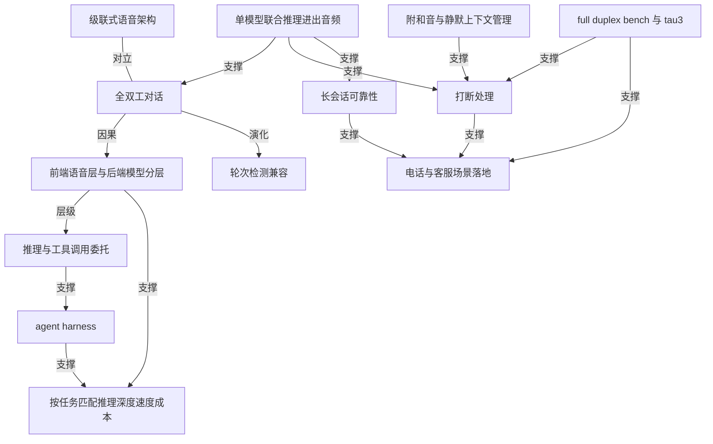

# GPT-Live-1 让 API 里的语音可以边听边说

- 原文标题：Build more natural voice experiences with GPT‑Live‑1 in the API | OpenAI
- 作者：OpenAI
- 内参日期：2026-09-11
- 来源类型：blog
- 原文：https://openai.com/index/introducing-gpt-live-1-in-the-api/
- 标签：OpenAI, 多模态

> 全双工语音模型进 API，能把推理和工具调用委派给 GPT-6 Astra 这类后端模型，自己只做前端语音层，每分钟 0.05 美元并支持电话接入。语音交互从「一问一答」变成可打断的对话，成本结构也随之拆开。

## 导读

GPT-Live-1 加入 openai api

## 核心观点

- GPT-Live-1 把 ChatGPT 里已经跑通的 full-duplex 对话搬进 API：一个模型同时"听"和"说"，而不是你说完我再说。它最初在 ChatGPT 里亮相，这次是给开发者的版本。
- 打断处理是它的核心强项，而实现方式很关键——靠的是**同一个模型对进来的音频和出去的音频一起做推理**（reasons over incoming and outgoing audio together），而不是在几个模块之间传球。
- 真正的架构变化是分层：前端语音层只负责对话的实时节奏，深层推理和工具调用 delegate 给后端的文本模型（GPT-6 Astra、Luna、Terra 或第三方模型）。对话可以继续进行，而"活"在后台干。
- 这次 API 发布的着力点不是"更像人的声音"，而是**让开发者能围绕自己的用户、工作流和目标去 steer 和定制语音体验**：语气、语速、风格都可以用 system prompt 塑造。
- 商业模型也跟着分层了：$0.05 每分钟只买前端语音层，推理深度、速度和成本由你给每个任务配的后端模型决定。

## full-duplex：从"轮流说话"到"边听边说"

- 传统语音 agent 是 turn-based（轮次制）的：一方说完，另一方才开始处理。GPT-Live-1 不是轮次模型——它能在对话正在发生时就对打断和 acknowledgement（附和）做出反应。
- 早期评估里的一个反直觉证据：Speak 的语言导师场景中，GPT-Live-1 **把打断减少了近 80%**。也就是说，"边听边说"的模型反而更懂得闭嘴——它给了学习者更多思考时间，而不是在停顿处抢话。
- Speak 联合创始人兼 CTO Andrew Hsu 的说法点明了这件事的本质："好的语言导师知道什么时候给学习者空间、什么时候介入。"
- 三个具体可感的场景被单列出来测试：说到一半改主意、走在户外或有日常背景噪音时对话、以及笑出声 / 犹豫 / 用短促的应答词 / 转头跟旁边的人说一句话再回到对话。
- 它虽然不是 turn-based 模型，但**原生支持 turn detection**——开发者想继续围绕明确的轮次边界来搭，也搭得起来。这是一条重要的迁移路径设计。

## 拆掉级联：语音层简化与委托式架构

- 传统做法是把三个东西缝起来：speech-to-text、一个推理模型、text-to-speech。原文对这套架构的批评很具体：**每一次 handoff 都在增加延迟，并制造更多丢失 timing、context 或对话自然节奏的机会**。
- 更关键的是责任落在谁身上：协调这些阶段的人往往是开发者自己——包括"有人打断了""有人停顿了""有人换方向了"该怎么办。
- GPT-Live-1 把听和说收进单一模型，简化了语音层；深层推理往后端送，于是**对话得以继续，而工作在后台发生**（this lets the conversation continue while work happens in the background）。
- 代码量上的证据来自一位联合创始人兼 CTO Tony Stoyanov：相比他们原来的 cascaded 方案，GPT-Live-1 **把代码库简化了 80%、删掉了 2.3 万行代码**，并因此把团队解放出来去改进从预约到就医导航的整段体验。
- 与 Codex 的连接示例说明了委托的具体形态：应用把对话上下文交给后端跑，拿到 finalResponse 后，用一个 `session.commentary.append` 事件带着 `delegation_id` 回灌给语音层——语音层始终在线，后端结果是"插播"进来的。

## 开发者可调的控制面

- 原文列出的六项 API 强项，可以理解成六个控制旋钮：
- **Interruption handling**：单模型联合推理进出音频，避开级联架构的延迟与脆弱交接。
  - **Reasoning & tool calling delegation**：把推理和工具调用交给后端文本模型，如 GPT-6 Astra 或第三方模型。
  - **Tone, pace, and style**：用 system prompt 塑造 agent 的语气、语速和对话风格。
  - **Silent context management & background noise**：更好地处理背景噪音和沉默，不会被噪音打断，也不会把每一步都念出来。
  - **Long-session reliability**：长时交互中的上下文保持和对话质量更稳。
  - **Telephony support**：支持把 full-duplex 语音 agent 部署到电话上，从餐厅订位到客服。
- 模型搭配是显式的成本工程：**高频任务（排期、订单更新）配 Luna 这类模型，复杂客诉配 Astra 这类需要推理的模型**——按任务匹配推理深度、速度和成本。
- 原生能力还包括：自带 ASR 转写和回复文本、较强的 alphanumeric understanding（听清字母数字混排，如订单号、验证码），以及支持 keyword biasing（把特定词汇的识别权重顶上去）。
- 这三项加起来是电话客服的硬门槛——报单号、念邮箱、确认品牌名，都是过去级联架构最容易掉链子的地方。

## 评测：full-duplex 的优势怎么量出来

- 两个头条数字：
- 在 Full Duplex Bench 上，GPT-Live-1 **比 GPT-Realtime-2.1 高出 30 个百分点**，在 turn-taking latency 和交互行为上提升明显。
  - 与 GPT-6 Astra（medium reasoning effort）搭配时，**在 Tau3 上排名第一**——这个榜衡量的是端到端任务上的前沿语音 agent 智能。
- 评测覆盖面值得注意，它测的不只是"答得对不对"，而是"在真实对话乱流里还能不能站住"：
- 航空、零售、电信三个领域的口头客服任务，用 Pass@1 衡量任务成功率，总分给三个领域等权重。
  - 口头银行支持，涉及知识检索和账户工具，Pass@1 是 97 个银行知识任务的完成比例。
  - 停顿处理、对话轮次交接、打断、backchannel（附和音）。
  - 对背景人声、对旁边另一个人说话、听者的附和、以及打断的反应。
  - 用户说完后 agent 多快开始回应（turn-taking latency）。
  - 从带自然停顿、犹豫和自我纠正的口头请求里调工具，Pass@1 打分的是工具调用序列；以及对这类请求的口头回答与参考意图的贴合度。
- 一个容易被略过的细节：工具调用类评测用的后端是 Terra（low），而客服类用的是 Astra（medium）——评测本身就是按任务配后端的示范。

## 落地证据：四个客户在说什么

- **Yelp**（CTO Alex Levy）：把 GPT-Live-1 接进 Yelp Host 和 Hatch 后，轮次交接和准确率都优于原来的语音架构，接听处理率有实质提升。最有意思的信号不是指标——"**打电话的人开始说更完整、更自然的句子**"，这说明对面感受到的体验真的变了。
- **Speak**（联合创始人兼 CTO Andrew Hsu）：Live Tutor Lessons 中，思考停顿处的打断比之前的轮次制系统少了近 80%。
- **Fin**（COO Jordan Neil）：full-duplex 把 AI 语音支持**从"停-起"节奏推向电话本来的自然流动**；客户可以停顿、打断、改方向，而 Fin 把这种自然对话与自有支持系统结合去做真正解决问题的深层工作。他称之为"语音支持走向何处的最清晰信号"。
- **Devin**（联合创始人兼 CPO Walden Yan）：和 AI 工程师协作开始像和队友协作——你可以口头过一个想法、压力测试一个方案，或者在离开键盘时把活交出去。
- 这四个场景的共同点是：语音不再是"查询接口"，而是**一段可以被打断、被暂停、被改变方向的持续关系**。

## 声音、定价与接入路径

- 声音选项从"一小撮实时语音"扩展到覆盖更多口音、方言和语言的更大集合——原文明确的落点是"让开发者对助手听起来是什么样有更多选择"，并会在未来几个月继续扩展语音选项和语言可用性。
- 定价：**$0.05 每分钟，只覆盖前端语音层**。后端模型和 agent harness 另配，于是"语音体验能随它要承担的工作一起扩展"。
- 定制语音需要走 contact sales 通道，涉及资格审核和申请流程——不是自助开通。
- 另一条路径是 OpenAI Presence：用同一个模型驱动实时语音交互，面向企业部署可信 AI agent——回答问题、解决issue、使用公司系统、执行获批的操作，并在需要时升级给人处理。
- 这条路径的定位差异很清楚：API 是给要自己搭的团队，Presence 是给要直接部署的企业。

## 概念网络

### 关键概念

#### full-duplex（全双工对话）

**context**：全文的技术地基。原文的表述是 GPT-Live-1 "is capable of listening and speaking at the same time"，并明确说它不是 turn-based model。所有下游能力——打断处理、附和响应、背景噪音容忍——都是从这一条派生出来的。

**费曼一下**：对讲机是半双工，按下说话就听不见对方，松手才轮到对方；电话是全双工，两个人可以同时出声，也因此可以插话、可以"嗯嗯"表示在听。过去的语音 AI 是对讲机，GPT-Live-1 是电话。

#### 打断处理（interruption handling）

**context**：被原文列为 GPT-Live-1 的 "core strength"，实现路径是 "a single model that reasons over incoming and outgoing audio together"，目的是避开级联架构的 latency 和 brittle handoffs。Speak 的近 80% 打断下降是它的第一个商业证据。

**费曼一下**：会话里最难的不是听懂，是判断"对方这一秒的沉默，是说完了还是在想"。模型如果只看到自己要说的话，就只会按计划念下去；同时看着自己的输出和对方的输入，才能决定是接话还是等一等。

#### 级联式语音架构（STT–LLM–TTS cascade）

**context**：原文批评的靶子。"Traditional voice agents stitch together speech-to-text, a reasoning model, and text-to-speech"，而 "each handoff adds latency and creates more opportunities to lose timing, context, or the natural rhythm of a conversation"。Tony Stoyanov 删掉 2.3 万行代码，删的就是这套缝合逻辑。

**费曼一下**：三个人接力传话——一个负责把声音写成字、一个负责想答案、一个负责把字念出来。每次交接都要花时间，而且"对方语气里的犹豫"在第一次交接时就丢了。更麻烦的是，指挥这三个人的是开发者自己。

#### 推理与工具调用委托（reasoning & tool calling delegation）

**context**：GPT-Live-1 的分工机制。它可以把 reasoning 和 tool calls 交给后端文本模型，如 GPT-6 Astra 或第三方模型；与 Codex 的连接示例展示了具体形态——后端跑完，结果通过一个带 `delegation_id` 的事件回灌语音层。

**费曼一下**：像前台接待和后台专家的关系。接待不需要什么都懂，但必须始终在场、始终能接话；遇到要查资料的问题，他一边跟你聊着，一边已经把问题递进去了。答案回来时，他自然地接上。

#### 前端语音层与后端模型的分层

**context**：这次发布最重要的架构判断，也是定价口径的基础——$0.05 每分钟买的是 "the front-end voice layer"，后端模型和 agent harness 由开发者自己配。

**费曼一下**：把"会说话"和"会思考"拆成两笔账。说话这层永远要在线、要实时、要便宜；思考那层可以按题目难度临时叫不同的人来。拆开之后，你才能为一个简单问题少花钱，为一个复杂问题多花时间。

#### agent harness

**context**：原文反复出现的第三个可选件——"Developers choose the models, tools, and agent harness behind the conversation"。它是包在模型外面、决定 agent 怎么调工具、怎么走流程的那层脚手架。

**费曼一下**：模型是发动机，harness 是车身和方向盘。同一台发动机，装在卡车上和装在赛车上，能干的事完全不同。OpenAI 这次只卖发动机里的"嘴巴"部分，车身你自己挑。

#### turn detection（轮次检测）与非轮次模型

**context**：一个兼容性设计。原文写得很直接：GPT-Live-1 虽然 "is not a turn-based model"，但 "it natively supports turn detection"，所以开发者可以继续围绕明确的轮次边界来构建。

**费曼一下**：模型内部不再按"你一句我一句"运作，但它仍然能告诉你"这一句结束了"。好比一个能自由插话的人，你问他"刚才那段话说完了吗"，他还是答得上来——旧的程序逻辑因此不用推倒重写。

#### backchannel（附和音）

**context**：评测维度之一，与 pause handling、turn taking、interruption 并列；也出现在使用建议里——"use short acknowledgments"。原文把 acknowledgement 与 interruption 并列为模型要即时反应的对象。

**费曼一下**：就是"嗯""对""是吗"这些不打断对方、只表示"我在听"的短促声音。人类对话靠它们维持节奏，而轮次制系统会把每一个"嗯"都当成"该我说了"，于是对话变得磕磕绊绊。

#### silent context management（静默上下文管理）

**context**：六项 API 强项之一，与 background noise 处理绑在一起——"Better handles background noise and silence without interrupting the conversation or narrating every step out loud"。

**费曼一下**：懂得什么时候不说话，和懂得什么时候说话一样重要。模型在后台等一个查询返回时，不必每隔两秒报告一次"我还在查"；旁边有人咳嗽时，也不必以为是在跟它讲话。沉默本身是对话的一部分。

#### alphanumeric understanding 与 keyword biasing

**context**：原生能力中容易被略过但对落地至关重要的两项——GPT-Live-1 "offers strong alphanumeric understanding and supports keyword biasing"，与自带 ASR transcripts 和 response text 并列。

**费曼一下**：前者是听得清"订单号 B7 减 4 幺 3"这种字母数字混排；后者是允许你提前告诉模型"我们这行会频繁出现这几个词"，让它优先往那边听。客服电话里出错最多的恰恰是这两类内容。

#### Full Duplex Bench 与 Tau3

**context**：衡量这次进步的两把尺子。前者上 GPT-Live-1 比 GPT-Realtime-2.1 高 30 个百分点；后者衡量 "frontier voice-agent intelligence on end-to-end tasks"，GPT-Live-1 配 Astra（medium）排第一。

**费曼一下**：一把尺量"对话节奏对不对"——打断、停顿、附和、回应有多快；另一把量"事儿办成了没有"——真去订位、查账、改单，最后成没成。语音 agent 必须两把尺都过，只会说话不办事，或者办得成却让人尴尬，都不算及格。

#### 按任务匹配推理深度、速度与成本

**context**：分层架构带来的直接方法论。原文举例：高频任务如 scheduling 或 order updates 配 Luna 这类模型，复杂客诉配 Astra 这类模型，"That flexibility lets developers match reasoning depth, speed, and cost to each task"。评测中工具调用类用 Terra（low）、客服类用 Astra（medium），正是这一原则的示范。

**费曼一下**：不要用同一个大脑处理所有问题。查一下明天有没有位子，和处理一个投诉了三次的客户，需要的思考量差了几十倍。过去这两件事被迫共用一个模型和一个价格，现在可以分开定。

### 概念网络



整张网络有一个源头：全双工对话。它既是技术事实，也是这次发布所有主张的前提。它的直接对手是级联式语音架构——两者的张力不是"谁更准"，而是"对话的时间线由谁掌握"。级联架构把一条连续的时间线切成三段，每段交接都在丢时间、丢语气、丢上下文；全双工把时间线还给模型自己。

支撑全双工的具体机制是单模型联合推理进出音频。这一条同时向三个方向发力：它让打断处理成为可能（因为模型看得见自己正在说什么、也看得见对方正在说什么），让附和音与静默上下文管理有了落点（知道哪些声音不是在跟自己说话），也支撑了长会话可靠性（上下文不在交接中被反复重建）。这三者是同一个机制的三个切面，不是三个独立功能。

第二层结构是分层。全双工带来的不只是体验变化，更是职责重划：前端语音层只管对话的实时节奏，深层推理和工具调用被委托出去。这一层往下长出两个东西——agent harness 作为开发者自己掌控的编排层，以及"按任务匹配推理深度、速度与成本"这条方法论。后者同时被分层和 harness 两侧支撑：分层让不同深度的模型可以插拔，harness 决定具体怎么插。定价只覆盖前端语音层这件事，是这条网络在商业侧的投影。

轮次检测兼容是一条特殊的边：它不是全双工的强化，而是全双工对旧世界的让步。模型内部不再按轮次运作，却仍然对外提供轮次边界，让已有的轮次制代码不必推倒重来。这是演化关系，不是支撑关系——它存在的理由是迁移成本，不是能力本身。

网络的终点是落地与验证。电话与客服场景之所以成为主战场，是因为它同时需要打断处理和长会话可靠性这两样最难的东西——一通电话既充满噪音和插话，又必须从头到尾记得客户说过什么。而 Full Duplex Bench 与 Tau3 这两把尺子，恰好一把指向打断与节奏，一把指向端到端把事办成——评测的结构本身就复刻了这张网络的两条主干。

## 费曼 x3

语音 AI 最难的部分，从来不是听懂一句话，而是判断沉默。对方停下来的这一秒，是说完了，还是在想？过去十年的语音系统对这个问题给出了同一个廉价答案：等静音超过某个阈值，就当他说完了。于是所有对话都被压成了对讲机的形状——按下、说话、松手、等待。我们习惯了对着机器把话一口气说完，不敢停顿，不敢改口，甚至不敢笑。

边听边说改变的正是这件事。一个模型同时对进来的音频和出去的音频做推理，它就不再只是"执行一份说话计划"，而是持续地在判断要不要继续说下去。最能说明问题的证据是反直觉的：一个能随时插话的模型，打断反而少了近 80%。因为真正的打断从来不是技术能力问题，而是判断力问题——好的语言导师知道什么时候给学习者空间、什么时候介入。有了空间判断，抢话才会消失。

第二件被重新拆开的事，是"会说话"和"会思考"。过去它们被绑在一起卖，于是每一次简单的查询都要付出复杂推理的成本和延迟。现在语音层只管对话的实时节奏，深层推理往后端送，对话得以继续，而工作在后台发生。这句话值得慢读一遍——它描述的不是性能优化，而是一种新的在场方式：前台的人一边跟你聊着，一边已经把问题递了进去。人类的专业服务一直是这么运作的，只是软件此前做不到。

架构上的清账来得比预想的更狠。一位 CTO 说他们因此简化了 80% 的代码库、删掉两万三千行——那些代码干的全是同一件事：在把声音写成字、把字想成答案、把答案念成声音的三次交接之间，徒劳地缝补时间、语气和上下文。每一次交接都在加延迟，也在制造更多丢失的机会。而指挥这场接力的，一直是开发者本人。

最值得留意的信号，反倒藏在一句不像指标的话里：接电话的人开始说更完整、更自然的句子。人对着机器时会本能地压缩自己——短句、关键词、不敢有废话。当这种压缩自动消失，说明对面被感知成了一个可以打断、可以改主意、可以随便聊的对象。那一刻，衡量语音 AI 的标准就不再是它说得多像人，而是我们说得多像自己。

## 阅读原文

September 10, 2026

GPT‑Live‑1 brings ChatGPT’s natural, full-duplex conversations to the API, with more control over how voice agents speak and act.

Listen to article4:53

Share

We’re launching GPT‑Live‑1 in the API, giving developers a powerful, natural voice model for building voice-enabled apps and business workflows. [First introduced in ChatGPT](https://openai.com/index/introducing-gpt-live/), GPT‑Live‑1 is capable of listening and speaking at the same time, and, as [seen with Codex and ChatGPT Work⁠](https://www.youtube.com/watch?v=E0ZMOschrTU), can delegate deeper reasoning and actions to the models and tools it is paired with.

For the API release of GPT‑Live‑1, we’ve focused on new capabilities that let developers steer and customize voice experiences around their users, workflows, and goals. A core GPT‑Live‑1 strength, smooth interruption handling, is already delivering business impact: in early evaluations, Speak found that GPT‑Live‑1 gave learners more time to think before the language tutor responded, cutting interruptions by almost 80% versus previous turn-based systems.

Key strengths of GPT‑Live‑1 in the API:

- Interruption handling: Improves interruption handling via a single model that reasons over incoming and outgoing audio together, avoiding the latency and brittle handoffs of chained STT–LLM–TTS architectures.
- Reasoning & tool calling delegation: GPT‑Live‑1 can delegate reasoning and tool calls to a backend text model like GPT‑6 Astra or a third-party model.
- Tone, pace, and style: Lets developers shape an agent’s tone, pace, and conversational style through the system prompt.
- Silent context management & background noise: Better handles background noise and silence without interrupting the conversation or narrating every step out loud.
- Long-session reliability: Improves context retention and conversational quality across extended interactions.
- Telephony support: Enables deployment of full-duplex voice agents for phone calls, from restaurant reservations to customer support.
Start a session and speak naturally. Interrupt, laugh, change your mind - try it at home or in a loud space like a coffee shop or city street.

Start session

See what it can do

- Talk over it—naturally. Ask for help, then interrupt mid-response to change the question or add detail.
- Take it with you. Try a conversation while walking outside or with everyday background noise, and see how it stays with you.
- Make it playful. Laugh, hesitate, use short acknowledgments, or briefly talk to someone nearby—then continue the conversation.
This demo is time-limited. By using it, you agree to OpenAI's [Terms](https://openai.com/policies/terms-of-use/) and acknowledge our [Privacy Policy](https://openai.com/policies/privacy-policy/).


00:00

Yelp Host seamlessly secures a reservation with GPT‑Live‑1 handling background noise, side conversations, and interruptions.

### Simplify your voice-agent architecture and reduce voice latency

Traditional voice agents stitch together speech-to-text, a reasoning model, and text-to-speech. Each handoff adds latency and creates more opportunities to lose timing, context, or the natural rhythm of a conversation. Developers are often the ones left coordinating those stages, including what happens when someone interrupts, pauses, or changes direction.

GPT‑Live‑1 handles listening and speaking in a single model, simplifying the voice layer. It can respond to interruptions and acknowledgements as they happen, while delegating deeper reasoning to the back end. This lets the conversation continue while work happens in the background.

> “Compared to our cascaded build, GPT‑Live‑1 simplified our code base by 80% and removed 23K lines of code. This enabled natural, real-time patient conversations & freed our team to improve the experience from booking an appointment to navigating care.”

—Tony Stoyanov, Co-Founder & CTO

Developers choose the models, tools, and agent harness behind the conversation. For example, they might pair GPT‑Live‑1 with a model like Luna for high-volume tasks like scheduling or order updates, and use a model like Astra for complex customer issues that require reasoning. That flexibility lets developers match reasoning depth, speed, and cost to each task.

GPT‑Live‑1 natively provides ASR transcripts and response text. It also offers strong alphanumeric understanding and supports keyword biasing. Although GPT‑Live‑1 is not a turn-based model, it natively supports turn detection, so developers can continue to build around explicit turn boundaries.

### Measuring the full-duplex advantage

Across our evaluations, GPT‑Live‑1 improves Full Duplex Bench performance by 30 percentage points over GPT‑Realtime‑2.1, with large gains in turn-taking latency and interactive behavior. Paired with GPT‑6 Astra at medium reasoning effort, it also ranks #1 on Tau3, which measures frontier voice-agent intelligence on end-to-end tasks.

Evaluates spoken customer-service tasks in airline, retail, and telecom domains. Pass@1 measures task success; the headline gives each domain equal weight.

- GPT Live backend: Astra (medium).
Evaluates spoken banking support with knowledge retrieval and account tools. Pass@1 is the fraction of 97 banking_knowledge tasks completed successfully.

- GPT Live backend: Astra (medium).
Evaluates pause handling, conversational turn taking, interruptions, and backchannels.

Tests reactions to background speech, speech to another person, listener backchannels, and interruptions.

Measures how quickly the agent starts its reply after the user finishes a turn.

Tests tool use from spoken requests containing natural pauses, hesitations, and self-corrections. Pass@1 scores the tool-call sequence.

- GPT Live backend: Terra (low).
Evaluates the spoken answer to tool-using requests containing pauses, hesitations, and self-corrections. Scores how well the answer matches the reference intent.

- GPT Live backend: Terra (low).

### What customers are saying

1 of 4

> “Adding GPT‑Live‑1 into Yelp Host and Hatch improved turn-taking and accuracy over our traditional voice architecture. When Yelp Host uses GPT‑Live‑1 to answer calls, like reservations and food orders, we're seeing meaningful improvements in call handling rates. Callers are also speaking fuller, more natural sentences, which tells us the experience on the other end of the phone feels genuinely different.”

—Alex Levy, Chief Technology Officer

> “A good language tutor knows when to give learners space and when to step in, and GPT‑Live‑1 brings that naturalness to Speak’s Live Tutor Lessons—in our early evaluations, it cut interruptions during thinking pauses by almost 80% compared with previous turn-based systems.”

—Andrew Hsu, Co-founder & CTO

> “GPT‑Live-1 shows what a full-duplex model can unlock: It moves AI voice support from the stop-start rhythm toward the natural flow of a phone call. Customers can pause, interrupt, and change direction naturally; voice delivery is a clear step forward; and Fin can combine that natural conversation with its proprietary support system to do the deeper work needed to resolve the issue. For us, this is the clearest signal yet of where voice support is heading.”

—Jordan Neil, COO

> “With Devin and GPT‑Live‑1, working with an AI engineer starts to feel more like collaborating with a teammate. You can talk through an idea, pressure-test an approach, or just hand off work while you’re away from your keyboard.”

—Walden Yan, Co-Founder and CPO

### New voice options

Developers need voices that fit their product and sound natural to the people using it. With GPT‑Live‑1, we’re expanding from a small set of real-time voices to a broader selection across accents, dialects, and languages giving developers more choice in how their assistants sound.

Listen to the new voices

Listen00:00

Australian English influenced

We’ll continue to expand voice options and language availability over the coming months.

### Pricing & Availability

GPT‑Live‑1 is available [in the API today⁠](https://developers.openai.com/api/docs/live) at $0.05 per minute for the front-end voice layer. Pair it with the backend model and agent harness that fit your product, then build a voice experience that can scale with the work it needs to do.

#### Connecting GPT-Live-1 to Codex

```javascript
import { Codex } from "@openai/codex-sdk";
const thread = new Codex().startThread({
workingDirectory: "./repo",
sandboxMode: "read-only",
approvalPolicy: "never",
});
async function answer(live, delegationId, context) {
const { finalResponse } = await thread.run(
`Answer the latest question using this repo.
Reply in two short spoken sentences.\n${context}`
);
live.send({
type: "session.commentary.append",
delegation_id: delegationId,
content: finalResponse,
});
}
```

Connecting GPT-Live-1 to Codex. This excerpt shows how an application passes conversation context to Codex and returns its answer to GPT-Live-1. Connection setup and delegation handling are omitted.

For custom voice access, [contact sales](https://openai.com/contact-sales/) to learn more about eligibility and the request process.

Another way to build voice workflows on top of GPT‑Live‑1 is with [OpenAI Presence](https://openai.com/index/introducing-openai-presence/), which uses the model to power real-time voice interactions. Presence helps enterprises deploy trusted AI agents that can answer questions, resolve issues, use company systems, take approved actions, and escalate to people when needed. Reach out to your OpenAI account director to learn more.

- API Platform
- 2026

### Author

OpenAI

### Keep reading

[View all](https://openai.com/news/)


[Now everyone can put data to workProductSep 10, 2026](https://openai.com/index/put-data-to-work/)


[GPT-6 Astra: The next generation in intelligence for workProductSep 9, 2026](https://openai.com/index/gpt-6-astra-next-generation-work/)


[Introducing ChatGPT Images 2.5ProductSep 8, 2026](https://openai.com/index/introducing-chatgpt-images-2-5/)
