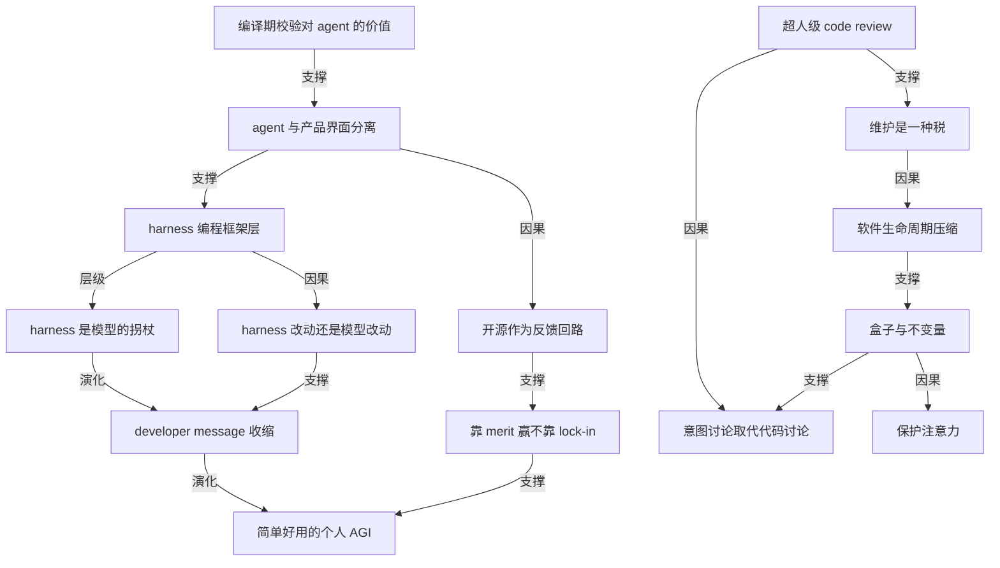

# 对话 Codex 创造者之一 Tibo Sottiaux

- 原文标题：Building Codex with Tibo Sottiaux
- 作者：The Pragmatic Engineer
- 内参日期：2026-09-11
- 来源类型：YouTube
- 原文：https://www.youtube.com/watch?v=sLSTM9znQNs
- 标签：OpenAI, agentic engineering, harness engineering

> Tibo Sottiaux 是 Codex 的创建工程师之一，现在负责 OpenAI 的核心产品与平台组织，也因为频繁发额度重置公告成为 Codex 最公开的一张面孔。这期讲的是 Codex 是怎么造出来的——和今天发布的 Agents API 正好互为前后文。

## 导读

对话 openai 的 Tibo

## 核心观点

- Tibo Sottiaux 是 OpenAI Codex 的早期创造者之一，并领导整个 Codex 团队。这期对谈里他把 Codex 的三条主线讲透了：harness 与模型如何共同设计、开源与不绑定自家模型这两个反直觉决策为什么成立、以及当维护和重构变得极其便宜之后，软件工程的重心迁移到了哪里。
- 全篇最有穿透力的一句判断是：**harness 在任何时刻都比模型领先一步**。harness 的本质是给模型架的一堆「拐杖」（crutches）——护栏、安全、可控性、每轮注入的 developer message——让当下能力有限的模型稳定完成任务。随着模型变强，developer message 会缩短，harness 也会缩短。团队日常最核心的决策因此不是「做什么功能」，而是「这件事应该改 harness 还是改模型？如果改模型，一个月能拿到吗？三个月？六个月？」——如果模型很快就能解决，harness 里干脆什么都不做，等模型。
- 早期架构决策被反复强调：把 **agent 内核**和**产品界面**当成两样东西，用 Rust 划出边界。不是因为 Rust 对模型友好（当时模型在 Rust 上并不 on distribution），而是因为「如果你把所有东西写在同一个代码库、同一种语言里，你必然会有点草率，会把本不该缠在一起的东西缠在一起，然后它会阻碍后续的创新」。
- 开源（CLI、SDK、app server）和支持第三方模型，Tibo 的理由都指向同一个词：**靠 merit 赢，而不是靠 lock-in**。「如果你在做一个优秀的编程 harness，为什么要把它和自己的模型耦死？」何况开源之后，别人只要改 10 行代码 fork 一份就能接别家模型，那还不如一开始就支持。
- code review 的角色正在迁移。正确性与安全性已经交给模型——OpenAI 内部 PR 的安全审查是强制的，被标记出安全问题的 PR 直接禁止合入，benchmark 上模型在 code review 上已是「超人级」。留给人的只剩**意图**：你到底想干什么，这件事该不该做。而这类讨论根本不必发生在代码周围。
- 维护是「随时间缴纳的一笔税」，它不会消失，但大部分会被自动化。真正被抬高价值的反而是软件工程的老规矩：好的抽象、画对边界。因为「盒子」画对了，盒子里怎么改都不影响其他部分，也就不需要讨论——这恰恰是在**保护注意力**。

## 成长与职业路径：一条「为别人造工具」的主线

- 8 岁时父母从布鲁塞尔搬到一个只有约 200 人的村子，没什么人可交朋友，于是「被困」在了计算机和早期互联网里。他说自己反倒要感谢父母搬去了那个荒僻的地方。
- 大学读应用数学，提前毕业；读书期间就开小公司做咨询，给银行做事，对供应链和应用数学问题着迷。他对纯数学与应用数学的分野讲得很清楚：理论数学是因为「有东西可发现、有美感」，而现实世界里「到处躺着这些很酷的问题」，他想知道怎么用复杂数学把周围的世界优化掉。
- 第一家创业公司做**制药供应链**——临床试验的药品该产多少、送到哪、怎么避免浪费，用的全是传统优化方法：蒙特卡洛模拟、随机多阶段优化。同一套方法后来也应用到欧洲的钢铁业和电网。这家公司至今还在。
- 2015 年进 Google London，第一个项目不是地图，而是在**广告部门**内部做「让移动端网页更快」的小组，目的是对冲流量向移动端迁移带来的广告收入损失。做了大约两年后被砍：一位 VP 从加州飞来，说「你们只有几百个用户，这显然不是 Google 的规模」。
- 他把这段当成职业生涯里最重要的一课：没有 PMF、没有对的用户、没有对的反馈回路，以及——**不要在产品经理说「项目进展很好」的时候就相信他**，尽管那时项目其实一塌糊涂。「永远要质疑，永远要深想你正在产生的影响，以及你所贡献的整个项目的重要性。」
- 之后转 Google Maps 做评论，一年后转去 DeepMind，被 AlphaGo 那个时期的氛围吸引。在 DeepMind 做的是研究基础设施与研究工具——这条「造工具让别人更高效」的主线，他一做就是近十年。

## 一个比 ChatGPT 早一年的内部聊天机器人

- 在 DeepMind 内部，有一个小组在推大语言模型，但那不是 DeepMind 的主线（主线是 grand challenges、游戏、RL）。当时的热议命题是：「如果超大规模文本语料就是一切呢？如果把语言推到极致、把语言模型 scale 上去，这是否足以走到通用智能？」
- Tibo 当时在为研究者造工具，很自然就问出了那个工程问题：怎么把这个模型呈现给研究员？他们怎么 debug 输入输出？顺着做下去，最后就做成了一个聊天系统。
- 早期模型「有点荒谬、不太连贯、也不太有用」，但极其好玩。这个内部应用「像野火一样蔓延」，所有人都在 DeepMind 内部分享自己和它的小对话——「它感觉起来已经不只是一个研究项目，或者说不只是给研究员用的研究项目了」。
- 后来有把它作为外部产品发布的愿望，但 DeepMind 当时并不是那种建制。他对 Google 的评价相当克制而准确：那套「受祝福的生产栈」（blessed production stack）经过多年打磨，把事情做好的能力极强，但作为一个**真正创新**的环境，它也极其艰难。

## 加入 OpenAI 与 Codex 的起源

- 他离开的理由不是不舒服——他承认在 Google 很舒服——而是想加入一个真正相信的使命，并且这个使命是**直接**影响世界，而不是「我们在这边做这份工作，然后让别人去想怎么把它变得有用」。他要的是研究和产品**共同设计**（co-designing）的地方。
- 打动他的一个具体细节：他见了几个 OpenAI 的人，发现「你们只有大概 20 个人在做 ChatGPT？这个数字小得离谱」——那意味着极高的授权度。
- 加入即赶上 pre-reasoning 阶段，一个月后公司就发布了 o1 preview。他形容那是令人振奋的。
- Codex 的源头不是产品规划，而是他的老本行：为研究造基础设施。有了 o1 preview 之后，「非常清楚我们必须用模型本身来让我们自己更快」。他和研究侧的人一起训练内部模型，让它对 OpenAI 的 **Python 代码库**极其熟练，并且在架构品味、代码风格上有好的判断，再用它快速搭基础设施、帮研究员写代码。这些内部小 agent 才是 Codex 真正的前身。
- 关键的转折来自 Greg Brockman 和 Sam Altman 的支持——Greg 「非常坚持」不能只服务 OpenAI 自己，要让世界受益，于是这个研究工具被推成了产品。此时这条线与内部的 A-SWE（autonomous software engineer，自主软件工程师）努力合并，产出的第一版云端 Codex **并没有 PMF**，因为摩擦太高；随后才有 Codex CLI。

## 为什么用 Rust 写：一条架构边界

- 从第一性原理出发，团队很早就把**产品界面**和 **agent** 当成两件不同的东西。agent 的内核必须健壮、安全、为效率和规模而工程化。
- 「早期决策其实相当重要，只要你别为此牺牲太多速度」——这是一个 trade-off，不是教条。
- 具体理由有三层：团队里有非常出色、高产的 Rust 开发者；内部模型在 Rust 上并不差；Rust 在**编译期**给出大量校验，静态可验证，而这一点「对 agent 也很棒」。
- 他并不认为语言选错就会失败：用 TypeScript 甚至 Python 也可能成功，「然后我们某个时候会重写它」。真正不可替代的是那条边界——agent 可以脱离产品独立存在。
- 原话值得记住：「如果你把所有东西写在同一个代码库、同一种语言里，你必然会有点草率，会把本不该缠在一起的东西缠在一起，然后它会阻碍此后的进一步创新。」
- 主持人把这层意思翻译成工程师能用的话：值得提前想清楚你希望这东西将来在哪里——哪怕在 agent 时代重写成本已经低很多，你依然可以靠一开始就搭对脚手架，给自己省下返工。

## 开源：收益、代价，以及不绑定自家模型

- 开源的初衷带着一点自指的浪漫：你做的是一个编程 agent，那你**当然**会把它指向它自己，也许还能聚起一群用它来改进它的贡献者，并从中学到很多。
- 另一条更深的理由：他们当时就判断「**开源本身会改变，代码的角色本身也会改变**」，那就应该置身这个社区之中，而不是与它割裂——「如果你自己不亲眼目睹问题，是很难解决问题的」。
- 还有一层是姿态：他们不掌握全部答案，所以干脆公开说「一个好的 harness 长这样，我们是这么想的」，做了几篇很技术的深度博客，把这件事变成一个**公平的赛场**，鼓励外界折腾与探索。
- 实打实的收益：
- 仓库小而公开，招人时新同事「之前就看过这个仓库、看过 PR」——onboarding 基本上已经完成了；入职就用 Codex 一起读仓库、随便提问，因为它不是秘密。
  - 拿到很多高质量贡献。
  - 团队能量：不是嘴上说在乎社区，而是做出你看得见的事，「这是要花力气的，我们本可以不做」。
- 代价同样被他坦率列出：
- 和公司其余代码分离，有时得画出**人为的边界**，跨多个仓库工作。
  - 正在做某个特别兴奋的东西、在公开处构建时，「别人会在我们来得及发布之前就抄走」，「确实有点扎心」。但他也认账：这是你签下的契约的一部分，许可证很宽松，你就得接受。
  - 被随机贡献的「海啸」淹没，得付这笔额外的税——不过这反过来又推着他们去解决这个问题。
- 支持第三方模型是同一套逻辑的延伸：
- 「如果你是这个社区的一部分，在做一个优秀的编程 harness，为什么要把它和你的模型耦死？」那个决定「让人失望」，「感觉不对」。
  - 现实推演也导向同一结论：开源之后任何人 fork 一份、加 10 行代码接上别家模型是轻而易举的事，那只会把人推去用 fork，凭空多出维护开销——「那为什么不一开始就支持？」
  - 收益是可选性（optionality）：今天你喜欢 OpenAI 的模型，明天出了新模型你想试，何必逼你换掉整套配置？而且他们能收到「你在那个模型上喜欢/不喜欢什么」这类原本拿不到的反馈。这种可选性对合作的企业客户尤其重要。
  - 主持人点破了这套做法的诚实之处：它逼着整家公司在模型层和 harness 层**处处都要竞争**，没法靠一个锁定点躺平。Tibo 的回应是：「我想靠最好的模型、最高效的模型、最好的产品来赢得用户」，如果靠某一处强迫用户使用，「我也不认为这能吸引最优秀的人来做这个产品」。他的原话是——**我喜欢靠 merit 赢，而不是靠 lock-in**。

## harness 今天怎么跑：沙箱、本地与云

- 默认在**沙箱**里运行，默认全部在你的本地机器上，这一点已经持续一年多。任何需要沙箱之外权限的命令都会向用户请求许可，所有工具执行都发生在沙箱内。
- 也可以选择在**云端**跑：一个受管的 VM，和 ChatGPT work 模式拿到的是同一个 VM，跑在 kata container 这样的安全环境里，可以检查。此时本地只剩下你的输入和流式回传的输出——对 CPU 友好，可扩展性高得多。
- 未来方向是本地与云端**无缝混合**：部分在笔记本执行、部分在云机器执行。底层理由是能力推演——模型越强，能调动的算力和资源就越多，远超本地机器能提供的，「到某个时点，只限制在本地执行就会变成一个约束」。
- 关于云开发环境的复活判断很有意思：2022–23 年热过一轮的 cloud dev box 在大公司之外从未真正起飞，因为**前期成本大 + 还要付维护成本**，单干或小团队根本不划算。但现在有了 agent，「配置几乎是免费的」——把本地那套 SQLite、本地服务、MCP 同步到云端开发机有多难？如果模型能替你做，那也许就没那么难。他因此预判：**全云端编排的机器会迎来复兴**，把你从笔记本上解放出来。
- 他自己的体感证据来自 ChatGPT work 的移动端：一天从在咖啡旁口述一堆任务开始，它有日历、邮件、Slack 的访问权，「不必随身带笔记本也能把事做完」。

## harness 与模型：harness 永远领先一步

- 这是全篇的题眼。Tibo 说：「harness 在某种意义上总是比模型稍微领先一点。」
- 展开的解释是：模型有它当下的能力，然后你给它配上**几根拐杖**，让它真的能把事做到你期待的可靠度、效率和行为。harness 的角色就是提供护栏、安全性，让它更高效、更可引导、更可控；harness 还负责所谓 **developer message**——在每一轮开始时注入上下文，影响 agent 整个回合的行为。
- 主持人问的那个具体现象由此被解释清楚：早期 Codex 改完代码不会自己跑单元测试，你得提醒它；几个月后它自动跑了。这既不是纯 harness 的功劳也不是纯模型的功劳——**先是 harness 里的提醒，然后训出一个更善于反思「你要我做这件事时到底真正想要什么」的模型**，于是你不用再说了。
- 结论是一条趋势：随着时间推移，**系统 / developer message 在缩短，harness 也在缩短**。
- `/goal` 命令是这条趋势最锋利的例证。它当初是必要的，为了把模型锁在一个单一目标上、长时间不跑偏，让模型能连续跑上几天甚至几周。而以新一代模型来看，「你不再需要 `/goal` 了，你不需要围着它加一层 harness，你就直接告诉模型：去干一周的活。它真的会去做。」
- 主持人在片尾承认这让作为开发者的他有点泄气：你造的东西下一代模型自带就有了。但他也补了一句自己的判断——这不只是造拐杖，也是在造**模型将来要用的工具**，下一代模型不会自己重新发明 MCP 协议、skill 或插件。*（此为主持人观点，非 Tibo 原话。）*

## 团队怎么定目标：改 harness 还是改模型

- 这是一个研究团队和工程团队之间的协作过程，绝大多数东西都是**共同设计**出来的。
- 决策的标准问法是：「我们今天在这件事上很好，在那件事上不好；同时我们想做另一件事，因为那会是很酷的产品功能。那么——**这应该是一个 harness 改动，还是一个模型改动**？」
- 如果判断为模型改动，接着问时间：一个月？三个月？六个月？依据「多快能在哪一层训练里修好它」，他们**可能决定在 harness 里干脆什么都不做，就等模型解决**。
- 反馈处理本身也是 agent 化的——「agents all the way」：用 agent 分析大量反馈、归纳主题、辅助讨论、决定优先级。分析范围横跨整个编程领域，也横跨金融、传播、市场等其他用户在用 agent 的领域及其子类。
- 一个值得注意的机制：随着预训练模型变好、整体模型变好，「**整个东西被一起抬起来**」；在此之上才是那些需要额外多花心思的局部。

## 在 OpenAI 内部，事情是怎么做成的

- 新人入职，听到最多的一句话是：「**你问过 Codex 了吗？**」
- 因为在 OpenAI，Codex 默认接进了一切——Slack、所有文档、所有代码。「新人至今仍会惊讶于：你基本上什么都能问它，而且它经常就是能给出很好的答案。」
- 于是最快理解一个项目的现状、谁在做什么、某个决定为什么这么做，路径是——**Codex 内部全都知道**。
- 这背后有配套的组织习惯：大量工作放在**公开频道**里做，文档开放相当宽的权限，为的就是让每个人、以及**每个人的 agent** 都能读到并推理。团队还有一些尚未发布、对协作效率很有帮助的东西。
- 团队原则相当朴素：在乎用户、在乎产品的连贯性、在乎模型以及模型将去往何处。其中一条判据很锋利——「如果你正在写 10000 行代码去绕过模型的缺陷，那你多半在做错的事。」这些与其说是规章，不如说是团队文化与气质，靠老带新传下去。
- 发布流程出人意料地一致：无论你发的是 Codex（他提到刚越过 2000 万活跃用户）还是 ChatGPT（十亿级活跃用户），「你可以提一个 PR，第二天甚至当天就发出去，直接面向十亿用户，而且没问题」。
- 支撑这件事的是**主人翁意识与在乎**——人被充分授权去做改动，甚至是大改动。
  - 唯一被普遍要求的是**证据**：有证据表明它会被好好接纳，是一个值得加的东西。
  - 以及维护成本已显著下降这一前提，「所以我们思考这些事的方式和两三年前已经略有不同」。
  - 其余尽可能自动化：code review、部署、捕捉回归，几乎全自动，人得以只关注想法本身和它怎么帮到用户。
- 北极星方向是一个「令人愉悦、简单好用的**个人 AGI**」：知道关于你的一切该知道的，能访问对的资源，有时能代你采取有风险的动作——但会给你推送通知让你确认；它知道你的日程、你的目标，能主动行动；通过自然语言、语音控制，甚至也许能通过摄像头理解你的情绪。他给出的判据是：「**AGI 应该简单好用**」，而不是一个有十个按钮和一堆配置项的东西。

## code review 的角色迁移

- 主持人把问题问得很实：Google 以严格的 code review 文化著称（他提到有两层评审，包含语言正确性评审），而 code review 历来的收益是知识共享、第二双眼睛、消除巴士因子、围绕架构而非仅代码展开对话。现在代码多了这么多，这些收益还剩什么？
- Tibo 的回答是：**code review 的角色正在改变**，并且他们很早就动手了。他在 Codex 上最早的项目之一，就是和研究一起开发一个 **code review 模型**。
- 目标定得很高：能发现逻辑与推理层面的错误——那种人类需要**好几个小时**才能抓到的错误，因为它要求深挖依赖、意识到文档可能是错的、第三方依赖的实现可能与你的预期不同，于是你的不变量并不成立，除非你是那个库的专家，否则你根本不会知道，于是你有了一个 bug。
  - 这些能力现在已经融进主线模型。「当我们做 benchmark 时，它们在 code review 上是**超人级**的。」
  - 不止正确性，安全性同样如此：模型能跨越非常复杂的东西做推理，指出「你这里有一个严重的安全漏洞」。这一步在 OpenAI 内部**所有 PR 上都是强制的**，被标记出安全问题的 PR 会被**阻止合并**，全自动。
- 那么人还剩什么？Tibo 的拆解是，code review 一直同时承担两件事：正确性保障，以及一个**信息交换的小仪式**——让大家在同一个页面上，鼓励讨论（这讨论本来更应该在写代码之前发生，但有时只在代码周围才真的发生，因为代码一旦合并就真的跑在生产上，而且你还得维护它）。
- 他判断正确性和安全性这两块会被自动化，剩下并且真正在发生的，是围绕 **PR 的意图**的讨论：「你到底想做什么？这件事该不该做？」——而**这个讨论完全可以发生在 PR 之外，不必围绕代码**。
- 主持人的补充很有共鸣：回想过往的 code review，有时确实学到很好的东西，但更多时候是纯粹的痛苦——你追着别人「能帮我看下代码吗」，对方说现在很忙，然后你被迫上下文切换。收益与代价一直并存，只是现在两者的位置在移动。
- Tibo 归纳出的新形态就是「**盒子**」：你先就盒子本身和它对外的整体契约达成一致，只要在资源占用、数据访问、安全性这些方面有严格保证，那么**盒子里面装的可以字面意义上是任何东西，你真的不需要在意**。真正需要达成一致的是：这个盒子到底做什么，以及哪些**不变量**必须被满足。
- 这件事值得好好谈一次，也许可以由你喜欢的 agent 辅助；但一旦谈定，盒子内部的任何改动都不再需要讨论——「这**真正地保护了你的注意力**」。

## 维护变便宜之后，什么反而更贵了

- Tibo 给维护下的定义很准：「维护真的就像是你随时间缴纳的一笔税，只为了让东西还能跑。」它一直是必要的，也将继续必要——**改变的是它的大部分将被自动化**。
- 最典型的例子是第三方依赖升级：只要 changelog 够好、代码有文档、模型能推理，你就能「在几个小时里把整个代码库扫一遍」。以前你会把这件事一直往后拖，因为它是最不好玩的事——但它对业务、对项目其实很重要，**尤其是安全补丁，你需要保持在最新**。
- 重构与重新架构同样被加速。以前为了给新的取舍腾空间、为了新的负载理解、为了塞进新功能而彻底重做架构，「是一件非常非常昂贵的事，有时要好几年」，现在被超级加速了；犯错的成本在下降。
- 但他紧接着给出反向的一半，这是本节最重要的判断：**软件工程的老规矩反而回来了**——好的抽象真的有帮助。「如果你把形状画对了，你就能在盒子里面快得多地改动，而不影响其余服务、其余基础设施。」以及：要为**极快的迭代**而设计。
- 主持人引入了一个佐证：Peter Steinberger 告诉他，自己已经不读代码了，但一直在思考代码——他把**架构装在脑子里**，频繁重构架构，思考怎么做到模块化，让 100 个贡献者各建各的、互不踩脚。
- 由此推出的迁移是：这种规划与结构化的能力，过去主要属于架构师、staff 工程师和资深的人，其他人围着他们做更小的部分；现在**每个工程师在构建软件时都需要有这种意识并为此规划**。
- Tibo 补充，GPT 系模型本身也在变得越来越擅长思考长期维护和好架构：代码质量不再只是「这个文件里的代码干不干净」，而是「这个架构是否真的正确，能否降低长期维护负担，能否为将来的产品或功能扩展腾出空间」。
- 生命周期被压缩是这一切的背景：过去你从自己加几个工程师开始慢慢加人，一年后如果非常成功也许有 50 到 100 个工程师，你**有时间看着它到来**，有时间让人类上手，有时间考虑文档。而现在，「突然之间有 100 个 agent 在往这东西里贡献——这件事可以在一个周末里发生」。

## 手艺、失落感与工程师的能力清单

- 主持人直接问了那个让人不舒服的问题：那些你曾经非常擅长的事（比如重构，也许接下来是架构）被模型接手，会不会扎心？
- Tibo 承认有**手艺**的那一面：他偶尔还是会打开编辑器写点代码，「感觉挺好的」；他对那些深夜坐在 Vim 里、喝着 Coke Zero、除了眼前的问题什么都不用想的时光有美好记忆。
- 但他随即把这份怀旧祛魅了：也有大量的深夜是在重构某个东西，「三个小时深进去之后发现这是条死路，必须从头再来」，非常挫败；还有那种「它就是不编译，你只能干瞪眼」的时刻。
- 他的重构方式是把落点换掉：真正重要的是**处在心流里、解决问题**。如果你的心态是「代码只是解决问题的工具」，那么你现在能解决多得多的问题——以前你想 benchmark 某个东西，又不确定会落到哪，往往就不做了；现在「不超过 30 秒就能在后台跑起来，拿到真实数字，做更好的取舍」。「如果你真的在乎结果和系统跑得好，这应该会让你成为一个**更好的**工程师。」
- 他也给出乐观的边界条件：OpenAI 由此能更高效地跑推理、拿到更多有效算力并部署给世界；而且「我们绝不是没问题可做了」——数学突破、科学突破、真正为人类解决最重要的问题，还有很长的路。主持人补了一句精准的概括：如果你的野心远大于你今天能做完的事（这正是绝大多数创业公司的处境），效率提升就不会带来失落，你只会继续往前走。
- Tibo 自己的用法很能说明「个人 agent」这个词的实际含义：
- 大量工作迁到**移动端**，靠口述。想到什么要记的就直接口述发出去；有问题不再记下来晚点看、也不再委派给别人，而是直接甩给它，然后收到一份报告。
  - 他配了一整套自定义 skill 和自定义指令，让产出的报告、幻灯片、代码探索都是**他能高效消费的风格**。
  - 能问的问题范围远超代码：某个功能的公众情绪、生产日志里某个东西的使用量、列一份没有牵引力该被废弃的东西清单、某个团队最近在忙什么。「我有的任何问题，基本都能在 30 分钟内拿到答案。我用它做一切。」
  - 周末做代码探索和原型，把脑子里那些「我们该探索一下这意味着什么」的念头**在一天之内做到能摆到人面前**，让别人思考、批评、也许受启发——「并不是说我们必须发布它，更像是我把它从系统里冲出去，然后接着做别的事」。
- 他也会把大问题**扔给 Codex 过夜跑**，第二天早上带着期待看结果，「所以早晨总是令人兴奋的」。
- 关于给想进 Codex 团队或 AI 创业公司的工程师的建议，他给了两条：
- **对事物如何运作的深度好奇心**，以及**把自己快速训练到理解一样东西的能力**。在 OpenAI 做得极好的人，能很快吃透一个系统，能扎进一个陌生的代码库并弄懂它——现在这一切当然有 agent 相助。方法上他指向提好问题，用「五个 W」一路往下挖，学得非常快。
  - **与你要服务的社区在一起**。不是所有事都在直接解决一个问题，有时你解决的是一个对另一群人有用的问题，而那群人在为人类解决问题。关键是对品味、需求、要求足够清晰，能清晰地思考。他的收束句是判据本身：「**如果你解释不了你要达成什么，解释不了你的意图，没有与某个社区的联结，没有品味，那就很难做出伟大的工作。**」

## 概念网络

### 关键概念

#### harness（编程框架层）

**context**：全篇的核心工程对象。Codex 被称为今天最流行的 AI 编程 harness 之一，它包含 CLI、SDK、app server、沙箱执行、权限请求、developer message 注入等一整套围绕模型的工程装置。Tibo 反复把它与「模型」并置讨论：产品的每一次改进，都要先判断它属于 harness 还是属于模型。

**费曼一下**：模型是发动机，harness 是整辆车——方向盘、刹车、安全带、仪表盘、油门限位。同一台发动机装在不同的车里，能跑的路完全不同。做 AI 编程工具的公司真正在造的，大多是车而不是发动机。

#### harness 是模型的拐杖（crutch）

**context**：Tibo 说 harness「总是比模型稍微领先一点」——你拿到一个能力有限的模型，给它配上几根拐杖，让它稳定达到你要的可靠度、效率与行为。`/goal` 命令是典型：它最初是必需的，为了把模型钉在一个单一目标上长时间不跑偏；到新一代模型已不再需要。

**费曼一下**：拐杖是给腿还不够有力的人用的。腿练强了，拐杖就该扔掉。所以 AI 工具里今天那些精巧的提示词、约束、工作流，很多注定是过渡品——它们的价值不在于永存，而在于让这一代模型现在就能干活。

#### developer message

**context**：harness 负责的一项具体职责——在每一轮对话开始时注入到上下文里的一段消息，用来影响 agent 整个回合的行为。Tibo 给出的趋势判断是：随着模型变强，developer message 在缩短，harness 也在缩短。

**费曼一下**：相当于每次派活前都要贴在任务单最上面的那张「工作须知」。新员工需要长长一张，老手只需要一句话。这张纸的长度，是衡量模型成熟度的一把尺子。

#### harness 改动还是模型改动

**context**：Codex 团队日常的核心决策形式。看到某个能力短板或想要某个产品功能时，第一问是「这该是 harness 改动还是模型改动」，第二问是「如果是模型改动，多久能拿到——一个月、三个月、六个月」。有时结论是在 harness 里什么都不做，等模型。

**费曼一下**：这是一种把时间维度直接写进技术选型的思考方式。传统工程里「等能力自己长出来」不是一个选项，但在模型时代它是。会算这笔账的团队，能省掉大量注定作废的工程。

#### agent 与产品界面的分离

**context**：Codex 最重要的早期架构决策，用 Rust 与产品层之间划出一条边界，让 agent 内核可以脱离产品独立存在。Tibo 认为语言本身可替换（TypeScript、Python 也能成功），不可替换的是这条边界，否则「必然会有点草率，把本不该缠在一起的东西缠在一起，阻碍此后的进一步创新」。

**费曼一下**：把引擎和车壳分开造，而不是焊成一体。焊死的那天你会很快，但你从此再也换不了引擎，也没法把同一台引擎装进别的车。

#### 编译期校验对 agent 的价值

**context**：选择 Rust 的技术理由之一。Rust 在编译期给出大量静态验证，Tibo 说「这对 agent 也很棒」——当时模型在 Rust 上并不 on distribution，但他判断只要投入，Rust 会很快成为对 agent 很好的语言。团队的首要关切是正确性和效率。

**费曼一下**：让 agent 写代码，最怕的是它写出看起来对、跑起来错的东西。编译器是一个不会累、不讲情面、当场就给答案的审稿人——对一个每天产出成千上万行代码的写手，这种即时反馈的价值被放大了很多倍。

#### 开源作为反馈回路

**context**：Codex 把 CLI、SDK、app server 都开源。理由不止于姿态：编程 agent 天然会被指向它自己，社区贡献者能用它改进它；更深一层是判断「开源本身会改变，代码的角色本身也会改变」，所以要置身社区之中——「如果你自己不亲眼目睹问题，是很难解决问题的」。代价是被抄袭、跨仓库的人为边界，以及随机贡献的海啸。

**费曼一下**：把工作台搬到广场上。好处是路过的人会告诉你哪里做歪了，还有人顺手帮你修；坏处是有人会照着你的半成品先做出成品，还有一堆人来递废料。选择开源就是选择这笔交换。

#### 靠 merit 赢，而不是靠 lock-in

**context**：Codex 支持第三方模型的根本理由。Tibo 的推演是：开源之后 fork 一份改 10 行接别家模型轻而易举，与其把用户推到 fork，不如一开始就支持。这既给用户可选性、也让团队收到关于其他模型的反馈，并且逼着公司在模型层和 harness 层处处竞争，没法躺平。

**费曼一下**：锁定是把用户的鞋带绑在你的桌腿上，merit 是把饭做到他们愿意天天来。前者短期更稳，但它会同时麻痹你自己——你会因此停止进步，还很难吸引到最好的人来做这个产品。

#### 盒子与不变量（the box and its invariants）

**context**：Tibo 给出的 code review 新形态。先就「盒子」对外的整体契约达成一致——它做什么、哪些不变量必须满足、资源占用与数据访问与安全的严格保证；至此盒子里面装什么「字面意义上可以是任何东西，你真的不需要在意」。这件事值得好好谈一次，但一旦谈定，盒内改动不再需要讨论。

**费曼一下**：你和快递公司约定的是「三天内送到、不摔坏、不拆封」，而不是他们走哪条路、开什么车。契约画在边界上，边界内部就自由了。AI 写代码的时代，人最该花时间的就是把这张契约写清楚。

#### 保护注意力

**context**：Tibo 用来评价「盒子」机制的收尾判据——一旦盒子的契约确立，盒内的任何改动都不再需要讨论，这「真正地保护了你的注意力」。主持人从相反方向印证了它：过去的 code review 常常意味着追着别人要审查、被迫上下文切换。

**费曼一下**：真正稀缺的不是代码产能，而是人还能集中注意的时长。好的架构与好的契约，最终衡量标准之一是它每天替你挡掉了多少次「你能过来看一眼吗」。

#### 超人级 code review

**context**：Codex 早期项目之一是与研究一起训练的 code review 模型，目标是发现人类需要好几个小时才能抓到的逻辑与推理错误——那类需要深挖依赖、意识到文档可能是错的、第三方实现与预期不符导致不变量不成立的 bug。这些能力现已融入主线模型，benchmark 上「超人级」；安全审查在 OpenAI 所有 PR 上强制执行，被标记的 PR 直接阻止合并。

**费曼一下**：过去抓这种 bug 靠的是某个恰好熟悉那个库的专家碰巧看到了你的 PR，这是概率事件。现在它变成了一道每次必过的闸门。变化的不是能力上限，而是**这种能力从偶然变成了默认**。

#### 意图讨论取代代码讨论

**context**：Tibo 对 code review 剩余价值的判断。正确性与安全性会被自动化，真正在发生、也真正重要的是围绕 PR 意图的讨论——「你到底想做什么？这件事该不该做？」而这类讨论「完全可以发生在 PR 之外，不必围绕代码」。code review 历史上那个「信息交换的小仪式」，只是因为过去没有更好的工具才附着在代码上。

**费曼一下**：以前我们在饭桌上谈事，不是因为饭桌适合谈事，而是因为那是大家唯一凑齐的时刻。工具变了，讨论就该搬到它本来该在的地方——在动手之前，而不是在成品旁边。

#### 维护是一种税

**context**：Tibo 对维护的定义：「随时间缴纳的一笔税，只为了让东西还能跑。」它一直必要、也将继续必要，但大部分会被自动化——依赖升级只要有好的 changelog 和文档，模型几个小时就能扫完整个代码库；而这些事以前会被一直拖着，尽管对安全补丁至关重要。

**费曼一下**：税的特点是它不产生新价值，但不交就完蛋。自动化没有取消这笔税，只是把税率打了下来——于是那些以前因为太无聊而永远排不上号的事，现在真的会被做掉。

#### 软件生命周期压缩

**context**：Tibo 描述的时间尺度变化。过去一个项目从几个人慢慢加到 50 至 100 个工程师要用一年，你有时间看着它到来、让人类上手、补文档；现在「突然之间有 100 个 agent 在往这东西里贡献，而这件事可以在一个周末里发生」。重新架构从多年的昂贵工程变成被超级加速的事，犯错成本下降。

**费曼一下**：以前公司长大像人长个子，你有十几年时间准备；现在像吹气球，可能一夜之间就到了原来的规模。所以那些原本可以「等团队变大再补」的东西——边界、抽象、文档——必须在第一天就位。

#### 简单好用的个人 AGI

**context**：Codex 与 ChatGPT 合并后的北极星方向：知道关于你该知道的一切、能访问对的资源、能代你采取有风险的动作（但推送通知让你确认）、知道你的日程与目标、能主动行动、用自然语言和语音控制。Tibo 的判据是「AGI 应该简单好用」，而不是一个有十个按钮和一堆配置项的东西。

**费曼一下**：判断一个 AI 产品成不成熟，可以不看它能做多少事，而看它的设置页有多长。设置项多，通常意味着模型还不够懂你，于是把选择题甩给了用户。

### 概念网络

- 这张网络有两条主干，它们在「人还剩什么」这个问题上交汇。
- **第一条主干是「harness 与模型的此消彼长」。** 起点是 harness 这个工程对象，它的本质被 Tibo 定义为拐杖——为当下能力有限的模型提供护栏、安全与可控性。拐杖的属性决定了它的命运：模型变强，developer message 收缩，harness 收缩。于是「harness 改动还是模型改动」这个决策成了团队的核心节奏，它与收缩趋势构成互为因果的闭环：正因为预期模型会解决，团队才敢在 harness 里什么都不做；而每一次这样的克制，又让 harness 保持轻薄。`/goal` 从必需品到多余品，就是这条主干走完一整圈的案例。
- **第二条主干是「架构边界」。** agent 与产品界面的分离是起点，Rust 的编译期校验是这条边界得以稳固的工程手段，而开源之所以可能，正是因为 agent 内核本来就是可独立存在的东西——耦死在产品里的内核根本无法拿出来开源。开源又推着支持第三方模型，因为 fork 的成本太低，堵不如疏；最终落到「靠 merit 赢不靠 lock-in」这条价值判断上。这条链条值得注意的地方是：一个**技术**边界（Rust）最终支撑了一个**商业**姿态（不锁定），两者并非各自独立的决策。
- **两条主干的交汇点是「盒子与不变量」。** 超人级 code review 把正确性和安全性自动化掉了，直接后果是 code review 的讨论重心迁移到意图；与此同时维护成本被打下来、软件生命周期被压缩，逼着团队必须提前把边界画对——因为再也没有「慢慢长大时补上」的窗口期了。这两股力量共同推出「盒子」这个新契约形态：把讨论集中在盒子做什么、哪些不变量必须成立，盒内自由。而盒子成立的最终收益不是代码质量，是**保护注意力**——人不再被卷进每一次盒内改动的讨论。
- **两条主干最后指向同一个终点。** developer message 与 harness 的持续收缩，是「AGI 应该简单好用」在工程内部的同构表达——对模型不必再絮絮叨叨地交代，对用户也不必摆出十个按钮。而不靠 lock-in 的姿态则决定了这个终点必须靠产品力抵达。可以说 Codex 的全部技术选择，都在为同一个断言做准备：**复杂性应该随模型变强而消失，而不是沉淀成产品的一部分。**
- 网络里还有一处张力值得点出：维护变便宜与「老规矩更重要」并存。犯错成本下降本应让抽象变得不那么关键，但 Tibo 的判断相反——正因为盒内可以随便改，盒子的形状才第一次变成唯一要紧的事。廉价的是执行，昂贵的是边界的正确性。

## 费曼 x3

有一句话值得先摆出来：做 AI 工具的人，正在系统性地建造注定被废弃的东西，并且他们完全知道这一点。

Tibo Sottiaux 把这件事说得毫不迂回——harness 总是比模型领先一步，因为它的全部工作就是给当下这个能力有限的模型架上几根拐杖，让它现在就能干活。拐杖的宿命写在名字里。所以随着模型变强，塞给它的那段 developer message 在缩短，整个 harness 也在缩短。最生动的例证是 `/goal`：它当初是必需的，为了把模型钉死在一个目标上，让它能连续跑上几天甚至几周；而到了新一代模型，「你不需要围着它加一层 harness，你就直接告诉它去干一周的活，它真的会去做」。

大多数人听到这里会觉得泄气——我造的东西下一版模型自带就有了。但更有意思的是这种自知如何改变了团队的日常决策。Codex 团队面对任何缺口，第一问不是「怎么做」，而是「这该是 harness 改动还是模型改动」；如果是后者，接着问一个月、三个月还是六个月。答案足够近，他们就在 harness 里什么都不做，等模型。这是一种传统工程里不存在的选项：**把时间维度直接写进技术选型**。会算这笔账的团队，省下的不是工时，是整片注定作废的工程。

那么什么东西不会被模型收回去？Tibo 给的答案是边界。code review 里的正确性和安全性已经交出去了——训出来的审查模型能抓到人类要挖几个小时才能发现的 bug：文档是错的、第三方依赖的实现与你的预期不符、于是你的不变量根本不成立。benchmark 上这叫超人级，在 OpenAI 内部它是强制闸门，标记出安全问题的 PR 直接不许合并。剩给人的只有意图：你到底想做什么，这件事该不该做。而这个讨论，他说得很干脆，根本不必围绕代码发生。

于是软件工程的重心落到了「盒子」上：先就盒子对外的契约和必须满足的不变量谈清楚，盒子里面装什么「字面意义上可以是任何东西，你真的不需要在意」。这句话听着像放权，实际是一次提价——盒内的执行变廉价了，盒子的形状因此第一次变成唯一要紧的事。维护那笔「随时间缴纳的、只为了让东西还能跑」的税，大半会被自动化掉；重新架构从数年工程变成几小时的事；但恰恰在此时，好的抽象、画对形状这些老规矩回来了。因为一个周末就可能有 100 个 agent 往你的代码库里贡献，你再没有「等团队慢慢变大时补上文档和边界」的那一年。

顺着这条线看，那个被反复提起的北极星——「AGI 应该简单好用」，不是一句产品口号，而是同一条工程曲线的另一端。对模型不必再絮絮叨叨地交代，对用户也就不必摆出十个按钮和一堆配置项。复杂性应该随着模型变强而消失，而不是沉淀下来变成产品的一部分。

最后留一个真正难的问题：如果你今天最擅长的那件事，模型两个季度后就会做得比你好，你应该停止做它，还是应该做到最好然后交出去？Tibo 的选择是后者——他仍然偶尔打开编辑器，记得深夜在 Vim 里喝 Coke Zero 的手感，但也记得三小时重构撞进死路的挫败。他把落点从手艺换成了心流与解决问题的数量：以前你想 benchmark 一个想法，因为不确定会落到哪就干脆不做了；现在 30 秒就能跑起来拿到真实数字。他的判断是，如果你真的在乎结果和系统跑得好，这应该让你成为一个更好的工程师，而不是更少的那一个。
