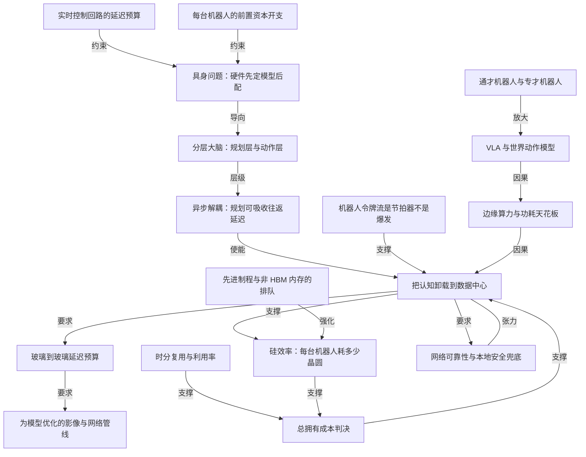

# 机器人在哪里思考：端侧推理还是数据中心推理

- 原文标题：Where Does A Robot Think – On-Device Vs Datacenter Inference
- 作者：Ivan Chiam / Zane Fong / Bryan Shan / Reyk Knuthsen / Myron Xie / Gerald Wong / Dylan Patel
- 内参日期：2026-09-11
- 来源类型：blog
- 标签：具身智能, 推理成本, ai 硬件

> SemiAnalysis 拆具身智能的推理落点：规划层与动作层如何切分、端到端的「glass-to-glass」延迟预算怎么算、晶圆与内存约束下一块 B300 对 56 块 Thor 的总拥有成本怎么比。物理 AI 的经济学此刻才刚被算清楚。

## 导读

SemiAnalysis 付费研报

## 核心观点

- AI 的短暂历史里，它一直活在屏幕后面：先是聊天机器人，然后是能在电脑上真正干活的 agentic AI，现在的前沿是伸手到屏幕之外去感知世界、作用于世界的 physical AI。最大的那块是机器人，而硬件、模型和经济账都还在当场被算出来。
- 文章的判断很直接：**对越来越大比例的机器人部署来说，大脑应该放在数据中心**。理由不是技术偏好，而是三条互相独立却同向的力——延迟预算允许、算力与晶圆供给不允许、总拥有成本（TCO）算不过来。
- 结构性前提是分层：一个慢的规划层（每秒更新几次、与控制回路异步）加一个快的动作层（几百 Hz、容不下任何延迟）。**规划层天然可以吸收一次无线往返的延迟甚至抖动，所以它是搬进数据中心的天然候选，而快速控制回路留在本地**。
- 硬约束在边缘芯片这一侧：Jetson Thor 只有单颗 B200 约十分之一、B300 约十四分之一的算力；14B 的世界动作模型 DreamZero 需要两张 GB200 才能跑到约 7Hz，换成 Thor 会掉到 1Hz 的零头，完全不够实时控制。
- 结论的两个量化锚点：在晶圆口径上，**共享 GPU 与「每台机器人一颗芯片」的交叉点大约在每 GPU 服务 7 台机器人**；在 TCO 口径上，**从每 GPU 4 台机器人往上，每 PFLOP 的成本就开始倒向卸载方案**。
- 但这不是普适结论。它依赖一张撑得住的网络：工厂可以被工程化成低延迟，家庭在对的硬件下可行，开阔农田取决于延迟预算，洞穴与灾难现场直接排除。**面向安全的本地兜底在任何场景都不可谈判**。原文的收尾一句是：剩下的是执行，赢家会是少数几支能让数据中心「感觉像在本地」的团队。

## 具身问题：机器人把硬件与模型的主从关系倒过来了

- 大语言模型时代，**硬件迁就模型**。对 hyperscalers 和 AI 实验室来说，没有硬性延迟要求，花钱的天花板又极高，流程因此很简单：训练时尽可能堆数据和算力，出来什么模型再想办法怎么服务它。模型先行，硬件服从。
- 机器人把这个顺序翻转过来：**你先算清楚在机器人上服务一个模型要付出什么，再去造一个装得下的模型**。两条约束驱动了这个倒置。
- 第一条是**时间**。机器人跑的是实时控制回路，错过一次 deadline 就是错过。大语言模型慢一点不影响最终输出；机器人慢一点，世界就在它周围变了，等它要执行时动作已经过时。
- 第二条是**成本**。用大语言模型时，屏幕是用户提供的；在机器人这里，制造商既要造算力又要造机器人本体，而且**每一台都要预先付钱**，资本开支极其庞大。规模上去后这笔前置成本可以是数十亿，真到十亿台机器人的世界甚至是万亿级。
- 于是在机器人领域，**机上硬件是固定的，模型被设计来适配它**。即便是 hyperscaler 级别的资金，大部分资本也必须投进机器人本体和工厂，而不是算力。模型能力因此被「负担得起、能实时跑的机上硬件」封顶——**智能变成一种要对着延迟和单位经济学去配给的东西**。

## 模型还很小，但分层大脑给了上云的结构缝隙

- 前沿机器人模型远小于已经推进到万亿参数的前沿大语言模型。今天多数前沿机器人模型落在约 50 亿到 140 亿参数之间：Physical Intelligence 的 π0.7 是 50 亿，NVIDIA 的 DreamZero 是 140 亿。

- 在大语言模型上 scaling laws 成立了，扩规模持续拓宽了单个模型能解的问题范围。早期结果显示机器人可能走同一条路；数据曾是约束，现在正靠世界模型和具身人类数据采集扩上来。但具身 AI 面对语言模型从未有过的限制——稀缺的数据、与真实世界交互的成本——**scaling 是否同样划算，是一个真正开放的问题**。
- 如果机器人模型继续扩，问题就变成算力该在哪儿跑。**这个领域现在是真的分裂的**：Figure 把自研的 Helix 完全跑在机身上；Physical Intelligence 的 π0.7 反着来，把策略跑在机外一张 H100 上；NVIDIA 的 DreamZero 这个建在视频扩散骨干上的 140 亿参数「world action model」，要两张机外 GB200 才能实时运行。
- SemiAnalysis 的判断是**级联（cascade）不可避免**：一部分机器人在机上跑认知，另一部分把认知卸载到数据中心的 GPU。今天最大的模型建造者（NVIDIA、Google DeepMind）会偏向云路线——重认知跑在云 GPU 上，机器人只留一个小的边缘模型做低层控制和安全。Dyna、Sunday 这类更小的建造者早期会偏好能塞进 Jetson 或消费级 GPU 的模型，因为他们的部署环境窄而可控；规模化之后，他们会收敛到对自己商业模式而言性能与经济性最优的混合比例。
- 讨论的对象要限定清楚：**不是**几十年来跑工厂的硬编码控制和小型专用策略，而是**数据驱动的通才机器人**——由大型基础模型驱动的机器人。其中架构又分两类：单体式（从相机看到什么直接到电机怎么动）和**分层式**（一个大而慢的模型决定做什么，一个小而快的模型每秒几百次地把它变成动作）。上云的论证只针对分层式。

- 关键机制在于**解耦**：规划层是重的那一半，但也是宽容的那一半——它每秒只更新几次，且与控制回路异步运行，动作层在下一份计划还在路上时继续按最近一份计划行动。这让规划层可以吸收一次无线往返的延迟乃至抖动，而跑在几百 Hz 的动作层一点也吸收不了。
- 规划量的多少取决于机器人的工作有多通用。**通才**要处理开放式任务，需要一个做真正推理的大规划模型，而这部分正是被推到数据中心的部分；**专才**是反面——一条窄策略做一件重复的活，几乎没有高层规划，整个模型小到可以留在机上。
- 专才其实早就被解决了：工厂靠硬编码自动化跑了很多年，只是不用现代 AI。但**专才是刚性的，一个工位一件事，瓶颈一移动它就闲置**。通才之所以是前沿，是因为一台柔性机器人可以覆盖很多岗位、可以调到任何瓶颈处、可以应对变化的产品组合和长尾的非结构化工作——这与丰田生产方式的教训一致：多技能工人能减少浪费、提升经济效率。因此通才机器人的 TAM 极大，不止制造与仓储，还有家庭和别处。

## 算力画像：令牌流是节拍器，而前沿模型饥渴的是 FLOPs

- 大语言模型吞吐的是巨大而突发的令牌量：长 prompt 预填充、长生成，KV cache 全程增长。这就是**内存墙**——容纳 cache 的容量，加上每个令牌都要串流权重和 cache 的带宽——它让大语言模型服务变成带宽受限。
- 机器人模型恰恰相反，是**更小的稳定流，像节拍器而不是爆发**。它永不停止，因为机器人不是回答一个问题就停下，而是锁在与移动世界的闭环里，每秒几次地吃进一帧新画面、吐出一小段 action chunk。每一帧都由专用硬件（ISP 与视频编解码 ASIC）压缩成固定的、紧凑的令牌预算，数十到几百个令牌。**所以机器人模型不像大语言模型那样受内存容量与带宽的束缚**。

- 束缚前沿机器人模型的有时是内存，但**更常是 FLOPs**。VLA（Vision Language Action model）是多十亿参数模型，比之前的专用策略大好几个数量级，其视觉与语言阶段是工作量的主体，在任何像样的 GPU 上都是计算受限。
- WAM（World Action Model）更重：它不是直接说出一个动作，而是**生成一段预测未来的视频、再从中导出动作**，靠迭代去噪完成——意味着一个动作可能要跑完整模型的多次前向。
- 边缘硅片跟不上。NVIDIA 最新的 Jetson Thor 作为同类最强的机器人大脑，算力只有单颗 B200 的约十分之一、B300 的约十四分之一。DreamZero 这个 14B 的 WAM 需要两张 GB200 才能达到约 7Hz，大约是单颗 Thor 所能提供算力的二十倍。**同一个模型放到 Thor 上会掉到 1Hz 的零头，对实时控制远远不够**。

## 把模型搬下机器：延迟预算、影像管线与网络工程

- 如果 Jetson Thor 跟不上，而我们把重的、计算密集的那部分卸载到数据中心，那就意味着**本地算力要为安全回路和高频控制回路而优化，同时在网络接口上加倍下注**。
- 首要考虑是 **glass-to-glass 延迟预算**，而且要可靠地命中。网络会在带宽和稳定性上制造麻烦，传图像数据时感受最深。
- 快速可靠地传图像不是「机上放一颗压缩 ASIC 就收工」，**整条上游影像处理管线都要被优化**。噪声是压缩的敌人：一张图的时空结构越少就越难压。所以一套为网络优化的本地算力系统，会优先照顾那些**从源头就把噪声挡在外面**的部件——光学、低光传感器表现、传感器信噪比、热管理，以及图像信号处理器（ISP）。
- ISP 把杂乱的模拟信号变成数字信号，但如果不是直接面向压缩去优化，反而会毁掉压缩效率。把影像管线当整体看时，**我们优化的对象是模型而不是人眼**——这和 WAM 不需要典型视频扩散模型那些额外去噪步骤是同一个道理：它们解的是不同的任务。我们要的是好的模型输出和低码率，不必是漂亮的图。
- 网络状况变数很大，所以本地算力还要对 ISP 和压缩码率做**动态实时自适应**（思路类似 WebRTC），优雅地吃掉持续波动的网络条件，而且不能因此损害模型表现。
- 一条能产出干净、可自适应码流的管线，还需要**为卸载本身专门调过的硬件**：把比特按时送出机身。历史上移动芯片组优先下行速度，机器人要的恰恰是**巨大的上行容量**来把高保真遥测流出去，下行反而可以很小。这意味着多根发射天线与恰当的布置（环境和机器人自身都会挡信号），意味着支持更宽的射频频段以获得多通道、更高吞吐和更少拥塞——尤其考虑到工厂条件。为接入点之间、WiFi 与 5G 之间的**快速切换**去优化硬件和嵌入式固件是关键，因为一次典型的切换时间会暂时吃掉整个延迟预算。**抖动是最大的敌人**。
- 终局是一套高度协同的混合架构：本地保留健康但不奢侈的一份 FLOPs 用于安全与高频控制，同时能可靠地把基础模型里「基础」的那部分卸出去。它不是完美系统——网络一旦衰减或彻底断掉，简单的控制回路兜底仍然必需，需要延迟看门狗、心跳超时和对远端动作的陈旧度上界。
- **功耗这一条几乎是判决性的**：数据中心 GPU 必须跑在机器人之外，因为电池喂不起它。单张 Blackwell GPU 抽约 1.2 至 1.4 千瓦且必须液冷、必须坐在机架里；而一台人形机器人电池只存约 2 千瓦时，常规运动下抽几百瓦、峰值连带全身一两千瓦——这正是它的机上大脑是一颗 40 到 130 瓦 Jetson Thor 的原因。**把数据中心 GPU 放上机器人，光这颗芯片的功耗就超过整台机器**，需要它扛不动的散热，几分钟就能把电池抽干。卸载则绕开了功耗约束：机器人只需要背一块 20 到 30 瓦的感知算力加无线板去够到数据中心的 GPU。

## 供应链墙：晶圆、制程与内存的排队顺序

- NVIDIA 的加速器产出几乎全是数据中心硅片：2023 与 2024 年是漫长的 Hopper 爬坡，交棒给在 2025 与 2026 年急速放量、主导产品组合的 Blackwell。**Jetson 这条用在机器人上的产品线，是图底部那条细细的红色薄片，到 2026 年都几乎看不见**。原因很朴素：机器人市场尚在萌芽，真实出货量还要好几年，现在根本没什么可造的。

- 毛利率讲同一个故事。需求还没来，但来了以后定价会上去、Jetson 的毛利会拐点向上；**眼下一张 Blackwell 数据中心 GPU 的毛利率是百分之七十几中高段，Jetson 模组是百分之六十几中段**，所以 NVIDIA 有一切理由把稀缺的先进制程晶圆产能指向数据中心，在机器人市场还小的时候没什么动力去爬坡边缘硅片。更麻烦的是，Jetson Thor 这类机器人芯片**每单位算力需要多得多的内存**，这是一个主要路障。
- 更糟的是，机器人硅片正在**收敛到数据中心正在争夺的那几个制程节点上**。Jetson 过去是被隔开的：上一代 Orin 跑在三星 SF8 上；当代的 Thor 已经并到台积电 N4——Blackwell 用的正是这个节点。随着机器人要跑更强的模型，它的硅片必须留在先进制程上：Thor 之后的一代大概率随 Rubin 进 N3，再随 Feynman 进 N2，**恰恰是整个 AI 加速器路线图在抢的那几个节点**。于是一个低产量、低毛利的 Jetson，永远在队伍的后端争先进制程晶圆。
- 但**来自机器人的晶圆需求并不是压力所在**。2030 年一百万颗 Jetson 级芯片、每颗约 400 平方毫米，全年也只有约一万片晶圆，在数据中心 GPU 的爬坡面前是舍入误差——因为 Thor 的裸片还不到半个 reticle，而且机器人本来就没几台。真正吃紧要等到机器人每年需要数千万颗芯片，那已远在 2030 年之后。
- **所以真正的问题不是机器人能不能拿到晶圆，而是硅效率**：对给定规模的机器人队伍，哪种方案消耗更少的先进制程硅——每台机器人塞一颗芯片，还是用共享的数据中心 GPU 去服务它们的认知？

- 把硅效率按「每台机器人消耗多少晶圆」来看，机上芯片与共享数据中心 GPU 的曲线**大约在每 GPU 服务 7 台机器人处交叉**。越过这个点，用共享 GPU 服务认知比给每台机器装一颗芯片消耗更少的硅。这才是真正要紧的事：**当晶圆供给稀缺时，每台机器人用硅更少的那条路才是能规模化的那条**。

- 另一个主要瓶颈是**内存**。每一代 Jetson 带的 DRAM 都比上一代多：Jetson Xavier 用 32GB，AGX Orin 64GB，Jetson Thor 现在用 128GB 的 LPDDR5X，未来几代还会继续爬。虽然 DRAM 总晶圆产能仍在增长，但**增量产能大部分被 AI 加速器的 HBM 吸走了**。
- 剩下的是机器人大脑所依赖的商用与 LPDDR 供给，在一个不断缩小的非 HBM 晶圆池里竞争。同理，**当 DRAM 是稀缺资源时，每台机器人用 DRAM 更少的那条路才是能规模化的那条**——原文的说法很硬：那些 LPDDR 更适合被分配给 Vera GPU，那些晶圆更适合做成 HBM。

## TCO 判决：一台 B300 服务器 vs 56 颗 Thor

- 作者把 DreamZero（RoboArena 上的当前第一）跑在一台真实的 B300 上，用了 NVIDIA WAM 论文里的推理优化：CUDA graphs、DiT caching、NVFP4 量化、把调度器搬到 GPU 上。他们也跑了单步去噪来对齐 DreamZero-Flash 的设置，但没有 Flash 的重训练配方，**所以任务质量未经验证**（这是作者自己标注的口径）。
- **服务画像决定了批处理策略**。DreamZero 是预填充形状的：每次推理把一整块视频 latents（数千令牌）并行推过 14B 的 DiT，所以 B300 在批大小为 1 时就已经计算受限。批处理因此毫无收益——FLOPs 与批大小一比一增长，每台机器人只是等得更久。取而代之的是**时分复用**，B300 依次服务每台机器人。
- 这一条只对生成视频的 WAM 成立。像 π0 或 GR00T 这样的 VLA 会把 roofline 翻过来：几百个令牌过一个小骨干，GPU 变成内存带宽受限，于是**批处理能把同一份权重读取摊到多台机器人身上，吞吐几乎随批大小线性增长**。原文给了一句可直接带走的操作原则：VLA 队列用连续批处理来服务，视频 WAM 一次服务一台。
- 一个关键假设是网络 RTT 为 10 毫秒，意味着 GPU 就在机器人附近的本地机房。**每次推理为机器人买来接下来 1.6 秒的动作，1.6 秒因此就是延迟预算**——一次请求在网络、排队和计算上总共能花的时间，超了机器人就会在动作中途指令用尽而卡住。

- 两个对照场景（机械结构、外壳这些两边共有的部分都不计入 BOM）：
- **卸载场景**：一台 B300 NVL8 服务器加 56 块无线板（每台机器人一块）把机器人连到 GPU 集群，全包资本开支约 54.2 万美元，算上托管与电力这类运营成本，得到每小时 18.32 美元的 TCO。
  - **机上场景**：56 颗 Thor 模组，每颗 3500 美元，每颗还要配自己的基板、存储、散热、增量电池和机上无线连接，落在约 23 万美元，加上 Thor 模组的电费，得到每小时 6.58 美元的 TCO。
- **在计入利用率之前，两边几乎打平**：每小时每 PFLOP 的 FP4 稠密算力成本，卸载场景是 0.15 美元，机上场景是 0.11 美元。绝对成本上机上方案甚至更便宜——所以故事到这里还没有分出胜负。
- **利用率才是摆动因子**。机器人和它背后的 GPU 几乎全是固定资本，资产跑与不跑账单一样，每个有效工作小时的成本与它工作多少成反比。
- 家庭里，一家已规模化部署的公司告诉作者，它的机器人每天只跑 1 到 2 小时，只占时钟的 4% 到 8%，因为家务是突发的、当前模型还限制了能无人监督完成的范围。这个数字正在往 4 到 5 小时（17% 到 21%）走。但**家庭有硬天花板：家务终归会做完**。
  - 工业需求是连续的，应该能过更高的线。Figure 在宝马的部署是一个可用的锚：约 11 个月的工作日班次里大约 1250 个运行小时，每天工作约 10 小时，利用率约 40%。随着模型能力提升，工业利用率应该会明显超过这个数。
- 作者保守地把机上芯片利用率的基准情形建模为约 40%，把共享 GPU 服务器建模为约 90%（因为它的算力被整个队伍池化、全天候忙碌）。**计入利用率之后，卸载场景的 FP4 每 PFLOP 成本是每小时 0.17 美元，机上场景是 0.28 美元——卸载只到机上方案的约 60%**；对家庭部署这个比例更低，约 15%。
- 只有在敏感性分析的右下角——GPU 服务器利用率低、机上芯片利用率高——天平才会倒向端侧推理。
- 那么要批多少台机器人，这份每 PFLOP 的成本优势才会兑现？**对标准工业部署，从每 GPU 4 台机器人往上，天平就已经倒向卸载**。

- 总体结论：把推理卸载到 GPU 服务器是很有说服力的一笔账，**例外只在机器人部署量很小、现场那台服务器大半时间闲置的情形**；而即便在那种情形，也可以主张按需租算力，而不是为服务几台机器人去买下一整台服务器。

## 网络层：哪里成立，哪里不成立

- 作者把话说在前面：把模型的重头部分跑在机外确实有明摆着的问题，**他们不是在论证这件事容易，而是在论证对某些应用它比本地算力更实际**。
- **直接排除的场景**：洞穴、废墟、灾难现场。这些环境不可预测地被遮挡、动态变化，无线条件根本没被正确配置过——网络不可能可靠存在，只能依赖本地算力。
- **条件成立的场景**：开阔农业与偏远田野取决于模型的延迟预算，因为 Starlink 这类服务覆盖得到但延迟和抖动更高。难点在于我们只能控制这套配置的一部分，这类场景大概率会用机上与机外的混合，具体比例由模型的延迟预算决定。
- **家庭更容易但不理想**：墙体和障碍造成弱区与死区，典型家用路由器没有为切换优化；无线条件常常不错，但拥塞是变量——家庭通常跑在共享光纤上，邻居和相邻公寓会拉低条件。要在紧的延迟预算下做成，需要专门的路由器，还需要刻画共享光纤被压满的 WiFi 高峰时段的表现。
- **工厂与仓库最难，也最有可能被做到最优**。它们是移动金属与重型机械构成的巨大迷宫，是射频传播的最坏情况：严重多径干扰、电磁噪声、持续的视距遮挡。但它们也是我们控制力最强的地方——URLLC 协议与私有 5G 频段意味着工厂在优化后可以做到 10 毫秒以下的无线延迟；把 GPU 放在同一栋楼里几百英尺外，可以彻底消掉互联网中转层；路由器可以用波束成形把信号对准地面上的机器人。**工厂需要最多的工作量，但正因如此可以成为最被优化的部署**。这笔投入值不值，取决于延迟预算，也取决于这套配置是否比几百台自带 GPU 的机器人更便宜。
- 而且这类部署已经存在。有些场景可以直接借用既有基础设施；当延迟预算宽裕时，楼内建设甚至完全不必要——作者认识的一家机器人基础模型开发商，**已经从本地都会区的一个云可用区为一家汽车制造商和一家工业制造商提供生产级推理，现场没有任何 GPU**，因为控制回路能容忍相当程度的延迟。这些机器人本来就要连云做数据上传和遥操作，**推理只是搭上了本来就存在的基础设施，唯一的新增成本是算力**。
- **国家与监管环境也会显著改变这道题**。某些国家的国家级防火墙做深度包检测，会严重恶化延迟与抖动；数据一旦经过网络，东道国就掌握了一定程度的控制权，可以直接损害无线条件。这意味着各国如何对待机器人，会**按国别塑造端侧与机外的取舍**：作者的推测是美国会为机外机器人提供极好的无线条件，而中国等做更深包检测的国家可能被推向更重的端侧算力。
- 最关键的一条是**专门为安全、低层控制和网络必然失效时的兜底去做架构**。机器人必须能跑一条极低层的本地策略，在失效时把自己带回安全区。可以类比 Figure 那条在执行器失效时让机器人自行返厂维护、自动适应被改变的身体形态的策略——在这里被改变的是大脑，兜底是一条 100% 面向安全的简单控制回路。**网络可用性要打到 99.99%，所以顺序是可靠性第一、兜底第二；两者缺一，就不会有机外部署**。这种失效模式在今天的仓库里已经是常态：无线一断，AGV 触发安全停机、原地冻结。

## 结论：成本是战场，死资本是软肋

- 对越来越大比例的机器人部署来说，大脑属于数据中心。**大规模采用的障碍是价格**：昂贵的人形机器人没有大众市场，价格必须降下来采用率才会涨。这让成本成为战场，而把算力从每一台机器人里抽出来、共享数据中心的 GPU，是一根很强的杠杆。
- 它还修掉了做机器人公司最糟糕的那一部分：**比机器人卖出去早几个月就买下的芯片是死资本**。原文给了一个刺眼的算式——一万台待发机器人就是三千万美元在仓库里折旧；而卸载出去的算力是一张共享 GPU，它已经在为自己挣钱了。
- 供给侧指向同一个方向：先进制程晶圆和 DRAM 基本已被分配完，NVIDIA 在大语言模型吃掉供给的当口没什么理由去分流它们，**所以卸载是搭上这轮建设的顺风车，而不是与它对着干**。
- 但这一切都不让卸载成为普适答案。它取决于一张撑得住的网络，而环境差异极大：工厂可以被工程化成低延迟，家庭在对的硬件下可行，开阔田野取决于延迟预算，洞穴和灾难现场则彻底排除。**面向安全的本地兜底在任何地方都不可谈判**。
- 但只要网络可以被做可靠，经济账就会赢，**而且随着队伍规模扩大、机器人工作时间变长，这个差距只会拉大**。剩下的是执行——赢家会是少数几支能让数据中心「感觉像在本地」的团队。

## 概念网络

### 关键概念

#### 具身问题（The Embodiment Problem）

**context**：文章用它命名机器人与大语言模型之间最根本的设计倒置。在大语言模型那里「硬件迁就模型」，在机器人这里「模型迁就硬件」：因为机上硬件固定、每台都要预先付费，模型能力被「负担得起且能实时跑的机上硬件」封顶，于是智能变成一种要对着延迟和单位经济学去配给的东西。

**费曼一下**：写手机 App 时你可以假定用户的手机就在那儿，你只管把功能做好；但如果你既要造 App 又要给每个用户免费配一台手机，你就会先算一台手机能有多贵，再倒推 App 能有多重。机器人就是后一种。

#### 玻璃到玻璃延迟预算（Glass-to-Glass Latency Budget）

**context**：从相机镜头进光到最终动作落地的端到端时间上限，是机外推理能否成立的首要考量。文中的 TCO 实测把它定为 1.6 秒——每次推理为机器人买来接下来 1.6 秒的动作，一次请求在网络、排队和计算上总共只能花这么多时间，超了机器人就会在动作中途卡住。

**费曼一下**：像点菜到上菜的总时限。顾客只关心从下单到吃上的总时间，不关心这段时间是花在服务员跑腿、厨房排队还是真正炒菜上——三段加起来超了，这桌人就走了。

#### 分层大脑：规划层与动作层

**context**：机器人模型的主流架构之一。规划层慢而重（数十亿参数、每秒约 3 到 10 次更新，负责感知场景、空间推理、规划任务），动作层快而轻（百万参数级、100 到 200 Hz，把计划变成电机指令）。**绝大部分参数压在最慢的那一层**，这正是整篇文章上云论证的结构前提。

**费曼一下**：像一个边走边想的人。想「接下来去哪儿」可以慢慢想，中间停顿几秒也不要紧；但脚下每一步的平衡必须毫秒级地调，一步没调好就摔了。两件事可以分开做，还可以由不同的人（不同的硬件）来做。

#### 异步解耦（Asynchronous Decoupling）

**context**：规划层与控制回路异步运行，动作层在下一份计划还在路上时继续按最近一份计划行动。正是这个解耦让规划层**可以吸收一次无线往返的延迟乃至抖动**，而跑在几百 Hz 的动作层一点也吸收不了——这是「规划上云、控制留本地」在工程上成立的真正原因。

**费曼一下**：厨房里有一叠已经写好的订单。前台在点新单时，厨师照着手上那张继续做，不必等前台写完这一张。前台慢两秒不影响厨房不停手；但厨师颠勺的节奏一秒都不能乱。

#### 通才机器人与专才机器人

**context**：专才是一条窄策略做一件重复的活，工厂用硬编码自动化跑了几十年，几乎没有高层规划，模型小到可以留在机上；但它刚性——一个工位一件事，瓶颈一移动就闲置。通才能覆盖多个岗位、可以调到任何瓶颈处、能吃长尾的非结构化工作，需要做真正推理的大规划模型。文中用丰田生产方式里「多技能工人减少浪费」来支撑通才的经济性，并由此推出通才的 TAM 极大。

**费曼一下**：专才是流水线上拧同一颗螺丝的机器，快、便宜、换个活就废；通才是能顶多个岗位的老师傅，贵得多，但哪儿堵了就能去哪儿。产线堵点会移动，所以老师傅的价值不在单点效率，在柔性。

#### 令牌流形态：突发 vs 节拍器

**context**：文中用来区分大语言模型与机器人模型硬件瓶颈的核心对比。大语言模型是巨大而突发的令牌量（长预填充加长生成，KV cache 全程增长）；机器人模型是永不停止的稳定小流，每秒几次吃进一帧、吐出一小段 action chunk，每帧被 ISP 与视频编解码 ASIC 压成数十到几百个令牌的固定预算。

**费曼一下**：一个是考试写作文——先读一大段题干，然后越写越长，草稿纸越堆越厚；一个是打拍子——每拍看一眼、动一下，节奏不变、纸不堆积。两者对桌子大小（内存）和手速（算力）的要求完全不同。

#### 内存墙与 FLOPs 瓶颈

**context**：大语言模型服务是带宽受限的——瓶颈在容纳不断增长的 KV cache 的容量，以及每个令牌都要串流权重和 cache 的带宽。机器人模型不受同样的束缚，**但它常常撞上另一堵墙：FLOPs**。VLA 的视觉与语言阶段在任何像样的 GPU 上都是计算受限，WAM 更重。

**费曼一下**：两种堵车原因不同。一种是路面太窄（带宽），车再快也过不去；一种是发动机不够劲（算力），路再宽也开不动。语言模型堵在路面，机器人模型堵在发动机——所以给它们扩容的方向完全不一样。

#### VLA 与 WAM（视觉语言动作模型与世界动作模型）

**context**：两类前沿机器人模型架构。VLA 是多十亿参数模型，视觉与语言阶段是工作量主体；WAM 更重——它不直接说出动作，而是**生成一段预测未来的视频再从中导出动作**，靠迭代去噪完成，一个动作可能要跑完整模型多次前向。DreamZero 就是建在视频扩散骨干上的 140 亿参数 WAM。

**费曼一下**：VLA 是看一眼就说「往左伸手」；WAM 是先在脑子里放一小段「如果我往左伸手接下来会发生什么」的电影，再从这段电影里读出该怎么动。后者显然费脑子得多。

#### 边缘算力天花板

**context**：文中最硬的一条物理约束。Jetson Thor 作为同类最强的机器人大脑，算力只有单颗 B200 的约十分之一、B300 的约十四分之一；DreamZero 要两张 GB200 才能跑到约 7Hz，约为单颗 Thor 的二十倍算力，换成 Thor 会掉到 1Hz 的零头。功耗侧同样判决性：单张 Blackwell 抽 1.2 到 1.4 千瓦且必须液冷，而人形机器人整机电池只有约 2 千瓦时。

**费曼一下**：不是「端侧慢一点」的程度差，而是「根本跑不动」的类型差。就像要把一台工业级空调装进电动自行车——不是骑得慢一点，是车架扛不住、电池撑不了几分钟。

#### 抖动是最大的敌人（Jitter）

**context**：在机外推理的网络工程里，作者把抖动而非平均延迟点名为首要威胁。一次典型的接入点切换或 WiFi 与 5G 之间的切换，就会暂时吃掉整个延迟预算；因此硬件与嵌入式固件要为快速切换去优化，ISP 与压缩码率要做类似 WebRTC 的动态实时自适应。

**费曼一下**：上班通勤，平均 30 分钟其实不可怕，可怕的是「有时 20 分钟、有时 90 分钟」。你只能按最坏情况留时间，于是平均值再好看也没用。

#### 为模型而非为人眼优化的影像管线

**context**：机外推理要传图像，噪声是压缩的敌人——时空结构越少越难压。所以一套为网络优化的本地系统会优先照顾光学、低光传感器表现、信噪比、热管理和 ISP，把噪声从源头挡住；而整条管线的优化对象**是模型不是人眼**，要的是好的模型输出和低码率，不必是漂亮的图。

**费曼一下**：给机器看的照片和给人看的照片，标准不一样。人喜欢柔和好看，机器要的是信息干净、好压缩。为了讨好眼睛做的美化，反而会让传输更贵、模型更迷糊。

#### 硅效率（每台机器人消耗多少晶圆）

**context**：文章把供应链问题重新定义后的真正判据。作者先排除了「机器人抢不到晶圆」这个假问题——2030 年一百万颗 Jetson 级芯片全年也只有约一万片晶圆，是舍入误差——然后把问题改写成：对给定规模的机器人队伍，哪种方案消耗更少的先进制程硅。答案是**约 7 台机器人每 GPU 处交叉**，越过就是共享方案更省硅。

**费曼一下**：稀缺的不是「有没有资格买」，而是「一份资源能摊给多少人用」。同样一辆车，一人一辆和七人拼车，对整个城市的钢铁消耗完全是两回事。

#### 先进制程与非 HBM 内存的排队顺序

**context**：机器人硅片正收敛到数据中心争夺的节点上——Orin 在三星 SF8，Thor 已并到台积电 N4（Blackwell 同节点），下一代大概率随 Rubin 进 N3、随 Feynman 进 N2。叠加毛利差（Blackwell 百分之七十几中高段对 Jetson 百分之六十几中段），低产量低毛利的 Jetson 永远在队伍后端。内存侧同理：DRAM 增量产能大部分被 HBM 吸走，机器人依赖的商用与 LPDDR 在缩小的非 HBM 池里竞争。

**费曼一下**：产能分配不是按需要排队，是按赚钱多少排队。同一条产线上，毛利高的订单永远插在前面；你要的东西如果又少又不赚钱，那就一直在队尾。

#### 时分复用与连续批处理

**context**：批处理策略由模型的 roofline 形态决定。DreamZero 是预填充形状的，数千视频 latents 并行推过 14B DiT，批大小为 1 时就已计算受限，批处理毫无收益，只能**时分复用**、依次服务；π0 或 GR00T 这类 VLA 则是内存带宽受限，批处理能把同一份权重读取摊给多台机器人，吞吐几乎线性增长。原文的操作原则：VLA 队列用连续批处理，视频 WAM 一次服务一台。

**费曼一下**：同样是一个师傅带徒弟。如果每个徒弟都要师傅从头讲一遍完整流程（算力受限），人多只会每人等更久；如果师傅只要把教材念一遍大家一起听（带宽受限），那人越多越划算。

#### 利用率是 TCO 的摆动因子

**context**：在计入利用率之前两边几乎打平（每 PFLOP 每小时 0.15 美元对 0.11 美元，机上甚至更便宜）；利用率才决定胜负。机器人和它背后的 GPU 几乎全是固定资本，跑与不跑账单一样。家庭部署每天只跑 1 到 2 小时（4% 到 8%，且有「家务总会做完」的硬天花板），工业部署以 Figure 在宝马的约 1250 小时、约 40% 为锚，而共享 GPU 服务器可以做到约 90%。**计入之后卸载只到机上方案的约 60%，家庭场景约 15%**。

**费曼一下**：买车还是打车，比的不是车价，是你一年开多少天。车停在楼下也在折旧；网约车这一刻不拉你就在拉别人。用得越少，「自己买」越亏。

#### 死资本（Dead Capital）

**context**：作者点名的「做机器人公司最糟糕的那一部分」——比机器人卖出去早几个月就买下的芯片是死资本，一万台待发机器人就是三千万美元在仓库里折旧；而卸载出去的算力是一张共享 GPU，它已经在为自己挣钱了。这是把成本论证从单位经济学推进到**现金流与资产负债表**的一步。

**费曼一下**：同样一笔钱，压在仓库里的库存每天都在贬值，投进出租车队的资产每天都在收租。哪怕两边总成本一样，前者的钱是睡着的，后者的钱是醒着的。

#### 本地安全兜底（Local Safety Fallback）

**context**：机外部署的不可谈判前提。机器人必须能跑一条极低层的本地策略，在网络失效时把自己带回安全区——类比 Figure 那条在执行器失效时自动适应被改变的身体形态、自行返厂维护的策略，只不过这次被改变的是大脑。**顺序是可靠性第一、兜底第二，两者缺一就不会有机外部署**；今天仓库里 AGV 无线一断就安全停机、原地冻结，正是这种失效模式的常态版本。

**费曼一下**：电梯断电不会自由落体，它会抱闸停住。不是因为断电不可怕，而是因为设计时就假定了「电一定会断」。机外大脑也一样：网络会断，所以机器人身上必须常驻一条只管「安全停下来」的最笨的本能。

### 概念网络

- **两条约束生出整篇文章**。时间（实时控制回路不能错过 deadline）与成本（每台机器人都要预先付出的资本开支）共同造出「具身问题」：机上硬件固定、模型来适配它。所有后续论证都是这个倒置的推论，而不是并列的论点。
- **具身问题导向分层架构，分层架构中的异步解耦是上云的唯一合法入口**。规划层慢而重、动作层快而轻，这本身只是架构描述；真正打开数据中心大门的是解耦——动作层按最近一份计划继续行动，于是规划层可以吸收一次无线往返的延迟乃至抖动。**没有这层解耦，后面所有的成本论证都无从谈起**：延迟会先否掉一切。
- **通才需求与模型形态形成一条放大链**。越要通用，就越要 FLOP 饥渴的基础模型；VLA 已经是计算受限，WAM 用迭代去噪生成未来视频更重。这条链撞上边缘硅片的天花板（Thor 只有 B300 约十四分之一的算力，加上功耗与散热的物理不可能），于是把认知卸载出去从「一种选择」变成「某些场景下的唯一解」。
- **令牌流形态是这条链能成立的隐性前提**。机器人模型是稳定小流而非突发，每帧被压成数十到几百个令牌，所以它不像大语言模型那样受内存容量与带宽束缚——这让「把它搬到一张共享 GPU 上时分复用」在工程上是可行的，而不是把内存墙从机上搬到了机房。
- **卸载一旦成立，就立刻长出两条自己的需求**：向内是延迟预算，向外是影像与网络管线。1.6 秒的预算要被网络、排队、计算三段瓜分，所以本地要为模型而非人眼优化影像、要巨大的上行容量、要为快速切换调过的固件；抖动而非平均延迟才是敌人。**这是解决方案自身带来的新问题，不是原问题的一部分**。
- **供应链把「哪种更好」改写成「哪种更省」**。作者先拆掉「机器人抢不到晶圆」这个假问题（一万片晶圆是舍入误差），再把判据换成硅效率；先进制程排队顺序与非 HBM 内存挤压不改变结论方向，只是把它推得更硬——稀缺的时候，每台机器人用硅更少的那条路才是能规模化的那条。
- **TCO 是收口，但它由两个上游变量决定**。绝对成本上机上方案甚至更便宜（0.11 对 0.15 美元每 PFLOP 每小时），是时分复用能力与利用率差（约 90% 对约 40%）把天平掰过来的。**这解释了为什么结论会随场景变**：家庭利用率低到 4% 到 8%，卸载优势最大；小规模部署让服务器闲置，优势就会反转。
- **网络与安全兜底和卸载之间是张力关系，不是支撑关系**。它们既是卸载的前提（网络可用性要到 99.99%），又是卸载的边界（洞穴、灾难现场直接排除）。文章的诚实之处正在这里：它不主张卸载普适，而是主张在网络可以被工程化的地方，经济账会赢，且随着队伍变大、工时变长，差距只会拉大。

## 费曼 x3

有一类技术判断，表面上是工程问题，实质上是会计问题。机器人的大脑该放在哪儿，就是这样一道题。

直觉会说放在机器人身上——自主、低延迟、不依赖网络，听起来无可辩驳。但这个直觉建立在一个没被检验的假设上：算力像轮子和电机一样，是机器人身体的一部分。真实约束是另一回事。在大语言模型那里，硬件迁就模型：没有硬性延迟要求，花钱天花板极高，先把模型训出来再想怎么服务。机器人把顺序整个翻了过来——机上硬件是固定的，模型被设计来适配它。于是智能不再是一个可以无限追加投入的维度，而变成一种要对着延迟和单位经济学去配给的东西。一台人形机器人的电池只存约 2 千瓦时，而一张数据中心 GPU 光自己就抽一千多瓦：把它放上去，芯片的功耗超过整台机器，几分钟就能抽干电池。这不是「端侧慢一点」的程度差，是类型差。

真正让局面松动的，是机器人大脑本来就分成两半这件事。一个慢的规划层负责看懂场景、想清楚要干什么，每秒只更新几次；一个快的动作层把计划变成电机指令，跑在几百 Hz 上。关键不在于它们一慢一快，而在于它们异步：动作层照着手上最近那份计划继续动，下一份还在路上也不影响。这一点解耦，让规划层可以吞掉一次无线往返的延迟甚至抖动，而动作层一点也吞不了。上云的门是被这条架构缝隙打开的，不是被成本打开的——延迟若过不去，后面的账根本没机会算。

而账一旦能算，结论就不太客气。绝对成本上，机上方案甚至更便宜；掰过天平的是利用率。机器人和它背后的 GPU 几乎全是固定资本，跑与不跑账单一样，而家用机器人一天只干一两个小时，工业部署做到四成已经算好的，共享 GPU 却能接近全天候忙碌。更锋利的是资产负债表那一刀：比机器人卖出去早几个月就买下的芯片是死资本，一万台待发机器人就是三千万美元在仓库里折旧，而卸载出去的算力是一张已经在为自己挣钱的共享卡。

诚实的部分在边界。洞穴、废墟、灾难现场直接排除；开阔农田取决于延迟预算；家庭可行但要专门的路由器；工厂是射频的最坏情况，却也是控制力最强、最可能被优化到极致的地方。甚至国界都会改变这道题——做深度包检测的国家会被推向端侧。而无论在哪里，机器人身上都必须常驻一条只管把自己带回安全区的最笨的本能，因为网络一定会断。

真正值得带走的不是「上云赢了」，而是这道题的提法：当一种资源稀缺时，问的不该是谁能抢到，而是一份资源能摊给多少人用。晶圆如此，内存如此，算力也如此。剩下的是执行，赢家会是少数几支能让数据中心感觉像在本地的团队。
