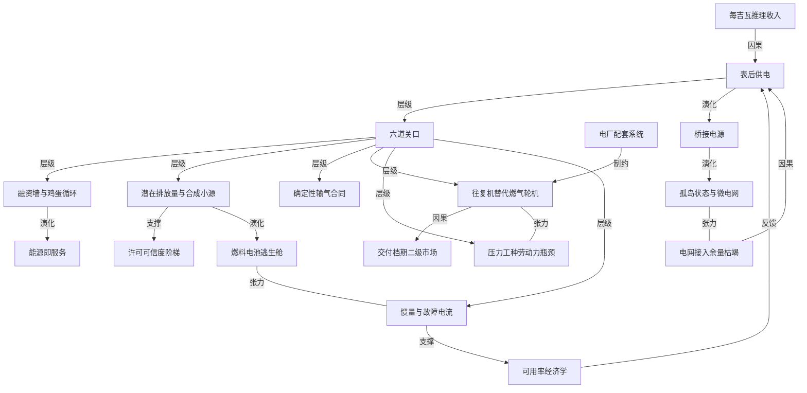

# SemiAnalysis 拆解数据中心表后供电难在哪（上）

- 原文标题：What Is So Hard About Behind-The-Meter Power For Datacenters? Part 1
- 作者：Ellie Holbrook / Robert Boswall / Jeremie Eliahou Ontiveros / Nicolas Bontigui / Dylan Patel
- 内参日期：2026-09-11
- 来源类型：blog
- 标签：ai 硬件, 工程

> 去年被讥为「科学实验」「黑吉瓦」的现场燃气发电，如今 SemiAnalysis 的能源模型里已有 75GW 确定性订单，仅 2026 年二季度就下了约 20GW。从马斯克的个人实验变成每家 AI 实验室与超大规模厂商的标配路径，这一篇讲的是其中真正卡住的工程与商业环节。

## 导读

SemiAnalysis 付费研报

## 核心观点

- 一年前被嘲成「科学实验」「暗吉瓦」甚至「人类做过的最蠢的事」的表后供电（behind-the-meter，BTM），如今已是每一家 AI 实验室和超大规模厂商的主流方案。SemiAnalysis 的能源模型追踪到 75GW 专门服务表后 AI 算力的确定性、有约束力订单，仅 2026 年第二季度就新增约 20GW；这个口径只算 OEM 收到的、按项目逐个核对的实单，不含其他分析师喜欢堆进数字里的几百 GW 投机性公告。
- 从确定性设备订单到交付投产，这条路依然又长又难，执行风险才是本文的主题。但行业远比外界以为的有经验：到今年年底，约 3GW 在运的美国数据中心 IT 容量将由表后电力供应，并将连续多年保持三位数增长。

- 表后供电之所以成立，根子在 AI 经济学而不在电力工程：一座支撑 1GW 孤岛数据中心的电厂大约 50 亿美元，而推理 API 收入可以做到每 GW 每年 1000 亿美元、毛利率 90% 以上。多付一倍的钱、或者接受低 30% 的效率去换部署速度，就成了不用想的选择——用作者的说法，Anthropic 和它的同行可以用 20 天的推理收入还清一座电厂的价值。
- 本报告（上篇）分三段推进：表后到底是什么（数据中心与电网的几种关系，以及哪些是假微电网）；项目如何成功或失败（合同与可融资性、许可、燃料、设备、劳动力、离网运行的物理，共六道关）；以及未来往哪去（并网、出口、转备用还是搬走，加上对德州的判断）。

## 需求侧：为什么全行业突然都转向表后

- 采用面之广前所未有，且全部押在最具战略意义的项目上：
- 微软 2026 年年初至今签下超过 5GW 表后铭牌容量，其中 2.7GW 与雪佛龙合作，另有超过 2GW 通过与 Crusoe 一类公司的整包数据中心租赁实现。
  - 谷歌历史上最抗拒现场燃气，如今在阿姆斯特朗县旗舰园区部署 930MW 离网航改型燃气轮机，并在怀俄明部署 900MW 的 Bloom 燃料电池，配 1GW 以上三菱 J 级燃气轮机。
  - Anthropic 与 Meta 都与 Enchanted Rock 签了 300 至 500MW 的单子，对方主打围绕 21.9 升 V12 燃气发动机做的 0.5MW 机组；Anthropic 在德州的旗舰园区由谷歌兜底，将部署超过 1.5GW 离网发电。
  - OpenAI 位于德州沙克尔福德县的 1.4GW（IT 容量）离网旗舰园区即将投运，用了五百多台 4.25MW 的 Jenbacher J624 引擎；加上新墨西哥 1.3GW 站点，代表 OpenAI 与甲骨文签下的、依赖表后电力的 1500 亿美元以上合同支出。

- 另一半原因在供给侧的失灵：电网根本跟不上。新建发电动辄五年以上，需求侧接入一座数据中心同样以年计。确定的电网余量已被耗尽，廉价的 GW 级接入不复存在。
- 赢家也和一年前的预期不同。不只是 GE Vernova、西门子能源这些在位者，最大的受益者是几十家做往复式发动机的供应商，单机 0.5MW 到 20MW 的方案都在规模化落地。一年前拿到数百兆瓦级离网数据中心订单的厂商有 12 家，今天是 22 家，还会继续增加。
- 亮面是创新，暗面是执行。许可延误已经逼得甲骨文的木星项目、Nebius 新泽西站点紧急转向污染更低的 Bloom 燃料电池；管道延误同样打击了木星项目 1.3GW 的 IT 容量；可靠性问题的市场传言越来越频繁；劳动力短缺激增；设计与在线率考量拖慢了部分最终投资决策；失败项目绑定的确定性订单，甚至催生了燃气轮机的二级市场。

## 表后到底是什么：四种配置与两组易混的词

- 电表是计电量的装置，立在项目的线与电网的线相接之处。电网那一侧的变电站、铁塔、电厂叫「表前」；项目这一侧的开关柜、电池、现场发电机叫「表后」。
- 实践中「表后」「离网」「孤岛」「共址」「微电网」几乎被混用，这既让人恼火又常引发定义之争。按连接配置来分，可以理清成四类：

- 四类配置：
- 电网供电：电网供数据中心，现场发电只做备用。
  - 电网并联：本地发电和电网进口都能供数据中心，出口视权利与连接而定。ERCOT 的「受限提取私有用电网络」框架就明确认可现场发电可以减少大负荷所需的输电容量。
  - 仅出口：本地发电供数据中心，电网连接允许出口但不允许进口来带负荷。
  - 离网：本地发电供数据中心，且没有在运的电网连接。
- 同为电网并联，尺寸差别极大。以 1000MW 数据中心为例：电网主导是 250MW 本地发电加 1000MW 进口上限；电厂主导配全尺寸进口连接是 1200MW 发电加 1000MW 进口上限；电厂主导配受限连接则是 1200MW 发电只配 250MW 进口上限，满载时至少 750MW 必须来自本地资源，一旦本地发电全失就得找替代电源或砍掉至少 750MW 负荷。
- 净计量在这里指在面向电网的计量或结算边界上，把数据中心的用电与关联发电相抵。ERCOT 的说法是减少客户从电网计量到的用电量，并不等同于居民屋顶光伏那种按账期抵扣的零售安排。ERCOT 报告 2026 年 5 月获公用事业委员会批准的 Freestone 案例，就是一座 1099MW 燃气电厂与一座 760MW 数据中心的安排。
- 「仅出口」不等于「离网」。数据中心不需要单独的电网馈线才算并网；只要它的供电回路接进电厂并网的交流系统，它就是通过电厂并在网上，即使净出口，站点仍参与互联系统的频率动态和共享惯量响应。电网运行得好时，这种安排反而能改善数据中心的电能质量和可靠性。
- 监管还会区分新建发电和原本供网的老电厂。德州公用事业法典第 39.169 条「大负荷客户与现有发电资源共址」，覆盖 2025 年 9 月 1 日前登记为独立发电资源的运行设施的某些净计量安排，需向 ERCOT 通报并经委员会审查。把既有出力挪给新负荷会减少给大电网的供应，ERCOT 表示到 2026 年 5 月批准的两宗净计量安排，都要求数据中心在收到调度指令后 30 分钟内降负荷或切备用、电厂把全部出力还给电网。
- 「孤岛」是一种运行状态：并网的数据中心打开断路器、靠自己的发电运行。能源部对「微电网」的定义是电气边界清晰、对电网表现为单一可控实体的一组互联负荷与分布式能源。本文把能分离的并网站点叫「可孤岛微电网」，把完全没有连接的叫「离网微电网」。很多表后项目把「微电网」用得很松，也许是因为这样就不用说出「燃气」两个字。
- 时间维度上这些形态会变。很多表后项目本就规划了并网，把表后当成「桥接电源」：等公用事业把连接交付过来，发电机就转成备用角色——这是最流行的路径，因为电力系统在成本和可靠性上都有显著的规模经济，xAI 在孟菲斯的 Colossus 1 走的就是这条路。另一些项目则把并网当作「备用」，即一种提升预期在线率的新能源资源：全孤岛模式下规划 2 到 3 个 9，并网后再加一个 9。

## 六道关之一：合同与可融资性，那堵资本墙

- 在所有物理挑战之前，还有一个可能更大的挑战是金融的。传统路径下接入电网非常便宜，接入申请和信用证的额度都很温和，几百万美元就足以开发出可信站点，于是全球掀起了找电的狂潮。
- 孤岛数据中心的根本不同在于：没有现成的基础设施可接。电厂按每 GW IT 容量约 50 亿美元计，设备定金还越来越贵，前期资本支出直接把很多项目挡在门外。

- 这就是经典的表后先有鸡还是先有蛋：贷款人要有可靠承购方的长期能源服务协议、清晰的服务等级协议和合同条款；承购方要可信的时间表和系统设计；开发商则需要早期资本去付设备定金，才拿得出可信的时间表和设计。而在燃气发电设备需求永不知足的当下，没有这笔钱就意味着时间表不断后滑。
- 早期跑通的三种形态：
- 完全垂直整合，马斯克剧本：xAI 自建电厂自用，把它看成建算力最快的路，很可能是股权出资。
  - 全范围数据中心开发商：本身兼具施工与能源能力，卖给超大规模厂商时把表后电厂一并担下来，在成本收益率模型里把现场电力算进成本包，结果常常越过每兆瓦 2000 万美元。
  - 数据中心加电力的伙伴关系：两家联合去卖一个站点，但超大规模厂商签两份独立合同，甲骨文的部分星际之门站点就是这么建的。好处是给承购方全栈方案，坏处是参与方更多，且因两份合同互不挂钩，任一方延期都可能产生搁浅费用。
- 复杂性催生了新物种：能源即服务（EaaS）厂商，也就是新的「表后公用事业」。像 VoltaGrid 这样的公司交付的是电力而不只是设备，用长期合同承诺容量和在线率，业务从租赁发电机组一直做到用卡车把压缩天然气运到现场充当「虚拟管道」，撑到永久电厂和真实管道完成许可、建设与调试。VoltaGrid 已拿下数吉瓦订单，Williams、Solaris 也在上升，Bloom Energy 和 Enchanted Rock 这类制造商则开始自己干这件事。
- 资本墙是否意味着表后相对电网结构性吃亏？作者的回答是：过去是，现在不是了。一是确定的电网余量耗尽后，新上一座 GW 级数据中心就必须配 GW 级发电，资本需求普遍在每 GW 数十亿美元量级，便宜的 GW 级接入已经不存在；二是多数公用事业出了名地慢且不可靠，电网侧能源服务协议在延期交付或在线率问题上的约束力和罚则，都远不如表后合同——对速度与执行可信度要命的 GW 级项目来说，表后反而越来越有竞争力。

## 六道关之二：许可，先选州再选设备

- 现场发电拿空气许可，即使在最快的州也可能要一年以上。第一个决定是去哪里报批；找到友好辖区至关重要，拿不准就骑在州界上对冲。
- Colossus 2 坐落在孟菲斯的图兰路，离密西西比州界只有几百米；它的电厂在界那边，建在 xAI 关联方 2025 年 7 月买下的一处杜克能源旧址上。这一挪就把空气许可从曾经批过 Colossus 1 燃气轮机的谢尔比县，挪进了密西西比州。密西西比允许这些燃气轮机作为「临时」机组无空气许可运行最长 12 个月，2026 年 3 月其许可委员会全票通过把 41 台燃气轮机、1.2GW 的电厂转为永久。
- 更普遍的教训是：开发商现在挑辖区几乎和挑设备一样上心。同一座电厂，在一个州可能是标准化登记，在另一个州是一事一议的空气许可，在第三个州则要分别过空气、选址和发电三道批准。州与州之间的这种不对称，和便宜的天然气一样，解释了德州为什么注定承载最多的表后机队。

- 门槛的算法：潜在排放量（PTE）指电厂全年满负荷运行会排多少吨，逐个污染物计。对燃气发电机组，要紧的是氮氧化物和一氧化碳两项。两条联邦线：PTE 超过任一污染物每年 250 吨要走完整的大源审查（建模、公众程序，可能给工期加上几年）；PTE 超过 100 吨还要拿第五章运行许可这一层联邦监督。各州还会在联邦线之下自设更严的线。
- 五档路径：
- 作为非道路发动机豁免：便携发动机在一处停留不满 12 个月，落在固定源许可之外；只对往复式发动机有效，任何每小时 1000 万英热单位以上的燃气轮机都受联邦排放标准约束。密西西比据州规豁免了 xAI 挂拖车的燃气轮机，该决定正在联邦法院被挑战。
  - 小型新源审查：PTE 低于所有大源门槛，由州或县发建设许可，至少 30 天公示。接受可强制执行的小时数或燃料上限以保持在线下的电厂叫「合成小源」，日后改上限会被当成新厂触发完整大源审查。
  - 防止显著恶化审查（PSD）：任一污染物 PTE 达每年 250 吨即为大源，28 个列名行业是 100 吨。一旦对某一污染物构成大源，就要对所有超过显著排放率的污染物上最佳可行控制技术，做空气质量影响建模，通常还要一年监测数据。
  - 未达标区新源审查：该地区在该污染物上不达标时取代 PSD，限值降到每年 100 吨，臭氧区被评为严重、极重或极端时进一步降到 50、25 甚至 10 吨，还必须达到最低可达排放率并按 1.1 到 1.5 吨换 1 吨去买抵消量。达拉斯和休斯敦是 25 吨，芝加哥、盐湖城、拉斯维加斯是 50 吨，北弗吉尼亚和凤凰城是 100 吨。
  - 第五章运行许可：PTE 每年 100 吨以上，叠在建设许可之上，投运后 12 个月内申请，把所有要求归拢进一份五年期的可执行文件。
- 三条提醒：简单循环电厂适用 250 吨线靠的是机构的一贯做法（包括密西西比自己那张 xAI 许可），不是成文的联邦裁定；各州在联邦线以下差别很大（德州要求每座新设施都上控制技术，弗吉尼亚对 40 吨氮氧化物以上才发许可，加州各区 10 磅每天就触发控制）；无论走哪档，联邦排放标准都适用——2026 年 1 月的规则给新的大型基荷燃气轮机设了 5ppm 氮氧化物底线，等于第一天就得上选择性催化还原。
- 小排放率在园区尺度上会变成大年度总量。按受控氮氧化物 0.10 克每千瓦时的示例值算，250MW 乘 8760 小时约合每年 241 短吨，同样算法在约 259MW 时撞上 250 吨。这就逼着开发商在电厂规模和运行计划上同时做文章：分期授权可以让第一批先上，但小时数与排放上限必须经得起实际运行排班的检验，监管方需要的是整个园区怎么跑的可信方案。

### 木星项目：踩在 250 吨线上的豪赌

- 2025 年 11 月 17 日，甲骨文的木星项目为东西两个微电网分别报批，各自的规模都刚好卡在联邦 250 吨大源线之下。西区方案是 34 台 GE TM2500 加 20 台三菱 FT8，共 54 台燃气轮机、约 1677MW，东区规模更大。策略就是做合成小源：装上远超大源门槛排放能力的设备，再接受把许可排放量压到线下一点点的运行限制——东区报的潜在排放量是每年 521 吨氮氧化物，申请的上限是 248.90 吨，只比线低 1.1 吨。

- 新墨西哥州环境部认定，限值贴门槛贴得这么近在实践中不可执行。申请方把两边上限都降到 245 吨，环境部裁定两份申请齐备并公示拟发放意向，结果涌进约 7155 条公众意见，部长同意举行听证，申请方在 2026 年 4 月 27 日、也就是宣布改用燃料电池那天撤回了两份申请。
- 项目随后放弃燃气轮机设计，4 月改以 Bloom Energy 固体氧化物燃料电池重新报批，新方案目标氮氧化物约每年 37 吨，比原燃气轮机配置低约 92%。
- 换技术并没让许可问题消失。2026 年 8 月 23 日新墨西哥州最高法院叫停了行政空气许可程序直到另行命令，9 月 1 日大法官们又全票拒绝了开发商哪怕暂时解除禁令的请求。监管方的决定期限是 2026 年 11 月 23 日。

### 燃料电池这道逃生舱

- 燃料电池提供的是绕开许可中最棘手那部分的出口，而不是绕开许可本身。它用电化学而非火焰燃烧发电，常规污染物远低于同等规模的燃气轮机或往复机队，因此往往能让项目留在 PSD 大源门槛之下，走标准化或小源路径。但它仍需许可，仍产生二氧化碳和少量其他污染物——优势是更轻的监管画像，不是零排放。
- AEP 俄亥俄在亚马逊 Hilliard 站点的 72.9MW Bloom 装机展示了其中的褶皱：虽然低于触发大源路径的门槛，仍需俄亥俄州环保局空气许可和单独的州选址批准，空气许可还在 2025 年 11 月被 Hilliard 市上诉。Nebius 在美国首个表后部署也做了同样的技术置换，用 328MW Bloom 燃料电池替掉原定的燃烧式发电，签 10 年购电协议，理由正是部署更快、许可负担更轻。
- 但燃料电池也让投机项目更容易「装修」。作者在德州找到一份申报：一座 560MW 的 Bloom 燃料电池电厂交了 900 美元标准许可费，从 2025 年 12 月 19 日收件到 2026 年 1 月 14 日获批，州环境质量委员会认定它在 PSD 和第五章下都不构成大源。
- 标准许可只确认一套拟建设备符合预先写好的排放包络，它并不证明这座数据中心有承诺入驻的租户、有融资、买了设备、有确定气源或拿到开工令。这就是为什么「已获许可」不能被当成一个新表后项目的绿灯。

- 还有一个常被忽略的许可约束是水。散热器冷却的往复机工艺水需求可以极低；但某些单循环燃气轮机为控氮氧化物要注水或注蒸汽，就产生持续用水需求，而干式低排放燃烧可以免掉这道注入——机组封装形式和技术标签同样重要。联合循环还要在湿式循环冷却（蒸发和排污损水）与干式冷却（把热排给空气）之间做选择。

## 六道关之三：天然气，管道比气更难

- 美国并不缺天然气：高油价维持着钻井动力，伴生气总得找个去处，阿巴拉契亚和海恩斯维尔又补上充足的干气。难的是把气运过去。
- 建管道在表后数据中心建设里可能同时是最难和最容易的一环，跟许可一样高度取决于地理。而且一条管道通常不够：确定性合同绑定的是最大日输量、特定的接收点与交付点，以及约定的最低交付压力，而可中断服务在管道紧张时会被削减。地图上的一条线因此说明不了什么，真正重要的是有多少确定性的气能物理地抵达电厂的计量口。
- 物理燃料系统还得扛得住故障：视站点而定，可能意味着独立进气、冗余内部分配、储存液化天然气或双燃料能力，进口压力不够时还要冗余增压压缩。气质也要紧，甲烷值、热值和沃泊指数一旦漂出机器的燃料包络，就会逼出控制调整或降额运行。
- 三个大项目的对照：
- 德州：建管道只需要面对德州铁路委员会，于是州内数据中心开发商越来越倾向自己建。联邦跨水许可和地役权仍适用，纯私有支线没有征收权，一个钉子户就能逼出改线。Crusoe 自行报批了通往阿比林 Duroc 电厂的 16 英寸管线；Sweetwater 的开发商 Trailblazer Infrastructure 在税收增量融资方案里为 31 英里延伸线列了 1.2 亿美元预算。
  - 路易斯安那：能源传输旗下 ETC Tiger Pipeline 正在建 Franklin Farms 支线，13.2 英里、36 英寸管，日输 10 亿立方英尺，加一条更短的分支，供给 Entergy 路易斯安那的新联合循环电厂，再由电网供 Meta 的 Hyperion 园区。这里的托运人是 Entergy 不是 Meta，所以属于公用事业供电而非表后。即便不需要压缩，从 2026 年 7 月联邦报批到 2028 年 2 月投运仍要 19 个月。
  - 新墨西哥：木星项目的园区要靠 Transwestern 建的 Green Chile 管道供气，合同投运日是今年 8 月 15 日，但那天过去时连路由都没批下来，更别说开始铺管。8 月 14 日 Transwestern 报了新的投运日 2027 年 2 月 1 日，联邦程序推进得异常地快；要守住这个日期，未来两个月内必须拿到联邦能源监管委员会的命令。作者查到的可比证书中没有一份签发得这么快，且他们追踪的 33 个可比项目没有一个是在公众意见期结束前获批的。因此他们的估计是 2027 年 4 月或 5 月通气，2028 年中才爬坡到 2.45GW。
- 燃料合同和管道申报也能帮着去伪存真。附近有条管道说明不了多少，但确定性的输气合同、签署的供气协议或已在监管方立案的管道申请，能帮助判断哪些站点真的走在拿到气的路上。两个耐人寻味的观察：
- 能源传输向 Nexus Hubbard 园区签了日输 1.5 亿立方英尺，够跑约 750MW 已订购的往复机；但该园区待批的空气许可覆盖 5230MW 机队，意味着它需要约七倍于已签约的气源——要么还有更多气约在路上，要么许可本身就是先于签气的对冲。
  - Liberty Energy 与 PowerBridge 的合资覆盖西德州一座规划 2GW 的园区，第一期 300MW 以上瞄准 2027 年第四季度。公司 2026 年 7 月 22 日告诉投资者，站点会先从表后起步，很可能落在 ERCOT 的「第零批次」里，2028 年可能接一个规模待定的电网连接，园区的大部分之后会坐落在私有用电网络之后。

## 六道关之四：设备，从燃气轮机转向往复机

- 三大类设备格局自 2025 年 12 月 30 日那篇文章以来没有变化：
- 燃气轮机：工业燃气轮机（几十兆瓦的较小较重机型）；航改型（喷气发动机改作发电，30 到 115MW，5 到 8 分钟可爬坡）；约 400MW 的重型框架机（与蒸汽轮机组成联合循环时燃效更高）。
  - 往复式内燃机（简称往复机）：高速机（1500 到 1800 转）单机约 0.5 到 4.5MW，如 INNIO 的 Jenbacher 6 型和卡特彼勒 G3520；中速机（500 到 1000 转）单机约 5 到 20MW，如瓦锡兰 34SG、31SG、50SG，INNIO 的 J920 和 Everllence 的 51/60G。
  - 燃料电池：Bloom Energy 的固体氧化物机组几乎包揽全部订单，追踪器里燃料电池 3.8GW 对 FuelCell Energy 的 0.03GW。
- 燃气轮机拿走了最初的大部分订单，也很快卖光，首个可交付档期已排到 2030 年之后——因为表后开发商要和公用事业抢同一批档期。而往复机在公用事业那边远没那么受欢迎，于是越来越成为 AI 算力纯玩家的地盘，逐季追踪的表后 AI 算力确定性订单因此出现了向往复机的剧烈转移。

- 这个趋势还会延续。EROCK、FTAI Power、Dynamis，连同 INNIO、瓦锡兰、卡特彼勒、康明斯和 Bloom Energy，扩产比 GE Vernova 这类在位者更激进，也把更多供给导向数据中心市场。卡特彼勒正把大型往复机产量提到接近 2024 年水平的三倍；INNIO 预计总产能从 2025 年的每年 3.5GW 大致翻三倍到 2030 年的每年 10GW 左右。
- 稀缺还催生了燃气轮机二级市场，而且不便宜。释放出来的交付档期相对工厂订单有真实溢价，最清楚的公开标尺是一笔高出固定价 16%、把所有成本装进去后高出 46% 的档期转让；溢价买到的是未来一两年内甚至更早的交付，而不是五年后，以及更快的送电。

- 二级市场的关键在于供应链里存在投机性订单：有人承诺买燃气轮机或签最低采购协议、付了定金，却没有真实的数据中心站点可部署。这种行为主要冲击燃气轮机市场，尤其是在位者 GE Vernova 和西门子；而由于二级市场价格摆在那里，部分「投机客」被奖励得相当可观。

- 没有电厂配套系统就没有表后电厂。谈表后约束时话题总落在发电设备上，但作者认为瓶颈正在移向配套系统：园区如果在等变压器、中压开关柜或装电气设备的电气房，发电设备就是废铁；汇流系统和控制也必须把整个机队的出力聚成一座能工作的电厂。这些中压乃至高压电气设备因为标准化、又常被数据中心自身的电气系统占用，需求极其紧张。

## 六道关之五：施工、调试与劳动力

- 资本、许可、天然气和设备都解决之后，还有一关：把电厂建起来并按合同定义的服务等级运行，需要高素质的劳动力、承包商和工程总包。作者在这里回敬了「科学实验」的说法——已经有 3GW 数据中心 IT 容量在表后电厂上跑着。
- 但规模急剧放大后问题会浮现，尤其是在数据中心建设潮推高的劳动力稀缺背景下。作者的劳动力模型把 2027 年的缺口估为 28.8 万人。电工是最大工种，约占现场工时的 30%，到 2030 年会随液冷带来的机械工作量漂向 40%。
- 把机械和电气工作挪进工厂，可以减少约 63% 的现场工时和约 85% 的现场持证电工工时——这正是预制电气房、橇装电厂和全模块化方案在供应商名单里扩散的原因：它们既是抢工期，也是劳动力套利。
- 现场仍然需要大量人力，但电厂这块反而不是最紧的。美国建电厂建了几十年，劳动力池健康、成本低于数据中心建设；大型联合循环燃气电厂的施工峰值约每兆瓦半个工人——加州 546MW 的 Palomar 峰值 283 名技工，十五年后俄亥俄 1875MW 的 Guernsey 接近 1000 名。所以在一座吉瓦级园区上，电厂部分只占峰值人头的五分之一到四分之一。
- 真正的麻烦是：那不是同一批劳动力。联合循环电厂是机械压力工程——锅炉工装余热锅炉承压部件，管焊工的焊缝要过射线探伤，钳工把汽轮机对中到千分之几。而全美只有 10200 名锅炉工，这个工种每年只周转约 800 人，劳工统计局还预测它会萎缩。
- 不同发电形式吃的工种不同，各有利弊：往复机不需要锅炉工，但重度依赖电工和钳工，于是电厂和它自己的数据中心抢同一批人；燃料电池不需要任何稀缺工种，没有承压部件，在劳动力受限的建设潮里是个强论据，但在多吉瓦尺度上，几百组燃料电池加上配套的超级电容、电池储能等等，构成了一种从未大规模做过的配置。这就是「省人力」的电力方案对终端客户越来越有吸引力的原因。
- 调试也不是终点线。一座长期孤岛需要每天的运行值守、远程监控、本地响应、计划检修、备件和非计划工作的服务覆盖，节奏以运行小时计：卡特彼勒的示例是 2 万小时的顶级检修和 8 万小时的大修，Jenbacher 机组可能在 6 万或 8 万小时要大修。按每年 8000 运行小时算，大致是 2.5 年到顶级检修、7.5 到 10 年到大修。
- 应对这两个问题的方式是 OEM 走向垂直整合。Bloom Energy 是主要例子，包下大部分安装和运维工作，自己招人培训；EROCK 靠的是更小的卡车衍生机型，安装和运维都比传统燃气轮机电厂简单得多；PROENERGY 也披露了可以兼任总包和运维的大规模自有团队。这两件事正日益成为设备订单的决定性因素。

## 六道关之六：孤岛物理，最不显眼也最不留情

- 最后一关最不可见也最不宽容。在 xAI 的 Colossus 1，把燃气轮机匹配到 GPU 负载比预想的难：每秒数次、10 到 20MW 的抖动，这类振荡会激发扭振模态、啃掉汽轮发电机轴的寿命。这直接导致 xAI 部署了第一期 150MW 的特斯拉 Megapack，也带出一场新战争：表后站点该配电池储能，还是配飞轮与同步调相机。

- 让现代燃气轮机可被许可的燃烧器技术，只有在大约额定负荷一半以上才守得住排放表现，做了降负荷升级也就到约 35%。AI 训练负载摆动又猛又快，会把燃气轮机压到这个地板以下，控制系统只好补引燃燃料或退回扩散燃烧模式，氮氧化物、一氧化碳和未燃烃一起跳升。而许可是按潜在排放写的，这个地板会被写进申请里。
- 并网电厂从系统里白借两样服务：惯量，也就是抵抗频率变化的旋转质量；以及故障电流，也就是让断路器认出短路并跳闸的电流涌。孤岛电厂必须自己造出这两样。发动机和燃气轮机能向故障点送出 5 到 10 倍额定电流，而电池、光伏和燃料电池被电力电子钳在约 1.2 到 2 倍，薄到常规过流保护失去裕度——一座纯靠逆变器的孤岛可能清不掉自己的短路。燃料电池用超级电容来回答同一个问题：突加负载时放电，电堆爬坡时再充回来；渠道调研把 Bloom 的配比按功率算放在约 3 比 2，照此推算木星项目的 2.45GW 将意味着约 1.6GW 超级电容，远超 58MW 的现有先例。

### 能不能不用天然气

- 走过六道难关，你可能会想可再生能源是不是可以绕开许可、燃料和供应链瓶颈。确实有人在试，尤其是 Crusoe 与 Redwood；谷歌等公司也在大规模部署可再生加储能，但那些站点仍是并网的。
- 可再生能源确实更容易过空气许可：没有燃烧源要批，燃料不要钱，也没有管道要选线。问题还是电气物理：离网场景下一切都通过逆变器接入，逆变器型电源送进短路的电流只有额定值的一点点倍数，不足以让常规过流保护可靠跳闸。所以一座干净的可再生孤岛必须额外买并网构网型逆变器和同步调相机。
- 作者 2025 年 12 月那篇现场燃气文章测得美国电网平均可用率约 99.93%，也就是大致三个 9，并说明现场供电必须超配才能匹配。Crusoe 与 Redwood Materials 在内华达 Sparks 那座在运的数据中心微电网，自 2025 年 6 月起靠 12MW 光伏和 63MWh 二次利用的电动车电池运行，电网作备用；2026 年 3 月 24 日 Crusoe 通报连续运行七个月可用率 99.2%，并宣布扩容到 20MW。把光储设计放大到吉瓦级园区需要大量发电容量、储能和土地，具体取决于负荷曲线、天气、可靠性目标和是否有电网备用。电池在燃气项目里也自有其位置：穿越、平滑负载和备用电量——Liberty Energy 的财务负责人 2026 年 7 月 23 日说，其数据中心客户的电池功率容量平均达到燃气容量的 50%。
- 买家对中断的容忍度也在提高。微软说其 Fairwater 亚特兰大站点之所以选中，是因为有韧性的公用电力，能够「以三个 9 的成本达到四个 9 的可用率」，这让它可以对 GPU 机队免掉现场发电、不间断电源和双路配电。作者在自己的工业模型里追踪 30 多种数据中心设计的预期在线率，看到的是明确的低冗余趋势。
- 结论是：目前没有哪条路径能一次清掉全部六道关——燃气暴露在许可和承压工种上，燃料电池暴露在稳定性开销上。

## 往哪去：桥接之后的归宿与赢家输家

- 每一座用现场主电源的数据中心最终都会面对同一个问题：电网可用了怎么办。多数站点并不打算永久离网，它们是趁接入排队时先快速通电的桥。Colossus 1 已经出现燃气轮机从主电源迁为备用电源，但这不可能是未来一年里几十吉瓦表后发电设备的唯一出路。
- 其他选项包括：转为调峰与备用容量、卖进公用事业的费率基数、迁去下一个站点，或者留下来当额外的灵活性层，让站点在不打扰算力的前提下提供需求侧灵活性。
- 作者坚持自己的表后与长期电力预测：电网会扩张，但会显著慢于 AI 的基础设施需求。因此他们并不认为每一座表后电厂最终都会并网；相反，表后园区会越来越大，开始整合更广的能源组合，变成真正的微电网（或者叫宏电网）。这最终对光伏和电池是强利好。作者同时把德州的暂停令视为表后的强利好——拿到大规模超大规模租约的项目越来越走表后，因为它能在时间表上给出更强的确定性。

- 设备端的看法（往复机）：看好卡特彼勒、INNIO、劳斯莱斯和康明斯。卡特彼勒和 INNIO 靠激进扩产和强大的电力即服务伙伴阵容继续赢单，相对估值上更偏好卡特彼勒；INNIO 的客户集中度风险值得盯，VoltaGrid 占其订单四成以上。劳斯莱斯订单增长强劲，刚推出的燃气主电源产品尚未见到实质订单，存在上行空间，但相对估值更贵且依赖 Liberty Energy 去赢单。康明斯和 Generac 预计仍以备用电源为主，康明斯专门的燃气主电源机型 2028 年才上市，主电源机会的大头要到 2031 年之后。总体上，作者认为往复机最有位置吃下这轮增长——今天下单的往复机约 20 个月可投运，而联合循环要 60 个月以上。
- 电气端的看法（中压不间断电源）：现在每个大站点无论并网还是表后，都必须在电压和频率摆动中扛住负载而不是甩掉它，于是催生了新品类——中压不间断电源，在园区与电网交界处放一台大家伙，替代楼里几十台小的。按德州等电网现在的要求穿越故障，每兆瓦成本比它替代的设备贵约四分之一，约合每兆瓦 30 万美元；自下而上的物料清单把中压方案的全成本放在每兆瓦约 150 万美元，对照低压方案约每兆瓦 120 万美元。这不完全是同口径比较：中压这台带 60 分钟储能而不是原来的 5 分钟，还吸收了专用变压器和电网接口。

- 主要受益者是 ABB 和 `ON.energy`，其次是变压器上的 Prolec GE、逆变器上的 EPC Power，以及每兆瓦约 25 万美元的锂电需求；照此测算，仅 Crusoe 的 5GW 承诺就意味着约 75 亿美元的全成本内容。发电机组 OEM 和低压不间断电源产品线站在另一侧，尽管在位者也在动。
- 施工端的看法：劳动力和电力短缺让少数有能力建装燃气电厂的工程总包面对极具吸引力的经济性。联合循环燃气电厂的资本成本已从 2018 年投运机组的约每千瓦 750 美元升到约每千瓦 2000 美元，按金额算近一半的涨幅落进了工程总包口袋，多过 OEM 的约四成。

## 概念网络

### 关键概念

#### 表后供电

**context**：全文的中心对象。原文把电表定义为「立在项目的线与电网的线相接之处」的计电装置，电网那侧的变电站、铁塔、电厂是「表前」，项目这侧的开关柜、电池、现场发电机就是「表后」。一年前它还被叫作「科学实验」「暗吉瓦」乃至「人类做过的最蠢的事」，如今 SemiAnalysis 的能源模型已追踪到 75GW 专供表后 AI 算力的确定性订单。

**费曼一下**：以前数据中心用电像住小区，插座后面的事交给电网。表后就是自己在院子里盖一座电厂，电从自家发、自家用，不经过那块和电网结账的表。好处是不必排电网的队，代价是从今往后发电这件事的所有麻烦都归你自己。

#### 孤岛状态与微电网

**context**：原文把两者分开：「孤岛」是一种运行状态，并网的数据中心打开断路器靠自己的发电运行；「微电网」按能源部定义是电气边界清晰、对电网表现为单一可控实体的一组互联负荷与分布式能源。本文据此区分「可孤岛微电网」（能分离的并网站点）和「离网微电网」（完全没有连接）。作者还点破很多项目把「微电网」用得很松，也许是因为这样就不用说出「燃气」两个字。

**费曼一下**：孤岛是动词，微电网是名词。一个描述此刻你有没有把闸拉开，一个描述你这套家当算不算一个能独立运行的小系统。两者常被混着用，是因为「微电网」听起来比「烧天然气」体面得多。

#### 桥接电源

**context**：原文指出很多表后项目本就规划了并网，把表后当成 bridge——等公用事业把连接交付过来，发电机就转成备用角色。作者说这是最流行的路径，因为电力系统在成本和可靠性上都有显著规模经济，xAI 在孟菲斯的 Colossus 1 走的就是这条路。另一些项目则把并网当「备用」，全孤岛模式规划 2 到 3 个 9，并网后再加一个 9。

**费曼一下**：现场电厂不一定是终点，更多时候是渡河用的桥。电网的队排到了，桥就变成备胎。这也解释了为什么表后投资看起来比「永久自建电厂」划算——你买的是几年的时间，不是一辈子的身份。

#### 净计量

**context**：原文强调这里的净计量指在面向电网的计量或结算边界上把数据中心的用电与关联发电相抵，ERCOT 的说法是减少客户从电网计量到的用电量，并不等同于居民屋顶光伏那种按账期抵扣的零售安排。Freestone 案例是一座 1099MW 燃气电厂与一座 760MW 数据中心。

**费曼一下**：不是「我发的电卖给你、你发的电卖给我」，而是账面上先把自己发的抵掉自己用的，只把差额拿到电网那里结算。同一个词在居民屋顶光伏和吉瓦级园区里意思差得很远，混用就会吵起来。

#### 每吉瓦推理收入

**context**：原文用它解释「为什么这在发生，而为什么很多能源专家判断错了」。一座支撑 1GW 孤岛数据中心的电厂约 50 亿美元，而推理 API 收入可以做到每 GW 每年 1000 亿美元、毛利率 90% 以上；于是多付一倍的钱或接受低 30% 的效率去换速度成了不用想的选择——Anthropic 和它的同行可以用 20 天推理收入还清一座电厂的价值。

**费曼一下**：判断一笔基建贵不贵，要看它接在什么收入上。同样一座电厂，接钢厂是重资产负担，接推理 API 就是印钞机的进料口。能源专家算错，是因为他们拿电力行业的回报率去衡量一个回本周期以天计的生意。

#### 融资墙与先有鸡先有蛋

**context**：原文称这是比所有物理挑战更大的挑战。孤岛数据中心没有现成基础设施可接，电厂按每 GW IT 容量约 50 亿美元计，设备定金越来越贵。于是形成死循环：贷款人要有可靠承购方的长期能源服务协议和清晰服务等级，承购方要可信的时间表和系统设计，开发商需要早期资本付设备定金才拿得出时间表和设计——没有钱，时间表就一直后滑。

**费曼一下**：三方都在等对方先动。银行说你先拿合同来，客户说你先拿工期来，开发商说我得先付定金才有工期。谁都没错，项目就停在原地。破局的办法要么是自己有钱（马斯克式全垂直整合），要么是让第四方把风险包下来。

#### 能源即服务

**context**：原文把这类厂商称为新的「表后公用事业」，是复杂性催生的新物种。像 VoltaGrid 这样的公司交付的是电力而不只是设备，用长期合同承诺容量和在线率，业务从租赁发电机组一直做到用卡车把压缩天然气运到现场充当「虚拟管道」，撑到永久电厂和真实管道完成许可、建设与调试。

**费曼一下**：客户要的从来不是发电机，是每一秒都有电。把设备、燃料、运维和在线率承诺打包成一份长期合同卖出去，就等于把整条工程风险从客户账本上搬到自己账本上——这也是它能收溢价的原因。

#### 潜在排放量与合成小源

**context**：原文把潜在排放量定义为电厂全年满负荷运行会排多少吨，逐污染物计，每一张美国空气许可都测它。接受可强制执行的小时数或燃料上限、以此留在门槛线下的电厂叫「合成小源」，而日后改这个上限会被当成新厂触发完整大源审查。木星项目东区报的潜在排放量是每年 521 吨氮氧化物，申请上限 248.90 吨，只比 250 吨线低 1.1 吨。

**费曼一下**：监管不按你实际排多少算，而按你这套设备理论上能排多少算。合成小源等于说：机器能力我留着，但我签字承诺不开那么满。问题是这份承诺必须真能被执行和监督，贴着线签就会被认定「实践中不可执行」。

#### 许可可信度阶梯

**context**：原文用它把「已获许可」这个说法拆开。标准许可只确认一套拟建设备符合预先写好的排放包络，它并不证明数据中心有承诺入驻的租户、有融资、买了设备、有确定气源或拿到开工令；德州那份 560MW 燃料电池电厂交 900 美元标准许可费、不到一个月获批，就是佐证。作者因此明确不把「已获许可」当成新表后项目的绿灯。

**费曼一下**：从新闻稿到真开工中间有七级台阶，立案不是许可，许可不是法律上生效，生效也不是业主真掏钱开建。外界经常把第一级当成最后一级来报道，产能预测的水分大半是这么来的。

#### 燃料电池逃生舱

**context**：原文说燃料电池提供的是绕开许可中最棘手那部分的出口，而不是绕开许可本身。它电化学发电而非火焰燃烧，常规污染物远低于同等燃气轮机或往复机队，往往能留在大源门槛之下走标准化或小源路径；但仍需许可、仍产生二氧化碳。木星项目改用固体氧化物燃料电池后目标氮氧化物降到约每年 37 吨，比原配置低约 92%，而州最高法院照样叫停了程序。

**费曼一下**：换一种发电方式可以让你换一条更短的审批队伍，但不能让你不排队。木星项目就是活教材：技术换掉了，法院那关还在。

#### 确定性输气合同

**context**：原文强调美国不缺气，难的是运。确定性合同绑定的是最大日输量、特定接收点与交付点，以及约定的最低交付压力，而可中断服务在管道紧张时会被削减。因此「地图上的一条线说明不了什么，真正重要的是有多少确定性的气能物理地抵达电厂的计量口」。Nexus Hubbard 的例子最刺眼：已签约日输量只够跑约 750MW 往复机，待批空气许可却覆盖 5230MW 机队，差了约七倍。

**费曼一下**：附近有管道跟你有气用，是两件事。就像家门口有条高速不等于你有车位。真正值钱的是白纸黑字的「每天保证送多少、在哪个点交、压力不低于多少」，其余都是地图上的线。

#### 往复机对燃气轮机的替代

**context**：原文观察到燃气轮机拿走最初大部分订单后很快卖光，首个可交付档期排到 2030 年之后，因为表后开发商要和公用事业抢同一批档期；而往复机在公用事业那边远没那么受欢迎，越来越成为 AI 算力纯玩家的地盘。卡特彼勒正把大型往复机产量提到接近 2024 年三倍，INNIO 预计从 2025 年每年 3.5GW 翻到 2030 年每年 10GW 左右。今天下单的往复机约 20 个月可投运，联合循环要 60 个月以上。

**费曼一下**：不是往复机突然变好了，而是它没有被公用事业占着。当所有人抢同一条产线时，赢的往往不是技术最优的那个，而是排队最短的那个。速度本身就是一种技术优势。

#### 交付档期的二级市场

**context**：原文指出稀缺在主要 OEM 之间催生了二级市场，溢价买的是时间。最清楚的公开标尺是一笔高出固定价 16%、把所有成本装进去后高出 46% 的档期转让；溢价换来的是未来一两年内的交付而不是五年后。这个市场的前提是供应链里存在投机性订单——有人付了定金却没有真实站点可部署，主要冲击燃气轮机市场。

**费曼一下**：当产品本身买不到时，买卖的就变成了「排队的位置」。这和演唱会黄牛票是同一种市场，区别只在这张票值几亿美元，而且倒票的人当初买的时候未必真打算去。

#### 电厂配套系统

**context**：原文认为表后约束的话题正从发电设备移向 balance of plant。园区如果在等变压器、中压开关柜或装电气设备的电气房，发电设备就是废铁；汇流系统和控制也必须把整个机队的出力聚成一座能工作的电厂。这些中压乃至高压设备因为标准化、又常被数据中心自身电气系统占用，需求极其紧张。

**费曼一下**：发电机是主角，但主角不能自己上台。变压器、开关柜、电气房、汇流和控制才是把几百台机器变成「一座电厂」的东西。瓶颈往往不在最贵最显眼的那件设备上，而在那些没人写进新闻稿的配件里。

#### 压力工种劳动力瓶颈

**context**：原文点破电厂施工的关键不是人数而是工种。吉瓦级园区上电厂部分只占峰值人头的五分之一到四分之一，但「那不是同一批劳动力」：联合循环是机械压力工程，锅炉工装余热锅炉承压部件，管焊工的焊缝要过射线探伤，钳工把汽轮机对中到千分之几；全美只有 10200 名锅炉工，每年周转约 800 人，且预计萎缩。往复机不要锅炉工但抢电工和钳工，燃料电池不要任何稀缺工种。

**费曼一下**：劳动力短缺不是「缺人」，是「缺那种人」。全国十万个建筑工人也替代不了一个能焊出过探伤焊缝的管焊工。这就是为什么「省人力」的技术路线突然有了战略价值——它不是省钱，是绕开一个根本补不上的缺口。

#### 惯量与故障电流

**context**：原文说并网电厂从系统里白借两样服务：惯量，抵抗频率变化的旋转质量；故障电流，让断路器认出短路并跳闸的电流涌。孤岛电厂必须自己造出这两样。发动机和燃气轮机能送出 5 到 10 倍额定电流，而电池、光伏和燃料电池被电力电子钳在约 1.2 到 2 倍，薄到常规过流保护失去裕度——纯逆变器的孤岛可能清不掉自己的短路。燃料电池靠超级电容回答同一问题，按约 3 比 2 的功率配比推算，木星项目的 2.45GW 意味着约 1.6GW 超级电容，远超 58MW 的现有先例。

**费曼一下**：并网时你一直在白用整个电网的两样东西——一大堆转动的重物帮你稳住频率，以及短路时能瞬间灌出巨大电流好让保险丝烧断。拉闸独立之后，这两样得自己掏钱造。这也是可再生孤岛最贵的那部分：太阳和电池天生给不出那股猛电流。

#### 可用率经济学

**context**：原文把在线率当成可交易的商品。美国电网平均可用率约 99.93%（约三个 9），现场供电必须超配才能匹配；Crusoe 与 Redwood 的光储微电网七个月做到 99.2%。同时买家对中断的容忍度在提高：微软说其 Fairwater 亚特兰大站点「以三个 9 的成本达到四个 9 的可用率」，因此可以对 GPU 机队免掉现场发电、不间断电源和双路配电，作者在自己的模型里看到明确的低冗余趋势。

**费曼一下**：多一个 9 的代价常常是翻倍的钱。过去数据中心默认买最贵的那个 9，现在训练和推理的负载性质变了，客户开始问「这个 9 到底值不值」。一旦答案是不值，整套备份设备就可以从预算里划掉——这对卖备用电源的人是坏消息。

### 概念网络

这张网络的起点是两条外部压力：AI 推理让每吉瓦的年收入量级跃到 1000 亿美元，而美国电网的确定性余量同时耗尽。一边是回本周期以天计的收益，一边是以年计的排队，两股力量夹出同一个答案——把电厂搬进自家院墙内。理解表后供电的第一步，是意识到它并不是一项电力技术创新，而是一个由算力经济学倒逼出来的选择：它之所以能承受更贵的资本、更低的效率，只因为它接在一个溢价极高的收入端上。

从这个主张往下，整张网络分叉成六道关口，它们不是并列的清单而是一条串联的电路，任何一道断了整条就不通。第一道是资本：贷款人、承购方与开发商互相等待的循环，逼出了能源即服务这个新物种——它的本质是把六道关的风险从客户账本搬到供应商账本，因而能把「交付电力」而不是「交付设备」卖出溢价。第二道是许可，它内部又长出一条自己的因果链：潜在排放量决定审查档次，合成小源是在这条线上做的算术，而这套算术的脆弱性在木星项目上暴露无遗——贴着 250 吨线低 1.1 吨的上限被判定「实践中不可执行」。许可可信度阶梯正是从这里长出来的分析工具：它把「已获许可」拆成七级，回答的是同一个问题——纸面通过和真能开工之间隔着什么。

燃料电池是许可这条链的分叉。它以更轻的监管画像换掉最棘手的那一段，却在网络的另一端和孤岛物理产生张力：电化学发电天生送不出发动机那种 5 到 10 倍的故障电流，于是省下的许可成本又以超级电容、同步调相机、并网构网型逆变器的形式加回来。这种「按下葫芦浮起瓢」的结构在设备关同样成立：燃气轮机档期被公用事业抢光，需求流向往复机；往复机的爆发又反过来撞上劳动力关——它不要锅炉工，却和数据中心自己抢同一批电工和钳工。而配套系统在旁边默默设着上限：变压器、开关柜和电气房不到位，发电机就是废铁。

网络的收口在可用率。孤岛必须自己造惯量和故障电流，这笔支出最终折算成「你要买几个 9」的问题；而当买家开始接受以三个 9 的成本拿四个 9 的可用率，冗余设备就从预算里被划掉，需求信号又反馈回上游，改写整条供应链的赢家名单。换句话说，这张网络不是从技术流向市场，而是从收入端的经济学出发，穿过六道物理与制度的关口，再从可用率这一端折返回来，重新定义什么设备值得造、什么工种值得招、什么项目值得信。作者由此得出的判断也就顺理成章：没有哪条路径能一次清掉全部六道关，因此表后园区不会都并网，反而会越长越大，最终变成真正的微电网。

## 费曼 x3

判断一笔基建投资贵不贵，不能只看它花了多少钱，要看它接在什么收入上。同一座 50 亿美元的燃气电厂，接在钢厂后面是沉重的资产负担，接在推理 API 后面就是印钞机的进料口——每吉瓦每年 1000 亿美元的收入、90% 以上的毛利率，意味着二十天的推理收入就能还清整座电厂的价值。多付一倍的钱、或者接受低 30% 的效率去换部署速度，于是成了不用想的选择。很多能源专家把表后供电判成「科学实验」「暗吉瓦」甚至「人类做过的最蠢的事」，错不在他们不懂电，而在他们拿电力行业的回报率去衡量一个回本周期以天计的生意。

一旦承认这笔账，剩下的就全是工程与制度问题，而这恰恰是这份研报真正的价值所在：它没有停在「表后会赢」的结论上，而是把从新闻稿到第一度电之间的距离，拆成六道必须逐一通过的关口——合同与可融资性、许可、燃料、设备、劳动力、离网运行的电气物理。它们不是可以打勾的清单，而是一条串联电路，任一处断开整条就不通。

最耐人寻味的是，每一道关的解法都会在另一道关上重新收费。燃料电池换掉了许可这条最堵的队，却因为电化学发电天生送不出发动机那种五到十倍的故障电流，把省下的成本以超级电容和同步调相机的形式加了回来。燃气轮机档期被公用事业抢到 2030 年之后，需求涌向往复式引擎，可往复机不要锅炉工，却和数据中心自己抢同一批电工和钳工。而全美只有一万零二百名锅炉工、每年周转约八百人且还在萎缩——这才是「劳动力短缺」这四个字的真正含义：短缺的从来不是人，是那种人。

第二个值得带走的思维工具，是把「已获许可」这句话拆开。一份标准许可只确认一套拟建设备符合预先写好的排放包络，它不证明这座数据中心有租户、有融资、买了设备、有确定气源或拿到开工令——德州那座 560MW 的燃料电池电厂交了 900 美元标准许可费、不到一个月获批，就是最好的注脚。把这条纪律推广开去，「附近有条管道」和「有气可用」同样是两件事：地图上的一条线说明不了什么，真正重要的是有多少确定性的气能物理地抵达电厂的计量口。产能预测里的水分，大半来自把流程的第一级当成最后一级来报道。

最后是尺度带来的陌生感。木星项目东区申请的排放上限比联邦大源线只低 1.1 吨，被监管方判定「实践中不可执行」；xAI 的燃气轮机在 GPU 负载面前每秒抖动十到二十兆瓦，硬生生啃掉发电机轴的寿命。这些都不是传统电力工程会遇到的题目。所以真正的结论或许不是表后能不能成，而是：当一个行业被迫在别人几十年打磨出来的物理与制度约束里，用几个月的节奏往前冲，它遇到的每一个「从没人这么干过」，都同时是风险和机会的出处。
