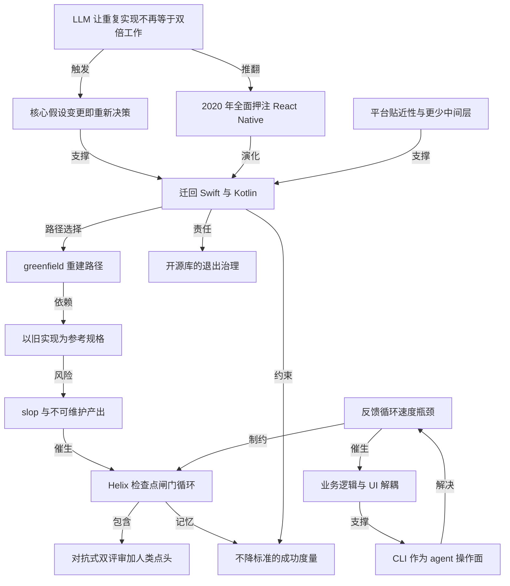

# Shopify 从 React Native 迁回 Swift 与 Kotlin

- 原文标题：Shopify moves back to Native from React Native
- 作者：shopify.engineering
- 内参日期：2026-09-11
- 来源类型：blog
- 原文：https://shopify.engineering/back-to-native
- 标签：工程, agentic engineering

> 2020 年全面押注 React Native 的三条理由里，最核心的一条是「不想把同一个功能写两遍」。Shopify 说这条假设被编码模型改变了——用 Swift 和 Kotlin 各写一遍的成本已经不再是当年的量级，于是从第一性原理重新评估并走回原生。一个决策被推翻的公开样本，比结论本身更值得读。

## 导读

技术栈

## 核心观点

- Shopify 宣布把全部移动应用从 React Native 迁回原生的 Swift 与 Kotlin。这不是对失败的纠偏——2020 年全面押注 React Native 的决定"极其成功"（extremely successful），省下大量重复开发时间，让没有移动背景的开发者也能贡献代码，摆脱了持续追赶功能对齐的负担。
- 翻转的是一条底层假设，而不是一次评估的结论。2025 年 1 月作者还公开写过 React Native 前途光明、Shopify 会继续投入；"那在当时我们知道的范围内是真的"。此后编码模型能力大幅提升，用 Swift 和 Kotlin 把同一个功能做两遍，不再是当年那个成本。
- 作者把方法论摆在结论前面：**不会因为一个决定当初成功就一直抱着它；当一条核心假设发生变化，就愿意回头问它是否仍然正确**。LLM 改变了 2020 年那次决策背后的核心假设，于是他们从第一性原理重新评估了整个移动技术栈。
- 关键的细节是"成本没有消失，只是不再是决定性因素"。原生依然意味着在两个平台上构建和维护软件，这份代价原封不动；变的是 agent 已经能承担足够多的实现、翻译、测试和评审工作，让这份代价不再左右选择。
- 与此同时，原生一侧的好处并未被削弱：更贴近平台能力和第一方工具链，代码与平台之间少了一层又一层框架和依赖。所以这次迁移的真实等式是——共享实现的优势被 agent 拉低了，分平台构建的优势还在原地。
- 迁移方法本身比结论更值得读：为什么这次选 greenfield 重建而不是渐进式的 brownfield，怎么用 Helix 这套检查点闸门系统防住"slop"，以及为什么他们判定**反馈循环速度**（而不是模型能力）才是移动端 agent 编程的真瓶颈。

## 2020 年那次押注为什么成立，以及它靠什么假设

- 2020 年从原生切到 React Native，只为三件事：不要把同一个功能建两遍；让开发者能跨栈工作；少花时间追赶功能对齐、多花时间交付价值。
- React Native 持续兑现了这三项收益。代价是他们在性能优化、React Native 基础能力改进、跟进框架升级与外部依赖上投入了可观的时间与资源——但这些是**可接受的权衡**（acceptable tradeoffs），收益远大于投入。
- 注意这三条理由的共同支点：**"建两遍 = 两倍工作量"**。跨平台框架的全部价值都建立在这条等式上。等式一旦被打破，三条理由同时失去分量。
- 作者对 React Native 的判断始终没有变成否定：React Native 至今"仍是一个出色的框架"，他们自己的 React Native 应用也确实很快。技术选型的翻转发生在假设层，不是质量层。

## LLM 如何改写"建两遍 = 两倍工作量"

- Shopify 从 2021 年就在用 LLM 写软件——比 ChatGPT 还早一年。最初用来实现功能、排查修复 bug、评审代码；随着模型变强，他们敢交给模型的工作复杂度也在同步上升。
- 到 2025 年末，模型"不再只是帮我们更快地写代码"，而是让他们开始怀疑：把软件构建两遍，是否还等于做两倍的工作。
- 他们没有停在怀疑上，而是直接做原型：用 LLM 在 Swift 和 Kotlin 里重建了几个最大应用的核心部分，效果之好让他们吃惊。原型阶段 agent 展现出三种能力：
- 能以 iOS 版本为参照在 Android 上实现同一个功能，反向亦然；
  - 帮助开发者快速上手、在自己主栈之外做出有效贡献；
  - 通过共享的规格说明、测试和评审检查点，大幅降低维持两端功能对齐的成本。
- 结论被作者刻意说得很克制：不是原生变便宜了，是**决定性因素换人了**。两个平台的构建与维护成本仍在，只是 agent 接管了其中足够多的实现、翻译、测试与评审，使它不再像 2020 年那样左右决策。

## 开源库的退场安排：迁移之外的公共责任

- 迁移前先交代生态。Shopify 发布的几个 React Native 开源库已成为各自品类的首选，他们明确要求这次转场"干净、没有意外"。
- React Native Skia：Shopify 赞助到 2026 年底；William Candillon 会在那之后继续维护，未来几个月内 fork 仓库、以新名字发布，原仓库在转场完成后归档；依赖它的应用被建议去赞助它。
- FlashList：每周约 200 万次下载，已成为 React Native 里渲染高性能列表的默认方案。鉴于其生态重要性，Shopify 会继续修复破坏兼容性的关键问题，并正在与多家公司洽谈长期托管权的交接。
- Restyle：用户基数较小，仓库将被归档——维持到 2026 年底后停止维护，欢迎任何人 fork 接手，Shopify 协助交接。
- 三种处置对应三种生态位：有人愿意接的交给人、生态依赖重的先兜底、影响面小的直接归档。技术栈退出也是一项需要设计的工程。

## 为什么这次选 greenfield 重建，而不是渐进迁移

- 涉及的应用体量不小：Shopify、Shop、Point of Sale、Inbox，全球数百万商家和买家每天靠它们谋生和购物。
- 他们在 brownfield（逐步迁移）和 greenfield（从零重建）之间做过权衡。**2020 年迁往 React Native 时，最大的几个应用选的恰恰是 brownfield**——因为重写要花数年，期间还得停止交付新功能。
- 这一次 greenfield 成为明显赢家，理由有三：
- LLM 擅长以 React Native 版本为参照，用 Swift 和 Kotlin 实现功能；
  - 重建给了一张白纸，可以摆脱既有约束、按最好的方式重做；
  - 原型证明，重建速度远超编码 agent 出现之前的可能水平。
- 这里藏着一个容易被略过的机制：旧代码库不再是必须被小心翼翼包裹的遗产，而变成了**一份可执行的规格说明**。参照物的价值上升，正是重写风险下降的原因。
- 成果已经落地：常年位居应用商店购物类榜首的 Shop 应用率先完成迁移，团队在 AI 协助下，从概念验证到完整重建的原生应用上架，只用了 12 周。
- 体量最大的 Shopify 应用（300 多个屏幕、主屏与锁屏小组件、Apple Watch 应用、复杂功能与 Siri 快捷指令）迁移也已启动，年内发布；其余应用随后跟进。

## Helix：用检查点闸门防住 slop

- 反面做法说得很直白：把 LLM 指向 React Native 代码库、想一次性把同样的功能在原生端 one-shot 出来，**行不通**。哪怕要求它先尽可能收集信息、把信息冻结成规格文件和任务文件再实现，最终得到的也是海量无法维护、无法上线的代码。
- 他们为此造了 Helix，采取更渐进的路径。核心设计原则是：**不指望第一次输出就是对的，而是建一个循环，让一次不完美的尝试在变好之前根本无法往前走**。
- Helix 的工作方式：开发者把它指向某个屏幕；Helix 读取 React Native 代码，提出一串检查点——小而有序的工作切片，每个都能在几分钟内评审完。
- 然后逐个检查点推进，每一个都必须同时通过四道闸：用测试证明自己的行为；在视觉评审中与运行中的应用一致；扛住两个对抗式代码评审者；拿到人类的点头。全部通过才提交，下一个检查点才开始。
- 最关键的一笔是记忆：**每一次评审的反馈都会被记住，所以随着迁移推进，这个循环会越来越自治**。这让 Helix 不只是一个流程，而是一条随使用变强的学习曲线。
- 效果是"极其奏效"，让他们用过去所需时间的一小部分完成应用重建。

## 真正的瓶颈是反馈循环速度，不是模型能力

- agent 对模拟器的控制一直是瓶颈：团队发现自己不断在给模拟器当保姆，因为它们无法可靠地构建、测试和迭代。
- 他们造过让 agent 自主复现 bug、修复并验证修复的工具，但又慢又脆。React Native 的热模块重载有帮助，却解决不了问题——症结在模拟器控制本身慢。
- 根因说得很具体：这类方案依赖**可访问性树或截图**来获取应用状态、执行动作、验证结果。agent 能在几秒内改完代码，却要花好几分钟才能测出结果，迭代因此极慢且高度人工。
- 由此得出一句可以带走的判断：**模型再好也没用，如果它不能快速测试自己的工作**——而这一点在移动端尤其困难。
- 他们的解法是把应用架构设计成同时服务人和 agent。核心原则：**业务逻辑与 UI 完全解耦，并且能在桌面端 headless 运行**；再通过一个 CLI 把它暴露给 agent，让迭代从"分钟级"降到"毫秒级"，且完全不涉及模拟器。
- 这个 CLI 让 agent 可以检视应用状态、在不同区块间导航、执行各种动作，全程不碰 UI。反馈循环因此极快，agent 能连续自主工作数小时。
- 确实需要模拟器交互时，CLI 可以通过远程模式连上模拟器，用命令直接驱动 UI，不必再去检视布局或可访问性树——端到端测试因此快得惊人。

## 下一步与成功的定义

- 全部移动应用都会迁到 Swift 和 Kotlin，并且全程用 AI：Shop 已作为完整原生应用发布，Shopify 应用进行中，其余随后。
- 速度提升不以降低标准为代价：每一次重建都必须达到或超过用户今天期待的性能、稳定性、可访问性和产品质量。
- 重建的野心也不止于换语言——**这不是把同样的应用用不同语言重写一遍**，而是重建成人和 agent 都能快速理解、测试和修改的样子。
- 作者明确否定了"迁移完成即终点"：成功的标准是团队能比以前更快地为商家和买家交付更好的体验，衡量方式是产品速度、应用质量，以及 agent 能自主完成多少工作。
- 承诺继续公开分享：Helix、面向 agent 的架构、以及用 agent 构建移动应用的经验都会有更深入的展开。当年他们公开分享了 React Native 的经验，这次同样会公开。
- 收尾处的态度值得注意：**"现在原生是 Shopify 的正确选择，而 2020 年 React Native 是 Shopify 的正确选择"**——技术决策被明确定义为对当时约束条件的最优应答，而不是一场需要分对错的站队。

## 概念网络

### 关键概念

#### 核心假设变更即重新决策

**context**：全文的方法论支点。作者写道"我们不会因为一个决定当初成功就一直抱着它。当一条核心假设发生变化，我们愿意回头问它是否仍是正确的选择"，并据此从第一性原理重新评估了整个移动技术栈。翻转的触发器是 LLM 能力的跃迁，而不是 React Native 出了问题。

**费曼一下**：一个决定的对错，取决于它建立在什么前提上。与其定期复查所有决定，不如给每个重大决定标出它依赖的那条假设，然后盯着假设本身——假设没变就不必重开会，假设变了就必须重开会，哪怕这个决定过去五年一直很成功。

#### 建两遍等于两倍工作量

**context**：Shopify 2020 年转向 React Native 的三条理由（不建两遍、跨栈工作、少追功能对齐）共同依赖的隐含等式。到 2025 年末，模型能力让团队"开始怀疑构建软件两遍是否仍然意味着做两倍的工作"，这条等式一旦松动，跨平台框架的核心卖点同时失效。

**费曼一下**：跨平台框架本质上是在卖"少干一遍活"。如果有人能以极低成本把你在一边写好的东西翻译到另一边，你就不再需要为了省这遍活而接受框架带来的所有限制。卖点不是被打败的，是被绕过去的。

#### 决定性因素的转移

**context**：作者刻意区分"成本消失"和"成本不再决定选择"。原文说得很清楚：原生依然意味着在两个平台上构建和维护软件，这份代价没有消失；变的是 agent 已能完成足够多的实现、翻译、测试和评审工作，使它不再是 2020 年那个决定性因素。

**费曼一下**：技术选型很少是因为某个成本归零才改变的，更多是因为这个成本从"最大的那项"掉到了"排第五的那项"。判断一次技术变迁是否真实发生，要看排序有没有变，而不是看某项开销有没有消失。

#### 平台贴近性

**context**：迁回原生的正向理由，而非仅仅"跨平台不香了"。原文强调原生让他们更贴近平台能力和第一方工具链，代码与平台之间少了若干层框架和依赖。作者同时承认 React Native 应用可以很快、他们自己的就很快——所以这里的收益是能力与工具的直达，不是性能数字。

**费曼一下**：每多一层中间框架，你就多了一个需要等别人支持新特性、多了一处可能出问题的地方。贴近平台的价值不在跑分，而在你想用的新东西刚发布就能用，出了问题也能一路查到底。

#### 以旧实现为参考规格

**context**：greenfield 重建成立的关键前提。原型阶段 agent 能"以 iOS 版本为参照在 Android 上实现同一功能，反之亦然"；选择从零重建的首条理由也是"LLM 擅长以 React Native 版本为参照，用 Swift 和 Kotlin 构建功能"。

**费曼一下**：重写系统最难的部分从来不是写代码，而是没人说得清旧系统到底做了什么。当机器能读懂旧代码并把它当成一份行为说明书，重写的最大风险就被拆掉了——旧代码从需要小心保护的遗产，变成了一份免费的、精确的需求文档。

#### brownfield 与 greenfield 的路径反转

**context**：2020 年迁往 React Native 时，最大的几个应用选的是 brownfield 渐进迁移，因为完整重写要耗时数年且期间无法交付新功能；2025 年这次，greenfield 成为"明显的赢家"。同一个团队、同一批应用，两次相反的选择。

**费曼一下**：渐进迁移和推倒重建的取舍点，取决于"重建要多久"。当重建周期从数年压到数周，渐进方案那套复杂的双轨共存、逐步替换的代价就不再划算了。路径选择的变化，往往只是某个时间常数被改写的结果。

#### slop 与一次性生成的不可维护产物

**context**：Helix 的反面教材。原文指出，把 LLM 指向 React Native 代码库想一次把功能 one-shot 到原生端行不通；哪怕先让它收集信息、冻结成规格文件和任务文件再实现，得到的也是"大量无法维护、无法上线的代码"。

**费曼一下**：模型写出的代码可以每一行看起来都对，整体却没法要——因为没人在中途说过"不对，回去"。一次性生成的产物把所有错误一起交付，而错误只有在被逐步拦截时才便宜。

#### 检查点闸门循环

**context**：Helix 的核心机制。开发者把 Helix 指向一个屏幕，它读取 React Native 代码并提出一串"小而有序、几分钟内可评审"的检查点；每个检查点必须用测试证明行为、在视觉评审中与运行中的应用一致、扛住两个对抗式评审者、拿到人类点头，才能提交并开始下一个。

**费曼一下**：与其让 agent 一口气跑完再检查，不如把路切成一小段一小段，每段末尾立一道闸门，过不了就不许往前。这样错误永远只积累一小段，而不是最后堆成一座没法拆的山。

#### 不指望首次输出正确

**context**：Helix 的设计哲学，被作者提炼成一句话：它"不指望第一次输出就是对的，而是构建一个循环，让不完美的尝试在变好之前根本无法往前走"。

**费曼一下**：用 agent 做工程，靠的不是让它一次做对，而是让做错的代价可控、让"变对"成为唯一的出路。系统的质量来自闸门的密度，而不是来自单次输出的水准。

#### 评审反馈的累积记忆

**context**：让 Helix 从流程变成学习曲线的那一笔。原文写明"每一次评审的反馈都会被记住，所以随着迁移推进，这个循环变得越来越自治"。

**费曼一下**：同一个错误如果每次都要人重新指出来，人就成了这个系统的耗材。把纠错沉淀成下一轮的默认前提，人的介入密度才会随时间下降——这是把人当瓶颈还是当教练的分界线。

#### 反馈循环速度瓶颈

**context**：全文最可迁移的工程判断。agent 对模拟器的控制慢而脆，根因是依赖可访问性树或截图来读状态、执行动作、验证结果；agent 改代码只要几秒，测试却要好几分钟。作者由此断言：**模型再好也没用，如果它无法快速测试自己的工作**。

**费曼一下**：agent 的生产力不取决于它想得多快，而取决于它多久能知道自己想错了。当"改一次"要几秒、"验一次"要几分钟，真正的产能被验证环节锁死——这时候换更强的模型是无效投资，该修的是那条慢通道。

#### 面向 agent 的应用架构

**context**：Shopify 给出的解法。核心原则是业务逻辑与 UI 完全解耦、能在桌面端 headless 运行，再通过 CLI 暴露给 agent，使迭代从分钟级降到毫秒级且不涉及模拟器；CLI 让 agent 检视状态、导航区块、执行动作全程不碰 UI，从而能连续自主工作数小时。必要时 CLI 以远程模式驱动模拟器 UI，不再依赖布局与可访问性树。

**费曼一下**：过去架构只为人服务，所有能力都藏在界面背后，机器只能靠"看屏幕"去操作它。把业务逻辑抽出来、给它装一个命令行入口，等于给 agent 开了一扇不用绕行界面的门——同一套能力，人走界面，机器走命令，两边都快。

#### 提速不降标准的成功度量

**context**：作者对迁移终局的定义。每次重建都必须达到或超过今天用户期待的性能、稳定性、可访问性和产品质量；迁移本身不是终点，成功由产品速度、应用质量、以及 agent 能自主完成多少工作来衡量。

**费曼一下**：用 AI 提速最容易滑向的失败，是用质量换速度还宣称双赢。把验收标准钉死在"不低于今天"，再把 agent 自主完成的工作量本身列为指标，才能让提速这件事有据可查，而不是一种感觉。

### 概念网络

整张网络的起点是一条被改写的等式。C1 不是一个技术事实，而是一次假设层的位移：当 agent 能以一端实现为参照生成另一端，"建两遍等于两倍工作量"就不再成立，2020 年那次押注赖以成立的地基（C2）随之失效。C3 是把这次位移转成行动的机制——决定不因成功而豁免复查，只因假设变动而复查。C1、C2、C3 三者共同推出结论 C4，但要注意 C4 并非仅由"跨平台变得不划算"支撑：C5 是它的正向理由，且这条理由在五年里从未被削弱。作者把等式写得很干净——共享实现的优势被 agent 拉低，分平台构建的优势原地不动，所以天平倾斜。

网络的第二层是方法论，它回答"决定了之后怎么做"。C6 与 C7 是一对：重建之所以敢选从零，是因为旧代码库的角色变了——从必须小心包裹的遗产，变成一份机器可读的行为规格。这正是 2020 年选 brownfield、2025 年选 greenfield 的唯一变量。但 C7 自带风险：把旧代码交给模型"一次生成"，产出的是 C8 那种量大而无法上线的代码。C9 是对 C8 的直接回应，其设计要点不是流程多，而是**让不完美的尝试无法前进**；C10 是闸门的具体构成（测试、视觉评审、两个对抗式评审者、人类点头）。C9 与 C15 之间存在一条容易被忽略的连线：反馈被记住使循环逐步自治，而自治程度本身又被列为成功度量的一项，闭合成一个自我强化的回路。

第三层是全文最具迁移价值的部分，也是一条独立的因果链。C11 指出真正卡住 agent 的不是智力而是验证速度——改代码几秒、验结果几分钟，产能被慢通道锁死。它同时向上制约 C9：闸门再设计得精巧，若每道闸都要几分钟才知道结果，整个循环就跑不起来。C12 与 C13 是对 C11 的解法，两者是层级关系——先有业务逻辑与 UI 的解耦，才可能有一个不碰界面的命令行操作面；后者回头把 C11 这条瓶颈解开，形成闭环。

最外层是两条约束性节点。C14 提醒技术栈的退出同样是工程：赞助到期、转手托管、直接归档，三种处置对应三种生态位。C15 则给整件事装上刹车——所有速度红利都必须在"不低于今天的性能、稳定性、可访问性和产品质量"之下兑现，并且重建的目标不是换语言，而是让人和 agent 都能快速理解、测试与修改同一套代码。把 C15 与 C4 之间的这条约束抽掉，整张网络就会退化成一次单纯的技术站队。

## 费曼 x3

一个决定当初做对了，不构成继续做它的理由。这句话听起来像常识，但真正执行它的组织极少——成功的决定会长出既得利益、沉没成本和身份认同，最终变得不可讨论。Shopify 这次把全部移动应用从 React Native 迁回 Swift 与 Kotlin，最值得带走的不是结论，而是他们触发这次重议的方式：不定期复查所有决定，只盯住每个重大决定所依赖的那条核心假设。假设没动就不必开会，假设动了就必须重开——哪怕这个决定在过去五年里"极其成功"。

被改写的假设只有一条：建两遍等于两倍工作量。所有跨平台框架卖的其实都是"少干一遍活"，你为此接受它带来的全部限制——多一层框架、多一层依赖、等它支持新特性。当 agent 能以 iOS 版本为参照在 Android 上实现同一个功能、反之亦然，这个卖点不是被打败的，是被绕过去的。作者的表述克制得恰到好处：原生依然意味着在两个平台上构建和维护软件，这份代价没有消失，变的是它"不再是 2020 年那个决定性因素"。技术变迁很少来自某项成本归零，多半只是排序变了。

真正的工程洞见藏在后半程。把模型指向旧代码库、要求它一次生成原生版本，行不通——哪怕先冻结成规格文件和任务文件，拿到的也是海量无法维护、无法上线的代码。他们的 Helix 换了个思路：不指望第一次输出正确，而是造一个循环，让不完美的尝试在变好之前根本无法往前走。每个检查点都小到几分钟可评审，必须用测试证明行为、与运行中的应用视觉一致、扛住两个对抗式评审者、拿到人类点头才能提交。更要紧的是每次评审的反馈都被记住，循环因此越用越自治——人从耗材变成教练。

最后一条判断值得所有做 agent 工程的人抄走：模型再好也没用，如果它不能快速测试自己的工作。agent 改代码只要几秒，靠可访问性树和截图驱动模拟器却要好几分钟，产能被验证环节锁死。这时候换更强的模型是无效投资。他们的解法是把业务逻辑与 UI 彻底解耦、让它能在桌面端 headless 运行，再用一个命令行入口暴露给 agent——同一套能力，人走界面，机器走命令，迭代从分钟级掉到毫秒级。

于是这次迁移的野心其实不在语言：不是把同样的应用用另一种语言重写一遍，而是重建成人和 agent 都能快速理解、测试和修改的样子。软件正在获得第二类用户，而我们大多数系统，至今只为第一类设计。

## 阅读原文

Shopify's migration from React Native to native mobile development

We decided to [go all-in](https://shopify.engineering/react-native-future-mobile-shopify) on React Native back in 2020, and that bet has been extremely successful. We saved a ton of time building features just once, enabled developers with no mobile background to contribute to our apps, and freed ourselves from constantly chasing feature parity.

In January 2025, I [wrote](https://shopify.engineering/five-years-of-react-native-at-shopify) that the future of React Native was bright and that Shopify planned to keep investing in it. That was true based on what we knew then. React Native was working well for us, and it remains an excellent framework. But since then, coding models have gotten dramatically better, and for our apps and our team, building the same feature in Swift and Kotlin no longer carries the cost it used to.

We don’t hold on to a decision just because it was successful at the time. When a core assumption changes, we’re willing to go back and ask whether it’s still the right call. LLMs changed one of the core assumptions behind our 2020 decision, so we reevaluated our mobile stack from first principles.

What we found led us back to native.

### Why switch back to native

We decided to switch from native to React Native in 2020 for three reasons:

- Stop building the same features twice
- Allow developers to work across the stack
- Spend less time chasing feature parity and more time shipping value
React Native consistently delivered these benefits. We found ourselves spending a significant amount of time and resources on optimizing performance, improving key foundational areas in React Native, and keeping up with framework updates and external dependencies, but these were acceptable tradeoffs. The benefits of using React Native far outweighed the investments we had to make in these areas.

Shopify has been using LLMs to build software since 2021 (one year before ChatGPT!). Initially, we used them to implement features, investigate and fix bugs, and review code. As the models improved, so did the complexity of the work we trusted them to take on. By late 2025, they were no longer just helping us write code faster. They were capable of making us question whether building software twice still meant doing twice the work.

We decided to reevaluate our mobile tech stack and started prototyping to see whether our technology choices still held up. We rebuilt several core parts of our biggest apps in Swift and Kotlin using LLMs and were surprised by how well it worked. Agents:

- Could implement a feature on Android using the iOS version as a reference, and vice versa
- Helped developers ramp up and contribute effectively outside their primary stack
- Dramatically reduced the cost of maintaining parity between platforms through shared specifications, tests, and review checkpoints
Native still means building and maintaining software on two platforms, that cost has not disappeared. What changed is that agents can now do enough of the implementation, translation, testing, and review work that it’s no longer the deciding factor it was in 2020.

React Native apps can be fast. Ours are. We are making this change because agents have reduced the advantages of sharing implementation, while the advantages of building for each platform remain. Native keeps us closer to platform capabilities and first-party tooling, with fewer framework and dependency layers between our code and the platform.

### The future of our React Native open-source libraries

Before we get into how we’re migrating, we want to make sure we do this transition cleanly. From the beginning, we wanted to contribute back to React Native to make it better. We’ve published open-source libraries that have become the top choice in their respective categories. We’re grateful for the incredible reception from the community and are committed to making sure this is a smooth transition with no surprises.

#### React Native Skia

Shopify will continue sponsoring this through the end of 2026, and [William Candillon](https://x.com/wcandillon) will continue working on it beyond that. He will fork the repo in the coming months and start publishing the library under a new name. The original repo will be archived when this transition is complete. We’ll post updates along the way so that everyone has ample time to migrate. If your app relies on this library, please consider sponsoring it.

#### FlashList

This library gets ~2M downloads/week and has become the default way to render high-performance lists in React Native. Given how important it is for the ecosystem, Shopify will continue to fix critical issues that break compatibility. We’re currently in discussions with several companies about taking on long-term stewardship of FlashList. If you’re interested, reach out to me [here](https://x.com/mustafa01ali).

#### Restyle

Restyle has a smaller user base than our other libraries, so we're archiving this repo. We'll keep it working through the end of 2026, then stop maintaining it. Anyone is welcome to fork it and take it forward, and we'll help with the handover if a team wants to pick it up.

### How we’re migrating

Shopify has several large apps ([Shopify](https://apps.apple.com/us/app/shopify-sell-online-in-person/id371294472), [Shop](https://apps.apple.com/us/app/shop-track-pay-discover/id1223471316), [Point of Sale](https://apps.apple.com/us/app/shopify-point-of-sale-pos/id686830644), [Inbox](https://apps.apple.com/us/app/shopify-inbox/id1301681854)). Millions of merchants and buyers around the world rely on them every single day to earn their livelihood and buy products they want from the brands they love.

We debated between gradually migrating to native (brownfield) versus rebuilding them from scratch (greenfield). In the past when we migrated to React Native, we picked the brownfield approach for some of our biggest apps, as it’d take years to rewrite them and we’d have to stop shipping new features while the rewrite was in progress.

However, this time greenfield emerged as a clear winner for the following reasons:

- LLMs are good at building features in Swift and Kotlin using the React Native version as reference
- It gives us a clean slate to rebuild in the best way possible without any of the previous constraints
- Our prototypes showed that we could rebuild these apps substantially faster than was possible before coding agents
The Shop app, which is regularly at the top of the list in the shopping category in the app stores, is the first to be migrated. Assisted by AI, the team was able to go from a proof of concept to a fully rebuilt native app published in the app stores in just 12 weeks. We’ve [written about this migration in depth](https://shopify.engineering/shop-app-migration) here.

The migration of the Shopify app (our biggest with 300+ screens, home & lockscreen widgets, Apple Watch app, complications, Siri Shortcuts, etc.), is also underway and will ship later this year. The rest of our apps will be migrated soon.

#### Preventing slop

It’s tempting to just point an LLM to the React Native codebase and try to one-shot the same features in native, but it doesn’t work. Even if you ask it to gather as much information as it can up front, freeze that into specs, task files, and then implement it, you end up with a huge amount of unmaintainable code that can’t be shipped.

To solve this problem, we built a system called Helix that takes a more gradual approach. It doesn't expect the first output to be correct, and builds a loop where an imperfect attempt simply cannot move forward until it becomes a good result.

The developer points Helix at a screen. Helix reads the React Native code and proposes a sequence of checkpoints (small, ordered slices of the work) that can be reviewed in minutes. Then, checkpoint by checkpoint, it builds: each one must prove its behavior with tests, match the running app in a visual review, survive two adversarial code reviewers, and get a human's nod before it's committed and the next one starts. Feedback from every review is remembered, so the loop gets more autonomous as the migration progresses.

Helix rebuilding a screen in the Shopify mobile app using Swift and Kotlin

This approach has been working extremely well and is allowing us to rebuild our apps in a fraction of the time.

#### Enabling fast feedback loops

Agentic control of simulators has been a bottleneck. We found ourselves constantly babysitting them as they couldn’t reliably build, test, and iterate. We built [tooling](https://x.com/mustafa01ali/status/2035155157982289998) to allow agents to reproduce bugs, fix them, and verify the fix autonomously but it was slow and brittle. React Native’s hot module reload helps the situation but it doesn’t solve it, due to simulator control being slow. This is primarily due to reliance on the accessibility tree, or screenshots to get the state of the app, take actions, and verify results. Agents can make code changes in seconds, but it takes them several minutes to test the output. This makes iterating extremely slow and manual. It doesn’t matter how good the model is if it can’t test its work quickly, which is especially difficult on mobile.

We’re fixing this by designing our app architecture to work for both humans and agents. The core principle here is that business logic should be completely decoupled from the UI and be able to run headlessly on desktop. We then make it available to agents via a CLI that allows them to iterate on it in milliseconds instead of minutes without involving simulators.

_Navigating the app and performing actions using the CLI_

The CLI allows agents to inspect the state of the app, navigate between different sections, and perform actions all without needing to touch the UI. This enables extremely fast feedback loops and allows agents to work autonomously for hours at a time.

When simulator interaction is needed, the CLI can connect to them via a remote mode and drive the UI via commands without having to inspect the layout or the accessibility tree. This enables blazing-fast performance and E2E tests.

_This is real-time (not sped up)_

### What’s next

We are going to migrate all our mobile apps to Swift and Kotlin using AI throughout the process. Shop has already shipped as a fully native app, the Shopify app is underway, and the rest will follow soon. We’re moving quickly, but not by lowering the bar. Every rebuild must meet or exceed the performance, stability, accessibility, and product quality people expect today. This isn’t just the same apps rewritten in different languages. We’re rebuilding them so both humans and agents can understand, test, and change them quickly.

The migration isn’t the finish line. Success means our teams can deliver better experiences for merchants and buyers faster than before. We’ll measure that through product velocity, app quality, and how much work agents can complete autonomously.

We’ll share what we learn along the way, including deeper dives into Helix, our agent-addressable architecture, and how we’re building mobile apps with agents. We were open about what we learned from React Native, and we intend to be just as open about this transition.

This is one of the most ambitious mobile engineering projects we’ve taken on. If you want to help build the next generation of Shopify’s mobile apps, we’re [hiring](https://www.shopify.com/careers) mobile engineers, infrastructure engineers, and developers working at the intersection of AI and software engineering.

### Acknowledgements

Native is the right choice for Shopify now, but React Native was the right choice for Shopify in 2020. That success was only possible because of the people who made it work.

#### Meta

Thank you to the React Native team at Meta for being excellent stewards of the framework, listening to our feedback, and working closely with us over the years. React Native is substantially better today because of your investments in its architecture, performance, tooling, and community.

#### William Candillon

Thank you for creating React Native Skia and taking it much further than any of us imagined. You redefined what was possible for graphics and animation in React Native, and we’re excited to see where you take it next.

#### Software Mansion

Thank you for all your work on Reanimated, for listening to our feedback, and for helping us solve some of the hardest animation and performance problems in our apps.

#### Shopify engineers

Hundreds of engineers contributed to adopting React Native, migrating our apps, building shared foundations, improving performance, maintaining integrations, and contributing back to the ecosystem. Many of you became beginners again, challenged long-held assumptions, and made the transition successful while continuing to ship for merchants and buyers. Thank you.

#### The React Native community

Thank you to everyone who used our open-source libraries, contributed code, reported issues, challenged our decisions, and shared what you learned. Your contributions and feedback, including the spicy kind, made our work better.

The tools, lessons, and relationships built over the past six years will continue to shape how we build mobile apps at Shopify. We’re deeply grateful to everyone who was part of it.
