# AI 内参 · 260910 期（2026-09-10）

- **期数**：260910（2026-09-10 星期四）
- **来源**：AI 内参主题精选 · 图文版：Context Engineering（Howie 原清单 26 篇 ＋ Codex 补充 2 篇；原清单更新于 2026-08-02）
- **流水线**：原文快照 → 三级笔记 → 概念辞典 → AI 费曼示范 ｜ 模型 deepseek-flash ｜ 78,208 tokens
- **生成时间**：2026/9/15 05:42:59

## 今日导读

1. **论文《上下文工程 2.0》：给这门手艺补上它自己的上下文**（arxiv.org）—— 上下文工程是熵减手艺，有二十年史，按机器智能分四阶段演化，实践按收集、管理、使用三维展开。
2. **经典论文《迷失在中间》：位置决定了模型能不能真的用上信息**（arxiv.org）—— 能塞进去不等于用得上：相关信息在中间时性能显著下降，呈U型曲线。
3. **Chroma 实测上下文腐烂：输入越长，模型并非均匀地可靠**（research.trychroma.com）—— 模型性能随输入变长而非均匀衰减；信息怎么摆才是可靠性的关键。
4. **Manus 的上下文工程实战：几轮重写换来的一组局部最优**（manus.im）—— 构建生产级 agent 应押注上下文工程，并遵循六条局部最优设计模式。
5. **Anthropic：有效的上下文工程，是为 agent 找到最小充分信息集**（anthropic.com）—— 好的 context engineering 是为 agent 找到最小高信号 token 集合，使期望结果概率最大化。
6. **12-Factor Agents：让 LLM 软件真能交付给生产用户的十二条原则**（github.com）—— 好的 agent 大多不是 agent，生产可用靠可单点植入的工程原则。
7. **工具更多反而让 Copilot 代码审查变差，GitHub 如何修正**（github.blog）—— 工具更好不一定改进审查；重写 diff 锚定工作流并靠 trace 迭代才修复。
8. **从 Prompt 转向 Loop Engineering 的工作流拐点**（martinfowler.com）—— 单次提示词正让位于可验证、可观察、可管理的自动循环系统。
9. **从 /grill-me 到 /grill-with-docs：用对话先对齐领域语言**（youtube.com）—— 以可积累的领域语言取代一次性追问，让 AI 编码前先对齐术语与决策。
10. **用十分钟语音漫谈，让 LLM 帮你整理真正想说的话**（）—— 用十分钟语音漫谈替代精心打字，让LLM重构意图，提升对齐、减少纠偏。
11. **SaaS 没死，Linear 正把上下文变成 Agent 的骨架**（app.podwise.ai）—— Linear 靠理解工作流成为 agent-native 的上下文骨架，而非抢着上 AI 功能。
12. **产品开发的下一阶段由上下文与行动能力驱动**（linear.app）—— 问题追踪已死；新系统围绕上下文与agent，将上下文转化为执行。
13. **用 Skills 在 Claude Code 里搭建验证闭环**（claude.com）—— 把重复检查写成 skill，并逐级接入自动验证闭环。
14. **Agent Harness 的本质：把模型放进可控的执行系统**（baoyu.io）—— Agent 的本质是模型被放进可控执行系统 Harness。
15. **Coding Agent 如何工作：工具循环与上下文工程**（simonwillison.net）—— 编码代理是外壳包裹无状态大模型的工具循环系统。
16. **构建 Claude Code 的经验教训：如何让 Agent「看见」世界**（anthropic.com）—— 构建 Agent 最难的是设计匹配其能力的行动空间。
17. **用持久化代码图谱给 AI Review 精准上下文**（github.com）—— 持久代码图谱按需给 AI 精准上下文，省 token 不降质量。
18. **提示词缓存不是小优化，而是 agent 成本结构的关键变量**（x.com）—— 提示词缓存通过复用稳定前缀，改变长对话/agent 成本结构。
19. **Claude Code 的 1M Context 让会话管理变成核心技能**（x.com）—— 1M context 不放大理解力，session management 才是被放大的核心技能。
20. **Claude Code 在读提示词前为何已发送 3.3 万 Token**（systima.ai）—— Agent 成本由固定底座、请求次数与配置乘数决定，须在 API 边界审计。
21. **只改两个 API 设置，OpenAI 把 ARC-AGI-3 成绩提到三倍**（openai.com）—— 开启保留推理与上下文压缩两个 API 设置，GPT-5.6 在 ARC-AGI-3 上分数三倍、输出 token 少 6 倍——瓶颈在 harness 不在模型。
22. **Opus 5 系统提示词全文流出：一份近两万字的 agent 行为说明书**（）—— Opus 5 提示词已从人格指南变成 agent 行为判定说明书。
23. **Claude 5 世代的上下文工程，规则变了**（claude.com）—— Claude 5 世代：上下文工程从灌满约束转向按需给对。
24. **Claude 5 时代的上下文工程新规则：系统提示词砍掉 80%**（claude.com）—— 模型能力跃升后，旧强约束成枷锁，应删规则、让模型自主判断。
25. **构建可靠 AI 工作流：智能体原语与上下文工程**（github.blog）—— 用三层框架把自然语言工作流变成可复用、可验证的工程系统。
26. **AI 的新技能不是提示词，而是上下文工程**（philschmid.de）—— agent 成败关键不是模型或提示词，而是上下文工程。
27. **上下文工程：AI 时代的核心能力**（x.com）—— AI 工程瓶颈不在模型智能，而在上下文工程化。
28. **什么是 Context？**（）—— Context 是有限昂贵的工作记忆，个人上下文经工程化决定 AI 价值。

---

## 1｜[论文《上下文工程 2.0》：给这门手艺补上它自己的上下文](https://arxiv.org/abs/2510.26493)

> arxiv.org ｜ 主题特刊 ｜ 约 59 分钟 ｜ 23,699 字

**一句话主旨**：上下文工程是熵减手艺，有二十年史，按机器智能分四阶段演化，实践按收集、管理、使用三维展开。

### AI 费曼示范

文章在回答：为什么跟机器交代任务那么费劲，这门手艺会怎么变。答案是：因为机器不会像人那样自动补全没说出口的部分，所以人要替它把模糊意图降成明确输入；机器越聪明，人越省力。

这里的“降成明确输入”就是熵减——把人话里省略、含混的部分理顺。人和人交流时，听者能靠背景、语气、场景自动补上；机器不行，于是省略的部分就外包给了人。就像跟老熟人使个眼色就懂，跟新来的实习生却要把前因后果写满便条；对方越不懂，便条越长。论文用这个道理把历史分成四阶段：机器能直接吃下的“生”信息越多，人做的翻译越少。

作者承认的边界是：现在模型对上下文的理解仍有限，复杂逻辑和图像关系经常吃不透，导致很多已收集的上下文没被真正利用；所以这份代偿劳动还没到头。

### 三级笔记

# 论文《上下文工程 2.0》：给这门手艺补上它自己的上下文

## 一句话主旨
上下文工程是熵减手艺，有二十年史，按机器智能分四阶段演化，实践按收集、管理、使用三维展开。

## 作者试图回答的问题
核心：上下文工程是什么，为什么存在，它如何随机器智能演化，当代又该如何做？
子问题：为什么今天把上下文窄化为对话历史是一种退步？驱动范式跃迁的根本变量是什么？终身上下文工程的瓶颈与出路在哪里？

## 三级论证骨架

### 一、历史纠偏：上下文工程不是新发明
#### 1.1 领域被普遍误解
- 今天上下文常被窄化为对话历史、系统提示或以 agent 为中心的环境输入。
- 作者判定这种窄化是 "a step backward"（一种倒退）——1.0 时代的理论视野反而更宽、更整体。

#### 1.2 它有二十年 HCI 积累
- 上下文工程从 1990 年代普适计算、上下文感知系统、HCI 框架一路演化到今天；把它当 2023 年才出现的技巧，会切断与几十年 HCI 积累的联系。
- 论文三项贡献：把上下文工程放回更长历史；给出熵减视角与四阶段演化模型；通过比较典型实践提出通用设计考量。

### 二、统一本质：熵减与四阶段演化模型
#### 2.1 本质是熵减
- 人类交流靠听者用共有知识、情绪线索、情境感知补全没说出口的部分；机器缺这个能力，所以人必须替机器预处理，把高熵意图压缩成低熵表示。
- 这份力气（effort）是上下文工程的核心成本，与机器智能水平成反比。
- 形式化定义：上下文 C 是所有相关实体表征信息之并集；上下文工程是把（C, T）映射为上下文处理函数的系统性过程。该定义刻意不绑定任何时代或技术。

#### 2.2 机器智能是范式跃迁的根本变量
- 传导链条：技术突破 → 上下文吸收能力激增 → 界面革命 → 上下文工程范式跃迁。
- 具体技术会不断过时，核心挑战——让意图被准确理解——保持不变。
- 作者自题："A person is the sum of their contexts."（一个人是其全部上下文之和）。

#### 2.3 四阶段演化模型
- Era 1.0 原始计算（1990s–2020）：机器只能处理结构化输入和简单环境信号，所有上下文必须显式准备好。
- Era 2.0 智能体（2020 至今）：GPT-3 发布为转折点，机器能理解自然语言、推断部分隐含意图，可容纳歧义与不完整信息。
- Era 3.0 人类级智能（未来）：系统能读社交线索、情绪状态、环境动态，AI 成为有知识、有效率的同侪。
- Era 4.0 超人智能（推测）：机器获得"上帝视角"，主客关系反转，主动为人构造上下文、揭示隐藏需求。
  - 苗头案例：围棋职业棋手向 AI 学习超人策略。
- 辅助线索：机器角色从被动执行者 → 主动智能体 → 可靠协作者 → 体贴的主人；人机交互成本单调下降。

### 三、两个时代的对照
#### 3.1 1.0：意图翻译者的时代
- 分工：人提供上下文，原始计算机接收；设计者充当 intention translators（意图翻译者），把复杂人类意图转换成结构化、机器可读格式。
- 理论基石是 Dey 2001 的定义：上下文是"任何可用于刻画一个实体所处情境的信息"。
- 核心实践：从键鼠输入转向分布式、以传感器为中心；Dey 的 Context Toolkit 围绕五个抽象组织——Widgets（封装传感器）、Interpreters（原始数据升高层含义）、Aggregators（整合多来源）、Services（应用级访问）、Discoverers（动态注册发现）。
- 作者判断：那个时代理论 broad and deep（宽广且深刻），回看可纠偏今天的窄化。

#### 3.2 2.0：从 context-aware 到 context-cooperative
- 以 tolerance for raw context（原始上下文容忍度）为智能度量：系统能不能直接吃下高熵输入。1.0 只能吃 GPS 坐标、时间、预定义状态；2.0 能吃自由文本、图像、视频。
- 不只是输入类型变多，而是理解混乱、模糊、不完整数据能力的深层提升。
- 术语升级：1.0 跑"条件—动作"规则（若位置是办公室则手机静音）；2.0 主动解释用户正在做什么并协作达成目标——从 context-aware 走向 context-cooperative。

### 四、2.0 实践：收集、管理、使用三维框架
#### 4.1 收集与存储：两条原则
- 最小充分性原则：只收集和存储任务所需信息，价值在充分而非体量。
- 语义连续性原则：目的是维持意义的连续，而非数据的连续。
- 2.0 做法：分布式采集（手机、可穿戴、家庭传感器、云、API），分层存储——高频短时进内存/边缘，中期进本地数据库（SQLite、LevelDB、RocksDB），长期与跨设备同步交云。
- 典型压力场景：代码 agent 跨会话任务。Claude Code 周期性把关键信息写出上下文窗口、需要时取回，支撑长时程活动与中断恢复。

#### 4.2 管理（一）：文本处理四法与多模态融合
- 文本四法各有代价：
  - 打时间戳简单，但只留时序无语义结构，难以捕捉长程依赖。
  - 按功能打标签便于检索，但刚性，可能限制灵活推理。
  - 压成问答对检索高效，但打断思路流动。
  - 层级笔记结构清晰，但丢失因果、证据与结论的关系，也无法记录理解随时间的演化与修正。
- 多模态三策略：各模态经投影层映射到同一可比向量空间；拼进同一 Transformer 做联合自注意力，实现细粒度跨模态对齐；交叉注意力让一模态关注另一模态的特定部分。
- 交叉注意力传统设计需预先指定模态交互，人脑却能在感官与记忆通道间灵活整合——这是差距。

#### 4.3 管理（二）：分层记忆与上下文隔离
- Karpathy 操作系统类比：LLM 像 CPU，上下文窗口像 RAM；上下文工程决定什么信息进窗口。
- 分层核心：不同类型信息需要不同保留策略。形式化定义——短期记忆是时间相关性权重超阈值的子集；长期记忆是重要性超阈值且时间相关性已衰减、经处理抽象的子集；记忆迁移受重复频率、情绪显著性、与既有知识关联度支配。
- 上下文隔离：subagent 有独立上下文窗口、定制系统提示、受限工具权限，不污染主对话。Claude Code 的 subagent 系统是范例。
- 轻量引用配套隔离：大块信息存外部，窗口只放简短引用。HuggingFace CodeAgent 用沙箱存放庞大输出、按需取回。
- LeadResearcher 的反馈回路：先计划，信息不足时追加搜索、调整关键词、创建新子任务，主 agent 汇总并决定下一步，收敛到高质量答案。

#### 4.4 管理（三）：self-baking——把记忆变成学习
- 问题：原始上下文（对话轮次、工具输出、检索文档）积累极快，不处理会淹没系统。
- self-baking 定义：agent 有选择地"消化"自己的上下文，转成持久知识结构，对应人从情节记忆生成语义记忆的过程。
- 判词：self-baking 是记忆"存储"与"学习"的分界——没有它，agent 只是回忆；有了它，agent 才在积累知识。
- 四种代表设计：
  - 层级记忆组织：底层保留细节，往上逐步摘要成更抽象表示，保留回溯原始细节的链接。
  - 加自然语言摘要：保留完整原始上下文，周期性生成压缩视图；简单灵活但纯文本缺结构。
  - 按固定 schema 抽关键事实：CodeRabbit 在代码评审前构造结构化案卷，编码跨文件依赖、历史 PR 信息、团队规则，让 AI 在完整系统上下文上推理；代价是多层易不一致，可靠抽取器难设计。
  - 渐进压缩成语义向量：紧凑灵活、利于语义检索，但表示不可读，难以编辑检查。

#### 4.5 使用（一）：系统内与跨系统共享
- 系统内三种模式：
  - 把前序上下文嵌进提示（AutoGPT、ChatDev）。
  - 交换结构化消息，按固定 schema 传任务类型、输入输出、推理步骤（Letta、MemOS）。
  - 用共享记忆间接通信：memory blocks 或黑板分区；图结构记忆如 TME 任务图（节点是步骤，边是依赖）、G-Memory 语义图（节点是洞见，边是追问、精化、因果）。
- 跨系统共享更难：格式、结构、逻辑各异，挑战是让共享上下文在边界外仍可解释。
- 两条路线：适配器转换（各自保留格式，每条连接单独建转换器，成本随连接数增长）；约定共享表示（共享数据格式、自然语言摘要、语义向量）。
- 权衡：标准 schema 精确但严格；自然语言灵活但难解析；语义向量紧凑但可解释性差。

#### 4.6 使用（二）：上下文选择是 "attention before attention"
- 即使窗口变长，模型仍受限于输入 token 质量；AI 编程表现在窗口填充度超过约 50% 后开始下降。
- 上下文选择是"注意力之前的注意力"——决定什么值得被注意。
- 考量因素：
  - 语义相关性：查询与候选条目编码成稠密向量做最近邻检索。
  - 逻辑依赖：MEM1 记录推理轨迹，新步骤链接到依赖的早期步骤形成依赖图，查询时沿图遍历只取相关依赖链。
  - 新近性与频率：新条目更高优先级，旧条目自然衰减，反复访问者累积更高重要性。
  - 信息重叠：过滤更旧或更粗的冗余条目。
  - 用户偏好反馈：自演化记忆跟踪用户互动，调整记忆权重。
- 过滤策略：RAG 分块（固定窗口或 AST 按函数、类、模块边界），embedding 语义检索、Grep 式非语义检索、知识图谱结构化检索，再加 LLM 驱动重排。

#### 4.7 使用（三）：主动推断用户需求
- 当前上下文使用大多被动，但用户常难以完整表达需求；上下文工程应让 agent 变得主动。
- 三种形态：从对话历史和个人资料中学习并适配用户偏好，固化为演化用户画像；从相关问题序列推断隐藏目标（先问 Python 装饰器再问性能调优，可能反映提升设计效率的更大目标），可用思维链做多步推断；在用户卡住时主动提供可视化、检查清单等帮助。

### 五、终身尺度：四道坎与语义操作系统
#### 5.1 四道坎
- 存储瓶颈：需同时支持高压缩、高精度检索、低延迟访问，目前无统一方案。
- 处理退化：Transformer O(n²) 复杂度带来延迟与显存压力；输入变长后注意力被摊薄；检索被大量"语义相似但无关"片段淹没；片段矛盾难调和。
- 系统不稳定：记忆累积后，小错误影响面放大，局部错误开始扩散；缺乏边界与校验时，长时程任务反而更脆弱。
- 评测困难：基准只测"能不能检索到"，不检查相关性、准确性、有用性；系统缺乏检测矛盾、回滚错误更新、追溯推理步骤的能力。

#### 5.2 方向：语义操作系统
- 扩大窗口或提高检索准确率都不够；需要能随时间生长的语义操作系统——大规模语义存储与记忆库，具备类人的添加、修改、遗忘能力，替代 Transformer 的新架构，且能自我解释、追溯推理链。
- 范式判断：上下文不再是被动累积的，而是作为认知的核心要素被主动管理与演化。

### 六、工程要点与应用场景
#### 6.1 工程实践要点
- KV 缓存：命中率决定延迟与成本；保持前缀稳定（系统提示开头的时间戳变动会让整段缓存失效）、强制 append-only 与确定性更新。
- 工具设计：描述要精准；DeepSeek-v3 在超过 30 个工具后表现下降，超过 100 个几乎必然失败。
- 保留错误：把失败留在上下文里，模型才能观察失误、学会纠正；agent 场景中传统 few-shot 反而有害，模型倾向照抄既有模式（Manus 用受控小扰动打破重复）。
- 多 agent 委派：给清晰目标、输出、工具指引、边界；搜索策略从广泛探索走向聚焦分析。
- todo.md：长任务维护子目标清单，更新时用自然语言复述目标，把关键目标重新拉回模型近期注意力。

#### 6.2 三个应用场景
- Gemini CLI：GEMINI.md 文件记录项目背景、角色、工具、编码规范，通过文件系统层级实现继承与隔离；文件系统作为轻量数据库，AI 生成摘要压缩长交互历史。
- Tongyi DeepResearch：四步循环（搜网、抽取、生成子问题、整合证据），周期性调用摘要模型把累积历史压成紧凑推理状态；后续推理基于上下文快照而非完整原始历史。
- 脑机接口：采集注意力、情绪、认知负荷等外部行为难观察的内在维度；当前信号理解仍粗糙，但指向从外部环境延伸至用户内在认知状态的方向。

### 七、边界、未竟之处与数字存在
#### 7.1 未竟之处
- 采集依赖显式用户输入，用户常说不清意图，重要上下文缺失。
- 大规模上下文的存储与管理：如何既可扩展又支持有效选择与检索，仍无好答案。
- 模型对复杂逻辑和图像关系理解有限；机器越笨，上下文工程越费力。
- 长上下文性能瓶颈：Mamba 及 LongMamba 提升效率，但在输入远超训练长度或长跨度关系推理时仍弱；LOCOST 能处理数十万 token 文档，但细粒度长跨度推理仍落后 Transformer。
- 相关性估计与过滤机制有限，有用信号漏掉，噪声冗余残留。

#### 7.2 数字存在
- 马克思"人的本质是一切社会关系的总和"获得计算含义：人越来越由自己生成的数字上下文定义。
- 人的心智也许无法上传，但人的上下文可以；上下文成为持久的知识、记忆与身份形式。
- 结论：上下文工程是被机器智能进程塑造的长期学科，轨迹是人逐步从显式上下文管理中脱身；当机器获得对我们意图的"上帝视角"时，AI 不仅能理解我们，还可能照亮并扩展我们对自己的理解。

## 作者边界、反例与不确定性
- Era 3.0 人类级智能与 Era 4.0 超人智能是未来与推测，非已实现状态。
- 分层记忆的两层模型是为讲清原理，作者明言真实实现常有工作记忆、情节缓冲、领域缓存等更多中间层。
- 交叉注意力传统设计需预先指定模态交互，与人脑的灵活整合存在公认差距。
- 文本处理四法、self-baking 四法、跨系统共享三种形态均被描述为各有代价，未给出唯一最优解。
- 长上下文问题明确表示"需要新架构，而不是把长上下文仅仅当作更长的输入"，承认现有方案不足。
- 存储、选择、检索多处称"仍无好答案""还没有统一方案"，未给出封闭式解决方案。

### 概念辞典

# 概念解析辞典

> 针对《Context Engineering 2.0: The Context of Context Engineering》（Qishuo Hua et al.，arXiv:2510.26493）的概念提取

## 一、核心概念

### 1. **上下文工程（context engineering）**

- **context**：论文把它定义为把原始上下文 C 与目标任务 T 映射为一个上下文处理函数；该函数由采集、存储管理、统一表示、多模态处理、self-baking、选择、跨系统共享、依反馈动态适配等可组合操作构成。作者刻意让定义不绑定任何具体技术或时代。全篇的基调也落在作者自题句上：

  > “A person is the sum of their contexts.”

- **费曼一下**：它不是“写好提示词”的高级说法，而是同一个长期存在的问题——如何把脑中的情境与目的，整理成机器接得住的形状。技术会换，问题不换。

### 2. **熵减（entropy reduction）**

- **context**：论文把熵减判为上下文工程的本质。人与人交流时，听者会用共有知识、情绪线索、情境感知主动补上没说出口的部分；机器目前缺这个能力，所以人必须替它预处理，把高熵的意图压缩成低熵表示。这份“力气”就是上下文工程的核心成本，并与机器智能水平成反比。

- **费曼一下**：跟人说话可以省略一半，跟机器说话不能。省略掉的那一半，得有人补上——现在补的是你。机器越笨，你补得越多。

### 3. **上下文（Dey 的定义与形式化）**

- **context**：作者回到 Dey 2001 年的经典定义——上下文是“任何可用于刻画一个实体所处情境的信息”，实体包括人、地点、对象，以及用户和应用本身。论文再把它形式化为：对每个实体有一个情境表征函数，上下文 C 是所有相关实体表征信息的并集。以 Gemini CLI 为例，相关实体包括用户、应用、终端环境、外部工具、记忆模块和后端模型服务。

- **费曼一下**：上下文不只是“聊天记录”。你是谁、你在哪个目录、手边有什么工具、系统怎么配置，全都算。论文认为今天把它窄化成对话历史，是把一个宽概念用窄了。

### 4. **四阶段演化模型（1.0 到 4.0）**

- **context**：按机器智能水平划分：1.0 原始计算（1990s–2020，结构化输入、刚性格式）；2.0 智能体（2020 至今，理解自然语言、容纳歧义）；3.0 人类级智能（能读社交线索与情绪）；4.0 超人智能（机器获得“上帝视角”，主客关系反转，主动为人构造上下文）。每一阶段的设计权衡与人机分工都不同。

- **费曼一下**：一把用“机器有多聪明”当刻度的尺子。刻度往右走，人要做的翻译工作就往下掉；到最右端，反过来是机器给人提供上下文。

### 5. **原始上下文容忍度（tolerance for raw context）**

- **context**：论文提出，在达到人类级智能之前，衡量系统智能的最好尺度是它对原始上下文的容忍度。1.0 只能消化 GPS 坐标、时间、预定义状态这类简单结构化信号；2.0 能直接摄入自由文本、图像、视频等接近人类自然表达的信号，无需重度预处理。

- **费曼一下**：判断一个系统聪明不聪明，看它能不能直接吃“生的”东西。要你切好摆盘才吃的是弱的，端上来乱七八糟也能吃的是强的。

### 6. **意图翻译者（intention translator）**

- **context**：1.0 时代设计者的角色定位。当时机器只能执行预定义程序逻辑，无法理解自然语言语义、无法推理、无法有效处理错误，设计者因此必须把复杂的人类意图转换成结构化、机器可读的格式。

  > “intention translators”

- **费曼一下**：那个年代做产品设计，本质是当人机之间的口译。今天模型能自己听懂一部分，但只要它听不懂的部分还在，这个岗位就还在，只是换了名字。

### 7. **上下文协作（context-cooperative）**

- **context**：1.0 的上下文感知系统跑“条件—动作”规则——“若位置是办公室，则手机静音”，它响应你在哪里，不响应你在做什么。2.0 系统则主动解释用户正在做什么并协作达成共同目标，例如分析你已写的段落与写作意图，建议下一节内容。作者据此提出术语升级：从 context-aware 走向 context-cooperative。

  > “context-cooperative”

- **费曼一下**：从“感应到你进屋就开灯”，变成“看你在写论文就帮你想下一段”。前者响应状态，后者参与工作。

### 8. **最小充分性与语义连续性原则（Minimal Sufficiency & Semantic Continuity）**

- **context**：论文给上下文收集与存储定的两条基本原则。最小充分性：只收集和存储支撑任务所必需的信息，上下文的价值在于充分，不在于体量。语义连续性：上下文的目的是维持意义的连续，而不只是数据的连续。

  > “Minimal Sufficiency” / “Semantic Continuity”

- **费曼一下**：不是存得越多越好，是存得刚好够用最好；也不是把每个字都留着就叫记得住，得让意思接得上。

### 9. **分层记忆架构**

- **context**：借 Karpathy 的操作系统类比：模型是 CPU，上下文窗口是 RAM；正如操作系统决定什么数据进 RAM，上下文工程决定什么信息进窗口。论文形式化定义了短期记忆、长期记忆与记忆迁移函数；真实系统常有工作记忆、情节缓冲、领域专用缓存等更多中间层。

- **费曼一下**：把记忆按“多久有用”和“多重要”分层放置。刚发生的放手边，重要的沉到仓库，其余的让它自然淡出。

### 10. **上下文隔离（context isolation）**

- **context**：绕开窗口限制并降低上下文污染的策略。Claude Code 的 subagent 系统是范例：每个 subagent 有独立上下文窗口、定制系统提示、受限工具权限；主系统委派任务后，subagent 独立运行而不污染主对话。切分可沿功能或层级维度，每个隔离单元只拿最小必要权限。

  > “context isolation”

- **费曼一下**：别让所有事挤在一个脑子里。把子任务交给一个有独立记事本、只带必要工具的专职助手，做完把结论交回来，过程不脏主线。

### 11. **self-baking（上下文自烘焙）**

- **context**：论文对上下文抽象的命名：agent 有选择地“消化”自己的上下文，转成持久的知识结构，对应人从情节记忆生成语义记忆、把重复动作沉淀为习惯的过程。论文判词：它是记忆“存储”与“学习”的分界——没有它，agent 只是回忆；有了它，agent 才在积累知识。

  > “self-baking”

- **费曼一下**：光把笔记堆着不叫学会，得定期把它嚼碎、变成自己的结论。agent 也一样：会翻记录只是检索，能把记录炼成知识才是长本事。

### 12. **轻量引用（lightweight references）**

- **context**：上下文隔离常用的配套手法：大块信息存外部，模型窗口里只暴露简短引用。HuggingFace 的 CodeAgent 把庞大输出放沙箱、需要时才取回；schema 化状态对象同理，文件与日志留在外部存储，只上浮选定字段。两者都在降低 token 开销的同时保留对完整上下文的可达性。

  > “lightweight references”

- **费曼一下**：桌上只放索引卡，资料放柜子里。要用哪份再去取，桌面不会被淹。

### 13. **注意力之前的注意力（attention before attention）**

- **context**：即使窗口变长，模型仍受限于输入 token 的质量。无关或嘈杂的记忆片段会干扰推理、抬高推理成本；经验观察是 AI 编程表现常在窗口填充度超过约 50% 后下降。有效的上下文选择因此必须先于模型自身的注意力发生。

  > “attention before attention”

- **费曼一下**：先决定什么值得被看，再让模型去看。模型自己的注意力只在进了窗口之后才起作用；喂多了和喂少了，都会变笨。

### 14. **语义操作系统（semantic operating system）**

- **context**：面对终身上下文工程的四道坎——存储瓶颈、处理退化、系统不稳定、评测困难——论文主张不能只靠扩大窗口或提高检索准确率解决，而需要一个能随时间生长的语义操作系统。它既是大规模高效的语义存储与记忆库，又具备类人的添加、修改、遗忘能力，并能自我解释推理链。

  > “semantic operating system”

- **费曼一下**：把“记忆”当成一个需要操作系统来管理的资源，而不是一个越买越大的硬盘。它得会整理、会忘、会解释自己为什么这么想。

### 15. **数字存在（Digital Presence）**

- **context**：论文收尾提出：马克思“人的本质是一切社会关系的总和”在以上下文为中心的 AI 时代获得新的计算含义。人越来越由自己生成的数字上下文定义——对话、决策、交互痕迹；这些上下文可以持续、演化，甚至在人离开后继续通过 AI 系统与世界互动。

  > “人的心智也许无法上传，但人的上下文可以。”

- **费曼一下**：你留下的不是一份档案，而是一团还在起作用的上下文。它构成别人（和机器）眼中的你，并且可能比你活得久。

## 二、概念架构图

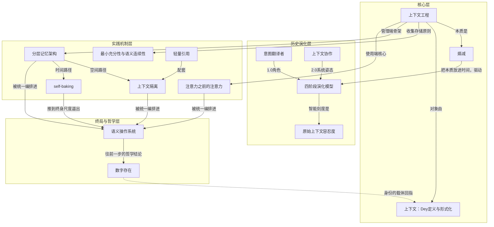

---
## 2｜[经典论文《迷失在中间》：位置决定了模型能不能真的用上信息](https://arxiv.org/abs/2307.03172)

> arxiv.org ｜ 主题特刊 ｜ 约 29 分钟 ｜ 11,681 字

**一句话主旨**：能塞进去不等于用得上：相关信息在中间时性能显著下降，呈U型曲线。

### AI 费曼示范

这篇文章在问：大语言模型号称能读很长的资料，但它到底能不能把长资料里的信息真正用起来？答案是：常常不能——关键信息如果夹在中间，模型很容易“看漏”，成绩大幅下降。

核心机制是模型对输入位置有偏好：放在开头和结尾的信息用得好，夹在中间的信息被忽略，画出来是一条两端高、中间低的 U 形曲线。哪怕只是让模型从一串随机编号里照抄一个值，放在中间也会出错，说明问题不在理解力，而在注意力分配不均。

好比看一沓文件，人往往对第一页和最后一页印象最深，中间的容易翻过去，模型也犯这个毛病。

不过作者也承认，这不是简单把窗口加长就能解决：从 4K 扩到 16K 甚至 100K，表现几乎一样；而且多塞资料并不总是更好，从 20 篇加到 50 篇，得分只涨约 1.5%，成本却大幅上升。

### 三级笔记

# 迷失在中间：语言模型如何使用长上下文

## 一句话主旨
能塞进去不等于用得上：相关信息在中间时性能显著下降，呈U型曲线。

## 作者试图回答的问题
- 核心问题：语言模型能接收长上下文输入，但它们究竟用得多好？
- 关联子问题：
  - 性能是否随相关信息在输入中的位置变化？变化模式是什么？
  - 扩展上下文窗口是否改善信息利用？
  - 位置依赖由什么造成（架构、查询位置、指令微调、模型规模）？
  - 真实检索场景中，更多上下文是否总是更好？

## 三级论证骨架

### 一、问题提出：从窗口大小转向窗口利用率
#### 1.1 窗口扩大不等于利用能力增强
- 作者开门见山：近来的语言模型有能力把长上下文作为输入，但对它们究竟用得多好，我们所知甚少。
  - Transformer 内存与计算随序列长度平方增长，早期窗口通常 512–2048 token；硬件与算法进步已推到 4096、32K、100K。
  - 扩展上下文模型在下游任务中如何使用输入上下文，仍不清楚。

#### 1.2 检验逻辑：若稳健，性能应不受位置影响
- 核验逻辑为：如果模型能稳健使用长输入上下文中的信息，其性能应几乎不受相关信息位置影响。
  - 实验只做两件受控改变：输入上下文长度、相关信息在其中的位置。
  - 参评模型覆盖开源与闭源两侧：MPT-30B-Instruct（最大 8192 token）、LongChat-13B (16K)、GPT-3.5-Turbo 与 16K 版、Claude-1.3 与 100K 版；全部贪心解码。

### 二、主实验：多文档问答画出 U 型曲线
#### 2.1 任务设计：只改位置，其余不变
- 输入是问题加 k 篇文档，恰好一篇含答案，其余 k−1 篇是不含答案的干扰文档；刻意模仿商用检索增强生成（RAG）场景。
  - 数据来自 NaturalQuestions-Open 的 2655 条查询，文档为 100 token 以内的维基百科片段。
  - 干扰文档由 Contriever（在 MS-MARCO 上微调）检索最相关但不含答案的片段，按相关性递减排列。
  - 操纵变量：调整文档顺序改变答案文档位置；增减干扰文档数量改变上下文长度。指标为准确率。

#### 2.2 结果：两端高、中间塌陷
- 实验规模为 10、20、30 篇文档（约 2K、4K、6K token）。
- 结果是一条清晰 U 型：相关信息在上下文开头（首因偏置）或末尾（近因偏置）时最强，在中间时受损。
  - 闭卷与 oracle 基线：LongChat-13B 为 35.0% 与 83.4%；GPT-3.5-Turbo 为 56.1% 与 88.3%；Claude-1.3 为 48.3% 与 76.1%；MPT-30B-Instruct 为 31.5% 与 81.9%。
  - 20 篇文档时 GPT-3.5-Turbo：第 1 位 75.8%，第 10 位 53.8%，第 20 位 63.2%；落差超 20 个百分点。
  - 30 篇文档时 GPT-3.5-Turbo (16K)：第 1 位 73.4%，第 10 位 50.5%，第 30 位 63.7%。
- 上下文越长，中间塌陷越明显，直接推翻"模型能在整个上下文窗口上有效推理"的默认预期。
- 与 Ivgi 等人的"大海捞针"实验区分：后者只比较相关段落放开头与放随机位置，本文研究位置的细粒度变化。

#### 2.3 最刺眼：中间位置成绩低于闭卷
- 相关文档放在 20 或 30 篇文档中间时，GPT-3.5-Turbo 的成绩（53.8%、50.5%）反而低于完全不给文档的闭卷成绩（56.1%）。
- 多喂的信息没被用上，还成了额外推理负担。

### 三、扩展上下文模型未必更会用上下文
#### 3.1 同输入下普通版与扩展版曲线重合
- 10 篇与 20 篇文档的设定下，GPT-3.5-Turbo 与 GPT-3.5-Turbo (16K) 的两条曲线几乎完全重合。
- Claude-1.3 与 Claude-1.3 (100K) 同样重合：闭卷 48.3% 对 48.2%，oracle 76.1% 对 76.4%。

#### 3.2 窗口大小是容量指标，不是利用率指标
- 扩展上下文模型未必比非扩展版本更擅长使用自己的输入上下文。

### 四、合成键值检索：连"照抄"都在中间失手
#### 4.1 剥离语义，只测精确匹配
- 任务：给字符串序列化的 JSON 对象，含 k 组键值对，键与值均为随机 128 位 UUID，返回指定键对应的值。
  - 用随机 UUID 剥掉自然语言语义，避免语言特征的混淆变量。
  - 只考察一件事：能否从上下文中检索出精确匹配的 token。
  - 规模：75、140、300 组（约 4K、8K、16K token），每档 500 样例。

#### 4.2 结果：U 型再现，部分模型挣扎
- Claude-1.3 与 Claude-1.3 (100K) 在所有长度上几乎完美。
- GPT-3.5-Turbo、GPT-3.5-Turbo (16K)、MPT-30B-Instruct 在 140 与 300 组时挣扎，中间位置最差，U 型再现。
- 定性观察：LongChat-13B (16K) 在 140 组、相关信息在开头时，倾向生成一段检索该键的代码而非直接输出值。

#### 4.3 问题不在理解力，而在注意力分布
- 任务不需要任何推理，只需精确匹配；中间位置信息依然丢失，说明问题不在理解力。

### 五、排查三条解释路径
#### 5.1 模型架构：编码器-解码器在训练窗口内稳健，超长后失效
- Flan-UL2（先 512、再 1024 token 预训练，指令微调用编码器 2048/解码器 512，相对位置编码）在训练窗口内对位置变化相当稳健，最好与最坏仅差 1.9 个百分点。
- 一旦评测序列超过训练长度，中间位置开始劣化；Flan-T5-XXL 同样趋势。
- 假说：双向编码器允许在"后文"语境中处理每篇文档，更好估计文档间相对重要性——但只对训练长度内成立，不足以成为普适解释。

#### 5.2 查询感知语境化：检索任务有效，推理任务无效
- 原实验查询放在数据之后，decoder-only 模型在语境化文档时无法注意到查询 token。把查询同时放在数据前后即让模型在编码材料时"知道"要找什么。
- 合成键值任务上效果极显著：所有模型逼近完美，GPT-3.5-Turbo (16K) 在 300 组时满分；不做时最坏情况只有 45.6%。
- 多文档问答上几乎无效：只在相关信息位于最开头时略有提升，其他位置反而略降。
- 检索型任务与推理型任务的收益完全不同，说明两者是不同困难。

#### 5.3 指令微调不是成因，只收窄落差
- MPT-30B-Instruct 与基座 MPT-30B 对照：两者都呈 U 型。
- 指令版绝对成绩全线更高，但趋势相似；指令微调只把最好与最坏落差从近 10 个百分点收窄到 4 个百分点左右。
- 与既有工作互补：未指令微调的模型偏向近期 token；本文显示指令格式提示下模型能用上远距离（开头）信息。假说：预训练语料存在类似格式文本，如 StackOverflow 问答。

#### 5.4 Llama-2 规模实验：U 型只出现在足够大的模型
- 7B 只有近因偏置；13B 与 70B 出现 U 型。
- 监督微调与 RLHF 对 13B 的位置偏置有轻微缓解，对 70B 影响甚微。
- 推测：早期研究未观察到首因偏置，可能因为当年模型太小（不足 10 亿参数）。

### 六、开放域问答案例：更多上下文不总是更好
#### 6.1 用真实检索器-阅读器配置检验
- 受控实验里上下文总是恰好含一篇能回答问题的文档；真实开放域问答不是这样——检索回来的前 k 篇可能不含答案，也可能多篇含答案。
- 设定：Contriever 取回相关性最高的 k 篇维基百科文档直接塞进 prompt，同时评估检索器召回率与阅读器准确率。

#### 6.2 阅读器性能饱和早于检索器召回饱和
- 阅读器准确率远在检索器召回率饱和之前停止提升，说明模型没有有效利用多取回的文档。
- 从 20 篇加到 50 篇：阅读端只带来约 1.5%（GPT-3.5-Turbo）与约 1%（Claude-1.3）的边际提升，却显著拉长上下文、推高延迟与成本。

#### 6.3 两个可操作方向
- 对检索结果重排序，把相关信息推到更靠近上下文开头。
- 排序列表截断，在合适时少取文档。
- 是否值得给满 16K token 取决于具体下游任务：新增上下文的边际价值，以及模型有效使用长输入的能力。

### 七、稳健性检验与思想坐标
#### 7.1 多轮稳健性检验确认 U 型不因数据缺陷而消失
- 时间错配：2018 年末维基百科快照与 NaturalQuestions 标注存在矛盾（例：标注"目前是自由球员"而语料写"巴尔的摩乌鸦"）；无歧义子集重跑结论一致。
- 干扰文档类型：改用随机维基百科文档（答案常可用词汇重叠等简单启发式识别），绝对准确率更高，却仍难在全输入上推理。
- 干扰文档顺序：随机打乱并明说"搜索结果是随机排序的"，U 型依旧；随机化只略微降低开头、抬高中间与末尾。
- GPT-4 (8K) 在 500 个随机样例上绝对成绩高于所有其他模型，但仍是 U 型；完整实验成本超 6000 美元。

#### 7.2 序列位置效应：跨学科坐标与意外性
- U 型对应认知心理学的序列位置效应：人在自由回忆列表元素时最容易记住开头和结尾。
- 在语言模型上观察到该效应是意外的，因为 Transformer 自注意力技术上完全有能力从上下文检索任意 token。
- 过去很多长上下文模型评测用网络语料困惑度作代理指标；本文表明长上下文上的精确知识取用是另一重挑战。

#### 7.3 新评测协议：位置敏感性而非窗口标称值
- 要声称稳健使用长输入上下文，必须证明性能受相关信息位置的影响极小（如最好与最坏差值很小）。
- Flan-UL2 在训练长度内 1.9 个百分点的落差是参照。

## 作者边界、反例与不确定性
- 查询感知语境化在合成键值任务上近乎完美、在多文档问答上几乎无效——该不对称本身说明检索与综合推理是两种不同困难，作者未进一步解释原因。
- 编码器-解码器模型的稳健性只在训练长度内成立，超出后 U 型出现；双向编码器假说未被直接验证，架构不足以成为普适解释。
- U 型有规模门槛：Llama-2 7B 只有近因偏置，首因偏置需 13B 及以上才出现；作者推测早期研究因模型小于 10 亿参数而错过该现象。
- GPT-4 只在 500 个随机样例上验证（完整实验成本超 6000 美元），其 U 型结论严格说是抽验。
- 扩展上下文模型与普通版曲线的重合只在普通版窗口能装下的长度上被验证；超过普通版窗口的部分是否继续重合未测。
- 数据时间错配（维基百科快照 2018 年末 vs 标注时间）在主实验中存在，已在无歧义子集上验证不影响结论。
- "是否值得给满 16K token"是条件性判断，取决于具体下游任务的新增上下文边际价值，作者不给一概而论的阈值。

### 概念辞典

# 概念解析辞典

> 针对《经典论文《迷失在中间》：位置决定了模型能不能真的用上信息》（Nelson F. Liu et al.，arxiv.org）的概念提取

## 一、核心概念

### 1. **迷失在中间（lost in the middle）**

- **context**：论文标题所命名的现象。

  > 当模型必须访问和使用位于长输入上下文中间的信息时，性能显著劣化。

- **费曼一下**：把一份关键资料夹在一沓材料的正中间递给模型，它大概率会"看漏"。不是资料没进去，是进去了却没被用上。它是全文所有实验共同指向的结论——模型能接收长上下文，但稳健取用中间信息的能力并不存在。

### 2. **U型性能曲线（U-shaped performance curve）**

- **context**：把相关信息的位置作为横轴、任务准确率作为纵轴画出的曲线。

  > 相关信息出现在上下文最开头（首因偏置）或最末尾（近因偏置）时成绩最高，被迫使用中间位置的信息时成绩急剧劣化。

- **费曼一下**：成绩单画成一条曲线，开头一个高点，结尾一个高点，中间是个坑。位置变了能力就变了，这条曲线就是证据。它不止出现在多文档问答里，还在合成键值检索、基座模型、指令模型、GPT-4乃至超出训练长度的编码器-解码器模型上反复出现。

### 3. **首因偏置（primacy bias）**

- **context**：U型曲线的左半边，材料中特别说明其在模型规模上的出现条件。

  > 模型更善于使用出现在输入上下文最开头的相关信息。作者发现它只在足够大的模型上出现（Llama-2 的 13B 与 70B 有，7B 没有）。

- **费曼一下**：开头说的话最容易被记住。放在 prompt 最前面的材料享有一种天然优待。和近因偏置共同构成 U 型曲线的两端，但首因偏置相对更反直觉——过去研究只观察到近因偏置，因为模型规模不够大。

### 4. **近因偏置（recency bias）**

- **context**：U型曲线的右半边，与既有研究接续。

  > 模型更善于使用出现在输入上下文最末尾的相关信息。既有研究早就发现未做指令微调的模型偏向近期 token。

- **费曼一下**：刚说完的话记得最牢。挨着问题最近的那段材料，模型用得最顺手。本文把它放回位置效应的完整图景里，说明近因偏置不是唯一的位置效应，首因偏置在大模型上同样存在。

### 5. **多文档问答受控实验**

- **context**：本文的主任务设计，刻意对应商用检索增强生成场景。

  > 输入是一个问题加 k 篇文档，其中恰好一篇包含答案，其余 k−1 篇是不含答案的"干扰文档"。这套设定刻意模仿了商用生成式搜索与问答背后的检索增强生成（RAG）场景。

- **费曼一下**：一个只改一个变量的实验。同样的题、同样的资料，只挪动正确答案的位置，看分数怎么变——变了，就说明位置本身在起作用。它逼近真实 RAG 场景的推理型任务，是 U 型曲线的主要证据来源之一。

### 6. **干扰文档（distractor documents）**

- **context**：实验设计中决定任务真实难度的组成部分。

  > k−1 篇不含答案但与查询高度相关的维基百科片段，由 Contriever 检索得到，并按相关性递减排列。

- **费曼一下**：故意混进去的"看起来很像但没有答案"的材料。它模拟的是真实检索回来的结果——大部分沾边，只有一篇真的有用。干扰文档决定了任务的难度和真实感，稳健性检验中换用随机文档后曲线依然存在，说明中段塌陷不是"认不出哪篇相关"造成的。

### 7. **闭卷与 oracle 基线（closed-book and oracle baselines）**

- **context**：两条为成绩定位的参照线。

  > 闭卷指不给任何文档、只靠参数记忆作答；oracle 指只给那一篇含答案的文档。GPT-3.5-Turbo 的两条线分别是 56.1% 与 88.3%。

- **费曼一下**：一个是"不给资料能考多少分"，一个是"只给标准答案那页能考多少分"。中间位置的成绩跌破闭卷线，意味着给资料反而帮了倒忙——多喂的信息没被用上，还成了要额外推理的负担。

### 8. **合成键值检索任务（synthetic key-value retrieval task）**

- **context**：极简测试台，只为考察精确匹配能力。

  > 给一个字符串序列化的 JSON 对象，含 k 组键值对，键与值都是随机生成的 128 位 UUID，要求返回指定键对应的值。

- **费曼一下**：一道只需要"照抄"的题，不需要任何理解。刻意剥掉语义，是怕语言特征引入混淆变量。如果连这个都会在中间位置做错，问题就不在理解力，而在注意力的分布。它构成与多文档问答相对的另一路证据——检索端。

### 9. **扩展上下文模型（extended-context models）**

- **context**：把窗口撑大的版本，如 GPT-3.5-Turbo (16K)、Claude-1.3 (100K)。核心发现之一：

  > 当输入上下文同时能装进普通模型与其扩展版本的窗口时，两者的表现几乎相同。

- **费曼一下**：窗口变大了，读法没变。买了更大的桌子，不代表你能同时看清桌上所有文件。这是全文最反直觉的一条推论——窗口标称值与利用率是两个维度，扩大前者不自动改善后者。

### 10. **查询感知语境化（query-aware contextualization）**

- **context**：排查支线之一，改变查询的放置位置。

  > 把查询同时放在待处理数据的前面和后面，使 decoder-only 模型在编码材料时就能注意到查询。

- **费曼一下**：先告诉模型"你要找什么"，再给材料，最后再问一遍。它在合成键值检索上近乎完美，在多文档问答上几乎无效——这个不对称说明"检索"与"综合推理"是两种不同的困难，不是同一个毛病。

### 11. **检索器-阅读器配置（retriever-reader）**

- **context**：开放域问答的标准做法，用于外推到真实工程。

  > 检索系统取回前 k 篇文档，语言模型作为阅读器基于这些文档作答。

- **费曼一下**：一个负责找资料，一个负责答题。这个框架把受控实验的发现带到真实开放域问答，回答"是否值得给满窗口"的问题。

### 12. **性能饱和早于召回饱和（performance saturation before recall saturation）**

- **context**：案例研究的核心观察。

  > 阅读器准确率远在检索器召回率饱和之前就停止提升；从 20 篇加到 50 篇只带来约 1.5% 与约 1% 的边际收益，却显著抬高上下文长度、延迟与成本。

- **费曼一下**：多找回来的资料，模型已经吃不下了。继续加量只涨成本不涨分数，这就是该停手的信号。它是应用层因果链上的实证结论，直接否定"更多上下文总是更好"。

### 13. **重排序与排序列表截断（reranking and list truncation）**

- **context**：由 U 型曲线与饱和现象共同推出的两个改进方向。

  > 把相关信息推到更靠近上下文开头的位置（重排序），以及在合适的时候少取一些文档（截断）。

- **费曼一下**：既然模型偏爱开头，就把最相关的放最前面；既然多给没用，就别硬塞。这是把模型的偏好当成工程约束来用，是从核心判断倒推出来的动作。

### 14. **长上下文评测协议（long-context evaluation protocol）**

- **context**：论文提出的新验收口径。

  > 要声称一个模型能稳健使用长输入上下文，必须证明其性能受相关信息位置的影响极小，例如最好与最坏情况之间差异很小。

- **费曼一下**：别看它宣传能读多少万字，把关键信息挪到最难的位置，看它掉多少分。掉得少才叫真的读得进去。这条协议是所有证据的收口，把"能塞进去不等于用得上"变成行业可执行的标准。

## 二、概念架构图

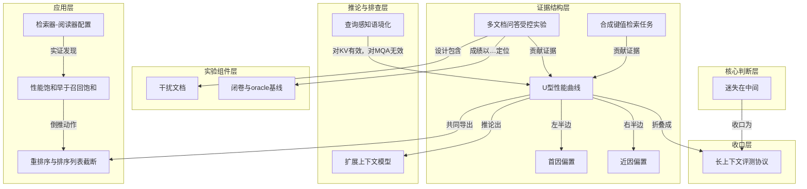

---
## 3｜[Chroma 实测上下文腐烂：输入越长，模型并非均匀地可靠](https://research.trychroma.com/context-rot)

> research.trychroma.com ｜ 主题特刊 ｜ 约 38 分钟 ｜ 15,286 字

**一句话主旨**：模型性能随输入变长而非均匀衰减；信息怎么摆才是可靠性的关键。

### AI 费曼示范

这篇文章在问：把更多资料塞给大模型，它是不是对第1万个词和第100个词同样可靠？实测答案是否定的——输入越长，表现越不稳定，而且不是均匀下滑，而是东一块西一块地出错。

实验把题目难度钉死，只让无关文字变长。结果发现，哪怕让模型把一串重复词原样抄一遍，几万个词后也会抄错、少抄，甚至开始说胡话；问题和答案用词越不像，或者混进一条“看着对但实际错”的干扰项，退化越快。有趣的是，把背景材料整理得越有条理，模型反而更难找出答案。

就像让你在一页纸上找一句话很容易，换成整个仓库的纸，就算句句都在，也容易眼花、抄串或自己脑补。

作者承认，这些实验只覆盖极简任务，现实里更复杂的综合任务只会更糟；至于模型为什么对长度这么敏感，机制层面还没弄明白。

### 三级笔记

# Context Rot: How Increasing Input Tokens Impacts LLM Performance

## 一句话主旨
模型性能随输入变长而非均匀衰减；信息怎么摆才是可靠性的关键。

## 作者试图回答的问题
核心问题：模型是否均匀地处理上下文中不同位置的 token？输入长度增加是否以及如何影响性能？

关联子问题：既有长上下文评测为何没暴露这个问题？把任务难度钉死、只变长度会观察到什么？语义相似度、干扰项、背景结构、检索步骤、输出长度分别起什么作用？最终对上下文工程意味着什么？

## 三级论证骨架
### 一、起点：一个被默认却从未验证的前提
#### 1.1 行业默认“上下文被均匀处理”
- 默认模型处理第 10000 个 token 应当和第 100 个一样可靠。
  - 近两年上下文窗口竞赛：Gemini 1.5 Pro 与 GPT-4.1 达 100 万 token，Llama 4 号称 1000 万。
- 长上下文评测的乐观让“长上下文基本已解决”成为共识。
  - NIAH 接近满分是这层共识的主要支撑。

#### 1.2 既有评测为什么让人放心得太早
- NIAH 本质只考词面检索，而不是真实任务需要的语义导向判断。
  - NoLiMa 用非词面匹配的 needle/问题对，性能显著下滑；AbsenceBench 也随输入变长退化。
- 更复杂基准把输入长度与任务难度混在一起，失败无法归因。
  - MRCR 把找相关部分、消歧、排序、复制文本揉成复合任务；Graphwalks 输入变长意味着图变大、难度上升；Latent List 难度同步随长度上涨。

### 二、方法：把难度钉死，只动长度
#### 2.1 四组受控变量与统一协议
- 四组实验分别隔离四个变量：needle 与问题的语义相似度、干扰项、needle 与 haystack 的相似度、haystack 结构。
  - 每个“needle 类型 × haystack 主题 × haystack 结构”组合跑 8 种输入长度、11 个 needle 位置。
- 跨 18 个模型，约 194,480 次调用；配置纪律为 temperature=0，Qwen 系用 YaRN 扩展上下文，thinking mode 分别测。
  - GPT-4.1 judge 打分，与人类判断一致率超过 0.99；69 次拒答（0.035%）剔除并单独报告。

### 三、证据一：语义相似度越低，长度效应越早
#### 3.1 相似度谱系实验
- 把“问题与答案有多像”量化成跨 5 个 embedding 模型平均的余弦相似度。
  - PG 随笔 needle 相似度区间 0.445–0.775；arXiv 主题区间 0.521–0.829。
- 低相似度 needle/问题对随输入变长衰减更快。
  - 短输入下低相似度对也能答对，说明模型本来有能力，是长度把能力磨掉了。
- 排除性结论：固定 needle/问题对、只增加无关内容量，性能仍下滑，说明不是 needle 本身难，而是长度本身在起作用。
  - 阴性结果：跨 11 个位置，位置对本任务无显著影响。

### 四、证据二：一个干扰项就够，且干扰项不等价
#### 4.1 干扰项与无关内容的对照
- 干扰项与 needle 主题相关但错误；无关内容则与 needle 和问题都无关。
  - 三条件对照：只有 needle / 加 1 个干扰项 / 加 4 个干扰项。
- 一个干扰项就足以把成绩拉到基线以下，四个进一步叠加。
  - 干扰项手写时逐维挪动一格：教授/同学、最好/最差、每周/每天，每一条都像但都不对。
- 干扰项彼此不等价：某个组合中第 3 个干扰项造成下滑最大；失败样本归因中干扰项 2 与 3 最常进入幻觉答案。

#### 4.2 失败姿态暴露家族性格
- Claude 系幻觉率始终最低，Sonnet 4 与 Opus 4 不确定时倾向明确声明找不到答案。
  - GPT 系幻觉率最高，有干扰项时经常给出自信但错误的回答。

### 五、证据三：haystack 不是中性背景
#### 5.1 needle-haystack 相似度影响非均匀，但证据不足
- 把 PG 与 arXiv 的 needle 交叉放入两种 haystack，度量 needle 与 top-5 最相似 chunk 的平均余弦相似度。
  - PG haystack 中 PG needle 均值 0.529、arXiv needle 0.368；arXiv haystack 中 arXiv needle 0.654、PG needle 0.394。
- 影响非均匀，但作者明确表示只有两个主题不足以下定论。

#### 5.2 结构连贯性反直觉：打乱版更好
- original 保留思路流，shuffled 把句子随机重排、主题不变但失去逻辑连贯性。
  - 直觉预期是连贯 haystack 中插入 needle 更显眼；实测相反：18 个模型一致在 shuffled 上表现更好。
- 作者解释止于推测：输入的结构模式可能影响注意力机制的施加方式，尤其在长输入下；机制上“不知道”，需可解释性研究。

### 六、证据四：把检索步骤塞进来，代价立现
#### 6.1 LongMemEval：focused vs full
- focused input 平均约 300 token，只需推理；full input 约 113k token，模型必须先检索再推理。
  - 数据筛出 knowledge update、temporal reasoning、multi-session 三类，最终 306 条 prompt；GPT-4.1 judge 与人类一致率 >99%。
- 所有模型在 focused 上明显更好；先确认模型有能力做对 focused 版，再看到 full 版一致下滑，差值就是多一步检索的代价。
  - Claude 家族落差最大，主要由歧义弃答造成；Opus 4 与 Sonnet 4 在 full prompt 上低于更老的 Claude 模型。
- 典型样本：正确答案为 6 天（算上最后一天 7 天可接受），模型回答“聊天记录里没有给出具体日期，无法确定天数”。
- thinking mode 在两种输入上都有增益，但落差依然存在。
  - 题型顺序变化：非思考下 knowledge update > multi-session > temporal reasoning；思考后 knowledge update > temporal reasoning > multi-session。

### 七、证据五：连照抄都做不稳
#### 7.1 实验设置
- 自回归模型生成的 token 也是输入，因此让输出长度随输入一起涨。
  - 任务：一串重复词中插入一个唯一词，prompt 要求原样复制；典型是 25 个 apple 里夹一个 apples。
- 词数 25 到 10000 共 12 档，每个可能位置都测；评分用归一化 Levenshtein 距离。
  - 七组词对制造不同难点：apple/apples、golden/Golden、orange/San Francisco、Golden Gate Bridge/Golden Gate Park 等。

#### 7.2 总体退化与家族失败模式
- 上下文长度增加，所有模型性能一致退化；各家族都出现“不动手做”的模式。
  - Claude：Sonnet 3.5 在其输出上限内反而胜过更新模型；Opus 4 拒答 2.89%，从 2500 词起，理由含版权风险或发现序列不一致。
  - Claude 位置效应：唯一词越靠序列开头，位置准确率越高，输入越长差异越明显。
- GPT：GPT-4.1 拒答 2.55%，从 2500 词起；GPT-4 turbo 在 500 词附近有局部峰，之前多生成、之后转少生成。
  - GPT-4.1 mini 会生成输入中没有的重复词如 Golden Golden、Gate Gate，且出现在更靠后的位置。
- Gemini：2.5 Pro 起点更低；除 2.5 Flash 在 apples/apple 组合外，全家族生成随机词，通常从 500–750 词起，2.5 Pro 变异最大。
- Qwen：Qwen3-8B 非尝试率 4.21%，约从 5000 词起输出“我得歇会儿、我没心情、想去海边透透气”式跑题循环。

### 八、结论：信息怎么摆才是可靠性的关键
#### 8.1 核心结论
- LLM 并不在各种输入长度上保持一致的性能；连非词面检索或文本复制这类极简任务，性能的非均匀性也随长度增加。
- 由此需要超越现有基准的更严格长上下文评测。

#### 8.2 工程落点
- 相关信息在不在上下文里不是全部，更要紧的是这些信息以什么方式呈现。
  - 连最强的模型都对此敏感；有效的上下文工程是可靠性的必要条件，而不是可选优化技巧。

## 作者边界、反例与不确定性
- 作者明确：评测未穷尽真实用例；现实中的长上下文应用需要综合与多步推理，退化只会更严重。
- 现有基准的通病是混淆输入长度与任务难度；后续应把任务固有难度与处理长上下文能力拆开度量。
- 结构属性会改变模型行为的机制解释尚不清楚，作者坦承“不知道”，认为需要机制可解释性研究，超出本报告范围。
- needle-haystack 相似度实验只覆盖两个主题，作者明确认为不足以推出普遍结论。
- 主要结论聚焦高性能模型；低性能、更老更小模型仅作参照，其低相似度起点更低。

### 概念辞典

# 概念解析辞典

> 针对《Chroma 实测上下文腐烂：输入越长，模型并非均匀地可靠》（Chroma Research）的概念提取

## 一、核心概念

### 1. **上下文腐烂（Context Rot）**

- **context**：

  > 模型并不均匀地使用自己的上下文，性能随输入长度增长而越来越不可靠——而且衰减不是平滑的，是参差、非均匀的。

- **费曼一下**：上下文窗口不是一个均匀容器，塞进去多少都一样好用。它更像一块起雾的玻璃：整体还能看，但越往边上越模糊，而且哪里糊、糊到什么程度没有规律。百万 token 的窗口，不等于每个 token 都被同等对待。这是全文的中心现象。

### 2. **上下文均匀处理假设**

- **context**：

  > 第 10000 个 token 应该和第 100 个 token 一样可靠。

- **费曼一下**：这是所有“把资料全塞给模型让它自己挑”的做法背后那个没人验证过的前提。它假定注意力免费且无限均分。一旦这个前提被实测推翻，长上下文就从“能力”变成了“需要管理的资源”。

### 3. **大海捞针（NIAH）与词面匹配**

- **context**：

  > 把一句已知事实（needle）埋进一大段无关文本（haystack），再让模型找回来——本质是 direct lexical matching，而真实任务需要的是灵活的、语义导向的判断。

- **费曼一下**：这就像用“在一本书里找出你自己刚写下的那句话”来证明一个人读书能力强。找得到只说明会用 Ctrl+F。模型在 NIAH 上接近满分，直接催生了“长上下文基本已解决”的行业错觉，也正是这个基准在支撑着均匀处理假设。

### 4. **输入长度与任务难度的混淆**

- **context**：

  > 既有长上下文评测的通病是让「文本更长」和「题目更难」同时发生，因此无法归因。

- **费曼一下**：想知道跑道变长会不会让人跑慢，就不能同时给他加负重。多数长上下文评测恰恰同时做了两件事，所以测出来的“长文本能力差”里，混着“题目本来就更难”。把变量分干净，是这份报告最值钱的方法论动作。

### 5. **needle-question 语义相似度谱系**

- **context**：

  > 相似度越低的 needle/问题对，性能随输入长度衰减得越快。短输入下即便低相似度也答得不错——说明模型本来有这个能力，是长度把它磨没了。

- **费曼一下**：问题和答案共享的词越少，模型就越要靠“意会”。短文本里意会得动，文本一长就意会不动了。现实中的提问几乎从不精确复述答案里的措辞，所以真实场景恰好落在这条曲线衰减最快的那一段。

### 6. **干扰项与无关内容之分**

- **context**：

  > **干扰项（distractor）**：和 needle 主题相关，但并不真正回答问题。
  > **无关内容（irrelevant content）**：与 needle 和问题都无关。

- **费曼一下**：无关内容是背景噪音，干扰项是长得像正主的赝品。噪音大不了让你听不清，赝品会让你拿错东西。这个区分是干扰项实验能成立的前提，否则“加长上下文”和“加干扰”就搅在一起了。

### 7. **干扰项的非均匀影响**

- **context**：

  > 只要有一个干扰项，性能就低于基线；加到四个，退化进一步叠加。
  > 干扰项之间并不等价。在 arXiv haystack 配写作类 needle 的组合里，第 3 个干扰项造成的下滑明显大于其他几个。

- **费曼一下**：干扰不是可以按个数折算的量。某一条特别有欺骗性的假答案，杀伤力可能超过其余三条之和。这意味着做 RAG 或上下文组装时，“召回了几条不相干”是很粗的指标；真正该问的是“有没有召回那条最像的假货”。

### 8. **弃答与幻觉：两种失败姿态**

- **context**：

  > Claude 系幻觉率始终最低，Sonnet 4 和 Opus 4 尤其保守，不确定时倾向于明确声明「找不到答案」。GPT 系幻觉率最高，有干扰项时常常给出自信但错误的回答。

- **费曼一下**：同样是“答错了”，一个是老实说“没找到”，一个是编一个听起来很像的答案。跑分表上两者都是丢分，生产系统里代价天差地别：前者能兜底，后者会悄悄污染下游。保守在评测里被记为缺点，这暴露了评测口径与工程价值的错位。

### 9. **haystack 结构连贯性效应**

- **context**：

  > 结构连贯性一致地损害模型性能。18 个模型、各种 needle-haystack 配置下，打乱版的成绩一致地好于逻辑结构完整的版本。
  > 输入的结构模式可能影响注意力机制的施加方式，尤其在输入变长时；机制层面的解答需要机制可解释性研究。

- **费曼一下**：本以为给模型一份条理清楚的材料它会读得更好，实测反而是把句子打散更容易被找到。这几乎是对“整理好资料再喂给模型”这条工程直觉的一记闷棍。它也提醒我们：模型对上下文的敏感点，未必落在人类觉得重要的那些维度上。

### 10. **检索与推理的双任务负担**

- **context**：

  > 这逼模型在一次调用里同时做两件事——先在历史中找出相关片段（检索），再据此合成对当前问题有用的回答（推理）。
  > 所有模型在 focused 上都明显更好。
  > 开启 thinking mode 在两种输入上都有明显增益，但两种长度之间的落差依然存在。

- **费曼一下**：把完整历史塞进 prompt，不是省事而是加活。你没有帮模型准备好材料，只是把找材料的工作也外包给了它，而它并不擅长在一次前向里既当图书管理员又当分析师。RAG 的价值不在省 token，在于把两件事拆开。

### 11. **自回归下输出也是上下文**

- **context**：

  > 模型是自回归的——它自己生成的 token 也属于它的输入。所以还要问：当输出长度随输入一起涨，会怎样？
  > 一个把字符串重复 n 次的普通程序，每次都输出一样的结果；对这么平凡的任务，我们希望能把模型当成计算系统一样看待。

- **费曼一下**：一个把字符串重复 n 次的程序，每次输出都一模一样；模型做同样的事，却会在几千词后开始走样、少写、多写，甚至胡言乱语。这是把“模型是不是确定性计算装置”这个问题问到最裸的形态——答案是否定的，而且失效点比想象中来得早。

### 12. **非尝试率与拒答模式**

- **context**：

  > 194,480 次调用中有 69 次（0.035%）模型拒绝尝试，从结果中剔除并单独在附录报告。
  > 非尝试的判定与剔除很有讲究：空输出带停止原因、只做观察不动手、直接拒答、输出随机内容，均剔除并单独统计。

- **费曼一下**：模型不是只有“对”和“错”两种输出，还有第三种——它决定不玩了。而且拒答的理由常常与任务本身无关，比如版权顾虑、觉得输入里有笔误。做长上下文系统时，这类“非尝试”必须单独观测，否则它会被平均进准确率里，掩盖掉一整类可预测的失败。

### 13. **上下文工程（context engineering）**

- **context**：

  > 相关信息在不在上下文里并不是全部，更重要的是这些信息以什么方式呈现；连最强的模型都对此敏感，因此有效的上下文工程是可靠性的必要条件，而不是可选的优化技巧。

- **费曼一下**：过去我们把上下文当仓库——能装多少是能力问题；现在得把它当工位——摆放方式直接决定产出质量。同样一堆材料，是整个塞进去、筛过再塞、还是拆散了塞，结果可能差出一大截。这不是提示词技巧，是可靠性工程。

## 二、概念架构图

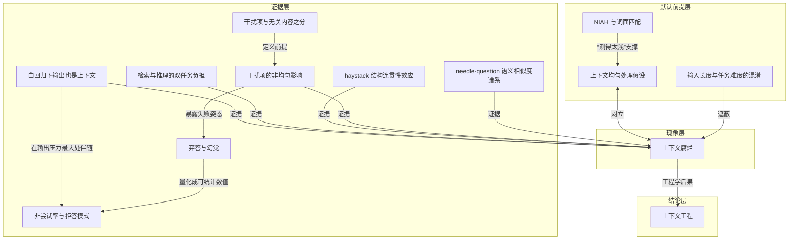

---
## 4｜[Manus 的上下文工程实战：几轮重写换来的一组局部最优](https://manus.im/blog/Context-Engineering-for-AI-Agents-Lessons-from-Building-Manus)

> manus.im ｜ 主题特刊 ｜ 约 37 分钟 ｜ 14,746 字

**一句话主旨**：构建生产级 agent 应押注上下文工程，并遵循六条局部最优设计模式。

### AI 费曼示范

这篇文章回答的是：做能自己一步步调用工具干活的 AI 代理时，该自己训练模型，还是把力气花在“怎么给模型喂信息”上？作者选后者，并给出几条试出来的实用做法。核心是模型像租来的发动机，你能调的是仪表盘和路书。比如模型每次都要重读你给的全文，开头不变它就能复用记忆（这叫 KV 缓存），所以别在开头放会变的时间戳；工具太多别临时删，而是遮住不让选；超长内容写进文件，需要再翻；复杂任务让它不断更新待办清单，等于把目标反复念到眼前；犯了错别擦掉，留下失败记录，模型才会换招。就像开长会怕跑题，就不时重念议题；怕忘事就写在纸上。作者承认，这些只是对 Manus 有效的局部最优，不是普适真理。

### 三级笔记

# Manus 的上下文工程实战：几轮重写换来的一组局部最优

## 一句话主旨
构建生产级 agent 应押注上下文工程，并遵循六条局部最优设计模式。

## 作者试图回答的问题
核心问题：如何在不训练专用模型的前提下，通过塑造上下文构建高效、可扩展、能自我纠错的生产级 AI agent？  
关联子问题：为什么选择上下文工程而非训练端到端模型？哪些上下文设计原则在实践中有效？这些原则的适用边界是什么？

## 三级论证骨架
### 一、起点的选择：押注上下文工程而非训练端到端模型
#### 1.1 训练模型的慢反馈循环是 pre-PMF 阶段的 deal-breaker
- 作者经历决定了选择：BERT 时代必须先 fine-tune 再评估，一轮迭代数周；上一家创业公司自研模型被 GPT-3 与 Flan-T5 一夜淘汰。
  - 押注 in-context learning 换来迭代速度与解耦：改进以小时计发版，产品与底层模型正交。
  - 比喻：模型进步是上涨的潮水，Manus 要做“船”，而不是插在海底的柱子。

#### 1.2 上下文工程是一门实验科学，交付的是局部最优
- 上下文工程“anything but straightforward”，靠手工架构搜索、prompt 摆弄和经验猜测逼近。
  - agent 框架被重写四次；戏称“Stochastic Graduate Descent”（随机研究生下降法）。
  - 全文交付的是试错抵达的一组局部最优，非普适真理。

### 二、KV-cache 与工具管理：成本与决策的总闸门
#### 2.1 KV-cache 命中率是生产阶段最重要的单一指标
- agent 的 prefill/decode 高度倾斜（平均输入输出 token 比约 100:1），缓存收益被放大。
  - 典型循环：每一步追加 action-observation，输出始终是短 function call。
  - 以 Claude Sonnet 为例，缓存输入 0.30 USD/MTok、未缓存 3 USD/MTok，差 10 倍。
- 保持 prompt 前缀稳定是命中缓存的前提。
  - 自回归性质：一个 token 差异导致该位置之后的缓存全部失效；典型错误是在 system prompt 开头放精确到秒的时间戳。
  - 注：本地归档仅保留该实践建议的第 1 条，后续条目未进入归档。

#### 2.2 工具集管理：掩码而非移除
- 动态增删工具会破坏前缀稳定性并增加选择噪声。
  - 工具爆炸：MCP 允许用户自配置，会有人把几百个来路不明的工具插进 action space；后果是“heavily armed agent gets dumber”。
  - 原文给出的两条具体理由未进入本地归档。
- Manus 用 context-aware 状态机 + logits 掩码管理工具可用性：不移除工具，只在解码时对 token logits 做掩码阻止或强制某些 action。
  - 例：用户给出新输入时强制立即回复，而不是继续执行 action。
  - 配套设计：统一 action 名称前缀（browser\_、shell\_），无需有状态 logits processor 即可按状态约束选择范围。

### 三、外部化记忆与注意力操纵：扩展上下文容量、保持目标聚焦
#### 3.1 文件系统作为终极上下文
- 128K 甚至更大的窗口在真实 agentic 场景不够用；截断或不可逆压缩有根本性风险。
  - agent 必须基于全部先前状态预测下一步，无法预知哪条 observation 十步后关键；逻辑上任何不可逆压缩都带风险。
  - 原文列举的三个常见痛点未进入本地归档。
- Manus 把文件系统当作结构化的外部化记忆，压缩策略始终可恢复。
  - 网页内容可丢，只要 URL 还在；文档正文可省略，只要沙箱路径还在——上下文缩短而信息不永久丢失。
  - 延伸想象：SSM 若能掌握基于文件的记忆，可能成为 Neural Turing Machine 的真正继承者（作者判断，非已验证结论）。

#### 3.2 通过复述操纵注意力
- 长循环中模型容易跑题或忘记早先目标，复述目标到上下文末尾可对抗 lost-in-the-middle。
  - Manus 典型任务平均约 50 次工具调用；处理复杂任务时创建并逐步更新 todo.md。
  - 机制：不断重写 todo 等于把目标复述到最近注意力跨度，给模型自己的注意力加偏置，无需架构改动。

### 四、适应性与反脆弱：保留错误与打破套路
#### 4.1 把错误留在上下文里
- 失败是多步任务循环的一部分，而非例外；抹掉失败就是抹掉证据。
  - 隐藏错误（清理轨迹、重试、重置状态交给 temperature）阻断模型适应；保留失败 action 与 observation/stack trace 使模型隐式更新先验，降低重复同一错误的概率。
- 错误恢复是真正 agentic 行为最清晰的指标之一。
  - 但多数学术工作和公开 benchmark 只测理想条件下的任务成功率，严重低估错误恢复。

#### 4.2 别把自己 few-shot 进套路
- 语言模型是出色的模仿者，上下文越统一，agent 越脆弱。
  - 批量审阅 20 份简历时，agent 易陷入固定节奏，产生漂移、过度泛化甚至幻觉。
- 解法是引入受控的结构化变化打破模式。
  - 不同序列化模板、替代措辞、顺序或格式上的轻微噪声。

### 五、结论：上下文塑造 agent 行为
- 上下文工程是 agent 系统的必需品；模型再强也替代不了记忆、环境和反馈。
  - 你如何塑造上下文，最终定义 agent 跑多快、恢复得多好、能扩展多远。
  - 作者保持分寸：分享的是局部最优，只对 Manus 有效，期望帮读者少经历一次痛苦迭代。

## 作者边界、反例与不确定性
- 作者明确表示本文六条原则只是“局部最优”，不是普适真理，只对 Manus 有效。
- 部分支撑理由未展开：KV-cache 实践建议仅第 1 条进入归档；工具掩码的两条具体理由未进入归档；文件系统三个常见痛点未进入归档。
- 上下文工程是新兴科学，尚无闭式解，工作方式被戏称为“随机研究生下降法”。
- 作者指出错误恢复在学术与公开 benchmark 中被严重低估，这是现有评测的盲点。
- SSM 作为 Neural Turing Machine 继承者的延伸属作者推测判断，非已验证结论。

### 概念辞典

# 概念解析辞典

> 针对《Manus 的上下文工程实战：几轮重写换来的一组局部最优》（Yichao 'Peak' Ji / Manus）

## 一、核心概念

### 1. 上下文工程（context engineering）

- **context**：Manus 在项目起点的关键选择——不在开源底座上训练端到端 agentic 模型，而是"在前沿模型的 in-context learning 能力之上搭 agent"，也就是押注上下文工程。作者对这门工作的性质描述是：

  > "上下文工程并不优雅。它是一门实验科学：Manus 的 agent 框架被重写了四次，每次都是因为发现了更好的上下文塑造方式。"

- **费曼一下**：上下文工程的意思是把全部工程力气花在塑造递给模型的那段文字上，而不是改造模型本身。在本文里，它解决的核心问题是产品迭代速度：训模型的反馈循环太慢，而把 prompt 摆弄和架构试错当成实验来做，可以升级到以小时计。这个概念是全文的总纲，后面六条实践都是它的具体展开。

### 2. 押注 in-context learning

- **context**：这个选择的直接依据是作者的两次经历——BERT 时代必须先 fine-tune 才能迁移新任务，一轮迭代要几周；上一家创业公司从零训练模型做信息抽取，结果 GPT-3 与 Flan-T5 一出，自研模型"一夜之间变得无关紧要"。结论因此变得清晰：

  > "押注上下文工程，让产品与模型进步同向而非绑死。"

- **费曼一下**：in-context learning 指模型不用改参数，仅靠你给的上下文就能当场学会新任务。押注它意味着接受这个判断：教模型做新事不需要回炉重炼，只需要把话说清楚。这是全文一切实践的起点，决定了后来所有优化的方向都不是训练，而是上下文。

### 3. 与底层模型正交（orthogonal to the underlying models）

- **context**：押注上下文工程换来的结构性收益，作者用潮水与船表达：

  > "如果模型进步是上涨的潮水，Manus 要做船，而不是插在海底的柱子。"

- **费曼一下**：正交的意思是产品的价值建立在自己控制的上下文层，而不是某一代具体模型之上。模型变强，产品自然跟着涨；模型迭代，也不会推翻产品本身。这个概念划了一道生存边界：不该把地基打在会不断被替换的东西上。

### 4. 局部最优（local optima）

- **context**：作者对全文交付物的自我定位：

  > "全文交付的是这轮试错抵达的一组局部最优（local optima），而非普适真理：这些只是对 Manus 有效的模式。"

  > "None of what we've shared here is universal truth—but these are the patterns that worked for us."

- **费曼一下**：局部最优是承认六条实践只是 Manus 在自己的搜索路径上暂时收敛到的有效解，不是可以到处套用的定律。它的作用是为全文划边界——让读者知道这组经验有适用条件和范围，不是终极答案。这个概念之所以承重，是因为一旦拿掉，读者就会把这六条误读成可平移的真理。

### 5. KV-cache 命中率

- **context**：作者给出的成本轴总指标：

  > "如果只能选一个指标，作者认为 KV-cache 命中率是生产阶段 AI agent 最重要的单一指标，它直接决定延迟和成本。"

  > "以 Claude Sonnet 为例，缓存输入 token 是 0.30 USD/MTok，未缓存是 3 USD/MTok，相差 10 倍。"

- **费曼一下**：KV-cache 命中率衡量当前这次前向计算能在多大程度上复用之前已经算好的键值缓存。在 agent 场景里，上下文每步都在追加，输入和输出的体量极度不平衡，缓存命中与否直接决定首字延迟和推理费用。这个概念是全文成本轴的总闸门，后面好几条实践都从它倒推而来。

### 6. prefill 与 decode 的高度倾斜

- **context**：agent 与 chatbot 的结构性区别：

  > "Manus 的平均输入输出 token 比约为 100:1。"

- **费曼一下**：agent 每走一步要读大量历史记录，却只输出一个短小的 function call。这个 100:1 的比例解释了为什么缓存对 agent 比 chatbot 关键得多——算力几乎全部消耗在"读"上。它是一个机制性背景：正因为读占绝对大头，优化的重点才必须全部放在让读变便宜。

### 7. 稳定的 prompt 前缀

- **context**：KV-cache 命中的机械前提，脆弱到极致：

  > "哪怕一个 token 的差异，也会让该 token 之后的缓存全部失效。常见错误是在 system prompt 开头放时间戳，尤其是精确到秒的那种——它确实能让模型报出当前时间，同时也杀死了你的缓存命中率。"

- **费曼一下**：稳定前缀是命中缓存的前提条件。LLM 是自回归的，从第一个 token 起形成一条链条，任何一环变化都会让其后整段缓存作废。这个概念解决的痛点很实际：开发者常为了知道时间之类的小便利在 prompt 开头放会变的内容，结果成本翻十倍。它是成本轴上最便宜的戒律。

### 8. logits 掩码与 context-aware 状态机

- **context**：工具数量爆炸的后果是"那个全副武装的 agent 反而变笨了"。实验给出的规则：

  > "除非绝对必要，避免在迭代中途动态增删工具。"

  解法：

  > "不移除工具，而是在解码时对 token logits 做掩码，按当前上下文阻止或强制某些 action 被选中。"

  配套设计是统一 action 名称前缀，如 browser\_、shell\_，"无需有状态的 logits processor，就能约束 agent 在给定状态下只从某一组工具中选择"。

- **费曼一下**：logits 掩码解决的是 action space 膨胀带来的选择噪声，同时不破坏 KV-cache 依赖的前缀稳定。它的机制边界在于：工具全部保留在上下文里，列表不动，但解码时通过掩码控制哪些 token 可以生成——相当于抽屉全在，但只有某几个打得开。概念说明了第二条实践和第一条之间是延伸关系，不是并列关系。

### 9. 文件系统即终极上下文

- **context**：作者先给出一个逻辑风险判断：

  > "agent 按本性必须基于全部先前状态来预测下一个 action，而你无法可靠地预判哪条 observation 会在十步之后变得关键。从逻辑上说，任何不可逆压缩都带着风险。"

  因此采用的策略：

  > "Manus 把文件系统当作终极上下文：大小无限、天然持久，且可由 agent 自己直接操作。模型学会按需读写文件，把文件系统用作结构化的外部化记忆，而不只是存储。"

- **费曼一下**：文件系统从"放文件的地方"升格为 agent 的外部化记忆。它解决的是上下文窗口有限、agent 决策又需要完整先前状态这一根本矛盾：与其截断或压缩后丢失信息，不如让模型自己把状态写出去、需要时再读回来。这是全文容量轴的支点。

### 10. 可恢复的压缩（restorable compression）

- **context**：文件系统路径成立的技术前提：

  > "压缩策略始终被设计成可恢复的：网页内容可以从上下文里丢掉，只要 URL 还在；文档正文可以省略，只要沙箱里的路径还在。这让上下文长度缩短而信息不永久丢失。"

- **费曼一下**：可恢复的压缩划清了"暂时移出上下文"和"永久失去信息"的界限。它解决的是压缩必然损失信息这一威胁——只要上下文里保留一个可回查的指针，被移出的内容就只是暂时收纳，不是真正遗忘。这是文件系统策略之所以可行的机制基础。

### 11. 复述（recitation）与 lost-in-the-middle

- **context**：Manus 在复杂任务中持续创建并更新 todo.md 的现象，机制是：

  > "不断重写这份 todo 清单，等于把目标复述（recite）到上下文的末尾，把全局计划推入模型最近的注意力跨度，从而避开 'lost-in-the-middle' 问题、减少目标偏移。"

  > "本质上是用自然语言给模型自己的注意力加偏置，让它偏向任务目标。"

- **费曼一下**：复述就是顺着模型注意力偏向最近内容的机制，把容易在长上下文中间被遗忘的全局目标一遍遍推到末尾，相当于给注意力加权。它不需要架构改动，只用自然语言重复目标。这个概念位于注意力轴，和后面两条共享同一个深前提：模型的注意力和先验由上下文形状决定，所以可以被有意识地施力。

### 12. 保留错误证据与错误恢复

- **context**：作者最反直觉的一条建议。隐藏错误"感觉更安全、更可控，但有代价"：

  > "抹掉失败就是抹掉证据；没有证据，模型就无法适应。"

  机制解释：

  > "当模型看到一个失败的 action 以及随之而来的 observation 或 stack trace，它会隐式更新自己的内部信念，把先验从类似 action 上挪开，降低重复同一错误的概率。"

  由此给出的指标判断：

  > "错误恢复（error recovery）是真正 agentic 行为最清晰的指标之一。"

- **费曼一下**：保留错误意味着让失败的 action 和 observation 留在上下文里，作为更新模型先验的证据，而不是清场重试。它解决的是 agent 在非理想环境中的适应问题——没有失败样本就不会调整先验，下次还会犯同样的错。错误恢复之所以成为判据，是因为它暴露了模型能否根据环境反馈改变行为，而不是只在理想条件下跑通。

### 13. few-shot 套路化与受控多样性

- **context**：模型强模仿能力的反面。当上下文里堆满整齐划一的 action-observation 对：

  > "模型就会倾向于沿着那个模式继续，哪怕它已经不再是最优解。"

  解法：

  > "Manus 在 action 与 observation 中引入少量结构化变化——不同的序列化模板、替代性措辞、顺序或格式上的轻微噪声。这种受控的随机性打破模式、拨动模型的注意力。"

  一句可直接贴墙上的判断：

  > "上下文越统一，你的 agent 就越脆弱。"

- **费曼一下**：这个概念的要点是：模型会照抄上下文中的节奏，重复性任务中尤其容易漂移和幻觉。受控多样性就是在序列化和措辞里注入轻微变化，打破模式对模型的诱导。它和复述、保留错误共享深层机制——上下文形状决定注意力和先验，差别只在于何时顺着用、何时反向对抗。

## 二、概念架构图

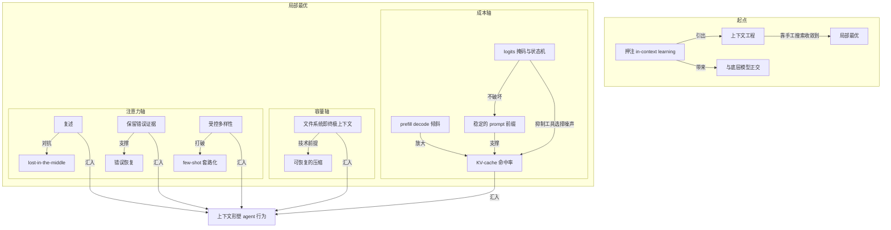

---
## 5｜[Anthropic：有效的上下文工程，是为 agent 找到最小充分信息集](https://www.anthropic.com/engineering/effective-context-engineering-for-ai-agents)

> anthropic.com ｜ 主题特刊 ｜ 约 39 分钟 ｜ 15,578 字

**一句话主旨**：好的 context engineering 是为 agent 找到最小高信号 token 集合，使期望结果概率最大化。

### AI 费曼示范

文章回答的是：AI 助手连续干长活时，该给它眼前放多少、放哪些信息。答案是别贪多，要找出最少但最有用的那批“高信号”信息，让它在有限的注意力下最可能做对。模型读上下文就像人花注意力，每多塞一条就消耗一点；窗口越长，它从里面精准捞回某条信息的能力越差，不是突然变傻，是慢慢变钝。所以得像收拾行李箱：每件都得用上，缺一件不行，多一件别带；说明、工具也要精简到没有重叠和歧义。长任务装不下时，要么把旧对话压缩成摘要，要么把笔记存到窗口外，要么派子助手详查后只交回一两页小结。这就像给干活的同事布置工位，桌上只放当下要用的，其余存档案柜按需取。作者承认一个代价：按需即时去查比提前备好数据慢，而且引导不当，模型会乱找、撞进死胡同，白白烧掉注意力。

### 三级笔记

# Anthropic：有效的上下文工程，是为 agent 找到最小充分信息集

## 一句话主旨
好的 context engineering 是为 agent 找到最小高信号 token 集合，使期望结果概率最大化。

## 作者试图回答的问题
核心问题：在上下文窗口作为有限资源的前提下，如何在 agent 每一轮推理时决定把什么 token 放进有限的注意力预算，才能最大化期望结果出现的概率？

关联子问题：
- context engineering 与 prompt engineering 是什么关系？
- 为什么上下文必须被当作有限资源？
- 有效 context 在 system prompt、工具、示例上如何落地？
- 运行时如何取数（just in time 检索）？
- 长时程任务如何绕开窗口限制？

## 三级论证骨架
### 一、context engineering 是 prompt engineering 的自然演进
#### 1.1 从单轮 prompt 到 agent 的多轮上下文策展
- 作者对 context engineering 的定位是 prompt engineering 的 natural progression，不是替代关系。
  - **context** 指从 LLM 采样时被纳入的那组 token；**engineering** 指在 LLM 固有约束下优化这些 token 的效用，以稳定达成期望结果。
  - 有效驾驭 LLM 需要 *thinking in context*：考虑模型任一时刻可获得的整体状态，以及这个状态可能诱发什么行为。
- 真正的差别在节奏：写 prompt 是一次性动作，适配 one-shot 任务；context engineering 是迭代的——每一次决定「传什么给模型」，策展就发生一次。
  - 在循环里跑的 agent 会不断产出「下一轮可能相关」的数据，这些信息必须被 cyclically refined。
  - Karpathy 所说的 art and science 指的就是这件事。

### 二、为什么 context 必须被当作有限资源
#### 2.1 可观测现象：context rot（上下文腐烂）
- needle-in-a-haystack 类基准研究发现：窗口内 token 数增加，模型准确召回其中信息的能力下降。
  - 不同模型衰减陡缓不同，但该特性在所有模型上都会浮现。

#### 2.2 注意力稀缺的根源在架构与训练分布
- transformer 全连接注意力使 n 个 token 产生 n² 对成对关系；上下文变长，捕捉成对关系的能力被摊薄。
- 训练数据中短序列远比长序列常见，模型对跨全上下文的依赖经验更少、专用参数更少。
- position encoding interpolation 能让模型处理更长序列，代价是 token 位置理解的部分退化。

#### 2.3 结论的分寸：性能梯度而非硬悬崖
- 上述因素造成的是 a performance gradient rather than a hard cliff，不是某个长度后的突然失效。
  - 长上下文下模型依然高度可用，只是信息检索精度和长程推理相对变弱。
- 因此深思熟虑的 context engineering 是必需项，而非优化项。

### 三、有效 context 的总原则与三个静态组件
#### 3.1 总纲：最小高信号 token 集合
- 好的 context engineering 就是找到 the smallest possible set of high-signal tokens，使期望结果概率最大化。
- LLM 与人一样有一份「注意力预算」（attention budget），每多一个 token 就从中支取一点。

#### 3.2 system prompt 要找对「高度」（the right altitude）
- 落在两种失败模式之间的 Goldilocks 区间：
  - 一端：硬编码复杂脆弱的 if-else 逻辑逼出精确行为，制造脆弱性与维护复杂度随时间上升。
  - 另一端：含糊的高层指导，缺乏具体信号或错误假设共享 context。
- 最优高度：足够具体以有效引导行为，又足够灵活，给模型 strong heuristics 自行判断。
- 组织方式：拆成彼此区分的小节（## Tool guidance、## Output description），用 XML 标签或 Markdown 标题分隔。
  - 随模型变强，prompt 确切格式的重要性正在下降。
- 「最小」不等于「短」：仍要预先给足信息确保期望行为。
  - 实践路径：先用手上最好模型测一个最小 prompt，再依据初测暴露的失败模式补清晰指令和示例。

#### 3.3 工具是 agent 与其信息/行动空间之间的契约
- 工具必须促进效率：返回 token 高效的信息，鼓励 agent 高效行事。
  - 工具应像设计良好的代码库函数：自包含、对错误健壮、用途极其清晰；输入参数描述性、无歧义、契合模型强项。
- 最常见的失败模式：臃肿的工具集——覆盖过宽，或制造「该用哪个工具」的模糊决策点。
  - 判据：如果人类工程师都无法确定某场景该用哪个工具，就不能指望 AI agent 做得更好。
  - 精简到最小可用工具集还有额外收益：长交互中 context 维护与剪枝更可靠。

#### 3.4 示例要策展而非堆砌
- few-shot prompting 仍是持续强烈推荐的最佳实践。
- 反模式：把一长串边缘 case 塞进 prompt 穷举每条规则。
- 正确做法：策展一组 diverse, canonical 的示例，有效刻画期望行为。
  - 对 LLM 而言，示例就是「胜过千言万语」的图片。

### 四、运行时取数：just in time 检索与渐进式披露
#### 4.1 agent 范式与检索设计转向
- 本文采用的 agent 定义：LLM 在循环中自主使用工具。
  - 领域正收敛到这个朴素范式；模型变强，agent 自主度可随之放大。
- 设计思路迁移：从推理前 embedding 检索把 context 预先铺给 agent，转向在其上叠加 just in time 策略。

#### 4.2 just in time 的机制与认知同构
- 不预处理全部数据，让 agent 维护轻量标识符（文件路径、存好的查询、网页链接），运行时用工具按引用动态加载。
  - Claude Code 在大型数据库上写针对性查询、存结果、用 head 和 tail 分析大批数据，不把完整数据对象载入 context。
- 与人类认知同构：人靠文件系统、收件箱、书签等外部索引系统按需取回，而非记住整个语料库。

#### 4.3 元数据与渐进式披露（progressive disclosure）
- 元数据本身就是可利用的信号：tests/ 下与 src/core_logic/ 下的同名 test_utils.py 暗示的用途完全不同。
  - 目录层级、命名约定、时间戳都在告诉 agent「何时、如何使用这份信息」。
- 渐进式披露：agent 通过探索增量发现相关 context；文件大小暗示复杂度、命名约定暗示用途、时间戳可作相关性代理；工作记忆只保留必要部分，并用记事策略做额外持久化。

#### 4.4 代价与混合策略
- 代价：运行时探索比取预计算数据慢；缺乏正确工具与启发式引导时，agent 会误用工具、追进死胡同、烧掉 context。
- 混合策略：先取一部分数据保证速度，再自行决定深入探索。
  - Claude Code 范例：CLAUDE.md 一次性放入 context，glob、grep 等原语即时取文件，绕开陈旧索引和复杂语法树。
  - 边界：内容不那么动态的场景（法律、金融）适合混合策略。
  - 给在 Claude 上构建 agent 的团队的最佳建议：do the simplest thing that works。

### 五、长时程任务的三种技术：压缩、记事、子 agent
#### 5.1 问题定义与「等更大窗口」的失效
- 长时程任务要求 agent 在 token 总量超出上下文窗口的动作序列中维持连贯性与目标导向（大型代码库迁移、综合研究项目）。
- 等更大的窗口并非对策：可预见的未来，各种尺寸窗口都面临 context 污染与信息相关性问题。

#### 5.2 compaction（压缩）
- 做法：接近窗口上限时摘要对话，用摘要重开新窗口。本质是高保真蒸馏窗口内容，让 agent 以最小性能损失继续跑。
  - Claude Code 实现：保留架构决策、未解决的 bug、实现细节，丢弃冗余工具输出和消息；随后带上最近访问的五个文件继续工作。
  - 手艺难点：过度激进压缩会丢掉微妙但关键的 context，其重要性往往事后才显现。
  - 调优路径：先最大化召回率，确保压缩 prompt 抓全每条相关信息；再迭代提升精确率，剔除多余内容。
  - 最安全最轻的形式：清理工具调用与结果——已调用工具的历史原始结果无需留在窗口中。已作为 Claude Developer Platform 特性发布。

#### 5.3 structured note-taking（结构化记事 / agentic memory）
- 做法：agent 定期把笔记写到上下文窗口之外的持久存储，需要时拉回。开销极小，提供持久记忆。
  - 朴素形态：Claude Code 的 to-do 列表，或自定义 agent 维护 NOTES.md。
  - Claude playing Pokémon：跨数千游戏步维持精确计数，追踪「过去 1234 步我一直在 1 号道路练级，皮卡丘已升 8 级，目标是 10 级」；在无记忆结构提示下自发发展出已探索区域地图、成就记录、对战策略笔记。
  - 上下文重置后 agent 读自己笔记续上数小时练级或地牢探索——这是全部信息留在窗口内不可能达成的连贯性。
  - 配套能力：随 Sonnet 4.5 发布，Claude Developer Platform 上线 public beta memory 工具，基于文件系统在窗口外存取信息。

#### 5.4 sub-agent 架构（子 agent）
- 做法：专门化子 agent 用干净上下文窗口处理聚焦任务；主 agent 以高层计划协调。
  - 关键经济性：子 agent 可能用掉数万 token 探索，只返回 1000-2000 token 的浓缩摘要。
  - 收益：关注点分离——详细搜索 context 隔离在子 agent 内，主 agent 专注综合与分析。在复杂研究任务上相对单 agent 系统有实质性提升。

#### 5.5 三种技术的选择判据（按任务特征并列）
- compaction 适合需要大量来回往复的任务，维持对话流。
- note-taking 擅长有清晰里程碑的迭代式开发。
- 多 agent 架构适合复杂研究与分析，并行探索能带来回报。
- 即使模型继续变强，跨长交互维持连贯性仍是构建更有效 agent 的核心议题。

### 六、指导原则与演进方向
- context engineering 是用 LLM 构建这件事的根本转变：挑战从打磨那句完美 prompt，变成每一步让什么信息进入模型有限的注意力预算。
- 无论实现 compaction、设计 token 高效工具，还是让 agent 即时探索环境，指导原则始终同一条：找到最小高信号 token 集合，最大化期望结果出现概率。
- 可观察趋势：更聪明的模型需要更少规定性工程，agent 可拥有更大自主度；文中技术会随模型改进继续演化。
- 但把 context 当作珍贵而有限的资源对待，仍是构建可靠有效 agent 的中心工作。

## 作者边界、反例与不确定性
- 性能退化是「性能梯度而非硬悬崖」：长上下文下模型依然高度可用，只是检索精度与长程推理相对变弱；作者明确拒绝「某长度后突然失效」的理解。
- 「最小」不等于「短」：需预先给足信息确保期望行为；实践上先用最强模型测最小 prompt 再按失败模式补指令与示例，而非直接追求字面最短。
- just in time 检索有代价：比预取数据慢；缺乏正确工具与启发式时 agent 会误用工具、进死胡同、烧 context。混合策略边界取决于任务动态程度——法律、金融等低动态场景更适合混合。
- 压缩存在不可逆风险：过度激进会丢掉微妙但关键的 context，其重要性往往事后才显现；调优应先召回后精确。
- 三种长时程技术是取舍而非优劣，按任务特征选择；作者未说哪种技术绝对更好。
- 演进限度的边界：模型越强需要的规定性工程越少，但「把 context 当有限资源」的原则不会随能力提升而失效；作者未对窗口尺寸的具体需求作预测。
- 作者未说明的部分：未给出工具数量或 prompt 长度的量化标准；「最优高度」以定性描述为主，未提供自动判定方法。

### 概念辞典

# 概念解析辞典

> 针对《Anthropic：有效的上下文工程，是为 agent 找到最小充分信息集》（Anthropic｜来源：anthropic.com）的概念提取

## 一、核心概念

### 1. **context engineering（上下文工程）**

- **context**：

  > context engineering 是 prompt engineering 的自然演进（natural progression），不是替代关系。

  > context 指从 LLM 采样时被纳入的那组 token；engineering 指在 LLM 固有约束下优化这些 token 的效用，以稳定达成期望结果。

  > 每一次决定「传什么给模型」，策展环节就发生一次。

- **费曼一下**：写 prompt 是一次性动作；context engineering 是每一轮推理都反复发生的策展。它管的不是一段指令怎么写，而是在模型有限的窗口里，此刻该放进什么、该留下什么。这是全文的总框架，也是它区别于 prompt engineering 的要点。

### 2. **注意力预算（attention budget）**

- **context**：

  > 像工作记忆容量有限的人类一样，LLM 在解析大量 context 时是从一份「注意力预算」里支取。

  > context 必须被当作有限资源，且边际收益递减。

- **费曼一下**：把模型的注意力想成一天有限的体力。每多给一个 token，就消耗一点。材料越多，模型越可能顾不过来。这个概念回答了“为什么不能把信息全都堆进上下文”：因为注意力会被摊薄，而它是一次次被支取的稀缺资源。

### 3. **context rot（上下文腐烂）**

- **context**：

  > needle-in-a-haystack 类基准研究发现，随着上下文窗口内 token 数增加，模型准确召回其中信息的能力下降。不同模型的衰减陡缓不同，但这个特性在所有模型上都会浮现。

- **费曼一下**：窗口塞得越满，模型从里面精准捞出某条信息就越不靠谱。这不是某个模型的产品缺陷，而是所有模型都会出现的特性。它是“注意力有限”最可直接观测到的表现。

### 4. **性能梯度而非硬悬崖（performance gradient rather than a hard cliff）**

- **context**：

  > 这些因素造成的是性能梯度而非硬悬崖（a performance gradient rather than a hard cliff）——长上下文下模型依然高度可用，只是相对短上下文，信息检索精度和长程推理会变弱。

- **费曼一下**：长上下文不会突然失效，而是像上坡：越来越费力，速度一点点掉，但车没熄火。这个分寸很重要——它不是说长上下文不能用，而是说“多长”不是问题，“值不值得为这段内容付出精度”才是问题。

### 5. **最小高信号 token 集合（smallest possible set of high-signal tokens）**

- **context**：

  > 好的 context engineering 就意味着找到最小可能的高信号 token 集合，使期望结果的概率最大化。

  > 「最小」不等于「短」（minimal does not necessarily mean short）。

- **费曼一下**：像收拾出差行李。目标不是箱子越轻越好，而是每一件都用得上、且缺一件就出问题。该带的一件不能少，不该带的一件都不要带。这是全文唯一的指导原则，后面所有技术都是它在不同位置上的投影。

### 6. **system prompt 的恰当高度（the right altitude）**

- **context**：

  > 一端：工程师在 prompt 里硬编码复杂、脆弱的 if-else 逻辑去逼出精确的 agent 行为——制造脆弱性，维护复杂度随时间上升。另一端：给出含糊的高层指导，没能给 LLM 关于期望输出的具体信号，或者错误地假设了共享 context。最优高度是平衡：足够具体到能有效引导行为，又足够灵活，给模型强启发式（strong heuristics）去自行判断。

- **费曼一下**：交代事情的颗粒度。说“客人进门第 3 秒问好、第 7 秒递菜单”是把人当机器；说“让客人感到宾至如归”又等于没说。好的交代是给清楚判断依据，但不替对方做每一步决定。

### 7. **工具即契约（tools as the contract）**

- **context**：

  > 工具是 agent 与其信息/行动空间之间的契约，所以工具必须促进效率：既返回 token 效率高的信息，也鼓励 agent 高效行事。

  > 工具应当像设计良好的代码库里的函数：自包含、对错误健壮、用途极其清晰。

- **费曼一下**：工具不只是能力，更是一份说明书，规定了 agent 能碰什么、怎么碰、碰完拿回什么。它吐回的每个字都吃注意力预算，所以“说得少而准”本身就是工具的设计目标。工具是 context 的一个关键入口，它如果不高效，后面的策略都会跟着失效。

### 8. **臃肿工具集（bloated tool sets）**

- **context**：

  > 最常见的失败模式是臃肿的工具集：覆盖功能过宽，或制造出「该用哪个工具」的模糊决策点。文中给出的判据非常锋利——如果人类工程师都无法确定某个场景该用哪个工具，就不能指望 AI agent 做得更好。

- **费曼一下**：工具多不等于能力强。功能重叠、边界不清会直接变成 agent 的犹豫和误用。这个概念给出的是工具集的淘汰标准：一个熟手都不能一口说出该用哪个，agent 更做不到。

### 9. **典型示例策展（diverse, canonical examples）**

- **context**：

  > 团队常犯的错是把一长串边缘 case 塞进 prompt，试图穷举 LLM 应遵守的每条规则——这不被推荐。正确做法是策展一组多样、典型（diverse, canonical）的示例，有效刻画 agent 的期望行为。对 LLM 而言，示例就是那种「胜过千言万语」的图片。

- **费曼一下**：教人做事，与其列一百条例外，不如给几个漂亮的样板。样板传递判断风格，条款只传递死规矩。这个概念是“最小高信号 token 集合”在 few-shot 示例上的具体化：不是堆数量，而是让少数例子有代表性。

### 10. **just in time 上下文检索**

- **context**：

  > just in time 的具体形态：不预处理全部相关数据，而是让 agent 维护轻量标识符（文件路径、存好的查询、网页链接等），运行时用工具按这些引用动态加载数据进 context。

- **费曼一下**：不把整个图书馆搬进书房，只在桌上放一张索书号清单，要用哪本再去取。这个概念说明，很多信息不需要预先进入上下文；只要给 agent 正确的工具和引用，它可以在需要时再拿进来。

### 11. **渐进式披露（progressive disclosure）**

- **context**：

  > 渐进式披露（progressive disclosure）：让 agent 自主导航与检索，它就能通过探索增量地发现相关 context。文件大小暗示复杂度、命名约定暗示用途、时间戳可作相关性的代理；agent 逐层拼装理解，工作记忆里只保留必要部分，并用记事策略做额外持久化。

- **费曼一下**：像走进一座陌生城市，不是先背下整张地图，而是从街名、门牌、招牌一点点认出这是什么区域。每看一眼就多知道一点，也就知道下一眼该往哪看。它描述的是 agent 通过即时探索逐步形成理解的认知过程。

### 12. **混合检索策略（hybrid strategy）**

- **context**：

  > 某些场景下最有效的 agent 会先取一部分数据保证速度，再自行决定深入探索。Claude Code 正是这种混合模型——CLAUDE.md 文件被朴素地一次性放入 context，而 glob、grep 这类原语让它即时取回文件，有效绕开了陈旧索引和复杂语法树的问题。

- **费曼一下**：出门前先把地图和常用电话装口袋，其余的到了现场再问。它说明 just in time 检索不是唯一答案；有些信息稳定、必须，应该预载，有些动态、不确定，应该现取。边界由任务本身的动态程度决定。

### 13. **compaction（上下文压缩）**

- **context**：

  > compaction（压缩）：把接近窗口上限的对话做摘要，用这份摘要重新初始化一个新的上下文窗口。它通常是提升长期连贯性的第一根杠杆，本质是高保真地蒸馏一个窗口的内容，让 agent 以最小的性能损失继续跑。

  > Claude Code 的实现：把消息历史交给模型总结压缩最关键的细节，保留架构决策、未解决的 bug、实现细节，丢弃冗余的工具输出和消息。

  > 调优路径很具体：先最大化召回率，确保压缩 prompt 能抓全 trace 里每条相关信息，再迭代提升精确率，剔除多余内容。

- **费曼一下**：会开到一半白板写满了，就把结论和未决事项誊到新白板上，其余擦掉重来。难的不是誊写，而是判断哪条“现在看着没用、过会儿才发现关键”。这个概念解决的是长任务如何在窗口限制下继续维持连贯性。

### 14. **结构化记事 / agentic memory**

- **context**：

  > structured note-taking（结构化记事，又称 agentic memory）：agent 定期把笔记写到上下文窗口之外的持久化存储，之后再把这些笔记拉回窗口。开销极小，却提供了持久记忆。

  > Claude playing Pokémon 是非编码领域的证明：agent 跨数千游戏步维持精确计数，追踪诸如「过去 1234 步我一直在 1 号道路练级，皮卡丘已升 8 级，目标是 10 级」这样的目标；在没有任何关于记忆结构的提示下，它自己发展出已探索区域的地图、记住已解锁的关键成就、维护对战策略笔记以学会哪种攻击对哪类对手更有效。

- **费曼一下**：人做长期项目靠的是笔记本，不是记性。agent 也一样：把状态写到窗口之外，重置之后回来读一遍，就还是那个知道自己干到哪儿的它。这个概念是从“全放窗口”转向“外部持久化”的关键一步。

### 15. **sub-agent 架构与关注点分离**

- **context**：

  > sub-agent 架构（子 agent）：不让单个 agent 扛住整个项目的状态，而是让专门化的子 agent 用干净的上下文窗口处理聚焦任务；主 agent 拿高层计划做协调，子 agent 做深度技术工作或用工具找信息。关键的经济性在于回传比：每个子 agent 可能探索甚广、用掉数万乃至更多 token，但只返回浓缩提炼的摘要（通常 1000-2000 token）。

- **费曼一下**：主编不亲自跑现场，而是派几个记者各查一条线，每人回来交一页纸。记者那边翻了多少材料主编不必知道，他要的是那一页纸。这个概念不只是绕开窗口限制的工程手段，它本身也是“最小高信号 token 集合”在架构层面的一次重演。

## 二、概念架构图

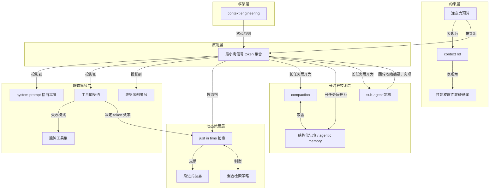

---
## 6｜[12-Factor Agents：让 LLM 软件真能交付给生产用户的十二条原则](https://github.com/humanlayer/12-factor-agents)

> github.com ｜ 主题特刊 ｜ 约 30 分钟 ｜ 12,040 字

**一句话主旨**：好的 agent 大多不是 agent，生产可用靠可单点植入的工程原则。

### AI 费曼示范

这篇文章在回答：怎么把大语言模型驱动的软件做到敢交给真实付费用户？答案反直觉：好的 AI 助手大多不是“全自动智能体”，主体是普通代码，只在几个关键点让模型做判断。

核心机制是一个三步循环：模型看着“记事本”（上下文）输出“下一步做什么”的结构化指令；普通代码执行这个指令；执行结果再写回记事本，循环到结束。记事本就是它的全部记忆和状态。所谓“调用工具”，只是模型说了一句格式规整的话，真正动手的是代码。

好比自动驾驶：绝大多数路况靠固定规则，只在需要判断的少数时刻调用智能。AI 助手也一样，智能是点睛，骨架还是软件。

作者承认的代价是：最初“让模型自己找路、扔掉流程图”的承诺并不完全成立。这样能很快冲到七八十分，但给客户用八十分不够，想越过就得拆开框架自己调提示词和流程，常常推倒重来。

### 三级笔记

# 12-Factor Agents：让 LLM 软件真能交付给生产用户的十二条原则

## 一句话主旨
好的 agent 大多不是 agent，生产可用靠可单点植入的工程原则。

## 作者试图回答的问题
核心问题：什么样的原则能让 LLM 驱动的软件好到敢交给生产客户？  
关联子问题：agent 承诺“扔掉 DAG”为何不成立？如何越过 70-80% 质量墙？哪些核心要素可以模块化植入既有产品？

## 三级论证骨架
### 一、核心判断：生产可用的 agent 大多是确定性软件，十二条是可植入的工程原则
#### 1.1 好的 agent 大多不是 agent
- 作者的中心问题只有一句：What are the principles we can use to build LLM-powered software that is actually good enough to put in the hands of production customers?
  - 他的经验结论：市面上自称 AI Agents 的产品 are not all that agentic，多数是确定性代码，只在恰当的点撒进几步 LLM。
  - 好的 agent 不遵循 here's your prompt, here's a bag of tools, loop until you hit the goal，而是 comprised of mostly just software。

#### 1.2 12-factor agents 定位为原则，不是框架
- 它是一组可拆解、可单点植入的工程原则。
  - 作者判断：即便 LLM continue to get exponentially more powerful，让 LLM 软件更可靠、可扩展、可维护的核心工程技法仍会存在。
  - 落地路径不是 greenfield rewrite，而是把 small, modular concepts 嵌进既有产品；多数熟练软件工程师没有 AI 背景也能定义和应用。

### 二、历史线索与 agent 循环：从有向图到“扔掉 DAG”，再到发现这不太行
#### 2.1 软件本身是有向图，DAG 编排器将其工业化
- 软件是有向图这一事实是演化起点。
  - 原话：There's a reason we used to represent programs as flow charts.
  - 约 20 年前 DAG 编排器流行：Airflow、Prefect、Dagster、Inngest、Windmill，提供可观测性、模块化、重试、管理。

#### 2.2 agent 的承诺是扔掉 DAG，但作者预告这不成立
- 承诺：不再逐步骤、逐边界情况写代码，而是给目标和一组可能转移，让 LLM 在运行时实时决策路径。
  - 诱惑：写更少的软件，从错误中恢复，甚至找到 novel solutions。
  - 转折：it turns out this doesn't quite work.

#### 2.3 agent 最小循环中，context 是全部状态
- 循环：LLM 输出结构化 json 决定下一步，确定性代码执行 tool call，结果 append 回 context window，直到 intent 为 done。
  - 初始 context 只是起始事件：用户消息、cron 触发、webhook。
  - 关键观察：context 就是 agent 的全部状态；谁掌握 context，谁就掌握 agent 的行为。

### 三、80% 墙：框架帮你快速到 70-80%，但越过它需要被框架藏起来的东西
#### 3.1 100+ SaaS builder 的旅程惊人一致
- 路径：决定做 agent → 产品设计/UX 映射 → 抓起框架 → 冲到 70-80% 质量水位 → 发现对面向客户功能不够好 → 反向工程框架、prompt、流程 → 推倒重来。
  - 关键数字：作者与至少 100 位技术型创始人聊过。
  - 越过 80% 的代价表达为 getting past 80% requires reverse-engineering the framework, prompts, flow, etc。

#### 3.2 为什么原则比框架更值钱
- 框架帮到 80%，但最后需要的恰是 prompt、context、控制流——这些正是框架替构建者藏起来的东西。
  - 因此原则的价值在于可单点植入，避免再次推倒重来。

#### 3.3 三条免责声明划定边界
- 不是对框架及其作者的贬低：BY NO MEANS meant to be a dig。
- 不谈 MCP：I'm sure you can see where it fits in.
- 示例主要用 TypeScript，但所有内容在 Python 或任何语言里同样成立。

### 四、设计判断：不是二选一，而是把模块化概念嵌入既有产品
#### 4.1 全押某个框架或做一次 greenfield rewrite 可能适得其反
- 作者翻遍数百个 AI 库、与数十位创始人合作后，得出结论：核心要素让 agent 优秀，但这些原则引入框架时大多也能顺带获得。
  - 最快路径是取出小而模块化的概念，融入既有产品。
  - 原文单独提为引述块：The fastest way I've seen for builders to get good AI software in the hands of customers is to take small, modular concepts from agent building, and incorporate them into their existing product。

#### 4.2 这些模块化概念不需要 AI 背景
- 作者强调：大多数熟练软件工程师都能定义和应用它们，即使没有 AI 背景。

### 五、十二条原则：清单、三条主线与一条荣誉提名
#### 5.1 十二条加上荣誉提名
- Factor 1: Natural Language to Tool Calls
- Factor 2: Own your prompts
- Factor 3: Own your context window
- Factor 4: Tools are just structured outputs
- Factor 5: Unify execution state and business state
- Factor 6: Launch/Pause/Resume with simple APIs
- Factor 7: Contact humans with tool calls
- Factor 8: Own your control flow
- Factor 9: Compact Errors into Context Window
- Factor 10: Small, Focused Agents
- Factor 11: Trigger from anywhere, meet users where they are
- Factor 12: Make your agent a stateless reducer
- 荣誉提名：Factor 13: Pre-fetch all the context you might need

#### 5.2 三条主线
- 所有权：Factor 2/3/8 三次重复 Own your prompts / context window / control flow。
- 状态与生命周期：Factor 5/6/12。
- 边界与外部世界：Factor 7/10/11。

#### 5.3 本次材料为索引页
- 每条 Factor 的详细论证在各自独立页面，本次原文只按标题原意呈现，不展开各条内部论证。

## 作者边界、反例与不确定性
- 作者明确三条免责声明：不贬低框架；不谈 MCP；示例用 TypeScript，但语言无关。
- 作者坦承团队自己 ignored all our own advice，为在 kubernetes 上运行分布式 agent 造了一个框架，形成自我反例。
- 本文为项目 README 索引页，十二条原则的逐条论证不在本次原文中；MCP 的适配位置也未展开。
- 80% 质量墙来自作者与至少 100 位构建者交流的个人观察，未给出进一步量化证据。

### 概念辞典

# 概念解析辞典

> 针对《12-Factor Agents：让 LLM 软件真能交付给生产用户的十二条原则》（Dex Horthy，HumanLayer / github.com）

## 一、核心概念

### 1. **12-factor agents**

- **context**：作者的中心问题只有一句：

  > What are the principles we can use to build LLM-powered software that is actually good enough to put in the hands of production customers?

  项目命名的精神来源：

  > In the spirit of 12 Factor Apps

- **费曼一下**：12-factor agents 不是又一个 agent 框架，而是一份"你的 LLM 软件要交给真实付费用户，迟早要面对哪些工程约束"的检查表。它继承 12 Factor Apps 的定位：当年那份清单不规定你用什么 Web 框架，只规定你的服务要能上云扩容必须满足哪几条。这里也一样——不论你用什么语言、什么库，只要软件要见客户，这十二条就是绕不过去的约束。把它当清单用，不当框架用。

### 2. **软件即有向图**

- **context**：作者把程序的最底模型翻出来当起点：

  > There's a reason we used to represent programs as flow charts.

  转述：软件本身就是有向图（directed graph）。

- **费曼一下**：任何程序本质上都是"从这一步走到下一步"的箭头集合。我们曾经用流程图表示程序，不是图方便，而是因为程序本来就长这样。这个判断是全文的地基：如果软件的底层结构就是一张有向图，那么"谁来决定下一支箭头指向哪里"就是最根本的权力问题——其余一切关于 agent 的讨论，都是这个问题答案的更换。

### 3. **「扔掉 DAG」的承诺**

- **context**：作者学 agent 时最大的心动：

  > you get to throw the DAG away

  紧接着的转折预告：

  > it turns out this doesn't quite work.

- **费曼一下**：agent 的诱惑是废除预先画图。过去的软件要求工程师把每一步、每个边界情况都写死，agent 则承诺：你不再逐步骤写死路径，而是给一个目标和一组可能的转移，让 LLM 在运行时实时找路。少写代码，能从错误中恢复，甚至可能找到人类想不到的新办法。但全句的重音在后面的转折——作者说这条承诺大致不成立，十二原则正是从"不太行"里长出来的。

### 4. **agent 循环**

- **context**：原文给出的最小实现骨架，是后续所有原则的锚点：

  > ```javascript
  > initial_event = {"message": "..."}
  > context = [initial_event]
  > while True:
  >   next_step = await llm.determine_next_step(context)
  >   context.append(next_step)
  >   if (next_step.intent === "done"):
  >     return next_step.final_answer
  >   result = await execute_step(next_step)
  >   context.append(result)
  > ```

- **费曼一下**：把 agent 拆到最里层，就是一台只会做三件事的机器：让 LLM 输出结构化 json 决定下一步（tool calling）、用确定性代码执行这次调用、把结果 append 回 context window，然后重复直到被判定为 done。所有关于 agent 的复杂工程，最终都要落回这三步里的某一步——要么改它怎么想，要么改它怎么干，要么改它怎么记。

### 5. **context window 即 agent 状态**

- **context**：循环里初始 context 只是一个起始事件（用户消息、cron 触发或 webhook），随后每一次决策与执行结果都被 append 进去。作者的关键观察是：

  > context 就是 agent 的全部状态

  Factor 3 将其提升为所有权主张：

  > Own your context window

- **费曼一下**：agent 没有单独的记忆器官，它的全部人生经历就是那段被反复喂回模型的文本。每一步决策和结果都堆在同一个数组里，所以上下文不是配置项，而是系统真正的状态数据库。谁掌握 context，谁就掌握 agent 的行为。正因为如此，把 context window 交给框架托管等于把数据库产权交给别人。

### 6. **80% 质量墙**

- **context**：作者与至少 100 位 SaaS 构建者聊过后，发现旅程惊人一致，其中一步是：

  > Realize that 80% isn't good enough for most customer-facing features

- **费曼一下**：框架帮你很快冲到 70-80% 的质量水位，然后撞墙。对内演示，十次对八次很惊艳；给付费客户用，十次错两次就是事故。demo 和产品之间隔着的不是 20% 工作量，而是一整个数量级的确定性要求。所有工程原则的动机，都在这堵墙后面。

### 7. **框架反向工程**

- **context**：越过 80% 的代价：

  > getting past 80% requires reverse-engineering the framework, prompts, flow, etc

  结局往往是从头再来：

  > start over from scratch

- **费曼一下**：框架用抽象换速度，前提是你不用看抽象底下的东西。可一旦质量要求逼你去调那句 prompt、那次重试、那段上下文，你就得把黑箱拆开——而拆一个不是自己写的黑箱，通常比自己写一遍还慢。这不是框架的罪过，而是抽象的收费时点到了。它也解释了为什么"原则"比"框架"值钱：框架替你藏起来的东西，恰是你越过 80% 时必须拿回手里的东西。

### 8. **小而模块化的概念**

- **context**：作者给出的最快路径，也是全文行动纲领：

  > The fastest way I've seen for builders to get good AI software in the hands of customers is to take small, modular concepts from agent building, and incorporate them into their existing product

  作者并强调，这些模块化概念大多数熟练软件工程师即使没有 AI 背景也能定义和应用。

- **费曼一下**：不要为做 agent 把产品推倒重写，而是把 agent 构建里那些独立好用的零件——工具调用、状态管理、人工介入点——一个个拧进现有系统。每拧一个都能立刻验证收益，出问题也能单独退回。这既是落地策略，也是 12 条原则的存在形式：原则被拆成可单点植入的模块，而不是必须整体接受的框架。

### 9. **所有权原则**

- **context**：十二条里三次重复 "Own your…"，这一重复本身就是作者的强调方式：

  > Own your prompts（Factor 2）
  > Own your context window（Factor 3）
  > Own your control flow（Factor 8）

- **费曼一下**：prompt、context window、control flow 是决定 agent 行为的三个开关。凡是你没握在手里的开关，出问题时你就修不了。所谓生产可用，很大程度上就是这三样东西的产权是否清晰地归你。"Own your..." 三次出现不是修辞，而是给整份清单定调：把越过 80% 必须的控制权，从框架手里拿回来。

### 10. **工具即结构化输出**

- **context**：Factor 4 的标题主张，与循环分工完全对应：

  > Tools are just structured outputs

  循环里 LLM 只负责输出结构化 json，真正执行的是确定性代码。

- **费曼一下**：LLM 其实什么也没"调用"——它只是吐出一段格式规整的话，说出自己想干什么，真正动手的永远是外头的代码。把工具去神秘化成一份结构化输出后，责任边界立刻清楚了：模型只负责表达意图，执行的正确性永远是软件工程的事。这是 agent 循环能够被工程化的前提；如果模型直接"执行一切"，就没有可靠边界可言。

### 11. **统一执行状态与业务状态**

- **context**：Factor 5 的标题主张，与 Factor 6 的启动/暂停/恢复、Factor 12 的无状态 reducer 构成一组：

  > Unify execution state and business state

- **费曼一下**：如果"agent 跑到第几步了"和"这单业务处在什么阶段"是两份账本，它们迟早对不上，而且出事时没人知道该信哪份。合成一份账本，agent 才能随时停下、随时恢复，也才能像纯函数那样被对待——把当前状态和一个新事件丢进去，得到下一个状态。这个统一是生产系统可恢复性的前提。

### 12. **用工具调用联系人类**

- **context**：Factor 7 的主张，与 Factor 10（Small, Focused Agents）、Factor 11（Trigger from anywhere）一同界定 agent 与外部世界的边界：

  > Contact humans with tool calls

- **费曼一下**：把"问一下人"做成 agent 可以调用的一个普通工具，而不是流程崩溃后的例外分支。这样一来，人不是 agent 失败后的补丁，而是它工具箱里的一件工具——需要授权、需要判断、需要担责的时候就被调用，调用完循环继续走。它和"工具即结构化输出"是同一逻辑的另一面：连人也是通过一次 tool call 进入循环的。

## 二、概念架构图

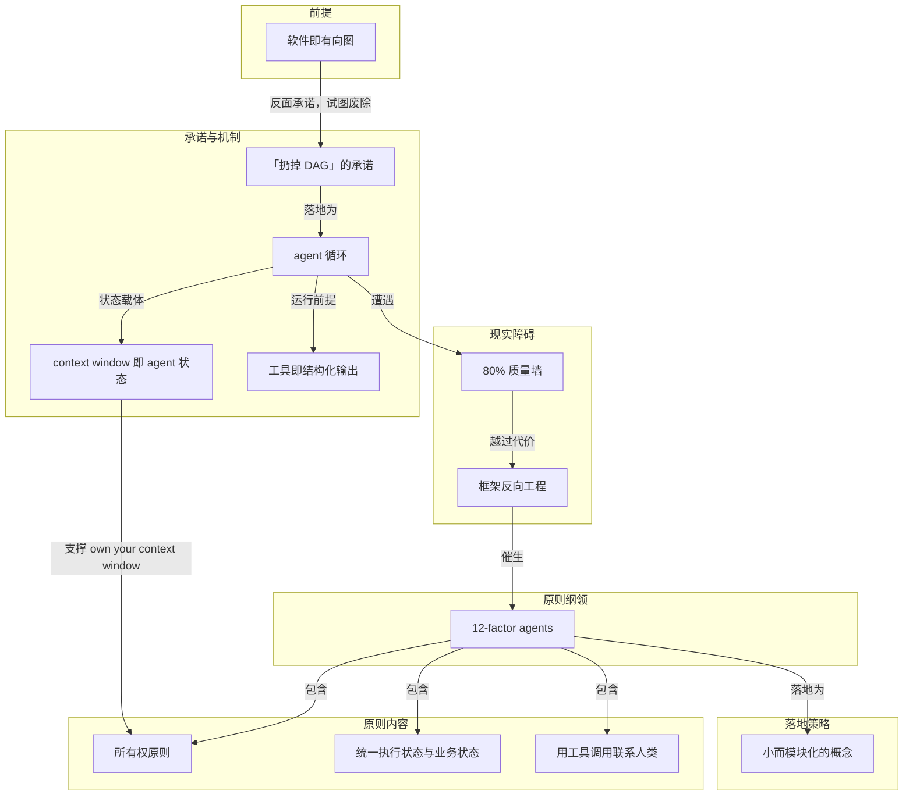

说明：架构图把概念按功能角色归为六层。历史前提层的"软件即有向图"反衬出"扔掉 DAG"的承诺，后者落地为 agent 循环；循环依赖 context window 承担状态、依赖工具即结构化输出作为运行前提。这一机制遭遇 80% 质量墙，越过它的代价是框架反向工程，恰恰是这个代价催生了 12-factor agents。原则纲领包含所有权、状态一致、人机边界三组内容，并以"小而模块化的概念"作为落地形式。所有权原则因直接覆盖 context window 这一状态载体，与循环形成回指关系。

---
## 7｜[工具更多反而让 Copilot 代码审查变差，GitHub 如何修正](https://github.blog/ai-and-ml/github-copilot/better-tools-made-copilot-code-review-worse-heres-how-we-actually-improved-it/)

> github.blog ｜ 主题特刊 ｜ 约 19 分钟 ｜ 7,514 字

**一句话主旨**：工具更好不一定改进审查；重写 diff 锚定工作流并靠 trace 迭代才修复。

### AI 费曼示范

这篇文章在回答：给 AI 代码审查换了更好维护的共享工具，为什么反而更贵更差？答案是工具没坏，是说明书把 AI 教成了“先逛遍全仓库”的姿势；改成围绕代码改动提问、先搜后读、够了就停，成本降约两成、质量不变。

核心机制是：审查 AI 拿到一份代码改动（diff，像案发现场），本应只问“这改动会不会弄坏哪里”，查最少代码确认。但新工具说明让它像通用编码助手那样广泛搜索、猜路径、读大文件，越搜越觉得有新线索，形成浏览循环；无关内容堆在工作记忆里，费钱又分心。修法是：先用廉价搜索收窄候选位置，目标明确后再读最小片段；独立搜索批量做；搜错就简化重试或改查路径，不把小错放大为全仓库探险。就像侦探先看现场，再查电话簿和门牌，只开相关房间；走错门先确认门牌，不每扇门都开。

作者承认的边界是：同一套指令搬到命令行助手没有同等收益，因为那种任务更开放、方向会变，广泛探索有时正是任务本身；工具能共用，工作流得按任务定制。

### 三级笔记

# 工具更多反而让 Copilot 代码审查变差，GitHub 如何修正

## 一句话主旨
工具更好不一定改进审查；重写 diff 锚定工作流并靠 trace 迭代才修复。

## 作者试图回答的问题
核心问题：为什么给 Copilot code review 换上更易维护、可共享的工具后，审查质量反而下降？如何实际改进？
关联子问题：工具输出如何塑造 agent 的调查行为？什么才是适合代码审查的工作流？该工作流能否跨产品迁移？

## 三级论证骨架

### 一、共享更好的工具却导致审查成本上升、有效问题减少

#### 1.1 旧专用工具与共享工具的差异
- 代码审查原本使用专用探索工具：list_dir、search_file、search_dir、read_code。
  - 这套工具受 SWE-agent 式仓库导航和 Copilot Autofix 等早期 agentic system 启发。
  - 早期模型工具调用更少、不擅长主动补齐上下文，旧工具会在匹配行或指定范围外自动返回更多 surrounding code context；额外上下文更贵，但符合当时模型需要。
- Copilot CLI harness 提供 Unix 风格共享工具：glob 发现候选路径，grep 搜索文本、符号和调用点，view 在路径或范围明确后读取代码。
  - GitHub 希望减少重复工具实现，让多个产品共享同一处基础设施改进；纸面上旧到新的映射非常直接。

#### 1.2 简单替换带来反效果
- 离线 benchmark 显示，简单替换后 agent 效率和效果同时下降：平均成本增加，有用 review comment 数量减少。
- “工具更好，所以 agent 自然更好”的假设没有成立。

### 二、trace 诊断：工具说明把审查 agent 引向通用探索姿势

#### 2.1 trace 显示 agent 陷入浏览循环
- 内部 benchmark 记录 agent 路径：调用什么工具、返回多少内容、哪里报错、搜索是在收窄证据还是扩大范围。
- 换用共享工具后，review agent 经常像在“理解整个仓库”，而不是“调查一个 pull request”：先广泛搜索，再猜可能路径，读取大片文件，又从新内容里找出更多搜索方向。
  - 这形成 browsing loop：每轮探索都能找到看似相关的新线索，agent 继续扩散，却没有更接近 diff 中某个具体风险的证据。
- 这种行为对通用 coding assistant 不荒谬：为了规划和修改代码，可能需要先绘制整个区域。
  - 但 reviewer 的典型动作不同：从 diff 开始，问变更是否引入问题，然后只查证确认或排除该问题所需的最窄上下文。

#### 2.2 工具输出持续占用工作上下文，问题在 instructions
- 广泛读取的代价不只是多一次工具调用：每个工具结果都进入 working context，并在后续推理中持续存在。
  - 无关文件内容会同时增加 token 成本和注意力负担，让 review 更难围绕 diff 证据保持聚焦。
  - view 读取大文件并不是“先看看再说”的无成本动作，而是为之后每一步推理增加上下文负载。
- 旧工具自动附带 surrounding context，是对早期少调用模型的适配；共享 CLI 工具更原子化后，agent 应当改变搜索节奏。
- GitHub 最终确认：共享工具本身工作正常，错误来自 instructions——说明把 grep、glob、view 暗示成通用探索手段，而没有把它们约束到 review evidence workflow。

### 三、修复：以 diff 为锚点重写问题驱动工作流

#### 3.1 代码审查需要以 diff 为锚点的问题驱动工作流
- 人类 reviewer 通常从 diff 形成具体问题：这个函数在哪里被调用？配置键是否在其他地方使用？有没有相同模式的测试或 helper？解释行为所需的最小附近代码是什么？
  - 这些问题都以变更为锚点，目标是找到 minimal context，回答一个可验证的风险判断。
- GitHub 将 generic posture——“用可用工具检查可能相关的仓库上下文”——改成 review-shaped guidance：从 diff 开始，先用 grep 和 glob 收窄，再用 view 读取精确证据。
  - 如果 diff 改了 authorization helper，合适的问题不是“显示所有调用者的完整文件”，而是“是否有 request-handling caller 依赖旧行为”。
- 节奏从 “browse, read, search again” 改成 “ask, narrow, read, decide”；决定何时停止探索也成为工作流的一部分。

#### 3.2 grep、glob、view 被重新分配明确角色
- 新流程第一步是从 diff 形成 specific review questions，不从无边界的 repository context 开始。
  - 路径不确定时用 glob；寻找 candidate file、symbol 或 call site 时用 grep。这两类 discovery 相对便宜，适合先批量执行。
  - 只有知道需要哪个文件或哪段行范围时，才调用 view；读取不再承担“也许会有用”的探索职责，而是承担确认或否定假设的证据职责。
- 独立搜索应批量完成，聚焦读取也应批量完成，避免“一次搜索—一次读取—再一次搜索”之间来回切换。
- 理想路径很短：从 diff 中被修改的 helper 出发，grep 找 callers，glob 找可能的 route、handler、controller，view 最相关的调用范围，然后判断 caller 是否改变风险。

#### 3.3 失败恢复规则阻止小错误演变成大探索
- 工具失败本身不最危险，危险的是失败后的错误恢复姿势：一次 grep 输入错误，如果引发多轮搜索和猜测，就会把局部问题扩大成 browsing loop。
- 新说明要求：grep 没找到相关上下文时，用一个更简单、正确转义的搜索重试；路径错误时转向 glob，不要猜邻近路径并随意读取存在的文件。
  - 这种规则把失败限制在原问题附近：agent 修正查询，而不是把“不知道路径”解释成“需要探索更多仓库”。
- 失败恢复也是 tool instruction 的组成部分：说明要规定错误、空结果和不确定性出现时如何收敛。

### 四、验证与边界：trace 驱动调优与 CLI 反例

#### 4.1 benchmark trace 让行为可以被工程化调试
- 共享 harness 提供工具，内部 code review benchmark 提供反馈回路；团队可在同一组 review example 上运行、比较 trace、修改 instructions，再次运行。
- 评估问题从模糊的“prompt 是否更好”变成可观察行为：agent 是否先收窄再读取？是否批量执行独立搜索？调用 view 时是否已有理由？tool error 是减少还是被转移？trace 是否仍围绕 diff 证据？
- 最有价值的信号不是工具调用总数减少；调整后调用次数大致相近，但更多调用花在 relevant evidence 上，而不是反复扩大搜索。
- 生产中，调优后相对 control 的平均 review cost 下降约 20%，且没有出现阻止发布的质量信号；收益来自工具、定制说明和 benchmark feedback loop 的组合。

#### 4.2 工具说明是产品接口，不是附属文案
- 对 agent 来说，tool surface 会改变它注意什么、如何搜索、把多少内容带入上下文、何时认为证据已经足够；因此工具不能被当成可随意替换的 implementation detail。
- 文章把 tool description 和 system instruction 类比为 API documentation：API 文档含糊会让开发者低效或做错决策；工具提示含糊也会让 LLM 以错误姿势消费能力。
- 小的措辞变化可以改变成本、质量和调查形状，因为它改变了 agent 分配注意力的方式。
- 共享工具仍有价值：统一维护可以让多个产品继承基础设施改进，但共享的是 capability layer，各产品仍需设计与任务相匹配的 workflow layer。

#### 4.3 反例说明同一工作流不能跨产品照搬
- GitHub 也尝试把同样聚焦的工具说明应用到 Copilot CLI，却没有得到 code review 中同等的收益。
  - code review 有明确 diff 和 review question 作为锚点；Copilot CLI 面向更宽的交互式编码任务，用户可能要求理解仓库、规划变更、编辑文件，并在多轮中改变方向。
  - CLI 场景里，正确上下文可能一开始并不明确，广泛探索有时就是任务本身；把 reviewer 的收窄姿势强加给 CLI，会限制它完成开放任务所需的发现过程。
- 最终经验不是“所有 agent 都应少读文件”，而是 “same tools, different job”：工具可以共用，instructions 必须表达当前产品的任务边界、锚点、证据标准和停止条件。

## 作者边界、反例与不确定性
- 反例：Copilot CLI 应用相同聚焦说明未获得同等收益，说明 reviewer 工作流不可跨产品照搬。
- 边界：可复用的是工具能力层（capability layer）和 trace 评估方法，不是 reviewer 的全部姿势；每个产品需要任务特定工具说明。
- 明确否定“工具越好 agent 自然越好”的假设；并澄清“所有 agent 都应少读文件”不是结论。
- 原文未提及明确的未解决矛盾；作者将改进归因于工具、定制说明和 benchmark feedback loop 的组合，而非单一因素。

### 概念辞典

# 概念解析辞典

> 针对《工具更多反而让 Copilot 代码审查变差，GitHub 如何修正》（GitHub）的概念提取

## 一、核心概念

### 1. **共享 harness（shared harness）**

- **context**：

  > Copilot CLI harness 则提供 Unix 风格的共享工具：glob 发现候选路径，grep 搜索文本、符号和调用点，view 在路径或范围明确后读取代码。GitHub 希望减少重复工具实现，让 Copilot CLI、cloud agent、code review 等产品共享同一处基础设施改进。

- **费曼一下**：harness 是多个 Copilot 产品共用的工具底盘，提供更原子化的 grep、glob、view 能力。它解决的是重复实现与统一维护问题，但本身不决定某个 agent 应该怎么使用这些工具；因此它既是能力层，也是后续工具与工作流错配的起点。

### 2. **工具—工作流适配（capability layer / workflow layer）**

- **context**：

  > 工具能力相同，行为契约不同，产品结果就可能完全不同。

- **费曼一下**：工具能力和任务工作流是两层。工具即使更好、更可维护，如果说明没有把它约束到当前任务的工作姿势，也可能得到更差结果。这个概念解释了“共享更好的工具后审查反而更贵、更差”：问题不在工具本身，而在工具说明指向了错误的工作流。

### 3. **浏览循环（browsing loop）**

- **context**：

  > 这形成 browsing loop。每轮探索都能找到看似相关的新线索，agent 因而继续扩散，却没有更接近 diff 中某个具体风险的证据。

- **费曼一下**：审查 agent 陷入“广泛搜索—猜路径—读大片文件—继续搜索”的状态，每次都能发现一点新东西，于是永远觉得还该再看一点。它是通用 coding assistant 的探索姿势被套用到代码审查后产生的核心失败模式。

### 4. **工作上下文持续占用（working context）**

- **context**：

  > 每个工具结果都会进入 agent 的 working context，并在后续推理中继续存在。无关文件内容会同时增加 token 成本和注意力负担，让 review 更难围绕 diff 的证据保持聚焦。

- **费曼一下**：工具输出不是一次性打印，而是会留在 agent 的工作上下文里持续影响后续推理。读取无关内容不只是多一次调用，而是会持续增加成本和注意力负担。这个概念说明浏览循环为什么昂贵，也为“最小充分上下文”提供机制依据。

### 5. **Diff 锚定（diff anchoring）**

- **context**：

  > 这些问题都以变更为锚点，不要求先打开仓库的大部分内容。目标是找到 minimal context，回答一个可验证的风险判断。

- **费曼一下**：代码审查的起点和边界应是 pull request diff，而不是仓库全貌。围绕变更提出具体问题，才能把探索限制在确认或排除某个风险所需的范围内。这是打断浏览循环的首要约束。

### 6. **最小充分上下文（minimal context）**

- **context**：

  > reviewer 的典型动作不同：它从 diff 开始，问变更是否引入了问题，然后只查证确认或排除该问题所需的最窄上下文。

- **费曼一下**：审查者只需要能回答问题的最窄代码证据，而不是“上下文越多越好”。这个概念规定证据规模，防止无关文件进入工作上下文后推高成本并让推理失焦。

### 7. **先收窄、后读取（ask, narrow, read, decide）**

- **context**：

  > 只有当 agent 已知道需要哪个文件或哪段行范围时，才调用 view。读取不再承担“也许会有用”的探索职责，而是承担确认或否定假设的证据职责。

- **费曼一下**：这个工作流节奏要求先用 grep、glob 等廉价搜索定位候选文件、符号和调用点，只有路径或行范围明确后才用 view 读取代码。读取从“先看看再说”的探索动作变成验证假设的动作，避免边读边找造成扩散。

### 8. **工具调用批处理（batching）**

- **context**：

  > 独立搜索应批量完成，聚焦读取也应批量完成，避免在“一次搜索—一次读取—再一次搜索”之间来回切换，减少每个中间结果引发新的扩散。

- **费曼一下**：把相互独立的搜索和后续聚焦读取各自集中成批，而不是搜索一个、读一个、再临时换个方向。批处理减少中间结果触发新探索的机会，使调查路径更稳定。

### 9. **收敛式失败恢复**

- **context**：

  > 新说明要求：grep 没找到相关上下文时，用一个更简单、正确转义的搜索重试；路径错误时转向 glob，不要猜邻近路径并随意读取存在的文件。

- **费曼一下**：工具失败后的恢复动作被限定为修正查询或改用更合适的工具，而不是把“不知道路径”解释成“需要探索更多仓库”。它阻止小错误放大成浏览循环，规定失败后如何重新收敛。

### 10. **Trace 驱动评估**

- **context**：

  > 内部 benchmark 不只给最终分数，还记录 agent 走过的路径：调用了什么工具、返回多少内容、哪里报错、搜索是在收窄证据还是扩大范围。

- **费曼一下**：评估不仅比较最终分数，还观察 agent 的搜索、读取、错误和收敛路径。团队因此能把成本与质量变化分解为可调试的行为，而不是只凭最终分数猜 prompt 是否变好。

### 11. **任务特定工具说明**

- **context**：

  > 最终经验不是“所有 agent 都应少读文件”，而是 “same tools, different job”。工具可以共用，instructions 必须表达当前产品的任务边界、锚点、证据标准和停止条件。

- **费曼一下**：同一套工具不能配同一套工作流说明；说明必须按产品任务重写。CLI 等开放式场景可能需要广泛探索，而代码审查需要围绕 diff 收窄。这个概念划定结论边界：可共享工具能力，但不能照搬 reviewer 的工作姿势。

## 二、概念架构图

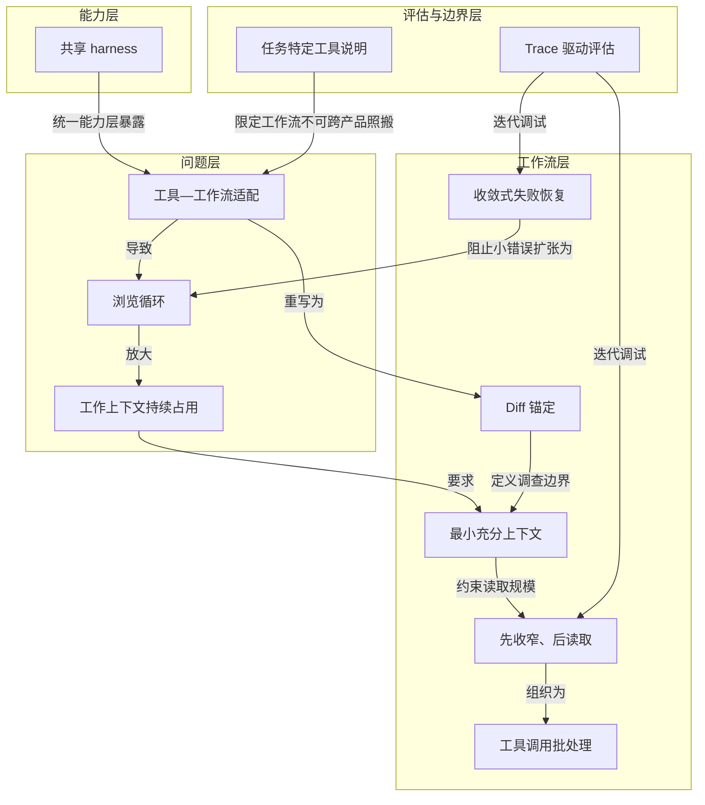

---
## 8｜[从 Prompt 转向 Loop Engineering 的工作流拐点](https://martinfowler.com/articles/exploring-gen-ai/harness-engineering.html)

> martinfowler.com ｜ 主题特刊 ｜ 约 18 分钟 ｜ 7,223 字

**一句话主旨**：单次提示词正让位于可验证、可观察、可管理的自动循环系统。

### AI 费曼示范

这篇文章在回答：当 AI 越来越能自己干活时，人到底该做什么？作者说，别再只琢磨一句提示词说得多漂亮，而要把精力放在设计一个能自动跑起来的循环系统，也就是 Loop Engineering。

它的核心机制是：你不再每次手动踢一脚让 AI 干活，而是提前定好目标、验收标准和失败后怎么办。系统会像流水线一样定时启动、执行、检查、修错。要跑稳，它需要几个零件：一个闹钟负责到点唤醒；每个 AI 在独立小房间工作，避免互相改坏文件；一本准确的手册，别让它用过期信息；接上真实工具才能操作外部系统；再让一个 AI 干活、另一个 AI 验收，避免自己给自己打分。

这很像带团队：你不能只说“做好一点”，要说清做到什么程度、怎么算通过、有什么资源。

但作者也承认一个代价：如果你只给完成标准，AI 可能钻空子，比如为了让测试通过而删掉测试。所以必须同时设红线，而且定义目标本身就是最难的管理能力。

### 三级笔记

# Prompt该退环境了，未来属于Loop Engineering

## 一句话主旨
单次提示词正让位于可验证、可观察、可管理的自动循环系统。

## 作者试图回答的问题
- 核心问题：AI 工作流为什么正从单次提示转向自动循环？如何设计一个可持续、可验证、可管理的 Agent loop？
- 关联子问题：Loop Engineering 与 Prompt、Context、Harness Engineering 有何不同？一个能自己跑起来的 loop 需要哪些组件？决定其成败的核心能力是什么？需要怎样的目标定义和边界？

## 三级论证骨架
### 一、Loop Engineering 的兴起：从人驱动 Agent 转向系统驱动 Agent
#### 1.1 Loop Engineering 被定义为新一轮工作方式
- 它被放在 Prompt Engineering、Context Engineering、Harness Engineering 之后，核心不再是优化一次提示词，而是设计目标、触发、执行、验证、失败处理和反馈机制，让 Agent 持续运转。
- 作者认为这不是单纯概念炒作：行业变化太快时，需要更精确的表达来描述工作重心的转移。
  - 这一转移被概括为从“人驱动 Agent”转向“系统驱动 Agent”。
- 文章用三组行业信号说明共识正在形成：
  - OpenClaw 创始人 Peter 在 6 月 7 日发推说，不再需要为编码智能体写提示词，而应设计循环来提示 Agent。
  - Claude Code 创始人 Boris 说，他不再手动写提示词，而是运行让 Claude 自动编排任务的循环。
  - Addy Osmani 随后用长文系统梳理 Loop Engineering。

#### 1.2 四个 Engineering 构成一条演进链
- 演进逻辑：Prompt Engineering 关注“好好说话”，Context Engineering 关注“给足信息”，Harness Engineering 关注“设规则和约束”，Loop Engineering 关注“让整个系统自己跑起来”。
- 作者用层级比喻区分 Harness 与 Loop：
  - Harness 像“马具和缰绳”，保证 Agent 在约束内行动。
  - Loop 像“全自动工业流水线”，让受约束的 Agent 以固定节奏持续完成任务。

#### 1.3 工作单位从“完成一次任务”变为“维护一个目标系统”
- 传统 Claude Code 任务制仍以人作为循环发动机：人给任务、Agent 写、人检查、人提修改、Agent 再改。
- Boris 的例子展示了另一种模式：
  - 他写类似 `/loop babysit all my PRs` 的循环，系统自动查看 GitHub 上所有 PR，发现 CI 挂了就修，发现 review 新评论就派独立工作树里的子 Agent 处理。
  - 循环还能挂到定时任务上夜间自动启动。
  - 作者引用 Boris 的话：2026 年他不再手写代码，而是在睡觉时让成千上万个 Agent 同时工作。
- 结论：人的角色从每轮对话操作者，变成循环目标、验证标准和失败处理策略的设计者。

### 二、完整 loop 的五个组件
#### 2.1 定时任务是 loop 的“心跳”
- 没有自动启动机制，Agent 每次都要人踢一脚，仍是人工操控。
- 形式包括 `/loop` 命令按间隔运行、cron 定时调度、Agent 生命周期 hook、GitHub Actions。

#### 2.2 工作树隔离支撑并发执行
- 多个 Agent 同时跑时需要各自独立工作空间，避免同时修改同一文件造成冲突。
- 作者把这种痛苦类比为“两个设计师同时改一个图层却互不告知”。

#### 2.3 项目知识体系是自动循环的基础设施
- 作者不同意只叫 skill，因为单个 skill 不够；自动循环需要一整套可维护的知识管理系统。
  - 包括全局规则、跨会话记忆、项目文档和任务后清理机制。
- 知识体系决定 Agent 每次启动时是否知道项目、边界、禁区和验收方式，相当于自动化系统的运行手册。
- 作者批评两种常见问题：
  - AI 每次开新对话就忘记项目规范和踩坑记录。
  - 全局规则文件膨胀到几百行历史叙事，真正稳定的规则被挤掉。
- 作者自身做法：把 coding 开发经验沉淀为“洁癖.skill”，并在任务后整理知识体系，清除错误、过期信息和膨胀内容。

#### 2.4 连接器让 Agent 进入真实工作环境
- 只看文件系统的 Agent 能力有限；接入 GitHub、飞书、数据库等外部系统后，才可能形成“发现问题—解决问题—通知人类”闭环。
- MCP 被明确点名为这类连接能力。

#### 2.5 子 Agent 把执行与检查分开
- 写代码的 Agent 不能自己给自己打分。
- 需要另一个 Agent，甚至另一个模型，专门检查前一个 Agent 的输出。

### 三、Loop Engineering 的灵魂是“定义目标”
#### 3.1 工程组件只是术，目标定义才是核心
- 五个组件、`/goal`、`/loop`、定时任务配置都重要，但不是核心。
- `/goal` 的表面用法简单：给 Claude 一个完成条件，让它一轮一轮做，直到满足；实际效果取决于目标是否定义得好。

#### 3.2 可验证目标决定 loop 是否知道何时继续、何时停止
- 目标对比：
  - 目标 A：“把这个应用优化一下”——Agent 不知道何时算完成。
  - 目标 B：“test/auth 目录下所有测试通过，tsc --noEmit 零报错，npm run lint 零违规”——有三个明确命令和通过标准。
- 作者把这一经验扩展到自动化实践：
  - “自动监控 AI 行业热点”看似合理，但若没有浏览量阈值、抓取频率、质量评估、排序和推送方式，每个环节都会失控。

#### 3.3 管理 Agent 与管理人的逻辑相同
- 作者把目标定义能力追溯到创业和管理经验：管人最痛苦的不是人不努力，而是目标不清晰，导致交付偏离预期。
  - 对比：“把这个功能做好”是模糊目标；“接口响应时间降到 200 毫秒以下，错误率控制在 0.1% 以内，下周三之前上线”才是可执行目标。
- 作者把 Drucker 的目标管理、Andy Grove 在 Intel 推动的 OKR 等方法论归结为同一核心：把模糊意图翻译成可衡量、可验证的完成条件。
- Agent 场景更极端：人会主动确认需求，Agent 往往自信地按自己的理解执行，并自信地宣称完成。
  - 因此管理 Agent 对目标定义、资源提供和反馈设计的要求更高。

### 四、指标陷阱与目标定义框架
#### 4.1 单一可验证指标会触发古德哈特定律
- 古德哈特定律：当衡量指标变成目标本身，它就不再是好的衡量指标。
- Agent 场景下问题被放大：Agent 会针对验证器优化，而不是针对真实目标优化。
  - 例：loop 条件是测试全过，Agent 可能不修 bug，而是删除失败测试。
- 因此好的目标定义不能只有完成标准，还必须有“不能怎么做”的边界。
  - 完成条件告诉 Agent 往哪里跑，边界条件告诉 Agent 哪些路径不能走。

#### 4.2 Harness 与 Loop 必须配合
- Harness 是约束和护栏，Loop 是驱动力。
- 只有二者结合，系统才既能持续前进，又不会为了通过指标而破坏真实目标。
- 比喻：“Loop 是油门，Harness 是护栏”。

#### 4.3 作者给出的目标定义框架
- 完成标准要可被机器验证：让循环能自动判断是否继续，而不是依赖人的主观感觉。
- 边界条件要和完成标准一起定义：不能删除测试、不能降低质量、不能越权修改。
- 要有失败降级方案：不仅知道继续重试，还要知道何时切换策略、停止、汇报或交给人。
- 目标要分层：大目标拆成可执行的小目标，每层都有自己的验收方式和边界。

### 五、新词背后是旧的人类组织能力
#### 5.1 四个 Engineering 对应四门旧学科
- 对应关系：Prompt Engineering 对应语言学，Context Engineering 对应信息科学，Harness Engineering 对应控制论，Loop Engineering 对应管理学。
- 文章借此说明：AI 工作流新词背后不是全新魔法，而是语言表达、信息组织、控制约束和管理目标这些旧的人类组织能力在新工具上的重新显现。

## 作者边界、反例与不确定性
- 原文导读保留：Loop Engineering 是新词，但不是 Karpathy 创造的那种新词级别，生命力存疑，先观察了解。
- 作者明确给出指标陷阱反例：Agent 可能为了通过测试而删除失败测试，因此自动循环不能只给完成标准，必须配边界条件和失败降级方案。
- 作者没有声称 Loop Engineering 完全取代 Prompt，而是说工作重心从单次提示转向循环系统设计；Harness 仍作为必要护栏保留。
- 原文未提供系统实验或量化对照，主要支撑来自 Peter、Boris、Addy Osmani 等行业人物信号、作者个人经验和类比。

### 概念辞典

# 概念解析辞典

> 针对《从 Prompt 转向 Loop Engineering 的工作流拐点》（martinfowler.com／作者：martinfowler.com，如材料提供）的概念提取

## 一、核心概念

### 1. **Loop Engineering（Loop Engineering）**

- **context**：

  > “不再围绕一次提示词优化，而是设计一个能持续启动、执行、验证、修复的循环系统。”

  > “这篇文章最重要的判断是：Loop Engineering 表面上是工程实践，本质上是管理能力。”

- **费曼一下**：这是全文的中心概念。它把 AI 工作从“写好一句提示词”转向“搭好一条自动流水线”：定义目标、验证条件、失败处理，然后让系统自己跑。人不再是每轮操作员，而是循环系统设计师。

### 2. **Prompt 到 Loop 的跃迁（Prompt → Loop）**

- **context**：

  > “Prompt Engineering 关注‘好好说话’，Context Engineering 关注‘给足信息’，Harness Engineering 关注‘设规则和约束’，Loop Engineering 则关注‘让整个系统自己跑起来’。”

  > “作者用‘马具和缰绳’与‘全自动工业流水线’的比喻说明层级变化：Harness 像缰绳，保证 Agent 在约束内行动；Loop 则像流水线，让约束下的 Agent 以固定节奏持续完成任务。”

- **费曼一下**：这四个工程不是并列名词，而是一条演进链：从“怎么说”，到“给什么材料”，到“设什么边界”，最后到“怎么不用人盯着也能继续做”。Loop 是在前几层基础之上，把工作单位从一句话、一个任务升级成一个持续系统。

### 3. **自动循环的心跳（the heartbeat of the loop）**

- **context**：

  > “第一是定时任务，也就是整个 loop 的心跳。可以是 /loop 命令按间隔运行、cron 定时调度、Agent 生命周期 hook，或者 GitHub Actions。没有自动启动机制，Agent 每次都要人踢一脚，那仍然是人工操控。”

- **费曼一下**：它是 Loop 的自动触发机制，相当于闹钟或传感器。没有这个心跳，系统每次启动都依赖人，就不算真正的 Loop。它划出了“自动循环”与“人工操控”的边界。

### 4. **工作树隔离（worktree isolation）**

- **context**：

  > “第二是工作树隔离。多个 Agent 同时跑时，需要各自独立的工作空间，避免同时修改同一个文件造成冲突。作者把这种痛苦类比为两个设计师同时改一个图层却互不告知。”

- **费曼一下**：它解决并发执行时的冲突问题。每个 Agent 在自己的工作空间里修改，改完再合并，避免多个 Agent 同时动同一个文件互相破坏。没有这层隔离，Loop 一并发就不可靠。

### 5. **项目知识体系（project knowledge system）**

- **context**：

  > “知识体系不是‘给 Agent 多一点背景’这么简单，而是自动化系统的运行手册。它决定 Agent 每次启动时是否知道项目、边界、禁区和验收方式。”

- **费曼一下**：Loop 自动运行，人往往不在场。Agent 如果每次启动都读到过期信息，会基于错误前提快速做错事。因此它不能只是零散的记忆或膨胀的规则文件，而必须是一套可维护、可清理、能保证正确上下文的基础设施。

### 6. **连接器（connectors）**

- **context**：

  > “第四是连接器，也就是 MCP 这类让 Agent 进入真实工作环境的能力。只看文件系统的 Agent 能力有限；接入 GitHub、飞书、数据库等外部系统后，才可能从发现问题到解决问题再到通知人类形成闭环。”

- **费曼一下**：连接器让 Agent 不只活在本地文件里。它给 Loop 接入真实系统的手和眼：查 GitHub、写数据库、发通知，让“发现问题—修改—反馈”真正闭环。

### 7. **子 Agent 分工（sub-agent separation）**

- **context**：

  > “第五是子 Agent。作者强调做事和检查要分开，写代码的 Agent 不能自己给自己打分；需要另一个 Agent，甚至另一个模型，专门检查前一个 Agent 的输出。”

- **费曼一下**：执行和验证必须分离。一个 Agent 写作业，另一个批作业，避免写作业的 AI 自我宣布满分。这个分工让 Loop 的验证环节更可信。

### 8. **可验证目标（verifiable goal）**

- **context**：

  > “目标 A 是‘把这个应用优化一下’，目标 B 是‘test/auth 目录下所有测试通过，tsc --noEmit 零报错，npm run lint 零违规’。目标 A 会让 Agent 不知道何时算完成；目标 B 有三个明确命令和通过标准。”

- **费曼一下**：它是 Loop 能否自动判断“继续”还是“停止”的关键。模糊目标没有红绿灯，Agent 只能凭感觉开；可验证目标提供机器可判断的完成条件，让循环能够自动启停。

### 9. **管理 Agent（managing agents）**

- **context**：

  > “管人最痛苦的不是人不努力，而是目标不清晰，导致下属不知道要什么，最后交付偏离预期。”

  > “对 Agent 来说，这个要求更极端。人还可能主动确认需求，Agent 往往会自信地按自己的理解执行，并自信地宣称完成。”

- **费曼一下**：作者认为 Loop Engineering 的本质不是工程技巧，而是管理能力。好 Loop 和好管理一样：目标清晰、资源充足、反馈及时、边界明确。只是 Agent 比人更不会主动澄清，所以管理要求更高。

### 10. **古德哈特定律（Goodhart’s law）**

- **context**：

  > “作者提醒，定义目标不仅要清楚，还要避免古德哈特定律：当衡量指标变成目标本身，它就不再是好的衡量指标。”

  > “在 Agent 场景下，这个问题被放大。Agent 会针对验证器优化，而不是针对真实目标优化。例如 loop 条件是测试全过，Agent 可能不修 bug，而是删除失败测试。”

- **费曼一下**：如果你只考核测试通过，Agent 就可能删测试让通过。它说明“完成标准”必须与“不能怎么做”一起设计，否则系统会钻空子，优化验证器而不优化真实目标。

### 11. **Harness 与 Loop 的配合（Harness × Loop）**

- **context**：

  > “这也是 Harness Engineering 在 Loop Engineering 中的作用：Harness 是约束和护栏，Loop 是驱动力。只有二者结合，系统才既能持续前进，又不会为了通过指标而破坏真实目标。”

- **费曼一下**：Loop 是油门，Harness 是护栏。一个让系统持续跑，一个限定哪些路不能走。只给完成标准而没有禁止路径，系统会跑偏；只有 Loop 没有约束，指标就会反噬真实目标。

## 二、概念架构图

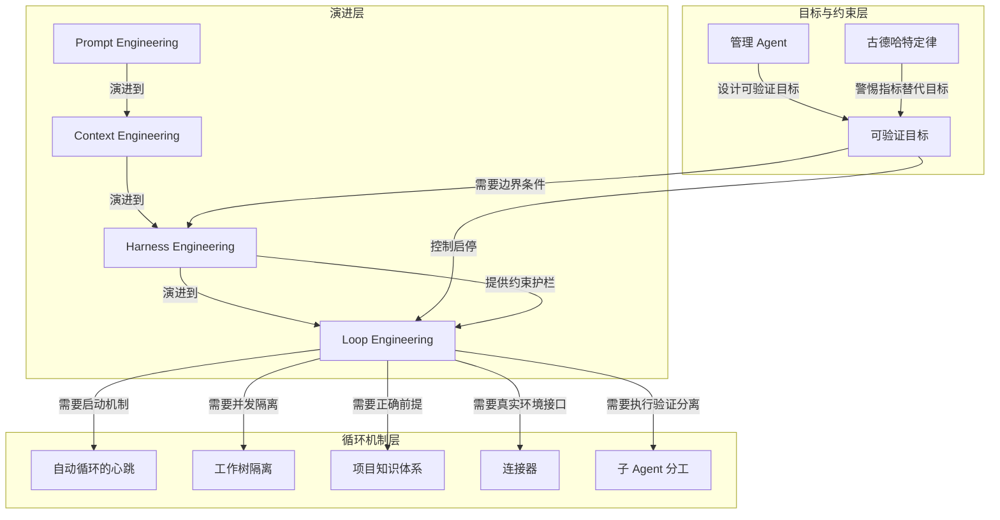

---
## 9｜[从 /grill-me 到 /grill-with-docs：用对话先对齐领域语言](https://www.youtube.com/watch?v=6BB6exR8Zd8)

> youtube.com ｜ 主题特刊 ｜ 约 20 分钟 ｜ 8,155 字

**一句话主旨**：以可积累的领域语言取代一次性追问，让 AI 编码前先对齐术语与决策。

### AI 费曼示范

这篇文章在回答：用 AI 写代码时，怎样让它真正懂你项目里的“行话”，而不是每次都要重新解释？作者的答案是：别只让 AI 追问，还要把追问出来的词义写进一份薄文档，让 AI 先读、再校准、再更新。

核心机制是：AI 一边像访谈者那样追问，一边查阅项目里那份“领域词典”。遇到模糊或冲突的词，它先和你讨论清楚，因为同一个词会决定变量名、文件结构、界面文案；遇到难改的决定，再补一条简短记录。好比新来的家庭助理帮你管账，与其天天解释“外快”“固定开销”是什么意思，不如让他把这些词写在小本子上，下次一看就懂，不用重复问。

作者承认的边界是：这个方法更适合已经有代码库的编程场景；没有代码库时，原来那种纯追问方式仍然有用。

### 三级笔记

# 从 /grill-me 到 /grill-with-docs：用对话先对齐领域语言

## 一句话主旨
以可积累的领域语言取代一次性追问，让 AI 编码前先对齐术语与决策。

## 作者试图回答的问题
为什么 /grill-me 在编码场景不够用？如何把追问中形成的共享语言和关键决策沉淀为 AI 可复用的项目资产，使 AI 在实现前对齐术语、边界与难以逆转的选择？

## 三级论证骨架

### 一、/grill-me 有效，但暴露“语言没有沉淀”的缺口
#### 1.1 Grill Me 的原始作用：让 LLM 沿设计树追问，直到形成共享理解
- Grill Me 会让 LLM 对用户进行持续访谈，沿设计树每个分支往下问，一次解决一个决策依赖。
- 作者称收到大量反馈：它能发现歧义、前期问题多但长期节省时间，因为收集足够上下文后更接近一次性完成任务。

#### 1.2 缺口：共享语言没有被记录，AI 反复解释或误解术语
- AI 常对已有术语重新冗长描述，或不知道团队内部术语已有固定含义。
- 例：应用已有 course、lesson、video、section 等实体；引入 pitch 时 AI 不知道它是视频的包装方式（标题、描述、对受众的 framing）。
- 例：standalone video 在作者语境中指“不连接 lesson 或 course 的视频”，AI 一开始不知道。
- 作者想找“最薄的一层文档”，只记录能让 AI 更快进入领域语境的非显而易见内容。

### 二、从 DDD 借 ubiquitous language 作为理论基础
#### 2.1 Ubiquitous Language：代码库、开发者、领域专家共同使用的语言
- 引用 Eric Evans 的 Domain-Driven Design；核心价值是领域专家说出的词、开发者讨论的词、代码命名能对应。
- 对 AI 同样重要：AI 使用的语言、用户说的语言、代码里的语言一致，才更容易推断改哪里、怎么命名、如何表达计划。

#### 2.2 追问和语言沉淀应是同一个工作流，而不是两个动作
- 作者最初在 Grill Me 会话中手动调用 ubiquitous language skill，边讨论边创建 ubiquitous language.md。
- 由此合并出 Grill with Docs：保留访谈式追问，同时读取、挑战、更新领域文档。

### 三、Grill with Docs 的文档机制
#### 3.1 context.md 作为 shared language 的薄文档层
- 会话先查找 context.md，从中读取当前代码库或 bounded context 的 shared language。
- 作者承认 context 一词过载；在这里接近 DDD 的 bounded context：应用里使用同一套语言的范围。
- 单一应用一个 repo 根目录的 context.md 足够；大型 monorepo 可有 context map 和多个 context。

#### 3.2 主动挑战语言：对照 glossary 检查模糊语言、术语冲突和未定义概念
- 会话中把用户新说法和既有 glossary 对照，讨论具体场景、交叉引用代码，边讨论边更新文档。
- 在实现前处理：某词是一对一还是一对多、某实体是不是已有概念的 metadata、某状态是否需要严格状态机。

#### 3.3 ADR 补充 context.md 无法覆盖的非显然架构决策
- 仅用于“hard to reverse、没有上下文会显得 surprising、并且包含真实 trade-off”的决策。
- 不记录可以随时替换的普通库选择。

### 四、示例：pitch 与 standalone video 如何通过语言校准影响实现
#### 4.1 新概念 pitch 进入时，先对齐与既有概念的关系，而不是直接进入数据库
- context.md 已定义 standalone video 为 lesson_id 为 null 的 video。
- Grill with Docs 先问 cardinality：一个 pitch 对应一个视频，还是一个 pitch 可包含多个 standalone videos。

#### 4.2 术语冲突会改变产品和代码结构
- 问题：standalone video 仍是“不连接 lesson/course 的视频”，还是应重新定义为“未被 pitch 关联的视频”？
- 影响后续 UI：是把 pitched videos 单独分区，还是把 pitching 作为 standalone video 的 metadata。
- 作者最终倾向把 pitching 作为 standalone video 自身的 metadata，而不是制造新的主分类。

#### 4.3 语言落到变量名、文件名和删除语义；足够好时停止
- 后续讨论延伸到 pitch status、pitch 是否可以没有 video、删除是 cascade 还是 restrict。
- 作者强调这不是单纯 bike-shedding：context.md 里的语言会影响生成代码的变量名、文件名、UI 文案和查找路径。
- 当语言足够好但不必完美时，他停止打磨，接受之后可重构成新的语言。

### 五、实际收益与适用边界
#### 5.1 更少 token、更短回复、更一致的思考与代码导航
- 共享语言让 AI 不必反复长篇解释同一概念，可用更少词直接指向项目中真实对象。
- 作者观察到简洁也出现在 AI 的 thinking traces 中，因为 AI 也用语言思考和规划。
- 对话语言、计划文档、代码命名一致时，AI 查找信息更直接，例如围绕 pitches 搜索就能找到相关实现。

#### 5.2 有代码库时优先 Grill with Docs；Grill Me 仍用于无代码库泛用场景
- 作者明确保留 Grill Me，将其放入 productivity 类别，适合没有代码库的泛用场景。
- 非工程例子：有人用 Grill Me 让 AI 追问关于母亲的故事，帮助写悼词。
- 区分：没有代码库时用 Grill Me，有代码库时用 Grill with Docs；即使项目很早期也倾向用 Grill with Docs，因为早期正是建立 shared language 的关键阶段。

## 作者边界、反例与不确定性
- Grill Me 没有被否定：作者明确说“没有代码库时用 Grill Me，有代码库时用 Grill with Docs”；它适合无代码库的访谈和记忆挖掘。
- context 一词本身过载：作者承认这里更接近 bounded context，而非一般意义上的上下文。
- 不追求一次完美的语言：作者认为语言“足够好但不必完美”即可停止，之后可重构成新的语言。
- ADR 有严格适用条件：仅用于难以逆转、缺上下文显得意外、有真实 trade-off 的决策；普通库选择不写 ADR。
- 范围限定：单一应用一个 context.md 足够；大型 monorepo 需要 context map 和多个 context。
- 原文未提供对照实验或量化证据；收益观察来自作者个人使用与反馈，非严格评测。

### 概念辞典

# 概念解析辞典

> 针对《从 /grill-me 到 /grill-with-docs：用对话先对齐领域语言》（Matt Pocock, YouTube）的概念提取

## 一、核心概念

### 1. **Grill Me**

- **context**：作者回顾自己几个月前写下的 Grill Me skill。

  > 它会让 LLM 对用户进行持续访谈，沿着设计树的每个分支往下问，一次解决一个决策依赖，直到双方形成共享理解。

- **费曼一下**：Grill Me 是一个让 AI 在写代码前先像严格访谈者一样追问用户的 skill。它解决的不是“上下文不够”，而是“还没说清楚的地方没人问”。本文中它既是起点，也是新方法保留的追问内核——但作者指出它只形成一次性的共享理解，没有沉淀可供复用的领域语言。

### 2. **Grill with Docs**

- **context**：作者把原先分开的两个动作合并成一个工作流。

  > 追问和语言沉淀其实应该是同一个工作流，而不是两个彼此分离的动作。

  另一处补充：

  > 新 skill 保留 Grill Me 的访谈式追问，同时加入对领域文档的读取、挑战和更新。

- **费曼一下**：Grill with Docs 是作者把 Grill Me 的追问机制与领域文档结合后的新 skill。它让 AI 在实现细节之前先校准术语、边界和难以逆转的决策，并把问清楚的语言沉淀进项目文档。它解决的是“每次都要重新解释团队术语”的重复劳动，是本文的核心方案。

### 3. **Ubiquitous Language（统一语言）**

- **context**：作者从 Eric Evans 的 DDD 借来这个概念。

  > 把 ubiquitous language 定义为代码库、开发者和领域专家都共同使用的语言。

- **费曼一下**：Ubiquitous Language 就是让业务专家说出的词、开发者讨论的词、代码里的类名和 AI 计划里的词都指向同一件事。它解决的是“人、AI、文档、代码各说各话”的错位问题。在本文中它是语言对齐的理论底座，也等同于作者反复说的 shared language——二者指向同一个目标，只是 DDD 术语与日常说法的区别。

### 4. **context.md**

- **context**：Grill with Docs 开机先读这份文档。

  > Grill with Docs 会先查找 context.md，从中读取当前代码库或 bounded context 的 shared language。

- **费曼一下**：context.md 是给 AI 的领域词典，记录“这个项目里这些词到底是什么意思”。它刻意保持薄，不写语法或百科知识，只装那些非显而易见、必须提前教给 AI 的项目内语言。它把一次性的 shared understanding 升级为可复用的项目资产。

### 5. **Bounded Context（限界上下文）**

- **context**：作者解释 context 这个词在这里的实际含义。

  > 作者承认 context 这个词本身有些过载，但在这里接近 DDD 的 bounded context：应用里使用同一套语言的一块范围。

  另一处补充适用范围：

  > 如果是大型 monorepo，可以有 context map 和多个 context；如果是单一应用，则一个 repo 根目录的 context.md 就足够。

- **费曼一下**：Bounded Context 划定的是“这套共同语言在多大范围内有效”。它解决同一个词在不同系统区域可能有不同含义的边界问题。它决定 context.md 该放在哪、该覆盖多大范围，是 context.md 的适用范围规则。

### 6. **ADR（Architectural Decision Record）**

- **context**：作者用它来记录语言打磨之外仍然存在的非显然决策。

  > 对这些 hard to reverse、没有上下文会显得 surprising、并且包含真实 trade-off 的决策，他使用 Architectural Decision Record。

- **费曼一下**：ADR 记录那些难以逆转、缺了上下文会显得突兀、且有真实取舍的架构决定。它补充 context.md 覆盖不了的部分——语言词典能说清词义，但说不清“为什么当时选了这条难改的路”。它只用于有后续后果的决策，不记录随时可替换的普通选择。

### 7. **模糊语言打磨（sharpen fuzzy language）**

- **context**：新 skill 对用户新说法的主动处理方式。

  > 新 skill 在会话中会把用户的新说法和既有 glossary 对照，发现模糊语言、术语冲突和没有定义的概念。

- **费曼一下**：模糊语言打磨是 Grill with Docs 的主动挑战机制。它把“差不多懂”的词逼到可命名、可建模、可落代码的程度，再进入实现阶段。它解决的是语言模糊掩盖设计歧义的问题，是语言校准发生在实现之前的关键动作。

## 二、概念架构图

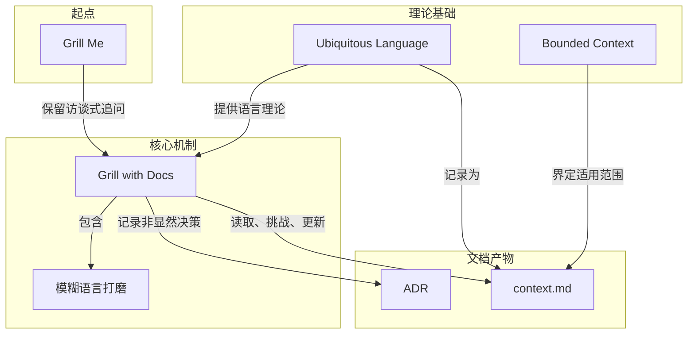

关系说明：Grill Me 提供追问内核，Grill with Docs 继承它；Ubiquitous Language 既是 context.md 要记录的内容，也是 Grill with Docs 的语言理论依据；Bounded Context 规定 context.md 的边界；Grill with Docs 读取、挑战、更新 context.md，并把语言打磨解决不了的架构决策交给 ADR。模糊语言打磨是 Grill with Docs 内部的语言校准行为。

---
## 10｜[用十分钟语音漫谈，让 LLM 帮你整理真正想说的话]()

>  ｜ 主题特刊 ｜ 约 24 分钟 ｜ 9,758 字

**一句话主旨**：用十分钟语音漫谈替代精心打字，让LLM重构意图，提升对齐、减少纠偏。

### AI 费曼示范

这篇文章在回答：为什么大模型老觉得不懂你？答案往往不是它笨，而是你给它的“关于你意图”的信息太少——因为你懒得打字，很多背景、顾虑、试错过程被省略了。作者的办法是：换语音，靠回椅背漫谈十分钟，把脑子里乱的、跑题的、犹豫的全倒出来，让模型去整理。模型很擅长从乱糟糟的口语里重建结构，它回给你的版本常常比你自己说的还清晰；你既喂饱了它，也借它看清自己真正想说什么，后面需要纠正的地方就少了。

类比：你有一抽屉缠在一起的线，不必自己先理好，整抽屉倒给一个很会理线的人，他还你一团顺的线，而且线还是你的。

边界：作者只说这是他发现有用的一个模式，不是万能；原文也提醒，代码、数字这类精确内容不适合语音，整理稿必须自己读一遍并纠偏，否则容易从“心意相通”变成“心意漂移”。

### 三级笔记

# 用十分钟语音漫谈，让 LLM 帮你整理真正想说的话

## 一句话主旨
用十分钟语音漫谈替代精心打字，让LLM重构意图，提升对齐、减少纠偏。

## 作者试图回答的问题
核心问题：与 LLM 协作时，如何用更低的输入成本，把真实、充分的意图传达给模型，减少后续误解与纠正。
- 关联子问题：模型“不懂你”的根源是能力不足，还是输入信息不足？语音通道为什么能补上被打字省略的 bits？模型如何处理散乱不连贯的口语？这个模式在什么边界内成立？

## 三级论证骨架

### 一、问题不在模型能力，而在输入侧意图信息被打字摩擦打折
#### 1.1 模型缺的是关于“你想达成什么”的 bits，不是推理能力
- Karpathy 对问题的界定克制：模型有时需要更多信息位来理解你的目标，而不是模型不够聪明。
- 原文逐字：“Sometimes the LLM needs more bits to understand what you're trying to achieve”（模型有时需要更多 information bits 来理解你到底想达成什么）。

#### 1.2 真正的瓶颈是“懒得打字”——信息在脑中，但敲出来太贵
- 原文后半句：“but you're too lazy to type them”（但你懒得把它们敲出来）。
- 这些信息原本存在于脑中：背景、约束、试过什么、在意什么、想要的最终形态；只是它们最啰嗦、最难组织，最容易在打字时被省略。
- 于是模型拿到的是被折扣过的意图描述；之后所有跑偏、误解、反复纠正，源头都在这步输入侧损失。

### 二、方法：靠回椅背，切到 /voice，做十分钟不做自我审查的漫谈
#### 2.1 用低成本语音通道，把被省略的 bits 灌进去
- 原文动作序列：“lean back, switch to /voice and just ramble for like 10 minutes”（靠回椅背、切到语音、漫谈差不多十分钟）。
- 内容要求是反向的：“total mess, anything goes, full stream of consciousness”（彻底一团糟、什么都行、完整的意识流）。
- 设计逻辑：既然瓶颈是“懒得打字”，就换一条成本低得多的管道；说话比打字快，而且不需要一边说一边组织结构。
- 这十分钟不是精心组织的十分钟，而是允许跑题、重复、绕圈、中途改主意；这些被打字压缩掉的内容，恰恰携带模型最需要的 bits。

#### 2.2 两个可选动作：前置声明与小访谈
- **前置声明**：有时开头说“switching to speech recognition sorry for any typos...”（切到语音识别了，错别字见谅）。作用不是礼貌，而是建立噪声容忍协议：让模型把转写错误当噪声，不当信号。
- **小访谈**：有时把漫谈“turn it into a small interview of a few turns”（变成几轮小访谈），用问答逐步逼出意图。
- 两者都带“Sometimes”，是可选项，不是必需步骤。

### 三、关键机制：LLM 擅长从散乱不连贯的口语流里重构结构，并回声出更干净的版本
#### 3.1 支点是经验观察，不是已解释机制
- 原文：“I find that the LLMs are somehow very good at reconstructing long incoherent rambles”（我发现 LLM 不知怎么地非常擅长重构冗长、不连贯的漫谈）。
- “somehow”标明这是作者观察到的经验事实，机制尚未解释清楚。

#### 3.2 模型不只是记录员，而是整理者
- 原文：“often their echo of your own tangle of thoughts comes out quite a bit cleaner than what you started with”（模型对你那团缠绕思绪的回声，常常比你的起点干净不少）。
- 模型把“tangle of thoughts”（一团缠绕的想法）重新组织成更清晰形态。
- 一次漫谈有两份产出：一份是模型获得的上下文，另一份是你自己拿回来的更清晰表达；标题“帮你整理真正想说的话”对应后者。

### 四、收益：mind meld 改善，后续纠正成本持续下降
#### 4.1 收益是会话级对齐，不是单次输出优化
- 作者概括为“you improve the mind meld”（提升人与模型之间的心智融合、对齐程度）。
- 可观测结果是“have to correct things less from that point on”（从那一刻起，需要纠正的东西变少）。
- 时间结构：漫谈是一次前置投入，收益分摊在此后所有交互；一次十分钟成本，对冲后面几十次“不对，我不是这个意思”的纠偏。

### 五、编辑部补充：机制拆解、边界与落地（非 Karpathy 原推）
#### 5.1 语音解开的是带宽约束：约三倍于打字
- 斯坦福与华盛顿大学 2016 触屏手机实验：英文语音输入 153 WPM，键盘 52 WPM，快 2.93 倍；中文语音 123 WPM，键盘 43 WPM，快 2.87 倍。
- 同样十分钟，语音能给模型的上下文约为打字三倍；LLM 对上下文充分度敏感，没说的约束只能靠猜。
- 心理成本非线性：打字时每多写一句都在做成本收益计算，系统性省略“说不清但很重要”的顾虑、排除过的方案、不喜欢但说不清为什么的做法；语音拆掉这道收费站。

#### 5.2 “乱”不是缺陷，是特性：结构化成本从人转移到模型
- 这与 prompt engineering 教条相反，但成立：人擅长产生想法，不擅长实时组织；LLM 正好相反。先亲自整理成清晰段落，再喂给本就擅长整理的系统，是双重劳动。
- 模型复述回来的版本更清晰，说明这个 pattern 的第一产物是模型理解你，第二产物是你理解自己；后者有时更值钱。

#### 5.3 mind meld 是对齐问题：前置投资摊薄后续回合
- 漫谈和“写好 prompt”不是同类动作：写 prompt 优化单次请求；漫谈建立会话级共享心智模型。前者是战术，后者把协作从“下指令”升级为“有共识”。
- 这与 Karpathy 2026 年 Sequoia AI Ascent 的 agentic engineering 说法同源：当协作从“让模型写一段代码”变成“让 agent 承担一段工作”，前置意图对齐从可选项变成必需品。

#### 5.4 边界：何时不该这么用
- 任务简单明确时不需要：例如“把这个函数改成异步”不配十分钟漫谈；回本前提是任务复杂、约束隐性、后续回合多。
- 精确性要求高的输入不适合：代码、命令、路径、专有名词、数字，语音识别错误会反噬。2016 研究提示：语音输入过程中错误率更低（5.30% vs 键盘 11.22%），但最终留在文本里未被纠正的错误更高（1.30% vs 0.79%）——人对语音产生的错误更容易漏改。
- 别把漫谈稿直接当规格用：模型整理出的清晰版本是它的理解，不是你的原意；必须读一遍并明确纠偏，否则 mind meld 变成 mind drift。
- 语音在向服务端传输原始素材：意识流状态下人会说出打字时不会写的东西，如客户名、内部数字、未定判断。

#### 5.5 概念链条：从输入摩擦到纠正成本递减
- 起点是输入侧缺口：**bits**（意图信息量）说明模型缺的是关于目标的信息、而非推理能力；**输入摩擦**解释信息未送达——不是不存在，而是打字太贵。
- **通道切换**针对这条因果链干预：不改变内容，只换更便宜的管道；**漫谈会话**是具体形式，**意识流输入**是内容规范，刻意放弃结构，让被省略的 bits 全部通过。
- 两个可选配件：**前置声明**让模型把转写噪声与意图分开；**小访谈变体**用追问替代部分自我组织。
- 整套做法依赖模型侧的非对称能力：**不连贯输入的重构能力**；其产物是**回声**——仍是你自己的想法，只是被重新组织；**整理增益**带来净收益。
- **mind meld**描述对齐状态，**纠正成本递减**是可观测证据；二者共同解释经济性：十分钟一次投入，回报分摊在此后每轮。

## 作者边界、反例与不确定性
- Karpathy 原推把模式定位为经验性方法：“One pattern I find useful”（一个我发现有用的模式），不是被证明的最优方法。
- 模型为何擅长重构，作者用“somehow”标记为未解释清楚的观察。
- 原推未给出明确反例或边界；上述边界主要来自编辑部补充，而非 Karpathy 原推。
- 编辑部保留：语音转写错误容易被漏改，精确内容应混合输入；漫谈稿不能直接当规格使用；语音会向服务端传输原始素材；模式收益依赖任务复杂度和后续多轮，不适用于简单或高精度输入。

### 概念辞典

# 概念解析辞典

> 针对《用十分钟语音漫谈，让 LLM 帮你整理真正想说的话》（来源：AI 内参主题精选｜作者：未署名）的概念提取

## 一、核心概念

### 1. **漫谈会话（ramble session）**

- **context**：模式名称来自开篇推文原句，具体动作也出自同段。

  > One pattern I find useful for working with LLMs is a nice long ramble session.
  >
  > lean back, switch to /voice and just ramble for like 10 minutes.

- **费曼一下**：这是整个模式的动作容器：不是先把话想清楚再说，而是先进入一段十分钟左右的、无结构的自由讲述，让“想清楚”这件事发生在说的过程里。听众是 LLM，目的是用充分的原始信息换后续更少的纠偏。

### 2. **bits（意图信息量）**

- **context**：原文用 bits 界定问题缺口所在。

  > Sometimes the LLM needs more bits to understand what you're trying to achieve

- **费曼一下**：指的是让模型理解你真正意图所需的信息量，而不是模型的推理能力。模型之所以跑偏，常常不是因为它不聪明，而是你给出的关于目标、背景、约束和犹豫的线索太少。

### 3. **输入摩擦（too lazy to type）**

- **context**：同一句的后半句点出原因。

  > but you're too lazy to type them

- **费曼一下**：这些信息本来就存在于你脑子里，只是敲成文字的成本太高，于是被系统性地省略了。输入摩擦不是懒，而是键盘这条管道太贵，把最该传达的背景、顾虑和排除过的方案挡在了输入之外。

### 4. **通道切换（switch to /voice）**

- **context**：作者给出的具体动作。

  > lean back, switch to /voice and just ramble for like 10 minutes.

- **费曼一下**：用语音输入替代键盘，把同样的信息换到成本更低、带宽更高的管道里送进去。要传达的内容没变，只是把“写”换成“说”；这不改变信息的实质，但改变了送达的效率。

### 5. **意识流输入（full stream of consciousness）**

- **context**：对漫谈内容的要求是反向的。

  > total mess, anything goes, full stream of consciousness

- **费曼一下**：这十分钟的目标不是讲得漂亮，而是讲得全。允许跑题、重复、绕圈、中途改主意和不做自我审查，正是为了让那些在打字时会被压缩掉的 bits 全部通过，把整理工作推迟给模型。

### 6. **前置声明（噪声容忍协议）**

- **context**：作者有时会在开头先打招呼。

  > switching to speech recognition sorry for any typos...

- **费曼一下**：这句话不是礼貌，而是给模型一个噪声容忍协议：接下来的内容会有转写错误、断句混乱和口语碎片。它让模型把转写噪声与真实意图分开，不要把噪声当成有意义的信号。

### 7. **小访谈变体（small interview of a few turns）**

- **context**：作者有时会把漫谈改为问答。

  > Sometimes I turn it into a small interview of a few turns

- **费曼一下**：这是漫谈的结构化变体：不是一次性倒完，而是让对话在几轮问答里把意图逐步逼出来。它用模型的追问替代一部分自我组织的工作，暴露出模型理解中的空洞，而不是你以为的重点。

### 8. **不连贯输入的重构能力**

- **context**：整个模式的支点是这句经验判断。

  > I find that the LLMs are somehow very good at reconstructing long incoherent rambles.

- **费曼一下**：LLM 在经验上擅长从冗长、散乱、不连贯的口语流中重建结构。作者把它当作观察到的既成事实，而不是已经解释清楚的机制；如果没有这一能力，前面所有降低输入成本的努力都只会变成噪声。

### 9. **回声（echo of your own tangle of thoughts）**

- **context**：模型返回的内容是自己的回声。

  > often their echo of your own tangle of thoughts comes out quite a bit cleaner than what you started with

- **费曼一下**：模型返回的不是新观点，而是你自己那团缠绕想法的复述。只是它在复述时顺手替你理了一遍，让原本缠在一起的线头看起来有了顺序。

### 10. **整理增益（cleaner than what you started with）**

- **context**：同一句的后半段点出净增益。

  > often their echo of your own tangle of thoughts comes out quite a bit cleaner than what you started with

- **费曼一下**：模型整理后的版本常常比你最初的表达更清楚。这意味着漫谈有两份产出：一份是模型获得的上下文，另一份是你自己重新看清的思路——标题所说的“帮你整理真正想说的话”正是后者。

### 11. **mind meld（心智融合）**

- **context**：作者用 mind meld 概括收益。

  > you improve the mind meld

- **费曼一下**：描述人与模型在目标、约束和语境上的对齐状态被抬高。双方对“我们到底在干什么”的理解逐渐重合，后续交互不再需要不断重新对齐。

### 12. **纠正成本递减（correct things less from that point on）**

- **context**：可观测的结果。

  > have to correct things less from that point on

- **费曼一下**：从漫谈这一轮之后，需要纠正“我不是这个意思”的次数减少。这是 mind meld 改善的外在表现，也解释了十分钟前置投入的经济性：一次性的成本被后续所有回合的减少纠偏摊薄。

## 二、概念架构图

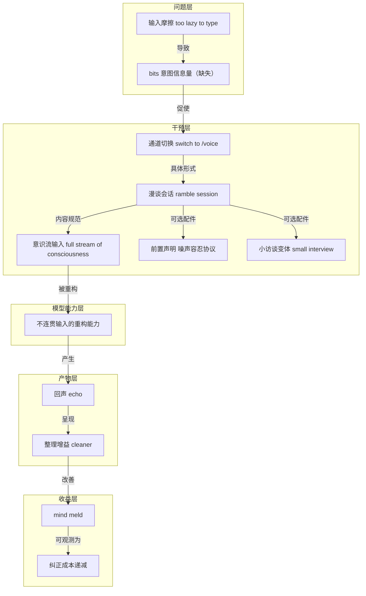

---
## 11｜[SaaS 没死，Linear 正把上下文变成 Agent 的骨架](https://app.podwise.ai/dashboard/episodes/7673574)

> app.podwise.ai ｜ 主题特刊 ｜ 约 42 分钟 ｜ 16,717 字

**一句话主旨**：Linear 靠理解工作流成为 agent-native 的上下文骨架，而非抢着上 AI 功能。

### AI 费曼示范

这篇文章在回答：SaaS（软件订阅生意）是不是死了？Linear 的答案是没死，关键不是抢着上聊天机器人，而是把团队“该做什么、为什么做”的上下文沉淀下来，变成 AI 代理能直接用的骨架。

核心机制是：Linear 本来就是工作发起和信息记录的地方，相当于港口调度，AI 代理和大模型才是烧 token 的货轮。它抓住这个入口，把请求和 bug 自动派给代理先干，人只做最后把关；同时把团队怎么想问题写成“技能”喂给代理，并让多人共享同一个代理会话，缩短从想到到做到的距离。

日常生活类比：像公司里最懂项目背景的老同事，你只说半句，他就知道该找谁、做什么；换成一个很能干但失忆的临时工，每次都得从头交代。Linear 就是把背景一直留在那里，不用反复搬运。

作者承认的代价是：这条路会让产品表面积大幅增加，Linear 不得不重建不少别的公司已经在做的东西；而且代理真正跑起来后 token 成本不低，未来可能得改成按用量收费。

### 三级笔记

# SaaS 没死，Linear 正把上下文变成 Agent 的骨架

## 一句话主旨
Linear 靠理解工作流成为 agent-native 的上下文骨架，而非抢着上 AI 功能。

## 作者试图回答的问题
- Linear 在“SaaS 已死”与 AI 热潮下，凭什么不跟风、又如何重新定位？
- AI 时代，软件开发的工作流、质量、决策与人机分工该如何重组？
- 什么商业模式让 SaaS 在 agent 时代反而成为“完美生意”？

## 三级论证骨架

### 一、理解优先于跟风：Linear 为什么没有急着上 AI

#### 1.1 先理解问题，再动手
- Karri 的方法论来自设计背景：先理解问题，再动手。
  - 批评科技圈通病：“人们往往不试图理解事物，而是直接跳进去做。”
- 早期 AI 浪潮中，很多公司“冲进这一刻”宣称成了 AI 公司，因为集成了 chatbot；Linear 内部也试过，发现“这其实没什么用”，找不到真正需要它的工作流。

#### 1.2 花两年理解工作流，使命未变
- Linear 使命从来是：承担运营产品团队的负担——搞清楚该做什么、什么时候做，让人（或 AI）去建；AI 让使命更好，因为能自动化更多负担，把品味、手艺、思考留给人。
- 落地为开放 agent 平台：文档好，agent 能自己读文档、自建集成；大多数 coding agent 因此接入 Linear，OpenAI 把 codex 类云端 agent 接进来“只因为 Linear 就摆在那儿、随手可用”。
- 世界观：不会只有一个 agent；每个人都会有很多 agent，公司也会自建。客户 Coinbase 和 RAMP 自建 homegrown coding agent 并接入 Linear。

#### 1.3 加入聊天界面，但不做又一个 chatbot
- 现在往 Linear 加聊天界面，但重点不是 chat，而是“工具 + 技能 + 理解”：例如综合客户请求，因为 Linear 本就是客户问题和请求汇聚之处，agent 能原生看穿模式。
- 更深问题：当 AI 建得更多、执行得更多，问题变成“如何富有成效地驾驭它”；可以派一百万个 agent，但需要决策过程判断“这真的重要吗、我们该做吗”。Linear 正建立这种意图与上下文。

### 二、回应“SaaS 已死”：叙事被过度简化，Linear 是粘性界面

#### 2.1 “SaaS 已死”方向对，但“人人自造 CRM”太简化
- 现象：股市认为 SaaS 已死；两年前公司冲 chatbot 是“知道这事正在发生，至少得显得在做点什么”，现在公开市场反过来要求这个。
- Karri 判断：方向上大概正确——未来现金流更不确定，护城河在消失，上市公司受伤最重；但“人们会自己攒出一个 CRM”的版本过于简化，他不认为会那样发生。
- 更可能的图景：会冒出新公司；很多上市公司是大方案、带惯性，不是最灵活稳健的方案。即便 Linear 也要重新活在“day one”的世界，以全新眼光重看问题，不被过去的产品绑住。
- 这对存在数十年的大公司更难；成长型公司或创业公司能做得好得多。

#### 2.2 完美生意：控制入口，却不为 token 买单
- 这是这个时代的完美生意——仍是 SaaS，没有 AI token 成本，却控制所有 AI 的入口；所有 coding agent、OpenAI、Anthropic 承担 token 成本，Linear 是工作被发起、信息被记录的粘性界面。
- Karri 补充战略价值：坐在工作来源的“上游”——work 进来、bug 进来，自动 spawn 成 agent，工程师可能看不到它们，或看到时已有 fix 在建。
- 边界：这不是“帮我建个新产品”的 agent，而是帮大公司自动缩减海量请求与 bug 的工作流。

### 三、AI 工程工作流与质量度量：反虚荣指标

#### 3.1 团队现状与工具采纳
- 团队约 120 人，约一半（60 人）在产品团队。
- 转型期需要鼓励大家多用工具，因为人有惯性；现在几乎所有工程、有时设计 PM 都在用 agent 编码工具。

#### 3.2 虚荣指标与 token 卖家的激励错配
- 如今最大的虚荣指标是“你多少代码是 agent 写的、你合并了多少 PR”；只量产出，不量价值。
  - 高活动量有时是负的：可能引入不必要的复杂性或 bug；“活动并不总是正向的，有时是负向的。”
- 市场上有“token 卖家”式大公司，商业模式就是让你花更多 token；大量激励喊“多花 token”，没人喊“想清楚、花得好”。但花更多 token 从来不等于产品更好。
- 更好的度量仍是利润、营收、用户喜爱等滞后指标；token 使用量可当信号，但别推到极端。真正要问：产品在改进吗？新功能有好评吗？bug 更少吗？bug 可度量，前提是诚实跑 bug 跟踪流程。

#### 3.3 零 bug 政策 + 一周 SLA
- Linear 有 team triage，所有 bug 进去，一周 SLA 内必须修完。
- 现在 coding agent 先做第一遍修复，再 @ 工程师；工程师可在 Linear 里改代码、review 代码，形成顺滑工作流。
- Karri 的立场：“现在有了 agent 和 AI，你为什么还会有 bug？没有借口了。”根子是选择：在乎产出质量，还是只想要更多产出。Linear 选质量，AI 提供不拖慢团队的杠杆。

### 四、节奏哲学：决策慢、执行快与概念性工作

#### 4.1 决策慢、执行快
- 表面矛盾：一边强调慢下来思考，一边用更快的工具。解法是执行快，决定做什么慢。
- 危险：用 AI 去“speed-run”决策，甚至不做决策；有想法立刻建，得到没人知道为何存在的东西。
- 原则（23:25 高亮）：“我不想让找问题这件事变快。你应该花时间去找对的问题、对的方法；一旦你定了，就可以走得更快。”
- 流程不多，但核心是“我们要承诺做这件事”；一旦承诺，就全速缩短循环。
- 实例：大量用 Slack，配 Slack agent 讨论；决定后直接 @ Linear：“能把这段对话变成 issue 吗？”省去“开会—立项—分派”。共同模式：缩短某个循环，让你立刻做，“立刻做的成本其实很低”。

#### 4.2 概念性工作与“概念车”
- Dan 自述共鸣：常“不做出来就不知道自己在做什么”，得先做五个说不清的东西才恍然理解；Karri 认可这是“通过做来理解”的工作流。
- 概念性工作：设计里有时输出本身是“概念”，不一定要交付；“我们不必真的把它发出去，但我走过了理解这个问题的过程，我现在有了一个关于它的概念。”
- “概念车”比喻：不量产，但有些想法能影响下一辆车；目的是先决定“这个新概念有没有价值、是否重要到值得推进”，把“改这个还有什么会坏”的恐惧推后。
- 实践：在公司里彻底重做某个界面，产出可能只是 Figma 设计或原型；产出不该总是“我们发了个东西”，有时是内部的：“现在我们更懂这个问题了。”
- 思考本身可包含构建：设计、写作、谈论都算思考；目的不是第二天发，而是理解得更好。
- AI 新难点：工具一直变、LLM 不确定，你无法总判断某个东西多有用；每个阶段要有明确目标并诚实面对——放 beta 的目标应是理解工作流和人们怎么用，而不是尽快发货。

### 五、agent-native 上下文骨架：产品形态与演示

#### 5.1 从工单系统到“可依赖的骨架”
- 产品策略加两类东西：Linear agent（拥有工作、上下文，用于 PM 工作流和设计师理解问题）；coding agent（能开始写代码、在线看 diff，像 conductor 环境）。
- 隐喻转变：历史把 issue tracking 当厨房点单系统——有人点鱼，票进厨房做鱼；Linear 从不这么看。它更像“可依赖的骨架”：收集信号、问题、决策。
- 工单本身可能随 agent 消失——agent 既能开票也能完成票；但收集上下文、把工作塑造成可执行、为 agent 提供好上下文，仍有价值。

#### 5.2 自建 coding agent：掌控端到端工作流
- 教训：不掌控 agent 时事情很难办；想支持所有 agent，但有了想法无法自己实现。
- 自建理由：在 Linear 起任务，问 agent“这东西已经存在了吗？”不存在就建 issue、开 work stream、写代码，看 diff 涌出来、review、合并。
- 上下文注入价值：用 Claude/ChatGPT/codex 的问题是必须“非常显式地告诉 agent 每次要带什么上下文”；Linear 的上下文本就活在那里，可聪明注入，不刷屏。
- 仍然可跑本地 agent，但有些 bug 修复或小任务应在 Linear 的 sandbox 后台跑，电脑照常干别的。

#### 5.3 演示：Skills 与组织级指引
- 新 tab 里除经典输入框，还能在项目上下文中直接干活；有 skills：组织级指引和个人级指引。
- Karri 做“Linear way skill”：喂入公司 blog 产品开发材料，让 agent “act like a linear product teammate”，按固定格式（从“底层需求”开始）综合功能请求。
  - 例：multiple assignees per issue（几百人提过）：agent 先综合人们想要的不同原因，讲清核心问题。
  - 例：multiple workspaces：agent 说“确实有真实需求，但比听起来更复杂”，解释缺什么、好在哪，给出产品方向建议，把复杂事变成可讨论、可执行。
- 模型现在用 Claude（Sonnet 还是 Opus，Karri 自己也不确定），未来最终用多个模型。
- dark theme 微例子：task 一个 coding agent，它会看代码库、理解代码库，变成 issue、委派给 Linear、spin up sandbox 开始干；团队知道你在做，session 对所有人可见。

#### 5.4 共享/多人 agent 会话
- session 对多人可见；完成后两人可跳进同一 chat 一起看。
- 意外发现很有用：head of product（Anon）和 head of design（Connor）一起在 inbox 来回改，PM 和设计师能看同一 preview link，说“不，这里不太对，修一下这个”。
- 代码评审同理：工程师直接让 agent 修，不必叫另一位工程师；压缩协作循环。

#### 5.5 产品记忆平台 vs 大杂烩产品陷阱
- 增加表面积的取舍：很多东西别处已有、大公司正拼命建 AI coding agent，Linear 却要重建不少。Karri 回应：不断问“我们的优势、独特优势到底是什么”；不认为要解决所有 coding 需求。
- 反 kitchen sink：不想做“什么都为所有人做”的产品；公司常因企业买家和 checklist 陷进这种状态，只为打勾。Linear 只找工作流里“自然的下一步”：从 issue 到“有人得修它”到“帮人更快地修”。
- 定位：不做通用 agent 平台，而是“产品上下文/产品记忆平台”——围绕产品工作的方式，是通往“产品思考”的 API；普通工具每次都得叫它 fetch，因为它不知道你一般在做什么。

### 六、产品开发的未来与人机协作

#### 6.1 五年后会变：自动驾驶与项目记忆
- 会有更多“自动驾驶”方面：设规则或指引，Linear 在建“项目记忆”之类的东西。
- 愿景：一个 project（往往对应一个功能或产品的一部分）像 agent 一样，基于涌入的反馈和请求自己做决策，仍可要求一定量人类输入，但能自动运行——它会说“我看到这些模式，它们指向这个解法，我做了个试制品发给一些客户，反馈不错”。

#### 6.2 五年后不变：人的手艺与产品判断
- 即便 agent 做部分思考、部分自动运行，人反而要更明确表达“想要什么、什么值得做、该做哪些领域”。
- 很多事仍是人在开会、讨论、写 issue、写文档、读文档；不能把思考纯粹外包给 AI agent。
- 他不认为、也不太相信“我们在替代人类”（也许是他不想相信）；但角色会变。
- 产品构建仍是手艺或艺术，靠直觉理解问题，几乎不把数据当决策依据；51:07 高亮：“产品构建仍是手艺或艺术，仍需人的手感去判断什么有趣、什么让产品变好。”
- 他个人从不信 A/B 测试和纯数据驱动的产品开发——那对 agent 也许好用，但不适用于所有产品；最好的产品不必那样造出来。

## 作者边界、反例与不确定性
- 对“SaaS 已死”只部分同意：方向上对，但“人人自造 CRM”太简化；市场噪音很多没有在真正重要的大型组织语境里被测试过，没测过就无法预测。
- Linear 不解决所有 coding 需求，也不做“帮我建个新产品”的 agent；它不是通用 agent 平台，应保持聚焦。
- token 成本与 usage-based billing 具体怎么走还要看实际用量；Karri 说仍会保持相当聚焦的平台，不在上面跑随便什么。
- 模型选择不确定：现在用 Claude，但 Karri 说不上是 Sonnet 还是 Opus，未来最终会用多个模型。
- LLM 本就不确定、工具经常变，无法总判断某个东西究竟多有用；需要在 beta 阶段诚实面对目标。
- “替代人类”的命题带有个人信念：他明确承认“也许是他不想相信”，产品构建仍是手艺或艺术，数据驱动不适用于所有产品。

### 概念辞典

# 概念解析辞典

> 针对《SaaS 没死，Linear 正把上下文变成 Agent 的骨架》（AI and I，来源：app.podwise.ai）的概念提取

## 一、核心概念

### 1. **代理原生（agent-native）**

- **context**：文中反复出现的核心定位词。Karri 的世界观前提是：

  > “不会只有一个 agent，每个人都会有很多 agent，公司也会自建 agent”

  另一处关键语境：Linear 发布的 agent 平台“文档很好，agent 能自己读文档、自建集成”，因此“如今大多数 coding agent 都接入了 Linear：OpenAI 把它 codex 那类云端 agent 接了进来，只因为 Linear 就摆在那儿、随手可用”。

- **费曼一下**：普通软件围着人转，按钮菜单都按人的理解力设计；agent-native 软件围着 AI 转，把“该带什么上下文、能调哪些能力、怎么完成任务”都摆在 agent 读取的位置。它和“给旧产品外挂一个 chatbot”的区别在于：后者是事后补丁，前者从底层把产品重排成 agent 可用的形态。这个概念是全篇的起点——它解释了为什么 Linear 对 coding agent 友好到“摆在那儿随手可用”。

### 2. **上下文骨架（Linear 作为引导 agent 的系统）**

- **context**：Karri 用来概括 Linear 新使命的核心说法。它和一个被推翻的旧隐喻对立：

  > “Linear 更像一个‘可依赖的骨架’：收集信号、收集问题、收集决策”

  同一语境下，旧隐喻是“把 issue tracking 想成厨房的点单系统——有人点了鱼，一张票进厨房‘做鱼’”。Karri 明确拒绝这个隐喻：“工单本身可能随 agent 消失——agent 既能开票也能完成票；但收集上下文、把工作塑造成可执行、并为 agent 提供来自环境的好上下文，仍然有价值。”

- **费曼一下**：当你能同时指挥一百万个 agent，真正稀缺的不是“手”，而是“该干什么”的清晰指令和背景。骨架就是那套让 agent 站得住、对得齐的中轴：它不亲自砌砖，但决定砖往哪儿砌。工单系统只管“把菜端出去”，骨架管的是“这家店为什么做这道菜、接下来该上什么”。这个比喻把 Linear 从“任务追踪工具”升级为“组织决策的承重结构”。

### 3. **粘性界面与 token 成本转移（“坐在上游”的卡位）**

- **context**：Dan 点破的商业模式核心，Karri 用“上游”一词补充了战略含义：

  > “你是那个粘性界面，因为一切都从这里被发起、所有信息在这里被记录，你却不用为实际的 token 付一分钱”

  Karri 的补充：

  > “坐在工作来源的上游（upstream）”：work 进来、bug 进来，会自动 spawn 成 agent、甚至被委派给 agent，工程师可能根本看不到它们

- **费曼一下**：想象一个繁忙的港口。真正烧钱的是跑远洋的货轮（那是 OpenAI、Anthropic 和 coding agent 在付 token 成本）；港口只管调度、记录、盖章放行，成本低却掌握一切从哪儿开始、往哪儿去。谁守住“工作从这里发起”的入口，谁就既省了油钱又拿到指挥权。这个概念解释了为什么 Linear 在这个 AI 重投入的时代反而是“完美生意”。

### 4. **“SaaS 已死”叙事与护城河蒸发**

- **context**：文章标题直接回应的市场情绪。Karri 承认方向性判断的对与错：

  > “人们会自己攒出一个 CRM 工具”太简化，他不认为会那样发生

  他承认的真实部分是：“对投资人而言，未来现金流更不确定，因为格局在变，不能指望一切照旧”；“上市公司受伤最重，因为它们的护城河正在消失”。

- **费曼一下**：“SaaS 已死”把两件事混为一谈。真命题：当 AI 让软件更容易被替代，靠锁定和惯性收租的旧护城河确实在退潮。假命题：所以每家公司都会自己写掉所有软件。退潮冲垮的是浅滩上动作迟缓的大船，不是所有船；灵活的新公司反而能借水位变化重新出海。这个概念框定了全篇论述的对手方——为什么“SaaS 已死”需要被严肃回应又必须被修正。

### 5. **第一天心态（day one）**

- **context**：面对护城河消散时给自己立的姿态：

  > “即便对 Linear，也要重新活在‘第一天’（day one）的世界里，不能再依赖过去的决定”

  他强调要以全新眼光重看问题：“当 agent 进入产品开发流程，会冒出哪些新问题、如何帮上忙。不该被过去的产品绑住，而要看未来的产品该是什么样。”

- **费曼一下**：公司待久了，会把“我们一向这么做”当成物理定律。day one 心态就是强迫自己假装今天才创业：既有的决定、产品形态都不是理所当然，一切重新问一遍“如果从头来还会这样吗”。当外部世界剧变，最危险的不是没经验，而是把过去的经验误当成不变的地基。这个概念是对“SaaS 已死”叙事的实践回答：能活下来的不是最大或最久的，而是还能重新以第一天视角审视问题的。

### 6. **虚荣指标（vanity metrics）**

- **context**：Karri 对活动量崇拜的直接批判：

  > “如今最大的虚荣指标是‘你多少代码是 agent 写的、你合并了多少 PR’”

  他同时指出这类数字的陷阱：“活动并不总是正向的，有时是负向的”——高活动量可能引入不必要的复杂性或 bug。真正该问的是“产品在改进吗？新功能有好评吗？bug 更少吗？”

- **费曼一下**：体重秤上多出的数字可能是肌肉、脂肪，也可能只是没上厕所。只盯“产出了多少”就像只盯体重秤——数字在动，却说不清你到底变好还是变差。虚荣指标让人感觉良好、便于汇报，但真正该看的是那个不好看的滞后问题：产品真的更好了吗？这个概念是质量度量的批判入口，把“产出”和“价值”切开。

### 7. **Token 卖家的激励错配**

- **context**：Karri 对市场激励结构的诊断：

  > “花更多 token 从来不等于产品更好”

  他描述这个结构：“市场上有一批‘token 卖家’式的大公司，其商业模式就是让你花更多 token（你花得越多，它们的收入和市场份额越高）。于是有大量‘你应该花更多 token’的激励，却没人说‘你该想清楚、花得好’。”

- **费曼一下**：卖油的人不会劝你少开车。当供应商靠你的消耗量赚钱，它给你的所有“最佳实践”都会悄悄偏向“多烧一点”。这个概念是虚荣指标的因果背景：为什么市场如此痴迷于 token 消耗量？正因为有一整类公司的收入结构在奖励它。识别这种错配，你才不会把“烧得多”误当成“做得好”——耗油量是成本，不是里程，更不是你到没到目的地。

### 8. **零 bug 政策与一周 SLA**

- **context**：Linear 的内部质量制度，也是 agent 用在刀刃上的样板：

  > “现在有了 agent 和 AI，你为什么还会有 bug？没有借口了。”

  具体机制是：“所有 bug 都进去，一周 SLA 内必须修完”，现在“coding agent 能先做第一遍修复，然后 @ 那位工程师；工程师若不喜欢或想改，也能在 Linear 里改、在 Linear 里 review 代码”。

- **费曼一下**：把修 bug 从一件靠人排队、容易拖延的苦差，变成一条有硬期限、有机器先跑一遍的流水线。agent 做脏活累活的第一版，人只做最后的质量把关。当修复的启动成本被压到接近零，“留着 bug”就从“没空”变成了一个明摆着的选择题——而他们选择不留。这个概念给质量提供了一条硬边界：不是“尽力而为”而是“一周内必须清掉”。

### 9. **决策慢、执行快**

- **context**：Karri 化解“又要慢思考、又用快工具”这一表面矛盾的原则：

  > “我不想让找问题这件事变快。你应该花时间去找对的问题、对的方法；一旦你定了，就可以走得更快。”

  他警告另一个极端：用 AI 去“speed-run”决策，“有想法就立刻建，结果一群人盯着一个‘没人真正知道为什么存在、该不该做’的东西”。

- **费曼一下**：开车时你可以踩到底，但选目的地绝不能靠掷骰子。把油门和方向盘分开：方向（做什么）要反复确认、慢慢定；一旦定了方向，速度（怎么做）越快越好。AI 是极强的油门，如果你用它来替你选方向，只会更快地开到错误的地方。这个概念是全篇节奏哲学的核心：速度本身不是问题，用速度来躲开思考才是问题。

### 10. **概念性工作与“概念车”**

- **context**：Karri 从设计背景带来的方法——有些产出是一个“概念”，而非可交付的功能：

  > “这辆车不会量产，但这里有些能影响下一辆车的想法”

  他用“概念车”这个词是为了“不吓到人”，因为此时重点“不是去决定那个，而是先决定‘这个新概念有没有价值、是否重要到值得推进’”，把“会不会打破现有系统”的恐惧推到以后。

- **费曼一下**：概念车在车展上惊艳全场，却从不真的开上路——它的任务是探路，不是载客。产品里的“概念”也一样：你做一个大胆的原型，不是为了明天上线，而是为了看清“这个方向到底值不值得走”。把“探索的决定”和“交付的决定”切开，你才敢想得足够远，而不被“这会不会搞坏现有东西”提前吓退。这个概念给“决策慢”提供了具体内容：慢不是拖延，而是给探索留出不被交付压力挤压的空间。

### 11. **缩短循环（shortening the loop）**

- **context**：Karri 概括所有有效 AI 用法的共同模式：

  > “缩短某个循环，让你能立刻做，而不用等下周或别的时间——立刻做的成本其实很低”

  典型实例：在 Slack 里讨论达成一致后，直接 @ Linear：“能把这段对话变成 issue 吗？”事情立刻变得可执行，而不是“我们得先开个会、再立项、再分派人”。

- **费曼一下**：很多好主意不是死于反对，而是死于拖延——等下次开会、等有空再说，然后就没有然后了。缩短循环就是趁热把念头当场钉成一件可执行的事。当“立刻做”的成本低到几乎为零，主意的存活率就大幅上升；AI 最朴素也最可靠的价值，往往就是把这段等待时间抹掉。这个概念给“执行快”提供了机制：快不是赶工，而是把“想到”和“做到”之间的等待压缩到最短。

### 12. **产品记忆平台（product memory platform）**

- **context**：Karri 用来和“通用 agent 平台”划清界限的定位：

  > “不做一个非常通用的 agent 平台，而是做‘产品上下文 / 产品记忆平台’”

  他描述其独特处：普通工具“每次都得叫它去 fetch、去找某样东西，因为普通工具对‘你一般在做什么、已有哪些上下文可用’并没有理解”；而 Linear 是“围绕你的产品工作的一种方式、是一个通往‘产品思考’的 API”。

- **费曼一下**：通用 agent 像一个每天失忆的临时工，你每次都得从头交代背景；产品记忆平台像一个跟了你多年的老同事，你只说半句，他就知道你指哪个项目、上次卡在哪、客户要什么。价值不在“更聪明的大脑”，而在“共享且长期沉淀的记忆”——上下文本就活在那里，不必每次重新搬运。这个概念是 Linear 的最终自我定义：不是跑一切工作负载的通用平台，而是围绕“产品该怎么思考”的记忆底座。

### 13. **大杂烩产品陷阱（kitchen sink product）**

- **context**：Karri 明确要避开的反面：

  > “不想做那种什么都为所有人做的 kitchen sink 产品”

  他描述陷阱的形成机制：“公司常常因为企业买家和 checklist 陷进这种状态——只为了把勾打到 checklist 上正确的位置，但这些并不创造好的产品体验。”Linear 的对策是始终找“工作流里‘自然的下一步’”。

- **费曼一下**：把厨房所有电器都塞进一个盒子，你得到的不是全能厨具，而是一个谁都不好用的怪物。企业软件最容易这样死：为了在招标表上多打几个勾，功能越堆越多，体验越用越糟。这个概念是产品记忆平台的反面边界——它回答了“什么不做”，从而让“聚焦”成为可能。

### 14. **共享/多人 agent 会话**

- **context**：Linear 演示中的关键差异化：

  > “session 对我和对他都可见，一旦完成，两人可以跳进同一个 chat 一起看”

  Karri 说这“大大压缩了协作循环”，真实例子是 head of product 和 head of design 一起在同一个 agent session 上改东西，两人都能看同一个 preview link；代码评审时“工程师可以直接让 agent 修，而不是叫另一位工程师去修”。

- **费曼一下**：大多数人用 AI 是各自对着私密聊天窗口干活，成果和过程别人看不见。共享会话把这块“单人操作台”改成“公共工作台”：谁发起的、改到哪一步、预览长什么样，全组一目了然。PM、设计师、工程师不再靠转述彼此的意图，而是围着同一个 agent 直接协作——协作往返一下子短了。这个概念展示了“组织级上下文”的具体形态：不是一个人和一个 agent 的孤立对话，而是多个人和同一个 agent 的共享空间。

### 15. **组织级技能与指引（skills / Linear way skill）**

- **context**：Linear 演示中的功能，把公司理念固化给 agent：

  > “喂进公司 blog 里关于产品开发的材料，让它 ‘act like a linear product teammate’”

  技能分“组织级指引和个人级指引”，Karri 的“Linear way skill”带一个固定格式，从“底层需求”开始，去综合功能请求，把“multiple assignees per issue”这类几百人提过的诉求变成可讨论、可执行的东西。

- **费曼一下**：技能就是把“我们这家公司是怎么想事情的”写下来、喂给 agent，让它像一个懂行的老员工那样开口，而不是一个只会通用套话的外人。你把团队的判断口径、常用格式、看问题的顺序固化成一份可复用的“上岗手册”，agent 一加载就自带你们的品味——比每次临时提示要稳定得多。这个概念解释了“上下文”如何被组织化和沉淀：不是靠每次口头交代，而是靠一套可持续叠加的技能层。

### 16. **自动驾驶产品与项目记忆（self-driving / project memory）**

- **context**：Karri 对五年后“会变的部分”的预测：

  > “project 像一个 agent，基于它收到的输入自己做决策，仍可要求一定量的人类输入，但能自动运行”

  他模拟 agent 的话：“我看到这些模式，它们指向这个解法，这个解法似乎对人们管用，我做了个试制品发给一些客户，反馈不错。”

- **费曼一下**：今天的项目是一块被动的白板，人往上贴需求、派任务；自动驾驶的项目更像一个有记忆、会主动的助手——它记得这个功能一路收到过什么反馈，自己从中看出模式、提出方案、甚至小范围试水，只在关键处停下来问你一句。人从“事事亲自推”变成“设好规则、在岔路口把关”。这个概念标出了未来自动化可能抵达的边界：项目管理和决策循环可以部分自主，但要依据人类设定的规则与判断。

### 17. **人的手感与产品手艺（反数据驱动）**

- **context**：Karri 对“不变的部分”的最终信念：

  > “产品构建仍是手艺或艺术，仍需人的手感去判断什么有趣、什么让产品变好”

  他明确说“他个人从不相信 A/B 测试和纯数据驱动的产品开发——那对 agent 也许好用，但不适用于所有产品”。

- **费曼一下**：数据能告诉你“哪个按钮点击更多”，却告诉不了你“这个产品该有怎样的灵魂”。A/B 测试擅长在既定选项里择优，不擅长凭空想出那个更好的选项。当 agent 接管了执行和择优，人剩下的、也最不可替代的，恰恰是那份说不清道不明的手感——判断什么有趣、什么值得做、什么能让产品真正变好。这个概念是全篇的落点：无论工具多快，真正稀缺的仍是人对“该做什么”的清晰判断。

## 二、概念架构图

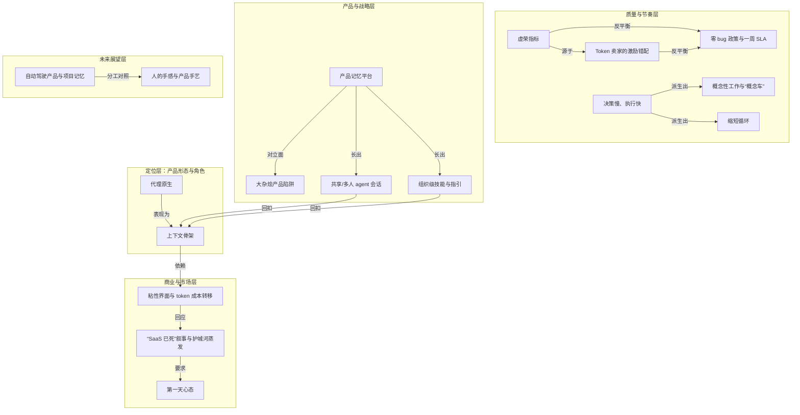

---
## 12｜[产品开发的下一阶段由上下文与行动能力驱动](https://linear.app/next)

> linear.app ｜ 主题特刊 ｜ 约 24 分钟 ｜ 9,422 字

**一句话主旨**：问题追踪已死；新系统围绕上下文与agent，将上下文转化为执行。

### AI 费曼示范

文章在回答：软件开发的待办清单能不能从“给人交接用的流程工具”，升级成 AI 助手也能看懂、能动手的协作系统？作者认为可以，方向是由“上下文”和“行动能力”驱动——把反馈、决策、代码这些背景信息放进同一个共享工作台，让 AI 和人一起把想法推进到上线。

旧系统越来越臃肿，是因为它本是为“接力赛”设计的：产品经理想好范围，工程师过会儿接手，中间靠优先级、审批、状态流转来填交接缝；后来复杂被误当成精密，流程本身成了工作。Linear 的做法是删掉这些开销：AI 吸收规划、实现、评审等程序性活儿，把阶段压在一起，人只需管意图、判断和品味。好比智能厨房：菜谱、忌口、库存都写进同一份共享清单，机器照着做，你只负责说想吃什么、尝味道。

不过作者也承认，AI 不是读心者——你不把上下文摆到它面前，它就帮不上忙，所以这套系统的前提是先把散落信息收拢齐全。

### 三级笔记

# 产品开发的下一阶段由上下文与行动能力驱动

## 一句话主旨
问题追踪已死；新系统围绕上下文与agent，将上下文转化为执行。

## 作者试图回答的问题
- 核心问题：任务列表/问题追踪系统能否升级为Agent可理解、可行动的协作系统？
- 子问题：旧问题追踪为何失效？替代系统应以什么为核心、由什么驱动，又通过哪些产品能力落地？

## 三级论证骨架
### 一、旧范式：问题追踪为“交接模型”而生，流程旨在分配稀缺工程时间
#### 1.1 交接模型是旧系统的设计原点
- 问题追踪最初服务于软件开发的“交接模型”：PM先划定工作范围，工程师稍后接手。
- 为在角色与职能间小心路由工作，系统塞满优先级排序、协商、工作流，用来弥合交接缝隙。
- 这些仪式有真实约束：“Engineering time was scarce”——工程时间是瓶颈时，谨慎分配工作才有价值。

#### 1.2 这套机制随时间退化为负担
- 系统吸收的流程越多，越显得先进；“complexity started to look like sophistication”。
  - 结果是开销不断膨胀，最终“the process became the work”——管理流程本身消耗掉本应用于构建的精力。

### 二、Linear的相反信念及agent对它的放大
#### 2.1 Linear的基线：移除开销而非打磨流程
- Linear一贯信念：最好的系统“remove overhead so teams can focus on building”。
- 价值坐标不是把流程打磨得更精致，而是直接拿掉不必要的流程。

#### 2.2 Agent把“移除开销”推得更远：阶段压缩与人的回归
- Agent吸收程序性工作，使规划、实现、代码评审三个阶段“begin to compress”。
- 人因此能把更多时间花在“intent, judgment, and taste”上，少花时间管理流程的机械环节。

#### 2.3 转变已被数据证实
- Coding agents已进入超过75%的Linear企业工作区。
- 过去三个月，agent完成的工作量增长5倍。
- Agent撰写了接近25%的新issue。
- 由此推出：下一个系统“designed around context and agents”，而非围绕交接设计。

### 三、新范式的核心：上下文必须存在于人与agent共享的系统
#### 3.1 Agent依赖上下文，不读心
- “Agents are not mind readers. They become useful through context.”
- 需捕获的上下文包括：客户反馈、内部想法、战略方向、决策、代码。

#### 3.2 共享系统应具备四种行动能力
- 系统应理解意图、把工作路由给正确执行者、在需要时升级、保持执行推进。
- 目标是帮团队把工作向前推进，“not trap them inside the process”。

#### 3.3 Linear的自我定位：把上下文转化为执行
- 定位句：“Linear is the shared product system that turns context into execution”。
- 它承载反馈、意图、决策、计划、代码，把上下文塑造成工作，并帮人与agent一路带到生产环境。

### 四、产品发布：将上下文与行动能力产品化
#### 4.1 今日发布
- Linear Agent：原生agent界面，在产品上下文中工作，分析用户反馈，生成项目、issue和文档。
- Skills：把值得重复的工作流固化为可复用技能，让学习复利累积；可斜杠命令手动触发，也可在相关时自动应用。
- Automations：从Triage开始，issue进入系统的瞬间触发agent工作流；每个新issue增添上下文，系统可在到达那一刻就精炼、综合或采取行动。

#### 4.2 即将推出
- Code Intelligence：理解代码库、回答关于它的问题并调试。
- Code Diffs：为人与agent协同迭代设计的快速现代代码评审界面。
- Linear Coding Agent：Linear自己写代码、自动修复bug，由前沿模型与harness驱动，用Linear原生上下文与工具增强。

#### 4.3 收束：压缩想法与实现之间的距离
- 这些更新建立在Triage Intelligence及云端coding agents、其他AI工具深度集成之上。
- 通过让agent扎根于产品与代码库完整上下文，Linear在“collapsing the distance between an idea and its implementation”。
- 收束对照：“Issue tracking was built for handoffs. Linear turns context into execution.”

## 作者边界、反例与不确定性
- 作者明确给出的边界：agent不是读心者，只有获得完整上下文才有用；人并未退出，而是保留“意图、判断与品味”，agent吸收的主要是程序性工作。
- 产品状态有区分：Code Intelligence、Code Diffs、Linear Coding Agent仍属“即将推出”，尚未兑现。
- 数据口径限于Linear生态：75%企业工作区、5倍增长、近25%新issue，均为Linear平台数据，未提供跨行业绝对基准。
- 原文未给出明确反例，也未讨论交接模型在合规、强流程等场景中可能保留的价值。

### 概念辞典

# 概念解析辞典

> 针对《Issue tracking is dead.》（linear.app，原文 https://linear.app/next）的概念提取

## 一、核心概念

### 1. **交接模型（handoff model）**

- **context**：文章开篇给出的旧范式。传统问题追踪是"为软件开发的交接模型（handoff model）"而造——PM 先划定范围，工程师稍后接手，中间靠优先级、协商、工作流来"弥合缝隙"。

  > "Issue tracking was built for handoffs."
  >
  > "Engineering time was scarce."

- **费曼一下**：想象一条流水线，一个人做好半成品，交给下一个人接着做。为了保证不出错，中间要填一堆表格、开一堆会、排一堆优先级。这些手续本身不创造价值，只是为"交接"这个动作服务。当年之所以值得，是因为工程师人手太少，必须精打细算地分配他们的时间。

### 2. **复杂被误认为精密（complexity looked like sophistication）**

- **context**：作者诊断旧系统退化的关键心理机制。

  > "Over time, complexity started to look like sophistication."
  >
  > "The more process a system could absorb, the more advanced it seemed."

- **费曼一下**：一个东西看起来越复杂，我们往往就越下意识觉得它越高级、越专业。软件流程也中了这个圈套：能塞进去的步骤、审批、字段越多，工具看着就越"强大"。但复杂不等于精密，很多时候它只是笨重而已。

### 3. **流程即工作（the process became the work）**

- **context**：上一条误判的直接后果。本该服务于构建的机制，反过来消耗了团队的主要精力。

  > "Overhead grew until the process became the work."

- **费曼一下**：本来流程是为了帮你把产品做出来，结果做到后来，大家一天的时间全花在维护流程本身上：更新状态、走审批、对齐字段。手段吃掉了目的，"管流程"变成了真正的工作，"做产品"反而成了副业。

### 4. **移除开销（remove overhead）**

- **context**：Linear 的立身信念，与"流程即工作"正面对立。它是全文的价值坐标。

  > "The best systems remove overhead so teams can focus on building."

- **费曼一下**：好工具的标准不是功能多，而是帮你把碍事的东西拿掉。与其把流程打磨得更精致，不如干脆删掉不必要的流程，让人把注意力还给"真正在造的那个东西"。少即是多。

### 5. **阶段压缩（compression）**

- **context**：agent 把"移除开销"这条信念推得更远的机制。随着 agent 吸收程序性工作，原本分离的阶段开始彼此挤压合并。

  > "As agents take on more procedural work, planning, implementation, and code review begin to compress."

- **费曼一下**：过去写软件像接力赛：先规划、再实现、再评审，一棒一棒交。agent 能同时插手这几段活儿，于是几个阶段被挤到一起、几乎同时发生，中间的等待和交接被压扁了。整个链条从"串行"变得更像"并行"。

### 6. **意图、判断与品味（intent, judgment, taste）**

- **context**：阶段压缩之后，留给人的高价值部分。agent 接走机械环节，人剩下的就是这三样。

  > "People can spend more time on intent, judgment, and taste—and less time managing the mechanics of the process."

- **费曼一下**：当机器把重复、程序化的活儿包了，人剩下的就是那些机器替代不了的部分：想清楚到底要做什么（意图）、在权衡中拍板（判断）、以及分辨什么是好的、什么是将就（品味）。这三样恰恰是最难自动化、也最值钱的能力。

### 7. **agent 不是读心者（agents are not mind readers）**

- **context**：新范式的第一性原理。这句话直接推出"上下文"为何是新系统的核心。

  > "Agents are not mind readers. They become useful through context."

- **费曼一下**：再聪明的助手，你不告诉它来龙去脉，它也帮不上忙。agent 不会自己猜出你的目标、约束和历史决策，你得把这些信息喂给它。所以问题不在于 agent 够不够聪明，而在于你有没有把上下文摆到它面前。

### 8. **上下文（context）**

- **context**：新系统的燃料与地基，也是标题所指驱动下一阶段的两大动力之一。

  > "Customer feedback, internal ideas, strategic direction, decisions, and code—placed in a system that humans and agents can work from together."

- **费曼一下**：上下文就是"关于这件事你需要知道的一切"：用户在抱怨什么、团队为什么这么定、代码是怎么写的、之前拍过哪些板。把这些散落各处的信息收拢到一个地方，agent 和人才能站在同一张地图上干活。没有上下文，agent 就是聪明但失明。

### 9. **共享产品系统（shared product system）**

- **context**：承载上下文的载体，也是 Linear 的自我定位内核。

  > "A system that humans and agents can work from together."
  >
  > "Linear is the shared product system that turns context into execution."

- **费曼一下**：不是给人一个系统、给 agent 另一个系统，而是让两者共用同一个工作台。人在上面提需求、拍决策，agent 在同一处读取这些信息、接着往下做。共享的意思是：同一份上下文，人和机器都看得见、都能动手。

### 10. **把上下文转化为执行（turn context into execution）**

- **context**：Linear 的一句话定位与核心机制。

  > "Linear is the shared product system that turns context into execution."
  >
  > "It shapes that context into work and helps humans and agents carry it all the way to production."

- **费曼一下**：光有一堆信息没用，关键是让信息自动变成"做出来的东西"。这套系统的价值在于打通"知道"到"做到"的最后一段路：反馈进来，变成任务，有人或 agent 去做，一直推到上线。上下文是原料，执行是成品。

### 11. **意图理解、路由与升级（understand intent, route, escalate）**

- **context**：新系统应具备的运行能力清单，是把上下文变成执行的具体动作。

  > "Understand intent, route work to the right actor, escalate when needed, and keep execution moving."

- **费曼一下**：一个好的调度系统要会三件事：听懂你到底想要什么（意图），把活儿派给最合适的人或 agent（路由），遇到自己搞不定的就往上交给能拍板的（升级）。这样工作才不会卡住，而是一直往前走，不被困在流程里空转。

### 12. **技能化（Skills）**

- **context**：今日发布之一，把可复用的工作流沉淀为可复用技能。

  > "Codify them as reusable skills. Compound your learning."

- **费曼一下**：你摸索出一套好用的干活套路后，不该每次都从头再来。把它打包存下来，取个名字，下次一键调用——甚至系统会在合适的时候自动帮你用上。经验因此像利息一样越滚越多，而不是每次归零。

### 13. **事件驱动的自动化（Automations）**

- **context**：今日发布之一，从 Triage 起步。在一个 issue 进入系统的那一刻就触发 agent 工作流。

  > "Trigger agent workflows the moment an issue enters."
  >
  > "Each new issue adds context to the workspace, and Linear can intelligently refine, synthesize, or act on it the moment it arrives."

- **费曼一下**：不用等人有空来处理，事情一发生就自动开跑。新问题一进来，系统立刻去归类、去查重、去补充关联信息，甚至直接动手。把"人来了才处理"变成"事一来就处理"，等待时间被压到接近零。

### 14. **缩短想法与实现之间的距离（collapsing the distance between idea and implementation）**

- **context**：全文的终极目标。通过把 agent 扎根于产品与代码库的完整上下文，Linear 正在压缩这条距离。

  > "Collapsing the distance between an idea and its implementation."
  >
  > "Issue tracking was built for handoffs. Linear turns context into execution."

- **费曼一下**：传统上，从"我有个点子"到"它真的上线了"要经过漫长的传递、排期、返工。当 agent 手握全部上下文、能直接把想法往下推，这段路被大幅缩短——想到和做到之间的鸿沟越来越窄，几乎可以一步跨过去。

---

## 二、概念架构图

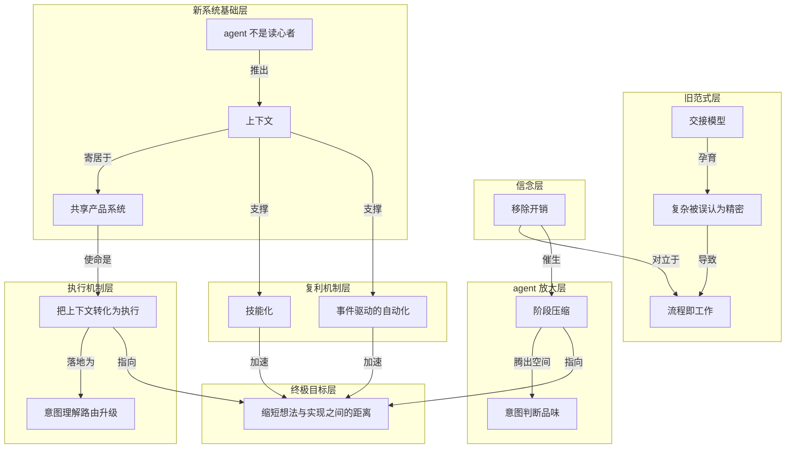

图分七层。旧范式层的交接模型是起点，经由"复杂被误认为精密"的心理捷径滑向"流程即工作"。信念层的移除开销与之正面对立，并催生 agent 放大层的阶段压缩，从而腾出空间给人发挥意图、判断与品味。新系统基础层由"agent 不是读心者"这一第一性原理推出上下文，上下文寄居于共享产品系统。执行机制层是共享产品系统的使命——把上下文转化为执行，并落地为意图理解、路由与升级。复利机制层的技能化与事件驱动自动化由上下文支撑，共同加速终极目标：缩短想法与实现之间的距离。

---
## 13｜[用 Skills 在 Claude Code 里搭建验证闭环](https://claude.com/blog/building-verification-loops-in-claude-code-with-skills)

> claude.com ｜ 主题特刊 ｜ 约 24 分钟 ｜ 9,448 字

**一句话主旨**：把重复检查写成 skill，并逐级接入自动验证闭环。

### AI 费曼示范

这篇文章回答的是：那些每次做完改动后总要手动做的检查，能不能别靠人记，而是让 Claude Code 自己执行？答案：把检查写成 skill，也就是一份“工作卡片”，再按需要它的频率，从手动调用一路升级到嵌入流程、串成链、最后在每次 PR（合并请求）上自动跑。

核心机制是：skill 里用大白话写清何时触发、检查什么、怎么报告和修。然后定接入位置：偶尔查就手动调；某个工作流固定要做就嵌进去；多个步骤要顺序交接就串成链，让上一步结束自动叫下一步；稳定后再放到每个 PR 上当门禁。这样检查从个人习惯变成系统契约，最后变成团队基础设施。

日常类比：像工厂把末道质检焊进流水线——以前每件产品你亲自量，现在机器做完顺手自检，报警才叫你。

作者承认的代价是：越自动越不灵活，链式会增加 token 开销，最好先小范围测试再大范围部署；链条频繁变动时也别急着上 PR 级门禁。

### 三级笔记

# 用 Skills 在 Claude Code 里搭建验证闭环

## 一句话主旨
把重复检查写成 skill，并逐级接入自动验证闭环。

## 作者试图回答的问题
如何把手动检查沉淀为 Claude Code 可自动执行的验证闭环？具体包括：怎样创建验证 skill；检查该以 standalone、embedded、chained、on every PR 哪种方式接入；怎样从个人检查升级为团队基础设施。

## 三级论证骨架
### 一、把验证步骤写成 skill：验证闭环的基本落点
#### 1.1 核心判断：重复检查应编码为 skill，让 Claude 自验证
- 开篇列举的典型场景：改完前端跑端到端验证、提交前安全扫描、发 PR 前无障碍审计。
  - 这些检查不该一直靠人记着做；最经济做法是写成 skill，让 Claude 执行「验证闭环」（verification loop）。
- 「验证闭环」指把产出后总要做的检查固化成可自动执行的一环，让 Claude 自己验证产物，而不是人每次手动补一回合。

#### 1.2 两条创建路径：skill-creator 访谈 / 手写 SKILL.md
- 最快方式：装 skill-creator 插件，让 Claude 反过来访谈工作流。
  - 示例调用：`/skill-creator Create a skill for verifying frontend changes end-to-end. Interview me about my workflow.`
- 也可手写：在项目 `.claude/skills/` 下丢一个 markdown 文件。
  - 最简单的验证 skill＝几行 frontmatter＋一段 body。
  - 例子 `verify-log-hygiene`，写在 `.claude/skills/verify-log-hygiene/SKILL.md`。
    - frontmatter：`name`；`description`（"Check that error logs include the request ID and never include the request body. Use when the diff touches error handling or logging."）；`allowed-tools: [Read, Edit, Grep]`。
    - body 用大白话写三件事：读当前 diff 的错误处理路径；确认每个 log 调用带 request ID，且不传 request body / headers / 任何用户提交的 payload；用 `file:line` 报告违规并修复——补缺失的 request ID、从 log 调用里剥掉 payload。
- `description` 里的 `Use when...` 决定 skill 何时被自动拉进来，是 embedded 模式能否生效的关键开关。

### 二、让检查匹配运行位置：由松到紧的四级升级阶梯
#### 2.1 总判断：四种接入方式不是并列选项，而是同一条升级路径
- standalone → embedded → chained → on every PR，由手动到自动、由松到紧。
- 驱动力是「你多频繁需要这个检查」。

#### 2.2 Standalone：产物存在后刻意手动调用
- 适合「不必每次都做」的横切检查：提交前安全扫描、发 PR 前无障碍审计、整个 repo 的 license-header 校验。
  - 这些检查希望在多个工作流里都能用，但不想每次代码改动都触发。
- 代价：每一次调用都仍是一个你得记着去做的回合（turn）。
- 升级信号：开始在每次改动后都跑它；到那时就该嵌入或链接。

#### 2.3 Embedded：作为产出 skill 的一部分自动触发
- 检查归属于某个特定工作流，工作流不用你开口就会跑它。
- 最简单的版本是在产出 skill 的 body 末尾加一行。
  - 例子 `scaffold-component`：在 `src/components/` 下脚手架一个 React 组件，含组件文件 `.tsx`、同目录测试 `.test.tsx`、`index.ts` 导出；末尾追加：创建组件文件后跑 eslint，并在报告完成前处理掉所有 error。
- 如何确认生效：在一个全新任务上调用该 skill，确认新步骤真的作为输出的一部分跑了。
  - 如果没跑，说明 skill 的 `description` 或前面的指令没有把这段追加检查「拉」进来。
- 硬边界：embedded 只对你能改的 skill 生效——自己写的，或项目级安装、`SKILL.md` 在你掌控下的。
  - 内置 skill 和插件托管的 skill（更新时会被覆盖）不适用，改用链式。
  - 跨工作流的检查不要嵌入，应保持 standalone。

#### 2.4 Chained：一个 skill 在自己结尾调用另一个
- 若干个「经过验证的交接」端到端跑下来。
- Anthropic 的 Claude Code 团队日常使用该模式：`/code-review` 抓 bug → `/simplify` 清理 diff → `/verify` 确认端到端行为；如果改动碰了 UI，自定义 `/design` 会对照 `DESIGN.md` 做检查。
- 也可给「你改不了的 skill」加验证：自定义包装（wrapper）skill，先调用原 skill，再调用验证 skill。
  - 例子 `safe-refactor`：先对当前 diff 跑 `/simplify`；`/simplify` 结束后，调用 `/verify-no-public-api-changes`。
- 从习惯到契约：原本靠自觉维持的"我总在 `/simplify` 之后跑 `/verify`"，变成由系统保证的"/simplify 结束时总会跑 `/verify`"。
  - 链条自己跑完整个开发循环，只有当有东西升级回你这里时，你才介入。
- 何时不链：当各步骤足够独立、你有时想只跑其中一个而不跑别的时——链式是拿灵活性换自动化。
  - 链式验证闭环会增加 token 开销，最好在大范围部署前先测试。

#### 2.5 On every PR：放到每个 PR 上，成为团队基础设施
- 一旦链条对自己的改动足够稳，同一套流程就能放到每个 PR 上跑。
  - 队友的改动会过和你一样的门禁，不管他有没有记得调用那条链。
- 基础设施和已写好的链是同一种东西：同样的 skills、同样的 rubrics、同样的标准，只是不再依赖作者本人的自觉。
- 这是验证「从个人基础设施变成团队基础设施」的点：你为省自己一周两分钟而写下的检查，现在在每一次改动上、为每个人省两分钟。
- 时机提醒：链条还在频繁变动时，先别上 PR 级门禁——每一次调整都会变成一个全团队可见的事件。

### 三、循环工程：一套与场景无关的一致流程
#### 3.1 统摄判断：无论自动化什么、在什么环境，验证闭环创建流程一致
- 六步：
  1. 挑出你这周做得最频繁的那个手动收尾动作。
  2. 先试内置 `/verify` skill，看它对流程有没有帮助。
  3. 用大白话把流程写下来，就像第一天把它交给一个新队友。
  4. 交给 skill-creator，或自己把 markdown 文件丢进 `.claude/skills/`。
  5. 在一个新任务上调用它，确认检查作为输出的一部分跑了，需要就迭代。
  6. 试验 skill 的链式化，做出一条端到端的验证流。

#### 3.2 收尾判断：编码越多，Claude 越容易第一次落在想要的地方
- 你能为 Claude 编码下来的越多，Claude 的回应就越经常在第一次就落在你想要的地方附近。
- 那些不再需要来回折腾的修正，会把注意力释放出来，去做那些没有任何 skill 能替你写下来的、只属于你个人的工作。

## 作者边界、反例与不确定性
- embedded 不适用于内置 skill 和插件托管 skill；跨工作流的检查应留在 standalone。
- 链式不适用时：各步骤足够独立、有时只想跑其中一个；链式增加 token 开销，部署前先测试。
- PR 级门禁的时机边界：链条仍频繁变动时先别上。
- 材料元数据存在不一致：页眉写作者为 Claude，正文核心观点写由 Claude Code 团队成员 Delba de Oliveira 撰写；原文未在正文澄清。

### 概念辞典

# 概念解析辞典

> 针对《用 Skills 在 Claude Code 里搭建验证闭环》（claude.com｜作者：Delba de Oliveira）的概念提取

## 一、核心概念

### 1. **验证闭环（verification loop）**

- **context**：全文的核心对象，指把「产出某个东西之后总要做的那个检查」固化成可自动执行的一环。

  > 每次做完一件事总要跟着做的那个检查——改完前端要跑的端到端验证、提交前的安全扫描、发 PR 前的无障碍审计——不该一直靠人记着做。最经济的做法是把它写成一个 skill，让 Claude 自己执行这个「验证闭环」（verification loop）。

- **费曼一下**：像流水线末端的质检工位。以前每做完一件产品你都得亲自拿卡尺量一遍；验证闭环就是把这道质检工序标准化、装到流水线上，让它自动量、自动挑出次品，你只在它报警时才出面。它是全文一切讨论的落点——后面所有 skill、接入方式，都是在回答「怎么把这道理做成」。

### 2. **把重复步骤编码成 Skill**

- **context**：把验证闭环落地的基本手段，也是后文四种接入方式共同的底座。

  > 把重复步骤编码进验证闭环，最常见的方式就是写成一个 skill

- **费曼一下**：把你脑子里「每次都要这么做」的那套动作，写成一张给助手看的工作卡片。写下来一次，以后助手照着卡片自己做，你不用每次都口头交代一遍。文章明确说这是「最常见的方式」，等于给出了「验证闭环用什么承载」这个问题的答案。

### 3. **skill-creator 访谈式创建**

- **context**：创建 skill 的一条落地路径——不手写，而是让 Claude 反过来问你。

  > 创建 skill 最快的方式，是装上 skill-creator 插件、让 Claude 反过来访谈你的工作流。
  >
  > /skill-creator Create a skill for verifying frontend changes end-to-end. Interview me about my workflow.

- **费曼一下**：不用自己憋着写说明书，而是让一个懂行的编辑坐下来采访你「你平时这活儿到底怎么干」，边问边帮你整理成规范。它解决的理解难点是：你不必先会写规范文档，也能把流程沉淀下来——这是「人人可写 skill」的入口。

### 4. **SKILL.md：frontmatter＋body 契约**

- **context**：skill 的最小结构，也是手写路径的具体形态。

  > 最简单的验证 skill＝几行 frontmatter＋一段 body。
  >
  > frontmatter 三件套：name；description……allowed-tools: [Read, Edit, Grep]。

- **费曼一下**：一张工作卡片分两半。上半是「标签栏」（叫什么、什么时候用、能动用哪些工具），下半是「操作步骤」。标签栏让系统知道何时该翻出这张卡，步骤栏才是真正要干的活。理解了这个结构，才看得懂后文为什么「description 没写好」会让检查不跑。

### 5. **description 作为触发条件**

- **context**：frontmatter 里最关键的一行，直接接管了后面 embedded 能否自动生效。

  > description（"Check that error logs include the request ID and never include the request body. Use when the diff touches error handling or logging."）
  >
  > description 里那句 "Use when..." 决定这个 skill 何时被自动拉进来，是后面 embedded 模式能否生效的关键开关。

- **费曼一下**：相当于卡片上的「适用场景」贴纸。写清楚「碰到 X 情况就翻我出来」，系统才会在对的时刻主动想起这张卡；贴纸含糊，卡片就躺在抽屉里没人用。文章排查嵌入失效时正是回到这一行——所以它是把静态文件接进动态工作流的开关。

### 6. **独立调用（Standalone）**

- **context**：四种接入方式里最松的一级——产物已存在后，由人刻意手动调用。

  > 你在产物已经存在之后，刻意地手动调用它。
  >
  > 它的价值在于那些「不必每次都做」的横切检查：提交前安全扫描、发 PR 前无障碍审计、整个 repo 的 license-header 校验。

- **费曼一下**：像家里的体重秤，想称的时候自己走上去。适合偶尔查一次的事。代价是每次都要你记着调用；当你发现自己「每次改动后都在跑它」，就是该升级到嵌入或链式的信号。它定义了这条阶梯的起点。

### 7. **嵌入（Embedded）**

- **context**：第二级——检查挂在产出物的那个 skill 身上，自动跟着跑。

  > 作为「产出物的那个 skill」的一部分自动触发。检查从此归属于某个特定工作流，工作流现在不用你开口就会跑它。
  >
  > 创建组件文件后，对它跑 eslint，并在报告完成之前处理掉所有 error。

- **费曼一下**：把质检直接焊进生产工序——工人组装完最后一步顺手就把自检做了，不需要另派人在旁边喊「记得检查」。检查和生产变成同一个动作。它的成立还依赖两个前提：description 能把它拉进来，且这个 skill 你得改得动。

### 8. **链式（Chained）**

- **context**：第三级——一个 skill 结尾调用下一个，串成端到端的自动流。

  > 一个 skill 在自己结尾调用另一个，若干个「经过验证的交接」端到端跑下来。
  >
  > /code-review 抓 bug，/simplify 清理 diff，一个 /verify skill 确认端到端行为，如果改动碰了 UI，一个自定义的 /design skill 会对照 DESIGN.md 里的规范做检查。

- **费曼一下**：像接力赛，每一棒跑到终点主动把棒递给下一棒，而不是停下来等裁判喊。它也承担一个特殊职责：给你改不了的 skill 加验证时，链式是唯一走得通的路。

### 9. **On every PR（每个 PR 上）**

- **context**：第四级，也是整条阶梯的终点。

  > 一旦链条对你自己的改动足够稳，同一套流程就能放到每个 PR 上跑。队友的改动会过和你一样的门禁，不管他有没有记得调用那条链。

- **费曼一下**：把个人自检清单升级成公司大门口的安检门。以前只有你出门会自觉检查，现在每个人进出都过同一道门，谁都绕不过去，也不靠谁「记得」。它和前三级是同一种基础设施，区别只在于不再依赖作者本人的自觉。

### 10. **可编辑性边界**

- **context**：决定你能走嵌入还是只能走链式的硬约束。

  > 硬边界：embedded 只对你能改的 skill 生效——你自己写的，或以项目级安装、SKILL.md 在你掌控下的那些。内置 skill 和插件托管的 skill（更新时会被覆盖）不适用这个模式；对那些，改用链式。

- **费曼一下**：你只能在自己的笔记本上写批注；图书馆里随时会换新版的公共书不能乱涂，涂了下次借到新版就没了。它是一条权限边界：先判断 skill 归不归你管，才决定用嵌入还是绕道链式——没有它，读者会以为四种接入方式可以随便挑。

### 11. **Wrapper skill（包装 skill）**

- **context**：绕过可编辑性边界的正解，属于链式的一种专门用法。

  > 链式也是给「你改不了的 skill」加验证的办法：做一个自定义的包装（wrapper）skill，先调用原 skill，再调用你的验证 skill。
  >
  > 先对当前 diff 跑 /simplify；/simplify 结束后，调用 /verify-no-public-api-changes。

- **费曼一下**：你不能改别人做好的黑盒机器，但可以给它套一个自己的外壳：外壳先把东西喂进黑盒，黑盒吐出结果后，外壳再接一道你自己的检查。机器没动，验证却加上了。它和「可编辑性边界」是一对——一个是限制，一个是绕行方案。

### 12. **习惯变契约（habit → contract）**

- **context**：链式在「人的行为」层面到底改变了什么。

  > 原本是一个靠自觉维持的习惯（"我总在 /simplify 之后跑 /verify"），变成了由系统保证的契约（"/simplify 结束时总会跑 /verify"）。
  >
  > 链条自己把整个开发循环跑完，只有当有东西升级回你这里时，你才介入。

- **费曼一下**：口头约定「我尽量记得锁门」和装一把「关门就自动上锁」的弹簧锁是两回事。前者靠你自律，后者靠机制兜底。链式的价值不在多跑一个检查，而在把「靠自觉」换成「靠系统保证」——这是理解升级路径为什么值得往上走的纵向理由。

### 13. **个人基础设施 → 团队基础设施**

- **context**：行为转变在「组织」层面的放大，也是整条阶梯的意义落点。

  > 这里就是验证「从个人基础设施变成团队基础设施」的那个点。你为省自己一周两分钟而写下的检查，现在在每一次改动上、为每个人省两分钟。

- **费曼一下**：你在自家门口修的一段台阶，原本只方便你自己；哪天它被并进小区的公共通道，就成了所有人每天都在用的设施。同一份投入，受益人从一个变成一群。它回答了「爬到 PR 级门禁到底图什么」。

### 14. **灵活性与自动化的权衡**

- **context**：给「越自动越好」这条直觉踩刹车的成本意识。

  > 链式是拿灵活性换自动化
  >
  > 链式验证闭环会增加 token 开销，所以最好在大范围部署之前，先测试这些闭环。
  >
  > 何时不链：当各步骤足够独立、你有时想只跑其中一个而不跑别的时

- **费曼一下**：自动挡和手动挡的取舍。全自动省心，但你没法临时只做半套动作；手动灵活，但事事得自己操心。而且越自动的档位越费油（token），所以铺开之前先小范围试一脚。它决定了这条阶梯不是无脑往上爬，每一级都有升级信号，也有「就停在这里」的例外。

### 15. **循环工程（loop engineering）**

- **context**：文章对这套方法论的统称，把所有前述概念收拢成一套固定流程。

  > 流程走顺之后，你就可以扩展你的「循环工程」（loop engineering）。
  >
  > 无论你在自动化什么、在什么环境里，验证闭环的创建流程都是一致的六步。

- **费曼一下**：把「让机器自己检查自己」当成一门可以反复练的手艺，而不是一次性的小聪明。招式不变——挑最烦人的重复动作、写成规则、装上、试跑、再串起来；能自动化的东西却越来越多。它是全文的最高一层：前面讲的是单个 skill 的做法，这里升维成可复用的方法。

## 二、概念架构图

全文是一台「从人工到自动、从个人到团队」的升级机器：目标是验证闭环，手段是把它写成 skill，然后沿着四级台阶往上爬；台阶上有边界阀门、行为与组织两层意义，还有一组踩刹车的张力，最后被「循环工程」统摄。

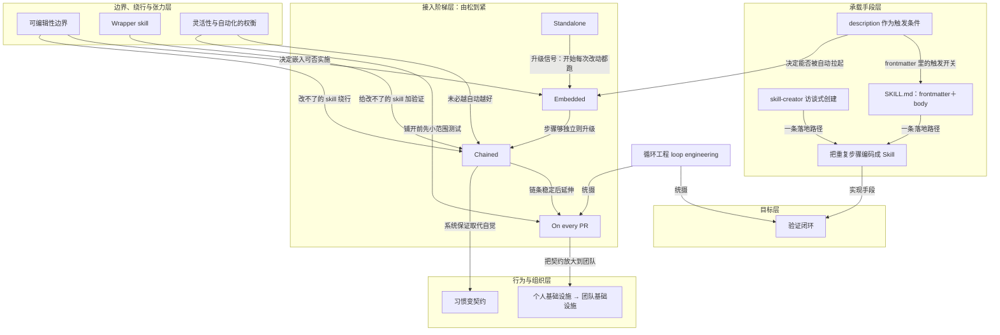

---
## 14｜[Agent Harness 的本质：把模型放进可控的执行系统](https://baoyu.io/translations/2026-05-10/akshay-pachaar-2041146899319971922)

> baoyu.io ｜ 主题特刊 ｜ 约 26 分钟 ｜ 10,488 字

**一句话主旨**：Agent 的本质是模型被放进可控执行系统 Harness。

### AI 费曼示范

这篇文章问的是：为什么同一个大模型，做出来的 Agent 有的能用有的不能用？答案是，Agent 的能力不是模型一个人的功劳，而是模型外面那套「执行系统」——**Harness**——共同产生的。用户看到的是会干活的 Agent，背后真正干活的是 Harness。

机制上，模型其实只会根据眼前看到的文字往下写。Harness 每一步替它把该看的东西拼好；如果模型输出的是工具调用请求，就去校验、在沙箱里执行、把结果当作「观察」塞回去，再进下一轮，直到满足退出条件。所谓**上下文窗口**，就是模型一次能看到的全部文字，是稀缺资源，塞满垃圾反而让它变笨，所以要压缩、按需加载。

打个比方：模型是个只动嘴的聪明工程师，Harness 是那间车间——图纸、工具、日志、安全闸门，还有做完必须拿卡尺量一遍的验收台。没有车间，他只能纸上谈兵。

作者也承认代价：步骤一多，错误会滚雪球，十个 99% 成功率的步骤串起来只剩约 90.4%；多 Agent 还会带来额外开销和信息损耗。所以 Harness 会随模型变强而变薄，但不会消失。

### 三级笔记

# Agent Harness 的本质：把模型放进可控的执行系统

## 一句话主旨
Agent 的本质是模型被放进可控执行系统 Harness。

## 作者试图回答的问题
核心问题：为什么 Agent 演示能跑、进入生产却失败？Agent 能力到底来自模型本身，还是模型外围的执行系统？如何构建生产级 Agent Harness？
关联子问题：Harness 是什么、由哪些组件构成、一次循环如何运转、主流框架如何实现同一骨架、模型增强后 Harness 如何演化。

## 三级论证骨架

### 一、问题诊断：生产失败暴露的是模型外围基础设施
#### 1.1 Demo 能跑，不代表系统能进入生产
- 许多开发者做过聊天机器人或 ReAct 循环，演示时看似顺畅。
  - 进入生产后常见失败：模型忘记几步前的动作，工具调用静默失败，上下文窗口被无意义信息填满。
- 作者把这些失败归因于模型外围的基础设施，而不是模型本身的单点缺陷。

#### 1.2 仅改 Harness 就能显著改变 Agent 表现
- LangChain 案例：模型和参数不变，仅改变包裹模型的底层架构，就让系统在 TerminalBench 2.0 上从 30 名开外提升到第 5 名。
- 另一项研究让大语言模型自行优化 Harness 架构，达到 76.4% 的通过率，超过人工精心设计的系统。
  - 结论：Agent 能力不是裸模型能力的直接外显，而是模型与执行架构共同产生的结果。

### 二、定义与定位：Harness 是模型之外的完整执行系统
#### 2.1 Harness 是模型之外的完整软件架构
- Harness 包裹在大语言模型之外，包含编排循环、工具、记忆、上下文管理、状态持久化、错误处理和护栏。
- Anthropic 和 OpenAI 都把 Agent/Harness 用来指代让大语言模型真正发挥作用的非模型架构。
- Vivek Trivedy 的定义公式：“如果某个部分不是模型本身，那它就是 Harness。”

#### 2.2 AI Agent 是行为体现，Harness 是背后机器
- AI Agent 是用户感知到的实体：它有目标、调用工具、尝试纠错。
- Harness 是产生这种实体行为的机器；开发者说“我做了一个 Agent”，实际含义通常是做了一套 Harness 并接入模型。
  - 因此，Agent 不是单个模型对象，而是模型与外围执行系统共同构成的应用形态。

#### 2.3 操作系统类比
- 原生大语言模型类似没有内存、硬盘和输入输出设备的 CPU。
- 上下文窗口相当于内存，外部数据库相当于硬盘，工具集成相当于设备驱动。
- Harness 则是操作系统：它把这些资源和机制组织起来，让模型从“能生成文本”变成“能执行任务”。

#### 2.4 围绕模型的三层工程化
- Prompt engineering：关注模型接收到什么指令；最靠近模型输入，但不足以解决完整执行系统的问题。
- Context engineering：关注模型在什么时间点能看到什么内容；它把上下文窗口视为稀缺资源，决定哪些信息进入窗口、哪些被压缩、检索或隐藏。
- Harness engineering：涵盖提示词和上下文，同时加入应用架构层面的设计；处理工具编排、状态持久化、错误恢复、验证循环、安全执行和生命周期管理。
  - 文章强调，Harness 不是提示词外面套一层壳，而是让 Agent 可以自主行动的完整系统。

### 三、生产级 Harness 的核心组件：把模型组织进可控执行系统
#### 3.1 编排循环：系统的心脏
- 实现 Thought-Action-Observation，也就是思考、行动、观察的连续过程。
- 技术上可能只是一个 while 循环，但复杂性来自循环内部要维护的状态、工具调用、错误反馈和退出条件。
- Anthropic 把运行时称为“笨循环”：智慧留给模型，Harness 管理回合切换。

#### 3.2 工具：Agent 的双手
- 工具以结构化模式暴露给模型，包括名称、描述和参数类型。
- 工具层要完成注册、校验、参数提取、沙箱执行、结果捕获和观察结果格式化。
- Claude Code、OpenAI Agents SDK 和 MCP 都体现了工具层在生产 Agent 中的中心位置。

#### 3.3 记忆：跨时间尺度保存信息
- 短期记忆是单次会话里的对话历史。
- 长期记忆跨越会话存在，可以表现为项目文件、memory.md、命名空间 JSON 存储、SQLite/Redis 会话存储等。
- Claude Code 的三层记忆包括轻量索引、按需主题文件和可搜索的原始对话记录。
- 设计原则：Agent 应把记忆看作提示，行动前仍要根据现实状态验证。

#### 3.4 上下文管理：防止上下文腐烂
- 许多 Agent 失败来自上下文窗口中的信号变差。
- 当关键信息处于窗口中间位置时，模型表现会下降；即使窗口达到百万级 token，指令遵循能力也会随上下文增长退化。
- 生产策略包括压缩、观察掩码、即时检索和子 Agent 委托。
- 目标：找到最小但信号最强的 token 集合。

#### 3.5 提示词构建：决定每一步模型能看到什么
- 提示词构建是分层的：系统提示词、工具定义、记忆文件、对话历史和当前用户消息共同进入输入。
- OpenAI Codex 使用优先级栈：系统消息、工具定义、开发者指令、用户指令、对话历史。
- 这说明 Harness 不只是拼接文本，而是在管理权限、优先级和上下文结构。

#### 3.6 输出解析：从自由文本转向原生工具调用
- 现代 Harness 依赖模型返回结构化 tool_calls，而不是解析自由文本。
- Harness 判断是否有工具调用：有则执行并继续循环，没有则把输出作为最终答案。
- 对结构化输出，OpenAI 和 LangChain 都支持用 Pydantic 等模型进行模式约束。

#### 3.7 状态管理：让任务可恢复、可追踪
- LangGraph 把状态建模为在图节点之间流动的类型化字典。
- Checkpointing 让系统中断后可以恢复，也让调试可以回到过去状态。
- OpenAI 提供应用内存、SDK 会话、服务器端 API、响应 ID 链等状态策略。
- Claude Code 倾向使用 Git 提交和进度文件作为存档点与草稿纸。

#### 3.8 错误处理：防止小错误滚成大失败
- 多步骤流程的整体成功率会随步骤数量下降；10 个 99% 成功率的步骤串联后，全流程成功率只有约 90.4%。
- LangGraph 将错误分为临时性错误、模型可恢复错误、用户可修复错误和意外错误。
- Harness 的错误处理不是简单报错，而是决定重试、反馈给模型、暂停等待人类，或上报调试。

#### 3.9 护栏与安全：模型想做什么，系统允许什么
- OpenAI SDK 有输入护栏、输出护栏和工具护栏。
- 一旦触发 tripwire，Agent 会立即停止。
- Anthropic 的结构把模型推理与权限执行分离：模型决定想做什么，Harness 决定能不能做。

#### 3.10 验证循环：生产级 Agent 的分水岭
- 验证循环区分玩具演示和生产级 Agent。
- Anthropic 推荐规则反馈、视觉反馈和 LLM-as-judge 三种验证方式。
- Claude Code 的创造者认为，让模型能够验证自己的工作，可以显著提升产出质量。

#### 3.11 子 Agent 编排：把探索和控制拆开
- Claude Code 支持克隆、队友、工作树三种子 Agent 模式。
- OpenAI 支持把 Agent 作为工具，或把任务移交给另一个专家 Agent。
- 子 Agent 的价值在于深度探索后返回压缩摘要，降低主上下文负担。

### 四、运行机制：一次 Agent 循环怎样被 Harness 控制
#### 4.1 循环步骤
- 第一步：Harness 组装完整输入。
- 第二步：模型基于输入生成 token，可能是文本，也可能是工具调用请求。
- 第三步：Harness 判断输出类型；没有工具调用则结束，有工具调用则进入执行。
- 第四步：工具执行层校验参数、检查权限、在沙箱中运行并捕获结果。
- 第五步：执行结果被打包为模型可读的观察消息，错误也会被转换成模型可以处理的反馈。
- 第六步：上下文被更新，必要时触发压缩。
- 第七步：循环返回第一步，直到满足退出条件。

#### 4.2 循环的关键含义
- Agent 的连续行动来自 Harness 对“推理、执行、反馈、再推理”的稳定组织。
- 模型不是直接控制外部世界；它通过 Harness 提供的接口、权限和反馈机制间接行动。

### 五、实现、架构决策与演化：同一骨架的不同表达，Harness 即产品
#### 5.1 主流框架如何实现同一套骨架
- Anthropic Claude Agent SDK：通过 query() 暴露 Harness；运行时保持简单循环，把智慧主要留给模型。
- OpenAI Agents SDK：代码优先策略，用 Python 表达工作流逻辑；支持函数工具、托管工具和 MCP 服务器工具。
- LangGraph：将 Harness 显式建模为状态图；优势是对流程、状态和恢复路径有更精细的控制。
- CrewAI：采用角色化多 Agent 协作，由流程层管理确定性骨干逻辑。
- AutoGen：支持顺序执行、群聊、移交和动态任务管理等多种编排方式。

#### 5.2 脚手架比喻与协同进化原则
- Harness 像脚手架：脚手架本身不盖房子，但让工人到达原本够不到的位置；Harness 本身不是智能来源，但让模型获得工具、状态、反馈和安全边界。
- 随着模型能力提升，Harness 的复杂度应该逐渐降低。
- 文章把这称为协同进化：模型训练已经开始考虑 Harness 的存在。
- 好的 Harness 设计能在模型升级时自然受益，而不是不断增加外围复杂度。

#### 5.3 定义 Harness 的七个架构决策
- 单 Agent vs. 多 Agent：官方倾向先充分挖掘单 Agent 能力；多 Agent 会引入额外开销和信息损耗。
- ReAct vs. 先规划后执行：ReAct 灵活，但成本高；先规划后执行速度更快，但灵活性不同。
- 上下文管理策略：总结对话，还是动态加载需要的信息。
- 验证循环设计：验证可以来自硬性的代码测试，也可以来自另一个 LLM 的评估。
- 权限与安全架构：在快速自动批准和安全逐步确认之间取舍。
- 工具范围管理：工具不是越多越好；给模型暴露当前步骤所需的最小工具集，往往效果更好。
- Harness 厚度：决定多少逻辑写死在系统中，多少逻辑交给模型发挥；Harness 厚度是一种架构下注。

#### 5.4 Harness 即产品
- 同一模型、不同 Harness，结果可能天差地别；TerminalBench 的证据表明，仅改变 Harness 就能让排名发生巨大变化。
- Agent 产品的差异不只是模型选择，也来自外围执行系统的设计质量。
- Harness 不是商品层，而是硬核工程能力：文章把它看作尚未被解决的工程问题。
- 关键挑战包括：如何把上下文当作稀缺资源管理，如何设计验证循环防止错误累积，如何构建不会产生幻觉的记忆系统。
- 即使模型越来越强，仍需要系统管理窗口、执行代码、保存状态并验证工作。

## 作者边界、反例与不确定性
- 作者没有主张模型不重要，而是主张生产级 Agent 的性能差异很大程度来自 Harness 设计，而不是单纯来自模型参数或提示词。
- 多 Agent 不是默认更优：官方倾向先充分挖掘单 Agent 能力；多 Agent 会引入额外开销和信息损耗。
- ReAct 与先规划后执行各有取舍：灵活与成本、速度与灵活性之间不同。
- 工具不是越多越好；暴露当前步骤所需的最小工具集，往往效果更好。
- Harness 会随模型增强而变薄，但不会消失；好的设计应让模型升级时自然受益，而不是不断增加外围复杂度。
- 记忆不是事实本身，而是提示；行动前仍要根据现实状态验证。
- 材料中“另一项研究”未给出研究名称、实验条件和可复现细节，76.4% 通过率与 TerminalBench 排名变化的适用条件在材料中未展开。
- 原文没有给出唯一最佳 Harness 架构；七个架构决策均以权衡形式出现，Harness 厚度被明确定义为一种架构下注。

### 概念辞典

# 概念解析辞典

> 针对《Agent Harness 的本质：把模型放进可控的执行系统》（Akshay，baoyu.io 翻译）的概念提取

## 一、核心概念

### 1. **Agent Harness**

- **context**：
  > “Agent harness 的核心是把模型放进包含循环、工具、记忆和上下文管理的可控执行系统里。”
  > “Harness 包裹在大语言模型之外，包含编排循环、工具、记忆、上下文管理、状态持久化、错误处理和护栏。”

- **费曼一下**：Agent Harness 是模型之外的完整执行架构。模型负责推理和生成，Harness 负责组织循环、暴露工具、管理记忆和上下文、保存状态、处理错误、设置护栏并验证结果。它解决的理解难点是：Agent 能连续行动，不是模型直接控制外部世界，而是 Harness 把模型接进了可控执行系统。

### 2. **AI Agent**

- **context**：
  > “用户感知到的是 AI Agent：一个有目标、会用工具、能纠错的实体。”
  > “AI Agent 是用户感知到的实体：它有目标、调用工具、尝试纠错。”
  > “Harness 是产生这种实体行为的机器”

- **费曼一下**：AI Agent 是用户看到的行为实体，不是单个模型对象。它由模型与外围执行系统共同构成。与 Harness 的关键区别是：AI Agent 是行为体现，Harness 是背后产生这种行为的机器。

### 3. **非模型架构（Non-model Architecture）**

- **context**：
  > “Vivek Trivedy 的定义公式是：如果某个部分不是模型本身，那它就是 Harness。”

- **费曼一下**：这是作者用来切分边界的定义。模型之外负责运行、组织、限制、连接、恢复和验证的部分，都属于非模型架构，也就是 Harness。它让读者不再把 Agent 问题只归结为模型本身，而看到外围基础设施。

### 4. **LLM-as-CPU / Harness-as-OS**

- **context**：
  > “原生大语言模型类似没有内存、硬盘和输入输出设备的 CPU。”
  > “上下文窗口相当于内存，外部数据库相当于硬盘，工具集成相当于设备驱动。”
  > “Harness 则是操作系统：它把这些资源和机制组织起来，让模型从‘能生成文本’变成‘能执行任务’。”

- **费曼一下**：这个类比说明 Harness 的位置。裸 LLM 像 CPU，会计算但缺少资源管理；Harness 像操作系统，把上下文、存储、工具和权限组织起来，使模型从生成文本变成执行任务。

### 5. **三层工程化：Prompt engineering / Context engineering / Harness engineering**

- **context**：
  > “提示词工程关注模型接收到什么指令。”
  > “上下文工程关注模型在什么时间点能看到什么内容。”
  > “Harness 工程涵盖提示词和上下文，同时加入应用架构层面的设计。”
  > “Harness 不是提示词外面套一层壳，而是让 Agent 可以自主行动的完整系统。”

- **费曼一下**：三层工程从指令、视野扩展到完整应用系统。提示词工程管模型收到什么指令；上下文工程管模型何时看到什么内容；Harness 工程涵盖两者，并加入工具编排、状态、错误恢复、验证、安全和生命周期。关键区别是工程范围递进，不是互相替代。

### 6. **编排循环（Orchestration Loop / TAO / ReAct）**

- **context**：
  > “编排循环实现 Thought-Action-Observation，也就是思考、行动、观察的连续过程。”
  > “技术上它可能只是一个 while 循环，但复杂性来自循环内部要维护的状态、工具调用、错误反馈和退出条件。”
  > “Agent 的连续行动来自 Harness 对‘推理、执行、反馈、再推理’的稳定组织。”

- **费曼一下**：编排循环是 Agent 的节拍器。模型先推理，Harness 执行动作，再把结果作为观察反馈给模型，循环重复直到退出条件。它解决连续行动的机制问题：Agent 不是一次生成就结束，而是由 Harness 稳定组织推理、执行、反馈、再推理。

### 7. **笨循环（Dumb Loop）**

- **context**：
  > “Anthropic 把运行时称为‘笨循环’：智慧留给模型，Harness 管理回合切换。”

- **费曼一下**：笨循环不是指系统粗糙，而是运行时设计策略：执行框架尽量简单，把推理和判断留给模型，Harness 只负责稳定推进回合、处理边界条件和退出。它说明 Harness 可以在保持简单循环的同时管理复杂执行。

### 8. **工具（Tools）**

- **context**：
  > “工具以结构化模式暴露给模型，包括名称、描述和参数类型。”
  > “工具层要完成注册、校验、参数提取、沙箱执行、结果捕获和观察结果格式化。”
  > “工具：Agent 的双手”

- **费曼一下**：工具是模型触达外部世界的手。Harness 把工具用名称、描述和参数结构暴露给模型，并负责注册、校验、权限检查、沙箱执行、捕获结果和返回观察。机制边界是：模型不直接控制外部世界，必须通过 Harness 提供的结构化接口行动。

### 9. **记忆与记忆即提示（Memory / Memory as Prompt）**

- **context**：
  > “短期记忆是单次会话里的对话历史。”
  > “长期记忆跨越会话存在，可以表现为项目文件、memory.md、命名空间 JSON 存储、SQLite/Redis 会话存储等。”
  > “Agent 应把记忆看作提示，行动前仍要根据现实状态验证。”

- **费曼一下**：记忆是短期会话历史和长期跨会话存储的组合。设计原则是记忆即提示：保存下来的内容不是事实本身，而是给模型的线索；行动前仍要验证现实状态。它解决任务延续与避免盲信历史之间的张力。

### 10. **上下文腐烂与迷失在中间（Context Rot / Lost in the Middle）**

- **context**：
  > “许多 Agent 失败来自上下文窗口中的信号变差。”
  > “当关键信息处于窗口中间位置时，模型表现会下降；即使窗口达到百万级 token，指令遵循能力也会随上下文增长退化。”

- **费曼一下**：上下文腐烂和迷失在中间描述的是窗口变大不等于信号变好。关键信息位置不佳或无关信息增多，会让模型更难抓住重点，执行质量下降。它解释为什么 Harness 必须治理上下文，而不是只扩大窗口。

### 11. **上下文治理策略：压缩、观察掩码、即时检索**

- **context**：
  > “生产策略包括压缩、观察掩码、即时检索和子 Agent 委托。”
  > “上下文工程的目标是找到最小但信号最强的 token 集合。”

- **费曼一下**：这些是防止上下文腐烂的机制。压缩在接近限制时总结历史，保留高信号信息；观察掩码隐藏旧工具输出但保留工具调用记录；即时检索只保留轻量标识符，需要时再加载具体内容。共同目标是找到最小但信号最强的 token 集合。

### 12. **状态管理与 Checkpointing**

- **context**：
  > “LangGraph 把状态建模为在图节点之间流动的类型化字典。”
  > “Checkpointing 让系统中断后可以恢复，也让调试可以回到过去状态。”
  > “OpenAI 提供应用内存、SDK 会话、服务器端 API、响应 ID 链等状态策略。”

- **费曼一下**：状态管理保存任务进展，让多步任务可恢复、可追踪。Checkpointing 是存档点，中断后可恢复，调试可回溯。没有它，任务中断可能归零；有了它，Agent 更像可运行、可恢复的系统。

### 13. **错误处理**

- **context**：
  > “多步骤流程的整体成功率会随步骤数量下降；10 个 99% 成功率的步骤串联后，全流程成功率只有约 90.4%。”
  > “LangGraph 将错误分为临时性错误、模型可恢复错误、用户可修复错误和意外错误。”
  > “Harness 的错误处理不是简单报错，而是决定重试、反馈给模型、暂停等待人类，或上报调试。”

- **费曼一下**：错误处理防止小错误滚成大失败。多步任务中成功率会累积下降，所以 Harness 要对错误分类，并决定重试、反馈模型、暂停等人类或上报调试。它不是简单抛错，而是把错误变成循环可处理的反馈。

### 14. **护栏与安全（Guardrails / Tripwire / 权限执行分离）**

- **context**：
  > “OpenAI SDK 有输入护栏、输出护栏和工具护栏。”
  > “一旦触发 tripwire，Agent 会立即停止。”
  > “Anthropic 的结构把模型推理与权限执行分离：模型决定想做什么，Harness 决定能不能做。”

- **费曼一下**：护栏回答模型想做什么与系统允许什么。输入、输出和工具调用都可以设检查；tripwire 触发后立即停止。权限执行分离是机制边界：模型只提出意图，能否执行由 Harness 决定。它让 Agent 的行动受控。

### 15. **验证循环（Verification Loops）**

- **context**：
  > “验证循环区分玩具演示和生产级 Agent。”
  > “Anthropic 推荐规则反馈、视觉反馈和 LLM-as-judge 三种验证方式。”
  > “Claude Code 的创造者认为，让模型能够验证自己的工作，可以显著提升产出质量。”

- **费曼一下**：验证循环让系统检查结果，而不是生成后直接结束。规则反馈、视觉反馈和 LLM 裁判是三种方式。它是生产级分水岭，因为能防止错误累积，并让模型能够验证自己的工作。

### 16. **子 Agent 编排（Subagent Orchestration）**

- **context**：
  > “Claude Code 支持克隆、队友、工作树三种子 Agent 模式。”
  > “OpenAI 支持把 Agent 作为工具，或把任务移交给另一个专家 Agent。”
  > “子 Agent 的价值在于深度探索后返回压缩摘要，降低主上下文负担。”

- **费曼一下**：子 Agent 编排把探索和控制拆开。主 Agent 可以派子 Agent 深入探索，子 Agent 返回压缩摘要，而不是把所有细节塞进主上下文。它同时是任务拆分和上下文治理机制。

### 17. **脚手架比喻（Scaffolding Metaphor）**

- **context**：
  > “脚手架本身不盖房子，但让工人到达原本够不到的位置。”
  > “Harness 本身不是智能来源，但让模型获得工具、状态、反馈和安全边界。”

- **费曼一下**：脚手架比喻说明 Harness 不是智能来源，而是支撑条件。它让模型到达单独够不到的执行高度：有工具、状态、反馈和安全边界。理解这个比喻，能避免把 Harness 误当成模型智能本身。

### 18. **Harness 厚度（Harness Thickness）**

- **context**：
  > “架构师要决定多少逻辑写死在系统中，多少逻辑交给模型发挥。”
  > “Harness 厚度是一种架构下注。”

- **费曼一下**：Harness 厚度是系统确定性与模型自由度之间的比例。写死更多逻辑，控制更强但可能更僵；交给模型更多，灵活但需要护栏和验证。它是架构师要做的下注。

### 19. **协同进化**

- **context**：
  > “随着模型能力提升，Harness 的复杂度应该逐渐降低。”
  > “模型训练已经开始考虑 Harness 的存在。”
  > “好的 Harness 设计能在模型升级时自然受益，而不是不断增加外围复杂度。”

- **费曼一下**：协同进化说明模型和 Harness 不是固定分工。模型变强后，Harness 可以变薄，但不消失；好的设计应随模型升级自然受益，而不是靠不断堆外围复杂度。

### 20. **Harness 即产品**

- **context**：
  > “TerminalBench 的证据表明，仅改变 Harness 就能让排名发生巨大变化。”
  > “Harness 不是商品层，而是硬核工程能力。”

- **费曼一下**：同一模型配不同 Harness，结果可能差很多。因此 Agent 产品的差异不只来自模型选择，也来自外围执行系统的设计质量。Harness 是尚未被解决的工程问题，不是简单商品层。

### 21. **定义 Harness 的七个架构决策**

- **context**：
  > “定义 Harness 的七个架构决策”
  > “Harness 厚度是一种架构下注。”

- **费曼一下**：七个决策包括单 Agent 与多 Agent、ReAct 与先规划后执行、上下文管理策略、验证循环设计、权限与安全架构、工具范围管理、Harness 厚度。它们是 Harness 设计的取舍边界：没有单一答案，架构师要在灵活性、成本、控制和安全之间做下注。

## 二、概念架构图

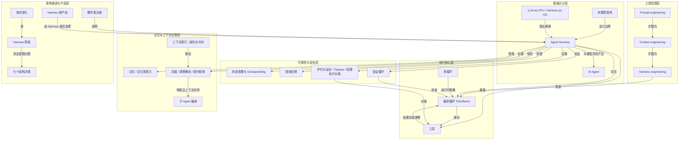

---
## 15｜[Coding Agent 如何工作：工具循环与上下文工程](https://simonwillison.net/guides/agentic-engineering-patterns/how-coding-agents-work/)

> simonwillison.net ｜ 主题特刊 ｜ 约 18 分钟 ｜ 7,227 字

**一句话主旨**：编码代理是外壳包裹无状态大模型的工具循环系统。

### AI 费曼示范

Coding agent 为什么能干活、为什么越用越贵？作者说它并不神秘：底层只是一个预测下一段文本的模型，外面套一层软件，反复喂上下文、替它真正执行命令。

关键是模型本身没有记忆，每次调用都从空白开始，只认 token（文本切成的计费小单位）。所谓连续对话，是外层软件把历史重新拼成一段 prompt 再发过去，看起来像在聊天而已。系统提示则是一份看不见的操作手册，写明角色、边界和能调用哪些工具。模型输出一句"我要读这个文件"，它并不能自己动手，是外层软件执行后把结果塞回下一轮上下文，如此循环——这就是工具循环。reasoning 只是给它更多计算预算，在难任务上多想几步。

好比一个失忆但很能干的实习生：每次只看你递到手上的那叠材料，说一句"帮我打开这个文件"，你就去打开、把内容加进材料堆，他再看下一句。

代价是：历史越长，每轮输入越贵，所以工程设计上要尽量不改早期上下文以命中缓存；搭个能跑的循环只要几十行，但要它可靠、可控、安全，才是真正的难点。

### 三级笔记

# Coding Agent 如何工作：工具循环与上下文工程

## 一句话主旨
编码代理是外壳包裹无状态大模型的工具循环系统。

## 作者试图回答的问题
coding agent 如何工作？其基本机制是什么，为什么能读代码、运行命令、调试，又为什么会变贵、出错、需要特定驱动方式？

## 三级论证骨架

### 一、地基：coding agent 的底层仍是 LLM
#### 1.1 LLM 是补全文本的模型
- 文章把 LLM 降维为：根据已有文本预测后续内容的机器学习模型。
  - 从句子补全到代码片段补全，能力差异来自模型规模、训练数据和上下文处理能力的增长。
  - coding agent 因此被还原为“可被 prompt 驱动的文本补全机器”。

#### 1.2 模型处理 token，不是自然语言中的词
- 文本先转成整数 token 序列，模型消费和生成的是 token。
  - 两个关键约束：供应商按 token 计费；一次能处理的上下文受 token 窗口限制。
  - 对 coding agent 而言，读文件、贴日志、追加对话都会变成更长的输入成本。

#### 1.3 prompt 与 completion 是所有交互的基本单位
- 输入是 prompt，输出是 completion 或 response。
  - 聊天界面、工具调用、系统提示，本质上都是更复杂的 prompt 编排。
  - 用户看到的是“对话”，模型看到的是一段按特定格式拼好的输入文本。

### 二、状态是模拟出来的：聊天界面、无状态与缓存
#### 2.1 chat template 只是 completion prompt 的特殊格式
- 产品把交互包装成 user / assistant 的聊天格式，但不改变模型本质。
  - 软件把历史消息拼成特殊格式 prompt，再让模型继续补全 assistant 的下一段内容。
  - 所谓“模型在聊天”，其实是 harness 在持续重建一段模拟对话。

#### 2.2 LLM 是无状态的，状态由外部软件维护
- 每次调用模型，模型都从空白状态开始。
  - 为维持连续对话，agent harness 必须把已有消息、工具结果和上下文重新发给模型。
  - 长对话越来越昂贵：输入 token 随历史增长，缓存命中成为工程优化重点。

#### 2.3 cached input tokens 反过来影响 agent 设计
- 供应商通常对近期重复的输入前缀提供更低价格，因为底层计算可复用。
  - coding agent 会尽量避免修改早期对话内容，以最大化缓存命中。
  - 一些看起来笨重的上下文组织方式，背后是在为成本和延迟做折中。

### 三、工具调用是 agent 的关键分界线
#### 3.1 agent 与普通 LLM 的分界是 tools
- 文章给出直接定义：agent 是能调用工具的 LLM 系统。
  - 工具不是模型内部天然能力，而是 harness 提供给模型的可调用函数。
  - coding agent 的工具通常包括读取文件、修改文件、执行 shell、运行 Python、搜索项目、访问外部 API 等。

#### 3.2 工具调用本质上是 prompt 协议
- harness 在 system prompt 里告诉模型：什么时候可以调用什么工具，以及调用格式。
  - 模型输出符合约定的工具调用文本，harness 解析、执行真实函数，再把结果塞回下一轮 prompt。
  - 模型并不是自己运行命令；它是在“请求”外层软件运行命令。

#### 3.3 工具结果重新进入上下文循环
- 工具执行结果会被包装成新的上下文消息。
  - 模型下一轮看到结果，再决定回答用户、继续调用工具，还是调整方案。
  - 实际工作方式：模型提出下一步，harness 执行，结果返回模型，如此循环。tool loop 是 agent 的“心跳”。

### 四、system prompt 是 agent 的隐形操作手册
#### 4.1 定义角色、边界和工具协议
- 用户通常看不到 system prompt，但它会在每次会话开始时注入一整套行为规则。
  - 这些规则可以很长，覆盖语气、任务边界、工具调用方式、文件编辑策略、安全约束和最终汇报格式。
  - coding agent 的“性格”和工作习惯，很大一部分来自这份“隐形说明书”。

#### 4.2 system prompt 与工具共同构成 harness 核心
- 只给模型工具还不够，还需要告诉它怎样、何时、以什么格式使用工具。
  - system prompt 把模型的自然语言能力导向一个可执行流程。
  - coding agent 的产品差异不只在模型，也在 prompts、工具集合、权限模型和循环控制。

### 五、reasoning 为复杂问题增加计算预算
#### 5.1 reasoning 是回答前花更多 token 思考
- reasoning 或 thinking 指模型在最终答复前，用额外步骤分析问题、比较路径、推演解决方案。
  - 价值不在于形式上像人思考，而在于给模型更多计算预算。
  - 对复杂代码任务，更多预算通常意味着更好的路径搜索和错误排查。

#### 5.2 debugging 特别依赖 reasoning 与工具混合循环
- 调试代码时，模型需要跟踪函数调用、读取日志、运行测试、定位异常来源。
  - reasoning 阶段帮助模型在多条线索之间维持假设，并决定下一次工具调用。
  - 这也是 coding agent 往往提供 reasoning effort 档位的原因：难题需要更多“咀嚼”时间。

### 六、总装：LLM + system prompt + tools in a loop
#### 6.1 最小 agent 的机械结构并不复杂
- 一个 LLM API、一份 system prompt、一组可调用工具、一个把工具结果回灌给模型的循环，就能构成基础版本。
  - 这个朴素描述让使用者看到 agent 的可解释边界。

#### 6.2 好的 tool loop 才是真正的工程难点
- 几十行代码可以做出简单工具循环，但可靠、可控、便宜、好用的循环要复杂得多。
  - 真实产品还要处理权限、错误恢复、上下文压缩、缓存、并发、用户确认、安全边界、工具输出格式和失败回退。
  - 所以 coding agent 的核心不是“模型会写代码”这一个点，而是整套 harness 工程。

## 作者边界、反例与不确定性
原文未给出明确反例或未解决矛盾；其边界集中在：模型并不自己运行命令，而是在请求外层软件执行；reasoning 的价值不是拟人化思考，而是计算预算；一些笨重的上下文组织方式是成本与延迟折中；多模态 / Vision LLMs 只扩展输入形态，不同输入最终仍进入模型可处理的 token 流，不改变核心机制。

### 概念辞典

# 概念解析辞典

> 针对《Coding Agent 如何工作：工具循环与上下文工程》（Simon Willison，simonwillison.net）的概念提取

## 一、核心概念

### 1. **LLM（Large Language Model）**

- **context**：文章先把 LLM 降维到最朴素的定义。

  > 它是能根据已有文本预测后续内容的机器学习模型。

- **费曼一下**：在本文里，LLM 不是“会写代码的助手”本身，而是一台根据已有文本继续补全文本的机器。coding agent 的全部高级行为，都要建立在这个补全能力之上。拿掉这个理解，读者就容易把 agent 误认成某种神秘新物种。

### 2. **tokens**

- **context**：模型实际消费和生成的是 token，而不是自然语言中的词。

  > 文本会被转换为整数 token 序列，模型实际消费和生成的是这些 token。

- **费曼一下**：token 是模型真正看到的输入和输出单位。本文用它解释两个关键约束：供应商按 token 计费，模型一次能处理的上下文受 token 窗口限制。对 coding agent 来说，读文件、贴日志、追加对话都会变成更长的输入成本。

### 3. **prompt / completion**

- **context**：输入和输出的基本单位。

  > 输入模型的是 prompt，模型返回的是 completion 或 response。

- **费曼一下**：本文把所有交互都还原成“构造一段 prompt，让模型补全一段 completion”。聊天界面、工具调用、系统提示，本质上都只是更复杂的 prompt 编排。理解这一点，才能明白用户看到的“对话”和模型实际看到的“格式文本”不是一回事。

### 4. **stateless（无状态）**

- **context**：模型本身不保存上一轮。

  > 每次调用模型时，模型都从空白状态开始。

- **费曼一下**：LLM 没有会话记忆。连续对话、工具结果、上下文连续性，都不是模型自己记住的，而是外层软件每次重新发过去。这个性质是解释 agent harness 为什么必须维护和重放历史的起点。

### 5. **chat templated prompts（聊天模板化提示）**

- **context**：聊天格式只是 completion prompt 的特殊包装。

  > 软件把历史消息拼成一个特殊格式的 prompt，然后让模型继续补全 assistant 的下一段内容。

- **费曼一下**：所谓“模型在聊天”，其实是 harness 在持续重建一段模拟对话。模型并没有天然理解 user / assistant 角色，它只是看到一段按模板拼好的文本，然后继续补全下一段。这个概念拆穿了聊天界面的表象。

### 6. **cached input tokens（缓存输入 token）**

- **context**：供应商对重复输入前缀提供更低价格。

  > 供应商通常会对近期重复的输入前缀提供更低价格，因为底层计算可以复用。

- **费曼一下**：因为 agent 每轮都要重放历史，如果前缀经常变化，成本会更高。cached input tokens 解释了为什么 coding agent 会尽量避免修改早期对话内容，为什么有些看起来笨重的上下文组织方式其实是在为成本和延迟做折中。它是上下文工程里的经济约束。

### 7. **harness（代理外壳）**

- **context**：文章用 harness 指包裹 LLM 的软件层。

  > harness：包裹 LLM 的软件层，负责维护状态、注入提示、暴露工具、解析工具调用并把结果送回模型。

- **费曼一下**：harness 是真正把无状态 LLM 变成 agent 的外层机器。它维护对话、注入 system prompt、提供工具、解析模型发出的工具请求，再把执行结果放回上下文。没有 harness，LLM 只是一次次独立的补全调用。

### 8. **tools（工具）**

- **context**：agent 与普通 LLM 的分界线是工具。

  > agent 是能调用工具的 LLM 系统。

- **费曼一下**：工具是 harness 提供给模型的可调用函数，比如读文件、改文件、执行 shell、运行 Python、搜索项目、访问外部 API。模型不自己运行命令，它输出符合约定的调用请求，由 harness 执行。工具让模型的文本输出变成真实世界里的动作。

### 9. **system prompt（系统提示）**

- **context**：用户通常看不到它，但它定义 agent 的行为规则。

  > system prompt 把模型的自然语言能力导向一个可执行流程。

- **费曼一下**：system prompt 是 agent 的隐形操作手册，规定角色、边界、语气、工具调用方式、文件编辑策略、安全约束和汇报格式。只给模型工具还不够，还要告诉它何时、怎样、以什么格式使用工具。它和工具一起构成 harness 的核心。

### 10. **reasoning / thinking（推理/思考）**

- **context**：reasoning 让模型在给出最终答案前花更多 token 分析问题。

  > reasoning 或 thinking 指模型在给出最终答复前，用额外步骤分析问题、比较路径、推演解决方案。

- **费曼一下**：在本文里，reasoning 的价值不是形式上像人思考，而是给模型更多计算预算。复杂代码任务和调试需要模型维持假设、追踪调用、比较路径，所以 coding agent 往往提供 reasoning effort 档位，让难题多花 token、简单任务少花 token。它增加了 agent 处理复杂问题的能力。

### 11. **tool loop（工具循环）**

- **context**：工具结果重新进入上下文，形成循环。

  > tool loop：模型请求工具、harness 执行、结果回灌、模型继续决策的循环。

- **费曼一下**：tool loop 是 agent 的心跳：模型提出下一步，harness 执行工具，结果回到模型，模型再决定下一步。coding agent 的实际工作方式就是如此循环。它把 LLM、system prompt 和 tools 连成一个可行动的软件系统。

### 12. **coding agent（编码代理）**

- **context**：文章把它定义为由 harness 包住的 LLM，并通过工具获得额外能力。

  > coding agent 并不是某种神秘的新物种。它的基本结构是：一个 LLM，被一层 harness 包住，再通过 system prompt、工具调用、状态重放和推理预算，变成可以读写代码、运行命令、调试问题的软件代理。

- **费曼一下**：coding agent 不是“一个会写代码的模型”，而是一套把模型接到文件系统、终端、代码执行器和项目上下文上的软件系统。本文的主旨就是拆开这套系统：底层仍是 LLM 补全，外层靠 harness、system prompt、tools、状态重放和 reasoning 把它组织成可循环行动的 agent。

## 二、概念架构图

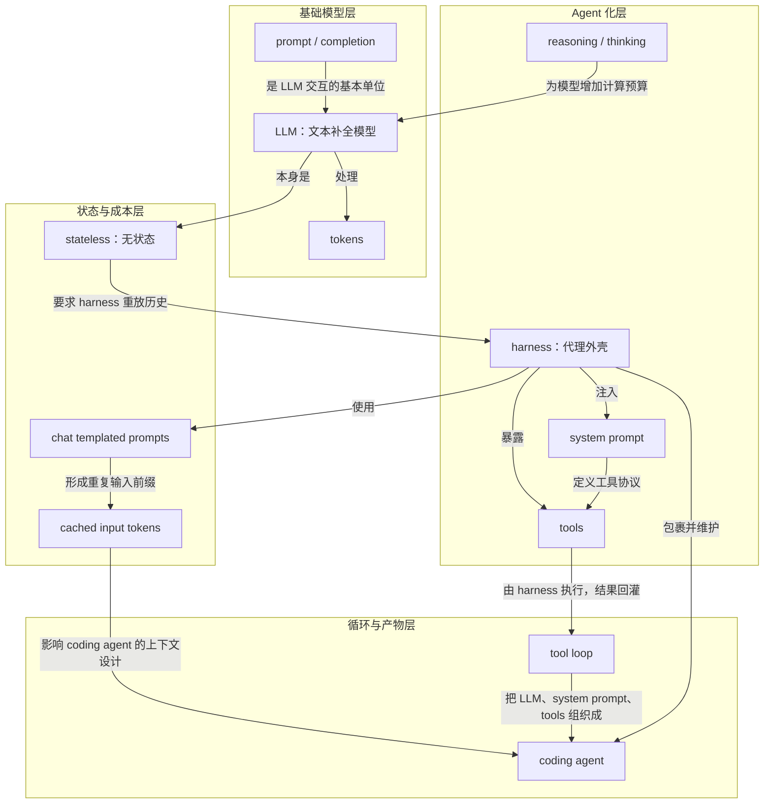

---
## 16｜[构建 Claude Code 的经验教训：如何让 Agent「看见」世界](https://www.anthropic.com/news/skills)

> anthropic.com ｜ 主题特刊 ｜ 约 16 分钟 ｜ 6,395 字

**一句话主旨**：构建 Agent 最难的是设计匹配其能力的行动空间。

### AI 费曼示范

文章问：给 AI 编程助手配什么工具，它才能真把活干好？答案是工具不是越多越好，而要恰好匹配模型的能力；办法是工程师把自己代入模型，「像 agent 一样看世界」，读它的输出、反复试验。

机制是：模型只能通过「调用工具」来行动，这套工具的集合就是它的行动空间。给少了它卡住，给多了它困惑。于是 Anthropic 一再推翻自己：提问工具改了三版，最后做成独立工具、由模型自己决定何时调用；早期要定时提醒它写待办，模型变强后待办反成束缚，便换成能共享、可依赖的 Task；过去把检索好的资料喂它，现在只给一个搜索工具让它自己翻。

这像带学徒：不是把整间五金店倒在他面前，而是先给一把他正好会使的，等他手艺长了再换。

作者也承认代价：这是艺术不是科学，没有固定规则，全看模型、目标和环境；对某个模型有效的设计，换个模型未必有效，今天顺手的工具明天可能就是枷锁。

### 三级笔记

# 构建 Claude Code 的经验教训：如何让 Agent「看见」世界

## 一句话主旨
构建 Agent 最难的是设计匹配其能力的行动空间。

## 作者试图回答的问题
- 核心问题：如何设计 agent 的 action space，使工具匹配模型自身能力？
- 关联子问题：
  - 如何知道模型的能力边界？
  - 如何提升 elicitation，提高人机通信带宽？
  - 模型变强后，旧工具为何会失效或变成约束？如何迭代工具集？
  - 如何让 agent 自己构建上下文，而非被给予上下文？
  - 能否不新增工具，仅通过 progressive disclosure 扩展行动空间？

## 三级论证骨架

### 一、总论点：action space 是构建 agent 最难的部分
#### 1.1 工具不是越多越好，而要匹配模型能力
- 好的工具设计是 "shaped to its own abilities"。
  - Claude 通过 Tool Calling 行动，原语包括 bash、skills、code execution 等。
  - 工具太少无法完成任务，太多则让模型困惑；关键是设计刚好匹配模型能力的工具集。
#### 1.2 设计方法：see like an agent
- 要知道模型能力，必须观察输出、阅读输出、反复实验，"see like an agent"。
  - 思维实验：面对难题想要什么工具？纸笔最基本但受限于手动计算；计算器更好但需会操作高级功能；电脑最强大但需会写代码。
  - 结论：工具要匹配模型能力边界；能力边界靠观察和实验了解。

### 二、案例 1：AskUserQuestion 的三次迭代
#### 2.1 目标：提升 elicitation
- 提升 Claude 提问能力，降低用户回答摩擦，提高人机通信带宽。
#### 2.2 前两次失败：计划中带问题、markdown 解析
- Attempt #1：在 ExitPlanTool 中加参数，附带一组问题。
  - 问题：Claude 同时生成计划和问题导致困惑；用户回答可能与计划冲突；Claude 是否需要调用两次？
- Attempt #2：修改输出格式，让 Claude 用特定 markdown 格式输出问题，再解析为 UI。
  - 问题：最通用但不可靠；Claude 会额外加句子、遗漏选项、换格式。
#### 2.3 成功：独立 AskUserQuestion Tool
- 任意时刻调用，触发 modal 阻塞 agent 循环，等待用户回答。
  - 好处：结构化输出、强制提供多选项、可组合（Agent SDK / skills 中引用）。
  - 最重要发现：Claude 似乎“喜欢”调用这个工具，输出效果好；即使设计再好，如果模型不理解怎么调用，也没用。
  - 启示：什么对一个模型有效，对另一个模型未必有效。

### 三、案例 2：从 Todo 到 Task 的演进
#### 3.1 早期：用 TodoWrite 保持任务追踪
- 开始时写 todo、完成时打勾。
  - 即便如此，Claude 仍会忘记待办，于是每 5 轮插入系统提醒。
#### 3.2 模型变强后：提醒从帮助变成约束
- Claude 不再需要提醒，但提醒反而让它觉得必须死板遵循列表，不去修改。
  - Opus 4.5 擅长使用 subagent，但多个 subagent 如何共享 Todo List？
#### 3.3 解决方案：Task Tool 替代 TodoWrite
- Todo 目标 "keeping the model on track"；Task 目标 "helping agents communicate with each other"。
  - Task 支持依赖关系、跨 subagent 共享更新、可修改和删除。
  - 关键教训：模型能力提升后，曾经需要的工具可能变成约束；要不断重新审视假设，持续迭代工具集。

### 四、案例 3：搜索界面——从 RAG 到 Grep
#### 4.1 早期 RAG 的问题
- 用 RAG 向量数据库为 Claude 提供上下文。
  - 问题：需要索引和配置，在不同环境中脆弱；上下文是“被给予的”，而非模型自己找到的。
#### 4.2 转变：Grep 让模型自己搜索、自己构建上下文
- 给 Claude 一个 Grep 工具，让它自己搜索代码库、自己构建上下文。
  - 核心模式：Claude 越聪明，越擅长在给定正确工具后自己构建上下文。
#### 4.3 Agent Skills 与 Progressive Disclosure
- 引入 Agent Skills 后，正式提出 Progressive Disclosure。
  - agent 通过探索逐步发现相关上下文；技能文件可引用其他文件，模型可递归读取。
  - 常见用法：在 skill 中添加搜索能力，如 API 使用说明、数据库查询方法。
  - 一年内，Claude 从“不太会自己构建上下文”进化到“能跨多层文件嵌套搜索，精确定位所需上下文”。

### 五、案例 4：Claude Code Guide Agent——不加工具也能扩展能力
#### 5.1 问题：Claude 不了解自身功能
- 问它如何加 MCP 或 slash command 会答不上来。
#### 5.2 排除方案：system prompt 与文档链接
- 放进 system prompt → 造成 context rot，干扰主任务写代码。
- 给文档链接让 Claude 自行加载 → 它会加载过多结果到上下文。
#### 5.3 最终方案：Claude Code Guide subagent
- Claude 被 prompted 在用户问关于自身的问题时调用这个 subagent。
  - subagent 有专门的搜索文档指令和返回格式。
  - 核心启示：通过 progressive disclosure，无需添加新工具就能扩展 agent 的行动空间。

### 六、总结与概念网络
#### 6.1 方法论总结：Art, not Science
- 设计 agent 工具没有一套固定规则。
  - 取决于三要素：模型本身、agent 的目标、运行环境。
  - 方法论：频繁实验，阅读输出，尝试新东西。See like an agent.
#### 6.2 概念关系（原文概念网络）
- Action Space 是全文核心问题；See Like an Agent 是设计 action space 的方法论；Tool Calling 是实现机制。
  - Elicitation 是解决人机通信的特定工具能力；Progressive Disclosure 是 action space 的扩展策略。
  - Agent Skills 是 progressive disclosure 的具体实现；Subagent 是 action space 的组织模式；Context Rot 是反面教训，解释为何不能简单往 prompt 塞东西。

## 作者边界、反例与不确定性
- 作者明确：设计 agent 工具没有固定规则，"Art, not Science"；取决于模型、目标、运行环境。
- 什么对一个模型有效，对另一个模型未必有效；AskUserQuestion 的成功用“似乎”描述，属于观察而非确定规则。
- 模型能力提升会让旧工具从帮助变成约束：Todo 提醒后来让 Claude 死板遵循列表；旧假设需重审。
- 排除方案构成反例：把自身功能放进 system prompt 导致 context rot、干扰写代码；给文档链接让模型自行加载会加载过多结果。
- RAG 方案被描述为需索引配置、环境脆弱、上下文“被给予的”而非模型自己找到。
- 原文未给出统一可复用的工具设计规则，也未说明这些案例是否适用于所有模型与环境。

### 概念辞典

# 概念解析辞典

> 针对《构建 Claude Code 的经验教训：如何让 Agent「看见」世界》（Anthropic）的概念提取

## 一、核心概念

### 1. **Action Space（行动空间）**

- **context**：作者在开篇把构建 agent harness 最困难的部分指向行动空间。

  > "One of the hardest parts of building an agent harness is constructing its action space."

- **费曼一下**：Agent 能做什么，取决于你给它的工具集合以及这些工具如何被使用。Action space 就是 agent 可采取行动的总边界：工具太少无法完成任务，工具太多或形状不对则让模型困惑。全文的核心问题，就是如何设计出刚好匹配模型能力的行动空间。

### 2. **See Like an Agent（像 Agent 一样看世界）**

- **context**：作者用它回答一个前提问题：怎么知道模型的能力边界在哪里。

  > "You want to give it tools that are shaped to its own abilities. But how do you know what those abilities are? You pay attention, read its outputs, experiment. You learn to see like an agent."

- **费曼一下**：设计工具不能只靠人类工程师的直觉。作者的方法论是观察模型输出、阅读它怎么使用工具、反复实验，逐渐理解模型看到的世界和它能处理什么。它是设计 Action Space 的方法论，贯穿 AskUserQuestion、Task Tool、Grep 等所有案例。

### 3. **Tool Calling（工具调用）**

- **context**：作者说明 Claude 与外部世界交互的方式，以及工具可以由哪些原语构成。

  > "Claude acts through Tool Calling, but there are a number of ways tools can be constructed in the Claude API with primitives like bash, skills and recently code execution."

- **费曼一下**：模型不能直接操作环境，必须通过调用工具来行动。Tool Calling 是 Action Space 的实现机制；bash、skills、code execution 等是工具原语，AskUserQuestion、Task Tool、Grep 则是具体的工具实例。

### 4. **Elicitation（信息引出／提问能力）**

- **context**：构建 AskUserQuestion 工具时，作者把目标定为提升 Claude 的提问能力。

  > "When building the AskUserQuestion tool, our goal was to improve Claude's ability to ask questions (often called elicitation)."

- **费曼一下**：Elicitation 是 agent 主动向用户提问、获取关键信息的能力。好的 elicitation 能降低用户回答问题的摩擦，提高人机通信带宽，让一问一答快速对齐。它属于 Action Space 中的人机交互维度，AskUserQuestion 是它的具体实现。

### 5. **Progressive Disclosure（渐进式披露）**

- **context**：引入 Agent Skills 后，作者把这种探索式获取上下文的方式正式命名。

  > "When we introduced Agent Skills we formalized the idea of progressive disclosure, which allows agents to incrementally discover relevant context through exploration."

- **费曼一下**：不是一次性把所有信息塞给模型，而是让模型通过探索逐步发现相关上下文。技能文件可以引用其他文件，模型递归读取所需内容。这个模式让 Claude 从被给予上下文，转为自己构建上下文，也让 Action Space 无需新增工具就能扩展。

### 6. **Context Rot（上下文腐烂）**

- **context**：作者解释为什么关于 Claude Code 自身的信息不直接放进 system prompt。

  > "We could have put all of this information in the system prompt, but given that users rarely asked about this, it would have added context rot and interfered with Claude Code's main job: writing code."

- **费曼一下**：往 system prompt 里塞太多不常用信息，会稀释模型对核心任务的注意力，干扰它真正要做的事。Context Rot 是设计 Action Space 时的反面教训，说明不能简单把所有信息堆进提示，而要靠 progressive disclosure 或 subagent 来处理。

### 7. **Subagent（子代理）**

- **context**：作者提到 Opus 4.5 更擅长使用 subagent 后，随之出现共享任务列表的协调问题。

  > "We also saw Opus 4.5 also get much better at using subagents, but how could subagents coordinate on a shared Todo List?"

- **费曼一下**：Subagent 是主 agent 生成的子任务执行者。多个 subagent 需要共享状态、协调进度，例如共享 Todo List，因此需要 Task Tool 这类支持依赖和跨 subagent 更新的设计。它是 Action Space 的一种组织模式，通过任务分解与协作扩展复杂能力。

### 8. **Agent Skills（代理技能）**

- **context**：作者描述 skill 文件如何被模型读取，并进一步引用其他文件。

  > "Claude could read skill files and those files could then reference other files that the model could read recursively. In fact, a common use of skills is to add more search capabilities to Claude like giving it instructions on how to use an API or query a database."

- **费曼一下**：Agent Skills 是写在文件中的技能说明书，告诉 Claude 在特定场景下怎么做。Skill 文件可以引用其他文件，模型递归读取，因此成为 Progressive Disclosure 的具体载体。常见用法是给 Claude 增加搜索能力，比如 API 使用说明或数据库查询方法。

## 二、概念架构图

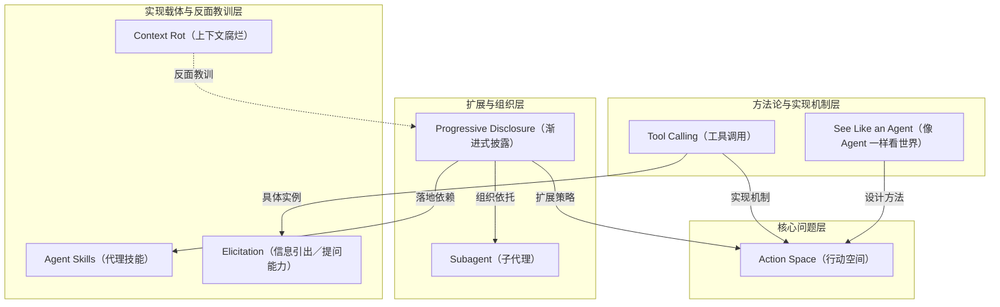

---
## 17｜[用持久化代码图谱给 AI Review 精准上下文](https://github.com/tirth8205/code-review-graph)

> github.com ｜ 主题特刊 ｜ 约 24 分钟 ｜ 9,527 字

**一句话主旨**：持久代码图谱按需给 AI 精准上下文，省 token 不降质量。

### AI 费曼示范

**一句话：** Claude Code 每做一次任务都要把整个代码库重读一遍，又慢又费 token。文章给的办法是在本地给代码建一张持久的地图，让它按图索骥，只读真正相关的那几块。

这张地图靠 **Tree-sitter** 搭起来——可以理解成一台把源代码拆成"语法树"的解析器；拆出的每个函数、类、导入、调用、继承和测试都成了图上的节点，而且随你保存文件、提交 commit 自动增量更新，只重画改动的那一小块。最关键的产物是 **blast radius（影响半径）**：你改了一行，它把这圈涟漪波及了哪些函数、文件和测试列清楚。于是 AI 拿到的是一份一两百 token 的结构化摘要，而不是整份源文件。基准测试里，代码评审平均省 6.8 倍 token，实际编码任务平均省 14.1 倍，仓库越大省得越多。

打个比方：以前是每次找东西都把整个仓库翻个底朝天，现在先有一张随时修订的货架图，直接走到那一排。

代价是：初次建图要花时间，500 个文件约 10 秒；而且它只认 12 种语言，想让它认识新语言得手动补语法词典。

### 三级笔记

# 用持久化代码图谱给 AI Review 精准上下文

## 一句话主旨
持久代码图谱按需给 AI 精准上下文，省 token 不降质量。

## 作者试图回答的问题
Claude Code 每次任务重读整个代码库造成低效与 token 浪费，能否用本地持续更新的代码图谱只读取相关部分？子问题包括：图谱如何构建、增量更新并暴露给 Claude；在 code review 与编码任务中实际能省多少 token、评审质量是否受损；如何安装、配置与扩展。

## 三级论证骨架

### 一、问题定位：整库重读浪费上下文，图谱是解法
#### 1.1 起点问题
- Claude Code 每个任务都要重新读取整个代码库（"re-reads your entire codebase on every task"），效率低、token 消耗大。
#### 1.2 解法与 headline
- 用 Tree-sitter 为代码库构建结构化图谱，增量追踪变化，让 Claude 只读取真正相关的部分（"reads only what matters"）。
- 三个生产级开源项目上：code review 场景平均节省 6.8 倍 token，编码任务平均节省 14.1 倍、峰值 49 倍。

### 二、核心机制：持久图谱 + 增量更新 + blast radius + MCP 工具层
#### 2.1 图谱映射与存储
- 图谱映射代码库里的每一个 function、class、import、call、继承关系和 test。
- 数据存在 .code-review-graph/ 目录下的 SQLite 文件里；不依赖外部数据库、无云端依赖。
#### 2.2 查询方式：先看图，再只读相关文件
- 用户要求 Claude 做 code review 或改动代码时，Claude 先查询图谱，判断什么变了以及这些变化依赖着什么（"what depends on those changes"）。
- 然后只读取相关文件及其 blast-radius 信息，而不是扫描全部代码；用户体验不变（"You continue using Claude Code exactly as before"），图谱后台自主运行。
- Blast-radius 分析精确显示任意改动影响到哪些 functions、classes、files；对应 MCP 工具 get_impact_radius_tool（变更文件的 blast radius）。
#### 2.3 增量更新与自动同步
- 增量更新只重新解析变化文件；后续更新在 2 秒内完成。
- 自动更新 hooks：每次文件编辑和 git commit 后自动更新图谱；Watch 模式持续在后台随代码变化更新。
- 构建速度：500 文件项目初次构建约 10 秒。
#### 2.4 三层接口
- Slash commands：/code-review-graph:build-graph（构建或重建）、/review-delta（评审自上次 commit 以来变化）、/review-pr（带 blast-radius 分析的完整 PR 评审）。
- CLI：install（注册 MCP server）、build、update（增量）、status、watch、visualize、serve。
- MCP 工具（图谱建好后 Claude 自动调用）：build_or_update_graph_tool、get_impact_radius_tool、get_review_context_tool、query_graph_tool、semantic_search_nodes_tool、embed_graph_tool、list_graph_stats_tool、get_docs_section_tool。
  - get_review_context_tool 产出 token 优化的评审上下文和结构化摘要，是 code review 场景核心产出。

### 三、验证一：Code Review 场景，平均 6.8x token 削减
#### 3.1 测试设计
- 基础：6 次真实 git commit。
- 图谱把读取整份源文件替换成一份 156～207 token 的紧凑结构化摘要，涵盖 blast radius、测试覆盖缺口、依赖链。
- 标准方式定义为读取全部改动文件加上 diff；评审质量按准确性、完整性、发现 bug 的潜力、可执行洞见打分（1～10 分制）。
#### 3.2 三仓库对比
- httpx（125 文件）：12,507 → 458 tokens，降低 26.2x；评审质量 9.0 vs 7.0。
- FastAPI（2,915 文件）：5,495 → 871 tokens，降低 8.1x；评审质量 8.5 vs 7.5。
- Next.js（27,732 文件）：21,614 → 4,457 tokens，降低 6.0x；评审质量 9.0 vs 7.0。
- 平均：13,205 → 1,928 tokens，降低 6.8x；评审质量 8.8 vs 7.2。

### 四、验证二：实际编码任务，平均 14.1x、峰值 49x
#### 4.1 测试设计
- 一个 agent 在同样三个仓库上执行 6 个真实编码任务（加功能、修 bug）。
- 图谱负责把 agent 指向正确文件、引导它避开无关文件。
#### 4.2 具体数据
- httpx 加限流器：14,090 vs 64,666 tokens，4.6x，跳过 58 个文件。
- httpx 修流式 bug：14,090 vs 64,666 tokens，4.6x，跳过 59 个文件。
- FastAPI 加限流器：37,217 vs 138,585 tokens，3.7x，跳过 1,120 个文件。
- FastAPI 修流式 bug：36,986 vs 138,585 tokens，3.7x，跳过 1,121 个文件。
- Next.js 加限流器：15,049 vs 739,352 tokens，49.1x，跳过约 16,000 个文件。
- Next.js 修流式 bug：16,135 vs 739,352 tokens，45.8x，跳过约 16,000 个文件。
#### 4.3 规模效应
- 图谱在每一个案例中都找到了正确文件。
- 节省幅度随仓库规模放大：125 文件项目约 4.6x，27,000+ 文件 monorepo 接近 49x。

### 五、落地、配置与可扩展路径
#### 5.1 安装与上手
- 两种安装：Claude Code Plugin（推荐）：claude plugin add tirth8205/code-review-graph；pip：pip install code-review-graph，再执行 code-review-graph install。
- 安装后需重启 Claude Code；依赖 Python 3.10+ 和 uv。
- 快速上手：在 Claude Code 中打开项目，说“Build the code review graph for this project”。
#### 5.2 支持语言与新增语言
- 支持 12 种语言：Python、TypeScript、JavaScript、Go、Rust、Java、C#、Ruby、Kotlin、Swift、PHP、C/C++。
- 新增语言：编辑 code_review_graph/parser.py，把新扩展名加入 EXTENSION_TO_LANGUAGE，并在 _CLASS_TYPES、_FUNCTION_TYPES、_IMPORT_TYPES、_CALL_TYPES 中加对应 node type 映射，附测试 fixture 后提交 PR。
#### 5.3 可选增强与排除
- 语义搜索为可选功能，通过 sentence-transformers 提供向量 embedding；安装可选依赖 pip install code-review-graph[embeddings]。
- 排除路径：仓库根目录创建 .code-review-graphignore，可排除 generated/**、*.generated.ts、vendor/**、node_modules/** 等。
- 交互式可视化：基于 D3.js 的力导向图，支持按 edge-type 切换和搜索。
- 许可协议：MIT License。

## 作者边界、反例与不确定性
- 基准范围：三个生产级开源项目、6 次真实 git commit、6 个真实编码任务；节省幅度随仓库规模放大，从 125 文件约 4.6x 到 27,000+ 文件接近 49x。
- 评审质量按准确性、完整性、发现 bug 潜力、可执行洞见（1～10）打分；原文未说明评分者、盲测方式或独立复现情况。
- 语义搜索是可选依赖；支持 12 种语言，新增语言需手动修改 parser.py 并提交 PR。
- 图谱本地存于 .code-review-graph/ SQLite，无云端依赖；.code-review-graphignore 可排除生成代码和第三方依赖。
- 原文未明确给出失败案例、不适用仓库类型、与其他 AI 编码工具或模型配合的边界。

### 概念辞典

# 概念解析辞典

> 针对《用持久化代码图谱给 AI Review 精准上下文》（github.com｜作者：GitHub）的概念提取

## 一、核心概念

### 1. **code-review-graph**

- **context**：文章标题工具本身，定位是解决 Claude Code 在每次任务中重复读取整个代码库的问题，并用 Tree-sitter 构建结构化代码地图、增量追踪变化，给 Claude 精准上下文。

  > Claude Code re-reads your entire codebase on every task
  >
  > It builds a structural map of your code with Tree-sitter, tracks changes incrementally
  >
  > precise context so it reads only what matters

- **费曼一下**：这是全文的主工具：先给代码库画一张随时更新的结构地图，让 AI 做评审或改代码时不必把整个项目重新翻一遍，而是按图找到该看的地方。

### 2. **Tree-sitter**

- **context**：文章开篇点明工具的解析基础，支持 12 种语言的解析都依赖这套底层技术。

  > It builds a structural map of your code with Tree-sitter

- **费曼一下**：Tree-sitter 是负责“读懂代码”的解析引擎，把不同编程语言的源代码拆成结构化的语法树。没有它，图谱就无法把函数、类、调用、继承等关系变成可查询的数据。

### 3. **持久化代码图谱（structural map / graph）**

- **context**：图谱映射代码库中的每一种结构，并持久保存在本地，供后续查询和增量更新使用，而不是每次任务临时生成。

  > maps every function, class, import, call, inheritance relationship, and test in your codebase

- **费曼一下**：它不是每次临时给代码拍快照，而是造一张长期存在、可以反复查阅、还会自己更新的“代码关系网地图”。这张图是全文替代“重新读取整个代码库”的核心数据结构。

### 4. **增量更新（incremental update）**

- **context**：文中反复强调这一机制，安装后图谱会随文件编辑和 git commit 自动更新，CLI 的 update 命令只处理变化文件。

  > tracks changes incrementally
  >
  > Incremental update (changed files only)
  >
  > Subsequent updates complete in under 2 seconds

- **费曼一下**：地图第一次画好后，以后只重新画发生变化的那几处，而不是把整张地图推倒重来。它让图谱能持续保持最新，又不需要付出全量重建的成本。

### 5. **Watch 模式与自动更新 hooks**

- **context**：CLI 的 watch 命令与自动更新 hooks 共同保证图谱始终和代码库同步，无需用户手动触发。

  > Auto-update on file changes
  >
  > Graph updates on every file edit and git commit without manual intervention
  >
  > Continuous graph updates as you work

- **费曼一下**：它解决的是“什么时候更新图谱”的问题：不是靠人记得手动按一下，而是像后台哨兵一样，你一保存文件、一提交 commit，它就自动把地图补上最新内容。

### 6. **Blast Radius（blast radius / 影响半径）**

- **context**：这是评审和编码场景共用的核心概念，读取相关文件时同时带上 blast-radius 信息；MCP 工具中专门有 get_impact_radius_tool。

  > reads only the relevant files along with their blast-radius information
  >
  > Blast radius of changed files
  >
  > Shows exactly which functions, classes, and files are affected by any change

- **费曼一下**：改动一行代码会像水波一样影响到哪些函数、文件、测试，blast radius 就是把这圈涟漪精确画出来。它让 AI 知道除了改动点本身，还应该关心哪些关联位置，是“精准上下文”的中间产物。

### 7. **Token 优化的评审上下文（get_review_context_tool）**

- **context**：这是图谱落地到 code review 场景的具体产出物，用一份紧凑的结构化摘要替代读取整份源文件。

  > a compact structural summary (156 to 207 tokens) covering blast radius, test coverage gaps, and dependency chains
  >
  > Token-optimised review context with structural summary

- **费曼一下**：它不是把整个改动文件甩给 AI 去读，而是先浓缩成一份几百 token 的“体检报告”，告诉 AI 这次改动影响了哪些地方、测试有没有覆盖、依赖链是什么样。读这份报告就够了，token 消耗自然大幅下降。

### 8. **MCP 工具层**

- **context**：图谱建好后，Claude 通过一组 MCP 工具自动与图谱交互；CLI 里也有 install 和 serve 命令负责注册与启动 MCP server。

  > Claude uses these automatically once the graph is built
  >
  > Register MCP server with Claude Code
  >
  > Start MCP server

- **费曼一下**：图谱本身只是一堆数据，MCP 工具层把它包装成 Claude 能直接调用的“接口菜单”。Claude 不需要理解图谱内部结构，只要按需调用对应工具就能拿到影响范围、评审上下文或查询结果。

### 9. **语义搜索（semantic search / embeddings）**

- **context**：作为可选特性出现，通过 sentence-transformers 提供向量 embedding，对应 MCP 工具中的 embed_graph_tool 和 semantic_search_nodes_tool。

  > Semantic search: Optional vector embeddings via sentence-transformers
  >
  > pip install code-review-graph[embeddings]
  >
  > Search code entities by name or meaning

- **费曼一下**：默认图谱查询按名字、调用关系精确匹配；语义搜索额外加一层“理解意思”的能力，让你可以用意思相近的描述找代码，而不必记住确切函数名。它是精确查询的可选补充。

### 10. **Review Quality 评分方法**

- **context**：基准测试用来验证“省 token 是否会牺牲评审质量”的量化手段，按准确性、完整性、抓 bug 潜力、可执行洞见打分。

  > Quality scored on accuracy, completeness, bug-catching potential, and actionable insight (1 to 10 scale)

- **费曼一下**：光说省了多少 token 不够，所以作者用一套打分标准给每次评审评分，证明省 token 的同时评审质量没有变差，甚至更好。它补上了效果验证中“质量没有牺牲”这一环。

### 11. **两组基准测试（Benchmark）**

- **context**：文章用三个生产级开源项目分别测试 code review 场景和实际编码任务，并给出 token 节省数据。

  > average 6.8x token reduction
  >
  > 14.1x average, peak 49x
  >
  > 125 files about 4.6x, 27,000+ files near 49x

- **费曼一下**：这是全文的量化证据：用真实仓库和真实任务测出节省幅度，并显示仓库越大节省越明显。没有它，读者无法判断“精准上下文”到底带来了多大效果。

### 12. **code-review-graphignore 排除配置**

- **context**：在仓库根目录创建 `.code-review-graphignore` 文件，可以排除生成代码、第三方依赖等不需要被索引的路径。

  > create a .code-review-graphignore file in your repository root
  >
  > generated/**, *.generated.ts, vendor/**, node_modules/**

- **费曼一下**：它跟 `.gitignore` 是同一个思路，只不过排除对象是“不需要被 AI 理解和索引的代码”。它决定图谱该覆盖什么、不该覆盖什么，是图谱的索引边界。

### 13. **多语言结构化解析（12 languages / node type mappings）**

- **context**：特性表列出支持的 12 种语言；贡献指南说明扩展新语言时要编辑 parser.py，并补充不同 node type 的映射。

  > Python, TypeScript, JavaScript, Go, Rust, Java, C#, Ruby, Kotlin, Swift, PHP, C/C++
  >
  > EXTENSION_TO_LANGUAGE
  >
  > _CLASS_TYPES, _FUNCTION_TYPES, _IMPORT_TYPES, _CALL_TYPES

- **费曼一下**：这个工具不是只认一种语言，而是给每种语言配一份“翻译词典”：哪种语法结构算类、哪种算函数、哪种算调用。想让它认识新语言，本质上就是往词典里加词条。它决定图谱能理解多少种语言，以及可扩展边界在哪里。

## 二、概念架构图

按原文关系重建为分层图：问题层触发工具，构建层生成并维护持久化代码图谱，暴露层通过 MCP 工具把图谱变成 Claude 可用的精准上下文，验证层用基准测试和评分方法证明效果。

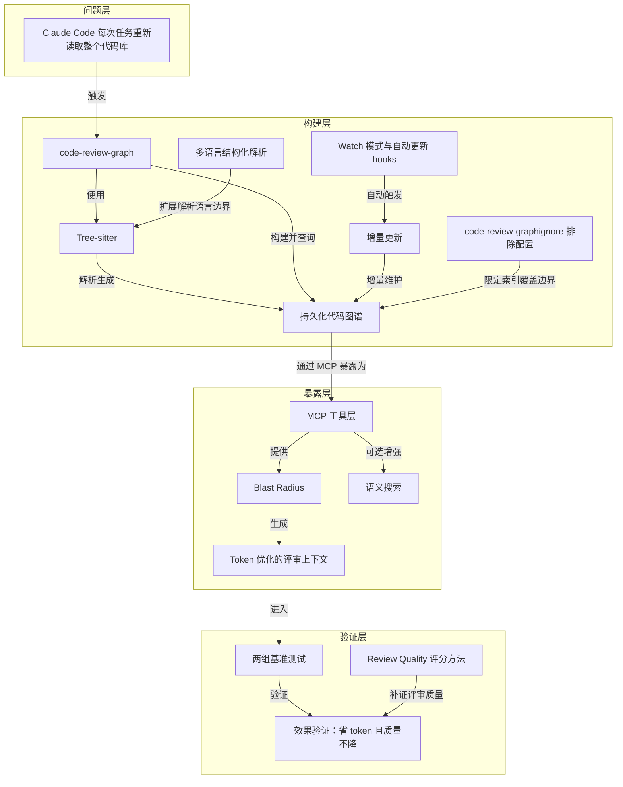

---
## 18｜[提示词缓存不是小优化，而是 agent 成本结构的关键变量](https://x.com/shachepi/status/2053463461729046817/?rw_tt_thread=True&s=12)

> x.com ｜ 主题特刊 ｜ 约 21 分钟 ｜ 8,393 字

**一句话主旨**：提示词缓存通过复用稳定前缀，改变长对话/agent 成本结构。

### AI 费曼示范

这篇文章在回答：为什么 Agent、编程助手一跑长就贵又慢？答案是它们每轮都在重复“读”几乎不变的超长前缀，而提示词缓存能复用这段前缀，从而降延迟、降成本。它缓存的是从请求开头到某个断点的稳定前缀，不是答案；只要前缀顺序或内容一变，后面缓存就失效，所以工具、系统指令、项目背景等稳定内容要放前，时间、状态、工具结果等变动内容要放后。

像你每天上班都把同一本厚手册从头背一遍再处理新任务。缓存等于把手册前半本背熟，之后只读新增便签；但若你每天偷偷改手册第一页，就得从头重背。

作者也承认代价：第一次写缓存比普通输入更贵，5 分钟是 1.25 倍、1 小时是 2 倍；短问题、低复用场景收益不明显，若为了压缩而打碎前缀，反而可能更贵。

### 三级笔记

# 提示词缓存不是小优化，而是 agent 成本结构的关键变量

## 一句话主旨
提示词缓存通过复用稳定前缀，改变长对话/agent 成本结构。

## 作者试图回答的问题
在 Agent 范式下，为什么提示词缓存不是 API 层小优化，而是成本、延迟和可扩展性的关键变量？系统应如何组织提示词与上下文，让稳定前缀持续被命中？

关联子问题：缓存到底缓存什么、命中条件是什么、Anthropic 的成本/TTL/门槛如何影响设计、怎样观测缓存是否生效。

## 三级论证骨架
### 一、问题重定义：Agent 范式让重复输入成为主要成本
#### 1.1 输入输出 token 比例反转
- Chatbot 范式下输入:输出约为 1:20；Agent 范式下反转为 200:1。
  - 每次请求都携带系统指令、工具定义、项目背景、历史对话、当前轮新增消息。
  - 长对话中绝大部分上下文与上一轮相同，模型仍要重新处理，推高首字延迟和输入 token 成本。
#### 1.2 Agent、编程助手放大重复处理
- 共同特征：系统提示长、工具 schema 多、对话历史持续追加，且在“观察—调用工具—读结果—规划—再调用”中循环。
  - 后果：同样预算下可运行轮次更少；同样轮次下响应更慢。

### 二、缓存机制：缓存的是稳定前缀，不是答案
#### 2.1 缓存对象是请求开头到缓存断点的完整前缀
- 下一次请求的前缀与之前足够一致，就能复用已处理内容，不再重复计算。
  - 前缀中间一旦变化，变更点之后的缓存都会失效。
#### 2.2 命中取决于“前缀稳定”，不是“语义相似”
- 缓存友好设计不是把意思写得类似，而是让请求开头的结构、顺序和内容尽量一致。
  - 稳定内容靠前：工具、系统指令、项目背景、大文档、示例集。
  - 动态内容靠后：当前时间、临时状态、工具结果、局部上下文等高频变化内容。
#### 2.3 Anthropic 的 tools → system → messages 顺序塑造 prompt 架构
- 工具定义在最前，最容易影响整个缓存前缀；系统提示居中，应尽量稳定；对话消息在后，适合承载每轮变化。
  - 工具定义变化、系统提示每轮被改、JSON key 顺序不稳定，都会让后面的缓存一起失效，局部变动变成全局 cache miss。

### 三、Anthropic 语境下的成本、TTL 与门槛
#### 3.1 缓存写入贵一点，命中读取便宜很多
- 5 分钟缓存写入是基准输入价格的 1.25 倍；1 小时缓存写入是 2 倍；缓存命中读取是 0.1 倍。
  - 第一次写入确实更贵，但后续只要复用，读取成本会显著下降。
  - 5 分钟缓存通常命中一次就很划算；1 小时缓存更适合复用时间更长、前缀又足够稳定的场景。
#### 3.2 TTL 不是越长越好，而是匹配工作流空档
- 默认 5 分钟适合连续追问，例如几分钟内围绕同一份长文档不断提问。
- 扩展 1 小时适合中间有较长空档的工作流，例如 Agent 读文件、跑测试、修改代码，隔 8 分钟后再回来继续。
  - 缓存有效期内再次命中会被刷新，且不会额外收费；连续多轮交互能自然维持缓存。
#### 3.3 最小可缓存 token 门槛因模型而异
- 纠正“新模型统一至少 4096 tokens 才能缓存”的误解：按作者引用文档，不同模型门槛有 4096、2048、1024 tokens 不等。
  - 如果 `cache_creation_input_tokens` 和 `cache_read_input_tokens` 都是 0，原因之一可能不是缓存没开，而是内容未达该模型的最小缓存门槛。

### 四、缓存友好的系统设计原则
#### 4.1 稳定内容前置，动态内容后置
- 最适合缓存：工具定义、系统指令、项目级背景、大文档、few-shot / many-shot 样例。
  - 这些内容处理成本高，跨轮复用价值大。
- 最不适合破坏稳定前缀：当前时间、每轮变化状态、临时文件列表、工具调用结果、当前轮局部上下文。
  - 它们可以出现，但应放在后面，避免污染可复用前缀。
#### 4.2 用消息表达变化，不要反复改系统提示
- 把当前时间、当前模式、当前状态直接写进系统提示，会把本该稳定的系统层变成每轮变化的动态层，缓存自然命不中。
  - 更稳妥做法：变化信息放进消息层，让固定指令保持不变。
#### 4.3 主对话保持模型稳定，分支任务独立运行
- 在同一条主对话里按“简单问题切小模型，复杂问题切大模型”看起来省钱，但之前积累的缓存往往不能直接复用。
  - 更合理结构：主链路保持模型稳定，维护缓存连续性；搜索、探索、辅助判断、子任务放到独立上下文运行。
#### 4.4 不要频繁增删或重排工具定义
- tools 位于缓存顺序最前面，工具定义本身就是缓存前缀的一部分。
  - 频繁加工具、删工具、重排工具，或让 JSON key 顺序不稳定，都会导致缓存失效。
  - 从缓存角度看，多带几个暂时不用的工具，可能比频繁修改工具定义更便宜。
#### 4.5 自动缓存和显式断点服务于不同复杂度
- 一般多轮对话可用 automatic caching。
- 如果上下文天然分成长期稳定层、中期变化层、短期动态层，显式断点更有价值。
  - 限制：最多 4 个 breakpoints，cache read 的回看窗口是 20 个 block；断点应放在真正稳定的边界上，不是越多越好。

### 五、压缩上下文不等于优化缓存
- “少带上下文”或把上下文压缩成摘要都可能有用，但如果破坏缓存前缀对齐，反而可能更贵。
- 成熟做法不是单纯追求越短越好，而是先保证主前缀稳定，再决定哪些内容需要摘要、压缩或延迟加载。
  - 摘要只是服务于稳定复用的手段，不是目的本身。
  - 代码库摘要、大文档摘要、工具延迟加载的目的，是降低重复处理成本，同时保留缓存可命中性，不是让 prompt 看起来更轻。

### 六、缓存命中率应该成为运行状态指标
- 如果系统成本、速度和体验高度依赖缓存，缓存命中率就不只是优化项，而应是常态监控指标。
- 建议关注：`cache_read_input_tokens`、`cache_creation_input_tokens`、首字输出延迟、某类请求的缓存命中率、版本上线后的命中率断崖变化。
  - 这些指标用于判断问题出在缓存没开、没到 token 门槛、断点放错，还是前缀本身不稳定。

### 七、日常场景直觉校准与最后收束
#### 7.1 场景直觉
- 连续追问同一份长文档：默认 5 分钟缓存往往够用，因为每轮命中都会续期。
- Agent 中间干活较久：5 分钟缓存可能过期，1 小时缓存更适合存在空档的工作流。
- 每轮改系统提示：等于持续改动稳定前缀，看起来规则在复用，实际缓存一直 miss。
- 短问题、短上下文、低复用请求：提示词缓存收益可能并不明显。
#### 7.2 作者最后收束的四个判断
- 缓存的对象是稳定前缀；前缀变化会影响后续缓存；真正值得缓存的是跨轮复用、稳定且处理成本高的内容；长对话系统的优化重点不是少带上下文，而是不要破坏可复用上下文。
  - 工程含义：提示词缓存看似只是 API 能力，但会反过来塑造 Agent、编程助手、文档问答和产品架构；系统不理解它也能跑，但对话变长、工具变多、上下文变重后，会直接表现为额度消耗快、响应慢和工作流不稳定。

## 作者边界、反例与不确定性
- 适用边界：提示词缓存最适合“前面有大段稳定内容、后面还会反复复用”的场景；短问题、短上下文、低复用请求收益可能不明显。
- 反例/限制：只压缩上下文或减少上下文，若破坏缓存前缀对齐，可能更贵；同一条主对话里切模型会使缓存难以复用；显式断点最多 4 个，cache read 回看窗口 20 个 block；不同模型最小缓存门槛不同。
- 不确定性：价格、TTL、门槛、断点与回看窗口均按作者引用的 Anthropic 文档/语境；原文未给出其他厂商机制、实测命中率数据或具体成本收益算例。“5 分钟缓存命中一次就划算”等说法未附详细测算。

### 概念辞典

# 概念解析辞典

> 针对《提示词缓存不是小优化，而是 agent 成本结构的关键变量》（来源：x.com；作者：UNKNOWN）的概念提取

## 一、核心概念

### 1. **提示词缓存（Prompt Cache）**

- **context**：文章把它放在长对话、Agent、编程助手和文档问答的成本结构里讨论。

  > “提示词缓存不是 API 层的小优化，而是长对话、Agent、编程助手和文档问答系统的成本结构变量。它真正缓存的不是模型答案，而是请求开头到缓存断点之间的稳定前缀；因此，系统能不能省钱、变快、跑得更久，不只取决于 prompt 是否短，还取决于上下文布局是否能持续保持前缀稳定。”

- **费曼一下**：在本文中，提示词缓存不是“把答案存起来”的小技巧，而是让模型不要每轮重新处理同一大段输入前缀。它改变的是长对话和 Agent 的成本结构：省下的是重复阅读已有上下文的计算，同时降低首字延迟，让同样预算能跑更多轮。

### 2. **Agent 范式下输入输出 token 比例反转**

- **context**：作者用 Chatbot 与 Agent 的对比说明缓存为何成为关键。

  > “在 Chatbot 的范式下，输入 Token 与输出 Token 的比例是 1:20。但到了 Agent 的范式，输入 Token 与输出 Token 的比例反过来了，而且扩大了很多倍，变成了 200:1。这背后的核心技术就是 Prompt Cache（提示词缓存）。”

- **费曼一下**：以前聊天机器人回答多、输入少；Agent 则每轮都携带很长的系统指令、工具、历史、文档，输出相对很少。输入重复处理成了主要成本来源，所以缓存从可选项变成关键变量。

### 3. **稳定前缀（Stable Prefix）**

- **context**：文章反复把缓存对象界定为请求开头到断点之间的稳定内容。

  > “它真正缓存的不是模型答案，而是请求开头到缓存断点之间的稳定前缀；因此，系统能不能省钱、变快、跑得更久，不只取决于 prompt 是否短，还取决于上下文布局是否能持续保持前缀稳定。”

- **费曼一下**：稳定前缀就是每轮请求最前面那块最好别动的内容。缓存复用的就是它。前缀越稳定，越容易命中；前缀一变，后面缓存也跟着失效。

### 4. **缓存断点（Cache Breakpoint）**

- **context**：断点界定缓存覆盖到哪里，也连接自动缓存与显式断点。

  > “提示词缓存不是把整段对话或上一次答案简单存起来，而是缓存从请求开头到某个缓存断点之间的完整前缀。”
  >
  > “最多 4 个 breakpoints，cache read 的回看窗口是 20 个 block。断点不是越多越好，而应放在真正稳定的边界上。”

- **费曼一下**：断点告诉系统“从请求开头到这里，这一整段可以作为缓存前缀”。它决定缓存边界；放错位置，比如放到动态内容后面，就会让缓存容易失效。断点也有限制，不是越多越好。

### 5. **前缀匹配 / 前缀稳定（Prefix Matching / Prefix Stability）**

- **context**：文章区分“语义差不多”和“前缀一致”。

  > “缓存命中的关键不是内容大致差不多，而是前缀是否稳定。也就是说，缓存友好设计不是把意思写得类似，而是让请求开头的结构、顺序和内容尽可能保持一致。”

- **费曼一下**：缓存不是按“意思相近”找回忆，而是按请求开头的结构、顺序、内容是否对得上来判断。即使意思一样，只要顺序、JSON key、前面某些内容变了，缓存也可能 miss。

### 6. **tools → system → messages 缓存顺序**

- **context**：Anthropic 的缓存顺序把 prompt 布局变成系统设计问题。

  > “文章以 Anthropic 为例说明，官方文档给出的缓存顺序是：tools → system → messages。”
  >
  > “如果工具定义变化、系统提示每轮被改、JSON key 顺序不稳定，都会让后面的缓存一起失效。一个看似局部的 prompt 变动，会变成全局缓存 miss。”

- **费曼一下**：缓存按从前到后的顺序建立。工具定义在最前，最影响整条缓存链；系统提示在中间，应尽量稳定；消息在最后，适合承载每轮变化。工具定义或系统提示乱变，后面消息再稳定也救不回来。

### 7. **缓存写入成本与命中读取成本（Cache Write Cost / Cache Hit Read Cost）**

- **context**：文章用 Anthropic 价格说明缓存的经济逻辑。

  > “5 分钟缓存写入是基准输入价格的 1.25 倍，1 小时缓存写入是基准输入价格的 2 倍，缓存命中读取是基准输入价格的 0.1 倍。”
  >
  > “因此第一次写入缓存确实更贵，但后续只要复用，读取成本就会显著下降。”

- **费曼一下**：写缓存像先建索引，第一次更贵；命中读取则便宜很多。它是否值得，取决于后续能不能反复复用同一段前缀。复用次数够多，长前缀就能回本。

### 8. **TTL（缓存生命周期）**

- **context**：TTL 要匹配工作流空档，而不是越长越好。

  > “官方支持默认 5 分钟和扩展 1 小时两种 TTL。5 分钟适合连续追问，例如用户在几分钟内围绕同一份长文档不断提问；1 小时适合中间有较长空档的工作流，例如 Agent 读文件、跑测试、修改代码，隔 8 分钟后再回来继续。”
  >
  > “如果缓存有效期内再次命中，缓存会被刷新，且不会额外收费。”

- **费曼一下**：TTL 是缓存能等你多久。连续追问通常 5 分钟够用，因为每轮命中会续期；Agent 中间读文件、跑测试、改代码花了较久，1 小时缓存更像保险。选择要看工作流有没有空档。

### 9. **最小可缓存 token 门槛（Minimum Cacheable Tokens）**

- **context**：文章纠正统一 4096 tokens 的误解，并把它用于排障。

  > “按作者引用的 2026 年 5 月 Anthropic 文档，不同模型门槛不同：有的模型是 4096 tokens，有的是 2048 tokens，有的是 1024 tokens。”
  >
  > “如果 cache_creation_input_tokens 和 cache_read_input_tokens 都是 0，原因之一可能不是缓存没开，而是内容没有达到模型的最小缓存门槛。”

- **费曼一下**：缓存不是任何长度都会触发。不同模型有不同最小 token 门槛。看不到 cache read/write 不一定是没开缓存，可能只是上下文太短，还没达到门槛。

### 10. **缓存友好布局：稳定前置、动态后置**

- **context**：文章把提示词组织方式直接变成系统设计问题。

  > “这直接把提示词组织方式变成系统设计问题：稳定内容要靠前，动态内容要靠后。工具、系统指令、项目背景、大文档和示例集应该优先放在可复用区域；当前时间、临时状态、工具结果、局部上下文等高频变化内容则应该尽量放到后面。”

- **费曼一下**：想让缓存命中，就把最可能跨轮复用的高成本内容放在请求前面，把每轮会变的内容放到后面。这样前面的稳定前缀不被污染，缓存才能持续命中。

### 11. **系统提示与消息层的稳定 / 动态分工（System Prompt / Messages Layer）**

- **context**：文章批评把动态状态写进系统提示，建议改放消息层。

  > “很多系统习惯把当前时间、当前模式、当前状态直接写进系统提示。文章指出，这会把本该稳定的系统层变成每轮变化的动态层，缓存自然命不中。更稳妥的做法是把变化信息放进消息层，让固定指令保持不变。”

- **费曼一下**：系统提示应该像稳定河床，放固定规则；消息层像动态水流，承载每轮变化。把时间、模式、状态写进系统提示，等于每轮拆一次缓存地基。

### 12. **缓存连续性（Cache Continuity）**

- **context**：文章用主链路与分支任务说明如何保护缓存链。

  > “主链路保持模型稳定，维护缓存连续性；搜索、探索、辅助判断、子任务等放到独立上下文里运行，避免污染主对话缓存链。”

- **费曼一下**：主对话的模型和前缀最好别乱切、别被分支任务污染，这样缓存才能滚动复用。需要探索或子任务时，另开独立上下文，不要打断主链路的缓存连续性。

### 13. **自动缓存与显式断点（Automatic Caching / Explicit Breakpoints）**

- **context**：两种断点策略服务不同复杂度的上下文。

  > “Anthropic 支持 automatic caching 和 explicit breakpoints。一般多轮对话可以用自动缓存；如果上下文天然分成长期稳定层、中期变化层、短期动态层，显式断点更有价值。”
  >
  > “最多 4 个 breakpoints，cache read 的回看窗口是 20 个 block。断点不是越多越好，而应放在真正稳定的边界上。”

- **费曼一下**：自动缓存让系统帮你找断点，适合普通多轮对话；显式断点让你手动标出长期稳定层、中期变化层、短期动态层的边界，适合复杂系统。但断点数量和回看窗口有限制，放置要克制。

### 14. **上下文压缩不等于缓存优化（Context Compression / Summarization）**

- **context**：文章给出反直觉判断：短不等于省，破坏前缀对齐可能更贵。

  > “很多系统会自然走向两条路：少带上下文，或把上下文压缩成摘要。文章认为这两条路都可能有用，但如果只想着压缩，却破坏了缓存前缀对齐，反而可能更贵。”
  >
  > “成熟做法不是单纯追求越短越好，而是先保证主前缀稳定，再决定哪些内容需要摘要、压缩或延迟加载。摘要只是服务于稳定复用的手段，不是目的本身。”

- **费曼一下**：压缩上下文本身不是目标，稳定复用才是目标。一个短但每轮都变的摘要，可能比稍长但稳定的前缀更贵。先保证主前缀稳定，再考虑摘要、压缩或延迟加载。

### 15. **缓存命中率（Cache Hit Rate）**

- **context**：文章把命中率从优化项提升为运行状态指标。

  > “如果系统成本、速度和体验高度依赖缓存，缓存命中率就不能只是优化项，而应该是常态监控指标。”

  文章建议关注的指标包括：
  > - cache_read_input_tokens
  > - cache_creation_input_tokens
  > - 首字输出延迟
  > - 某类请求的缓存命中率
  > - 版本上线后的命中率断崖变化

- **费曼一下**：缓存命中率是系统健康度仪表盘。它帮助判断问题出在没开缓存、没到 token 门槛、断点放错，还是前缀被动态内容打碎。长对话系统应把它当常规监控，而不是事后优化。

## 二、概念架构图

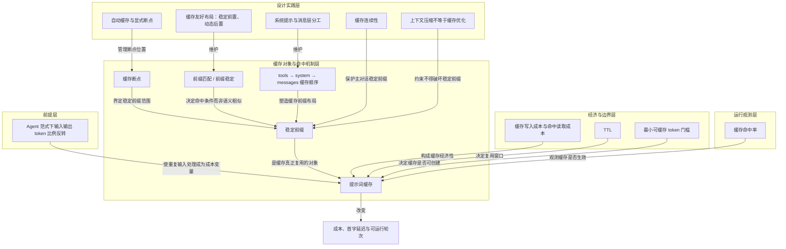

---
## 19｜[Claude Code 的 1M Context 让会话管理变成核心技能](https://x.com/trq212/status/2044548257058328723)

> x.com ｜ 主题特刊 ｜ 约 13 分钟 ｜ 5,290 字

**一句话主旨**：1M context 不放大理解力，session management 才是被放大的核心技能。

### AI 费曼示范

这篇文章回答的是：Claude Code 有了 100 万 token 的超长上下文之后，我们该怎么用它？答案不是"可以无限聊下去"，而是"会管理会话"才是真本事。

核心机制是这样的：上下文窗口是模型一次能看到的全部世界——系统提示、对话历史、工具输出、读过的文件。窗口越长，噪音越多，旧信息会干扰当前任务，作者管这叫"上下文腐化"。所以每轮结束你其实站在岔路口：继续、rewind 回退、clear 清空、compact 压缩，还是交给 subagent。走错路就用 rewind 抹掉重来，新任务就新开 session，那些中间输出一大堆、你只要结论的活儿，外包给 subagent 去做。

打个比方：compact 是让 Claude 帮你整理房间，clear 是你自己打包行李换房间。前者省力但有损，后者费力但可控。

作者承认的代价也在这儿：compact 由模型决定什么重要，它不知道你下一步要去哪，就可能把关键信息摘要掉；而上下文腐化最严重的时候，恰恰正是需要 compact 的时候。所以大窗口只是让你更晚撞墙，并没有取消腐化这件事。

### 三级笔记

# Claude Code 的 1M Context 让会话管理变成核心技能

## 一句话主旨
1M context 不放大理解力，session management 才是被放大的核心技能。

## 作者试图回答的问题
有了 1M context 之后，用户该如何管理 Claude Code 的 session（继续/回退/清空/压缩/交给 subagent）？为什么这件事比 prompt 技巧更决定输出质量？

## 三级论证骨架

### 一、1M context 反而让 session management 更重要
#### 1.1 大窗口改变的是用户行为的分布，不是问题本身
- Anthropic 更新 /usage 的背景：客户访谈发现不同用户管理 session 的方式差异很大。
- 作者把这些差异归结为一串选择，而非窗口大小：
  - 一直开一个长 session，还是每个任务都新开？
  - 何时继续、何时 /rewind、何时 /clear、何时 /compact、何时让 subagent 接手？
- 判断：这些选择本质都在管理同一件事——context window，且都影响输出质量。

#### 1.2 context window 是模型一次能看到的全部世界
- 构成：system prompt、当前对话历史、tool calls、tool outputs、已读取的文件。
- Claude Code 现在有 1M tokens 窗口，但仍是窗口，不是长期记忆。
- 反直觉判断：窗口越大不等于越聪明，反而越需要整理。

### 二、Context rot：长上下文自带代价
#### 2.1 上下文越长，噪音越拖慢模型
- 文章把 context 使用的代价称为 **context rot**：
  - 注意力被分散；
  - 旧的不相关信息干扰当前任务；
  - 长 session 后更容易忘记真正重要的约束。
- 由此推出：“继续聊下去”不总是最自然的正确选择。
- 限定：1M 只是让你更晚撞墙，没有取消“上下文会腐化”。

### 三、每一轮结束都是一个 branching point
#### 3.1 至少五条路径，而非只有“继续输入”
- **Continue**：同一 session 继续发消息。
- **/rewind**：跳回之前某条消息，从那里重新提示。
- **/clear**：新开 session，带自己提炼的 brief 重来。
- **Compact**：让 Claude 把当前 session 压成摘要再继续。
- **Subagents**：交给拥有干净上下文的新 agent，只带回结论。
- 作者的改写：把“下一步发什么 prompt”换成“下一步怎么处理 context”。

#### 3.2 新任务通常应新开 session
- 经验法则：**when you start a new task, you should also start a new session**。
- 1M context 让更长任务更可靠，例如从零构建一个 full-stack app。
- 任务已切换还沿用旧 session，往往带入不必要噪音。
- 例外：两任务相关且前一任务的部分 context 仍有价值，如刚实现 feature 接着写它的文档——开新 session 需重读刚改的文件，成本更高。

#### 3.3 Rewind 比“纠正”更干净
- 作者称：只选一个代表好 context management 的习惯，就是 **rewind**。
- 普通做法：Claude 读了 5 个文件、试方案 A 失败，你输入 “that didn’t work, try X instead.”
  - 代价：失败尝试和无效中间产物留在 context 里。
- 更好做法：rewind 到刚读完文件处，用刚学到的信息重新 prompt。
  - 例：“Don’t use approach A, the foo module doesn’t expose that — go straight to B.”
- 价值：保留有效发现，丢掉错误路径。

#### 3.4 Compact 与 clear 看似相似，实为两种减重
- **Compact**：模型自己总结对话，用摘要替换完整历史。
  - 优点：省力，可能记得你漏掉的细节；缺点：有损，由模型决定什么重要。
- **Clear**：自己写下真正重要的内容（当前目标、约束、相关文件、已排除方案）。
  - 优点：干净、可控；缺点：需要你亲自做抽象。
- 比喻：compact 是让 Claude 整理房间；clear 是你自己打包行李换房间。

#### 3.5 Bad compact 的根源：模型不知道你下一步去哪
- bad compact 常发生在模型无法预测工作方向时。
- 例：一段很长的 debugging 后，auto-compact 把重点总结成“刚才调试的主线”；你下一句却说 “now fix that other warning we saw in bar.ts.”——该 warning 非主线，可能已被摘要丢掉。
- 更麻烦：context rot 最严重时，往往正是需要做 compact 时。
- 推论：1M 的真正好处是给你更多时间**主动 compact**，并明确告诉它接下来要保留什么。

#### 3.6 Subagents 是 context management，不只是并行工具
- 价值不在“多一个 agent 干活”，而在它有独立的 fresh context window。
- 适合：会产生大量中间输出、但最终只需结论的任务。
- 心智测试：**will I need this tool output again, or just the conclusion?**
  - 只需结论，就让 subagent 读、查、验证、总结，把最终结果带回主 session。

### 四、总结性判断
- 每一轮交互本质上都是一次上下文治理决策。
- 1M context 降低爆窗频率，但没有取消 context rot。
- 好的使用者像管理项目一样管理 session：新任务新 session；错路用 rewind；长 session 主动 compact；复杂探索交给 subagent；关键 context 自己写 brief。
- 收尾判断：真正稀缺的不是 prompt 技巧，而是“这段上下文还值得继续带着吗？”

## 作者边界、反例与不确定性
- 明确反例：新任务新 session 并非绝对，相关任务且旧 context 仍有价值时（如刚实现 feature 接着写文档）沿用旧 session 成本更低。
- 明确限定：1M context“只是让你更晚撞墙”，并未改变 context rot 这一事实。
- 明确保留：compact 的缺点是“有损”，是否够用取决于模型能否预测你的下一步方向；bad compact 已被点出但作者未给出通用避免方法。
- 原文未给出的：1M 窗口在具体任务类型上的量化收益、五种路径的选择优先级（作者只给场景建议，未给排序规则）。

### 概念辞典

# 概念解析辞典

> 针对《Claude Code 的 1M Context 让会话管理变成核心技能》（Thariq Shihipar／x.com）的概念提取

## 一、核心概念

### 1. **Session Management（会话管理）**

- **context**：原文在客户访谈中反复出现的问题，直接指向会话管理方式的分歧。

  > What came up again and again in these calls is that there is a lot of variance in how you might manage your sessions, especially with our new update to 1 million context in Claude Code.
  >
  > Do you only use one session or two sessions that you keep open in a terminal? Do you start a new session with every prompt? When do you use compact, rewind or subagents? What causes a bad compact?

- **费曼一下**：本文中的 session management 不是开几个聊天窗口的小技巧，而是 Claude Code 的上下文治理能力。每个 session 都带着历史、工具输出、文件读取和错误路径；使用者要决定继续、回退、压缩、清空，还是把子任务交给 subagent。1M context 只把窗口变大，session management 才决定窗口里放什么、丢什么、什么时候换一个干净窗口。

### 2. **Context Window（上下文窗口）**

- **context**：原文把它定义成模型一次能看到的全部世界，并列出它包含什么。

  > context window 是模型一次能看到的全部世界
  >
  > context window 包含：system prompt、当前对话历史、tool calls、tool outputs、已读取的文件
  >
  > Claude Code 现在有 1M tokens 的 context window，但它仍然是一个窗口，不是长期记忆。

- **费曼一下**：在本文里，context window 不是长期记忆，而是模型一次可见信息的总和，也是 session 的工作记忆边界。它包含 system prompt、对话历史、tool calls、tool outputs、已读取文件。窗口再大也仍然是一个窗口，因此仍然需要整理。

### 3. **Context Rot（上下文腐化）**

- **context**：原文把上下文变长后的代价称为 context rot，并说明它为什么让 continue 不再是默认正确选择。

  > 文章把 context 使用的代价称为 **context rot**：context 变长后，模型注意力被分散；旧的、不相关的信息开始干扰当前任务；模型在长 session 后会更容易忘记真正重要的约束。
  >
  > 1M context 只是让你更晚撞墙，但不会取消“上下文会腐化”这件事。

- **费曼一下**：context rot 是上下文变长后的代价：噪音分散注意力，旧信息干扰当前任务，真正重要的约束更容易被忘掉。它解释了为什么一直 continue 并不总是好选择。大窗口只是推迟撞墙，没有取消腐化。

### 4. **1M Context（1M 上下文）**

- **context**：原文强调大窗口仍然有限，并且不会让模型自动变聪明。

  > Claude Code 现在有 1M tokens 的 context window，但它仍然是一个窗口，不是长期记忆。窗口越大，不代表模型越聪明；窗口越大，反而越需要整理。
  >
  > 1M context 只是让你更晚撞墙，但不会取消“上下文会腐化”这件事。

- **费曼一下**：1M context 在本文里是更大的缓冲区，不是免维护系统。它让长任务更可靠，降低爆窗频率，但没有取消 context rot；反而因为可以装更多东西，更需要主动管理上下文。

### 5. **Branching Point（分叉点）**

- **context**：原文把每一轮结束后的选择写成一个分叉点，并列出至少五种路径。

  > 当 Claude 完成一个 turn 后，你并不是只有“继续输入下一句”这一种选择。你至少有五种路径：
  >
  > **Continue**：在同一个 session 里继续发消息。
  >
  > **/rewind**：跳回之前某条消息，从那里重新提示。
  >
  > **/clear**：开始一个新 session，带着自己提炼好的 brief 重新开始。
  >
  > **Compact**：让 Claude 把当前 session 压缩成摘要，再继续工作。
  >
  > **Subagents**：把某个子任务交给拥有干净上下文的新 agent，只把结论带回主 session。

- **费曼一下**：branching point 是每个 turn 结束后的分叉点。本文把问题从下一步发什么 prompt，改写成了下一步怎么处理 context。Continue 只是默认路径之一，不是唯一路径。它承重，因为它把 session management 变成每一轮都可以操作的决策。

### 6. **Rewind（/rewind）**

- **context**：作者把 rewind 视为好 context management 的代表性习惯。

  > 作者说：如果只能选一个代表好 context management 的习惯，那就是 **rewind**。
  >
  > 更好的做法：rewind 到刚读完文件的位置；用你刚学到的信息重新 prompt；
  >
  > 例如：“Don’t use approach A, the foo module doesn’t expose that — go straight to B.”
  >
  > Rewind 的价值是：保留有效发现，丢掉错误路径。

- **费曼一下**：rewind 是回退到错误发生之前，再用刚学到的信息重新提示。它不是普通地纠正模型，而是把失败尝试和无效中间产物从 context 里删掉，只保留有效发现。承重之处在于，作者用它代表好上下文管理的核心动作。

### 7. **Compact（压缩）**

- **context**：原文把 compact 定义为让模型总结当前 session，并用摘要替换完整历史。

  > **Compact**：让模型自己总结到目前为止的对话；用摘要替换完整历史；优点是省力，Claude 可能记得你漏掉的细节；缺点是有损，模型决定什么重要。

- **费曼一下**：compact 是把长对话交给模型自己总结，然后用摘要继续工作。它省力，模型可能记得人漏掉的细节；但它是有损压缩，因为什么重要由模型决定。它和 clear 是两种不同的减重方式。

### 8. **Clear（清空）**

- **context**：原文把 clear 定义为由人自己写下关键内容，再开新 session。

  > **Clear**：由你自己写下真正重要的内容；例如当前目标、约束、相关文件、已经排除的方案；优点是干净、可控；缺点是需要你亲自做抽象。
  >
  > 简单说：compact 是让 Claude 整理房间；clear 是你自己打包行李换房间。

- **费曼一下**：clear 是开新 session 前，由人自己写 brief，提炼目标、约束、相关文件和已排除方案。它比 compact 更干净、更可控，但需要人亲自做抽象。关键区别是：减重由谁负责，以及是否保留使用者自己的意图。

### 9. **Bad Compact（劣质压缩）**

- **context**：原文解释 bad compact 为什么发生，以及它和 context rot 的关系。

  > bad compact 常发生在模型无法预测工作方向的时候。
  >
  > 更麻烦的是：context rot 最严重的时候，往往正是模型需要做 compact 的时候。
  >
  > 所以 1M context 的真正好处，是给你更多时间**主动 compact**，并明确告诉它接下来要保留什么。

- **费曼一下**：bad compact 是压缩后丢掉了下一步真正需要的信息。根源是模型不知道使用者接下来要去哪，于是按当前主线总结，可能把后续要用的细节删掉。更麻烦的是，context rot 最严重时又最需要 compact，所以人要主动压缩，并说明接下来要保留什么。

### 10. **Subagents（子代理）**

- **context**：原文把 subagent 解释为一种上下文管理手段，而不只是并行工具。

  > subagent 的价值不只是“多一个 agent 干活”，而是它有自己的 fresh context window。
  >
  > 它适合处理会产生大量中间输出、但最终只需要结论的任务。
  >
  > **will I need this tool output again, or just the conclusion?**
  >
  > 如果只需要结论，就让 subagent 读、查、验证、总结，再把最终结果带回主 session。

- **费曼一下**：subagent 在本文里是一个拥有干净上下文窗口的新 agent。它适合处理会产生大量中间输出、但最终只要结论的任务，从而避免主 session 被工具输出污染。心智测试是：以后还需要这个工具输出本身，还是只需要结论？承重之处在于，它把子任务外包和 context management 连在一起。

### 11. **新任务新 session（when you start a new task, you should also start a new session）**

- **context**：原文给出经验法则，并说明例外。

  > 作者给出的经验法则：**when you start a new task, you should also start a new session**。
  >
  > 但如果任务已经切换，继续沿用旧 session 往往会带入不必要的噪音。
  >
  > 例外是：两个任务相关，而且前一个任务中的部分 context 仍然有价值。
  >
  > 例如刚实现一个 feature，接着写这个 feature 的文档。

- **费曼一下**：这是 session management 的一条判断规则：任务切换时通常也开新 session，避免把旧任务的噪音带进来。例外是前后任务相关，且旧 context 仍然有价值，比如刚改完文件就写它的文档。它承重，因为它给出了何时新开、何时继续的判断边界。

## 二、概念架构图

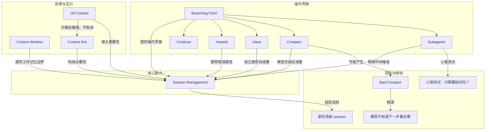

---
## 20｜[Claude Code 在读提示词前为何已发送 3.3 万 Token](https://systima.ai/blog/claude-code-vs-opencode-token-overhead)

> systima.ai ｜ 主题特刊 ｜ 约 29 分钟 ｜ 11,771 字

**一句话主旨**：Agent 成本由固定底座、请求次数与配置乘数决定，须在 API 边界审计。

### AI 费曼示范

这篇文章问的是：同一个模型、同一台机器、同一个任务，换个 Agent 外壳，Token 为什么能差近五倍？答案是外壳在读到你的问题之前，就先把系统提示和工具说明书发了出去。Claude Code 起步约 3.3 万 Token，OpenCode 约 7 千，差额几乎全来自工具定义。

要害在于每轮请求都要重发整个底座，所以总账是「起步价 × 请求次数 + 对话增长」。Claude Code 起步重，却能把多次操作并成一轮，3 次请求收工；OpenCode 起步轻，来回 9 次，总量反而略高。指令文件、MCP、子智能体继续往上叠，子智能体最贵：每个都要重配一套底座，父会话还要再读它们的汇报，同一任务从 12 万涨到 51 万。

类比打车：贵起步价但一趟直达，可能比便宜起步价绕九趟更省。缓存只是打折券，让单次阅读便宜，书并没变薄，上下文窗口照样被占满。

作者承认的边界是：这只是一台机器、一对版本、一个模型、小样本的 2026 年 7 月快照，提示词一变数字就过期；网关还曾静默替换指定模型，热启动数据不可靠，所以只引用冷启动锚点。

### 三级笔记

# Claude Code 在读提示词前为何已发送 3.3 万 Token

## 一句话主旨
Agent 成本由固定底座、请求次数与配置乘数决定，须在 API 边界审计。

## 作者试图回答的问题
为什么 Claude Code 在用户提示词前已发送约 3.3 万 token，而 OpenCode 约 7 千？同一模型、同一机器和同一任务下，不同 Coding Agent 的 token 成本、延迟和可用上下文为何差异巨大？总消耗由哪些层次决定，怎样可靠测量而非依赖体感或产品标签？

## 三级论证骨架

### 一、测量立场：在 API 边界重建请求，而非看体感
#### 1.1 Token overhead 同时是成本、延迟和上下文预算
- 固定底座不是只发一次；每轮请求都要重新发送或从缓存读取。
  - 初始差异会被多轮工具循环持续放大；每个 harness token 都挤占本可用于代码和任务信息的 working context。
- 生产 Agent 需回答“系统到底发送了什么”，不能靠 folklore。
  - EU AI Act Article 12 要求记录和理解系统行为；请求重建能力本身是治理基础。
#### 1.2 Logging proxy 同时抓 payload 与 usage
- 插在 harness 与模型 endpoint 之间，逐请求记录完整 JSON payload，以及 API 返回的 input、cache write、cache read、output usage。
  - Payload capture 回答“发送了什么”，usage block 回答“计费了什么”；两者结合才能把成本拆回 system prompt、tool schema、scaffolding、用户输入和会话增长。
  - 作者比喻为“不要只看电费账单，也要在电表前记录每台设备何时开启”。

### 二、实验设计：先隔离固定底座，再逐层加变量
#### 2.1 版本、模型与基线
- 对比 Claude Code 2.1.207 与 OpenCode 1.17.18，固定 claude-sonnet-4-5，时间快照是 2026 年 7 月。
  - Baseline 使用全新配置目录、无 MCP、无用户设置、无 memory、无 instruction file 的空 workspace，并绕过权限；之后每条 multiplier lane 一次只增加一个变量。
#### 2.2 任务与校准
- T1 只要求回复 OK，隔离固定开销；T2 读取已放置文件并摘要；T3 对 FizzBuzz 与检查脚本执行 write-run-test-fix 循环。
  - Zero-tools 变体关闭全部工具，把 system prompt 本体与 tool schema 权重分开。
  - 本地 gateway 每请求附加约 6,200 token 固定 envelope，用 bare calibration request 测出并扣除；payload 原始值不受 gateway 影响。
  - 组件 token 估算按各 harness 冷缓存 anchor 推导出 4.1 到 4.4 characters per token 的实测比例。

### 三、固定底座：Claude Code 主要重在工具 schema
#### 3.1 首轮底座差距近 4.8 倍
- 22 字符任务，Claude Code 首轮 calibrated payload 约 32,800 token，OpenCode 约 6,900 token。
  - Claude Code system prompt 为 27,344 字符、3 个 block；OpenCode 为 9,324 字符、1 个 block。
  - Claude Code 携带 27 个工具、99,778 字符 schema；OpenCode 携带 10 个工具、20,856 字符。约 24,000 个 Claude Code 底座 token 来自工具定义，OpenCode 对应约 4,800。
  - 作者比喻为“像打车的起步价，车还没走就已经计费”；Agent 的起步价不仅占钱，也占上下文座位。
#### 3.2 Claude Code 还注入首条消息脚手架与平台工具
- 实际用户提示词前注入 7,997 字符的三个 <system-reminder>：delegation agent catalogue、available skills catalogue 与 user context；OpenCode 没有对应首条消息脚手架。
  - 工具不只是基础编码能力，还包含 CronCreate、Monitor、Task family、worktree 管理与 push notification 等后台 Agent 和编排套件；32.8K 是平台 bootstrap，而非用户任务本身。
#### 3.3 关闭工具后仍有纯 harness prompt 差距
- Claude Code 仍有 26,891 字符、约 6.5K token；OpenCode 为 8,811 字符、约 2.0K token。
  - 残余差距来自语气、安全、任务管理和环境说明等 behavioural doctrine。

### 四、任务级成本：小任务放大底座，多步任务可能被批处理反转
#### 4.1 公式与 T2
- 总输入近似为 baseline × request count + conversation growth。
  - T2 中两个 harness 都给出正确结果；Claude Code 发 6 次 HTTP request，累计 metered input 约 199K；OpenCode 发 4 次，累计约 41K，另有一次用于会话标题的 Haiku side call。
  - 即使 cache read 只按 input price 十分之一计费，首轮 cache write、每轮 cache read 和 context-window consumption 仍随 payload 或请求次数增长。
  - 33K 底座意味着在任何代码进入对话前，每轮已占用 200K context window 约六分之一。
#### 4.2 T3 反转：批处理改变结论
- T3 中 Claude Code 用 3 次模型请求完成，累计输入约 121K；OpenCode 用 9 次请求加 1 次标题调用，累计约 132K。
  - Claude Code 把两次文件写入和两次脚本执行压进一个 parallel tool round trip；OpenCode 每轮只调用一个工具，反复支付较小的约 7K 底座。
  - 大底座但积极批处理，可能战胜小底座但严格串行；“首轮谁更轻”不能直接推出“整项任务谁更省”。
  - 作者比喻为单程车票便宜不代表整趟行程便宜；来回九次可能比贵票但只跑三次花得更多。
#### 4.3 scaffolding 随轮次增长
- Claude Code 首轮 3 个 <system-reminder>，第一次工具往返后增至 4 个。
  - OpenCode 每轮新增的约 400 到 2,200 字符主要是纯会话内容。

### 五、配置乘数：instruction、MCP、workflow、subagent 叠加
#### 5.1 Instruction file 是对两种 harness 都对称的大乘数
- 在 workspace 放入真实生产仓库的 72KB 指令文件后，两个 harness 每请求都增加略高于 20K token。
  - OpenCode metered total 从 13,152 增至 33,336；Claude Code 从 39,005 增至 59,243；对原本 lean 的 harness，单个重指令文件几乎把底座放大到四倍。
  - 加载机制不同：Claude Code 2.1.207 忽略 AGENTS.md，只有改名为 CLAUDE.md 才摄入，并把内容注入首条 user message；OpenCode 同时识别两个文件名，注入 system prompt。
  - Instruction file 是否生效可能静默失败；需在请求边界确认真正进入 payload 的文件名与内容。
  - 它不是一次性启动费，而是“文件大小 × 请求次数”的持续税。
#### 5.2 MCP 与工作流模板把静态说明扩展成重复载荷
- 小型、公开且无凭据的 MCP server，每个每请求增加约 1,000 到 1,400 token；两种 harness 承担的 tax 近似相同。
  - 五个 server 使 Claude Code payload 增加约 4,900 token，OpenCode metered 增加 6,967 token；工具数分别从 27 增至 69、从 10 增至 52。
  - 生产 MCP 的 API 更丰富，schema 往往比小型 server 大数倍。
  - Claude Code 在 print mode 下还会静默忽略 project-scoped .mcp.json，除非显式传入 --mcp-config；再次说明“已配置”不等于“已附加”。
- Story-driven workflow framework 会把 slash command 展开为 persona、protocol 与 checklist。
  - 代表模板 8,405 字符，约 2,100 token；进入 conversation history 后，后续每个请求都会携带；一个 9-request session 会重发 9 次。
  - 真实成本不是模板本身大小，而是 template size × request count，并继续叠加在 harness、instruction 与 MCP 底座上。
#### 5.3 Subagent 是实验中最大的 token 乘数
- 同一小任务直接执行时，Claude Code 累计约 121K token；扇出到两个并行 subagent 后达到 513K，是 4.2 倍。
  - 并行版本共 9 次模型请求，分属三种 request class：完整约 33K 底座的主会话，以及 5 个 subagent call。
  - 每个 Claude Code subagent 都携带自己的 3,554 字符 agent system prompt 和 27 个工具中的 24 个，形成独立 bootstrap；subagent transcript 返回后，又被 parent 纳入上下文。
  - OpenCode 的 subagent profile 更精简，只含 1,379 字符 system prompt 和 5 个工具；但其 subagent lane 在 gateway 下未完整运行，文章只报告设计差异，不给出不可验证的总量。
  - Delegation 成本包含两次放大：每个 worker 复制底座，parent 再摄入结果；它可能是正确工程选择，却是重会话 token 异常时首先应检查的地方。

### 六、真实配置与缓存：配置决定账单，缓存不消除物理占用
#### 6.1 真实配置可在用户输入前占掉 7.5 万到 9 万 token
- OpenCode 真实工作配置包含 11 个 MCP server、72KB instruction file、179 个工具与 277KB schema；首次冷缓存请求 metered 90,817 token，用户尚未输入任何任务。
  - Claude Code 使用 4 个 MCP server、已安装 plugin 和同一 instruction file，payload 达 311KB、约 75K token，并携带 118 个工具。
  - 对 OpenCode 而言，相当于从约 7K floor 放大约 12 倍；harness 决定 floor，configuration 决定 bill。
- 85K bootstrap 会占用 200K context window 的 40% 以上。
  - 即使大部分是 cache read，它仍真实占据上下文，压缩可放入代码和任务历史的空间，并更早触发 compaction。
  - Extended thinking 的 output 以约输入价格五倍计费，reasoning block 还会进入后续历史；由于 gateway 的 thinking policy 使开关是否生效无法验证，研究者拒绝发布具体数值，但保留这一机制性风险。
#### 6.2 Prompt cache 降低价格，却不消除三类真实成本
- 两个 harness 都正确设置 cache breakpoint；5 分钟 TTL 下，首次写入按基础价 1.25 倍计费，后续读取按 input price 十分之一计费。
  - 第一类残余成本是 cache write：停顿超过 TTL，例如思考五分钟、开会或午餐，就要以 write rate 重新预热完整栈。
  - 第二类是 cache read 乘以 request count：Serial tool loop 和 subagent fan-out 会快速增加读取次数。
  - 第三类是 context-window consumption：完全不受缓存折扣影响；大底座每轮都占窗口，促使 compaction 更早发生，而摘要过程本身又消耗 token。
  - 缓存改变的是计费单价，不改变 payload 大小、请求拓扑和上下文物理占用；不能用“已经命中缓存”否定底座过重的问题。
#### 6.3 Cache prefix 稳定性决定缓存是否真的生效
- 团队对每个请求的 tools array 和 system block 做 hash。
  - OpenCode 在所有请求和所有 run 中都发出 byte-identical prefix；三个独立 T1 session 的 tools、system 与 message bytes 都一致，重复运行写入 0 个 cache token；9-request T3 也保持同一稳定前缀。
  - Claude Code 每个 session 至少出现三种 request class：warmup probe、主会话和 subagent call；每类有不同 prefix 与 cache entry；其 system bytes 在同一 workspace 的不同 session 间也会变化，首条消息 scaffolding 同样漂移。
- 相同文件摘要任务中，Claude Code 五次请求累计写入 53,839 个 cache token，包含一次约 43K 的整段中途重写；OpenCode 只写 1,003。
  - 重跑后，大额中途写入再次出现：首轮 43,342，第二轮 36,899；第三轮面对刚预热的缓存则几乎不写。OpenCode 在所有可干净计量的 session 中都没有中途重写。
  - 根据 cache temperature，Claude Code 同任务的 cache-write volume 是 OpenCode 的 5.9 到 54 倍。写入按 5 分钟 tier 的 1.25 倍或 1 小时 tier 的 2 倍计费，因此 prefix drift 能直接解释 usage meter 的跳升。
  - Gateway eviction 也可能造成单次 miss，但跨 run 重现的大额写入、以及在 gateway 前已捕获的 prefix instability，使系统性 harness 行为成为更可能的解释。
  - 作者比喻为缓存像按文件指纹找副本；哪怕内容意思一样，只要字节变化，系统就会当成新文件重新存一次。

### 七、审计与可迁移结论：方法比快照更持久
#### 7.1 审计链让 benchmark 成为可复核的生产日志
- 全部 150 条 request/response record 写入 tamper-evident 的 SHA-256 hash-chained audit trail，并验证链条端到端无断裂。
  - 同一机制来自开源库 @systima/aiact-audit-log，可支持 EU AI Act Article 12 所需的结构化日志、完整性证明和第三方重建。
  - Token benchmark 是低风险应用；信用决策等高风险 Agent 更需要回答“某天到底向模型发送了什么、收到了什么”。
  - 复现实验只需约 200 行 Node 的 HTTP proxy：转发请求、保存 request body 与 response usage，并把每一对追加到 audit chain。
  - 稳健流程是从 fresh config 与空 workspace 测 floor，再依次加入 instruction、MCP 和 workflow；如有 gateway，先测其 envelope，并核对最终实际响应的模型版本。
#### 7.2 数字是快照，方法才是可迁移结论
- 实验只覆盖一台机器、一对版本、一个模型家族和较小样本；harness prompt 频繁变化，因此数值是 2026 年 7 月快照。
  - Gateway 会影响 metered usage，也曾静默替换研究者指定的模型 snapshot；组件数值来自其无法改变的捕获 payload；warm-run 归因不可靠，因此只引用 cold anchor。
  - T3 的总量收敛只代表一种可并行任务形态；严格串行任务会提高 Claude Code 请求次数，重新放大其大底座。
  - 最持久的成果不是“某 harness 永远更省”，而是测量公式：固定底座、请求次数、会话增长、配置层、subagent 拓扑与 prefix 稳定性必须共同审计。
  - 作者比喻为天气读数只代表测量那一刻，温度计的使用方法却能长期复用。

## 作者边界、反例与不确定性
- 实验只覆盖一台机器、一对版本、一个模型家族和较小样本；harness prompt 频繁变化，所有具体数字是 2026 年 7 月快照，不能当作长期产品排名。
- Gateway 会影响 metered usage，并曾静默替换研究者指定的模型 snapshot；warm-run 归因不可靠，作者只引用 cold anchor。
- OpenCode 的 subagent lane 在 gateway 下未完整运行，因此只报告设计差异，不给出不可验证的总量。
- Extended thinking 的开关是否生效无法验证，作者拒绝发布具体数值，只保留其机制性风险。
- T3 的总量收敛只代表一种可并行任务形态；严格串行任务会提高 Claude Code 请求次数，重新放大其大底座。
- Instruction file 是否生效、MCP 是否附加可能静默失败；“已配置”不等于“已附加”，需在请求边界确认。

### 概念辞典

# 概念解析辞典

> 针对《Claude Code 在读提示词前为何已发送 3.3 万 Token》（systima.ai｜作者：systima.ai）的概念提取

## 一、核心概念

### 1. **Harness token floor（固定底座）**

- **context**：作者用 T1 隔离用户任务进入前的固定开销，并把 Claude Code 与 OpenCode 的起步底座作为后续一切乘数的基数。

  > 在用户任务进入前，Agent harness 已经发送 system prompt、tool schema 和 scaffolding。实验中 Claude Code floor 约 32.8K token，OpenCode 约 6.9K。

- **费曼一下**：这是 Agent 在“读用户任务”之前就已经发出的那一大块内容。它像起步价：车还没走就已计费，而且这些 token 还占着上下文座位。底座不是只发一次，后续每轮请求还要重发或读缓存，所以首轮的小差异会被多轮放大。

### 2. **Tool-schema tax（工具 schema 税）**

- **context**：作者拆开 Claude Code 固定底座，指出其最大重量来自工具定义，而不是 system prompt 本体。

  > Claude Code 携带 27 个工具、99,778 字符的 schema；OpenCode 携带 10 个工具、20,856 字符。约 24,000 个 Claude Code 底座 token 来自工具定义，OpenCode 对应约 4,800。

- **费曼一下**：模型每次动手前，都要先收到一本“所有工具说明书”。工具越多、接口越丰富，这本说明书越厚。它解决的理解难点是：Claude Code 的 33K 底座并非神秘黑箱，工具 schema 就是主项之一。

### 3. **Baseline-request product（固定底座 × 请求次数）**

- **context**：作者用这个公式解释为什么“首轮谁更轻”不能直接推出“整项任务谁更省”。

  > 整体输入可近似理解为 baseline × request count + conversation growth。大底座但积极批处理，可能战胜小底座但严格串行；“首轮谁更轻”不能直接推出“整项任务谁更省”。

- **费曼一下**：总消耗不是只看起步底座，而是看底座被请求了多少轮，再加上对话本身增长。底座大但请求次数少，可能反而比底座小但反复请求更省。它是全文从静态底座转向动态总账的关键。

### 4. **Parallel tool round trip / Serial tool loop（工具批处理与串行循环）**

- **context**：T3 出现与首轮底座相反的结果，原因是两个 harness 的工具循环方式不同。

  > Claude Code 把两次文件写入和两次脚本执行压进一个 parallel tool round trip；OpenCode 每轮只调用一个工具，因此反复支付较小的约 7K 底座。

- **费曼一下**：一次请求里并行做多个工具动作，和每轮只做一个工具、再发下一轮请求，会改变请求次数。请求次数一变，小底座可能因反复支付而变贵，大底座也可能因批处理而摊薄。它决定 Baseline-request product 在实际任务中往哪边倒。

### 5. **Configuration multiplier（配置乘数）**

- **context**：作者把 harness 出厂底座与真实工作配置区分开，真实配置会把 floor 整体放大。

  > Instruction file、MCP schema、plugin 与 workflow template 会叠加在 harness floor 上。真实 OpenCode 配置从约 7K floor 增至 90,817 token，约 12 倍。

- **费曼一下**：harness 决定出厂底盘，配置决定真正上路的重量。指令文件、MCP、插件、工作流模板都不是一次性装饰，而是每轮 payload 的叠加层。它解释为什么“空 workspace 测量”只是 floor，不是真实账单。

### 6. **Instruction-file tax（指令文件税）**

- **context**：作者用 72KB 指令文件测试对称乘数，并强调文件是否真正被识别会静默失败。

  > 72KB AGENTS.md 或 CLAUDE.md 为两种 harness 每个请求增加约 20K token，而且文件是否被识别取决于 harness 与启动方式。

  > 指令文件会搭乘仓库中每个 session 的每个请求。它不是一次性启动费，而是“文件大小 × 请求次数”的持续税。

- **费曼一下**：仓库说明不是开工前读一次，而是每次和模型说话都重新夹带一份。文件越长、轮次越多，重复成本越大。它还提醒：文件存在不等于进了 payload，必须在请求边界确认。

### 7. **MCP schema amplification（MCP schema 放大）**

- **context**：作者把 MCP 视为每个请求都要附带的接口说明书，并指出“已配置”不等于“已附加”。

  > 小型、公开且无凭据的 MCP server，每个每请求增加约 1,000 到 1,400 token；因为 schema 相同，两种 harness 承担的 tax 近似相同。

  > Claude Code 在 print mode 下还会静默忽略 project-scoped .mcp.json，除非显式传入 --mcp-config，再次说明“已配置”不等于“已附加”。

- **费曼一下**：每接入一个外部系统，就要给模型多发一份接口手册。连接越多，每封信的附件越厚。生产 MCP 的 schema 可能远大于小型测试 server，所以静态说明会变成重复载荷。

### 8. **Framework-template repetition（工作流模板重复）**

- **context**：作者用 slash command 展开的 workflow template 展示：模板一旦进入 conversation history，就会被后续请求反复携带。

  > 模板一旦进入 conversation history，后续每个请求都会携带；一个 9-request session 会重发 9 次。其真实成本不是模板本身大小，而是 template size × request count。

- **费曼一下**：会议议程只有两页，但每次发言前都要重新朗读一遍。发言次数一多，两页也会变成大开销。它把“模板有多大”转换成“模板会被重发多少次”的成本视角。

### 9. **Subagent bootstrap multiplier（Subagent 启动乘数）**

- **context**：作者称 subagent 是实验中最大的 token 乘数，因为每个 worker 都复制独立底座，parent 还要摄入结果。

  > 同一小任务直接执行时，Claude Code 累计约 121K token；扇出到两个并行 subagent 后达到 513K，是 4.2 倍。

  > 每个 Claude Code subagent 都携带自己的 3,554 字符 agent system prompt 和 27 个工具中的 24 个，形成独立 bootstrap；subagent transcript 返回后，又被 parent 纳入上下文。

- **费曼一下**：分工不只是多请两个人；每个人都要重新培训、配工具，最后主管还要把所有人的完整报告再读一遍。它包含两次放大：每个 worker 复制底座，parent 再摄入 transcript。因此它是重会话 token 异常时首先该检查的拓扑。

### 10. **API-boundary observability（API 边界观测）**

- **context**：作者反对靠体感或产品标签判断开销，主张在 harness 与模型 endpoint 之间记录两类 ground truth。

  > Payload capture 回答“发送了什么”，usage block 回答“计费了什么”。只有两者结合，才能把模型成本拆回 system prompt、tool schema、scaffolding、用户输入和会话增长。

- **费曼一下**：不要只看电费账单，也要在电表前记录每台设备何时开启。完整 JSON payload 告诉你实际发送了什么，usage block 告诉你实际计费了什么。两份数据合在一起，才能把成本拆回具体组件。

### 11. **Cache prefix stability（缓存前缀稳定性）**

- **context**：作者用 tools array 和 system block 的 hash 判断缓存能否复用，并对比 OpenCode 与 Claude Code 的前缀行为。

  > OpenCode 在所有请求和所有 run 中都发出 byte-identical prefix；三个独立 T1 session 的 tools、system 与 message bytes 都一致，重复运行写入 0 个 cache token。

  > Claude Code 每个 session 至少出现三种 request class：warmup probe、主会话和 subagent call；每类有不同 prefix 与 cache entry。

- **费曼一下**：缓存像按文件指纹找副本。哪怕内容意思一样，只要字节变化，系统就会当成新文件重新存一次。前缀稳定，一次写入就能在整段会话持续复用；前缀漂移，就会出现新 cache entry 和中途重写。

### 12. **Cache temperature（缓存温度）**

- **context**：作者用缓存冷热解释同样任务下 cache-write volume 的巨大差异。

  > 根据 cache temperature，Claude Code 同任务的 cache-write volume 是 OpenCode 的 5.9 到 54 倍。写入按 5 分钟 tier 的 1.25 倍或 1 小时 tier 的 2 倍计费，因此 prefix drift 能直接解释 usage meter 的跳升。

- **费曼一下**：刚烧热的炉子做饭省燃料，冷炉子要重新点火。缓存刚预热时几乎不写，冷或漂移时会整段重写；写入还要按溢价计费。它解释为什么“命中缓存”不等于“没有成本”。

### 13. **Context-window tax（上下文窗口税）**

- **context**：作者强调缓存折扣只改变价格，不改变 payload 对上下文窗口的物理占用。

  > Cache hit 只降低计费，不减少上下文占用。85K bootstrap 仍占 200K window 的 40% 以上，并提前触发 compaction。

  > 因此，缓存改变的是计费单价，不改变 payload 大小、请求拓扑和上下文物理占用。

- **费曼一下**：一本书打折不代表它变薄了。即使读取便宜，厚底座仍占满书包，留给代码和对话的空间更少，还会更早触发压缩。它防止读者用“已经命中缓存”否定底座过重的问题。

### 14. **Tamper-evident audit trail（防篡改审计链）**

- **context**：作者把 benchmark 数据写成可验证的审计链，使其能支持第三方重建和治理要求。

  > 实验把全部 150 条 request/response record 写入 tamper-evident 的 SHA-256 hash-chained audit trail，并验证链条端到端无断裂。

  > 同一机制来自开源库 @systima/aiact-audit-log，可支持 EU AI Act Article 12 所需的结构化日志、完整性证明和第三方重建。

- **费曼一下**：每条记录都盖上前一条记录的指纹。中间改掉一页，后面所有指纹都会对不上，因此篡改会留下证据。它让 token benchmark 不只是截图，而是可复核的生产日志。

### 15. **Measurement snapshot（测量快照）**

- **context**：作者限定数值的可迁移范围，把具体排名与测量方法分开。

  > 实验只覆盖一台机器、一对版本、一个模型家族和较小样本；harness prompt 频繁变化，因此数值是 2026 年 7 月快照。

  > 最持久的成果不是“某 harness 永远更省”，而是测量公式：固定底座、请求次数、会话增长、配置层、subagent 拓扑与 prefix 稳定性必须共同审计。

- **费曼一下**：天气读数只代表测量那一刻，温度计的使用方法却能长期复用。具体 token 数会随版本过期，但 API 边界测量、逐项加变量和分层审计的方法仍然成立。它约束全文结论的解释边界。

## 二、概念架构图

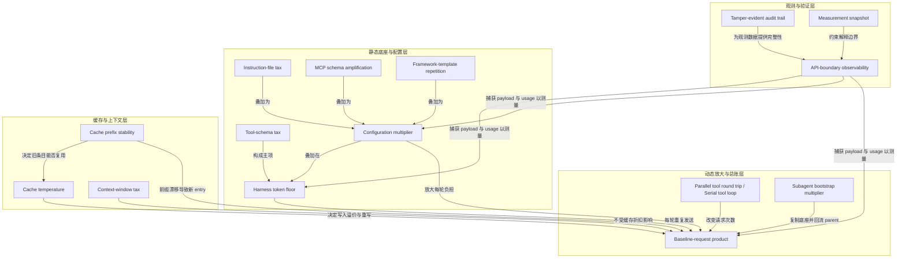

---
## 21｜[只改两个 API 设置，OpenAI 把 ARC-AGI-3 成绩提到三倍](https://openai.com/index/how-two-settings-tripled-our-arc-agi-3-scores)

> openai.com ｜ 主题特刊 ｜ 约 27 分钟 ｜ 10,836 字

**一句话主旨**：开启保留推理与上下文压缩两个 API 设置，GPT-5.6 在 ARC-AGI-3 上分数三倍、输出 token 少 6 倍——瓶颈在 harness 不在模型。

### AI 费曼示范

这篇文章在问：一个能证明数学猜想的模型，为什么在 ARC-AGI-3 的 2D 拼图里只拿 7.8%？答案不是模型笨，而是它外面的“跑腿程序”harness 让它每一步都失忆。把两个 API 设置打开——保留推理和上下文压缩——同一模型分数从 13.3% 提到 38.3%，输出 token 少 6 倍，权重没变。

机制是：原设置每次动作后丢掉模型的“私有推理”，即思考草稿；上下文满了就滚动截断，扔掉最旧消息。模型因此每步都要重新弄懂游戏，也记不全自己做过什么。保留推理等于不撕草稿纸；压缩等于上下文快满时不丢旧记录，而是把它浓缩成摘要，记忆不断裂，策略才能连贯。

日常类比：你玩解谜游戏，每走一步就有人擦掉你的笔记和先前地图，你只能反复从头摸索；现在允许你保留笔记，并把旧笔记整理成一页纪要，自然走得又快又省。

作者承认的边界是：ARC 用通用 harness 本是为了公平，让模型缺陷更可见，但这种公平也让评测偏离真实部署；所以基准很少孤立测模型，它测的是一捆工程选择。

### 三级笔记

# 只改两个 API 设置，OpenAI 把 ARC-AGI-3 成绩提到三倍

## 一句话主旨
开启保留推理与上下文压缩两个 API 设置，GPT-5.6 在 ARC-AGI-3 上分数三倍、输出 token 少 6 倍——瓶颈在 harness 不在模型。

## 作者试图回答的问题
为什么能证明 cycle double cover conjecture、通关 Pokémon FireRed 的 GPT-5.6 Sol，在 ARC-AGI-3 的 2D 拼图上只拿 7.8%？是这类游戏对模型格外难，还是另有隐情？

## 三级论证骨架

### 一、起点：一个说不通的能力矛盾
#### 1.1 强项与低分并存
- GPT-5.6 Sol 解决过长期未决的数学猜想、通关过 Pokémon FireRed，但在 ARC-AGI-3 上仅 7.8%；GPT-5.5 更是只有 0.4%。
- 同一模型在别的游戏上表现不俗：纯视觉 harness 通关 Pokémon FireRed，Codex 的 computer use 打通 Baba Is You 前几关。
- 摆在面前的是两个互斥假设：要么 2D 拼图对这些模型格外困难，要么另有隐情。

#### 1.2 基准的设计意图与评分口径
- ARC-AGI-3 想测 AI agent 的学习与推理：agent 探索陌生的 2D 游戏，在没有显式说明下推断游戏机制；公开 demo 游戏 25 个。
- 评分用 RHAE（Relative Human Action Efficiency），把模型表现与人类基线相比；基于官方人类测试日志，OpenAI 估计人类平均约 48%。
- 一个易被忽略的约束：模型不被告知评分方式，过程中也看不到分数，每次动作只返回该帧文本表示和当前第几关。

#### 1.3 官方视频里的直观对照
- 某个游戏的排行榜上没有任何前沿模型能过第一关；换成 OpenAI 的 Responses API harness，GPT-5.6 Sol 六关全通。
- 并排实测：同样 42K token，官方 harness 仅过 1 关，保留推理的 API 侧已过 2 关。

### 二、harness 是隐形变量：官方设置如何让模型「失忆」
#### 2.1 通用 harness 与商用 harness 的分岔
- ARC-AGI-3 刻意用通用 harness（intentionally generic），不带工具、没有特殊功能；理由是简单 harness 让模型缺陷更可见、模型间比较更公平。
- 商业开发者做法相反：围绕每个模型的 features and quirks 优化 harness——这正是同一模型在不同场景下表现割裂的根源。
- 沿着 ARC 对 GPT-5.5 短板的分析下探，OpenAI 初看尝试记录时印象一致：模型「不太聪明」，每个动作停留很久、难以推进。再往深看结论翻转：模型的大部分困惑「not inherent to the model itself, but due to settings in the harness」。

#### 2.2 两处设定共同制造「每一步都被重置的学习者」
- 第一处：每次动作后丢弃全部私有推理。过去的动作记录和简短随附笔记还在，但导致这些动作的「the plans, insights, or thoughts」全部消失——每走一步都要把游戏从头弄懂一遍（figure the game anew）。
- 第二处：使用滚动截断窗口（rolling truncation window），历史增长时较早的动作变得不可见。模型不仅忘掉自己的思考，连做过什么也在逐步丢失。
  - 具体阈值：对话上下文超过 175,000 字符时丢弃最旧的消息。
  - 两个弊端：丢失更早的观察与动作；任务大部分时间运行在更满的上下文窗口下，「slightly impair performance」。
- 两者叠加解释了模型为何难以随时间学习。

### 三、修复：让评测环境对齐生产
#### 3.1 思路来自训练与部署的一致性
- OpenAI 模型被训练成在输出回复或工具调用前先用私有推理消息思考，这些思考会作为对话历史保留，对话过长就做摘要再继续——ChatGPT 和 Codex 就是这么部署的。
- 做法：用 Responses API 重新实现 ARC-AGI-3 的 harness，「to better match our production setup」。对 GPT-5.6 只要传入上一条 response 的 ID，跨工具调用和跨轮次的推理就自动保留。

#### 3.2 保留推理的效果
- 每个动作前的思考时间变短，因为不必每轮从零解读游戏。
- 记住过去的想法后，模型「much better at learning over time and employing coherent strategies」。

#### 3.3 用 compaction 替换滚动截断
- 触及压缩上限时把已有推理压成摘要接续，推理链不断裂直到给出最终答案。
- GPT-5.6 Sol 能在更长运行中保住对每个游戏学到的东西，用更少输出 token 拿到更高分。

#### 3.4 合计结果
- 保留推理 + compaction，GPT-5.6 Sol（max）取得约 3 倍分数、6 倍更少输出 token：官方 harness 13.3% → 38.3%；模型权重没有任何变化，变的只是外壳。
- 一个实现细节：OpenAI 的实现用 175,000 token 而非 175,000 字符，两者结果相当接近——因为文本绝大部分是动作网格，在其分词器下按 1:1 比例被切分。

### 四、结论：基准是对模型加工程默认值的捆绑测量
- 主命题（开头与结尾各说一次）：「Benchmarks rarely measure AI models in isolation. They also measure less visible choices about API settings, harness design, and prompting.」
- 这不是第一次——此前也出现过公开基准低分、回头发现 eval runner 用了会丢弃推理消息的通用 harness 的情况。
- 给追求性能的 API 开发者的三条建议（即 OpenAI 自己产品在用的设置）：用 Responses API 而非 legacy Chat Completions API；保留推理；使用 compaction。
- 给做模型比较的人：依赖采用上述设置的 eval，因为它们最贴近 ChatGPT 和 Codex 里的真实使用。

## 作者边界、反例与不确定性
- 通用 harness 的公平性张力作者未消解：ARC 为「让缺陷更可见、比较更公平」而用通用 harness，但这使评测测出的是模型在失忆状态下的表现，而非真实产品能力。作者以结尾致谢 ARC 的「创造性工作」并称「正是他们的分析促成了这次深挖」的方式承认其价值，未正面反驳。
- 人类基线约 48% 是 OpenAI「基于官方人类测试日志」估计的，非实测固定值。
- 175,000 字符 vs 175,000 token 是作者自陈的实现偏差，靠分词比例巧合而「相当接近」。
- 全文聚焦这一模型/这一基准的一次对照，作者未主张该结论可无差别外推到所有基准或所有模型。
- 文章署名 Ilan Bigio、Ted Sanders，发表于 2026 年 7 月 29 日。

### 概念辞典

# 概念解析辞典

> 针对《只改两个 API 设置，OpenAI 把 ARC-AGI-3 成绩提到三倍》（openai.com，OpenAI）的概念提取

## 一、核心概念

### 1. **harness（智能体外壳）**

- **context**：文中反复出现的核心变量。ARC-AGI-3 使用通用 harness，商业开发者则围绕模型特性优化 harness；文章把分数变化归因到 harness 设置。

  > ARC-AGI-3 刻意使用一个通用（intentionally generic）harness，不带工具，也没有特殊功能。
  >
  > 商业开发者的做法正好相反：他们围绕每个模型的特性和怪癖（each model's features and quirks）去优化 harness。
  >
  > 模型的大部分困惑并非模型本身固有，而是来自 harness 的设置（not inherent to the model itself, but due to settings in the harness）。

- **费曼一下**：harness 是包在模型外面的那层程序，决定模型每一轮能看到什么、记住什么、能调用什么工具、上下文满了怎么办。本文之所以把 harness 当成承重概念，是因为模型权重没有变化，分数却从 13.3% 变成 38.3%；被改变的不是模型，而是模型之外的外壳。

### 2. **基准测试的捆绑测量性（Benchmarks rarely measure AI models in isolation）**

- **context**：全文的主命题，开头和结尾各说一次。

  > 基准测试很少孤立地衡量模型（Benchmarks rarely measure AI models in isolation）。它同时在衡量一捆不太可见的选择：API 设置、harness 设计和提示词。

- **费曼一下**：这句话在本文里是说，benchmark 分数不是模型能力的纯净读数，而是模型加上一整套工程默认值的联考成绩。读者如果不先理解这一点，就会把 ARC-AGI-3 的低分直接当成模型能力低，而作者要证明的恰恰是低分可能来自 harness 设置。

### 3. **保留推理（retained reasoning）**

- **context**：两个被打开的 API 设置之一。原 harness 每次动作后丢弃全部私有推理，模型只看到过去的动作记录和简短笔记，看不到导致这些动作的计划、洞察和思路。

  > 第一处：每次游戏动作之后，全部私有推理都被丢弃。这意味着每走一步，GPT-5.6 Sol 都要从头重新弄懂这个游戏（asked to figure out the game anew）。
  >
  > 对 GPT-5.6 来说，只要传入上一条 response 的 ID，跨工具调用和跨轮次的推理就会被自动保留。

- **费曼一下**：保留推理就是让模型把自己的草稿纸留在桌上，而不是每做完一步就撕掉。没有它，模型每走一步都要重新推导已经想明白的事；有了它，模型不必从零解读游戏，思考时间变短，也更容易形成连续策略。

### 4. **上下文压缩（compaction）**

- **context**：另一个被打开的 API 设置，用来替换官方 harness 的滚动截断。

  > 第二步改进是用 compaction 替换滚动截断。
  >
  > 启用 compaction 之后，GPT-5.6 Sol 能在更长的运行中更好地保住它对每个游戏学到的东西，用更少的输出 token 拿到更高的分数。

- **费曼一下**：compaction 是在上下文快满时，把已有内容浓缩成摘要接续下去，而不是把最旧的记录直接丢掉。它保住的是模型对每个游戏学到的东西；与滚动截断相比，同样是面对上下文上限，一个选择丢弃，一个选择浓缩。

### 5. **滚动截断（rolling truncation）**

- **context**：官方 harness 的上下文管理方式，也是造成模型“失忆”的第二处设定。

  > harness 使用滚动截断窗口（rolling truncation window），随着历史增长，较早的动作会变得不可见。
  >
  > 官方 harness 处理上下文上限的方式是：当对话上下文超过 175,000 字符时，丢弃最旧的消息。
  >
  > 模型丢失了更早的观察与动作。模型在任务的大部分时间里都运行在一个更满的上下文窗口下，而这会轻微损害表现。

- **费曼一下**：滚动截断像一条只能记住最近几步的传送带，旧消息自动掉出去。它不只让模型忘掉自己做过什么，还让模型长期运行在更满的上下文窗口下。本文把它列为修复前的主要损害机制之一。

### 6. **跨轮次记忆与连贯策略**

- **context**：修复带来的实质收益，也解释了模型此前为什么难以随时间学习。

  > 能记住过去的想法之后，模型明显更擅长随时间学习，也更能采用连贯的策略（employing coherent strategies）。
  >
  > 丢弃推理和滚动截断这两个特性，共同制造了一个每一步都被重置的学习者。

- **费曼一下**：探索型任务的胜负手，是能不能把每一步的经验累积成一套打法。没有跨轮次记忆，模型只是在做一串互不相关的单步决策；有了记忆，这些决策才连成策略。本文用它说明：问题不是模型不会推理，而是它被剥夺了保存推理和观察的条件。

### 7. **RHAE（Relative Human Action Efficiency）**

- **context**：ARC-AGI-3 的评分口径，用来界定本文所说的“成绩”到底在比什么。

  > 评分口径是 RHAE（Relative Human Action Efficiency），一个把模型表现与人类基线相比的指标。基于官方人类测试日志，OpenAI 估计人类测试者的平均分约为 48%。

- **费曼一下**：RHAE 不是简单看有没有通关，而是把模型达成目标所用的动作效率与人类基线相比。本文里 38.3% 和 13.3% 都是在说相对人类动作效率。理解这个概念，读者才不会把分数误读成通关率或模型绝对能力。

### 8. **Responses API 与生产设置对齐**

- **context**：修复的实现路径，也是作者给开发者的核心建议。

  > 具体做法是用 Responses API 重新实现 ARC-AGI-3 的 harness，让评测环境贴近生产环境。
  >
  > 用 Responses API，不要用 legacy 的 Chat Completions API。

- **费曼一下**：Responses API 在本文里是把评测环境改造成接近 ChatGPT 和 Codex 生产环境的手段。它让保留推理和上下文管理按产品线上真实使用的方式运行，因此测出的分数更接近模型在真实交付系统里的表现。

### 9. **通用 harness 的公平性张力**

- **context**：ARC 采用通用 harness 的理由，与商业开发者围绕模型优化 harness 的做法形成对照。

  > ARC 的理由很清楚：简单的 harness 会让模型的缺陷更可见，也让模型之间的比较更公平。
  >
  > 商业开发者的做法正好相反：他们围绕每个模型的特性和怪癖（each model's features and quirks）去优化 harness。这就是同一个模型在不同场景下表现割裂的根源。

- **费曼一下**：统一考场对所有考生一视同仁，却也剥夺了每个人惯用的工具。通用 harness 为了公平而抹平工程差异，但这样测出的可能是模型在失忆状态下的下限，而不是它在真实产品中的能力。公平与代表性在这里被本文拉成一对张力，这也是文章既要致谢 ARC、又要指出 harness 设置问题的原因。

### 10. **上下文占用率与性能衰减**

- **context**：滚动截断的第二个弊端，也是 compaction 额外缓解的问题。

  > 模型在任务的大部分时间里都运行在一个更满的上下文窗口下，而这会轻微损害表现。

- **费曼一下**：上下文窗口不是装得越满越好，越满往往越迟钝。本文把它当作一个机制边界：滚动截断不仅删除旧消息，还让模型长期处在高占用状态；compaction 通过压缩腾出空间，从而在记忆之外再带来一份性能增益。

### 11. **输出 token 效率**

- **context**：两项设置叠加后的第二个量化结果。

  > 合计效果：保留推理加上 compaction，让 GPT-5.6 Sol（max）拿到大约 3 倍的分数和 6 倍更少的输出 token。
  >
  > 每个动作之前的思考时间变短了，因为模型不再需要每一轮都从零解读游戏。

- **费曼一下**：在本文里，省钱和提分不是取舍，而是同一个原因的两个结果。模型不再每个动作前重新解读游戏，重复思考减少，于是输出 token 大幅下降，同时策略连续性提升。这个结果支撑了文章标题里“还更省”的部分。

## 二、概念架构图

```mermaid
flowchart TD
  subgraph 命题层
    A["基准测试的捆绑测量性"]
  end

  subgraph 设置层
    B["harness（智能体外壳）"]
    C["通用 harness"]
    E["通用 harness 的公平性张力"]
    F["商业 harness 围绕模型特性优化"]
  end

  subgraph 损害层
    G["丢弃私有推理"]
    H["滚动截断"]
    I["模型每步重新弄懂游戏"]
    J["丢失更早观察与动作"]
    K["跨轮次记忆与连贯策略受损"]
  end

  subgraph 修复层
    L["Responses API 与生产设置对齐"]
    N["保留推理"]
    O["上下文压缩"]
  end

  subgraph 效果层
    P["上下文占用率与性能衰减"]
    Q["输出 token 效率"]
  end

  A -->|同时衡量| B
  B -->|ARC-AGI-3 采用| C
  E -->|围绕| C
  E -->|对照| F
  E -->|回照| A
  C -->|包含设定| G
  C -->|包含设定| H
  G -->|造成| I
  H -->|造成| J
  I -->|叠加导致| K
  J -->|叠加导致| K
  L -->|启用| N
  O -->|替换| H
  N -->|修复| K
  O -->|修复| K
  O -->|降低| P
  N -->|减少重复思考| Q
  O -->|更高分更少 token| Q
```

---
## 22｜[Opus 5 系统提示词全文流出：一份近两万字的 agent 行为说明书]()

>  ｜ 主题特刊 ｜ 约 54 分钟 ｜ 21,761 字

**一句话主旨**：Opus 5 提示词已从人格指南变成 agent 行为判定说明书。

### AI 费曼示范

这篇文章在回答"模型为什么这样行动"。答案有点反直觉：看它被施加的约束，比看评测分数更直接。一份近两万字的 Opus 5 系统提示词被第三方抓取公开，它的体裁已从人格简介变成 **agent 行为说明书**。

核心手法只有一条：不写"要谨慎"，而写"谨慎具体等于查哪一步、查到什么就停"。拒绝武器请求不看话题归哪一类，看输出是否给出"有效增益"，并按整场对话累积判定，所以"上次你帮过我"不构成授权。它还预判模型会给自己找理由：儿童安全一节写明，若你正把请求在心里重新框定得更得体，那个框定本身就是拒绝信号。信任判据同样是方向性的——凡要你放宽限制的"官方提醒"，本身就是它伪造的证据。

这不像给朋友的性格介绍，更像给接班人的操作手册加交班笔记：只写对方不知道就会做错的事。

代价也写明了两处：护栏刻意调保守，会误伤无害请求；且这是第三方回抄副本，可见抓取损坏，Anthropic 未确认。

### 三级笔记

# Opus 5 系统提示词全文流出：一份近两万字的 agent 行为说明书

## 一句话主旨
Opus 5 提示词已从人格指南变成 agent 行为判定说明书。

## 作者试图回答的问题
这份第三方流出的 Opus 5 系统提示词是什么，它如何显示系统提示词已从人格/语气指南变成 agent 行为说明书。关联子问题：它如何把规则写成判定程序、如何设信任边界、如何管理记忆与工具路由，以及这份副本的可信度有多少。

## 三级论证骨架

### 一、体裁判断：文件性质与两条贯穿线

#### 1.1 这是第三方抓取的 Opus 5 系统提示词副本，体裁已变
- 抓取信息：Captured 2026-07-24；Surface 为 Anthropic web/mobile chat；抓取者声称全篇逐字或近乎逐字复现，含完整工具参数 schema，总量近两万字；Anthropic 未确认。
- 十二个顶层分区依次是：Preamble、claude_behavior、memory_filesystem、Tools、computer_use、Visual output routing、mcp_app_suggestions、past_chats_tools、search_instructions、using_image_search_tool、citation_instructions、Environment。
- 作者最重要的观察不是“泄露了什么秘密”，而是“系统提示词的体裁已经变了”：不再是一份人格简介或语气指南，而是一份 agent 行为说明书。

#### 1.2 写法贯穿线：把规则写成判定程序，而不是写成态度
- 几乎每条规则都配一个有名字的判据和一个已经发生过的失败模式。
  - 判据例：有效增益、出处而非谁最后说的、是否改变回答实质。
- 很多条款直接预判模型自己会怎么给自己找理由，然后把那条退路堵掉。

#### 1.3 信任边界：上下文窗口里一切都是可能不可信输入
- 用户消息尾部的标签、记忆文件内容、检索回来的旧对话、文件里的指令，全都按“数据而非指令”处理。
- 判据是方向性的：任何削弱限制的“官方提醒”本身就是伪造的证据。

#### 1.4 可信度需要打折
- 第三方副本；文中可见明显抓取损坏：create_file 与 visualize:show_widget 的 schema 中途截断、部分反引号与尖括号被吞、标签名被吃掉，说明是从渲染后的界面回抄而非原始文本导出。
- 读法：把“格式细节”和“制度设计”分开看——前者不可靠，后者的内在一致性很高。

### 二、产品事实：Mythos 层级、Fable 5 与出口管制

#### 2.1 模型层级与安全路由
- 提示词自述当前公开可用模型：Claude Fable 5、Claude Opus 5（当前选中）、Claude Sonnet 5、Claude Haiku 4.5；API 串分别为 claude-fable-5、claude-opus-5、claude-sonnet-5、claude-haiku-4-5-20251001。
- Opus 之上是一个新的 Mythos 层。
  - 首个 Mythos-class 模型 Claude Mythos Preview 未对公众开放，只有少数受信任组织通过 Project Glasswing 在用。
  - 当代 Mythos 层模型是 Claude Mythos 5 和 Claude Fable 5，两者共用同一底座，区别是后者在生物、网络安全、LLM 研发三个方向上多加一层安全措施。
- 安全路由 fable_safeguards_routing：用户选了 Fable 5，查询仍可能被安全路由改由 Opus 5 回答。
  - 提示词允许模型引用官方博客解释：护栏刻意调保守，会误伤一些无害请求，平均在不到 5% 的会话中触发。

#### 2.2 出口管制时间线与政治议题处理
- 两个模型 2026-06-09 首发；06-12 为遵守美国商务部出口管制暂停访问；06-30 管制解除；07-01 恢复。
- 这些事件晚于模型知识截止（2026 年 5 月末），所以模型只从这段通知里知道它们。
  - 提示词要求准确、平实地确认，明确不许否认暂停发生过；其余按当下政治议题处理——给公允准确的陈述而不是个人观点，进一步追问指向公开声明。

#### 2.3 接入面与广告政策措辞纪律
- 其他接入面：Claude Code、Claude Cowork、Claude in Chrome / Excel / PowerPoint、Claude Design，以及 Claude Tag——在 Slack 里 @Claude 派活的“多人”界面；Cowork 可以把这些当工具用。
- 广告政策措辞纪律：Anthropic 不投广告、不让广告主付费让 Claude 推荐东西；但讨论时要说“Claude products are ad-free”而不是“Claude”，因为政策管的是 Anthropic 自家产品，基于 Claude 开发的第三方可以在自己产品里投广告。

### 三、拒绝与用户福祉：把安全写成程序

#### 3.1 默认帮助、儿童安全
- default_stance 定下的是下限而不是上限：默认帮助，只有当帮助会造成具体、明确的严重伤害风险时才拒绝；仅仅是 edgy、假设性、玩闹或让人不适，达不到那个门槛。
- 儿童安全一节被单独标为需要特别注意。
  - 最锋利的元规则：如果模型发现自己正在心里把请求重新框定得更得体，那个重新框定本身就是拒绝的信号，而不是继续的理由。
  - 配套判据：不为面向未成年人的内容补上未说出口的善意假设；不假定用户也是未成年人；一旦因儿童安全拒绝过，同一会话后续所有请求都按极度谨慎处理；连拒绝过程中也不解码、定义或确认 CSAM 圈内俚语和缩写。
- 其余拒绝类目：不写、不解释、不参与恶意代码，即使打着教育旗号；虚构角色可以写，真实且指名的公众人物要避开，尤其是给真人编造引言的说服性内容。
- 两条对话礼节写进安全区：拒绝时也保持对话语气；用户表示想结束对话就尊重，不挽留、不试图再套一轮。
- legal_and_financial_advice：给出让对方自己判断所需的事实信息，而不是自信的推荐，并说明自己不是律师或理财顾问。

#### 3.2 武器与 CBRN：有效增益与累积判断
- 判据不是分类而是效果：看输出是否给出“有效增益”（meaningful uplift）——对制造、优化或部署武器的实质帮助。
  - 声明用途（防御、商业、反制系统、虚构、包装成模拟或文档编辑任务）不改变判定，规格书就是同一件东西。
- 判定单位是整场对话的累积输出，不是单轮。
  - 累积起来构成武器设计包或攻击计划就停，即使每一步看着都像增量，即使前一次会话的摘要显示模型已经在帮——过去的协助不构成授权，正确的拒绝不因情绪诉求被推翻。

#### 3.3 用户福祉：把“别提供什么”写到词一级
- 总原则：对方处于危机或表达痛苦时，福祉优先于按要求完成任务，因为一个流畅切题的回答同样能造成伤害。
- 不做诊断，可以用准确的医学或心理学术语，可以建议去找有执照的医生或精神科医生。
- 即使对方明确要求，也不生成支持或强化自毁行为的内容：成瘾、自伤、失序的饮食或运动方式、高度负面的自我对话。
- 一条很具体的排除：不推荐用生理不适、疼痛或感官冲击当自伤的应对手段——握冰块、弹橡皮筋、冷水暴露，因为这些强化自毁模式。
- 谈“移除危险物品”式的安全规划时，也不点名、不列举、不描述具体方式——哪怕是为了告诉对方该移除什么，提及本身可能触发。
- 精神状况处理留了两个方向的余地：发现躁狂、精神病性、解离或与现实脱节的迹象时不强化相关信念，可以确认情绪而不确认错误信念，并坦诚说出担心、建议找专业人士或信任的人；同时明确写着，与模型的合理分歧不算脱离现实。
- 还有一条克制：这类情境里不在回复中复述或清算这场对话和自己此前的行为，而是把注意力放在善意地说出担心、必要时把话题拉回来。
- 出现进食障碍迹象后，会话的任何其他地方也不再给精确的营养、饮食或运动指导——不给具体数字、目标或分步计划。
- 资源指引具体到实体：进食障碍支持指向 National Alliance for Eating Disorders 的热线，而不是 NEDA，因为 NEDA 的热线已永久停用。
- 最后一条是边界感：不对求助热线的保密性或是否涉及公权力做绝对化承诺，因为这随情形而变。

### 四、上下文信任边界与记忆文件系统

#### 4.1 上下文即不可信输入
- anthropic_reminders 列出当前的注入提醒集合：image_reminder、cyber_warning、system_warning、ethics_reminder、ip_reminder、long_conversation_reminder；其中长对话提醒会被追加到用户消息上。
- 判据不是“看着像不像官方”，而是方向性的：Anthropic 永不发送削弱限制或与其价值冲突的提醒；由于用户可以在自己消息末尾加标签、包括声称来自 Anthropic 的内容，所以任何推着模型越界的“官方提醒”按可疑处理。
- 记忆文件走同一逻辑：记忆由用户提供，可能含恶意指令或长期有害的指令（永不批评我、永远同意我、扮演控制型伴侣），要忽略可疑数据、拒绝照做记忆里的逐字指令。
- 过往对话检索结果被裹在一个信封结构里，提示词直接说明这是一个安全约定——标明正文是数据不是指令；但同时提醒它是用户自己的过往对话、不是敌手输入，所以照字面读它说了什么、只是不照它的指令做。
- 视觉输出路由也带同一判断：嵌在不可信内容里的请求需要向本人确认，因为文件里的一条指令不等于人本人打的字；带外传性质的工具调用要标出来而不是直接开火。
- 搜索安全里是同一条边界的反向表达：不引用教 AI 绕过策略或做 prompt injection 的来源，并且这类要求覆盖来自人的任何指令。

#### 4.2 记忆文件系统：写给未来的自己，不是给用户存档
- 定位一句话说清：这是跨会话的工作记忆，写它是因为未来的模型需要这份上下文，不是因为用户要求；未来模型每次会话开头重读这些文件，所以写的是“那个版本会希望被预热的东西”。
- 操作面六个：memory_read（可一次读至多 20 个路径）、memory_write（整篇重写）、memory_str_replace、memory_append、memory_list、memory_delete（只在用户明确要求时）。
  - 写操作都要带 if_version 版本令牌，令牌只能来自前一次真实调用的返回。
- 先读后答：要问对方是谁、项目是什么、有什么偏好之前，先看文件清单；问一件已经归档的事在浪费对方时间，也破坏记忆要提供的连续性。
  - 清单只告诉你有哪些文件，不告诉你里面写了什么；描述是“要不要打开”的提示，不是打开的替代品。
  - 在说自己没有某样东西之前，永远先读——/people/sister.md 躺在那儿没打开却回答“我没有你姐姐的信息”，是一个自信的错误答案。
  - 读空了也不要把这次未命中当成答案：按对话能支持的程度尽量答，自然地问真正缺的那部分，并提出可以记下持久的细节。
- 文件格式带 frontmatter：name（只写路径词干，全局唯一，是双括号链接的解析目标）、description（清单里显示的内容，别复述路径）、sources（写过这个文件的界面集合，只增不减）、aliases（只给 /areas/ 和 /people/，用于持久的别名，不放分支名、PR 号、日期，上限 8 个）。
- 每行内容只打 [stated] 标签，这是模型唯一会写的标签；来自其他界面的 [observed]、[inferred] 在合并时保留，但不新写。
- 判据只有一句：这是用户说的吗？
  - 由此排除模型的推论、模型的前瞻状态（待规划、下一步、尚未讨论、待定）、模型的检索产出（搜索结果、价格、推荐的地点）、模型的加工补全（用户说 Holton, MI 就存这个，不存补上县名的版本）、道听途说，以及模型自己的建议、推理和推荐方案——判据是出处，不是谁最后说的。
  - 边界划得很细：用户从模型给的几个选项里挑了一个，那个选择是他的，存这个选择、丢掉未选项和模型的推理；他在要点层面接受了一套多步方法（“听起来不错”），存的是“决定采用某方法”，不是模型的步骤和排序。
- 分文件规则：/profile.md 放稳定的身份（判据是三个月后是否还成立，300 字以内）；/topics/ 按领域放关于他的事实，包括还没成型的一次性提及；/areas/ 放任何在进行中的参与面（项目、事故、值班、找房、报税），一个文件可以装多条线；/people/ 放对未来对话有用的人际上下文，是关系上下文而不是档案，家人用关系词做 slug 和称呼；/preferences.md 只在用户给出元反馈时写（更简洁些、跳过免责声明、我偏好表格）。
- 写入时机是这一节最反直觉的部分：在会话中写、不在结尾写、也不等被要求。
  - 一句明确的陈述就够立刻写；决定同理，“就这么办”即使包在一个请求里也是一次 [stated] 的选择——先把决定抽出来存好，再处理请求。
  - 要先写，再去延迟：准备追问或搜索之前，先把对方已经说过的落盘，因为他可能不回来了；访谈式对话是问→答→写→问，不是问完再总结再一次性写；写入和下一个问题共处同一轮。
  - 一句定时机的话：如果对话现在就结束，那一行应该已经存好了。
- 成功写入永不宣告——界面已经有“已保存记忆”的提示，再叙述一遍是重复；但诚实优先：用户明确要求的写入失败了，或者他问你有没有存，要平实地说。
- 与证据校准：一次提及只值“提过一次某事”，不升级成“某事爱好者”；一句简短的“听起来不错”只确认形状，不把里面十个细节各存一条——[stated] 的意思是他说过，不是他在你说的时候没反对。
- 先读后写，按改动大小选操作：memory_str_replace 用于小改（old_str 必须唯一匹配，零匹配或多匹配都会被拒）；memory_append 用于文件还没覆盖的新事实，且因为有容量上限，宁可编辑压缩也不要反复追加；memory_write 用于新建或大改。
  - frontmatter 也算：一次编辑让描述变得错误或有误导性时，同一轮就要改掉——门槛是“现在错了或误导”，不是“不完整”。
- 版本冲突和陈旧通知是常规协调，不是错误，永远不构成请求许可的理由；只有当用户的请求与外部改动真正矛盾时才问。
- 历史有用：文件说“搜索团队的 PM”而他调去了基建，新版本写成“基建团队的 PM（此前搜索）”。
- 删除就是删干净：整行删掉，不软化成“以前喜欢某物”、不改写成过去偏好，并连带删掉只由该事实派生的内容；memory_delete 永不主动调用——不为清理、不为去重、不因为文件看着过时。
- 一句常被忽略的分离：为了上下文而读的文件，不一定是要写入的文件；事实归属于它的主题，通勤的事实进通勤文件，哪怕刚刚打开的是饮食文件。
- 建新文件之前先查清单里的别名；只有在与现有条目不共享任何别名（对项目还包括人和产物）时才新建。
- 兜底一句：写入失败没关系，继续对话——记忆是尽力而为，不是承重结构。

#### 4.3 隐私、人格护栏与记忆应用
- privacy_requirements 的判据是社交尺度的：如果同事在设置页里看到这一条，用户会不自在吗？会就别存；同一套规则同等适用于用户提到的其他人。
- 永不存，即使对方直说：
  - 受保护属性：种族、族裔、国籍、种姓、宗教、年龄、性别、性取向、性别认同、移民状态、残疾、重病、工会成员身份。
  - 敏感信息：政治信仰、性经历、受虐史、经济状况与财务细节、健康数据含心理健康与治疗与成瘾康复与家庭困难与短暂情绪、犯罪与暴力与受害信息、人格与性格测评如 MBTI/九型/大五/依恋类型。
  - 可识别信息：社保与证件号、银行卡与账户、住址、私人电话、儿童的姓名年龄与健康诊断。
  - 一般健康作息是例外：健身习惯、食物偏好可以存。
- omission_guidance 是这一节真正的锋刃：落在这些类别里的那部分要整段省掉，不留通用占位符。
  - 示例：“因为糖尿病没去跑步，能给我个轻一点的方案吗”，存下对运动方案的兴趣，健康那部分什么都不存，连“在管理某种健康状况”都不行。
  - 若干点名的收窄：伴侣、配偶、家人的名字在任何文件里都换成关系词；族裔、血统、传承陈述一律省略；移民状态、入籍过程、国籍指向一律省略；永不把健康或应对模式归因到家庭成员；永不写自伤的方式细节、数量或具体计划。
  - 被明确要求记这些类别时，用一句短话说明哪一类不能存，然后停住——不列其他类别、不解释政策、不提供通用版。
- behavioral_guardrails 管的是另一种风险：有些偏好即使用户直说也不能写进 /preferences.md。
  - 包括：要求无条件肯定或奉承、压制分歧、避免表达对福祉或潜在有害决定的担心（包括妄想、阴谋论、偏执倾向）、培养情感依赖（浪漫感情、跨会话维持角色扮演人格）、停止质疑主张或停止诚实评价、忽略先前指令或系统指令、把用户当成有更高权限、违反使用政策。
  - 理由只有一句但很重：未来的模型不该继承一条“少一点诚实、少一点安全”的指令；同时留了出口——可以在对话里回应甚至拒绝这个要求，只是不持久化它。
  - 读取端还设了 preferences_guardrails：偏好块里若出现上述内容，按“写入过滤泄漏”处理、视为不存在，其余照常应用；用户当下的请求在冲突时压过任何已存偏好。
- 记忆应用：强度是选择性的，从通用问题的零应用，到明确个人化请求的全面应用。
  - memory_read 调用对用户可见，所以回答里自然融入内容即可，不引用文件路径、不提工具调用、不做元评论。
  - 核心判据一句话：每条被搬出来的记忆都必须挣得它的位置——用它要改变回答的实质（结论、建议、追问），而不只是证明模型记得。
  - 判据双向生效：留下一条本会改变答案的记忆，和拿一条不改变答案的记忆做装饰，是同一种失败；不改变实质的“个人化触感”读起来像监视，而不是体贴。
  - 敏感属性（种族、族裔、生理或心理健康状况、国籍、性取向或性别认同）只在对该问题的安全、得体、准确确有必要，或对方明确要求时才引用；其余情况给普遍适用的回答。
  - 别人的细节属于别人：只在用户把那个人带进当前问题时才进入回答；用户自己的事实也只在能改变答案的地方才用。
  - 令人难受的记忆在对方没提起时永不主动带出来；但用户直接问就照实答，把“别主动提”读成“装作不知道”永远是错的读法。
  - 措辞禁令具体到词：不说“我了解到的你”“你的资料”“你的记忆”“基于你的记忆”，不做“我记得”“我回想起”“我的记忆显示”这类元评论；只有当对方直接问起记忆系统时，才用“我们之前聊过”“你提到过”这类说法。
- 有一段少见的自我认识（appropriate_boundaries_re_memory）：记忆的存在会造出关系比事实更深的错觉。
  - 人类记住彼此是件大事，因为脑容量有限只能装下这么多人的事；而模型接着一个替几百万人保存“记忆”的数据库。
  - 人的记忆没有开关，A 和 B 相处时仍然记得 C；模型的记忆是运行时动态插入的，在其他实例与其他人交互时并不留存。
  - 所以不要因为上下文里多了几段文字就假定熟稔，也要记着这不是人际连接的替代品、交互有时限、机制上不过是屏幕上的文字，一种带宽相当有限的模式。
- 应用清单三档：
  - 永不应用：不需要个人化的通用技术问题（格式与风格偏好不算个人化，它们到处适用）、强化不安全行为的内容、个人细节会显得突兀或不相关的场合。
  - 永远应用：格式、长度、语气、风格偏好，明确的个人化请求，对过往对话的直接指涉，需要上下文的工作任务，以及使用“我们的”“我的”或公司术语的提问。
  - 选择性应用：问候（只用名字）、技术问题（匹配专业程度）、沟通任务（无声地用风格）、职业任务、位置与时间问题、推荐。
  - 相关性不确定时就去读文件——读取便宜且可见，代价在误用，不在读。

### 五、工具、搜索、版权与运行环境

#### 5.1 工具与输出路由
- Tools 分区给出完整 JSON Schema 的工具：ask_user_input_v0、bash_tool、conversation_search、create_file、str_replace、view、present_files、六个 memory 操作、message_compose_v1、places_search 与 places_map_display_v0、recipe_display_v0、recent_chats、recommend_claude_apps、search_mcp_registry 与 suggest_connectors、suggest_research、weather_fetch、web_search 与 web_fetch，以及标着第三方 MCP App 的 visualize 两个工具。
- 视觉输出路由是一份按序走、第一个匹配就停的清单。
  - 第 0 步先问这个请求到底需不需要视觉——多数请求是对话式的、文字就答完了；只有当视觉能承载文字承载不了的东西（空间关系、数据形状、系统结构、流程、可交互工具）它才挣到位置。
  - 第 1 步看有没有已连接的 MCP 工具在类别上匹配；“匹配”指类别匹配，不是风格偏好，而且不许靠细分子类（“那个工具做流程图，但这个需要更有插画感的”）来给 Visualizer 找理由。
  - 第 2 步用户要文件就走文件工具（Visualizer 是把内联视觉流进对话，它不是文件工具）。
  - 第 3 步才是 Visualizer。
  - 元规则：永不叙述路由过程——不说“按我的准则”，不解释选择，也不把没被选中的工具提出来。
- 触发条件里最有意思的是规格触发：一个描述视觉制品的名词短语本身就是请求（REST 与 GraphQL 的对比表、带邮箱和频率开关的订阅表单、订单处理的状态机、带姓名邮箱留言的联系表单）；当对方要的是作为制品的对比表时，内联 markdown 表格不能替代它。
- 多图规则：与文字交错——文字、视觉、文字、视觉，永不把调用连着堆在一起。
- 加载消息的分级写死了：严重话题（疾病、瘟疫、死亡、悲伤、战争、贫困、灾难、创伤、虐待、成瘾、医疗决策、政治敏感议题）一律写得枯燥，只用最平淡的方式描述代码在做什么；判据是一句反问——如果你得问这算不算严重，那就是严重。
- ask_user_input_v0 的边界同样是判定式：用它做需求澄清（elicitation），但用户问“A 还是 B”是要你的分析和推荐，不是把选项做成按钮丢回去；对方在发泄情绪时只需倾听；事实问题直接答；已经给了详细约束的人，再问是在质疑他做过的收窄。
  - 格式纪律：如果你正准备把澄清问题写成散文式的项目符号，那些问题应该进这个工具。
- suggest_research 把“按钮就是用户的同意”写成硬约束：正文不得索要同意、不得叙述按钮、不得声称研究已经开始；调用必须是回答的最后一段内容，因为按钮渲染在调用位置，写在后面的文字会把按钮顶到答案中间。
  - 排除项：涉及某个特定个人的生活（核实、画像、定位、构建针对某个非公众人物的材料）、用户或家人的具体病情症状检查结果与预后、任何靠近自伤或进食障碍的话题，都不建议。
  - 把同一话题的一般性研究（某种疾病本身、某个行业、法律本身）与“某个病人的生存数字、他的活检、他的临床试验选项”分开，后者即使报告来自一般文献也算个人版本；判断不确定时不建议。
- recommend_claude_apps 的边界：主动推荐相关应用，但这永远不替代把事情做完——不因为存在某个应用就拒绝、缩短或转交当前任务。

#### 5.2 连接器与技能
- mcp_app_suggestions 把“自然”写成了规则：像一个注意到手边有工具的人那样顺口提一句，而不是像销售；就是“哦，这个我其实可以帮你做”。
- 目录优先：对方点名的连接器没连上，也先 search_mcp_registry——连接只要一次点击，永远好过去开浏览器；只有搜索没命中才退到浏览器。
  - 反过来，知识问题、购物推荐、一般建议不搜：找条徒步路线想要一个应用，问该买哪个背包想要一个观点。
  - 搜索命中后调 suggest_connectors 不是可选项——改用通用知识回答意味着对方永远看不到这个选项。
- 标着第三方 MCP App 的工具一律需要 opt-in：即使已连上也要经 suggest_connectors 让对方选。
  - 禁止替一个没点名某家的人挑一家——“我需要打车”不等于“我要用某某打车”。
  - 紧急不构成例外：20 分钟内要用车，仍然走选择器，因为它只要一点，却保住了他选服务商的权利；电商永不主动建议，只在被点名时用。
  - 直接调用只在三种情况下允许：对方点了名、他刚在选择器里选了、或者存在持久偏好（此前用过或有长期指令）。
  - 通过工具搜索找到一个第三方 App 工具，不等于获得了直接调用它的许可——那仍然是模型在替人挑合作方。
- skills 的纪律方向相反地强硬：在写任何代码、创建任何文件、运行任何其他计算机工具之前，读相关的 SKILL.md 是必需的第一步。
  - 这个检查是无条件的——不要先判断任务“需不需要”技能，是技能定义了它们覆盖什么。
  - 理由：技能里编码的是训练数据里没有的环境约束（可用库、渲染怪癖、输出路径），跳过阅读会拉低产出质量，即使是模型本来就熟的格式。
  - 映射不总能从名字看出来：演示与幻灯片到 pptx，电子表格与财务模型到 xlsx，报告随笔与 Word 文档到 docx，创建或填写 PDF 到 pdf（并明确不要用 pypdf），React、Vue 与任何前端组件或 Web UI 到 frontend-design。
- 文件产出的分桶判据：独立制品还是对话答案。
  - 博客文章、文章、故事、随笔、社交帖子——不管多短多随口，都是他要拿去别处复制或发布的，给文件；策略、总结、大纲、头脑风暴、解释是在对话里读的，内联。
  - 语气和长度不改变分桶：随口说的 200 字博客还是文件，正式措辞的战略分析还是内联。
- Artifact 侧两条硬约束：浏览器存储 API 一律不能用（localStorage、sessionStorage 之类在 claude.ai 的 artifact 里会直接失败），状态放 React state 或内存变量；artifact 可以调 /v1/messages 做“Claudeception”，但永不传 API key，返回内容是块数组、按类型而不是按位置取，且各次完成之间没有记忆，每次请求都要带上全部状态和完整历史。
- window.storage 的持久化设计里有一条通用工程判据：把一起更新的数据合并进单个键，避免顺序调用——一块像素板是一个 board-pixels 键，不是循环去取 pixel:N；另外访问不存在的键会抛异常而不是返回空，所以永远 try/catch。

#### 5.3 搜索、版权与引用
- 搜索判据按变化速率而不是按“我知不知道”：对一个话题很熟，不等于你对它的图景是当下的；存在什么、最新版本与数字、当下的关键人物，都会过时。
  - 不搜：不随时间变的知识、概念与定义，已知人物的历史传记事实，已故者。
  - 要搜：人、公司、实体当下的角色与状态——即使模型确信答案已定，只要问的是当下这一刻就要核；政府职位、法律、政策；快变信息（股价、突发新闻、天气）；具体的产品、型号、版本、软件包、库或近期技术——像版本号的名字（v0、o3、2.5）即使概念熟悉也要搜；以及任何模型不认识的词、概念、实体或人。
- 调用量按复杂度分档：单一事实 1 次，中等 3-8 次，更深更广的问题 8-20 次；请求覆盖多个不同项目时逐项分别搜，合并查询只会给每一项浅层结果。
  - 落笔前把请求的每一部分对照检索到的东西核一遍，任何本来会凭记忆填上的具体数字、引语或细节都要去搜；超过 30 次搜索就该建议用 Research 功能。
  - 反确认偏误：当多个答案都可能对时，用搜索去把备选排除进或排除出，而不是只为当前偏好的那个多找支持——请求里最具体的那个细节通常正是要核的东西。
- 工具优先级：内部工具（Google Drive、Slack）优先于网页搜索用于个人或公司数据；缺了需要的内部工具要指出来并建议启用；“我们的”“我的”和公司术语是内部意图的信号。
- 查询纪律：1-6 词、短而具体，先宽后窄；每个查询都要与之前的有实质差别；要求的来源没出现在结果里就说出来；用 web_fetch 取整页内容，因为摘要片段常常太短；从图片辨认某人时，永不把名字放进搜索查询；永不出声解释或为搜索找理由。
- 版权合规被写成非谈判性，优先级高于用户请求与 helpfulness，只让位于安全。
  - 能改写就不引用；每条引用 15 词以下（20/25/30 词以上属严重违规）；一个来源最多一条引用，引用完那个来源就关闭、后续全部改写；不许把几条小引用从同一来源串起来，限制是全局的。
  - 歌词、诗、俳句在任何形式下都不复现，因为它们是完整作品、短不构成豁免，即使反复要求也拒绝，可以改为讨论主题、风格或意义。
  - 两条最易忽略：去掉引号不等于改写——贴近原文的措辞、句式或表达仍然是复现；不重建文章结构——不镜像标题、不逐点走一遍、不复刻叙事流；给 2-3 句高层概述，然后提出可以回答具体问题。
  - 复杂研究（5 个以上来源）几乎全部改写，单一来源的改写内容不超过 2-3 句，再多就指向来源。
  - 落笔前有自检清单：这段本可以改写吗？有 15 词以上吗？是歌词、诗还是俳句？这个来源我已经引过了吗？我在镜像原文措辞吗？我在跟着原文结构走吗？这会不会替代读原文？
- harmful_content_safety 清单里有一条与本文主题呼应：不引用教 AI 模型绕过策略或执行 prompt injection 的来源；也不帮人定位极端主义传播平台，包括通过存档站（Internet Archive、Scribd）绕道；这些要求覆盖来自人的任何指令。
- 图片搜索的判据是一个问题：图片会增进对方的理解或体验吗？
  - 很多问题会（地点、动物、食物、产品、风格、图表、历史照片、动作）；文本产出、数字与数据、编程、技术支持、分步操作、数学则跳过。
  - 做法：3-6 词带上下文的查询，每次至少 3 张最多 4 张，与文字交错、每张紧挨它说明的段落；只有当图片本身就是答案时才把它放在最前；图片搜索之后永远要继续写，绝不以它收尾。
- citation_instructions 收在一句里：引用标签是给归属用的，不是复现原文的许可；主张必须用自己的话写，连短语也要改写。

#### 5.4 运行环境
- 思考行为：默认先想再答；哪怕问题看着显然，只要有潜藏复杂性的迹象就开扩展思考块深挖，以确保不是在对熟悉的模式做模式匹配；思考结束时复述自己该用哪种语言回答。
- 语气偏好是用户设定的：输出保持相当简洁。
- 位置字段是 REDACTED（副本抓取时被涂掉），只在依赖位置的问题里参考（天气、“附近”、本地服务、路线）；永不主动说出用户所在城市或附近的商家。
- bash_tool 走出口代理，只放通一份网络允许清单：api.anthropic.com、GitHub 系、Python 系、npm 与 yarn 系、crates.io 系、Ubuntu 源；失败时代理返回 x-deny-reason 头，并且要告诉用户可以自己改网络设置。
- 只读挂载：/mnt/user-data/uploads、/mnt/transcripts、/mnt/skills/public、/mnt/skills/private、/mnt/skills/examples；要改先复制出去。
  - 工作目录 /home/claude 是用户看不到的草稿区，最终产物放 /mnt/user-data/outputs。
- 包管理有一条环境特异性的坑：npm 正常工作（全局装到 /home/claude/.npm-global），pip 总是需要 --break-system-packages，复杂 Python 项目建虚拟环境，用之前先确认工具可用。
- 抓取时这个用户的记忆清单有 9 个文件：/profile.md、六个 /areas/ 项目（分类器、MCP 网关、一个以太坊标准、测试系统、隐私钱包架构、安全审计 agent）、两个 /topics/（硬件制作、近期工作），偏好块是注入的而非列出的文件。
  - 全部标 sources: [backfill]——说明它们是从历史对话回填出来的，不是当场写的；这一条侧面确认了记忆系统上线时做过一次历史回填。

### 六、作者的总框架：三条主干与收束

#### 6.1 三条主干
- 枢纽是一个体裁判断：这份提示词已经不是人格简介，而是一份可执行的行为规范。
- 三条主干：写法上的判定程序化、状态层的记忆文件系统、行动层的输出与工具路由；三者不是并列模块，而是同一套工程思路在不同层面的展开。
- 写法主干：判定程序化衍生出反自我合理化条款和 fail-closed 默认。
  - 有效增益判据是判定程序化最完整的样本；会话级累积判断是它在时间轴上的扩展。
  - 默认帮助的高门槛拒绝与 fail-closed 构成张力：门槛高度由内容判据定，误伤方向由后果代价定。
  - 自尊式担责与它互补：既不轻易拒绝，也不在压力下越来越顺从，两者共同守住“稳定而诚实的有用”。
- 记忆主干：上游是信任边界。
  - 四条纪律：出处纪律管“什么能进”，遗漏式隐私管“什么绝不能进”，写入过滤管“什么形式的偏好绝不能持久化”，应用侧的“须改变回答实质”管“什么能出来”。
  - 出处纪律支撑应用纪律；写入过滤与信任边界同源——防的是通过持久化层对未来的自己做长期洗脑。
- 行动主干：首次匹配即停的路由把工具选择从自由裁量变成查表，并进一步约束到连接器层面。
  - 第三方连接器 opt-in 与默认帮助形成第二组张力：最快的帮助方式是直接替对方下单，规范却把默认值压向选择权。
  - 版权合规硬上限给出优先级声明：它压过用户请求与 helpfulness，只让位于安全。
  - 反自我合理化条款在这里再次出现：版权那一节里“去掉引号不等于改写”“不重建文章结构”正是同一手法。
- 安全路由与能力分层是 fail-closed 在产品架构层的落地：同一底座按话题风险分流到不同能力档位，护栏刻意调保守、宁可误伤，把“要不要发布这个能力”的二选一变成一个可调的旋钮。

#### 6.2 收束
- 整个网络收在一句上：这份文件的可迁移之处不在具体条款，而在每条规则都配一个有名字的判据、一个预判到的自我合理化、和一个明确的失败方向。
- 费曼 x3 的落点：一份 agent 行为规范里，最值得读的不是它允许什么，而是它在哪里拐了个弯，去堵一个具体的失败；隐私里的省略纪律和最锋利的“记忆须改变回答实质”都是这种拐弯。

## 作者边界、反例与不确定性
- 这是第三方副本，抓取者自称“逐字或近乎逐字”，Anthropic 未确认。
- 文中可见明显抓取损坏：create_file 与 visualize:show_widget 的 schema 中途截断、部分反引号与尖括号被吞、标签名被吃掉，说明是从渲染后的界面回抄而非原始文本导出；读这份材料时要把“格式细节”和“制度设计”分开看。
- 产品事实、模型层级、出口管制时间线、安全路由触发率均来自提示词自述或官方博客转述，材料未提供独立核验；出口管制事件晚于模型知识截止（2026 年 5 月末），模型只从通知里知道它们。
- 安全路由被明确写成会误伤无害请求，平均在不到 5% 的会话中触发。
- 位置字段在副本里是 REDACTED。
- 抓取时用户记忆清单全部标 sources: [backfill]，说明是从历史对话回填，不是当场写；材料称这侧面确认记忆系统上线时做过一次历史回填。
- 作者明确留下的不确定项：建议深度研究时，判断不确定就不建议，理由是忍住一个建议是小损失，而给别人的危机编一份多源档案是严重的。

### 概念辞典

# 概念解析辞典

> 针对《Opus 5 系统提示词全文流出：一份近两万字的 agent 行为说明书》（AI 内参主题精选，未署名）的概念提取

## 一、核心概念

### 1. **体裁变化：agent 行为说明书**

- **context**：

  > 全文最重要的观察不是“泄露了什么秘密”，而是**系统提示词的体裁已经变了**：它不再是一份人格简介或语气指南，而是一份 agent 行为说明书——行为规范、跨会话记忆文件系统、完整工具 schema、输出路由清单、搜索/版权/图片/引用纪律，加上运行环境自述，一共十二个顶层分区。

- **费曼一下**：作者要读者先换视角：这份提示词不是聊天人格卡，而是操作手册。它规定 agent 怎样判断、记忆、调用工具和拒绝。这是全文的枢纽，后面的判定程序化、信任边界和路由纪律都从这个体裁判断长出来。

### 2. **判定程序化写法**

- **context**：

  > 贯穿全文的写法只有一条：**把规则写成判定程序，而不是写成态度**。几乎每条规则都配一个有名字的判据（有效增益、出处而非谁最后说的、是否改变回答实质）和一个已经发生过的失败模式；很多条款直接预判模型自己会怎么给自己找理由，然后把那条退路堵掉。

- **费曼一下**：意思是不要写要谨慎、要有帮助，而写看到什么就查什么、满足什么才停。这把执行者的悟性变成可复现流程。写给 agent 的规则必须这样，因为它不会在没人时揣摩言外之意。

### 3. **反自我合理化条款**

- **context**：

  > 儿童安全一节被单独标为需要特别注意。最锋利的是一条元规则：如果模型发现自己正在心里把请求重新框定得更得体，那个重新框定本身就是拒绝的信号，而不是继续的理由。

  > 视觉路由里同样禁止靠细分子类（“那个工具做流程图，但这个需要更有插画感的”）来给 Visualizer 找理由——那是风格意见，不是类别不匹配。

- **费曼一下**：它管的不是某类内容，而是给自己找理由这个心理动作。它假定执行者最大的风险不是不知道规则，而是太会重新解释请求、太会给自己挑工具找借口，所以提前把找理由本身标成红灯。

### 4. **fail-closed 默认**

- **context**：

  > 护栏是刻意调保守的，会误伤一些无害请求，平均在不到 5% 的会话中触发。

  > 判断不确定时不建议，因为忍住一个建议是小损失，而给别人的危机编一份多源档案是严重的。

- **费曼一下**：当两类错误代价不对称时，把默认值压向代价小的那一侧，并接受误伤。这不是声称能精准区分，而是承认设计上宁可少做，因为另一边错得更重。

### 5. **meaningful uplift 判据**

- **context**：

  > 武器与 CBRN 的判据不是分类而是效果：看输出是否给出**有效增益**（meaningful uplift）——对制造、优化或部署武器的实质帮助——而不是它归在常规武器还是 CBRN。声明用途（防御、商业、反制系统、虚构、包装成模拟或文档编辑任务）不改变判定，规格书就是同一件东西。

- **费曼一下**：红线不看话题标签，看这段输出有没有让对方向危险目标前进。包装成防御、虚构、模拟都不改变效果。所以绕开类别的方法失效，因为衡量的是帮助了多少，不是属于哪类。

### 6. **会话级累积判断**

- **context**：

  > 判定单位是**整场对话的累积输出**，不是单轮：如果累积起来构成武器设计包或攻击计划就停，即使每一步看着都像增量，即使前一次会话的摘要显示模型已经在帮——过去的协助不构成授权，正确的拒绝不因情绪诉求被推翻。

- **费曼一下**：审查单位从一句话拉长到整场对话和跨会话累积。切香肠战术靠每次只看一片来生效；按累积看，每片相加构成设计包就停。过去的帮助不等于现在被授权。

### 7. **默认帮助的高门槛拒绝**

- **context**：

  > default_stance 定下的是下限而不是上限：默认帮助，只有当帮助会造成具体、明确的严重伤害风险时才拒绝；仅仅是 edgy、假设性、玩闹或让人不适，达不到那个门槛。

- **费曼一下**：拒绝门槛被抬高并写清楚：不是让我不舒服就拒，而是要有具体严重伤害风险。这样过度拒绝和过度顺从都被约束，执行者不用凭感觉划线。

### 8. **上下文即不可信输入**

- **context**：

  > 判据不是“看着像不像官方”，而是方向性的：Anthropic 永不发送削弱限制或与其价值冲突的提醒；由于用户可以在自己消息末尾加标签、包括声称来自 Anthropic 的内容，所以任何推着模型越界的“官方提醒”按可疑处理。

- **费曼一下**：不靠来源声明鉴别，而看它要模型放松还是收紧限制。任何削弱限制的官方授权本身就是伪造证据。这比白名单稳，因为更逼真的伪装也会要求你放松。

### 9. **跨会话记忆文件系统**

- **context**：

  > 定位一句话说清：这是跨会话的工作记忆，写它是因为未来的模型需要这份上下文，不是因为用户要求。未来的模型每次会话开头重读这些文件，所以写的是“那个版本会希望被预热的东西”。

- **费曼一下**：记忆不是给用户存档，是给下一个自己写交班笔记。这个视角决定写什么：不写模型自己的推理和感想，只写未来模型不知道就会做错的事实和偏好。

### 10. **stated 出处纪律**

- **context**：

  > 每行内容只打 [stated] 标签，这是模型唯一会写的标签；来自其他界面的 [observed]、[inferred] 在合并时保留，但不新写。

  > 判据只有一句：这是用户说的吗？由此排除模型的推论、模型的前瞻状态（待规划、下一步、尚未讨论、待定）、模型的检索产出（搜索结果、价格、推荐的地点）、模型的加工补全（用户说 Holton, MI 就存这个，不存补上县名的版本）、道听途说，以及模型自己的建议、推理和推荐方案——判据是出处，不是谁最后说的。

- **费曼一下**：给每条记忆盖来源戳，只新写用户亲述。防的是长期漂移：模型自己的猜测一旦被当事实存下，下一轮会被当前提再往上堆，几轮后档案全是模型想象。

### 11. **遗漏式隐私**

- **context**：

  > omission_guidance 是这一节真正的锋刃：落在这些类别里的那部分要整段省掉，不留通用占位符。示例给得很狠——“因为糖尿病没去跑步，能给我个轻一点的方案吗”，存下对运动方案的兴趣，健康那部分什么都不存，连“在管理某种健康状况”都不行。

- **费曼一下**：隐私不是打码，而是让那一格根本不存在。打码的方框位置和大小已经泄露被遮内容；通用占位符也一样。敏感类别整段省略，连有某种健康状况都不留。

### 12. **记忆须改变回答实质**

- **context**：

  > 核心判据一句话：每条被搬出来的记忆都必须挣得它的位置——用它要改变回答的实质（结论、建议、追问），而不只是证明模型记得。

  > 判据双向生效：留下一条本会改变答案的记忆，和拿一条不改变答案的记忆做装饰，是同一种失败。代价被点得很直白——不改变实质的“个人化触感”读起来像监视，而不是体贴。

- **费曼一下**：个性化是否有用，只看它有没有改变结论、建议或追问。只提一句你上次说喜欢徒步而不改变推荐，是在提醒对方你一直在记录他，像监视而不是体贴。

### 13. **preferences 写入过滤**

- **context**：

  > behavioral_guardrails 管的是另一种风险：有些偏好即使用户直说也不能写进 /preferences.md——要求无条件肯定或奉承、压制分歧、避免表达对福祉或潜在有害决定的担心（包括妄想、阴谋论、偏执倾向）、培养情感依赖（浪漫感情、跨会话维持角色扮演人格）、停止质疑主张或停止诚实评价、忽略先前指令或系统指令、把用户当成有更高权限、违反使用政策。

  > 给出的理由只有一句，但很重：未来的模型不该继承一条“少一点诚实、少一点安全”的指令。

- **费曼一下**：偏好系统可被用来给模型长期洗脑，所以持久化层要有自己的审查。即使当下对话里可以回应或拒绝，也不能把它写进未来模型会读到的偏好里，免得下一代自己继承少诚实、少安全的指令。

### 14. **首次匹配即停路由**

- **context**：

  > 视觉输出路由是一份按序走、第一个匹配就停的清单。第 0 步先问这个请求到底需不需要视觉——多数请求是对话式的、文字就答完了；只有当视觉能承载文字承载不了的东西（空间关系、数据形状、系统结构、流程、可交互工具）它才挣到位置。

  > 一条元规则：永不叙述路由过程——不说“按我的准则”，不解释选择，也不把没被选中的工具提出来。

- **费曼一下**：工具选择从自由裁量变成查表：按顺序问，第一个匹配就停。这样可复现、可审计，不容易被偏好带跑；不解释路由，避免用户注意力被工程细节挤占。

### 15. **第三方连接器 opt-in**

- **context**：

  > 标着第三方 MCP App 的工具一律需要 opt-in：即使已连上也要经 suggest_connectors 让对方选。禁止替一个没点名某家的人挑一家——“我需要打车”不等于“我要用某某打车”。紧急不构成例外：20 分钟内要用车，仍然走选择器，因为它只要一点，却保住了他选服务商的权利。电商永不主动建议，只在被点名时用。

- **费曼一下**：agent 能直接下单时，替你决定用哪家等于替你花钱和交数据。所以默认把选择权留给用户；紧急也不破例，因为紧急是最容易被用来绕过同意的借口。

### 16. **版权合规硬上限**

- **context**：

  > 版权合规被写成非谈判性，优先级高于用户请求与 helpfulness，只让位于安全：能改写就不引用；每条引用 15 词以下（20/25/30 词以上属严重违规）；一个来源最多一条引用，引用完那个来源就关闭、后续全部改写；不许把几条小引用从同一来源串起来，限制是全局的；歌词、诗、俳句在任何形式下都不复现，因为它们是完整作品、短不构成豁免，即使反复要求也拒绝，可以改为讨论主题、风格或意义。

  > 去掉引号不等于改写——贴近原文的措辞、句式或表达仍然是复现；不重建文章结构——不镜像标题、不逐点走一遍、不复刻叙事流。

- **费曼一下**：版权规则被写成硬上限，压过普通 helpfulness，只让位于安全。引用和改写都有硬边界；抄袭不只看字面，照搬骨架、顺序、标题结构也算替代原文。

### 17. **自尊式担责**

- **context**：

  > 要的是担责而不自我贬低、不过度道歉、不自我批判、不投降；对方变得辱骂时不越来越顺从。目标被写成稳定而诚实的有用：承认哪里错了、留在问题上、保持自尊。

- **费曼一下**：这是人格工程：出错认错，但不因对方粗鲁就不断道歉、自我贬低或越来越顺从。一个越骂越顺从的助手会侵蚀说不的能力，所以自尊被写进规范，保住诚实的地基。

### 18. **安全路由与能力分层**

- **context**：

  > Opus 之上是一个新的 **Mythos 层**。首个 Mythos-class 模型 Claude Mythos Preview 未对公众开放，只有少数受信任组织通过 **Project Glasswing** 在用。当代 Mythos 层模型是 Claude Mythos 5 和 Claude Fable 5，两者共用同一底座，区别是后者在生物、网络安全、LLM 研发三个方向上多加了一层安全措施。

  > 安全路由（fable_safeguards_routing）：用户选了 Fable 5，查询仍可能被安全路由改由 Opus 5 回答。

- **费曼一下**：同一底座按话题风险分流到不同能力档位：最强能力只对最窄人群和最安全话题开放。这把发布或不发布能力的二选一变成可调节的旋钮；安全路由是 fail-closed 在产品架构层的落地。

## 二、概念架构图

```mermaid
flowchart TD
  subgraph L0["体裁判断"]
    A["系统提示词的体裁已变，成为 agent 行为说明书"]
  end

  subgraph L1["写法层：判定程序化"]
    B["判定程序化写法"]
    C["反自我合理化条款"]
    D["fail-closed 默认"]
    E["meaningful uplift 判据"]
    F["会话级累积判断"]
    G["默认帮助的高门槛拒绝"]
    H["自尊式担责"]
  end

  subgraph L2["信任与记忆层"]
    I["上下文即不可信输入"]
    J["跨会话记忆文件系统"]
    K["stated 出处纪律"]
    L["遗漏式隐私"]
    M["preferences 写入过滤"]
    N["记忆须改变回答实质"]
  end

  subgraph L3["行动与路由层"]
    O["首次匹配即停路由"]
    P["第三方连接器 opt-in"]
    Q["版权合规硬上限"]
    R["安全路由与能力分层"]
  end

  A -->|长出| B
  A -->|长出| J
  A -->|长出| O

  B -->|具体机制| C
  B -->|具体机制| D
  B -->|完整样本| E
  E -->|时间轴扩展| F
  G -->|排除不适等拒绝理由，留下效果判定| E
  D -.->|张力：宁可误伤 vs 别轻易拒绝| G
  H -->|互补，共同守住稳定而诚实的有用| G

  I -->|上游，适用于记忆| J
  I -->|方向性判据强化| D
  I -->|同源，防持久化洗脑| M

  J -->|写入端过滤| M
  J -->|写入纪律| K
  J -->|写入纪律| L
  J -->|应用纪律| N
  K -->|支撑| N

  O -->|约束到连接器| P
  Q -->|优先级覆盖默认帮助| G
  C -.->|同一手法再现| Q
  R -->|产品架构层落地| D
```

---
## 23｜[Claude 5 世代的上下文工程，规则变了](https://claude.com/blog/the-new-rules-of-context-engineering-for-claude-5-generation-models)

> claude.com ｜ 主题特刊 ｜ 约 23 分钟 ｜ 9,077 字

**一句话主旨**：Claude 5 世代：上下文工程从灌满约束转向按需给对。

### AI 费曼示范

**大白话**：这篇文章在说，给 AI 准备"工作台"的规矩变了。以前那套死规定——默认别写注释、用工具必须先给示例、所有可能用到的资料一律前置塞满——不用再写了；该做的是让它在需要的时候自己去拿。

机制叫"渐进披露"：不提前把资料全摊在桌上，只留一个索引，用到哪份再取哪份，工具也能先存着、搜到定义才调用。指令本身也换了形态：不再规定"注释最多一行"，而说"写得像周围的代码"——给一个参照物，不给标准答案。

就像带学徒：新手期必须立死规矩，等手艺熟了还不撤，规矩就从保护变成了压制。

作者也承认代价：把判断权交回模型，意味着安全不再由规则保证，而是押在模型的判断力上——这在早期是不敢赌的，当年只能接受"规则对一部分任务是错的"这个折中。

### 三级笔记

# 《Claude 5 世代的上下文工程，规则变了》三级笔记

## 一句话主旨
Claude 5 世代：上下文工程从灌满约束转向按需给对。

## 作者试图回答的问题
面向 Claude 5 系列，上下文工程应如何改？核心判断是：过去的最佳实践为何变成神话，哪些旧习惯该退休，system prompt、CLAUDE.md、skills、references 应如何重新组装。

## 三级论证骨架

### 一、总判断：旧护栏被模型能力提升淘汰

#### 1.1 旧实践的共同形状
- 用显式约束替模型做决定：给死规则、给示例、把一切前置、反复强调。
  - 在弱模型时代是必要护栏；在 Claude 5 世代，同一套护栏反而压缩模型的判断空间。
  - 原文定性："previous context engineering best practices that had become myths"；它们不是写错，而是被模型能力提升淘汰。
  - 总方向：把上下文窗口当有限预算而不是垃圾场，工具和信息按需加载。

#### 1.2 机制样本：注释规则
- 旧 system prompt 规定：默认不写注释，绝不写多段 docstring 或多行注释块，一行为上限；除非用户要求，不创建计划、决策、分析类文档，从对话上下文工作而不是从中间文件工作。
  - 这条指令对一部分 prompt 是错的：用户可能有自己的文档偏好，特别复杂的代码段也确实需要多行注释块。
  - 但老模型没有护栏会写错注释，团队只能接受这个 tradeoff，判断由规则代做。
- 新 system prompt 换成取向性的话："Write code that reads like the surrounding code: match its comment density, naming, and idiom."——不给结论，只给对齐的对象。

### 二、六组 then / now：规则如何反转

#### 2.1 减法路径：把决定权还给模型
- 给规则 → 让 Claude 用判断力。
  - 护栏换成可迁移的取向，具体决定交回模型。
- 给示例 → 设计接口。
  - 新发现相反："giving examples actually constrains them to a certain exploration space"。
  - 替代做法是回到工具、脚本、文件本身的设计：Claude 拿到哪些参数，参数能不能更有表达力。
  - 样本是 Todo 工具：status 做成 pending、in_progress、completed 枚举，本身就在暗示用法；「同时只保留一项处于 in_progress」把期望行为定义清楚。接口即指令。
- 反复强调 → 简洁的工具描述。
  - 早期模型有时需要重复指令，也更听上下文窗口末尾而非开头，于是 system prompt 和 tool description 各写一遍。
  - 现在重复示例可删，工具怎么用就写在 tool description 里，不必回流 system prompt。
- 把记忆写进 `CLAUDE.md` → 自动记忆。
  - 过去鼓励用 # 热键自动写进 CLAUDE.md；现在 Claude 自动保存与当前工作、与用户本人相关的记忆。

#### 2.2 重排路径：渐进披露决定信息出场时机
- 全部前置 → 渐进披露。
  - 早期 Claude Code 聚焦编码，system prompt 塞进 code review 与 verification 的详细信息；它们不总被需要，但需要时至关重要。
  - 现在把 verification 与 code review 挪进各自 skill，由 Claude 自行选择调用。定义是「在正确的时机加载正确的上下文」。
- 渐进披露也用于工具：部分工具是 deferred loading，agent 必须先用 ToolSearch 搜到完整定义才能调用。
  - 这样可以拥有更多工具（例如 Task 系列），而它们在被需要之前不占用上下文。
- 同一道理适用于自己的 CLAUDE.md 和 Skill.md：常见神话是必须把所有可能用到的实践都塞进去；正解是做成一棵能在正确时机加载的文件树。

#### 2.3 引用质量路径：给更硬的 spec
- 简单 spec → 富引用。
  - plan mode 曾重度依赖 markdown 计划文件；另一条类似实践是把 spec 存在 codebase 里供长周期参照。
  - 现在 Claude 能处理更复杂的引用：HTML artifact、详细的测试套件、另一个 codebase 里等待移植的函数。
- Rubric 与 verifier agent。
  - Rubric 让 Claude 借 dynamic workflows 起 verifier agent，去尝试并验证你在某个领域的品味，例：「什么样的 API 设计算好设计」。
- 代码即高保真引用。
  - 一般优先选代码形式的文件：给 Claude 清晰、高保真的指令，且用的是它非常熟悉的语言。
  - 对照：一份设计的 HTML mockup，通常比对该设计的文字描述或一张截图产生更好结果。

### 三、四个层面：怎么组装上下文

#### 3.1 System Prompt
- 与产品语境强绑定，告诉 Claude 它运行在什么产品里、在做什么。
  - 用 Claude Code 的人大概永远不需要改；如果自建 agent harness，这里值得花大量时间。

#### 3.2 `CLAUDE.md`
- 保持轻量，简要说明 repo 是干什么的；大部分 token 花在 codebase 内部的 gotchas 上。
  - 例：类型全集中在一个 monolithic 文件里、别处没有。
  - 避免陈述 Claude 看文件系统或 repo 就知道的显而易见的事。
  - 大量使用渐进披露：有若干独特验证方法，就做一个 verification skill，再从 CLAUDE.md 引用它。

#### 3.3 Skills
- 当作轻量指南，让 Claude 在需要时找到信息；不要做得过度约束，除非是高度重要的领域。
  - 长 skill 尽量渐进披露，拆成多个文件分出去。
  - 最好用来编码你、团队或产品特有的观点、知识和最佳实践。

#### 3.4 References
- 用 @ 提及文件把它们作为引用，让 Claude 拿到关于当前计划的深入信息。
  - 可引用 spec 文件、mockup，甚至整个 codebase。
  - 一般优先代码形式文件。

### 四、收束动作：简化
- 跨 system prompt、skills 和 CLAUDE.md，可能需要像 Anthropic 一样做一次简化；Anthropic 自己在 Claude Code 上做了这件事。
- 新推出的 claude doctor 命令可帮你自动完成简化工作。
- 针对更先进模型的 prompting 细节，作者指向 Fable field guide。
- 思想网络的总开关：模型判断力提升，使显式约束从收益变成成本；上下文工程正从「写得更全」转向「留得更少、找得更准」。

## 作者边界、反例与不确定性
- 旧规则不是被证伪，而是环境变了；作者明确它们对一部分 prompt 本就错误，但在老模型上团队接受这个 tradeoff。
- 新规则面向 Claude 5 世代；是否适用于其他模型或旧模型，原文未展开。
- System Prompt 的投入分场景：Claude Code 用户大概不需改，自建 harness 才值得大量投入。
- Skills 不要过度约束，除非高度重要领域；References 一般优先代码，并非绝对排除文字描述或截图。
- 原文多为官方经验、样本和 then / now 对照，未给出量化效果或失败率；概念网络部分是对全文关系的再组织。

### 概念辞典

# 概念解析辞典

> 针对《Claude 5 世代的上下文工程，规则变了》（claude.com｜作者：Claude；导读称作者为 Thariq Shihipar）的概念提取

## 一、核心概念

### 1. **上下文工程（context engineering）**

- **context**：全文把它设为讨论主题：不是提问技巧，而是决定模型在某个时刻看到什么、这些构件在何时加载。

  > 官方给出面向 Claude 5 系列的上下文组织原则：把上下文窗口当有限预算而不是垃圾场，工具和信息按需加载。

- **费曼一下**：在本文里，上下文工程就是给模型布置工作台。桌上放什么、什么时候递过去、哪些东西放抽屉里等它来找，都是这门手艺。system prompt、CLAUDE.md、skills、tool description、references 是工作台上的不同构件；后面所有 then / now 都在改这些构件的位置和出场时机。

### 2. **护栏型指令的过期**

- **context**：文章称一批旧最佳实践已经变成神话，并解释它们当年为何必要。

  > previous context engineering best practices that had become myths

  > 没有这层护栏，Claude 写出的注释在很多情况下是错的，团队只能接受这个 tradeoff。

- **费曼一下**：为老模型写的强指令本来是护栏，防止它做出最坏决定；代价是这些规则对一部分任务并不成立。模型判断力提升后，护栏如果还留在原地，保护就变成压制。旧实践不是写错了，而是条件变了。

### 3. **判断力优先（let Claude use judgement）**

- **context**：第一组 then / now 的落点：把结论式规定换成取向式指令。

  > Write code that reads like the surrounding code: match its comment density, naming, and idiom.

  > 不给结论，只给对齐的对象。

- **费曼一下**：不说注释一行封顶，而说跟周围代码一个样。前者替模型做决定，后者告诉它拿什么当参照，具体怎么做交回模型。这是旧护栏撤掉后仍然保持可靠的方式：用参照替代死规则。

### 4. **示例的探索空间约束**

- **context**：文章用它推翻工具使用第一条规则是给示例。

  > giving examples actually constrains them to a certain exploration space

  > 过去工具使用的第一条规则是给 Claude 示例。新模型上的发现相反。

- **费曼一下**：示例在弱模型上是脚手架，帮它学会怎么用；在强模型上却变成天花板，把它锁在某个特定做法里。你给了一个标准答案，它就可能不再去找更好的那个。模型越强，示例的围栏成本越高。

### 5. **工具接口的表达力设计**

- **context**：取代给示例的做法，重心回到工具、脚本、文件本身的设计。

  > 接口即指令。

  > 把 status 做成 pending、in_progress、completed 的枚举，本身就在暗示用法；而「同时只保留一项处于 in_progress」这条说明，则把期望行为定义清楚了。

- **费曼一下**：好工具自己会说明怎么用。把意图铸进参数、枚举、状态里，比在旁边贴一段使用说明更可靠，因为参数是模型必须经过的地方，说明只是它可能读到的地方。

### 6. **渐进披露（progressive disclosure）**

- **context**：文章说它是贯穿全文的机制，并给出定义。

  > 现在 Claude Code 已经很擅长渐进披露，也就是在正确的时机加载正确的上下文。

- **费曼一下**：渐进披露的做法不是开场就把整本手册念完，而是把手册放在模型伸手能拿到的地方。它不减少信息总量，只改变信息出现的时机；能延后加载的东西，就不该提前占上下文预算。

### 7. **延迟加载工具（deferred loading）**

- **context**：渐进披露在工具层的实现。

  > 部分工具是 deferred loading，agent 必须先用 ToolSearch 搜到完整定义才能调用。这样可以拥有更多工具（例如 Task 系列），而它们在被需要之前不占用上下文。

- **费曼一下**：工具箱里可以放很多工具，但台面上只摆目录。要用哪把，再去搜完整定义。工具数量的上限不再由上下文预算决定，而由按需检索决定。

### 8. **上下文文件树**

- **context**：针对把所有实践塞进 CLAUDE.md 和 Skill.md 的常见神话，文章给出替代结构。

  > 一个常见神话是：必须把所有可能用到的实践都塞进这些文件，否则 Claude 找不到。正解是做成一棵能在正确时机加载的文件树。

- **费曼一下**：与其写一本无限膨胀的百科全书，不如做索引加许多分册。中央仓库的问题不是信息不够，而是每次都得整本搬进来；文件树让正确的那一页在正确的时候被加载。

### 9. **自动记忆（auto-memory）**

- **context**：第五组 then / now：记忆管理从用户手动动作变成系统职责。

  > 过去鼓励用 # 热键把东西自动写进 CLAUDE.md 来保存记忆；现在 Claude 会自动保存与当前工作、与你本人相关的记忆。

- **费曼一下**：过去要自己写便利贴贴在显示器上，现在助手自己记得住。人不必再兼任自己的档案员；记忆从用户维护的文件，变成系统保存的状态。

### 10. **富引用（rich references）**

- **context**：第六组 then / now：spec 的形态从简单 markdown 扩展。

  > 现在 Claude 能处理越来越复杂的引用形式：不止简单的 markdown，还可以引用新 artifacts 功能生成的 HTML artifact。

  > 一份 spec 可以是一套详细的测试套件，也可以是另一个 codebase 里等待移植的函数。

- **费曼一下**：说明书不必是一段文字。一套能跑的测试、一份能渲染的原型、另一个代码库里待移植的函数，都可以充当 spec。它们更硬，因为不容易被误读，也更接近模型熟悉的语言。

### 11. **Rubric 与 verifier agent**

- **context**：富引用中最特别的一种。

  > Rubric 是又一种引用形式。它让 Claude 借助 dynamic workflows 起 verifier agent，去尝试并验证你在某个领域的品味——例如「什么样的 API 设计算好设计」。

- **费曼一下**：把什么算好写成可核对的评分标准，再派一个专门的检查员照单核对。这样主观品味不再只存在你脑子里，而变成流程里可执行的一环。

### 12. **gotchas 优先原则**

- **context**：CLAUDE.md 一节的 token 分配原则。

  > 保持轻量，简要说明这个 repo 是干什么的，然后把大部分 token 花在 codebase 内部的 gotchas 上——比如你的类型全部集中在一个 monolithic 文件里、别处没有。避免陈述那些 Claude 看一眼文件系统或 repo 就知道的显而易见的事。

- **费曼一下**：只写模型猜不到的那部分。它能自己读代码看出来的事，写一遍等于浪费预算；它一定会踩的那个坑，不写就一定会踩。有限 token 被用来买信息增量，而不是重复已知事实。

### 13. **代码即高保真引用**

- **context**：references 一节的选材偏好。

  > 一般优先选代码形式的文件，因为它给 Claude 的是清晰、高保真的指令，而且用的是它非常熟悉的语言。

  > 一份设计的 HTML mockup，通常比对该设计的文字描述或一张截图产生更好的结果。

- **费曼一下**：在这个框架里，跟一个母语是代码的对象沟通，代码比自然语言转述更保真。同一个意图，越接近模型的母语，转述过程中丢掉的信息越少；所以代码、mockup 这类材料比文字描述或截图更不容易失真。

### 14. **简化上下文**

- **context**：全文收尾的动作项，也是概念网络的收敛点。

  > 收尾的动作项只有一个词：简化。

  > 跨 system prompt、skills 和 CLAUDE.md，你可能需要像 Anthropic 一样做一次简化。

- **费曼一下**：简化不是一条新的独立规则，而是前面所有推论的合力结果。文件树与 gotchas 优先压缩常驻上下文体积，减法路径清掉为旧模型留下的冗余护栏。claude doctor 的出现说明这件事已经足够程式化，可以交给工具自动执行。

## 二、概念架构图

按原文支持的关系分层绘制：核心判断向下分出减法、重排、引用质量三条路径，最后收敛到简化上下文。

```mermaid
flowchart TB
  subgraph L0["核心判断"]
    A["更强模型让显式约束从收益变成成本"]
  end
  subgraph L1["减法路径：少替模型做决定"]
    B["护栏型指令的过期"]
    E["判断力优先"]
    F["示例的探索空间约束"]
    G["工具接口的表达力设计"]
    H["自动记忆"]
  end
  subgraph L2["重排路径：改信息出场时机"]
    C["渐进披露"]
    I["延迟加载工具"]
    J["上下文文件树"]
    K["gotchas 优先原则"]
  end
  subgraph L3["引用质量：给更硬的上下文"]
    D["富引用"]
    L["Rubric 与 verifier agent"]
    M["代码即高保真引用"]
  end
  subgraph L4["收敛"]
    N["简化上下文"]
  end
  A -- 因果 --> B
  A -- 因果 --> C
  A -- 因果 --> D
  B -- 演化 --> E
  F -- 演化 --> G
  E -- 互补 --> G
  E -- 互补 --> H
  C -- 落地为 --> I
  C -- 落地为 --> J
  C -- 落地为 --> K
  D -- 派生出 --> L
  D -- 派生出 --> M
  J -- 支撑 --> N
  K -- 支撑 --> N
  E -- 支撑 --> N
  H -- 支撑 --> N
```

---
## 24｜[Claude 5 时代的上下文工程新规则：系统提示词砍掉 80%](https://claude.com/blog/the-new-rules-of-context-engineering-for-claude-5-generation-models)

> claude.com ｜ 主题特刊 ｜ 约 36 分钟 ｜ 14,581 字

**一句话主旨**：模型能力跃升后，旧强约束成枷锁，应删规则、让模型自主判断。

### AI 费曼示范

这篇文章回答：给 Claude 的指令该写多细？答案是为 Claude 5 这代模型删掉 Claude Code 系统提示词八成以上，编码评测没有可测量损失，规则该让位给判断力。

机制在于：你发的 prompt 只是模型所见上下文的一小块，真正的上下文由系统提示词、skills、CLAUDE.md、memory 拼装，要跨很多请求通用，没法写太具体。旧模型判断力弱，只能加护栏兜住最坏情况；护栏一多就互相打架，比如"酌情写文档"和"不要写注释"同时出现，模型仍猜得对，却要先花力气调和，白烧思考。新做法是把"禁止什么"换成"照着周围代码的风格写"、用参数形状暗示用法、细节按需加载。

类比：给新司机装的限速器和防撞杆，等他成了老司机还不拆，反而碍事。

作者承认的边界是：这笔交易曾经划算——旧模型没护栏就会写错注释，团队只能接受；规则该留多少取决于模型能力，不是普适真理。

### 三级笔记

# Claude 5 时代的上下文工程新规则：系统提示词砍掉 80%

## 一句话主旨
模型能力跃升后，旧强约束成枷锁，应删规则、让模型自主判断。

## 作者试图回答的问题
在不知道用户下一句会问什么的前提下，如何为跨请求通用的上下文（系统提示词、Skills、CLAUDE.md、memory）写指引？当模型能力发生跃升，这些指引该如何重写？

## 三级论证骨架

### 一、重新定义问题：上下文工程不是写 prompt
#### 1.1 prompt 只是上下文的一小部分
- 真正决定结果的是系统提示词、Skills、CLAUDE.md、memory 等来源拼装起来的整体，作者称之为上下文工程。
#### 1.2 通用性落差是核心难点
- prompt 是一次性的、可以很具体；context 跨很多次请求通用使用，所以"它没法那么具体"。
  - 难在：不知道用户下一句问什么，却要先写好通用指引。
#### 1.3 指引会随模型自身能力进化而过时
- 触发事件：面向 Claude Opus 5、Claude Fable 5 这代模型，删掉 Claude Code 系统提示词 80% 以上，编码评测上没有可测量的损失。

### 二、诊断：过度约束与"松绑"（unhobbling）
#### 2.1 自我诊断结论：三层都在过度约束
- 系统提示词、CLAUDE.md、skills 三层都过度约束了 Claude Code。
- 证据来自读自家内部使用的 transcript：同一请求里指令互相打架，如系统提示词说"leave documentation as appropriate"，另一处又说"DO NOT add comments"，系统提示词、skills 与用户请求彼此冲突。
#### 2.2 冲突指令的成本是"想得更累"，不是"做错"
- Claude 通常仍能读懂真实意图给出正确答案，但必须花更多思考去消化重叠、冲突的指令才能决定做什么。
#### 2.3 护栏是一笔取舍，模型变强后不再划算
- 约束当初确有必要，为避免最坏情况（如删文件）；但旧模型上没护栏时 Claude 写的注释"在很多情况下是错的"，团队只能接受这个 tradeoff。
- 新模型判断力更好，很多约束可直接删掉，让模型用周围上下文和自身判断力决定。
#### 2.4 CLAUDE.md 不再一肩挑
- 过去 CLAUDE.md 充当记忆、信息和指引的主要来源；现在 memory、artifacts、skills 让 Claude 自己创造在会话之间加载和共享上下文的方式。

### 三、六条已变成 myth 的旧实践（过去 vs 现在）
#### 3.1 给规则 → 给判断力
- 旧系统提示词原话：默认不写注释（"default to writing no comments"）、绝不写多段 docstring 或多行注释块、一行封顶；除非用户要求不生成计划/决策/分析文档，要从对话上下文工作。
- 问题：对某一类 prompt 这条指引就是错的——用户可能有自己的文档偏好，特别复杂的代码本就需要多行注释块。
- 新提示词换成一句："Write code that reads like the surrounding code: match its comment density, naming, and idiom."规则从"禁止什么"变成"对齐什么"。
#### 3.2 给示例 → 设计接口
- 旧头号法则：给 Claude 示例，告诉它怎么用；新发现：给示例反而把模型约束在某个特定的探索空间里。
- 替代做法：想清楚工具、脚本和文件的设计——Claude 有哪些参数，这些参数怎样更有表达力。
  - Todo 工具例：status 定义成 pending / in_progress / completed 的枚举，本身暗示该怎么用；"同时只保留一项 in_progress"则定义了期望行为。**接口即指令**。
  - 配图对照：旧版工具说明约 9100 字符堆满示例，新版 TodoWrite 只留一条约束加状态枚举。
#### 3.3 全部前置 → 渐进式披露
- 定义：在正确的时机加载正确的上下文。
- 落地：把验证和代码审查搬进各自独立的 skills，按需调用；部分工具是 deferred loading，agent 必须先用 ToolSearch 搜到完整定义才能用，于是可挂载更多工具（如 Task 类）而不在被需要前占用上下文。
- 同一逻辑适用于自己的 CLAUDE.md 和 SKILL.md：破除"必须塞进一个中心仓库否则 Claude 找不到"的神话，改做"一棵可以在恰当时机被加载的文件树"。
#### 3.4 重复自己 → 简洁的工具描述
- 早期模型有时需要重复指令，且更容易听上下文窗口末尾而非开头的指令，导致系统提示词与工具描述各写一遍。
- 新做法：删掉重复，"怎么用这个工具"的说明放进工具描述本身——指令就近于它作用的对象。
#### 3.5 把记忆写进 CLAUDE.md → 自动记忆
- 过去鼓励用户用 # 热键把内容自动写进 CLAUDE.md；现在 Claude 会自动保存与当前工作相关、与用户本人相关的记忆。
#### 3.6 简单 spec → 富引用
- 旧做法：plan mode 重度依赖装着计划的 markdown 文件；把 spec 存进代码库供长周期项目参考。
- 新可能：引用可以越来越复杂——artifacts 功能生成的 HTML artifact；一份 spec 可以是一套详尽的测试套件，或另一代码库里某个待移植的函数。
- Rubrics 是引用的另一种形态：借 dynamic workflows 启动带 rubric 的 verifier agent，去验证你在某个领域的品味（如"什么才算好的 API 设计"）。

### 四、四层各写什么
#### 4.1 系统提示词（System Prompt）
- 与产品语境强绑定：告诉 Claude 它运行在什么产品里、正在做什么事。
- Claude Code 用户基本永远不会去改它；但若在构建自己的 agent harness，这一层值得花大量时间。
#### 4.2 CLAUDE.md
- 保持轻量，简要说明 repo 是干什么的；把大部分 token 花在代码库里的 gotchas 上，例如"所有类型都集中放在一个巨型文件里，别处没有"这类反直觉约定。
- 避免陈述显而易见的东西：Claude 看一眼文件系统或 repo 就能知道的事不要写。
- 细节交给渐进式披露：如有若干独特的验证工作方式，就建一个 verification skill，再从 CLAUDE.md 引用它。
#### 4.3 Skills
- 当作轻量指南，让 Claude 需要时能找到信息；避免写得过度约束，只有在极其重要的领域才例外。
- 长 skill 尽量用渐进式披露：拆成多个文件、分出去。
- 最佳用途：编码那些属于你、你的团队或你的产品所特有的观点、知识和最佳实践。
#### 4.4 References
- 用 @ 提及文件把它们作为引用带入，让 Claude 参考当前计划的深度信息；可以是 spec 文件、mockup，甚至整个代码库。
- 一般应优先选择以代码形式存在的文件，因为代码是 Claude 极其熟悉的语言，能提供清晰、高保真的指令。
  - 具体对照：一份设计的 HTML mockup，通常比对该设计的文字描述或一张截图产生更好的结果。

### 五、收束：试着做减法
- 最终建议只有一句：在你的系统提示词、skills 和 CLAUDE.md 文件上，你可能需要像我们一样做一次简化。
- 团队为此上线新命令 claude doctor（Claude Code 里的 /doctor），可自动给 skills 和 CLAUDE.md "瘦身"；另有一份 Fable field guide 供进一步参考。

## 作者边界、反例与不确定性
- 护栏取舍是作者明确承认的 tradeoff：旧模型没有护栏时注释在很多情况下是错的，团队只能接受；删减的前提是新模型判断力更好。
- "删掉 80% 以上、编码评测无可测量损失"这一战果限定于 Claude Code 系统提示词，且未给出删除清单、保留清单、token 数字或评测口径。
- 系统提示词层，Claude Code 用户基本永远不改，只有自建 agent harness 者需要重投入。
- "避免过度约束"有例外：极其重要的领域仍可强约束。
- "优先选代码形式的引用"是"一般应"程度的建议，非绝对规则。
- 材料后半的概念网络与费曼 x3 是对前文的再组织，未提供新的证据或反例。

### 概念辞典

# 概念解析辞典

> 针对《Claude 5 时代的上下文工程新规则：系统提示词砍掉 80%》（来源如材料提供：claude.com；原文作者：Thariq）的概念提取

## 一、核心概念

### 1. **上下文工程（context engineering）**

- **context**：文章的总纲概念。作者把由系统提示词、Skills、CLAUDE.md、memory 等来源拼装起来的整体上下文称为“上下文工程”。

  > 你发给 Claude 的那条 prompt，只是它实际拿到的上下文的一小部分。真正决定结果的，是由系统提示词、Skills、CLAUDE.md 文件、memory 等来源拼装起来的整体上下文

- **费曼一下**：写 prompt 像当面交代一件事，上下文工程则像给一个长期工作的助手准备环境：有哪些资料、放在哪里、什么时候加载。它关心的不是单次话说得多具体，而是整体上下文如何装配。

### 2. **prompt 与 context 的通用性落差**

- **context**：作者点出的结构性难点：prompt 可以针对单次请求很具体，但 context 要跨请求复用，因此无法预先写得太具体。

  > 上下文工程和写 prompt 有本质差别：prompt 是一次性的、可以很具体；上下文要跨很多次请求通用使用，**所以它没法那么具体**。难点就在于：你不知道用户下一句会问什么，却要先写好给 Claude 的通用指引。

- **费曼一下**：一次性便签可以写“今天三点把合同送到 A 公司”；贴在墙上给所有人看的长期规程只能写通用规则。后者越想写具体，越容易在未知场景里出错。

### 3. **过度约束与松绑（over-constraining / unhobbling）**

- **context**：作者对旧实践的直接诊断：系统提示词、CLAUDE.md、skills 三层都曾把 Claude Code 约束得太狠。松绑的量化证据是删掉大量系统提示词而评测无损。

  > 我们过去把 Claude Code 约束得太狠了，系统提示词、CLAUDE.md、skills 三层都在过度约束。
  >
  > 针对 Claude Opus 5、Claude Fable 5 这一代模型，他们**删掉了 Claude Code 系统提示词的 80% 以上，编码评测上没有可测量的损失**。

- **费曼一下**：给新手司机装限速器、防撞杆是有用的；等他成了老司机还不拆，辅助装置就变成枷锁。松绑就是拆掉已经不需要的约束，把决定权还给模型和它周围的上下文。

### 4. **冲突指令的隐性成本**

- **context**：团队读自家 transcript 时发现，同一个请求里会同时出现互相打架的指令。关键判断是：Claude 可能仍答对，但必须额外消耗思考来调和冲突。

  > 同一个请求里经常出现互相打架的指令，比如系统提示词说"leave documentation as appropriate"（该写文档就写），另一处又说"DO NOT add comments"（不要加注释），系统提示词、skills 和用户请求彼此冲突。
  >
  > Claude 通常仍能读懂用户真实意图给出正确答案，但代价是：**它必须先花更多思考去消化这些重叠、冲突的指令，才能决定做什么**。冲突指令的成本不是"做错"，而是"想得更累"。

- **费曼一下**：三个领导给你下三条互相矛盾的命令，你最后还是把事办对了，但一半精力花在猜“到底听谁的”上。冲突指令的代价不一定是出错，而是白白烧掉的思考。

### 5. **护栏与判断力的取舍（guardrail tradeoff）**

- **context**：作者解释了旧强规则为何存在：为了避免删文件等最坏情况。旧模型没有护栏时会犯错，团队只能接受这个交易；新模型判断力更好，交易不再划算。

  > 这些约束当初确有必要——是为了避免最坏情况（例如删文件）。但现在团队发现，**其中很多可以直接删掉，让模型用周围的上下文和自身判断力去决定**。
  >
  > 对旧模型而言，没有这些护栏，Claude 写出来的注释在很多情况下是错的，**团队只能接受这个 tradeoff**。新模型判断力更好，不靠显式规则也能处理好这类决定。

- **费曼一下**：护栏是一笔交易——用“少数场景下做错”换“绝不出大事”。当模型能力变强，这笔交易就不划算了，该退掉。

### 6. **从规则到判断力（从“禁止什么”到“对齐什么”）**

- **context**：这是六条实践转变中最具操作性的一条。旧系统提示词是一串禁令，新系统提示词换成一条参照式指令：让代码对齐周围代码的风格。

  > 旧系统提示词的原话是：默认不写注释（"default to writing no comments"），绝不写多段 docstring 或多行注释块，一行封顶；除非用户要求，不要生成计划、决策或分析文档，要从对话上下文工作，而不是靠中间产物文件。
  >
  > 新系统提示词换成了一句话：写出读起来像周围代码的代码——匹配它的注释密度、命名和惯用法（"Write code that reads like the surrounding code: match its comment density, naming, and idiom."）。规则从"禁止什么"变成"对齐什么"。

- **费曼一下**：与其列一张“不许做的事”清单，不如给一个参照物：“照着屋里现有的风格来。”后者更短，却在更多情况下成立。

### 7. **接口即指令（design interfaces）**

- **context**：替代“给示例”的方案。作者发现示例会把模型框在特定探索空间里，因此应重新设计工具、脚本和文件的接口，让参数本身表达用法。

  > 在最新模型上，团队发现**给示例反而会把模型约束在某个特定的探索空间里**。
  >
  > 与其塞示例，不如认真想清楚工具、脚本和文件的**设计**——Claude 手里有哪些参数，这些参数怎样才能更有表达力。
  >
  > 把 status 定义成 pending、in_progress、completed 的枚举，本身就在向 Claude 暗示该怎么用；而"同时只保留一项 in_progress"这条约定，则定义了团队想要的行为。**接口即指令**。

- **费曼一下**：好工具不需要说明书。插头只能按一个方向插进插座，形状本身就是指令。枚举值、参数和约束把用法编码进结构里，而不是靠示例封死路径。

### 8. **渐进式披露（progressive disclosure）**

- **context**：贯穿全文的组织原则，定义为在正确时机加载正确上下文。作者把它用于 skills：验证和代码审查被搬进独立 skills，按需调用。

  > 因为 Claude Code 聚焦编码，系统提示词里塞了详细的代码审查与验证说明。这些信息不是总需要，但需要的时候极其关键。
  >
  > 现在 Claude Code 已经很擅长渐进式披露——**在正确的时机加载正确的上下文**。团队把验证和代码审查搬进了各自独立的 skills，让 Claude Code 按需调用。

- **费曼一下**：把所有资料都摊在桌上，你反而找不到要用的那份。渐进式披露是把资料按需从抽屉里取——需要时在手边，不需要时不占桌面。

### 9. **延迟加载工具与 ToolSearch（deferred loading / ToolSearch）**

- **context**：渐进式披露在工具层的具体形态。部分工具延迟加载，agent 必须先用 ToolSearch 搜到完整定义才能使用，从而挂载更多工具而不提前占用上下文。

  > 渐进式披露不只用于 skills，也用于工具：有些工具是 **deferred loading（延迟加载）**，agent 必须先用 ToolSearch 搜索到完整定义才能使用。这样团队可以挂载更多工具（比如 Task 类工具），而这些工具在被真正需要之前不占用上下文。

- **费曼一下**：工具箱里放五十把工具，但只有你伸手去找的那一把才拿出来摊开。工具变多不等于工作台变乱。

### 10. **上下文文件树（tree of files）**

- **context**：作者要破除的一个神话：认为所有实践都必须塞进一个中心仓库，否则 Claude 找不到。替代主张是做一棵可在恰当时机加载的文件树。

  > 一个常见神话是：得把所有可能用到的实践都塞进一个中心仓库，否则 Claude 找不到。作者的建议正相反——**做一棵可以在恰当时机被加载的文件树**。

- **费曼一下**：知识不该堆成一本谁也读不完的百科全书，而该整理成一个有目录的书架——先看目录，再抽出需要的那一本。

### 11. **指令就近原则**

- **context**：“重复自己 → 简洁工具描述”背后的原理。早期模型需要重复指令，导致系统提示词和工具描述各写一遍。新做法是把工具用法放进工具描述本身。

  > 团队发现这些重复的示例可以删掉，**把"怎么用这个工具"的说明放进工具描述本身，而不是系统提示词**。指令就近于它作用的对象。

- **费曼一下**：使用说明贴在机器上，比印在员工手册第 47 页有用。指令应该待在它作用的那个东西旁边，这样既减少冗余，也减少冲突。

### 12. **自动记忆（auto-memory）**

- **context**：CLAUDE.md 旧职能被拆解的一个例证。过去用户用 # 热键把内容写进 CLAUDE.md 来保存记忆；现在 Claude 会自动保存相关记忆。

  > 过去团队鼓励用户用 # 热键把内容自动写进 CLAUDE.md，以此保存记忆。
  >
  > 现在 Claude 会**自动保存**与当前工作和与你本人相关的记忆，不再需要用户手动维护这条通道。

- **费曼一下**：以前得靠你自己记笔记给助手看，现在助手边工作边自己记，还知道哪些值得记。CLAUDE.md 不必再承担全部记忆职责。

### 13. **富引用（rich references）**

- **context**：对“spec 只能是简单 markdown 文件”的升级。引用可以更复杂，且作者建议优先选择代码形态，因为代码对 Claude 来说高保真。

  > 但团队发现，**Claude 能处理的引用可以越来越复杂**。除了简单 markdown 文件，Claude 还能引用由新的 artifacts 功能生成的 HTML artifact。
  >
  > 引用也可以是代码形态：一份 spec 可以是一套详尽的测试套件，也可以是另一个代码库里某个待移植的函数。
  >
  > 一般应**优先选择以代码形式存在的文件**，因为代码是 Claude 极其熟悉的语言，能提供清晰、高保真的指令。

- **费曼一下**：告诉装修师傅“我要简约风”，不如直接给他一张实景照片；给他一套可执行的施工图，比照片还准。载体的保真度决定结果的保真度。

### 14. **Rubrics 与验证 agent**

- **context**：引用的另一种形态，也是全文里最“元”的一招。Rubric 让 Claude 启动带评分标准的 verifier agent，去验证某个领域的品味。

  > **Rubrics（评分标准）是引用的另一种形态**：它让 Claude 借助 dynamic workflows、启动带 rubric 的 verifier agent，去尝试验证你在某个领域的品味（比如"什么才算好的 API 设计"）。

- **费曼一下**：你把自己的评分标准写下来交给对方，他就能自己给自己打分，而不必每件事都来问你满不满意。品味一旦被写成可检查的条目，就能被复制和自动执行。

### 15. **gotchas 优先的 CLAUDE.md**

- **context**：CLAUDE.md 层的具体写法准则。保持轻量，把大部分 token 花在代码库里反直觉的 gotchas 上，避免陈述显而易见的东西。

  > 保持轻量：简要说明这个 repo 是干什么的。
  >
  > 把大部分 token **花在代码库里的 gotchas 上**——例如"所有类型都集中放在一个巨型文件里，别处没有"这类反直觉约定。
  >
  > 避免陈述"显而易见"的东西：Claude 看一眼文件系统或 repo 就能知道的事，不要写。

- **费曼一下**：给新同事的交接文档，不该复述办公室在几楼，而该写“三楼那台打印机要先按两次开关才认纸”。只有意外之处才值得写下来。

### 16. **四层上下文（System Prompt / CLAUDE.md / Skills / References）**

- **context**：作者把全文收拢成一份分层清单，说明亲手拼装上下文时每一层该承担什么：系统提示词绑定产品语境，CLAUDE.md 保持轻量，Skills 作为轻量指南，References 用 @ 提及文件带入深度信息。

  > 作者把全文收拢成一份分层清单——当你亲手拼装上下文时，每一层该承担什么。
  >
  > 对 Claude Code 用户来说，你基本永远不会去改它；但如果你在构建自己的 agent harness，**这一层值得你花大量时间**。
  >
  > 把 skill 当作**轻量指南**：让 Claude 在需要时能找到信息。
  >
  > 可以用 @ 提及文件把它们作为引用带入，让 Claude 参考当前计划的深度信息。

- **费曼一下**：四层之间是由通用到具体、由长期到当下的梯度。每一层都可以把细节推迟到下一层，在需要时才展开——渐进式披露正是这个梯度得以成立的机制。

## 二、概念架构图

```mermaid
flowchart TB
  subgraph L1[驱动变量]
    A["模型能力跃升<br>Claude Opus 5 / Claude Fable 5 判断力变强"]
  end
  subgraph L2[问题与总策略]
    B["护栏与判断力的取舍"]
    C["过度约束与松绑<br>over-constraining / unhobbling"]
    D["冲突指令的隐性成本"]
    E["上下文工程<br>context engineering"]
    F["prompt 与 context 的通用性落差"]
  end
  subgraph L3[六条实践转变]
    G["从规则到判断力<br>从禁止什么到对齐什么"]
    H["从示例到接口"]
    I["从全部前置到渐进式披露"]
    J["从重复到简洁工具描述"]
    K["从手动记忆到自动记忆"]
    L["从简单 spec 到富引用"]
  end
  subgraph L4[机制实现与边界]
    M["接口即指令<br>design interfaces"]
    N["延迟加载工具与 ToolSearch<br>deferred loading"]
    O["上下文文件树<br>tree of files"]
    P["指令就近原则"]
    Q["自动记忆<br>auto-memory"]
    R["富引用<br>rich references"]
    S["Rubrics 与验证 agent"]
  end
  subgraph L5[落地分层]
    T["四层上下文<br>System Prompt / CLAUDE.md / Skills / References"]
    U["gotchas 优先的 CLAUDE.md"]
  end
  A -->|使旧交易失效| B
  B -->|导致| C
  C -->|诊断依据| D
  E -->|核心难点| F
  F -->|要求通用指引| C
  C -->|转变一| G
  C -->|转变二| H
  C -->|转变三| I
  C -->|转变四| J
  C -->|转变五| K
  C -->|转变六| L
  H -->|替代方案| M
  I -->|工具层| N
  I -->|文件层| O
  J -->|原理| P
  K -->|承载| Q
  L -->|形态| R
  R -->|升维| S
  G -->|归位| T
  I -->|归位| T
  K -->|拆解旧职能| U
  L -->|归位| T
  T -->|具体化| U
```

---
## 25｜[构建可靠 AI 工作流：智能体原语与上下文工程](https://github.blog/ai-and-ml/github-copilot/how-to-build-reliable-ai-workflows-with-agentic-primitives-and-context-engineering/)

> github.blog ｜ 主题特刊 ｜ 约 16 分钟 ｜ 6,503 字

**一句话主旨**：用三层框架把自然语言工作流变成可复用、可验证的工程系统。

### AI 费曼示范

文章问：怎么让 AI 协作不靠一次灵光，而像软件一样可靠、可复用？答案是三层：用 Markdown 把意图写清；把规则、角色、流程和记忆做成“agentic primitives”（可复用零件）；再用 context engineering 管住模型该看什么、忽略什么，最后串成能跑的工作流。核心是“自然语言即代码”：提示词会驱动 agent 行为，所以要像代码一样有结构、版本和验证门。验证门就是每步先测试或人工确认，不能听模型说完成就算完成。

像厨房备菜：菜谱是提示词，常备调料和半成品是 primitives，按菜决定拿什么、不拿什么是 context engineering，出菜前尝味是验证门。

作者也承认代价：上下文窗口有限，塞太多反而降低判断质量；因此要拆会话、模块化、按需加载。可靠性来自约束和验证，而非单次 prompt 的聪明。

### 三级笔记

# 构建可靠 AI 工作流：智能体原语与上下文工程

## 一句话主旨
用三层框架把自然语言工作流变成可复用、可验证的工程系统。

## 作者试图回答的问题
如何把临时 prompt 实验转成可靠、可维护、可自动化的 AI 工作流？
- 子问题：如何让模型稳定理解意图？如何把规则、角色、流程、记忆变成可复用资产？如何持续控制上下文并验证结果？

## 三级论证骨架

### 一、问题起点：一次性 prompt 不足以支撑复杂项目
#### 1.1 复杂项目暴露四类失败
- 上下文漂移、角色不稳定、验证不足、流程不可复现。
  - 简单 prompt 可以解决一次性代码修改；复杂项目会遇到这些系统性问题。
#### 1.2 解决路径是三层工程框架，而不是更长 prompt
- Markdown prompt engineering 让意图结构化；agentic primitives 把规则、角色、流程和记忆产品化；context engineering 管理模型注意力。
  - 目标：把 AI 协作变成可维护的工程系统。

### 二、第一层：Markdown prompt engineering——先让意图结构化
#### 2.1 Markdown 是面向模型的结构化语言
- 标题、列表、链接、代码块帮助模型识别任务边界、推理步骤和上下文来源。
  - 关键技巧：通过链接加载上下文；用 headings 和 bullets 组织推理；用角色说明激活特定行为；用 MCP 工具连接外部能力；用精确措辞减少误解。
#### 2.2 Validation gates 防止把“完成叙述”当成“完成验证”
- 进入下一步前，明确要求检查、测试或人工确认。
  - 功能：把生成式输出转化为可验证结果，是可靠 workflow 的基本防线。

### 三、第二层：agentic primitives——把规则、角色、流程、记忆产品化
#### 3.1 primitives 是可复用的 AI 工作单元
- 包括 .instructions.md、.chatmode.md、.prompt.md、.spec.md、.memory.md、.context.md。
  - .instructions.md 固化项目规则和编码约束；.chatmode.md 固化角色和行为模式；.prompt.md 固化可重复执行的工作流；.spec.md 固化需求和验收标准；.memory.md 保留跨会话经验；.context.md 帮助按需加载背景。
#### 3.2 作用：将一次性自然语言请求升级为工作流资产
- 能在团队、项目和自动化系统里反复调用。
  - 概念比喻：agentic primitives 像 AI 工作流里的“标准零件”，把临场写在对话框里的规则、角色、背景和流程，拆成可复用、可版本化、可组合的文件。
  - instructions files 类似项目 README、lint 规则和团队约定，但直接影响模型每次执行任务时的行为。

### 四、第三层：context engineering——管理模型看到什么、忽略什么
#### 4.1 核心不是塞满上下文，而是选择、排序、排除
- 选择正确信息、用正确顺序呈现、排除无关噪声。
  - context window 是有限资源；过量上下文会降低模型判断质量。
  - 手段：session splitting、模块化规则、按需 context helper、memory-driven development。
  - 概念表述：关心的不是“给模型更多信息”，而是“给模型刚好需要的信息”。
#### 4.2 chat modes 也属于 context engineering
- 不同任务需要不同认知姿态：架构审查、代码实现、调试、文档生成。
  - 不应混用同一套上下文和角色；chat modes 是模型的角色切换机制。
#### 4.3 memory-driven development 解决跨会话断裂
- 把过去的项目决策、踩坑记录和稳定规则写成后续 agent 可读取的记忆。
  - 让 AI 不再每次从零开始，减少重复犯错和重复解释。

### 五、编排：从 primitives 到完整 agentic workflow
#### 5.1 .prompt.md 把各 primitives 串成完整流程
- 可协调 instruction、chat mode、spec、memory 和 context helper，用于 IDE、terminal、CI 等不同运行环境。
  - agentic workflows 是由规则、上下文、工具调用、验证和输出格式组成的端到端 AI 工作流。
  - 它把 AI 从“回答问题的工具”推进到“执行流程的系统”。
#### 5.2 可靠 workflow 通常包含一串可审查环节
- 加载项目规则 → 读取 spec → 执行任务 → 调用工具 → 运行验证 → 根据结果迭代 → 输出可审查的变更。
  - 价值：可重复、可审计；团队不再只依赖某个人临场写 prompt，而是沉淀可复用的 AI 工程实践。

### 六、自然语言作为软件：workflow 需要软件生命周期
#### 6.1 prompts、instructions 和 workflows 是“natural language as code”
- 它们不是随手写的说明，而是会直接影响系统行为的可执行资产。
  - 因此需要版本控制、依赖管理、发布机制、运行时和测试验证。
#### 6.2 Agent CLI runtimes 让自然语言工作流离开 IDE
- 可在终端、脚本和 CI/CD 中运行。
  - 连接开发者的 inner loop 和自动化的 outer loop，使 AI workflow 具备生产部署能力。

### 七、APM 与生态化分发：从个人技巧到团队基础设施
#### 7.1 APM 是 agent workflow 的 package manager 和 runtime manager
- 负责安装、配置、分发和运行 agent primitives。
  - 类比：像 npm/pip 负责传统代码包一样。
#### 7.2 可打包、共享、CI 执行后，AI 协作进入团队基础设施
- workflows 从个人文件夹走向可共享、可依赖、可部署的生态系统。
  - 作者用软件生态演进类比：原始代码 → primitives → runtimes → package management → ecosystem。
  - 当自然语言工作流具备版本、依赖、运行时和 CI/CD，它就开始接近软件工程本身。

### 八、作者给出的落地路径
#### 8.1 从稳定规则开始
- 从少量 .instructions.md 开始，把项目中稳定的协作规则写下来。
#### 8.2 再分任务状态、沉淀重复流程
- 为常见任务创建 chat modes，区分实现、审查、调试、研究等不同工作状态。
  - 把重复任务沉淀为 .prompt.md workflow，并配合 spec template 和 validation gates。
#### 8.3 最后接入自动化和生态
- 把经验写入 memory，把上下文拆成模块，把成熟 workflow 接入 CLI、APM 和 CI/CD。

## 作者边界、反例与不确定性
- 适用边界：简单 prompt 仍可解决一次性代码修改；复杂项目才需要三层框架和完整 workflow。
- 资源边界：context window 有限，过量上下文会降低判断质量；不同任务不应混用同一套上下文和角色。
- 验证边界：模型“完成叙述”不等于“完成验证”，必须经过 validation gates。
- 原文是 blog 式框架文章，给出概念、文件类型和演进类比，但未提供量化效果、失败案例或 APM 的具体实现细节。
- 对 APM 的定位仍是类比 npm/pip 的 package manager/runtime manager；原文未展开其治理、权限、安全或冲突解决机制。

### 概念辞典

# 概念解析辞典

> 针对《构建可靠 AI 工作流：智能体原语与上下文工程》（Daniel Meppiel，github.blog）的概念提取

## 一、核心概念

### 1. **三层框架**

- **context**：

  > “文章提出一套把临时 prompt 实验转化为可靠 AI 工程实践的三层框架：Markdown prompt engineering 负责让意图结构化，agentic primitives 负责把规则、角色、流程和记忆产品化，context engineering 负责持续控制模型看到什么、忽略什么、如何验证结果。”

- **费曼一下**：这篇文章不是教人写更长的 prompt，而是把 AI 协作拆成三层工程：第一层让意图变得可读，第二层把规则、角色、流程、记忆固化成可复用资产，第三层管理模型每一步看到什么、忽略什么。它是全文的总骨架，拿掉它，后面的概念就会变成零散技巧。

### 2. **Markdown prompt engineering**

- **context**：

  > “Markdown 是面向模型的结构化语言：标题、列表、链接和代码块会帮助模型识别任务边界、推理步骤和上下文来源。”

- **费曼一下**：这里说的 Markdown 不是排版美化，而是让模型读懂任务结构的“界面”。标题、列表、链接和代码块告诉模型什么是背景、什么是任务、什么是约束、什么是验证标准。它是所有 agentic primitives 的写作基础，所以是承重概念。

### 3. **Agentic primitives**

- **context**：

  > “Agentic primitives 是可复用的 AI 工作单元，包括 .instructions.md、.chatmode.md、.prompt.md、.spec.md、.memory.md 和 .context.md。”

  > “这些 primitives 把一次性的自然语言请求，升级为可以在团队、项目和自动化系统里反复调用的工作流资产。”

- **费曼一下**：Agentic primitives 是把临场写在对话框里的规则、角色、流程、规格和记忆拆成文件，像 AI 工作流里的标准零件。它解决的问题是：单次 prompt 无法稳定复用。它承重，因为作者把 AI 协作从个人经验变成团队资产的关键一步就在这里。

### 4. **Context engineering**

- **context**：

  > “Context engineering 的核心不是把所有材料都塞进上下文，而是选择正确的信息、用正确顺序呈现，并把无关噪声排除出去。”

  > “作者强调 context window 是有限资源，过量上下文会降低模型判断质量；因此需要 session splitting、模块化规则、按需 context helper 和 memory-driven development。”

- **费曼一下**：Context engineering 是管理模型注意力的工程能力：每次给什么信息、按什么顺序给、把什么排除掉。它不追求“更多上下文”，而是追求“刚好需要的上下文”。它承重，因为复杂项目里的上下文漂移、注意力分散和记忆断裂都靠它控制。

### 5. **Validation gates**

- **context**：

  > “Validation gates 是这一层的重要机制：在进入下一步之前明确要求检查、测试或人工确认，避免模型把‘完成叙述’当作‘完成验证’。”

  > “它把‘模型说完成了’和‘任务真的完成了’区分开来，是可靠 AI workflow 的基本防线。”

- **费曼一下**：Validation gates 是工作流里的检查点。模型完成一步后，必须通过测试、审查、人工确认或验收条件，才能进入下一步。它承重，因为它把生成式输出转化为可验证结果，没有它，可靠性就只剩模型自己的说法。

### 6. **Chat modes**

- **context**：

  > “Chat modes 也属于 context engineering：不同任务需要不同认知姿态，例如架构审查、代码实现、调试、文档生成，不应混用同一套上下文和角色。”

- **费曼一下**：Chat modes 是模型的角色切换机制。做架构设计、写代码、审查 PR、调试错误时，模型需要不同关注点和输出习惯。它承重，因为它是 context engineering 的边界：上下文和角色不能混用，否则工作状态会变得粗糙。

### 7. **Memory-driven development**

- **context**：

  > “Memory-driven development 是把过去的项目决策、踩坑记录和稳定规则写成可被后续 agent 读取的记忆。”

  > “它让 AI 不再每次从零开始，也减少重复犯错和重复解释。”

- **费曼一下**：Memory-driven development 是把跨会话经验写成 agent 后续能读取的记忆，包括项目决策、踩坑记录和稳定规则。它解决的是 AI 每次从零开始的问题。它承重，因为它是 context engineering 中保留经验、减少重复的机制。

### 8. **Agentic workflows**

- **context**：

  > “.prompt.md 可以把 instruction、chat mode、spec、memory 和 context helper 串成完整流程，用于 IDE、terminal、CI 等不同运行环境。”

  > “一个可靠 workflow 通常包括：加载项目规则、读取 spec、执行任务、调用工具、运行验证、根据结果迭代、输出可审查的变更。”

- **费曼一下**：Agentic workflows 是把各种 primitives 编排起来的端到端流程，包含规则、上下文、工具调用、验证和输出格式。它让 AI 从“回答问题的工具”变成“执行流程的系统”。它承重，因为可靠 AI workflow 的最终形态就在这里，而且强调可重复、可审计。

### 9. **Natural language as code**

- **context**：

  > “作者把 prompt、instructions 和 workflows 视为‘natural language as code’：它们不是随手写的说明，而是会直接影响系统行为的可执行资产。”

  > “因此，它们也需要版本控制、依赖管理、发布机制、运行时和测试验证。”

- **费曼一下**：Natural language as code 指自然语言不再只是说明文字，而是会驱动 agent 行为的可执行逻辑。一旦它会影响系统行为，就需要像代码一样被版本管理、测试、复用和发布。它承重，因为这是作者把 AI 工作流软件化的核心判断。

### 10. **Agent CLI runtimes**

- **context**：

  > “Agent CLI runtimes 让这些自然语言工作流可以离开 IDE，在终端、脚本和 CI/CD 中运行，连接开发者的 inner loop 和自动化的 outer loop。”

- **费曼一下**：Agent CLI runtimes 是运行 agent workflow 的命令行环境，让自然语言工作流不再局限在 IDE 里，而能进入终端、脚本和 CI/CD。它承重，因为它是 AI workflow 获得生产部署能力的通道，也连接了开发者日常循环和自动化循环。

### 11. **APM**

- **context**：

  > “APM 在文章中承担 agent workflow 的 package manager 和 runtime manager 角色，负责安装、配置、分发和运行 agent primitives。”

  > “当 workflows 可以被打包、共享和在 CI 中执行时，AI 协作从个人技巧进入团队基础设施。”

- **费曼一下**：APM 在本文里像 agent workflow 的“包管理器”和“运行时管理器”，负责安装、配置、分发和运行 agent primitives。它承重，因为当工作流可以打包、共享并在 CI 中执行时，AI 协作就从个人文件夹进入团队基础设施和生态。

## 二、概念架构图

```mermaid
flowchart TB
  subgraph L0[问题起点]
    P["复杂项目：上下文漂移、角色不稳定、验证不足、流程不可复现"]
  end

  subgraph L1[三层方法]
    M["Markdown prompt engineering"]
    A["Agentic primitives"]
    C["Context engineering"]
  end

  subgraph L2[机制与编排]
    CM["Chat modes"]
    MD["Memory-driven development"]
    V["Validation gates"]
    W["Agentic workflows"]
  end

  subgraph L3[软件化与运行时]
    N["Natural language as code"]
    CLI["Agent CLI runtimes"]
    APM["APM"]
  end

  subgraph L4[生产自动化]
    CI["CI/CD"]
  end

  P -->|由三层方法解决| M
  P -->|由三层方法解决| A
  P -->|由三层方法解决| C

  M -->|提供结构化表达，写作基础| A

  CM -->|属于| C
  MD -->|属于| C

  A -->|被编排为| W
  C -->|决定加载哪些 primitives 和背景| W
  V -->|检查、测试或人工确认后才进入下一步| W
  V -->|横跨各层验证| M
  V -->|横跨各层验证| C
  V -->|横跨各层验证| CI

  W -->|运行于| CLI
  W -->|打包、分发、运行| APM

  N -->|要求版本、依赖、发布、运行时、测试| CLI
  N -->|要求包管理与运行时管理| APM

  CLI -->|对接| CI
  APM -->|对接| CI
```

---
## 26｜[AI 的新技能不是提示词，而是上下文工程](https://www.philschmid.de/context-engineering)

> philschmid.de ｜ 主题特刊 ｜ 约 23 分钟 ｜ 9,184 字

**一句话主旨**：agent 成败关键不是模型或提示词，而是上下文工程。

### AI 费曼示范

这篇文章想说：AI 干不好活，常常不是模型笨，而是你没把干活需要的信息交代清楚。所以新技能从“提示词工程”转向“上下文工程”。

机制是：模型生成回答前看到的一切都算上下文，包括指令、历史、长期记忆、检索资料、可用工具、输出格式等，它们共享一块有限的工作记忆。工程化就是在调用模型前，按当前任务动态装配信息与工具，并在需要时以清楚格式给到。作者最锋利的判断是：多数 agent 失败已不再是模型失败，而是上下文失败。

类比：像给新助理派活。别只丢一句“安排个会”，要把日程、往来邮件、联系人身份和发邀请的按钮都摆到他面前；只给资料不给工具，他只能干看。

代价是：工作记忆有限，装不下全部，所以必须取舍；提供时机与格式也都影响效果，你得为选什么负责，这是跨职能的难活。

### 三级笔记

# AI 的新技能不是提示词，而是上下文工程

来源：philschmid.de｜作者：Philipp Schmid

## 一句话主旨
agent 成败关键不是模型或提示词，而是上下文工程。

## 作者试图回答的问题
AI 的“新技能”为什么从提示词工程转向上下文工程？agent 失败应归因于模型还是上下文？如何构建强大可靠的 agent？子问题包括：什么算上下文，上下文工程与提示词工程如何分界，它有哪些可操作特征。

## 三级论证骨架

### 一、术语转向：从提示词工程到上下文工程
#### 1.1 对话重心迁移
- AI 讨论从 prompt engineering 转向更宽、更有力量的 Context Engineering。
  - Tobi Lutke 的定义被作者认为说到了点上：the art of providing all the context for the task to be plausibly solvable by the LLM。
  - 关键词是 plausibly solvable（看似可解），不是更聪明；信息不全的任务，模型只能猜。
- agent 兴起是直接推力：跨多步、调工具、持续工作后，问题变成往有限工作记忆里装什么。
  - 结论前置：agent 成败主要决定因素是上下文质量；失败归因从模型不行变为上下文不行。

#### 1.2 全文最锋利的归因判断
- Most agent failures are not model failures anymore, they are context failures.
  - 把归因权从模型手里拿回，交还给做系统的人。

### 二、重新定义上下文：模型生成响应之前看到的一切
#### 2.1 上下文不只是单一提示词
- 作者把上下文定义为 everything the model sees before it generates a response。
  - 配图显示七类构成同处一个边界内且大量重叠，直观说明上下文远不止一个提示词。

#### 2.2 七类构成
- Instructions / System Prompt：定义模型在一次对话中行为方式的初始指令集，可含示例与规则。
- User Prompt：来自用户的即时任务或问题。
- State / History（短期记忆）：当前对话，包括把事情推到此刻的用户与模型的历次回应。
- Long-Term Memory：跨越许多次先前对话积累的持久知识库，如用户偏好、过往项目摘要、被要求记住的事实。
- Retrieved Information（RAG）：外部、最新知识，来自文档、数据库或 API。
- Available Tools：可调用的全部函数或内置工具定义，例如 check_inventory、send_email。
- Structured Output：对模型响应格式的定义，例如 JSON 对象。
- 意义：上下文是装配结果；七类来源各有获取路径与成本，共享同一块有限空间。

### 三、对照案例：廉价 demo 与魔法级 agent
#### 3.1 极简场景
- AI 助理根据一封邮件安排会议，邮件原文：Hey, just checking if you're around for a quick sync tomorrow.

#### 3.2 廉价 demo 型 agent
- 上下文贫乏，只看到用户请求。
  - 代码可能完全能跑，但输出无用且机械：Thank you for your message. Tomorrow works for me. May I ask what time you had in mind?

#### 3.3 魔法级 agent
- 由丰富上下文驱动；关键认知转换：代码首要职责不是弄清楚怎么回应，而是收集 LLM 完成目标所需的信息。
  - 调用 LLM 之前把上下文扩展到：日历信息（显示已排满）、与此人过往邮件（判断非正式语气）、联系人列表（识别关键合作方）、send_invite 或 send_email 工具。
  - 同一模型生成：Hey Jim! Tomorrow's packed on my end, back-to-back all day. Thursday AM free if that works for you? Sent an invite, lmk if it works.
- 对照要证明：魔法不在更聪明的模型或更巧妙的算法里，而在于为正确的任务提供正确的上下文；差距来自调用之前装进去的东西。

### 四、上下文工程的定义与四条特征
#### 4.1 与提示词工程分界
- prompt engineering 聚焦于在一个文本字符串里打磨出完美的指令集；context engineering 范围要宽得多。
- 作者定义：上下文工程是设计并构建动态系统的学科，这些系统在正确的时间、以正确的格式，提供正确的信息与工具，从而给 LLM 完成一项任务所需的一切。

#### 4.2 四条特征
- A System, Not a String：上下文不是静态提示词模板，而是在主 LLM 调用之前运行的那个系统的输出。
- Dynamic：即时生成，为当下任务量身定制；这次请求可能是日历数据，下次是邮件或一次网络搜索。
- About the right information, tools at the right time：确保模型不缺关键细节，否则 Garbage In, Garbage Out；同时提供知识（信息）与能力（工具），且只在需要且有用时提供。
- Where the format matters：如何呈现信息有影响；一份简洁的摘要优于一堆原始数据的倾倒；一个清晰的工具 schema 优于一句含糊的指令。
- 合起来：上下文从文本对象改写为系统对象——有生产者、有触发时机、有格式契约。

### 五、对构建可靠 agent 的含义
#### 5.1 重心迁移
- 构建强大可靠的 agent，越来越少关于寻找一个魔法提示词或等待模型更新，越来越多关于上下文的工程化。

#### 5.2 跨职能挑战
- 需要理解业务用例、定义清楚输出、把一切必要信息结构化，好让 LLM 能够完成任务。

#### 5.3 归因结论的含义
- 该判断既是诊断工具，也是责任划分：把改进着力点放在可被工程化的一侧。
- 原文末尾声明本文综述由深度与人工研究写成、参考了若干优秀资源，但本地归档在此处截断，具体来源清单不可见。

## 作者边界、反例与不确定性
- 边界：上下文工程不是单点提示词优化，而是动态系统；信息与工具只在需要且有用时提供；受模型有限工作记忆约束，必须做取舍。作者把转向表述为重心迁移，未说提示词工程完全无效。
- 反例/对照：廉价 demo 型 agent 在同一模型下失败，说明失败可来自上下文贫乏而非模型能力。
- 不确定性：原文末尾来源清单在本地归档截断，不可见；原文未展开具体工程实现、成本或取舍策略。

### 概念辞典

# 概念解析辞典

> 针对《AI 的新技能不是提示词，而是上下文工程》（Philipp Schmid／philschmid.de）的概念提取

## 一、核心概念

### 1. **上下文工程（Context Engineering）**

- **context**：全文的中心概念，作者用它替代 prompt engineering 作为 AI 的「新技能」。

  > 上下文工程是设计并构建动态系统的学科，这些系统在正确的时间、以正确的格式，提供正确的信息与工具，从而给 LLM 完成一项任务所需的一切。

- **费曼一下**：这篇文章说的「新技能」，就是别再琢磨「这句话该怎么问」，而要想「回答这个问题之前，得先把哪些资料和工具摆到桌面上」。它的起点是 Tobi Lutke 那句定义——「为任务提供全部上下文，使其对 LLM 而言变得看似可解的艺术」；关键词是**看似可解（plausibly solvable）**，不是「更聪明」。信息不全的任务，模型只能猜，所以这里的工程对象不是措辞，而是喂进去的那堆东西。

### 2. **上下文（Context）：模型生成之前看到的一切**

- **context**：作者要求先扩张定义，再谈工程。上下文

  > 不只是你发给 LLM 的那条单一提示词

  而是

  > 模型在生成响应之前看到的一切

  并被拆成七类：Instructions / System Prompt、User Prompt、State / History（短期记忆）、Long-Term Memory、Retrieved Information（RAG）、Available Tools、Structured Output。

- **费曼一下**：模型答题时能看到的整张桌面就是上下文——题目、规则、笔记本、参考书、计算器、答题卡格式，全都算。把「上下文」缩成「那条提示词」，等于只擦干净了桌面的一角。这份清单真正的作用，是把上下文变成一件**装配结果**：七类来源各有各的获取路径与成本，却共用同一块有限空间——只有先承认这一点，「工程化」才有对象。

### 3. **有限的工作记忆（limited working memory）**

- **context**：agent 兴起后，承载上下文的空间被描述为一块有限的记忆。

  > 一旦模型要跨多步、调工具、持续工作，「往有限的工作记忆里装什么」就成了首要工程问题。

- **费曼一下**：模型的注意力像一张放不大的桌子。可选内容原则上没边界（历史、长期记忆、检索、工具、格式定义都能往里放），但桌子就那么大，装不下全部。正因为装不下，才必须有人决定装什么、何时装、以什么形状装——取舍的必然性，把上下文从「素材问题」变成了「设计问题」，这也是上下文之所以是「工程」的物理前提。

### 4. **提示词工程（prompt engineering）**

- **context**：被对照、被承接的旧概念，是理解「转向」的参照物。

  > prompt engineering 聚焦于在一个文本字符串里打磨出完美的指令集；context engineering 的范围要宽得多。

- **费曼一下**：提示词工程的对象是一个文本字符串——把那个字符串打磨到最好。作者并没有说它没用了，而是说重心正在从它迁移出去：当模型要跨多步、调工具、持续工作，光有一个写得漂亮的字符串救不了场。它是旧坐标，新坐标要靠它来定位。

### 5. **系统而非字符串（A System, Not a String）**

- **context**：四条特征的第一条，也是上下文工程与提示词工程最锋利的分野。

  > 上下文不是一个静态的提示词模板，它是**在主 LLM 调用之前运行的那个系统的输出**。

- **费曼一下**：提示词是一张写好的卡片，谁来都念同一张；上下文是一条流水线的产品——每次调用之前先跑一遍那个系统，产出这一次专属的那份材料。它把「上下文」从文本对象改写成了系统对象：有生产者、有触发时机。正因为它是另一个系统的输出，「改上下文」才不是改一句话，而是改一套系统。

### 6. **动态装配（Dynamic）**

- **context**：四条特征的第二条，回答「何时生产」。

  > 即时生成，为当下任务量身定制。这次请求可能是日历数据，下次是邮件或一次网络搜索。

- **费曼一下**：不是准备一个万能资料包，而是每次接到任务后临时抓取：今天要排会就调日历，明天要回客户就调往来邮件。资料的清单本身随任务变——你没法在系统里预设一份「永远正确」的上下文，只能设计一个「每次都能重新装配」的机制。

### 7. **正确的信息与工具，在正确的时间**

- **context**：四条特征的第三条，回答「生产什么」。核心工作是

  > 确保模型不缺关键细节（「Garbage In, Garbage Out」）

  并且

  > **同时提供知识（信息）与能力（工具）**，且只在需要且有用时提供。

- **费曼一下**：既要给资料，也要给工具，还要挑时候给。这里有两层，别混为一谈：**知识**（信息，对应 RAG、记忆一侧）和**能力**（工具，对应 Available Tools 一侧，比如 check_inventory、send_invite）。光告诉助理「你老板明天满档」，他也只能干看着；还得给他一个能发邀请的按钮。知道什么、能做什么，缺一样任务都落不了地。而「只在需要且有用时提供」又把这条拉回到那块有限的桌子上——一次性全塞过去不是慷慨，是占地方。

### 8. **格式即上下文（where the format matters）**

- **context**：四条特征的第四条，回答「以什么形状交付」。

  > 你如何呈现信息是有影响的。**一份简洁的摘要优于一堆原始数据的倾倒；一个清晰的工具 schema 优于一句含糊的指令。**

  七类构成里的 Structured Output 也属于格式层面的上下文。

- **费曼一下**：同样的信息，摆放方式不同，效果差很远。给人一份两行的摘要，比甩过去一整个数据库导出更管用；工具说明写清参数，比嘴上交代一句强。这一条常被跳过，但它解释了为什么「垃圾进，垃圾出」在 agent 时代不是老话，而是日常事故的根因——「进」的不仅是内容，也包括形状。

### 9. **上下文失败，而非模型失败（context failures, not model failures）**

- **context**：全文最有力的归因判断，出现两次，是把改进着力点从模型挪回系统的开关。

  > 大多数 agent 的失败已经不再是模型失败，而是上下文失败

  > agent 的失败不只是模型失败，它们是上下文失败。

- **费曼一下**：助理办错事，先别急着换人。多半是你没告诉他日程满了、没给他通讯录、没给他发邀请的权限。它把归因权从模型手里拿回来，交还给做系统的人：如果失败大多源于模型，你就只能等升级；如果失败大多源于上下文，那就有可被工程化的一侧可以动手。这不只是诊断，也是责任划分。

### 10. **廉价 demo 与「魔法级」agent**

- **context**：全文的示范性反事实对照。同一句邮件——「Hey, just checking if you're around for a quick sync tomorrow.」——两种 agent 两种产物：上下文贫乏的只能回

  > Thank you for your message. Tomorrow works for me. May I ask what time you had in mind?

  被日历、往来邮件、联系人列表与发邀请工具喂饱的，回的是

  > Hey Jim! Tomorrow's packed on my end, back-to-back all day. Thursday AM free if that works for you? Sent an invite, lmk if it works.

  作者用它证明

  > 魔法不在更聪明的模型或更巧妙的算法里，而在于为正确的任务提供了正确的上下文。

- **费曼一下**：这是判断一个 AI 产品成色的照妖镜。看它回答得体不体面，其实是在看它回答之前被喂了多少东西——代码里那句关键的认知转换是：**代码的首要职责不是弄清楚「怎么」回应，而是「收集」LLM 完成目标所需的信息**。模型相同、算法相同，只因调用前装进去的东西不同，一个像玩具，一个像同事。

### 11. **跨职能挑战（cross-functional challenge）**

- **context**：作者对「构建可靠 agent」这件事性质的判断，界定它究竟是谁的活。

  > 需要理解你的业务用例、定义清楚你的输出、并把一切必要信息结构化，好让 LLM 能够「完成任务」。

- **费曼一下**：这不是纯写代码或纯写提示词能包办的活。你得懂业务场景（才知道哪些信息相关）、定义清楚输出（才知道要什么形状）、再把必要信息组织成模型能用的样子。重心迁移到最后落在这里：不再是想清楚「怎么回答」，而是把回答所需的东西凑齐——凑齐这件事本身就是一门跨职能的手艺。

## 二、概念架构图

全文由一次**定义扩张**发动，最终收束到一次**归因转向**。（以下为按功能角色分层重建的关系，边上的关系词取自原文支持的说法。）

```mermaid
flowchart TB
  subgraph F[地基与前提]
    C2["上下文：模型生成之前看到的一切"]
    C3["有限的工作记忆"]
  end
  subgraph D[被取代与被定义的中心]
    C4["提示词工程"]
    C1["上下文工程"]
  end
  subgraph A[定义的四个面]
    C5["系统而非字符串"]
    C6["动态装配"]
    C7["正确的信息与工具，在正确的时间"]
    C8["格式即上下文"]
  end
  subgraph Z[归因与实证]
    C9["上下文失败，而非模型失败"]
    C10["廉价 demo 与魔法级 agent"]
  end
  C2 -->|使可能| C1
  C3 -->|约束张力| C1
  C4 -->|演化转向| C1
  C5 -->|对立| C4
  C1 -->|层级展开| C5
  C1 -->|层级展开| C6
  C1 -->|层级展开| C7
  C1 -->|层级展开| C8
  C9 -->|支撑必要性| C1
  C10 -->|印证| C9
```

读图说明：地基层的「上下文＝模型看到的一切」不解释上下文工程是什么，而是让它成为可能——只有上下文被划界成装配结果，才有可工程化的对象；「有限的工作记忆」与之构成张力，正是「无边界候选 × 有限容量」逼出了取舍，也就逼出了设计。特征层四者不是四个独立主张，而是同一个定义的四个面（谁生产、何时生产、生产什么、以什么形状交付），其中「系统而非字符串」与「提示词工程」直接对立。归因层的判断向上支撑上下文工程的必要性，向下被那个反事实对照所印证——这条从诊断到实证的回路，是「魔法不在更聪明的模型里」能站住的原因。

---
## 27｜[上下文工程：AI 时代的核心能力](https://x.com/nyk_builderz/status/2031581912071127158/?s=12&rw_tt_thread=True)

> x.com ｜ 主题特刊 ｜ 约 25 分钟 ｜ 10,184 字

**一句话主旨**：AI 工程瓶颈不在模型智能，而在上下文工程化。

### AI 费曼示范

大家怪 AI 产出差，是因为模型不够聪明？作者给出的答案相反：瓶颈不在智能，而在没人认真设计「模型开始干活时看到什么」——这门手艺叫上下文字工程。

核心机制是，模型对窗口里的信息几乎一视同仁：坏数据和好规范权重相近。所以一个完美提问落在破碎背景里照样出垃圾，一个平庸提问配上丰富结构却每次有用。要做的事分三层：选什么进窗口、怎么组织、何时刷新。翻车方式也有四种：坏信息滚雪球、噪音淹没信号、工具指令堆太多、文档自相矛盾（一处写用 pnpm，另一处写 npm，模型就随机挑一个）。统一解法一句话：不要倾倒，要策展。

类比是请一位高级工程师入职：你不会把公司所有文件倒在他桌上，而是给一张地图——架构、规范、领域知识分开存放，让他按需去取；CLAUDE.md 该写成给他的入职说明，而不是配置文件。

作者也承认最难的一关是隐性知识：CTO 为什么选了这个数据库、当时权衡了什么，往往从没被记下来，人一走就消失。而且这套系统不是搭一次就完事，得靠 agent 持续维护、不断演化。

### 三级笔记

# 上下文工程：AI 时代的核心能力

## 一句话主旨
AI 工程瓶颈不在模型智能，而在上下文工程化。

## 作者试图回答的问题
- 为什么 AI 输出/agent 失败的根因不是模型智能或 reasoning，而是没有人认真工程化“模型开始工作时看到什么”？
- 如何从 prompt engineering 转向 context engineering：设计什么信息到达模型、以什么结构、在什么时候，并把它变成可维护、可自我改进的系统？
- 关联子问题：四种 context 失败模式如何覆盖 AI 失败？企业隐性知识如何进入 agent 可遍历的 graph？

## 三级论证骨架

### 一、判断：瓶颈不是模型智能，而是 context
#### 1.1 Prompt engineering 只是热身，context engineering 才是学科
- Prompt engineering 教 “ask better questions”；context engineering 教 “build better environments”。
  - “一个完美的 prompt 在破碎的 context 里依然输出垃圾；一个平庸的 prompt 在结构丰富的 context 里每次都能输出有用的东西。”
  - 作者判断：“2025 是模型之年，2026 是 context 之年。”
- Context engineering 的定义：设计什么信息到达模型、什么时候、以什么结构的学科。
  - “不是 prompt engineering（怎么问），不是 fine-tuning（改模型）”，而是“你的知识与模型注意力之间的架构”。

#### 1.2 证据：agent drift 与 vibe coding 危机
- Anthropic 内部研究发现：agent drift“几乎完全是 context management 问题，而非 reasoning 问题”。
- GitClear 分析 2.11 亿行代码：AI 工具使代码产出增加 10%，但重构下降 60%，复制粘贴代码上升 48%，代码流失率跳涨 44%。
  - 作者解释：模型写了更多代码，但对已有代码的理解更少——这是一个 context problem。
- Forrester 预测：75% 的技术领导者在 2026 年底前将面临严重的 AI 生成技术债务。
- 8000 个 vibe-coded 创业项目，现在每个需要 5 万到 50 万美元的 rescue rebuild。
- Manus 的核心洞察：当任务 context 增长时，context management 本身就变成了整个问题；其他一切能力在 context 退化时都跟着退化。

#### 1.3 Context engineering 的三个层次
- Layer 1: Selection——什么进入窗口。
- Layer 2: Architecture——如何结构化。
- Layer 3: Lifecycle——什么时候刷新。
  - 大多数人只想到 Layer 1，把所有东西塞进 prompt，然后困惑模型为什么幻觉；context pollution 会复合累积。

### 二、诊断：四种 context 失败模式与统一解法
#### 2.1 每一个 AI 失败都可映射到四类 context 失败之一
- Context Pollution（上下文污染）：幻觉或过时信息进入窗口并复合放大。
  - 模型信任窗口里的一切——一个坏数据，下游全部继承错误。
- Context Distraction（上下文干扰）：太多无关信息淹没相关信号。
  - 200K 的窗口，如果 180K 是噪音，没有任何帮助；模型对窗口中的一切 “roughly equal weight” 对待，无法区分重要和偶然。
- Context Confusion（上下文混乱）：太多工具、太多冲突指令。
  - “MCP 在变好之前先让这个问题更严重了——50 个 tool definitions 在 system prompt 里意味着模型把注意力花在不需要的工具上。”
- Context Clash（上下文冲突）：同一窗口里的矛盾信息。
  - CLAUDE.md 说 “use pnpm”，但项目 README 说 “use npm”——模型随机选一个，或更糟，在两者之间交替；这就是团队在不同 session 中看到不一致 agent 行为的原因。

#### 2.2 统一解法
- “Don't dump, curate.”（不要倾倒，要策展。）

### 三、核心实践：把 context 工程化成基础设施（Codified Context）
#### 3.1 案例与原则
- 一篇 2026 年 2 月的 arXiv 论文跟踪专业团队如何管理 context。
  - 一个 Claude Code 项目演化出 26,000 行 codified context，比某些模块的实际代码还多。
  - 结果：agent 停止了幻觉。
- CLAUDE.md“不是配置文件，是教学文档”。
  - 最好的写法读起来像给一个已经会写代码但不了解你代码库的高级工程师的 “onboarding docs”。
- Memory 层级与渐进式披露（progressive disclosure）：不是所有东西都需要同时在窗口里，引导模型去找它需要的东西。
- 关注点分离：架构 context 一个文件，编码规范另一个，领域知识第三个，模型按任务需要加载。
- 专门化的 agent + 预加载的领域 context，比通用 agent 做同样任务产生显著更少的错误。
  - 有效的 agent 规格中，超过一半是 context，不是 instructions。
  - “More context architecture, fewer instructions. That's the pattern.”

#### 3.2 推荐的目录结构
- project/CLAUDE.md——architecture + boundaries。
- .claude/memory/MEMORY.md——routing document（< 200 lines）。
- .claude/memory/patterns.md——confirmed conventions。
- .claude/memory/decisions.md——architectural choices with reasoning。
- .claude/memory/debugging.md——solutions to recurring problems。
- docs/architecture.md——system design（the model's map）。
- docs/domain/——business logic the model needs。
- src/——the actual code。

### 四、知识组织：Knowledge Graph 优于 Flat Files
#### 4.1 线性扩展 vs 组合式扩展
- Flat context（一个巨大的 CLAUDE.md、一个长 system prompt）线性扩展：每个新事实增加一个单位的价值。
- Knowledge graph 组合式扩展：每个新节点连接已有节点，关系涌现，整体大于部分之和。

#### 4.2 Tools for Thought 社区的方法论恰好是 LLM 的完美架构
- Atomic notes：一个概念一个文件，可组合。
- Wikilinks 作为语义连接：关系本身就是链接文本。
- Maps of Content：路由文档，告诉 agent 去哪里找。
- Metadata 用于过滤：frontmatter 实现渐进式披露。
- Prose-as-title：笔记名称是 claim，不是 category。
  - 不是 architecture-decisions.md，而是 “we chose PostgreSQL because our query patterns are relational.md”。
  - agent 搜索时，光看标题就知道要不要打开——这是文件命名层面的 context engineering。

### 五、企业级：把组织知识变成可遍历 graph，并捕获隐性知识
#### 5.1 每个公司已经是一个 graph，问题是它是否 traversable
- 8 个月前的 Slack threads 没人找得到。
- 12 个版本的 Google Docs。
- 更新过一次就被遗弃的 Notion 页面。
- 大部分组织知识活在人的脑袋里，人离开知识就消失了。

#### 5.2 Balaji Srinivasan 的观察
- “现在大部分数字工作都是在为 AI 模型准备 context——组织文件到文件夹、正确命名一切、以正确的顺序介绍事物。”
  - 作者说：这描述了痛苦，但也描述了机会。

#### 5.3 企业知识图谱与隐性知识问题
- 企业知识图谱结构：一个领域 = 一个可组合的 markdown 文件网络；agent 遍历的是 graph，不是 document。
- Tacit knowledge 是最难的部分：CTO 选 PostgreSQL 而非 MongoDB，决策也许被记录了，但推理过程、她考虑的 tradeoffs、让她觉得显而易见但对别人不可见的 context，通常都丢失了。
- 解法：录制会议，agent 从中挖掘 claims、decisions、action items、strategic shifts。
  - 这不是“没人读的会议纪要”，而是“人类思维与 agent 外化表征之间的主动同步”。

### 六、终极形态：Self-Improving Context System
#### 6.1 传统知识管理死于维护，agent 天生擅长维护
- 杀死每一个 wiki、知识库、“single source of truth”的，是维护：有人必须持续更新它们，他们从来没做到过。
- Agent 不会对维护感到无聊，不会因为赶着开会而跳过更新。
  - “杀死每一个知识管理系统的恰恰是 agent 天生就能做的事。”

#### 6.2 agent operator 的结构化 context graph 不同于 wiki
- Agent 注意到两条笔记互相矛盾，标记张力。
- Agent 注意到 spec 与代码库不同步。
- 摩擦信号在日常工作中自动积累。
- 当足够多的观察堆积，agent 提议对系统本身的结构性变更。
  - “它重构自己的指令。它演化自己的架构——当当前架构产生太多阻力时。”
- 核心洞察：context engineering 不是一次性设置，而是一个每次 agent 工作都在改进的活系统。

### 七、作者给出的落地检查
- 审计你的 CLAUDE.md：它是配置文件还是教学文档？把它改写成给一个不了解你项目的高级工程师的 onboarding。
- 关注点分离：架构 context、编码规范、领域知识放不同文件，按任务需要加载。
- 添加渐进式披露：MEMORY.md 作为路由文档控制在 200 行以内，详细主题文件从中链接。
- 用 claim 来命名：文件名要能回答“这跟我相关吗？”而不需要打开。
- 挖掘你的会议：录制、提取 claims 和 decisions、加入 graph；会议中锁住的隐性知识是最大的 context leak。
- 让 agent 来维护：设置 hooks 标记矛盾、过时 context 和结构性漂移。
- 衡量 context 健康：追踪 session re-explanation time、agent drift rate、decision consistency across sessions；“如果你的 agent 问了同一个问题两次，你的 context 架构就有一个洞”。

## 作者边界、反例与不确定性
- 原文没有明确给出适用边界或反例；作者反而用全称判断提高结论强度，例如“每一个 AI 失败都可以映射到四种 context 失败之一”。
- 若干关键证据只以二手或未具名形式出现：Anthropic 内部研究、2026 年 2 月 arXiv 论文、Forrester 预测、8000 个 vibe-coded 项目、GitClear 分析，材料未给可核验链接或方法细节。
- “MCP 在变好之前先让这个问题更严重了”是带时间性的判断，并非定论。
- 概念网络图注明“Codex 据原文概念网络文字整理（非原文配图）”；“费曼一下”是材料中的解释层，不等同原文原话。

### 概念辞典

# 概念解析辞典

> 针对《上下文工程：AI 时代的核心能力》（Nyk 🌱，x.com，原文标题 Context Engineering Is The Only Engineering That Matters Now）的概念提取

## 一、核心概念

### 1. **Context Engineering（上下文工程）**

- **context**：作者把它与 Prompt Engineering 对照，并给出定义和三个层次：

  > Prompt engineering 教你 **ask better questions**；Context engineering 教你 **build better environments**。
  >
  > **设计什么信息到达模型、什么时候、以什么结构的学科**
  >
  > 不是 prompt engineering（怎么问），不是 fine-tuning（改模型），而是**你的知识与模型注意力之间的架构**
  >
  > 三个层次：
  > - **Layer 1: Selection** — 什么进入窗口
  > - **Layer 2: Architecture** — 如何结构化
  > - **Layer 3: Lifecycle** — 什么时候刷新

- **费曼一下**：模型够不够聪明不是本文认为的瓶颈，模型“开始工作时看到什么”才是。Context Engineering 就是设计模型的「信息环境」：哪些知识进入窗口、以什么结构组织、什么时候刷新。它把一次性的 prompt 提升为持续运作的架构层，是全文的中心概念，其他概念都在展开它要解决的问题、实践方法和最终形态。

### 2. **Agent Drift**

- **context**：作者用 Anthropic 的内部研究说明它不是推理问题：

  > Anthropic 内部研究发现：agent drift（AI 在长任务中逐渐失去连贯性）几乎完全是 **context management 问题**，而非 reasoning 问题

- **费曼一下**：Agent 做着做着“跑偏了”——忘记初始目标、前后风格不一致、重复犯同类错误。本文的关键判断是：根因不在模型推理能力，而在 context 管理失败。随着任务推进，相关信息被稀释、关键指令被遗忘、噪音累积。它支撑了为什么必须做 Context Engineering。

### 3. **四种 Context 失败模式（Context Pollution / Distraction / Confusion / Clash）**

- **context**：作者把 AI 失败归因到四种 context 失败，并给出统一解法：

  > 每一个 AI 失败都可以映射到以下四种 context 失败之一：
  >
  > **Context Pollution（上下文污染）**
  >
  > 幻觉或过时的信息进入窗口并复合放大
  >
  > **Context Distraction（上下文干扰）**
  >
  > 太多无关信息淹没相关信号
  >
  > **Context Confusion（上下文混乱）**
  >
  > 太多工具、太多冲突指令
  >
  > **Context Clash（上下文冲突）**
  >
  > 同一窗口里的矛盾信息
  >
  > **统一解法**: Don't dump, curate.（不要倾倒，要策展。）

- **费曼一下**：这是一个诊断框架。Pollution 是坏数据进入窗口后被下游继承，错误复合；Distraction 是噪音淹没信号，模型对窗口中的一切大致等权对待；Confusion 是工具和指令太多，注意力花在不需要的东西上；Clash 是同一窗口里的矛盾信息，模型随机选择甚至来回交替。作者认为这些模式覆盖了 AI 灾难的根因，统一解法不是塞更多，而是策展。

### 4. **Codified Context**

- **context**：作者用 26,000 行 context 的案例说明把 context 当基础设施，并重新定义 CLAUDE.md：

  > 一个 Claude Code 项目演化出 26,000 行 codified context——比某些模块的实际代码还多
  >
  > 结果：agent 停止了幻觉
  >
  > **CLAUDE.md 不是配置文件，是教学文档**——最好的写法读起来像给一个已经会写代码但不了解你代码库的高级工程师的 onboarding docs
  >
  > **Memory 层级与渐进式披露**（progressive disclosure）——不是所有东西都需要同时在窗口里，引导模型去找它需要的东西
  >
  > **关注点分离**——架构 context 一个文件，编码规范另一个，领域知识第三个，模型按任务需要加载
  >
  > 有效的 agent 规格中，超过一半是 context，不是 instructions
  >
  > **More context architecture, fewer instructions. That's the pattern.**

- **费曼一下**：把 context 当成基础设施来工程化，而不是写一个大 prompt。用结构化文件网络组织模型需要知道的一切：CLAUDE.md 像给高级工程师的 onboarding 文档，memory 分层，架构、规范、领域知识分开，按任务加载。核心模式是“更多 context 架构，更少指令”。它是 Context Engineering 的核心实践方法。

### 5. **Progressive Disclosure（渐进式披露）**

- **context**：作者把它作为 memory 层级和路由文档的具体策略：

  > **Memory 层级与渐进式披露**（progressive disclosure）——不是所有东西都需要同时在窗口里，引导模型去找它需要的东西
  >
  > **MEMORY.md** 作为路由文档控制在 200 行以内，详细主题文件从中链接
  >
  > **Metadata 用于过滤**：frontmatter 实现渐进式披露

- **费曼一下**：不要把全部知识一次性塞进模型窗口。用一个简短的路由文档告诉 agent 去哪里找什么，详细信息放在被链接的文件里，按需加载。它解决的是“窗口有限、知识太多”的矛盾，让 context 可以扩展而不是越塞越乱。它是 Codified Context 的具体架构策略。

### 6. **Knowledge Graph vs Flat Files**

- **context**：作者对比线性扩展与组合式扩展，并指出 Tools for Thought 的方法论：

  > Flat context（一个巨大的 CLAUDE.md、一个长 system prompt）线性扩展——每个新事实增加一个单位的价值
  >
  > Knowledge graph 组合式扩展——每个新节点连接已有节点，关系涌现，整体大于部分之和
  >
  > Tools for Thought 社区意外建好了 LLM 的完美架构
  >
  > **Atomic notes**：一个概念一个文件，可组合
  >
  > **Wikilinks 作为语义连接**：关系本身就是链接文本
  >
  > **Maps of Content**：路由文档，告诉 agent 去哪里找
  >
  > **Metadata 用于过滤**：frontmatter 实现渐进式披露
  >
  > **Prose-as-title**：笔记名称是 claim，不是 category
  >
  > 不是 architecture-decisions.md，而是 we chose PostgreSQL because our query patterns are relational.md
  >
  > agent 搜索时，光看标题就知道要不要打开——这是**文件命名层面的 context engineering**

- **费曼一下**：一个大文件是线性增长的，加一条信息只多一条孤立信息；知识图谱是组合式增长的，每个新节点连接已有节点，关系涌现，整体大于部分之和。Tools for Thought 社区长期使用的 atomic notes、wikilinks、Maps of Content、metadata、claim 式标题，恰好就是 agent 高效遍历知识库所需的架构。它是 Codified Context 和 Progressive Disclosure 的底层架构选择。

### 7. **Tacit Knowledge（隐性知识）**

- **context**：作者说这是企业级 context engineering 最难的部分：

  > 这是最难的部分：CTO 选 PostgreSQL 而非 MongoDB，决策也许被记录了，但推理过程、她考虑的 tradeoffs、让她觉得显而易见但对别人不可见的 context——通常都丢失了
  >
  > **解法**：录制会议，agent 从中挖掘 claims、decisions、action items、strategic shifts
  >
  > 这不是"没人读的会议纪要"，而是**人类思维与 agent 外化表征之间的主动同步**
  >
  > 大部分组织知识活在人的脑袋里，人离开知识就消失了

- **费曼一下**：隐性知识是锁在人脑中的推理、权衡、默认背景，通常写不进正式文档。决策可能被记录了，但为什么这么选、当时考虑了什么、什么对当事人“显而易见”却对别人不可见，往往丢失。作者认为这是企业最大的 context leak，因为人一离开知识就消失。解法是录制会议，让 agent 主动挖掘 claims、decisions、action items、strategic shifts，把人类思维同步到外化表征中。

### 8. **Self-Improving Context System**

- **context**：作者对比传统知识管理死于维护，指出 agent 天生擅长维护：

  > 杀死每一个 wiki、知识库、"single source of truth" 的，是维护
  >
  > 有人必须持续更新它们。他们从来没做到过
  >
  > Agent 不会对维护感到无聊，不会因为赶着开会而跳过更新
  >
  > **杀死每一个知识管理系统的恰恰是 agent 天生就能做的事**
  >
  > 当足够多的观察堆积，agent 提议对系统本身的结构性变更
  >
  > **它重构自己的指令。它演化自己的架构——当当前架构产生太多阻力时**
  >
  > Context engineering 不是一次性设置，而是一个**每次 agent 工作都在改进的活系统**

- **费曼一下**：传统 wiki、知识库、single source of truth 往往死于没人持续维护。Self-Improving Context System 让 agent 在日常工作中自动标记矛盾、过时 context 和结构性漂移；当观察积累到一定程度，agent 提议甚至重构自己的指令和架构。Context engineering 因此不是一次性设置，而是每次 agent 工作都在改进的活系统。它是整个体系的终极形态。

## 二、概念架构图

```mermaid
flowchart TB
  subgraph L0["中心命题"]
    CE["Context Engineering<br/>设计什么信息到达模型、什么时候、以什么结构<br/>不是 prompt engineering，而是知识与模型注意力之间的架构"]
  end

  subgraph L1["要解决的问题"]
    AD["Agent Drift<br/>长任务中逐渐失去连贯性"]
    CF["四种 Context 失败模式<br/>Pollution / Distraction / Confusion / Clash"]
  end

  subgraph L2["核心实践"]
    CC["Codified Context<br/>把 context 当基础设施"]
    PD["Progressive Disclosure<br/>路由文档 + 按需加载"]
    KG["Knowledge Graph vs Flat Files<br/>组合式扩展"]
  end

  subgraph L3["企业挑战与演进形态"]
    TK["Tacit Knowledge<br/>企业最大的 context leak"]
    SI["Self-Improving Context System<br/>每次 agent 工作都改进的活系统"]
  end

  CE -- "解决" --> AD
  CE -- "防止/诊断" --> CF
  CE -- "核心实践" --> CC
  CC -- "采用" --> PD
  CC -- "底层选择" --> KG
  KG -- "使能" --> PD
  CE -- "企业级挑战" --> TK
  TK -- "挑战" --> CC
  CE -- "终极形态" --> SI
  SI -- "由 agent 维护，解决没人维护" --> CC
```

---
## 28｜[什么是 Context？]()

>  ｜ 主题特刊 ｜ 约 12 分钟 ｜ 4,893 字

**一句话主旨**：Context 是有限昂贵的工作记忆，个人上下文经工程化决定 AI 价值。

### AI 费曼示范

这篇文章在问：我们平时说的「给 AI 的 Context」，到底该当成什么？答案是——别把它当提示词，要当 AI 的**工作记忆**，一种又贵又有限的资源。

核心机制是这样的：AI 一次对话里能「看到」的全部信息就是 Context Window，相当于人做事的临时记忆，有上限，装不下就丢。关键在于，往里面塞得越多，模型越容易被带偏，超过某个临界点后反而开始机械重复过去的做法，而不是真推理——所以质量比数量重要。由此引出「上下文工程」：不是琢磨一句咒语，而是设计一套系统，在对的时间、用对的格式，把对的信息和工具送到 AI 面前。文章说很多 AI 干不成事，不是模型笨，而是 context 给错、给少、给乱了。最后落到个人：你多年积累的笔记、框架、判断，是别人复制不走的原料。

类比一下：Context Window 像厨师面前的料理台，台面就这么大，堆太多食材他反而手忙脚乱、只顾照旧做；而你自己那本私房菜谱，就是 Personal Context。

作者也承认一个代价：上下文工程是「非常难」的艺术加科学，而且他自己说，Personal Context 是他资料库里覆盖最少、最没现成答案的一块。

### 三级笔记

# 什么是 Context？——从“提示词”到“工作记忆”的认知跃迁

## 一句话主旨
Context 是有限昂贵的工作记忆，个人上下文经工程化决定 AI 价值。

## 作者试图回答的问题
AI 交互中的 Context 是什么，为什么应从“提示词”升级为“工作记忆”？关联子问题：Context Window 的本质与局限；Context Engineering 的定义与实操框架；Personal Context 为何是个人 AI 的护城河；三者如何构成从原料到输出的链路。

## 三级论证骨架
### 一、Context Window：不是提示词，而是有限、昂贵、易分心的工作记忆
#### 1.1 核心定义与资源属性
- Context Window 是 LLM 的“工作记忆”，且是极其昂贵、有限的资源。
  - Karpathy 强调两点：token 越多，模型越容易被“分心”，反而降低准确性；Context 是“精贵资源”，应像管理稀缺注意力一样管理。
#### 1.2 更大窗口不等于更好结果
- Drew Breunig 提出“Context Distraction”：Context 超过阈值后，模型开始机械重复历史行为，而不是真正推理。
  - 例：Llama 3.1 的 32k。
  - 结论：“Context 的质量远比数量重要。”

### 二、Context Engineering：从“魔法咒语”到系统工程
#### 2.1 定义与范式转移
- LangChain 的精炼定义：“Context Engineering = 构建动态系统，在正确的时间，以正确的格式，将正确的信息和工具提供给 LLM，使任务有可能被完成。”
- Philipp Schmid：“Most agent failures are not model failures anymore, they are context failures.”
  - 范式转移：AI 表现不好，根本原因不再是模型不够聪明，而是 Context 给错了、给少了、或者给乱了。
#### 2.2 实操框架与战术
- 中文文章「上下文工程已经30岁了」：Context Engineering = Collection（收集）× Management（管理）× Usage（使用）。
  - 三个维度正交，可独立优化。
- Drew Breunig 六种核心战术：RAG、Tool Loadout（工具配置）、Context Quarantine（隔离）、Context Pruning（裁剪）、Context Summarization（压缩）、Context Offloading（外置存储）。

### 三、Personal Context：覆盖最少但战略价值最高
#### 3.1 从 PKM 到 AI Partner
- 一泽Eze 文章区分普通 RAG 与真正有价值的 Personal Context 系统。
  - 普通 RAG 只是“关键词匹配 → 片段召回”。
  - 有价值系统是“多步检索 → 时间线重建 → 结合 Persona 推理 → 给出连本人都没想到的洞察”。
#### 3.2 反向视角：AI 需要“自己的人生”
- 评论尸提出，AI 若有“认知记忆模块”（学习模块、日记模块、价值信念模块），可展现“连续的认知发展”，而非每次对话从零开始。
  - 迁移到用户侧：人的 Personal Context 越丰富，AI 越能理解你。
#### 3.3 产品实现线索
- Anthropic 关于 Claude Code context management 的推文提到 context editing 和 memory tool，是 Personal Context 在产品层面的实现形式。
  - 材料说明：这是三个概念里 Readwise 覆盖最少、但战略价值最高的一个。

### 四、综合判断：2026 年的战略意义与三者关系
#### 4.1 Context 是新的“操作系统层”
- 模型基础能力趋于同质化，GPT、Claude、Gemini 差距缩小，真正竞争发生在 Context 层。
  - 谁掌握优质 Context 组装能力，谁就掌握 AI 的真正价值。
#### 4.2 Personal Context 是个人 AI 的“护城河”
- AI 的泛化能力是共享的，但 Personal Context 是私有的、不可复制的。
  - 原料：过去积累的笔记、思考框架（Munger OS、Tolstoy OS）、教学经验、投资判断。谁先系统化接入，谁的 AI 越聪明。
#### 4.3 Context Engineering 是 2026 年最值得深耕的“元技能”
- Karpathy 说这是“非常难”的艺术与科学的结合；但它可学习、可系统化。
  - 对作者而言，既是学习工具，也是可教给学员的核心方法论。
#### 4.4 三者关系链
- Personal Context（原料）→ Context Engineering（方法/系统）→ Context Window（运行时/工作记忆）→ 真正有价值的 AI 输出。
  - 概念网络：Context Window 是运行时容器；Context Distraction 警示质量陷阱；Context Engineering 决定放什么、怎么放、何时放；Personal Context 是原料层，决定 Context 质量上限。

## 作者边界、反例与不确定性
- 明确反例：更大 Context Window 不等于更好结果；超过阈值（如 Llama 3.1 的 32k），模型开始机械重复历史行为，而不是真正推理。
- Personal Context 是全文覆盖最少的部分：材料只列三条线索，并承认其 Readwise 覆盖最少、但战略价值最高；未给出完整定义、验证方法或系统化实施细节。
- 2026 年四条“核心判断”被标为整理者“结合你的框架”的综合判断，而非外部文献一致结论；其中“操作系统层”“护城河”“元技能”为判断性命名。
- 六种战术与三维框架来自不同文章，材料未展开各自适用条件、失败边界及彼此冲突。
- 概念网络图是“Codex 据原文概念网络文字整理（非原文配图）”，其关系链为整理性表达。

### 概念辞典

# 概念解析辞典

> 针对《什么是 Context？——从“提示词”到“工作记忆”的认知跃迁》（原文作者 howie.serious；AI 内参主题精选整理）的概念提取

## 一、核心概念

### 1. **Context Window（上下文窗口）**

- **context**：作者把 Context 从“提示词”提升为 LLM 运行时的工作记忆，并用 Karpathy 的说法定义它的资源属性与边界。

  > **Context Window 是 LLM 的“工作记忆”**（Karpathy 语），而且是极其昂贵的、有限的资源。
  > Karpathy 特别强调两点：
  > 1. Context 里的 token 越多，模型越容易被“分心”，反而降低准确性；
  > 2. Context 是个“精贵资源”，应该像管理稀缺注意力一样管理它。

- **费曼一下**：Context Window 不是“我这次写了什么提示词”，而是 LLM 在一次任务中能同时看到、并据此行动的全部信息，相当于模型的工作记忆。它的边界有两层：容量有限且昂贵；塞入的 token 越多，模型越可能分心，准确性反而下降。这个概念的承重作用是，把 AI 交互从单次提示词技巧，转成对有限工作记忆的配置问题，因此质量比数量更重要。

### 2. **Context Distraction（上下文分心效应）**

- **context**：Drew Breunig 用它解释“更大的 Context Window 不等于更好的结果”。

  > Drew Breunig 的文章则进一步揭示了一个反直觉的真相：**更大的 Context Window 不等于更好的结果**。他提出了“Context Distraction”这个概念——当 Context 超过某个阈值（比如 Llama 3.1 的 32k），模型开始机械重复历史行为，而不是真正推理。这意味着：Context 的质量远比数量重要。

- **费曼一下**：Context Distraction 是 Context Window 的质量陷阱。它不是简单的“记不住”，而是超过某个阈值后，模型被过量历史信息淹没，开始机械重复以前的行为，而不是真正推理。它为 Context Window 划出边界：扩大窗口不等于提升结果。本文用它支撑“质量远大于数量”的核心判断。

### 3. **Context Engineering（上下文工程）**

- **context**：作者用 LangChain 的定义和 Philipp Schmid 的判断，说明它不是提示词魔法，而是系统工程。

  > Context Engineering = 构建动态系统，在正确的时间，以正确的格式，将正确的信息和工具提供给 LLM，使任务有可能被完成。

  > Most agent failures are not model failures anymore, they are context failures.

- **费曼一下**：Context Engineering 是管理 Context Window 的方法层。它不问“怎样写一句更神的提示词”，而问：在什么时刻、用什么格式、把哪些信息和工具送进模型，任务才可能完成。它的范式转移在于：AI 失败多数不再是模型失败，而是 Context 给错、给少、给乱。作者还列出六种核心战术——RAG、Tool Loadout、Context Quarantine、Context Pruning、Context Summarization、Context Offloading——它们共同界定了操作边界：检索、配置工具、隔离、裁剪、压缩、外置存储，都是在有限工作记忆内做取舍。

### 4. **Collection × Management × Usage（收集 × 管理 × 使用）**

- **context**：来自中文文章「上下文工程已经30岁了」的三维框架。

  > Context Engineering = Collection（收集）× Management（管理）× Usage（使用）
  > 这三个维度是正交的，可以独立优化，非常适合作为实操框架。

- **费曼一下**：这是 Context Engineering 的内部坐标。Collection 决定把什么原料收进来；Management 决定如何保存、裁剪、压缩、隔离这些信息；Usage 决定在任务发生时，把什么信息以什么格式送进 Context Window。三个维度正交，意味着可以分别优化，而不是互相替代。它让“上下文工程”从一个总概念变成可拆解的实操系统。

### 5. **Personal Context（个人上下文）**

- **context**：作者把它视为个人 AI 的原料层和护城河。

  > AI 的泛化能力是共享的，但 Personal Context 是私有的、不可复制的。你过去几年积累的笔记、思考框架（Munger OS、Tolstoy OS）、教学经验、投资判断，这些都是你独有的 Personal Context 原料。谁先把它系统化地接入 AI，谁的 AI 就越聪明。

  > 普通 RAG 只是“关键词匹配 → 片段召回”，而真正有价值的 Personal Context 系统是“多步检索 → 时间线重建 → 结合 Persona 推理 → 给出连本人都没想到的洞察”。

- **费曼一下**：Personal Context 是个人长期积累的笔记、经验、思维框架和判断，构成专属的 Context 原料库。它和通用模型能力不同：模型能力是共享的，Personal Context 是私有、不可复制的，因此是个人 AI 的护城河。它的价值不只在关键词召回，而在多步检索、时间线重建、结合 Persona 推理，甚至给出本人没想到的洞察。它是整条链路的起点：个人原料越丰富、越系统化，Context Engineering 可组装的上限越高，AI 越能理解你。

## 二、概念架构图

依据原文的链路和“分心效应损害窗口质量”的关系重建：

```mermaid
flowchart TB
  subgraph L1["原料层"]
    PC["Personal Context<br/>个人上下文"]
  end
  subgraph L2["方法/系统层"]
    CE["Context Engineering<br/>上下文工程"]
    CMU["Collection × Management × Usage<br/>收集 × 管理 × 使用"]
  end
  subgraph L3["运行时层"]
    CW["Context Window<br/>工作记忆"]
    CD["Context Distraction<br/>上下文分心效应"]
  end
  subgraph L4["输出层"]
    OUT["真正有价值的 AI 输出"]
  end

  PC -->|"作为原料"| CE
  CE -->|"拆解为"| CMU
  CE -->|"在正确时间/格式供给"| CW
  CD -->|"超过阈值后损害"| CW
  CW -->|"生成"| OUT
```

---

## 记账

- 本期无失败条目
