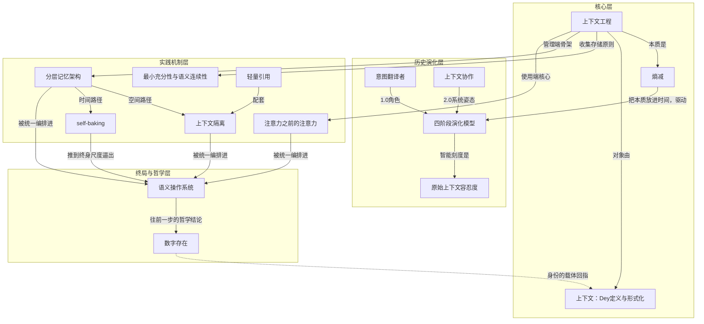

# 概念解析辞典

> 针对《Context Engineering 2.0: The Context of Context Engineering》（Qishuo Hua et al.，arXiv:2510.26493）的概念提取

## 一、核心概念

### 1. **上下文工程（context engineering）**

- **context**：论文把它定义为把原始上下文 C 与目标任务 T 映射为一个上下文处理函数；该函数由采集、存储管理、统一表示、多模态处理、self-baking、选择、跨系统共享、依反馈动态适配等可组合操作构成。作者刻意让定义不绑定任何具体技术或时代。全篇的基调也落在作者自题句上：

  > “A person is the sum of their contexts.”

- **费曼一下**：它不是“写好提示词”的高级说法，而是同一个长期存在的问题——如何把脑中的情境与目的，整理成机器接得住的形状。技术会换，问题不换。

### 2. **熵减（entropy reduction）**

- **context**：论文把熵减判为上下文工程的本质。人与人交流时，听者会用共有知识、情绪线索、情境感知主动补上没说出口的部分；机器目前缺这个能力，所以人必须替它预处理，把高熵的意图压缩成低熵表示。这份“力气”就是上下文工程的核心成本，并与机器智能水平成反比。

- **费曼一下**：跟人说话可以省略一半，跟机器说话不能。省略掉的那一半，得有人补上——现在补的是你。机器越笨，你补得越多。

### 3. **上下文（Dey 的定义与形式化）**

- **context**：作者回到 Dey 2001 年的经典定义——上下文是“任何可用于刻画一个实体所处情境的信息”，实体包括人、地点、对象，以及用户和应用本身。论文再把它形式化为：对每个实体有一个情境表征函数，上下文 C 是所有相关实体表征信息的并集。以 Gemini CLI 为例，相关实体包括用户、应用、终端环境、外部工具、记忆模块和后端模型服务。

- **费曼一下**：上下文不只是“聊天记录”。你是谁、你在哪个目录、手边有什么工具、系统怎么配置，全都算。论文认为今天把它窄化成对话历史，是把一个宽概念用窄了。

### 4. **四阶段演化模型（1.0 到 4.0）**

- **context**：按机器智能水平划分：1.0 原始计算（1990s–2020，结构化输入、刚性格式）；2.0 智能体（2020 至今，理解自然语言、容纳歧义）；3.0 人类级智能（能读社交线索与情绪）；4.0 超人智能（机器获得“上帝视角”，主客关系反转，主动为人构造上下文）。每一阶段的设计权衡与人机分工都不同。

- **费曼一下**：一把用“机器有多聪明”当刻度的尺子。刻度往右走，人要做的翻译工作就往下掉；到最右端，反过来是机器给人提供上下文。

### 5. **原始上下文容忍度（tolerance for raw context）**

- **context**：论文提出，在达到人类级智能之前，衡量系统智能的最好尺度是它对原始上下文的容忍度。1.0 只能消化 GPS 坐标、时间、预定义状态这类简单结构化信号；2.0 能直接摄入自由文本、图像、视频等接近人类自然表达的信号，无需重度预处理。

- **费曼一下**：判断一个系统聪明不聪明，看它能不能直接吃“生的”东西。要你切好摆盘才吃的是弱的，端上来乱七八糟也能吃的是强的。

### 6. **意图翻译者（intention translator）**

- **context**：1.0 时代设计者的角色定位。当时机器只能执行预定义程序逻辑，无法理解自然语言语义、无法推理、无法有效处理错误，设计者因此必须把复杂的人类意图转换成结构化、机器可读的格式。

  > “intention translators”

- **费曼一下**：那个年代做产品设计，本质是当人机之间的口译。今天模型能自己听懂一部分，但只要它听不懂的部分还在，这个岗位就还在，只是换了名字。

### 7. **上下文协作（context-cooperative）**

- **context**：1.0 的上下文感知系统跑“条件—动作”规则——“若位置是办公室，则手机静音”，它响应你在哪里，不响应你在做什么。2.0 系统则主动解释用户正在做什么并协作达成共同目标，例如分析你已写的段落与写作意图，建议下一节内容。作者据此提出术语升级：从 context-aware 走向 context-cooperative。

  > “context-cooperative”

- **费曼一下**：从“感应到你进屋就开灯”，变成“看你在写论文就帮你想下一段”。前者响应状态，后者参与工作。

### 8. **最小充分性与语义连续性原则（Minimal Sufficiency & Semantic Continuity）**

- **context**：论文给上下文收集与存储定的两条基本原则。最小充分性：只收集和存储支撑任务所必需的信息，上下文的价值在于充分，不在于体量。语义连续性：上下文的目的是维持意义的连续，而不只是数据的连续。

  > “Minimal Sufficiency” / “Semantic Continuity”

- **费曼一下**：不是存得越多越好，是存得刚好够用最好；也不是把每个字都留着就叫记得住，得让意思接得上。

### 9. **分层记忆架构**

- **context**：借 Karpathy 的操作系统类比：模型是 CPU，上下文窗口是 RAM；正如操作系统决定什么数据进 RAM，上下文工程决定什么信息进窗口。论文形式化定义了短期记忆、长期记忆与记忆迁移函数；真实系统常有工作记忆、情节缓冲、领域专用缓存等更多中间层。

- **费曼一下**：把记忆按“多久有用”和“多重要”分层放置。刚发生的放手边，重要的沉到仓库，其余的让它自然淡出。

### 10. **上下文隔离（context isolation）**

- **context**：绕开窗口限制并降低上下文污染的策略。Claude Code 的 subagent 系统是范例：每个 subagent 有独立上下文窗口、定制系统提示、受限工具权限；主系统委派任务后，subagent 独立运行而不污染主对话。切分可沿功能或层级维度，每个隔离单元只拿最小必要权限。

  > “context isolation”

- **费曼一下**：别让所有事挤在一个脑子里。把子任务交给一个有独立记事本、只带必要工具的专职助手，做完把结论交回来，过程不脏主线。

### 11. **self-baking（上下文自烘焙）**

- **context**：论文对上下文抽象的命名：agent 有选择地“消化”自己的上下文，转成持久的知识结构，对应人从情节记忆生成语义记忆、把重复动作沉淀为习惯的过程。论文判词：它是记忆“存储”与“学习”的分界——没有它，agent 只是回忆；有了它，agent 才在积累知识。

  > “self-baking”

- **费曼一下**：光把笔记堆着不叫学会，得定期把它嚼碎、变成自己的结论。agent 也一样：会翻记录只是检索，能把记录炼成知识才是长本事。

### 12. **轻量引用（lightweight references）**

- **context**：上下文隔离常用的配套手法：大块信息存外部，模型窗口里只暴露简短引用。HuggingFace 的 CodeAgent 把庞大输出放沙箱、需要时才取回；schema 化状态对象同理，文件与日志留在外部存储，只上浮选定字段。两者都在降低 token 开销的同时保留对完整上下文的可达性。

  > “lightweight references”

- **费曼一下**：桌上只放索引卡，资料放柜子里。要用哪份再去取，桌面不会被淹。

### 13. **注意力之前的注意力（attention before attention）**

- **context**：即使窗口变长，模型仍受限于输入 token 的质量。无关或嘈杂的记忆片段会干扰推理、抬高推理成本；经验观察是 AI 编程表现常在窗口填充度超过约 50% 后下降。有效的上下文选择因此必须先于模型自身的注意力发生。

  > “attention before attention”

- **费曼一下**：先决定什么值得被看，再让模型去看。模型自己的注意力只在进了窗口之后才起作用；喂多了和喂少了，都会变笨。

### 14. **语义操作系统（semantic operating system）**

- **context**：面对终身上下文工程的四道坎——存储瓶颈、处理退化、系统不稳定、评测困难——论文主张不能只靠扩大窗口或提高检索准确率解决，而需要一个能随时间生长的语义操作系统。它既是大规模高效的语义存储与记忆库，又具备类人的添加、修改、遗忘能力，并能自我解释推理链。

  > “semantic operating system”

- **费曼一下**：把“记忆”当成一个需要操作系统来管理的资源，而不是一个越买越大的硬盘。它得会整理、会忘、会解释自己为什么这么想。

### 15. **数字存在（Digital Presence）**

- **context**：论文收尾提出：马克思“人的本质是一切社会关系的总和”在以上下文为中心的 AI 时代获得新的计算含义。人越来越由自己生成的数字上下文定义——对话、决策、交互痕迹；这些上下文可以持续、演化，甚至在人离开后继续通过 AI 系统与世界互动。

  > “人的心智也许无法上传，但人的上下文可以。”

- **费曼一下**：你留下的不是一份档案，而是一团还在起作用的上下文。它构成别人（和机器）眼中的你，并且可能比你活得久。

## 二、概念架构图

