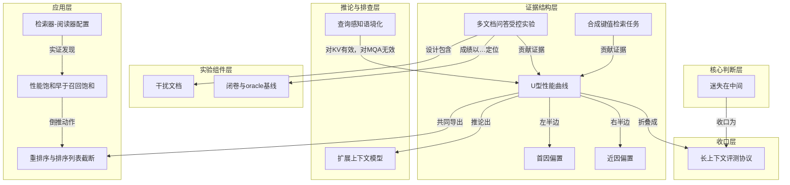

# 概念解析辞典

> 针对《经典论文《迷失在中间》：位置决定了模型能不能真的用上信息》（Nelson F. Liu et al.，arxiv.org）的概念提取

## 一、核心概念

### 1. **迷失在中间（lost in the middle）**

- **context**：论文标题所命名的现象。

  > 当模型必须访问和使用位于长输入上下文中间的信息时，性能显著劣化。

- **费曼一下**：把一份关键资料夹在一沓材料的正中间递给模型，它大概率会"看漏"。不是资料没进去，是进去了却没被用上。它是全文所有实验共同指向的结论——模型能接收长上下文，但稳健取用中间信息的能力并不存在。

### 2. **U型性能曲线（U-shaped performance curve）**

- **context**：把相关信息的位置作为横轴、任务准确率作为纵轴画出的曲线。

  > 相关信息出现在上下文最开头（首因偏置）或最末尾（近因偏置）时成绩最高，被迫使用中间位置的信息时成绩急剧劣化。

- **费曼一下**：成绩单画成一条曲线，开头一个高点，结尾一个高点，中间是个坑。位置变了能力就变了，这条曲线就是证据。它不止出现在多文档问答里，还在合成键值检索、基座模型、指令模型、GPT-4乃至超出训练长度的编码器-解码器模型上反复出现。

### 3. **首因偏置（primacy bias）**

- **context**：U型曲线的左半边，材料中特别说明其在模型规模上的出现条件。

  > 模型更善于使用出现在输入上下文最开头的相关信息。作者发现它只在足够大的模型上出现（Llama-2 的 13B 与 70B 有，7B 没有）。

- **费曼一下**：开头说的话最容易被记住。放在 prompt 最前面的材料享有一种天然优待。和近因偏置共同构成 U 型曲线的两端，但首因偏置相对更反直觉——过去研究只观察到近因偏置，因为模型规模不够大。

### 4. **近因偏置（recency bias）**

- **context**：U型曲线的右半边，与既有研究接续。

  > 模型更善于使用出现在输入上下文最末尾的相关信息。既有研究早就发现未做指令微调的模型偏向近期 token。

- **费曼一下**：刚说完的话记得最牢。挨着问题最近的那段材料，模型用得最顺手。本文把它放回位置效应的完整图景里，说明近因偏置不是唯一的位置效应，首因偏置在大模型上同样存在。

### 5. **多文档问答受控实验**

- **context**：本文的主任务设计，刻意对应商用检索增强生成场景。

  > 输入是一个问题加 k 篇文档，其中恰好一篇包含答案，其余 k−1 篇是不含答案的"干扰文档"。这套设定刻意模仿了商用生成式搜索与问答背后的检索增强生成（RAG）场景。

- **费曼一下**：一个只改一个变量的实验。同样的题、同样的资料，只挪动正确答案的位置，看分数怎么变——变了，就说明位置本身在起作用。它逼近真实 RAG 场景的推理型任务，是 U 型曲线的主要证据来源之一。

### 6. **干扰文档（distractor documents）**

- **context**：实验设计中决定任务真实难度的组成部分。

  > k−1 篇不含答案但与查询高度相关的维基百科片段，由 Contriever 检索得到，并按相关性递减排列。

- **费曼一下**：故意混进去的"看起来很像但没有答案"的材料。它模拟的是真实检索回来的结果——大部分沾边，只有一篇真的有用。干扰文档决定了任务的难度和真实感，稳健性检验中换用随机文档后曲线依然存在，说明中段塌陷不是"认不出哪篇相关"造成的。

### 7. **闭卷与 oracle 基线（closed-book and oracle baselines）**

- **context**：两条为成绩定位的参照线。

  > 闭卷指不给任何文档、只靠参数记忆作答；oracle 指只给那一篇含答案的文档。GPT-3.5-Turbo 的两条线分别是 56.1% 与 88.3%。

- **费曼一下**：一个是"不给资料能考多少分"，一个是"只给标准答案那页能考多少分"。中间位置的成绩跌破闭卷线，意味着给资料反而帮了倒忙——多喂的信息没被用上，还成了要额外推理的负担。

### 8. **合成键值检索任务（synthetic key-value retrieval task）**

- **context**：极简测试台，只为考察精确匹配能力。

  > 给一个字符串序列化的 JSON 对象，含 k 组键值对，键与值都是随机生成的 128 位 UUID，要求返回指定键对应的值。

- **费曼一下**：一道只需要"照抄"的题，不需要任何理解。刻意剥掉语义，是怕语言特征引入混淆变量。如果连这个都会在中间位置做错，问题就不在理解力，而在注意力的分布。它构成与多文档问答相对的另一路证据——检索端。

### 9. **扩展上下文模型（extended-context models）**

- **context**：把窗口撑大的版本，如 GPT-3.5-Turbo (16K)、Claude-1.3 (100K)。核心发现之一：

  > 当输入上下文同时能装进普通模型与其扩展版本的窗口时，两者的表现几乎相同。

- **费曼一下**：窗口变大了，读法没变。买了更大的桌子，不代表你能同时看清桌上所有文件。这是全文最反直觉的一条推论——窗口标称值与利用率是两个维度，扩大前者不自动改善后者。

### 10. **查询感知语境化（query-aware contextualization）**

- **context**：排查支线之一，改变查询的放置位置。

  > 把查询同时放在待处理数据的前面和后面，使 decoder-only 模型在编码材料时就能注意到查询。

- **费曼一下**：先告诉模型"你要找什么"，再给材料，最后再问一遍。它在合成键值检索上近乎完美，在多文档问答上几乎无效——这个不对称说明"检索"与"综合推理"是两种不同的困难，不是同一个毛病。

### 11. **检索器-阅读器配置（retriever-reader）**

- **context**：开放域问答的标准做法，用于外推到真实工程。

  > 检索系统取回前 k 篇文档，语言模型作为阅读器基于这些文档作答。

- **费曼一下**：一个负责找资料，一个负责答题。这个框架把受控实验的发现带到真实开放域问答，回答"是否值得给满窗口"的问题。

### 12. **性能饱和早于召回饱和（performance saturation before recall saturation）**

- **context**：案例研究的核心观察。

  > 阅读器准确率远在检索器召回率饱和之前就停止提升；从 20 篇加到 50 篇只带来约 1.5% 与约 1% 的边际收益，却显著抬高上下文长度、延迟与成本。

- **费曼一下**：多找回来的资料，模型已经吃不下了。继续加量只涨成本不涨分数，这就是该停手的信号。它是应用层因果链上的实证结论，直接否定"更多上下文总是更好"。

### 13. **重排序与排序列表截断（reranking and list truncation）**

- **context**：由 U 型曲线与饱和现象共同推出的两个改进方向。

  > 把相关信息推到更靠近上下文开头的位置（重排序），以及在合适的时候少取一些文档（截断）。

- **费曼一下**：既然模型偏爱开头，就把最相关的放最前面；既然多给没用，就别硬塞。这是把模型的偏好当成工程约束来用，是从核心判断倒推出来的动作。

### 14. **长上下文评测协议（long-context evaluation protocol）**

- **context**：论文提出的新验收口径。

  > 要声称一个模型能稳健使用长输入上下文，必须证明其性能受相关信息位置的影响极小，例如最好与最坏情况之间差异很小。

- **费曼一下**：别看它宣传能读多少万字，把关键信息挪到最难的位置，看它掉多少分。掉得少才叫真的读得进去。这条协议是所有证据的收口，把"能塞进去不等于用得上"变成行业可执行的标准。

## 二、概念架构图

