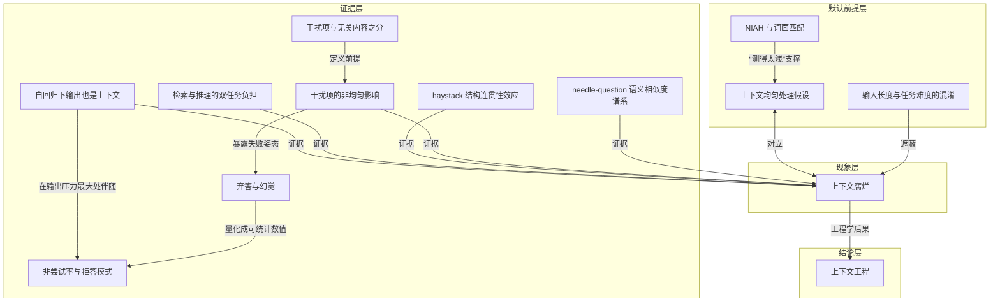

# 概念解析辞典

> 针对《Chroma 实测上下文腐烂：输入越长，模型并非均匀地可靠》（Chroma Research）的概念提取

## 一、核心概念

### 1. **上下文腐烂（Context Rot）**

- **context**：

  > 模型并不均匀地使用自己的上下文，性能随输入长度增长而越来越不可靠——而且衰减不是平滑的，是参差、非均匀的。

- **费曼一下**：上下文窗口不是一个均匀容器，塞进去多少都一样好用。它更像一块起雾的玻璃：整体还能看，但越往边上越模糊，而且哪里糊、糊到什么程度没有规律。百万 token 的窗口，不等于每个 token 都被同等对待。这是全文的中心现象。

### 2. **上下文均匀处理假设**

- **context**：

  > 第 10000 个 token 应该和第 100 个 token 一样可靠。

- **费曼一下**：这是所有“把资料全塞给模型让它自己挑”的做法背后那个没人验证过的前提。它假定注意力免费且无限均分。一旦这个前提被实测推翻，长上下文就从“能力”变成了“需要管理的资源”。

### 3. **大海捞针（NIAH）与词面匹配**

- **context**：

  > 把一句已知事实（needle）埋进一大段无关文本（haystack），再让模型找回来——本质是 direct lexical matching，而真实任务需要的是灵活的、语义导向的判断。

- **费曼一下**：这就像用“在一本书里找出你自己刚写下的那句话”来证明一个人读书能力强。找得到只说明会用 Ctrl+F。模型在 NIAH 上接近满分，直接催生了“长上下文基本已解决”的行业错觉，也正是这个基准在支撑着均匀处理假设。

### 4. **输入长度与任务难度的混淆**

- **context**：

  > 既有长上下文评测的通病是让「文本更长」和「题目更难」同时发生，因此无法归因。

- **费曼一下**：想知道跑道变长会不会让人跑慢，就不能同时给他加负重。多数长上下文评测恰恰同时做了两件事，所以测出来的“长文本能力差”里，混着“题目本来就更难”。把变量分干净，是这份报告最值钱的方法论动作。

### 5. **needle-question 语义相似度谱系**

- **context**：

  > 相似度越低的 needle/问题对，性能随输入长度衰减得越快。短输入下即便低相似度也答得不错——说明模型本来有这个能力，是长度把它磨没了。

- **费曼一下**：问题和答案共享的词越少，模型就越要靠“意会”。短文本里意会得动，文本一长就意会不动了。现实中的提问几乎从不精确复述答案里的措辞，所以真实场景恰好落在这条曲线衰减最快的那一段。

### 6. **干扰项与无关内容之分**

- **context**：

  > **干扰项（distractor）**：和 needle 主题相关，但并不真正回答问题。
  > **无关内容（irrelevant content）**：与 needle 和问题都无关。

- **费曼一下**：无关内容是背景噪音，干扰项是长得像正主的赝品。噪音大不了让你听不清，赝品会让你拿错东西。这个区分是干扰项实验能成立的前提，否则“加长上下文”和“加干扰”就搅在一起了。

### 7. **干扰项的非均匀影响**

- **context**：

  > 只要有一个干扰项，性能就低于基线；加到四个，退化进一步叠加。
  > 干扰项之间并不等价。在 arXiv haystack 配写作类 needle 的组合里，第 3 个干扰项造成的下滑明显大于其他几个。

- **费曼一下**：干扰不是可以按个数折算的量。某一条特别有欺骗性的假答案，杀伤力可能超过其余三条之和。这意味着做 RAG 或上下文组装时，“召回了几条不相干”是很粗的指标；真正该问的是“有没有召回那条最像的假货”。

### 8. **弃答与幻觉：两种失败姿态**

- **context**：

  > Claude 系幻觉率始终最低，Sonnet 4 和 Opus 4 尤其保守，不确定时倾向于明确声明「找不到答案」。GPT 系幻觉率最高，有干扰项时常常给出自信但错误的回答。

- **费曼一下**：同样是“答错了”，一个是老实说“没找到”，一个是编一个听起来很像的答案。跑分表上两者都是丢分，生产系统里代价天差地别：前者能兜底，后者会悄悄污染下游。保守在评测里被记为缺点，这暴露了评测口径与工程价值的错位。

### 9. **haystack 结构连贯性效应**

- **context**：

  > 结构连贯性一致地损害模型性能。18 个模型、各种 needle-haystack 配置下，打乱版的成绩一致地好于逻辑结构完整的版本。
  > 输入的结构模式可能影响注意力机制的施加方式，尤其在输入变长时；机制层面的解答需要机制可解释性研究。

- **费曼一下**：本以为给模型一份条理清楚的材料它会读得更好，实测反而是把句子打散更容易被找到。这几乎是对“整理好资料再喂给模型”这条工程直觉的一记闷棍。它也提醒我们：模型对上下文的敏感点，未必落在人类觉得重要的那些维度上。

### 10. **检索与推理的双任务负担**

- **context**：

  > 这逼模型在一次调用里同时做两件事——先在历史中找出相关片段（检索），再据此合成对当前问题有用的回答（推理）。
  > 所有模型在 focused 上都明显更好。
  > 开启 thinking mode 在两种输入上都有明显增益，但两种长度之间的落差依然存在。

- **费曼一下**：把完整历史塞进 prompt，不是省事而是加活。你没有帮模型准备好材料，只是把找材料的工作也外包给了它，而它并不擅长在一次前向里既当图书管理员又当分析师。RAG 的价值不在省 token，在于把两件事拆开。

### 11. **自回归下输出也是上下文**

- **context**：

  > 模型是自回归的——它自己生成的 token 也属于它的输入。所以还要问：当输出长度随输入一起涨，会怎样？
  > 一个把字符串重复 n 次的普通程序，每次都输出一样的结果；对这么平凡的任务，我们希望能把模型当成计算系统一样看待。

- **费曼一下**：一个把字符串重复 n 次的程序，每次输出都一模一样；模型做同样的事，却会在几千词后开始走样、少写、多写，甚至胡言乱语。这是把“模型是不是确定性计算装置”这个问题问到最裸的形态——答案是否定的，而且失效点比想象中来得早。

### 12. **非尝试率与拒答模式**

- **context**：

  > 194,480 次调用中有 69 次（0.035%）模型拒绝尝试，从结果中剔除并单独在附录报告。
  > 非尝试的判定与剔除很有讲究：空输出带停止原因、只做观察不动手、直接拒答、输出随机内容，均剔除并单独统计。

- **费曼一下**：模型不是只有“对”和“错”两种输出，还有第三种——它决定不玩了。而且拒答的理由常常与任务本身无关，比如版权顾虑、觉得输入里有笔误。做长上下文系统时，这类“非尝试”必须单独观测，否则它会被平均进准确率里，掩盖掉一整类可预测的失败。

### 13. **上下文工程（context engineering）**

- **context**：

  > 相关信息在不在上下文里并不是全部，更重要的是这些信息以什么方式呈现；连最强的模型都对此敏感，因此有效的上下文工程是可靠性的必要条件，而不是可选的优化技巧。

- **费曼一下**：过去我们把上下文当仓库——能装多少是能力问题；现在得把它当工位——摆放方式直接决定产出质量。同样一堆材料，是整个塞进去、筛过再塞、还是拆散了塞，结果可能差出一大截。这不是提示词技巧，是可靠性工程。

## 二、概念架构图

