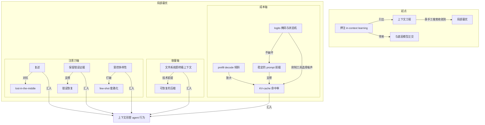

# 概念解析辞典

> 针对《Manus 的上下文工程实战：几轮重写换来的一组局部最优》（Yichao 'Peak' Ji / Manus）

## 一、核心概念

### 1. 上下文工程（context engineering）

- **context**：Manus 在项目起点的关键选择——不在开源底座上训练端到端 agentic 模型，而是"在前沿模型的 in-context learning 能力之上搭 agent"，也就是押注上下文工程。作者对这门工作的性质描述是：

  > "上下文工程并不优雅。它是一门实验科学：Manus 的 agent 框架被重写了四次，每次都是因为发现了更好的上下文塑造方式。"

- **费曼一下**：上下文工程的意思是把全部工程力气花在塑造递给模型的那段文字上，而不是改造模型本身。在本文里，它解决的核心问题是产品迭代速度：训模型的反馈循环太慢，而把 prompt 摆弄和架构试错当成实验来做，可以升级到以小时计。这个概念是全文的总纲，后面六条实践都是它的具体展开。

### 2. 押注 in-context learning

- **context**：这个选择的直接依据是作者的两次经历——BERT 时代必须先 fine-tune 才能迁移新任务，一轮迭代要几周；上一家创业公司从零训练模型做信息抽取，结果 GPT-3 与 Flan-T5 一出，自研模型"一夜之间变得无关紧要"。结论因此变得清晰：

  > "押注上下文工程，让产品与模型进步同向而非绑死。"

- **费曼一下**：in-context learning 指模型不用改参数，仅靠你给的上下文就能当场学会新任务。押注它意味着接受这个判断：教模型做新事不需要回炉重炼，只需要把话说清楚。这是全文一切实践的起点，决定了后来所有优化的方向都不是训练，而是上下文。

### 3. 与底层模型正交（orthogonal to the underlying models）

- **context**：押注上下文工程换来的结构性收益，作者用潮水与船表达：

  > "如果模型进步是上涨的潮水，Manus 要做船，而不是插在海底的柱子。"

- **费曼一下**：正交的意思是产品的价值建立在自己控制的上下文层，而不是某一代具体模型之上。模型变强，产品自然跟着涨；模型迭代，也不会推翻产品本身。这个概念划了一道生存边界：不该把地基打在会不断被替换的东西上。

### 4. 局部最优（local optima）

- **context**：作者对全文交付物的自我定位：

  > "全文交付的是这轮试错抵达的一组局部最优（local optima），而非普适真理：这些只是对 Manus 有效的模式。"

  > "None of what we've shared here is universal truth—but these are the patterns that worked for us."

- **费曼一下**：局部最优是承认六条实践只是 Manus 在自己的搜索路径上暂时收敛到的有效解，不是可以到处套用的定律。它的作用是为全文划边界——让读者知道这组经验有适用条件和范围，不是终极答案。这个概念之所以承重，是因为一旦拿掉，读者就会把这六条误读成可平移的真理。

### 5. KV-cache 命中率

- **context**：作者给出的成本轴总指标：

  > "如果只能选一个指标，作者认为 KV-cache 命中率是生产阶段 AI agent 最重要的单一指标，它直接决定延迟和成本。"

  > "以 Claude Sonnet 为例，缓存输入 token 是 0.30 USD/MTok，未缓存是 3 USD/MTok，相差 10 倍。"

- **费曼一下**：KV-cache 命中率衡量当前这次前向计算能在多大程度上复用之前已经算好的键值缓存。在 agent 场景里，上下文每步都在追加，输入和输出的体量极度不平衡，缓存命中与否直接决定首字延迟和推理费用。这个概念是全文成本轴的总闸门，后面好几条实践都从它倒推而来。

### 6. prefill 与 decode 的高度倾斜

- **context**：agent 与 chatbot 的结构性区别：

  > "Manus 的平均输入输出 token 比约为 100:1。"

- **费曼一下**：agent 每走一步要读大量历史记录，却只输出一个短小的 function call。这个 100:1 的比例解释了为什么缓存对 agent 比 chatbot 关键得多——算力几乎全部消耗在"读"上。它是一个机制性背景：正因为读占绝对大头，优化的重点才必须全部放在让读变便宜。

### 7. 稳定的 prompt 前缀

- **context**：KV-cache 命中的机械前提，脆弱到极致：

  > "哪怕一个 token 的差异，也会让该 token 之后的缓存全部失效。常见错误是在 system prompt 开头放时间戳，尤其是精确到秒的那种——它确实能让模型报出当前时间，同时也杀死了你的缓存命中率。"

- **费曼一下**：稳定前缀是命中缓存的前提条件。LLM 是自回归的，从第一个 token 起形成一条链条，任何一环变化都会让其后整段缓存作废。这个概念解决的痛点很实际：开发者常为了知道时间之类的小便利在 prompt 开头放会变的内容，结果成本翻十倍。它是成本轴上最便宜的戒律。

### 8. logits 掩码与 context-aware 状态机

- **context**：工具数量爆炸的后果是"那个全副武装的 agent 反而变笨了"。实验给出的规则：

  > "除非绝对必要，避免在迭代中途动态增删工具。"

  解法：

  > "不移除工具，而是在解码时对 token logits 做掩码，按当前上下文阻止或强制某些 action 被选中。"

  配套设计是统一 action 名称前缀，如 browser\_、shell\_，"无需有状态的 logits processor，就能约束 agent 在给定状态下只从某一组工具中选择"。

- **费曼一下**：logits 掩码解决的是 action space 膨胀带来的选择噪声，同时不破坏 KV-cache 依赖的前缀稳定。它的机制边界在于：工具全部保留在上下文里，列表不动，但解码时通过掩码控制哪些 token 可以生成——相当于抽屉全在，但只有某几个打得开。概念说明了第二条实践和第一条之间是延伸关系，不是并列关系。

### 9. 文件系统即终极上下文

- **context**：作者先给出一个逻辑风险判断：

  > "agent 按本性必须基于全部先前状态来预测下一个 action，而你无法可靠地预判哪条 observation 会在十步之后变得关键。从逻辑上说，任何不可逆压缩都带着风险。"

  因此采用的策略：

  > "Manus 把文件系统当作终极上下文：大小无限、天然持久，且可由 agent 自己直接操作。模型学会按需读写文件，把文件系统用作结构化的外部化记忆，而不只是存储。"

- **费曼一下**：文件系统从"放文件的地方"升格为 agent 的外部化记忆。它解决的是上下文窗口有限、agent 决策又需要完整先前状态这一根本矛盾：与其截断或压缩后丢失信息，不如让模型自己把状态写出去、需要时再读回来。这是全文容量轴的支点。

### 10. 可恢复的压缩（restorable compression）

- **context**：文件系统路径成立的技术前提：

  > "压缩策略始终被设计成可恢复的：网页内容可以从上下文里丢掉，只要 URL 还在；文档正文可以省略，只要沙箱里的路径还在。这让上下文长度缩短而信息不永久丢失。"

- **费曼一下**：可恢复的压缩划清了"暂时移出上下文"和"永久失去信息"的界限。它解决的是压缩必然损失信息这一威胁——只要上下文里保留一个可回查的指针，被移出的内容就只是暂时收纳，不是真正遗忘。这是文件系统策略之所以可行的机制基础。

### 11. 复述（recitation）与 lost-in-the-middle

- **context**：Manus 在复杂任务中持续创建并更新 todo.md 的现象，机制是：

  > "不断重写这份 todo 清单，等于把目标复述（recite）到上下文的末尾，把全局计划推入模型最近的注意力跨度，从而避开 'lost-in-the-middle' 问题、减少目标偏移。"

  > "本质上是用自然语言给模型自己的注意力加偏置，让它偏向任务目标。"

- **费曼一下**：复述就是顺着模型注意力偏向最近内容的机制，把容易在长上下文中间被遗忘的全局目标一遍遍推到末尾，相当于给注意力加权。它不需要架构改动，只用自然语言重复目标。这个概念位于注意力轴，和后面两条共享同一个深前提：模型的注意力和先验由上下文形状决定，所以可以被有意识地施力。

### 12. 保留错误证据与错误恢复

- **context**：作者最反直觉的一条建议。隐藏错误"感觉更安全、更可控，但有代价"：

  > "抹掉失败就是抹掉证据；没有证据，模型就无法适应。"

  机制解释：

  > "当模型看到一个失败的 action 以及随之而来的 observation 或 stack trace，它会隐式更新自己的内部信念，把先验从类似 action 上挪开，降低重复同一错误的概率。"

  由此给出的指标判断：

  > "错误恢复（error recovery）是真正 agentic 行为最清晰的指标之一。"

- **费曼一下**：保留错误意味着让失败的 action 和 observation 留在上下文里，作为更新模型先验的证据，而不是清场重试。它解决的是 agent 在非理想环境中的适应问题——没有失败样本就不会调整先验，下次还会犯同样的错。错误恢复之所以成为判据，是因为它暴露了模型能否根据环境反馈改变行为，而不是只在理想条件下跑通。

### 13. few-shot 套路化与受控多样性

- **context**：模型强模仿能力的反面。当上下文里堆满整齐划一的 action-observation 对：

  > "模型就会倾向于沿着那个模式继续，哪怕它已经不再是最优解。"

  解法：

  > "Manus 在 action 与 observation 中引入少量结构化变化——不同的序列化模板、替代性措辞、顺序或格式上的轻微噪声。这种受控的随机性打破模式、拨动模型的注意力。"

  一句可直接贴墙上的判断：

  > "上下文越统一，你的 agent 就越脆弱。"

- **费曼一下**：这个概念的要点是：模型会照抄上下文中的节奏，重复性任务中尤其容易漂移和幻觉。受控多样性就是在序列化和措辞里注入轻微变化，打破模式对模型的诱导。它和复述、保留错误共享深层机制——上下文形状决定注意力和先验，差别只在于何时顺着用、何时反向对抗。

## 二、概念架构图

